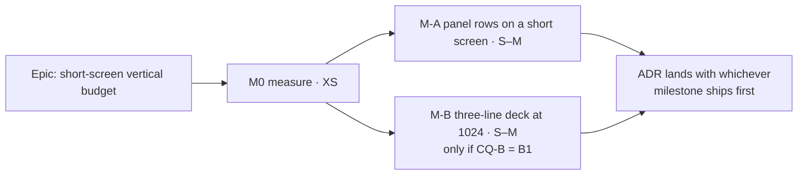

# Implementation Plan: Short screens — rows in the activities panel, and a three-line deck at 1024

- **Feature spec:** [feature-spec.md](feature-spec.md)
- **Status:** Draft — awaiting approval (CQ-A, CQ-B).
- **Owner:** web

## Breakdown

**Each milestone is one commit and one release. There is no flag** (ADR-0088 D1). M-A and M-B are
independent: either can ship first, and either can be dropped.

---

### Milestone M0: Measure before building (XS)

**Outcome:** the estimates in spec §3.2 and §3.3 become readings (ADR-0113, ADR-0142).

**Ships dark:** this milestone produces a record only.

- **Task M0-T1. Readings.**
  - **Steps:** use the throwaway harness pattern from `docs/specs/minimum-viewport/m4-measurement.md`.
    Take readings at 1024 × 600, 1024 × 640, 1024 × 768, 1280 × 800 and 1912 × 948 (fine), and at
    1024 × 600 and 1912 × 1114 (coarse). At each, read:
    - the workspace body height;
    - the panel's header, foot, body padding, table header and row height;
    - rows visible at `PANEL_MIN_OPEN`;
    - the widths of the three labels (`summary`, `calendar`, `export`), and the DO row's spare at
      1024 with them removed.
  - **Write up:** record the results in `m0-measurement.md` in this directory.
  - **Complexity:** XS · **Dependencies:** spec approved · **Risks:** container Chromium measures
    layout only. **Testing:** n/a.
- **Task M0-T2. Stop condition.**
  - **Steps:** if a reading moves a recommendation, for example if the label sum turns out to be under
    249 px, stop and re-ask CQ-A or CQ-B with the reading. Do not adjust the design silently.

---

### Milestone M-A: The activities panel shows rows on a short screen (S–M)

**Outcome:** #468 is closed. An expanded panel shows at least two rows at 1024 × 600 on either
pointer, and a panel at its minimum shows at least one row at any size.

**Entry point:** the existing **Expand activities panel** control in the foot row (ADR-0081). There
is no new control.

**Journey:** `apps/web/e2e-workspace-chrome/activities-panel-scroll.spec.ts` gains a 1024 × 600 case
on both pointers. It presses Expand and asserts:

- ≥ 2 rows are hit-testable;
- the diagram row is `hidden`;
- Collapse restores the canvas's bounding box exactly;
- axe is clean.

It also asserts SC-A3: the panel and canvas heights are unchanged at 1280 × 800.

#### Feature: short-body swap

> **Description:** spec §4, Part A, option A1 (or A2 if CQ-A says so; the task shape is the same).
> **Complexity:** S–M · **Dependencies:** M0.
> **Risks:**
>
> 1. **Suites that expand the panel at a short viewport and then use the canvas will break.** 18 e2e
>    files press Expand (`grep "Expand activities panel" apps/web/e2e*`). Derive which ones run below
>    the threshold: grep `setViewportSize|viewport:` across those files and their configs. Fix them
>    in the same commit and paste the list into the PR. The default viewport is 1280 × 720, where the
>    body (≈ 533 px) is above the threshold, so most are unaffected. Measure this; do not assume it.
> 2. **Focus loss on a live resize** if focus was in the canvas or a dock when the row hides. Mitigate
>    with ADR-0135 handoff to Collapse, covered by a unit test.
> 3. **A resizer that disappears** changes the panel's keyboard surface. It is not a primitive's
>    contract, but accessibility-reviewer reads it.
>
> **Testing requirements:**
>
> - unit tests (below);
> - `scripts/e2e-local.sh web:workspace-chrome`;
> - `web:workspace-fit`;
> - `web:narrow-shell` (single-pane unchanged);
> - every suite the risk-1 grep names.

##### Task M-A1 — Constants

- **Steps:**
  1. Re-derive `PANEL_MIN_OPEN` from M0, as the panel's fixed parts plus one row.
  2. Add `PANEL_USEFUL_MIN_FINE` and `PANEL_USEFUL_MIN_COARSE`, as the fixed parts plus three rows.
  3. Give each a docblock citing `m0-measurement.md`.
  4. Correct the `DOCK_MIN_HEIGHT` docblock (`use-activity-panel-prefs.ts:34-37`), which repeats
     #468's 658 px arithmetic.
- **Complexity:** XS.
- **Testing:** a unit test pins `PANEL_MIN_OPEN ≥` the sum of the measured parts, so it is red against
  140.

##### Task M-A2 — The swap

- **Steps:** in `plan-workspace-toolbar.tsx`'s wide branch:
  1. Derive `shortBody` from `bodyHeight` (`:688`), the reserve (`:805`) and the pointer. Reuse an
     existing `(pointer: coarse)` query if the shell already has one; that was not checked here.
  2. When `shortBody && !collapsed`:
     - put `hidden` on the canvas row (`:2361`);
     - give the panel box (`:2499`) `flex-1` instead of a fixed height;
     - do not render the resizer.
  3. Hand focus to Collapse when the row hides with focus inside it.
  4. Pass `diagramHidden` to `ActivityBottomPanel` for its one-line note. The copy is reviewed by
     ux-reviewer.
- **Complexity:** S.
- **Testing:** unit tests in jsdom, with `bodyHeight` stubbed through the ResizeObserver mock:
  - `bodyHeight` 0 gives today's layout;
  - a short body with the panel expanded hides the row and keeps the canvas mounted (same node);
  - a short body with the panel collapsed gives today's layout;
  - with a dock open, the reserve is `DOCK_MIN_HEIGHT`;
  - `panel.size` is never written;
  - focus moves to Collapse when the row hides with focus inside it.

##### Task M-A3 — Docs, register, release

- **Steps:**
  1. Close #468 into the closed-numbers ledger.
  2. Add a one-line rule to `docs/UX_STANDARDS.md`.
  3. File the ADR (spec §4 "ADR"), add its CLAUDE.md §16 line and flip this spec to Approved in the
     same commit (`check:spec-status` S3).
  4. Add a `@repo/web` minor changeset.
- **Testing:** `pnpm prepush`.

**Reviews before ship:** ux-reviewer (copy, swap behaviour), accessibility-reviewer (hidden row,
focus handoff, resizer absence) and component-reviewer.

---

### Milestone M-B: A three-line deck at 1024 (S–M) — only if CQ-B = B1

**Outcome:** at 1024–1279 px wide with a fine pointer, Summary, Settings… and Share & export are
icon-only and the deck is three lines (+44 px of diagram). They name themselves to pointer, keyboard
and touch. At 1280 and above, and on any coarse pointer, nothing changes except the Settings icon.

**Entry point:** the existing three deck controls. There is no new control.

**Journey:**

- `apps/web/e2e-workspace-fit/command-surface.spec.ts`:
  - at 1024, `LINES[1024].max` 4 → 3 and `DO_ROW_MAX_LINES(1024)` 2 → 1 (`:467`, `:471`);
  - assert the three controls are icon-only at 1024 fine and labelled at 1280 and on coarse 1024.
- `apps/web/e2e-toolbar/toolbar.spec.ts`:
  - hover, focus and long-press tooltips on the three at 1024 × 600, extending ADR-0117's existing
    journey;
  - opening Share & export and Summary closes the tooltip;
  - Escape closes each as before;
  - a canvas Escape consumer is still reached (ADR-0117's ladder interplay).

#### Feature: width-conditional labels in the deck

> **Description:** spec §4, Part B, B1.
> **Complexity:** S–M · **Dependencies:** M0 (label sum ≥ 249 px confirmed).
> **Risks:**
>
> 1. **ADR-0111 fires:** a tooltip on a menu-button and on a popover trigger changes what focus and
>    long-press do there. Run accessibility-reviewer and component-reviewer **before** merge.
> 2. **The margin is 18 px:** the next DO command reddens the 1024 gate. That is intended, and the
>    docblock says so.
> 3. **UX disagreement:** the earlier UX review advised against this (`docs/HANDOFF.md:34-35`).
>    ux-reviewer re-reviews with the icon change in place. If it still blocks, the milestone stops and
>    returns to the product owner.
> 4. **Tests that find these controls by visible text** rather than by role name would break at
>    1024. Grep for them; the accessible names do not change.
>
> **Testing requirements:**
>
> - unit tests for `Deck`, `ToolbarPopover` and `ExportMenuControl`;
> - `scripts/e2e-local.sh web:workspace-fit`;
> - `web:toolbar`;
> - `web:workspace-chrome`.

##### Task M-B1 — `iconOnly` through the deck

- **Steps:**
  1. Add `ToolbarItemRenderApi.iconOnly?: boolean` (`toolbar-registry.ts`).
  2. In `Deck.tsx`, add `ICON_ONLY_BELOW_XL` and a `useMediaQuery` on
     `(max-width: 79.98rem) and (pointer: fine)`.
  3. Feed `showLabel` and `iconOnly` from it, and update `min-w-*` (`:478`).
  4. Add a docblock that states the 249 / 267 arithmetic and why the set is closed.
- **Complexity:** S.
- **Testing:** `Deck.test.tsx` with `matchMedia` stubbed:
  - icon-only below 1280 on a fine pointer;
  - labelled at 1280 and above, and on a coarse pointer;
  - accessible names unchanged;
  - the roving walk unchanged.

##### Task M-B2 — Two triggers adopt the tooltip

- **Steps:**
  1. In `ToolbarPopover.tsx` and `ExportMenuControl` (`tsld-toolbar-items.tsx:1637`), make the
     compact branch use `useTooltip({ purpose: 'name-echo' })` in place of `title` (keep the
     disabled-reason precedence).
  2. Close the tooltip on open.
  3. Make a long-press open the tooltip, not the panel (ADR-0117).
- **Complexity:** S–M.
- **Testing:** unit tests for each clause, each verified red against the `title`-only version
  (ADR-0110).

##### Task M-B3 — Settings icon, docs, release

- **Steps:**
  1. Change `CalendarDays` to `Settings2` at `tsld-toolbar-items.tsx:3328`.
  2. Correct `m4-measurement.md:56-58`'s "Option … not taken" by linking to this spec.
  3. File the ADR line if M-A has not.
  4. Add a `@repo/web` minor changeset.
- **Testing:** `pnpm prepush`.

---

## Sequencing & slices

M0 → (M-A, M-B in either order). M-A is recommended first because it fixes a defect.

`main` stays releasable throughout:

- each milestone is a single commit and is reverted as one;
- neither milestone touches the API, so `scripts/e2e-local.sh api` is not owed.

## Definition of Done (per milestone)

Feature Completion Criteria in [`docs/PROCESS.md`](../../PROCESS.md):

- `pnpm prepush`;
- the e2e suites named above, run locally;
- the reviewers named above, **before** merge for M-B (ADR-0111);
- a changeset;
- before/after screenshots at 1024 × 600 attached to the PR (ADR-0081).

## Risks & assumptions (rollup)

| Risk                                                          | L / I   | Mitigation                                                    |
| ------------------------------------------------------------- | ------- | ------------------------------------------------------------- |
| M0 readings disagree with the estimates                       | med/low | M0-T2 stop condition; re-ask with numbers                     |
| A1 hides the diagram and a planner thinks it is gone          | low/med | Header note; Collapse returns it exactly; ux copy review      |
| Suites below the threshold break when M-A lands               | med/low | Derived by grep, fixed in the same commit                     |
| B1's tooltip on menu triggers regresses keyboard or Escape    | low/high | ADR-0111 review before merge; red-verified unit tests        |
| B1's 18 px margin is consumed by the next DO command          | high/low | The 1024 gate goes red, which is the intended alarm          |
| The UX reviewer still rejects B1                              | med/low | M-B stops; B0 is a clean outcome                              |
| Nobody on the product owner's own screens benefits            | certain/low | Stated in spec §0; the floor is the beneficiary            |
