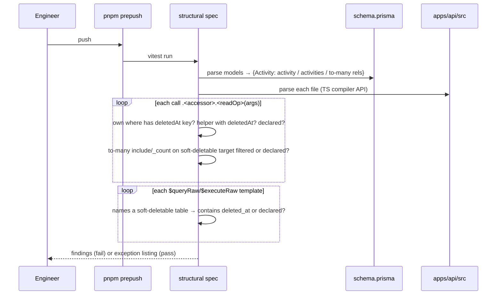

# Feature Spec: Make a forgotten soft-delete filter impossible to merge

- **Status:** Approved — by the product owner, 2026-10-03: option B (the computed gate), with Q2 answered **"check edits too"** — the first version checks writes (update, updateMany, delete, upsert on soft-deletable models) as well as reads; Q3 at its default (a real leak found by labelling gets its own fix PR, test and patch changeset).
- **Author(s):** feature-analyst (Product Owner / Solution Architect / Technical Lead hats)
- **Date:** 2026-10-03
- **Tracking issue / epic:** _(to be raised)_ — chosen by the product owner on 2026-10-03 from
  `docs/BACKLOG.md:430-434` ("Centralise the soft-delete filter")
- **Roadmap link:** platform hardening — drift control (ADR-0058 "replace vigilance with a check")
- **Related ADR(s):** **new ADR required** — outline in §4.9 (next free number at the time of
  writing is 0172; confirm when filing). Builds on ADR-0058 (computed gates), ADR-0076 (wrong claims
  are a defect class), ADR-0096 (deleted work expires; the bin and the sweep must see deleted rows),
  ADR-0110 (a gate is verified against the defect it names), ADR-0124 (find by structure, refuse by
  declaration), ADR-0136 (the roster is derived), ADR-0164 (a gate has no pass-with-findings
  outcome). Amends the `docs/DATABASE.md` "Soft deletes" standard, whose central claim is false today
  (§0, F1).

---

## 0. What was verified, and what was not

The backlog row's premise is "one forgotten `deletedAt: null` leaks deleted rows", and its proposed
remedy is a Prisma client extension. Both were checked against the tree on 2026-10-03 before any
design work (CLAUDE.md §19.11; "re-verify the problem statement, not only the design").

| #   | Claim checked                                                                                                   | Finding                                                                                                                                                                                                                                                                                                                                                                                                                                                                                                                                                                                                                                                                                                                                                                        | Evidence                                                                                                                                                                                                                                                                                                                                                                   |
| --- | --------------------------------------------------------------------------------------------------------------- | ------------------------------------------------------------------------------------------------------------------------------------------------------------------------------------------------------------------------------------------------------------------------------------------------------------------------------------------------------------------------------------------------------------------------------------------------------------------------------------------------------------------------------------------------------------------------------------------------------------------------------------------------------------------------------------------------------------------------------------------------------------------------------ | -------------------------------------------------------------------------------------------------------------------------------------------------------------------------------------------------------------------------------------------------------------------------------------------------------------------------------------------------------------------------- |
| F1  | "All queries exclude soft-deleted rows by default … a Prisma extension/base repository enforces this centrally" | **False.** There is no extension, no middleware and no base repository. `PrismaService` is a bare `extends PrismaClient` with a transaction timeout and nothing else. The standard describes a mechanism that was never built — an ADR-0076 wrong claim, in the document that tells people how to write queries.                                                                                                                                                                                                                                                                                                                                                                                                                                                               | `docs/DATABASE.md:96-99`; `apps/api/src/prisma/prisma.service.ts:39-55`; `rg '\$extends\|\$use\(' apps/api/src` → no matches (also recorded at `docs/BACKLOG.md:35`)                                                                                                                                                                                                       |
| F2  | How many models are soft-deletable                                                                              | **20 of 34 models** carry `deletedAt`: Organization, OrgMember, Invitation, Client, Project, Plan, Activity, ActivityDependency, CrossPlanDependency, Calendar, CalendarException, Baseline, BaselineActivity, BaselineAssignment, BaselineDependency, PlanShare, Resource, ResourceAssignment, ActivityStep, Note.                                                                                                                                                                                                                                                                                                                                                                                                                                                            | `apps/api/prisma/schema.prisma` lines 136, 232, 276, 714, 758, 958, 1463, 1639, 1738, 1880, 1944, 2178, 2404, 2505, 2618, 2794, 3246, 3401, 3495, 3582, matched against the `^model` lines                                                                                                                                                                                 |
| F3  | How filtering is done today                                                                                     | **Per repository, by convention.** 16 repositories carry a private `active(where)` helper returning `{ ...where, deletedAt: null }`. Two shared predicates exist for rules used across modules (`liveAssignmentWhere`, `pendingInvitationWhere`). Everywhere else the clause is written inline.                                                                                                                                                                                                                                                                                                                                                                                                                                                                                | `rg 'return \{ \.\.\.where, deletedAt: null \}' apps/api/src/modules` (16 hits, e.g. `client.repository.ts:32-34`); `invitations/invitation-predicates.ts:39-41`; `activities/live-assignment.ts`                                                                                                                                                                          |
| F4  | Volume                                                                                                          | `deletedAt` appears **347 times in 65 files** under `apps/api/src`; **about 239 in 40 non-test files** (comments included). Single-line read calls (`find*`/`count`/`aggregate`/`groupBy`) on the 20 models: **175 sites in 31 non-test files** — an undercount, since multi-line callees are missed.                                                                                                                                                                                                                                                                                                                                                                                                                                                                          | `rg -c deletedAt apps/api/src`; the read-call regex in §0 "Method"                                                                                                                                                                                                                                                                                                         |
| F5  | "The repository is the only Prisma consumer" (`docs/REFERENCE_FEATURE.md:99`)                                   | **Not how the code is.** Services read soft-deletable models directly: `activities.service.ts` (15 read sites), `baselines.service.ts` (3), `interchange.service.ts` (3), `resource-assignment.service.ts`, `activity-steps.service.ts`, `auth-context.service.ts`, plus `common/hierarchy/*` (≈26). So a per-repository convention **cannot be the enforcement point** — a check has to cover the whole tree.                                                                                                                                                                                                                                                                                                                                                                 | read-call regex counts per file                                                                                                                                                                                                                                                                                                                                            |
| F6  | Has a deleted row ever leaked?                                                                                  | **No recorded incident.** `docs/TECH_DEBT.md` and `docs/DECISIONS.md` hold no row where a user saw a deleted record. There is **one recorded near-miss**: the landing counted invitations without `deletedAt: null` while the list filtered it. It was **latent** — nothing in the application writes `invitations.deleted_at` — and it is **already fixed** by a shared predicate.                                                                                                                                                                                                                                                                                                                                                                                            | `docs/specs/organisation-landing-portfolio/feature-spec.md:44-55`; fix at `invitation-predicates.ts:6-11,39-41`, used at `overview.repository.ts:436-437`                                                                                                                                                                                                                  |
| F7  | The **opposite** failure — filtering a row that should have been read                                           | **Recorded, and it shipped.** A staff diagnostic carried `AND c.deleted_at IS NULL` on calendars and so excluded exactly the activities it existed to find. The repository it should have matched is **deliberately unfiltered**: `findHoursPerDayMinutes` must read a soft-deleted calendar's stored hours-per-day, or an activity's duration is silently reinterpreted.                                                                                                                                                                                                                                                                                                                                                                                                      | `staff/staff-diagnostics.registry.ts:193-201`; `calendars/calendar.repository.ts:370-391`                                                                                                                                                                                                                                                                                  |
| F8  | Reads that **must** see deleted rows                                                                            | At least **14 deliberate any-state or deleted-only reads** today: restore scoping (`client.repository.ts:123-131`, `project.repository.ts:82`, `plan.repository.ts:120-128`, `dependency.repository.ts:125-135`); engine inputs (`calendar.repository.ts:386`, `plan.repository.ts:110-118`); expiry candidates (`hierarchy-expiry.service.ts:168-207`); restore guards (`hierarchy-lifecycle.service.ts:686-721`); the bin (`recycle-bin.repository.ts:86-131`, raw SQL); "about to expire" (`overview.repository.ts:456`); batch-undo (`activities.service.ts:1546`). Plus **writes** that target deleted rows by design: restore (`hierarchy-lifecycle.service.ts:529-599`, `updateMany` by `deleteBatchId`) and the expiry's hard delete by ownership scope (ADR-0096 D5). | files and lines as listed                                                                                                                                                                                                                                                                                                                                                  |
| F9  | Unfiltered reads with **no written reason**                                                                     | A handful read a soft-deletable model with no `deletedAt` key and no comment: `baselines.service.ts:300-303` and `:351-354` (plan name for an audit label, plan already resolved active in the same transaction), `activities.service.ts:1089-1092` (parent name, parent already validated). **None is a leak** — each subject was resolved as active earlier in the same transaction — but nothing on the page says so, which is precisely what makes the next one hard to review.                                                                                                                                                                                                                                                                                            | files and lines as listed                                                                                                                                                                                                                                                                                                                                                  |
| F10 | Nested reads                                                                                                    | To-many includes mostly carry their own filter (`baseline.repository.ts:929`, `calendar.repository.ts:404,430`, `schedule.repository.ts:659,670`). **One `_count` does not**: `baseline.repository.ts:835` counts `activities` (BaselineActivity) with no filter. Latent, by invariant: snapshot rows are only ever stamped together with their baseline (`hierarchy-lifecycle.service.ts:119`, `baseline.repository.ts:890`).                                                                                                                                                                                                                                                                                                                                                 | files and lines as listed                                                                                                                                                                                                                                                                                                                                                  |
| F11 | Raw SQL                                                                                                         | 9 `$queryRaw` read sites and 7 `$executeRaw` write sites touch soft-deletable tables. **Every one is hand-filtered**, except the bin, which reads `deleted_at IS NOT NULL` on purpose.                                                                                                                                                                                                                                                                                                                                                                                                                                                                                                                                                                                         | `rg 'deleted_at' apps/api/src` — `overview.repository.ts:185-197,331-359`, `schedule.repository.ts:441,970,1068`, `activity.repository.ts:298,329,400`, `finish-milestone-rederive.service.ts:64,76`, `cross-plan-rederive.service.ts:107-126`, `progressed-visual-rederive.service.ts:89,101`, `staff-diagnostics.registry.ts` (many), `recycle-bin.repository.ts:93-129` |
| F12 | Children can be active under deleted parents                                                                    | **Yes, for two tables.** `resource_assignments` and `cross_plan_dependencies` are not stamped by the hierarchy cascade, so "the parent is deleted, therefore so is the child" is false for them.                                                                                                                                                                                                                                                                                                                                                                                                                                                                                                                                                                               | `docs/TECH_DEBT.md` #139                                                                                                                                                                                                                                                                                                                                                   |
| F13 | Prisma version and what it offers                                                                               | `@prisma/client` **6.19.3** is installed. Its runtime type declarations carry `$extends` and **no `$use`** — the old middleware API is not available, so an extension is the only in-process hook.                                                                                                                                                                                                                                                                                                                                                                                                                                                                                                                                                                             | `node_modules/.pnpm/@prisma+client@6.19.3_…/runtime/library.d.ts:4` (`$extends`), no `$use` match in that file; `apps/api/package.json:34,46` (`^6.2.1`)                                                                                                                                                                                                                   |

**Method.** `rg`-equivalent searches with the patterns quoted in the evidence column; the read-call
pattern was
`\.(organization|orgMember|…|note)\.(findMany|findFirst|findFirstOrThrow|findUnique|findUniqueOrThrow|count|aggregate|groupBy)\(`
over `apps/api/src`, test files excluded. It matches single-line callees only, so 175 is a floor.
The builder re-derives every count with the AST scanner in M2 rather than trusting these.

**Not verified here, and decision-bearing for option A only.** Two facts about Prisma extensions —
that a query extension sees only the **top-level** operation (not reads nested in `include`/`select`
or `_count`), and that `$queryRaw` bypasses query extensions — are Prisma's documented behaviour.
Prisma's documentation was unreachable from this environment and the minified runtime was not
read. They are used below only to explain why A is not recommended; if the product owner chooses A
anyway, M0 of that alternative is a spike test that proves both against Postgres and registers them in
`scripts/dependency-claims.json` (CLAUDE.md §19.11).

**What this means for the problem.** The backlog row is right that nothing _structural_ stops a
forgotten filter. It overstates the _measured_ risk: there is no recorded leak, the one near-miss was
latent and is fixed, and the only soft-delete defect that **did** ship was the opposite one — a
filter where the code deliberately wanted none. That second fact matters most for the design, because
a global filter makes that opposite mistake systematic.

## 1. Business understanding

### Problem

When something is deleted in SchedulePoint — a client, a plan, an activity, a link, a calendar — it
is not removed. It is marked with a "deleted at" time and kept, so that **Recently deleted** can bring
it back and so the retention sweep (ADR-0096) can remove it permanently later. Every screen and every
schedule calculation must therefore remember to skip marked rows. Today that is remembered by hand, in
about two hundred places, and the documentation says something enforces it centrally when nothing
does (§0 F1).

If one place forgets, a planner could see a deleted activity on a list, a deleted link could take part
in a schedule calculation, or a count on the landing page could disagree with the list it links to.
None of that has happened to a user (F6). It is a latent risk that grows with every new query.

The opposite mistake is also real and has already shipped once (F7): filtering out a deleted row that
a feature genuinely needs to read. Restore, the recycle bin, the retention sweep and the
duration-preserving calendar lookup all depend on seeing deleted rows.

### Users

- **Engineers and AI builders** writing or changing API queries — the direct users of the check.
- **Reviewers** (human and the specialised agents) — who today must spot a missing clause by reading.
- **Every organisation role indirectly** (Org Admin, Planner, Contributor, Viewer, External Guest):
  they are the people a leak would mislead. No role gains or loses a capability.

### Primary use cases

1. An engineer adds a query on a soft-deletable table and forgets the filter → the pre-push gate and
   CI fail, naming the file, line and model, before review.
2. An engineer deliberately reads deleted rows (restore, bin, sweep, an engine input) → they write a
   one-line declaration with the reason, and the gate accepts it; the reason is visible in review.
3. A reviewer wants to know every place that reads deleted data on purpose → one listing, produced by
   the gate.
4. Someone reads `docs/DATABASE.md` to learn the rule → it describes what actually enforces it.

### User journeys

There is no user-facing journey. The developer journey is in §4.3.

### Expected outcomes

- A forgotten filter on a soft-deletable model **cannot pass `pnpm prepush` or CI** (advisory at the
  merge boundary only because `main` is unprotected — CLAUDE.md §8).
- Every deliberate exception carries its reason **beside the code**.
- The documentation stops claiming a mechanism that does not exist.
- **No runtime behaviour changes**, so nothing a user sees and no schedule result can move.

### Success criteria

- The gate fails when `deletedAt: null` is deleted from any one real read site, and passes when it is
  restored (verified red, ADR-0110), for each of the three rule families (top-level read, nested
  to-many read/`_count`, raw SQL).
- The gate's soft-deletable model list is **derived from `schema.prisma`**, so adding `deletedAt` to a
  21st model brings it under the check with no edit to the gate (ADR-0136).
- All 79 API e2e specs (`apps/api/test/**/*.e2e-spec.ts`) and the full unit suite are green with **no
  test edits** other than the gate's own — the evidence that nothing at runtime moved.
- `docs/DATABASE.md` and `docs/REFERENCE_FEATURE.md` no longer contain the false claims at F1 and F5.

### Open questions

Critical questions are at the end of this document (§6). Assumed defaults for the rest:

- **Writes ARE in scope — resolved by the product owner, 2026-10-03 (§6 Q2: "check edits too").**
  `update`, `updateMany`, `upsert`, `delete`, `deleteMany`, and nested writes inside `data`, on any
  soft-deletable model, are checked by the same rule as reads (§4.11). `create`/`createMany` are not:
  a new row has no deleted state.
- **To-one relation reads are out of scope** (a parent `include`, a dependency's endpoints). Prisma
  cannot filter a to-one include, and the hierarchy cascade keeps parents and children consistent
  except for the two tables in F12, which are already debt row #139.
- **A genuine leak found during triage is fixed in its own PR** with a Supertest regression test and a
  changeset, not folded into the gate PR.

## 2. Functional requirements

### User stories & acceptance criteria

> **US-1** — As an engineer, I want a forgotten soft-delete filter to fail the build, so that a
> deleted row cannot reach a user because I missed one line.
>
> - **Given** a non-test file under `apps/api/src` **when** it calls `findMany`, `findFirst`,
>   `findFirstOrThrow`, `findUnique`, `findUniqueOrThrow`, `count`, `aggregate` or `groupBy` on any
>   soft-deletable model **and** the `where` neither states a `deletedAt` condition nor comes from a
>   recognised filtering helper nor carries a declaration **then** the gate fails and names the file,
>   line, model and operation.
> - **Given** the `where` contains a `deletedAt` key with **any** value (`null`, `{ not: null }`,
>   `{ lt: cutoff }`) **then** the call passes — the key is an explicit stance.
> - **Given** the `where` is (or spreads) the result of a helper whose own returned object contains a
>   `deletedAt` key (the 16 `active()` helpers, `pendingInvitationWhere`, `liveAssignmentWhere`) **then**
>   the call passes. Helpers are recognised **by structure, not by a list of names** (ADR-0124).
> - **Given** the call has no `where` at all **then** it fails unless declared.

> **US-2** — As an engineer, I want to read deleted rows on purpose without fighting the check, so that
> restore, the bin, the sweep and engine inputs keep working.
>
> - **Given** a call immediately preceded by a comment of the form
>   `// soft-delete: any-state — <reason>` (or `deleted-only`) with a non-empty reason **then** it passes.
> - **Given** a declaration with an empty reason **then** the gate fails ("a declaration names its
>   reason").
> - **Given** a declaration on a line that is not followed by a matching call **then** the gate fails
>   (a stale declaration is refused, so they cannot accumulate).

> **US-3** — As an engineer, I want nested reads checked too, so that an `include` or a `_count` cannot
> carry deleted children past the top-level filter.
>
> - **Given** an `include`/`select` of a **to-many** relation whose target model is soft-deletable
>   **when** it is `true` or an object without a `where` containing `deletedAt` **then** the gate fails
>   unless declared.
> - **Given** `_count: { select: { <rel>: true } }` on a soft-deletable to-many relation **then** the
>   same rule applies (today: `baseline.repository.ts:835`, F10).

> **US-4** — As an engineer, I want raw SQL against soft-deletable tables checked, so that the one
> path no in-process mechanism can see is still covered.
>
> - **Given** a `$queryRaw`/`$executeRaw` tagged template whose text names a soft-deletable **table**
>   (derived from the model's `@@map`) **when** the template text contains no `deleted_at` **then** the
>   gate fails unless declared.
> - `$queryRawUnsafe`/`$executeRawUnsafe` with a soft-deletable table name in reach **fail
>   unconditionally** (the SQL cannot be read statically).

> **US-5** — As a reviewer, I want one listing of every deliberate exception, so that I can audit what
> reads deleted data without searching.
>
> - **Given** a gate run **then** its output lists each declaration (file, line, model, reason) and the
>   count, and a pinned test asserts the count is ≥ 1 so a broken scanner cannot pass by finding
>   nothing (ADR-0093 positive-case pin).

> **US-7** — As an engineer, I want an edit or delete that could land on a deleted row to fail the
> build, so that a deleted record cannot be silently changed, re-stamped or removed by accident.
>
> - **Given** a call to `update`, `updateMany`, `upsert`, `delete` or `deleteMany` on a soft-deletable
>   model **when** its `where` states no `deletedAt` stance (same tests as US-1) and it is not declared
>   **then** the gate fails, naming file, line, model and operation.
> - **Given** a nested write (`update`/`updateMany`/`upsert`/`delete`/`deleteMany`/`set`/`disconnect`
>   inside `data`) on a relation whose target is soft-deletable **then** it fails unless its own
>   `where` states a stance or it is declared.
> - **Given** a declaration in the docblock of the **enclosing function** **then** it covers every
>   write of the declared kind inside that function, and the listing reports how many calls it covers
>   (so restore and the expiry need one label each, not seventeen).

> **US-6** — As anyone reading the standards, I want `docs/DATABASE.md` to describe what really
> enforces the rule.
>
> - **Given** the docs after M1 **then** "Soft deletes" says: filtered per query, by a repository
>   helper or an explicit clause; enforced by the named gate for reads **and writes**; exceptions
>   declared in source; raw SQL in scope; creates and to-one reads not checked, with the reason.

### Workflows

1. Engineer writes a query → runs `pnpm prepush` → the gate (an ordinary Vitest structural spec, run
   by `pnpm test`) reports any undeclared unfiltered read.
2. Engineer either adds the filter (usually by calling the repository's `active()`), or declares the
   exception with a reason.
3. CI runs the same spec in the `quality` job; the PR shows the result.

### Edge cases

| Case                                                                                          | Behaviour                                                                                                                                                                                                      |
| --------------------------------------------------------------------------------------------- | -------------------------------------------------------------------------------------------------------------------------------------------------------------------------------------------------------------- |
| `where` is a variable (`const where = …; findMany({ where })`)                                | Resolved to its initialiser **within the same function**. If it cannot be resolved (a parameter, a value from another file) the call **fails unless declared** — the gate errs to a false alarm, never a miss. |
| `where` built by a ternary or spread of several objects                                       | Passes if **every branch** carries a stance (key, helper, or declaration).                                                                                                                                     |
| Relation filter only (`activity: { planId, deletedAt: null }`) with no own `deletedAt`        | **Fails** — the queried model's own column is the subject. Today's sites already carry both (`schedule.repository.ts:599-602` uses `liveAssignmentWhere`).                                                     |
| A model gains `deletedAt` in a migration                                                      | Picked up from `schema.prisma` automatically; any of its existing reads that lack a stance fail in the same PR — which is the moment to decide.                                                                |
| A model is accessed under a different receiver name (`db.`, `tx.`, `client.`, `this.prisma.`) | Receiver-agnostic: the check keys on `.<accessor>.<operation>(`.                                                                                                                                               |
| Test files, the conformance harness                                                           | Excluded (`*.spec.ts`, `*.e2e-spec.ts`, `src/modules/schedule/conformance/**`) — the same exclusions as `tsconfig.build.json:16-23`.                                                                           |
| The gate's own fixtures name `deletedAt`                                                      | Fixtures are synthetic strings fed to the scanner function, not files in the scanned tree (the pattern `staff-boundary.structural.spec.ts:238-253` already uses).                                              |

### Permissions

No change. No route, guard, permission or organisation scope is touched. The gate is a test file and
the annotations are comments. RBAC (ADR-0012), share links (ADR-0051) and the pen (ADR-0028) are
unaffected: **no new write exists, structural or otherwise.**

### Validation rules

The declaration grammar is the only "input":
`// soft-delete: (any-state|deleted-only) — <reason of at least 10 characters>`, on the line(s)
immediately above the call (a docblock above the method also counts if it contains the same token, so
existing explanatory docblocks such as `calendar.repository.ts:370-380` can carry it).

### Error scenarios

| Scenario                                              | Detection   | Developer-facing result                                                            | Status       |
| ----------------------------------------------------- | ----------- | ---------------------------------------------------------------------------------- | ------------ |
| Unfiltered, undeclared read                           | gate        | `file:line — <model>.<op> has no deletedAt stance (filter it, or declare why not)` | test failure |
| Declaration without a reason                          | gate        | `file:line — soft-delete declaration names no reason`                              | test failure |
| Stale declaration (no call follows)                   | gate        | `file:line — declaration does not precede a read on a soft-deletable model`        | test failure |
| Scanner finds zero read sites                         | pinned case | `found no reads to check — the scanner is broken, not the tree clean`              | test failure |
| Raw SQL names a soft-deletable table, no `deleted_at` | gate        | `file:line — raw SQL on <table> states no deleted_at stance`                       | test failure |

## 3. Technical analysis

| Area           | Impact   | Notes                                                                                                                                                                                                                                                |
| -------------- | -------- | ---------------------------------------------------------------------------------------------------------------------------------------------------------------------------------------------------------------------------------------------------- |
| Frontend       | none     | Nothing in `apps/web` changes.                                                                                                                                                                                                                       |
| Backend        | low      | One new structural spec (scanner included, test-only). Comment-only annotations in roughly 10–20 source files. **No runtime code changes** unless triage finds a real leak, which is then its own PR.                                                |
| Database       | **none** | **No schema change, no migration.** (Option C would need one — see §4.6 — and would go to **database-architect**; it is not recommended.)                                                                                                            |
| API            | none     | No endpoint, DTO, status code or OpenAPI change.                                                                                                                                                                                                     |
| Security       | low (+)  | Defence in depth against a confidentiality/integrity slip (a deleted row shown or computed on). No new attack surface; nothing reachable at runtime.                                                                                                 |
| Performance    | none     | No query changes (except one filtered `_count`, plan M4-T1). The gate parses ~40–50 source files with the TypeScript compiler API; expected seconds, measured in M2 and recorded.                                                                    |
| Infrastructure | none     | Runs inside the existing `pnpm test` / CI `quality` job. **No new dependency**: `typescript` is already an `apps/api` devDependency (`apps/api/package.json:68`). This is the first use of the compiler API in a gate here — a stated choice (§4.7). |
| Observability  | none     | —                                                                                                                                                                                                                                                    |
| Testing        | med      | Scanner unit tests on synthetic sources (positive and negative per rule); verified-red runs against the real tree; full API e2e + unit suites unchanged as the no-regression proof.                                                                  |

**Recalc parity gate.** `computeSchedule` is untouched and its inputs are untouched: the gate is a
`*.spec.ts` file, excluded from the build (`apps/api/tsconfig.build.json:20`), and annotations are
comments. Byte-identical by construction. (This is the property option A cannot offer — §4.5.)

**Flag.** None. Per ADR-0088 D1 a `VITE_*` flag cannot be switched off by an operator, and there is no
user surface to flag in any case. The rollback is a commit boundary.

**Entry point (ADR-0081).** _Ships dark_ — a developer-facing gate with no user surface. No Playwright
journey is owed because no milestone claims user-facing capability.

**ADR-0105 trigger.** This adds a **shared gate**, which is why a full spec is required rather than a
backlog row.

### Dependencies

- None blocking. Interacts with `docs/TECH_DEBT.md` #139 (two child tables not cascade-stamped): the
  gate does not fix it and does not depend on it; it is named in the gate's blind-spot docblock.
- Coordination: the Prisma 7 migration (`docs/TECH_DEBT.md` #11) does not affect a source-text gate;
  it **would** affect option A (driver adapters change client construction).

## 4. Solution design

### 4.1 Architecture overview (recommended: option B)

```mermaid
flowchart LR
  subgraph Source["apps/api/src (non-test .ts)"]
    R[Repositories<br/>active() helpers]
    S[Services with direct reads]
    H[common/hierarchy<br/>restore + expiry]
    Q[Raw SQL sites]
  end
  Schema[prisma/schema.prisma] -->|derive: models with deletedAt,<br/>accessor names, @@map tables,<br/>to-many relations| Scanner
  Source -->|TypeScript AST| Scanner[soft-delete scanner<br/>test-only module]
  Scanner --> Gate[soft-delete-filter.structural.spec.ts]
  Gate -->|pnpm test / prepush / CI quality| Verdict{every read has a stance?}
  Verdict -->|yes| Pass[green + exception listing]
  Verdict -->|no| Fail[file:line model.op — filter or declare]
  Runtime[(Running API)] -.->|unchanged| Postgres[(PostgreSQL)]
```

### 4.2 Data flow (the gate)



### 4.3 User (developer) flow

```mermaid
flowchart TD
  A[Write a query on a soft-deletable model] --> B{Should deleted rows be excluded?}
  B -->|yes — the normal case| C[Use the repository's active() helper<br/>or write deletedAt: null]
  B -->|no — restore, bin, sweep, engine input| D[Write deletedAt: { not: null } / { lt } if that is the meaning<br/>or declare: // soft-delete: any-state — reason]
  C --> E[pnpm prepush]
  D --> E
  E --> F{gate green?}
  F -->|yes| G[Open PR — exception listing visible to reviewer]
  F -->|no| H[Gate names file:line model.op] --> B
```

### 4.4 Database, API and component changes

- **Database:** none. No model, column, index, constraint or migration.
- **API:** none.
- **Components:** none.

### 4.5 The options compared

Three approaches were required to be compared; a fourth sub-variant of B is noted.

**(A) A global Prisma client extension with explicit opt-out.** `PrismaService` would build
`new PrismaClient().$extends({ query: { $allModels: { findMany…, count… } } })` injecting
`deletedAt: null` into the top-level `where` of the 20 models when the caller has not set a
`deletedAt` key, and expose an unfiltered handle (`prisma.withDeleted`) for the opt-out paths.

- **What it changes at runtime.** Only the reads that currently have **no** `deletedAt` key — which,
  by F8/F9, are almost exactly the reads that were deliberately left unfiltered. `findByIdInOrg`
  (used to scope a restore, `client.repository.ts:123-131` and siblings) would stop finding the
  deleted row, so **restore would 404**. `findHoursPerDayMinutes` (`calendar.repository.ts:386`)
  would drop a soft-deleted calendar and **reinterpret activity durations** — a recalc-parity break,
  the F7 defect made systematic. Every such site must be migrated to the opt-out handle **in the same
  release** as the extension, and a missed one fails at runtime, not at build time.
- **Shape cost.** `PrismaService` is a class that `extends PrismaClient` (`prisma.service.ts:39`);
  `$extends` returns a client rather than mutating one (`library.d.ts:4`), so the Nest provider
  becomes a factory and the injected type changes. `Prisma.TransactionClient` is written **212 times
  in 45 files** as the type of the `db`/`tx` parameter; it names the **un**-extended client, so the
  types would no longer say which handle is filtered. Prisma 7 (`TECH_DEBT.md` #11) changes client
  construction again.
- **What it cannot catch.** Raw SQL (16 sites, F11); reads nested in `include`/`select`/`_count`
  (F10); relation filters inside a `where`; `groupBy`/`aggregate` unless each is wrapped; and — the
  reason it is less safe than it looks — **a site that sets `deletedAt` to the wrong value**, since an
  explicit key is respected. Unique constraints: unaffected (they are partial, `DATABASE.md:100-101`).
- **The query path becomes less obvious**, as the backlog row itself warns: a reader of
  `db.activity.findMany({ where: { planId } })` can no longer tell from the line what it returns.

**(B) Keep explicit per-query filters; add a computed gate that refuses a read with no stated stance.**
(Recommended — design in §4.1–4.3.)

- **What it changes at runtime.** Nothing. The 175+ read sites keep their current, readable form.
- **What it catches that A cannot.** Raw SQL that names a soft-deletable table; to-many nested reads
  and `_count`; a new model gaining `deletedAt` (derived roster); a **missing reason** on a deliberate
  exception. It also makes the F9 sites say why they are unfiltered.
- **What it cannot catch.** (1) A **wrong** stance — `deletedAt: { not: null }` where `null` was meant
  passes, exactly as under A. (2) A `where` assembled in another function and passed in — refused
  unless declared, so this is a **false alarm, never a miss**; the cost is a declaration. (3) Creates
  (`create*`) that connect a new row to a **deleted parent** — guarded today by the active read that
  resolves the parent; not checked (§4.11). (4) To-one relation includes — out of scope;
  F12/#139 is the known exception. (5) `$queryRawUnsafe` with a computed table name — refused outright
  rather than analysed. (6) Whether a declaration's **reason is true** — a reviewer's job; the gate
  only makes it visible. (7) Code outside `apps/api/src` (the seed CLI talks to the REST API, not
  Prisma, so nothing is lost today).
- **Sub-variant considered: a custom ESLint rule.** Rejected for now: it needs a local ESLint plugin
  package and type-aware linting the repository does not run; the repository's established gate tier
  for exactly this kind of rule is a Vitest structural spec (36 exist, e.g.
  `common/query/library-filters.structural.spec.ts`), which already runs in `prepush` and CI.
- **Sub-variant considered: a SQL-level observer in the e2e tier** (Prisma `query` log events
  inspected for `deleted_at` on every statement touching a soft-deletable table). It sees what
  actually reaches Postgres, including nested reads, but only for paths the 79 e2e specs happen to
  drive, and judging SQL text for "has the predicate on the right alias" is fragile. Kept as a
  **trigger-based follow-up** (§4.8), not built.

**(C) Database-level enforcement: views or row-level security.**

- **Views** (`CREATE VIEW live_activities AS … WHERE deleted_at IS NULL`, mapped as Prisma `view`
  models) double the model surface, need a Prisma preview feature (`previewFeatures = []` today,
  `schema.prisma:12`), and writes must still go to base tables. Not pursued further.
- **Row-level security** (`USING (deleted_at IS NULL)` for the application role, with a
  session-variable opt-out set by `SET LOCAL` inside a transaction) is the **only option that catches
  everything** — raw SQL, nested reads, counts, aggregates. Its costs are serious here:
  - A policy's `USING` applies to `UPDATE` targets and, without a separate `WITH CHECK`, also checks
    the **new** row — so the soft-delete **stamp itself** (`UPDATE … SET deleted_at = now()`) would be
    rejected unless every stamping path opts out. Restore (`updateMany` by `deleteBatchId`) and the
    ADR-0096 expiry would also see zero rows without the opt-out. Every opt-out must run inside a
    transaction for `SET LOCAL` to be safe on a pooled connection.
  - RLS does not apply to a table's **owner** unless `FORCE ROW LEVEL SECURITY` is set, and under
    ADR-0018 the container migrates as the application role — so whether the policy binds at all
    depends on role ownership that would need redesigning.
  - Foreign-key checks bypass RLS, and a non-partial unique violation would reveal a hidden row's
    existence. (Today's name uniques are partial, so this is latent.)
  - The deliberate unfiltered reads (F7/F8) all need the opt-out, so the F7 failure becomes a
    **runtime** failure discovered in production rather than a build failure.
  - It is a **schema change** (policies, possibly roles and a migration) — **to be designed by
    database-architect** if chosen (CLAUDE.md §19.3). The repository does have one precedent for
    database-level enforcement (the `audit_events` `ENABLE ALWAYS` triggers, ADR-0072/0085), so this is
    not foreign — but there the rule has **no** legitimate exception, and here there are at least 14.

### 4.6 What each option cannot catch — summary

| Case                                               | A: extension                  | B: gate (recommended)       | C: RLS                                   |
| -------------------------------------------------- | ----------------------------- | --------------------------- | ---------------------------------------- |
| New top-level read forgets the filter              | caught (at runtime, silently) | **caught at build**         | caught (at runtime)                      |
| Deliberate any-state read (restore, hours-per-day) | **broken unless migrated**    | declared, reason visible    | **broken unless opted out**              |
| Raw SQL (`$queryRaw`)                              | **not caught**                | caught (template text)      | caught                                   |
| Nested to-many `include` / `_count`                | **not caught**                | caught                      | caught                                   |
| To-one parent include                              | not caught                    | not caught (out of scope)   | caught                                   |
| Wrong stance (`{ not: null }` meant `null`)        | not caught                    | not caught                  | not caught for opted-out paths           |
| Writes on deleted rows                             | only if writes are wrapped    | **caught at build** (§4.11) | caught — and **blocks the stamp itself** |
| Unique constraints                                 | n/a (partial uniques)         | n/a                         | non-partial uniques reveal hidden rows   |
| `computeSchedule` byte-identical                   | **at risk** (hours-per-day)   | **yes, by construction**    | at risk until every engine read opts out |
| Schema change                                      | no                            | **no**                      | **yes — database-architect**             |

### 4.7 Implementation approach (B)

- **One file:** `apps/api/src/common/query/soft-delete-filter.structural.spec.ts`, beside
  `library-filters.structural.spec.ts`, holding both the scanner functions and the assertions — the
  shape `library-filters.structural.spec.ts:29-75` already uses. Keeping the scanner inside a
  `*.spec.ts` file means `nest build` never compiles it (`tsconfig.build.json:20`) and the production
  image, which prunes devDependencies, never references `typescript`. If it outgrows one file, a
  sibling `*.spec.ts`-excluded location is chosen without widening `tsconfig.build.json`.
- **Roster derived from `schema.prisma`** (ADR-0136): model blocks containing a `deletedAt` field →
  accessor (`lowerCamel(model)`), table (`@@map`), and each list-typed relation field → its target
  model. A pinned case asserts the roster has 20 entries **today** and that it is non-empty, with the
  number in an assertion message rather than prose (ADR-0076).
- **AST, not regex.** `where` clauses span lines and are composed (`this.active({...})`, spreads,
  ternaries); the TypeScript compiler API (already installed) reads them structurally. Regex gates in
  this repository have matched their own prose (`library-filters.structural.spec.ts:23-26`); comments
  are not code to an AST.
- **Helpers recognised by structure** (ADR-0124): a function or method whose returned object literal
  contains a `deletedAt` key (directly or by spreading another such helper) is a filtering helper. No
  hand-kept list of names.
- **Declarations refused by grammar** (ADR-0124): exact token, non-empty reason, must precede a
  matching call.
- **Verified red** (ADR-0110), recorded in the PR: remove `deletedAt: null` from one real top-level
  site, one nested include, and one raw-SQL site in turn; each must fail with the expected message.
- **Pinned positive cases** (ADR-0093): synthetic sources for each rule — passing and failing — so a
  scanner that silently matches nothing fails.

### 4.8 Explicitly deferred, with triggers

| Deferred                               | Revisit when                                                                                                                                           |
| -------------------------------------- | ------------------------------------------------------------------------------------------------------------------------------------------------------ |
| Creates connecting to a deleted parent | a defect is found where a new row was attached to a deleted parent, or a create path appears with no active read of its parent in the same transaction |
| SQL-level e2e observer                 | the gate's declared-exception count exceeds ~30, or a leak is found that the gate structurally could not see                                           |
| Database-level RLS (option C)          | a confirmed user-visible leak of a deleted row, or a second, independent consumer of the database appears                                              |
| To-one include checks                  | `TECH_DEBT.md` #139 is resolved, after which "active child ⇒ active parent" holds for every table and a to-one check becomes meaningful                |

### 4.9 Draft ADR outline (to be filed in M1-T1)

**ADR-0172 (proposed number) — "A soft-delete filter is stated at the query, and the build refuses a
read that states none"**

- **Status:** Proposed → Accepted on approval of this spec.
- **Context.** `docs/DATABASE.md:96-99` promised central enforcement that was never built (F1).
  Filtering is per query across 20 models, ~175+ read sites, 40 files, and services read directly as
  well as repositories (F3–F5). No recorded leak; one latent near-miss, fixed (F6). The one shipped
  soft-delete defect was an **over**-filter on a read that must see deleted rows (F7). At least 14
  reads and the restore/expiry writes need deleted rows (F8). Prisma 6.19 offers only `$extends`
  (F13).
- **Decision.** D1: soft-delete filtering stays explicit at each query, through a repository's
  `active()` helper, a shared predicate, or an inline `deletedAt` key. D2: a structural gate refuses
  any read **or write** (`update`, `updateMany`, `upsert`, `delete`, `deleteMany`, nested writes) on a
  soft-deletable model — top-level, to-many nested, `_count`, or raw SQL — that states no `deletedAt`
  stance and carries no declaration. D3: deliberate exceptions are declared in source with a reason,
  using one grammar, per call or per enclosing function. D4: the soft-deletable roster is derived from
  `schema.prisma`. D5: creates and to-one reads are outside the gate, with triggers. D6:
  `docs/DATABASE.md` "Soft deletes" is rewritten to describe D1–D5.
- **Options considered.** A (client extension), C (views / RLS), B-ESLint, B-SQL-observer — reasons
  as in §4.5.
- **Consequences.** + No runtime change; recalc parity untouched; exceptions visible; raw SQL and
  nested reads covered; edits and deletes covered. − A wrong stance still passes; a cross-function
  `where` costs a declaration; creates unchecked; first use of the TypeScript compiler API in a gate (maintenance of a small
  scanner). Advisory at the merge boundary (unprotected `main`, CLAUDE.md §8), like every gate here.
- **Supersedes / amends.** Amends the `docs/DATABASE.md` standard; closes `docs/BACKLOG.md:430-434`.

### 4.10 Alternatives rejected in one line each

- **Do nothing** — the false standard (F1) still has to be corrected; that part is not optional.
- **Base repository class** — services read directly (F5), so a base class covers only the
  repositories that remember to extend it; same weakness as today, one level up.
- **Rename every active read through one generic helper** — churn across 40 files to buy what the
  gate gives without touching runtime code.

### 4.11 The write side (added on approval — product-owner answer to Q2)

**Evidence.** 112 single-line write calls (`update`/`updateMany`/`delete`/`deleteMany`/`upsert`) on the
20 models in 21 non-test files (same regex method as §0). **Most already state a stance**: every
optimistic edit goes through `this.active({ id, version })` (e.g. `client.repository.ts:191-193`,
`activity.repository.ts:177-179`), and every soft-delete stamp is guarded on `deletedAt: null` for
idempotence (e.g. `resource.repository.ts:311-313`, `calendar.repository.ts:670`). **No nested write**
on a soft-deletable relation exists today (`rg` for `update|updateMany|delete|deleteMany|upsert|set|
disconnect` keys inside `data` finds only `plan-lock.repository.ts:73`, and `PlanLock` has no
`deletedAt`). Prisma 6's unique-`where` types accept a non-unique `deletedAt` filter on `update`/
`delete`/`upsert` (generated `ClientWhereUniqueInput` in `.prisma/client/index.d.ts` — a generated file, so cited by
symbol, not line), so a stance
is expressible on every write operation.

**What "states a deleted-row rule" means for a write** — the same three ways as a read (US-1/US-2):
a `deletedAt` key in its `where` (any value), a structural filtering helper, or a declaration. In
practice the stance names one of four intents:

| Intent                         | Expected stance                            | Today's example                                                                                                    |
| ------------------------------ | ------------------------------------------ | ------------------------------------------------------------------------------------------------------------------ |
| Edit a live row                | `deletedAt: null` (usually via `active()`) | `plan.repository.ts:157-159`                                                                                       |
| Soft-delete stamp              | `deletedAt: null` — the idempotence guard  | `note.repository.ts:133-135`                                                                                       |
| Restore                        | declared (or `deletedAt: { not: null }`)   | `hierarchy-lifecycle.service.ts:529-599, 609-621` (by `deleteBatchId` / by `id`)                                   |
| Hard delete by ownership scope | declared                                   | `hierarchy-expiry.runner.ts:105-120` (17 `deleteMany`s); `interchange.service.ts:1283-1301` (failure compensation) |

**Writes that are legitimately unfiltered, and why** (to be declared, not edited):

- **Restore** (`HierarchyLifecycleService` restore paths): targets deleted rows by `deleteBatchId` or
  by an id already proven deleted (`:686-721`). Adding `deletedAt: { not: null }` would be
  equivalent but is a runtime SQL change, so the default is a **function-level declaration**.
- **The retention expiry** (ADR-0096 D2/D5): deletes **every** row in an expired scope, active
  children included, because two tables are not cascade-stamped (`TECH_DEBT.md` #139). A
  `deletedAt` filter here would leave orphans and fail on `RESTRICT` foreign keys. Declared, citing D5.
- **Interchange failure compensation** (`interchange.service.ts:1283-1301`): removes a plan the
  importer created moments earlier and nobody has seen; it must remove everything. Declared.
- **`invitation.repository.ts:65`** (`update` by id): `invitations.deleted_at` is never written (§0
  F6), so no deleted row can match. Declared with that reason; adding `deletedAt: null` would turn a
  future deleted match into a thrown P2025 — a behaviour choice, not a gate chore.

**Nested writes.** Any nested `update`/`updateMany`/`upsert`/`delete`/`deleteMany`/`set`/`disconnect` on
a soft-deletable relation is refused unless its own `where` states a stance or it is declared. Zero
sites today, so this costs nothing now and stops the first one.

**Out of scope for writes.** `create`/`createMany` (no deleted state) and `connect` inside a create
(attaching to a deleted parent — guarded by the parent's active read; trigger in §4.8). `$executeRaw`
writes are covered by the raw-SQL rule (US-4), which already includes them.

**Runtime and parity.** Unchanged: the write rule, like the read rule, is satisfied by stances that
already exist plus comment declarations. Expected new declarations from the write rule: about **5
function-level labels** (restore, the expiry delete routine, interchange compensation) and **1
call-level label** (`invitation.repository.ts:65`) — confirmed by the scan in M3.

## 5. Links

- Implementation plan: [./implementation-plan.md](./implementation-plan.md)
- Related docs updated by this change: `docs/DATABASE.md` (Soft deletes), `docs/REFERENCE_FEATURE.md`
  (repository section), `docs/BACKLOG.md` (row closed/annotated), `docs/TESTING.md` (gate listed if it
  enumerates structural gates), `CLAUDE.md` §16 (one line for the new ADR), `docs/adr/0172-…`.

## 6. Critical questions (for the product owner)

1. **Do you approve the cheap checker instead of the automatic filter?** The backlog item suggested a
   hidden filter that applies to every database read automatically. Our measurement found no case of
   a deleted item ever being shown to a user, and found that the automatic filter would silently break
   "Recently deleted → Restore" and could change calculated durations unless about fourteen special
   places were rewritten at the same time. The recommendation is instead a **checker that stops any
   new code being merged if it forgets the rule**, with no change to how the app behaves.
   **Recommended default: yes — build the checker (option B).**
2. **Should the checker cover edits as well as reads in its first version?** Reads are where a
   deleted item could be shown or counted. Edits to deleted items are already guarded in practice by
   the step that looks the item up first. Including edits roughly doubles the special cases to label.
   ~~Recommended default: reads only now.~~ **RESOLVED 2026-10-03 by the product owner: "check edits
   too."** Designed in §4.11; planned as M3.
3. **If the checker's first run finds a real place where deleted data could be shown, may we fix it
   as a separate small release?** That keeps the checker's own release purely internal (nothing you
   can see changes), and any real fix ships with its own test and a release note.
   **Recommended default: yes — separate release per real fix.**
