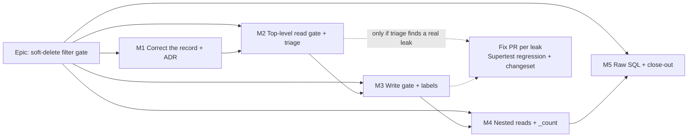

# Implementation Plan: Make a forgotten soft-delete filter impossible to merge

- **Feature spec:** [./feature-spec.md](./feature-spec.md)
- **Status:** Approved — by the product owner, 2026-10-03: option B (the computed gate), with Q2 answered **"check edits too"** — the first version checks writes (update, updateMany, delete, upsert on soft-deletable models) as well as reads; Q3 at its default (a real leak found by labelling gets its own fix PR, test and patch changeset).
- **Owner:** _(assigned on approval)_ — planned by feature-analyst; built by the **builder** agent

## Breakdown

### Epic

**Soft-delete filter gate** — replace "every query remembers `deletedAt: null`" with a computed check
(ADR-0058), and correct the standard that claims central enforcement exists (ADR-0076). Platform
hardening / drift control.

**Whole-epic properties, stated once:**

- **No runtime behaviour changes** in M1–M5, with one stated exception: the filtered `_count` in
  M4-T1 (a pure narrowing that returns the same number while its invariant holds). Otherwise
  production code is touched only by **comments** (declarations). Therefore `computeSchedule` is byte-identical by construction, no write is added
  (the pen, ADR-0028, is not involved), and no role gains or loses anything.
- **No schema change.** database-architect is not required. (If the product owner chooses option C
  instead, the plan is void and is re-written around a database-architect design.)
- **No flag** (ADR-0088 D1). The rollback is the commit boundary.
- **Every milestone ships dark** — a developer-facing gate, no user surface, so no Playwright journey
  is owed (ADR-0081 applies to user-facing capability).
- **No changeset** for M1–M5: nothing user-visible changes. A leak fix found during triage is a
  separate PR with a `@repo/api` patch changeset.
- **The regression proof** for every milestone is the same three runs, reported with their output:
  `pnpm prepush`, `scripts/e2e-local.sh api` (all 79 Supertest specs in `apps/api/test/` — green with
  **zero edits to any of them**), and the verified-red runs named per task.

---

### Milestone M1: Correct the record, file the ADR (shippable slice)

**Outcome:** the standards documents stop claiming a mechanism that does not exist, and the decision
is recorded.
**Entry point:** `Ships dark: documentation and an ADR; no user surface and no gate yet. M2 adds the gate.`
**Journey:** none owed (no user-facing capability).

#### Feature: The standard says what is true

> **Description:** Rewrite `docs/DATABASE.md` "Soft deletes" and `docs/REFERENCE_FEATURE.md`'s
> repository section to describe per-query filtering and the gate to come; file the ADR.
> **Complexity:** S
> **Dependencies:** spec approved.
> **Risks:** the docs describe a gate that is not merged yet → word M1's text as "the gate introduced
> by ADR-0172" with the M2 PR following immediately; if M2 stalls, M1's wording must not claim the gate
> runs. Mitigation: M1 says "is being introduced (M2)" and M2's PR flips it to present tense.
> **Testing requirements:** `pnpm prepush` (includes `check:adr-coverage`, `check:spec-status`,
> `check:counts` — the ADR count in `CLAUDE.md`'s banner changes).

##### Task M1-T1 — ADR + docs correction (≈ one PR)

- **Description:** file `docs/adr/0172-…md` from spec §4.9 (confirm the number is still free); add its
  one line to `CLAUDE.md` §16; update the ADR count in the stage banner (gated by `check:counts`);
  rewrite `docs/DATABASE.md:94-103`; correct `docs/REFERENCE_FEATURE.md:99-103` (the helper is real,
  "the only Prisma consumer" is not — cite F5); annotate `docs/BACKLOG.md:430-434` as taken up by this
  spec; set this spec's header to `Approved` (ADR-0131: once an ADR cites this directory, a `Draft`
  header fails `check:spec-status`).
- **Complexity:** S
- **Dependencies:** approval.
- **Risks:** `check:spec-status` refuses the ADR citing a `Draft` spec → flip the header in the same
  commit.
- **Testing:** `pnpm prepush`.
- **Development steps:**
  1. Re-verify spec §0 F1, F3, F5 against the tree on the day (they may have moved).
  2. Write the ADR; add the §16 line; update the banner count.
  3. Rewrite the two docs sections; annotate the backlog row.
  4. Flip both headers here to `Approved — by the product owner, <date>`.
  5. `pnpm prepush`; open the PR (`docs(api): …`).

---

### Milestone M2: Top-level read gate, and triage of today's sites (shippable slice)

**Outcome:** a new top-level read on any soft-deletable model with no `deletedAt` stance fails
`pnpm test`, prepush and CI.
**Entry point:** `Ships dark: developer-facing gate.`
**Journey:** none owed.

#### Feature: The scanner and the top-level rule

> **Description:** `apps/api/src/common/query/soft-delete-filter.structural.spec.ts` — schema-derived
> roster, TypeScript-AST scan of non-test `apps/api/src/**/*.ts`, the top-level read rule (spec US-1),
> declarations (US-2), the exception listing (US-5).
> **Complexity:** M
> **Dependencies:** M1.
> **Risks:**
> - Scanner false negatives (a read form it does not recognise passes silently) → pinned synthetic
>   cases for every receiver shape (`this.prisma.`, `db.`, `tx.`, `client.`), every operation, and the
>   multi-line form; a pinned assertion that ≥ 150 read sites were examined (the §0 floor was 175).
> - Scan time → measure and record in the spec docblock; budget: under 10 s locally. If over, scan
>   only files that mention a roster accessor (a cheap text pre-filter).
> - Over-strict on composed `where`s → false alarms are the designed failure direction; each costs a
>   declaration, and the count is visible.
> **Testing requirements:** scanner unit tests on synthetic sources (pass and fail per rule); the
> repository scan; verified red (below); `pnpm prepush`; `scripts/e2e-local.sh api`.

##### Task M2-T1 — Roster derivation and scanner, synthetic tests only

- **Description:** parse `apps/api/prisma/schema.prisma` into `{ model, accessor, table, toManyRelations }`
  for every model with a `deletedAt` field; implement the top-level read rule and the declaration
  grammar against **synthetic** sources. The real-tree scan is not switched on in this task.
- **Complexity:** M
- **Dependencies:** M1-T1.
- **Risks:** schema parse drift (comment lines containing `deletedAt`, e.g. `schema.prisma:2086`,
  `:3652`) → match the **field** form (`^\s+deletedAt\s+DateTime\?`), and pin the roster at 20 with the
  model names in the failure message.
- **Testing:** synthetic positive/negative cases: key present (`null`, `{ not: null }`, `{ lt: x }`);
  helper by structure (`active()`, an exported predicate, a helper spreading a helper); variable
  resolved in-function; unresolvable parameter → fail; ternary with one bare branch → fail;
  declaration with/without reason; stale declaration.
- **Development steps:**
  1. Roster parser + its pinned test.
  2. AST walk for `.<accessor>.<readOp>(` calls; `where` stance classifier.
  3. Helper recognition by returned-object structure (ADR-0124).
  4. Declaration grammar; stale-declaration detection.
  5. Synthetic cases; `pnpm --filter @repo/api test`.

##### Task M2-T2 — Switch the scan on; triage every finding

- **Description:** run the scanner over the real tree. For each finding, decide one of: (a) the read
  should filter → **stop and raise it as a leak** (separate fix PR, below); (b) the read deliberately
  sees deleted or any-state rows → add a declaration with the reason. Expected declarations (spec F8,
  F9 — to be confirmed by the scan): `client.repository.ts:130`, `project.repository.ts:82`,
  `plan.repository.ts:114`, `:127`, `dependency.repository.ts:131`, `calendar.repository.ts:386`
  (extend its existing docblock), `baselines.service.ts:300`, `:351`, `activities.service.ts:1089`, and
  any others the scan reports. Reads already stating `deletedAt: { lt }`/`{ not: null }` (expiry,
  lifecycle guards, `overview.repository.ts:456`, `activities.service.ts:1546`) pass without a
  declaration.
- **Complexity:** M
- **Dependencies:** M2-T1.
- **Risks:**
  - A declaration written to make the gate green rather than because it is true → each declaration's
    reason must name the invariant or the caller that makes it safe (e.g. "subject resolved active at
    `:1060` in the same transaction"); **security-reviewer** reads the full declaration list.
  - Triage finds a real leak → it is **not** fixed in this PR. Raise it as a `docs/TECH_DEBT.md` row,
    declare the site temporarily with `— KNOWN LEAK #<row>` as its reason so the gate lands green
    (ADR-0164: no pass-with-findings), and open the fix PR next (see "Leak fix" below). Product-owner
    question 3 governs this.
- **Testing:** the real-tree scan green; **verified red**: delete `deletedAt: null` from
  `client.repository.ts:33` (the `active()` helper — the whole client repository should then fail) and
  from one inline site (`schedule.repository.ts:285`), confirm the failures name file, line, model and
  operation, restore. Record both outputs in the PR. `pnpm prepush`; `scripts/e2e-local.sh api` —
  79 specs green, none edited.
- **Development steps:**
  1. Enable the real-tree scan; collect findings.
  2. Classify each; write declarations; raise any leak as a debt row.
  3. Verified-red runs; record output.
  4. Flip M1's docs wording to present tense.
  5. `pnpm prepush`; `scripts/e2e-local.sh api`; PR (`test(api): …`).

##### Leak fix (conditional — one PR per real leak found)

- **Description:** add the missing filter; remove the `KNOWN LEAK` declaration; close the debt row.
- **Complexity:** S each.
- **Testing:** a Supertest regression in the relevant `apps/api/test/*.e2e-spec.ts` that soft-deletes a
  row and asserts it is absent from the response — verified red before the fix (CLAUDE.md §7: every
  bug fix ships with a regression test). If the read feeds the engine, also run the engine
  conformance suite and state whether any result moved (it may — that is the fix).
- **Changeset:** `@repo/api` patch.

---

### Milestone M3: Write gate (shippable slice — product-owner answer to Q2)

**Outcome:** an `update`, `updateMany`, `upsert`, `delete`, `deleteMany` or nested write on a
soft-deletable model with no `deletedAt` stance fails the gate (spec US-7, §4.11).
**Entry point:** `Ships dark: developer-facing gate.`
**Journey:** none owed.

#### Feature: The write rule

> **Description:** extend M2's scanner — same stance classifier, same declaration grammar — to the
> write operations, add function-level declarations (US-7), and add the nested-write walk over `data`.
> **Complexity:** M
> **Dependencies:** M2.
> **Risks:**
> - Function-level declarations become a blanket → they cover only writes of the declared kind
>   (`any-state` / `deleted-only`) inside the one function, and the listing prints the covered-call
>   count beside each; security-reviewer reads them.
> - A write that "should" filter but is on a path where the row can't be deleted (e.g.
>   `invitation.repository.ts:65`) → declare with the evidence (spec §0 F6); do not add a filter in
>   this milestone, because on `update`/`delete` an added filter turns a match into a thrown P2025 —
>   a behaviour change, which goes through the leak-fix route if wanted.
> **Testing requirements:** synthetic cases per operation and per intent (edit via `active()`, stamp
> guarded on `deletedAt: null`, restore declared, unguarded `updateMany` failing, nested `updateMany`
> inside `data` failing, function-level declaration covering three calls, stale function declaration
> failing); real-tree scan; verified red; `pnpm prepush`; `scripts/e2e-local.sh api`.

##### Task M3-T1 — Write operations, nested writes, function-level declarations

- **Description:** implement; run on the real tree; label. Expected labels (spec §4.11, confirm by
  scan): function-level on the `HierarchyLifecycleService` restore routine(s)
  (`hierarchy-lifecycle.service.ts:529-621`), the expiry delete routine
  (`hierarchy-expiry.runner.ts:105-120` and its siblings — reason: ADR-0096 D5, `TECH_DEBT.md` #139),
  and interchange compensation (`interchange.service.ts:1283-1301`); call-level on
  `invitation.repository.ts:65`. Already passing with no label: every `active({ id, version })` edit and
  every stamp guarded on `deletedAt: null`.
- **Complexity:** M
- **Dependencies:** M2-T2.
- **Risks:** as in the feature; plus the 17-delete expiry routine being split across helpers so one
  label does not reach every call → label each helper function; do not widen the grammar to file
  scope.
- **Testing — verified red (ADR-0110), outputs pasted in the PR:**
  1. Remove `deletedAt: null` from the stamp guard at `resource.repository.ts:312` → fails naming
     `resource.updateMany`.
  2. Remove `deletedAt: null` from the optimistic bump at `activity-steps.service.ts:80` → fails naming
     `activity.updateMany`.
  3. Delete the function-level label on the restore routine → fails on every restore write it covered,
     and the failure count equals the covered count the listing printed.
  4. Add a throwaway nested `data: { steps: { updateMany: { where: {}, data: {} } } }` in a scratch
     edit → fails as a nested write; revert.
  Then `pnpm prepush`; `scripts/e2e-local.sh api` — 79 specs green, none edited.
- **Development steps:**
  1. Extend the operation set; reuse the stance classifier.
  2. Function-level declaration scope + covered-count in the listing.
  3. Walk `data` for nested write keys on soft-deletable relations (roster's relation targets).
  4. Synthetic cases; real scan; labels; verified red; prepush; e2e; PR.

---

### Milestone M4: Nested reads and `_count` (shippable slice)

**Outcome:** an `include`/`select` of a to-many soft-deletable relation, or a `_count` of one, without a
`deletedAt` filter fails the gate.
**Entry point:** `Ships dark: developer-facing gate.`
**Journey:** none owed.

#### Feature: The nested rule

> **Description:** extend the scanner with spec US-3, using the roster's `toManyRelations`.
> **Complexity:** S–M
> **Dependencies:** M3 (shares the relation-target derivation M3 adds for nested writes).
> **Risks:** relation names differ from model names (`activities` → `BaselineActivity` on `Baseline`)
> → derive the target model from the relation field's type in `schema.prisma`, never from the name.
> **Testing requirements:** synthetic cases (`include: { rel: true }` fail; `include: { rel: { where: {
> deletedAt: null } } }` pass; `_count: { select: { rel: true } }` fail; `_count: { select: { rel: {
> where: { deletedAt: null } } } }` pass; to-one include ignored); real-tree scan; verified red.

##### Task M4-T1 — Nested to-many and `_count` rule

- **Description:** implement; triage findings. Known today: `baseline.repository.ts:835`
  (`_count.activities`, latent by the invariant at `hierarchy-lifecycle.service.ts:119` and
  `baseline.repository.ts:890`). Default action: **add the filter** — a `_count` filter is a pure
  narrowing that returns the same number while the invariant holds, so it is safer than a declaration
  resting on an invariant elsewhere. That one change **is** a runtime change; it is covered by
  `apps/api/test/baselines.e2e-spec.ts` (activity count on the baseline summary) and needs no
  changeset if the count is unchanged in every test — state that in the PR.
- **Complexity:** S
- **Dependencies:** M3-T1.
- **Risks:** Prisma's filtered `_count` changes the generated SQL → **backend-performance-reviewer**
  checks the plan for the baseline summary read (one baseline, bounded rows).
- **Testing:** synthetic cases; verified red by removing the `where` from
  `baseline.repository.ts:929` (`activities` include) and from the new `_count` filter; `pnpm prepush`;
  `scripts/e2e-local.sh api`.
- **Development steps:**
  1. Reuse M3's relation-target derivation.
  2. Walk `include`/`select` (recursively) and `_count.select` of each read.
  3. Synthetic cases; real scan; triage; the `_count` filter.
  4. Verified red; prepush; e2e; PR.

---

### Milestone M5: Raw SQL, and close-out (shippable slice)

**Outcome:** a `$queryRaw`/`$executeRaw` on a soft-deletable table with no `deleted_at` in its text fails
the gate; the epic's docs are final.
**Entry point:** `Ships dark: developer-facing gate.`
**Journey:** none owed.

#### Feature: The raw-SQL rule

> **Description:** spec US-4 — scan tagged templates on `$queryRaw`/`$executeRaw`; table names from
> `@@map`; `*Unsafe` variants refused if a soft-deletable table name is in reach.
> **Complexity:** S
> **Dependencies:** M4.
> **Risks:**
> - A template that filters one table and not another (a join) → the rule is per table named: each
>   soft-deletable table in the text needs a `<alias>.deleted_at` or bare `deleted_at` mention. This is
>   a text heuristic and is stated as such in the docblock; it can be fooled by a `deleted_at` that
>   belongs to a different alias. Accepted: the 16 sites today are all correctly filtered (spec F11) and
>   the rule's job is to stop a new one forgetting entirely.
> - The recycle bin and advisory-lock `$executeRaw`s → the bin reads `deleted_at IS NOT NULL`
>   (passes on the text); advisory locks name no table (pass).
> - Interaction with `staff-boundary.structural.spec.ts`, which already polices raw SQL under
>   `modules/staff/` → no overlap in rule, only in subject; both run.
> **Testing requirements:** synthetic cases; verified red by removing `AND p.deleted_at IS NULL` from
> `overview.repository.ts:197`; real scan; `pnpm prepush`; `scripts/e2e-local.sh api`.

##### Task M5-T1 — Raw-SQL rule

- **Description:** implement, triage, declare. Covers `$executeRaw` writes as well as reads, so the
  write side has no raw-SQL gap (`activity.repository.ts:298,329,400`, `schedule.repository.ts:970,1068`
  already state `deleted_at IS NULL`).
- **Complexity:** S
- **Dependencies:** M4-T1.
- **Risks:** as above.
- **Testing:** as above.
- **Development steps:**
  1. Table roster from `@@map`.
  2. Template-literal text extraction (static parts only; interpolations are values, not SQL).
  3. Per-table rule; `*Unsafe` refusal.
  4. Synthetic cases; real scan; verified red; prepush; e2e; PR.

##### Task M5-T2 — Close-out

- **Description:** gate docblock lists what it cannot see (spec §4.5 B list) and the §4.8 triggers;
  `docs/TESTING.md` names the gate if it enumerates structural gates; `docs/BACKLOG.md` row closed;
  ADR `Consequences` updated with measured scan time and final declaration count; spec/plan headers
  `Accepted — shipped (ADR-0172)`.
- **Complexity:** S
- **Dependencies:** M5-T1.
- **Testing:** `pnpm prepush`.

## Sequencing & slices

M1 → M2 → M3 → M4 → M5, one PR per task. Each lands green and leaves `main` releasable: M1 is docs;
M2–M5 each add a rule that passes on the tree it lands on (findings triaged in the same PR), so no gate ever
lands red or with a pass-with-findings mode (ADR-0164). A leak fix, if any, is inserted immediately
after the task that found it. No flags.

**Reviewers to involve:** **security-reviewer** on M2-T2 (reads every declaration — the declarations
are the attack surface of this gate), M3-T1 (the write labels, including function-level ones) and
M5-T1; **backend-performance-reviewer** on M4-T1 (the one
runtime query change); **test-engineer** on M2-T1 (scanner false-negative coverage). No
database-architect (no schema change); no UI reviewers (no UI).

## Definition of Done (per task)

Each task's PR must satisfy the Feature Completion Criteria in
[`docs/PROCESS.md`](../../PROCESS.md) (code, tests, docs, security, performance, accessibility, Docker
build, CI, changelog, version impact). For this epic specifically: `pnpm prepush` **and**
`scripts/e2e-local.sh api` run and reported, verified-red output pasted in the PR, and "no Supertest
spec edited" stated.

## Risks & assumptions (rollup)

| Risk / assumption                                                                 | Likelihood | Impact | Mitigation                                                                                                   |
| --------------------------------------------------------------------------------- | ---------- | ------ | ------------------------------------------------------------------------------------------------------------ |
| Scanner misses a read form (false negative)                                        | med        | med    | Pinned synthetic cases per shape; pinned minimum examined-site count; verified red on real sites               |
| Declarations become a rubber stamp                                                 | med        | med    | Reason required and grammar-checked; listing printed every run; security-reviewer reads the list in M2/M3/M5   |
| A wrong stance (`{ not: null }` for `null`) passes                                 | low        | med    | Stated blind spot; same for every option; reviewers                                                            |
| Function-level write labels hide a new unguarded write added later to that function | med        | med    | Label is scoped to one function and one declared kind; covered-call count printed, so a rise shows in the diff |
| Creates attaching to a deleted parent unchecked                                     | low        | low    | Out of scope (spec §4.11); revisit trigger in spec §4.8                                                        |
| Triage finds a real leak                                                            | low        | med    | Separate fix PR with Supertest regression and changeset (PO question 3)                                        |
| Gate slows `pnpm test`                                                              | low        | low    | Measured in M2; text pre-filter if > 10 s                                                                      |
| The gate is advisory at merge (unprotected `main`)                                  | certain    | low    | Same as every gate here; prepush is where it bites (CLAUDE.md §8, §19.9)                                       |
| Prisma 7 migration (TECH_DEBT #11) changes client API                              | low        | low    | The gate reads source text and the schema file, not the client — unaffected                                   |
| Assumption: no consumer outside `apps/api/src` reads Postgres through Prisma        | —          | —      | Seed CLI uses REST (`packages/seed-http`); re-checked in M2-T2                                                 |
