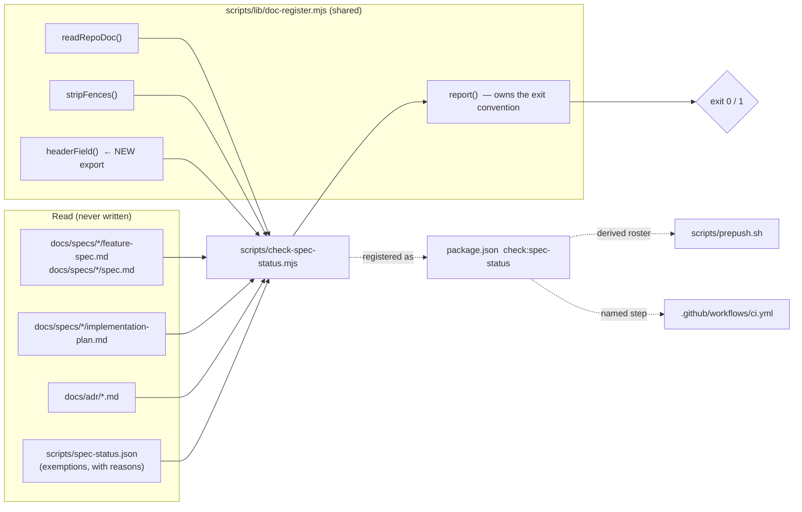
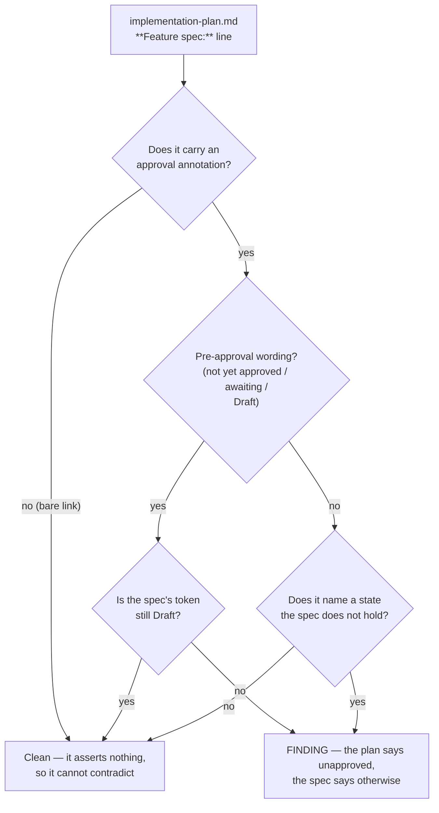

# Feature Spec: A spec header states its approval, and a citation is what closes it

- **Status:** Approved — by the product owner, 2026-09-09 (“Approved — build it”)
- **Author(s):** feature-analyst (Claude)
- **Date:** 2026-09-09
- **Tracking issue / epic:** —
- **Roadmap link:** repository maintenance / drift control — closes `docs/TECH_DEBT.md` #274
- **Related ADR(s):** builds on **ADR-0120** (a documented obligation with no computed observer),
  **ADR-0124** (a register parser finds by structure and refuses by declaration), **ADR-0105** (a
  register row is not a spec — the decision that makes this defect load-bearing), ADR-0058,
  ADR-0076, ADR-0093, ADR-0110. **A new ADR is recommended** — see §4.11, with the argument for
  and against. **No number is reserved**: ADR-0130 is the highest filed as of 2026-09-09
  (`docs/adr/0130-one-press-takes-every-reading-and-a-sitting-is-what-a-reading-belongs-to.md`),
  and the number is taken at filing (the ADR-0071 / ADR-0079 lesson).

> This spec is a member of its own population, and will be swept by the work it describes. That is
> not a joke at the document's expense — it is the reason the sweep has to be part of the gate's
> milestone rather than a follow-up. See §4.9.

---

## 0. Why this spec exists at all

`docs/TECH_DEBT.md` #274 exists and is a good row. **It does not cover this work**, and ADR-0105
says so by name: a register row substitutes for stages 1–2 only while the change adds no new
surface. Four of the five triggers fire.

| Trigger                       | Fired?  | What fires it                                                                                                                                  |
| ----------------------------- | ------- | ---------------------------------------------------------------------------------------------------------------------------------------------- |
| A **shared gate**             | **yes** | a new `check:*` script, and a new exported reader in `scripts/lib/doc-register.mjs`                                                            |
| A **CI step**                 | **yes** | a new step in `.github/workflows/ci.yml`                                                                                                       |
| A component's public contract | **yes** | `scripts/lib/doc-register.mjs` gains an export; that module is read by three gates                                                             |
| A user-facing entry point     | **no**  | there is no UI; the entry point is `pnpm check:spec-status` (§2, US-4)                                                                         |
| A schema change               | **no**  | no model, column, index, constraint or migration — so `database-architect` is **not** engaged, and that is a statement rather than an omission |

#274 anticipated this in its closing paragraph — _"a shared gate is an ADR-0105 trigger and wants
its own spec"_ — and the CI step is the sharper of the two, because the repository has already
shipped this exact mistake once: `.github/workflows/ci.yml:149-155` records that the epic which
added `check:advisory-agreement` asserted in its spec _"does the epic add a new `check:*` script?
No"_, which was false as built, so the gate shipped enforced only by a locally-run `pnpm prepush` —
for a mechanism whose entire subject is that local-only enforcement is the thing that does not
happen. This spec names the CI step in §4.7 and the plan gives it a task of its own.

---

## 1. Business understanding

### Problem

**Fifty specs currently assert that live, shipped work has not been approved to start.** That is
#274's headline and it is correct in substance. What follows re-derives it, because the row's own
figures were produced under time pressure and two of them do not survive re-measurement — which is
the row's own recorded lesson (an earlier count in that session reported 28 instead of 50 because
the loop truncated its own input with `head -40`).

**Why it is not cosmetic.** ADR-0105 makes a spec's approval state _load-bearing_: a tech-debt row
covers stages 1–2 only while the change adds no new surface, and crossing a trigger means the work
**stops** and the spec is written. So a reader picking up follow-on work consults the header — and
is told one of two false things. Either the shipped feature was never approved (in which case, on
the rule as written, they should stop and seek approval for work that is in production), or they
must obtain an approval that already happened. `docs/PROCESS.md`'s Definition of Ready lists **the
plan is approved** as a checkbox; the artefact that answers it is wrong on the majority of the
estate.

**Why nobody fixed it as they went.** There is no step anywhere that says to. `docs/RECONCILE.md`
contains no occurrence of `feature-spec`, `Draft` or `approval` (grep over that file: **no
matches**), so the reconciliation pass has never looked. The header is written at stage 1, read at
stage 5, and then nothing in the process returns to it — so it drifted to a supermajority precisely
by being nobody's step. That is ADR-0120's shape exactly, and this is its third instance: the debt
register's statuses, the reconciliation pass's own due date, and now this.

### What I measured, and where it disagrees with #274

Every figure below names the tool call that produced it. All were taken 2026-09-09 against the
working tree. **None is load-bearing on its own** — M0 re-derives every one of them mechanically,
using the gate itself as the instrument, and §4.10 explains why hand-counting is the wrong
instrument for this particular question.

| Claim                                 | #274 says  | I measure                              | How                                                                |
| ------------------------------------- | ---------- | -------------------------------------- | ------------------------------------------------------------------ |
| Spec directories                      | 97         | **~98**, and the count is ambiguous    | `Glob docs/specs/*/*.md` plus targeted globs (see below)           |
| `feature-spec.md` files               | —          | **88**                                 | `Glob docs/specs/*/feature-spec.md`                                |
| Spec documents named `spec.md`        | —          | **3**                                  | `Glob docs/specs/*/spec.md`                                        |
| `implementation-plan.md` files        | —          | **90**                                 | `Glob docs/specs/*/implementation-plan.md`                         |
| Plans carrying `… — not yet approved` | **all 67** | **21 of ~81**, and the phrasing varies | `Grep '^(- )?\*\*Feature spec:\*\*' over */implementation-plan.md` |

Three of those disagreements change the design, and each is the kind of thing that would have made
the gate report green over the gap.

**(a) Three epics name their spec `spec.md`, not `feature-spec.md`.** `foot-row`,
`object-bar-defects` and `workspace-foot-and-deck`. A gate globbing `docs/specs/*/feature-spec.md`
is **structurally blind to all three**, silently. Two of the three shipped —
`workspace-foot-and-deck/spec.md:3` is headed `**SUPERSEDED IN PART BY WHAT SHIPPED …**` and
`object-bar-defects/spec.md:3` says `approved by the product owner in conversation, 2026-08-27` —
and the third, `foot-row/spec.md:3`, is headed **`Draft`** while ADR-0114 cites
`docs/specs/foot-row/` twice at its line 10. So the very first blind spot contains a live instance
of the defect.

**(b) The status header has three shapes, and the shared parser can read only the rarest.**
Measured across the 88 `feature-spec.md` files:

| Form              | Count  | Example                                      |
| ----------------- | ------ | -------------------------------------------- |
| `- **Status:** …` | **85** | `docs/specs/probe-sweep/feature-spec.md:3`   |
| `**Status:** …`   | **2**  | `narrow-shell-journey:3`, `seed-catalogue:8` |
| `> **Status:** …` | **1**  | `operational-self-service:17`                |

`fieldValue()` in `scripts/lib/doc-register.mjs:145-158` anchors on `^\*\*Status:\*\*` — the bare
form — and its docblock is emphatic that the column-0 anchor **is the only guard** and must not be
loosened. Used as-is here it would read **2 of 88 files** and report confidently on the rest. §4.5
takes that seriously rather than routing around it.

The line number varies too: `revision-compare:18`, `org-less-shell:21`,
`engine-conformance-framework:9`, `corporate-brand:30`, `canvas-nav:8`. And
`one-row-header/feature-spec.md` carries **two** `- **Status:**` lines — `:3` for the spec and
`:796` for an ADR draft embedded in it — so first-match-wins is a requirement, not a convenience.

**(c) #274's plan-side claim is false.** It says all 67 plans carry `**Feature spec:** … — not yet
approved`. The grep output shows at least six distinct annotations — `— **not yet approved**`,
`— **awaiting approval**`, `— **Draft, awaiting approval**`, `(awaiting approval)`,
`(Draft — awaiting approval)`, `(Draft — **not yet approved**)` — and, more importantly, **around
thirty plans carry no approval annotation at all**, just the link (`workspace-modes`,
`revision-compare-delta`, `wbs-improvements`, `audit-log-coverage`, `typeface-outward-artefacts`,
`tsld-minimap`, `gantt-view`, `audit-log`, `canvas-axis-markers`, `retention-sweep`,
`debt-paydown-programme`, `workspace-layout`, `canvas-authoring-and-routing`,
`flag-retirement-library-and-calendar`, `public-screens-brand`, `account-security`, `designed-ui`,
and others). A plan-side rule keyed on the literal string `not yet approved` would find twenty-one
files, miss the rest, and report OK. This is an ADR-0076 Class 3 claim — asserted in a
decision-bearing document without being checked — and correcting it is what produces the plan-side
design in §4.8, which is a _consistency_ rule rather than a string hunt.

One further observation, offered as an observation rather than a finding: `workspace-foot-and-deck/implementation-plan.md:3`
points at `./spec.md`, which exists, while ADR-0029:9 cites `` `docs/specs/hierarchy-crud.md` `` — a
path that resolves to nothing, the real file being `docs/plans/hierarchy-crud.md`. The citation is
an inline code span rather than a Markdown link, which is presumably why `check:doc-links` has never
reported it. **I have not confirmed that**, and it is out of scope here; §4.4 makes the gate immune
to it by construction, and M0-T3 records it for a debt row if it is real.

### Users

Three, and none of them is a planner. This work has no runtime surface at all.

| Who                                                | What they need                                                                                                                                                         |
| -------------------------------------------------- | ---------------------------------------------------------------------------------------------------------------------------------------------------------------------- |
| **An engineer or agent picking up follow-on work** | To read a spec header and learn the truth about whether that work was approved and whether it shipped. This is the person ADR-0105 sends to the header.                |
| **The product owner**                              | To be asked for approval once, and for the record of that approval to survive. Today they are structurally re-asked, on paper, for fifty things they already approved. |
| **The reconciliation pass** (`docs/RECONCILE.md`)  | One fewer thing to remember. The pass's own governing rule is _verify the claim; do not trust the document_ — this converts one class of claim into a computed one.    |

**Organisation roles do not apply.** There is no runtime authorisation surface: no endpoint, no
route, no principal (ADR-0012 is not engaged). The only access control that governs the gate is the
one that governs the repository.

### Primary use cases

1. An author finishes a spec and pushes; the gate refuses a header the vocabulary does not know.
2. An epic ships and files its ADR; the gate refuses to let the push through until that epic's spec
   header stops saying `Draft`.
3. A reader opens any spec and reads a status token from a five-word vocabulary, with the ADR named
   where one exists.
4. A reader opens an implementation plan and finds no claim about approval that contradicts the
   spec beside it.

### User journeys

**Happy path.** An epic's last milestone lands. The ADR is filed and cites `docs/specs/<slug>/` in
its References. `pnpm prepush` runs `check:spec-status`, which fails with one line naming the spec,
the ADR, and the exact replacement header. The author edits one line. The push goes through.

**The case the gate exists for.** The author does _not_ update the header — because nothing told
them to, which is the state today for fifty specs. Before this work, nothing happens and the
document quietly becomes false. After it, the push stops at the sentence that says which file and
what to write in it.

**Alternate — a genuine exception.** An ADR is filed at design time (stage 4, per
`docs/PROCESS.md`), before the spec is approved. The gate's rule admits this: it forbids `Draft`
and permits `Approved`, so the honest header is available. Where even that is wrong, the slug goes
in `scripts/spec-status.json` with a written reason — the shape `adr-coverage.json`,
`dependency-claims.json` and `flag-retirement.json` already use.

### Expected outcomes

- Fifty specs stop asserting that shipped work is unapproved, and stay that way.
- A spec header becomes machine-readable, so the next question about the estate ("which specs are
  approved and unshipped?") is a grep rather than a reading.
- A reader jumps from a shipped spec to the decision it became, by name.

### Success criteria

| #    | Criterion                                                                                                      | How it is judged                                                               |
| ---- | -------------------------------------------------------------------------------------------------------------- | ------------------------------------------------------------------------------ |
| SC-1 | `pnpm check:spec-status` exits 0 on the swept tree, and its own summary line reports a **non-zero** population | The gate's output, in CI                                                       |
| SC-2 | Every assertion has been **made to fail** by the defect it was written for, before it counted as done          | `scripts/check-spec-status.test.mjs`, each case's docblock naming the mutation |
| SC-3 | The red run is committed, with the full finding list                                                           | `docs/specs/spec-status-gate/red-run.md` (ADR-0120 precedent)                  |
| SC-4 | The gate reads **every** spec document, proven by a control that measures a different quantity than the reader | Assertion C1, §4.6                                                             |
| SC-5 | No spec document in the tree carries a status token outside the vocabulary                                     | Assertion S2                                                                   |
| SC-6 | The gate is registered in `package.json`, picked up by `prepush.sh`, **and** has a CI step                     | The three files, checked in the plan's M3-T3                                   |

### Open questions

**CRITICAL — CQ-1. The vocabulary's fifth member, and whether `Proposed` folds into `Draft`.**
Measured, the estate uses at least seven leading tokens: `Draft`, `Approved`, `Proposed`,
`Reviewed`, `Delivered`, `SUPERSEDED`, and one spec (`revision-compare:18`) opening with
`**Awaiting`. §4.3 proposes **five** — `Draft | Approved | Accepted | Superseded | Withdrawn` —
folding `Proposed` and `Awaiting` into `Draft`, `Reviewed` into `Draft` (a reviewed-but-unapproved
spec is still awaiting approval) and `Delivered` into `Accepted`. That is a judgement about
somebody else's words on ~10 files. **Default if unanswered:** the five above, with each fold
recorded in the sweep commit so it can be reversed cheaply.

**CRITICAL — CQ-2. Does the gate govern the plan's own `Status:` field, or only its `Feature spec:`
annotation?** The plan template offers `Draft | Approved | In progress | Done`, which is a
_different_ vocabulary about a _different_ subject (the plan's state, not the spec's approval).
§4.8 proposes governing the **cross-document contradiction only** — a plan may not claim its spec
is unapproved when the spec says otherwise — and leaving the plan's own `Status:` alone, because a
second vocabulary is a second sweep and a second argument. **Default if unanswered:** contradiction
only; the plan's own `Status:` is named as out of scope in the gate's docblock, with the reason,
so it reads as a decision rather than an oversight.

**CRITICAL — CQ-3. Is this an ADR, or a `docs/DECISIONS.md` entry?** §4.11 recommends an ADR and
gives the argument both ways. It matters because it decides whether the milestone that lands the
gate also owes `docs/adr/README.md`, `docs/ROADMAP.md` and a CLAUDE.md §16 entry — and because
`check:adr-coverage` will demand all three the moment a file appears in `docs/adr/`. **Default if
unanswered:** write the ADR.

**Non-critical, with stated defaults.**

- **The exemption register ships empty.** No legitimate exemption was found in the sample of 21
  slugs (§4.4). Shipping `scripts/spec-status.json` with `{ "exempt": {} }` and a `notes` field
  costs one file and gives the next person somewhere to record a reason instead of weakening the
  gate. Default: ship it, with the dead-config assertion `adr-coverage.json` carries.
- **`docs/plans/` is out of scope.** `CLAUDE.md` §4 and `docs/PROCESS.md` both call it historical.
  Default: the gate globs `docs/specs/` only, and says so in its docblock so the omission is a
  decision.
- **`engine-conformance-framework` holds seven further `M<n>-…-feature-spec.md` files.** They are
  per-milestone sub-specs inside one epic directory. Default: the gate reads `feature-spec.md` and
  `spec.md` at the directory root only; the `M<n>-` files are named in the docblock as knowingly
  excluded, because folding them in means deciding what a _milestone's_ approval state means, which
  is a different question.

---

## 2. Functional requirements

### User stories & acceptance criteria

> **US-1** — As an engineer picking up follow-on work, I want a spec's header to tell me the truth
> about whether it was approved and whether it shipped, so that ADR-0105's rule is followable.
>
> **Acceptance criteria**
>
> - **Given** a spec directory cited by any file in `docs/adr/`, **when** that spec's status token
>   is `Draft`, **then** the gate reports a finding naming the spec path, the citing ADR, and the
>   replacement header text, and exits **1**.
> - **Given** the same spec with status `Approved`, `Accepted`, `Superseded` or `Withdrawn`,
>   **then** no finding.
> - **Given** a spec no ADR cites, **when** its status is `Draft`, **then** no finding. The gate
>   cannot know whether that work shipped; §4.10 states the blind spot rather than guessing.

> **US-2** — As a spec author, I want the header form to be checkable, so that a spec cannot be
> written in a shape a later gate silently cannot read.
>
> **Acceptance criteria**
>
> - **Given** a spec document with no status line the reader can find, **then** a finding naming the
>   file and the accepted forms.
> - **Given** a status whose leading token, normalised, is outside the vocabulary, **then** a
>   finding naming the token and listing the five.
> - **Given** a status line in any of the three measured shapes (`- **Status:**`, `**Status:**`,
>   `> **Status:**`), **then** it is **found**. Finding is generous; refusing is a separate, strict
>   pass (ADR-0124's rule, and §4.5's reason for not narrowing the reader).

> **US-3** — As a reader, I want a shipped spec to name the decision it became, so that the spec and
> the ADR are one navigation step apart.
>
> **Acceptance criteria**
>
> - **Given** a spec whose status token is `Accepted`, **when** the rest of the line names no
>   `ADR-NNNN`, **then** a finding. The convention is `**Status:** Accepted — shipped (ADR-0130)`.
> - **Given** an `Accepted` spec naming `ADR-NNNN`, **when** no file `docs/adr/NNNN-*.md` exists,
>   **then** a finding. A pointer to a decision that does not exist is worse than none.

> **US-4** — As an engineer running the pre-push gate, I want this check to run with the others and
> to fail the push, so that the obligation is not something anybody has to remember.
>
> **Acceptance criteria**
>
> - **Given** `check:spec-status` in `package.json`, **when** `scripts/prepush.sh` runs, **then** the
>   gate appears in its derived roster (it reads the `check:` keys — `prepush.sh:130-133`) and a
>   finding is reported `FAIL`, not `WARN`.
> - **Given** the gate is **not** listed in `ADVISORY_GATES`, **then** `check:advisory-agreement`
>   passes — which requires the gate to contain neither `report({ advisory })` nor any
>   `warnings.push` (§4.7).
> - **Given** CI, **then** a named step runs it, with a comment saying what it is for.

> **US-5** — As the person who maintains the gate, I want it to refuse to report success when it has
> read nothing, so that a green run means something.
>
> **Acceptance criteria**
>
> - **Given** zero spec documents found, **then** `report()`'s population refusal fires and the gate
>   exits 1 (`doc-register.mjs:255-261`).
> - **Given** zero ADR-cited spec directories, **then** an explicit finding — `report()`'s
>   population guard covers the spec list and **not** the join, and every cited-spec assertion is a
>   `.filter()` and therefore vacuously true of an empty set (ADR-0093).
> - **Given** the reader's count and an independently-derived naive count disagree, **then** a
>   finding saying which is larger and what that means.

### Workflows

**W1 — the reader.** Glob `docs/specs/*/feature-spec.md` and `docs/specs/*/spec.md` → for each, strip
fences → find the first line matching `^(?:[-*]\s+|>\s+)?\*\*Status:\*\*\s*(.*)$` → normalise the
leading token (strip `*_`` ` `` .`, lowercase — the `check-debt-status.mjs:210-214`normalisation) →
record`{ path, slug, token, rest, line }`.

**W2 — the join.** Read every `docs/adr/*.md`. Collect `docs/specs/<slug>` and `specs/<slug>`
occurrences into a set of slugs. **Intersect with the slugs that exist on disk**, discarding the
rest — §4.4 explains why that direction, and it is the whole reason ADR-0029's dangling
`docs/specs/hierarchy-crud.md` costs nothing.

**W3 — the assertions.** Controls first, then refusals (the `check-debt-status.mjs` ordering, so
nothing below can pass vacuously). §4.6 lists them.

**W4 — the plan side.** For each `implementation-plan.md`, find the `**Feature spec:**` line, extract
any approval annotation, and compare it against the spec beside it. A bare link asserts nothing and
is clean. §4.8.

### Edge cases

| Case                                                                                                                                                                                                          | Behaviour                                                                                                                                                                                                           |
| ------------------------------------------------------------------------------------------------------------------------------------------------------------------------------------------------------------- | ------------------------------------------------------------------------------------------------------------------------------------------------------------------------------------------------------------------- |
| A directory with **both** `feature-spec.md` and `spec.md`                                                                                                                                                     | Both are read as spec documents; both must satisfy every rule. None exists today (measured), so this is defensive rather than live.                                                                                 |
| A directory with **neither** (7 measured: `graphite`, `design-system-rewrite`, `workspace-visual-polish`, `calendar-hours-per-day`, `canvas-decomposition`, `canvas-maximisation`, `canvas-paint-loop-fixes`) | Not in the population. The gate governs spec documents, not directories. Named in the docblock so it reads as a decision.                                                                                           |
| A spec with **two** status lines (`one-row-header:3` and `:796`)                                                                                                                                              | First match wins. Pinned by a fixture, because "read them all" and "read the last" both look reasonable and are both wrong.                                                                                         |
| A status line inside a fenced block                                                                                                                                                                           | Invisible. `stripFences` first, always — `docs/templates/feature-spec.md:9` is itself a `- **Status:**` line, and the templates directory is outside the glob, but a spec quoting the template is not hypothetical. |
| A spec quoting `**Status:**` in prose                                                                                                                                                                         | Not matched unless it opens a line, optionally after `- `, `* ` or `> `. The anchor is the guard, per `doc-register.mjs`'s six recorded instances of a scan matching its own prose.                                 |
| An ADR citing a spec slug that does not exist (ADR-0029/0030/0031/0032, all four measured)                                                                                                                    | Discarded by the intersection in W2. No finding, because it is not this gate's subject.                                                                                                                             |
| An ADR citing a spec as **prior art** rather than as its origin                                                                                                                                               | Treated identically, and §4.4 argues that is correct: in the sample, every citation of a spec that shipped is a citation of a spec that shipped.                                                                    |
| An `Accepted` spec naming an ADR number with no file                                                                                                                                                          | Finding (US-3).                                                                                                                                                                                                     |
| A slug in `spec-status.json` that is not cited, or does not exist                                                                                                                                             | Finding — dead config, the `check-adr-coverage.mjs:92-96` precedent.                                                                                                                                                |
| The whole `docs/specs/` tree is deleted or moved                                                                                                                                                              | Population refusal, exit 1.                                                                                                                                                                                         |

### Permissions

Not applicable. No runtime surface, no principal, no organisation scope — ADR-0012 is not engaged.
The gate reads files and exits; it writes nothing.

### Validation rules

| Field                   | Rule                                                                                                   |
| ----------------------- | ------------------------------------------------------------------------------------------------------ |
| Spec status line        | Matches `^(?:[-*]\s+                                                                                   | >\s+)?\*\*Status:\*\*\s*(.+)$` at column 0 after the optional prefix; first wins |
| Status token            | Normalised leading word ∈ { `draft`, `approved`, `accepted`, `superseded`, `withdrawn` }               |
| `Accepted` rest-of-line | Contains at least one `ADR-\d{4}`, and every such number resolves to a `docs/adr/\d{4}-*.md`           |
| ADR citation (join)     | `(?:docs/)?specs/([a-z0-9][a-z0-9-]*)` anywhere in an ADR, intersected with the slugs on disk          |
| Exemption register      | `{ exempt: Record<slug, reason> }`; every key is a live cited slug; every reason is a non-empty string |

### Error scenarios

There is no user-facing error surface. The gate's failure modes are its own, and each maps to a
message and an exit code.

| Scenario                                          | Detection                        | Result                                                                                         | Exit |
| ------------------------------------------------- | -------------------------------- | ---------------------------------------------------------------------------------------------- | ---- |
| A cited spec is still `Draft`                     | S3                               | Finding naming spec, ADR, replacement text                                                     | 1    |
| A spec has no readable status line                | S1                               | Finding naming the file and the three accepted forms                                           | 1    |
| A status token is outside the vocabulary          | S2                               | Finding naming the token and the five                                                          | 1    |
| An `Accepted` spec names no ADR, or a missing one | S4                               | Finding                                                                                        | 1    |
| A plan contradicts its spec                       | P1                               | Finding naming both files                                                                      | 1    |
| No spec documents found                           | `report({ population })`         | "the population is empty, so this run checked nothing"                                         | 1    |
| No cited slugs found                              | C2                               | "the join resolved to nothing — the citation scan is broken"                                   | 1    |
| Reader count ≠ independent count                  | C1                               | Finding saying which is larger and what each direction means                                   | 1    |
| Dead exemption                                    | C3                               | Finding                                                                                        | 1    |
| `docs/specs/` unreadable                          | `readRepoDoc` / `readdir` throws | Uncaught; non-zero. Deliberate — a gate that cannot read its subject must not decide anything. | ≠0   |

---

## 3. Technical analysis

| Area           | Impact   | Notes                                                                                                                                                                                                                                                                                                                                                                                                                                                                                                         |
| -------------- | -------- | ------------------------------------------------------------------------------------------------------------------------------------------------------------------------------------------------------------------------------------------------------------------------------------------------------------------------------------------------------------------------------------------------------------------------------------------------------------------------------------------------------------- |
| Frontend       | **none** | No route, component, state or form. `apps/web` is not touched.                                                                                                                                                                                                                                                                                                                                                                                                                                                |
| Backend        | **none** | No module, service or endpoint. `apps/api` is not touched.                                                                                                                                                                                                                                                                                                                                                                                                                                                    |
| Database       | **none** | No model, column, index, constraint or migration. **`database-architect` is not engaged, and that is a statement**: there is nothing to design, not a change judged too small (CLAUDE.md §19.3).                                                                                                                                                                                                                                                                                                              |
| API            | **none** | No endpoint, no DTO, no OpenAPI change.                                                                                                                                                                                                                                                                                                                                                                                                                                                                       |
| Security       | **low**  | One consideration only: the gate reads paths derived from a regex over document text. It never executes them and never writes. `readRepoDoc` resolves against the repository root rather than `process.cwd()` (`doc-register.mjs:49-51`), which is the working-directory hazard `prepush.sh` exists for. It does **not** need `check-advisory-agreement.mjs:38-48`'s escape-refusal, because it globs a fixed tree rather than following a path out of `package.json` — stated so the omission is a decision. |
| Performance    | **low**  | ~91 spec files + ~90 plans + 131 ADRs, read once each, Node built-ins only. Comparable to `check:debt-status`. Budget: **the gate must not be the slowest `check:*`**, measured in M0-T4; if it is, the ADR citation scan is the term to look at.                                                                                                                                                                                                                                                             |
| Infrastructure | **low**  | One CI step in `.github/workflows/ci.yml`, in the existing `Format, lint, typecheck & unit tests` job. No new service, container, secret or runner. No install — Node built-ins only, by the `doc-register.mjs` rule that a documentation gate needing an install is a gate that gets skipped.                                                                                                                                                                                                                |
| Observability  | **none** | No log, metric, trace or health impact. The gate's output _is_ its observability.                                                                                                                                                                                                                                                                                                                                                                                                                             |
| Testing        | **high** | This is where the work is. `scripts/check-spec-status.test.mjs` with fixtures, each verified red against the specific defect (ADR-0110 D5). Plus cases added to `scripts/lib/doc-register.test.mjs` for the new export, which `check:doc-register` already runs. **No Playwright journey** — there is no browser and no user; §4.9 says what replaces it.                                                                                                                                                     |

### Dependencies

**Prerequisites — all present.**

- `scripts/lib/doc-register.mjs` — `readRepoDoc`, `stripFences`, `report`, and the exit convention.
- `scripts/prepush.sh:130-133` — derives its roster from `package.json`'s `check:` keys, so
  registration is automatic once the key exists. **This is worth checking rather than assuming**:
  the epic that added `check:advisory-agreement` assumed the reverse about CI and was wrong.
- `scripts/check-advisory-agreement.mjs` — will classify the new gate the moment it exists. It
  passes only if the gate is genuinely incapable of exiting 2 (§4.7).
- `scripts/check-adr-coverage.mjs` — if CQ-3 is answered "write the ADR", this gate will demand a
  `docs/ROADMAP.md` mention **or** an exemption in `scripts/adr-coverage.json` with a reason, and a
  row in `docs/adr/README.md`, in the same commit.

**Affected features.** `check:doc-register` gains cases. `docs/PROCESS.md` and
`docs/templates/feature-spec.md` gain the vocabulary. `docs/RECONCILE.md` gains a line saying this
is now computed (and therefore not a manual step).

**Nothing must land first.** The four milestones are ordered by their own dependencies, not by an
external one.

---

## 4. Solution design

### 4.1 Architecture overview



The only structural addition to the estate is `headerField()`. Everything else is a new leaf that
reads existing documents and returns an exit code.

### 4.2 Data flow

```mermaid
sequenceDiagram
  autonumber
  participant G as check-spec-status.mjs
  participant FS as docs/specs/
  participant ADR as docs/adr/
  participant REG as spec-status.json
  participant R as report()

  G->>FS: glob */feature-spec.md + */spec.md
  FS-->>G: 91 paths
  G->>G: stripFences, then FIRST ^(?:[-*] |> )?**Status:** line
  G->>G: normalise leading token
  Note over G: C1 — an INDEPENDENT naive scan counts<br/>status lines; disagreement is a finding
  G->>ADR: read every *.md
  ADR-->>G: text
  G->>G: collect (docs/)?specs/<slug>
  G->>FS: intersect with slugs that EXIST
  Note over G: dangling citations (ADR-0029/30/31/32)<br/>are discarded here, not special-cased
  G->>G: C2 — cited set must be non-empty
  G->>REG: read exemptions
  G->>G: C3 — every exemption is live
  G->>G: S1..S4, P1 over the population
  G->>R: report({ name, problems, population, summary })
  R-->>G: 0 | 1
```

### 4.3 The vocabulary

Five tokens. The header form is:

```text
- **Status:** <Token> — <free prose>
```

| Token        | Means                                           | May a cited spec hold it? |
| ------------ | ----------------------------------------------- | ------------------------- |
| `Draft`      | Written; **not** approved to implement          | **No** — this is the rule |
| `Approved`   | Approved to implement; not yet shipped          | Yes                       |
| `Accepted`   | The work shipped; names the ADR it became       | Yes                       |
| `Superseded` | Replaced by a later spec or ADR, which it names | Yes                       |
| `Withdrawn`  | Decided against; nothing was built              | Yes                       |

The shipped form the product owner has fixed is `**Status:** Accepted — shipped (ADR-0130)`, and
US-3 makes the ADR reference mandatory for that token — so a reader jumps from spec to decision.

**Why `Accepted` and not `Delivered` or `Shipped`.** Decided by the product owner; recorded here so
it is not re-argued. It also has the incidental merit of matching the ADR vocabulary, so a reader
carries one set of words across both document families rather than two.

**Why `Approved` is admitted for a cited spec, and the stronger rule rejected.** The tempting rule —
_cited ⇒ `Accepted`_ — is **false**, and provably so from this repository: `docs/PROCESS.md` stage 4
says an ADR is written _during_ design, and `docs/adr/0083-shaded-form-fields.md:3-5` records being
filed and registered in one commit while still `Proposed` with nothing built. So an ADR can exist
for a spec that has not shipped, and the only bound that survives that is **not `Draft`**. That
bound closes #274 exactly — its complaint is fifty headers saying "awaiting approval before
implementation" over live work — and claims nothing further.

**Why `Reviewed` folds into `Draft` and not into `Approved`.** `schedule-health-check` uses it to
mean "four specialist passes folded, all critical questions answered" — which is a description of
readiness, not a record of approval. `docs/PROCESS.md`'s Definition of Ready ends with **the plan is
approved**; reviewed-and-unapproved is Draft. This is CQ-1 and reversible.

### 4.4 The discriminator — and why the ADR's own status is the wrong predicate

The brief asked whether the right predicate is the ADR's status. **Measured, it is not**, and the
measurement is the most useful thing in this section.

`Grep '^(\*\*Status:\*\*|- \*\*Status:\*\*|## Status)' over docs/adr/0*.md` returns eleven ADRs whose
status is `Proposed` in whole or in part: 0029, 0030, 0031, 0032, 0035, 0044, 0049, 0081, 0082,
0083, 0091. If `Proposed` meant "not shipped", four of those would be catastrophic under-inclusions —
ADR-0029 is the persistent app-shell, ADR-0030 the canvas-first workspace, ADR-0031 the toolbar
registry, ADR-0032 canvas-first authoring. All four are live in production and have been for
months. So **`Proposed` does not mean "not shipped" in this repository**, and a predicate keyed on
it would silently leave four of the loudest cases untouched. Silent under-inclusion is the failure
direction `doc-register.mjs:105-109` singles out as the one worth designing against.

**And the objection defuses itself, which is the second half of the finding.** Following each of the
eleven to its citations:

- **0029, 0030, 0031, 0032** cite `docs/specs/hierarchy-crud.md`,
  `docs/specs/canvas-first-plan-workspace.md`, `docs/specs/canvas-toolbar-architecture.md`,
  `docs/specs/canvas-first-authoring.md` — **none of which exists**. Those four documents are in
  `docs/plans/` (`Glob docs/plans/*`), the historical tree. They contribute nothing to a join taken
  in the direction W2 takes it.
- **0082 and 0083** — the two `Proposed` ADRs whose work genuinely has not been built — cite **no
  spec directory at all** (`Grep 'specs/[a-z0-9-]+' over those files: no output`). They are
  invisible to the predicate.
- **0035, 0044, 0049, 0081, 0091** cite `engine-conformance-framework`, `resource-curves-accrual-steps`,
  `canvas-resource-view`, `activity-copy-paste`, `workspace-modes` — every one of which has shipped
  work behind it.

So the population of "cited by a `Proposed` ADR whose work has not started" is, on inspection,
**empty**. The simple predicate is not merely more robust; the objection to it has no members.

**The predicate, then: a spec directory named by any file in `docs/adr/` may not be headed `Draft`.**
Its justification is not "citation proves shipping" — it is narrower and true: an ADR citing a spec
is the record that that spec's design was taken up as a decision, and a document cannot
simultaneously be the source of a filed decision and be awaiting approval before implementation.

**Citation as prior art rather than as origin** is the residual false-positive risk, and it is real:
ADR-0081 cites `activity-copy-paste` as its _subject_ (the epic whose milestone shipped unreachable)
rather than as its origin. Three citations were read in full to test it —
`0124:171` (`docs/specs/gate-conventions/` — spec, plan and the measurement record),
`0089:212` (`docs/specs/activity-dialog-unification/` — feature spec and implementation plan),
`0119:143` (`docs/specs/mode-toggles/falsification.md`) — and all three are origin citations in a
`## References` block. In the prior-art case the cited spec's work had also shipped, so the finding
would still be correct. Where it one day is not, that is what `scripts/spec-status.json` is for.

**The join runs directory-first, and that is load-bearing.** Iterate the slugs that exist on disk and
ask whether any ADR names each — never the reverse. Two properties follow for free: a dangling
citation costs nothing (no special case for ADR-0029's four), and the regex cannot invent a
population, because everything it produces is intersected with a `Glob`.

**Alternatives considered.**

| Predicate                                   | Verdict      | Why                                                                                                                                                                                                                               |
| ------------------------------------------- | ------------ | --------------------------------------------------------------------------------------------------------------------------------------------------------------------------------------------------------------------------------- |
| Cited by an ADR whose status is `Accepted`  | **Rejected** | Silently misses ADR-0029/0030/0031/0032, four live surfaces. Under-inclusion is the silent direction.                                                                                                                             |
| Mentioned in `docs/ROADMAP.md`              | **Rejected** | `Grep 'specs/' docs/ROADMAP.md` = **12 occurrences** against ~91 specs. The roadmap is organised by theme, not by slug — it names ADRs, which is why `check:adr-coverage` aims at it. It cannot answer a per-spec question.       |
| Git history for the slug                    | **Rejected** | Needs a subprocess and full history. `check:frontend-only` already records what diff-based gates cost in CI: its opt-in was `contains(github.head_ref, 'gantt')`, which can never be true on this repository's long-lived branch. |
| Every spec must be cited by an ADR          | **Rejected** | False. Epics legitimately ship without one — that boundary is ADR-0105's whole subject. It would also force a fabricated ADR, which is worse than a stale header.                                                                 |
| A new `**Shipped:**` field authors maintain | **Rejected** | A field nobody is forced to write is the defect one layer along. #274's own diagnosis is that this drifted _by being nobody's step_.                                                                                              |

### 4.5 How it reads the files — and why `fieldValue` is not reused

**Reused, unchanged:** `readRepoDoc` (repository-root resolution — the quiet failure
`doc-register.mjs:38-48` records, where a gate run from the wrong directory reads a _different file_
and reports confidently about it), `stripFences` (line numbers survive), and `report` (the exit
convention owned in exactly one place).

**Not reused: `fieldValue`.** Its regex is `^\*\*${field}:\*\*` — the bare column-0 form — and its
docblock states in bold that the anchor **is the only guard**, having already had a broader version
removed as actively wrong. Measured, **85 of 88** spec headers are `- **Status:**`, which that anchor
cannot see. Using it here would produce a gate that reads two files and reports green over eighty-six
— the ADR-0124 Finding 0 shape, in the very commit that cites ADR-0124.

Three ways out were considered.

1. **Widen `fieldValue`.** Rejected. It is read by `check:debt-status`, whose subject document
   states its own convention as column-0 `**Status:**`; admitting a leading `- ` there could pick up
   a bulleted mention in prose and change a shipped gate's behaviour as a side effect of this one.
2. **A local reader inside the new gate.** Rejected, narrowly. It works, and it puts a second
   header-reading regex in the tree where the next author will find one of the two by accident.
3. **A new, separately-named export `headerField(md, field)` in `scripts/lib/doc-register.mjs`.**
   **Chosen.** Zero behaviour change to existing callers; both readers sit in one module where their
   docblocks can discriminate; and `check:doc-register` already runs that module's test file, so the
   new cases are gated the day they are written.

The two functions answer **different questions over different documents** — `fieldValue` reads a
register row's field, where a bulleted form would be prose; `headerField` reads a front-matter bullet
list, where the bulleted form is the norm. They are not two implementations of one rule, which is the
ADR-0065/ADR-0121 drift argument's actual trigger. Each docblock will say so, and name the other.

`headerField` accepts an optional leading `-`, `*` or `>` and returns the **first** match. The
`> ` case is not defensive: `operational-self-service/feature-spec.md:17` and
`object-bar-defects/spec.md:3` both use it today.

**Deliberately not narrowed to enforce the canonical form.** ADR-0120 Finding 0 and
`check-debt-status.mjs:152-159` both state the rule: a row in the wrong form is still a row, and a
parser that skips it reports green over the gap. So finding stays generous and refusing is assertion
S5 — a separate strict pass over what was found, which fires on anything that is not
`- **Status:** `.

### 4.6 The assertions, and the controls that stop them passing vacuously

Ordered controls-first, so nothing below can be satisfied by an empty set.

| Id     | Kind    | Assertion                                                                    | Why it is not decoration                                                                                                                                                                                                                                                                              |
| ------ | ------- | ---------------------------------------------------------------------------- | ----------------------------------------------------------------------------------------------------------------------------------------------------------------------------------------------------------------------------------------------------------------------------------------------------- |
| **C0** | Control | Population is non-zero (`report({ population })`)                            | ADR-0108's census passed because its glob matched zero files                                                                                                                                                                                                                                          |
| **C1** | Control | The reader's count equals an **independently derived** count of status lines | Measures a different quantity from the reader, deliberately. `check-debt-status.mjs:99-117` records the version of this that shared the parser's blind spot and therefore agreed with itself. Scans the raw document, fences included — a false positive here is loud and a false negative is silent. |
| **C2** | Control | The cited-slug set is non-empty                                              | `report()`'s population guard covers the spec list, **not** the join. S3 is a `.filter()`; a broken citation regex makes it vacuously true, and the gate would report OK over the entire defect (ADR-0093)                                                                                            |
| **C3** | Control | Every `spec-status.json` exemption names a slug that exists **and** is cited | Dead config is how a register stops being read — `check-adr-coverage.mjs:92-96`                                                                                                                                                                                                                       |
| **S1** | Refusal | Every spec document has a status line the reader can find                    | A file with no status is invisible to S2 and S3                                                                                                                                                                                                                                                       |
| **S2** | Refusal | Every status token is in the five-word vocabulary                            | A vocabulary fails **loudly** on an unknown word; a "pre-approval marker" blocklist fails **silently** on a new phrasing                                                                                                                                                                              |
| **S3** | Refusal | No **cited** spec is `Draft`, unless exempt                                  | #274's actual subject                                                                                                                                                                                                                                                                                 |
| **S4** | Refusal | An `Accepted` spec names ≥1 `ADR-NNNN`, and each resolves to a file          | US-3                                                                                                                                                                                                                                                                                                  |
| **S5** | Refusal | Every status line is in the canonical `- **Status:** ` form                  | The generous-reader / strict-refusal split (ADR-0124)                                                                                                                                                                                                                                                 |
| **P1** | Refusal | No plan's `**Feature spec:**` annotation contradicts its spec's status       | §4.8                                                                                                                                                                                                                                                                                                  |

**The pinned positive case.** C0 and C2 are refusals over emptiness, which is necessary and not
sufficient: both would pass against a reader that found the _wrong_ things. So
`scripts/check-spec-status.test.mjs` additionally pins, on fixtures:

- a synthetic ADR citing a synthetic slug **is** detected as a citation — the positive case;
- a synthetic slug that **no** fixture ADR cites is **not** in the cited set — the negative control,
  without which "everything is cited" passes both directions and S3 becomes a universal rule;
- a fixture spec headed `Draft` and cited **fails**; removing the citation makes it **pass**. Both
  halves, because the first alone passes equally against a gate that fails every spec.

### 4.7 Exit code and severity

**Exit 1. Blocking. Not in `ADVISORY_GATES`.**

The discriminator is written down in two places that must agree — `doc-register.mjs:185-199` and
`prepush.sh:39-56` — and it is: **exit 1 when the remedy is an edit to the file that failed; exit 2
when the remedy is somebody's judgement.** Every finding this gate can produce is closed by editing
one line of one named Markdown file, and the message says which line and what to write. That is exit
1 by the rule as stated.

**The argument for advisory, and why it loses.** _Deciding_ what a shipped spec's header should say
is arguably a judgement. It is not, in the sense that matters: the product owner has fixed the
wording, the vocabulary is five words, and the gate's message names the ADR. Compare
`check:reconcile-due`, the one genuinely advisory gate — its remedy is "go and run a reconciliation
pass", which is hours of thought with no defined edit. And the timing argument settles it: the gate
arms only _after_ the sweep, so on the day it arms the finding count is zero. A finding after that
means somebody filed an ADR or added a spec and did not close the loop, in the same change. That is
an edit.

**Two consequences the implementation must respect, both from `report()`'s own recorded
constraints.**

1. **No `warnings.push`, anywhere in this gate.** `report()`'s warnings path hard-codes exit 2
   **regardless** of `advisory` (`doc-register.mjs:210-215`), and under `prepush.sh`'s inverted
   `ADVISORY_GATES` default a 2 from an undeclared gate **blocks**, with nothing on screen
   explaining why. `check-debt-status.mjs:49-53` declares no `warnings` array at all for exactly
   this reason, and this gate follows it. The tempting fixes — return 0 for a non-advisory warning,
   or declare the gate advisory to carry one soft note — are both recorded as wrong on `report()`.
2. **`check:advisory-agreement` enforces the decision automatically.** Its detection
   (`check-advisory-agreement.mjs:132-139`) classifies a gate as advisory-capable if it routes
   `report()` to `process.exit` **and** either matches `advisory` or contains `warnings.push`. With
   neither, the new gate is correctly absent from `capable`, and its absence from `ADVISORY_GATES`
   is consistent. **This must be checked by running it, not by reading**: it is precisely the kind
   of two-list agreement that is invisible when wrong.

**CI mirrors the block.** A step named for what it protects, with a comment saying why — the
convention every neighbour follows (`ci.yml:58-79`). It goes in the existing
`Format, lint, typecheck & unit tests` job beside `check:debt-status`, needs no database and no
credentials, and is deliberately **not** modelled on `check:reconcile-due`'s absence from CI, which
`ci.yml:75-77` records as a deliberate exclusion for the advisory gate.

### 4.8 The plan side

#274 asks for the plan files too, and the product owner asked for the plan convention to match. The
measurement in §1(c) changes what that can mean: a rule keyed on `not yet approved` covers about a
quarter of the estate, and around thirty plans make no approval claim at all.

**So the rule is a contradiction rule, not a presence rule.**



**Why a bare link is clean.** Because it makes no claim. Requiring an annotation would create a
second field for authors to maintain, and #274's own diagnosis is that this drifted by being
nobody's step — adding another step nobody is forced to take reproduces the defect one file along.

The recommended form when an author _does_ annotate is
`- **Feature spec:** [`./feature-spec.md`](./feature-spec.md) — Accepted (ADR-0130)`, mirroring the
spec token so the two documents use one word.

**The plan's own `**Status:**` field is out of scope** (CQ-2), and the gate's docblock says so with
the reason: it is a different vocabulary about a different subject, and folding it in means deciding
what `In progress` means for an epic that finished eight months ago. That is a second sweep and a
second argument, and it is not what #274 is about.

### 4.9 The sweep, and why it is inside this work

ADR-0058's rule is that a gate failing on day one gets deleted rather than fixed, and ADR-0120's
`check:debt-status` is the worked example: report-only through two milestones, the register repaired,
the red run committed at `docs/specs/drift-gates/red-run.md`, and the `package.json` key added only
after. This follows it exactly.

**The red run is the deliverable, not a by-product.** `docs/specs/spec-status-gate/red-run.md`
records the gate's complete output against the un-swept tree — every finding, the population, and the
figures in §1 re-derived mechanically. That file is the only record the gate will ever have of what
it found, because the state it found is about to stop existing. ADR-0120's own red run is headed with
a correction rather than re-run, for that reason, and the same discipline applies.

**This spec is in that population.** It is headed `Draft — awaiting approval before implementation`,
which is true today and will be false the moment it is approved. The sweep therefore includes it, and
the milestone that sweeps must not treat it as a special case — a gate whose author exempted their
own document would be a poor start.

**There is no Playwright journey, and ADR-0081 is satisfied differently.** That decision's subject is
a capability with no entry point; the enforcement half is a journey that drives the real product. Here
the "product" is a command, and the thing that drives it for real is the red run plus the fixture
suite — each case verified red against the specific defect it guards (ADR-0110 D5). The
implementation plan names the mutation for every one. **Saying "no journey is needed" without saying
what replaces it is how a milestone ships dark**, so the replacement is named here and its tasks are
in the plan.

### 4.10 What the gate structurally cannot see

Stated here rather than discovered later — ADR-0120's convention, and the reason `check:claims`
records its basename blind spot in its own docblock.

1. **A spec no ADR cites.** The largest blind spot, and it is **populated**. Sampling 21 slugs
   against the ADR corpus, 7 are cited (`mode-toggles`, `foot-row`, `gate-conventions`,
   `activity-dialog-unification`, `seed-catalogue`, `drift-gates`, `probe-sweep`) and 14 are not — and
   at least two of the uncited, `object-bar-defects` and `workspace-foot-and-deck`, have **shipped**.
   The gate cannot know that. In this sample both happen to carry honest headers, but that is luck
   rather than a property, and the spec says so rather than presenting it as coverage. **The trigger
   to revisit** is a reconciliation pass finding a shipped, uncited spec still headed `Draft`: that
   is a debt row, not a gate change, because the alternatives (§4.4) are each worse than the gap.
2. **Whether an `Approved` spec's work actually shipped.** The gate refuses `Draft` and stops. A spec
   that shipped and says `Approved` is less wrong than one saying `Draft` and is still not right.
3. **Whether the prose after the token is true.** `Accepted — shipped (ADR-0130)` is checked for the
   ADR's existence, not for whether ADR-0130 is the right one.
4. **`docs/plans/`, and the seven directories with no spec document.** Named in §2's edge cases and
   in the docblock, so both read as decisions.
5. **Per-milestone sub-specs** (`engine-conformance-framework/M<n>-…-feature-spec.md`, seven files).
   Excluded by the root-only glob; folding them in requires deciding what a milestone's approval
   state means.

### 4.11 Does this need an ADR of its own?

**Recommended: yes, and small.** The argument turns on whether anything here is a _decision_ rather
than an application of ADR-0120 and ADR-0124.

**For.** Two things are decisions a future reader will want the reasoning for.

- **The discriminator.** "A spec cited by a filed ADR, _regardless of that ADR's status_, is past the
  point where its header may say `Draft`" is a substantive claim about what a citation means, and it
  survives only because of a specific measurement — that `Proposed` does not mean "not shipped" here,
  and that the two genuinely-unbuilt `Proposed` ADRs cite nothing. Without that recorded, the next
  reader will "fix" the predicate to key on `Accepted` for a plausible reason, and silently stop
  covering four live surfaces.
- **The vocabulary is a documentation convention binding every future spec** — the same weight as
  `docs/TECH_DEBT.md`'s heading convention, which ADR-0120 and ADR-0124 both carried as ADRs.

**Against.** ADR-0120 already decided that a documented obligation with no computed observer becomes
one, and ADR-0124 already settled the parser rule and the exit convention. On that reading this is an
application, and `check:adr-coverage`'s exemption register exists precisely because process and
tooling decisions are not product direction. The nearest counter-precedent is ADR-0110 D6, which
gated the ADR index as a _decision inside another ADR_ rather than one of its own.

**On balance:** the discriminator is the deciding factor. It is a claim about the meaning of a
citation, it rests on a measurement that must not be lost, and the failure mode of losing it is
silent. **Do not reserve a number** — take whatever is next at filing (ADR-0071 sat uncited for a
whole epic; ADR-0079's number was taken between plan and milestone). If CQ-3 is answered "no",
`docs/DECISIONS.md` plus a `docs/RECONCILE.md` section is the fallback, and the measurement in §4.4
must be copied there rather than left only in this spec.

If the ADR is written, its milestone also owes — in the same commit, because `check:adr-coverage`
will demand them — a row in `docs/adr/README.md`, and either a `docs/ROADMAP.md` mention or an
exemption in `scripts/adr-coverage.json` with a written reason. A drift-control ADR is exactly the
class that register exists for.

### 4.12 Database changes

**None.** No model, column, index, constraint, relationship or migration. `database-architect` is
therefore not engaged, and that is recorded as a statement rather than left as a silence
(CLAUDE.md §19.3: deciding a change is too small to need the agent is the judgement the agent exists
to make — here there is no change at all).

### 4.13 API changes

**None.** No endpoint, DTO, status code or OpenAPI change. `apps/api` is not touched.

### 4.14 Component changes

**None.** No React component, route, token or style. `apps/web` is not touched. The gate has no
loading, empty, error or success state in any user-visible sense; its states are its exit codes and
its stdout, specified in §2's error-scenario table.

### 4.15 Implementation approach & alternatives

**Chosen: a `check:*` gate in the existing family, armed after its own sweep, with the sweep's red
run committed as evidence.** It reuses the estate's conventions rather than inventing any: Node
built-ins only, `readRepoDoc` for working-directory safety, `report()` for the exit contract,
`package.json` for registration (which `prepush.sh` derives), a named CI step, and a JSON exemption
register with written reasons.

| Alternative                                           | Why not                                                                                                                                                                                                                                    |
| ----------------------------------------------------- | ------------------------------------------------------------------------------------------------------------------------------------------------------------------------------------------------------------------------------------------ |
| **Sweep the 67 headers now, no gate**                 | Explicitly declined by the product owner. It fixes today and decays immediately — nothing makes the next author update one, which is how it reached 67 of 97.                                                                              |
| **A `docs/RECONCILE.md` checklist step**              | `check-adr-coverage.mjs:5-13` is the counter-evidence: the same defect was found by hand at three consecutive passes, the second of which recorded that it was "a numbered step and not a habit". It was a numbered step, and it recurred. |
| **A PR-template checkbox**                            | ADR-0105 chose a review-time prompt for its own rule _because the obvious computed gate would misclassify 26 of 28 historical cases_. Here the check is exact, so the weaker instrument is not warranted.                                  |
| **Gate on the ADR side** (every ADR must cite a spec) | Inverts the dependency and is false: ADR-0082/0083 legitimately cite none, and ADR-0001-series decisions predate `docs/specs/` entirely.                                                                                                   |
| **Front-matter (YAML) instead of a bold field**       | Would require rewriting 91 headers and a parser the estate does not have, to fix a problem the existing convention can express. Churn without a corresponding gain.                                                                        |
| **Fold this into `check:debt-status`**                | Different subject, different document, different vocabulary. It would also make one gate's population two, so a broken glob in one half is masked by the other's.                                                                          |

---

## 5. Links

- Implementation plan: [`./implementation-plan.md`](./implementation-plan.md)
- `docs/TECH_DEBT.md` #274 — the register row this closes, and the source of the two figures §1
  corrects
- ADR-0120 — the drift gates; the report-only-then-arm sequence and the `red-run.md` precedent
- ADR-0124 — the parser rule (finding is generous, refusing is strict) and the advisory declaration
- ADR-0105 — why a spec's approval state is load-bearing, and why this work needs a spec
- ADR-0110 D5 — a gate is not finished when it passes, but when the defect it names has made it fail
- Documents this change will update: `docs/templates/feature-spec.md`,
  `docs/templates/implementation-plan.md`, `docs/PROCESS.md`, `docs/RECONCILE.md`,
  `docs/TESTING.md` (the gate roster), `package.json`, `.github/workflows/ci.yml`,
  `scripts/lib/doc-register.mjs`, and — if CQ-3 is answered yes — `docs/adr/README.md`,
  `docs/ROADMAP.md` (or `scripts/adr-coverage.json`) and `CLAUDE.md` §16
