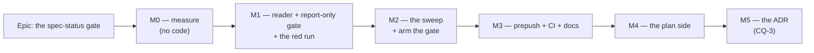

# Implementation Plan: A spec header states its approval, and a citation is what closes it

- **Feature spec:** [`./feature-spec.md`](./feature-spec.md) — **not yet approved**
- **Status:** Draft
- **Owner:** —

> **Nothing in this plan runs until the spec is approved.** The product owner's decision was "gate
> first, properly" over sweeping the headers now, so no header is edited before M2 — and M2 edits
> them only after M1's red run has recorded what they said.

## Breakdown

### Epic

**The spec-status gate** — close `docs/TECH_DEBT.md` #274 by making a spec header's approval state
computed rather than remembered, and by sweeping the estate as that gate's own red-run evidence.
Roadmap theme: repository maintenance / drift control (the ADR-0058 → ADR-0120 → ADR-0124 line).

**Two rules govern every milestone below, and they are not boilerplate.**

1. **A gate is finished when the defect it names has made it fail** (ADR-0110 D5). Each assertion's
   task names the exact mutation that must produce a red run, and the fixture stays in the tree.
   That ADR exists because a WCAG sweep passed for a year while blind to the control class it was
   written for; the same shape here is a status reader that cannot see `- **Status:**`.
2. **Every figure in the spec is re-derived by the gate, not carried forward.** #274's own recorded
   lesson is that a hand-count truncated its own input and reported the remainder as the answer.
   §1's table in the spec disagrees with #274 in three places; M0 settles all of them mechanically.

---

## Milestone 0 — Measure, and settle the three disagreements (no code)

**Outcome:** the population is known exactly, the header forms are enumerated, and the three
disagreements between the spec's §1 and #274 are resolved in writing.
**Entry point:** `Ships dark: M0 writes one document and no code. Nothing is reachable, and nothing
is meant to be.`
**Journey:** none. There is no browser and no user — see the spec §4.9 for what replaces a journey
in this epic, and M1-T4 for where the substitute lands.

---

#### Feature: the measurement record

> **Description:** `docs/specs/spec-status-gate/m0-measurement.md` — the population, the header
> forms, the join, and the corrections to #274.
> **Complexity:** S
> **Dependencies:** none
> **Risks:** the measurement is taken with hand-run commands, which is the instrument #274 records
> failing → every figure is re-taken by the gate at M1-T4 and the two are compared; a disagreement
> is a finding about the M0 method, recorded, not silently overwritten.
> **Testing requirements:** none (no code). The M1 red run is this document's check.

##### Task M0-T1 — Enumerate the population exactly

- **Description:** Count spec documents, plan documents, and directories holding neither. Resolve
  the `97` vs `~98` ambiguity, and confirm the three `spec.md` epics.
- **Complexity:** S
- **Dependencies:** none
- **Risks:** a truncating pipeline reports a subset as the total (#274's own defect) → **no `head`,
  no `| head -n`, and every count printed with its command beside it.**
- **Testing:** n/a
- **Development steps:**
  1. `find docs/specs -maxdepth 1 -mindepth 1 -type d | wc -l` — the directory count.
  2. `find docs/specs -maxdepth 2 -name 'feature-spec.md' | wc -l` and the same for `spec.md` and
     `implementation-plan.md`.
  3. List directories holding **no** spec document; confirm the seven named in the spec's §2 edge
     cases (`graphite`, `design-system-rewrite`, `workspace-visual-polish`,
     `calendar-hours-per-day`, `canvas-decomposition`, `canvas-maximisation`,
     `canvas-paint-loop-fixes`) and add any others.
  4. Record each number **with the command that produced it**.

##### Task M0-T2 — Enumerate the header forms and the status tokens

- **Description:** Every distinct status-line shape and every distinct leading token across all spec
  documents, so CQ-1's fold list is derived rather than guessed.
- **Complexity:** S
- **Dependencies:** M0-T1
- **Risks:** a regex that assumes the bullet form under-reports and looks complete → the sweep is
  deliberately over-generous (`grep -n 'Status:' ` with no anchor at all), and the anchoring decision
  is made _after_ seeing everything.
- **Testing:** n/a
- **Development steps:**
  1. Sweep un-anchored, then tabulate by prefix (`- `, `* `, `> `, bare, indented, none).
  2. Tabulate normalised leading tokens with counts; confirm the seven the spec names
     (`Draft`, `Approved`, `Proposed`, `Reviewed`, `Delivered`, `SUPERSEDED`, `**Awaiting`) and add
     any missed.
  3. Record the files whose status line is **not** at line 3 (the spec names five) and the one file
     with two status lines (`one-row-header`).
  4. Produce the **proposed fold** for CQ-1: token → vocabulary member, one line of reason each.

##### Task M0-T3 — Take the join, and record the blind spot with names

- **Description:** For every slug on disk, whether any `docs/adr/*.md` names it. Produce three lists:
  cited-and-`Draft` (the gate's future findings), cited-and-not-`Draft`, and uncited.
- **Complexity:** M
- **Dependencies:** M0-T1
- **Risks:** the citation regex invents a population by matching dangling paths → the join is taken
  **directory-first** (spec §4.4), and the dangling four (ADR-0029/0030/0031/0032, all citing
  `docs/specs/<slug>.md` files that live in `docs/plans/`) are confirmed to contribute nothing.
- **Testing:** n/a
- **Development steps:**
  1. Build the cited set; intersect with the slugs on disk.
  2. Produce the three lists in full — **no sampling**. The spec's §4.10 blind-spot claim rests on a
     21-slug sample; this replaces it with the whole estate.
  3. For each **uncited** slug, note whether its own header already claims a post-Draft state — that
     is the measure of how much the blind spot costs, and the spec's sample says only that two of
     fourteen shipped.
  4. Confirm the eleven `Proposed` ADRs' citations resolve as §4.4 claims: 0029/0030/0031/0032
     dangling, 0082/0083 citing no spec, the rest citing shipped work. **Any counter-example here
     changes the discriminator and stops the epic** for a decision.
  5. Record whether ADR-0029's `` `docs/specs/hierarchy-crud.md` `` is invisible to
     `check:doc-links`. If it is a live dangling citation, file a `docs/TECH_DEBT.md` row — it is
     out of this epic's scope and must not be silently absorbed.

##### Task M0-T4 — Confirm the two integration assumptions by running, not reading

- **Description:** Two claims in the spec's §3 dependencies are about other tools' behaviour and are
  therefore ADR-0076 claims.
- **Complexity:** S
- **Dependencies:** none
- **Risks:** an assumption about a neighbouring gate that is wrong is invisible until CI → both are
  executed.
- **Testing:** n/a
- **Development steps:**
  1. Add a throwaway `check:__probe` key to `package.json`, run `scripts/prepush.sh --checks`, and
     confirm the derived roster picks it up (`prepush.sh:130-133`). Remove it.
  2. Run `pnpm check:advisory-agreement` with a throwaway gate file containing (a) neither
     `advisory` nor `warnings.push`, then (b) a `warnings.push`, and record both verdicts. This is
     the claim that the new gate is automatically classified correctly; the spec asserts it from
     reading `check-advisory-agreement.mjs:132-139`, and reading is not running.
  3. Time `pnpm prepush --checks` and record which gate is slowest, for M1's budget.

---

## Milestone 1 — The reader, the gate, and the red run

**Outcome:** `pnpm check:spec-status --report` prints the complete finding list against the un-swept
tree, and that output is committed. Nothing is armed and no header is edited.
**Entry point:** `Ships dark: the script exists and is runnable, but is deliberately NOT in`
`package.json` — so `prepush.sh`'s derived roster does not pick it up and CI does not run it. This
is ADR-0120's exact sequence, and the reason is ADR-0058: a gate that fails on day one gets deleted
rather than fixed.
**Journey:** none, for the reason in the spec §4.9. Its substitute is M1-T4's committed red run plus
M1-T3's fixture suite, each case verified red against a named mutation.

---

#### Feature: `headerField()` in the shared parser

> **Description:** A new, separately-named export in `scripts/lib/doc-register.mjs` that reads a
> `**Field:**` line allowing an optional leading `-`, `*` or `>`, returning the first match.
> **Complexity:** S
> **Dependencies:** M0-T2 (the forms it must accept)
> **Risks:** somebody later "simplifies" it back into `fieldValue` → both docblocks name each other
> and state the discriminator, and a fixture pins that `fieldValue` returns `null` for the bulleted
> form, so the merge fails loudly.
> **Testing requirements:** cases in `scripts/lib/doc-register.test.mjs`, which `check:doc-register`
> already runs in CI (`ci.yml:70-71`).

##### Task M1-T1 — Add `headerField`, with its cases

- **Description:** The export, its docblock, and its fixtures.
- **Complexity:** S
- **Dependencies:** M0-T2
- **Risks:** widening the shared module changes a shipped gate's behaviour → **`fieldValue` is not
  touched**, and M1-T1 step 5 proves it by running `check:debt-status` before and after and
  comparing the summary lines byte for byte.
- **Testing:** `scripts/lib/doc-register.test.mjs` — **verified red first**, per case:
  - `- **Status:** X` returns `X` — red against `fieldValue`'s regex (this is the 85-of-88 case);
  - `> **Status:** X` returns `X` — red against a reader accepting only `- `;
  - `**Status:** X` still returns `X` — the form `fieldValue` handles, so the two agree where they
    overlap;
  - two status lines → the **first** is returned — red against a last-wins implementation;
  - a status line inside a fence → `null` — red against a reader that skips `stripFences`;
  - `  - **Status:** X` (indented) → `null` — the column-0 rule, red against a `\s*` prefix;
  - a prose line containing `**Status:**` mid-sentence → `null`.
- **Development steps:**
  1. Write the fixtures **first**, and assert each fixture's own contents before the case runs — the
     convention `ci.yml:65-69` records, after two cases shipped vacuous because Prettier had
     normalised away the malformation they were named for.
  2. Add `scripts/lib/fixtures/` entries to `.prettierignore` if new ones are added there
     (the ADR-0120 finding: Prettier de-indented a fixture, which kept its name and lost its point).
  3. Implement `headerField`.
  4. Write the docblock: what it accepts, why it is not `fieldValue`, and a pointer each way.
  5. Run `pnpm check:debt-status` before and after; the summary lines must be identical.

---

#### Feature: the gate script, report-only

> **Description:** `scripts/check-spec-status.mjs` — controls C0–C3 and refusals S1–S5, with
> `--report`, and **no** `package.json` key.
> **Complexity:** M
> **Dependencies:** M1-T1, M0-T3
> **Risks:** an assertion that passes vacuously → controls run first and each has its own pinned
> positive case (M1-T3); risk that the citation regex over-matches → directory-first intersection,
> pinned by a fixture.
> **Testing requirements:** `scripts/check-spec-status.test.mjs`, every case verified red.

##### Task M1-T2 — Implement the reader, the join and the assertions

- **Description:** The gate, in the shape of `check-debt-status.mjs`: parse, controls, refusals,
  `report()`.
- **Complexity:** M
- **Dependencies:** M1-T1
- **Risks:**
  - A `warnings.push` creeping in → **the file declares no `warnings` array at all**, following
    `check-debt-status.mjs:49-53`, with the reason in a comment. `report()`'s warnings path returns
    2 unconditionally and under `prepush.sh`'s inverted default that **blocks** with nothing on
    screen explaining why.
  - The glob misses `spec.md` → M1-T3's fixture covers it, and it is the epic's first measured blind
    spot, so it is called out in the docblock rather than being an implementation detail.
- **Testing:** see M1-T3.
- **Development steps:**
  1. Glob `docs/specs/*/feature-spec.md` **and** `docs/specs/*/spec.md`. Document the root-only rule
     (excluding `engine-conformance-framework`'s seven `M<n>-` sub-specs) and the `docs/plans/`
     exclusion in the docblock, so both read as decisions.
  2. `stripFences` → `headerField(md, 'Status')` → normalise the leading token with
     `check-debt-status.mjs:210-214`'s expression (`split(/[\s·—|]/)[0].toLowerCase().replace(/[*_`.]/g, '')`).
  3. Build the cited-slug set from `docs/adr/*.md` and **intersect with the slugs on disk**.
  4. Read `scripts/spec-status.json`.
  5. Emit C0 (via `report({ population })`), C1, C2, C3 **before** S1–S5.
  6. Emit S1, S2, S3, S4, S5. Each message names the file, the line, and the exact replacement text
     — a finding that sends the reader to grep defeats the point (`doc-register.mjs:53-61`).
  7. `--report` prints the summary even when clean, for M1-T4.
  8. **No `package.json` key yet.**

##### Task M1-T3 — Verify every assertion red against the defect it names

- **Description:** The fixture suite. This task is the milestone's substance, not its tail.
- **Complexity:** M
- **Dependencies:** M1-T2
- **Risks:** a case that passes against both the correct and the broken code proves nothing →
  **every case records, in its own docblock, the mutation that made it red**, and the mutation is
  applied and the red output pasted in during review.
- **Testing:** this _is_ the testing. Cases, each with its mutation:

  | Case                                                 | Mutation that must make it red                                                                                                        |
  | ---------------------------------------------------- | ------------------------------------------------------------------------------------------------------------------------------------- |
  | A cited fixture spec headed `Draft` fails            | remove the S3 assertion                                                                                                               |
  | Removing the citation makes the same spec pass       | make S3 unconditional (this half is what stops S3 becoming a blanket rule)                                                            |
  | A `spec.md` fixture is **found**                     | glob `feature-spec.md` only — the epic's first measured blind spot                                                                    |
  | A `> **Status:**` fixture is **found**               | accept only `- ` — the `operational-self-service` shape                                                                               |
  | `Delivered` is refused by S2                         | replace the vocabulary with a `Draft`-substring blocklist                                                                             |
  | `Accepted` with no `ADR-NNNN` fails S4               | drop the ADR requirement                                                                                                              |
  | `Accepted (ADR-9999)` with no such file fails S4     | check the pattern but not the file                                                                                                    |
  | An empty spec glob **fails**                         | pass `population: null` to `report()`                                                                                                 |
  | An empty cited set **fails** (C2)                    | delete C2 — S3 then passes vacuously and the gate reports OK over the whole defect                                                    |
  | Reader count ≠ naive count **fails** (C1)            | derive the naive count with `headerField` — the ADR-0124 A9 defect, where both sides shared one blind spot and agreed with themselves |
  | A dead exemption fails C3                            | delete C3                                                                                                                             |
  | A synthetic uncited slug is **not** in the cited set | make the citation regex match any slug — the negative control                                                                         |

- **Development steps:**
  1. Write each fixture. Assert its contents before the case runs.
  2. For each case: apply the mutation, run, **paste the red output into the case's docblock**, revert.
  3. Wire the suite into `check:doc-register`'s command, or give it its own key — decided at M3-T1
     by which keeps the roster honest; note that a second key means a second CI step.

##### Task M1-T4 — The red run

- **Description:** `docs/specs/spec-status-gate/red-run.md` — the gate's complete output against the
  un-swept tree, plus M0's figures re-derived by the gate.
- **Complexity:** S
- **Dependencies:** M1-T2, M1-T3
- **Risks:** the state being recorded is about to be destroyed, so this cannot be re-taken later →
  it is committed **before** M2 begins, in its own commit.
- **Testing:** n/a
- **Development steps:**
  1. `node scripts/check-spec-status.mjs --report > docs/specs/spec-status-gate/red-run.md` and
     head it with the date, the commit and the command.
  2. Compare its counts against M0's hand-derived ones. **Record any disagreement as a finding about
     the M0 method** — do not silently adopt the gate's number. #274's whole cautionary tale is a
     hand-count that was wrong and was believed.
  3. If the two agree, say so explicitly; agreement is evidence about both instruments.
  4. Commit alone.

---

## Milestone 2 — The sweep, and arming

**Outcome:** every spec document carries a vocabulary token; every cited spec is past `Draft`; the
gate is registered and blocking.
**Entry point:** `pnpm check:spec-status`, and `pnpm prepush` picks it up from the derived roster.
This is the milestone that makes the capability reachable.
**Journey:** none (spec §4.9). The substitute is M2-T4: `pnpm prepush --checks` run for real,
with the gate deliberately broken first, so its FAIL is observed rather than assumed.

---

#### Feature: the header sweep

> **Description:** Rewrite every spec document's status line into the canonical form with a
> vocabulary token, naming the ADR where one exists.
> **Complexity:** M
> **Dependencies:** M1-T4 (the red run must be committed first), CQ-1 answered
> **Risks:** ~91 files edited in one commit, and a wrong fold puts a false claim in a document → the
> sweep is driven by the red run's list rather than by re-reading each file, and every fold is one
> of the small set M0-T2 enumerated; each is listed in the commit message so it can be reversed.
> **Testing requirements:** the gate itself, run after each batch.

##### Task M2-T1 — Sweep the cited specs

- **Description:** Every spec the red run names as cited-and-`Draft` becomes
  `**Status:** Accepted — shipped (ADR-NNNN)`, using the citing ADR.
- **Complexity:** M
- **Dependencies:** M1-T4
- **Risks:** a spec cited by more than one ADR gets the wrong one → name the ADR whose `References`
  block cites the spec (the origin form, spec §4.4), and where that is ambiguous name both.
- **Testing:** `pnpm check:spec-status --report` after each batch; findings must fall monotonically.
- **Development steps:**
  1. Work the red run's cited-and-`Draft` list in order.
  2. For each, open the citing ADR and confirm the citation is an origin citation before writing its
     number into the spec. **Do not write a number from the grep alone** — that is the citation
     equivalent of trusting the document.
  3. Where the ADR is filed but the work has **not** shipped, write `Approved` rather than
     `Accepted` (spec §4.3), and note it in the commit message.
  4. Where neither is honest, add the slug to `scripts/spec-status.json` **with a reason**. Adding
     an exemption is a decision worth a sentence, not a way to make the gate quiet.

##### Task M2-T2 — Sweep the rest: forms and tokens

- **Description:** Every remaining spec document gets the canonical form and a vocabulary token.
- **Complexity:** M
- **Dependencies:** M2-T1
- **Risks:** folding `Reviewed`/`Delivered`/`Proposed` restates somebody else's judgement → apply
  CQ-1's answer mechanically and list every fold in the commit message.
- **Testing:** the gate.
- **Development steps:**
  1. Apply the folds from M0-T2, including `> ` and bare forms to `- `.
  2. **Sweep this epic's own spec and plan.** They are in the population, and a gate whose author
     exempted their own document would be a poor start.
  3. Confirm `revision-compare`'s `**Awaiting …` opening and `workspace-foot-and-deck`'s
     `SUPERSEDED IN PART …` both land on a token without losing the prose that made them useful.
  4. Run the gate; expect zero findings.

##### Task M2-T3 — The exemption register

- **Description:** `scripts/spec-status.json`, with `exempt`, `notes`, and whatever M2-T1 produced.
- **Complexity:** S
- **Dependencies:** M2-T1
- **Risks:** an empty register reads as dead config → `notes` states when to add an entry, and C3
  refuses an entry that is not live.
- **Testing:** C3's fixture (M1-T3).
- **Development steps:**
  1. Write the file, matching `scripts/adr-coverage.json`'s shape.
  2. If `exempt` is empty, say in `notes` that it is empty **by measurement** and name M0-T3 as the
     evidence.

##### Task M2-T4 — Arm it

- **Description:** Add the `package.json` key. Observe `prepush.sh` picking it up and failing.
- **Complexity:** S
- **Dependencies:** M2-T2, M2-T3
- **Risks:** arming over a non-zero finding count, which is how a gate gets deleted rather than fixed
  (ADR-0058) → the key is added only after a clean `--report`.
- **Testing:** the observation below **is** the test.
- **Development steps:**
  1. Confirm a clean run.
  2. Add `"check:spec-status": "node scripts/check-spec-status.mjs"`.
  3. Run `scripts/prepush.sh --checks`; confirm the gate appears in the derived roster and reports
     `ok`.
  4. **Break one spec header deliberately, re-run, and confirm `FAIL` — not `WARN`.** Revert. This
     is the difference between the gate being registered and the gate being enforced, and the two
     are distinguishable only by watching.
  5. Run `pnpm check:advisory-agreement`; it must still pass, confirming the gate is classified as
     incapable of exit 2 (the claim M0-T4 established the method for).

---

## Milestone 3 — CI, and the documents that now describe a computed rule

**Outcome:** the gate runs in CI; the templates carry the vocabulary; the process documents say the
rule is computed rather than remembered.
**Entry point:** the CI step `Check spec approval status`, on every pull request.
**Journey:** none. The substitute is the CI run itself — M3-T1's step is confirmed green on the
epic's own pull request before the milestone is called done, because a step that never ran is a step
whose YAML nobody has checked.

---

#### Feature: CI and the roster

> **Description:** A named step in `.github/workflows/ci.yml`, and `docs/TESTING.md` updated.
> **Complexity:** S
> **Dependencies:** M2-T4
> **Risks:** shipping the gate with local-only enforcement — the exact defect `ci.yml:149-155`
> records, where a spec asserted no new `check:*` script was added and was wrong → this is its own
> task, and the spec's §0 names the trigger.
> **Testing requirements:** the step observed green in CI.

##### Task M3-T1 — The CI step

- **Description:** Add the step beside `check:debt-status`, with a comment saying what it protects.
- **Complexity:** S
- **Dependencies:** M2-T4
- **Risks:** the comment states a number that then drifts — `ci.yml:141-142` records exactly that
  ("this comment said 34 until the register held 49") → the comment states the **rule**, never a
  count.
- **Testing:** observed green on this epic's own PR.
- **Development steps:**
  1. Add the step to the `Format, lint, typecheck & unit tests` job.
  2. Write the comment: fifty specs asserted that live work was unapproved; ADR-0105 makes that
     load-bearing; no count.
  3. If M1-T3's suite got its own key, add its step too.
  4. Confirm green in CI, then confirm **red** by pushing a deliberately broken header on a scratch
     branch. A CI step nobody has seen fail is a step nobody has checked.

##### Task M3-T2 — The templates and the process documents

- **Description:** `docs/templates/feature-spec.md`, `docs/templates/implementation-plan.md`,
  `docs/PROCESS.md`, `docs/RECONCILE.md`, `docs/TESTING.md`.
- **Complexity:** S
- **Dependencies:** M3-T1
- **Risks:** the template's own `- **Status:** Draft | In review | Approved | Superseded` line is
  itself outside the new vocabulary (`In review` is not a member) → the template is updated in the
  same commit as the vocabulary, or it teaches the next author a token the gate refuses.
- **Testing:** `pnpm check:doc-links`, `pnpm check:spec-status`.
- **Development steps:**
  1. Template: the five tokens, and the `Accepted — shipped (ADR-NNNN)` form.
  2. `docs/PROCESS.md`: one line under "Artifacts & templates" — the header is gated; a shipped
     spec names its ADR.
  3. `docs/RECONCILE.md`: state that this is **computed** and therefore not a manual step. Adding it
     as a checklist item would be the failure `check-adr-coverage.mjs:5-13` records — three passes,
     each finding the same defect by hand, the second calling itself "a numbered step and not a
     habit".
  4. `docs/TESTING.md`: the gate roster.
  5. Confirm the templates are outside the gate's glob (they are in `docs/templates/`, not
     `docs/specs/`) — **by running the gate**, not by reading the path.

---

## Milestone 4 — The plan side

**Outcome:** no implementation plan asserts an approval state its spec contradicts.
**Entry point:** the same `pnpm check:spec-status`; the gate gains assertion P1.
**Journey:** none. Substitute: P1's fixtures, each verified red, plus a second red run
(`red-run-plans.md`) recording what the estate said before the sweep.

---

#### Feature: the contradiction rule

> **Description:** P1 — a plan's `**Feature spec:**` annotation may not contradict its spec's token.
> A bare link asserts nothing and is clean.
> **Complexity:** M
> **Dependencies:** M3, CQ-2 answered
> **Risks:** the pre-approval wording set is a blocklist and a new phrasing slips through silently →
> the set is derived from M4-T1's full enumeration, and the docblock states it is a blocklist and
> therefore the gate's weakest assertion. **This is deliberately weaker than S2** and the difference
> is stated: the plan's annotation is free prose by design, so no closed vocabulary applies.
> **Testing requirements:** fixtures, verified red.

##### Task M4-T1 — Enumerate the plan annotations

- **Description:** Every distinct annotation across all `implementation-plan.md` files.
- **Complexity:** S
- **Dependencies:** M3
- **Risks:** #274's claim that all 67 carry `not yet approved` is **false** (spec §1(c): about 21 do,
  in ~6 phrasings, with roughly thirty carrying no annotation at all) → enumerate rather than assume,
  and record the correction in `m0-measurement.md` beside the other two.
- **Testing:** n/a
- **Development steps:**
  1. Sweep the `**Feature spec:**` lines un-anchored on the tail.
  2. Tabulate distinct annotations with counts.
  3. Note the files whose field is not at line 3 (`revision-compare:18`, `org-less-shell:21`,
     `engine-conformance-framework:9`) and any that point at a spec filename other than
     `feature-spec.md` (`workspace-foot-and-deck` → `./spec.md`).
  4. Derive the pre-approval marker set from what is actually there.

##### Task M4-T2 — Implement and sweep P1

- **Description:** The assertion, its fixtures, the red run, and the plan sweep.
- **Complexity:** M
- **Dependencies:** M4-T1
- **Risks:** a plan whose sibling spec does not exist (three plan-only directories were measured:
  `foot-row` has `spec.md`, so the pairing must follow the **directory**, not the filename) → the
  pairing is by directory and covers both spec filenames; a fixture pins a plan beside a `spec.md`.
- **Testing:**
  - a plan saying `not yet approved` beside an `Accepted` spec **fails** — red against no P1;
  - the same plan beside a `Draft` spec **passes** — red against an unconditional P1;
  - a bare-link plan beside an `Accepted` spec **passes** — red against a rule requiring an
    annotation, which would create the second maintained field the spec §4.8 rejects;
  - a plan in a directory whose spec is `spec.md` is **paired** — red against filename-based pairing.
- **Development steps:**
  1. Implement P1.
  2. Verify each case red.
  3. Commit `docs/specs/spec-status-gate/red-run-plans.md`.
  4. Sweep: contradictions only; leave bare links alone.
  5. Re-run; expect zero.

---

## Milestone 5 — The ADR (conditional on CQ-3)

**Outcome:** the discriminator's reasoning and its measurement survive in the decision record.
**Entry point:** `Ships dark: documentation only. No code, no gate change, no behaviour.`
**Journey:** none.

---

#### Feature: the decision record

> **Description:** An ADR carrying §4.4's discriminator, §4.3's vocabulary, §4.7's severity
> argument and §4.10's blind spot.
> **Complexity:** S
> **Dependencies:** M4; CQ-3 answered "yes"
> **Risks:** filed but unregistered — ADR-0071 sat uncited through a whole epic while shipped code
> cited it by number → `docs/adr/README.md`, `CLAUDE.md` §16 and the roadmap decision land in the
> **same commit**, which is `docs/adr/0083-shaded-form-fields.md:3-5`'s stated reason for doing so.
> **Testing requirements:** `pnpm check:adr-coverage`, `pnpm check:doc-links`.

##### Task M5-T1 — Write and register it

- **Description:** The ADR, plus its three registrations.
- **Complexity:** S
- **Dependencies:** M4
- **Risks:** reserving a number that is taken before filing (ADR-0079) → take the next free number
  **at the moment of filing**, and check `docs/adr/` again immediately before committing.
- **Testing:** `pnpm prepush --checks`.
- **Development steps:**
  1. Take the next free number. Do not reuse any number named in this plan or the spec.
  2. Write it: the problem, the four rejected predicates with their measurements, the vocabulary, the
     exit-code argument, the blind spot, and the trigger for revisiting it.
  3. Record the corrections this epic made to #274 — the three `spec.md` files, the header forms, and
     the false plan-side claim. Those are the ADR's evidence, not colour.
  4. Add the `docs/adr/README.md` row.
  5. Add a `docs/ROADMAP.md` mention **or** a `scripts/adr-coverage.json` exemption with a reason —
     `check:adr-coverage` demands one of the two.
  6. Add the `CLAUDE.md` §16 entry.
  7. `pnpm prepush --checks`.

##### Task M5-T2 — Close #274

- **Description:** Delete the row and ledger its number.
- **Complexity:** S
- **Dependencies:** M5-T1
- **Risks:** annotating the heading `CLOSED` instead of deleting the row — `check:debt-status`'s A3
  refuses exactly that → follow the register's own rule: delete, then ledger.
- **Testing:** `pnpm check:debt-status`.
- **Development steps:**
  1. Delete row 274.
  2. Add `274` to the Closed-numbers ledger with today's date.
  3. Lower `compactTableRatchet` in `scripts/debt-register.json` if the sweep converted a compact row
     (it should not have — check rather than assume; A7 fails in **both** directions).
  4. File any row M0-T3 step 5 produced (the ADR-0029 dangling citation).

---

## Sequencing & slices

Five slices, each leaving `main` releasable.

| Slice | Lands                                                    | Releasable because                                                                 |
| ----- | -------------------------------------------------------- | ---------------------------------------------------------------------------------- |
| M0    | one measurement document                                 | documentation only                                                                 |
| M1    | `headerField` + an **unregistered** script + the red run | the script is not in `package.json`, so nothing runs it; `headerField` is additive |
| M2    | the sweep + the `package.json` key                       | the key is added only after a clean run — the ADR-0120 sequence                    |
| M3    | CI step + templates + process docs                       | the gate already passes locally                                                    |
| M4    | P1 + the plan sweep                                      | P1 lands with its own sweep in the same slice; it never blocks over a red estate   |
| M5    | the ADR + closing #274                                   | documentation only                                                                 |

**No feature flag.** There is no user-facing surface and no `VITE_` constant could gate a Node
script; ADR-0088 D1 additionally records that a `VITE_` flag is inlined at build time and has never
been an operator rollback. The rollback here is a commit boundary — M2-T4 (the `package.json` key)
is the single line that arms it, and reverting that one line disarms the gate while leaving the
swept headers, which are an improvement on their own.

**The ordering constraint that is not negotiable:** M1-T4's red run is committed **before** M2's
first header edit. The state it records is destroyed by M2, and there is no way to take it
afterwards.

## Definition of Done (per task)

Each task's PR satisfies the Feature Completion Criteria in [`docs/PROCESS.md`](../../PROCESS.md).
Two are read narrowly here and one is added.

- **Tests** means the fixture suite, with **each case verified red against the mutation named in its
  own docblock**. A case that has never failed is not evidence (ADR-0110 D5).
- **The pre-push gate was run**, i.e. `pnpm prepush` — not its parts by hand. `scripts/prepush.sh`
  derives the roster from `package.json` precisely so nobody keeps a list in their head; running the
  parts is how the gate that refuses an unfiled ADR gets missed, which CLAUDE.md §19.8 records
  happening to a change whose whole subject was filing one. `scripts/e2e-local.sh` is **not**
  required: nothing here touches `apps/api` and no journey is added or changed.
- **Added:** every decision-bearing claim names the command, file or test that established it
  (ADR-0076). This plan cites `prepush.sh:130-133`, `doc-register.mjs:145-158`,
  `check-advisory-agreement.mjs:132-139` and `ci.yml:149-155`; M0-T4 exists because **two of those
  are claims about another tool's behaviour, and reading is not running.**

**No changeset.** Nothing user-visible changes in `@repo/web` or `@repo/api`; the change is
repository tooling and documentation. Stated rather than omitted, so it is a decision.

## Risks & assumptions (rollup)

| Risk / assumption                                                                               | Likelihood | Impact | Mitigation                                                                                                                                                                |
| ----------------------------------------------------------------------------------------------- | ---------- | ------ | ------------------------------------------------------------------------------------------------------------------------------------------------------------------------- |
| The gate is blind to a header form nobody enumerated                                            | med        | high   | C1's independent count, derived without the reader; M0-T2 enumerates un-anchored first                                                                                    |
| An assertion passes vacuously                                                                   | med        | high   | C0/C2 refuse empty populations; M1-T3's pinned positive **and** negative controls; controls ordered first                                                                 |
| The discriminator is wrong for a case nobody sampled                                            | low        | med    | M0-T3 replaces the 21-slug sample with the whole estate, and a counter-example **stops the epic** for a decision                                                          |
| The sweep writes a false claim into ~91 documents                                               | med        | high   | driven by the red run's list, not by re-reading; every fold enumerated in M0-T2 and listed in the commit message                                                          |
| The red run cannot be re-taken once M2 begins                                                   | high       | high   | M1-T4 commits it alone, before M2                                                                                                                                         |
| `check:advisory-agreement` classifies the new gate as advisory-capable                          | low        | med    | no `warnings` array at all; M0-T4 establishes the method by running it, M2-T4 confirms on the real gate                                                                   |
| The gate ships with local-only enforcement                                                      | med        | high   | M3-T1 is its own task; `ci.yml:149-155` records this exact failure, from a spec that asserted it would not happen                                                         |
| Arming over a red estate, so the gate is bypassed and then deleted                              | low        | high   | ADR-0120's report-only-then-arm sequence; the key lands after a clean run                                                                                                 |
| Widening `scripts/lib/doc-register.mjs` changes `check:debt-status`                             | low        | high   | `fieldValue` untouched; a **new** export; before/after summary lines compared byte for byte (M1-T1 step 5)                                                                |
| A future author merges `headerField` back into `fieldValue`                                     | med        | med    | reciprocal docblocks; a fixture pinning that `fieldValue` returns `null` for the bulleted form                                                                            |
| P1's marker set is a blocklist and misses a new phrasing                                        | med        | low    | stated as the gate's weakest assertion in its own docblock; derived from M4-T1's full enumeration                                                                         |
| Prettier normalises a fixture and the case keeps its name while losing its point                | med        | med    | `.prettierignore` for fixture files; each fixture asserts its own contents before its case runs                                                                           |
| **Assumption:** an ADR citing a spec is a record that the spec's design was taken as a decision | —          | high   | tested three ways in the spec §4.4 (0124:171, 0089:212, 0119:143 — all origin citations); M0-T3 tests it across the estate                                                |
| **Assumption:** every finding's remedy is an edit, so exit 1 is right                           | —          | med    | argued in the spec §4.7 against the `check:reconcile-due` comparison; if a judgement-shaped finding ever appears, that is an ADR amendment, not a quiet re-classification |
