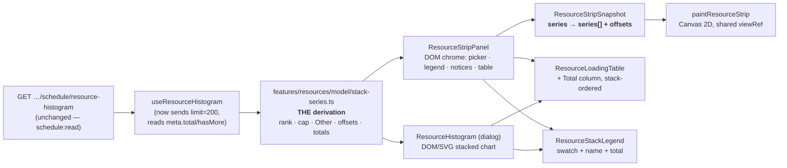

# Feature Spec: Stacked resource histogram

- **Status:** Draft — **awaiting approval before implementation**
- **Author(s):** feature-analyst (Claude Code), for James Ewbank
- **Date:** 2026-08-30 · **revised 2026-08-31** to fold four specialist reviews (§0.1)
- **Tracking issue / epic:** _(none yet)_
- **Roadmap link:** Resource management (ADR-0039 → ADR-0044 rung 5 → ADR-0049 Stage E)
- **Related ADR(s):** amends **ADR-0049 §6**; builds on ADR-0044, ADR-0053 §3, ADR-0097 Landing E,
  ADR-0102. Proposes **one new ADR** (§4.7).

---

## 0. What was verified, and how

Every decision-bearing claim in this document names the file, line or command that established it
(ADR-0076, `docs/PROCESS.md` "Decision-bearing claims carry their evidence"). Claims inherited from
the brief were re-checked like any other; **three of them were wrong** and are corrected in place:

| Claim as briefed                                                                                             | Verdict                           | Evidence                                                                                                                                                                                                                                                          |
| ------------------------------------------------------------------------------------------------------------ | --------------------------------- | ----------------------------------------------------------------------------------------------------------------------------------------------------------------------------------------------------------------------------------------------------------------- |
| "Ten categorical `--chart-*` tokens exist"                                                                   | **Wrong — there are twelve**      | `apps/web/src/styles/globals.css:219-230`; the block comment at `:195` opens "Twelve, not five."                                                                                                                                                                  |
| "`ResourceLoadingTable` is the existing shared `<table>` equivalent; decide whether it suffices for a stack" | **Already multi-series**          | `ResourceLoadingTable.tsx:63-77` takes `series: readonly ResourceHistogramSeries[]` and renders one column per series (`:93-101`). What it lacks is a **per-bucket total**, which is the stack's new fact — see §2 US-4.                                          |
| "Adding a journey may add a CI step"                                                                         | **No new config, no new CI step** | `apps/web/playwright.resource-view.config.ts` and `apps/web/e2e-resource-view/resource-view.spec.ts` already exist, wired at `.github/workflows/ci.yml:342-343` (`test:e2e:resource-view`) with its report artefact at `:770`. Both milestones extend that suite. |

Confirmed as briefed (re-read, not trusted):

- The endpoint returns **all** series against a shared axis in `meta`
  (`schedule.controller.ts:299-323`; `plan-resource-histogram.dto.ts:44-69`). `limit` default 50,
  max 200 (`resource-histogram-query.dto.ts:22-33`).
- `ResourceHistogramSeriesDto` carries `resourceId`/`values`/`total` and **no capacity field**
  (`plan-resource-histogram.dto.ts:26-42`).
- The engine is **units-only** — `computeResourceHistogram`'s result is
  `{ granularity, buckets, series, curveNormalisedCount }` with no money term anywhere
  (`engine/resource-histogram.ts:135-146`, `:244`, `:316-334`).
- The dialog already iterates every series (`ResourceHistogram.tsx:80`) but as **N separate
  small-multiple charts**, each `bg-primary/70` (`:86-94`).
- The canvas strip is **one resource at a time**, and that is a type-level fact:
  `ResourceStripSnapshot.series` is a **singular** `ResourceHistogramSeries`
  (`render/resource-strip.ts:52-60`), `ResourceStripPalette` has one `bar: string`
  (`render/paint.ts:2067-2071`), and the picker is a single-select `<Select>`
  (`resource-strip-panel.tsx:131-142`).
- **ADR-0049 never argues for one-at-a-time.** Its §4 says "selected series values" and §6 "the
  selected resource's whole-series peak" — the singular is assumed throughout and defended nowhere.
  It is an unexamined premise, not a recorded decision.
- ADR-0049 §6 defers a capacity line to M3 "the read-model is demand-only; capacity needs an API
  touch".
- `resources.max_units_per_hour` exists (`packages/types/src/index.ts:1740-1745`), so a limit line
  is a DTO change, not new data modelling.
- ADR-0053 §3's `parentId` and the non-assignable `GROUP` kind are on the **list read**
  (`ResourceSummary.parentId` / `.kind`, `packages/types/src/index.ts:1730-1738`), which the web
  already fetches via `useResources`.

**Three things nobody had reported, found while reading:**

1. **The web client never sends `limit`.** `resourceHistogramQueryOptions` requests
   `…/resource-histogram?granularity=${granularity}` and nothing else
   (`use-resources.ts:544`), so it takes the server default of **50**; and it destructures only
   `buckets`/`granularity`/`curveNormalisedCount` from `meta` (`:548-550`), so it never reads
   `total` or `hasMore`. A plan with more than 50 loaded resources is silently truncated, with no
   signal on either surface. Today that hides a few charts; **stacked, it makes the total wrong** —
   which is the number the stack exists to show. See §2 US-5.
2. **The 50 it takes is arbitrary.** The engine emits series **sorted by `resourceId`**
   (`engine/resource-histogram.ts:332`) — a UUID sort — and the service slices that
   (`schedule.service.ts:1067-1068`). So the truncated page is not "the 50 biggest"; it is 50 at
   random. Any client-side "top N" computed over one default page would be top-N-of-a-random-50.
3. **The `--chart-*` ramp has no computed gate.** `globals.css:201-215` asserts three constraints
   — ≥ 3:1 on the diagram ground and the month band (worst member 3.10:1), a legible inside label
   (worst 4.93:1), ≥ 25° of hue from the reserved criticality semantics — and **all three live in a
   CSS comment**. `token-contrast.test.ts` contains no chart pair (searched; the only `.test.ts`
   under `apps/web/src` referencing `chart-1` is `render/lenses.test.ts`, which uses a stub
   palette). That is an ADR-0058 Class 1 shape, pre-existing — and this feature is the first to make
   the ramp load-bearing for **touching** segments, where the same comment records the worst
   adjacent pair at **1.46:1** (`globals.css:214`). See §4.5.

### 0.1 What the specialist reviews corrected — kept visible, not silently replaced

Four reviews (ui-architect, ux-reviewer, frontend-performance-reviewer, accessibility-reviewer) ran
against the approved draft on 2026-08-31. **All four agreed with the epic**; every finding below is a
condition of that agreement. Nine of them contradict something this document asserted, and the house
habit is to correct in place and say so rather than edit quietly (ADR-0071's second half, ADR-0102's
closing section). Each was re-verified against the code before folding, and one reviewer claim was
itself sharpened by that check.

| #      | What this spec said                                                    | What is true                                                                                                                                                                                                                                                                                                                                                                                                                                                           | Where it is now fixed       |
| ------ | ---------------------------------------------------------------------- | ---------------------------------------------------------------------------------------------------------------------------------------------------------------------------------------------------------------------------------------------------------------------------------------------------------------------------------------------------------------------------------------------------------------------------------------------------------------------- | --------------------------- |
| **1**  | US-4: the strip's `ResourceLoadingTable` is "unchanged from today"     | **False of the strip.** `resource-strip-panel.tsx:173-180` renders the table only `{selectedSeries ? … : null}` and passes `series={[selectedSeries]}`. With an "all" sentinel `selectedId` is not a `resourceId`, so `selectedSeries` is `null` (`:82`) and **the strip loses its text equivalent entirely** — a WCAG 2.2 AA regression the draft would have shipped, with no unit test failing because none mounts the panel in that state. True of the dialog only. | §2 US-4; new task **M2-T0** |
| **2**  | US-6 "byte-for-byte today's behaviour" vs US-1 "does not special-case" | **Mutually contradictory.** Today's single bar is `palette.bar` (`--primary`); rank-1 under D2 is `--chart-1`. Both sentences were in the approved spec. Resolved toward the stronger promise: the isolated path keeps `bar`.                                                                                                                                                                                                                                          | §2 US-1/US-6; new **D7**    |
| **3**  | "the same exported token list" / "shared, never a copy"                | **Currently impossible.** `WBS_CYCLE_TOKENS` is a module-private `const` (`render/palette.ts:21`) — only resolved forms are exported. Verified: no `export` on that declaration anywhere. The seam has to be designed, not assumed.                                                                                                                                                                                                                                    | new **D8**; **M1-T0**       |
| **4**  | The dialog uses Tailwind `fill-chart-N` classes                        | **A scanner hazard.** Nothing uses `fill-chart-*`/`bg-chart-*` today; Tailwind v4 scans for literal strings, so an interpolated class compiles to no CSS — unstyled in a browser, green in jsdom asserting the `className`. Verbatim ADR-0100 M4's minimap-frame defect, same token family. The shipped precedent is `lensLegendVarPalette()` (`render/palette.ts:341-352`) rendering `var(--chart-N)` as inline style.                                                | §4.6; **M1-T4**             |
| **5**  | The 1 px separator "makes the WCAG question moot" — a workaround       | **Understated: it is the correct mechanism.** The separator is drawn in the ground colour, and every fill is already required ≥ 3:1 against that ground, so the boundary is guaranteed ≥ 3:1 against **both** neighbours however close the two fills are to each other. Standard adjacent-wedge technique. Say it plainly.                                                                                                                                             | §4.6                        |
| **6**  | Implied that adjacent fills need to contrast with each other           | **No success criterion requires it.** 1.4.11 applies to the **boundary**; 1.4.1 is satisfied because **position** is a second non-colour channel (descending-total order, shared by legend and table). The register already establishes this for the Today/Data-date pair (`token-contrast.test.ts:427-449`). So **no adjacent-fill pair is added** — which makes the gate smaller and more honest.                                                                    | §4.6                        |
| **7**  | The contrast gate's grounds are `page` and `canvas`                    | **Both wrong for the dialog.** It paints on `--card` (`dialog.tsx:87` `bg-card`), and the strip's chrome panel on `bg-card/95` (`resource-strip-panel.tsx:125`). `--card`/`--popover` are ADR-0097 **resets, deliberately outside every scope's closure**, so no `<Surface>` wrapper brings them into line. TECH_DEBT #162 records this repository shipping a chart-adjacent swatch against exactly this reset once already.                                           | §4.6; **M1-T2**             |
| **8**  | `bucketRects` is the co-alignment oracle to leave untouched            | **It has no production caller.** Grep across `apps/web`: the only non-test reference is its own definition; the painter calls `bucketBarsFromDays` (`paint.ts:2107`). M2-T1 as drafted would have protected the wrong function.                                                                                                                                                                                                                                        | **M2-T1**                   |
| **9**  | M2-T1: "the existing suites green without modification"                | **False as stated.** `TsldCanvas.resource-strip.test.tsx:38` and `:157` construct `ResourceStripSnapshot` **literals**, so a snapshot shape change necessarily edits them. Only `render/resource-strip.test.ts`'s alignment assertions are the untouched oracle.                                                                                                                                                                                                       | **M2-T1**                   |
| **10** | `ResourceLoadingTable`'s `bucketTotals` prop "decided at build"        | **Not permissible** — a shared component's public contract is an ADR-0105 trigger this spec's own §4.9 lists as firing. Decided here: **derived internally**, so the total cannot disagree with the numbers beside it.                                                                                                                                                                                                                                                 | §4.6; **D9**                |
| **11** | Cited **CLAUDE.md §19.13** for the `<Select>` sentinel                 | **Overstated.** The strip's picker is a **native `<select>`**; §19.13 targets hand-rolled primitives (`Deck`/`Menu`/`Combobox`/`Tabs`/`Dialog`/`*Field`). Corrected rather than repeated — the ADR-0082 habit. The review is still commissioned, because finding **1**/**X3** shows a native control gaining an option is not risk-free on **naming**.                                                                                                                 | plan **M2-T0**, **M5-T1**   |

**Two more the reviews found that this spec had not considered at all**, and one where the check
sharpened the reviewer:

- **The strip does not export or print, and ADR-0103's gate structurally cannot see it.** Filed as
  `docs/TECH_DEBT.md` **#223** (2026-08-31, raised by this epic's UX review). Named in §3 as a known,
  accepted, **pre-existing** exclusion so this epic does not silently inherit it.
- **The `--chart-*` ramp is already safe from the ADR-0102 alias trap**, and the plan relied on a
  docblock to say so. `token-alias-reads.structural.test.ts:82-97` fails any source file naming a
  `--color-*` alias. State the gate, not the comment.
- **`plan:scale-500` is worse than "likely trivial" — it holds exactly ONE resource.**
  frontend-performance said the named fixture probably resolves to something trivial;
  `scale/generator.ts:319-331` declares a single `SCALE_CREW`, and `:203` assigns it to 35 % of
  tasks (`assignedFraction: 0.35`, `:76`). So that plan produces a **one-segment stack** and cannot
  exercise the multi-segment paint path at all — it would measure the feature's cost as zero.
  _(Unresolved and recorded rather than resolved: `docs/TEST_PLAYBOOK.md:193` says the same plan is
  "478 of 478 unassigned" for DCMA metric 10. Both cannot describe the same rows; the discrepancy is
  outside this epic and is not assumed away — M2-T5 must read the fixture's actual series count and
  print it, not trust either document.)_

---

## 1. Business understanding

### Problem

The product owner, who plans with Primavera P6 professionally, reported from real use:

> "One thing I notice is that resource view is limited to one resource I think. Other apps like P6
> show stacked resources with shading / colour I think which is very beneficial."

They are right, and the diagnosis is narrower than "we are missing a chart". **SchedulePoint's API
has returned every resource's series against one shared axis since ADR-0044 rung 5** — the DTO
docblock says the axis lives in `meta` "so paging the series never splits it"
(`plan-resource-histogram.dto.ts:45-46`), which is a sentence written by somebody anticipating
multi-series display. Two clients then failed to use it, in two different ways:

- The **canvas strip** shows exactly one resource, chosen from a `<Select>`. It is singular in the
  **type**, so no second series can be drawn without a signature change.
- The **dialog** shows all of them, as a vertical run of one-colour small-multiple charts. Nothing
  is hidden, and nothing is comparable either: a planner reading "how much labour is there in
  March?" must add up N charts by eye.

Neither surface can answer the question a resource profile exists to answer — **how much total
demand is there in this period, and who is contributing it** — which is precisely what P6's stacked
Resource Usage Profile answers and what the product owner is asking for.

### Why now

Because the competitive opening is unusually clean, and it comes from P6's own advocates. The
tutorial the product owner supplied (planacademy.com) explains that a P6 stacked histogram is built
by adding **one filter per stack segment** in Resource Usage Profile Options, and then says, close
to verbatim:

> "Unfortunately, if you want to display every resource, you do need to go in add the filter for
> each resource. Something I find really tedious. I have been searching for easier or kind of
> shortcut ways… but I have come up with no ideas."

Five trades in that tutorial's screenshot is five hand-built filter dialogs, per layout, per user.
**Our endpoint already returns every series.** So the shape that is expensive in P6 —
stacked-by-default, every resource, zero configuration — is the shape that is _cheapest_ for us. That
is the feature's centre of gravity, and it is not "catch up with P6"; it is "do the thing P6 users
have publicly given up on".

The source's stated advantages, which are the acceptance bar: richer information than the standard
profile; "shows how each resource / resource grouping contribute to the overall labor in a given time
period"; "shows relative proportions"; "allows you to view and analyze resource trends".

**What the source does _not_ support, stated because an earlier framing of this work claimed
otherwise:** P6's stacked histogram has **no limit line and no over-allocation shading**. The value
is proportion and total, not capacity. Limit/over-allocation is real work, needs the API touch
ADR-0049 §6 already flagged, and must be justified on its own merits — not carried in on this
feature's back (§3 Dependencies, "explicitly out of scope").

### Users

| Role (ADR-0016)    | What they need here                                                                                                                                                               | Permission                   |
| ------------------ | --------------------------------------------------------------------------------------------------------------------------------------------------------------------------------- | ---------------------------- |
| **Planner**        | The primary reader. Sees total demand per period and its composition; spots the month where four trades peak together.                                                            | `schedule:read` (any member) |
| **Org Admin**      | As Planner.                                                                                                                                                                       | `schedule:read`              |
| **Contributor**    | Reads the profile to understand where their work sits in the programme.                                                                                                           | `schedule:read`              |
| **Viewer**         | Reads it.                                                                                                                                                                         | `schedule:read`              |
| **External Guest** | **Excluded.** `ShareGuestController`'s fixed `SCHEDULE_READ` scope carries plan/activities/dependencies/summary and explicitly **not** resources (ADR-0051 F-M3). No change here. | n/a                          |

The histogram is **units, not cost**, so it is `schedule:read`-gated and not `cost:read` — a
decision already made and recorded on the endpoint (`schedule.controller.ts:284-286`, "This is
SCHEDULE data (units), not cost, so it is schedule:read-gated — never cost:read (Q5)"). Nothing in
this feature changes that, and §4.6 explains why keeping it that way constrains the cost question.

### Primary use cases

1. **Read total demand over time.** Open the profile and see one bar per bucket whose height is the
   plan's total loaded units in that period.
2. **Read the composition of that total.** See which resources make up each bar, by colour, with a
   legend naming each.
3. **Compare periods.** See that March's total is twice January's, and that the difference is one
   trade rather than all of them.
4. **Isolate one resource.** Fall back to today's single-resource reading without losing it.
5. **Read the exact numbers.** Get every bucket's per-resource value and its total as text, without
   a mouse and without sight.

### User journeys

**Happy path (canvas).** A planner opens a plan, presses **Resource view** on the plan commands
toolbar. The strip band appears under the diagram, axis-aligned as today — but now every loaded
resource is stacked in one column per bucket, coloured from the categorical ramp, with the legend in
the DOM chrome panel above the band naming each colour. They pan; the stack pans with the diagram
(unchanged — same `viewRef`, ADR-0049 §2). They pick one resource from the picker to isolate it, and
"All resources (stacked)" to return.

**Happy path (dialog).** A planner opens **Analysis ▾ → Resource histogram…**. Instead of a vertical
run of one-colour charts they get one stacked chart with a legend on its left (P6's placement, and
the placement the supplied source calls out because "it can show up on printouts"), a granularity
control, and the same keyboard-navigable table below carrying every resource's numbers **plus a per-
bucket total column**.

**Alternate — many resources.** A plan loads 30 resources. The chart stacks the **top 8 by total**
and aggregates the rest into one "Other (22 resources)" segment in the neutral colour, named in the
legend with its own total. The table below is **not** aggregated: every one of the 30 has its own
column. Nothing is hidden; the chart is a summary and the table is the record (§4.7 D3).

**Alternate — very many resources.** A plan loads more than 200. The chart says so, in words, and
says what it is therefore not showing (§2 US-5). This is the only state in the feature where the
picture is knowingly incomplete, and it is the one state that must never be silent.

**Alternate — nothing to show.** No assignments with budgeted units: today's empty-state copy,
unchanged on both surfaces.

### Expected outcomes

- A planner reads total demand and its composition in one glance, on either surface, with **zero
  configuration** — the thing P6 charges five dialogs for.
- The canvas strip's 72 px band carries N resources instead of 1, at no extra vertical cost.
- The dialog stops being a scroll of unrelated charts and becomes one readable profile.
- Nothing already reachable is lost: single-resource reading survives as an isolation, and the
  accessible table gains a column rather than losing any.

### Success criteria

| #   | Criterion                                                                                                                                     | How measured                                                                                                                                                                                                                                                                                  |
| --- | --------------------------------------------------------------------------------------------------------------------------------------------- | --------------------------------------------------------------------------------------------------------------------------------------------------------------------------------------------------------------------------------------------------------------------------------------------- |
| S1  | Both surfaces default to stacked-all with **no control touched**                                                                              | Journey: reveal the strip / open the dialog and assert ≥ 2 distinct segment fills without interacting with any picker                                                                                                                                                                         |
| S2  | The stacked total is **arithmetically right** — the drawn segment heights sum to the bucket's true total across every shown series plus Other | Unit: property test over the pure derivation, `Σ segments === Σ series.values[i]` for every bucket                                                                                                                                                                                            |
| S3  | No two **shown** segments share a colour, ever, at any resource count                                                                         | Unit: structural test over the derivation for 1…200 series                                                                                                                                                                                                                                    |
| S4  | Every number on the chart is reachable as text **on both surfaces, in both stacked and isolated states**                                      | Unit + axe: the `<table>` carries per-resource values **and** the per-bucket total; the chart stays `aria-hidden`. **The strip's stacked default renders the full series set** — the draft's version of this criterion was satisfied by a strip that renders no table at all (§0.1 finding 1) |
| S5  | A truncated or aggregated picture says so                                                                                                     | Unit: `hasMore` ⇒ visible notice; `Other` ⇒ legend entry naming its count and total. **Both notices' copy is drafted together**, because `Other (N)` and the `hasMore` notice can co-occur and are two different incompletenesses                                                             |
| S6  | The strip's paint cost stays inside the committed budget                                                                                      | §3 Condition 1 — written **before** measurement, at **Week and Fit**, on a **named** fixture, at a **pinned DPR**                                                                                                                                                                             |
| S7  | **A planner can distinguish every segment the strip claims to show, at 72 px**                                                                | §3 Condition 2 — a judgement against a screenshot at 1646, recorded with the screenshot. The feature's premise, which the draft costed and never tested                                                                                                                                       |
| S8  | Flag-off / rollback is a clean revert                                                                                                         | No new `VITE_` flag (§4.7 D6); each milestone is one revertible commit                                                                                                                                                                                                                        |

### Open questions

**CRITICAL — these change the design or the scope, and want the product owner's answer.**

> **Q1 — Which surface is "resource view", and does the 72 px strip band stay 72 px?**
>
> The product owner's words name "resource view", which is the **canvas strip's** toolbar label
> (`e2e-resource-view/resource-view.spec.ts:76`, `getByRole('button', { name: 'Resource view' })`).
> But P6's Resource Usage Profile is a **resizable pane occupying roughly a third of the screen**,
> and our strip is a fixed **72 px** band (`TsldCanvas.tsx:184`, `RESOURCE_STRIP_HEIGHT = 72`), of
> which 66 px is bar area after `STRIP_BAR_TOP_PAD` (`render/resource-strip.ts:64`).
>
> Stacking works at 72 px — eight segments at a peak bucket average ~8 px each, which reads as
> proportion — but it is not what they are looking at in P6. Making the band resizable is a
> separate, genuinely useful change (the workspace already has an orientation-aware resizable-panel
> primitive, ADR-0030) that would compete for the vertical budget five consecutive epics have been
> fighting over (ADR-0090/0091/0092/0112/0114).
>
> **My default if unanswered:** ship stacking into the existing 72 px band unchanged, and file the
> resizable band as its own item. Rationale: stacking at 72 px is strictly more information in the
> same space than today, and it does not spend a pixel of a budget this repository has repeatedly
> found it does not have.

> **Q2 — Is the dialog in scope, or only the canvas strip?**
>
> The dialog (`Analysis ▾ → Resource histogram…`) has the same defect in a different costume — it
> renders every series and still cannot answer "what is the total". Doing only the strip leaves one
> surface stacked and its neighbour not, which is verbatim the drift shape this register records
> five times (ADR-0064 §7, ADR-0067, ADR-0092, ADR-0099 M5, ADR-0114 M6).
>
> **My default:** both, on **one shared derivation**, sequenced dialog-first because it is where the
> vertical space to read a stack actually exists and it requires no canvas type change — so the
> risky half lands second on proven arithmetic.

**Non-critical — defaults stated; work proceeds on them unless overridden.**

- **Q3 — the top-N cap.** Default **8**, derived as `min(WBS_LEGEND_CAP, cycle.length)` — the exact
  rule `legendGroupCap` already applies (`render/lenses.ts:202-207`). Reusing the existing number
  rather than inventing a second one is the point; a stack must additionally never let two shown
  segments share a fill, which the `≤ cycle.length` half structurally guarantees.
- **Q4 — cost mode.** P6 offers "At Completion Units **or** Cost". Default: **deferred and named,
  not excluded** — `resource.costPerUnit` and the EV read-model exist (ADR-0042), so a cost profile
  is a real future capability; but `computeResourceHistogram` has no money term at all
  (`engine/resource-histogram.ts:135-146`), so it needs an API touch **and** a permission change
  (cost is `cost:read`, the histogram is `schedule:read`). Excluding it would be a claim we cannot
  support; promising it here would be scope we have not costed.
- **Q5 — > 200 resources.** Default: **request `limit=200`, read `hasMore`, disclose in words.** Not
  paging, and the reason is measured from the code: the service computes the **whole** histogram and
  then slices it in memory (`schedule.service.ts:1010-1068`), so offset paging costs one full
  recomputation per page. One request at the documented maximum is one round trip; four requests to
  page 200 would be four complete histogram computations for the same picture.
- **Q6 — stack order and colour assignment.** Default: **descending `total`, colour by rank.** See
  §4.7 D2 for why rank rather than a stable per-resource hash.
- **Q7 — the S-curve.** The supplied source singles out a cumulative overlay as the one option worth
  having. Default: **in scope as its own milestone**, frontend-only, off by default — but it is now
  **M4, sequenced after grouping**, and its strip half is pre-flagged as likely-withdrawn (§4.7
  "Milestone order"). See **Q8**, which asks whether it belongs in this epic at all.

**CRITICAL — two more, added by the review round.**

> **Q8 — should the S-curve stay in this epic?**
>
> The ui-architect review recommended reordering grouping ahead of it, which is folded (§4.7
> "Milestone order"), and then asked a second question the reorder does not answer: **should the
> S-curve be deferred out of the epic entirely?** The case for deferring is that grouping is where
> the product **leads** P6 — one dropdown against one filter dialog per segment — and it turns
> "Other (32 resources)" into named trades, which improves the feature's weakest state; whereas the
> S-curve's strip half is already flagged as probably not fitting a 72 px band with a second labelled
> axis, so half of it is likely to be withdrawn on measurement.
>
> **This is recorded as a decision for the product owner, not taken here.** The reorder is a
> sequencing call an analyst can make; dropping a milestone the product owner's own supplied source
> singles out as the one option worth having is not.
>
> **ANSWERED 2026-08-31 — the product owner deferred it out of the epic**, against my default of
> keeping it. It becomes its own slice, taken up straight after this epic merges.
>
> The reasoning I put to them was the architecture review's: the S-curve adds a second scale, a
> right-hand axis, another column to the shared table and a `View ▾` control, all for something off
> by default, and it widens the diff the gate pass has to cover — while its strip half is already
> pre-flagged as probably not fitting a 72 px band. My own default was wrong on the balance of that,
> and is left above rather than replaced.
>
> **Deferral trigger, so this is a decision rather than a drift:** it is picked up as the next slice
> after this epic's release, and needs no new prerequisite — the derivation M1 builds already
> produces the array it sums. If it has not been built by the time a third milestone lands on either
> surface, that is the signal it was quietly dropped rather than deferred.

> **Q9 — colour follows rank, so a re-ranking reshuffles colours. P6 does not do this.**
>
> **D2** assigns cycle member _n_ to segment _n_, so if two resources swap totals — after a
> granularity change with an exact tie, an assignment edit, or a recalculation — **their colours
> swap**. P6's stacked profile is the opposite: colour is assigned manually per filter and is
> therefore permanent, which is one of the reasons its setup is tedious.
>
> The draft recorded this as an accepted cost inside D2 and put it in a docblock. The UX review's
> point is that a planner who has learnt "the steel crew is the purple one" and then sees purple move
> is not reading a docblock. **Raised here rather than left in the design**, because the alternative
> — a stable per-resource assignment — cannot be had for free: a hash can collide among the shown set
> (D2's recorded reason), so stability would need a **persisted** per-resource colour, which is a
> schema change and a different epic.
>
> **ANSWERED 2026-08-31 — the product owner kept rank-assignment**, having been told plainly that
> it differs from the P6 behaviour they are used to. The reshuffle is **visible rather than
> silent** — the legend re-orders with it, on screen, in the same frame — and ties are the only case
> a granularity change can produce (each series' `total` is invariant across granularities,
> `engine/resource-histogram.ts:330`).
>
> The stable-per-resource alternative is filed as `docs/TECH_DEBT.md` **#225** rather than left in
> this document, because it is a schema change and a different epic: a hash can collide among the
> shown set, so genuine stability needs a colour persisted against each resource. Recording it there
> means the question survives this spec being archived.

---

## 2. Functional requirements

### User stories & acceptance criteria

> **US-1** — As a **Planner**, I want the resource profile to show every resource stacked in one
> chart by default, so that I can read total demand per period and who is contributing it without
> configuring anything.
>
> **Acceptance criteria**
>
> - **Given** a plan with three loaded resources **when** I open either surface **then** each bucket
>   is drawn as one column of three coloured segments, and I have touched no control.
> - **Given** that chart **when** I read a bucket's column height **then** it represents the sum of
>   all shown resources' units in that bucket, on a scale fitted to the plan's **peak stacked
>   total** (not any one resource's peak).
> - **Given** the segments **then** they are ordered **descending by resource total**, largest at
>   the baseline, and the legend lists them in that same order.
> - **Given** two vertically adjacent segments **then** a 1 px separator in the surface's ground
>   colour separates them, so the boundary does not depend on the two fills differing.
> - **Given** two adjacent segments whose drawn heights are small **then** the separator is
>   **suppressed where either neighbour is under 2 px**, so ink never dominates the segment it
>   divides (**D10** — at the strip's 66 px this is the common case, not the edge case).
> - **Given** a plan whose loaded-resource count is 1 **then** the chart is a single-colour stack
>   and the legend has one entry — the degenerate case renders, it does not special-case **the
>   derivation**. _(Corrected after review: as drafted this contradicted US-6. The **colour** is a
>   special case and deliberately so — see **D7**. A single stacked segment is painted `--chart-1`;
>   a single **isolated** series keeps today's `--primary`.)_

> **US-2** — As a **Planner**, I want a legend naming each colour, so that the colours mean
> something.
>
> **Acceptance criteria**
>
> - **Given** the stacked chart **then** a legend renders with one entry per shown segment, each
>   carrying a swatch **and the resource's name as text** (WCAG 1.4.1 — colour is never the sole
>   carrier; the `buildColourLegend` precedent, `render/lenses.ts:476-482`).
> - **Given** the **dialog** **then** the legend sits to the **left** of the plot area (P6's
>   placement, cited in the supplied source because it prints).
> - **Given** the **canvas strip** **then** the legend renders in the existing DOM
>   `<section aria-label="Resource loading">` chrome panel, **not** on the canvas — the strip canvas
>   is `aria-hidden` by ADR-0049 §5 and painting text into it would put the only naming of the
>   colours somewhere assistive technology cannot reach.
> - **Given** a legend entry **then** its accessible name includes the resource name and its total
>   units.

> **US-3** — As a **Planner** on a plan with many resources, I want the chart to stay readable, so
> that a twelfth trade does not make the picture meaningless.
>
> **Acceptance criteria**
>
> - **Given** more than 8 loaded resources **when** the chart renders **then** the top 8 by `total`
>   are drawn individually and the remainder are aggregated into **one** segment.
> - **Given** that aggregate **then** it is labelled **"Other (N resources)"** with N the exact
>   count, carries the exact summed total in its legend entry, and is painted in the neutral colour
>   (`--muted-foreground`), **never** a member of the categorical cycle.
> - **Given** the aggregate exists **then** it is drawn **last** (furthest from the baseline), so
>   the individually-named resources keep the stable end of the stack.
> - **Given** 8 or fewer resources **then** no "Other" segment renders at all — an empty aggregate is
>   not drawn as a zero.
> - **Given** the ranking **then** it is by **whole-series total**, never per-bucket. A resource that
>   just misses the cap can therefore dominate one bucket from inside "Other". _(Recorded, on the UX
>   review's request, so nobody "fixes" it into per-bucket ranking — that would re-rank the stack
>   every bucket, destroying colour stability and the legend's meaning at once.)_

> **US-4** — As a **screen-reader or keyboard user**, I want every number the chart shows to be
> available as text, so that the stack is not the only representation.
>
> **Acceptance criteria**
>
> - **Given** either surface **then** the chart remains `aria-hidden` and the
>   `ResourceLoadingTable` remains its text equivalent.
> - **Given the canvas strip in stacked mode** **then** the table renders **the full series set**,
>   and in isolation it renders `[selectedSeries]`.
>
>   > **This criterion is a correction, and the draft's version was a WCAG regression.** It read
>   > "unchanged from today — `ResourceHistogram.tsx:77-79`, `resource-strip-panel.tsx:166-182`",
>   > which is true of the dialog and **false of the strip**. The panel renders the table inside
>   > `{selectedSeries ? … : null}` and passes `series={[selectedSeries]}`
>   > (`resource-strip-panel.tsx:173-180`); `selectedSeries` is `series.find(s => s.resourceId ===
selectedId) ?? null` (`:82`). An "all" sentinel is not a `resourceId`, so under the draft the
>   > strip's stacked default would have had **no text equivalent at all** — the chart hidden from
>   > assistive technology by design, and nothing behind it. No unit suite would have caught it,
>   > because none mounts the panel in that state. It is a task in its own right (**M2-T0**), not a
>   > line in another one.
>
> - **Given the strip's `<summary>` disclosure** **then** its label names what the table contains —
>   `Show data table (all resources)` when stacked, `Show data table for <name>` when isolated.
>   Today's label is `Show data table for {resourceName(selectedId ?? '')}` (`:170`), and
>   `resourceName` falls back to `'Unknown resource'` (`:66`), so the sentinel would announce
>   **"Show data table for Unknown resource"** in the feature's own default state. Asserted as its
>   own test in both states.
> - **Given** the stack introduces a **new** fact — the per-bucket total — **then** the table gains a
>   **Total** column carrying it, and the table's `<tfoot>` carries the grand total. Without this the
>   chart shows a number the text equivalent does not.
> - **Given** the chart aggregates into "Other" **then** the table does **not**: every loaded
>   resource keeps its own column. The chart is a summary; the table is the record.
> - **Given** the chart's segment order **then** the table's column order matches it (descending
>   total), so a reader moving between the two is not re-mapping. _(This changes today's column
>   order, which is the engine's `resourceId` UUID sort — `engine/resource-histogram.ts:332`.)_
> - **Given** the table **then** its caption states the aggregation rule in words, so a reader who
>   only has the table knows the chart grouped and they did not.

> **US-5** — As a **Planner**, I want to be told when the picture is incomplete, so that I never read
> a total that is silently missing demand.
>
> **Acceptance criteria**
>
> - **Given** the read returns `meta.hasMore === true` **then** a visible, `role="status"` notice
>   names the shown count and the true `meta.total`, and says the chart's totals are therefore
>   understated.
> - **Given** `hasMore === false` **then** no notice renders — the common case is silent.
> - **Given** the existing `curveNormalisedCount > 0` notice **then** both notices can coexist; they
>   describe different things and neither suppresses the other.

> **US-6** — As a **Planner**, I want to isolate one resource, so that I keep today's reading.
>
> **Acceptance criteria**
>
> - **Given** the canvas strip **then** its picker's **first and default** option is **"All
>   resources (stacked)"**, and each resource remains selectable below it.
> - **Given** I pick one resource **then** the strip draws that resource alone, scaled to its own
>   whole-series peak, **in `palette.bar` (`--primary`) — byte-for-byte today's behaviour for that
>   selection**, including its fill. _(This is the half of the US-1/US-6 contradiction that survives;
>   see **D7**. It is the stronger promise, and it is the one a planner can check.)_
> - **Given** I return to "All resources (stacked)" **then** the stack returns, and the table and the
>   `<summary>` label switch with it (US-4).
> - **Given** the dialog **then** it has **no** picker (it never had one) and always stacks — the
>   dialog's job is the whole plan.

> **US-7** _(**M4** — renumbered; see §4.7 "Milestone order")_ — As a **Planner**, I want a
> cumulative S-curve over the stack, so that I can read the programme's overall loading trend.
>
> **Acceptance criteria**
>
> - **Given** the stacked chart **when** I enable the overlay **then** a line is drawn whose value at
>   bucket _i_ is `Σ(totals[0..i])`, scaled to its own right-hand axis with a labelled maximum.
> - **Given** the overlay **then** it is **off by default** and its state is remembered nowhere
>   persistent (matching the granularity control's current session-local behaviour, `TECH_DEBT` #43).
> - **Given** the overlay **then** the table gains a **Cumulative** column, so the line is text too.
> - **Given** the overlay is off **then** nothing about the paint changes (the parity condition for
>   the milestone).

> **US-8** _(**M3** — renumbered; see §4.7 "Milestone order")_ — As a **Planner**, I want to stack by
> resource **grouping** rather than by individual resource, so that a programme with 40 resources
> reads as five trades.
>
> **Acceptance criteria**
>
> - **Given** the resource library contains `GROUP` nodes (ADR-0053 §3) **when** I choose
>   **Stack by → Group** **then** each segment is one top-level group and each resource's units are
>   attributed to its group ancestor.
> - **Given** a resource with no group **then** it is attributed to an "Ungrouped" segment in the
>   neutral colour, following the `buildColourLegend` precedent (`render/lenses.ts:519-521`).
> - **Given** **Stack by → Kind** **then** segments are `LABOUR`/`EQUIPMENT`/`MATERIAL` etc.
> - **Given** any grouping **then** the total per bucket is **identical** to the ungrouped stack —
>   grouping re-partitions, it never re-sums. This is the milestone's own acceptance gate.
> - **Given** grouping **then** it is one dropdown, and that is the whole configuration — against
>   P6's one filter dialog per segment.

### Workflows

**W1 — read the profile (canvas).** Toolbar `Resource view` → strip band + chrome panel appear →
histogram query (`granularity=WEEK`, `limit=200`) → derivation stacks → snapshot published to
`TsldCanvas` → strip layer painted from the shared `viewRef` → legend + notices in the DOM panel →
`<details>` discloses the table.

**W2 — read the profile (dialog).** `Analysis ▾` → `Resource histogram…` → same query, same
derivation → one stacked chart + left legend + table.

**W3 — change bucket size.** `BucketSizeSelect` → refetch at the new granularity → derivation re-runs
→ **the segment→colour assignment is recomputed from the new ranking.** Totals are conserved across
granularities (each series' `total` is invariant — `engine/resource-histogram.ts:330` sets
`total: expected`), so the ranking, and therefore the colours, are stable across a granularity change
in every case except an exact tie.

**W4 — isolate (canvas only).** Picker → one series → today's single-series path, unchanged.

### Edge cases

| Case                                      | Behaviour                                                                                                                                                                                                    |
| ----------------------------------------- | ------------------------------------------------------------------------------------------------------------------------------------------------------------------------------------------------------------ |
| No series at all                          | Today's empty state, verbatim on both surfaces. No chart, no legend.                                                                                                                                         |
| Exactly one series                        | Stacks; one segment in `--chart-1`, one legend entry. The **derivation** does not special-case; the **colour** does, and deliberately (**D7**) — an isolated single series stays `--primary`.                |
| Strip in stacked mode, table disclosed    | The table renders **every** series, and the `<summary>` reads `Show data table (all resources)`. Both are new behaviour, not inherited — see §0.1 finding 1 (**M2-T0**).                                     |
| A segment whose drawn height is < 2 px    | Drawn, with **no separator** on the affected boundary (**D10**). Identity comes from the legend and the table, which is where it comes from at any size.                                                     |
| Exactly 8 series                          | All named; **no** "Other".                                                                                                                                                                                   |
| 9 series                                  | Top 8 named + "Other (1 resource)" — singular in the copy.                                                                                                                                                   |
| 200+ series                               | Top 8 + Other + the US-5 truncation notice. The chart is knowingly incomplete and says so.                                                                                                                   |
| A bucket where every value is 0           | Column height 0. Nothing drawn. Not an error.                                                                                                                                                                |
| A resource whose whole series is 0        | It has `total === 0`, ranks last, and lands in "Other" if one exists. Drawn as a zero-height segment otherwise, which is invisible — acceptable, because its legend entry names it and the table carries it. |
| Two resources with identical totals       | Tie broken by `resourceId` ascending (the engine's own order, `:332`) — deterministic, so the colours do not flicker between renders.                                                                        |
| A resource name that does not resolve     | Today's `'Unknown resource'` fallback (`ResourceHistogram.tsx:35`).                                                                                                                                          |
| Peak stacked total is 0                   | Nothing to scale against; the painter draws the axis rule only (today's `band.max <= 0` guard, `render/resource-strip.ts:105`).                                                                              |
| Granularity change mid-flight             | `keepPreviousData` holds the old chart (`use-resources.ts:534`); the derivation is pure so the transition cannot show a half-stacked frame.                                                                  |
| Strip active and a resource is unassigned | Existing invalidation sweeps the prefix (`use-resources.ts:497-505`); the stack redraws with one fewer segment and re-ranks.                                                                                 |

### Permissions

Unchanged, and that is the point. Reads only, `schedule:read`, any organisation member, resolved
through the existing `assertCan` on the endpoint (`schedule.service.ts:1004-1005`). No new
permission, no role gate, no pen (ADR-0028) — this feature writes nothing. External Guest remains
excluded by `ShareGuestController`'s fixed scope, unchanged.

### Validation rules

No user input is introduced beyond selections from closed sets:

- `granularity` ∈ `HISTOGRAM_GRANULARITIES` — already validated both sides (`@IsIn`,
  `resource-histogram-query.dto.ts:19`).
- `limit` ≤ 200 — already validated server-side (`@Max(200)`, `:28`). The client will send exactly
  200; if that constant and the DTO's maximum ever diverge, the server rejects, which is the safe
  direction.
- The picker's value is a `resourceId` present in the current series, or the sentinel "all" — the
  existing "fall back to the default if the pick is no longer in the series" rule
  (`resource-strip-panel.tsx:80-81`) is kept and extended to the sentinel.

### Error scenarios

| Scenario                                        | Detection                            | User-facing result                                                                           | Status |
| ----------------------------------------------- | ------------------------------------ | -------------------------------------------------------------------------------------------- | ------ |
| Not a member of the organisation                | `resolveScope` / `assertCan`         | Existing not-found (no existence oracle)                                                     | 404    |
| Plan not found or soft-deleted                  | `findActiveByIdInOrg`                | Existing not-found                                                                           | 404    |
| Granularity too fine for the plan's span        | `HistogramTooManyBucketsError`       | Existing "use a coarser one" 422 (`HISTOGRAM_GRANULARITY_TOO_FINE`)                          | 422    |
| Lag phasing walks past the working-time horizon | `rejectIfWorkingTimeHorizonExceeded` | Existing `CALENDAR_WORKING_TIME_UNREACHABLE` 422                                             | 422    |
| Network / unknown failure                       | TanStack Query `isError`             | Today's "Couldn't load the resource histogram." + **Try again** — unchanged on both surfaces | —      |
| More series than one page returns               | `meta.hasMore`                       | **New:** a `role="status"` notice naming shown-of-total (US-5)                               | 200    |

Every row above except the last is pre-existing and untouched. The feature adds **no new error
path** — which follows from it adding no request the API did not already serve.

---

## 3. Technical analysis

| Area               | Impact     | Notes                                                                                                                                                                                                                                                                                                                                                                                                                                                |
| ------------------ | ---------- | ---------------------------------------------------------------------------------------------------------------------------------------------------------------------------------------------------------------------------------------------------------------------------------------------------------------------------------------------------------------------------------------------------------------------------------------------------- |
| **Frontend**       | **High**   | One new pure derivation module; the dialog chart replaced; the canvas strip's snapshot/palette/painter widened from one series to N; the shared table gains a Total column; a legend component.                                                                                                                                                                                                                                                      |
| **Backend**        | **None**   | No module, service, endpoint, DTO or OpenAPI change. The client starts sending a `limit` the DTO has accepted since ADR-0044 rung 5.                                                                                                                                                                                                                                                                                                                 |
| **Database**       | **None**   | No model, column, index, constraint or migration. **`database-architect` is therefore not engaged — because there is no schema change to design, not because one was judged too small** (the ADR-0091 phrasing; CLAUDE.md §19.3's rule is unconditional and this is a statement that its trigger does not fire, verified by the milestones' file scope in the plan).                                                                                 |
| **API**            | **None**   | `git diff --stat apps/api packages/types` is expected empty for M1–M4. Named as a per-PR check, not as an armed gate — see below.                                                                                                                                                                                                                                                                                                                    |
| **Security**       | **None**   | No new endpoint, no new permission, no new input. The one behavioural change server-side is a larger `limit` on an already-`schedule:read`-gated read; the response is already org- and plan-scoped (`schedule.service.ts:1004-1008`).                                                                                                                                                                                                               |
| **Performance**    | **Medium** | Two distinct questions: (a) the strip painter goes from O(visible buckets) to O(visible buckets × shown segments), bounded at 9; (b) the request returns up to 200 series instead of 50, i.e. up to 4× the payload and the same server-side computation (the service already computes **all** series before slicing, `:1048` then `:1068` — so the larger `limit` costs the server **nothing extra**, only the wire). Falsification condition below. |
| **Infrastructure** | **None**   | No new service, env var, secret, container or CI step. `playwright.resource-view.config.ts` and its CI step already exist (`ci.yml:342-343`).                                                                                                                                                                                                                                                                                                        |
| **Observability**  | **None**   | No new log, metric or trace. The route stays `REASONS.READ` in the audit census (`audit-coverage.structural.spec.ts:237`) — a read, unchanged.                                                                                                                                                                                                                                                                                                       |
| **Testing**        | **High**   | Pure-derivation unit tests (the bulk); component tests on both surfaces; **new contrast pairs in `token-contrast.test.ts`** (a shared gate — see §4.5); extended steps in the existing `e2e-resource-view` journey; a browser measurement harness for the strip.                                                                                                                                                                                     |

### The recalculation-parity position — verified, not copied

**`computeSchedule` is not imported by anything this feature touches, and no migration runs, so the
ADR-0034 recalculation parity gate is untouched by construction. In its honest form: there is
nothing here to hold parity for.**

The evidence, rather than the sentence:

1. The resource histogram is a **separate pure module** from the CPM engine —
   `apps/api/src/modules/schedule/engine/resource-histogram.ts`, exporting
   `computeResourceHistogram` (`engine/index.ts:27-31`). The endpoint calls **that**
   (`schedule.service.ts:1048`), never `computeSchedule`.
2. `docs/adr/0049` already established the same position for the strip's first stage ("frontend-only;
   `git diff --stat apps/api packages/types` empty", ADR-0049 §Context), and this feature is strictly
   inside that boundary.
3. M1–M4 change `apps/web/` only. That is a property of the plan's file scope, and it is checked by
   reading `git diff --stat apps/api packages/` on each PR.

**It is deliberately _not_ armed as `scripts/frontend-only.json`.** That declaration is currently
`"active": false`, deactivated 2026-08-26 on the **third** occasion it outlived its epic, having
twice gone "wrong about a DIFFERENT change" — it blocked ADR-0096's legitimate `apps/api` work and
then a nine-file lint-script change, each time citing a finished epic's parity argument
(`scripts/frontend-only.json:5`, `:7-18`). `docs/TECH_DEBT.md` #194 records that "the epic's own gate
pass removes it" has failed twice as a written instruction and "wants a mechanism rather than a third
sentence". Arming it here would be supplying the third sentence.

### What the strip already does not do — a pre-existing exclusion this epic inherits

**The canvas resource strip does not appear in the exported PNG/PDF or the printed diagram, and
ADR-0103's parity gate structurally cannot report that.** `docs/TECH_DEBT.md` **#223**: the strip is
painted from `TsldCanvas`'s own `stripRef`, a separate ref from `sceneRef`, and
`export/scene-parity.structural.test.ts:30-31` parses exactly `TsldCanvas.tsx`'s `sceneRef` literal
plus `use-diagram-image.ts` — so `resourceStrip` is invisible to the comparison in **both**
directions and can be neither a composed key nor a declared exclusion-with-a-reason.

Named here, in the spec, because this epic makes the strip carry **more** information: a planner who
can now read total demand and its composition on the strip is more likely to try to export it, and
"the picture we hand somebody who was not in the room" is exactly what ADR-0103 is about. **It is not
in scope** — closing it is an export-path change with its own parity argument — but inheriting it
silently is how it stays inherited. Not a regression, not caused here, and now written down where the
next reader of this surface will meet it.

### Performance — the falsification conditions, committed before any measurement

Written now, before anything is built or measured, because this repository's habit is that a number
produced after the fact gets tuned to the answer (ADR-0100 M0, ADR-0119, ADR-0110 D5). There are
**three**: paint cost, **legibility**, and the payload. The second was missing from the draft, and
its absence was the sharper of the two performance findings — the feature's whole premise at 72 px is
that a stack is _readable_ there, and only its _cost_ had a pre-committed test.

> **On what this is measured against — the correct framing of `docs/TECH_DEBT.md` #75, because half
> of it is routinely quoted alone and both halves are half-truths.** #75's own correction
> (2026-08-03) establishes that **there is no §16 in ADR-0026** (its sections run to §9a) and that
> **4 ms was never a budget** — it is the measured p95 of a throwaway 2026 prototype, recorded as a
> PASS against a ≤ 16 ms frame. The real gate in §9 is **≥ 45 fps @ 500 and ≥ 30 fps @ 2,000**. On
> real hardware at 2,016 activities the shipped painter measures **Week 3.9 ms p95 with 0/600 frames
> dropped**, and **Fit 8.9 ms p95 inside a 16.7 ms frame and yet 10.2 % dropped** (interval p95
> 33.4 ms). So the gate is met and a planner still sees judder at Fit — which is the finding that
> matters: **paint duration is the wrong quantity**, and frame pacing is the right one. The
> 16.7–23.1 ms headless figures quoted elsewhere are software-rasterised and not the target
> envelope. This spec's conditions therefore report **both** a duration delta and dropped frames, and
> quote neither the alarming nor the reassuring half alone.

> **Condition 1 — paint cost.** On a named fixture with **≥ 9 genuinely assigned resources across a
> multi-year span** (see below), at **both** the **Week** preset **and** a **Fit / whole-plan** view,
> at **1646 CSS px** with **`deviceScaleFactor` pinned and stated**, with the strip revealed:
>
> **`paintResourceStrip`'s own p95 must be ≤ the single-series baseline + 2.0 ms**, over ≥ 200 frames
> of a scripted pan, with **paired same-session runs** and **the baseline's own run-to-run spread
> reported in the verdict**. The run additionally reports the **total** frame cost and the **dropped
> frame count**, not the delta alone.
>
> Four amendments to the draft's version, each from the performance review and each because the
> draft's condition could have passed while the feature was slow:
>
> 1. **Fit zoom is added, and it is the real worst case.** Bucket count scales with **plan span**,
>    not with zoom: a two-year plan at WEEK is ~104 buckets, and at Fit **nothing is culled**, so
>    every one of them pays up to 9 fills + 8 separators instead of 1. Fit is also where the
>    pre-existing painter has its thinnest margin (10.2 % dropped, above). The feature's worst case
>    and the painter's worst case coincide at a zoom the draft's condition never visited.
> 2. **The fixture is named, and `plan:scale-500` is disqualified.** It declares exactly **one**
>    resource (`scale/generator.ts:319-331`, `SCALE_CREW`) assigned to 35 % of tasks (`:203`,
>    `assignedFraction: 0.35` at `:76`) — a **one-segment stack**, which would measure this feature's
>    cost as approximately zero and report a pass that means nothing. M2-T5 either names a
>    catalogue plan whose series count it has **read and printed**, or builds a fixture; it may not
>    name "the largest resourced plan" and let that resolve at run time.
> 3. **DPR is pinned.** This is a fill-rate-bound measurement and the backing store scales by DPR²;
>    1646 is the Surface Pro's **CSS** width, and that device is DPR ≈ 1.75. An unstated DPR is an
>    unstated 3× in the quantity being measured.
> 4. **The timing isolates `paintResourceStrip`**, not the whole rAF tick — the
>    `measure-link-routing.mjs` precedent, which times `paintScene` itself. A whole-tick number
>    cannot attribute a millisecond to this layer, which is `docs/TECH_DEBT.md` #75's own complaint
>    about the pre-ADR-0078 painter.
>
> **If it fails**, the response is recorded, not tuned: first reduce the shown-segment cap for the
> strip only (the dialog is DOM and unaffected); if that does not clear it, **the strip stack is
> withdrawn and the dialog stack ships alone**. The number goes in the milestone document either way.
>
> **Two instrument hazards, named in advance because both have produced false results here.**
> (a) `reuseExistingServer` is true outside CI, so a dev server left from another harness is silently
> adopted and a config's flag pins never apply — this produced three consecutive false diagnoses in
> one session (ADR-0099); `scripts/e2e-local.sh` now refuses while anything answers on 3000 or 5173,
> and the run must go through it. (b) A counting-stub gate asserts the **shape** of the per-frame
> cost, not a millisecond count, because a CI runner's absolute timings are noise (ADR-0054); the
> browser measurement is the number, the stub is the regression guard, and neither substitutes for
> the other.

> **Condition 2 — legibility at 72 px. NEW, and it tests the feature's premise rather than its cost.**
>
> The draft justified the 72 px band with "eight segments over 66 px of bar area averages ~8 px
> each", and labelled that as reasoned from geometry rather than observed. **The arithmetic assumes
> an even split, and real trade loading is skewed** — a peak bucket is commonly one dominant trade
> and several small ones, so named segments land at 1–3 px, and off-peak buckets (the majority of any
> real profile) are worse: at half the peak the same eight segments average 4 px, at a quarter, 2 px.
>
> **On the same named fixture, at 1646 CSS px, at the Week preset, at the strip's default 72 px:
> every segment the chart claims to show must be distinguishable from its neighbours in a screenshot
> a person looks at** — which means, concretely, that no shown segment renders at **0 px** and the
> reviewer can identify each legend colour in the peak column and in a median column.
>
> **If it fails**, in order: (a) lower the strip's shown-segment cap below the dialog's, so the two
> surfaces differ in **how many** segments they name and never in what a segment means — the
> derivation takes `cap` as a parameter precisely so this is a call-site change; (b) if even a
> reduced cap is illegible, **the strip ships un-stacked and the dialog carries the feature**, which
> is the same withdrawal Condition 1 names and for a better-founded reason.
>
> This condition is deliberately **not** expressed as a millisecond or a pixel threshold on a
> computed value. It is a judgement, made once, against a screenshot, recorded in the milestone
> document with the screenshot attached — because "can a planner read this?" has no arithmetic form,
> and inventing one would be a number tuned to the answer wearing a gate's clothes.

> **Condition 3 — the payload. The `limit=50 → 200` change must not add measurable server time.**
> Expected: **zero**, because `getResourceHistogram` computes every series and _then_ slices
> (`schedule.service.ts:1048`, `:1067-1068`) — the limit governs only what is serialised. If the
> measured API p95 moves by more than 10 ms at 200 series, that expectation was wrong and the finding
> is recorded as such.

**Two things the strip measurement does not cover, stated rather than implied.** `stackSeries` is
`useMemo`'d on `[series, cap]`, so it runs on data change and not per frame — the conditions above
measure the painter, and the derivation's cost is a separate (and much smaller) question. And the
**table has no virtualisation**: `ResourceLoadingTable` renders `buckets.length` rows × `series.length

- 2` cells, and the DTO's ceiling is 200 series, so a 200-series DAY-granularity table is a large DOM.
  That ceiling is pre-existing and is not made worse here — but the stack is what makes reaching it
  plausible, and it is the one number in this feature that is unbounded by the cap.

### Dependencies

**Must be true before starting (all verified):**

- `GET …/schedule/resource-histogram` returns all series against a shared axis — yes.
- `ResourceLoadingTable` accepts N series — yes (`:63-77`).
- A categorical ramp with paired inks exists, declared once — yes, `WBS_CYCLE_TOKENS`
  (`render/palette.ts:21-34`), 12 members, each `[fill, jsdom fallback, ink]`.
- A legend model with a cap-and-"+N more" precedent exists — yes, `buildColourLegend` /
  `WBS_LEGEND_CAP` (`render/lenses.ts:194-207`, `:484-523`).
- A flag-on journey and CI step for this surface exist — yes (`ci.yml:342-343`).

**Affected features:** the canvas strip (ADR-0049), the histogram dialog (ADR-0044 rung 5), the
shared loading table, the resource-view journey, the Colour-by lens's palette module (shared
`WBS_CYCLE_TOKENS` — read, not modified).

**Explicitly out of scope, with reasons:**

- **Capacity / limit line / over-allocation shading.** ADR-0049 §6 defers it needing an API touch
  (`max_units_per_hour` on the histogram DTO). The supplied P6 source has neither on its stacked
  profile. It is real work with its own justification and its own ADR question, and folding it in
  here would let it ride on a decision that does not support it.
- **Cost mode.** Engine has no money term; needs an API touch **and** a permission question
  (`cost:read` vs `schedule:read`). Deferred and named (Q4).
- **A resizable strip band.** Q1's default is no; if answered otherwise it becomes its own milestone,
  because it spends a vertical budget five epics have been contesting.
- **URL-deep-linkable granularity.** `docs/TECH_DEBT.md` #43, pre-existing, orthogonal.

---

## 4. Solution design

### 4.1 Architecture overview

The load-bearing structural idea is that **stacking is one pure derivation, called twice**, and
neither renderer re-derives anything. That is the ADR-0065 `routeOrthogonal` argument applied here:
two implementations of "what are the segments" would drift, and the drift would be **invisible**,
because each surface looks right alone and only a reader comparing the dialog and the strip on the
same plan would ever see one is wrong.



Two properties are what make this affordable:

- **The API is untouched.** Every input the derivation needs is already in the response.
- **The canvas seam is unchanged in kind.** ADR-0049 §4's snapshot-through-a-ref model, the
  `stripDirtyRef`/`dirtyRef` split, the shared `viewRef`, `screenXOfDay` co-alignment and the
  theme-bump palette re-resolve all stay exactly as they are. What changes is the **shape** of the
  data on the ref, not the mechanism.

### 4.2 Data flow

```mermaid
sequenceDiagram
  autonumber
  actor P as Planner
  participant T as Toolbar
  participant H as Host (dialog / strip panel)
  participant Q as TanStack Query
  participant A as API
  participant S as stack-series.ts (pure)
  participant C as TsldCanvas rAF loop

  P->>T: Resource view  /  Analysis ▾ → Resource histogram…
  T->>H: mount
  H->>Q: useResourceHistogram(org, plan, WEEK)
  Q->>A: GET …/resource-histogram?granularity=WEEK&limit=200
  A-->>Q: { data: series[], meta: { buckets, total, hasMore, curveNormalisedCount } }
  Q-->>H: { series, buckets, total, hasMore, … }
  H->>S: stackSeries(series, { cap: 8 })
  S-->>H: { segments[], bucketTotals[], other?, truncated }
  alt dialog
    H->>H: render SVG columns + left legend + table(+Total)
  else canvas strip
    H->>C: onSnapshot({ segments, dayOffsets, dataDate, max, … })
    Note over C: sets stripDirtyRef → strip repaints only
    C->>C: paintResourceStrip(ctx, snapshot, viewRef, band, palette, dpr)
  end
  P->>H: pan / zoom
  Note over C: dirtyRef set by the viewport change;<br/>the stack re-aligns on the same frame — unchanged from ADR-0049 §3
```

### 4.3 User flow

```mermaid
flowchart TD
  Start([Plan workspace]) --> Choice{Which surface?}
  Choice -->|Resource view button| Strip[Strip band + chrome panel]
  Choice -->|Analysis ▾ → Resource histogram…| Dialog[Resource histogram dialog]

  Strip --> Load{Data?}
  Dialog --> Load
  Load -->|loading| Spin[“Loading histogram…”]
  Load -->|error| Err[“Couldn’t load…” + Try again]
  Load -->|no series| Empty[“No resource loading to show yet…”]
  Load -->|series| Stack[Stacked chart, all resources, no config]

  Stack --> N{More than 8?}
  N -->|yes| Other["top 8 + “Other (N resources)”"]
  N -->|no| All[all named]
  Other --> More
  All --> More
  More{"meta.hasMore?"} -->|yes| Notice[role=status: showing X of Y — totals understated]
  More -->|no| Read

  Notice --> Read[Read totals · composition · trends]
  Read --> Table["Show data table → per-resource values + Total column"]
  Read --> Iso{Isolate?}
  Iso -->|strip only| One[Pick one resource → today’s single-series view]
  One -->|“All resources (stacked)”| Stack
```

### 4.4 Database changes

**None.** No model, column, index, constraint or migration. `database-architect` is not engaged
because there is no schema change to design (§3).

### 4.5 API changes

**None.** No route, DTO, status code, error or OpenAPI change.

One **client-side** change to an existing request, and it is a defect fix rather than a feature:
`resourceHistogramQueryOptions` (`use-resources.ts:523-555`) starts sending `limit=200` and starts
surfacing `meta.total` / `meta.hasMore` through `ResourceHistogramResult`. Today it sends no limit
and reads neither (`:544`, `:548-550`), so it silently takes an arbitrary UUID-ordered 50. That is
already wrong; the stack is what makes it **visibly** wrong, because a missing series changes the
height of every column rather than removing one small chart from a scroll.

### 4.6 Component changes

| Component                                                           | Change                                                                                                                                                                                                                                                                                                                                                                                       | Contract impact                                                      |
| ------------------------------------------------------------------- | -------------------------------------------------------------------------------------------------------------------------------------------------------------------------------------------------------------------------------------------------------------------------------------------------------------------------------------------------------------------------------------------- | -------------------------------------------------------------------- |
| **`features/resources/model/stack-series.ts`** _(new)_              | The pure derivation: rank by `total` desc (ties by `resourceId` asc), cap at `min(WBS_LEGEND_CAP, cycleLength)`, aggregate the remainder into `other`, compute per-bucket cumulative offsets and totals, and the peak stacked total. No React, no DOM, no colour — colour is the caller's, resolved per surface.                                                                             | New public API                                                       |
| **`features/resources/components/ResourceStackChart.tsx`** _(new)_  | The dialog's stacked plot: an `aria-hidden` SVG of per-bucket columns, 1 px ground-coloured separators, fills as **inline `var(--chart-N)`** — the `lensLegendVarPalette` precedent (**D8**), _not_ Tailwind `fill-chart-N`.                                                                                                                                                                 | New                                                                  |
| **`features/resources/components/ResourceStackLegend.tsx`** _(new)_ | Swatch + name + total, ordered by rank, shared by both surfaces. Left of the plot in the dialog; in the chrome panel for the strip.                                                                                                                                                                                                                                                          | New                                                                  |
| **`ResourceHistogram.tsx`**                                         | Small multiples → one `ResourceStackChart` + `ResourceStackLegend` + the truncation notice.                                                                                                                                                                                                                                                                                                  | Internal                                                             |
| **`ResourceLoadingTable.tsx`**                                      | Gains a **Total** column and a stack-ordered column sequence; caption states the chart's aggregation rule **and the descending-total ordering rule**, and its pre-existing "each resource's **row** sums to its total" error is corrected to **column** (`:85-87`). `bucketTotals` is **derived internally** from the `series`+`buckets` it already holds (**D9**).                          | **Props change** — the Total column only; **no** `bucketTotals` prop |
| **`resource-strip-panel.tsx`**                                      | Picker gains "All resources (stacked)" as first + default; publishes the multi-series snapshot; hosts the legend and notices; **passes the full series set to the table when stacked and `[selectedSeries]` when isolated**, with the `<summary>` label branching with it (US-4, **M2-T0**); the `:80-81` fallback rule is extended so the sentinel is not discarded as "not in the series". | Internal                                                             |
| **`render/resource-strip.ts`**                                      | `ResourceStripSnapshot.series: ResourceHistogramSeries` → a stacked-segment array + offsets; `seriesMax` gains a stacked sibling (peak stacked total). The per-segment projector **delegates x / w / culling to `bucketBarsFromDays`** rather than growing a sibling of it, so co-alignment is definitional (**D11**). The `screenXOfDay(daysBetween(…))` expression is **untouched**.       | **Public contract change**                                           |
| **`render/paint.ts`**                                               | `ResourceStripPalette.bar: string` → `bars: readonly string[]` + `separator: string`; `paintResourceStrip` draws segments bottom-up per bucket.                                                                                                                                                                                                                                              | **Public contract change**                                           |
| **`render/palette.ts`**                                             | **Exports the ordered ramp** — the list itself and a `var()` form — so the feature package can index it (**D8**). `resolveResourceStripPalette` resolves the cycle from it + `--muted-foreground` for Other + `--canvas` for the separator, keeping its **required `root`**.                                                                                                                 | **New public API** (an export where there was none)                  |
| **`TsldPanel.tsx`** and **`plan-workspace-toolbar.tsx`**            | **Type-only consumers of `ResourceStripSnapshot`** (`TsldPanel.tsx:69`/`:462`; `plan-workspace-toolbar.tsx:97`/`:194`/`:196`) — they thread it and never read a field, so the widening reaches them as a compile check and nothing more. _(Omitted from the draft's table; named because "which files does this touch" is the plan's file-scope claim.)_                                     | Compile-only                                                         |
| **`styles/token-contrast.test.ts`**                                 | **New pairs** asserting the ramp — see below.                                                                                                                                                                                                                                                                                                                                                | **Shared gate change**                                               |

**The contrast gate, and why it lands first.** The ramp's three constraints are asserted in a CSS
comment and computed nowhere (§0, finding 3). This feature makes the ramp load-bearing on a second
surface. So M1 adds to `token-contrast.test.ts`, **before** the stack ships (the ADR-0083 ordering,
and ADR-0110 D5's rule that a gate is finished when it has been made to **fail** by the defect it was
written for, not when it passes):

- each of the twelve fills against **each ground it is actually painted on**, at ≥ 3:1;
- each fill against its paired ink from the ramp, at ≥ 4.5:1;
- the neutral "Other" fill against those same grounds, **using the token value the painting renderer
  resolves** (below);
- and **no adjacent-fill pair at all** (below).

> **Three corrections from the accessibility review. Two shrink this gate, one widens it, and the
> draft's version was wrong on the widening.**
>
> **(a) The grounds were wrong.** The draft named `page` and `canvas`. **The dialog paints on
> `--card`** (`dialog.tsx:87`, `bg-card text-card-foreground`) and **the strip's chrome panel on
> `bg-card/95`** (`resource-strip-panel.tsx:125`). `--card` and `--popover` are
> `oklch(1 0 0)` — distinct from both named grounds, and ADR-0097 **resets deliberately outside every
> surface scope's closure**, so no `<Surface>` wrapper brings them into line and no rebind reaches
> them. The ramp's tightest existing margin is **3.10:1**, so this is not a comfortable
> approximation. `docs/TECH_DEBT.md` #162 records this repository shipping a chart-adjacent swatch
> against exactly this reset once already. **`--card` is a third ground, and the gate is verified red
> by perturbing a ramp value against it specifically** — not against whichever ground fails first.
>
> **(b) The "Other" fill's scope resolution was unstated, and the two surfaces resolve it
> differently.** `resolveResourceStripPalette` reads `--muted-foreground` off the **canvas** element
> (plot-scoped); the dialog chart and both legends, as ordinary DOM, resolve the **page**-scoped
> value. `--chart-*` is safe anywhere — it is outside every closure (`globals.css:217-218`) and is
> already gated against that by `token-alias-reads.structural.test.ts:82-97`, which is a **test**
> and not the docblock the draft proposed to rely on. **`--muted-foreground` is not safe**: it is a
> rebound name. So, stated per token and decided rather than discovered: the two `--chart-*` reads
> are scope-independent; the "Other" read is **not**, and the strip resolves it through the canvas
> scope (the `TsldLegendPanel.tsx:184` precedent) while the dialog resolves it through the page.
> The gate asserts the "Other" fill against each ground **at the value that surface's renderer
> actually resolves**, which is the whole content of TECH_DEBT #162 — closed two days before this
> spec was written and reproduced in its first draft.
>
> **(c) The 1 px separator is the correct mechanism, not a workaround — and the draft undersold it
> while overstating what else is needed.** The draft said the separator "makes the question moot",
> hedging on whether 1.4.11 reaches a boundary between two data segments. The honest and stronger
> statement: **because the separator is drawn in the ground colour, and every fill is already
> required ≥ 3:1 against that ground, the boundary is guaranteed ≥ 3:1 against both neighbours
> however close the two fills are to each other.** That is the standard technique for adjacent pie
> wedges, and it is a derivation rather than a hedge.
>
> It also disposes of the draft's implied requirement that **adjacent fills contrast with each
> other**, and of the alarm about the ramp's worst adjacent pair at 1.46:1. **No success criterion
> requires two adjacent data fills to contrast**: 1.4.11 applies to the **boundary**, which the
> separator supplies; 1.4.1 is satisfied because **position is a second, non-colour channel** —
> segments are ordered by descending total and the legend and table share that order, so identity
> never requires hue discrimination. The register already establishes exactly this for the
> Today / Data-date pair (`token-contrast.test.ts:427-449`). **So no adjacent-fill pair is added**,
> and the 1.46:1 figure is recorded as _not_ a defect for this feature rather than left in the
> document reading as one.

### 4.7 Implementation approach & alternatives

**The chosen approach: one pure derivation, two renderers, no server change.**

Six decisions carry the design. They are the content of the proposed ADR (§4.8).

**D1 — Stacked is the default; isolation is a filter on it, not a mode beside it.**
P6's stacked profile costs one filter dialog per segment and its own advocates call that tedious.
Our endpoint already returns everything, so configuration would be a cost we choose to impose. The
strip's picker therefore leads with "All resources (stacked)" and keeps every resource beneath it —
today's capability preserved, today's default reversed. The dialog gets no picker: it never had one,
and its subject is the whole plan.
_Rejected:_ a multi-select. It is configuration wearing a different hat, and it makes the empty
selection a state somebody has to design.

**D2 — Colour follows rank, and that is what makes "no two shown segments share a fill"
structural.**
Segments are ordered by descending `total`; the _n_-th segment takes cycle member _n_. The obvious
alternative — a stable per-resource colour derived from its id, so a resource keeps its colour
forever — **can collide**: eight of fifty resources shown, each hashing independently into a
12-member cycle, gives a real chance that two shown segments land on the same fill, and in a stack
those two can be adjacent. Rank assignment cannot collide while `cap ≤ cycle.length`, which is the
same invariant `legendGroupCap` already enforces for the legend (`render/lenses.ts:204-207`).
_The accepted cost, stated:_ if a re-ranking swaps two resources, their colours swap. It is visible
rather than silent, because the legend re-orders with them and the legend is on screen.
_The tie rule matters for the same reason:_ equal totals break by `resourceId` ascending — the
engine's own order (`engine/resource-histogram.ts:332`) — so nothing flickers between renders.

**D3 — The chart aggregates; the table does not. They are required to agree on totals and allowed to
differ on grouping.**
This is the decision a later reader is most likely to "fix" — they will see the table's 30 columns
against the chart's 9 segments, call it a drift, and make the table aggregate too. That would delete
the data equivalent: "Other (22 resources)" is not a number a screen-reader user can do anything
with. So the asymmetry is written down, the table's caption states it in words, and a structural test
pins that `Σ(table columns) === Σ(chart segments)` per bucket.

**D4 — The vertical scale changes meaning, and this amends ADR-0049 §6.**
That ADR fixed the strip's scale to "the selected resource's whole-series peak … so bars do not
rescale while panning". The viewport-independence half is **kept exactly** — the reason for it is
panning, and panning is unchanged. What changes is the quantity: the peak **stacked total** across
all buckets. The honest consequence, stated rather than glossed: **any one resource's bar is now
shorter than it was**, because it is measured against a larger maximum. That is inherent to a stack
and it is the price of the total being readable.

**D5 — The legend is DOM on both surfaces, including the canvas one.**
The strip canvas is `aria-hidden` by ADR-0049 §5. Painting the colour names into it would put the
sole naming of the colours somewhere assistive technology cannot reach — reintroducing the exact
colour-only failure the legend exists to prevent, one layer down. The chrome panel already exists
(`resource-strip-panel.tsx:111-126`) and already hosts the picker, the bucket control and the table
disclosure; the legend joins them.

**D6 — No new `VITE_` flag.**
ADR-0088 D1 established that a `VITE_` constant is inlined at build time, that `apps/web/Dockerfile`
declares one `VITE_` build arg and `docker-publish.yml` passes none — so a flag has never been an
operator rollback. The rollback here is a commit boundary, and the milestones are sequenced so each
is independently revertible. This matches every recent epic (ADR-0098, 0109, 0110, 0112, 0114, 0115).
`VITE_RESOURCE_CURVES` and `VITE_CANVAS_RESOURCE_VIEW` continue to gate the surfaces themselves,
unchanged.

---

**Six further decisions, all added by the review round. Each settles something the draft left to be
"decided at build" — which §4.9 itself lists as a fired ADR-0105 trigger, so leaving them open was
the spec contradicting its own trigger table.**

**D7 — The isolated path keeps `--primary`; only the stack uses the ramp.**
The draft asserted both "isolation is byte-for-byte today's behaviour" (US-6) and "the degenerate
single-resource case does not special-case" (US-1), and under D2 rank-1 is `--chart-1` while today's
single bar is `palette.bar` = `--primary`. **Both sentences were in the approved spec and they cannot
both hold.** Resolved toward the stronger promise: `ResourceStripPalette` keeps `bar` alongside the
new `bars` cycle, and the isolated render uses it.
_The rule, so it is not a coincidence:_ **the ramp is a categorical vocabulary and a stack of one has
no category to distinguish.** A single stacked segment is `--chart-1` (it is a stack); an isolated
series is `--primary` (it is not). The two states are reached by different user acts and look
different, which is correct — a planner who isolates has asked for a different picture.
_Cost, stated:_ `palette.bar` survives on a type whose other field replaced it, so a later reader may
read it as dead. The docblock says why it is not.

**D8 — The ramp is exported from `render/palette.ts`; the feature package imports it; the pure render
layer imports nothing from a feature.**
The draft said "the same exported token list" and "shared, never a copy" — and `WBS_CYCLE_TOKENS` is
a module-private `const` (`render/palette.ts:21`) with only resolved forms exported, so **both
sentences described something that does not exist**, and the likeliest build outcome was the second
hand-maintained ordered list this repository has spent an ADR eliminating. So the seam is decided
before M1-T1, not during it:

- `render/palette.ts` **exports the ordered list** and a `var()` form beside the existing
  `lensLegendVarPalette()`. That is where the ramp lives, it is where its docblock's three call sites
  already are, and it is one export rather than a move.
- `features/resources/**` imports **from** it. A feature importing a render-layer constant is the
  existing direction of travel (`plan-workspace-toolbar.tsx:96` already imports
  `lensLegendVarPalette`).
- **`render/resource-strip.ts` owns the segment _geometry_ type**, so the pure render layer never
  imports from a feature package. The derivation (`features/resources/model/stack-series.ts`) is
  colourless by D-original design, which is what makes this direction possible at all.

**D9 — `ResourceLoadingTable` derives its per-bucket totals; it is not given them.**
The draft deferred this ("or derived internally; decided at build"). Decided: **derived**, from the
`series` and `buckets` the component already receives. A `bucketTotals` prop would give one number
two sources — the caller's array and the cells beside it — and the failure mode is a total that
disagrees with the column it sits under, in the one artefact that exists to be the record. It is also
a smaller public contract, which matters because widening it is an ADR-0105 trigger.

**D10 — A separator is suppressed where either neighbour is under 2 px.**
Nine segments is eight boundaries. At the strip's 66 px of bar area, a peak bucket's segments average
~7.2 px, so 8 px of separator ink is **12 %** of the column; at half the peak it is **24 %**, and at a
quarter — the majority of a real profile's buckets — **48 %**. Without a rule the mechanism that
guarantees the boundary (D-contrast (c)) becomes the thing obscuring the data. Below 2 px a segment
is a hairline and the separator would be most of it, so the boundary is dropped and the two fills
touch — which costs nothing, because at that size neither is individually readable and the legend and
table carry identity. Strip-specific in effect; the dialog has the room and will rarely trigger it.
Pinned by a unit test at 1 px, 2 px and 3 px neighbours.

**D11 — The per-segment projector delegates to `bucketBarsFromDays`; it is not a sibling of it.**
The draft named `bucketRects` as the untouched co-alignment oracle. **`bucketRects` has no production
caller** — grep across `apps/web` returns its definition and `resource-strip.test.ts`; the painter
calls `bucketBarsFromDays` (`paint.ts:2107`). So the draft would have frozen a test-only function and
left the real one free to drift. The per-segment projector takes x, width and culling **from**
`bucketBarsFromDays` and adds only the vertical stacking, so co-alignment with the scene is
definitional rather than re-derived — the ADR-0065 `routeOrthogonal` argument (one optional parameter
of the existing function, never a second function) applied to the layer below.

**D12 — The legend has a width policy, sized against a real resource name.**
The draft specified a left-hand legend in the dialog and said nothing about its width, in a `size="lg"`
dialog whose `max-w-2xl` leaves ~624 px of content, for up to nine rows of swatch + name + total.
This repository has been wrong about width **eight consecutive times** (ADR-0090 → ADR-0115, each
contradicted by its own measurement), and an unspecified legend is the ninth. So:

- the legend column is **capped at 200 px** and the plot takes the remainder;
- a name longer than the column **truncates with an ellipsis and carries its full text in the
  accessible name and a `title`** — never wraps to three lines, which would make the legend's height
  a function of the longest name;
- the sizing example is **"Structural Steel Erection Crew"** (~30 characters), not "Crew A". A
  fixture that fits is a fixture that proves nothing;
- below the dialog's container breakpoint the legend moves **above** the plot rather than
  compressing, because a 200 px legend beside a 200 px plot is two unreadable things.

**Milestone order — grouping moves ahead of the S-curve (ui-architect, accepted).**
The draft ran M3 = S-curve → M4 = grouping. It is now **M3 = grouping, M4 = S-curve**. Grouping is
where the product **leads** P6 outright (one dropdown against one filter dialog per segment), it is
cheap and frontend-only, and it improves the feature's **weakest** state by turning
"Other (32 resources)" into named trades; the S-curve's strip half is pre-flagged as likely-withdrawn
if a second labelled axis will not fit 72 px. The draft's order therefore put the least certain
milestone first. _Whether the S-curve belongs in this epic at all is **Q8**, and that is the product
owner's call, not an analyst's._

**Alternatives considered and rejected**

- **Stack in the dialog only, leave the strip single.** Rejected: it leaves one surface stacked and
  its neighbour not, which is the shape this register records five times (ADR-0064 §7, ADR-0067
  M4, ADR-0092 M4, ADR-0099 M5, ADR-0114 M6) — a correct pattern applied to one control and not its
  neighbour. It also fails the product owner's actual words, which name "resource view".
- **Stack in the strip only.** Rejected for the mirror reason, plus: the dialog is where the vertical
  space to read a stack exists, and it needs no type change, so it is the cheaper proof that the
  arithmetic is right.
- **Server-side stacking (a `stack=true` query param returning pre-summed series).** Rejected: it
  moves a presentation decision — how many segments, what "Other" means, what order — into an API
  contract that then cannot change without a version. The endpoint's job is to return the data; the
  cap is a property of a colour ramp, which is a client concern by definition.
- **A second `routeStackedAvoiding`-style module for the canvas.** Rejected on ADR-0065's recorded
  ground: two implementations drift, and the drift is invisible because each looks right alone.
- **Paging all series.** Rejected on the code: the service computes every series before slicing
  (`schedule.service.ts:1048`, `:1067-1068`), so offset paging costs one full histogram computation
  per page for the same picture. One request at the documented maximum is cheaper and simpler; the
  > 200 case gets an honest notice.
- **A stable per-resource colour hash.** Rejected — it can collide among the shown set (D2).
- **Deleting the strip's picker in favour of legend-click isolation.** Deferred, not rejected: it is
  a better interaction and it removes a control, but it adds hit-testing to a canvas layer and it
  removes a shipped affordance in the same change that adds the stack. If it lands, it lands after
  the stack is proven.

### 4.8 Does this need an ADR?

**Yes — one new ADR.** Not because "stack the bars" is architecturally significant (it is not), but
because four of the six decisions above change something a later reader would otherwise reverse:

- **the load-bearing decision:** _the chart aggregates and the accessible table does not — they must
  agree on totals and are allowed to differ on grouping_ (D3). Every other decision here is a
  reasonable local call; this one looks like a defect and will be "fixed" into a regression unless it
  is written down with its reason.
- it **amends ADR-0049 §6** (the vertical scale's quantity), which is an ADR-level edit;
- it **corrects ADR-0049's unexamined singular** — recording that one-resource-at-a-time was a
  premise nobody argued for, rather than letting the next reader assume it was decided;
- it records that the colour cap is a property of the ramp's length (D2), so nobody raises it to 15.

**Proposed number: the next free one at filing time, checked against `docs/adr/README.md` and the
register at the moment of writing — not chosen now.** ADR-0079 was filed as 0079 rather than the
0078 its plan named because that number was taken between plan and milestone, and ADR-0071 sat
uncited in the register for a whole epic. Both are recorded lessons; naming a number in a spec is how
the first happens.

**Draft outline**

> **ADR-XXXX: A stacked profile aggregates; its text equivalent does not.**
>
> - **Context.** The API has returned every series against one shared axis since ADR-0044 rung 5, and
>   both clients ignored it — one by type (`ResourceStripSnapshot.series`, singular), one by layout
>   (N small multiples). ADR-0049 assumed the singular and never argued it. P6's own advocates report
>   that its stacked profile costs one filter dialog per segment; ours costs nothing, which is the
>   opening.
> - **D1** Stacked by default, zero configuration; isolation is a filter on it.
> - **D2** Colour follows rank; the cap is `min(WBS_LEGEND_CAP, cycle.length)`, so "no two shown
>   segments share a fill" is structural rather than careful. A stable per-resource hash can collide
>   among the shown set.
> - **D3** _(load-bearing)_ The chart aggregates into "Other"; the table never does. Agreement on
>   totals is a structural test; disagreement on grouping is the design.
> - **D4** The scale's quantity becomes the peak stacked total — **amends ADR-0049 §6**, keeping its
>   viewport-independence and its reason. Any one resource's bar gets shorter; that is the price.
> - **D5** The legend is DOM on both surfaces, because the strip canvas is `aria-hidden`.
> - **D6** No new `VITE_` flag (ADR-0088 D1).
> - **D7** The isolated path keeps `--primary`. The draft asserted two mutually contradictory
>   sentences (US-1 "does not special-case" vs US-6 "byte-for-byte"); the rule that resolves them is
>   that a categorical ramp is a vocabulary and a stack of one has no category to distinguish.
> - **D8** The ramp is **exported** from `render/palette.ts` and imported by the feature; the pure
>   render layer imports nothing from a feature. Recorded because the spec twice described a
>   shared list that **did not exist** as an export, and the default outcome of that sentence is the
>   second hand-maintained ordered array `WBS_CYCLE_TOKENS` was created to eliminate.
> - **D9** The table **derives** its per-bucket totals rather than being handed them — one number,
>   one source, and a smaller public contract.
> - **D10** Separators are suppressed under 2 px, so the mechanism that guarantees the boundary does
>   not become the thing obscuring the data at 66 px.
> - **D11** The per-segment projector **delegates** to `bucketBarsFromDays` (the ADR-0065
>   one-optional-parameter argument), making co-alignment definitional. `bucketRects`, which the
>   draft named as the oracle, has **no production caller**.
> - **D12** The legend has a stated width policy, sized against a real resource name — because eight
>   consecutive epics on this codebase have had their width expectation contradicted by their own
>   measurement, every one of them in a document that did not think width was the interesting part.
> - **Consequences.** `--chart-*` gains its first computed contrast gate — against `--card` as well
>   as the page and canvas grounds, because both surfaces paint on an ADR-0097 **reset** that no
>   scope can reach. **No adjacent-fill pair is gated**, and the reason is written down so the 1.46:1
>   worst pair is not re-raised as a defect: 1.4.11 applies to the ground-coloured boundary and 1.4.1
>   is met by position. The 50-series silent truncation is closed. The strip's absence from the
>   exported and printed diagram (`docs/TECH_DEBT.md` #223) is **inherited, named and not fixed**.
>   Capacity, cost, a resizable band and legend-click isolation are named as deferred with their
>   triggers. The CPM engine is not imported and no migration runs.

### 4.9 ADR-0105 triggers — which fire, and what must therefore be settled before code

| Trigger (`docs/PROCESS.md` §"What a tech-debt row does not substitute for") | Fires?            | Evidence                                                                                                                                                                                                                                     |
| --------------------------------------------------------------------------- | ----------------- | -------------------------------------------------------------------------------------------------------------------------------------------------------------------------------------------------------------------------------------------- |
| A user-facing **entry point** added or changed                              | **Yes (changed)** | Both `Resource view` and `Analysis ▾ → Resource histogram…` change what they open. Neither is new.                                                                                                                                           |
| A **Playwright config or CI step** added or changed                         | **No**            | `playwright.resource-view.config.ts` exists; `ci.yml:342-343` runs it. Both milestones add steps to `e2e-resource-view/resource-view.spec.ts` inside the existing config.                                                                    |
| A **component's public contract** (a prop's type or optionality)            | **Yes**           | `ResourceStripSnapshot.series` singular → plural; `ResourceStripPalette.bar: string` → `bar` **plus** a `bars` cycle (D7); `paintResourceStrip`'s signature; `ResourceLoadingTable`'s props; **a new export from `render/palette.ts`** (D8). |
| A **shared gate**                                                           | **Yes**           | New pairs in `apps/web/src/styles/token-contrast.test.ts`.                                                                                                                                                                                   |
| The **schema**                                                              | **No**            | No migration; `database-architect` not engaged for that reason (§4.4).                                                                                                                                                                       |

Three of five fire, so **the full spec and plan are mandatory** — which is this document and its
sibling.

**Every contract decision this trigger table covers is now settled in the spec, not "decided at
build".** The draft left three of them open in the prose while the table above declared the trigger
fired, which is the spec contradicting itself in the section whose subject is exactly that. They are
now **D7** (the palette keeps `bar` and gains `bars`), **D8** (what `render/palette.ts` exports and
in which direction the import runs), **D9** (the table takes no `bucketTotals` prop) and **D11** (the
projector's relationship to `bucketBarsFromDays`). A build that reaches any of these and finds a
choice to make should stop and amend the spec, per ADR-0105's mid-flight rule — that is what the rule
is for, and this epic has now demonstrated the failure mode in its own first draft.

What must be settled **by the product owner** before any code: **Q1** and **Q2** (which surfaces
exist in which milestone, and whether the strip's band height is in play), and **Q8** (whether the
S-curve stays in this epic). **Q9** has a default and proceeds on it. The ADR's D3 and D4 are the
things a reviewer will otherwise reverse, and the three falsification conditions in §3 are committed
here rather than after the first measurement.

---

## 5. Links

- Implementation plan: [`./implementation-plan.md`](./implementation-plan.md)
- Amends: [`docs/adr/0049-canvas-axis-aligned-resource-strip.md`](../../adr/0049-canvas-axis-aligned-resource-strip.md) §6
- Prior spec for this surface: [`docs/specs/canvas-resource-view/`](../canvas-resource-view/)
- Inherited, not fixed: [`docs/TECH_DEBT.md`](../../TECH_DEBT.md) **#223** — the strip does not
  export or print, and ADR-0103's parity gate cannot see it (§3)
- Correctly framed here rather than half-quoted: `docs/TECH_DEBT.md` **#75** — there is no ADR-0026
  §16, 4 ms was never a budget, and the real gate is fps (§3)
- Docs this change updates: `CLAUDE.md` §16 (new ADR entry), `docs/adr/README.md`,
  `docs/DESIGN_SYSTEM.md` (the ramp's first gated consumer), `docs/TESTING.md`
  (`e2e-resource-view`'s widened scope), `docs/TECH_DEBT.md` (the ramp's pre-existing ungated
  constraints; the closed 50-series truncation; #223 cross-referenced from this epic)
