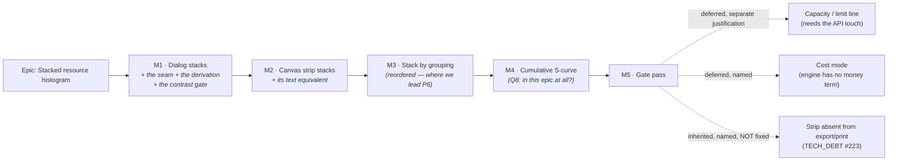

# Implementation Plan: Stacked resource histogram

- **Feature spec:** [`./feature-spec.md`](./feature-spec.md) — **not yet approved**
- **Status:** Draft — awaiting approval before implementation
- **Owner:** _(unassigned)_

> **Nothing in this plan may start before the spec's Q1, Q2 and Q8 are answered.** Q1/Q2 decide
> which surfaces are in scope and whether the strip's 72 px band is in play, which is the difference
> between M1 and M2 existing at all; **Q8** asks whether the S-curve (now M4) belongs in this epic —
> a milestone-level scope decision that is the product owner's, not the plan's.

> **Revised 2026-08-31** to fold four specialist reviews. All four agreed with the epic; every change
> below is a condition of that agreement, and the ones that contradict the draft are marked in place
> rather than silently applied. **Three changes are structural**: M3 and M4 have swapped (grouping
> now precedes the S-curve), M1 gains a seam task (**M1-T0**) that must land before M1-T1, and M2
> gains an accessibility task (**M2-T0**) closing a WCAG regression the draft would have shipped.
> The full correction table is spec §0.1.

---

## Breakdown

**Why M3 and M4 swapped (ui-architect, accepted).** Grouping is where the product **leads** P6
outright — one dropdown against one filter dialog per segment — it is cheap and frontend-only, and it
improves the feature's **weakest** state by turning "Other (32 resources)" into named trades. The
S-curve's strip half is pre-flagged as likely-withdrawn if a second labelled axis will not fit 72 px,
so the draft's order put the least certain milestone first. Whether M4 belongs in this epic at all is
**spec Q8** — recorded as a decision for the product owner rather than taken here.

### Epic

**Stacked resource histogram** — turn the already-multi-series resource read-model into a stacked,
zero-configuration profile on both surfaces that render it. Roadmap theme: **Resource management**
(ADR-0039 → ADR-0044 rung 5 → ADR-0049 Stage E).

**Sequencing principle.** M1 lands the arithmetic where the arithmetic is cheapest to prove (DOM, no
type changes, real vertical space) and M2 consumes that proven derivation across the expensive seam
(the canvas snapshot/palette/painter contract). If M2's measurement fails its committed condition,
M1 still stands alone as a shipped, valuable feature — which is what makes the ordering a risk
decision rather than a preference.

---

## Milestone 1 — The dialog stacks

**Outcome:** a planner opens the resource histogram and sees **one** stacked chart of every loaded
resource with a named legend and a total per period, instead of a vertical scroll of one-colour
charts they must add up by eye.

**Entry point:** plan workspace → **`Analysis ▾`** → **`Resource histogram…`**
(`features/tsld/toolbar/tsld-toolbar-items.tsx:1338-1343`, gated on `RESOURCE_CURVES_ENABLED`) →
the `Resource histogram` dialog (`components/layout/workspace/plan-chrome-dialogs.tsx:191-201`).

**Journey (ADR-0081 §2 — lands with the first user-facing milestone, not at enablement):** a new
spec file in the **existing** `apps/web/e2e-resource-view/` directory, run by the **existing**
`playwright.resource-view.config.ts` and the **existing** CI step (`ci.yml:342-343`). Its first step
opens `Analysis ▾ → Resource histogram…` on a plan with two assigned resources and asserts two
distinct segment fills in one chart, with no control pressed. No new config, no new CI step.

---

#### Feature: the pure stacking derivation

> **Description:** One module answering "what are the segments, in what order, with what offsets and
> what totals" — consumed by both surfaces and by the table, so the two renderers cannot disagree.
> **Complexity:** M
> **Dependencies:** none
> **Risks:** the aggregation rule leaks into a renderer and the surfaces drift (ADR-0065's recorded
> failure mode) → a structural test asserts each renderer imports the derivation and computes no
> ranking, cap or offset of its own.
> **Testing requirements:** unit (the bulk of the milestone's tests), including a property test on
> conservation and a structural test on no-two-shown-segments-share-a-fill.

##### Task M1-T0 — the palette seam (**NEW — must land before M1-T1**)

- **Description:** Export the ordered ramp from `apps/web/src/features/tsld/render/palette.ts` — the
  list itself and a `var()` form beside the existing `lensLegendVarPalette()` — and confirm the
  import direction: `features/resources/**` imports **from** `render/palette.ts`, and
  `render/resource-strip.ts` owns the segment **geometry** type so the pure render layer imports
  nothing from a feature package (spec **D8**).
- **Complexity:** S
- **Dependencies:** none. **Everything in M1 and M2 that says "the shared ramp" depends on this.**
- **Why it exists — a correction.** The draft's M1-T4 said "the same exported token list" and M2-T2
  said "shared, never a copy", and **`WBS_CYCLE_TOKENS` is a module-private `const`**
  (`render/palette.ts:21`) — only resolved forms are exported, verified by grep. Both sentences
  described something that does not exist, so the likeliest build outcome was a second
  hand-maintained ordered array in `features/resources` — **exactly the drift that module's own
  docblock (`:4-18`) exists to prevent**, and which it records having already cost this codebase a
  legend one swatch short of the diagram.
- **Risks:** the export is added and a copy is made anyway → the structural test in M1-T4 asserts
  that no file under `features/resources` contains a `--chart-` literal sequence; verified red
  against a hand-written array.
- **Testing:** a structural test that the exported list and `lensLegendVarPalette()`'s `wbsCycle`
  have the same length and the same order — one list, two shapes, asserted rather than assumed.
- **Development steps:**
  1. Add the exports; change nothing about the values or the existing consumers.
  2. Run the existing `render/palette` and lens suites — this is an export-only change and they are
     the before/after oracle (the ADR-0078 barrel-preserving argument).
  3. Note in the docblock that the list now has a consumer outside `render/`, so a future move needs
     to consider it.

##### Task M1-T1 — `stackSeries` (≈ one PR)

- **Description:** Add `apps/web/src/features/resources/model/stack-series.ts` — pure, no React, no
  DOM, no colour. Input: `readonly ResourceHistogramSeries[]`, `{ cap }`. Output: ranked segments
  (each `{ resourceId | 'other', values, total, offsets }`), `bucketTotals[]`, `peakStackedTotal`,
  and `other: { count, total } | null`.
- **Complexity:** M
- **Dependencies:** **M1-T0** (the cap is derived from the ramp's length, which must be readable)
- **Risks:** floating-point drift makes `Σ segments ≠ bucketTotal` at 4 dp → offsets are computed as
  a running sum in the same order the painter draws, so the last segment's top edge **is** the total
  by construction rather than by a second addition.
- **Testing:**
  - conservation property: for random series sets, every bucket's `Σ(segment values) === Σ(input
values)` — including when `other` exists;
  - ordering: descending `total`, ties by `resourceId` ascending;
  - cap boundaries: 1, 7, **8** (no `other`), **9** (`other` with count 1 — singular copy), 200;
  - `other` is always last;
  - a whole-zero series does not disappear;
  - `peakStackedTotal` is the max over `bucketTotals`, and `0` for an empty input.
- **Development steps:**
  1. Write the failing tests first, including the boundary at exactly `cap`.
  2. Implement; export `STACK_SEGMENT_CAP = min(WBS_LEGEND_CAP, WBS_CYCLE_TOKENS.length)` — derived,
     never a second literal (the ADR-0073 C4 lesson: a cap restated goes stale the moment the
     vocabulary grows).
  3. Docblock states the D3 asymmetry (chart aggregates, table does not) so the next reader meets it
     in the file rather than in an ADR they may not open.

##### Task M1-T2 — the ramp's first computed contrast gate

- **Description:** Add the `--chart-*` pairs to `apps/web/src/styles/token-contrast.test.ts`. The
  ramp's three constraints have lived in a CSS comment (`globals.css:201-215`) and been computed
  nowhere; this feature makes the ramp load-bearing on a second surface and, for the first time, on
  touching segments.
- **Complexity:** S
- **Dependencies:** none — **lands before M1-T4**, per the ADR-0083 ordering (a pair added after the
  fact is a pair that shipped unchecked).
- **Risks:** the gate passes for the wrong reason — the exact failure ADR-0110 D5 and ADR-0120 D5
  record. → **Verify red first**, and **specifically against `--card`**: perturb one ramp value so it
  falls below 3:1 on the card ground while still clearing the page and canvas grounds, and confirm
  the named assertion fails. A perturbation that trips whichever ground fails first proves the gate
  runs, not that it covers the ground this feature paints on.
- **Testing:** the gate is the test. Assert, on **three** grounds — `page`, `canvas` **and
  `--card`** — each of the twelve fills ≥ 3:1; each fill ≥ 4.5:1 against its paired ink; the neutral
  "Other" fill ≥ 3:1 on those grounds **at the value each surface's renderer actually resolves**.
  **No adjacent-fill pair.**
- **Three corrections to the draft of this task, all from the accessibility review. Two shrink it and
  one widens it, and the widening is the one that matters:**
  1. **`--card` is a third ground and the draft omitted it.** The dialog paints on `--card`
     (`dialog.tsx:87`) and the strip's chrome panel on `bg-card/95`
     (`resource-strip-panel.tsx:125`) — not `page`, not `canvas`. `--card`/`--popover` are
     `oklch(1 0 0)` and are ADR-0097 **resets deliberately outside every scope's closure**, so no
     `<Surface>` wrapper brings them into line. The ramp's tightest existing margin is **3.10:1**, so
     the omission was not academic, and `docs/TECH_DEBT.md` #162 records this repository shipping a
     chart-adjacent swatch against exactly this reset once already.
  2. **The "Other" fill's scope resolution must be stated per token, and the two surfaces differ.**
     `--chart-*` is scope-independent (outside every closure, `globals.css:217-218`, and already
     gated by `token-alias-reads.structural.test.ts:82-97`). **`--muted-foreground` is not** — it is
     a rebound name, so the strip resolves it through the **canvas** element
     (`TsldLegendPanel.tsx:184` precedent) and the dialog through the **page**. Assert both values,
     not one.
  3. **No adjacent-fill pair is added, and the ramp's 1.46:1 worst adjacent pair is not a defect
     here.** No success criterion requires two adjacent data fills to contrast with each other:
     1.4.11 applies to the **boundary**, which the ground-coloured separator supplies at a
     guaranteed ≥ 3:1 against both neighbours (because every fill already clears 3:1 against that
     ground); 1.4.1 is satisfied by **position**, since segments are ordered by descending total and
     the legend and table share that order. The register already establishes this for the
     Today / Data-date pair (`token-contrast.test.ts:427-449`). The draft's framing implied the
     opposite and would have produced a gate asserting something WCAG does not ask for.
- **Development steps:**
  1. Add the pairs with a comment recording that the constraints existed in prose since ADR-0097
     Landing E's light-theme work and had never been computed — **and that `--card` is a reset, so a
     future reader does not "tidy" it into a scope**.
  2. Verify red by perturbation against `--card` specifically; record the perturbed value and the
     failure message in the PR.
  3. File the pre-existing gap in `docs/TECH_DEBT.md` — closed by this task, but the **class** (a
     derivation asserted in a comment) is the note worth leaving.

##### Task M1-T3 — close the 50-series silent truncation

- **Description:** `resourceHistogramQueryOptions` sends `limit=200` and surfaces `meta.total` /
  `meta.hasMore` on `ResourceHistogramResult` (`use-resources.ts:516-555`). Today it sends no limit
  and reads neither, so it takes an arbitrary UUID-ordered 50 with nothing saying so.
- **Complexity:** S
- **Dependencies:** none
- **Risks:** the larger limit costs server time → **measured, not assumed.** The expectation is
  **zero**, because `getResourceHistogram` computes every series and _then_ slices
  (`schedule.service.ts:1048`, `:1067-1068`). If the measured API p95 moves more than 10 ms at 200
  series, the expectation was wrong and that is the finding.
- **Testing:** the existing `ResourceHistogram.test.tsx` path assertion extended to
  `limit=200`; a new case asserting `hasMore: true` renders the `role="status"` notice and
  `hasMore: false` renders nothing.
- **Development steps:**
  1. Add `limit` to the query string and `total`/`hasMore` to the result type.
  2. Add the truncation notice component (shared with M2).
  3. Run `scripts/e2e-local.sh api` — this touches a request the API serves, so the API suite is
     part of the gate (CLAUDE.md §19.8).

##### Task M1-T4 — `ResourceStackChart` + `ResourceStackLegend`, and the dialog rebuilt on them

- **Description:** Replace `ResourceHistogram.tsx`'s `series.map(...)` small multiples (`:79-97`)
  with one `aria-hidden` stacked SVG plus a left-hand legend. Fills as **inline `var(--chart-N)`**;
  1 px separators in the ground colour, **suppressed where either neighbour is under 2 px** (spec
  **D10**).
- **Complexity:** M
- **Dependencies:** **M1-T0**, M1-T1, M1-T2, M1-T3
- **Correction — `fill-chart-N` is a scanner hazard and the draft specified it.** Nothing in the
  codebase uses `fill-chart-*` or `bg-chart-*` today. **Tailwind v4 scans source for literal class
  strings**, so an interpolated `fill-chart-${n}` compiles to **no CSS**: the chart renders
  unstyled in a real browser while a jsdom test asserting the `className` passes — verbatim
  ADR-0100 M4's minimap-frame defect, in the same token family, which is the one precedent that
  should have made this obvious. The shipped pattern is `lensLegendVarPalette()`
  (`render/palette.ts:341-352`), whose `var(--chart-N)` strings `TsldLegend.tsx` renders as inline
  `background-color` — theme-reactive with zero JS and invisible to no scanner. Use it.
- **Risks:** (a) the legend's colours and the chart's colours drift → both read the **same** ranked
  segment list from `stackSeries` and index the **same** exported list from M1-T0; a structural test
  pins that **no file under `features/resources` contains a `--chart-` literal**, verified red
  against a hand-written array. This is the ramp docblock's own stated reason for existing
  (`render/palette.ts:4-18`). (b) the legend's width is unspecified and the dialog is ~624 px of
  content → **spec D12** is a decision, not a build-time judgement: 200 px cap, truncate with the
  full name in the accessible name and `title`, stack above the plot below the container breakpoint.
- **Testing:** component tests for one/eight/nine/200 series; legend entry accessible names carry
  name + total; **the legend is tested with a realistic name ("Structural Steel Erection Crew"), not
  "Crew A"** — a fixture that fits proves nothing about a policy for names that do not; **legend
  swatches are `aria-hidden` decoration beside real text** (the `TsldLegend` `<ul
aria-label="Legend"><li>` precedent), so the name is the carrier and the swatch is never the only
  thing announced; the chart is `aria-hidden`; the empty/loading/error states are byte-for-byte
  today's copy.
- **Development steps:**
  1. Build the legend first (it is the a11y carrier, and building it second is how it ends up
     `aria-hidden` by accident).
  2. Build the chart; separators before colours, so the boundary never depends on the fills.
  3. Wire the dialog; delete the small-multiple block.
  4. **Draft the two "incomplete picture" sentences together** — `Other (N resources)` and the
     `hasMore` notice can co-occur, they describe different incompletenesses, and written separately
     they will read as one fact stated twice or as a contradiction.

##### Task M1-T5 — the table carries the stack's new fact

- **Description:** `ResourceLoadingTable` gains a **Total** column (per-bucket stacked total) and a
  grand total in `<tfoot>`; its column order follows the stack's rank order; its caption states in
  words that the chart groups beyond the cap and the table does not, **and states the
  descending-total ordering rule** — a reader arriving at the table alone otherwise cannot tell an
  ordered table from an arbitrary one.
- **The totals are DERIVED, not passed (spec D9).** The draft left this "decided at build", which
  §4.9 of the spec itself lists as a fired ADR-0105 trigger — a shared component's public contract.
  A `bucketTotals` prop gives one number two sources, and the failure mode is a total disagreeing
  with the column beneath it in the artefact that exists to be the record. The component already
  holds `series` and `buckets`; it sums them.
- **Fix the caption's pre-existing error while rewriting it.** `ResourceLoadingTable.tsx:85-87`
  reads "Each resource's **row** sums to its total" — and resources are **columns** (`:93-101`
  renders one `<th scope="col">` per series). Pre-existing, in the exact sentence this task
  rewrites, so leaving it would be a deliberate choice to ship a known-wrong sentence.
- **Complexity:** S
- **Dependencies:** M1-T1
- **Risks:** somebody later "fixes" the table to aggregate like the chart, deleting the data
  equivalent → a structural test asserts `Σ(table columns) === Σ(chart segments)` per bucket **and** a
  second assertion that the table's column count equals the input series count even when the chart
  aggregates. Two assertions, because the first alone passes equally if both aggregate.
- **Testing:** unit — the Total column's values; the column order; the caption text; the
  never-aggregates assertion verified red against an aggregating implementation.
- **Development steps:**
  1. Add the column and the caption sentence.
  2. Write the two structural assertions; verify the second red.
  3. Check every existing consumer still compiles (both surfaces) — this is a props change and
     therefore an ADR-0105 trigger already accounted for.

##### Task M1-T6 — the journey step

- **Description:** A new spec in `apps/web/e2e-resource-view/` driving the dialog against a real API:
  create two resources, assign both, open `Analysis ▾ → Resource histogram…`, assert two distinct
  segment fills with no control pressed, disclose the table and assert the Total column, and run axe
  over the dialog.
- **Complexity:** M
- **Dependencies:** M1-T4, M1-T5
- **Risks:** the assertion passes on the prose rather than the picture (ADR-0073 C2.5's recorded
  finding — an assertion scoped to the document rather than the row) → scope every locator to the
  dialog and assert **fills**, by reading resolved `fill` attributes, not by counting elements.
- **Testing:** the journey is the test. It must **fail red** against `main` before M1-T4 lands.
- **Development steps:**
  1. Reuse `e2e-resource-view/support.ts`'s `createResource` / `assignResource` helpers.
  2. Locate the toolbar control by role + accessible name, **never** by copy (the ADR-0091 M7 rule).
  3. Run it locally via `scripts/e2e-local.sh web:resource-view` before pushing — not CI first.

---

## Milestone 2 — The canvas strip stacks

**Outcome:** the `Resource view` lens shows every loaded resource stacked in the axis-aligned band,
still pixel-aligned to the diagram and still pan/zoom-synced, with the legend in the chrome panel
above and one-resource isolation retained in the picker.

**Entry point:** plan workspace → the **`Resource view`** button on the `Plan commands` toolbar
(driven today at `e2e-resource-view/resource-view.spec.ts:76`).

**Journey:** extend the **existing** `e2e-resource-view/resource-view.spec.ts`. Its step (2) already
reveals the panel and the strip; it gains an assertion that the default picker value is "All
resources (stacked)", that the legend lists both seeded resources, and that picking one returns the
single-series view. No new config, no new CI step.

---

#### Feature: the multi-series canvas seam

> **Description:** Widen `ResourceStripSnapshot`, `ResourceStripPalette` and `paintResourceStrip`
> from one series to N, consuming M1's derivation unchanged. ADR-0049's mechanism — the snapshot
> through a ref, the `stripDirtyRef`/`dirtyRef` split, the shared `viewRef`, `screenXOfDay`
> co-alignment, the theme-bump re-resolve — is untouched; only the shape of the data on the ref
> changes.
> **Complexity:** L
> **Dependencies:** M1 complete
> **Risks:** (a) the paint budget → the falsification condition below, committed in the spec before
> any measurement; (b) the co-alignment guarantee is disturbed → `bucketRects` and the
> `screenXOfDay(daysBetween(...))` expression are **not edited**, and the existing co-alignment tests
> must pass unchanged as the before/after oracle (the ADR-0078 barrel-preserving argument).
> **Testing requirements:** unit on the widened geometry; the existing strip suites passing
> **unchanged** where they cover alignment; a browser measurement harness; extended journey.

##### Task M2-T0 — the strip's text equivalent survives the sentinel (**NEW — blocking, WCAG**)

- **Description:** In stacked mode `ResourceStripPanel` renders `ResourceLoadingTable` with the
  **full series set**; in isolation it renders `[selectedSeries]`. The `
` label branches
  with it — `Show data table (all resources)` vs `Show data table for <name>`. The `:80-81`
  "fall back if the pick is no longer in the series" rule is extended so the sentinel is recognised
  rather than discarded as an id that is not in `series`.
- **Complexity:** S
- **Dependencies:** M1-T5 (the table's stacked shape), M2-T4 (the sentinel exists)
- **Why it exists — the draft would have shipped a WCAG 2.2 AA regression, and no test would have
  failed.** The spec's US-4 said the table is "unchanged from today", which is true of the dialog and
  **false of the strip**. `resource-strip-panel.tsx:173-180` renders the table inside
  `{selectedSeries ? … : null}` with `series={[selectedSeries]}`, and `selectedSeries` is
  `series.find(s => s.resourceId === selectedId) ?? null` (`:82`). **An "all" sentinel is not a
  `resourceId`, so `selectedSeries` is `null` and the strip's stacked default renders no table at
  all** — an `aria-hidden` canvas with nothing behind it. **No M2 task in the draft touched this
  file's table branch**, and every unit test would have stayed green because none mounts the panel in
  the sentinel state.
- **A second defect in the same three lines:** `resourceName` falls back to `'Unknown resource'`
  (`:66`), and the summary is `Show data table for {resourceName(selectedId ?? '')}` (`:170`) — so
  the sentinel announces **"Show data table for Unknown resource"** in the feature's own default
  state. Found independently by the ui-architect and accessibility reviews, which is worth noting:
  two readers reached the same three lines from different directions.
- **Risks:** the fix is written and the isolated branch silently regresses → both branches are
  asserted, not one.
- **Testing:** verified **red first** against the null branch. Then: stacked ⇒ the table has one
  column per series plus Bucket start and Total; isolated ⇒ one resource column; the `
`
  label in both states; and an assertion that the word "Unknown" appears in neither.
- **Development steps:**
  1. Write the two failing tests against the current code plus the sentinel.
  2. Extend the selection rule to model three states (sentinel / valid pick / stale pick), not two.
  3. Branch the table's `series` prop and the summary label from that one state value, so they cannot
     disagree.

##### Task M2-T1 — widen the snapshot and the geometry

- **Description:** `ResourceStripSnapshot.series: ResourceHistogramSeries` → the ranked segment list
  - per-bucket offsets from `stackSeries`; `max` becomes the peak **stacked** total. The per-segment
    projector **delegates x / width / culling to `bucketBarsFromDays`** and adds only the vertical
    stacking. The `screenXOfDay(daysBetween(…))` expression is not edited.
- **Complexity:** M
- **Dependencies:** M1-T1
- **Two corrections to the draft of this task, both about the oracle it named.**
  1. **`bucketRects` is not the thing to protect — it has no production caller.** Grep across
     `apps/web` returns its own definition and `render/resource-strip.test.ts`; the painter calls
     **`bucketBarsFromDays`** (`paint.ts:2107`). The draft's "do not touch `bucketRects`" would have
     frozen a test-only function while leaving the real one free to drift. Hence **delegation**
     (spec **D11**) rather than a sibling projector: one function decides where a bucket is, so
     co-alignment with the scene is definitional — the ADR-0065 `routeOrthogonal` argument (one
     optional parameter of the existing function, never a second function) one layer down.
  2. **"The existing suites green without modification" is false as written.**
     `TsldCanvas.resource-strip.test.tsx:38` and `:157` construct `ResourceStripSnapshot`
     **literals**, so a shape change necessarily edits them. Scope the claim: the untouched oracle is
     **`render/resource-strip.test.ts`'s alignment assertions**; the two canvas-test literals are
     expected edits and are declared here so an edit to them is not mistaken for one.
- **Risks:** an alignment regression that no test catches because the test was rewritten alongside
  the code → the `render/resource-strip.test.ts` alignment assertions are the oracle and are **not**
  edited in this task; if one must change, that is a finding to record, not a diff to make.
- **Testing:** unit on the per-segment projection (culling unchanged, widths unchanged, heights
  stacked); `render/resource-strip.test.ts` green **unmodified**; the two canvas-test literals
  updated and nothing else in that file.
- **Development steps:**
  1. Add the new type and the delegating projector beside the old ones.
  2. Migrate `resource-strip-panel.tsx` to publish the new shape.
  3. Update the two snapshot literals; confirm the alignment suite is untouched in the diff.
  4. Remove the old singular field only once nothing reads it — noting `TsldPanel.tsx:462` and
     `plan-workspace-toolbar.tsx:194` thread the type without reading a field, so they are a compile
     check rather than a migration.

##### Task M2-T2 — the palette becomes a cycle

- **Description:** `ResourceStripPalette.bar: string` → `bars: readonly string[]` (resolved from the
  shared `WBS_CYCLE_TOKENS`, never a copy) + `other: string` (`--muted-foreground`) + `separator:
string` (`--canvas`). `resolveResourceStripPalette` keeps its **required** `root` parameter.
- **Complexity:** S
- **Dependencies:** M1-T0, M1-T2
- **`bar` is KEPT alongside `bars` (spec D7).** The palette gains the cycle; it does not lose the
  single fill, because the isolated path stays `--primary` — which is the half of the US-1/US-6
  contradiction that survived review. A docblock says why `bar` is not dead code, since a field
  whose apparent replacement sits beside it is exactly what a later reader deletes.
- **Risks:** the canvas reads a token that a surface scope cannot reach — ADR-0102's finding, where
  the painter had **never once** used the canvas surface scope because it named `--color-*` aliases.
  → **This is already a computed gate, not a docblock.** `token-alias-reads.structural.test.ts:82-97`
  fails any source file naming a `--color-*` alias, with the ADR-0102 reason in its own message. The
  draft proposed to "state that in the docblock with the line reference", which is precisely the
  vigilance ADR-0058 says to replace with a check — and the check already exists. **Cite the gate;
  the docblock's job is only the part the gate cannot express**, which is that `--chart-*` sits
  outside every scope closure (`globals.css:217-218`) and was derived against the light diagram
  ground (`:201-204`), so resolving it from the canvas element is correct.
  **`--muted-foreground` is a different matter** and is not covered by that reasoning — it is a
  rebound name, so the strip resolves it through the canvas scope and the dialog through the page,
  and both values are gated in M1-T2.
- **Testing:** unit asserting the cycle length equals the exported ramp's length (M1-T0) and that
  the jsdom fallbacks come from the shared list; `bar` still resolves `--primary`.
- **Development steps:**
  1. Widen the type (add `bars`, `other`, `separator`; keep `bar`) and the resolver.
  2. Add the docblock note above, citing the **gate** rather than restating its reason.
  3. Update `TsldCanvas`'s theme-bump re-resolve call site (`TsldCanvas.tsx:821`, `:2066`).

##### Task M2-T3 — the painter draws segments

- **Description:** `paintResourceStrip` draws each bucket bottom-up from the offsets, with a 1 px
  separator between adjacent segments **except where either neighbour is under 2 px** (spec **D10**).
  Rectangles only — no text beyond the existing max tick.
- **Complexity:** M
- **Dependencies:** M2-T1, M2-T2
- **The small-segment rule is a decision, not a tuning knob.** Nine segments is eight boundaries: at
  the strip's 66 px of bar area a peak bucket's segments average ~7.2 px, so 8 px of separator ink is
  **12 %** of the column; at half the peak **24 %**; at a quarter — the majority of any real
  profile's buckets — **48 %**. The draft specified a separator with no size rule, which at 72 px
  would have made the mechanism that guarantees the boundary into the thing obscuring the data.
- **Risks:** (a) a `fillText` guard is dropped and a text-less test context throws (the existing
  painter guards for exactly this, `paint.ts:2029`) → keep the guard; add no unguarded text. (b) the
  budget-shape claim is quoted from a stale number → **do not cite "ADR-0026's budget shape"**:
  `docs/TECH_DEBT.md` #75 establishes there is **no §16 in ADR-0026** and that **4 ms was never a
  budget** (it is a throwaway prototype's measured p95, passed against a ≤ 16 ms frame); the real
  gate is **≥ 45 fps @ 500 / ≥ 30 fps @ 2,000**, and the shipped painter already drops **10.2 %** of
  frames at Fit while meeting it. The honest claim for this task is narrower and checkable: **this
  layer adds no text work and no per-frame allocation**, and its cost is measured in M2-T5.
- **Testing:** a counting-stub gate asserting the **shape** of the per-frame cost (fill calls =
  visible buckets × shown segments, plus separators **minus suppressed ones**; zero text work beyond
  the tick) — the ADR-0054 precedent, because a CI runner's absolute timings are noise. Plus unit
  cases at 1 px, 2 px and 3 px neighbours pinning the suppression boundary.
- **Development steps:**
  1. Draw fills, then separators, so a separator is never overpainted.
  2. Add the counting-stub gate; verify it red by removing the culling.
  3. Verify the suppression rule red by removing it and asserting the separator count at 1 px.

##### Task M2-T4 — the picker leads with "All resources (stacked)"

- **Description:** The strip picker's first and default option becomes the stacked sentinel; each
  resource remains selectable. The legend and the truncation notice join the chrome panel. The
  existing "fall back if the pick is no longer in the series" rule
  (`resource-strip-panel.tsx:80-81`) extends to the sentinel.
- **Complexity:** S
- **Dependencies:** M2-T1, M1-T4 · **paired with M2-T0**, which is the same three lines' other half
- **Reviewed before it ships, and the draft cited the wrong rule for it.** The draft invoked
  **CLAUDE.md §19.13** ("a shared primitive's keyboard contract is reviewed before release"). That is
  **overstated**: the strip's picker is a **native `<select>`**, and §19.13's subject is the
  hand-rolled primitives (`Deck`/`Menu`/`Combobox`/`Tabs`/`Dialog`/`*Field`) whose keyboard model
  this codebase implements itself. A native select's keyboard behaviour is the platform's. Corrected
  rather than repeated — this register has overstated a success-criterion citation once already
  (ADR-0082) and records correcting it in place.
  **The review is still commissioned**, on a better-founded reason: **M2-T0 shows that adding an
  option to a native control is not risk-free on _naming_** — the sentinel silently produced
  "Show data table for Unknown resource" and removed the table entirely. So
  **accessibility-reviewer** runs over M2-T0 + M2-T4 together **before they ship**, scoped to the
  accessible name, the disclosure label and the empty/fallback states — not to a keyboard contract
  nobody is changing.
- **Risks:** the isolation path silently regresses because every test now exercises the stack → keep
  an explicit test for the isolated path asserting it is byte-for-byte the single-series projection
  **including its `--primary` fill** (spec D7).
- **Testing:** component tests for default, isolate, return-to-stacked, and the
  pick-no-longer-present fallback — the last of which now has **three** states to distinguish, not
  two (sentinel / valid pick / stale pick).
- **Development steps:**
  1. Add the sentinel and make it the default.
  2. Host the legend and the notice.
  3. Assert focus-on-reveal still lands in the panel (`:106-109`) — a11y regression guard.

##### Task M2-T5 — the measurements, against the **two** conditions committed in the spec

- **Description:** Run spec §3 **Condition 1 (paint cost)** and **Condition 2 (legibility)**. Report
  the numbers, the baseline's spread, the screenshot, and both verdicts.
- **Complexity:** M
- **Dependencies:** M2-T3
- **Four amendments from the performance review, each because the draft's condition could have passed
  while the feature was slow. All four are now in the spec's Condition 1; they are repeated here
  because this is the task that has to obey them.**
  1. **Measure at Fit / whole-plan as well as Week.** Bucket count scales with **plan span**, not
     zoom: a two-year plan at WEEK is ~104 buckets, and at Fit **nothing is culled**, so each pays up
     to 9 fills + 8 separators instead of 1. Fit is also where the shipped painter has its thinnest
     margin (#75: 8.9 ms p95 inside a 16.7 ms frame and yet **10.2 % of frames dropped**). The
     feature's worst case and the painter's worst case coincide at a zoom the draft never visited.
  2. **Name the fixture, and do not use `plan:scale-500`.** It declares **exactly one** resource
     (`packages/seed/src/scale/generator.ts:319-331`, `SCALE_CREW`) assigned to 35 % of tasks
     (`:203`, `assignedFraction: 0.35` at `:76`) — a **one-segment stack**, which measures this
     feature's cost as approximately zero and reports a meaningless pass. Either name a catalogue
     plan whose series count the harness has **read and printed**, or build a fixture with **≥ 9
     resources genuinely assigned across a multi-year span**. _(Recorded, not resolved:
     `docs/TEST_PLAYBOOK.md:193` describes the same plan as "478 of 478 unassigned" for DCMA metric 10. The two documents cannot both be describing the same rows. Outside this epic — which is
     exactly why the harness prints what it found rather than trusting either.)_
  3. **Pin and state `deviceScaleFactor`.** This is fill-rate-bound and the backing store scales by
     **DPR²**; 1646 is the Surface Pro's **CSS** width and that device is DPR ≈ 1.75. An unstated DPR
     is an unstated 3× in the quantity being measured.
  4. **Time `paintResourceStrip` itself, not the whole rAF tick** — the `measure-link-routing.mjs`
     precedent, which times `paintScene`. A whole-tick figure cannot attribute a millisecond to this
     layer, which is #75's own complaint about the pre-ADR-0078 painter. **Report the total frame
     cost and the dropped-frame count as well as the delta**, because #75's real finding is that
     paint duration is the wrong quantity: the gate is met at Fit and a planner still sees judder.
- **Do not quote #75's halves separately.** "The painter is 4–6× over budget" and "the painter meets
  its fps gate" are both circulating in this repository and both are half-truths. The verdict states
  the fps gate, the measured duration, **and** the dropped frames.
- **Risks:** (a) a foreign dev server is silently adopted (`reuseExistingServer` is true outside CI —
  ADR-0099's three consecutive false diagnoses) → the run goes through `scripts/e2e-local.sh`, which
  refuses while anything answers on 3000 or 5173; (b) the harness measures the wrong thing
  (ADR-0106's harness measured the bars, ADR-0066's draw benchmark measured the cull) → the harness
  prints the node, the code path **and the fixture's actual series count**, and a **control** run
  must reproduce the known single-series baseline before the treatment number is believed.
- **Testing:** the measurement is the deliverable. It is written to
  `docs/specs/stacked-resource-histogram/m2-measurement.md` with the raw figures **and the legibility
  screenshot**, not summarised into a sentence.
- **Development steps:**
  1. Re-read both committed conditions **before** running; do not restate them from memory.
  2. Print the fixture's series count first. If it is 1, stop — the fixture is wrong, not the result.
  3. Run baseline and treatment paired, same session, ≥ 200 frames, at Week **and** Fit, DPR stated.
  4. Take the 72 px legibility screenshot at 1646 and make the judgement (Condition 2).
  5. Record both verdicts — including if either is a withdrawal.

##### Task M2-T6 — the journey extension

- **Description:** Extend `e2e-resource-view/resource-view.spec.ts`'s step (2)/(3) for the stack.
- **Complexity:** S
- **Dependencies:** M2-T0, M2-T4
- **Risks:** the existing suite's assumptions break silently → run the **whole** suite locally, and
  per the ADR-0091 M7 rule, run every journey after any label or layout change rather than only the
  one CI names.
- **Testing:** the journey. Verified red against `main` before M2-T4 lands. **It must include the
  M2-T0 assertions**, because the sentinel's table and label are the one part of this milestone whose
  defect is invisible to every unit suite in the repository: disclose the table in the stacked
  default and assert both a column per resource **and** that the summary does not say "Unknown".

---

## Milestone 3 — Stack by grouping

> **Reordered (was M4).** Grouping is where the product **leads** P6 outright — one dropdown against
> one filter dialog per segment — it is cheap and frontend-only, and it improves the feature's
> **weakest** state by turning "Other (32 resources)" into named trades. The S-curve's strip half is
> pre-flagged as likely-withdrawn, so the draft's order put the least certain milestone first
> (ui-architect, accepted).

**Outcome:** on a programme with 40 resources, a planner chooses **`Stack by → Group`** and reads five
trades instead of "top 8 + Other".

**Entry point:** a **`Stack by`** select in the dialog and in the strip's chrome panel —
`Resource` (default) / `Group` / `Kind`.

**Journey:** one step in the existing suite: create a `GROUP`, parent two resources to it, choose
`Stack by → Group`, assert one segment named for the group and an unchanged per-bucket total.

> **`Kind` landed late — 2026-09-01, after the epic shipped** (`docs/TECH_DEBT.md` #228 item 4).
> M3 built `Resource` and `Group` only; nothing recorded the descope, so this milestone's own
> "invariance across all three modes" requirement was quietly met over two and read as satisfied.
> The mode is now built and that gate really does compare three. Recorded here rather than in the
> commit alone, because a plan that describes work nobody did is the drift class this repository
> keeps finding in the other direction.

#### Feature: grouped aggregation

> **Description:** Re-partition the same series by the resource's group ancestor (ADR-0053 §3
> `parentId`) or its `kind`, before ranking. **Frontend-only** — both fields are already on the list
> read (`ResourceSummary.parentId` / `.kind`, `packages/types/src/index.ts:1730-1738`) which the web
> already fetches via `useResources`.
> **Complexity:** M
> **Dependencies:** M1, M2
> **Risks:** grouping changes a total → **the milestone's own acceptance gate** is that per-bucket
> totals are **identical** across every grouping, asserted as an equality. Grouping re-partitions; it
> never re-sums.
> **Testing:** unit on the partition (total invariance across `Resource`/`Group`/`Kind`); the
> ungrouped fallback follows `buildColourLegend`'s "Ungrouped" precedent
> (`render/lenses.ts:519-521`); component on both surfaces; journey.

##### Task M3-T1 — the partition, and its invariance gate

- **Complexity:** M · **Dependencies:** M1-T1 · **Risks:** a `GROUP` node is itself assignable and
  double-counts → it cannot be: `GROUP` is non-assignable by a database CHECK
  (`ck_resources_group_no_scheduling_fields`, ADR-0053 §3) and rejected at assignment with 422
  `GROUP_NOT_ASSIGNABLE`, so no `GROUP` id can appear in a histogram series. **Assert that** as a
  test rather than relying on the paragraph. · **Testing:** total invariance across all three modes,
  verified red against a re-summing implementation.

##### Task M3-T2 — the `Stack by` control on both surfaces

- **Complexity:** S · **Dependencies:** M3-T1 · **Testing:** component; the control's accessible
  name; the ungrouped bucket announced but consistent with the table. **The strip's copy of this
  control is a second option-bearing native `<select>` in the same panel as M2-T4's** — assert the
  two are independently labelled and that neither's value leaks into the other's fallback rule.

##### Task M3-T3 — the journey step

- **Complexity:** S · **Dependencies:** M3-T2

---

## Milestone 4 — Cumulative S-curve overlay — WITHDRAWN FROM THIS EPIC

> **The product owner deferred this on 2026-08-31 (spec Q8), against the analyst's default of
> keeping it.** It becomes its own slice, taken up straight after this epic's release.
>
> The tasks that were here are deliberately **deleted rather than commented out** — a milestone
> kept in a plan as struck-through text is the shape this register keeps finding, where a document
> reads as authoritative about work nobody is doing. The decision, its reasoning and its deferral
> trigger live in the spec's Q8; git holds the tasks.
>
> Nothing else moves: the derivation M1 builds already produces the array this milestone would sum,
> so the slice needs no prerequisite beyond a merged M1.

## Milestone 5 — Gate pass

**Outcome:** the combined M1–M4 diff has been through the specialist reviews, every blocking finding
is folded with a regression test **verified red first**, and the non-blocking findings are filed.

**Entry point:** none — this milestone **ships no new capability**. It changes existing code in
response to findings.

**Journey:** the full `e2e-resource-view` suite, plus every other journey (ADR-0091 M7's rule: after
any label or layout change, run all of them, not the one CI named).

#### Feature: the reviews

> **Description:** Six specialists over the combined diff.
> **Complexity:** M
> **Dependencies:** M1–M4
> **Risks:** the pass is treated as a formality → this register records the gate pass finding defects
> a human read had missed in **eight consecutive epics**; budget for findings, not for a rubber stamp.
> **Testing:** every fix carries a regression test verified to fail against the pre-fix code.

##### Task M5-T1 — reviews

- **accessibility-reviewer** — the legend as the colour carrier; the table's new columns; the
  truncation notice's live region; focus on reveal; **the strip's table and `
` in the
  stacked default** (M2-T0's subject, which is the milestone's one WCAG-blocking change).
  **Note a corrected citation:** the draft invoked **CLAUDE.md §19.13** here on the grounds that the
  `<Select>` gains a sentinel option. §19.13's subject is a **hand-rolled primitive's keyboard
  contract** (`Deck`/`Menu`/`Combobox`/`Tabs`/`Dialog`/`*Field`), and this is a **native
  `<select>`** whose keyboard behaviour is the platform's — the citation was overstated, and this
  register records correcting such a citation in place rather than repeating it (ADR-0082). The
  **pre-ship review still happens** (see M2-T4), on the better reason M2-T0 supplies: adding an
  option to a native control turned out not to be risk-free on **naming**.
- **ux-reviewer** — is "Other (N resources)" honest and legible; **does the legend's width policy
  (spec D12) hold against a real resource name in a `size="lg"` dialog**; do the two "incomplete
  picture" sentences read correctly when they co-occur; does the isolation path still feel like a
  first-class capability.
- **component-reviewer** — one derivation, one cycle, no duplicated ranking; the widened public
  contracts.
- **frontend-performance-reviewer** — the strip's per-frame shape; the 200-series payload.
- **security-reviewer** — expected to pass with nothing blocking (no new endpoint, permission or
  input); asked to **re-derive** the parity claim from the final diff rather than trust §3.
- **test-engineer** — coverage of the derivation's boundaries and of the two structural assertions
  that pin D3.

##### Task M5-T2 — file the ADR

- **Description:** Write the ADR from the spec's §4.8 outline. **Choose the number at filing time**
  by reading `docs/adr/README.md` and the register — not from this plan (ADR-0079 was filed at 0079
  rather than the 0078 its plan named, because the number was taken in between).
- **Complexity:** S
- **Development steps:**
  1. Check `docs/adr/README.md` covers it in **both** directions (ADR-0110 D6 made that a gate;
     ADR-0078 S1 found seven ADRs missing from the index).
  2. Add the `CLAUDE.md` §16 entry.
  3. Run `pnpm prepush` — one command, ten derived gates, including `check:adr-coverage`, which
     refused an ADR once because the pre-push instruction had been followed by hand from a stale list
     (CLAUDE.md §19.8).

##### Task M5-T3 — the register

- **Description:** File the deferred items with their triggers named, and close what this epic
  closed.
- **Complexity:** S
- **Development steps:** file (a) the capacity/limit line, trigger: a planner asks for capacity, or
  the levelling surface needs it — needs `max_units_per_hour` on the histogram DTO and therefore
  `database-architect` is **not** needed but `api-reviewer` is; (b) cost mode, trigger: a cost
  profile is asked for — needs an engine term **and** a `cost:read` permission decision; (c) the
  resizable strip band, if Q1 was answered "keep 72 px"; (d) legend-click isolation; (e) **the
  dialog's cap could be 12 rather than 8** — it has no 72 px constraint, and 8 is `min(WBS_LEGEND_CAP,
cycle.length)` inherited from a legend rule rather than derived for a dialog. Deliberately **not**
  taken in this epic: two caps means the two surfaces name different numbers of resources, and the
  place to decide that is after Condition 2 has said what the strip can actually carry. (f) **the
  ordering/ranking question the UX review raised** — "Other" ranks by whole-series total, so a
  near-miss resource can dominate a single bucket; recorded so nobody "fixes" it into per-bucket
  ranking, which would re-rank and re-colour every bucket.
  **Cross-reference, do not close, `docs/TECH_DEBT.md` #223** (the strip is absent from export and
  print, and ADR-0103's gate cannot see it): this epic makes the strip carry more information and so
  raises the stakes on it, and inheriting it silently is how it stays inherited.
  **Close** the 50-series truncation and the ramp's ungated constraints.
  **Also correct while here:** `ResourceLoadingTable`'s caption said "each resource's **row** sums to
  its total" when resources are columns — fixed in M1-T5, and worth a line in the register's closed
  list because it is the kind of error that survives because everyone reads past it.

---

## Sequencing & slices

| Slice | Ships                                                                                               | `main` releasable after? | Independently valuable?                                                              |
| ----- | --------------------------------------------------------------------------------------------------- | ------------------------ | ------------------------------------------------------------------------------------ |
| M1    | The palette seam, a proven derivation, a new contrast gate, a stacked dialog, the truncation closed | Yes                      | Yes — the dialog is a complete answer to the product owner's question on one surface |
| M2    | A stacked canvas strip **with its text equivalent** (M2-T0)                                         | Yes                      | Yes                                                                                  |
| M3    | Grouping on both _(reordered — where we lead P6)_                                                   | Yes                      | Yes                                                                                  |
| M4    | The S-curve on both _(reordered; existence is spec Q8)_                                             | Yes                      | Yes                                                                                  |
| M5    | Fixes and the ADR                                                                                   | Yes                      | n/a                                                                                  |

**Two ordering constraints inside M1 and M2 that are not preferences.** **M1-T0 precedes M1-T1**,
because the cap is derived from the ramp's length and the ramp is not currently exported — without it
the likely build outcome is a second hand-maintained ordered array. **M2-T0 ships with M2-T4, never
after it**: the sentinel is what breaks the strip's table, so landing the sentinel alone is landing a
WCAG 2.2 AA regression and planning to fix it, which is not a slice boundary but a defect with a
follow-up ticket.

**Feature flags: none new.** ADR-0088 D1 — a `VITE_` constant is inlined at build time,
`apps/web/Dockerfile` declares one `VITE_` build arg and `docker-publish.yml` passes none, so a flag
has never been an operator rollback. The rollback is a commit boundary, and each milestone is
sequenced to be one. The existing `VITE_RESOURCE_CURVES` and `VITE_CANVAS_RESOURCE_VIEW` continue to
gate the surfaces themselves, unchanged.

**`scripts/frontend-only.json` is deliberately not armed.** It is `"active": false`, deactivated
2026-08-26 on the third occasion it outlived its epic and went "wrong about a DIFFERENT change"
(`:5`, `:7-18`); `docs/TECH_DEBT.md` #194 records that the written instruction to remove it has
failed twice and wants a mechanism, not a third sentence. The parity claim is checked per PR by
reading `git diff --stat apps/api packages/`.

**If either of M2's measurements fails**, M1 ships alone, M3/M4 apply to the dialog only, and the
withdrawal is recorded in the ADR with the number — the ADR-0091 D4 / ADR-0092 M5 / ADR-0110 D3
precedent, where a proposal was withdrawn on its own committed falsification condition rather than
tuned into passing. **Note that there are now two of them**, and the second is the more likely to
fire: Condition 1 is paint cost, Condition 2 is **legibility at 72 px**, which is the feature's
premise on that surface and which the draft costed by arithmetic and never tested. A withdrawal on
Condition 2 is not a performance withdrawal and must not be recorded as one.

---

## Definition of Done (per task)

Each task's PR must satisfy the Feature Completion Criteria in
[`docs/PROCESS.md`](../../PROCESS.md). Three of them are named here because they are the ones this
plan most depends on:

- **The pre-push gate is run, not written** — `pnpm prepush` (one command, ten derived gates), plus
  `scripts/e2e-local.sh api` for M1-T3 (which changes a request the API serves), plus
  `scripts/e2e-local.sh web:resource-view` for every task touching the journey. CI is the second
  opinion, never the first.
- **Every new gate is verified red first.** M1-T2's perturbation, M1-T5's second structural
  assertion, M4-T1's re-summing control, M2-T3's culling removal. A gate that has only ever passed is
  a claim that something is checked, not a check.
- **Approved work runs to completion** (CLAUDE.md §19.12) — a finished milestone is not a stopping
  point; the next slice starts in the same turn, and a wake-up is armed as the turn's **first**
  action with a terminal condition that can actually be reached.

---

## Risks & assumptions (rollup)

| Risk / assumption                                                                                  | Likelihood                                                                | Impact                                                                      | Mitigation                                                                                                                                                                                                                                                                                                                                                         |
| -------------------------------------------------------------------------------------------------- | ------------------------------------------------------------------------- | --------------------------------------------------------------------------- | ------------------------------------------------------------------------------------------------------------------------------------------------------------------------------------------------------------------------------------------------------------------------------------------------------------------------------------------------------------------ |
| **Q1/Q2 answered differently** — the product owner wants the strip only, or wants a resizable band | Medium                                                                    | High (re-plans M1/M2)                                                       | Both are asked before any code; the plan is sequenced so either answer keeps a shippable first slice                                                                                                                                                                                                                                                               |
| **The strip's paint cost exceeds the budget**                                                      | Low–Medium                                                                | Medium                                                                      | Falsification condition committed in the spec **before** measurement; the recorded response is cap-then-withdraw, not tune                                                                                                                                                                                                                                         |
| **The two surfaces drift** — one aggregates differently from the other                             | Medium if unguarded                                                       | High and **invisible** (ADR-0065's recorded failure mode)                   | One derivation, structural test that neither renderer ranks or caps                                                                                                                                                                                                                                                                                                |
| **A later reader "fixes" the table to aggregate like the chart**                                   | Medium                                                                    | High — it deletes the WCAG text equivalent                                  | D3 written in the ADR, in the module docblock, in the table caption, and pinned by **two** assertions (one alone passes if both aggregate)                                                                                                                                                                                                                         |
| **The measurement harness measures the wrong thing**                                               | Medium — it has happened three times here (ADR-0106, ADR-0066, ADR-0119)  | Medium                                                                      | The harness prints the node and path it timed; a control run must reproduce the known baseline before the treatment number is believed                                                                                                                                                                                                                             |
| **`reuseExistingServer` adopts a foreign dev server**                                              | Medium                                                                    | High — produced three consecutive false diagnoses in one session (ADR-0099) | Every run goes through `scripts/e2e-local.sh`, which refuses while 3000/5173 answer                                                                                                                                                                                                                                                                                |
| **The contrast gate passes for the wrong reason**                                                  | Medium — the recorded shape (ADR-0110 D5, ADR-0120 D5)                    | Medium                                                                      | Verified red by perturbation **against `--card` specifically**, since that is the ground both surfaces actually paint on and it was absent from the draft; the perturbed value and message go in the PR                                                                                                                                                            |
| **The strip loses its text equivalent to the sentinel** — the draft would have shipped it          | **Was certain** until review; now guarded                                 | **High** — a WCAG 2.2 AA regression on the surface the epic is named for    | **M2-T0** exists as its own task, ships with M2-T4 rather than after it, is verified red against the null branch, and is asserted in the journey as well as in units — no unit suite mounts the panel in that state today                                                                                                                                          |
| **A second ordered `--chart-*` array appears in `features/resources`**                             | **High** if M1-T0 does not land first — the ramp is not exported today    | High and invisible — the exact defect `WBS_CYCLE_TOKENS`'s docblock records | M1-T0 exports the list before anything indexes it; a structural test fails on any `--chart-` literal under `features/resources`, verified red against a hand-written array                                                                                                                                                                                         |
| **The dialog's fills compile to no CSS** (`fill-chart-N` interpolated, Tailwind v4 scans literals) | **Was certain** as drafted                                                | High — unstyled in a browser, **green in jsdom**; verbatim ADR-0100 M4      | Inline `var(--chart-N)` via the `lensLegendVarPalette` precedent; the journey asserts resolved fills rather than class names                                                                                                                                                                                                                                       |
| **The strip's stack is unreadable at 72 px** — the feature's premise, untested in the draft        | Medium — the ~8 px arithmetic assumes an even split and loading is skewed | High — the milestone would ship a picture nobody can read                   | **Spec §3 Condition 2**, committed before measurement, with a named remedy ladder (lower the strip's cap → ship the strip un-stacked); judged against a screenshot at 1646 and recorded with it                                                                                                                                                                    |
| **The paint measurement passes on a fixture with one resource**                                    | **High** — `plan:scale-500` is exactly that (`scale/generator.ts:319`)    | High — a meaningless pass that reads as a clearance                         | M2-T5 prints the fixture's series count **first** and stops if it is 1; the fixture is named in the spec, not resolved at run time                                                                                                                                                                                                                                 |
| **The measurement's DPR is unstated** on a fill-rate-bound quantity                                | Medium                                                                    | Medium — the backing store scales by DPR², so the number can be ~3× out     | `deviceScaleFactor` pinned and stated in the verdict; 1646 is a **CSS** width and the reference device is DPR ≈ 1.75                                                                                                                                                                                                                                               |
| **`docs/TECH_DEBT.md` #75 is quoted by halves**                                                    | Medium — both halves circulate in this repository                         | Medium — either a false alarm or a false clearance                          | The verdict states the fps gate, the measured duration **and** the dropped frames; the spec §3 preamble gives the corrected framing (no ADR-0026 §16; 4 ms was never a budget)                                                                                                                                                                                     |
| **The ADR number is taken between plan and filing**                                                | Low                                                                       | Low                                                                         | Chosen at filing time by reading the index (the ADR-0079 lesson)                                                                                                                                                                                                                                                                                                   |
| **Assumption: `limit=200` costs the server nothing**                                               | —                                                                         | Would invalidate M1-T3's design                                             | Stated as an expectation with its evidence (`schedule.service.ts:1048`, `:1067-1068`) and **measured**; if the p95 moves > 10 ms the expectation was wrong and that is the finding                                                                                                                                                                                 |
| **Assumption: a stack is legible at 72 px**                                                        | —                                                                         | Would make M2 not worth building                                            | **Promoted out of "assumption" into spec §3 Condition 2**, a committed falsification condition with a remedy ladder. The draft's "eight segments over 66 px averages ~8 px" is kept as the reasoning **and labelled wrong in its premise**: it assumes an even split, and real trade loading is skewed, so off-peak buckets (the majority) land segments at 1–3 px |
| **Assumption: `bucketRects` is the co-alignment oracle**                                           | —                                                                         | M2-T1 would have protected a function nothing calls                         | **Disproved by grep** — the painter calls `bucketBarsFromDays` (`paint.ts:2107`). The projector now delegates to it (spec **D11**), and the untouched oracle is scoped to `render/resource-strip.test.ts`'s alignment assertions                                                                                                                                   |
