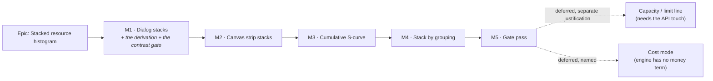

# Implementation Plan: Stacked resource histogram

- **Feature spec:** [`./feature-spec.md`](./feature-spec.md) — **not yet approved**
- **Status:** Draft — awaiting approval before implementation
- **Owner:** _(unassigned)_

> **Nothing in this plan may start before the spec's Q1 and Q2 are answered.** They decide which
> surfaces are in scope and whether the strip's 72 px band is in play, which is the difference
> between M1 and M2 existing at all.

---

## Breakdown

### Epic

**Stacked resource histogram** — turn the already-multi-series resource read-model into a stacked,
zero-configuration profile on both surfaces that render it. Roadmap theme: **Resource management**
(ADR-0039 → ADR-0044 rung 5 → ADR-0049 Stage E).

**Sequencing principle.** M1 lands the arithmetic where the arithmetic is cheapest to prove (DOM, no
type changes, real vertical space) and M2 consumes that proven derivation across the expensive seam
(the canvas snapshot/palette/painter contract). If M2's measurement fails its committed condition,
M1 still stands alone as a shipped, valuable feature — which is what makes the ordering a risk
decision rather than a preference.

---

## Milestone 1 — The dialog stacks

**Outcome:** a planner opens the resource histogram and sees **one** stacked chart of every loaded
resource with a named legend and a total per period, instead of a vertical scroll of one-colour
charts they must add up by eye.

**Entry point:** plan workspace → **`Analysis ▾`** → **`Resource histogram…`**
(`features/tsld/toolbar/tsld-toolbar-items.tsx:1338-1343`, gated on `RESOURCE_CURVES_ENABLED`) →
the `Resource histogram` dialog (`components/layout/workspace/plan-chrome-dialogs.tsx:191-201`).

**Journey (ADR-0081 §2 — lands with the first user-facing milestone, not at enablement):** a new
spec file in the **existing** `apps/web/e2e-resource-view/` directory, run by the **existing**
`playwright.resource-view.config.ts` and the **existing** CI step (`ci.yml:342-343`). Its first step
opens `Analysis ▾ → Resource histogram…` on a plan with two assigned resources and asserts two
distinct segment fills in one chart, with no control pressed. No new config, no new CI step.

---

#### Feature: the pure stacking derivation

> **Description:** One module answering "what are the segments, in what order, with what offsets and
> what totals" — consumed by both surfaces and by the table, so the two renderers cannot disagree.
> **Complexity:** M
> **Dependencies:** none
> **Risks:** the aggregation rule leaks into a renderer and the surfaces drift (ADR-0065's recorded
> failure mode) → a structural test asserts each renderer imports the derivation and computes no
> ranking, cap or offset of its own.
> **Testing requirements:** unit (the bulk of the milestone's tests), including a property test on
> conservation and a structural test on no-two-shown-segments-share-a-fill.

##### Task M1-T1 — `stackSeries` (≈ one PR)

- **Description:** Add `apps/web/src/features/resources/model/stack-series.ts` — pure, no React, no
  DOM, no colour. Input: `readonly ResourceHistogramSeries[]`, `{ cap }`. Output: ranked segments
  (each `{ resourceId | 'other', values, total, offsets }`), `bucketTotals[]`, `peakStackedTotal`,
  and `other: { count, total } | null`.
- **Complexity:** M
- **Dependencies:** none
- **Risks:** floating-point drift makes `Σ segments ≠ bucketTotal` at 4 dp → offsets are computed as
  a running sum in the same order the painter draws, so the last segment's top edge **is** the total
  by construction rather than by a second addition.
- **Testing:**
  - conservation property: for random series sets, every bucket's `Σ(segment values) === Σ(input
values)` — including when `other` exists;
  - ordering: descending `total`, ties by `resourceId` ascending;
  - cap boundaries: 1, 7, **8** (no `other`), **9** (`other` with count 1 — singular copy), 200;
  - `other` is always last;
  - a whole-zero series does not disappear;
  - `peakStackedTotal` is the max over `bucketTotals`, and `0` for an empty input.
- **Development steps:**
  1. Write the failing tests first, including the boundary at exactly `cap`.
  2. Implement; export `STACK_SEGMENT_CAP = min(WBS_LEGEND_CAP, WBS_CYCLE_TOKENS.length)` — derived,
     never a second literal (the ADR-0073 C4 lesson: a cap restated goes stale the moment the
     vocabulary grows).
  3. Docblock states the D3 asymmetry (chart aggregates, table does not) so the next reader meets it
     in the file rather than in an ADR they may not open.

##### Task M1-T2 — the ramp's first computed contrast gate

- **Description:** Add the `--chart-*` pairs to `apps/web/src/styles/token-contrast.test.ts`. The
  ramp's three constraints have lived in a CSS comment (`globals.css:201-215`) and been computed
  nowhere; this feature makes the ramp load-bearing on a second surface and, for the first time, on
  touching segments.
- **Complexity:** S
- **Dependencies:** none — **lands before M1-T4**, per the ADR-0083 ordering (a pair added after the
  fact is a pair that shipped unchecked).
- **Risks:** the gate passes for the wrong reason — the exact failure ADR-0110 D5 and ADR-0120 D5
  record. → **Verify red first**: perturb one ramp value below 3:1 against the ground and confirm the
  named assertion fails, then revert.
- **Testing:** the gate is the test. Assert, under the `page` and `canvas` scopes: each of the twelve
  fills ≥ 3:1 against its ground; each fill ≥ 4.5:1 against its paired ink from `WBS_CYCLE_TOKENS`;
  the neutral "Other" fill ≥ 3:1 against both grounds.
- **Development steps:**
  1. Add the pairs with a comment recording that the constraints existed in prose since ADR-0097
     Landing E's light-theme work and had never been computed.
  2. Verify red by perturbation; record the perturbed value and the failure message in the PR.
  3. File the pre-existing gap in `docs/TECH_DEBT.md` — closed by this task, but the **class** (a
     derivation asserted in a comment) is the note worth leaving.

##### Task M1-T3 — close the 50-series silent truncation

- **Description:** `resourceHistogramQueryOptions` sends `limit=200` and surfaces `meta.total` /
  `meta.hasMore` on `ResourceHistogramResult` (`use-resources.ts:516-555`). Today it sends no limit
  and reads neither, so it takes an arbitrary UUID-ordered 50 with nothing saying so.
- **Complexity:** S
- **Dependencies:** none
- **Risks:** the larger limit costs server time → **measured, not assumed.** The expectation is
  **zero**, because `getResourceHistogram` computes every series and _then_ slices
  (`schedule.service.ts:1048`, `:1067-1068`). If the measured API p95 moves more than 10 ms at 200
  series, the expectation was wrong and that is the finding.
- **Testing:** the existing `ResourceHistogram.test.tsx` path assertion extended to
  `limit=200`; a new case asserting `hasMore: true` renders the `role="status"` notice and
  `hasMore: false` renders nothing.
- **Development steps:**
  1. Add `limit` to the query string and `total`/`hasMore` to the result type.
  2. Add the truncation notice component (shared with M2).
  3. Run `scripts/e2e-local.sh api` — this touches a request the API serves, so the API suite is
     part of the gate (CLAUDE.md §19.8).

##### Task M1-T4 — `ResourceStackChart` + `ResourceStackLegend`, and the dialog rebuilt on them

- **Description:** Replace `ResourceHistogram.tsx`'s `series.map(...)` small multiples (`:79-97`)
  with one `aria-hidden` stacked SVG plus a left-hand legend. Tailwind `fill-chart-N` classes on the
  DOM surface; 1 px separators in the ground colour.
- **Complexity:** M
- **Dependencies:** M1-T1, M1-T2, M1-T3
- **Risks:** the legend's colours and the chart's colours drift → both read the **same** ranked
  segment list from `stackSeries` and index the **same** exported token list; a structural test pins
  that neither component contains its own cycle. This is the `WBS_CYCLE_TOKENS` docblock's own stated
  reason for existing (`render/palette.ts:5-18`).
- **Testing:** component tests for one/eight/nine/200 series; legend entry accessible names carry
  name + total; the chart is `aria-hidden`; the empty/loading/error states are byte-for-byte today's
  copy.
- **Development steps:**
  1. Build the legend first (it is the a11y carrier, and building it second is how it ends up
     `aria-hidden` by accident).
  2. Build the chart; separators before colours, so the boundary never depends on the fills.
  3. Wire the dialog; delete the small-multiple block.

##### Task M1-T5 — the table carries the stack's new fact

- **Description:** `ResourceLoadingTable` gains a **Total** column (per-bucket stacked total) and a
  grand total in `<tfoot>`; its column order follows the stack's rank order; its caption states in
  words that the chart groups beyond the cap and the table does not.
- **Complexity:** S
- **Dependencies:** M1-T1
- **Risks:** somebody later "fixes" the table to aggregate like the chart, deleting the data
  equivalent → a structural test asserts `Σ(table columns) === Σ(chart segments)` per bucket **and** a
  second assertion that the table's column count equals the input series count even when the chart
  aggregates. Two assertions, because the first alone passes equally if both aggregate.
- **Testing:** unit — the Total column's values; the column order; the caption text; the
  never-aggregates assertion verified red against an aggregating implementation.
- **Development steps:**
  1. Add the column and the caption sentence.
  2. Write the two structural assertions; verify the second red.
  3. Check every existing consumer still compiles (both surfaces) — this is a props change and
     therefore an ADR-0105 trigger already accounted for.

##### Task M1-T6 — the journey step

- **Description:** A new spec in `apps/web/e2e-resource-view/` driving the dialog against a real API:
  create two resources, assign both, open `Analysis ▾ → Resource histogram…`, assert two distinct
  segment fills with no control pressed, disclose the table and assert the Total column, and run axe
  over the dialog.
- **Complexity:** M
- **Dependencies:** M1-T4, M1-T5
- **Risks:** the assertion passes on the prose rather than the picture (ADR-0073 C2.5's recorded
  finding — an assertion scoped to the document rather than the row) → scope every locator to the
  dialog and assert **fills**, by reading resolved `fill` attributes, not by counting elements.
- **Testing:** the journey is the test. It must **fail red** against `main` before M1-T4 lands.
- **Development steps:**
  1. Reuse `e2e-resource-view/support.ts`'s `createResource` / `assignResource` helpers.
  2. Locate the toolbar control by role + accessible name, **never** by copy (the ADR-0091 M7 rule).
  3. Run it locally via `scripts/e2e-local.sh web:resource-view` before pushing — not CI first.

---

## Milestone 2 — The canvas strip stacks

**Outcome:** the `Resource view` lens shows every loaded resource stacked in the axis-aligned band,
still pixel-aligned to the diagram and still pan/zoom-synced, with the legend in the chrome panel
above and one-resource isolation retained in the picker.

**Entry point:** plan workspace → the **`Resource view`** button on the `Plan commands` toolbar
(driven today at `e2e-resource-view/resource-view.spec.ts:76`).

**Journey:** extend the **existing** `e2e-resource-view/resource-view.spec.ts`. Its step (2) already
reveals the panel and the strip; it gains an assertion that the default picker value is "All
resources (stacked)", that the legend lists both seeded resources, and that picking one returns the
single-series view. No new config, no new CI step.

---

#### Feature: the multi-series canvas seam

> **Description:** Widen `ResourceStripSnapshot`, `ResourceStripPalette` and `paintResourceStrip`
> from one series to N, consuming M1's derivation unchanged. ADR-0049's mechanism — the snapshot
> through a ref, the `stripDirtyRef`/`dirtyRef` split, the shared `viewRef`, `screenXOfDay`
> co-alignment, the theme-bump re-resolve — is untouched; only the shape of the data on the ref
> changes.
> **Complexity:** L
> **Dependencies:** M1 complete
> **Risks:** (a) the paint budget → the falsification condition below, committed in the spec before
> any measurement; (b) the co-alignment guarantee is disturbed → `bucketRects` and the
> `screenXOfDay(daysBetween(...))` expression are **not edited**, and the existing co-alignment tests
> must pass unchanged as the before/after oracle (the ADR-0078 barrel-preserving argument).
> **Testing requirements:** unit on the widened geometry; the existing strip suites passing
> **unchanged** where they cover alignment; a browser measurement harness; extended journey.

##### Task M2-T1 — widen the snapshot and the geometry

- **Description:** `ResourceStripSnapshot.series: ResourceHistogramSeries` → the ranked segment list
  - per-bucket offsets from `stackSeries`; `max` becomes the peak **stacked** total. Add a
    per-segment sibling to `bucketBarsFromDays`. **Do not touch** `bucketRects` or the co-alignment
    expression.
- **Complexity:** M
- **Dependencies:** M1-T1
- **Risks:** an alignment regression that no test catches because the test was rewritten alongside
  the code → the existing `render/resource-strip` alignment assertions are the oracle and are
  **not** edited in this task; if one must change, that is a finding to record, not a diff to make.
- **Testing:** unit on the per-segment projection (culling unchanged, widths unchanged, heights
  stacked); the existing suites green without modification.
- **Development steps:**
  1. Add the new type and the new projector beside the old ones.
  2. Migrate `resource-strip-panel.tsx` to publish the new shape.
  3. Remove the old singular field only once nothing reads it.

##### Task M2-T2 — the palette becomes a cycle

- **Description:** `ResourceStripPalette.bar: string` → `bars: readonly string[]` (resolved from the
  shared `WBS_CYCLE_TOKENS`, never a copy) + `other: string` (`--muted-foreground`) + `separator:
string` (`--canvas`). `resolveResourceStripPalette` keeps its **required** `root` parameter.
- **Complexity:** S
- **Dependencies:** M1-T2
- **Risks:** the canvas reads a token that a surface scope cannot reach — ADR-0102's finding, where
  the painter had **never once** used the canvas surface scope because it named `--color-*` aliases.
  → `--chart-*` is deliberately outside every scope closure (`globals.css:217-218`) and the ramp was
  derived **against the light diagram ground** (`globals.css:201-204`), so resolving it from the
  canvas element is correct; **state that in the docblock with the line reference**, because the next
  reader will otherwise "fix" it into a rebind that does not exist.
- **Testing:** unit asserting the cycle length equals `WBS_CYCLE_TOKENS.length`; the jsdom fallbacks
  come from the shared list.
- **Development steps:**
  1. Widen the type and the resolver.
  2. Add the docblock note above.
  3. Update `TsldCanvas`'s theme-bump re-resolve call site.

##### Task M2-T3 — the painter draws segments

- **Description:** `paintResourceStrip` draws each bucket bottom-up from the offsets, with a 1 px
  separator between adjacent segments. Rectangles only — no text beyond the existing max tick, which
  keeps it inside ADR-0026's budget shape.
- **Complexity:** M
- **Dependencies:** M2-T1, M2-T2
- **Risks:** a `fillText` guard is dropped and a text-less test context throws (the existing painter
  guards for exactly this, `paint.ts:2029`) → keep the guard; add no unguarded text.
- **Testing:** a counting-stub gate asserting the **shape** of the per-frame cost (fill calls =
  visible buckets × shown segments, plus separators; zero text work beyond the tick) — the ADR-0054
  precedent, because a CI runner's absolute timings are noise.
- **Development steps:**
  1. Draw fills, then separators, so a separator is never overpainted.
  2. Add the counting-stub gate; verify it red by removing the culling.

##### Task M2-T4 — the picker leads with "All resources (stacked)"

- **Description:** The strip picker's first and default option becomes the stacked sentinel; each
  resource remains selectable. The legend and the truncation notice join the chrome panel. The
  existing "fall back if the pick is no longer in the series" rule
  (`resource-strip-panel.tsx:80-81`) extends to the sentinel.
- **Complexity:** S
- **Dependencies:** M2-T1, M1-T4
- **Risks:** the isolation path silently regresses because every test now exercises the stack → keep
  an explicit test for the isolated path asserting it is byte-for-byte the single-series projection.
- **Testing:** component tests for default, isolate, return-to-stacked, and the
  pick-no-longer-present fallback.
- **Development steps:**
  1. Add the sentinel and make it the default.
  2. Host the legend and the notice.
  3. Assert focus-on-reveal still lands in the panel (`:106-109`) — a11y regression guard.

##### Task M2-T5 — the measurement, against the condition committed in the spec

- **Description:** Run the spec's falsification condition. Report the number, the baseline's spread,
  and the verdict.
- **Complexity:** M
- **Dependencies:** M2-T3
- **Risks:** (a) a foreign dev server is silently adopted (`reuseExistingServer` is true outside CI —
  ADR-0099's three consecutive false diagnoses) → the run goes through `scripts/e2e-local.sh`, which
  refuses while anything answers on 3000 or 5173; (b) the harness measures the wrong thing
  (ADR-0106's harness measured the bars, ADR-0066's draw benchmark measured the cull) → the harness
  prints the node and the code path it timed, and a **control** run must reproduce the known
  single-series baseline before the treatment number is believed.
- **Testing:** the measurement is the deliverable. It is written to
  `docs/specs/stacked-resource-histogram/m2-measurement.md` with the raw figures, not summarised into
  a sentence.
- **Development steps:**
  1. Re-read the committed condition **before** running; do not restate it from memory.
  2. Run baseline and treatment paired, same session, ≥ 200 frames.
  3. Record the verdict — including if it is a withdrawal.

##### Task M2-T6 — the journey extension

- **Description:** Extend `e2e-resource-view/resource-view.spec.ts`'s step (2)/(3) for the stack.
- **Complexity:** S
- **Dependencies:** M2-T4
- **Risks:** the existing suite's assumptions break silently → run the **whole** suite locally, and
  per the ADR-0091 M7 rule, run every journey after any label or layout change rather than only the
  one CI names.
- **Testing:** the journey. Verified red against `main` before M2-T4 lands.

---

## Milestone 3 — Cumulative S-curve overlay

**Outcome:** a planner enables one option and reads the programme's cumulative loading trend over the
stack — the single option the supplied P6 source singles out.

**Entry point:** a checkbox in the **`View ▾`** popover for the strip and an inline toggle in the
dialog, both labelled **`Cumulative curve`**, **off by default**.

**Journey:** one step in the existing `e2e-resource-view` suite — enable it, assert the line's
`<path>`/canvas call and the table's **Cumulative** column.

#### Feature: the cumulative overlay

> **Description:** `Σ(bucketTotals[0..i])`, its own right-hand axis with a labelled maximum, drawn
> over the stack; plus a **Cumulative** column on the table so the line is text.
> **Complexity:** M
> **Dependencies:** M1 (dialog), M2 (strip)
> **Risks:** the overlay's scale is confused with the stack's → the right axis carries its own
> labelled maximum and the legend names the line. **Off ⇒ the paint is unchanged**, which is the
> milestone's own parity condition and is asserted as one.
> **Testing:** unit on the cumulative derivation (monotonic non-decreasing; last value equals the
> grand total); component on both surfaces; a paint-unchanged assertion with the overlay off.

##### Task M3-T1 — the derivation and the table column

- **Complexity:** S · **Dependencies:** M1-T1 · **Testing:** unit — monotonicity, last-equals-grand-
  total, empty input.

##### Task M3-T2 — the dialog overlay

- **Complexity:** S · **Dependencies:** M3-T1 · **Testing:** component; axe over the dialog with the
  overlay on.

##### Task M3-T3 — the strip overlay

- **Complexity:** M · **Dependencies:** M3-T1, M2-T3 · **Risks:** a second axis in a 72 px band is
  unreadable → if the labelled maximum does not fit, the overlay is **dialog-only** and that is
  recorded as a decision, not dropped silently. · **Testing:** counting-stub gate; paint-unchanged
  when off.

##### Task M3-T4 — the journey step

- **Complexity:** S · **Dependencies:** M3-T2, M3-T3

---

## Milestone 4 — Stack by grouping

**Outcome:** on a programme with 40 resources, a planner chooses **`Stack by → Group`** and reads five
trades instead of "top 8 + Other". This is where we lead P6 outright: one dropdown against one filter
dialog per segment.

**Entry point:** a **`Stack by`** select in the dialog and in the strip's chrome panel —
`Resource` (default) / `Group` / `Kind`.

**Journey:** one step in the existing suite: create a `GROUP`, parent two resources to it, choose
`Stack by → Group`, assert one segment named for the group and an unchanged per-bucket total.

#### Feature: grouped aggregation

> **Description:** Re-partition the same series by the resource's group ancestor (ADR-0053 §3
> `parentId`) or its `kind`, before ranking. **Frontend-only** — both fields are already on the list
> read (`ResourceSummary.parentId` / `.kind`, `packages/types/src/index.ts:1730-1738`) which the web
> already fetches via `useResources`.
> **Complexity:** M
> **Dependencies:** M1, M2
> **Risks:** grouping changes a total → **the milestone's own acceptance gate** is that per-bucket
> totals are **identical** across every grouping, asserted as an equality. Grouping re-partitions; it
> never re-sums.
> **Testing:** unit on the partition (total invariance across `Resource`/`Group`/`Kind`); the
> ungrouped fallback follows `buildColourLegend`'s "Ungrouped" precedent
> (`render/lenses.ts:519-521`); component on both surfaces; journey.

##### Task M4-T1 — the partition, and its invariance gate

- **Complexity:** M · **Dependencies:** M1-T1 · **Risks:** a `GROUP` node is itself assignable and
  double-counts → it cannot be: `GROUP` is non-assignable by a database CHECK
  (`ck_resources_group_no_scheduling_fields`, ADR-0053 §3) and rejected at assignment with 422
  `GROUP_NOT_ASSIGNABLE`, so no `GROUP` id can appear in a histogram series. **Assert that** as a
  test rather than relying on the paragraph. · **Testing:** total invariance across all three modes,
  verified red against a re-summing implementation.

##### Task M4-T2 — the `Stack by` control on both surfaces

- **Complexity:** S · **Dependencies:** M4-T1 · **Testing:** component; the control's accessible
  name; the ungrouped bucket announced but consistent with the table.

##### Task M4-T3 — the journey step

- **Complexity:** S · **Dependencies:** M4-T2

---

## Milestone 5 — Gate pass

**Outcome:** the combined M1–M4 diff has been through the specialist reviews, every blocking finding
is folded with a regression test **verified red first**, and the non-blocking findings are filed.

**Entry point:** none — this milestone **ships no new capability**. It changes existing code in
response to findings.

**Journey:** the full `e2e-resource-view` suite, plus every other journey (ADR-0091 M7's rule: after
any label or layout change, run all of them, not the one CI named).

#### Feature: the reviews

> **Description:** Six specialists over the combined diff.
> **Complexity:** M
> **Dependencies:** M1–M4
> **Risks:** the pass is treated as a formality → this register records the gate pass finding defects
> a human read had missed in **eight consecutive epics**; budget for findings, not for a rubber stamp.
> **Testing:** every fix carries a regression test verified to fail against the pre-fix code.

##### Task M5-T1 — reviews

- **accessibility-reviewer** — the legend as the colour carrier; the table's new columns; the
  truncation notice's live region; focus on reveal. **Plus CLAUDE.md §19.13**: the `<Select>` gains a
  sentinel option, which is a change to a shared primitive's consumer contract — run
  **accessibility-reviewer and component-reviewer before that change ships**, not here.
- **ux-reviewer** — is "Other (N resources)" honest and legible; does the legend's left placement
  survive a narrow dialog; does the isolation path still feel like a first-class capability.
- **component-reviewer** — one derivation, one cycle, no duplicated ranking; the widened public
  contracts.
- **frontend-performance-reviewer** — the strip's per-frame shape; the 200-series payload.
- **security-reviewer** — expected to pass with nothing blocking (no new endpoint, permission or
  input); asked to **re-derive** the parity claim from the final diff rather than trust §3.
- **test-engineer** — coverage of the derivation's boundaries and of the two structural assertions
  that pin D3.

##### Task M5-T2 — file the ADR

- **Description:** Write the ADR from the spec's §4.8 outline. **Choose the number at filing time**
  by reading `docs/adr/README.md` and the register — not from this plan (ADR-0079 was filed at 0079
  rather than the 0078 its plan named, because the number was taken in between).
- **Complexity:** S
- **Development steps:**
  1. Check `docs/adr/README.md` covers it in **both** directions (ADR-0110 D6 made that a gate;
     ADR-0078 S1 found seven ADRs missing from the index).
  2. Add the `CLAUDE.md` §16 entry.
  3. Run `pnpm prepush` — one command, ten derived gates, including `check:adr-coverage`, which
     refused an ADR once because the pre-push instruction had been followed by hand from a stale list
     (CLAUDE.md §19.8).

##### Task M5-T3 — the register

- **Description:** File the deferred items with their triggers named, and close what this epic
  closed.
- **Complexity:** S
- **Development steps:** file (a) the capacity/limit line, trigger: a planner asks for capacity, or
  the levelling surface needs it — needs `max_units_per_hour` on the histogram DTO and therefore
  `database-architect` is **not** needed but `api-reviewer` is; (b) cost mode, trigger: a cost
  profile is asked for — needs an engine term **and** a `cost:read` permission decision; (c) the
  resizable strip band, if Q1 was answered "keep 72 px"; (d) legend-click isolation. Close the
  50-series truncation and the ramp's ungated constraints.

---

## Sequencing & slices

| Slice | Ships                                                                             | `main` releasable after? | Independently valuable?                                                              |
| ----- | --------------------------------------------------------------------------------- | ------------------------ | ------------------------------------------------------------------------------------ |
| M1    | A stacked dialog, a proven derivation, a new contrast gate, the truncation closed | Yes                      | Yes — the dialog is a complete answer to the product owner's question on one surface |
| M2    | A stacked canvas strip                                                            | Yes                      | Yes                                                                                  |
| M3    | The S-curve on both                                                               | Yes                      | Yes                                                                                  |
| M4    | Grouping on both                                                                  | Yes                      | Yes                                                                                  |
| M5    | Fixes and the ADR                                                                 | Yes                      | n/a                                                                                  |

**Feature flags: none new.** ADR-0088 D1 — a `VITE_` constant is inlined at build time,
`apps/web/Dockerfile` declares one `VITE_` build arg and `docker-publish.yml` passes none, so a flag
has never been an operator rollback. The rollback is a commit boundary, and each milestone is
sequenced to be one. The existing `VITE_RESOURCE_CURVES` and `VITE_CANVAS_RESOURCE_VIEW` continue to
gate the surfaces themselves, unchanged.

**`scripts/frontend-only.json` is deliberately not armed.** It is `"active": false`, deactivated
2026-08-26 on the third occasion it outlived its epic and went "wrong about a DIFFERENT change"
(`:5`, `:7-18`); `docs/TECH_DEBT.md` #194 records that the written instruction to remove it has
failed twice and wants a mechanism, not a third sentence. The parity claim is checked per PR by
reading `git diff --stat apps/api packages/`.

**If M2's measurement fails**, M1 ships alone, M3/M4 apply to the dialog only, and the withdrawal is
recorded in the ADR with the number — the ADR-0091 D4 / ADR-0092 M5 / ADR-0110 D3 precedent, where a
proposal was withdrawn on its own committed falsification condition rather than tuned into passing.

---

## Definition of Done (per task)

Each task's PR must satisfy the Feature Completion Criteria in
[`docs/PROCESS.md`](../../PROCESS.md). Three of them are named here because they are the ones this
plan most depends on:

- **The pre-push gate is run, not written** — `pnpm prepush` (one command, ten derived gates), plus
  `scripts/e2e-local.sh api` for M1-T3 (which changes a request the API serves), plus
  `scripts/e2e-local.sh web:resource-view` for every task touching the journey. CI is the second
  opinion, never the first.
- **Every new gate is verified red first.** M1-T2's perturbation, M1-T5's second structural
  assertion, M4-T1's re-summing control, M2-T3's culling removal. A gate that has only ever passed is
  a claim that something is checked, not a check.
- **Approved work runs to completion** (CLAUDE.md §19.12) — a finished milestone is not a stopping
  point; the next slice starts in the same turn, and a wake-up is armed as the turn's **first**
  action with a terminal condition that can actually be reached.

---

## Risks & assumptions (rollup)

| Risk / assumption                                                                                  | Likelihood                                                               | Impact                                                                      | Mitigation                                                                                                                                                                                                       |
| -------------------------------------------------------------------------------------------------- | ------------------------------------------------------------------------ | --------------------------------------------------------------------------- | ---------------------------------------------------------------------------------------------------------------------------------------------------------------------------------------------------------------- |
| **Q1/Q2 answered differently** — the product owner wants the strip only, or wants a resizable band | Medium                                                                   | High (re-plans M1/M2)                                                       | Both are asked before any code; the plan is sequenced so either answer keeps a shippable first slice                                                                                                             |
| **The strip's paint cost exceeds the budget**                                                      | Low–Medium                                                               | Medium                                                                      | Falsification condition committed in the spec **before** measurement; the recorded response is cap-then-withdraw, not tune                                                                                       |
| **The two surfaces drift** — one aggregates differently from the other                             | Medium if unguarded                                                      | High and **invisible** (ADR-0065's recorded failure mode)                   | One derivation, structural test that neither renderer ranks or caps                                                                                                                                              |
| **A later reader "fixes" the table to aggregate like the chart**                                   | Medium                                                                   | High — it deletes the WCAG text equivalent                                  | D3 written in the ADR, in the module docblock, in the table caption, and pinned by **two** assertions (one alone passes if both aggregate)                                                                       |
| **The measurement harness measures the wrong thing**                                               | Medium — it has happened three times here (ADR-0106, ADR-0066, ADR-0119) | Medium                                                                      | The harness prints the node and path it timed; a control run must reproduce the known baseline before the treatment number is believed                                                                           |
| **`reuseExistingServer` adopts a foreign dev server**                                              | Medium                                                                   | High — produced three consecutive false diagnoses in one session (ADR-0099) | Every run goes through `scripts/e2e-local.sh`, which refuses while 3000/5173 answer                                                                                                                              |
| **The contrast gate passes for the wrong reason**                                                  | Medium — the recorded shape (ADR-0110 D5, ADR-0120 D5)                   | Medium                                                                      | Verified red by perturbation; the perturbed value and message go in the PR                                                                                                                                       |
| **The ADR number is taken between plan and filing**                                                | Low                                                                      | Low                                                                         | Chosen at filing time by reading the index (the ADR-0079 lesson)                                                                                                                                                 |
| **Assumption: `limit=200` costs the server nothing**                                               | —                                                                        | Would invalidate M1-T3's design                                             | Stated as an expectation with its evidence (`schedule.service.ts:1048`, `:1067-1068`) and **measured**; if the p95 moves > 10 ms the expectation was wrong and that is the finding                               |
| **Assumption: a stack is legible at 72 px**                                                        | —                                                                        | Would make M2 not worth building                                            | Eight segments over 66 px of bar area averages ~8 px at the peak bucket; this is **reasoned from geometry, not observed**, and M2-T5's run must include a screenshot at 1646 before the milestone is called done |
