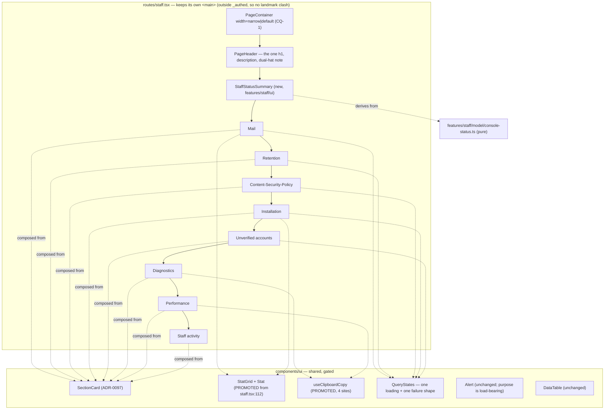
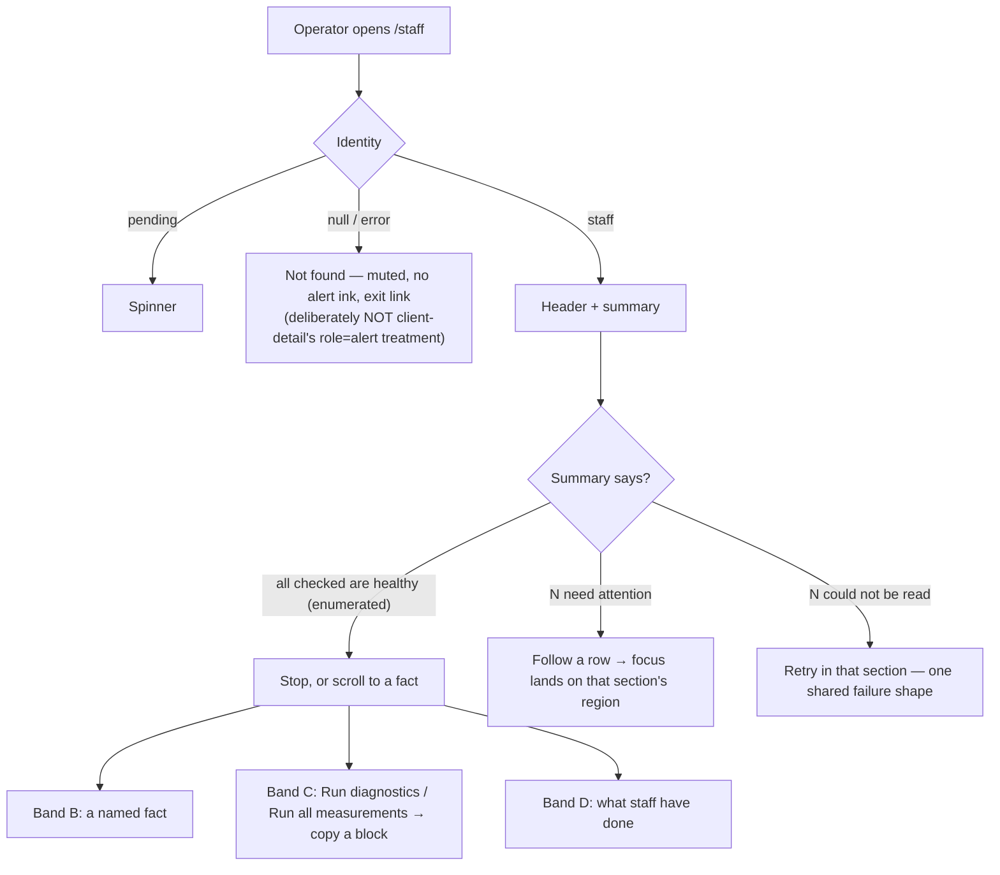

# Feature Spec: The staff console design review

- **Status:** Approved — 2026-09-14, all three critical questions answered (CQ-1 overrides this document's own recommendation; see §6), then reviewed by three specialists who all returned **blocked** and whose findings are folded in §8 (CQ-1's "throughout" is refined to span-by-demand on arithmetic; the milestones are re-sliced).
- **Author(s):** feature-analyst (Product Owner / Solution Architect / Technical Lead hats)
- **Date:** 2026-09-14
- **Tracking issue / epic:** _(none yet)_
- **Roadmap link:** new entry required under **Operations & staff** in `docs/ROADMAP.md`
  (`check:adr-coverage` refuses an ADR that neither appears there nor carries a written exemption —
  `scripts/check-adr-coverage.mjs:51-66`)
- **Related ADR(s):** ADR-0086 (the console and four of its panels), ADR-0087 M3 (Retention),
  ADR-0097 (the page archetypes, the surface scopes, the ratchets), ADR-0098 (the archetypes as a
  **gate**), ADR-0101 (a shot list that stops at the route), ADR-0102 (the light theme),
  ADR-0117 (`purpose` has no default), ADR-0128/ADR-0130 (the performance probe),
  ADR-0132 (`Alert purpose`), ADR-0140 (Diagnostics). A **new ADR is required** — see §4.9.

---

## 0. What I verified before writing this, and what it changed

Per `docs/PROCESS.md` "Decision-bearing claims carry their evidence" and CLAUDE.md §19.11 — **the
brief is not evidence**. Every grounding claim I was handed was re-checked. Five held. **Three did
not**, and two of the three change the work.

| #   | Claim as briefed                                                                        | Verdict                                        | Evidence                                                                                                                                                                                                                                                                                                                                                                                                                                                                                                                                                                                                                                                                                                                                                             |
| --- | --------------------------------------------------------------------------------------- | ---------------------------------------------- | -------------------------------------------------------------------------------------------------------------------------------------------------------------------------------------------------------------------------------------------------------------------------------------------------------------------------------------------------------------------------------------------------------------------------------------------------------------------------------------------------------------------------------------------------------------------------------------------------------------------------------------------------------------------------------------------------------------------------------------------------------------------- |
| 1   | `/staff` renders eight panels in one column                                             | **holds**                                      | `apps/web/src/routes/staff.tsx:82-108` — `<main className="mx-auto max-w-4xl space-y-6 p-6">` wrapping `MailHealthPanel`, `PerformanceProbePanel`, `DiagnosticsPanel`, `RetentionPanel`, `SecurityPanel`, `InstallationPanel`, `AccountsPanel`, `ActivityPanel`. File is 623 lines.                                                                                                                                                                                                                                                                                                                                                                                                                                                                                  |
| 2   | The page uses none of the ADR-0097 archetypes                                           | **holds**                                      | `rg "from '@/components/ui/page'" apps/web/src` returns seven hits, all in `features/overview/` and `features/share/`. `staff.tsx:84` is a raw `<h1 className="text-2xl font-semibold">`; `features/staff/ui/panel.tsx` is 46 lines wrapping `Card` with its own `<h2 className="text-lg font-medium">`.                                                                                                                                                                                                                                                                                                                                                                                                                                                             |
| 3   | ADR-0098 made "assembled from the archetypes" a structural gate                         | **holds**                                      | `apps/web/src/features/overview/archetypes.structural.test.ts` — two assertions, the second (`HAND_ROLLED`) matching `mx-auto…max-w-`, `<h1`, `<h2`, over the whole feature directory with comments stripped.                                                                                                                                                                                                                                                                                                                                                                                                                                                                                                                                                        |
| 4   | #319: "`shoot.mjs` has 25 shots and **not one of them is `/staff`**"                    | **STALE — and the correction is load-bearing** | `apps/web/scripts/shoot.mjs:570` is `{ name: 'staff', staff: true, go: (p) => p.goto(\`${BASE}/staff\`) }`, with a dedicated `shot.staff`branch at`:845-867`that skips loudly unless`SHOOT_STAFF=1`. The shot list is **42 entries**, not 25. ~~(the file's own docblock at `:18`still says 25 too)~~ — **that half is itself wrong**, corrected 2026-09-14 at M0: no docblock in`shoot.mjs`states a shot count at all. The only live "25 shots" text is`CLAUDE.md:2775`, a correctly past-tense record of ADR-0102 widening the harness 12 → 25. A claim about a stale claim, asserted without opening the file — ADR-0076 Class 3, inside the document written to catch it. See §0.1 — the gap is real but narrower and differently shaped than the row describes. |
| 5   | #320(a): the clipboard idiom is written a **third** time across three files             | **STALE — it is a fourth**                     | `rg "clipboard.writeText" apps/web/src` returns **four** production sites: `perf-probe/ui/performance-probe-panel.tsx:469`, `perf-probe/ui/probe-sittings.tsx:510`, `staff/ui/diagnostics-panel.tsx:66`, **and `features/share/components/ShareLinksDialog.tsx:63`**. The row's supporting claim — "the two older sites are silent when the clipboard refuses" — is also wrong of the fourth, which guards `navigator.clipboard` being absent (`:58-62`), announces a failure (`:68`) **and** reverts its label after 2 s (`:49-53`). See §3 Dependencies.                                                                                                                                                                                                           |
| 6   | ADR-0132 classified every staff `Alert` as `event` / `condition` and must not be undone | **holds**                                      | `components/ui/alert.tsx:91-100` — `purpose` is required with no default; `staff.tsx` passes it at `:93, :165, :318, :325, :350, :441`; `diagnostics-panel.tsx:140` passes `purpose="event"`.                                                                                                                                                                                                                                                                                                                                                                                                                                                                                                                                                                        |
| 7   | The console was built one epic at a time, each panel reviewed alone                     | **holds, and §1 makes it concrete**            | Panel order in `staff.tsx:100-107` is neither arrival order nor severity order — see §1 "Diagnosis".                                                                                                                                                                                                                                                                                                                                                                                                                                                                                                                                                                                                                                                                 |
| 8   | The WCAG 2.5.8 target-size sweep (ADR-0118) is a gate that would apply                  | **DOES NOT APPLY as briefed**                  | The sweep lives in `apps/web/e2e-workspace-fit/command-surface.spec.ts` and is scoped to the plan workspace. `/staff`'s only a11y gate is the axe scan at `e2e-staff/staff.spec.ts:603-606`, and that **cannot see 2.5.8**: read directly from the installed `axe-core@4.13.0/axe.js:33491-33496`, `target-size` carries `enabled: false` alongside `tags: ['cat.sensory-and-visual-cues','wcag22aa','wcag258']`, so requesting the `wcag22aa` tag does not turn it on. (4.12.1 is also installed; ADR-0090 M5 recorded the same flag there.)                                                                                                                                                                                                                        |

### 0.1 What #319 is actually about, now that the shot exists

The shot is declared and **cannot be satisfied**, which is a different defect from an omission and a
worse one: a reader auditing the list finds `/staff` on it.

Three things must all be true for `shoot.mjs:845-867` to write a picture, and the harness supplies
none of them:

1. **`SHOOT_STAFF=1`.** Supplied by the operator; fine.
2. **The signed-in address must be in the API's `STAFF_EMAILS`.** `onboard()` mints
   `shoot-${Date.now()}-${width}@example.com` (`shoot.mjs:61-66`) — a value that does not exist until
   the run starts, against a server variable that must be set **before boot**. There is no override.
   So this precondition is **unsatisfiable as written**, not merely unset.
3. **The address must be `emailVerified`.** The harness never verifies anything. The guard demands it
   independently of `AUTH_REQUIRE_EMAIL_VERIFICATION` (`e2e-staff/staff.spec.ts:24-26`).

The failure mode is honest at least — `:865-866` throws `staff console rendered no heading` rather
than filing a picture of the 404. But the effect is #319's: **nobody has ever seen this screen as a
picture.** M0 closes it and corrects the row rather than stepping over it (the ADR-0071 rule).

A secondary finding, recorded rather than fixed here: `playwright.staff.config.ts:19` says _"The spec
verifies addresses through the API rather than through mail, so no SMTP sink is needed"_, and the
spec verifies through mail (`staff.spec.ts:184-187`) against a sink the same config starts
(`:62-66`). One docblock, two contradictory sentences, nine lines apart. It is a comment, not
behaviour, so it goes in M0-T1 alongside #319's own correction.

---

## 1. Business understanding

### Problem

The product owner, 2026-09-14, verbatim:

> _"Let's review the whole of the staff panel. It's very vertical in layout and just built to be
> useful but now it needs to look like a designed page. Every single element needs reviewing and
> aligning to a ui standard that looks professional"_

Two complaints, and they have one cause.

**"Very vertical."** `/staff` is eight `Card`s stacked in a single `max-w-4xl` column
(`staff.tsx:82`), every one drawn identically: same card, same `<h2 className="text-lg font-medium">`
(`panel.tsx:36`), same `space-y-6` gap. Nothing on the page says which of them matters. **The order
is the finding.** It is not arrival order and it is not severity order:

| Position | Panel                   | Shipped by          | Reports a standing condition?                                                                                 |
| -------- | ----------------------- | ------------------- | ------------------------------------------------------------------------------------------------------------- |
| 1        | Mail                    | ADR-0086 M1         | **yes** — transport, alerting, heartbeat, failure counts                                                      |
| 2        | Performance             | ADR-0128 / ADR-0130 | **no** — inert until a button is pressed                                                                      |
| 3        | Diagnostics             | ADR-0140            | **no** — inert until a button is pressed (`diagnostics-panel.tsx:29`, the hook is `enabled: false` by design) |
| 4        | Retention               | ADR-0087 M3         | **yes** — disabled, overdue, consecutive failures                                                             |
| 5        | Content-Security-Policy | ADR-0086 M4         | **yes**                                                                                                       |
| 6        | Installation            | ADR-0086            | partly — two `warning` badges                                                                                 |
| 7        | Unverified accounts     | ADR-0086            | partly                                                                                                        |
| 8        | Staff activity          | ADR-0086 M5         | no — a record                                                                                                 |

**The two panels that do nothing at all until an operator presses a button occupy positions 2 and 3,
above every panel that answers the question the screen exists for.** They are also the two tallest:
`performance-probe-panel.tsx` is 1,190+ lines rendering two buttons, a `<details>` disclosure with
three selects, a per-step result block and the whole sittings history. Each was inserted at the top
by the epic that built it, reviewed alone, and was locally reasonable every time.

**"Just built to be useful."** The same three states get two different treatments depending on
whether a panel's body happens to be a table:

- **Four panels hand-roll their loading and error states** — `Spinner` + a bare
  `<p role="alert" className="text-destructive-text text-sm">` + a `Try again` `Button`, written out
  four times at `staff.tsx:151-161`, `:304-313`, `:470-479`, `:534-543`.
- **Two delegate both to `DataTable`** via its `loadingLabel` / `errorLabel` props
  (`:437-439`, `:617-618`).

Neither is wrong; nothing could have noticed they disagree, because no reviewer ever had both on one
screen at one time. That is the mechanism the product owner is describing, and it repeats:

- `Stat` is a local helper whose own docblock says _"the codebase has no promoted primitive for this
  shape (TECH_DEBT)"_ (`staff.tsx:112`), rendered into two `<dl>` grids with **different column
  counts** decided independently — `grid-cols-2 sm:grid-cols-3` (`:172`) and
  `grid-cols-2 sm:grid-cols-4` (`:483`). **That inherited docblock is wrong and §8.9 supersedes it**:
  `ContextStrip` (`components/ui/form-layout.tsx:251-276`) is a promoted `<dl>` fact display taking
  the same data shape, and there are **four more** hand-rolled metric tiles besides. The divergence
  is worse than this bullet claims, which strengthens the case for promoting one — but the
  discriminator against `ContextStrip` has to be stated, or this becomes the sixth answer rather than
  the first step of a convergence.
- Severity is spoken in four vocabularies that do not compose: `Alert tone`
  (`error | success | info` — there is **no `warning` tone**, `alert.tsx:66-74`), `Badge variant`
  (`neutral | warning`), the hand-rolled destructive paragraph above, and plain muted body text.
  "Retention sweeping is disabled" is `tone="info"`; "the last N sweeps failed" is `tone="error"`;
  "Failure alerting: off" is a `warning` **badge**. A reader cannot rank them.
- **Five `<strong className="font-medium">` lead-ins sit inside `Alert`s** (`:94, :166, :319, :326,
:442`). ADR-0097's own weight-ratchet note records three such lead-ins being **removed** from this
  very page's Performance panel as "a fourth channel saying what four things already said", because
  `Alert` already carries a tone colour, a coloured accent bar, a leading icon and a role
  (`token-architecture.test.ts:573-582`). The rule was applied to one panel and not its neighbours.

**Why now.** The console is no longer a scratch surface. It is the only route to the mail transport's
health, the retention clock, the CSP sink, the performance probe #75 has waited a year for, and the
ADR-0140 diagnostics whose first real reading was taken on the deployed host two days ago. It is
where an operator decides whether something is broken **right now** — and it has never had a design
pass of any kind, nor, until this epic, a picture.

### Users

One role, and it is not an organisation role. `/staff` is reached by a **`StaffPrincipal`**, which by
ADR-0086 D1 is structurally not assignable to `Principal`: no memberships, no `can()`, no
`organizationId`. RBAC and organisation scope (ADR-0012) **do not apply to this surface at all** —
the gate is an address in the server's `STAFF_EMAILS` plus `emailVerified`, evaluated at runtime.

- **The operator on duty** (today: the product owner). Arrives asking one of two questions —
  _"is anything wrong?"_ or _"I need a specific fact"_ — and cannot currently answer the first
  without reading eight cards top to bottom.
- **The operator investigating.** Presses Run diagnostics or Run all measurements, waits, copies a
  block into a record. Needs the tools findable, not prominent.
- **Any signed-in member who guesses the URL.** Sees `Not found`. Their experience is in scope only
  in that the redesign must not change it (§2 US-6).

### Primary use cases

1. Land on `/staff` and know within one screenful whether anything needs attention.
2. Go to a named fact — the mail host, the retention period for `mail_events`, how many accounts are
   unverified — without scanning.
3. Run a tool (diagnostics, the performance probe) and copy its output.
4. Read what staff have done, including refusals.
5. Reach all of the above from a keyboard, and from a screen reader, at the same bar as every other
   screen in the product.

### User journeys

**Happy path (today, measured in M0).** `/staff` → identity probe resolves → eight panels settle
independently → the operator scrolls. **Happy path (after).** `/staff` → identity resolves → a
summary states what is not healthy, or states that everything checked is healthy and names what was
checked → the operator either stops, or follows one link to the section that owns the condition.

The diagrams are in §4.

### Expected outcomes

- The first screenful answers "is anything wrong?" — including when the answer is "I cannot tell yet"
  or "I could not read three of the five checks".
- Every element on the page is drawn by a shared decision rather than a local one: the frame, the
  heading rank, the section shell, the loading shape, the error shape, the metric, the copy control.
- The page is **shorter**, not longer, in the same state.
- `/staff` joins the screenshot set, so the next change to it can be reviewed by looking.

### Success criteria

Measured, at 1646 × 1000 (the product owner's Surface Pro — ADR-0091's retrospective established it
as the width two whole epics never measured at; it leads `shoot.mjs:31`'s `WIDTHS`), against the M0
baseline and the **unhealthy recipe** of §4.7:

| #    | Criterion                                                                                                                     | Instrument                                        |
| ---- | ----------------------------------------------------------------------------------------------------------------------------- | ------------------------------------------------- |
| SC-1 | Every non-healthy condition the console can report is named or counted **within the first viewport**, no scrolling            | M5 re-shoot + a browser measurement               |
| SC-2 | Full document height in the same state is **≤** the M0 baseline                                                               | the same harness                                  |
| SC-3 | Screen-level weight count (`weightSites()` outside `components/ui/`) **falls** from 173                                       | `pnpm --filter @repo/web test token-architecture` |
| SC-4 | Arbitrary sizing count does not rise above 17                                                                                 | same                                              |
| SC-5 | `e2e-staff`'s axe scan stays at zero violations, with the scan re-run in a **non-healthy** state                              | `scripts/e2e-local.sh web:staff`                  |
| SC-6 | A new `archetypes.structural.test.ts` over the staff surface passes, **verified red first** against today's hand-rolled frame | vitest                                            |

### Open questions

Three are **CRITICAL** and are in §6. Everything else has a stated default and is not blocking:

- **Container width.** Default: keep `max-w-4xl` by moving to `PageContainer width="narrow"` (which
  _is_ `max-w-4xl`, `page-container.tsx:19`), so M1 is provably a no-op on measure. Widening is a
  layout decision and belongs to CQ-1, judged on M0's picture.
- **`Panel`'s `status` live region.** Default: **keep `Panel`, and make it compose `SectionCard`**
  rather than widening `SectionCard`'s public contract. Rationale in §4.4.
- **Band headings.** Default: **no**. Grouping is expressed by order and by the summary, not by a
  heading rank change. Rationale in §4.5.
- **The `Not found` branch.** Default: adopt the archetypes for the frame, and **deliberately keep
  the muted, non-alert treatment** rather than copying `client-detail.tsx:42-45`'s
  `role="alert"` + destructive ink. That screen is reporting a failure; this one is giving the honest
  uniform answer ADR-0086 requires, and dressing it as an error would imply a surface exists.
- **New ADR number.** `ADR-0143` is the next free one as of today (`docs/adr/` tops out at 0142).
  Re-derive at filing — ADR-0071 and ADR-0079 both record a number being taken between the plan and
  the milestone.

---

## 2. Functional requirements

### User stories & acceptance criteria

> **US-1** — As **the operator on duty**, I want the console to tell me at the top whether anything
> needs attention, so that I do not have to read eight cards to find out.
>
> **Acceptance criteria**
>
> - **Given** every check is healthy, **when** the page settles, **then** a summary states that, and
>   **names which checks it covered** — a bare "all good" that silently omits a check is the
>   green-result-about-nothing this repository keeps recording.
> - **Given** one or more checks are not healthy, **when** the page settles, **then** each such
>   condition is stated in the summary, in severity order, with a link to the section that owns it.
> - **Given** a query has not settled, **then** the summary says so for that check specifically and
>   **never counts it as healthy**.
> - **Given** a query failed, **then** the summary says the check **could not be read** — distinct
>   from both "healthy" and "not healthy" (the ADR-0087 M3 rule: disabled shows no last-run time,
>   because a timestamp beside "disabled" reads as health).
> - **Given** the summary renders, **then** it is **not** a live region (`Alert purpose="condition"`,
>   or no `Alert` at all). It states facts that were already true when the reader arrived, and it is
>   inserted together with its content once queries settle — which ADR-0132 establishes is the
>   unreliable case for a live region, not the silent one.

> **US-2** — As **the operator on duty**, I want the sections ordered by what they are for, so that
> the two tools that do nothing until pressed are not above the four panels that report conditions.
>
> - **Given** the redesigned page, **when** it renders, **then** Performance and Diagnostics appear
>   **below** Mail, Retention and Content-Security-Policy.
> - **Given** the redesigned page, **then** Staff activity remains last (it is a record, not a
>   signal).
> - **Given** a screen reader navigating by region, **then** every section is still a named `region`
>   and the order it walks matches the visual order.

> **US-3** — As **any reader of the console**, I want a query's loading and failure to look the same
> everywhere on the page, so that I can tell a broken panel from a broken installation.
>
> - **Given** any of the six query-backed sections, **when** its query is pending, **then** the
>   loading treatment is the one shape used by all six.
> - **Given** any of them fails, **then** the failure treatment is the one shape used by all six, it
>   carries a retry, and it renders **no stale value beside it** (the ADR-0140 M4 finding:
>   `query.data` survives a failed refetch, so a failure message can appear directly above the
>   previous run's numbers).
> - **Given** the retry is pressed, **then** focus is not dropped to `<body>` (this register records
>   that defect four times; `aria-disabled`, never the native attribute — ADR-0083).

> **US-4** — As **a designer or reviewer**, I want the console assembled from the page archetypes, so
> that the next change to it inherits the system rather than a local copy of it.
>
> - **Given** the staff surface (`routes/staff.tsx`, `features/staff/`, `features/perf-probe/ui/`),
>   **then** a structural gate asserts it imports `@/components/ui/page` and hand-rolls no page
>   frame, no `<h1>` and no `<h2>`.
> - **Given** that gate, **then** it was **verified red** against the pre-change tree before it was
>   committed (ADR-0110 D5 — a gate is finished when the defect it names has made it fail).

> **US-5** — As **the operator**, I want one metric treatment, so that the eight facts on this page
> are not laid out two different ways.
>
> - **Given** the Mail and Installation fact groups, **then** both are rendered by one promoted
>   component with one responsive column rule.

> **US-6** — As **a member who guessed the URL**, I want `/staff` to be indistinguishable from an
> address that does not exist, so that nothing confirms the surface is there.
>
> - **Given** a non-staff caller, **then** the page shows `Not found` and **no** word from the set
>   {denied, permission, not authorised, staff} — `staff.spec.ts:119-120`, unchanged.
> - **Given** the redesign, **then** the account menu still offers a non-staff reader nothing
>   (`staff.spec.ts:126-128`, unchanged).

> **US-7** — As **a reviewer of this or any later change to the console**, I want a picture of it, so
> that the next defect on this screen is found by looking rather than by a user.
>
> - **Given** `SHOOT_STAFF=1` and the documented API recipe, **when** `node scripts/shoot.mjs` runs,
>   **then** `.screenshots/<width>/staff.png` and `.screenshots/<width>/staff-unhealthy.png` are
>   written at all three widths.
> - **Given** the harness cannot reach the console, **then** it throws with a message naming which of
>   the three preconditions failed — not the current generic `is the caller staff?`.

### Workflows

**W-1 Arrive.** Identity probe → pending (spinner) / `null` (uniform Not found) / staff → page
renders header, summary, then sections in the §4.5 order. Sections settle independently; each
announces its settled state once through its own polite region (`panel.tsx:39-41`, preserved).

**W-2 Follow a condition.** Summary row → activate → focus moves to the owning section's region
(named `region`, focusable — `data-table.tsx:224-228` for table-bodied sections; the `SectionCard`
`<section aria-labelledby>` otherwise).

**W-3 Run a tool.** Unchanged from ADR-0140 / ADR-0130. Nothing about the confirmation, the overlay,
the `inert` guard (`performance-probe-panel.tsx:534`) or the recording path is touched.

### Edge cases

| Case                                          | Expected                                                                                         |
| --------------------------------------------- | ------------------------------------------------------------------------------------------------ |
| All five checks pending                       | Summary says "checking…", names nothing as healthy, and is not a live region                     |
| All five checks fail                          | Summary says five checks could not be read; **no** healthy claim anywhere                        |
| Mixed: two failed, one unhealthy, two healthy | All three states shown distinctly; the unhealthy one is not buried under the unreadable ones     |
| Everything healthy                            | Summary states it **and enumerates what was checked**                                            |
| Dual-hatted account                           | The ADR-0086 D4 banner stays, and stays `purpose="condition"` (`staff.tsx:93`)                   |
| Unverified-accounts list has a next cursor    | `Show older` keeps working (`staff.tsx:565-575`); it is a real fix, not decoration (ADR-0086 M6) |
| A sweep is running                            | The `inert` overlay still covers the page and the summary is inside it                           |
| Very long mail host / recipient               | `break-all` behaviour preserved (`staff.tsx:136`, `:519`)                                        |
| 768 px and below                              | Single column throughout; the summary does not become a horizontal scroller                      |

### Permissions

**No RBAC change, and none is possible here.** The surface is gated by `StaffPrincipal`
(ADR-0086 D1); there is no organisation, no role and no resource scope. Every route the page reads is
already audited, **including reads** (ADR-0086 D5). This epic adds **no route**, so it adds no audit
row and no census entry. The one permission-shaped invariant to preserve is US-6's uniform 404.

### Validation rules

None. This epic accepts no user input beyond the controls that already exist.

### Error scenarios

| Scenario                                                   | Detection                  | User-facing result                                                                                                   | Status       |
| ---------------------------------------------------------- | -------------------------- | -------------------------------------------------------------------------------------------------------------------- | ------------ |
| Identity probe fails or returns `null`                     | `useStaffIdentity`         | Uniform `Not found`, never "denied"                                                                                  | 404 (server) |
| `GET /staff/health` fails                                  | `useStaffHealth().isError` | One shared failure treatment in **both** Mail and Retention, plus "could not be read" in the summary for both checks | 5xx          |
| `GET /staff/csp-reports` fails                             | query                      | Same shared treatment                                                                                                | 5xx          |
| `GET /staff/installation` / `/accounts` / `/activity` fail | query                      | Same shared treatment                                                                                                | 5xx          |
| Clipboard refuses                                          | promise rejection          | A stated failure, never silence (WCAG 4.1.3 — the ADR-0140 M4 fix, now applied to all four sites)                    | n/a          |

---

## 3. Technical analysis

| Area           | Impact                    | Notes                                                                                                                                                                                                                                                                                                                          |
| -------------- | ------------------------- | ------------------------------------------------------------------------------------------------------------------------------------------------------------------------------------------------------------------------------------------------------------------------------------------------------------------------------ |
| Frontend       | **high**                  | `routes/staff.tsx` (623 lines), `features/staff/ui/`, `features/perf-probe/ui/`, and **two shared additions** in `components/ui/`                                                                                                                                                                                              |
| Backend        | **none**                  | No module, service or endpoint is touched. The page reads five existing routes and adds none.                                                                                                                                                                                                                                  |
| Database       | **none**                  | No model, column, index, constraint or migration. **`database-architect` is deliberately not engaged because there is nothing to design** — recorded so "the agent was not run" cannot later read as an oversight (the ADR-0121 / ADR-0140 wording).                                                                           |
| API            | **none**                  | No DTO, no OpenAPI change, no status code.                                                                                                                                                                                                                                                                                     |
| Security       | **low, and one decision** | Nothing changes about the guard, the uniform 404, or auditing. The one security-shaped question is CQ-2: whether the screenshot harness may reach the database.                                                                                                                                                                |
| Performance    | **low**                   | Client-only. The summary derives from queries the page already makes — **no new request**, which is the ADR-0087 M3 rule (a second route writes a second `staff.panel_read` row on every page load).                                                                                                                           |
| Infrastructure | **low**                   | `shoot.mjs` gains a documented env recipe. **No CI step and no Playwright config is added** — `test:e2e:staff` already exists (`apps/web/package.json:18`) and `shoot.mjs` is run by hand (it appears in no `package.json` script, no `scripts/`, and no workflow). So `check:ci-roster` and `check:e2e-roster` are untouched. |
| Observability  | **none**                  |                                                                                                                                                                                                                                                                                                                                |
| Testing        | **high**                  | A new structural gate; unit coverage for the summary derivation and the shared components; the existing `e2e-staff` journey extended (not replaced); the axe scan re-run in a non-healthy state.                                                                                                                               |

### Dependencies

**Prerequisites**

- **M0 must land first and is not optional.** You cannot review "every single element" of a surface
  nobody has seen a picture of. ADR-0099 is the precedent stated plainly: four consecutive epics
  tuned the plan workspace by arithmetic, and what settled the design was a screenshot — taken only
  after somebody noticed the shot list stopped at the route.

**Affected features**

- `features/overview/` — **only if** CQ-4's default is reversed and `SectionCard` is widened. Under
  the stated default (compose, don't widen) the overview is untouched.
- `features/share/` — `ShareLinksDialog` is the fourth clipboard site (§0 #5). Converting it is in
  scope **because leaving it is the failure this register records most often**: one correct pattern
  applied to a control and not its neighbour. This is the only task whose blast radius leaves
  `/staff`, and it is flagged as such in the plan.

**Register rows this epic closes or corrects**

| Row       | Disposition                                                                                                                 |
| --------- | --------------------------------------------------------------------------------------------------------------------------- |
| `#319`    | **Corrected in M0-T1, closed in M0.** Its headline claim is stale; the real gap is §0.1.                                    |
| `#320(a)` | **Corrected in M0-T1, closed in M4.** Four sites, not three; the "two older sites are silent" claim is wrong of the fourth. |

**What must NOT be dragged in**

- A product-wide archetype migration. `routes/client-detail.tsx:34` hand-rolls
  `<h1 className="mt-2 text-2xl font-semibold tracking-tight">`, and it is not alone; that is
  ADR-0097 Landing F's unfinished business and it is **out of scope**. This epic's gate covers the
  staff surface only.
- The ADR-0117 tooltip work, the ADR-0118 control-height axis, or anything about the plan workspace.

---

## 4. Solution design

### 4.1 The governing rule, quoted rather than invented

`docs/DESIGN_SYSTEM.md:546-550`:

> **The authoring rule: reach for the archetype, or raise the requirement — never invent a one-off.**
> A hand-rolled frame that happens to match today's archetype looks identical on screen and drifts
> the first time either changes, which is a defect nobody can see. A screen that needs something
> these do not offer wants a **seventh archetype**, not a bespoke layout in a feature folder.

Everything below follows from that sentence. Where the console needs something the six archetypes do
not offer — a metric, and a settled-state announcement — the answer is a promoted component with a
gate, not a local helper.

### 4.2 Architecture overview



**`PageContainer` renders a `<div>` and never a landmark** (`page-container.tsx:25-35`). That is
correct here for a different reason than elsewhere: `/staff` is a sibling of `_authed`, not a child,
so it supplies its own `<main>` (`staff.tsx:82`) and the container sits **inside** it. Stating this
because the obvious mistake — deleting the route's `<main>` on the grounds that the shell provides
one — would leave this page with no main landmark at all.

### 4.3 The summary: derived, three-valued, and not a live region

```mermaid
sequenceDiagram
  participant P as /staff
  participant Q as TanStack Query (existing, deduped)
  participant M as console-status.ts (pure)
  participant S as StaffStatusSummary

  P->>Q: useStaffHealth / CspReports / Installation / Accounts
  Note over Q: exactly the calls the page already makes — no new route,<br/>so no second staff.panel_read audit row (ADR-0087 M3 §4.6)
  Q-->>M: { data | isPending | isError } × 4
  M-->>S: Check[] — each { id, label, state, sentence, sectionId }
  Note over M: state ∈ HEALTHY | ATTENTION | UNREADABLE | PENDING.<br/>No coalescing. `?? HEALTHY` is the exact lie this exists to prevent.
  S-->>P: severity-ordered rows; each links to its section
```

Three design rules, each with a named precedent:

1. **Four states, never three.** `PENDING` and `UNREADABLE` are distinct from `HEALTHY`, and neither
   may be defaulted into it. This is ADR-0125's `UNKNOWN` verdict rule (`a ?? 'MATCH'` is the lie the
   columns exist to prevent) and ADR-0087 M3's "disabled shows no last-run time".
2. **A healthy summary enumerates what it checked.** "Everything is fine" over a set that silently
   lost a member is the failure mode this repository has recorded in gates four times (ADR-0093,
   ADR-0108, ADR-0121, ADR-0131). The enumeration is the non-vacuity control, on screen.
3. **Not a live region.** ADR-0132's discriminator, quoted from `alert.tsx:50-51`: _would this
   sentence read the same to somebody who arrived five minutes later and did nothing?_ Yes — so it is
   a `condition`. The per-section polite regions `Panel` already owns (`panel.tsx:39-41`) continue to
   announce settling; the summary must not announce it a second time.

**The derivation is pure and lives in `features/staff/model/console-status.ts`**, beside the existing
`retention-copy.ts` and `diagnostics-report.ts`, so its states are unit-testable without mounting
anything.

### 4.4 The section shell: `Panel` composes `SectionCard` (stated default, CQ-4 if reversed)

`SectionCard` owns the heading rank, the named `<section>` region and the card composition.
`Panel` owns one thing `SectionCard` does not have: the polite `status` region that announces a
panel's settled state (`panel.tsx:20-30`) — an ADR-0086 decision that matters precisely because eight
sections settle independently on this page.

**Default: `Panel` keeps its name and its `status` prop, and its body becomes
`<SectionCard title={title}>` with the status paragraph inside.** That is the ADR-0062 extraction
argument — compose, do not reimplement — applied before the divergence rather than after it, and it
keeps the blast radius inside `features/staff/`.

**The alternative, costed:** promote `status` onto `SectionCard` as an optional prop. It is arguably
the better long-run call — the overview has the same independently-settling shape and does not
announce it — but it widens a shared archetype's public contract for one consumer, which the
authoring rule warns about in the other direction. If taken, it needs its own assertion in
`page-archetypes.test.tsx` and a re-run of the overview journey.

### 4.5 Order and grouping: four bands, expressed by sequence, not by headings

| Band                               | Sections                                          | Why                                                                |
| ---------------------------------- | ------------------------------------------------- | ------------------------------------------------------------------ |
| **A — is anything wrong?**         | Summary, Mail, Retention, Content-Security-Policy | The three that report standing conditions                          |
| **B — what is this installation?** | Installation, Unverified accounts                 | Facts, with two warning badges between them                        |
| **C — tools you press**            | Diagnostics, Performance                          | Inert until a button is pressed; Performance is by far the tallest |
| **D — the record**                 | Staff activity                                    | Accountability, read after the fact                                |

**No visible band headings, and that is a decision rather than an omission.** A band heading would
have to be an `<h2>`, which pushes every section heading to `<h3>` and means changing
`SectionCard`'s rank contract (`CardTitle` does support `level={1|2|3}` — `card.tsx:73-77` — so it is
possible, not free). The payoff a reader gets is a word; the cost is a shared contract change and a
heading-tree change on the one screen whose a11y gate is an axe scan. Order plus the summary
expresses the same grouping with neither.

**Diagnostics before Performance within band C** because Diagnostics answers a question in ~1 s and
Performance is a two-minute commitment (`performance-probe-panel.tsx:575` renders the estimate).

### 4.6 User flow



### 4.7 The unhealthy recipe — because an all-green console does not test hierarchy

A picture of a console where nothing is wrong cannot tell you whether a red state would be findable.
So M0 takes **two** shots, and the second is the one the design is judged on.

`shoot.mjs` boots no servers (`:566-570`), so the API's environment is the operator's to set. The
documented recipe, to be pinned in the harness's own docblock:

- `MAIL_SMTP_URL` **unset** → "No mail transport is configured" (`staff.tsx:164-170`)
- `MAIL_ALERT_URL` / `HEARTBEAT_URL` unset → two `warning` badges + two consequence sentences
- `RETENTION_SWEEP_ENABLED=false` → the disabled `Alert` + the schedule sentence withheld
- `AUTH_REQUIRE_EMAIL_VERIFICATION` unset, plus at least one unverified account seeded
- at least one `csp_reports` row (the API e2e suite writes them; otherwise POST one to the sink)

**Non-vacuity control:** the shot fails if fewer than two distinct non-healthy conditions are present
when it is taken. A hierarchy assertion over an empty set passes and proves nothing.

### 4.8 Database changes

**None.** No model, column, index, constraint or migration — confirmed against the whole design, not
assumed. `database-architect` is not engaged for the reason stated in §3.

### 4.9 API changes

**None.** No endpoint, DTO, status code or OpenAPI change.

### 4.10 Component changes

| Component                                    | Where                          | Change                                                                                                                                                       | Gated by                                                                                                             |
| -------------------------------------------- | ------------------------------ | ------------------------------------------------------------------------------------------------------------------------------------------------------------ | -------------------------------------------------------------------------------------------------------------------- |
| `PageContainer`, `PageHeader`, `SectionCard` | `components/ui/page/`          | **unchanged**; newly consumed by `/staff`                                                                                                                    | new staff `archetypes.structural.test.ts`                                                                            |
| `Panel`                                      | `features/staff/ui/panel.tsx`  | composes `SectionCard`; keeps `status`; loses its own `<h2>`                                                                                                 | the same gate's `<h2` pattern                                                                                        |
| `StatGrid` / `Stat`                          | **new**, `components/ui/page/` | promoted from `staff.tsx:112-120`, closing that helper's own docblock TODO; **one** responsive column rule                                                   | unit test + the staff gate                                                                                           |
| `QueryStates` (or equivalent)                | **new**, `components/ui/`      | one loading shape and one failure shape, replacing four hand-rolled copies and aligning with `DataTable`'s                                                   | unit test; a structural assertion that `features/staff` contains no bare `role="alert"`+`text-destructive-text` pair |
| `useClipboardCopy`                           | **new**, `hooks/`              | one idiom, four call sites, **including the failure branch all four should have had**                                                                        | unit test; a structural assertion on `clipboard.writeText` call sites                                                |
| `StaffStatusSummary`                         | **new**, `features/staff/ui/`  | the summary; pure derivation in `features/staff/model/console-status.ts`                                                                                     | unit tests over all four states + mixtures                                                                           |
| `Alert`                                      | `components/ui/alert.tsx`      | **unchanged**. The five `<strong>` lead-ins **inside** alerts are removed at the call sites (ADR-0097's own precedent, `token-architecture.test.ts:573-582`) | the weight ratchet, which should FALL                                                                                |
| `DataTable`, `Badge`, `Button`, `Spinner`    | `components/ui/`               | unchanged                                                                                                                                                    | existing                                                                                                             |

**No new colour token, no new surface scope.** `/staff` sits in the page scope; the contrast matrix
(`styles/token-contrast.test.ts`) already covers every pair the design uses, and the colour-literal
lint rule (`packages/config/eslint/react.js:60-78`) forbids reaching outside it. If the summary needs
a severity colour the vocabulary lacks — note that `Alert` has **no `warning` tone**
(`alert.tsx:66-74`) — that is a token decision requiring its own measurement and a matrix entry, and
it is explicitly **out of scope**: the summary expresses severity by **order and by words**, with the
existing `Badge variant="warning"` where a chip is wanted.

> **Half of that paragraph is stale and §8.10 supersedes it.** `Alert` having no `warning` tone is
> true and **irrelevant**: `components/ui/notice-strip.tsx:30` already ships
> `warning: 'border-warning/40 bg-warning/10 text-warning-text'`, its **role is the caller's** so it
> can render with no live region at all — exactly what a standing-condition summary needs — and
> `--warning-text` is already used two panels down at `staff.tsx:271`. No token decision, no matrix
> entry, nothing out of scope. The "order and words" rule is kept because it is right on its own
> merits (WCAG 1.4.1), not because the colour was unavailable.

### 4.11 Implementation approach & alternatives

**Chosen: adopt the archetypes first, then re-order, then unify the details — each a separate
milestone, each independently releasable.**

The order matters. Adopting the archetypes (M1) is provably neutral if `PageContainer width="narrow"`
is `max-w-4xl`, which it is — so M1 can be judged purely on "does anything look different?" against
M0's pictures. Re-ordering (M3) then lands against a page whose frame is already the system's, so its
diff is about hierarchy alone. Doing both at once produces a diff nobody can review.

**Alternatives considered**

1. **A bespoke console layout — a grid of tiles, a status bar, a two-pane shell.** Rejected on
   ADR-0098's condition, quoted: a beautiful one-off on a flagship screen falsifies the design-system
   thesis on its first outing, and it does so **invisibly**, because a hand-rolled frame that happens
   to match today's archetype looks identical and drifts later.
2. **A two-column grid for the whole page.** Rejected as a default and kept alive as CQ-1, to be
   decided from M0's picture rather than from taste. The named risk is the brief's: a grid that puts
   a red state in the right-hand column below the fold is worse than the stack. If a grid is taken,
   it must be **band-local** — band B only, whose sections are short — and never applied to a band
   that can report a condition.
3. **A seventh page archetype, `ConsolePage`.** Rejected: the console's distinctiveness is its
   _content ordering and its summary_, both of which are staff-specific derivations. What it
   genuinely lacks from the system is a metric and a query-state shape, and those are components, not
   a page archetype. Promoting a whole page archetype for one consumer is the one-off wearing the
   system's clothes.
4. **Collapsing the tall panels behind disclosures.** Rejected: it hides Performance's own controls
   behind a second click, and `<details>` inside `<details>` (Performance already has one at
   `:579`) is a shape nobody should ship. Ordering solves the same problem without removing anything.
5. **Fixing the hierarchy with a sticky summary bar.** Deferred, not rejected: it is a real option if
   M5's measurement shows SC-1 failing on a long page, and it is cheaper to add later than to remove.

**A new ADR is required** (§4.9 of `docs/PROCESS.md`'s Change management): this epic adds two shared
components, adds a structural gate, changes a shared harness, and settles a rule — _a console's
hierarchy is expressed by order and a derived summary, never by a bespoke layout_ — that the next
operations surface will inherit. Draft outline in the plan's M5.

---

## 5. Links

- Implementation plan: [./implementation-plan.md](./implementation-plan.md)
- Docs this change updates: `docs/DESIGN_SYSTEM.md` (the archetype table gains `StatGrid`;
  the authoring rule gains the console clause), `docs/UX_STANDARDS.md` (severity ordering on an
  operations surface), `docs/TECH_DEBT.md` (#319 corrected then closed; #320(a) corrected then
  closed), `docs/ROADMAP.md` (the new ADR's entry), `CLAUDE.md` §16 (the new ADR's register entry),
  `docs/adr/README.md` (the index row).

---

## 6. The product owner's answers (2026-09-14) — APPROVED, with one override

All three critical questions were answered and the epic is approved to build. **CQ-1 was decided
against this document's recommendation**, and it is recorded as an override rather than rewritten,
because a spec that silently agrees with whatever was chosen stops being evidence of anything.

### CQ-1 — LAYOUT: **two columns throughout.** Overrides §4's default and alternative 2.

> **Refined by the design review — read §8.1 with this.** "Two columns" stands and is right. The
> word **"throughout"** does not survive arithmetic nobody had done: two _equal_ columns at 1646 are
> **787 px**, narrower than today's **848 px** single column, so it would have made the cramped
> tables M0 diagnosed **worse**. Spans are assigned by content width demand instead — tables run
> full width at 1488 px (**+75 %**), stat grids and control rows pair at 732 px. Same decision, more
> of what it was chosen for.

This document rejected a whole-page grid as a default and kept it alive as a question, with a named
risk: _a grid that puts a red state in the right-hand column below the fold is worse than the stack_,
because on a screen read for alarm, side-by-side placement makes scan order ambiguous. That risk was
put to the product owner in those words and they chose two columns.

**So it is built, and the risk is settled by measurement rather than by either party's judgement.**
FC-1 already tests exactly this — _every non-healthy condition is named or counted within the first
viewport_, at 1646 × 1000, on the unhealthy recipe, with the non-vacuity control checked first. The
override therefore costs nothing in rigour: if two columns bury a condition, FC-1 fails and says so
with a picture.

Two consequences are written down now so they cannot be claimed later as wins:

- **FC-2 becomes nearly trivial.** Two columns roughly halve the page, so "document height ≤ the M0
  baseline" will pass by construction and proves almost nothing. **FC-1 and FC-3 carry the verdict.**
  Quoting a large height reduction as evidence the redesign worked would be measuring the thing that
  could not have gone the other way.
- **Alternative 2's band-local clause is superseded, not deleted.** Its reasoning — never grid a band
  that can report a condition — becomes a constraint on _how_ the two columns are filled rather than
  a reason not to have them: band A's placement must keep every condition above the fold, which is
  FC-1 restated as a design rule.

**If FC-1 fails, the measurement goes back to the product owner.** Reverting to one column
unilaterally would be substituting my judgement for theirs a second time.

### CQ-2 — HARNESS: **route A**, the SMTP sink, public routes only.

No database write. The harness follows a real emailed verification link exactly as
`e2e-staff/staff.spec.ts` already does, so it stays entirely above the public API and the console's
founding argument — that it exists to replace `psql` — is not undercut by the tool that photographs
it. Sub-option **(ii)**: `SmtpSink` moves to a `.mjs` module with a `.d.ts`, consumed by **both** the
journey and the harness. Copying it (iii) stays rejected on the ADR-0065 / ADR-0121 rule — two
implementations drift, and the drift is invisible because each looks right alone.

`security-reviewer` is therefore **not** required for this epic on CQ-2's account; it was conditional
on route B, which was not taken.

### CQ-3 — RE-ORDER: **full re-order into the four bands, and merge Mail + Retention.**

The merge goes beyond this document's default, which kept all eight panels distinct. Both panels are
rendered from a single `useStaffHealth` response, so one card removes a boundary the data does not
have.

**The accepted cost is stated rather than discovered later:** "Retention" stops being its own
scannable heading, and it is the panel an operator goes looking for by name when they want to know
whether the sweep is arming. So the merged card must keep retention **findable** — a labelled
subsection within the card, not a paragraph folded into mail's prose — and M5's gate pass checks that
an operator scanning for the word still finds it.

Nothing else merges and nothing is removed: the other six panels keep their identity.

---

## 7. Further guidance (product owner, 2026-09-14) — and full approval

> _"Once the spec and plan come back and th agents agree with them you have my approval to build and
> drive this to completion and release"_
>
> _"Note I care about it looking pretty so single column shouldn't be set in stone the user is a
> seasoned admin so should be able to navigate a an admin panel with ease. All other questions go
> with what will make the best app possible in the long run"_

**Approval is granted**, conditional on one thing: the design agents review this spec and plan and
their blocking findings are folded before building. After that the epic runs to release without
coming back.

Three pieces of guidance change what this document assumed, and each is written here rather than
absorbed silently, because each licenses something §4 was cautious about.

### 7.1 Aesthetic quality is a goal, not a side effect

_"I care about it looking pretty."_ This spec was written defensively — its §4 reads as a set of
things not to get wrong. That is necessary and it is not sufficient. **A design that is merely
correct fails this request.** Where a choice is between defensible-and-plain and considered-and-
handsome, and the gates are satisfied either way, take the second.

The instrument does not change: FC-1 still decides whether hierarchy survives. "Pretty" is not
testable, which is exactly why it must not be traded against the things that are — it is an
additional obligation, not a licence to drop one.

### 7.2 The reader is a seasoned administrator

This is the single most freeing sentence in the brief and it was **not** an assumption the spec had
made. §4's caution about scan order, about density, about how much a reader can hold — all of it was
written for an unspecified reader. The real one operates this installation, has chosen to open a
staff console, and navigates admin panels for a living.

Consequences taken deliberately:

- **Density is allowed.** More information per screen is a feature for this reader, not a hazard.
  The 46 % of the window M0 measured as empty is not restraint, it is waste.
- **Admin-panel conventions are available** — dense tables, compact metric rows, terse labels,
  keyboard affordances — and do not need justifying as novelties.
- **Explanatory prose can be reduced.** Several panels carry a paragraph explaining what they are;
  a seasoned admin reads a label. Prose that states a **non-obvious consequence** stays (the
  retention note about `audit_events` refusing `DELETE` is a fact nobody can infer); prose that
  restates the heading goes.
- What this does **not** license: unlabelled iconography, colour as the only channel, or anything
  that fails a gate. Expertise in the reader is not an accessibility exemption.

### 7.3 Everything else is decided for the long run

_"All other questions go with what will make the best app possible in the long run."_ So the
remaining open items are **decided in-flight and recorded with their reasons**, not returned as
questions. The standing tie-break: prefer the option that leaves the design system stronger for the
next surface, over the one that is cheapest for this screen. Where those agree, no decision is being
made and none is recorded.

A question goes back only if proceeding would be unsafe, or would waste the work if the guess were
wrong.

---

## 8. The design review gate (2026-09-14) — three reviews, all blocking

The product owner's approval in §7 is conditional on one thing: _"the agents agree with them"_. Three
specialists reviewed this document and `implementation-plan.md` **before any code was written** —
`ui-architect`, `accessibility-reviewer`, `ux-reviewer`. All three returned **blocked**: twelve
architecture findings, five accessibility, four UX.

That is the gate working. Every one of them is a completeness or arithmetic failure **inside** an
already-approved decision, not a new question — so none went back to the product owner, which is what
§7.3 licenses. Each is folded below with the evidence that settled it. Where a finding corrected this
document, the original wording is left in place above and superseded here rather than rewritten,
because a spec that silently agrees with whatever was chosen stops being evidence of anything.

### 8.1 The decisive finding: two EQUAL columns are narrower than today's single column

**This is arithmetic, and nobody had done it.** `page-container.tsx:18-23` gives `narrow` =
`max-w-4xl` = **896 px**; `staff.tsx:82` pairs it with `p-6`, so content today is **848 px**.

Two equal columns, at the widest possible container (`full`, the whole 1646 px viewport), with `p-6`
and a `gap-6`:

```
(1646 − 48 padding − 24 gap) / 2 = 787 px per column
```

**787 < 848.** At the product owner's own width, no two-equal-column arrangement gives any panel as
much width as it has today. At `width="wide"` it is 732 px. Every arrangement loses 60–120 px per
panel.

Now read this epic's own diagnosis, `m0-measurement.md:66-68`:

> _"The narrow column is why several panels' tables look cramped at 1646 while the window is half
> empty — a symptom of the measure, not of the tables."_

Five of the eight panels are table-bodied, and the column counts are **4, 4, 5, 2, 3** — verified by
reading the five `columns` definitions at `staff.tsx:133, 256, 398, 518, 591`. Two of them carry
`break-all` fields (Mail's recipient at `:136`, CSP's blocked URI at `:407`/`:415`). So **"two columns
throughout" makes the symptom M0 diagnosed worse**, while fixing the unrelated symptom (unused
margin).

**And no falsification condition could see it.** FC-1 measures what is above the fold; FC-2 measures
document height, which two columns improves by construction (§6 already concedes this proves nothing);
FC-3 counts weight sites. The epic could pass all three and ship a console whose tables are **less**
legible than the one it replaced. That is the gate-that-cannot-see-the-defect shape this register
records repeatedly (ADR-0093, ADR-0108, ADR-0121, ADR-0131).

**CQ-1 is not overturned.** Two columns is right — 46 % of 1646 px is genuinely wasted, and the
product owner's instruction that _"single column shouldn't be set in stone"_ stands. What was wrong is
the word **"throughout"**, which was never a considered decision: it was the only arrangement on the
table when the question was asked.

**The refined answer — a two-column grid whose spans are assigned by content width demand:**

|                            |                                                                                                                     |
| -------------------------- | ------------------------------------------------------------------------------------------------------------------- |
| **Container**              | `PageContainer width="wide"` (`max-w-screen-2xl`, 1536) — not `narrow`                                              |
| **Zone 1, never columned** | `PageHeader` + the dual-hat `Alert` + `StaffStatusSummary`. A status answer must not sit beside anything.           |
| **Zone 2, the grid**       | each section declares **wide** (body is a table) or **narrow** (body is a stat grid, a badge row, or tool controls) |
| **Wide**                   | `col-span-2` → **1488 px of content, +75 % against today's 848**                                                    |
| **Narrow**                 | pairs → 732 px each, ample for four `Stat`s or three buttons                                                        |

Applied to the real content: Installation's four `Stat`s pair with Diagnostics' controls; Mail's
failures table, Retention's table, CSP's five-column table and Staff activity all run full width;
Performance keeps its own full-width row. **Both wins, not one win and one regression** — less
scrolling _and_ wider tables — which is what §7.1's "looking pretty" actually asks for.

Decided under §7.3 (_"go with what will make the best app possible in the long run"_) rather than
returned as a question, because the arithmetic only admits one answer and the alternative regresses
the thing M0 was opened about.

**FC-4 is added, because nothing else in the epic would notice if this went wrong:**

> **FC-4 — no table-bodied section is narrower after the change than the 848 px it has today.**
> Measured in the browser at 1646, on the same shot FC-1 is judged from.

### 8.2 The four-band model survives as an ordering and is retired as a layout primitive

The architect was asked directly whether four bands survive two columns. **No**, for three reasons,
all of which hold up:

- **A band is a one-dimensional device.** Its entire content is _"this comes before that"_. Rendering
  a 1-D model in a 2-D layout leaves one axis carrying no meaning — and a reader infers meaning from
  it anyway (_is the left column more important?_ No: it is wrap order). That is worse than one
  column, where the missing axis is at least honest.
- **Band C is the reductio.** `DiagnosticsPanel` is a paragraph and two buttons
  (`diagnostics-panel.tsx:87-135`). `performance-probe-panel.tsx` is **1,189 lines**. Laying those
  2-up produces a column with a several-hundred-pixel void. Every band pairs panels whose heights
  differ by an order of magnitude, and **ragged voids are the specific thing that will read as _not
  pretty_** — §7.1's explicit goal.
- **§8.1**: band-wise 2-up narrows every table.

**The bands keep their real job — priority ordering — which is also DOM order, which is also
screen-reader order.** That satisfies US-2's third acceptance criterion unchanged. Only the claim that
a band is a layout row is withdrawn.

The three alternatives the architect was asked about are all **rejected**, and the reasons are worth
keeping:

- **Master/detail** — hides seven of eight sections by default, directly contradicting SC-1/FC-1. And
  to be usable its master list would have to carry each section's state, at which point the master
  list **is** `StaffStatusSummary` and the detail pane duplicates the section it points at. Wrong
  pattern for a screen read for alarm.
- **A masthead of metrics** — the console's headline is a **judgement** ("is anything wrong?"), not a
  number. `InstallationPanel`'s facts (`staff.tsx:483-488`) are API version, environment, mail host,
  staff count; none is a question an operator arrives with. It would compete with the summary for the
  most valuable band on the page.
- **A fixed status rail** — not rejected, **promoted from "deferred" to a decision made in the layout
  milestone**. §4 deferred a sticky summary as _"a real option if M5's measurement shows SC-1
  failing"_. Once there is a grid it is nearly free, and it makes FC-1 **structurally true rather than
  measured**. Retrofitting is cheap; designing around its absence and then adding it is not.

### 8.3 `PageGrid` — a seventh component in the archetype family, not a seventh page archetype

The `ConsolePage` rejection in §4.11 still holds: its stated reasons (content ordering, a
staff-specific summary) are genuinely not page-archetype material, and the column count does not
change that.

But **a two-column page grid is a page-level layout decision, and hand-rolling it in `staff.tsx` is
exactly the bespoke frame the authoring rule forbids — and the M1 gate cannot see it.**
`archetypes.structural.test.ts:39-46` matches `mx-auto…max-w-`, `<h1`, `<h2`. A raw
`grid grid-cols-2` at the page root matches **none** of them.

So: add **`PageGrid`** to `components/ui/page/`, alongside `PageContainer`, taking the wide/narrow
span decision per child. Much smaller than `ConsolePage`, it is what the next operations surface will
need, and it gives the M1 gate something to assert the use of. `HAND_ROLLED` is extended so a
page-level `grid-cols-` in the staff surface fails.

### 8.4 `SectionCard` gains `id` + a focusable target — taken deliberately, not stumbled into

W-2 says focus moves to _"the `SectionCard` `<section aria-labelledby>`"_. **A `<section
aria-labelledby>` is not focusable**, and `SectionCardProps` (`section-card.tsx:6-17`) accepts no `id`
and no rest spread, so it cannot even be an anchor target.

So the summary **requires** `SectionCard` to gain `id` + `tabIndex={-1}`. CQ-4's stated default was
chosen specifically to avoid widening `SectionCard`'s public contract — and the epic widens it anyway,
one milestone later, for a different reason nobody costed.

**Take the widening deliberately.** `id` and a focusable target are generally useful on a section
archetype (the organisation overview has the same skip-to-section problem), and it is a **better**
widening than the `status` prop CQ-4 rejected. `Panel` still composes for `status`. The two costs §4.4
already priced — its own assertion in `page-archetypes.test.tsx`, and a re-run of the overview
journey — are now **budgeted** rather than incurred silently.

### 8.5 M1 is not a no-op on measure in three ways, and its judging criterion would fire on all three

M1's method is _"does anything look different? If yes, something was hand-rolled differently from the
archetype and we have just found it."_ Three things will look different for reasons that are **not**
findings, and must be anticipated or M1 produces three false positives on its first run:

1. **`space-y-6` is lost.** `staff.tsx:82` is `mx-auto max-w-4xl space-y-6 p-6`; `PageContainer` emits
   `mx-auto w-full flex-1 p-6` + the width and has **no** spacing. All eight panels' vertical rhythm
   collapses unless `className="space-y-6"` is passed. (Superseded in part by §8.3 — the grid's `gap`
   replaces it in zone 2 — but M1 runs before the grid, so M1 passes it.)
2. **`space-y-4` inside every panel is lost, with no route to restore it.** `panel.tsx:38` is
   `<CardContent className="space-y-4">`. `SectionCard` passes `className` to the **`Card`**
   (`section-card.tsx:52`), not to `CardContent` (`:62`), and `SectionCardProps` is a **closed
   interface** — no rest spread, no `contentClassName`. The fix needs no widening: `Panel` wraps its
   own children in `<div className="space-y-4">`.
3. **Panel headings change size and weight.** Today `panel.tsx:36` is `text-lg font-medium` (18 px /
   500). `SectionCard` renders `CardTitle level={2} className="text-base"` → 16 px / 600. That is
   **desirable** — it is the system's rank treatment — but it must be _expected_, not discovered.

### 8.6 The journey assertion that actually breaks is not the one the plan flagged

The plan flagged `staff.spec.ts:256` and `:304`. Both are **safe**: they locate by name
(`/retention by table/i`, `/staff actions/i`), which are `DataTable` captions, and a new `SectionCard`
region is named by its panel title — different names, no ambiguity.

The one that breaks is **`staff.spec.ts:472-477`**:

```js
const describedBy = await staff
  .getByRole('region')
  .filter({ has: history })
  .first()
  .getAttribute('aria-describedby');
```

`history` is the sittings table inside the Performance panel. Today the only region containing it is
`DataTable`'s scroll region, which carries `aria-describedby`. Once `Panel` becomes a `SectionCard`
region, the Performance `<section>` **also contains it and precedes it in document order**, so
`.first()` returns the section — which has no `aria-describedby` — and the assertion fails. Fix the
locator to `.last()` or scope it by the caption name.

### 8.7 The M2 structural gate as specified is vacuous — it passes today, against the defect it names

The gate was specified over **`features/staff`**. Grepped: **zero** production matches there (the only
hit is a comment in `retention-copy.test.ts:209`). All four offending `role="alert"` +
`text-destructive-text` blocks are in **`apps/web/src/routes/staff.tsx`** — `:154`, `:307`, `:473`,
`:537` — which is not in `features/staff`.

So it could never be verified red, and would pass on day one having tested nothing. Scope it to the
same file set as the archetype gate: `routes/staff.tsx` + `features/staff/**` +
`features/perf-probe/ui/**`.

### 8.8 "One loading shape" is not achievable, and would regress a shipped decision

US-3 requires _"the loading treatment is the one shape used by all six"_, aligned with `DataTable`'s.
But `DataTable`'s loading state is a **content-shaped skeleton, not a spinner**
(`data-table.tsx:119-173`), and its own docblock argues the point:

> _"a skeleton whose column count differs from the settled table reflows the page under the reader's
> cursor — which is the defect a skeleton exists to prevent"_

Unifying the four `Spinner` panels onto one spinner regresses against that; unifying onto "DataTable's
skeleton" is impossible, because Mail's settled content is a stat grid and a badge row, not a table.

**The failure half is genuinely unifiable and is the strong part of M2:** `data-table.tsx:176-186` and
`staff.tsx:153-161` are **character-identical** modulo the label.

And the plan's own mitigation was wrong in a way this repository has a rule about: _"it composes
nothing of `DataTable`; both simply render the same shapes, asserted by one unit test over both"_ is
**two implementations of one shape held together by a test** — precisely the ADR-0065 / ADR-0121 rule
this same document invokes twice elsewhere. **`DataTable` must consume the shared failure component,
or the extraction is not taken.**

So: narrow it to **`QueryErrorState`** (five call sites including `DataTable`), and make loading a
**rule** — skeleton where the settled shape is known, spinner otherwise — with per-panel skeletons
where they are cheap. The "one shape" wording is struck from US-3.

### 8.9 `StatGrid`'s founding claim is stale, and there are four more hand-rolled answers

This document inherited `staff.tsx:112`'s docblock verbatim — _"the codebase has no promoted primitive
for this shape"_. `components/ui/form-layout.tsx:251-276` is **`ContextStrip`**: a promoted `<dl>` fact
display in `components/ui/`, taking `facts: ReadonlyArray<{label, value}>` — the same data shape.

And there are at least four more independent metric tiles, each with its own type ramp:

| Site                                                      | `dt`      | `dd`                                                    |
| --------------------------------------------------------- | --------- | ------------------------------------------------------- |
| `staff.tsx:116-117`                                       | `text-sm` | `text-xl font-semibold tabular-nums`                    |
| `earned-value/components/EarnedValuePanel.tsx:80-85`      | `text-xs` | `text-lg font-semibold tabular-nums` **+ a `sub` slot** |
| `interchange/components/InterchangeReportTable.tsx:49-50` | `text-xs` | `text-xl font-semibold tabular-nums`                    |
| `share/components/GuestPlanView.tsx:114-115`              | `text-xs` | `text-sm font-medium tabular-nums`                      |
| `schedule/components/ScheduleSummaryStrip.tsx:24-25`      | `text-xs` | `text-sm font-medium tabular-nums`                      |

Promoting a sixth answer without stating the discriminator is how the fourteen-empty-states story
starts again. So: **(a)** state the `StatGrid` ↔ `ContextStrip` discriminator in both docblocks — _a
grid of headline metrics in a page section_ vs _the facts an edit is about, beside the edit_;
**(b)** design the API against the **widest existing caller**, `EarnedValuePanel`'s `sub` slot, or it
can never adopt it; **(c)** file a register row naming the four unconverted sites, so this is the
first step of a convergence rather than a sixth divergence.

### 8.10 The status vocabulary already exists, shipped three weeks ago

`features/schedule-health/model/health-rows.ts` (ADR-0116) **is** `console-status.ts`'s design,
already built: a pure, React-free, fetch-free view-model emitting per-check rows with a
`verdictLabel` (_"the verdict as a WORD — never colour alone (WCAG 1.4.1)"_), a **four-valued** `tone:
'pass' | 'fail' | 'muted' | 'info'`, a `reasonSentence` for the not-assessable case, a `remedy` route
and a `caveatSentence`. It is gated by `schedule-health-vocabulary.structural.test.ts`, and
`ScheduleHealthPanel.tsx:224-226` renders the four-state roll-up line.

**Derive `console-status.ts`'s vocabulary from it** rather than inventing a parallel one — same
four-state tone names, verdict-as-a-word, reason sentence. Otherwise the epic removes four competing
severity vocabularies _within_ one page and adds a fifth _across_ the product. **Do not extract a
shared primitive yet** — this is the second instance, and the house rule is to extract at the third;
file the register row that names it.

**And §4.10's self-imposed constraint is stale.** It argued severity must be order-and-words-only
because _"`Alert` has no `warning` tone"_. True of `Alert` and **irrelevant**:
`components/ui/notice-strip.tsx:30` has `warning: 'border-warning/40 bg-warning/10 text-warning-text'`,
its **role is the caller's** so it can render with **no live region at all** — exactly what a
standing-condition summary needs — and `--warning-text` is already used two panels down at
`staff.tsx:271`. No token decision, no matrix entry, nothing out of scope.

### 8.11 Accessibility: DOM order is the AT-equivalent of FC-1, and it had no condition

The reviewer's sharpest point answers a question this document did not ask itself. **"First viewport,
no scrolling" is a sighted-user concept**; nothing about it is meaningful to someone navigating
linearly, by heading, or by "read all". FC-1 is a legitimate and necessary check for the _visual_
redesign, but it is **not** an accessibility guarantee and this spec must not be read as though it
were.

The AT-equivalent guarantee is that the summary is **first in DOM order after the `<h1>` and its
description, and enumerates or links every non-healthy condition** — which US-1 already asks for in
words and which, uniquely among this epic's requirements, had **no falsification condition**. That is
the one place the discipline lapsed. So:

> **FC-1a — in DOM order, `StaffStatusSummary` precedes every section, and for each non-healthy
> condition it contains a link whose target is that section.** Asserted structurally, in DOM terms,
> independent of pixels — and asserted **at the two-column breakpoint**, verified red against a
> CSS-`order`-based implementation first.

Three further accessibility decisions:

- **No CSS `order`, and no grid placement that displaces a section from its DOM position.** WCAG 1.3.2
  is satisfied by a two-column layout only if the DOM sequence _is_ the reading sequence. Achievable
  — nest two ordinary sub-trees rather than re-ordering a flat list — but it has to be stated as an
  engineering constraint, and it was not.
- **The pinned "not a live region" test must assert the absence of `aria-live`, not only of `role`.**
  `aria-live="polite"` with no `role` is still a live region. `Alert` never sets it, so the point is
  moot if the summary reuses `Alert` — but §4 explicitly allows a bespoke component, and nothing then
  stops a later author adding `aria-live` to make it "feel responsive".
- **Eight (soon seven) polite regions are inherited, not introduced**, and are tolerable as a
  _secondary_ channel because each panel's status sentence self-identifies by name. Worth naming in
  the ADR as **considered** rather than silently inherited. _Reasoning from specification, not
  observed AT behaviour._

### 8.12 The Mail + Retention merge had no implementing task

CQ-3 approved it. `implementation-plan.md:326` and `:404` **both still list Mail and Retention as two
separate entities**, exactly as today, and **no task anywhere in M1–M5 merges them**. That is the
"a plan is a claim too" pattern this register records repeatedly (ADR-0081, ADR-0120, ADR-0133): an
approved decision that reads as done because it is in the spec, with nothing in the breakdown that
builds it.

It also exposes a tension this document created and did not resolve. Today "Retention" is a full
`<h2>`, independently reachable by heading navigation. Either:

- **no subheading** → "Retention" leaves the heading list entirely, and a reader must open "Mail" and
  read its body to find it. A real navigability regression, and it cuts against exactly the
  _"seasoned admin navigating with ease"_ framing §7.2 invokes — **an expert user relies on heading
  and landmark shortcuts more, not less**; or
- **an `<h3>` "Retention"**, which is what "labelled subsection" must mean — but that reproduces the
  shape §4.5 argued against at band level (_"pushes every section heading to `<h3>`… a shared contract
  change"_).

**Resolved: `<h3>` via `CardTitle level={3}`, inside the merged card.** §4.5's objection was to
pushing **every** section heading down a level across the whole page, which is a shared contract
change; adding one `<h3>` inside one card is not that, and `CardTitle` already supports the level. The
merged card's title stays **"Mail"**; retention is its labelled subsection with its own `id`, and the
summary links to the **subsection**, not the card.

Two mechanics nobody had written down, now required of the task:

- **How the single `status` polite sentence is composed** from two independently-settling facts.
  Concatenating "Mail: 0 failures…" and "Retention: …" back-to-back with no separation is not a
  design; state one.
- **The existing `describedById` wiring is preserved.** `RETENTION_DISABLED_ID` /
  `RETENTION_FAILING_ID` (`staff.tsx:283-289, 367`) must keep pointing at whatever the retention
  `DataTable` becomes inside the merged card.

### 8.13 WCAG 2.5.8 — the by-hand check becomes a named checklist

The framing was right: `axe-core@4.13.0` ships `target-size` with `enabled: false`, so requesting
`wcag22aa` does not turn it on, and `e2e-workspace-fit` never touches `/staff`. But M4 delegated
entirely to _"check every icon-only or small control by hand"_, with no list.

Checked rather than assumed: **`Button`'s existing size tokens already clear the bar for everything
that exists today** — `globals.css:939-940, 1082-1089` gives `--control-h-sm` = 32/44 px and
`--control-h` = 36/44 px, both above the 24 px AA floor. **The risk is in what M4 _adds_** under the
density licence, not in what exists. The checklist:

1. `StaffStatusSummary`'s per-condition links — the **whole row** is the target with a full
   descriptive accessible name, never a small trailing icon or caret. This is exactly the shape
   ADR-0090 and ADR-0110 record shipping wrong twice.
2. Every `useClipboardCopy` call site goes through the shared `Button` `icon` variant, never a bespoke
   smaller element.
3. Whatever interactive element the Mail/Retention merge adds (a jump link to the subsection).
4. Any compacted pagination, if "dense tables" gets read as "smaller controls".
5. **Any new interactive element uses the existing `--control-h` tokens / `Button` variants rather
   than an arbitrary size** — which also keeps it inside SC-4's arbitrary-sizing ratchet as a cheap
   secondary proxy, though that ratchet was not built for this purpose and must not be relied on
   alone.

### 8.14 What "a seasoned administrator" does not license — with one blocking addition

§7.2 already draws roughly the right line (_"Expertise in the reader is not an accessibility
exemption"_). Sharpened, and one item promoted to **blocking**:

**Licensed:** visual density, more information per screen, terser _visible_ labels, fewer paragraphs
that merely restate a heading, compact tables and metric rows, admin-conventional density.

**Not licensed:** semantic correctness (headings, landmarks, names, roles — an expert AT user depends
on these _more_, navigating by shortcut rather than reading serially); programmatic accessible names
(terser visible text is fine, dropping an `aria-label` because "an admin will infer it from context"
is not — a sighted admin's contextual inference is not available to a screen-reader user, however
expert); target size, contrast, focus visibility, keyboard operability (**expertise and disability are
orthogonal**, and this page's audience is people who chose to open an ops console, not people who
happen to be sighted mouse users).

**Blocking addition — `aria-describedby`-linked caveat prose is KEPT by default.** The retention notes
(`RETENTION_DISABLED_ID` / `RETENTION_FAILING_ID`), the `audit_events … refuses DELETE` note
(`staff.tsx:373-378`) and the mail-transport note (`:164-170`) are exactly the "non-obvious
consequence" class §4's own rule says to keep. _"A seasoned admin reads a label"_ must not justify
trimming one: a sighted admin **loses nothing** if the paragraph stays (they skim past what they
already know), but a screen-reader user landing inside the region it is wired to gets it read every
time — cutting it removes the **only** channel that population has for it. M4's disposition list marks
every `aria-describedby` target _"kept, with reason: linked description"_ by default; removing one
requires a specific justification, rather than the default running the other way.

**And a new keyboard shortcut, if one surfaces during M4's sweep, is a primitive keyboard-contract
change under ADR-0111 / §19.13** and needs its own accessibility + component pass before it ships —
not a wave-through on the strength of this review. Nothing in the task list proposes one; this is
preventive.

### 8.15 UX: nobody had noticed there is no way back to the application

`staff.tsx:81-99`, the authenticated branch, renders a header with **no link home**. The **not-found**
branch at `:73` has one ("Go to SchedulePoint"). So the branch for people who _cannot_ use the page
has a way out and the branch for people who _can_ does not, and there is no app shell here either.
Violates `docs/UX_STANDARDS.md:122`. One line, via `PageHeader`'s `actions` slot, in M1.

Four UX suggestions are taken under §7.1, because "pretty" is the request:

- **Reuse `ListRow` + `rowLinkClass` for `StaffStatusSummary`** rather than inventing a list of links.
  `NeedsAttentionSection.tsx` is the same problem already solved and reviewed; this is the product's
  second "is anything wrong" surface and should look like a sibling of the first.
- **Give the promoted `Stat` an optional tone.** Today a failure count and "API version 0.64.0" render
  identically (`staff.tsx:117`). On the page whose job is _is anything wrong_, the two most alarming
  numbers carry no signal. Uses existing gated tokens.
- **`probe-sittings.tsx:80-86`'s comparability paragraph renders unconditionally**, including when
  there is nothing to compare. Render it once ≥ 2 sittings exist.
- **Staff activity is dominated by the console's own reads** (~7 rows per page load). Client-side
  grouping of consecutive "panel read" rows restores the signal without touching the API.

One is **declined for now**: removing all five `<strong>` lead-ins. The line numbers are right and the
ADR-0097 precedent is real, but that precedent's reason — _"`Alert` already carries a tone colour, an
accent bar, a leading icon and a role"_ — covers **severity**, not **identity**. In a four-sentence
alert the bold opening clause is what lets a scanning admin tell _which_ condition it is without
reading it. §7.2 licenses cutting prose: **cut the bodies first, then re-judge whether the lead-in is
still doing work.** Removing the lead-in and keeping four sentences is the worst of both.

### 8.16 M0 is not finished, and FC-1 currently has no instrument

`m0-measurement.md` records **one width and one state**. M0-T4 required three widths and both states;
M0-T3 required the unhealthy shot; M0-T4 step 2 required the FC-3 baseline readings. Against the tree:

- **There is no `staff-unhealthy` shot** — `shoot.mjs:656` is the only staff entry.
- **No weight-site or arbitrary-sizing figure appears anywhere in `m0-measurement.md`.** FC-3 has no
  baseline.
- **`m0-baseline.md` does not exist**, and M5-T1's mitigation (_"the recipe and width are re-read from
  `m0-baseline.md`, not remembered"_) points at a file nothing wrote. The house convention is
  `m0-measurement.md`; the plan's references are corrected to it.

**The consequence is not bookkeeping.** FC-1 is judged on the §4.7 unhealthy recipe, and no unhealthy
baseline exists — the one unhealthy panel in M0's picture is disclosed at `m0-measurement.md:33-39` as
a harness artefact, explicitly _not_ the recipe. So **the epic's headline falsification condition has
no instrument at all**, and §8.1 is why that matters: the layout is exactly what FC-1 exists to judge.
M0-T3 and M0-T4 are finished **before the layout milestone is built**, not before it is judged.

**And FC-3 compares against a ceiling, not a measurement.** `token-architecture.test.ts:602-607`
asserts `toBeLessThanOrEqual(SCREEN_WEIGHT_CEILING)`; **173 is a ceiling**. FC-3 says weight sites must
_fall from 173_, which is only true if the last epic ratcheted to exactly its measurement. Plausible
from the comment chain, but it is an assumption stated as a figure, and FC-3 is undefined if the real
count is 171. **Record the measured number.**

### 8.17 The milestones are re-sliced: the frame moves before the vocabulary and the sweep

M3 as written carried four independent structural changes — order, the summary, the merge, **and** the
grid — and **M2 and M4 were judged against a frame M3 then throws away**:

- M2's `StatGrid` responsive rule was to be _"derived from the widest caller, reviewed at 1280 and
  below"_ — a rule that depends entirely on container width, which the grid changes. It would be
  decided twice.
- M4's element sweep was to _"enumerate every element **from the pictures**"_ — one-column pictures.
  Every density and width judgement in the "every element" sweep would be made against the wrong
  frame.

And per §8.1 and §8.16, **the layout is the riskiest thing in the epic and the thing FC-1 exists to
judge**. Finding out at M3 that it fails, after `StatGrid`'s column rule and the element sweep have
been tuned to it, is the expensive outcome this gate exists to prevent.

|        |                                                                                                                                                                                      |
| ------ | ------------------------------------------------------------------------------------------------------------------------------------------------------------------------------------ |
| **M0** | **finish it** — unhealthy shot, three widths, FC-3 baseline (§8.16)                                                                                                                  |
| **M1** | adopt the archetypes — unchanged, with §8.5's three expected diffs written down, plus §8.15's way back                                                                               |
| **M2** | **the frame**: `PageGrid`, `width="wide"`, span-by-demand, section order, the Mail/Retention merge. Structural only. **FC-1 and FC-4 are judged here**, when reverting is one commit |
| **M3** | the summary                                                                                                                                                                          |
| **M4** | one vocabulary — decided against **real** container widths                                                                                                                           |
| **M5** | every element — swept against a **re-shoot in the real frame**                                                                                                                       |
| **M6** | gate pass, judge FC-2/FC-3, the ADR                                                                                                                                                  |

M1 stays first and stays neutral, so §4.11's stated reason for M1-first is untouched.

### 8.18 Two register rows this epic's own M0 left wrong

`docs/TECH_DEBT.md` **#319** still carries the sub-claim this epic disproved: _"42 shots rather than
25 — a figure its own docblock also states wrongly."_ **No docblock states a shot count**;
`feature-spec.md:29` and `m0-measurement.md` both record that correction, and the row was rewritten on
2026-09-14 by this epic's own M0-T1 with the disproved half left in. **M0-T1's output currently
contradicts M0's own finding.** Swept in the same pass as this section.

Also noted, non-blocking: `alert.tsx:63` cites `docs/TECH_DEBT.md #118` for the `Alert`/`NoticeStrip`
boundary, but #118 is _"Staff-console M6 review findings that were not folded"_. Probably a stale
cross-reference; worth one minute during the M2/M4 work since both primitives are in scope.

### 8.19 Three suggestions taken without argument

- **Container queries, not viewport breakpoints, for in-panel grids.**
  `RevisionComparePanel.tsx:361` uses `@sm:grid-cols-2` and ADR-0061 established the reasoning (a
  panel's width comes from its container, not the viewport). Once a panel can be in a 732 px column
  **or** a 1488 px span, a `sm:grid-cols-4` on `StatGrid` is wrong in one of the two. §8.1's
  asymmetric grid makes this near-blocking rather than a nicety.
- **`PageHeader` cannot hold the dual-hat `Alert`.** `PageHeaderProps` takes `title`, `description`,
  `actions`, and `actions` renders in a `flex shrink-0 items-center gap-2` — wrong for a full-width
  banner. The `Alert` at `staff.tsx:92-98` becomes a **sibling after** `PageHeader`. M1-T2's "keep it
  exactly as it is" was ambiguous about placement.
- **Two non-findings, recorded so nobody chases them.** `staff.tsx:83`'s `<header>` → `<div>` is
  landmark-neutral (ARIA-in-HTML maps a `header` descended from `main` to `generic`, so no landmark is
  lost), and `flex-1` on `PageContainer` is inert here because `<main>` is not a flex container.
