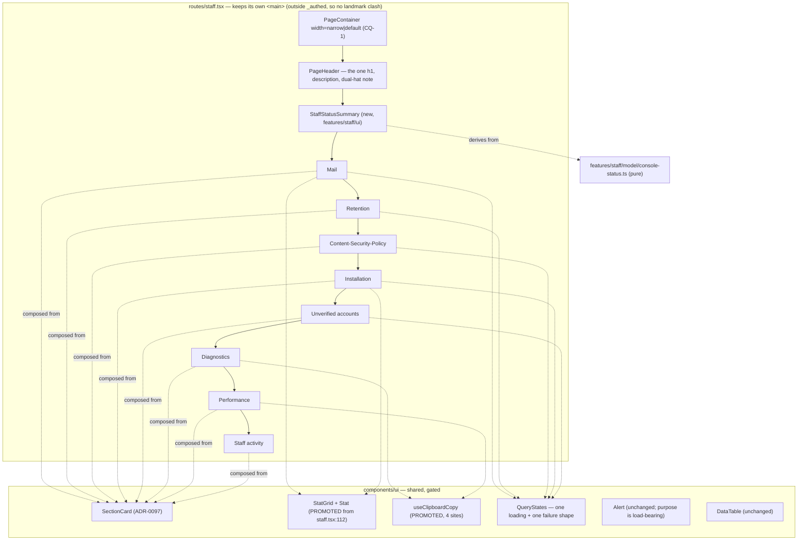
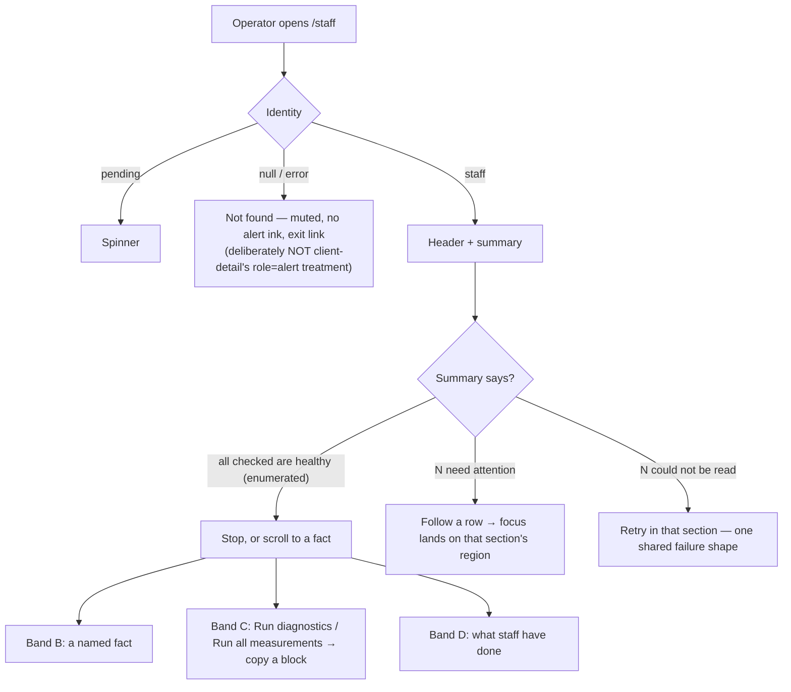

# Feature Spec: The staff console design review

- **Status:** Approved — 2026-09-14, all three critical questions answered (CQ-1 overrides this document's own recommendation; see §6).
- **Author(s):** feature-analyst (Product Owner / Solution Architect / Technical Lead hats)
- **Date:** 2026-09-14
- **Tracking issue / epic:** _(none yet)_
- **Roadmap link:** new entry required under **Operations & staff** in `docs/ROADMAP.md`
  (`check:adr-coverage` refuses an ADR that neither appears there nor carries a written exemption —
  `scripts/check-adr-coverage.mjs:51-66`)
- **Related ADR(s):** ADR-0086 (the console and four of its panels), ADR-0087 M3 (Retention),
  ADR-0097 (the page archetypes, the surface scopes, the ratchets), ADR-0098 (the archetypes as a
  **gate**), ADR-0101 (a shot list that stops at the route), ADR-0102 (the light theme),
  ADR-0117 (`purpose` has no default), ADR-0128/ADR-0130 (the performance probe),
  ADR-0132 (`Alert purpose`), ADR-0140 (Diagnostics). A **new ADR is required** — see §4.9.

---

## 0. What I verified before writing this, and what it changed

Per `docs/PROCESS.md` "Decision-bearing claims carry their evidence" and CLAUDE.md §19.11 — **the
brief is not evidence**. Every grounding claim I was handed was re-checked. Five held. **Three did
not**, and two of the three change the work.

| #   | Claim as briefed                                                                        | Verdict                                        | Evidence                                                                                                                                                                                                                                                                                                                                                                                                                                                                                                                                                                                                                                                                                                                                                             |
| --- | --------------------------------------------------------------------------------------- | ---------------------------------------------- | -------------------------------------------------------------------------------------------------------------------------------------------------------------------------------------------------------------------------------------------------------------------------------------------------------------------------------------------------------------------------------------------------------------------------------------------------------------------------------------------------------------------------------------------------------------------------------------------------------------------------------------------------------------------------------------------------------------------------------------------------------------------- |
| 1   | `/staff` renders eight panels in one column                                             | **holds**                                      | `apps/web/src/routes/staff.tsx:82-108` — `<main className="mx-auto max-w-4xl space-y-6 p-6">` wrapping `MailHealthPanel`, `PerformanceProbePanel`, `DiagnosticsPanel`, `RetentionPanel`, `SecurityPanel`, `InstallationPanel`, `AccountsPanel`, `ActivityPanel`. File is 623 lines.                                                                                                                                                                                                                                                                                                                                                                                                                                                                                  |
| 2   | The page uses none of the ADR-0097 archetypes                                           | **holds**                                      | `rg "from '@/components/ui/page'" apps/web/src` returns seven hits, all in `features/overview/` and `features/share/`. `staff.tsx:84` is a raw `<h1 className="text-2xl font-semibold">`; `features/staff/ui/panel.tsx` is 46 lines wrapping `Card` with its own `<h2 className="text-lg font-medium">`.                                                                                                                                                                                                                                                                                                                                                                                                                                                             |
| 3   | ADR-0098 made "assembled from the archetypes" a structural gate                         | **holds**                                      | `apps/web/src/features/overview/archetypes.structural.test.ts` — two assertions, the second (`HAND_ROLLED`) matching `mx-auto…max-w-`, `<h1`, `<h2`, over the whole feature directory with comments stripped.                                                                                                                                                                                                                                                                                                                                                                                                                                                                                                                                                        |
| 4   | #319: "`shoot.mjs` has 25 shots and **not one of them is `/staff`**"                    | **STALE — and the correction is load-bearing** | `apps/web/scripts/shoot.mjs:570` is `{ name: 'staff', staff: true, go: (p) => p.goto(\`${BASE}/staff\`) }`, with a dedicated `shot.staff`branch at`:845-867`that skips loudly unless`SHOOT_STAFF=1`. The shot list is **42 entries**, not 25. ~~(the file's own docblock at `:18`still says 25 too)~~ — **that half is itself wrong**, corrected 2026-09-14 at M0: no docblock in`shoot.mjs`states a shot count at all. The only live "25 shots" text is`CLAUDE.md:2775`, a correctly past-tense record of ADR-0102 widening the harness 12 → 25. A claim about a stale claim, asserted without opening the file — ADR-0076 Class 3, inside the document written to catch it. See §0.1 — the gap is real but narrower and differently shaped than the row describes. |
| 5   | #320(a): the clipboard idiom is written a **third** time across three files             | **STALE — it is a fourth**                     | `rg "clipboard.writeText" apps/web/src` returns **four** production sites: `perf-probe/ui/performance-probe-panel.tsx:469`, `perf-probe/ui/probe-sittings.tsx:510`, `staff/ui/diagnostics-panel.tsx:66`, **and `features/share/components/ShareLinksDialog.tsx:63`**. The row's supporting claim — "the two older sites are silent when the clipboard refuses" — is also wrong of the fourth, which guards `navigator.clipboard` being absent (`:58-62`), announces a failure (`:68`) **and** reverts its label after 2 s (`:49-53`). See §3 Dependencies.                                                                                                                                                                                                           |
| 6   | ADR-0132 classified every staff `Alert` as `event` / `condition` and must not be undone | **holds**                                      | `components/ui/alert.tsx:91-100` — `purpose` is required with no default; `staff.tsx` passes it at `:93, :165, :318, :325, :350, :441`; `diagnostics-panel.tsx:140` passes `purpose="event"`.                                                                                                                                                                                                                                                                                                                                                                                                                                                                                                                                                                        |
| 7   | The console was built one epic at a time, each panel reviewed alone                     | **holds, and §1 makes it concrete**            | Panel order in `staff.tsx:100-107` is neither arrival order nor severity order — see §1 "Diagnosis".                                                                                                                                                                                                                                                                                                                                                                                                                                                                                                                                                                                                                                                                 |
| 8   | The WCAG 2.5.8 target-size sweep (ADR-0118) is a gate that would apply                  | **DOES NOT APPLY as briefed**                  | The sweep lives in `apps/web/e2e-workspace-fit/command-surface.spec.ts` and is scoped to the plan workspace. `/staff`'s only a11y gate is the axe scan at `e2e-staff/staff.spec.ts:603-606`, and that **cannot see 2.5.8**: read directly from the installed `axe-core@4.13.0/axe.js:33491-33496`, `target-size` carries `enabled: false` alongside `tags: ['cat.sensory-and-visual-cues','wcag22aa','wcag258']`, so requesting the `wcag22aa` tag does not turn it on. (4.12.1 is also installed; ADR-0090 M5 recorded the same flag there.)                                                                                                                                                                                                                        |

### 0.1 What #319 is actually about, now that the shot exists

The shot is declared and **cannot be satisfied**, which is a different defect from an omission and a
worse one: a reader auditing the list finds `/staff` on it.

Three things must all be true for `shoot.mjs:845-867` to write a picture, and the harness supplies
none of them:

1. **`SHOOT_STAFF=1`.** Supplied by the operator; fine.
2. **The signed-in address must be in the API's `STAFF_EMAILS`.** `onboard()` mints
   `shoot-${Date.now()}-${width}@example.com` (`shoot.mjs:61-66`) — a value that does not exist until
   the run starts, against a server variable that must be set **before boot**. There is no override.
   So this precondition is **unsatisfiable as written**, not merely unset.
3. **The address must be `emailVerified`.** The harness never verifies anything. The guard demands it
   independently of `AUTH_REQUIRE_EMAIL_VERIFICATION` (`e2e-staff/staff.spec.ts:24-26`).

The failure mode is honest at least — `:865-866` throws `staff console rendered no heading` rather
than filing a picture of the 404. But the effect is #319's: **nobody has ever seen this screen as a
picture.** M0 closes it and corrects the row rather than stepping over it (the ADR-0071 rule).

A secondary finding, recorded rather than fixed here: `playwright.staff.config.ts:19` says _"The spec
verifies addresses through the API rather than through mail, so no SMTP sink is needed"_, and the
spec verifies through mail (`staff.spec.ts:184-187`) against a sink the same config starts
(`:62-66`). One docblock, two contradictory sentences, nine lines apart. It is a comment, not
behaviour, so it goes in M0-T1 alongside #319's own correction.

---

## 1. Business understanding

### Problem

The product owner, 2026-09-14, verbatim:

> _"Let's review the whole of the staff panel. It's very vertical in layout and just built to be
> useful but now it needs to look like a designed page. Every single element needs reviewing and
> aligning to a ui standard that looks professional"_

Two complaints, and they have one cause.

**"Very vertical."** `/staff` is eight `Card`s stacked in a single `max-w-4xl` column
(`staff.tsx:82`), every one drawn identically: same card, same `<h2 className="text-lg font-medium">`
(`panel.tsx:36`), same `space-y-6` gap. Nothing on the page says which of them matters. **The order
is the finding.** It is not arrival order and it is not severity order:

| Position | Panel                   | Shipped by          | Reports a standing condition?                                                                                 |
| -------- | ----------------------- | ------------------- | ------------------------------------------------------------------------------------------------------------- |
| 1        | Mail                    | ADR-0086 M1         | **yes** — transport, alerting, heartbeat, failure counts                                                      |
| 2        | Performance             | ADR-0128 / ADR-0130 | **no** — inert until a button is pressed                                                                      |
| 3        | Diagnostics             | ADR-0140            | **no** — inert until a button is pressed (`diagnostics-panel.tsx:29`, the hook is `enabled: false` by design) |
| 4        | Retention               | ADR-0087 M3         | **yes** — disabled, overdue, consecutive failures                                                             |
| 5        | Content-Security-Policy | ADR-0086 M4         | **yes**                                                                                                       |
| 6        | Installation            | ADR-0086            | partly — two `warning` badges                                                                                 |
| 7        | Unverified accounts     | ADR-0086            | partly                                                                                                        |
| 8        | Staff activity          | ADR-0086 M5         | no — a record                                                                                                 |

**The two panels that do nothing at all until an operator presses a button occupy positions 2 and 3,
above every panel that answers the question the screen exists for.** They are also the two tallest:
`performance-probe-panel.tsx` is 1,190+ lines rendering two buttons, a `<details>` disclosure with
three selects, a per-step result block and the whole sittings history. Each was inserted at the top
by the epic that built it, reviewed alone, and was locally reasonable every time.

**"Just built to be useful."** The same three states get two different treatments depending on
whether a panel's body happens to be a table:

- **Four panels hand-roll their loading and error states** — `Spinner` + a bare
  `<p role="alert" className="text-destructive-text text-sm">` + a `Try again` `Button`, written out
  four times at `staff.tsx:151-161`, `:304-313`, `:470-479`, `:534-543`.
- **Two delegate both to `DataTable`** via its `loadingLabel` / `errorLabel` props
  (`:437-439`, `:617-618`).

Neither is wrong; nothing could have noticed they disagree, because no reviewer ever had both on one
screen at one time. That is the mechanism the product owner is describing, and it repeats:

- `Stat` is a local helper whose own docblock says _"the codebase has no promoted primitive for this
  shape (TECH_DEBT)"_ (`staff.tsx:112`), rendered into two `<dl>` grids with **different column
  counts** decided independently — `grid-cols-2 sm:grid-cols-3` (`:172`) and
  `grid-cols-2 sm:grid-cols-4` (`:483`).
- Severity is spoken in four vocabularies that do not compose: `Alert tone`
  (`error | success | info` — there is **no `warning` tone**, `alert.tsx:66-74`), `Badge variant`
  (`neutral | warning`), the hand-rolled destructive paragraph above, and plain muted body text.
  "Retention sweeping is disabled" is `tone="info"`; "the last N sweeps failed" is `tone="error"`;
  "Failure alerting: off" is a `warning` **badge**. A reader cannot rank them.
- **Five `<strong className="font-medium">` lead-ins sit inside `Alert`s** (`:94, :166, :319, :326,
:442`). ADR-0097's own weight-ratchet note records three such lead-ins being **removed** from this
  very page's Performance panel as "a fourth channel saying what four things already said", because
  `Alert` already carries a tone colour, a coloured accent bar, a leading icon and a role
  (`token-architecture.test.ts:573-582`). The rule was applied to one panel and not its neighbours.

**Why now.** The console is no longer a scratch surface. It is the only route to the mail transport's
health, the retention clock, the CSP sink, the performance probe #75 has waited a year for, and the
ADR-0140 diagnostics whose first real reading was taken on the deployed host two days ago. It is
where an operator decides whether something is broken **right now** — and it has never had a design
pass of any kind, nor, until this epic, a picture.

### Users

One role, and it is not an organisation role. `/staff` is reached by a **`StaffPrincipal`**, which by
ADR-0086 D1 is structurally not assignable to `Principal`: no memberships, no `can()`, no
`organizationId`. RBAC and organisation scope (ADR-0012) **do not apply to this surface at all** —
the gate is an address in the server's `STAFF_EMAILS` plus `emailVerified`, evaluated at runtime.

- **The operator on duty** (today: the product owner). Arrives asking one of two questions —
  _"is anything wrong?"_ or _"I need a specific fact"_ — and cannot currently answer the first
  without reading eight cards top to bottom.
- **The operator investigating.** Presses Run diagnostics or Run all measurements, waits, copies a
  block into a record. Needs the tools findable, not prominent.
- **Any signed-in member who guesses the URL.** Sees `Not found`. Their experience is in scope only
  in that the redesign must not change it (§2 US-6).

### Primary use cases

1. Land on `/staff` and know within one screenful whether anything needs attention.
2. Go to a named fact — the mail host, the retention period for `mail_events`, how many accounts are
   unverified — without scanning.
3. Run a tool (diagnostics, the performance probe) and copy its output.
4. Read what staff have done, including refusals.
5. Reach all of the above from a keyboard, and from a screen reader, at the same bar as every other
   screen in the product.

### User journeys

**Happy path (today, measured in M0).** `/staff` → identity probe resolves → eight panels settle
independently → the operator scrolls. **Happy path (after).** `/staff` → identity resolves → a
summary states what is not healthy, or states that everything checked is healthy and names what was
checked → the operator either stops, or follows one link to the section that owns the condition.

The diagrams are in §4.

### Expected outcomes

- The first screenful answers "is anything wrong?" — including when the answer is "I cannot tell yet"
  or "I could not read three of the five checks".
- Every element on the page is drawn by a shared decision rather than a local one: the frame, the
  heading rank, the section shell, the loading shape, the error shape, the metric, the copy control.
- The page is **shorter**, not longer, in the same state.
- `/staff` joins the screenshot set, so the next change to it can be reviewed by looking.

### Success criteria

Measured, at 1646 × 1000 (the product owner's Surface Pro — ADR-0091's retrospective established it
as the width two whole epics never measured at; it leads `shoot.mjs:31`'s `WIDTHS`), against the M0
baseline and the **unhealthy recipe** of §4.7:

| #    | Criterion                                                                                                                     | Instrument                                        |
| ---- | ----------------------------------------------------------------------------------------------------------------------------- | ------------------------------------------------- |
| SC-1 | Every non-healthy condition the console can report is named or counted **within the first viewport**, no scrolling            | M5 re-shoot + a browser measurement               |
| SC-2 | Full document height in the same state is **≤** the M0 baseline                                                               | the same harness                                  |
| SC-3 | Screen-level weight count (`weightSites()` outside `components/ui/`) **falls** from 173                                       | `pnpm --filter @repo/web test token-architecture` |
| SC-4 | Arbitrary sizing count does not rise above 17                                                                                 | same                                              |
| SC-5 | `e2e-staff`'s axe scan stays at zero violations, with the scan re-run in a **non-healthy** state                              | `scripts/e2e-local.sh web:staff`                  |
| SC-6 | A new `archetypes.structural.test.ts` over the staff surface passes, **verified red first** against today's hand-rolled frame | vitest                                            |

### Open questions

Three are **CRITICAL** and are in §6. Everything else has a stated default and is not blocking:

- **Container width.** Default: keep `max-w-4xl` by moving to `PageContainer width="narrow"` (which
  _is_ `max-w-4xl`, `page-container.tsx:19`), so M1 is provably a no-op on measure. Widening is a
  layout decision and belongs to CQ-1, judged on M0's picture.
- **`Panel`'s `status` live region.** Default: **keep `Panel`, and make it compose `SectionCard`**
  rather than widening `SectionCard`'s public contract. Rationale in §4.4.
- **Band headings.** Default: **no**. Grouping is expressed by order and by the summary, not by a
  heading rank change. Rationale in §4.5.
- **The `Not found` branch.** Default: adopt the archetypes for the frame, and **deliberately keep
  the muted, non-alert treatment** rather than copying `client-detail.tsx:42-45`'s
  `role="alert"` + destructive ink. That screen is reporting a failure; this one is giving the honest
  uniform answer ADR-0086 requires, and dressing it as an error would imply a surface exists.
- **New ADR number.** `ADR-0143` is the next free one as of today (`docs/adr/` tops out at 0142).
  Re-derive at filing — ADR-0071 and ADR-0079 both record a number being taken between the plan and
  the milestone.

---

## 2. Functional requirements

### User stories & acceptance criteria

> **US-1** — As **the operator on duty**, I want the console to tell me at the top whether anything
> needs attention, so that I do not have to read eight cards to find out.
>
> **Acceptance criteria**
>
> - **Given** every check is healthy, **when** the page settles, **then** a summary states that, and
>   **names which checks it covered** — a bare "all good" that silently omits a check is the
>   green-result-about-nothing this repository keeps recording.
> - **Given** one or more checks are not healthy, **when** the page settles, **then** each such
>   condition is stated in the summary, in severity order, with a link to the section that owns it.
> - **Given** a query has not settled, **then** the summary says so for that check specifically and
>   **never counts it as healthy**.
> - **Given** a query failed, **then** the summary says the check **could not be read** — distinct
>   from both "healthy" and "not healthy" (the ADR-0087 M3 rule: disabled shows no last-run time,
>   because a timestamp beside "disabled" reads as health).
> - **Given** the summary renders, **then** it is **not** a live region (`Alert purpose="condition"`,
>   or no `Alert` at all). It states facts that were already true when the reader arrived, and it is
>   inserted together with its content once queries settle — which ADR-0132 establishes is the
>   unreliable case for a live region, not the silent one.

> **US-2** — As **the operator on duty**, I want the sections ordered by what they are for, so that
> the two tools that do nothing until pressed are not above the four panels that report conditions.
>
> - **Given** the redesigned page, **when** it renders, **then** Performance and Diagnostics appear
>   **below** Mail, Retention and Content-Security-Policy.
> - **Given** the redesigned page, **then** Staff activity remains last (it is a record, not a
>   signal).
> - **Given** a screen reader navigating by region, **then** every section is still a named `region`
>   and the order it walks matches the visual order.

> **US-3** — As **any reader of the console**, I want a query's loading and failure to look the same
> everywhere on the page, so that I can tell a broken panel from a broken installation.
>
> - **Given** any of the six query-backed sections, **when** its query is pending, **then** the
>   loading treatment is the one shape used by all six.
> - **Given** any of them fails, **then** the failure treatment is the one shape used by all six, it
>   carries a retry, and it renders **no stale value beside it** (the ADR-0140 M4 finding:
>   `query.data` survives a failed refetch, so a failure message can appear directly above the
>   previous run's numbers).
> - **Given** the retry is pressed, **then** focus is not dropped to `<body>` (this register records
>   that defect four times; `aria-disabled`, never the native attribute — ADR-0083).

> **US-4** — As **a designer or reviewer**, I want the console assembled from the page archetypes, so
> that the next change to it inherits the system rather than a local copy of it.
>
> - **Given** the staff surface (`routes/staff.tsx`, `features/staff/`, `features/perf-probe/ui/`),
>   **then** a structural gate asserts it imports `@/components/ui/page` and hand-rolls no page
>   frame, no `<h1>` and no `<h2>`.
> - **Given** that gate, **then** it was **verified red** against the pre-change tree before it was
>   committed (ADR-0110 D5 — a gate is finished when the defect it names has made it fail).

> **US-5** — As **the operator**, I want one metric treatment, so that the eight facts on this page
> are not laid out two different ways.
>
> - **Given** the Mail and Installation fact groups, **then** both are rendered by one promoted
>   component with one responsive column rule.

> **US-6** — As **a member who guessed the URL**, I want `/staff` to be indistinguishable from an
> address that does not exist, so that nothing confirms the surface is there.
>
> - **Given** a non-staff caller, **then** the page shows `Not found` and **no** word from the set
>   {denied, permission, not authorised, staff} — `staff.spec.ts:119-120`, unchanged.
> - **Given** the redesign, **then** the account menu still offers a non-staff reader nothing
>   (`staff.spec.ts:126-128`, unchanged).

> **US-7** — As **a reviewer of this or any later change to the console**, I want a picture of it, so
> that the next defect on this screen is found by looking rather than by a user.
>
> - **Given** `SHOOT_STAFF=1` and the documented API recipe, **when** `node scripts/shoot.mjs` runs,
>   **then** `.screenshots/<width>/staff.png` and `.screenshots/<width>/staff-unhealthy.png` are
>   written at all three widths.
> - **Given** the harness cannot reach the console, **then** it throws with a message naming which of
>   the three preconditions failed — not the current generic `is the caller staff?`.

### Workflows

**W-1 Arrive.** Identity probe → pending (spinner) / `null` (uniform Not found) / staff → page
renders header, summary, then sections in the §4.5 order. Sections settle independently; each
announces its settled state once through its own polite region (`panel.tsx:39-41`, preserved).

**W-2 Follow a condition.** Summary row → activate → focus moves to the owning section's region
(named `region`, focusable — `data-table.tsx:224-228` for table-bodied sections; the `SectionCard`
`<section aria-labelledby>` otherwise).

**W-3 Run a tool.** Unchanged from ADR-0140 / ADR-0130. Nothing about the confirmation, the overlay,
the `inert` guard (`performance-probe-panel.tsx:534`) or the recording path is touched.

### Edge cases

| Case                                          | Expected                                                                                         |
| --------------------------------------------- | ------------------------------------------------------------------------------------------------ |
| All five checks pending                       | Summary says "checking…", names nothing as healthy, and is not a live region                     |
| All five checks fail                          | Summary says five checks could not be read; **no** healthy claim anywhere                        |
| Mixed: two failed, one unhealthy, two healthy | All three states shown distinctly; the unhealthy one is not buried under the unreadable ones     |
| Everything healthy                            | Summary states it **and enumerates what was checked**                                            |
| Dual-hatted account                           | The ADR-0086 D4 banner stays, and stays `purpose="condition"` (`staff.tsx:93`)                   |
| Unverified-accounts list has a next cursor    | `Show older` keeps working (`staff.tsx:565-575`); it is a real fix, not decoration (ADR-0086 M6) |
| A sweep is running                            | The `inert` overlay still covers the page and the summary is inside it                           |
| Very long mail host / recipient               | `break-all` behaviour preserved (`staff.tsx:136`, `:519`)                                        |
| 768 px and below                              | Single column throughout; the summary does not become a horizontal scroller                      |

### Permissions

**No RBAC change, and none is possible here.** The surface is gated by `StaffPrincipal`
(ADR-0086 D1); there is no organisation, no role and no resource scope. Every route the page reads is
already audited, **including reads** (ADR-0086 D5). This epic adds **no route**, so it adds no audit
row and no census entry. The one permission-shaped invariant to preserve is US-6's uniform 404.

### Validation rules

None. This epic accepts no user input beyond the controls that already exist.

### Error scenarios

| Scenario                                                   | Detection                  | User-facing result                                                                                                   | Status       |
| ---------------------------------------------------------- | -------------------------- | -------------------------------------------------------------------------------------------------------------------- | ------------ |
| Identity probe fails or returns `null`                     | `useStaffIdentity`         | Uniform `Not found`, never "denied"                                                                                  | 404 (server) |
| `GET /staff/health` fails                                  | `useStaffHealth().isError` | One shared failure treatment in **both** Mail and Retention, plus "could not be read" in the summary for both checks | 5xx          |
| `GET /staff/csp-reports` fails                             | query                      | Same shared treatment                                                                                                | 5xx          |
| `GET /staff/installation` / `/accounts` / `/activity` fail | query                      | Same shared treatment                                                                                                | 5xx          |
| Clipboard refuses                                          | promise rejection          | A stated failure, never silence (WCAG 4.1.3 — the ADR-0140 M4 fix, now applied to all four sites)                    | n/a          |

---

## 3. Technical analysis

| Area           | Impact                    | Notes                                                                                                                                                                                                                                                                                                                          |
| -------------- | ------------------------- | ------------------------------------------------------------------------------------------------------------------------------------------------------------------------------------------------------------------------------------------------------------------------------------------------------------------------------ |
| Frontend       | **high**                  | `routes/staff.tsx` (623 lines), `features/staff/ui/`, `features/perf-probe/ui/`, and **two shared additions** in `components/ui/`                                                                                                                                                                                              |
| Backend        | **none**                  | No module, service or endpoint is touched. The page reads five existing routes and adds none.                                                                                                                                                                                                                                  |
| Database       | **none**                  | No model, column, index, constraint or migration. **`database-architect` is deliberately not engaged because there is nothing to design** — recorded so "the agent was not run" cannot later read as an oversight (the ADR-0121 / ADR-0140 wording).                                                                           |
| API            | **none**                  | No DTO, no OpenAPI change, no status code.                                                                                                                                                                                                                                                                                     |
| Security       | **low, and one decision** | Nothing changes about the guard, the uniform 404, or auditing. The one security-shaped question is CQ-2: whether the screenshot harness may reach the database.                                                                                                                                                                |
| Performance    | **low**                   | Client-only. The summary derives from queries the page already makes — **no new request**, which is the ADR-0087 M3 rule (a second route writes a second `staff.panel_read` row on every page load).                                                                                                                           |
| Infrastructure | **low**                   | `shoot.mjs` gains a documented env recipe. **No CI step and no Playwright config is added** — `test:e2e:staff` already exists (`apps/web/package.json:18`) and `shoot.mjs` is run by hand (it appears in no `package.json` script, no `scripts/`, and no workflow). So `check:ci-roster` and `check:e2e-roster` are untouched. |
| Observability  | **none**                  |                                                                                                                                                                                                                                                                                                                                |
| Testing        | **high**                  | A new structural gate; unit coverage for the summary derivation and the shared components; the existing `e2e-staff` journey extended (not replaced); the axe scan re-run in a non-healthy state.                                                                                                                               |

### Dependencies

**Prerequisites**

- **M0 must land first and is not optional.** You cannot review "every single element" of a surface
  nobody has seen a picture of. ADR-0099 is the precedent stated plainly: four consecutive epics
  tuned the plan workspace by arithmetic, and what settled the design was a screenshot — taken only
  after somebody noticed the shot list stopped at the route.

**Affected features**

- `features/overview/` — **only if** CQ-4's default is reversed and `SectionCard` is widened. Under
  the stated default (compose, don't widen) the overview is untouched.
- `features/share/` — `ShareLinksDialog` is the fourth clipboard site (§0 #5). Converting it is in
  scope **because leaving it is the failure this register records most often**: one correct pattern
  applied to a control and not its neighbour. This is the only task whose blast radius leaves
  `/staff`, and it is flagged as such in the plan.

**Register rows this epic closes or corrects**

| Row       | Disposition                                                                                                                 |
| --------- | --------------------------------------------------------------------------------------------------------------------------- |
| `#319`    | **Corrected in M0-T1, closed in M0.** Its headline claim is stale; the real gap is §0.1.                                    |
| `#320(a)` | **Corrected in M0-T1, closed in M4.** Four sites, not three; the "two older sites are silent" claim is wrong of the fourth. |

**What must NOT be dragged in**

- A product-wide archetype migration. `routes/client-detail.tsx:34` hand-rolls
  `<h1 className="mt-2 text-2xl font-semibold tracking-tight">`, and it is not alone; that is
  ADR-0097 Landing F's unfinished business and it is **out of scope**. This epic's gate covers the
  staff surface only.
- The ADR-0117 tooltip work, the ADR-0118 control-height axis, or anything about the plan workspace.

---

## 4. Solution design

### 4.1 The governing rule, quoted rather than invented

`docs/DESIGN_SYSTEM.md:546-550`:

> **The authoring rule: reach for the archetype, or raise the requirement — never invent a one-off.**
> A hand-rolled frame that happens to match today's archetype looks identical on screen and drifts
> the first time either changes, which is a defect nobody can see. A screen that needs something
> these do not offer wants a **seventh archetype**, not a bespoke layout in a feature folder.

Everything below follows from that sentence. Where the console needs something the six archetypes do
not offer — a metric, and a settled-state announcement — the answer is a promoted component with a
gate, not a local helper.

### 4.2 Architecture overview



**`PageContainer` renders a `<div>` and never a landmark** (`page-container.tsx:25-35`). That is
correct here for a different reason than elsewhere: `/staff` is a sibling of `_authed`, not a child,
so it supplies its own `<main>` (`staff.tsx:82`) and the container sits **inside** it. Stating this
because the obvious mistake — deleting the route's `<main>` on the grounds that the shell provides
one — would leave this page with no main landmark at all.

### 4.3 The summary: derived, three-valued, and not a live region

```mermaid
sequenceDiagram
  participant P as /staff
  participant Q as TanStack Query (existing, deduped)
  participant M as console-status.ts (pure)
  participant S as StaffStatusSummary

  P->>Q: useStaffHealth / CspReports / Installation / Accounts
  Note over Q: exactly the calls the page already makes — no new route,<br/>so no second staff.panel_read audit row (ADR-0087 M3 §4.6)
  Q-->>M: { data | isPending | isError } × 4
  M-->>S: Check[] — each { id, label, state, sentence, sectionId }
  Note over M: state ∈ HEALTHY | ATTENTION | UNREADABLE | PENDING.<br/>No coalescing. `?? HEALTHY` is the exact lie this exists to prevent.
  S-->>P: severity-ordered rows; each links to its section
```

Three design rules, each with a named precedent:

1. **Four states, never three.** `PENDING` and `UNREADABLE` are distinct from `HEALTHY`, and neither
   may be defaulted into it. This is ADR-0125's `UNKNOWN` verdict rule (`a ?? 'MATCH'` is the lie the
   columns exist to prevent) and ADR-0087 M3's "disabled shows no last-run time".
2. **A healthy summary enumerates what it checked.** "Everything is fine" over a set that silently
   lost a member is the failure mode this repository has recorded in gates four times (ADR-0093,
   ADR-0108, ADR-0121, ADR-0131). The enumeration is the non-vacuity control, on screen.
3. **Not a live region.** ADR-0132's discriminator, quoted from `alert.tsx:50-51`: _would this
   sentence read the same to somebody who arrived five minutes later and did nothing?_ Yes — so it is
   a `condition`. The per-section polite regions `Panel` already owns (`panel.tsx:39-41`) continue to
   announce settling; the summary must not announce it a second time.

**The derivation is pure and lives in `features/staff/model/console-status.ts`**, beside the existing
`retention-copy.ts` and `diagnostics-report.ts`, so its states are unit-testable without mounting
anything.

### 4.4 The section shell: `Panel` composes `SectionCard` (stated default, CQ-4 if reversed)

`SectionCard` owns the heading rank, the named `<section>` region and the card composition.
`Panel` owns one thing `SectionCard` does not have: the polite `status` region that announces a
panel's settled state (`panel.tsx:20-30`) — an ADR-0086 decision that matters precisely because eight
sections settle independently on this page.

**Default: `Panel` keeps its name and its `status` prop, and its body becomes
`<SectionCard title={title}>` with the status paragraph inside.** That is the ADR-0062 extraction
argument — compose, do not reimplement — applied before the divergence rather than after it, and it
keeps the blast radius inside `features/staff/`.

**The alternative, costed:** promote `status` onto `SectionCard` as an optional prop. It is arguably
the better long-run call — the overview has the same independently-settling shape and does not
announce it — but it widens a shared archetype's public contract for one consumer, which the
authoring rule warns about in the other direction. If taken, it needs its own assertion in
`page-archetypes.test.tsx` and a re-run of the overview journey.

### 4.5 Order and grouping: four bands, expressed by sequence, not by headings

| Band                               | Sections                                          | Why                                                                |
| ---------------------------------- | ------------------------------------------------- | ------------------------------------------------------------------ |
| **A — is anything wrong?**         | Summary, Mail, Retention, Content-Security-Policy | The three that report standing conditions                          |
| **B — what is this installation?** | Installation, Unverified accounts                 | Facts, with two warning badges between them                        |
| **C — tools you press**            | Diagnostics, Performance                          | Inert until a button is pressed; Performance is by far the tallest |
| **D — the record**                 | Staff activity                                    | Accountability, read after the fact                                |

**No visible band headings, and that is a decision rather than an omission.** A band heading would
have to be an `<h2>`, which pushes every section heading to `<h3>` and means changing
`SectionCard`'s rank contract (`CardTitle` does support `level={1|2|3}` — `card.tsx:73-77` — so it is
possible, not free). The payoff a reader gets is a word; the cost is a shared contract change and a
heading-tree change on the one screen whose a11y gate is an axe scan. Order plus the summary
expresses the same grouping with neither.

**Diagnostics before Performance within band C** because Diagnostics answers a question in ~1 s and
Performance is a two-minute commitment (`performance-probe-panel.tsx:575` renders the estimate).

### 4.6 User flow



### 4.7 The unhealthy recipe — because an all-green console does not test hierarchy

A picture of a console where nothing is wrong cannot tell you whether a red state would be findable.
So M0 takes **two** shots, and the second is the one the design is judged on.

`shoot.mjs` boots no servers (`:566-570`), so the API's environment is the operator's to set. The
documented recipe, to be pinned in the harness's own docblock:

- `MAIL_SMTP_URL` **unset** → "No mail transport is configured" (`staff.tsx:164-170`)
- `MAIL_ALERT_URL` / `HEARTBEAT_URL` unset → two `warning` badges + two consequence sentences
- `RETENTION_SWEEP_ENABLED=false` → the disabled `Alert` + the schedule sentence withheld
- `AUTH_REQUIRE_EMAIL_VERIFICATION` unset, plus at least one unverified account seeded
- at least one `csp_reports` row (the API e2e suite writes them; otherwise POST one to the sink)

**Non-vacuity control:** the shot fails if fewer than two distinct non-healthy conditions are present
when it is taken. A hierarchy assertion over an empty set passes and proves nothing.

### 4.8 Database changes

**None.** No model, column, index, constraint or migration — confirmed against the whole design, not
assumed. `database-architect` is not engaged for the reason stated in §3.

### 4.9 API changes

**None.** No endpoint, DTO, status code or OpenAPI change.

### 4.10 Component changes

| Component                                    | Where                          | Change                                                                                                                                                       | Gated by                                                                                                             |
| -------------------------------------------- | ------------------------------ | ------------------------------------------------------------------------------------------------------------------------------------------------------------ | -------------------------------------------------------------------------------------------------------------------- |
| `PageContainer`, `PageHeader`, `SectionCard` | `components/ui/page/`          | **unchanged**; newly consumed by `/staff`                                                                                                                    | new staff `archetypes.structural.test.ts`                                                                            |
| `Panel`                                      | `features/staff/ui/panel.tsx`  | composes `SectionCard`; keeps `status`; loses its own `<h2>`                                                                                                 | the same gate's `<h2` pattern                                                                                        |
| `StatGrid` / `Stat`                          | **new**, `components/ui/page/` | promoted from `staff.tsx:112-120`, closing that helper's own docblock TODO; **one** responsive column rule                                                   | unit test + the staff gate                                                                                           |
| `QueryStates` (or equivalent)                | **new**, `components/ui/`      | one loading shape and one failure shape, replacing four hand-rolled copies and aligning with `DataTable`'s                                                   | unit test; a structural assertion that `features/staff` contains no bare `role="alert"`+`text-destructive-text` pair |
| `useClipboardCopy`                           | **new**, `hooks/`              | one idiom, four call sites, **including the failure branch all four should have had**                                                                        | unit test; a structural assertion on `clipboard.writeText` call sites                                                |
| `StaffStatusSummary`                         | **new**, `features/staff/ui/`  | the summary; pure derivation in `features/staff/model/console-status.ts`                                                                                     | unit tests over all four states + mixtures                                                                           |
| `Alert`                                      | `components/ui/alert.tsx`      | **unchanged**. The five `<strong>` lead-ins **inside** alerts are removed at the call sites (ADR-0097's own precedent, `token-architecture.test.ts:573-582`) | the weight ratchet, which should FALL                                                                                |
| `DataTable`, `Badge`, `Button`, `Spinner`    | `components/ui/`               | unchanged                                                                                                                                                    | existing                                                                                                             |

**No new colour token, no new surface scope.** `/staff` sits in the page scope; the contrast matrix
(`styles/token-contrast.test.ts`) already covers every pair the design uses, and the colour-literal
lint rule (`packages/config/eslint/react.js:60-78`) forbids reaching outside it. If the summary needs
a severity colour the vocabulary lacks — note that `Alert` has **no `warning` tone**
(`alert.tsx:66-74`) — that is a token decision requiring its own measurement and a matrix entry, and
it is explicitly **out of scope**: the summary expresses severity by **order and by words**, with the
existing `Badge variant="warning"` where a chip is wanted.

### 4.11 Implementation approach & alternatives

**Chosen: adopt the archetypes first, then re-order, then unify the details — each a separate
milestone, each independently releasable.**

The order matters. Adopting the archetypes (M1) is provably neutral if `PageContainer width="narrow"`
is `max-w-4xl`, which it is — so M1 can be judged purely on "does anything look different?" against
M0's pictures. Re-ordering (M3) then lands against a page whose frame is already the system's, so its
diff is about hierarchy alone. Doing both at once produces a diff nobody can review.

**Alternatives considered**

1. **A bespoke console layout — a grid of tiles, a status bar, a two-pane shell.** Rejected on
   ADR-0098's condition, quoted: a beautiful one-off on a flagship screen falsifies the design-system
   thesis on its first outing, and it does so **invisibly**, because a hand-rolled frame that happens
   to match today's archetype looks identical and drifts later.
2. **A two-column grid for the whole page.** Rejected as a default and kept alive as CQ-1, to be
   decided from M0's picture rather than from taste. The named risk is the brief's: a grid that puts
   a red state in the right-hand column below the fold is worse than the stack. If a grid is taken,
   it must be **band-local** — band B only, whose sections are short — and never applied to a band
   that can report a condition.
3. **A seventh page archetype, `ConsolePage`.** Rejected: the console's distinctiveness is its
   _content ordering and its summary_, both of which are staff-specific derivations. What it
   genuinely lacks from the system is a metric and a query-state shape, and those are components, not
   a page archetype. Promoting a whole page archetype for one consumer is the one-off wearing the
   system's clothes.
4. **Collapsing the tall panels behind disclosures.** Rejected: it hides Performance's own controls
   behind a second click, and `<details>` inside `<details>` (Performance already has one at
   `:579`) is a shape nobody should ship. Ordering solves the same problem without removing anything.
5. **Fixing the hierarchy with a sticky summary bar.** Deferred, not rejected: it is a real option if
   M5's measurement shows SC-1 failing on a long page, and it is cheaper to add later than to remove.

**A new ADR is required** (§4.9 of `docs/PROCESS.md`'s Change management): this epic adds two shared
components, adds a structural gate, changes a shared harness, and settles a rule — _a console's
hierarchy is expressed by order and a derived summary, never by a bespoke layout_ — that the next
operations surface will inherit. Draft outline in the plan's M5.

---

## 5. Links

- Implementation plan: [./implementation-plan.md](./implementation-plan.md)
- Docs this change updates: `docs/DESIGN_SYSTEM.md` (the archetype table gains `StatGrid`;
  the authoring rule gains the console clause), `docs/UX_STANDARDS.md` (severity ordering on an
  operations surface), `docs/TECH_DEBT.md` (#319 corrected then closed; #320(a) corrected then
  closed), `docs/ROADMAP.md` (the new ADR's entry), `CLAUDE.md` §16 (the new ADR's register entry),
  `docs/adr/README.md` (the index row).

---

## 6. The product owner's answers (2026-09-14) — APPROVED, with one override

All three critical questions were answered and the epic is approved to build. **CQ-1 was decided
against this document's recommendation**, and it is recorded as an override rather than rewritten,
because a spec that silently agrees with whatever was chosen stops being evidence of anything.

### CQ-1 — LAYOUT: **two columns throughout.** Overrides §4's default and alternative 2.

This document rejected a whole-page grid as a default and kept it alive as a question, with a named
risk: _a grid that puts a red state in the right-hand column below the fold is worse than the stack_,
because on a screen read for alarm, side-by-side placement makes scan order ambiguous. That risk was
put to the product owner in those words and they chose two columns.

**So it is built, and the risk is settled by measurement rather than by either party's judgement.**
FC-1 already tests exactly this — _every non-healthy condition is named or counted within the first
viewport_, at 1646 × 1000, on the unhealthy recipe, with the non-vacuity control checked first. The
override therefore costs nothing in rigour: if two columns bury a condition, FC-1 fails and says so
with a picture.

Two consequences are written down now so they cannot be claimed later as wins:

- **FC-2 becomes nearly trivial.** Two columns roughly halve the page, so "document height ≤ the M0
  baseline" will pass by construction and proves almost nothing. **FC-1 and FC-3 carry the verdict.**
  Quoting a large height reduction as evidence the redesign worked would be measuring the thing that
  could not have gone the other way.
- **Alternative 2's band-local clause is superseded, not deleted.** Its reasoning — never grid a band
  that can report a condition — becomes a constraint on _how_ the two columns are filled rather than
  a reason not to have them: band A's placement must keep every condition above the fold, which is
  FC-1 restated as a design rule.

**If FC-1 fails, the measurement goes back to the product owner.** Reverting to one column
unilaterally would be substituting my judgement for theirs a second time.

### CQ-2 — HARNESS: **route A**, the SMTP sink, public routes only.

No database write. The harness follows a real emailed verification link exactly as
`e2e-staff/staff.spec.ts` already does, so it stays entirely above the public API and the console's
founding argument — that it exists to replace `psql` — is not undercut by the tool that photographs
it. Sub-option **(ii)**: `SmtpSink` moves to a `.mjs` module with a `.d.ts`, consumed by **both** the
journey and the harness. Copying it (iii) stays rejected on the ADR-0065 / ADR-0121 rule — two
implementations drift, and the drift is invisible because each looks right alone.

`security-reviewer` is therefore **not** required for this epic on CQ-2's account; it was conditional
on route B, which was not taken.

### CQ-3 — RE-ORDER: **full re-order into the four bands, and merge Mail + Retention.**

The merge goes beyond this document's default, which kept all eight panels distinct. Both panels are
rendered from a single `useStaffHealth` response, so one card removes a boundary the data does not
have.

**The accepted cost is stated rather than discovered later:** "Retention" stops being its own
scannable heading, and it is the panel an operator goes looking for by name when they want to know
whether the sweep is arming. So the merged card must keep retention **findable** — a labelled
subsection within the card, not a paragraph folded into mail's prose — and M5's gate pass checks that
an operator scanning for the word still finds it.

Nothing else merges and nothing is removed: the other six panels keep their identity.
