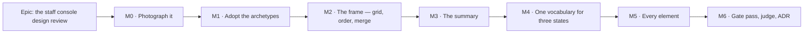

# Implementation Plan: The staff console design review

- **Feature spec:** [./feature-spec.md](./feature-spec.md) — **Approved 2026-09-14.**
- **Status:** Approved — **amended 2026-09-14 by the design review gate.** Three specialists
  (`ui-architect`, `accessibility-reviewer`, `ux-reviewer`) reviewed this plan before any code was
  written and all three returned **blocked**. Their findings are folded in `feature-spec.md` **§8**,
  which this plan now follows: the milestones are **re-sliced** (the frame moves ahead of the
  vocabulary and the sweep), two falsification conditions are **added** (FC-1a, FC-4), and seven
  task texts below are corrected in place because a builder would otherwise follow them literally.
  Every correction carries a `§8.x` pointer to the evidence that settled it.
- **Owner:** web

## Breakdown

### Epic

**The staff console design review** — turn `/staff` from eight equal stacked cards into a screen that
answers "is anything wrong right now?" in its first viewport, assembled entirely from the ADR-0097
page archetypes. Roadmap theme: **Operations & staff**.

---

## The falsification conditions — written before any prototype

Standing practice in this repository (ADR-0097 Landing C, ADR-0121 M0, ADR-0127 M0): the condition
that would make us withdraw the design is committed **before** the design exists, so a number cannot
be tuned to the answer. "Looks professional" is not testable; these are.

All three are measured at **1646 × 1000**, against the M0 baseline, with the API on the §4.7
**unhealthy recipe**.

| #        | Condition                                                                                            | Withdrawn if                                                                                               |
| -------- | ---------------------------------------------------------------------------------------------------- | ---------------------------------------------------------------------------------------------------------- |
| **FC-1** | Every non-healthy condition the console can report is named or counted **within the first viewport** | anything not healthy requires scrolling to discover                                                        |
| **FC-2** | Document height in the same state is **≤** the M0 baseline                                           | the redesign is taller — hierarchy bought with length has moved the problem, not solved it                 |
| **FC-3** | `weightSites()` outside `components/ui/` **falls** from 173, and arbitrary sizing stays ≤ 17         | either ratchet has to be **raised** to land the design — that is a one-off wearing the archetypes' clothes |

**Non-vacuity control, checked first and not optional.** The judged state must contain **at least two
distinct non-healthy conditions**, asserted before any verdict is printed. FC-1 over an empty set
passes and means nothing — the shape ADR-0093, ADR-0108, ADR-0121 and ADR-0131 each recorded a gate
failing on.

**The instrument throws rather than judging when it has nothing to judge** (ADR-0097 Landing C's
`PROCEED` from an `undefined`; ADR-0128's `INDETERMINATE`).

### Two conditions added by the design review (spec §8.1, §8.11)

The three above could **all pass** against a console whose tables are less legible than the one it
replaces, and none of them says anything a screen-reader user can use. Both gaps are closed here
rather than discovered at the gate pass.

| #         | Condition                                                                                                                                             | Withdrawn if                                                                                                                     |
| --------- | ----------------------------------------------------------------------------------------------------------------------------------------------------- | -------------------------------------------------------------------------------------------------------------------------------- |
| **FC-1a** | In **DOM order**, `StaffStatusSummary` precedes every section, and for each non-healthy condition it contains a **link whose target is that section** | the summary is not first, or a condition it reports has no link — the AT-equivalent of FC-1, in DOM terms, independent of pixels |
| **FC-4**  | **No table on the page is narrower after the change than the 798 px it measures today**, in the browser at 1646 on the same shot as FC-1              | any table is narrower than it is today — the redesign widened the page and narrowed the content                                  |

**FC-1a is verified red against a CSS-`order`-based implementation first**, and asserted **at the
two-column breakpoint** — the pre-column M1 assertion tells you nothing about the column layout
(ADR-0110 D5's own rule).

**FC-4 exists because nothing else in the epic could see the defect it guards.** FC-1 measures what is
above the fold; FC-2 improves by construction under any grid; FC-3 counts weight sites. See §8.1 for
the arithmetic, and **`m0-measurement.md` §9 for the measured version of it**, which is the one to
use: §8.1 costed the layout in _container_ widths and a card's own padding takes 50 px, so the figure
FC-4 guards is the **table** at **798 px**. Today 798; two equal columns **737 (−7.6 %)**;
span-by-demand at `wide` **1,438 (+80 %)**. One table in the code — CSP's, five columns
(`staff.tsx:398`) — does not render on an empty database and is the widest the console can produce:
judge against the four that render and remember the fifth.

**FC-3's baseline is measured, and both ratchets sit exactly on their ceilings — 173 and 17**
(`m0-measurement.md` §8). So FC-3 is well-defined; it would not have been if either read 171, and
nobody had checked.

**FC-2 is weaker than §6 said, for a second and independent reason.** Its baseline **drifts upward on
its own**: the healthy state measured 3,690 px and re-measures **4,245 px** on the same build with no
product change, because "Unverified accounts" and "Staff activity" are fed by tables that only grow —
and staff activity grows ~7 rows **every time the console is opened**, including by the harness. So
if FC-2 is judged at all, **the before and after are measured in the same sitting** (stash, measure,
restore) and the verdict says so (`m0-measurement.md` §10).

**FC-1 FAILS on today's console: 3 of 5 conditions above the fold, at every width**
(`m0-measurement.md` §7). The three that pass all belong to the **same panel**, which happens to sit
first; "Retention sweeping is disabled" is **562 px** below the fold and the unverified-account count
**1,445 px** below. That is the epic's justification, measured rather than asserted.

**FC-3's baseline is a measurement, not the ceiling.** `token-architecture.test.ts:602-607` asserts
`toBeLessThanOrEqual(SCREEN_WEIGHT_CEILING)`, and **173 is a ceiling**. M0 records the number the gate
actually reports; FC-3 is undefined until it does (§8.16).

**FC-4 and FC-1a are judged at M2**, the frame milestone — not at the end — along with **FC-1's
DIRECTION**. Reverting a frame is
one commit; reverting it after the vocabulary and the element sweep have been tuned to it is not
(§8.17).

---

## Milestone M0 — Photograph it

**Outcome:** `/staff` is in the screenshot set at three widths, in two states, and the epic's three
falsification conditions have a measured baseline. `docs/TECH_DEBT.md` #319 is corrected and closed.

**Entry point:** `Ships dark` — **no product code changes at all.** This milestone changes a
developer harness and two register rows. Nothing a staff member can press is different.

**Journey:** none added. `e2e-staff/staff.spec.ts` must still pass unchanged, which is the assertion
that the harness change did not disturb the product.

> **Why this is first and is not optional.** ADR-0099's precedent: four consecutive epics tuned the
> plan workspace by arithmetic, and what settled it was a screenshot — taken only after somebody
> noticed the shot list stopped at the route. ADR-0101's is sharper: the activity editor reached a
> user as a four-scrollbar panel because the list stopped at the route it sits on. You cannot review
> "every single element" of a surface nobody has seen a picture of.

#### Feature: the harness reaches the console

> **Description:** make `shoot.mjs`'s existing-but-unsatisfiable `staff` shot actually work, and add
> the unhealthy companion shot.
> **Complexity:** M
> **Dependencies:** none
> **Risks:** the reachability route has a security dimension → **CQ-2 blocks M0-T2 only**; M0-T1,
> T4 and T5 proceed regardless.
> **Testing requirements:** the harness is not CI-run, so its proof is that it writes six files and
> that `scripts/e2e-local.sh web:staff` still passes.

##### Task M0-T1 — Correct #319, #320(a), and one contradictory docblock (≈ one PR)

- **Description:** three documentation corrections, each established by reading rather than inherited.
- **Complexity:** S
- **Dependencies:** none
- **Risks:** none.
- **Testing:** `pnpm check:debt-status` (the rows keep a parsable status);
  `pnpm check:doc-links`.
- **Development steps:**
  1. `#319`: its headline — "25 shots and **not one of them is `/staff`**" — is stale. The shot exists
     (`shoot.mjs:570`) with its own branch (`:845-867`); the list is **42** entries. Rewrite the row
     to the real defect: the shot's preconditions are **unsatisfiable as written**, because
     `onboard()` mints `shoot-${Date.now()}-${width}@example.com` (`:61-66`) against a `STAFF_EMAILS`
     that must be set **before boot**, and nothing verifies the address. Keep the row's own prediction
     of what a shot would show — it is the design brief and it was right.
  2. `#320(a)`: it says the clipboard idiom is written a **third** time and names three files. There
     are **four** — `ShareLinksDialog.tsx:63` is the fourth — and its supporting claim that "the two
     older sites are silent when the clipboard refuses" is **wrong of that fourth**, which guards the
     API's absence (`:58-62`), announces a failure (`:68`) and reverts its label after 2 s
     (`:49-53`). Correct both, and note that the row's own argument ("extract now rather than at the
     fourth") has already been overtaken.
  3. ~~`shoot.mjs:18`'s docblock says 25 shots; make it derive or delete the number.~~
     **WITHDRAWN at M0 — the claim was false.** No docblock in `shoot.mjs` states a shot count;
     the only live "25 shots" text is `CLAUDE.md:2775`, correctly past-tense about ADR-0102
     widening the harness 12 → 25. Following this step would have "corrected" a file that was
     already right. Kept struck through rather than deleted, because a plan that quietly loses a
     task reads as a plan that never had it.
  4. `playwright.staff.config.ts:19` says _"The spec verifies addresses through the API rather than
     through mail, so no SMTP sink is needed"_, nine lines above the config starting one (`:62-66`)
     for a spec that uses it (`staff.spec.ts:184`). Correct the sentence, not the config.
  5. Record in `docs/DECISIONS.md` that #319's stale headline was found by re-verifying a briefed
     claim — the §19.11 rule paying for itself.

##### Task M0-T2 — Make the shot reachable — **BLOCKED ON CQ-2**

- **Description:** give the harness a staff-capable, verified session.
- **Complexity:** M
- **Dependencies:** CQ-2
- **Risks:** see the three routes below; each carries its own.
- **Testing:** the shot writes a file; the harness's own guard (`:865`) is tightened so a failure
  names _which_ precondition failed.
- **Development steps (route A — recommended default):**
  1. Add `SHOOT_STAFF_EMAIL` (default `shoot-staff@schedulepoint.test`), used by a new
     `onboardStaff()` **instead of** the stamped address, so the operator can put a **knowable** value
     in `STAFF_EMAILS` before booting the API.
  2. Make `SmtpSink` importable from a plain `.mjs` harness. It is TypeScript
     (`e2e-account/smtp-sink.ts`) and `shoot.mjs` runs under bare `node`, so the three sub-options
     are: **(i)** run shoot under `node --experimental-strip-types`; **(ii)** move the sink to a
     `.mjs` module with a `.d.ts`, consumed by **both** the journey and the harness; **(iii)** copy
     it. **(iii) is rejected** on the ADR-0065 / ADR-0121 rule — two implementations drift, and the
     drift is invisible because each looks right alone. **(ii) is recommended**: one implementation,
     no flag on a harness people run by hand.
  3. Sign up (or sign in), press resend on `/account`, `sink.waitFor(…, /verify-email/)`, follow the
     link, **sign in again** — verifying does not leave you signed in, which
     `staff.spec.ts:190-199` records as observed rather than assumed.
  4. Tighten `:860-866`: distinguish "no session", "not in `STAFF_EMAILS`" and "not verified" in the
     thrown message. The current `is the caller staff?` is one question standing in for three.
- **Route B (write `email_verified` directly):** smallest code — one `UPDATE` — and **not
  recommended**. It is the harness's first write below the public API and it writes **the exact
  column the staff guard exists to check**; ADR-0086's founding argument is that this console
  _replaces_ `psql`, so giving the instrument that photographs it a `psql`-shaped shortcut is a
  template the next harness copies. It also requires the harness to hold database credentials, which
  forecloses ever pointing `shoot.mjs` at a non-local instance.
- **Route C (screenshot from inside `e2e-staff/staff.spec.ts`):** near-zero cost — that suite already
  holds a verified staff session — but it splits the instrument: the artefacts land outside
  `.screenshots/<width>/`, which is where a reviewer looks, and the config pins one viewport (1920,
  `playwright.staff.config.ts:44`) so three widths need `setViewportSize` inside a gate. A reasonable
  fallback if A is measured to cost more than it looks.

##### Task M0-T3 — The unhealthy shot, and the recipe that produces it

- **Description:** add `staff-unhealthy` beside `staff`, and pin the API recipe in the harness's own
  docblock.
- **Complexity:** S
- **Dependencies:** M0-T2
- **Risks:** an all-green picture cannot test hierarchy → this task is the mitigation, not an extra.
- **Testing:** the non-vacuity control — the shot **fails** if fewer than two distinct non-healthy
  conditions are on screen when it is taken.
- **Development steps:**
  1. Document the recipe (spec §4.7): `MAIL_SMTP_URL` unset, `MAIL_ALERT_URL` / `HEARTBEAT_URL`
     unset, `RETENTION_SWEEP_ENABLED=false`, ≥ 1 unverified account, ≥ 1 `csp_reports` row.
  2. Add the shot. `shoot.mjs` boots no servers, so this is a second invocation against a
     differently-configured API — say so in the docblock rather than pretending one run does both.
  3. Add the non-vacuity assertion and verify it red by taking the shot against a healthy API.

##### Task M0-T4 — Measure the baseline

- **Description:** the numbers FC-1/2/3 are judged against.
- **Complexity:** S
- **Dependencies:** M0-T3
- **Risks:** a baseline taken in a different state from the final measurement is worthless → the
  recipe and the width are recorded with every figure.
- **Testing:** n/a (this task produces evidence).
- **Development steps:**
  1. At 1646/1920/1280, in both states, record: full document height; the y-offset of each section
     heading; which sections' headings fall below 1000 px; and how many non-healthy conditions exist
     and where each is first stated.
  2. Record today's gate readings: `weightSites()` outside `components/ui/` (currently **173**,
     `token-architecture.test.ts:600`) and the arbitrary-sizing count (ceiling **17**, `:706`).
     Record the staff surface's own share — measured today as **14 weight sites**:
     `routes/staff.tsx` 9, `perf-probe/ui/performance-probe-panel.tsx` 3 (a fourth match at `:582` is
     a comment and the scanner strips comments), `features/staff/ui/panel.tsx` 1,
     `features/staff/ui/diagnostics-panel.tsx` 1.
  3. Write the figures into **`m0-measurement.md`** — the house convention
     (`docs/specs/tsld-minimap/`, `workspace-layout/`). **The plan previously said `m0-baseline.md`
     and nothing ever wrote that file**, so M5-T1's mitigation pointed at something that does not
     exist (§8.16). Every figure names the width, the state and the command.
  4. ~~**This task is NOT complete until the unhealthy shot exists and the FC-3 numbers are
     recorded.**~~ **DONE 2026-09-14** — `staff-unhealthy` (1646 × 5553), three widths, both ratchet
     readings, and the FC-1 baseline verdict are in `m0-measurement.md` §6–§12. The original text
     follows, because the reason the task was reopened is the part a reader needs.**
     As of the review, `m0-measurement.md` holds **one width and one state**, there is no
     `staff-unhealthy` entry in `shoot.mjs`, and no weight or sizing figure appears anywhere — so
     **FC-1 has no instrument at all**, because it is judged on the §4.7 unhealthy recipe and the one
     unhealthy panel in the current picture is disclosed as a **harness artefact**, explicitly not
     the recipe. Finish this **before M2 is built**, not before it is judged (§8.16).

##### Task M0-T5 — Read the pictures and write the diagnosis

- **Description:** the design pass the console has never had.
- **Complexity:** M
- **Dependencies:** M0-T4
- **Risks:** the spec's §1 diagnosis was written from the **code**, not from a picture. If the
  pictures contradict it, the pictures win and the spec is amended before M1 — ADR-0090's recorded
  lesson (drafted without a shell, two predictions falsified on the first run).
- **Testing:** n/a.
- **Development steps:**
  1. Review both states at all three widths.
  2. Amend spec §1 and §4.5 where the pictures disagree. **Record what was wrong**, not just what
     changed.
  3. Answer CQ-1 and CQ-3 with evidence, and put them to the product owner with the pictures
     attached.

---

## Milestone M1 — Adopt the archetypes

**Outcome:** `/staff` is assembled from `PageContainer`, `PageHeader` and `SectionCard`, with a gate
saying so. Nothing moves and nothing is re-ordered.

**Entry point:** `/staff` itself — the page a staff member already opens from the account menu's
**Staff console** item. This is the first user-facing milestone.

**Journey:** `e2e-staff/staff.spec.ts` gains its first step for this epic — assert the page's single
`<h1>`, and that each of the eight sections is a named `region` in the expected order (ADR-0081 §2:
the journey lands with the first user-facing milestone, not at enablement).

> **Deliberately a no-op on measure.** `PageContainer width="narrow"` **is** `max-w-4xl`
> (`page-container.tsx:19`), which is what `staff.tsx:82` already sets. So this milestone can be
> judged against M0's pictures on one question: _does anything look different?_ If the answer is yes,
> something was hand-rolled differently from the archetype and we have just found it.
>
> **`narrow` is M1's transitional value and is NOT the settled one.** M2 moves the container to
> `width="wide"` as part of the frame (§8.1). It is kept here only so this milestone stays a true
> no-op on measure — shipping the width change in the same commit as the archetype adoption would
> destroy the one question M1 is judged on.
>
> **Three things WILL look different, and none of them is a finding (§8.5).** Anticipate them or M1
> produces three false positives on its first run:
>
> 1. **`space-y-6` is lost** — `staff.tsx:82` has it, `PageContainer` emits no spacing. Pass
>    `className="space-y-6"`.
> 2. **`space-y-4` inside every panel is lost, with no route to restore it.** `panel.tsx:38` is
>    `<CardContent className="space-y-4">`; `SectionCard` passes `className` to the **`Card`**
>    (`section-card.tsx:52`) and `SectionCardProps` is a **closed interface**. Fix without widening:
>    `Panel` wraps its own children in `
`.
> 3. **Panel headings change size and weight** — `text-lg font-medium` (18/500) →
>    `CardTitle level={2} className="text-base"` (16/600). **Desirable** (it is the system's rank
>    treatment) but it must be expected, not discovered.

#### Feature: the staff surface is built from the system

> **Description:** frame, heading and section shell come from `components/ui/page/`.
> **Complexity:** M
> **Dependencies:** M0
> **Risks:** deleting the route's own `<main>` on the grounds that "the shell provides one" → it does
> **not**: `/staff` is a sibling of `_authed`, not a child (`staff.tsx:29-45`), and `PageContainer`
> renders a `
` and never a landmark (`page-container.tsx:25-35`). A regression test asserts the
> page has exactly one `<main>`.
> **Testing requirements:** a new structural gate **verified red first**; the existing `staff.test.tsx`
> suite passes **unchanged** (it queries by role and name, which is what makes it the before/after
> oracle — the ADR-0078 barrel-preserving argument).

##### Task M1-T1 — The gate, written and verified red before the code

- **Description:** `apps/web/src/features/staff/archetypes.structural.test.ts`, modelled on
  `features/overview/archetypes.structural.test.ts`.
- **Complexity:** S
- **Dependencies:** M0
- **Risks:** a scan that matches prose → strip comments, as the overview's gate does
  (`:52-58`) after the same false positive; this is the **fifth** recorded instance of that class in
  this repository.
- **Testing:** the gate itself, run against the unmodified tree and **observed failing**, with the
  failing output committed to this directory.
- **Development steps:**
  1. Scan `routes/staff.tsx`, `features/staff/**`, `features/perf-probe/ui/**`.
  2. Assert it imports `@/components/ui/page` and uses `PageContainer`, `PageHeader`, `SectionCard`.
  3. Assert it hand-rolls no `mx-auto…max-w-`, no `<h1`, no `<h2` — **both** branches of
     `StaffConsoleScreen`, since the `Not found` branch hand-rolls a frame and a heading too
     (`staff.tsx:68-69`).
  4. Add a **pinned positive**: the scanned file set is non-empty. "Every X is fine" over a scan that
     found no X is the shape four gates in this repository have failed on.
  5. Run it red. Commit the output.

##### Task M1-T2 — `PageContainer` + `PageHeader`, both branches

- **Description:** replace the two hand-rolled frames and the two hand-rolled `<h1>`s.
- **Complexity:** S
- **Dependencies:** M1-T1
- **Risks:** `PageHeader`'s description is wired by `aria-describedby` (`page-header.tsx:43-58`),
  which changes what a screen reader hears on the heading → assert the `Signed in as …` sentence is
  still findable, since `staff.spec.ts:236` matches it exactly.
- **Testing:** unit; the journey's existing assertions must pass unchanged.
- **Development steps:**
  1. Staff branch: `<main>` → `PageContainer width="narrow"` (transitional — see the note above) →
     `PageHeader title="Staff console" description={…}`.
  2. `Not found` branch: same frame; **keep the muted, non-alert treatment** — deliberately not
     `client-detail.tsx:42-45`'s `role="alert"` + destructive ink, because this is the honest uniform
     answer ADR-0086 requires and dressing it as a failure implies a surface exists. Record the
     divergence in the code.
  3. Keep the dual-hat `Alert purpose="condition"` (`:93`) exactly as it is — **as a sibling AFTER
     `PageHeader`, never in its `actions` slot**, which renders in a
     `flex shrink-0 items-center gap-2` (`page-header.tsx:60`) and is wrong for a full-width banner.
     "Keep it exactly as it is" was ambiguous about placement (§8.19).
  4. **Add the way back to the application** — `PageHeader`'s `actions` slot, one link home.
     `staff.tsx:81-99` has **none**, while the **not-found** branch at `:73` does: the branch for
     people who cannot use the page has a way out and the branch for people who can does not, and
     there is no app shell here. Violates `docs/UX_STANDARDS.md:122`. Nobody had noticed — not this
     spec, not M0 (§8.15).

##### Task M1-T3 — `Panel` composes `SectionCard`

- **Description:** `Panel` keeps its name and `status` prop; its body becomes `SectionCard`.
- **Complexity:** S
- **Dependencies:** M1-T2
- **Risks:** `SectionCard` renders a **named `<section>`** (`section-card.tsx:52`), so each panel
  becomes a `region`, nested inside `DataTable`'s own `role="region"` (`data-table.tsx:222-229`).
  **The two assertions this plan originally flagged — `staff.spec.ts:256, 304` — are SAFE**: both
  locate by name (`/retention by table/i`, `/staff actions/i`), which are `DataTable` **captions**,
  and a new `SectionCard` region is named by its panel title. Different names, no ambiguity.
  **The one that breaks is `staff.spec.ts:472-477`** (§8.6), which calls `.first()` on
  `getByRole('region').filter({ has: history })`: today the only region containing the sittings table
  is `DataTable`'s scroll region, which carries `aria-describedby`; once `Panel` is a `SectionCard`,
  the Performance `<section>` **also** contains it and **precedes it in document order**, so
  `.first()` returns the section, which has no `aria-describedby`, and `:477` fails. Fix the locator
  to `.last()` or scope it by the caption name. **Run the journey.**
- **Testing:** `staff.test.tsx` unchanged; `scripts/e2e-local.sh web:staff`.
- **Development steps:**
  1. Compose, do not reimplement (ADR-0062).
  2. Keep the polite `status` paragraph — it is why `Panel` still exists (`panel.tsx:20-30`).
  3. Delete `Panel`'s own `<h2>`; `SectionCard` owns the rank (`level={2}`, `:55`).
  4. Update `panel.tsx`'s docblock: its stated reason ("`CardTitle` renders an `h1` and this page
     already has one") is now handled by the archetype rather than by this file's restraint.

---

## Milestone M2 — The frame: grid, order, merge

> **Added by the design review (§8.17).** The layout was M3's fourth workstream; it moves here and
> ships **alone**, structurally, because it is the riskiest decision in the epic and the one FC-1
> exists to judge. Finding out at M3 that it fails — after the vocabulary's column rule and the
> element sweep have been tuned to it — is the expensive outcome this gate exists to prevent.

**Outcome:** the console has the shape it will keep. Structural only: no new copy, no new component
vocabulary, no summary yet.

**Entry point:** `/staff` at any width — the frame is the first thing a reader meets.

**Journey:** the order assertion (below), plus **FC-4 and FC-1a are judged at the end of this
milestone, and FC-1's direction with them** — from a re-shoot on the §4.7 unhealthy recipe, with the
non-vacuity control checked first. See `m2-frame.md` §2 for why FC-1's _verdict_ belongs to M3: its
stated mechanism is US-1's summary, which M3 builds, so placing the verdict here was an error in
this re-slice rather than a softening of the condition.

#### Feature: a two-column grid whose spans are assigned by content width demand

> **Description:** `PageGrid` in `components/ui/page/`, `PageContainer width="wide"`, the four-band
> order, and the Mail + Retention merge.
> **Complexity:** L
> **Dependencies:** M1, and CQ-1 + CQ-3 answered
> **Risks:** (a) **two _equal_ columns at 1646 are 787 px against today's 848 px** and would make the
> cramped tables M0 diagnosed **worse** — mitigated by span-by-demand and pinned by **FC-4**, which
> exists because no other condition in the epic could see it (§8.1). (b) a grid buries a red state
> below the fold — **FC-1**, judged here rather than at the end. (c) CSS `order` or grid placement
> displacing a section from its DOM position breaks WCAG 1.3.2 — forbidden outright, see M2-T3.
> **Testing requirements:** unit (the span decision is pure); the order assertion verified red
> against today's order; FC-1/FC-1a/FC-4 measured in a browser.

##### Task M2-T1 — `PageGrid`, and the container moves to `wide`

- **Description:** a seventh **component** in the archetype family — not a seventh page archetype
  (§8.3). `ConsolePage` stays rejected: its stated reasons (content ordering, a staff-specific
  summary) are genuinely not page-archetype material, and the column count does not change that.
  But **a page-level grid hand-rolled in `staff.tsx` is exactly the bespoke frame the authoring rule
  forbids, and the M1 gate cannot see it** — `archetypes.structural.test.ts:39-46` matches
  `mx-auto…max-w-`, `<h1`, `<h2`, and a raw `grid grid-cols-2` at the page root matches none of them.
- **Complexity:** M · **Dependencies:** M1-T3
- **Risks:** a bespoke `grid-template-columns` would spend the arbitrary-sizing ratchet (capped at
  17, FC-3) — use `grid-cols-2`.
- **Testing:** unit; **extend `HAND_ROLLED` so a page-level `grid-cols-` in the staff surface fails**,
  verified red.
- **Development steps:**
  1. `PageGrid` takes children that declare **wide** (body is a table) or **narrow** (body is a stat
     grid, a badge row, or tool controls). Wide → `col-span-2`; narrow → pairs.
  2. `PageContainer width="narrow"` → **`width="wide"`** (`max-w-screen-2xl`, 1536) — content
     **1488 px** for a wide section, **+75 % against today's 848**, and 732 px for a paired one.
  3. **Zone 1 is never columned**: `PageHeader`, the dual-hat `Alert`, and (from M3) the summary. A
     status answer must not sit beside anything.
  4. Assign the real content: Installation's four `Stat`s pair with Diagnostics' controls; Mail's
     failures table, Retention's table, CSP's five-column table and Staff activity run **wide**;
     Performance keeps its own wide row. **No panel pairs with one an order of magnitude taller** —
     ragged voids are the specific thing that reads as _not pretty_ (§8.2, and §7.1 is the goal).
  5. **Container queries, not viewport breakpoints, for anything inside a panel** (§8.19). A panel
     can now be 732 px **or** 1488 px, so a `sm:`-prefixed rule is wrong in one of the two;
     `RevisionComparePanel.tsx:361` and ADR-0061 are the precedent.
  6. **Decide the sticky status rail here, not at the gate pass** (§8.2). §4 deferred it as _"a real
     option if M5's measurement shows SC-1 failing"_; with a grid it is nearly free and it makes FC-1
     **structurally true rather than measured**. Retrofitting is cheap; designing around its absence
     and then adding it is not.

##### Task M2-T2 — Re-order into the four bands

- **Complexity:** S · **Dependencies:** M2-T1, CQ-3
- **Risks:** the journey asserts panel presence but not order → add the order assertion, verified red
  against today's order.
- **Testing:** unit (order) + journey.
- **Development steps:**
  1. A → Mail, Retention, CSP. B → Installation, Accounts. C → Diagnostics, Performance.
     D → Staff activity.
  2. **No band headings** (spec §4.5): they would force `SectionCard` to `level={3}`, a shared
     contract change, to buy a word. Record the decision where the order is expressed.
  3. ~~Apply CQ-1's answer. If a grid is chosen it is **band-B-local** and never applied to a band
     that can report a condition.~~ **This is the PRE-override rule, and a builder following it
     literally would correctly refuse to grid band A — which is not what was chosen** (§8 / spec
     §6). The grid is M2-T3; this task expresses **order only**. The bands keep their real job —
     priority ordering, which is also DOM order, which is also screen-reader order — and their claim
     to be layout rows is withdrawn (§8.2).

---

##### Task M2-T3 — DOM order IS reading order

- **Description:** the engineering constraint that makes a two-column layout lawful under WCAG 1.3.2
  (Meaningful Sequence) — and which neither document stated (§8.11).
- **Complexity:** S · **Dependencies:** M2-T1
- **Risks:** the natural implementation of "two columns" is a flat list re-ordered with CSS, which
  breaks the criterion silently — nothing looks wrong and the DOM sequence stops being the reading
  sequence.
- **Testing:** **FC-1a**, asserted in DOM terms at the two-column breakpoint, **verified red against
  a CSS-`order`-based implementation first** (ADR-0110 D5's own rule). The pre-column M1 assertion
  tells you nothing about the column layout.
- **Development steps:**
  1. **No CSS `order`. No grid placement that displaces a section from its DOM position.** Build the
     columns by nesting two ordinary sub-trees, never by re-ordering a flat list.
  2. Assert the rendered heading/region sequence with `getAllByRole`, at the breakpoint.

##### Task M2-T4 — Merge Mail + Retention

- **Description:** CQ-3 approved this and **no task anywhere in M1–M5 built it** — `:326` and `:404`
  both still listed the two as separate entities, exactly as today. That is the "a plan is a claim
  too" pattern (ADR-0081, ADR-0120, ADR-0133): an approved decision that reads as done because it is
  in the spec (§8.12).
- **Complexity:** M · **Dependencies:** M2-T2
- **Risks:** **"Retention" stops being a scannable `<h2>`**, and it is the panel an operator goes
  looking for by name when they want to know whether the sweep is arming. A merged card with no
  subheading removes it from the heading list entirely — a real navigability regression, and it cuts
  against exactly the _"seasoned admin navigating with ease"_ framing §7.2 invokes, because **an
  expert AT user relies on heading and landmark shortcuts more, not less**.
- **Testing:** unit (the composed status sentence, both halves settling independently); the journey
  asserts an operator scanning for "Retention" still finds it.
- **Development steps:**
  1. The merged card's title stays **"Mail"**. Retention is a labelled subsection with its own `id`,
     via **`CardTitle level={3}`**. §4.5's objection was to pushing **every** section heading down a
     level across the whole page — a shared contract change; one `<h3>` inside one card is not that,
     and `CardTitle` already supports the level (§8.12).
  2. **State how the single `status` polite sentence is composed** from two independently-settling
     facts. Concatenating "Mail: 0 failures…" and "Retention: …" back-to-back with no separation is
     not a design.
  3. **Preserve the `describedById` wiring.** `RETENTION_DISABLED_ID` / `RETENTION_FAILING_ID`
     (`staff.tsx:283-289, 367`) must keep pointing at whatever the retention `DataTable` becomes
     inside the merged card.
  4. The summary (M3) links to the **subsection**, not the card.

##### Task M2-T5 — Judge FC-1, FC-1a and FC-4

- **Description:** the frame is measured before anything is built on top of it.
- **Complexity:** S · **Dependencies:** M2-T1..T4, **and a finished M0** (§8.16 — FC-1 is judged on
  the unhealthy recipe, and as of the review no unhealthy shot exists, so FC-1 currently has no
  instrument at all).
- **Testing:** the re-shoot itself.
- **Development steps:**
  1. **Non-vacuity control first**: the judged state contains **≥ 2 distinct non-healthy
     conditions**, asserted before any verdict prints. The instrument **throws** rather than judging
     when it has nothing to judge.
  2. Re-shoot at 1646 on the §4.7 recipe; judge FC-1, FC-1a, FC-4.
  3. **If FC-1 fails, the measurement goes back to the product owner** (spec §6). Reverting to one
     column unilaterally substitutes my judgement for theirs a second time. **If FC-4 fails, the span
     assignment is wrong** — that is a fix, not a withdrawal.

---

## Milestone M3 — The summary

> **Re-sliced by the design review (§8.17).** This milestone was "Hierarchy: order and summary" and
> carried four independent structural changes at once. Order, the Mail/Retention merge and the grid
> moved to M2; what is left is the summary alone, now built on a frame that has already been
> measured.

**Outcome:** the first viewport answers "is anything wrong?".

**Entry point:** the top of `/staff`, immediately below the page header. Named, per ADR-0081.

**Journey:** the sweep's own test — assert the summary is present, that on the unhealthy recipe it
names at least two conditions, and that **it carries no live-region role**.

#### Feature: the derived status summary

> **Description:** a pure four-state derivation over the queries the page already makes, rendered as a
> severity-ordered list of links.
> **Complexity:** L
> **Dependencies:** M2 (the frame, measured)
> **Risks:** (a) a summary that coalesces `PENDING`/`UNREADABLE` into `HEALTHY` — the ADR-0125 `??`
> lie; mitigated by a total `Record<CheckId, CheckState>` so a missing case is a typecheck failure.
> (b) a **second** request → mitigated structurally: the derivation takes existing query results as
> arguments and issues nothing (a second staff route writes a second `staff.panel_read` audit row on
> every page load — ADR-0087 M3 §4.6).
> (c) announcing a standing condition as an event → `purpose="condition"` or no `Alert`; ADR-0132.
> **Testing requirements:** unit over all four states and mixtures, including all-pending and
> all-failed; the journey; axe in a non-healthy state.

##### Task M3-T1 — `features/staff/model/console-status.ts` (pure)

- **Complexity:** M · **Dependencies:** M2 · **Risks:** as above.
- **Testing:** unit only; no component mounted.
- **Development steps:**
  1. `Check = { id, label, state: 'HEALTHY'|'ATTENTION'|'UNREADABLE'|'PENDING', sentence, sectionId }`.
  2. Derive from `useStaffHealth` (mail **and** retention — one response, two checks; they remain
     **two checks** even though M2-T4 merges their card, so retention's row links to the `<h3>`
     subsection rather than the card), CSP, installation, accounts. No defaulting.
     **Take query results as ARGUMENTS and issue nothing.** `useStaffAccounts(cursor)` is keyed
     `['staff','accounts', cursor ?? null]` (`staff-panels.ts:63`): a summary that called the hook
     itself with no cursor, while `AccountsPanel` holds one after _Show older_, is a **second
     request and a second `staff.panel_read` audit row** — the exact thing this feature's own
     mitigation promises to prevent (§8.11). The component must not call hooks at all.
  3. Severity order: `ATTENTION` → `UNREADABLE` → `PENDING` → `HEALTHY`.
  4. The healthy sentence **enumerates what was checked**. Assert that a check removed from the set
     changes the sentence — otherwise "everything is fine" can quietly cover less than it claims.

##### Task M3-T2 — `StaffStatusSummary`

- **Complexity:** M · **Dependencies:** M3-T1
- **Risks:** a link that scrolls but does not move focus leaves a keyboard user where they were.
- **Testing:** unit + journey; keyboard traversal asserted.
- **Development steps:**
  1. Render severity-ordered rows; each links to its section's region and **moves focus** there.
  2. No live region. Pin it with a test asserting the rendered node has **no `role` attribute AND no
     `aria-live` attribute** — `role={undefined}` and no attribute look identical in React and only
     the second is assertable (`alert.tsx:107-109`'s own reason for spreading rather than passing).
     **The `aria-live` half is the design review's (§8.11): `aria-live="polite"` with no `role` is
     still a live region.** `Alert` never sets it, so the point is moot if the summary reuses
     `Alert` — but §4 explicitly allows a bespoke component, and nothing then stops a later author
     adding `aria-live` to make it "feel responsive".
  3. Reuse `Badge variant="warning"` where a chip is wanted. **No new colour token.** The original
     reason given — _"`Alert` has no `warning` tone"_ — is true and **irrelevant** (§8.10):
     `notice-strip.tsx:30` already ships a `warning` tone whose **role is the caller's**, so it can
     render with no live region at all, and `--warning-text` is already used at `staff.tsx:271`. The
     "order and words" rule is kept because it is right on its own merits (WCAG 1.4.1), not because
     the colour was unavailable.
  4. **Derive the vocabulary from `health-rows.ts`, do not invent a parallel one** (§8.10).
     `features/schedule-health/model/health-rows.ts` (ADR-0116) **is** this module's design, shipped
     three weeks ago and gated: a pure, React-free, fetch-free view-model with a `verdictLabel`
     (_"the verdict as a WORD — never colour alone"_), a four-valued `tone`, a `reasonSentence` and a
     `caveatSentence`. Same tone names, same verdict-as-a-word. Otherwise this epic removes four
     competing severity vocabularies _within_ one page and adds a fifth _across_ the product.
     **Do not extract a shared primitive** — second instance; the house rule extracts at the third.
     File the register row that names it.
  5. **`SectionCard` gains `id` + `tabIndex={-1}`, taken deliberately** (§8.4). A
     `<section aria-labelledby>` is **not focusable**, and `SectionCardProps` accepts no `id` and no
     rest spread — so it cannot even be an anchor target. CQ-4's default was chosen to avoid widening
     `SectionCard`, and the epic widens it anyway one milestone later for a different reason nobody
     costed. It is a **better** widening than the `status` prop CQ-4 rejected, and it pays the same
     two costs §4.4 already priced: its own assertion in `page-archetypes.test.tsx`, and a re-run of
     the overview journey.
  6. **Reuse `ListRow` + `rowLinkClass`** rather than inventing a list of links (§8.15).
     `NeedsAttentionSection.tsx` is the same problem already solved and reviewed; this is the
     product's second "is anything wrong" surface and should look like a sibling of the first.
  7. **The whole row is the click target**, with a full descriptive accessible name — never a small
     trailing icon or caret. WCAG 2.5.8, and exactly the shape ADR-0090 and ADR-0110 record shipping
     wrong twice (§8.13).

---

## Milestone M4 — One vocabulary for three states

> **Re-sliced by the design review (§8.17): this was M2 and is now M4.** It runs **after** the frame,
> because its `StatGrid` responsive rule is _"derived from the widest caller, reviewed at 1280 and
> below"_ — a rule that depends entirely on container width, which the frame changes. Left at M2 it
> would be decided twice, the second time correctly.

**Outcome:** loading, failure and metric look the same everywhere on the page.

**Entry point:** `/staff` — visible the moment any panel is pending or fails.

**Journey:** the existing suite gains an intercepted-500 case asserting the **one** failure shape, and
that no stale value renders beside it.

#### Feature: one loading shape, one failure shape, one metric

> **Description:** replace four hand-rolled `Spinner` + `role="alert"` + `Try again` blocks
> (`staff.tsx:151-161, 304-313, 470-479, 534-543`) with one shared treatment, aligned with
> `DataTable`'s (`:437-439, 617-618`); promote `Stat`.
>
> **Corrected by §8.8 — "one loading shape" is not achievable and would regress a shipped decision.**
> `DataTable`'s loading state is a **content-shaped skeleton, not a spinner**
> (`data-table.tsx:119-173`), and its own docblock argues why: _"a skeleton whose column count differs
> from the settled table reflows the page under the reader's cursor — which is the defect a skeleton
> exists to prevent"_. Unifying the four spinners onto one spinner regresses against that; unifying
> onto the skeleton is impossible, because Mail's settled content is a stat grid and a badge row.
> So: **the failure half is extracted, the loading half becomes a rule** — skeleton where the settled
> shape is known, spinner otherwise, with per-panel skeletons where they are cheap. US-3's "one
> shape" wording is struck.
>
> **Complexity:** M
> **Dependencies:** M3 (the frame and the summary are settled first)
> **Risks:** ~~a shared component that silently changes `DataTable`'s behaviour → it composes nothing
> of `DataTable`; both simply render the same shapes, asserted by one unit test over both.~~
> **That mitigation was the defect.** Two implementations of one shape held together by a test is
> precisely the ADR-0065 / ADR-0121 rule this plan invokes twice elsewhere — they drift, and the
> drift is invisible because each looks right alone. **`DataTable` MUST consume the shared failure
> component, or the extraction is not taken** (§8.8).
> **Testing requirements:** unit per shape; a structural assertion that **`routes/staff.tsx` +
> `features/staff/**` + `features/perf-probe/ui/**`** contains no bare `role="alert"` +
> `text-destructive-text` pair — **NOT `features/staff` alone, which is vacuous**: grepped, that
> directory has **zero** production matches and all four offending blocks are in `routes/staff.tsx`
> (`:154, :307, :473, :537`), so the gate as originally specified could never be verified red and
> would pass on day one having tested nothing (§8.7); the journey's new 500 case.

##### Task M4-T1 — `QueryErrorState` (narrowed from `QueryStates`)

- **Description:** **one failure shape** in `components/ui/`, consumed by all five call sites
  **including `DataTable`**. `data-table.tsx:176-186` and `staff.tsx:153-161` are
  **character-identical modulo the label**, which is what makes this a provable no-op extraction and
  the strong half of this milestone. **Loading is a documented rule, not a component** (§8.8).
- **Complexity:** M
- **Dependencies:** M1-T3, M3
- **Risks:** **the ADR-0140 M4 finding, which applies to four panels here.** `query.data` is not
  cleared by a failed refetch nor while one is in flight, so a failure message can render directly
  above the previous run's numbers. Every converted panel derives one `result` boolean the way
  `diagnostics-panel.tsx:60` does, rather than reading `query.data`.
  Second risk: `aria-disabled`, never native `disabled`, on the retry — a natively-disabled control
  blurs to `<body>` the instant it flips (ADR-0083; four recorded instances).
- **Testing:** unit, including the stale-data case **verified red** against the current code.
- **Development steps:**
  1. Extract the shape; convert Mail, Retention, Installation, Accounts.
  2. Derive `result` in each; assert no stale value beside a failure.
  3. Add the structural assertion; verify it red.

##### Task M4-T2 — `StatGrid` / `Stat`, promoted

- **Description:** move `staff.tsx:112-120` into `components/ui/page/`, closing its own docblock TODO,
  and give it **one** responsive column rule.
- **Complexity:** S
- **Dependencies:** M4-T1
- **Risks:** the two existing grids disagree — `grid-cols-2 sm:grid-cols-3` (`:172`) and
  `grid-cols-2 sm:grid-cols-4` (`:483`) — so one of them changes. Check the change against M0's
  pictures rather than asserting it is fine.
- **Testing:** unit; add to the archetype table in `docs/DESIGN_SYSTEM.md:537-544`.
- **Development steps:**
  1. **The founding claim is stale — `staff.tsx:112`'s docblock says "the codebase has no promoted
     primitive for this shape" and `components/ui/form-layout.tsx:251-276` is `ContextStrip`**, a
     promoted `<dl>` fact display taking the same data shape. There are **four more** hand-rolled
     metric tiles besides (`EarnedValuePanel.tsx:80-85`, `InterchangeReportTable.tsx:49-50`,
     `GuestPlanView.tsx:114-115`, `ScheduleSummaryStrip.tsx:24-25`), each with its own type ramp.
     **State the discriminator in BOTH docblocks** — _a grid of headline metrics in a page section_
     vs _the facts an edit is about, beside the edit_ — or this becomes the sixth answer to one
     question rather than the first step of a convergence (§8.9).
  2. **Design the API against the widest existing caller**, `EarnedValuePanel`'s **`sub` slot**, or it
     can never adopt this. Promote with `label` / `value` / optional `sub`, `tabular-nums` retained.
  3. **Give `Stat` an optional tone** (§8.15). Today a failure count and "API version 0.64.0" render
     identically (`staff.tsx:117`); on the page whose job is _is anything wrong_, the two most
     alarming numbers carry no signal. Uses existing gated tokens — no new one.
  4. One column rule derived from the widest caller, reviewed at 1280 and below — **as a container
     query, not a viewport breakpoint** (§8.19), because a panel is now either 732 px or 1488 px.
  5. **File the register row naming the four unconverted sites**, so the convergence is recorded
     rather than implied.
  6. Update the design-system table and its authoring rule.

---

## Milestone M5 — Every element

> **Re-sliced (§8.17): this was M4.** It runs after the frame, and its sweep is enumerated **from a
> re-shoot in the real frame** — the original instruction was to enumerate "from the pictures", and
> those were one-column pictures, so every density and width judgement would have been made against
> a frame M2 throws away.

**Outcome:** the product owner's "every single element needs reviewing" discharged, item by item.

**Entry point:** `/staff`. **Journey:** the existing suite; the clipboard assertions already there
(`staff.spec.ts:459-464`, `:891-898`) become the regression test for the extracted hook.

#### Feature: the details, each with its reason

> **Complexity:** M · **Dependencies:** M3
> **Risks:** scope creep into a product-wide archetype migration → the gate covers the staff surface
> only; `routes/client-detail.tsx:34` and its siblings are ADR-0097 Landing F and stay out.
> **Testing:** unit per change; the weight ratchet must **fall**.

##### Task M5-T1 — Cut the alert bodies first, then re-judge the five `<strong>` lead-ins

> **Narrowed by the design review (§8.15): removing all five is DECLINED for now.** The line numbers
> are right and the ADR-0097 precedent is real, but **that precedent's reason covers severity, not
> identity** — _"`Alert` already carries a tone colour, an accent bar, a leading icon and a role"_
> says nothing about telling one condition from another. In a four-sentence alert the bold opening
> clause is what lets a scanning admin see **which** condition it is without reading it, and §7.2's
> whole framing is a reader who scans. §7.2 licenses cutting **prose**: cut the bodies, then re-judge
> whether each lead-in is still doing work. **Removing the lead-in and keeping four sentences is the
> worst of both.**

- **Complexity:** S · **Dependencies:** M3
- **Risks:** the ratchet tempts a removal that costs legibility — the ratchet is a proxy for weight,
  not a goal in itself, and FC-3 is satisfied by cutting body prose.
- **Testing:** the weight ratchet falls; journey copy assertions still pass.
- **Development steps:**
  1. `staff.tsx:94, 166, 319, 326, 442`. ADR-0097's ratchet note records three identical lead-ins
     being removed from this very page's Performance panel because `Alert` already carries a tone
     colour, an accent bar, an icon and a role (`token-architecture.test.ts:573-582`). The rule was
     applied to one panel and not its neighbours.
  2. `:375`'s `<strong>not</strong>` is **different** — it is emphasis inside a sentence whose meaning
     inverts without it, in body copy rather than an `Alert`. **Keep it**, and say why.
  3. Ratchet `SCREEN_WEIGHT_CEILING` **down** to the new measured figure, with the reason, in the
     house style of that file's comment chain.

##### Task M5-T2 — `useClipboardCopy`, all four sites

- **Complexity:** M · **Dependencies:** M3
- **Risks:** **this is the one task whose blast radius leaves `/staff`** (`ShareLinksDialog`). It is
  in scope because leaving one behind is the failure this register records most often — one correct
  pattern applied to a control and not its neighbour. Mitigation: convert all four in one PR and run
  `scripts/e2e-local.sh web:staff` **and** the share journey.
- **Testing:** unit for the hook including the rejection branch; both journeys.
- **Development steps:**
  1. Extract to `hooks/use-clipboard-copy.ts`: the write, the announcement, **the failure branch**,
     and the `navigator.clipboard`-absent guard only `ShareLinksDialog` currently has (`:58-62`).
  2. Convert `performance-probe-panel.tsx:469`, `probe-sittings.tsx:510`,
     `diagnostics-panel.tsx:66`, `ShareLinksDialog.tsx:63`.
  3. Preserve `ShareLinksDialog`'s 2 s label revert as an option — it is a real behaviour, not an
     inconsistency to flatten.
  4. Structural assertion: no direct `clipboard.writeText` outside the hook.
  5. Close `#320(a)` with the corrected count.

##### Task M5-T3 — The per-element sweep

- **Complexity:** M · **Dependencies:** M5-T2
- **Risks:** a sweep with no list is a sweep that stops when someone gets tired → the list is written
  first, from M0's pictures, and each item is dispositioned **changed** or **kept, with a reason**.
- **Testing:** unit where behaviour changes; the journey; axe.
- **Development steps:**
  1. Enumerate every element from the pictures: badges, `<code>` spans, `<dl>` groups, table captions,
     `Show older`, the `
` summary, every consequence sentence.
  2. Disposition each. **Keeping something is a result** — this epic must not change a correct control
     to look busy.
  3. Check every icon-only or small control against WCAG 2.5.8 **by hand**, because nothing automated
     covers this page: the ADR-0118 sweep is scoped to the plan workspace
     (`e2e-workspace-fit/command-surface.spec.ts`), and `axe-core@4.13.0/axe.js:33491-33496` ships
     `target-size` with `enabled: false`, so the journey's `wcag22aa` tag does not turn it on.
     Whether to extend the sweep to `/staff` is a **separate shared-gate decision** (ADR-0105) and is
     recorded as a register row, not smuggled in here.

     **"By hand" with no list is the sweep-that-stops-when-someone-gets-tired, one level down.** The
     checklist (§8.13), and the reason the risk is in what this milestone **adds** rather than in
     what exists: checked rather than assumed, `Button`'s tokens already clear the bar —
     `globals.css:939-940, 1082-1089` gives `--control-h-sm` = 32/44 px and `--control-h` = 36/44 px,
     both above the 24 px AA floor.
     1. `StaffStatusSummary`'s per-condition links — **the whole row** is the target with a full
        descriptive accessible name, never a small trailing icon or caret. Exactly the shape ADR-0090
        and ADR-0110 record shipping wrong twice.
     2. Every `useClipboardCopy` call site goes through the shared `Button` `icon` variant, never a
        bespoke smaller element.
     3. Whatever interactive element the M2-T4 merge adds (a jump link to the `<h3>` subsection).
     4. Any compacted pagination, if "dense tables" gets read as "smaller controls".
     5. **Any new interactive element uses the existing `--control-h` tokens / `Button` variants
        rather than an arbitrary size** — which also keeps it inside the arbitrary-sizing ratchet as
        a cheap secondary proxy, though that ratchet was not built for this purpose and must not be
        relied on alone.

  4. **`aria-describedby`-linked caveat prose is KEPT by default, and removing one needs a specific
     justification** (§8.14) — the default must not run the other way. The retention notes
     (`RETENTION_DISABLED_ID` / `RETENTION_FAILING_ID`), the `audit_events … refuses DELETE` note
     (`staff.tsx:373-378`) and the mail-transport note (`:164-170`) are exactly the "non-obvious
     consequence" class §4's own rule says to keep. A sighted admin **loses nothing** if the
     paragraph stays — they skim past what they already know — but a screen-reader user landing
     inside the region it is wired to gets it read every time, so cutting it removes the **only**
     channel that population has for it. _"A seasoned admin reads a label"_ must not justify trimming
     one. Mark every such target **"kept, with reason: linked description"**.
  5. **`probe-sittings.tsx:80-86`'s comparability paragraph renders unconditionally**, including when
     there is nothing to compare. Render it once ≥ 2 sittings exist (§8.15).
  6. **Staff activity is dominated by the console's own reads** (~7 rows per page load). Client-side
     grouping of consecutive "panel read" rows restores the signal without touching the API (§8.15).
  7. **A new keyboard shortcut, if one surfaces here, is a primitive keyboard-contract change under
     ADR-0111 / §19.13** and needs its own accessibility + component pass before it ships — not a
     wave-through on the strength of the design review. Nothing proposes one; this is preventive.

---

## Milestone M6 — Gate pass, judge, ADR

> **Re-sliced (§8.17): this was M5.** **FC-1, FC-1a and FC-4 are judged at M2**, not here — this
> milestone judges **FC-2 and FC-3** and runs the specialist gates.

**Outcome:** the design is judged against the conditions written before it existed, the specialists
have run, and the ADR is filed.

**Entry point:** none added. **Journey:** the full `e2e-staff` suite, plus the re-shoot.

#### Feature: the verdict

> **Complexity:** M · **Dependencies:** M4
> **Risks:** a gate pass that finds nothing is a gate pass that was not run — eight consecutive epics
> in this register blocked on it.
> **Testing:** everything.

##### Task M6-T1 — Re-shoot and judge FC-2 and FC-3

- **Complexity:** S · **Dependencies:** M4
- **Risks:** measuring in a different state from M0 → the recipe and width are re-read from
  `m0-measurement.md`, not remembered.
- **Development steps:**
  1. Re-run both shots at all three widths.
  2. Check the non-vacuity control **first**. If the state carries fewer than two non-healthy
     conditions, the instrument **throws** rather than printing a verdict.
  3. Judge each condition. **A failure withdraws the design; it does not soften the condition.**
  4. Write `m5-verdict.md`, including anything the measurement contradicted.

##### Task M6-T2 — The specialist gates

- **Complexity:** M · **Dependencies:** M6-T1
- **Development steps:**
  1. **accessibility-reviewer** and **ux-reviewer** over the whole diff — mandatory: this is a screen
     whose only automated a11y cover is an axe scan that structurally cannot see 2.5.8.
  2. **component-reviewer** over `StatGrid`, `QueryStates`, `useClipboardCopy` and the `Panel`
     composition — three new shared contracts.
  3. **security-reviewer** if and only if CQ-2 chose route B.
  4. **performance-reviewer** on the summary's render cost (it reads four queries at the page root —
     ADR-0133 D6's rule: a context member is a fact or a callback, never a live hook return).
  5. **`database-architect` is not engaged, and that is recorded**: there is no model, column, index,
     constraint or migration in this epic, confirmed against the diff.
  6. Fold every blocking finding with a regression test **verified red first**. Record non-blocking
     findings as a numbered register row with reasons.

##### Task M6-T3 — File the ADR and close the paperwork

- **Complexity:** S · **Dependencies:** M6-T2
- **Development steps:**
  1. **Re-derive the ADR number at filing** — `0143` is free today (`docs/adr/` tops out at 0142), and
     ADR-0071 and ADR-0079 both record a number being taken between the plan and the milestone.
  2. Draft outline — **_A console's hierarchy is order and a derived summary, never a layout_**:
     _Problem_ — eight equal cards, the two inert tools at positions 2 and 3, three states drawn two
     ways, and a screen no picture existed of. _Options_ — bespoke console layout / grid / seventh
     page archetype / archetypes + ordering + derived summary. _Chosen_ — the fourth, with the
     falsification conditions and their verdicts. _Trade-offs_ — no band headings (the rank contract
     is not worth a word); the summary derives rather than fetches; `Panel` composes rather than
     widening `SectionCard`. _Consequences_ — a fifth shared component family; a staff archetypes
     gate; `/staff` in the shot list; #319 and #320(a) closed; the 2.5.8 gap recorded, not closed.
  3. Update `docs/adr/README.md`, `docs/ROADMAP.md` (`check:adr-coverage` reads **both**), and
     **`CLAUDE.md` §16** — which `check:adr-coverage` structurally **cannot** see
     (`docs/TECH_DEBT.md` #291), so it is a person's job or nobody's.
  4. Set this spec's header to `Accepted — shipped (ADR-NNNN)`; `pnpm check:spec-status` refuses a
     `Draft` header whose directory an ADR cites.
  5. Changeset: **minor** for `@repo/web` (user-visible change, pre-1.0).

---

## Sequencing & slices

| Slice | Releasable alone?       | Value alone                                                                                                                                              |
| ----- | ----------------------- | -------------------------------------------------------------------------------------------------------------------------------------------------------- |
| M0    | yes — no product change | closes #319; the console can be reviewed by looking, for ever                                                                                            |
| M1    | yes                     | the frame is the system's; the gate stops it drifting back                                                                                               |
| M2    | yes                     | the shape it keeps — the 46 % margin is spent, the tables get **+75 %** of width, and **FC-1/FC-1a/FC-4 are judged while reverting is still one commit** |
| M3    | yes                     | the headline: the first viewport answers the question                                                                                                    |
| M4    | yes                     | one failure shape; a real stale-data defect fixed in four panels                                                                                         |
| M5    | yes                     | the detail pass                                                                                                                                          |
| M6    | yes                     | the verdict and the record                                                                                                                               |

**No feature flag** (ADR-0088 D1). Vite inlines `import.meta.env.VITE_*` at build time,
`apps/web/Dockerfile` declares one `VITE_` build arg and `docker-publish.yml` passes none, so every
published image carries every flag at its default and an operator cannot switch one off — a flag here
would be a second JSX root of a whole screen, maintained for ever, and never a rollback. **The
rollback is a commit boundary**, and the slicing above is what makes that cheap: each milestone is one
revertible commit against a page whose journey passes at every step.

## Definition of Done (per task)

Each PR satisfies the Feature Completion Criteria in [`docs/PROCESS.md`](../../PROCESS.md). Two are
sharpened for this epic:

- **The pre-push gate is run, not written**: `pnpm prepush` (one command — it derives its own list;
  running the parts by hand is how a gate gets missed), **plus `scripts/e2e-local.sh web:staff`** on
  every milestone from M1, because no unit suite can tell you a locator, an accessible name or a
  region is wrong. M5-T2 additionally runs the share journey.
- **`apps/api` is untouched.** If a change to this epic needs an API edit, a trigger has been crossed
  and the work stops (ADR-0105).

## Risks & assumptions (rollup)

| Risk / assumption                                                 | Likelihood      | Impact   | Mitigation                                                                                                                                                                                                                               |
| ----------------------------------------------------------------- | --------------- | -------- | ---------------------------------------------------------------------------------------------------------------------------------------------------------------------------------------------------------------------------------------- |
| The pictures contradict the spec's code-derived diagnosis         | **med**         | med      | M0-T5 amends the spec **before** M1; the pictures win (ADR-0090's recorded lesson)                                                                                                                                                       |
| A grid buries a red state below the fold                          | low             | **high** | FC-1, **judged at M2** rather than at the end. ~~a grid is band-B-local only~~ — superseded: spans are assigned by content width demand, zone 1 is never columned (§8.1, §8.2)                                                           |
| **Two _equal_ columns are narrower than today's single column**   | **was certain** | **high** | **Found by the design review before a line was built.** 787 px against today's 848 — it would have made the cramped tables M0 diagnosed worse. Span-by-demand, and **FC-4**, which exists because no other condition could see it (§8.1) |
| **CSS `order` silently breaks WCAG 1.3.2 in a two-column layout** | **med**         | **high** | M2-T3 forbids it outright; **FC-1a** asserts DOM sequence at the breakpoint, verified red against an `order`-based implementation first (§8.11)                                                                                          |
| `SectionCard`'s nested `region` breaks existing journey locators  | **med**         | med      | M1-T3 runs the journey. **`staff.spec.ts:256, 304` are SAFE** (they locate by `DataTable` caption); the one that breaks is **`:472-477`**, whose `.first()` will return the new `<section>` (§8.6)                                       |
| **An approved decision has no implementing task**                 | **was certain** | med      | The Mail/Retention merge was approved at CQ-3 and **nothing in M1–M5 built it** (§8.12) — the ADR-0081/0120/0133 shape. Now M2-T4. A plan is a claim too                                                                                 |
| **A structural gate passes having tested nothing**                | **was certain** | med      | The M2 alert gate was scoped to `features/staff`, which has **zero** production matches (§8.7). Re-scoped to `routes/staff.tsx` + `features/staff/**` + `features/perf-probe/ui/**`, and verified red                                    |
| **FC-1 has no instrument**                                        | **was certain** | **high** | M0 recorded one width and one state; there is no unhealthy shot and no FC-3 baseline (§8.16). **M0-T3/T4 are finished before M2 is built**, not before it is judged                                                                      |
| The redesign is taller than today's                               | med             | **high** | FC-2                                                                                                                                                                                                                                     |
| The summary reports "healthy" while a query is pending or failed  | low             | **high** | four states, a total `Record`, no defaulting; unit tests for all-pending and all-failed                                                                                                                                                  |
| CQ-2 chooses route B and the harness gains database reach         | low             | med      | recommended default is route A; route B additionally requires security-reviewer at M6                                                                                                                                                    |
| The 2.5.8 gap is assumed closed because axe is green              | **med**         | med      | stated in the spec and in M5-T3: `target-size` ships `enabled: false` (read from `axe-core@4.13.0/axe.js:33491-33496`), so the journey's `wcag22aa` tag does not run it. Extending the sweep is a separate shared-gate decision          |
| Scope creep into a product-wide archetype migration               | **med**         | med      | the gate covers the staff surface only; Landing F stays out                                                                                                                                                                              |
| The new ADR number is taken between plan and filing               | med             | low      | re-derived at M6-T3 (ADR-0071/0079)                                                                                                                                                                                                      |
| `CLAUDE.md` §16 is not updated because no gate checks it          | **high**        | med      | M6-T3 step 3, explicitly — #291; ADR-0141 and ADR-0142 are **missing from it today**, both present in the gated index                                                                                                                    |
