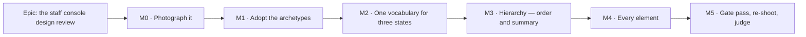

# Implementation Plan: The staff console design review

- **Feature spec:** [./feature-spec.md](./feature-spec.md) — **Approved 2026-09-14.**
- **Status:** Approved
- **Owner:** web

## Breakdown

### Epic

**The staff console design review** — turn `/staff` from eight equal stacked cards into a screen that
answers "is anything wrong right now?" in its first viewport, assembled entirely from the ADR-0097
page archetypes. Roadmap theme: **Operations & staff**.

---

## The falsification conditions — written before any prototype

Standing practice in this repository (ADR-0097 Landing C, ADR-0121 M0, ADR-0127 M0): the condition
that would make us withdraw the design is committed **before** the design exists, so a number cannot
be tuned to the answer. "Looks professional" is not testable; these are.

All three are measured at **1646 × 1000**, against the M0 baseline, with the API on the §4.7
**unhealthy recipe**.

| #        | Condition                                                                                            | Withdrawn if                                                                                               |
| -------- | ---------------------------------------------------------------------------------------------------- | ---------------------------------------------------------------------------------------------------------- |
| **FC-1** | Every non-healthy condition the console can report is named or counted **within the first viewport** | anything not healthy requires scrolling to discover                                                        |
| **FC-2** | Document height in the same state is **≤** the M0 baseline                                           | the redesign is taller — hierarchy bought with length has moved the problem, not solved it                 |
| **FC-3** | `weightSites()` outside `components/ui/` **falls** from 173, and arbitrary sizing stays ≤ 17         | either ratchet has to be **raised** to land the design — that is a one-off wearing the archetypes' clothes |

**Non-vacuity control, checked first and not optional.** The judged state must contain **at least two
distinct non-healthy conditions**, asserted before any verdict is printed. FC-1 over an empty set
passes and means nothing — the shape ADR-0093, ADR-0108, ADR-0121 and ADR-0131 each recorded a gate
failing on.

**The instrument throws rather than judging when it has nothing to judge** (ADR-0097 Landing C's
`PROCEED` from an `undefined`; ADR-0128's `INDETERMINATE`).

---

## Milestone M0 — Photograph it

**Outcome:** `/staff` is in the screenshot set at three widths, in two states, and the epic's three
falsification conditions have a measured baseline. `docs/TECH_DEBT.md` #319 is corrected and closed.

**Entry point:** `Ships dark` — **no product code changes at all.** This milestone changes a
developer harness and two register rows. Nothing a staff member can press is different.

**Journey:** none added. `e2e-staff/staff.spec.ts` must still pass unchanged, which is the assertion
that the harness change did not disturb the product.

> **Why this is first and is not optional.** ADR-0099's precedent: four consecutive epics tuned the
> plan workspace by arithmetic, and what settled it was a screenshot — taken only after somebody
> noticed the shot list stopped at the route. ADR-0101's is sharper: the activity editor reached a
> user as a four-scrollbar panel because the list stopped at the route it sits on. You cannot review
> "every single element" of a surface nobody has seen a picture of.

#### Feature: the harness reaches the console

> **Description:** make `shoot.mjs`'s existing-but-unsatisfiable `staff` shot actually work, and add
> the unhealthy companion shot.
> **Complexity:** M
> **Dependencies:** none
> **Risks:** the reachability route has a security dimension → **CQ-2 blocks M0-T2 only**; M0-T1,
> T4 and T5 proceed regardless.
> **Testing requirements:** the harness is not CI-run, so its proof is that it writes six files and
> that `scripts/e2e-local.sh web:staff` still passes.

##### Task M0-T1 — Correct #319, #320(a), and one contradictory docblock (≈ one PR)

- **Description:** three documentation corrections, each established by reading rather than inherited.
- **Complexity:** S
- **Dependencies:** none
- **Risks:** none.
- **Testing:** `pnpm check:debt-status` (the rows keep a parsable status);
  `pnpm check:doc-links`.
- **Development steps:**
  1. `#319`: its headline — "25 shots and **not one of them is `/staff`**" — is stale. The shot exists
     (`shoot.mjs:570`) with its own branch (`:845-867`); the list is **42** entries. Rewrite the row
     to the real defect: the shot's preconditions are **unsatisfiable as written**, because
     `onboard()` mints `shoot-${Date.now()}-${width}@example.com` (`:61-66`) against a `STAFF_EMAILS`
     that must be set **before boot**, and nothing verifies the address. Keep the row's own prediction
     of what a shot would show — it is the design brief and it was right.
  2. `#320(a)`: it says the clipboard idiom is written a **third** time and names three files. There
     are **four** — `ShareLinksDialog.tsx:63` is the fourth — and its supporting claim that "the two
     older sites are silent when the clipboard refuses" is **wrong of that fourth**, which guards the
     API's absence (`:58-62`), announces a failure (`:68`) and reverts its label after 2 s
     (`:49-53`). Correct both, and note that the row's own argument ("extract now rather than at the
     fourth") has already been overtaken.
  3. ~~`shoot.mjs:18`'s docblock says 25 shots; make it derive or delete the number.~~
     **WITHDRAWN at M0 — the claim was false.** No docblock in `shoot.mjs` states a shot count;
     the only live "25 shots" text is `CLAUDE.md:2775`, correctly past-tense about ADR-0102
     widening the harness 12 → 25. Following this step would have "corrected" a file that was
     already right. Kept struck through rather than deleted, because a plan that quietly loses a
     task reads as a plan that never had it.
  4. `playwright.staff.config.ts:19` says _"The spec verifies addresses through the API rather than
     through mail, so no SMTP sink is needed"_, nine lines above the config starting one (`:62-66`)
     for a spec that uses it (`staff.spec.ts:184`). Correct the sentence, not the config.
  5. Record in `docs/DECISIONS.md` that #319's stale headline was found by re-verifying a briefed
     claim — the §19.11 rule paying for itself.

##### Task M0-T2 — Make the shot reachable — **BLOCKED ON CQ-2**

- **Description:** give the harness a staff-capable, verified session.
- **Complexity:** M
- **Dependencies:** CQ-2
- **Risks:** see the three routes below; each carries its own.
- **Testing:** the shot writes a file; the harness's own guard (`:865`) is tightened so a failure
  names _which_ precondition failed.
- **Development steps (route A — recommended default):**
  1. Add `SHOOT_STAFF_EMAIL` (default `shoot-staff@schedulepoint.test`), used by a new
     `onboardStaff()` **instead of** the stamped address, so the operator can put a **knowable** value
     in `STAFF_EMAILS` before booting the API.
  2. Make `SmtpSink` importable from a plain `.mjs` harness. It is TypeScript
     (`e2e-account/smtp-sink.ts`) and `shoot.mjs` runs under bare `node`, so the three sub-options
     are: **(i)** run shoot under `node --experimental-strip-types`; **(ii)** move the sink to a
     `.mjs` module with a `.d.ts`, consumed by **both** the journey and the harness; **(iii)** copy
     it. **(iii) is rejected** on the ADR-0065 / ADR-0121 rule — two implementations drift, and the
     drift is invisible because each looks right alone. **(ii) is recommended**: one implementation,
     no flag on a harness people run by hand.
  3. Sign up (or sign in), press resend on `/account`, `sink.waitFor(…, /verify-email/)`, follow the
     link, **sign in again** — verifying does not leave you signed in, which
     `staff.spec.ts:190-199` records as observed rather than assumed.
  4. Tighten `:860-866`: distinguish "no session", "not in `STAFF_EMAILS`" and "not verified" in the
     thrown message. The current `is the caller staff?` is one question standing in for three.
- **Route B (write `email_verified` directly):** smallest code — one `UPDATE` — and **not
  recommended**. It is the harness's first write below the public API and it writes **the exact
  column the staff guard exists to check**; ADR-0086's founding argument is that this console
  _replaces_ `psql`, so giving the instrument that photographs it a `psql`-shaped shortcut is a
  template the next harness copies. It also requires the harness to hold database credentials, which
  forecloses ever pointing `shoot.mjs` at a non-local instance.
- **Route C (screenshot from inside `e2e-staff/staff.spec.ts`):** near-zero cost — that suite already
  holds a verified staff session — but it splits the instrument: the artefacts land outside
  `.screenshots/<width>/`, which is where a reviewer looks, and the config pins one viewport (1920,
  `playwright.staff.config.ts:44`) so three widths need `setViewportSize` inside a gate. A reasonable
  fallback if A is measured to cost more than it looks.

##### Task M0-T3 — The unhealthy shot, and the recipe that produces it

- **Description:** add `staff-unhealthy` beside `staff`, and pin the API recipe in the harness's own
  docblock.
- **Complexity:** S
- **Dependencies:** M0-T2
- **Risks:** an all-green picture cannot test hierarchy → this task is the mitigation, not an extra.
- **Testing:** the non-vacuity control — the shot **fails** if fewer than two distinct non-healthy
  conditions are on screen when it is taken.
- **Development steps:**
  1. Document the recipe (spec §4.7): `MAIL_SMTP_URL` unset, `MAIL_ALERT_URL` / `HEARTBEAT_URL`
     unset, `RETENTION_SWEEP_ENABLED=false`, ≥ 1 unverified account, ≥ 1 `csp_reports` row.
  2. Add the shot. `shoot.mjs` boots no servers, so this is a second invocation against a
     differently-configured API — say so in the docblock rather than pretending one run does both.
  3. Add the non-vacuity assertion and verify it red by taking the shot against a healthy API.

##### Task M0-T4 — Measure the baseline

- **Description:** the numbers FC-1/2/3 are judged against.
- **Complexity:** S
- **Dependencies:** M0-T3
- **Risks:** a baseline taken in a different state from the final measurement is worthless → the
  recipe and the width are recorded with every figure.
- **Testing:** n/a (this task produces evidence).
- **Development steps:**
  1. At 1646/1920/1280, in both states, record: full document height; the y-offset of each section
     heading; which sections' headings fall below 1000 px; and how many non-healthy conditions exist
     and where each is first stated.
  2. Record today's gate readings: `weightSites()` outside `components/ui/` (currently **173**,
     `token-architecture.test.ts:600`) and the arbitrary-sizing count (ceiling **17**, `:706`).
     Record the staff surface's own share — measured today as **14 weight sites**:
     `routes/staff.tsx` 9, `perf-probe/ui/performance-probe-panel.tsx` 3 (a fourth match at `:582` is
     a comment and the scanner strips comments), `features/staff/ui/panel.tsx` 1,
     `features/staff/ui/diagnostics-panel.tsx` 1.
  3. Write `m0-baseline.md` in this directory. Every figure names the width, the state and the
     command.

##### Task M0-T5 — Read the pictures and write the diagnosis

- **Description:** the design pass the console has never had.
- **Complexity:** M
- **Dependencies:** M0-T4
- **Risks:** the spec's §1 diagnosis was written from the **code**, not from a picture. If the
  pictures contradict it, the pictures win and the spec is amended before M1 — ADR-0090's recorded
  lesson (drafted without a shell, two predictions falsified on the first run).
- **Testing:** n/a.
- **Development steps:**
  1. Review both states at all three widths.
  2. Amend spec §1 and §4.5 where the pictures disagree. **Record what was wrong**, not just what
     changed.
  3. Answer CQ-1 and CQ-3 with evidence, and put them to the product owner with the pictures
     attached.

---

## Milestone M1 — Adopt the archetypes

**Outcome:** `/staff` is assembled from `PageContainer`, `PageHeader` and `SectionCard`, with a gate
saying so. Nothing moves and nothing is re-ordered.

**Entry point:** `/staff` itself — the page a staff member already opens from the account menu's
**Staff console** item. This is the first user-facing milestone.

**Journey:** `e2e-staff/staff.spec.ts` gains its first step for this epic — assert the page's single
`<h1>`, and that each of the eight sections is a named `region` in the expected order (ADR-0081 §2:
the journey lands with the first user-facing milestone, not at enablement).

> **Deliberately a no-op on measure.** `PageContainer width="narrow"` **is** `max-w-4xl`
> (`page-container.tsx:19`), which is what `staff.tsx:82` already sets. So this milestone can be
> judged against M0's pictures on one question: _does anything look different?_ If the answer is yes,
> something was hand-rolled differently from the archetype and we have just found it.

#### Feature: the staff surface is built from the system

> **Description:** frame, heading and section shell come from `components/ui/page/`.
> **Complexity:** M
> **Dependencies:** M0
> **Risks:** deleting the route's own `<main>` on the grounds that "the shell provides one" → it does
> **not**: `/staff` is a sibling of `_authed`, not a child (`staff.tsx:29-45`), and `PageContainer`
> renders a `
` and never a landmark (`page-container.tsx:25-35`). A regression test asserts the
> page has exactly one `<main>`.
> **Testing requirements:** a new structural gate **verified red first**; the existing `staff.test.tsx`
> suite passes **unchanged** (it queries by role and name, which is what makes it the before/after
> oracle — the ADR-0078 barrel-preserving argument).

##### Task M1-T1 — The gate, written and verified red before the code

- **Description:** `apps/web/src/features/staff/archetypes.structural.test.ts`, modelled on
  `features/overview/archetypes.structural.test.ts`.
- **Complexity:** S
- **Dependencies:** M0
- **Risks:** a scan that matches prose → strip comments, as the overview's gate does
  (`:52-58`) after the same false positive; this is the **fifth** recorded instance of that class in
  this repository.
- **Testing:** the gate itself, run against the unmodified tree and **observed failing**, with the
  failing output committed to this directory.
- **Development steps:**
  1. Scan `routes/staff.tsx`, `features/staff/**`, `features/perf-probe/ui/**`.
  2. Assert it imports `@/components/ui/page` and uses `PageContainer`, `PageHeader`, `SectionCard`.
  3. Assert it hand-rolls no `mx-auto…max-w-`, no `<h1`, no `<h2` — **both** branches of
     `StaffConsoleScreen`, since the `Not found` branch hand-rolls a frame and a heading too
     (`staff.tsx:68-69`).
  4. Add a **pinned positive**: the scanned file set is non-empty. "Every X is fine" over a scan that
     found no X is the shape four gates in this repository have failed on.
  5. Run it red. Commit the output.

##### Task M1-T2 — `PageContainer` + `PageHeader`, both branches

- **Description:** replace the two hand-rolled frames and the two hand-rolled `<h1>`s.
- **Complexity:** S
- **Dependencies:** M1-T1
- **Risks:** `PageHeader`'s description is wired by `aria-describedby` (`page-header.tsx:43-58`),
  which changes what a screen reader hears on the heading → assert the `Signed in as …` sentence is
  still findable, since `staff.spec.ts:236` matches it exactly.
- **Testing:** unit; the journey's existing assertions must pass unchanged.
- **Development steps:**
  1. Staff branch: `<main>` → `PageContainer width="narrow"` → `PageHeader title="Staff console"
description={…}`.
  2. `Not found` branch: same frame; **keep the muted, non-alert treatment** — deliberately not
     `client-detail.tsx:42-45`'s `role="alert"` + destructive ink, because this is the honest uniform
     answer ADR-0086 requires and dressing it as a failure implies a surface exists. Record the
     divergence in the code.
  3. Keep the dual-hat `Alert purpose="condition"` (`:93`) exactly as it is.

##### Task M1-T3 — `Panel` composes `SectionCard`

- **Description:** `Panel` keeps its name and `status` prop; its body becomes `SectionCard`.
- **Complexity:** S
- **Dependencies:** M1-T2
- **Risks:** `SectionCard` renders a **named `<section>`** (`section-card.tsx:52`), so each panel
  becomes a `region` — the journey already locates two panels by `getByRole('region', …)`
  (`staff.spec.ts:256, 304`) against `DataTable`'s region, and a second nested region could make
  those locators ambiguous. **Run the journey.**
- **Testing:** `staff.test.tsx` unchanged; `scripts/e2e-local.sh web:staff`.
- **Development steps:**
  1. Compose, do not reimplement (ADR-0062).
  2. Keep the polite `status` paragraph — it is why `Panel` still exists (`panel.tsx:20-30`).
  3. Delete `Panel`'s own `<h2>`; `SectionCard` owns the rank (`level={2}`, `:55`).
  4. Update `panel.tsx`'s docblock: its stated reason ("`CardTitle` renders an `h1` and this page
     already has one") is now handled by the archetype rather than by this file's restraint.

---

## Milestone M2 — One vocabulary for three states

**Outcome:** loading, failure and metric look the same everywhere on the page.

**Entry point:** `/staff` — visible the moment any panel is pending or fails.

**Journey:** the existing suite gains an intercepted-500 case asserting the **one** failure shape, and
that no stale value renders beside it.

#### Feature: one loading shape, one failure shape, one metric

> **Description:** replace four hand-rolled `Spinner` + `role="alert"` + `Try again` blocks
> (`staff.tsx:151-161, 304-313, 470-479, 534-543`) with one shared treatment, aligned with
> `DataTable`'s (`:437-439, 617-618`); promote `Stat`.
> **Complexity:** M
> **Dependencies:** M1
> **Risks:** a shared component that silently changes `DataTable`'s behaviour → it composes nothing of
> `DataTable`; both simply render the same shapes, asserted by one unit test over both.
> **Testing requirements:** unit per shape; a structural assertion that `features/staff` contains no
> bare `role="alert"` + `text-destructive-text` pair; the journey's new 500 case.

##### Task M2-T1 — `QueryStates`

- **Description:** one loading shape and one failure shape in `components/ui/`.
- **Complexity:** M
- **Dependencies:** M1-T3
- **Risks:** **the ADR-0140 M4 finding, which applies to four panels here.** `query.data` is not
  cleared by a failed refetch nor while one is in flight, so a failure message can render directly
  above the previous run's numbers. Every converted panel derives one `result` boolean the way
  `diagnostics-panel.tsx:60` does, rather than reading `query.data`.
  Second risk: `aria-disabled`, never native `disabled`, on the retry — a natively-disabled control
  blurs to `<body>` the instant it flips (ADR-0083; four recorded instances).
- **Testing:** unit, including the stale-data case **verified red** against the current code.
- **Development steps:**
  1. Extract the shape; convert Mail, Retention, Installation, Accounts.
  2. Derive `result` in each; assert no stale value beside a failure.
  3. Add the structural assertion; verify it red.

##### Task M2-T2 — `StatGrid` / `Stat`, promoted

- **Description:** move `staff.tsx:112-120` into `components/ui/page/`, closing its own docblock TODO,
  and give it **one** responsive column rule.
- **Complexity:** S
- **Dependencies:** M2-T1
- **Risks:** the two existing grids disagree — `grid-cols-2 sm:grid-cols-3` (`:172`) and
  `grid-cols-2 sm:grid-cols-4` (`:483`) — so one of them changes. Check the change against M0's
  pictures rather than asserting it is fine.
- **Testing:** unit; add to the archetype table in `docs/DESIGN_SYSTEM.md:537-544`.
- **Development steps:**
  1. Promote with `label` / `value`, `tabular-nums` retained.
  2. One column rule derived from the widest caller (four facts), reviewed at 1280 and below.
  3. Update the design-system table and its authoring rule.

---

## Milestone M3 — Hierarchy: order and summary

**Outcome:** the first viewport answers "is anything wrong?".

**Entry point:** the top of `/staff`, immediately below the page header. Named, per ADR-0081.

**Journey:** the sweep's own test — assert the summary is present, that on the unhealthy recipe it
names at least two conditions, and that **it carries no live-region role**.

#### Feature: the derived status summary

> **Description:** a pure four-state derivation over the queries the page already makes, rendered as a
> severity-ordered list of links.
> **Complexity:** L
> **Dependencies:** M2, and CQ-1 + CQ-3 answered
> **Risks:** (a) a summary that coalesces `PENDING`/`UNREADABLE` into `HEALTHY` — the ADR-0125 `??`
> lie; mitigated by a total `Record<CheckId, CheckState>` so a missing case is a typecheck failure.
> (b) a **second** request → mitigated structurally: the derivation takes existing query results as
> arguments and issues nothing (a second staff route writes a second `staff.panel_read` audit row on
> every page load — ADR-0087 M3 §4.6).
> (c) announcing a standing condition as an event → `purpose="condition"` or no `Alert`; ADR-0132.
> **Testing requirements:** unit over all four states and mixtures, including all-pending and
> all-failed; the journey; axe in a non-healthy state.

##### Task M3-T1 — `features/staff/model/console-status.ts` (pure)

- **Complexity:** M · **Dependencies:** M2 · **Risks:** as above.
- **Testing:** unit only; no component mounted.
- **Development steps:**
  1. `Check = { id, label, state: 'HEALTHY'|'ATTENTION'|'UNREADABLE'|'PENDING', sentence, sectionId }`.
  2. Derive from `useStaffHealth` (mail **and** retention — one response, two checks), CSP,
     installation, accounts. No defaulting.
  3. Severity order: `ATTENTION` → `UNREADABLE` → `PENDING` → `HEALTHY`.
  4. The healthy sentence **enumerates what was checked**. Assert that a check removed from the set
     changes the sentence — otherwise "everything is fine" can quietly cover less than it claims.

##### Task M3-T2 — `StaffStatusSummary`

- **Complexity:** M · **Dependencies:** M3-T1
- **Risks:** a link that scrolls but does not move focus leaves a keyboard user where they were.
- **Testing:** unit + journey; keyboard traversal asserted.
- **Development steps:**
  1. Render severity-ordered rows; each links to its section's region and **moves focus** there.
  2. No live region. Pin it with a test asserting the rendered node has **no** `role` attribute —
     `role={undefined}` and no attribute look identical in React and only the second is assertable
     (`alert.tsx:107-109`'s own reason for spreading rather than passing).
  3. Reuse `Badge variant="warning"` where a chip is wanted. **No new colour token** — `Alert` has no
     `warning` tone (`alert.tsx:66-74`) and adding one is a token decision with its own matrix entry,
     explicitly out of scope.

##### Task M3-T3 — Re-order into the four bands

- **Complexity:** S · **Dependencies:** M3-T2, CQ-3
- **Risks:** the journey asserts panel presence but not order → add the order assertion, verified red
  against today's order.
- **Testing:** unit (order) + journey.
- **Development steps:**
  1. A → Mail, Retention, CSP. B → Installation, Accounts. C → Diagnostics, Performance.
     D → Staff activity.
  2. **No band headings** (spec §4.5): they would force `SectionCard` to `level={3}`, a shared
     contract change, to buy a word. Record the decision where the order is expressed.
  3. Apply CQ-1's answer. If a grid is chosen it is **band-B-local** and never applied to a band that
     can report a condition.

---

## Milestone M4 — Every element

**Outcome:** the product owner's "every single element needs reviewing" discharged, item by item.

**Entry point:** `/staff`. **Journey:** the existing suite; the clipboard assertions already there
(`staff.spec.ts:459-464`, `:891-898`) become the regression test for the extracted hook.

#### Feature: the details, each with its reason

> **Complexity:** M · **Dependencies:** M3
> **Risks:** scope creep into a product-wide archetype migration → the gate covers the staff surface
> only; `routes/client-detail.tsx:34` and its siblings are ADR-0097 Landing F and stay out.
> **Testing:** unit per change; the weight ratchet must **fall**.

##### Task M4-T1 — Remove the five `<strong>` lead-ins inside `Alert`s

- **Complexity:** S · **Dependencies:** M3
- **Risks:** none — the precedent is this page's own.
- **Testing:** the weight ratchet falls; journey copy assertions still pass.
- **Development steps:**
  1. `staff.tsx:94, 166, 319, 326, 442`. ADR-0097's ratchet note records three identical lead-ins
     being removed from this very page's Performance panel because `Alert` already carries a tone
     colour, an accent bar, an icon and a role (`token-architecture.test.ts:573-582`). The rule was
     applied to one panel and not its neighbours.
  2. `:375`'s `<strong>not</strong>` is **different** — it is emphasis inside a sentence whose meaning
     inverts without it, in body copy rather than an `Alert`. **Keep it**, and say why.
  3. Ratchet `SCREEN_WEIGHT_CEILING` **down** to the new measured figure, with the reason, in the
     house style of that file's comment chain.

##### Task M4-T2 — `useClipboardCopy`, all four sites

- **Complexity:** M · **Dependencies:** M3
- **Risks:** **this is the one task whose blast radius leaves `/staff`** (`ShareLinksDialog`). It is
  in scope because leaving one behind is the failure this register records most often — one correct
  pattern applied to a control and not its neighbour. Mitigation: convert all four in one PR and run
  `scripts/e2e-local.sh web:staff` **and** the share journey.
- **Testing:** unit for the hook including the rejection branch; both journeys.
- **Development steps:**
  1. Extract to `hooks/use-clipboard-copy.ts`: the write, the announcement, **the failure branch**,
     and the `navigator.clipboard`-absent guard only `ShareLinksDialog` currently has (`:58-62`).
  2. Convert `performance-probe-panel.tsx:469`, `probe-sittings.tsx:510`,
     `diagnostics-panel.tsx:66`, `ShareLinksDialog.tsx:63`.
  3. Preserve `ShareLinksDialog`'s 2 s label revert as an option — it is a real behaviour, not an
     inconsistency to flatten.
  4. Structural assertion: no direct `clipboard.writeText` outside the hook.
  5. Close `#320(a)` with the corrected count.

##### Task M4-T3 — The per-element sweep

- **Complexity:** M · **Dependencies:** M4-T2
- **Risks:** a sweep with no list is a sweep that stops when someone gets tired → the list is written
  first, from M0's pictures, and each item is dispositioned **changed** or **kept, with a reason**.
- **Testing:** unit where behaviour changes; the journey; axe.
- **Development steps:**
  1. Enumerate every element from the pictures: badges, `<code>` spans, `<dl>` groups, table captions,
     `Show older`, the `
` summary, every consequence sentence.
  2. Disposition each. **Keeping something is a result** — this epic must not change a correct control
     to look busy.
  3. Check every icon-only or small control against WCAG 2.5.8 **by hand**, because nothing automated
     covers this page: the ADR-0118 sweep is scoped to the plan workspace
     (`e2e-workspace-fit/command-surface.spec.ts`), and `axe-core@4.13.0/axe.js:33491-33496` ships
     `target-size` with `enabled: false`, so the journey's `wcag22aa` tag does not turn it on.
     Whether to extend the sweep to `/staff` is a **separate shared-gate decision** (ADR-0105) and is
     recorded as a register row, not smuggled in here.

---

## Milestone M5 — Gate pass, re-shoot, judge

**Outcome:** the design is judged against the conditions written before it existed, the specialists
have run, and the ADR is filed.

**Entry point:** none added. **Journey:** the full `e2e-staff` suite, plus the re-shoot.

#### Feature: the verdict

> **Complexity:** M · **Dependencies:** M4
> **Risks:** a gate pass that finds nothing is a gate pass that was not run — eight consecutive epics
> in this register blocked on it.
> **Testing:** everything.

##### Task M5-T1 — Re-shoot and judge FC-1/2/3

- **Complexity:** S · **Dependencies:** M4
- **Risks:** measuring in a different state from M0 → the recipe and width are re-read from
  `m0-baseline.md`, not remembered.
- **Development steps:**
  1. Re-run both shots at all three widths.
  2. Check the non-vacuity control **first**. If the state carries fewer than two non-healthy
     conditions, the instrument **throws** rather than printing a verdict.
  3. Judge each condition. **A failure withdraws the design; it does not soften the condition.**
  4. Write `m5-verdict.md`, including anything the measurement contradicted.

##### Task M5-T2 — The specialist gates

- **Complexity:** M · **Dependencies:** M5-T1
- **Development steps:**
  1. **accessibility-reviewer** and **ux-reviewer** over the whole diff — mandatory: this is a screen
     whose only automated a11y cover is an axe scan that structurally cannot see 2.5.8.
  2. **component-reviewer** over `StatGrid`, `QueryStates`, `useClipboardCopy` and the `Panel`
     composition — three new shared contracts.
  3. **security-reviewer** if and only if CQ-2 chose route B.
  4. **performance-reviewer** on the summary's render cost (it reads four queries at the page root —
     ADR-0133 D6's rule: a context member is a fact or a callback, never a live hook return).
  5. **`database-architect` is not engaged, and that is recorded**: there is no model, column, index,
     constraint or migration in this epic, confirmed against the diff.
  6. Fold every blocking finding with a regression test **verified red first**. Record non-blocking
     findings as a numbered register row with reasons.

##### Task M5-T3 — File the ADR and close the paperwork

- **Complexity:** S · **Dependencies:** M5-T2
- **Development steps:**
  1. **Re-derive the ADR number at filing** — `0143` is free today (`docs/adr/` tops out at 0142), and
     ADR-0071 and ADR-0079 both record a number being taken between the plan and the milestone.
  2. Draft outline — **_A console's hierarchy is order and a derived summary, never a layout_**:
     _Problem_ — eight equal cards, the two inert tools at positions 2 and 3, three states drawn two
     ways, and a screen no picture existed of. _Options_ — bespoke console layout / grid / seventh
     page archetype / archetypes + ordering + derived summary. _Chosen_ — the fourth, with the
     falsification conditions and their verdicts. _Trade-offs_ — no band headings (the rank contract
     is not worth a word); the summary derives rather than fetches; `Panel` composes rather than
     widening `SectionCard`. _Consequences_ — a fifth shared component family; a staff archetypes
     gate; `/staff` in the shot list; #319 and #320(a) closed; the 2.5.8 gap recorded, not closed.
  3. Update `docs/adr/README.md`, `docs/ROADMAP.md` (`check:adr-coverage` reads **both**), and
     **`CLAUDE.md` §16** — which `check:adr-coverage` structurally **cannot** see
     (`docs/TECH_DEBT.md` #291), so it is a person's job or nobody's.
  4. Set this spec's header to `Accepted — shipped (ADR-NNNN)`; `pnpm check:spec-status` refuses a
     `Draft` header whose directory an ADR cites.
  5. Changeset: **minor** for `@repo/web` (user-visible change, pre-1.0).

---

## Sequencing & slices

| Slice | Releasable alone?       | Value alone                                                                      |
| ----- | ----------------------- | -------------------------------------------------------------------------------- |
| M0    | yes — no product change | closes #319; the console can be reviewed by looking, for ever                    |
| M1    | yes                     | the frame is the system's; the gate stops it drifting back                       |
| M2    | yes                     | one loading and one failure shape; a real stale-data defect fixed in four panels |
| M3    | yes                     | the headline: the first viewport answers the question                            |
| M4    | yes                     | the detail pass                                                                  |
| M5    | yes                     | the verdict and the record                                                       |

**No feature flag** (ADR-0088 D1). Vite inlines `import.meta.env.VITE_*` at build time,
`apps/web/Dockerfile` declares one `VITE_` build arg and `docker-publish.yml` passes none, so every
published image carries every flag at its default and an operator cannot switch one off — a flag here
would be a second JSX root of a whole screen, maintained for ever, and never a rollback. **The
rollback is a commit boundary**, and the slicing above is what makes that cheap: each milestone is one
revertible commit against a page whose journey passes at every step.

## Definition of Done (per task)

Each PR satisfies the Feature Completion Criteria in [`docs/PROCESS.md`](../../PROCESS.md). Two are
sharpened for this epic:

- **The pre-push gate is run, not written**: `pnpm prepush` (one command — it derives its own list;
  running the parts by hand is how a gate gets missed), **plus `scripts/e2e-local.sh web:staff`** on
  every milestone from M1, because no unit suite can tell you a locator, an accessible name or a
  region is wrong. M4-T2 additionally runs the share journey.
- **`apps/api` is untouched.** If a change to this epic needs an API edit, a trigger has been crossed
  and the work stops (ADR-0105).

## Risks & assumptions (rollup)

| Risk / assumption                                                | Likelihood | Impact   | Mitigation                                                                                                                                                                                                                      |
| ---------------------------------------------------------------- | ---------- | -------- | ------------------------------------------------------------------------------------------------------------------------------------------------------------------------------------------------------------------------------- |
| The pictures contradict the spec's code-derived diagnosis        | **med**    | med      | M0-T5 amends the spec **before** M1; the pictures win (ADR-0090's recorded lesson)                                                                                                                                              |
| A grid buries a red state below the fold                         | low        | **high** | FC-1; a grid is band-B-local only, never over a band that can report a condition                                                                                                                                                |
| `SectionCard`'s nested `region` breaks existing journey locators | **med**    | med      | M1-T3 runs the journey; `staff.spec.ts:256, 304` are the two at risk                                                                                                                                                            |
| The redesign is taller than today's                              | med        | **high** | FC-2                                                                                                                                                                                                                            |
| The summary reports "healthy" while a query is pending or failed | low        | **high** | four states, a total `Record`, no defaulting; unit tests for all-pending and all-failed                                                                                                                                         |
| CQ-2 chooses route B and the harness gains database reach        | low        | med      | recommended default is route A; route B additionally requires security-reviewer at M5                                                                                                                                           |
| The 2.5.8 gap is assumed closed because axe is green             | **med**    | med      | stated in the spec and in M4-T3: `target-size` ships `enabled: false` (read from `axe-core@4.13.0/axe.js:33491-33496`), so the journey's `wcag22aa` tag does not run it. Extending the sweep is a separate shared-gate decision |
| Scope creep into a product-wide archetype migration              | **med**    | med      | the gate covers the staff surface only; Landing F stays out                                                                                                                                                                     |
| The new ADR number is taken between plan and filing              | med        | low      | re-derived at M5-T3 (ADR-0071/0079)                                                                                                                                                                                             |
| `CLAUDE.md` §16 is not updated because no gate checks it         | **high**   | med      | M5-T3 step 3, explicitly — #291; ADR-0141 and ADR-0142 are **missing from it today**, both present in the gated index                                                                                                           |
