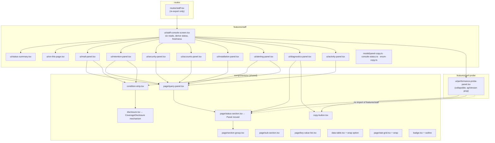
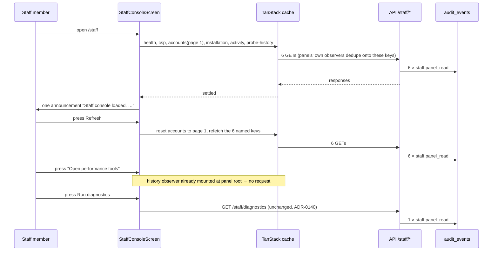
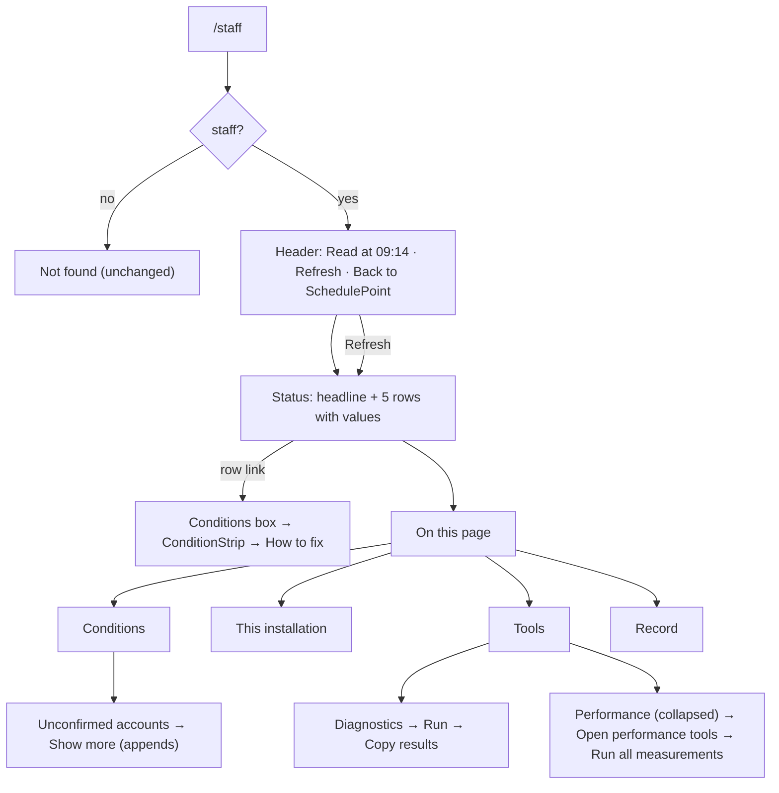

# Feature Spec: Staff console redesign — grouped by task, plain language, one shape per panel

- **Status:** Draft — awaiting approval before implementation.
- **Author(s):** Claude Code (feature-analyst), for James Ewbank (product owner)
- **Date:** 2026-10-06
- **Tracking issue / epic:** product-owner request 2026-10-06 ("very messy and not well put together in
  terms of GUI / UI / UX"); three read-only reviews (UX, accessibility, component) the same day;
  `docs/TECH_DEBT.md` #458 (folded in at M1)
- **Roadmap link:** none (quality of an existing surface, not a roadmap theme)
- **Related ADR(s):** ADR-0086 (staff principal, audited reads), ADR-0140 (diagnostic takes no input),
  ADR-0143 (console answers before it reports — **amended by this epic**), ADR-0145 (assembled from
  the archetypes — **extended by this epic**), ADR-0146 (column width by content), ADR-0132 (event vs
  standing condition), ADR-0135 (focus handed back), ADR-0111 (keyboard contract reviewed before
  release), ADR-0082/0083 (shaded controls), ADR-0081 (entry point and journey), ADR-0088 D1 (no
  flag), ADR-0105 (when a debt row stops being a spec). **One new ADR is proposed** (provisionally
  ADR-0178 — take the next free number at filing; another worktree may claim 0178 first). Outline in §4.8.

> **Why this is a spec (ADR-0105).** It changes the public contract of shared primitives
> (`SectionCard` heading rank, `Badge` variants, `DataTable` column options, `StatGrid`), moves one
> (`Panel`) into the shared layer, adds new ones, and extends a shared gate (#458). Any one of those is
> a trigger. **No schema change and no API change** (§4.4–4.5). **No Playwright config or CI step is
> added**: the existing `e2e-staff` suite gains steps.
>
> **No flag** (ADR-0088 D1): a `VITE_` flag cannot be switched off on the published image, so it
> would only be a second JSX tree. Each milestone is its own commit boundary, and that is the rollback.

---

## 0. What was checked before writing, and what was found wrong

The review digest
(`…/scratchpad/staff-review-digest.md`) was re-read against the code at `origin/main` on
2026-10-06 (CLAUDE.md §19.11: "the brief is not evidence"). **(design)** marks a finding that
changes the design.

1. **Confirmed: the page is seven peer panels and one card exists only because of a shared query.**
   `routes/staff.tsx:222-248` renders seven `PageGridItem`s with no grouping. `MailAndRetentionPanel`
   (`:633-652`) wraps two sections because both call `useStaffHealth()` (`:263`, `:455`). Three
   summary checks point at the same card: `CHECK_SECTION_ID` maps `mail`, `retention` and `alerting`
   all to `'staff-section-health'` (`model/console-status.ts:103-109`).
2. **Confirmed: the route file is 931 lines and owns five panel components inline** (`staff.tsx:262`
   Mail, `:454` Retention, `:666` Security, `:739` Installation, `:805` Accounts, `:879` Activity).
3. **Corrected: the "two-way" feature coupling is one-way today.** `features/perf-probe` imports
   `features/staff` twice: `Panel` (`performance-probe-panel.tsx:43`) and `useStaffInstallation`
   (`loading-probe-section.tsx:23`, which the digest does not mention). `features/staff` itself
   imports nothing from `perf-probe`. Only `routes/staff.tsx:12` does. **(design)** The coupling
   **becomes** two-way the moment the screen moves into `features/staff` (B2's own remedy). So M0 must
   break both `perf-probe → staff` imports **before** it moves the screen, not after.
4. **Corrected: `DataTable` already has width variants.** `Column.width: 'fit' | 'bounded' | 'auto'`
   exists (`components/ui/data-table.tsx:76`) and composes with `cellClassName`. The
   "cellClassName merge" was **declined on purpose**: "seven overrides omit `py-2` on purpose"
   (`data-table.tsx:68-74`, ADR-0145 M4). **(design)** This epic does not reopen that. The staff
   tables move from hand-tuned `md:w-44 / w-36 / w-80 / w-56 / w-28 / w-40 / w-96 / w-52 / w-72`
   (`staff.tsx:291-303, 464-472, 811, 892-897`) to `width: 'fit' | 'bounded'`. The only addition is a
   small `wrap: 'anywhere'` option, so an address column stops restating `py-2 pr-4` just to add
   `break-all` (`staff.tsx:301-303` records the padding defect this caused).
5. **Confirmed: "Show older" drops focus to `<body>`.** `AccountsPanel` holds `cursor` in state
   (`staff.tsx:806-807`). The new cursor is a new query key (`api/staff-panels.ts:63`), so
   `isPending` is true and the whole body, including the focused button, is replaced by a `Spinner`
   (`staff.tsx:830, 836`). The new page also **replaces** the old rows. Nothing appends.
6. **Confirmed: resting `aria-disabled:pointer-events-none` (#458 shape)** on Diagnostics **Copy for
   the record** (`diagnostics-panel.tsx:112-117`, disabled until the first run) and on the probe's
   **Show** for the sitting already shown (`probe-sittings.tsx:432-438`). **Retry recording** carries
   `aria-disabled` with no shading class at all (`performance-probe-panel.tsx:1104-1125`).
7. **Confirmed: the panel live region sits inside the subtree the probe makes inert.** While a run is
   going, `performance-probe-panel.tsx:274-282` sets `inert` on `<main>`. `Panel`'s `aria-live`
   paragraph (`features/staff/ui/panel.tsx:54`) is inside `<main>`. An inert subtree is removed from
   the accessibility tree, so progress written there is very likely not announced. **Not observed in a
   screen reader**: this is reasoned from the `inert` specification, and M1's journey step is what
   will observe it. The app's shared announcer region renders **after** `{children}`, as a sibling of
   `<main>` (`components/ui/announcer.tsx:22-27`), so it is outside the inert subtree. **(design)**
   That is the fix.
8. **Confirmed: the probe overlay's bottom row cannot wrap.** `flex items-center justify-between
gap-4 p-4` with a 37-character button label, "Stop (keeps what is already measured)"
   (`performance-probe-panel.tsx:761-781`). There is no `flex-wrap` and no Escape handler.
9. **Confirmed: `StatGrid` values cannot wrap.** The `<dd>` is `text-xl font-semibold tabular-nums`
   with no `min-w-0` / `wrap-anywhere` (`components/ui/page/stat-grid.tsx:102-107`). `StatGrid` is
   used only by `routes/staff.tsx` (grep of `<StatGrid`, 2026-10-06), so a fix affects nothing else.
10. **Confirmed: the document title says "Not found" while staff-ness is still loading**
    (`staff.tsx:90`: `identity.data ? 'Staff console' : 'Not found'`).
11. **New, not in the digest: the headline sentence is ungrammatical.** `sentenceFor` builds
    `"2 of 5 checks " + "needs attention: …"` (`console-status.ts:281, 294`). The 390 px screenshot
    (`staff-shots/390-01b-initial-fold.png`) shows **"2 of 5 checks needs attention: mail delivery,
    failure alerting."** M3's copy rewrite replaces it.
12. **New: one fact, two sources.** "Is anybody told when something fails" is read from **two**
    different responses. The summary's `alerting` check reads `installation.mailAlertingConfigured`
    (`console-status.ts:217-219`). The Mail section's badge and the Retention failure sentence read
    `health.alertingConfigured` (`staff.tsx:387, 461`). **(design)** The new "Alerts and monitoring"
    panel and the summary row both read the **installation** response, so they cannot disagree. M3-T1
    first confirms that the two flags come from the same server setting (`MAIL_ALERT_URL`). If they do
    not, it stops and asks.
13. **New: the `aria-disabled` shading classes are product-wide, not a staff problem.** 59
    occurrences in 51 files (grep, 2026-10-06), including `features/tsld/toolbar/gantt-columns-group.tsx`.
    **(design)** The component review's M3 ("move them into `buttonVariants`") is **out of scope**. It
    would touch the Gantt, and the parked Surface sheet (`docs/HANDOFF.md:65`) governs Gantt work.
    This epic fixes the staff-surface sites only, and M1's #458 gate records any others it finds as
    exceptions that name a new register row.
14. **Measured: page length.** The 390 px full-page capture (`staff-shots/390-01-initial.png`) is
    **5,088 px**, about 6 phone screens. About a third of that is the Performance panel at rest, which
    has three paragraphs, two button rows, a disclosure, an empty history box, the plan-loading
    section and its two buttons. At 390 px the activity table's "Who" column breaks an e-mail address
    over five lines (`ops@sched / ulepoi / nt.tes / t`).
15. **Six audited reads per page load, confirmed twice.** By code: health, CSP reports, accounts,
    installation, activity and probe history (`staff.tsx:72-75, 880`; `perf-probe/api/probe-results.ts:135-141`).
    The plan-loading section's installation read dedupes. By screenshot: the activity table reads
    **"6 panel reads — performance, activity, installation, accounts, security, health"**.
16. **Measured: query staleness.** `DEFAULT_STALE_TIME = 30_000` (`lib/query/query-client.ts:24`).
    **(design)** A panel that **mounts a new observer** more than 30 s after load refetches, and
    that writes another `staff.panel_read`. Collapsing the Performance panel must therefore not
    unmount the history query's observer (§4.6, decision D-3).
17. **Gate that moves with the files.** `features/staff/archetypes.structural.test.ts:29, 97` pins
    `'/routes/staff.tsx'` as part of the scanned surface. `perf-probe/ui/panel-imports.structural.test.ts:18`
    reads `performance-probe-panel.tsx` by filename. Both must follow any move or split, or they go
    vacuous (ADR-0093's lesson).
    18a. **Screenshots (53, `staff-shots/`, inventory + `metrics.log`, taken 2026-10-06 at 1920, 1366 and 390
    px).** These are the findings that change the design. I looked at `1366-01`, `1366-09`, `1366-12`,
    `390-01` and `390-01b` myself. The rest are from `inventory.md` and `metrics.log`.
    - **Height at 390 px: 5,088 px at rest, 8,028 after Run diagnostics, 10,051 after a probe check.**
      At 1366: 4,093, 6,013 and 6,278 (`metrics.log:1, 3, 9, 12, 14, 20`). **(design)** Diagnostics
      alone adds about 2,900 px at 390 px with 16 near-identical cards, most repeating the same
      zero-count sentence. See D-12.
    - **Probe tables overflow at 390 px.** The readings table and "All sittings" are 779 px wide inside a
      clipped container, with no scroll cue (`metrics.log:9-11`, `TABLE … right=779`). They are
      `DataTable`s (`probe-sittings.tsx:163, 383, 611`), so the region does scroll and is focusable
      (`data-table.tsx:581-587`), but nothing shows that it scrolls. **(design)** D-10's
      fold-under-the-first-cell rule extends to the probe tables. A shared scroll cue is not added
      (§4.7).
    - **The error state is three defects in one picture** (`1366-09`). The headline becomes a
      lower-case fragment ("could not be read: mail delivery, …"), because `sentenceFor` emits no head
      when nothing is `ATTENTION` (`console-status.ts:292-295`). The rows **re-order** (Failure alerting
      moves from 2nd to last) because severity sorts them (`:236-239`). There are **six** separate Try
      again buttons and no page-level retry. **(design)** D-11 and D-5.
    - **The CSP caveat shows above a read error** (`1366-09`), because the `Alert` sits outside
      `DataTable`'s state machine (`staff.tsx:718-733`). The caveat talks about "an empty table" while
      there is no table. **(design)** `QueryPanel` renders panel-level prose only in the data state.
    - **"REPORTED, NOT GRADED" is heavier than the card titles** (`1366-01`, probe readings verdict
      column). The hierarchy is inverted. It becomes a `Badge`-scale tag (M4).
    - **Installation and Diagnostics sit side by side with unequal heights** (`1366-01`). This is the
      "ragged void" ADR-0143 D3 said the pair would avoid. **(design)** D-8 moves the pair.
    - **Shaded Copy buttons are hard to read** (`1366-01`: "Copy for the record", "Copy plan loading
      report"). WCAG 1.4.3 exempts inactive controls, but these stay focusable with a reason. **(design)**
      `CopyButton` shows its reason as visible normal-contrast text beside it.
    - **Dates are US-formatted** ("10/6/2026, 11:40:16 AM", `1366-01` Staff activity) because
      `toLocaleString()` uses the browser locale. D-9 already replaces it.
    - **A transient overflow after confirming the probe check** (`390-07b`, a button at `right=399`).
      It was not reproduced in any other shot. M1-T5 investigates it, and does not assume a cause.
    - **The non-staff "Not found" view is offset at x≈259 on a 1366 viewport** (`1366-12`), because it
      uses `PageContainer width="narrow"` (`staff.tsx:107`). **(design) Deliberately left alone** (D-13).
      ADR-0086's property is that a non-staff caller cannot tell this page from a route that does not
      exist. Aligning it with the console's gutter would move it **towards** the console. Whether it
      already matches what an unknown URL renders is **unverified**. Nothing under `routes/` defines an
      app-wide not-found screen (grep of `not ?found` under `routes/`, 2026-10-06), so M0-T1 photographs
      `/staff` (non-staff) beside `/no-such-path` and records the comparison. If they differ, the
      difference is a security-relevant tell and goes to security-reviewer as a new register row, not
      into this epic.
18. **No conflict with the in-flight `staff-server-readings` epic.** Its M1 (history counts in the
    diagnostics press) and M2 (loading probe) are in the tree (`loading-probe-section.tsx` exists).
    Its M3 is operational ("take the readings"). This epic touches the same files, so it rebases onto
    whatever that worktree lands. It does not run alongside it on the same files.

---

## 1. Business understanding

### Problem

The staff console at `/staff` answers one question for the person who runs SchedulePoint: _is
anything wrong with this installation, and what do I do about it?_ It does answer it. The
`Status` summary (ADR-0143) is the first thing on the page and it is correct. But the rest of the page
is laid out by **where the data comes from**, not by **what the reader came to do**:

- Seven boxes of equal weight. Problems, settings, tools and history all look the same (§0.1).
- Three summary rows jump to the same box (§0.1).
- Six different sub-heading styles, several the same size as body text (digest UX-B3; `staff.tsx:326, 511`,
  `diagnostics-panel.tsx:180`, `probe-sittings.tsx:380, 566`, `performance-probe-panel.tsx:1048`).
- Resting text written as design notes, with ADR numbers, `DELETE`, environment-variable names and
  "a floor rather than a census" (`staff.tsx:589-593, 719-722`; `diagnostics-panel.tsx:90-96, 158-163`;
  `performance-probe-panel.tsx:529-533`).
- A browser-measuring tool (Performance, about 2,400 lines of UI, §0.14) sits in the middle of the
  page and takes about a third of its length on a phone.
- No sign of when the figures were read, and no way to read them again except reloading.
- A set of accessibility defects that need fixing whatever the layout (§0.5–0.10).

The product owner's words: "very messy and not well put together in terms of GUI / UI / UX."

### Users

| Who                                                                                                               | What they need                                                                                                                                                                         |
| ----------------------------------------------------------------------------------------------------------------- | -------------------------------------------------------------------------------------------------------------------------------------------------------------------------------------- |
| **Staff member** (an address in `STAFF_EMAILS`, ADR-0086). In practice the product owner, who is not a developer. | To see in one glance whether anything needs doing, to read **why** in plain words, to find the remedy without decoding jargon, and to hand a technical fix to whoever runs the server. |
| Organisation roles (Org Admin, Planner, Contributor, Viewer, External Guest)                                      | **Nothing.** They must keep getting the same "Not found" (§2 Permissions).                                                                                                             |

### Primary use cases

1. **Morning check.** Open `/staff` and see whether anything needs attention, with the value behind
   each verdict.
2. **Act on a problem.** Jump from a summary row to the box that explains it. Read one plain sentence
   and open "How to fix" for the technical step.
3. **Know the installation.** Version, environment, mail server and the main safety switches, as a
   readable list.
4. **Use a tool.** Run diagnostics and copy the result, or open the performance tools and take a
   reading.
5. **Review what staff did.** Read the staff activity record.

### User journeys

Happy path: open `/staff` → header shows "Read at 09:14 · Refresh" → Status says "Nothing needs
attention" with five rows, each with a value → skim → leave. Problem path: Status says "2 things need
attention" → activate "Mail delivery — Not set up" → focus lands on the **Mail** box → read "Emails are
written to the server log instead of being sent" → open **How to fix** → copy the setting name for the
server admin. See §4.3.

### Expected outcomes

- A shorter page that reads top to bottom as **Status → Conditions → This installation → Tools →
  Record**.
- Every summary row states a **value**, not a bare "OK", and links to **its own** box.
- One look and one sentence for every panel at rest. The technical detail sits behind "How to fix".
- The six accessibility defects (§0.5–0.10) fixed.
- No API change, no schema change, and **no extra audited reads** on a page load.

### Success criteria

Measured before (M0) and after (M3/M4) with `apps/web/scripts/shoot.mjs` and a small measurement
script, at 390, 1280 and 1646 px (ADR-0142: a remedy is measured before it is built):

| #     | Criterion                                                                                               | Before (measured / to measure at M0) | Target                                                            |
| ----- | ------------------------------------------------------------------------------------------------------- | ------------------------------------ | ----------------------------------------------------------------- |
| SC-1  | Full-page height at 390 px, at rest                                                                     | 5,088 px (§0.14)                     | ≤ 3,300 px (−35 %). Most of it comes from collapsing Performance. |
| SC-2  | Distinct sub-heading treatments on `/staff`                                                             | 6 (digest, re-counted at M0)         | 1 (`SubSection`)                                                  |
| SC-3  | Summary rows that link to a box no other row links to                                                   | 2 of 5                               | 5 of 5                                                            |
| SC-4  | Audited reads (`staff.panel_read`) per page load                                                        | 6                                    | 6. **Must not rise.**                                             |
| SC-5  | Audited reads per press of **Refresh**                                                                  | n/a                                  | exactly 6                                                         |
| SC-6  | Polite announcements on page load (screen reader)                                                       | up to 7 (one per panel)              | 1 page-level sentence                                             |
| SC-7  | axe violations on `/staff` at 320 and 1280 px (existing `AxeBuilder` steps)                             | 0 serious at 1280 (existing journey) | 0 serious at both                                                 |
| SC-8  | Horizontal overflow at 320 px (`scrollWidth > clientWidth` on `<main>`)                                 | to measure at M0                     | none                                                              |
| SC-9  | Resting prose that names an ADR, an env var or a SQL verb outside "How to fix"                          | 6+ sites (§1 Problem)                | 0. A copy test enforces it.                                       |
| SC-10 | Height at 390 px after **Run diagnostics**, minus height at rest                                        | +2,940 px (8,028 − 5,088)            | ≤ +600 px (D-12)                                                  |
| SC-11 | Elements past the right edge at 390 px with Performance open and a sitting shown (`metrics.log` "over") | 6 (`TABLE … right=779`)              | 0                                                                 |
| SC-12 | Status row order across healthy, attention, error and loading states                                    | changes with state                   | identical in every state (D-11)                                   |

### Open questions

**Critical** (the product owner answers these; a recommended default is given for each, and the
plan proceeds on the default unless told otherwise). They are repeated in plain words at the end of
the plan.

- **Q1 — One page with a "jump to" list, or tabs?** Default: **one page** (D-1).
- **Q2 — Hide the performance tools until opened?** Default: **yes, collapsed**, showing the last
  reading in one line (D-3).
- **Q3 — A Refresh button that adds a line to the staff activity record each time it is pressed?**
  Default: **yes**, and the page says so beside the button (D-5).
- **Q4 — Technical names (like `MAIL_ALERT_URL`) only under "How to fix", never in the main text?**
  Default: **yes** (D-7).

**Decided here with stated defaults** (not put to the product owner):

- **D-1 In-page navigation: a non-sticky "On this page" list, not tabs and not a sticky bar.**
  Tabs would hide the conditions behind a click, which breaks ADR-0143's "answers before it reports".
  The summary's anchor links would also need tab-switching logic, and the `Tabs` keyboard contract
  would come into scope (ADR-0111). A sticky bar costs 10–15 % of a 640 px-tall phone viewport, and
  it can cover the element a summary link has just focused. That is WCAG 2.2 §2.4.11 (Focus Not
  Obscured), the same defect class the probe overlay already had (`performance-probe-panel.tsx:257-262`).
  The list is a `<nav aria-label="On this page">` of five group links, placed after the Status
  summary. Each group heading gets a small "Back to top" link.
- **D-2 Mail and Retention become two panels that share one query.** They share one response, not
  one subject. Two `useStaffHealth()` observers are one request and one audit row, the same as today
  (TanStack dedupes on the key `['staff','health']`). Each panel shows its own loading and error
  state. If the read fails, **both** panels say so and each has **Try again**. Either button refetches
  the one request, so both update together. This removes the "two error states in one card" complaint
  (digest UX-M7) by giving each error its own card.
- **D-3 Performance is collapsed at rest.** The box shows one line, "Last measured 3 days ago on the
  Dell: Week view smooth; whole-plan view 46 frames a second", or "Not measured on this
  installation yet", plus an **Open performance tools** button. The history query's observer is
  **hoisted to the always-mounted panel root**, because the one-line summary needs it and because
  re-mounting it on expand after 30 s would write another audit row (§0.16). Collapsed content is
  **not rendered** (`hidden`), not `sr-only`. It contains buttons and selects, and invisible
  focusable controls fail WCAG 2.4.7. The open/closed state is **not remembered** between visits. A
  link to `#performance` (from the nav) opens it.
- **D-4 Status summary: the five existing checks, each now with a value and its own link. No new
  check.** `CHECK_IDS` stays a closed tuple of five (ADR-0143 D1). Installation, Diagnostics and
  Activity are not conditions. The "On this page" list reaches them, which answers digest UX-M3's
  "absent from summary" without diluting a verdict list with non-verdicts.
- **D-5 Freshness and refresh.** The header shows "Read at 09:14 (2 minutes ago)". The time is the
  **oldest** `dataUpdatedAt` of the six page reads, so it never claims more freshness than the
  stalest panel has. There is one **Refresh** button. It re-reads **exactly the six page reads**,
  listed by name rather than by a key prefix, so it never fires Diagnostics, which is press-only by
  ADR-0140. The unverified-accounts list goes back to its first page, so a refresh is always six
  reads (§4.6). There is no per-panel refresh: fewer controls and fewer audit rows. **Try again** on
  a failed panel stays as it is.
- **D-6 Load announcement.** Panels stop announcing their resting sentence when they first settle.
  When all six reads have settled, **one** sentence goes to the shared announcer: "Staff console
  loaded. 2 things need attention." Per-panel announcements continue only for changes the reader
  caused (Refresh, Try again, Run, Copy). This follows ADR-0132's discriminator: a standing condition
  is not an event, which ADR-0143 D2 already applied to the summary. It is a change to the
  `Panel` contract, so accessibility-reviewer runs before release (ADR-0111).
- **D-7 Technical names live only in "How to fix".** Every condition gets a `ConditionStrip`: a
  verdict word, one plain sentence, and a **How to fix** disclosure for the server step. Environment
  variable names appear in `<code>` only inside that disclosure.
- **D-8 The "Alerts and monitoring" panel is new, and it is the alerting check's destination.** It
  sits in **This installation**, paired with **Version and settings**. These are the two short
  key-value boxes, and they make the page's one two-column row (ADR-0143 D3's span-by-demand rule is
  kept). The Mail panel loses its two badges.
- **D-9 Dates.** One formatter for the console: relative time ("3 hours ago") with the exact time in
  a `<time dateTime>` and visible on hover/focus through `title`. Absolute times inside tables use
  `formatTimestamp` (`lib/format-date.ts:36`), replacing four different `toLocale*` calls
  (`staff.tsx:290, 376, 690, 814, 891`; `diagnostics-panel.tsx:159`). `formatRelative` /
  `exactInstant` move from `features/overview/model/relative-time.ts` to `lib/relative-time.ts`. The
  overview barrel re-exports them, so its importers do not change.
- **D-10 Narrow screens.** Tables do **not** gain a stacked mode (alternative rejected in §4.7).
  Below `md`, each staff table keeps two columns and folds the rest under the first cell as a quieter
  line (ADR-0146 D4, "a fact about a row belongs under that row"). Address and URI columns use
  `wrap: 'anywhere'`. This applies to the probe's readings and sittings tables too (§0.18a): below
  `md` they show **Measurement** and **Verdict**, with scale, framing, protocol, on-screen and time
  folded under the measurement.
- **D-11 Status rows keep one fixed order: the page's order.** ADR-0143 D1 sorted by severity. The
  screenshots show the cost: the same row lands in a different place from one visit to the next
  (§0.18a). Now that every row states a value and the headline names what needs attention, position
  no longer has to carry severity. Rows follow the order of the boxes below them (Mail delivery,
  Clearing old records, Browser security reports, Unconfirmed accounts, Alerts). An unreadable row's
  value reads "Couldn't load. See the box below". This amends ADR-0143 D1 (§4.8).
- **D-12 Diagnostics results are compact.** Any question with a **non-zero** count is shown in full,
  as today (`DiagnosticResult`, `diagnostics-panel.tsx:177-189`). The zero ones collapse into one line,
  "13 checks found nothing", with a `Disclosure` (`collapsed: 'hidden'`) to **Show all 16**. Each
  check's own wording stays owned by `model/diagnostics-report.ts` (ADR-0140). **Copy results** still
  copies all 16, so a pasted record is unchanged.
- **D-13 The non-staff "Not found" branch is not restyled** (§0.18a). Only its document title
  behaviour changes (US-8), and that is a move towards neutrality.

---

## 2. Functional requirements

### User stories & acceptance criteria

> **US-1 — Grouped page.** As a staff member, I want the console grouped into Conditions, This
> installation, Tools and Record, so that problems are not the same weight as settings and history.
>
> - **Given** `/staff` **when** it loads **then** the order in the DOM and on screen is: header →
>   (dual-hat notice if any) → Status → On this page → **Conditions** (Mail, Clearing old records,
>   Browser security reports, Unconfirmed accounts) → **This installation** (Version and settings,
>   Alerts and monitoring) → **Tools** (Diagnostics, Performance) → **Record** (Staff activity).
> - **Given** the heading list **then** the page has one `h1`, one `h2` per group, one `h3` per box,
>   and `h4` for sub-sections, with no level skipped.
> - **Given** a 1646 px window **then** Version and settings and Alerts and monitoring sit side by
>   side. Every other box spans the width.

> **US-2 — A summary that states values.** As a staff member, I want each status row to say the value
> behind its verdict, so that I do not have to open a box to learn "how bad".
>
> - **Given** any state **then** each of the five rows shows its label, a value (strings in §4.9),
>   and a verdict word: **Needs attention**, **Could not be read**, **Checking**, or **OK**.
> - **Given** **Could not be read** or **Checking** **then** the badge looks different from **OK**
>   (outline style), as well as having different words.
> - **Given** I activate a row **then** focus moves to the box that answers it, and no two rows share
>   a destination.
> - **Given** two problems **then** the headline reads "2 things need attention." (grammatical, §0.11).

> **US-3 — Plain language at rest.** As a non-developer, I want each box to tell me in one sentence
> what it shows and whether it is fine, so that I can act without decoding jargon.
>
> - **Given** any box at rest **then** it shows at most one introductory sentence, plus one
>   condition sentence when something is wrong.
> - **Given** a condition with a server-side remedy **then** a **How to fix** button reveals it.
>   Setting names appear only there.
> - **Given** the console source **then** no resting string names an ADR, a SQL verb or an
>   environment variable outside a How-to-fix body (copy test, SC-9).

> **US-4 — Freshness.** As a staff member, I want to see when the figures were read and to read them
> again, so that I know I am not looking at a stale page.
>
> - **Given** the page has settled **then** the header shows "Read at HH:MM (n minutes ago)", and
>   the relative part updates every minute without a request.
> - **When** I press **Refresh** **then** exactly six reads are made, the time updates, one sentence is
>   announced ("Refreshed. Nothing needs attention."), and focus stays on Refresh.
> - **Then** text beside the button says "Each refresh is recorded in Staff activity."

> **US-5 — In-page navigation.** As a staff member on a long page, I want to jump to a group.
>
> - **Given** the On this page list **when** I activate "Tools" **then** focus moves to the Tools group
>   heading, and that heading is not hidden under anything.
> - **When** I activate "Performance" (or arrive at `/staff#performance`) **then** the Performance box
>   opens and receives focus.

> **US-6 — Performance tools out of the way.** As a staff member, I want the measuring tools collapsed
> until I need them.
>
> - **Given** `/staff` **then** Performance shows one summary line and **Open performance tools**
>   (`aria-expanded="false"`).
> - **When** I press it **then** the tools appear, focus stays on the button (now **Hide performance
>   tools**, `aria-expanded="true"`), and **no new request is made** (the history read is reused).
> - **Given** a run is in progress **then** Hide is unavailable (shaded with reason "A measurement is
>   running.").

> **US-7 — Unconfirmed accounts page without losing my place.** As a staff member checking many
> unconfirmed accounts, I want **Show more** to add rows below the ones I have read.
>
> - **When** I press **Show more** **then** the button stays where it is and in focus, shaded while
>   loading ("Loading more accounts…"). The new rows are **appended**, and "Showing 100 of 168
>   unconfirmed accounts." is announced.
> - **Given** every account is shown **then** the button stays, shaded, with reason "All 168 are
>   shown." (ADR-0145 D6 pattern, so the control never vanishes from under focus.)
> - **Given** the total is 0 **then** there is no table and no button, just "Everyone has confirmed
>   their email address."

> **US-8 — Accessibility fixes** (needed whatever the layout; M1).
>
> - **Show more** never drops focus to `<body>` (US-7).
> - No control rests in `aria-disabled` with `pointer-events-none` (#458). **Copy results**
>   (Diagnostics) and **Show** (probe history) are shaded without blocking pointer events, and the
>   handler guard does the refusing. **Retry recording**, when blocked, is visibly shaded.
> - During a probe run, progress and the final verdict are announced through the shared announcer,
>   which is outside the inert `<main>`.
> - At 320 px the probe overlay's controls wrap and stay inside the viewport. **Escape** acts as Stop.
>   The overlay has an accessible name ("Measurement in progress").
> - At 320 px no `StatGrid` value overflows its cell.
> - While staff-ness is loading the document title is "SchedulePoint". It is never "Not found" for a
>   staff member, and never "Staff console" for anybody before the server has answered.

> **US-9 — Copy is one thing.** As a staff member copying a report, I want every Copy button to behave
> and confirm the same way.
>
> - **Given** any of the five staff copy controls **then** it reads "Copy …", confirms visibly with
>   "Copied.", announces "<Thing> copied.", and on failure says "Couldn't copy. Select the text and
>   copy it yourself."

### Workflows

See §4.3 (user flow). Refresh: press → six refetches in parallel → each panel shows its previous
content dimmed with `aria-busy` (no skeleton flash, `placeholderData` keeps the previous data) →
settle → header time updates → one announcement.

### Edge cases

| Case                                             | Behaviour                                                                                                                                                                                                                                                                                                                        |
| ------------------------------------------------ | -------------------------------------------------------------------------------------------------------------------------------------------------------------------------------------------------------------------------------------------------------------------------------------------------------------------------------- |
| One of the six reads fails                       | That box shows "Couldn't load …" with **Try again**, and **no other prose**. The CSP caveat, the retention footnote and the like render only with data (§0.18a). Its summary row reads **Could not be read**, in its usual position (D-11). The header time uses the reads that succeeded and adds " · 1 box could not be read". |
| Two or more reads fail                           | The Status card adds one **Try again for all** button. It is the same action as Refresh: the six named reads, with no extra audit cost beyond a Refresh. Headline: "5 could not be checked." (capitalised, counted). Per-box Try again stays.                                                                                    |
| `health` fails                                   | Mail **and** Clearing old records both show their own error (D-2). One Try again fixes both.                                                                                                                                                                                                                                     |
| Refresh pressed while a probe run is in progress | Refresh is inside `<main>`, which is inert, so it cannot be pressed. No special case is needed.                                                                                                                                                                                                                                  |
| Refresh while a refresh is in flight             | Shaded with reason "Already refreshing."; the handler guard refuses.                                                                                                                                                                                                                                                             |
| Accounts total changes between pages             | "Showing N of M" uses the newest response's total. Duplicates by `id` are dropped when appending.                                                                                                                                                                                                                                |
| Refresh after **Show more**                      | The list goes back to the first page (one read, not one per loaded page). The announcement says so: "Refreshed. Showing the first 50 unconfirmed accounts."                                                                                                                                                                      |
| Unknown mail `kind` or CSP `disposition`         | The copy table falls back to the raw value with underscores replaced. Nothing is hidden (ADR-0125's `?? 'HEALTHY'` lesson).                                                                                                                                                                                                      |
| `#performance` in the URL on arrival             | The Performance box opens and is focused after the page settles.                                                                                                                                                                                                                                                                 |
| Dual-hatted staff                                | The existing info notice stays, reworded (§4.9).                                                                                                                                                                                                                                                                                 |
| No probe history and no current run              | The collapsed line says "Not measured on this installation yet."                                                                                                                                                                                                                                                                 |
| 320 px                                           | Single column. Tables keep two columns and fold the rest (D-10). Nav links wrap. No horizontal scroll (SC-8).                                                                                                                                                                                                                    |

### Permissions

Unchanged, and that is the requirement. `/staff` is gated on the server-side staff identity
(`useStaffIdentity`; ADR-0086). Every non-staff caller, authenticated or not, sees the same "Not
found" (`staff.tsx:100-123`). **No RBAC permission, organisation scope or role gains or loses
anything.** The redesign adds no endpoint, so the deny-by-default boundary is untouched. External
Guests and all organisation roles: no access, as today. The pen (ADR-0028) is not involved: nothing
here writes plan structure.

### Validation rules

None new. No form is added. The probe's existing **Machine (optional)** field keeps its
`maxLength={200}` (`performance-probe-panel.tsx:660`).

### Error scenarios

| Scenario               | Detection                       | User-facing result                                                                                                                                                     | Status      |
| ---------------------- | ------------------------------- | ---------------------------------------------------------------------------------------------------------------------------------------------------------------------- | ----------- |
| Not staff / signed out | identity `null` or error        | "Not found" page (unchanged)                                                                                                                                           | 404         |
| A panel read fails     | query `isError`                 | "Couldn't load <thing>." + **Try again** in that box; summary row **Could not be read**                                                                                | 5xx/network |
| Diagnostics fails      | query `isError`                 | "Diagnostics didn't finish. Try again. If it keeps failing, the server log has the reason." (event alert, no stale numbers, unchanged rule `diagnostics-panel.tsx:60`) | 5xx         |
| Clipboard refused      | `useClipboardCopy` failed state | "Couldn't copy. Select the text and copy it yourself."                                                                                                                 | n/a         |
| Probe store fails      | existing `storeFailure`         | unchanged wording owner (`model/store-failure.ts`); visible shading fixed                                                                                              | 4xx/5xx     |

---

## 3. Technical analysis

| Area           | Impact   | Notes                                                                                                                                                                                                                                                                |
| -------------- | -------- | -------------------------------------------------------------------------------------------------------------------------------------------------------------------------------------------------------------------------------------------------------------------- |
| Frontend       | **high** | Screen moves to `features/staff/ui/staff-console-screen.tsx`. `routes/staff.tsx` becomes a short re-export so `app/router.tsx:456`'s lazy import is unchanged. Each panel becomes its own file. New shared primitives (§4.6).                                        |
| Backend        | none     | No module, service or endpoint change.                                                                                                                                                                                                                               |
| Database       | none     | No model, column, index or migration. database-architect is therefore not engaged. If any task finds it needs one, it **stops** (CLAUDE.md §19.3).                                                                                                                   |
| API            | none     | Every value in §4.9 is derivable from the six existing responses. `apiVersion` reaches the loading probe as a prop instead of through a second hook (same request).                                                                                                  |
| Security       | low      | No new data is shown. The anti-enumeration "Not found" path is unchanged, and the document title fix keeps it neutral (US-8). Audited-read count is held at 6 per load and 6 per Refresh (SC-4/5). security-reviewer confirms there is no new read path.             |
| Performance    | low      | The route stays lazy (`router.tsx:452-456`). Collapsing Performance means the probe UI's controls are not rendered at rest. The runner is already dynamically imported (`panel-imports.structural.test.ts:62-66`). One 60 s interval re-renders the relative times.  |
| Infrastructure | none     | No env var, container or CI change.                                                                                                                                                                                                                                  |
| Observability  | none     | Audit rows are the existing `staff.panel_read`.                                                                                                                                                                                                                      |
| Testing        | med      | Unit tests for every new primitive and copy table. Structural gates moved, plus one new gate (copy, SC-9). The #458 gate is extended. `e2e-staff` journey steps added; locators that name "Mail and retention" change (`e2e-staff/staff.spec.ts:251-254, 295, 308`). |

### Dependencies

- Rebase onto whatever the `staff-server-readings` worktree lands (§0.18). The same files are
  touched, so these are sequential, not parallel.
- ADR (§4.8) filed with M2. The register gets one line in CLAUDE.md §16 (`check:adr-coverage`).
- `lib/relative-time.ts` move (D-9) before M3 copy work.

---

## 4. Solution design

### 4.1 Architecture overview

The dependency direction after M0: `routes → features/staff → features/perf-probe → components/ui`.
Nothing in `perf-probe` imports `features/staff`. A structural test asserts that.

### 4.2 Data flow (reads and audit rows)

### 4.3 User flow

### 4.4 Database changes

**None.** No model, column, index, constraint or data migration.

### 4.5 API changes

**None.** Checked against each value in §4.9: every summary value and panel sentence derives from
fields already in `StaffHealth`, `CspReportRow[]`, `StaffAccounts`, `StaffInstallation`,
`StaffActivityRow[]` and `ProbeResultRow[]` (`features/staff/api/*.ts`, `perf-probe/api/probe-results.ts`).
"Showing N of M" uses `unverifiedTotal` and `nextCursor`, which already exist (`staff-panels.ts:22-28`).
OpenAPI is unchanged.

### 4.6 Component changes

**Shared primitives (new or changed).** "A11y-R" means accessibility-reviewer runs **before**
release (ADR-0111), because the change alters a keyboard contract, focus behaviour, live-region
behaviour or heading semantics. "Comp-R" means component-reviewer.

| Primitive                                               | Where                                   | Change                                                                                                                                                                                                                                                                                                                                                                                                                                                               | ADR                                 | Review                                     |
| ------------------------------------------------------- | --------------------------------------- | -------------------------------------------------------------------------------------------------------------------------------------------------------------------------------------------------------------------------------------------------------------------------------------------------------------------------------------------------------------------------------------------------------------------------------------------------------------------- | ----------------------------------- | ------------------------------------------ |
| **`StatusSection`** (was `features/staff/ui/panel.tsx`) | `components/ui/page/status-section.tsx` | Moved, so `perf-probe` stops importing `features/staff` (§0.3). Same props, plus pass-through `description`/`action`/`count`. **D-6:** gains `announce: 'on-change'` behaviour. The first settled sentence is rendered as plain text; only later changes go to the live region.                                                                                                                                                                                      | new ADR (archetype list)            | Comp-R, **A11y-R** (live-region behaviour) |
| **`QueryPanel`**                                        | `components/ui/page/query-panel.tsx`    | `StatusSection` plus the three-state machine written by hand four times (`staff.tsx:329-341, 514-526, 762-771, 830-836`): pending → the caller's **`skeleton`** (ADR-0143 D4 kept loading as a per-shape rule, so the skeleton is a required prop, not a generic spinner); error → `QueryErrorState` with Try again; data → render prop; `!isError` guard built in (the ADR-0140 M4 stale-data rule). Previous data stays visible with `aria-busy` while refetching. | new ADR                             | Comp-R                                     |
| **`SectionGroup`**                                      | `components/ui/page/section-group.tsx`  | An unnamed `<section>` (not a landmark, so it adds no region noise; digest a11y minor, "~20 nested regions") with an `h2`, an optional one-line description and a "Back to top" link. It provides a heading-level context.                                                                                                                                                                                                                                           | new ADR                             | Comp-R, **A11y-R** (heading semantics)     |
| **`SectionCard`**                                       | existing                                | Reads the heading-level context. **Default stays `h2`**, so the 17 other consumers render identical DOM. Inside a `SectionGroup` it renders `h3`. Asserted by a test that renders a consumer outside a group and compares.                                                                                                                                                                                                                                           | new ADR                             | Comp-R, **A11y-R**                         |
| **`SubSection`**                                        | `components/ui/page/sub-section.tsx`    | One sub-heading treatment, replacing six. Rank is the context level + 1. It is one style (the `CardTitle` rank treatment at `text-sm font-semibold`), and the archetype gate forbids hand-rolled `h3`/`h4` on the staff surface.                                                                                                                                                                                                                                     | new ADR                             | Comp-R, **A11y-R**                         |
| **`KeyValueList`**                                      | `components/ui/page/key-value-list.tsx` | A `<dl>` of label → value (+ optional consequence line), replacing badges used for settings (digest UX-M4). It is two columns at container `@md`. Discriminated against `StatGrid` (headline figures) and `ContextStrip` (facts beside an edit) in its docblock.                                                                                                                                                                                                     | new ADR                             | Comp-R                                     |
| **`ConditionStrip`**                                    | `components/ui/condition-strip.tsx`     | Verdict word + one sentence + optional **How to fix** disclosure. Renders `Alert purpose="condition"` (ADR-0132) with no bold lead-in (ADR-0097 weight ratchet). It replaces the stacked bold-lead-in alerts (`staff.tsx:343, 529, 541, 566, 718`).                                                                                                                                                                                                                  | new ADR                             | Comp-R, **A11y-R** (disclosure)            |
| **`Disclosure`**                                        | `components/ui/disclosure.tsx`          | Promotes `features/audit/components/CoverageDisclosure.tsx`'s mechanism (a button with `aria-expanded` + `aria-controls`; ADR-0145 D5 says a `
` cannot be used). A **required** `collapsed: 'described' \| 'hidden'` prop. `described` keeps content in the accessibility tree while collapsed (`sr-only`, for prose another element describes into). `hidden` does not render it (for controls, D-3). `CoverageDisclosure` becomes a thin caller.          | new ADR                             | Comp-R, **A11y-R** (keyboard contract)     |
| **`CopyButton`**                                        | `components/ui/copy-button.tsx`         | Wraps `useClipboardCopy` (`hooks/use-clipboard-copy.ts:67`): one wording, a visible "Copied.", shaded-with-reason when there is nothing to copy, and **no** resting `pointer-events-none`. Adopted at the five staff-surface sites (`diagnostics-panel.tsx:67`, `performance-probe-panel.tsx:182`, `probe-sittings.tsx:842`, `loading-probe-section.tsx:72`). `ShareLinksDialog` and `InviteMemberDialog` are left alone (out of surface).                           | new ADR                             | Comp-R, **A11y-R** (focus/shading)         |
| **`Badge`**                                             | existing                                | Adds `variant: 'outline'` (`border` + `text-foreground`) for **Checking / Could not be read** (digest UX-M3; `status-summary.tsx:37-42` maps four tones onto two variants). Additive: existing variants unchanged. Contrast census entry added.                                                                                                                                                                                                                      | new ADR                             | Comp-R                                     |
| **`DataTable`**                                         | existing                                | Adds `Column.wrap?: 'anywhere'`, composed like `width` (`data-table.tsx:135-142`). **No** cellClassName merge (§0.4).                                                                                                                                                                                                                                                                                                                                                | none (additive, inside ADR-0146 D3) | Comp-R                                     |
| **`StatGrid`**                                          | existing                                | `min-w-0` on each item and `wrap-anywhere` on the value `<dd>` (§0.9). The only consumer is staff.                                                                                                                                                                                                                                                                                                                                                                   | none                                | Comp-R                                     |
| `lib/relative-time.ts`                                  | moved                                   | `formatRelative`, `exactInstant` from `features/overview/model/` (D-9). The overview barrel re-exports them.                                                                                                                                                                                                                                                                                                                                                         | none                                | —                                          |

**Feature-level components** (`features/staff/ui/`): one file per panel (Mail, Retention, Security,
Accounts, Installation, Alerting, Activity; Diagnostics already exists), `staff-console-screen.tsx`,
`on-this-page.tsx`, `console-header.tsx` (freshness + Refresh), and `status-summary.tsx` (values and
outline badge). New pure modules: `model/panel-copy.ts` (every resting sentence in §4.9, unit-tested),
`model/enum-copy.ts` (mail kind, CSP disposition, activity actions already in `activity-rows.ts`),
and `model/freshness.ts` (oldest `dataUpdatedAt`).

**`features/perf-probe/ui`**: `PerformanceProbePanel` takes `apiVersion` as a prop and passes it to
`LoadingProbeSection`, removing `useStaffInstallation` (§0.3). The panel becomes collapsible (D-3).
M4 splits it into `performance-probe-panel.tsx` (shell, collapse, overlay), `probe-controls.tsx`
and `sitting-result.tsx`, with `useProbeSweep` extracted (digest component-M7). Its runner-import gate
follows the files (§0.17).

**Loading / empty / error / success** per box: loading is a skeleton shaped like that box's body
(rows for tables, key-value lines for lists, figures for `StatGrid`). Empty is one sentence and **no
empty table frame** (digest UX-M5, and `empty={<></>}` at `staff.tsx:854` goes away). Error is one
`QueryErrorState` per box. Success is described in §4.9.

### 4.7 Implementation approach & alternatives

**Approach: extract, fix, build primitives, then re-lay out. Five small milestones**, each its own
commit boundary with `main` releasable (implementation-plan.md). M0 changes nothing visible, so the layout change in
M3 is reviewed against a tree where each panel is already its own file.

| Alternative                                                         | Why not                                                                                                                                                                                                                                          |
| ------------------------------------------------------------------- | ------------------------------------------------------------------------------------------------------------------------------------------------------------------------------------------------------------------------------------------------ |
| **Tabs** (Conditions / Installation / Tools / Record)               | Hides conditions behind a click and contradicts ADR-0143 D1. Summary links would need tab switching. It brings the `Tabs` keyboard contract into scope. (D-1)                                                                                    |
| **Sticky in-page nav**                                              | Covers 10–15 % of a phone viewport and can hide the focused target (WCAG 2.4.11). (D-1)                                                                                                                                                          |
| **Keep Mail + Retention as one card**                               | The card exists because of a query, not a subject (§0.1). Splitting costs no request (D-2).                                                                                                                                                      |
| **Move `aria-disabled` shading into `buttonVariants`**              | 51 files including the Gantt toolbar (§0.13). Out of scope; left for its own register row.                                                                                                                                                       |
| **`cellClassName` merges into the default**                         | Declined by ADR-0145 M4 for seven deliberate overrides (§0.4). `wrap` reaches the goal with no blast radius.                                                                                                                                     |
| **A shared horizontal-scroll cue on `DataTable`** (edge shadow)     | It changes every table in the product, the Gantt-adjacent ones included. Folding columns removes the overflow on this surface instead (SC-11).                                                                                                   |
| **Fix the non-staff "Not found" gutter**                            | It risks making the page look like the console, which is the tell ADR-0086 forbids (D-13).                                                                                                                                                       |
| **Keep severity-ordered status rows**                               | Rows move between visits (§0.18a). The headline and values now carry severity (D-11).                                                                                                                                                            |
| **Stacked table rows below `md`**                                   | Turning table elements into `display:block` drops table semantics in some engines and needs ARIA role restoration. That is a big a11y contract for one screen. Folding facts under the first cell (ADR-0146 D4) gets the same result without it. |
| **Per-panel Refresh buttons**                                       | Seven more controls, and more audited reads per minute of use. One Refresh is enough for a page read as a whole (D-5).                                                                                                                           |
| **Add Installation / Diagnostics / Activity to the Status summary** | They are not verdicts. Adding them dilutes "is anything wrong" (D-4).                                                                                                                                                                            |
| **Remember Performance open/closed**                                | Adds client storage for one boolean. Arriving collapsed is the point (D-3).                                                                                                                                                                      |
| **Add a `status` prop to `SectionCard` instead of moving `Panel`**  | The live region is a staff-console behaviour with 17 other consumers. A separate archetype keeps their DOM byte-identical.                                                                                                                       |
| **A `VITE_` flag**                                                  | ADR-0088 D1.                                                                                                                                                                                                                                     |

### 4.8 ADR outline — provisionally ADR-0178: "A console is grouped by what the reader came to do"

- **Status:** Proposed (filed at M2, accepted at M3's close).
- **Amends ADR-0143:** D1 (summary rows carry a **value**, each check has its **own**
  destination, and rows keep a **fixed page order** instead of being sorted by severity, D-11), D2 (panels announce on **change**, not on first settle, with one page-level
  announcement on load), D3 (span-by-demand kept, inside **groups**, with the one pair moving to This
  installation), D4 (the three-state vocabulary becomes `QueryPanel`, with the skeleton still
  per-shape).
- **Extends ADR-0145 D1:** the archetype barrel gains `SectionGroup`, `SubSection`,
  `KeyValueList`, `StatusSection` and `QueryPanel`. Heading rank is **derived from context**, never
  passed per call. `components/ui` gains `ConditionStrip`, `Disclosure` and `CopyButton`. Update the
  barrel's count sentence (`components/ui/page/index.ts:10-14`, "adding a tenth means editing this
  line").
- **Decides:** non-sticky in-page nav (D-1); technical names live only in "How to fix" (D-7); one
  Refresh and an honest audit cost (D-5); collapsed tools keep their read observer mounted (D-3, §0.16).
- **Alternatives:** the table in §4.7.
- **Consequences:** one more heading level on `/staff`. `SectionCard` has a context dependency. The
  `e2e-staff` locators change once.

### 4.9 Proposed strings (resting state, plain language)

Rules: one sentence per box at rest; a second only when something is wrong; numbers stated, not
implied; "you" for the reader; no ADR numbers, SQL, or env vars outside **How to fix**.

**Header**

- Title: **Staff console**
- Description: "Signed in as {email}. Staff can see how this installation is running, but not
  anyone's plans."
- Freshness: "Read at {HH:MM} ({relative})". On partial failure, append " · 1 box could not be read".
- Button: **Refresh** (while running: "Refreshing…", shaded). Helper text: "Each refresh is recorded
  in Staff activity."
- Way back: a text link, **Back to SchedulePoint** (not a ghost button; digest UX minor).
- Dual-hat notice: "This account is also a member of an organisation. Nothing you do here is done as
  that member."

**Status**

- Headlines: "Nothing needs attention." / "1 thing needs attention." / "{n} things need attention." /
  "Checking…" / "{n} could not be checked." Clauses join with "; ": "2 things need attention; 1 could
  not be checked."
- Rows (label: values by state):
  - **Mail delivery**: "Not set up: emails aren't being sent" · "{n} failed in the last 24 hours" ·
    "Working: none failed in the last 24 hours"
  - **Alerts**: "Off: nobody is told when something fails" · "Partly on: {mail alerts | uptime
    check} off" · "On"
  - **Clearing old records**: "Switched off: old records are piling up" · "Last {n} runs failed" ·
    "{n} kind(s) of record overdue" · "Ran {relative}"
  - **Browser security reports**: "{n} kinds blocked, {total} times" · "None received"
  - **Unconfirmed accounts**: "{n} people can't sign in yet" · "None"
- Unknown states: value "Checking…" / "Couldn't load. See the box below", verdict **Checking** /
  **Could not be read** (outline badge).
- Two or more unreadable: button **Try again for all**.

**On this page**: "On this page: Conditions · This installation · Tools · Record". Group "Back to top".

**Group headings and one-liners**

- **Conditions**: "Things that are happening now and may need action."
- **This installation**: "How this copy of SchedulePoint is set up."
- **Tools**: "Checks you can run when you need them."
- **Record**: "What staff have done here."

**Mail**

- Intro: "Emails the app sends: sign-in confirmations, invitations and password resets."
- Condition (not set up): **Not set up**. "Emails are written to the server log instead of being
  sent, so nobody receives them." How to fix: "Ask whoever runs the server to set `MAIL_SMTP_URL` to
  your mail provider's address, then restart SchedulePoint."
- Condition (failures): **Some emails failed**. "{n} emails failed in the last 24 hours. The list
  below says which and why."
- Healthy: "Working. No emails have failed in the last 24 hours."
- Figures: "Failed in the last hour", "Failed in the last 24 hours", "Last failure" ("Never" / relative).
- Table caption: "Recent failed emails". Columns: **When**, **Email**, **Sent to**, **Reason**.
  Email-kind copy: `invitation` → "Invitation", `email_verification` → "Email confirmation",
  `password_reset` → "Password reset", `test` → "Test email" (`operational-alert.service.ts:29-34`).
- Empty: "No emails have failed."

**Clearing old records** (was "Retention")

- Intro: "Some records are deleted automatically once they reach a set age."
- Condition (off): **Switched off**. "Old records are not being deleted, so they keep building up."
  How to fix: "Set `RETENTION_SWEEP_ENABLED=true` on the server and restart SchedulePoint."
- Condition (failing): **Not working**. "The last {n} runs failed. It tries again every hour.
  {Nobody has been told, because alerts are off. | An alert was sent.}" How to fix: "The server log
  explains why: search it for `retention.sweep_failed`."
- Condition (stuck, `schedule.overdue`): **Not running**. "It should have run by now and hasn't.
  Restarting SchedulePoint usually clears this."
- Healthy: "Working. Last ran {relative}; runs every hour."
- Table caption: "What is cleared, and when". Columns: **Record**, **Kept for**, **Oldest still
  held**, **Last run**. "Overdue" stays as a word, not just a colour.
- Footnote (always; it is the `describedById` target): "The audit log is never cleared. It is kept
  permanently on purpose, so the record of who did what can't be removed."

**Browser security reports** (was "Content-Security-Policy")

- Intro: "When a browser blocks something on this site for security reasons, it can report it here."
- Caveat (always; `describedById`): "This list may be incomplete. Browsers don't always send these
  reports, so an empty list doesn't prove nothing was blocked."
- Columns: **Rule**, **Blocked address**, **Action** (`enforce` → "Blocked", `report` → "Reported
  only", null → "—"), **Times**, **Last seen**.
- Empty: "No reports received."

**Unconfirmed accounts** (was "Unverified accounts")

- None: "Everyone has confirmed their email address."
- Some: "{n} people have signed up but not confirmed their email, so they can't sign in yet."
- Columns: **Email**, **Signed up**. Button: **Show more**, with "Showing {shown} of {total}."
  Done: shaded, reason "All {total} are shown."

**Version and settings** (was "Installation")

- Key/value: "App version": {apiVersion} · "Environment": {Production | Development | …} · "Mail
  server": "{host}" / "Not set up" · "Staff accounts": {n} · "Email confirmation required": "Yes" /
  "No: people can sign in without confirming their email" · "One editor at a time": "On" / "Off: two
  people can change the same plan at once".

**Alerts and monitoring** (new; was two badges in Mail)

- Intro: "Whether anyone outside this page hears about a problem."
- Key/value: "Email failure alerts": "On" / "Off: nobody is told when emails fail" · "Uptime check":
  "On" / "Off: nothing notices if SchedulePoint goes down".
- How to fix (when either is off): "Ask whoever runs the server to set `MAIL_ALERT_URL` (for alerts)
  and `HEARTBEAT_URL` (for the uptime check)."

**Diagnostics**

- Intro: "Counts records that may need attention across all organisations. It only ever returns
  numbers, never names, plans or customers."
- Buttons: **Run diagnostics** ("Running…") · **Copy results** (reason when shaded: "Run diagnostics
  first.").
- Result summary (D-12): "{n} checks found something" (each shown in full) and "{m} checks found
  nothing", with **Show all {total}**.
- Result footer: "Taken {relative} by version {apiVersion}."
- Error: "Diagnostics didn't finish. Try again. If it keeps failing, the server log has the reason."
- Per-question labels and sentences stay with `model/diagnostics-report.ts` (ADR-0140), which owns them.

**Performance**

- Collapsed: "Measures how quickly this browser draws a schedule." + "Last measured {relative} on
  {machine | this browser}: {verdict summary}." / "Not measured on this installation yet." Button:
  **Open performance tools**.
- Expanded intro: "Measurements are taken on this computer, not the server, so results depend on the
  machine you use."
- Overlay: name "Measurement in progress"; button **Stop**, with the visible line "Stopping keeps
  what is already measured." Escape = Stop.

**Staff activity**

- Intro: "Everything staff have done here, newest first. Opening or refreshing this page is recorded
  too."
- Columns: **When**, **Who**, **What**. Below `md`, **Who** folds under **What**.
- Empty: "Nothing recorded yet."

**Shared**: error "Couldn't load {thing}." + **Try again**. Copy confirmation "Copied." / failure
"Couldn't copy. Select the text and copy it yourself."

## 5. Links

- Implementation plan: [`./implementation-plan.md`](./implementation-plan.md)
- Related docs updated by this change: `docs/DESIGN_SYSTEM.md` (new archetypes, `Badge` outline),
  `docs/COMPONENT_LIBRARY.md` (Disclosure, CopyButton, ConditionStrip), `docs/UX_STANDARDS.md`
  ("How to fix" rule, in-page nav rule), `docs/TECH_DEBT.md` (#458 closed; new row for estate-wide
  `aria-disabled` shading), CLAUDE.md §16 (one ADR line), `docs/TEST_PLAYBOOK.md` (no new plan).
