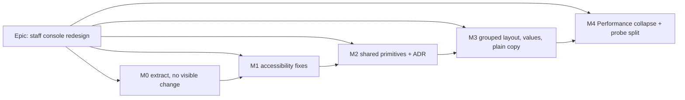

# Implementation Plan: Staff console redesign

- **Feature spec:** [`./feature-spec.md`](./feature-spec.md) — Approved 2026-10-06.
- **Status:** Approved — by the product owner, 2026-10-06 (AskUserQuestion): one page with an "On this page"
  jump list (not tabs); Performance folded away by default; a Refresh button with a note that each refresh is
  recorded; all five milestones M0–M4 approved. **Target displays (product owner, same answer):** "a phone is
  never a true screen size … this app [is] for my PC monitor and my Surface. Surface is probably the lowest
  cut-off display." So the design targets are the desktop monitor (1920×1080) and the Surface (about
  1368×912 CSS px); the phone-width success criteria below (SC-1, SC-10, SC-11) are re-baselined at
  1368×912 in M0, and phone-only remedies (folding table columns under the first cell below `md`) are
  dropped. **WCAG 2.2 AA reflow (SC 1.4.10, 320 CSS px at 400 % zoom) still applies** and is a merge
  requirement (CLAUDE.md §13): at narrow widths nothing may be lost or unusable, and a table scrolling
  inside its own labelled region is acceptable there. It is no longer a layout to design for.
- **Owner:** web

## Breakdown

### Epic

**Staff console redesign**: the `/staff` page grouped by task (Status → Conditions → This
installation → Tools → Record), in plain language, built from one set of panel shapes, with the
accessibility defects fixed. No API, schema or flag (ADR-0088 D1). Each milestone is its own commit
boundary, and that is the rollback.

**Model routing (CLAUDE.md §19.14):** builder (Sonnet) implements each task. Reviewers are Sonnet.
Switch the session to Sonnet after approval.

**Before M0:** rebase onto whatever the `staff-server-readings` worktree has landed (spec §0.18). Do not
run the two on the same files at once.

---

### Milestone M0: Structural extraction (no visible change)

**Outcome:** the screen is a feature component; each panel is its own file; `perf-probe` no longer
imports `features/staff`. Pixels, DOM and audit counts are unchanged, and that is the test.
**Entry point:** `Ships dark`: no user-facing change by design. The existing `/staff` journey proves
nothing regressed.
**Journey:** existing `e2e-staff/staff.spec.ts`, unchanged and green. No locator may change in M0.

#### Feature: Baseline measurements (ADR-0142)

> **Description:** take the "before" readings the success criteria need.
> **Complexity:** S · **Dependencies:** none · **Risks:** a reading depends on accumulated activity
> rows → seed a fresh database per sitting, the way ADR-0143's Consequences did.
> **Testing requirements:** none (measurement artefact).

##### Task M0-T1 — `m0-measurement.md`

- **Description:** using `apps/web/scripts/shoot.mjs` and a small script beside
  `measure-grid-tracks.mjs`, record at 320/390/1280/1646 px: page heights (rest, after diagnostics,
  after a probe check), overflow elements, the distinct sub-heading treatments (SC-2), status-row
  order per state, the number of polite announcements on load (count `aria-live` regions whose text
  changes within 5 s), and `staff.panel_read` rows per load and per reload. Also photograph `/staff`
  as non-staff beside `/no-such-path` (spec D-13). If they differ, file a register row and hand it to
  security-reviewer. **Do not fix it here.**
- **Complexity:** S
- **Dependencies:** none
- **Risks:** the screenshot set is from a dev server with SwiftShader → record the environment line;
  only compare heights, not frame rates.
- **Testing:** n/a
- **Development steps:** 1. write the script; 2. run it; 3. commit `docs/specs/staff-console-redesign/m0-measurement.md`.

#### Feature: Break the feature→feature imports, then move the screen

> **Description:** spec §0.3. Order matters: break `perf-probe → staff` **first**, or moving the
> screen creates a cycle.
> **Complexity:** M · **Dependencies:** M0-T1 · **Risks:** gates go vacuous when files move (§0.17) →
> each move updates its gate in the same commit and verifies it red (ADR-0110).
> **Testing requirements:** unit suites unchanged and green; the two structural gates updated and shown
> to fail against a planted violation; `e2e-staff` green.

##### Task M0-T2 — `StatusSection` (move `Panel`) and pass `apiVersion` as a prop

- **Description:** move `features/staff/ui/panel.tsx` to `components/ui/page/status-section.tsx` as
  `StatusSection`, with identical DOM. Export it from the barrel and update the count sentence
  (`components/ui/page/index.ts:10-14`). `PerformanceProbePanel` takes `apiVersion: string | null`.
  `LoadingProbeSection` takes it as a prop and drops `useStaffInstallation`
  (`loading-probe-section.tsx:23, 49-50`). Add `features/perf-probe/no-staff-import.structural.test.ts`:
  no file under `features/perf-probe` imports `@/features/staff`. Verify it red against the current
  tree before the fix.
- **Complexity:** S
- **Dependencies:** M0-T1
- **Risks:** the plan-loading section shows "unknown version" for a moment if the prop arrives later
  than the hook did → it is the same query and the same timing; assert in the section's test.
- **Testing:** `loading-probe-section.test.tsx` passes `apiVersion`; the new structural test; Panel's
  existing tests move with it.
- **Development steps:** 1. move + rename; 2. prop-thread; 3. gate red then green; 4. no changeset
  (no user-visible change).

##### Task M0-T3 — `StaffConsoleScreen` into the feature; one file per panel

- **Description:** `features/staff/ui/staff-console-screen.tsx` holds the root (six reads + status).
  `mail-panel.tsx`, `retention-panel.tsx`, `security-panel.tsx`, `accounts-panel.tsx`,
  `installation-panel.tsx` and `activity-panel.tsx` are moved **verbatim**. `MailAndRetentionPanel`
  stays as it is in M0. `routes/staff.tsx` becomes
  `export { StaffConsoleScreen } from '@/features/staff/ui/staff-console-screen'`, so
  `app/router.tsx:456`'s lazy import and its chunk are unchanged. Update
  `features/staff/archetypes.structural.test.ts` (`SURFACE` and the pinned `'/routes/staff.tsx'`
  assertion at `:29, :97`) to pin `staff-console-screen.tsx`.
- **Complexity:** M
- **Dependencies:** M0-T2
- **Risks:** a long docblock lost in the move → move comments with the code (they are the reasoning
  record); diff review with `--color-moved`. Chunk changes → compare `vite build` chunk names
  before/after (ADR-0171).
- **Testing:** the full web unit suite; `check-answers-its-link.test.tsx` still passes;
  `e2e-staff` unchanged and green; a DOM snapshot of `/staff` at M0-T1's recipe compared byte for
  byte (outside `useId` values).
- **Development steps:** 1. move; 2. re-export; 3. gate update + red check; 4. `pnpm prepush` +
  `scripts/e2e-local.sh web:staff`.

##### Task M0-T4 — `QueryPanel`, adopted with no visible change

- **Description:** `components/ui/page/query-panel.tsx`: `StatusSection` + pending/error/data, with a
  required `skeleton` prop and the `!isError` guard. Adopt it in Installation, Accounts and Activity,
  keeping today's `Spinner` passed as `skeleton` so nothing changes visually. Mail and Retention move
  over in M3, when they split.
- **Complexity:** M
- **Dependencies:** M0-T3
- **Risks:** the behaviour of "previous data visible while refetching" changes → in M0 keep today's
  semantics; the `placeholderData` behaviour lands in M3 with Refresh.
- **Testing:** unit tests for the three states, the stale-data-under-error rule (the ADR-0140 M4 case:
  error plus prior data shows **only** the error), and the skeleton slot.
- **Development steps:** 1. primitive + tests; 2. adopt at three sites; 3. archetype gate lists it.

#### M0 record (2026-10-06)

**Landed with no visible change.** What the next milestone needs:

- Baselines, the environment line and the measurement script are in [`m0-measurement.md`](./m0-measurement.md)
  and `apps/web/scripts/measure-staff-console.mjs` (re-run it for the M3 and M4 readings).
- **A real finding for the security-reviewer:** a non-staff member's `/staff` differs from `/no-such-path` in
  title, markup and picture, so ADR-0086's property does not hold on the web side. Filed as
  `docs/TECH_DEBT.md` #459, **not fixed here**. M1-T5 changes only the pending-identity title.
- **The 390 px transient overflow (M1-T5) reproduced**, and it is the probe overlay's Stop button
  (`right=399`), the same defect as M1-T4. There is no second cause.
- `routes/staff.tsx` is now a one-line re-export, so `app/router.tsx`'s lazy import and the `staff` chunk
  name are unchanged (build compared before and after: the same 43 asset names; the staff chunk 102.45 kB
  before, 102.18 kB after).
- DOM equality was checked, not assumed: a normalised `body` dump of `/staff` in the loaded, all-reads-fail
  and reads-held states, before and after, differs in two lines only, the order in which concurrently written
  audit rows were named ("6 panel reads - accounts, security" against the same six names in another order).
- **Gates moved with the files and each was shown failing.** `no-staff-import.structural.test.ts` (new) was
  red against the original tree, naming four files. `archetypes.structural.test.ts` now pins
  `staff-console-screen.tsx` and its `SURFACE` no longer lists the route file; a planted `<h2>` in the
  screen file fails it. `page-frame.structural.test.ts` lost its `routes/staff.tsx` exception (the console
  is now framed through `StatusSection`) and its resolver learned to follow a single-file import and a
  re-export route one hop, with a pinned case that fails without that. `page-container.structural.test.ts`
  re-keyed its width exception to the screen file (it failed first, 2 tests, when the screen moved).
- `PerformanceProbePanel` takes `apiVersion`; M4's split keeps that prop. `QueryPanel` is adopted by
  Installation, Accounts and Activity only. Activity passes a pending `DataTable` as its `skeleton`, so its
  loading shape is the table's own, as before.

---

### Milestone M1: Accessibility fixes (needed whatever the layout)

**Outcome:** the six verified defects (spec §0.5–0.10) are fixed, plus #458's gate.
**Entry point:** `/staff` → Unconfirmed accounts → **Show older** (name unchanged until M3); `/staff` →
Performance → **Check the probe works** (overlay); `/staff` → Diagnostics → **Copy for the record**.
**Journey:** new steps in `e2e-staff/staff.spec.ts` (each task below names its own).

**accessibility-reviewer runs before this milestone ships (ADR-0111):** it changes focus behaviour
(T1), shading (T2), live-region routing (T3) and the overlay's keyboard contract (T4).

#### Feature: Focus, shading, announcements, reflow

> **Description:** see tasks. **Complexity:** M overall · **Dependencies:** M0 ·
> **Risks:** jsdom cannot see focus loss through unmount or inert-tree announcements → each fix has a
> journey step in a real browser. **Testing requirements:** unit + journey + axe at 320 px.

##### Task M1-T1 — Accounts paging keeps focus and appends (US-7)

- **Description:** `useStaffAccounts` becomes `useInfiniteQuery` with key `['staff','accounts']`. The
  root reads page 1 for the summary (still one request on load). The panel renders accumulated rows,
  de-duplicated by `id`. The button stays mounted. While fetching it is shaded with "Loading more
  accounts…". At the end it is shaded with "All {n} are shown." (ADR-0145 D6; ADR-0082). The shown
  count is announced through `useAnnounce`. Label stays "Show older" until M3's copy pass.
- **Complexity:** M
- **Dependencies:** M0
- **Risks:** a cache key change breaks the summary/panel dedupe and doubles the audit rows → API e2e
  count stays at 6 per load (`apps/api/test/staff.e2e-spec.ts:272-284` pattern), plus a web unit test
  that counts `fetch` calls.
- **Testing:** unit (append, dedupe, end state); journey: seed more than one page of unverified
  accounts, press Show older, assert `document.activeElement` is still the button, the row count
  grew, and the first page's rows are still present.
- **Development steps:** 1. hook; 2. panel; 3. tests; 4. changeset (patch, web).

##### Task M1-T2 — #458: the resting-shading gate, then the staff sites

- **Description:** extend `components/ui/submit-guard.structural.test.ts` to every `<Button>` with
  `aria-disabled=`. Classify each as transient or resting from the bound expression, with a named
  exception list (#458 "Next"). Verify it red against the unfixed Diagnostics Copy (ADR-0110). Fix the
  staff-surface sites: Diagnostics Copy (`diagnostics-panel.tsx:112-117`), probe Show
  (`probe-sittings.tsx:432-438`), and visible shading on Retry recording
  (`performance-probe-panel.tsx:1104-1125`). Resting state: `aria-disabled:opacity-60`, **no**
  `pointer-events-none`; the handler guard refuses. Any non-staff resting site the gate finds goes in
  the exception list with a **new register row** and is **not fixed here** (spec §0.13: one is in the
  Gantt toolbar).
- **Complexity:** M
- **Dependencies:** M0
- **Risks:** the gate fires across the estate and balloons the PR → exceptions plus a row, not fixes.
- **Testing:** the gate is the test; unit tests that a click on a shaded control does nothing.
- **Development steps:** 1. gate red; 2. fix three sites; 3. exceptions + row; 4. close #458.

##### Task M1-T3 — Probe announcements reach the screen reader while `<main>` is inert

- **Description:** progress (at step boundaries only, "Step 2 of 4: whole-plan view") and the final
  verdict go through `useAnnounce()`. Its region renders outside `<main>`
  (`components/ui/announcer.tsx:22-27`). The panel's own status sentence stops carrying progress
  during a run.
- **Complexity:** S
- **Dependencies:** M0
- **Risks:** a double announcement when `inert` lifts → the panel region is written only after the run
  settles, and only if the text differs from the announced verdict.
- **Testing:** unit (announce called at step boundaries, not per frame); journey: start **Check the
  probe works**, read `[data-testid="announcer"]` text during the run and after it, and assert it is
  not inside `main[inert]`.
- **Development steps:** standard.

##### Task M1-T4 — Overlay at 320 px, name, Escape

- **Description:** the overlay root gets `role="region"` and `aria-label="Measurement in progress"`.
  Its bottom row gets `flex-wrap`. The button becomes **Stop**, with a visible line "Stopping keeps
  what is already measured." Escape triggers Stop (the same handler). The `/^Stop/` locators in the
  journey still match.
- **Complexity:** S
- **Dependencies:** M0
- **Risks:** Escape also closes something else → the overlay is the only thing open during a run (the
  confirm dialog has closed); add a test.
- **Testing:** journey at a 320×640 viewport: Stop's bounding box is inside the viewport; Escape
  stops; axe on the overlay.

##### Task M1-T5 — `StatGrid` wrap, document title, the 390 px transient overflow

- **Description:** `StatGrid` gets `min-w-0` + `wrap-anywhere` (§0.9; staff is the only consumer).
  The document title is `'SchedulePoint'` while identity is pending (`staff.tsx:90`; D-13 neutrality).
  Reproduce `390-07b`'s `right=399` button after confirming the probe check. Fix it if it reproduces.
  If it does not, record "not reproduced" in `m0-measurement.md`.
- **Complexity:** S
- **Dependencies:** M0
- **Risks:** a title flash for staff → acceptable and neutral.
- **Testing:** unit for the title; journey: axe + `scrollWidth <= clientWidth` at 320 px on `/staff`
  at rest.
- **Development steps:** standard; changeset (patch) covering M1.

#### M1 record (2026-10-06)

**Landed.** What the next milestone needs:

- **T1.** `useStaffAccounts()` is one `useInfiniteQuery` under `['staff','accounts']`; the root reads
  `pages[0]`, the panel accumulates and de-duplicates by id. The button stays mounted and is shaded
  ("Loading more accounts…", then "All {n} are shown."). A failed next page keeps the rows and reports beside
  the button; the summary ignores that error (`isFetchNextPageError`). Unit test counts `fetch` calls (one on
  load, one per press); the journey asserts focus stays in the section and the first page's rows remain.
  Red: against the per-cursor query the test fails (the button is swapped for a spinner).
- **T2.** `submit-guard.structural.test.ts` now reads every `<Button>` with `aria-disabled:pointer-events-none`
  and classifies its bound expression (every `||` term must name a transient fact). **Verified red** against the
  unfixed tree: it named 17 files, two of them staff (Diagnostics Copy, probe Show). Fixed: Copy, Show, and
  Retry recording (which had the attribute and no shading at all), by `aria-disabled:opacity-60` plus a
  cancelled hover fill, no `pointer-events-none`. The other 15 files are named exceptions (count and reason each)
  owned by **TECH_DEBT #460**; #458 is closed. No Gantt file changed, and the gate does not read the toolbar
  components, so `docs/specs/gantt-coarse-pointer/device-checklist.md` is unaffected.
- **T3.** Progress goes through `useAnnounce()` at each step boundary (`stepLabel`), and the verdict is
  announced once (`verdictFor`, the sentence the panel used to build inline). The panel's own region is empty
  during a run and while it would only repeat the announced verdict. Journey observes `[data-testid="announcer"]`
  outside `main[inert]` reading "Step 1 of 4". Four existing assertions that read the panel region for the
  verdict now read the announcer.
- **T4.** Overlay is `role="region"` named "Measurement in progress"; the row wraps; the button is **Stop** with a
  visible line and `aria-describedby`; Escape calls the same handler (a document `keydown` while running).
- **T5.** `StatGrid` items `min-w-0` and values `wrap-anywhere`. `useDocumentTitle` accepts `null` (sets nothing),
  so the console keeps the document's own `SchedulePoint` title while identity is pending (a widening of a shared
  hook, not of a component). **Not reproduced as a second cause:** the 390 px overflow was only the Stop button.
  The 320 px journey did find two more, both measured: the "Measure one thing" selects were as wide as their
  longest option (347 px; now `max-w-full min-w-0`), and the page scrolled sideways to 600 px because the
  sittings table's `sr-only` header and reason spans are `position: absolute` with no positioned ancestor, so in a
  wide table they escape the table's scroll region. `DataTable` now makes a `srHeader` header `relative` and
  `ShowSittingButton` wraps its reason in a `relative` box. Any other `sr-only` text inside a wide `DataTable` cell
  has the same property: M2-M4 should check `document.documentElement.scrollWidth` at 320 px after each panel
  moves (the journey's reflow assertion does).
- **For M2:** `CopyButton` should adopt the Copy sites' resting shading (opacity plus a cancelled hover fill); the
  hover-cancel pair is `aria-disabled:hover:bg-background aria-disabled:hover:text-foreground` and is
  outline-variant-specific. `verdictFor` is exported from `performance-probe-panel.tsx`.

#### M2 record (2026-10-06)

**Landed.** ADR-0178 filed (Proposed; accepted at M3's close) with its one §16 line, its `docs/adr/README.md`
row and a written exemption in `scripts/adr-coverage.json` (R1: an operator surface has no roadmap theme).
What the next milestone needs:

- **T1.** `HeadingLevelContext` (`page/heading-level.tsx`, default 2, type stops at `h4`). `SectionCard` reads it
  and gives its body `deeper(level)`; `CardTitle` accepts `level` 4. `SectionGroup` is an unnamed `<section>`
  (not a landmark) and the `h2`. `SubSection` takes its rank from context and now allows no children (a
  caption). `heading-level.test.tsx` renders a card outside any group and asserts the same DOM, and walks a
  grouped page for skipped levels. The staff archetype gate refuses `<h3>`/`<h4>`; **verified red** against the
  tree (named `diagnostics-panel.tsx`, `performance-probe-panel.tsx` x2, `loading-probe-section.tsx` x2). Fixed
  by `SubSection` at the first two; **`loading-probe-section.tsx` is a named exception with its count pinned**
  (its `h3` names the `<section>` through `aria-labelledby` and its result `h4` takes programmatic focus, which
  `SubSection` does not carry): **M4 resolves it** when it splits the panel.
- **T2.** `Disclosure` (`components/ui/disclosure.tsx`) with a required `collapsed`; `hidden` omits
  `aria-controls` while folded. `CoverageDisclosure` is a thin caller and its own tests pass unchanged.
  `ConditionStrip` renders `Alert purpose="condition"`, no bold lead-in.
- **T3.** `KeyValueList`, `Badge` `outline` (contrast pair asserted in the `page` scope only: `--card` is a reset
  outside every scope, so the all-scope matrix could not hold it), `DataTable` `Column.wrap`, `CopyButton`.
  **Four** staff-surface Copy sites, not five (diagnostics, probe "Copy full report", sittings, loading); the
  reason is visible text beside a shaded button. One wording: "Copied." / "Couldn’t copy. Select the text and copy
  it yourself." The `e2e-staff` assertion that read "Report copied." reads "Copied.". `CLIPBOARD_FAILED_SENTENCE`
  was removed with its last caller. `QueryPanel` gained optional `isFetching` (`aria-busy`, via a small `busy`
  widening of `SectionCard`/`StatusSection`); stale data is shown while a read is in flight and withheld the
  moment it fails (tested); `settledStatus` is documented as pure; the id-omitted branch is tested.
- **T4.** `formatRelative`/`exactInstant` moved to `lib/relative-time.ts` (the overview barrel re-exports them).
  The six `toLocale*` calls in `features/staff/ui` are now `formatTimestamp`; the three in `features/perf-probe`
  (`sitting-index.ts`, `probe-sittings.tsx` x2) are **not** touched and belong to M4's sittings work.
- **T5.** `COMPONENT_LIBRARY.md`, `DESIGN_SYSTEM.md` (Badge) and `UX_STANDARDS.md` (How-to-fix, non-sticky nav)
  updated; changeset (minor, web). `page-frame.structural.test.ts` now says `routes/staff.tsx` must stay a bare
  re-export. **Not yet done, owed before release:** accessibility-reviewer on `Disclosure`, `SectionGroup`,
  heading context, `SubSection`, `ConditionStrip`, `CopyButton`, and component-reviewer on each primitive.
- **For M3:** `StatusSection` announce-on-change (D-6) is **not** in M2 (it is a behaviour change, not a
  primitive). Nothing in `/staff` uses `SectionGroup`, `KeyValueList`, `ConditionStrip` or `Disclosure` yet; the
  first adopter is M3. `ConditionStrip`'s `howToFix` is `Disclosure collapsed="hidden"`, so its content is absent
  from the DOM until opened (a journey must press it before asserting `MAIL_SMTP_URL`).

#### M3 record (2026-10-06)

**Landed.** Readings are in [`m3-measurement.md`](./m3-measurement.md). What M4 needs:

- **T1.** The alerting flags come from one setting: `StaffHealthService` reads `config.mailAlertUrl !== undefined`
  for both `health.alertingConfigured` (`:87`) and `installation.mailAlertingConfigured` (`:274`), so the check was
  not a stop condition. Mail, Clearing old records and Alerts and monitoring are `QueryPanel`s; each check has its
  own `CHECK_SECTION_ID` and `check-answers-its-link.test.tsx` asserts no two share one.
- **T2.** `console-status.ts` carries a `value` per check, no severity sort, and the headline grammar of spec §4.9.
- **T3.** Groups (`SectionGroup`), `OnThisPage`, `ConsoleHeader` (freshness from the oldest of the six reads, Refresh,
  the audit note), `STAFF_PAGE_READS` (six keys by name, unit-tested to exclude diagnostics), `useRefreshStaffPageReads`
  (trims the accounts list to page 1 first so a Refresh is six reads). `StatusSection` gained `announce="change"` (the
  first settled sentence is plain text, only a later one is spoken) and `description`; `QueryPanel` and the Performance
  panel use it. One page sentence is spoken when all six reads settle, and one after a Refresh.
  **The six reads now live in `ConsoleBody`, below the identity gate.** They used to be called above it, so a non-staff
  caller's browser requested (and was refused and recorded for) each panel; that is gone, and is a behaviour change for
  the security-reviewer to confirm.
- **T4.** `model/panel-copy.ts` and `model/enum-copy.ts` hold the §4.9 strings. `copy.structural.test.ts` is the SC-9
  gate: it reads `features/staff/ui` and the copy modules, strips comments and `howToFix={...}` bodies, and was shown
  catching an env var, an ADR number and a SQL verb in a string and in JSX text (planted cases). Named exception:
  `diagnostics-report.ts` (the pasted record). `features/perf-probe/ui` is M4's.
- **T5, partly dropped.** The approval header dropped phone-only remedies, so **columns are not folded below `md`** on any
  table (staff or probe). Reflow at 320 px is met by the tables scrolling in their own region, and the journey asserts no
  sideways scroll and no axe violation at 320. Compact diagnostics (D-12) shipped: non-zero checks in full, the zeros
  behind one `Disclosure collapsed="hidden"` button, **Copy results** unchanged and still copying all.
- **Carry-forward.** "All N are shown." is plain muted text and takes focus when the press that reached the end removes
  the button. The journey presses **How to fix** before asserting a setting name (its body is not in the DOM until opened).
  No `Disclosure collapsed="described"` sits in a table cell. `loading-probe-section.tsx`'s two headings now read the
  heading context (the named exception in `archetypes.structural.test.ts` is gone). `SectionGroup`'s Back to top targets
  `#staff-top`, a focusable wrapper. A token-contrast test pins the info and error ink against the ghost trigger's hover
  fill. The outline `Badge` is still validated in the `page` scope only.
- **Journey.** This suite's server has a mail transport and no alert URL, so the condition acted on is **Alerts**
  (`MAIL_ALERT_URL`), not the plan's no-transport recipe (a second server configuration is a new Playwright config, an
  ADR-0105 trigger). The audit cost is read back by diffing the activity API (six plus the diff's own read).
- **ADR-0178 stays Proposed.** D-3 (Performance collapsed) is part of what it decides, so it is accepted at M4's close
  (M4-T3), not M3's as the M2 header said.
- **For M4.** SC-1 (3,468 px against at most 3,030) closes with the collapse; SC-2's third treatment is
  `Measure one thing`'s `summary`. The history read is already observed at the screen root (`useProbeResults` in
  `ConsoleBody`), so hoisting it into the panel root is a move, and an expanded Performance box makes no new request
  because the key is already mounted. The panel's `StatusSection` is `announce="change"`.

---

### Milestone M2: Shared primitives and the ADR

**Outcome:** the primitives in spec §4.6 exist, are tested, and are documented. `/staff` adopts the
ones that change nothing visible (CopyButton, `DataTable` `wrap`, `formatTimestamp`).
**Entry point:** `/staff` → Diagnostics → **Copy for the record** (now `CopyButton`).
**Journey:** existing diagnostics copy step (`staff.spec.ts:968`) asserts the unified "Copied." text.

**ADR filed here:** provisionally ADR-0178 (spec §4.8), Proposed, plus one line in CLAUDE.md §16
(`check:adr-coverage`). **component-reviewer** on every primitive. **accessibility-reviewer before
release** on `Disclosure`, `SectionGroup` / `SectionCard` heading context, `SubSection`,
`ConditionStrip`, `CopyButton` and `StatusSection` announce-on-change (ADR-0111).

#### Feature: Primitives

> **Complexity:** L overall · **Dependencies:** M1 · **Risks:** a `SectionCard` change alters 17
> other consumers → the default level stays 2, with a test rendering one consumer outside any group
> and asserting identical heading DOM; `Badge` outline needs a contrast census entry.
> **Testing requirements:** a unit suite per primitive; archetype gate updated; contrast census.

##### Task M2-T1 — `SectionGroup`, heading-level context, `SubSection`

- **Description:** context-derived rank (spec §4.6). `SectionCard` reads it, defaulting to 2. Extend the
  archetype gate's `HAND_ROLLED` with `<h3`/`<h4` on the staff surface.
- **Complexity:** M · **Dependencies:** M1 · **Risks:** a heading-level skip → a unit test walks the
  rendered tree. **Testing:** unit; gate red against `diagnostics-panel.tsx:180`'s hand-rolled `<h3>`.

##### Task M2-T2 — `Disclosure` (promote `CoverageDisclosure`'s mechanism), `ConditionStrip`

- **Description:** a required `collapsed: 'described' | 'hidden'`. `CoverageDisclosure` becomes a
  caller, and its tests keep passing unchanged.
- **Complexity:** M · **Dependencies:** M2-T1 · **Risks:** the ADR-0145 D5 regression (a description
  that resolves to nothing) → keep that suite's structural assertions; journey probe of the accessible
  description in M3.

##### Task M2-T3 — `KeyValueList`, `Badge` outline, `DataTable` `wrap`, `CopyButton`

- **Description:** spec §4.6. `CopyButton` adopted at the five staff sites, with a visible reason
  when shaded (§0.18a, low-contrast shaded Copy).
- **Complexity:** M · **Dependencies:** M2-T1 · **Risks:** `useClipboardCopy`'s announcement
  duplicated by the button's visible text → visible text has no live role (as today,
  `diagnostics-panel.tsx:132-141`).

##### Task M2-T4 — `lib/relative-time.ts`, console date formatter

- **Description:** move `formatRelative` / `exactInstant` (D-9); the overview barrel re-exports them.
  Replace the six `toLocale*` calls on the staff surface with `formatTimestamp` or the relative form.
- **Complexity:** S · **Dependencies:** none · **Testing:** existing `relative-time.test.ts` moves;
  overview and plan-lock imports compile unchanged.

##### Task M2-T5 — ADR + docs

- **Description:** file the ADR; update `DESIGN_SYSTEM.md`, `COMPONENT_LIBRARY.md`, `UX_STANDARDS.md`
  ("How to fix" rule; in-page nav rule); add a changeset (minor, web: new primitives).
- **Complexity:** S · **Dependencies:** T1–T4.

---

### Milestone M3: Grouped layout, values in the summary, plain-language copy

**Outcome:** the page the product owner sees changes. It has the five groups, the in-page nav,
freshness + Refresh, Mail and Clearing old records as two boxes, the new Alerts and monitoring box,
summary values in a fixed order, condition strips with How to fix, compact diagnostics, folded
columns on phones, and every string in spec §4.9.
**Entry point:** `/staff` → **On this page** nav; `/staff` → **Refresh**; `/staff` → Status row
**Mail delivery** → Mail box → **How to fix**.
**Journey (ADR-0081, required):** a new test, `a staff member reads the console by group and acts on a
condition`. Arrive (recipe: no transport, alerts off) → assert group headings in order → activate the
"Mail delivery" row → focus is on the Mail box → press **How to fix** → `aria-expanded="true"` and
`MAIL_SMTP_URL` visible → press **Refresh** → exactly six new `staff.panel_read` rows (read back through
the Staff activity table's grouped row "6 panel reads") → the header time changed → force one read to
500 → **Try again for all** appears → axe at 320 and 1280 px. Update the existing locators that name
"Mail and retention" / "Mail" / "Retention" / "Content-Security-Policy" (`staff.spec.ts:251-254, 295,
308`).

#### Feature: Layout and copy

> **Complexity:** L · **Dependencies:** M2 · **Risks:** see tasks · **Testing requirements:** unit
> copy tables; the SC-9 copy gate; the journey above; M0's measurement re-run (SC-1..SC-12 recorded in
> `m3-measurement.md`).

##### Task M3-T1 — Confirm the alerting source, then split Mail / Retention, add Alerts and monitoring

- **Description:** first confirm `health.alertingConfigured` and `installation.mailAlertingConfigured`
  come from the same setting (spec §0.12; read the two API services). If they differ, **stop and
  ask**. Otherwise build Mail, Clearing old records and Alerts and monitoring as `QueryPanel`s
  (D-2, D-8). Give each check its own `CHECK_SECTION_ID`. `check-answers-its-link.test.tsx` gains the
  "no two checks share a destination" assertion (SC-3).
- **Complexity:** M · **Dependencies:** M2
- **Risks:** a shared-query double error → intended (D-2); a test asserts one request on Try again.

##### Task M3-T2 — Status summary: values, fixed order, grammar, outline badge, Try again for all

- **Description:** `console-status.ts` gains `value` per check and a `sentenceFor` rewrite (spec §4.9
  headlines). The severity sort is removed (D-11). Update the module docblock that cites ADR-0143 D1.
- **Complexity:** M · **Dependencies:** M3-T1
- **Risks:** `console-status.test.ts` encodes the severity order → rewrite those cases deliberately;
  the ADR records the amendment.

##### Task M3-T3 — Groups, in-page nav, header freshness + Refresh, load announcement

- **Description:** D-1, D-5, D-6. Refresh resets accounts to page 1, then refetches the six named
  keys (a `STAFF_PAGE_READS` constant, unit-tested to exclude diagnostics). `model/freshness.ts`
  computes the oldest `dataUpdatedAt`. `StatusSection` uses announce-on-change; one load sentence goes
  through `useAnnounce`.
- **Complexity:** L · **Dependencies:** M3-T2
- **Risks:** Refresh fires the probe history and the Performance box flashes → `placeholderData` keeps
  the previous data with `aria-busy`. The audit cost is stated on screen (D-5).

##### Task M3-T4 — Copy pass, enum copy tables, the SC-9 gate

- **Description:** `model/panel-copy.ts` and `model/enum-copy.ts` hold every §4.9 string. Add a new
  structural test: no string literal in the staff surface (comments stripped, as the archetype gate
  does) matches `/ADR-\d|\bDELETE\b|[A-Z]{3,}_[A-Z_]{3,}/` outside a `HowToFix` child.
- **Complexity:** M · **Dependencies:** M3-T3
- **Risks:** the gate matches its own prose (four precedents, `archetypes.structural.test.ts:74-78`)
  → strip comments; verify red against today's `staff.tsx:589-593`.

##### Task M3-T5 — Narrow screens and compact diagnostics

- **Description:** fold columns below `md` on every staff table, including the probe tables (D-10).
  Compact diagnostics (D-12); Copy still copies all.
- **Complexity:** M · **Dependencies:** M3-T4
- **Risks:** the probe tables are owned by `perf-probe` → change `probe-sittings.tsx` columns only;
  the runner is untouched (`panel-imports.structural.test.ts` stays green).
- **Testing:** journey at 390 px: SC-11 (no element past the right edge with a sitting shown); SC-10
  height delta after Run diagnostics.
- **Development steps:** standard; changeset (minor, web: visible redesign).

**Review before M3 ships:** ux-reviewer, accessibility-reviewer, component-reviewer,
performance-reviewer (route chunk size), security-reviewer (audit count and that no new read path
exists).

---

### Milestone M4: Performance collapsed, and the probe panel split

**Outcome:** Performance is collapsed at rest with a one-line last reading. The probe's oversized
files are split. "REPORTED, NOT GRADED" becomes a tag.
**Entry point:** `/staff` → Performance → **Open performance tools**.
**Journey:** a new step in `a staff member takes every reading in one press` (`staff.spec.ts:730`):
arrive → Performance shows the summary line and `aria-expanded="false"` → open → **no** new
`GET /staff/probe-results` (count requests with `page.on('request')`) → existing steps continue.
Plus `/staff#performance` opens and focuses the box.

#### Feature: Collapse and split

> **Complexity:** L · **Dependencies:** M3 · **Risks:** the history observer remounting writes an
> audit row (§0.16) → hoist it to the panel root and assert with the request counter; the
> runner-import gate goes vacuous after the split → the gate reads the new filenames and is verified
> red. **Testing requirements:** the existing 1,066-line panel suite still green after the split; the
> journey above.

##### Task M4-T1 — Collapse (D-3)

- **Description:** `Disclosure collapsed="hidden"`; summary line from the hoisted history query; Hide
  is shaded during a run.
- **Complexity:** M · **Dependencies:** M3

##### Task M4-T2 — Split `performance-probe-panel.tsx` (1,207 lines) and extract `useProbeSweep`

- **Description:** shell / controls / sitting result, as in spec §4.6. Update
  `panel-imports.structural.test.ts:18` to read every split file.
- **Complexity:** L · **Dependencies:** M4-T1
- **Risks:** behaviour drift → a pure move with the suite unchanged, then a separate commit for any
  tidy-up.

##### Task M4-T3 — Probe hierarchy and copy

- **Description:** the verdict tag at `Badge` scale; `SubSection` for "Plan loading" / "All sittings"
  (`loading-probe-section.tsx:168, 252`, `probe-sittings.tsx:380, 566`,
  `performance-probe-panel.tsx:934, 1048`); expanded-intro copy from §4.9. Accept the ADR at the
  milestone's close and run the reconciliation check of CLAUDE.md §16.
- **Complexity:** M · **Dependencies:** M4-T2 · changeset (patch).

---

## Sequencing & slices

M0 → M1 → M2 → M3 → M4, one PR per task where marked, each releasable. M1 can ship before any
visible redesign, which is the point: the accessibility defects do not wait for the layout. M2 adds
primitives that `/staff` adopts only where nothing visible changes. M3 is the one visible change. M4
can be deferred without leaving the page worse than M3 left it. **No feature flag** (ADR-0088 D1). The
rollback is the commit boundary.

## Definition of Done (per task)

The Feature Completion Criteria in [`docs/PROCESS.md`](../../PROCESS.md): `pnpm prepush` run, plus
`scripts/e2e-local.sh web:staff` for every task touching `/staff`, and `scripts/e2e-local.sh api` for
M1-T1 (its audit-count assertion). Changesets as noted. ADR line in §16 at M2.

## Risks & assumptions (rollup)

| Risk / assumption                                                                                               | Likelihood | Impact                                       | Mitigation                                                                                     |
| --------------------------------------------------------------------------------------------------------------- | ---------- | -------------------------------------------- | ---------------------------------------------------------------------------------------------- |
| Audited reads rise unnoticed (summary/panel dedupe broken, remount after 30 s staleness, Refresh over-fetching) | med        | high (rows that cannot be deleted, ADR-0072) | request-count asserts in unit + journey; API e2e count; `STAFF_PAGE_READS` constant            |
| A structural gate goes vacuous after a move or split                                                            | med        | med                                          | each gate updated in the same commit and verified red (ADR-0110)                               |
| `SectionCard` context change alters other screens                                                               | low        | med                                          | default 2; DOM-equality test on a non-staff consumer                                           |
| Inert-tree announcement claim is wrong in a direction that matters                                              | low        | low                                          | M1-T3's journey observes the announcer region; the fix is harmless if the original also worked |
| #458 gate finds many estate sites                                                                               | med        | low                                          | exception list + register row; not fixed here                                                  |
| Collision with the `staff-server-readings` worktree                                                             | med        | med                                          | rebase before M0; sequential, not parallel                                                     |
| Alerting flags come from different settings (§0.12)                                                             | low        | med                                          | M3-T1 checks first and stops if so                                                             |
| Non-staff "Not found" already differs from a real 404 (a tell)                                                  | unknown    | med (security)                               | M0-T1 photographs both; security-reviewer; separate row                                        |
| Product owner prefers tabs or an expanded Performance box                                                       | low        | med                                          | Q1/Q2 asked before M3; M0–M2 are unaffected by either answer                                   |

## Critical questions for the product owner (plain language)

1. **Should the console stay one long page with a "jump to" list at the top, or be split into tabs?**
   Recommended: **one page with a jump list.** Tabs would hide problems behind a click.
2. **Should the performance-measuring tools be folded away until you open them?** They take about a
   third of the page today. Recommended: **yes, folded**, with one line showing the last reading.
3. **A "Refresh" button re-reads everything. Each press adds a line to the staff activity record
   (the same as reloading the page does today). Is that OK?** Recommended: **yes**, with a note
   beside the button saying so.
4. **Should technical setting names (like `MAIL_ALERT_URL`) appear only under a "How to fix" button,
   not in the main text?** Recommended: **yes.** The main text says what is wrong in plain words, and
   "How to fix" gives the exact step for whoever runs the server.
