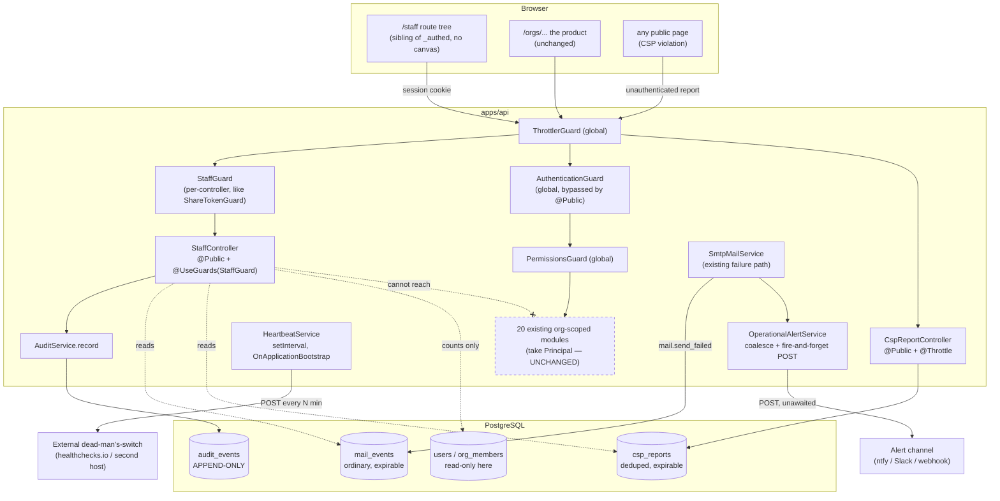
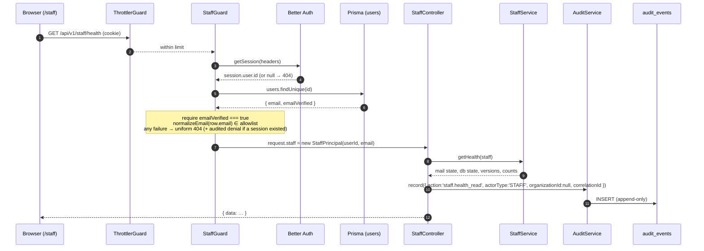
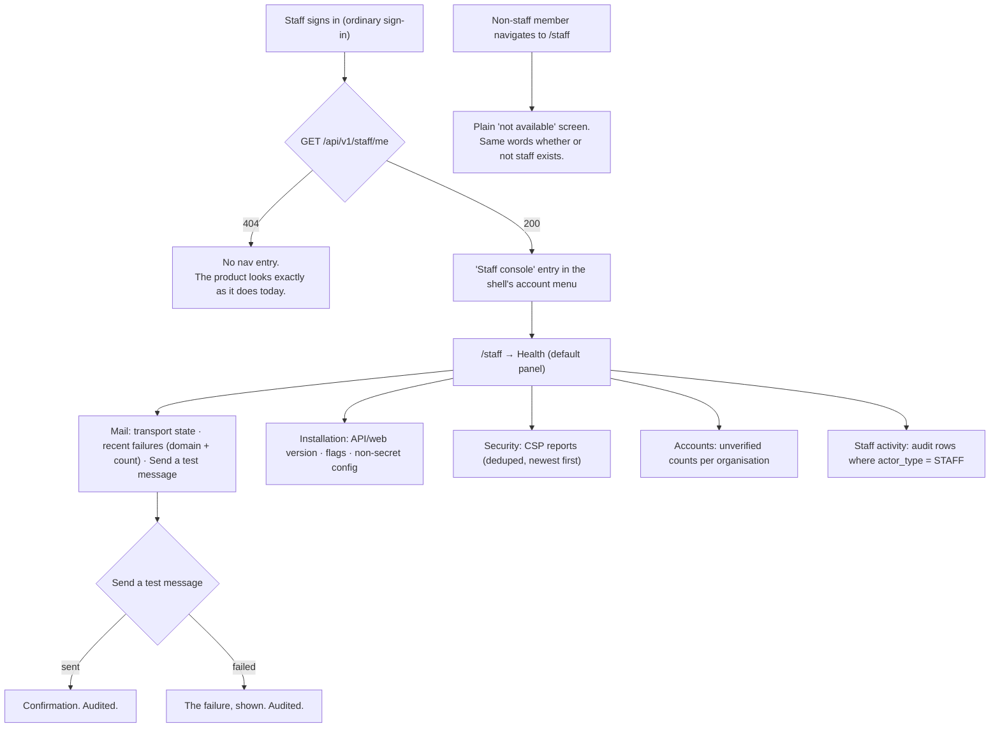

# Feature Spec: SchedulePoint staff console

- **Status:** **Approved 2026-08-09** (docs/PROCESS.md stages 1–4). All four critical questions are
  answered below; three took the proposed default and **CQ-1 did not**.
- **Author(s):** feature-analyst (Product Owner / Solution Architect / Technical Lead hats)
- **Date:** 2026-08-09
- **Tracking issue / epic:** _(to be created on approval)_
- **Roadmap link:** operations & supportability (new theme; `docs/ROADMAP.md` has none today)
- **Related ADR(s):** **ADR-0086 required** (next free number — `docs/adr/` ends at
  `0085-privacy-operations.md`, and `docs/adr/README.md:111` is the last row). Builds on
  ADR-0012/0016 (RBAC + tenancy), ADR-0051 (the structurally-distinct principal precedent),
  ADR-0072/0073 (the audit log and its coverage rule), ADR-0074 (a client surface whose gate is a
  server fact is branched on runtime evidence), ADR-0075 (mail is best-effort), ADR-0085 (erasure).
  **Supersedes most of `docs/specs/operational-self-service/`** — see §4.8.

> **Origin.** The product owner asked (2026-08-09) whether to build "a super god user" to control the
> application, motivated by wanting "email down alerts and the like", and offered staff the canvas
> "if it's easier". Four decisions were then taken and are **settled inputs, not open questions**:
> operate-the-installation scope only with no customer plan data; mail/liveness alerting folds into
> this epic; a full spec + plan; and provisioning by an env-var allowlist of email addresses.

---

## 0. The evidence this spec rests on

Per CLAUDE.md §19.9 / ADR-0076, the decision-bearing claims name what was **read or run**. The brief
that started this work carried each of these; each was re-checked against the code, because a claim
inherited from a brief is checked like any other (ADR-0076 §19.9, and both recorded failures of that
rule entered through a brief).

| Claim                                                                   | Verified against                                                                                                                                                        | Result                                                                                                                                                                    |
| ----------------------------------------------------------------------- | ----------------------------------------------------------------------------------------------------------------------------------------------------------------------- | ------------------------------------------------------------------------------------------------------------------------------------------------------------------------- |
| There is no global principal; every role is organisation-scoped         | `apps/api/src/common/auth/principal.ts:26-31`, `:39-44`, `:76-89`                                                                                                       | **Confirmed.** `OrganizationRole` is `VIEWER \| CONTRIBUTOR \| PLANNER \| ORG_ADMIN`; `Principal` carries `userId` + `memberships`; `can()` requires an `organizationId`. |
| `GuestPrincipal` is the structurally-distinct-principal precedent       | `apps/api/src/common/auth/guest-principal.ts:1-29`                                                                                                                      | **Confirmed**, and its own docblock states the property: "a guest reaching a member surface is a **compile error**, not a runtime check we could forget."                 |
| Its guard + consumer shape                                              | `apps/api/src/modules/share/share-token.guard.ts:40-66`; `share-guest.controller.ts:61-82`; `common/auth/authenticated-request.ts:11-18`                                | **Confirmed.** `@Public()` + `@UseGuards(ShareTokenGuard)`, a separate `GuestRequest` interface, `@CurrentGuest()`, uniform 404.                                          |
| A staff actor is one enum label away                                    | `apps/api/prisma/schema.prisma:2593-2600`                                                                                                                               | **Confirmed.** `enum AuditActorType { USER GUEST SYSTEM ANONYMOUS }`.                                                                                                     |
| An org-less action already records cleanly                              | `apps/api/prisma/schema.prisma:2635` (`organizationId String?`), `:2643` (`actorUserId String?`, no FK — stated at `:2621-2625`)                                        | **Confirmed.**                                                                                                                                                            |
| Postgres needs **two** migrations to add an enum label and then use it  | `apps/api/prisma/schema.prisma:2636-2638` states the rule for `action`; ADR-0053 M3 paid the toll                                                                       | **Confirmed** as a repository constraint.                                                                                                                                 |
| 20 API modules, every one organisation-scoped                           | `apps/api/src/modules/*/*.module.ts` → 20 files; `app.module.ts:109-127`                                                                                                | **Confirmed** (20 modules; `MeModule` is the only one whose routes carry no `:orgSlug`).                                                                                  |
| `audit_events` is append-only **in the database**                       | `apps/api/prisma/schema.prisma:2611-2631` docblock; ADR-0072                                                                                                            | **Confirmed** as documented; the triggers themselves live in the migration.                                                                                               |
| The route census forces classification but **does not forbid** auditing | `apps/api/src/modules/audit/audit-coverage.structural.spec.ts:329-441` — six assertions, all of the form "must audit"                                                   | **Confirmed.** Nothing prevents auditing a read. This is load-bearing for §2.6.                                                                                           |
| Email normalisation is `toLowerCase()` and **nothing else**             | `apps/api/src/common/auth/normalize-email.ts:20-22` and its docblock (`:11-16` explains why trimming would be a defect)                                                 | **Confirmed.**                                                                                                                                                            |
| `users.emailVerified` exists and is authoritative                       | `apps/api/src/modules/me/dto/me-response.dto.ts:25`; `modules/invitations/invitations.service.ts:231`                                                                   | **Confirmed.**                                                                                                                                                            |
| A memberless account is already a valid, fully-denied session           | `common/auth/auth-context.service.ts:39-59` (returns a `Principal` with an empty `memberships` array) + `principal.ts:76-80` (`can()` returns false with no membership) | **Confirmed.** This is what makes a dedicated staff account possible today with no code change.                                                                           |
| `CSP_POLICY` carries no report directives                               | `docker-compose.yml:108`, `docker-compose.release.yml:145`                                                                                                              | **Confirmed** — neither `report-uri`, `report-to` nor `Reporting-Endpoints`.                                                                                              |
| The only mail failure signal is a log line                              | `apps/api/src/common/mail/smtp-mail.service.ts:26` (`MAIL_SEND_FAILED`), emitted at `:153`, `:199`, `:230`, `:259`                                                      | **Confirmed.** Four emission sites, three kinds plus `abandoned: true`.                                                                                                   |
| Nothing evaluates that signal                                           | `docs/TECH_DEBT.md:1163-1172` (#100's chain-of-custody table) and `scripts/watch-mail-failures.sh`                                                                      | **Confirmed**, and #100 is explicitly **open on the operator half**: the cron exists in the repo, the cron line does not exist on the host.                               |
| There is no scheduler dependency                                        | `apps/api/package.json:26-49` — no `@nestjs/schedule`, no `bullmq`, no `ioredis`                                                                                        | **Confirmed.** A heartbeat must use a lifecycle hook + `setInterval` (the `MailBootstrapService` precedent, `mail-bootstrap.service.ts:53-60`).                           |
| The web already registers a session-less sibling of `_authed`           | `apps/web/src/app/router.tsx:333-348` (`/share`), `:430-463` (the tree)                                                                                                 | **Confirmed** — the route-tree precedent this epic follows.                                                                                                               |
| A `VITE_` constant cannot gate a server-side condition                  | `apps/web/src/app/router.tsx:384-397` (the `verify-email` route's own docblock), ADR-0074                                                                               | **Confirmed**, including the typecheck hole: `...(FLAG ? [route] : [])` widens the tree type in **both** branches.                                                        |

**Not verified, and marked as such:** whether the product owner's account currently holds an
organisation membership. This spec cannot read the deployed database. It is treated as **very likely
true** (he is the sole user of a running installation and every screen requires an organisation), and
§4.4 is designed so the answer does not change the security model either way.

---

## 1. Business understanding

### Problem

**Every staff operation on this product happens over `psql` on the host, and every one of them is
completely unaudited.**

That sentence is the whole argument, and it is worth stating precisely because the instinct on
reading "super god user" is that a staff console _adds_ privilege. It does not. The privilege already
exists — it is exercised today by a person with a shell, and the shell sits **outside** every control
this product has built:

- `audit_events` is append-only in the database, enforced by `BEFORE UPDATE OR DELETE` and
  `BEFORE TRUNCATE` triggers declared `ENABLE ALWAYS` so the application role cannot bypass them
  (ADR-0072). A person with the **superuser** role, or with `ALTER TABLE ... DISABLE TRIGGER`, is not
  the application role. More simply: nothing anywhere records that they connected at all.
- The three-step CSP runbook, the verification backfill, the "who has not verified?" query, "is the
  relay working?" and "which release is actually running?" are all done by hand, by one person, with
  no record of who did what or when.

So the most privileged operations in the product are the only ones with **no record of who performed
them**. Moving them into the application makes them observable for the first time. This epic is a
security **improvement** over the status quo, and that framing decides its non-negotiable
requirement: **every staff action is audited, including reads** (§2.6).

Alongside that, three concrete operational facts are unknowable without a shell, and two of them
recur (this half is inherited from `docs/specs/operational-self-service/`, whose analysis is sound and
whose conclusion this spec overturns — §4.8):

1. **Whether mail is actually sending.** The API emits one alertable record,
   `event: 'mail.send_failed'` (`smtp-mail.service.ts:26`). Nothing receives it.
   `docs/TECH_DEBT.md:1163-1172` walks the chain of custody link by link and finds it broken at
   "logs leave the host", "anything evaluates a rule" and "a human is notified". A broken relay
   therefore means every sign-up, invitation and password reset fails **silently**, for every
   organisation, and the first signal is a person who cannot get in telling somebody.
2. **Whether the Content-Security-Policy is safe to enforce.** `CSP_POLICY` carries no report
   directives (`docker-compose.yml:108`), so a violation exists only in whichever browser console
   happens to be open. ADR-0074 records that the one violation found this way was found _in
   production, after release_, by a person watching a console.
3. **What the installation currently is** — which image is running, which flags are on, how many
   accounts are stuck unverified. All `psql`, `docker ps`, or reading a compose file.

### Users

**One persona, and it is deliberately narrow.**

- **SchedulePoint staff** — an employee of SchedulePoint operating the installation. Today: the
  product owner. Provisioned by an env-var allowlist of email addresses (`STAFF_EMAILS`), a settled
  input. Staff is **not** an organisation role and confers **no** capability inside any organisation.

Explicitly **not** users of this feature: Org Admins, Planners, Contributors, Viewers and External
Guests. Nothing in the console is reachable by any of them, and nothing in the console changes what
any of them can do.

### Primary use cases

1. Be told, without watching anything, that mail has stopped working — before the first person who
   cannot get in tells somebody.
2. Answer "is the installation healthy right now?" — mail transport, database, recent failures — from
   a screen instead of a shell.
3. Enforce a CSP change **knowing** what it will break, from evidence collected by real browsers over
   a report-only window rather than from one walkthrough.
4. Answer "what is actually deployed?" — image version, API and web versions, which feature flags are
   on, how many accounts cannot sign in.
5. Have a record of what staff did, so the most privileged actions in the product stop being the only
   unrecorded ones.

### User journeys

**Happy path — the alert (no console involved).** The relay's credential expires overnight. The next
invitation fails; `SmtpMailService` logs `mail.send_failed`; the new `OperationalAlertService`
coalesces and POSTs one message to the configured channel ("SchedulePoint: 3 mail send failures in
the last 10 minutes"). The product owner sees it on his phone. **This is the milestone that serves
the stated motivation, and it needs no staff principal at all** — which is why it ships first.

**Happy path — the console.** The product owner signs in with his ordinary account. Because his
address is in `STAFF_EMAILS` and his account is verified, the app shell renders a **Staff console**
entry (derived from a live `GET /api/v1/staff/me`, never from a build-time flag). He opens `/staff`,
lands on **Health**, and sees: mail transport verified at boot 6 hours ago, 3 failed sends in the
last 24 hours all to `@acme.co`, database reachable, API `v0.47.1`, web `v0.62.0`, 14 flags on, 2
accounts unverified. He presses **Send a test message**, receives it, and knows the relay is back.
Every one of those reads, and the test send, is now a row in `audit_events` with
`actor_type = 'STAFF'`.

**Alternate — a non-staff visitor.** Any signed-in member who navigates to `/staff` sees a screen
saying the console is not available to them; the API answers every `/api/v1/staff/*` route with a
uniform **404**, never 403, so the surface is no oracle for whether staff exists at all (the
`ShareTokenGuard` precedent, `share-token.guard.ts:76-79`). The **denial is audited**.

**Alternate — no staff configured.** `STAFF_EMAILS` is unset (the default, and the state of every
developer machine and every CI run). No account can ever resolve to staff, every staff route 404s, no
nav entry renders. This is the rollback contract — see §4.9.

### Expected outcomes

- A broken relay produces an alert instead of a silence, within minutes rather than when a user
  complains.
- The six-surface CSP walk stops being the mechanism by which violations are discovered.
- The most privileged operations in the product become the **best**-recorded ones instead of the only
  unrecorded ones.
- A support or operations question is answered from a screen, by someone who does not need — and in
  future need not have — database credentials.

### Success criteria

- Stopping the SMTP container produces an alert in the configured channel within one coalescing
  window (default 10 minutes), measured by doing it.
- A deliberately-introduced CSP violation on any of the six public surfaces appears in the staff CSP
  list without anyone having had a console open.
- Every route under `/api/v1/staff/` appears in `AUDITED_ROUTES`, enforced by a **new positive census
  assertion** (§2.6) rather than by discipline.
- A signed-in non-staff member receives 404 on every staff route, and the attempt is recorded with
  `outcome: 'DENIED'` — proved by an API e2e test.
- **`StaffPrincipal` cannot reach a member service**, proved by a structural test and by the type
  system (§4.3).

### What this feature does **not** solve — stated plainly

**An application cannot alert that it is down.** The stated motivation was "email down alerts", and
this epic serves **one half** of it honestly and the other half not at all:

| Failure                                                        | Covered by this epic?                                                                                      |
| -------------------------------------------------------------- | ---------------------------------------------------------------------------------------------------------- |
| The relay refuses, times out, or authenticates and then fails  | ✅ M1 alerting, and M3's Health screen                                                                     |
| A message is accepted (250 OK) and then bounces asynchronously | ❌ Nothing here sees a bounce. Needs an inbound bounce webhook.                                            |
| The API process has died / the container is not running        | ⚠️ **Only** by the M1-T3 heartbeat's _absence_, and only if something outside is watching for that absence |
| The host is down or off the network                            | ❌ Structurally impossible for the application to report                                                   |
| The database is unreachable                                    | ⚠️ `/health/ready` already reports it (`health.controller.ts:34-39`) — to whoever asks. Nothing asks.      |

The one thing an application **can** do about its own liveness is stop saying it is alive. M1-T3
therefore ships an optional **heartbeat**: a periodic outbound POST to `HEARTBEAT_URL`, so an
external dead-man's-switch (healthchecks.io, Uptime Kuma on another machine, a cron on a second host)
alerts on its _absence_. The alerting still lives outside, and this spec does not pretend otherwise.

**`scripts/watch-mail-failures.sh` therefore does not go away, and neither does it stay as it is.**
Its mail-failure half becomes redundant the day M1 ships and should be **retired** to avoid two
alerts for one fault; its `docker logs` failure branch (`watch-mail-failures.sh:59-65`) covers "the
container is not running", which this epic cannot. The recommendation is to replace the script with
the external heartbeat check, because the script runs **on the same host** and so cannot report a
host outage either — it is a weaker instrument than the thing that replaces it. Decision recorded in
M1-T4; `docs/TECH_DEBT.md` #100's operator half closes when the heartbeat is wired, not before.

### Critical questions — all four answered 2026-08-09

The four below were the ones that changed design or scope; everything else has a stated default in
§4.10 and was never a question. **All four are now decided by the product owner and are inputs, not
options.** Three took the proposed default. **One did not, and that one is written up at length,
because a decision that overrides its own recommendation is exactly the decision a later reader will
assume was an oversight.**

- **CQ-1 — Does a staff screen ever render a person's email address? → YES, wherever it helps
  support.** The proposal was **no** (domains, counts and correlation ids only, with the full address
  reachable by `psql`); it was **overruled**, and the reasoning that lost is preserved rather than
  deleted so the trade is legible: three surfaces want an address — a failed send's recipient, an
  unverified account, an audited actor label — and all three belong to a **customer's** people, so
  showing them widens what a staff session exposes beyond "operate the installation".

  What the decision changes, concretely: `mail_events` stores the **full recipient address**, not
  `recipient_domain`; M3's Health panel may render it; M5's Accounts panel may list unverified
  members by address rather than by count.

  **Three consequences that are now requirements rather than observations**, because this is the one
  place the epic's own boundary moved:

  1. **`mail_events` is an ordinary table and that is now load-bearing, not incidental.** It is
     updatable and expirable, so ADR-0085's erasure path reaches it — a tombstoned user's address can
     actually be scrubbed here. Had this been modelled on `audit_events` (the reflex M1-T1 already
     warns against) the same decision would have written customer addresses into a table that refuses
     `UPDATE` **and** `DELETE`, permanently, which ADR-0085 D3 spent a whole decision avoiding for one
     column. The migration comment must say this in these terms.
  2. **It inherits ADR-0085 D3's retention**, and for the same reason: an address held about a person
     is bounded by time or it is held forever. Twelve months, matching the `auth.*` `subject_label`
     period set on 2026-08-09 — one number, not two, because two periods for the same class of data
     is a question nobody can answer later.
  3. **Reading one is an audited act.** §2.6 already requires every staff route to be audited
     including reads; this decision is why that requirement is not merely tidy. The audit row records
     that a staff member read a panel, never the address they saw — auditing PII into the append-only
     table would recreate consequence (1) through the back door.

- **CQ-2 — Dual-hatted account? → Permitted and warned, never refused** (the proposed default).
  Refusing would lock the only staff member out of the console on day one, and the security argument
  never needed refusal: staff-ness confers no organisation capability by construction (§4.4). So
  `docs/DEPLOYMENT.md` **recommends** a dedicated account rather than requiring one, the boot check
  logs `warn` rather than refusing to boot, and the console carries a banner naming which hat is
  active — the one thing a dual-hatted session should always say.

- **CQ-3 — Any write in v1? → Exactly one: "send a test message"** (the proposed default), addressed
  only to the requesting staff member's own verified address. The recipient is **not a parameter**,
  so it cannot be used as a relay — a structural property, not a validation rule. Every other staff
  surface is a read.

- **CQ-4 — What watches the heartbeat? → Nothing yet; build it anyway, dormant.** The proposal was a
  free healthchecks.io check, and the stated fallback was to **drop** M1-T3 rather than ship a signal
  nobody receives (`docs/TECH_DEBT.md` #100). The product owner chose to build it and wire the
  receiver later, which is a defensible third answer the spec had not offered — but it only stays
  defensible if the dormancy is real, so it becomes a requirement: **with `HEARTBEAT_URL` absent, no
  timer is created at all**, asserted by a unit test rather than assumed. And #100's operator half
  **stays open** until an external check exists; merging M1-T3 does not close it, and M1-T4 must not
  say it does.

---

## 2. Functional requirements

### 2.1 User stories & acceptance criteria

> **US-1** — As **staff**, I want the API to tell me when mail stops working, so that I find out
> before a user does.
>
> **Acceptance criteria**
>
> - **Given** `MAIL_ALERT_URL` is configured **when** a send fails **then** exactly one POST is made
>   to that URL within the coalescing window, naming the failure count, the window and the message
>   kinds — **and never a recipient address** (CQ-1).
> - **Given** the relay is broken and ten sends fail in one minute **when** the window elapses
>   **then** **one** alert is sent, not ten.
> - **Given** the alert URL is itself unreachable **when** a send fails **then** the failure is logged
>   and **no request is delayed or failed** — the alert is fire-and-forget, never awaited.
> - **Given** `MAIL_ALERT_URL` is unset **then** behaviour is byte-identical to today: the log line,
>   and nothing else.
> - **Given** a send fails **then** a `mail_events` row is written recording the kind, the instant,
>   the error class, the **full recipient address** (CQ-1) and the correlation id.

> **US-2** — As **staff**, I want an external service to notice if the API stops running, so that
> "the app is down" is not something I learn from a customer.
>
> - **Given** `HEARTBEAT_URL` is configured **when** the API is running **then** it POSTs to that URL
>   every `HEARTBEAT_INTERVAL_MINUTES` (default 5).
> - **Given** the API stops **then** the pings stop, and the **external** watcher alerts. The
>   application makes no claim to alert on its own death.
> - **Given** the heartbeat URL is unreachable **then** the failure is logged at `warn` and the API is
>   unaffected — it is never part of `/health/ready` (the `MailBootstrapService` rule,
>   `mail-bootstrap.service.ts:42-47`: the host recreates containers unattended, so a probe that
>   failed on a 03:00 blip would take the product down and keep it down).

> **US-3** — As **staff**, I want to know whether my account is staff, so that the client can decide
> what to render without guessing.
>
> - **Given** my address is in `STAFF_EMAILS` **and** my account is verified **when** I `GET
/api/v1/staff/me` **then** I receive my staff identity.
> - **Given** any of those is false **then** I receive **404** — never 403, never 401 with a
>   distinguishing message.
> - **Given** `STAFF_EMAILS` is unset **then** every caller receives 404.
> - **Given** I am not signed in at all **then** I receive 404 (the same answer, so the route reveals
>   nothing to an anonymous prober either).

> **US-4** — As **staff**, I want one screen showing whether the installation is healthy, so that I
> stop opening a shell to find out.
>
> - **Given** I am staff **when** I open `/staff` **then** I see mail transport state, recent mail
>   failures, database reachability, API and web versions, and unverified-account counts.
> - **Given** I am not staff **when** I open `/staff` **then** I see a plain "not available" screen —
>   no redirect loop, no blank page, and nothing that distinguishes "there is no such console" from
>   "you may not use it".
> - **Given** the mail transport was never configured **then** the panel says so, as a deployment
>   state rather than a fault (the `MailBootstrapService` rule, `mail-bootstrap.service.ts:61-64`).

> **US-5** — As **staff**, I want to send myself a test message, so that I can confirm the relay is
> working without waiting for a user to sign up. _(CQ-3)_
>
> - **Given** I am staff **when** I press **Send a test message** **then** a message is sent **to my
>   own verified address only** — the recipient is not a request parameter.
> - **Given** the send fails **then** I am shown the failure. This is the one place a mail failure is
>   surfaced to a caller, and it is safe precisely because the caller is staff and the recipient is
>   themselves — the ADR-0075 enumeration argument does not apply to an authenticated, allowlisted
>   endpoint with a fixed recipient.
> - The action is rate-limited to a handful per hour and is audited as `staff.test_mail_sent`.

> **US-6** — As **staff**, I want to see CSP violations reported by real browsers, so that I can
> enforce a policy change from evidence.
>
> - **Given** the policy carries report directives **when** a browser blocks a resource **then** a
>   report reaches `POST /api/v1/csp-report` and is stored, **deduplicated** on
>   `(effective_directive, blocked_uri, document_uri)` with a count and first/last-seen instants.
> - **Given** ten thousand identical violations **then** the table holds **one** row with
>   `count = 10000`.
> - The endpoint is `@Public()` by necessity (browsers do not authenticate reports), rate-limited,
>   body-capped, and **always answers 204** whatever the body — an error response tells a prober their
>   probe was interesting, and there is no caller to inform.
> - Reports are untrusted input and are **never** rendered as HTML.

> **US-7** — As **staff**, I want to know what is actually deployed, so that "which version has this
> fix?" is not answered by reading a compose file.
>
> - **Given** I am staff **when** I open the Installation panel **then** I see the API version, the
>   web version, the effective feature-flag state and the non-secret configuration.
> - **Given** any configuration value is or contains a credential **then** it is **absent from the
>   response**, not masked in the client — an allow-list, so a future variable cannot arrive by
>   accident (the `smtpEndpoint` rule, `mail-bootstrap.service.ts:14-24`).

> **US-8** — As a **security reviewer / the product owner**, I want every staff action recorded, so
> that the console is a net improvement on a shell.
>
> - **Given** any staff route is called successfully **then** an `audit_events` row exists with
>   `actor_type = 'STAFF'`, `organization_id = NULL`, and the correlation id of the request.
> - **Given** a non-staff session calls a staff route **then** a row exists with
>   `outcome = 'DENIED'`.
> - **Given** a new route is added under `/api/v1/staff/` and not audited **then** CI fails.

### 2.2 Workflows

**Mail failure → alert.** `SmtpMailService` catches (four sites: `:149`, `:197`, `:228`, `:256`) →
records a `mail_events` row → notifies `OperationalAlertService` → the service coalesces within a
window → one bounded, unawaited POST → success or failure logged. Nothing in this chain can delay or
fail the request that triggered the send; that constraint is inherited from ADR-0075 and is the
reason the send itself is already swallowed.

**Staff request.** Request → `ThrottlerGuard` (tighter per-controller limit) → `@Public()` so the
member `AuthenticationGuard` is bypassed → `StaffGuard` resolves the Better Auth session, loads the
`users` row, requires `emailVerified`, normalises the stored address with the **shared**
`normalizeEmail`, and tests membership of the allowlist set → attaches a `StaffPrincipal` to
`request.staff` → controller takes `@CurrentStaff()` only → service reads → audit row → `{ data }`
envelope. Any failure at any step: uniform 404, plus an audited denial when a session was present.

**CSP report.** Browser blocks a resource → POSTs to `/api/v1/csp-report` (`@Public()`, throttled,
body-capped) → parsed defensively, dropped silently if unparseable → upserted into `csp_reports`
(increment or insert) → 204. Staff reads the list from the console; a retention sweep expires rows.

### 2.3 Edge cases

| Case                                                                          | Expected behaviour                                                                                                                                                                                              |
| ----------------------------------------------------------------------------- | --------------------------------------------------------------------------------------------------------------------------------------------------------------------------------------------------------------- |
| `STAFF_EMAILS` unset or empty                                                 | No staff exists. Every staff route 404s. No nav entry. The default, and the state of dev/CI.                                                                                                                    |
| `STAFF_EMAILS` contains whitespace, mixed case, or an empty entry             | The **list** is split on commas and each entry trimmed (our own list format); each entry is then lowercased via `normalizeEmail`. Empty entries dropped. See §2.7 for why the _session_ value is never trimmed. |
| An allowlisted address has no account yet                                     | Nobody resolves to staff for it. No error at boot — an address may be provisioned before the person signs up. Logged at `info` at boot.                                                                         |
| An allowlisted address exists but is **unverified**                           | **Not staff.** Verification is required unconditionally, independent of `AUTH_REQUIRE_EMAIL_VERIFICATION` (§2.7 explains why this is not optional).                                                             |
| An allowlisted address also holds an organisation membership                  | Permitted. Logged at `warn` at boot naming the count (never the address in a shared log? — it is a staff address, so naming it is acceptable). Staff-ness confers nothing in that organisation (§4.4).          |
| An allowlisted address is removed from the list                               | Staff status ends on the next request **after the container recreate**. Not before — a session is not invalidated (§2.8, a named weakness).                                                                     |
| Staff account is deleted / soft-deleted                                       | The `users` row lookup fails → not staff → 404. Existing `audit_events` rows survive (no FK, `schema.prisma:2621-2625`).                                                                                        |
| Two staff sign in simultaneously                                              | No shared mutable state; every staff read is independent. No locking.                                                                                                                                           |
| Alert URL configured but wrong / returning 500                                | Logged; never retried into a request path; never fails a send.                                                                                                                                                  |
| Mail alerting fires during a mail outage that is also an alert-channel outage | Both fail; both logged. The heartbeat is the independent signal. Named as a limit, not solved.                                                                                                                  |
| A CSP report body of 2 MB, or 50/second from one IP                           | Body cap → dropped; throttle → 429 at the guard. Always 204 for accepted-but-unparseable.                                                                                                                       |
| CSP reports from an origin that is not ours                                   | Accepted and stored (anyone may POST). `document_uri` is recorded, so a report about a foreign origin is visibly foreign. Never rendered as HTML.                                                               |
| `mail_events` / `csp_reports` grow unbounded                                  | Both are **ordinary tables** (not append-only) with a retention sweep. Stated in the migration, because the reflex after ADR-0072 is to reach for the audit shape.                                              |
| Staff console opened with the API unreachable                                 | Standard error boundary; the console is not special.                                                                                                                                                            |
| A staff read is called 43,200 times in a day by one prober                    | Bounded by the controller throttle (20/60 s). The residual audit-row volume is named in §3 rather than assumed away.                                                                                            |

### 2.4 Permissions

**Staff is not a role, holds no permission code, and appears nowhere in `permissionsForRole`.** That
is the point: adding `STAFF` to `OrganizationRole` would make every existing `principal.can(p, orgId)`
call site a place where staff might be granted something, and the grant would be invisible.

| Surface                             | Principal                         | Scope                             | Note                                                                                  |
| ----------------------------------- | --------------------------------- | --------------------------------- | ------------------------------------------------------------------------------------- |
| `GET /api/v1/staff/*`               | `StaffPrincipal` via `StaffGuard` | The **installation**; no org      | `@Public()` + guard, the `ShareGuestController` shape. Uniform 404 on any failure.    |
| `POST /api/v1/staff/test-mail`      | `StaffPrincipal`                  | Self only (recipient not a param) | CQ-3. Audited, tightly throttled.                                                     |
| `POST /api/v1/csp-report`           | **none** — `@Public()`            | n/a                               | Browsers cannot authenticate a report. Throttled, capped, always 204.                 |
| Every existing member route         | `Principal` — **unchanged**       | organisation                      | This epic changes no existing permission, guard or scope check.                       |
| Unverified **members** (org-scoped) | `ORG_ADMIN`, own organisation     | organisation                      | **Not this epic** — survives independently from `operational-self-service` M3 (§4.8). |

### 2.5 What the console must never be able to do

Stated as a list so the boundary is a decision rather than an omission. Each is enforced structurally
where the column "How" says so, and by review where it does not.

| #   | Prohibition                                                                                           | How                                                                                                                                                                                                                                                   |
| --- | ----------------------------------------------------------------------------------------------------- | ----------------------------------------------------------------------------------------------------------------------------------------------------------------------------------------------------------------------------------------------------- |
| 1   | Read any client, project, plan, activity, dependency, note, resource, baseline, calendar or share row | `StaffPrincipal` has no `memberships`/`can()`; member services take `Principal` → **compile error** (§4.3)                                                                                                                                            |
| 2   | Read an `audit_events.changes` payload belonging to an organisation                                   | The staff audit read is filtered to `actor_type = 'STAFF'`; enforced in the repository and pinned by a test                                                                                                                                           |
| 3   | Impersonate a user, mint a session, or read a session token                                           | No such endpoint exists and none is proposed. Structural test: no staff service imports the auth instance for anything but `getSession`                                                                                                               |
| 4   | Create, join, leave or modify an organisation, membership, role or invitation                         | Prohibition #1; no staff route carries an `:orgSlug`                                                                                                                                                                                                  |
| 5   | Mint, read or revoke a plan share link                                                                | Prohibition #1                                                                                                                                                                                                                                        |
| 6   | Take, override or release the pen (ADR-0028)                                                          | Prohibition #1                                                                                                                                                                                                                                        |
| 7   | Trigger a recalculation, import or export, or reach the CPM engine at all                             | Prohibition #1; and §3 — the engine is not imported                                                                                                                                                                                                   |
| 8   | Delete, restore, or hard-delete anything                                                              | No staff route mutates a domain row. Erasure is ADR-0085's, and is deliberately not built here                                                                                                                                                        |
| 9   | Alter, delete or truncate `audit_events`                                                              | **The database refuses it** — ADR-0072's `ENABLE ALWAYS` triggers apply to the application role                                                                                                                                                       |
| 10  | Change `STAFF_EMAILS`, or any environment variable, from inside the application                       | Not implemented, and named as deliberate: the allowlist's whole value is that changing it needs host access                                                                                                                                           |
| 11  | Read a password, a token or a hash                                                                    | The audit redactor's `NEVER_RECORD` substring ban already covers `token`/`hash`. **A mail recipient's address was on this list and CQ-1 removed it** — staff may read one on a mail-failure row. Nothing else about the message body is stored at all |
| 12  | Grant staff status to another account from inside the application                                     | Same as #10                                                                                                                                                                                                                                           |

### 2.6 Auditing — the non-negotiable requirement

**Every staff route is audited, including reads.** This is a deliberate departure from ADR-0073's
coverage rule (`audit-coverage.structural.spec.ts:128-131`: "a read changes nothing"), and it needs
its reason written down or a later reader will apply that rule and remove it:

> A member read is bounded by the organisation scope the reader is already inside. **A staff read
> crosses a boundary no member principal can cross**, so the read _is_ the privileged act. "Who
> looked at the installation, and when?" is the question the console exists to make answerable —
> because today the answer is "nobody knows, and nobody can know".

That distinction is already half-recognised in the codebase: `REASONS.AUDIT_READ`
(`audit-coverage.structural.spec.ts:130-135`) exists precisely because reading the audit log is
"itself worth recording", separated from ordinary reads so the distinction survives.

**A seventh positive census assertion** is added, and it is derived rather than listed, so it cannot
fall behind the vocabulary:

```
every route whose path starts with /api/v1/staff/ must appear in AUDITED_ROUTES
```

This is possible because the census forbids nothing — verified at
`audit-coverage.structural.spec.ts:329-441`, whose six assertions are all of the form "must audit".
It is worth stating that the reverse protection **does not exist**: nothing stops someone auditing a
route that should not be. ADR-0072's `ENGINE_DERIVED` is a documented rule, not a gate, and the
implementation plan for ADR-0073 said otherwise. This assertion adds the protection that is wanted
here, in the direction that is wanted.

**New vocabulary** (`AUDIT_ACTIONS` in `packages/types/src/index.ts:1957-2053`), namespaced `staff.`:

| Action                    | When                                                              |
| ------------------------- | ----------------------------------------------------------------- |
| `staff.session_resolved`  | A staff identity was established for a request _(see note below)_ |
| `staff.health_read`       | The health/mail panel was read                                    |
| `staff.mail_events_read`  | The mail failure list was read                                    |
| `staff.csp_reports_read`  | The CSP report list was read                                      |
| `staff.installation_read` | The version/flag/config panel was read                            |
| `staff.accounts_read`     | The unverified-account counts were read                           |
| `staff.audit_read`        | The staff audit feed was read                                     |
| `staff.test_mail_sent`    | A test message was sent (CQ-3)                                    |
| `staff.access_denied`     | A signed-in non-staff caller reached a staff route                |

**Note on `staff.session_resolved`:** recording it on _every_ request would double the row count for
no information, since each route already records its own action. It is recorded only by
`GET /api/v1/staff/me` — the "am I staff?" probe the client calls on load — which is the honest
boundary of a session.

**Volume — an estimate, marked as one.** 1–3 staff, tens of requests per day, plus denials bounded by
a 20/60 s controller throttle. The falsifier is stated so it cannot be forgotten: **a staff screen
that polls** would turn this into thousands of rows a day, and `audit_events` cannot be cleaned
(ADR-0085). Therefore **no staff screen polls**; refresh is an explicit control, and that is a
requirement of this spec, not a UI preference. This mirrors ADR-0073 C3.0, which measured before a
producer shipped for exactly this reason.

### 2.7 Validation rules

| Rule                                                                                      | Where                                                                                                                                                 |
| ----------------------------------------------------------------------------------------- | ----------------------------------------------------------------------------------------------------------------------------------------------------- |
| `STAFF_EMAILS` — comma-separated; each entry trimmed, lowercased, non-empty, contains `@` | `env.validation.ts` (Zod), at boot                                                                                                                    |
| An entry that is not a plausible address **fails the boot**                               | `envSchema.superRefine` — a typo in the allowlist is a silent lockout, and this schema already refuses to boot on bad config (`env.validation.ts:19`) |
| `MAIL_ALERT_URL` / `HEARTBEAT_URL` — absent means off; present must parse as `http(s)`    | `env.validation.ts`, using the `optionalString` helper (`env.validation.ts:11-14`) so an empty compose value means absent                             |
| `HEARTBEAT_INTERVAL_MINUTES` — integer, 1–60, default 5                                   | `env.validation.ts`                                                                                                                                   |
| CSP report body ≤ 16 KB; `blocked_uri`/`document_uri` truncated at write                  | DTO + service                                                                                                                                         |
| Staff list reads: cursor pagination, bounded page size                                    | Existing `PaginationQueryDto` conventions                                                                                                             |

**Two normalisation rules that are easy to get backwards, and one that is not optional:**

1. **Trim the env list entries; never trim the session value.** Splitting `"a@x.com, b@y.com"` on
   commas leaves a leading space — that is _our_ list format, and trimming it is parsing. Trimming
   the address a session carries would be the ADR-0073 C2.1 defect: `normalize-email.ts:11-16`
   records that trimming "would attribute a sign-in attempt to a user whose account was never
   actually reachable by that input". The comparison therefore runs
   `normalizeEmail(userRow.email) ∈ allowlistSet`, where the allowlist set was built with
   `normalizeEmail(entry.trim())`, and **`normalizeEmail` is the one shared function**
   (`normalize-email.ts:20-22`) — not a second `toLowerCase()` written beside it, for the reason that
   file's own docblock gives.
2. **The address compared is the one in the `users` row, not the one in the request.** Better Auth
   stores `email.toLowerCase()` at sign-up (recorded at `normalize-email.ts:11-13`), so no
   attacker-controlled casing enters the comparison at all.
3. **`emailVerified` is required for staff, unconditionally.** If
   `AUTH_REQUIRE_EMAIL_VERIFICATION` is off — which is the **default**
   (`env.validation.ts:46-49`) — then anyone may register an account for any address they do not
   own, provided no account exists for it. An allowlisted address that has not yet signed up is
   therefore squattable, and squatting it would be a direct route to staff. Requiring verification
   closes that without depending on an operator switch. This is the sharpest single control in the
   design and it costs one boolean.

### 2.8 Error scenarios

| Scenario                            | Detection             | User-facing result                                                                                                          | Status |
| ----------------------------------- | --------------------- | --------------------------------------------------------------------------------------------------------------------------- | ------ |
| Not signed in, calls a staff route  | `StaffGuard`          | "Not found."                                                                                                                | 404    |
| Signed in, not allowlisted          | `StaffGuard`          | "Not found." + **audited denial**                                                                                           | 404    |
| Allowlisted but unverified          | `StaffGuard`          | "Not found." + audited denial                                                                                               | 404    |
| `STAFF_EMAILS` unset                | `StaffGuard`          | "Not found." (indistinguishable from the above)                                                                             | 404    |
| Staff route burst                   | `ThrottlerGuard`      | Standard throttle error                                                                                                     | 429    |
| Test mail send fails                | `MailService` throw   | The failure, shown to staff (safe — CQ-3, US-5)                                                                             | 502    |
| CSP report unparseable / oversized  | DTO + cap             | **Nothing** — always 204, silently dropped                                                                                  | 204    |
| CSP report burst                    | `@Throttle`           | Standard throttle error                                                                                                     | 429    |
| Alert POST fails                    | try/catch             | Nothing user-facing; logged                                                                                                 | n/a    |
| Heartbeat POST fails                | try/catch             | Nothing user-facing; logged at `warn`                                                                                       | n/a    |
| Audit insert fails on a staff route | `AuditService.record` | **The request fails.** The audit row is the point of the console; a staff read with no record is exactly what this replaces | 500    |

**A named weakness, not a defect (the allowlist's own).** Removing an address from `STAFF_EMAILS`
takes effect only after a container recreate, and **does not invalidate an existing session** —
though because the allowlist is read per request from the loaded config, and the config is loaded at
boot, "per request" and "at boot" coincide. There is therefore **no in-application revocation**. The
mitigation available today is `docker compose up -d --force-recreate api`, which is the same lever
that provisions. This is accepted (a settled input) and recorded rather than hidden; §4.10 lists what
a future ADR would do instead.

---

## 3. Technical analysis

| Area               | Impact      | Notes                                                                                                                                                                                                                                                                                                                                                                               |
| ------------------ | ----------- | ----------------------------------------------------------------------------------------------------------------------------------------------------------------------------------------------------------------------------------------------------------------------------------------------------------------------------------------------------------------------------------- |
| **Frontend**       | **medium**  | A new route tree `/staff`, a sibling of `_authed` and `/share` (`router.tsx:333-348` precedent). New feature folder `features/staff/`. **No canvas, no plan components, no Project Explorer** — the product owner said staff do not need the canvas, and that is both safer and far less work. Reuses `Table`, `Card`, `Badge`, `Button`, `SearchField`, `Surface`.                 |
| **Backend**        | **medium**  | Two new modules: `staff` (the console's reads) and `operational` (CSP sink + alerting + heartbeat + `mail_events`). New `common/staff/` foundation: `StaffPrincipal`, `StaffContextService`, `StaffGuard`, `@CurrentStaff()`. `AuthContextService` is **not modified**. Modules go 20 → 22.                                                                                         |
| **Database**       | **medium**  | Two new tables (`mail_events`, `csp_reports`), both **ordinary** (updatable, expirable). One enum label (`AuditActorType.STAFF`) requiring **two migrations** (`schema.prisma:2636-2638`; ADR-0053 M3 precedent). **No change to any existing table.**                                                                                                                              |
| **API**            | **medium**  | ~8 new routes under `/api/v1/staff/`, one public `/api/v1/csp-report`. All documented in OpenAPI. No existing contract changes. Every new route classified in the census.                                                                                                                                                                                                           |
| **Security**       | **high**    | A new principal type and a new trust boundary — the highest-impact area in this epic, and the reason it is ADR-level. Offset by: the boundary already exists (a shell), the new one is narrower, and it is the first one that is recorded. `security-reviewer` is mandatory on M2 and M6.                                                                                           |
| **Performance**    | **low**     | Reads are small, unindexed-scan-free (see below), and unpolled by requirement (§2.6). The alert and heartbeat are outbound and unawaited. The one thing to watch is `audit_events` growth, bounded and estimated in §2.6.                                                                                                                                                           |
| **Infrastructure** | **low-med** | Four new env vars (`STAFF_EMAILS`, `MAIL_ALERT_URL`, `HEARTBEAT_URL`, `HEARTBEAT_INTERVAL_MINUTES`) in both compose files and `.env.example`. CSP report directives added to `CSP_POLICY` — which `apps/web/e2e-csp/` **parses out of `docker-compose.yml` rather than restating** (ADR-0074), so that suite must be checked, not assumed. **No new services, no Redis, no queue.** |
| **Observability**  | **medium**  | This epic is largely _about_ observability. New log events under the existing `mail.` and a new `staff.` prefix. `/health/ready` is **not** extended — the `MailBootstrapService` rule (`mail-bootstrap.service.ts:42-47`).                                                                                                                                                         |
| **Testing**        | **high**    | Unit (guard, allowlist parsing, coalescing, dedup upsert), API e2e (the 404-not-403 boundary; the audited denial; the optimistic/permission traps only a real API can show), one new flag-less Playwright journey `apps/web/e2e-staff/` with its own CI step, plus the new census assertion and structural seam tests.                                                              |

**The CPM engine is not imported, and the ADR-0034 recalculation parity gate is untouched — by
construction.** No staff route reads or writes a scheduling column; no migration touches one; no
staff module imports `modules/schedule/engine`. Stated in its honest form (ADR-0074's phrasing):
there is nothing here to hold parity _for_. A structural test pins it, in the shape ADR-0053 M3 used:
no file under `modules/staff/` or `modules/operational/` may import from `modules/schedule/engine`.

**Query cost.** `mail_events` and `csp_reports` are read newest-first by staff and are bounded by
retention; both get a `(occurred_at DESC, id DESC)` index for the exact cursor order, following the
`audit_events` precedent (`schema.prisma:2660-2674`). The unverified-account count is
`SELECT count(*) FROM users WHERE email_verified = false` plus a group-by over `org_members` — small
at this installation's size, and **to be measured before an index is added, not after**, per the
ADR-0053 M4 / ADR-0073 C1 pattern of measuring rather than asserting.

### Dependencies

- **Nothing must land first.** M1 (alerting) depends on the existing `SmtpMailService` failure path
  only. M2 (staff identity) depends on the existing auth seam only.
- `@nestjs/throttler` — already a dependency (`package.json:33`), already used in exactly this shape
  (`share-guest.controller.ts:66`).
- **No new packages.** The heartbeat uses `setInterval` inside an `OnApplicationBootstrap` service,
  because there is no scheduler in this repository — verified: `apps/api/package.json:26-49` contains
  no `@nestjs/schedule`, no `bullmq` and no `ioredis`, and ADR-0009's BullMQ decision is one of the
  four accepted-but-unimplemented ADRs (CLAUDE.md §17). Adding one for a five-minute ping would be a
  dependency bought for a `setInterval`.
- **Affected:** `apps/web/e2e-csp/` (M4 changes the policy it parses); `scripts/watch-mail-failures.sh`
  (M1 makes half of it redundant); `docs/specs/operational-self-service/` (superseded — §4.8);
  `docs/TECH_DEBT.md` #8, #16, #100.

---

## 4. Solution design

### 4.1 Architecture overview



The load-bearing shape: **the staff controller and the member modules never meet.** Not by a check —
by types (§4.3).

### 4.2 Data flow



### 4.3 The principal — the decision this epic turns on

`StaffPrincipal` follows `GuestPrincipal` **exactly**, and for exactly its stated reason
(`guest-principal.ts:1-15`):

```
class StaffPrincipal {
  readonly userId: string
  readonly email: string        // the stored, normalised address — for the audit actor label
  // NO memberships. NO can(). NO organizationId. NO role.
}
```

Three consequences, all structural rather than remembered:

1. **A staff principal cannot flow into a member service.** Every one of the 20 existing modules'
   service methods takes `Principal`; `StaffPrincipal` is not assignable to it (no `memberships`, no
   `can`, no `isMemberOf`). Reaching customer data from a staff route is a **compile error**, not a
   check somebody has to remember — which is the property `guest-principal.ts:1-9` says out loud, and
   the reason to copy this shape rather than invent one.
2. **A member principal cannot be widened into staff.** `AuthContextService` is not modified. There is
   no `principal.isStaff`, no `STAFF` in `OrganizationRole`, and no staff branch in
   `permissionsForRole`. Nothing on the member path changes at all — which is what makes the
   flag-off/rollback argument trivial and the review surface small.
3. **A separate request property.** `StaffRequest { staff?: StaffPrincipal }`, a sibling of
   `GuestRequest` (`authenticated-request.ts:11-18`), so a controller cannot accidentally read one
   where it meant the other.

A **structural seam test** (ADR-0053 §2's `seam-set` precedent) asserts: `StaffPrincipal` declares no
`memberships` and no `can`; no file under `modules/staff/` imports a repository or service from any
org-scoped module; and no file under `modules/staff/` or `modules/operational/` imports the CPM
engine.

### 4.4 The sharpest question — a staff user who is also a member

The brief is right that this is the sharpest design question, and the honest answer is that **the
model must not depend on the two being disjoint**, because enforcing disjointness is not available:

- **Refusing staff status to any account holding a membership** would lock the only staff member
  (the product owner) out of the console on day one. It is the tidy answer and the unusable one.
- **Refusing to boot** on the same condition is worse — it converts a policy preference into an
  outage.
- **Requiring a second account** is a reasonable _recommendation_ and a bad _requirement_, because
  nothing can enforce that the second account belongs to a different person, so it buys hygiene, not
  a security property.

So the decision is: **dual-hatting is permitted, and staff-ness confers nothing inside any
organisation — by construction, not by policy.** The same human, holding the same session cookie,
gets:

| Route                              | Principal resolved                              | What they can do                                               |
| ---------------------------------- | ----------------------------------------------- | -------------------------------------------------------------- |
| `/api/v1/organizations/acme/plans` | `Principal` with his real memberships           | Exactly his `ORG_ADMIN`/`PLANNER` role in Acme — **unchanged** |
| `/api/v1/staff/health`             | `StaffPrincipal` with **no memberships at all** | Installation reads only                                        |
| `/api/v1/organizations/other/…`    | `Principal` with no membership in `other`       | **404** — the cross-org invariant is untouched                 |

The two never coexist on one request, because they are resolved by different guards on disjoint route
sets. There is no request on which "being staff" widens what the member principal may do — and
because `AuthContextService` is not modified, there is no code path where it could.

**What this does _not_ claim.** A dual-hatted person can obviously read their own organisation's
plans; they always could. The console gives them nothing there. What changes is that when they act as
staff, the row says `actor_type = 'STAFF'` — so the two hats are **distinguishable in the log**, which
is more than the shell offers.

**What is added, and it is observability rather than enforcement:** at boot, if any allowlisted
address resolves to an account holding an active membership, a `warn` is logged naming the count.
`docs/DEPLOYMENT.md` recommends a dedicated staff account. CQ-2 asks whether the product owner wants
that recommendation upgraded.

### 4.5 Session and credential — decided and justified

**Staff reuses the existing Better Auth session.** Alternatives were considered:

| Option                                              | Why not                                                                                                                                                                                                                                                                           |
| --------------------------------------------------- | --------------------------------------------------------------------------------------------------------------------------------------------------------------------------------------------------------------------------------------------------------------------------------- |
| A separate credential / second auth system          | A whole second authentication surface — sign-in, session, reset, rate limiting, CSRF — for two people. It is more code, more attack surface and more to get wrong than the thing it protects.                                                                                     |
| A bearer token in an env var (the share-link shape) | A **static** shared secret with no rotation, no per-person attribution and no expiry, sitting in a compose file. It would make the audit log's actor a guess. The share-link token works because it is minted, hashed and revocable per grant; an env-var token is none of those. |
| A separate cookie / separate origin                 | Real isolation, real cost: a second nginx server block, a second CSP, a second session store. Revisit if staff ever grows beyond employees of SchedulePoint.                                                                                                                      |

Reusing the session is right **because staff-ness is checked per request against a server-side
allowlist, not carried in the session**. The cookie proves _who_ you are; the allowlist decides
whether that person is staff. Nothing in the cookie says "staff", so a stolen or forged session is no
more useful against the console than against the product — and forging one already requires
`BETTER_AUTH_SECRET`.

**Accepted, named risks:** no MFA and no step-up re-authentication on the staff surface. Session
theft on a staff account yields installation reads. That is a genuine gap, mitigated today by the
console being read-only-plus-one-self-addressed-write (CQ-3), and it is the first thing a follow-up
ADR should close (§4.10).

**CSRF:** the one state-changing route (test mail) is an ordinary same-site cookie POST, the same
posture as every member POST in the product. It gains nothing and loses nothing here.

### 4.6 User flow



Note what is absent from that diagram: no organisation picker, no Project Explorer, no plan, no
canvas. The console is a flat set of installation panels.

### 4.7 Database changes

**Design with the `database-architect` agent before writing any migration** (CLAUDE.md §20). The
shape proposed here is the input to that conversation, not its output.

**1. `AuditActorType` gains `STAFF`.** Two migrations, because Postgres forbids using an enum label in
the transaction that added it — the constraint is stated in this schema's own docblock
(`schema.prisma:2636-2638`) and ADR-0053 M3 paid the toll. `@repo/types`'
`AUDIT_ACTOR_TYPES` (`packages/types/src/index.ts:2058`) gains the same member.

**2. `mail_events`** — ordinary, expirable telemetry about the transport.

| Column           | Type        | Note                                                                                                                                                                                                           |
| ---------------- | ----------- | -------------------------------------------------------------------------------------------------------------------------------------------------------------------------------------------------------------- |
| `id`             | uuid v7 PK  | House standard                                                                                                                                                                                                 |
| `occurred_at`    | timestamptz | Event instant                                                                                                                                                                                                  |
| `kind`           | text        | `invitation` \| `email_verification` \| `password_reset` \| `test` — mirrors `MailFailureKind` (`smtp-mail.service.ts:33`) **plus `test`, which that union does not contain today** (see the M1-T1 note below) |
| `outcome`        | text        | `FAILED` \| `ABANDONED` (the `abandoned: true` case, `smtp-mail.service.ts:256-262`)                                                                                                                           |
| `recipient`      | text        | **The full address** (CQ-1, overruling the domain-only proposal). See the note below.                                                                                                                          |
| `error_class`    | text        | The error's constructor name / code — **not** the message, which can carry an address in an uncontrolled shape                                                                                                 |
| `correlation_id` | text        | Joins to the Pino line where the full context lives                                                                                                                                                            |

**Two corrections folded in when M1-T1 was designed (2026-08-09), recorded here rather than left
for a later reader to trip over:**

1. **`test` is not a member of `MailFailureKind`.** That union is
   `'invitation' | 'email_verification' | 'password_reset'` — three members, verified by reading
   `smtp-mail.service.ts:33`. `test` is the CQ-3 staff send, which does not exist yet. The table
   permits it from the start (it is in `ck_mail_events_kind`), so M3 adds the fourth member to the
   TS union with **no migration at all** — which is also the decisive argument for `kind` being
   TEXT + CHECK rather than a Postgres enum: this vocabulary is _observed_ to grow, and an enum
   label costs two migrations where a CHECK costs one.
2. **The index shipped as `(occurred_at, id)` ASC, not DESC**, and serves the same read. Both keys
   descend together, so the newest-first cursor is a plain backward scan — measured, `Index Scan
Backward`, 0.32 ms for the first page at 200,000 rows. Declaring it ASC keeps it expressible in
   `schema.prisma` (the model stays the whole truth about the index), where a DESC index would
   have introduced this schema's first `sort:`/`map:` for no gain.

**Explicitly not the audit shape**,
and the migration comment says so — but the reason is now stronger than the original one. It was
"this is telemetry about a machine, meant to be expired, not evidence about a person", which is the
right instinct to resist the ADR-0072 reflex. After CQ-1 it is also the only thing that keeps the
table **erasable**: the row now holds a customer's address, and `audit_events` refuses `UPDATE` and
`DELETE` at the database level. Modelling this on the audit shape would have written customer
addresses into a permanently unerasable table — the exact collision ADR-0085 D3 spent an entire
decision avoiding for a single column.

So three properties are requirements rather than defaults, and the migration comment states all
three:

1. **Ordinary table.** Updatable and deletable, so ADR-0085 D1's actor tombstone can reach it.
2. **Retention: 12 months**, matching the `auth.*` `subject_label` period. One number for one class
   of data — two would be a question nobody can answer later.
3. **`error_class`, never `error.message`.** A transport error's message routinely embeds the
   address it failed to reach, in whatever shape the relay chose. Storing the address in a **column**
   is a decision; storing it again inside a free-text blob is a leak wearing the decision's clothes.

**The alert POST is a separate question and keeps the stricter answer.** CQ-1 permits an address on a
**staff screen** — inside the product, behind the staff guard, audited. The `MAIL_ALERT_URL` message
goes to a **third-party chat service**, which is data egress, and this spec already rejects exactly
that for CSP reports on exactly that ground (§4.10). The alert therefore names counts, window and
kinds and **never an address**; the address lives in the row a staff member reads deliberately.

**3. `csp_reports`** — as designed in `docs/specs/operational-self-service/` A1, which is sound and
carried forward unchanged: deduplicated on `(effective_directive, blocked_uri, document_uri)` with
`count`, `first_seen_at`, `last_seen_at`, so volume is bounded by the number of **distinct**
violations rather than by traffic. Its open risk is carried forward too — a unique index over three
free-text columns, where `blocked_uri` can be long. **Measure the real lengths before choosing**
between truncation and a hash index.

**Nothing else changes.** No existing table gains a column; no existing index is altered.

### 4.8 What happens to `docs/specs/operational-self-service/`

**This epic overturns that spec's §3, which is its load-bearing section.** That document is shaped
entirely around one sentence — _"the constraint that shapes the whole feature: there is no system
administrator"_ (`feature-spec.md:119`) — and it draws three conclusions from it. Two of them stop
being true the moment a staff principal exists:

| Its conclusion                                                                                      | Fate                                                                                                                                                                                                                                                                |
| --------------------------------------------------------------------------------------------------- | ------------------------------------------------------------------------------------------------------------------------------------------------------------------------------------------------------------------------------------------------------------------- |
| §3.1 "The verification backfill cannot be an in-app action" — a system-wide irreversible write      | **Still stands, and this epic agrees.** It is a _write_, and prohibition #8 keeps the console read-only-plus-one. It stays a `psql` script. The reasoning changes (there _is_ a principal now) but the conclusion does not (we still do not want that button).      |
| §3.2 "The CSP report _reader_ cannot be an in-app screen"                                           | **Overturned.** It is exactly a staff screen. Its Milestone A survives as this epic's **M4**, with A4's "a documented `psql` query, or a small CLI" replaced by a console panel.                                                                                    |
| §3.3 "The unverified-members view survives, precisely because it can be scoped to one organisation" | **Survives independently, and is NOT in this epic.** It is genuinely org-scoped, read by an Org Admin about their own organisation, needs no staff principal, and belongs on the members screen. This epic ships only the installation-wide **count** (§2.4, CQ-1). |
| Milestone B (mail alerting)                                                                         | **Folded into this epic as M1** — a settled input.                                                                                                                                                                                                                  |

**Recommendation:** `docs/specs/operational-self-service/` is **unapproved draft**, so nothing has
been built from it and nothing is orphaned. Mark both its files **Superseded by
`docs/specs/staff-console/`, except Milestone C (unverified members, org-scoped)**, with a banner at
the top naming which milestone survives and why — the ADR convention of superseding rather than
deleting (CLAUDE.md §6), applied to a spec. Then add one `docs/BACKLOG.md` row for the surviving
milestone so it does not vanish with the document that carried it. Do **not** delete the files: their
§3 analysis is the reasoning this epic had to overturn, and an ADR-0086 that cites a deleted document
is the ADR-0071 failure one level along.

### 4.9 Feature flag — the epic needs none, and that is a decision

**No `VITE_` flag is added, so no entry in `scripts/flag-retirement.json` and no `@enabled` date is
required** (ADR-0084). The reasoning is ADR-0074's generalisation, and it applies here more cleanly
than anywhere it has yet been applied:

- **Staff-ness is a server fact.** A `VITE_` constant is a client build-time value and cannot gate a
  server-side condition (ADR-0060 M0; ADR-0074's rule). A flag here would be _actively worse than
  none_: a flag-off bundle against a server with `STAFF_EMAILS` set strands the one person the
  feature is for, and a flag-on bundle against a server without it renders a nav entry to a surface
  that 404s.
- **`STAFF_EMAILS` is already a better gate than a flag.** It is default-**off** (absent), it is a
  runtime server value, unsetting it disables the entire surface everywhere at once, and it is the
  same lever that provisions. That is a cleaner rollback contract than a flag, because there is no
  second configuration in which half of it is on.
- **The route is registered unconditionally** and gated on **runtime evidence** — the client calls
  `GET /api/v1/staff/me` and renders the nav entry only on a 200. This is the `verify-email` route's
  precedent verbatim (`router.tsx:384-397`), including its reason: `...(FLAG ? [route] : [])` widens
  the tree type in **both** branches, so typecheck cannot catch a link to a conditionally-registered
  route.
- **Flag-off parity is structural.** With `STAFF_EMAILS` unset, no staff route resolves, no nav entry
  renders and no query fires — there is no second product to maintain, which is the cost ADR-0084
  exists to bound.

**M4's CSP directives are the one exception worth naming**, because they change a header every
visitor receives. They are gated by `CSP_POLICY` being an operator variable already
(`docker-compose.yml:108`), so a rollback is an env change and a recreate — the same lever ADR-0074
chose for the enforce/report-only mode, for the same reason.

### 4.10 Implementation approach, alternatives, and stated defaults

**Chosen: a fourth principal kind on the existing session, a separate route tree, and no new role.**

Alternatives considered and rejected:

| Alternative                                                      | Why not                                                                                                                                                                                                                                                                                                                    |
| ---------------------------------------------------------------- | -------------------------------------------------------------------------------------------------------------------------------------------------------------------------------------------------------------------------------------------------------------------------------------------------------------------------- |
| **A `SUPER_ADMIN` member role** (the literal "super god user")   | It makes every one of the ~200 `principal.can(p, orgId)` call sites a place where staff might be granted something, and each grant would be invisible at the call site. It also breaks the cross-org 404 invariant the moment anyone gives it a wildcard membership. This is the option the settled scope exists to avoid. |
| **A staff flag on `users`**                                      | A database-settable privilege escalation: anyone who can write the DB can grant it, which is precisely the boundary this epic is trying to move _into_ the app. The env var is better exactly because changing it needs host access.                                                                                       |
| **A separate admin application**                                 | Correct at scale, disproportionate now: a second Vite app, a second Dockerfile, a second nginx, a second CSP, a second release lane, for four panels.                                                                                                                                                                      |
| **Give staff the canvas** (the product owner's "if it's easier") | It is not easier and it is not safer. Reaching the canvas means reaching plan data, which means a `Principal`, which means the compile-error property (§4.3) is gone and every prohibition in §2.5 becomes a runtime check. Declining this offer is the single largest simplification in the design.                       |
| **Impersonation** ("view as this user")                          | Explicitly excluded by the settled scope, and rightly: it makes every audit row ambiguous about who really acted, and it is the feature most likely to be asked for next. If it is ever wanted it is its own ADR, with its own consent and disclosure model.                                                               |
| **Third-party CSP collector** (Sentry, report-uri.com)           | Carried forward from `operational-self-service` §4 and still right: it sends every violating URL of a private planning tool to a third party, and this product has no other external data egress.                                                                                                                          |
| **A synchronous mail alert**                                     | ADR-0075 rejected exactly this for the send; the same reasoning applies to the alert. Fire-and-forget, never awaited.                                                                                                                                                                                                      |

**Stated defaults for everything that is not a critical question:**

| Decision                    | Default                                                                                                                                                                                                 |
| --------------------------- | ------------------------------------------------------------------------------------------------------------------------------------------------------------------------------------------------------- |
| CSP report retention        | **30 days**, swept on the same lifecycle hook as the heartbeat                                                                                                                                          |
| `mail_events` retention     | **12 months** — this row said 90 days and was **stale**: it predates CQ-1, whose consequence 2 binds this table to ADR-0085 D3's period. Corrected 2026-08-09 when M1-T1 shipped; §4.7 is the authority |
| Alert coalescing window     | **10 minutes**, matching `watch-mail-failures.sh`'s `SP_MAIL_WINDOW` default (`:48`)                                                                                                                    |
| Heartbeat interval          | **5 minutes**                                                                                                                                                                                           |
| Alert channel               | Anything accepting a POST; `WATCHTOWER_NOTIFICATION_URL` already exists in the release compose (`docs/TECH_DEBT.md:1186-1189`) and the same URL serves here                                             |
| Staff console default panel | **Health**                                                                                                                                                                                              |
| Staff console theme/surface | The ordinary page surface (ADR-0055). **Not** a new surface scope — it is an internal tool, and a fifth scope would need a complete 17-token family and a contrast matrix pass for four panels          |
| Staff route path            | `/staff`, a sibling of `_authed`                                                                                                                                                                        |
| Pagination                  | Cursor, the house standard                                                                                                                                                                              |

**Follow-ups deliberately not built here** (each would be its own decision): step-up
re-authentication or MFA on the staff surface; in-application revocation of staff status; a bounce
webhook for asynchronous delivery failures; log shipping and real alert rules (`docs/OBSERVABILITY.md`
§"Monitoring & alerting", still "standard, not yet implemented"); ADR-0085's erasure and export paths,
which will eventually want a staff surface and must not get one by accident here.

---

## 5. Links

- Implementation plan: [`./implementation-plan.md`](./implementation-plan.md)
- Superseded (in part): [`../operational-self-service/feature-spec.md`](../operational-self-service/feature-spec.md) — §4.8
- ADR to write: **ADR-0086** — "The staff console: an installation principal, and moving the shell
  inside the audit boundary"
- Docs this change must update: `CLAUDE.md` §16 (the ADR list) and §17; `docs/adr/README.md`;
  `docs/API.md`; `docs/DATABASE.md`; `docs/DEPLOYMENT.md` (provisioning, alerting, the retired cron);
  `docs/SECURITY_STANDARDS.md` (the fourth principal); `docs/TESTING.md` (the new journey);
  `.env.example`; `docs/TECH_DEBT.md` #8, #16, #100; `docs/BACKLOG.md`
