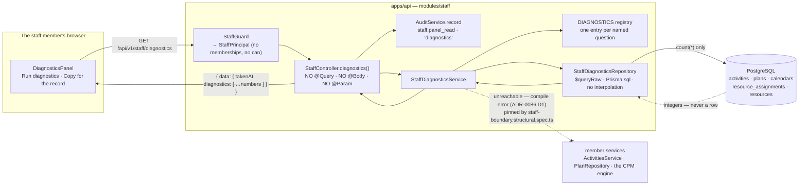
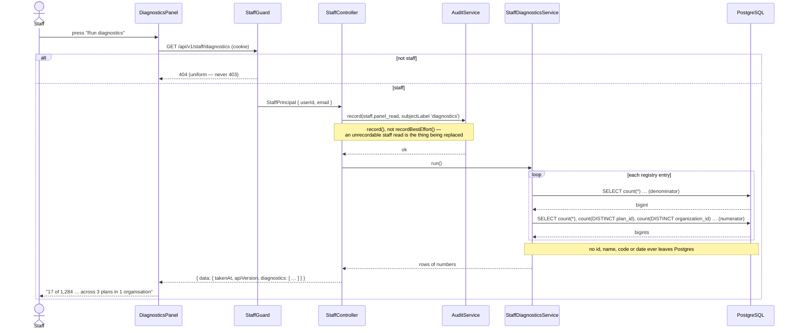
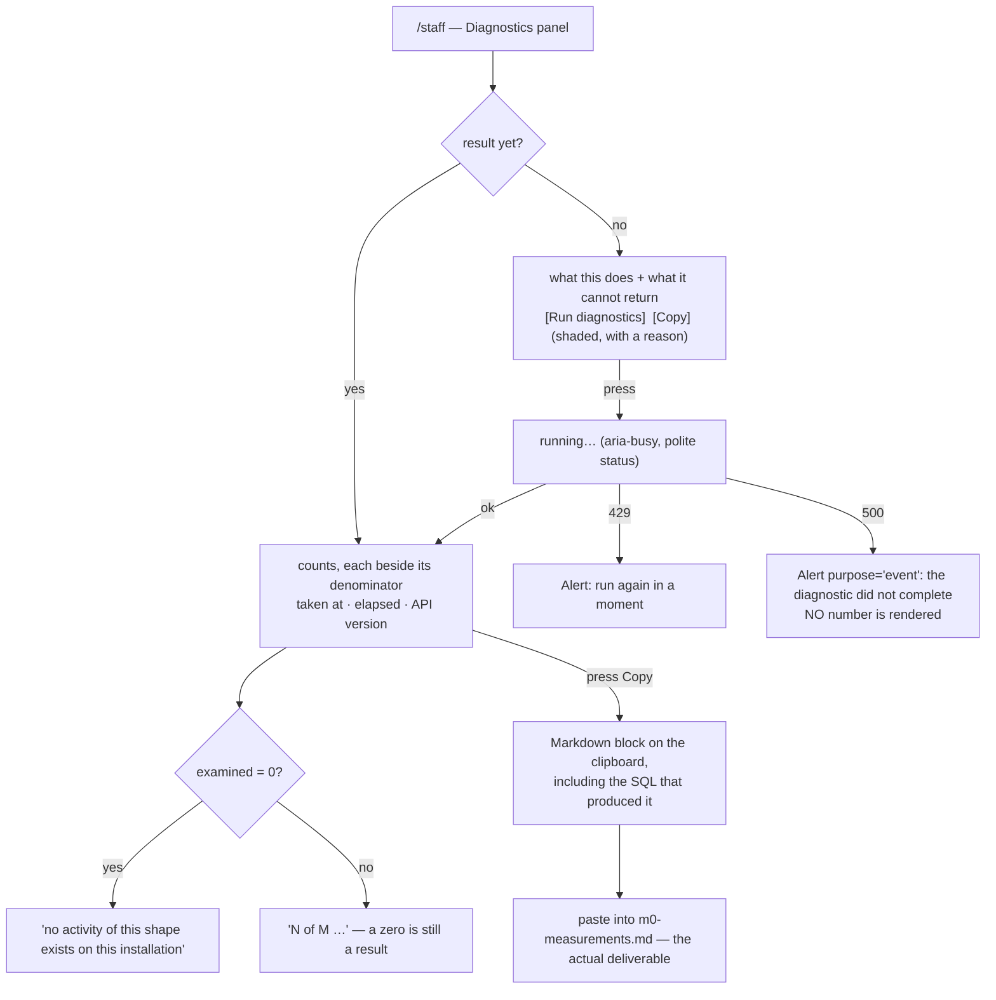

# Feature Spec: The staff diagnostics panel — an aggregate that never returns a row

- **Status:** Approved
- **Author(s):** feature-analyst (Product Owner / Solution Architect / Technical Lead hats)
- **Date:** 2026-09-13
- **Tracking issue / epic:** —
- **Roadmap link:** none yet — see §3 "Documentation" for the `docs/ROADMAP.md` vs.
  `scripts/adr-coverage.json` decision this epic must make.
- **Related ADR(s):** a **new ADR is mandatory** (see §4.1). ADR-0086 §"What this ADR does not do"
  says so in its own words: _"a later request for it is a new decision with its own ADR rather than
  an extension of this one."_ Builds on / amends: **ADR-0086** (the staff boundary — amended),
  **ADR-0128** (the measurement belongs on the machine that can take it — the governing precedent),
  ADR-0073 (which acts earn an audit row), ADR-0081 (a milestone names its entry point),
  ADR-0068 (the day↔minute factor), ADR-0058/0076 (verify the claim).

---

## 0. What was checked, and what the brief got wrong

Per §19.11 / ADR-0076, and because **the brief is not evidence**: every load-bearing claim handed to
this spec was re-derived. Six findings, three of which change the design.

> **The one instrument this spec did not have is a shell.** `Bash` is disabled in this session, so
> nothing here was _executed_. Every claim below is established by **reading named files at named
> lines**, and each is labelled as such. Where a claim needs a run — the SQL's plan, its cost, and
> the number itself — it is written into the plan as a task with a committed falsification
> condition, never asserted here. ADR-0097 Landing C emitted a confident `PROCEED` from an
> `undefined`; ADR-0066 recorded a 4.6 ms p95 that was about the cull. Saying "not measured" is the
> only answer that cannot be mistaken for a result.

### F1 — The brief's SQL mirrors `day-factor.ts` correctly. Verified by reading, rung by rung

| Rung                   | Code                                                                                                                                                                                      | Brief's SQL                                                                    | Verdict |
| ---------------------- | ----------------------------------------------------------------------------------------------------------------------------------------------------------------------------------------- | ------------------------------------------------------------------------------ | ------- |
| `ownCalendarId`        | `day-factor.ts:24-29` — `activityCalendarId ?? planCalendarId`                                                                                                                            | `COALESCE(a.calendar_id, p.calendar_id)`                                       | ✅      |
| type gate              | `day-factor.ts:58-60` — non-`RESOURCE_DEPENDENT` short-circuits to `ownCalendarId`                                                                                                        | `WHERE a.type = 'RESOURCE_DEPENDENT'`                                          | ✅      |
| `schedulingCalendarId` | `day-factor.ts:61` — `drivingCalendarId ?? ownCalendarId(...)`                                                                                                                            | `COALESCE(d.driver_calendar_id, a.calendar_id, p.calendar_id)`                 | ✅      |
| driver population      | `driving-calendars.ts:25-34` — `isDriving`, assignment `deletedAt: null`, resource `deletedAt: null`, activity `deletedAt: null` + type-gated                                             | the `driving` CTE's four predicates, plus the type filter inherited from `ids` | ✅      |
| unresolvable id → 1440 | `day-factor.ts:110-112` + `:82` — `factors.get(id) ?? DEFAULT_HOURS_PER_DAY_MINUTES`, and `DEFAULT_HOURS_PER_DAY_MINUTES = MINUTES_PER_CALENDAR_DAY` (`packages/types/src/index.ts:1091`) | `LEFT JOIN` + `COALESCE(..., 1440)`                                            | ✅      |

### F2 — The soft-deleted-calendar edge the brief flagged: the SQL is right, and filtering would have been the bug

The brief asked _"whether a soft-deleted calendar should resolve to 1440"_. It should **not**.

`CalendarRepository.findHoursPerDayMinutes` (`apps/api/src/modules/calendars/calendar.repository.ts:363-384`)
is **deliberately** unfiltered, and its docblock says why in as many words:

> _"Deliberately **not** filtered by `deleted_at` or `archived_at`. An activity may legitimately be
> bound to an archived calendar (ADR-0053 §4 …), and a soft-deleted one is the case
> `buildPlanCalendar` already handles by falling back to all-minutes. Filtering here would drop the
> row and silently reinterpret that activity's duration."_

So a soft-deleted or archived calendar resolves to **its stored `hours_per_day_minutes`**, and only
an id with **no row at all** falls to 1440. The brief's unfiltered `LEFT JOIN calendars` reproduces
that exactly. Adding `AND oc.deleted_at IS NULL` would have made the diagnostic disagree with the
product it measures.

### F3 — `plans.deleted_at` is missing from the brief's SQL. Harmless today, and worth adding as a probe

A plan soft-delete cascades to its activities in one `updateMany`
(`apps/api/src/common/hierarchy/hierarchy-lifecycle.service.ts:149-157`), so `a.deleted_at IS NULL`
already excludes every activity under a deleted plan and the brief's answer is unaffected.

Add `AND p.deleted_at IS NULL` anyway, with a comment saying it is **redundant by that cascade** —
because if it ever changes the answer, the difference is an active activity under a deleted plan,
i.e. a data-integrity anomaly, and a redundant filter that can only ever fire on a defect is a free
probe. (§5 records this as a plan step, not as a second number on screen.)

### F4 — `DISTINCT ON` without `ORDER BY` is redundant here, and is a latent trap

`uq_resource_assignments_activity_driving (activity_id) WHERE is_driving AND deleted_at IS NULL`
(`apps/api/prisma/migrations/20260717020000_m7_resource_model/migration.sql:168`) guarantees at most
one row per activity, so `DISTINCT ON` selects from a set of one. But `DISTINCT ON` with no
`ORDER BY` is **unspecified** in Postgres about which row survives, so the clause reads as though it
were resolving an ambiguity it is not. Drop it and state the index as the guarantee — or keep it and
add the matching `ORDER BY`. Do not leave it as written.

> Also worth a one-line comment in the query: **`is_driving` names two different columns in this
> schema.** `resource_assignments.is_driving` (`schema.prisma:2728`) is the planner's choice of
> driver; `activity_dependencies.is_driving` (`schema.prisma:1425`) is an engine-owned output. The
> diagnostic means the first.

### F5 — **The brief's query counts the half that was FIXED. The other half of #86 appears to be still live.** (design-changing)

`docs/TECH_DEBT.md:1435` heads the row _"M1–M5 LANDED 2026-09-13. The defect is fixed on both
sides."_ Read as "everything in #86 is closed", that is not what the code shows. Four citations, all
in `apps/api/src/modules/schedule/schedule.service.ts` as it stands at `api-v0.62.0`:

1. `:1343-1353` — `effectiveOf` returns `r.calendarId` for every non-`RESOURCE_DEPENDENT` activity.
   It does **not** fall back to `plan.calendarId`, so an inheriting activity's entry is `null`.
2. `:1373-1375` — `calIdByActivity` is built from exactly those values.
3. `:362-373` — `resolveDayFactors` maps `calId === null → DEFAULT_HOURS_PER_DAY_MINUTES` (1440).
4. `:457-458` — that map is what `writeResults` persists float and drift in days against.

And the function's own docblock at `:345-356` still says it, unedited:

> _"**That last clause is FALSE when the plan has a calendar, and it is `docs/TECH_DEBT.md` #86's
> mechanism** … **Left as characterisation, deliberately.** Where the fix belongs … belongs to that
> row's M1, not to a comment."_

So on the evidence of the code, **the M0-T2b defect is still live**: an activity that inherits its
plan's 8 h calendar has its `total_float` persisted on a 24-hour day, which is the measured
"two identical activities, two different floats" result (`m0-measurements.md:70-81`). The read path
_was_ fixed — `attachDayFactors` (`day-factor.ts:153-183`) resolves through `ownCalendarId`, which
does fall back to the plan — so `durationDays` and `totalFloat` on one DTO are now derived on two
different day lengths for the commonest activity shape there is.

**This is not a claim that #86's M2 was wrong.** M2 fixed the driving-resource half and says so
precisely. It is a claim that the register row's headline reads as closing more than it closed, and
that **the diagnostic the brief asks for counts the half that is already fixed.** Two different
counts are available:

|                  | **D-A** — what M0-T3 asks for                                                       | **D-B** — the still-live half                                                               |
| ---------------- | ----------------------------------------------------------------------------------- | ------------------------------------------------------------------------------------------- |
| Question         | how many RD activities' `durationDays` **changed value** when `api-v0.62.0` shipped | how many activities **right now** report float on 1440 while scheduling on their plan's day |
| Predicate        | driving calendar ≠ own calendar                                                     | effective calendar id is `NULL` **and** the plan's calendar is not 1440                     |
| Tables           | activities, plans, calendars, resource_assignments, resources                       | activities, plans, calendars (+ the driving CTE only for the RD branch)                     |
| Nature           | **retrospective** — sizes who to tell                                               | **prospective** — sizes a live defect                                                       |
| Likely magnitude | small (needs a resource on a different calendar)                                    | potentially **every activity in every plan with a non-24h calendar**                        |

D-A is what the product owner asked for and is what this spec ships. **D-B is CQ-1**, because it is
cheaper, it is almost certainly the larger number, and it measures something that is still wrong.

### F6 — Two things in the brief that are correct and were checked anyway

- **ADR-0128 is the governing precedent and its framing is verbatim.** `0128-…:21-24`:
  _"the product owner, who is the one person with the hardware the number is about, does not run
  terminal commands. So the measurement existed, was correct, and was unreachable by the only person
  who could take it."_
- **The M0-T3 obligation is real and is stated twice** — `docs/TECH_DEBT.md:1495-1496` and the plan
  task at `docs/specs/resource-dependent-day-factor/implementation-plan.md:92-105`, whose step 3
  reads: _"record it, including `0` if that is the answer — a zero is the strongest possible
  argument for CQ-1 and must not be left unstated."_

---

## 1. Business understanding

### Problem

`docs/TECH_DEBT.md` #86 is closed except for one task: **M0-T3, a count of affected rows against the
deployed database.** It cannot be taken from a test database, whose answer is structurally zero, and
today the only route to it is `docker compose exec db psql` on the product owner's host.

That is not an inconvenience; it is the same failure ADR-0128 was written about, one number along.
The instrument exists (the SQL is written), it is correct, and **it is unreachable by the only
person who can run it.** ADR-0128's answer was to move the measurement onto the staff console; this
asks whether the same answer generalises from a _browser_ measurement to a _database_ one.

Two further costs, both structural rather than convenience:

1. **The `psql` route is unaudited.** ADR-0086's founding argument is that every staff operation on
   this installation happens over a shell, outside `audit_events` entirely
   (`0086-staff-principal.md:19-27`). Taking this number over `psql` re-enters that hole; taking it
   through the console leaves a row.
2. **A number nobody can take does not get taken.** #75 is the register's longest-running open
   question precisely because its instrument needed a command line, and the 500-activity limb went
   **unmeasured for a year** as a result. M0-T3 is one week old and already owed.

### Users

**One role, and it is deliberately not an organisation role.** A **staff member** — an address on
`STAFF_EMAILS` with a verified account (ADR-0086 D3) — holding a `StaffPrincipal`, which has no
memberships, no `can()`, no `organizationId` and no role.

No planner, Org Admin, Contributor, Viewer or External Guest can reach this. It is not on the RBAC
matrix at all, and that is the point: a `Principal` and a `StaffPrincipal` never coexist on one
request because they are resolved by different guards on disjoint route sets (ADR-0086 D4).

### Primary use cases

1. **Take M0-T3's number** and write it into
   `docs/specs/resource-dependent-day-factor/m0-measurements.md`, closing the last task of #86.
2. **Re-take it later** — after an import, after a release, when somebody asks "is this still true?"
   — without a shell.
3. **Add a second diagnostic** with one registry entry, when the next #86-shaped question arrives.

### User journeys

**Happy path.** Staff member signs in → opens `/staff` (account-menu link, ADR-0086 D9) → scrolls to
**Diagnostics** → reads what the panel says it will and will not do → presses **Run diagnostics** →
a few seconds later reads:

> **Day factor divergence** — **17** of **1,284** resource-dependent activities are measured against
> a different day length from the calendar they schedule on, across **3** plans in **1**
> organisation. Taken 13 Sep 2026, 14:02 · query 214 ms.

→ presses **Copy for the record** → pastes the block into `m0-measurements.md`.

**The zero path, which is the one that must not be ambiguous.** The answer is `0`. The panel says
**"0 of 1,284"**, never a bare `0` — because a bare zero is indistinguishable from a diagnostic that
silently examined nothing (§2 "Edge cases", and ADR-0093's rule about a green suite that cannot tell
"all classified" from "found nothing").

**The empty-installation path.** `0 of 0` — stated as **"no resource-dependent activities exist on
this installation, so there is nothing to diverge"**, which is a different fact from "nothing
diverges" and is worded differently.

**The refusal path.** A non-staff caller gets the same **404** an unmapped route gives, and the
screen says "Not found" (`apps/web/src/routes/staff.tsx:65-78`). Nothing changes here.

### Expected outcomes

- #86's M0-T3 is closed with a **taken** number rather than an estimate.
- The number is re-takeable by the person who needs it, with no checkout and no shell.
- The installation gains one audited route where it previously had an unaudited `psql` session.
- The registry makes the next such question a one-entry change instead of a one-epic change.

### Success criteria

| #    | Criterion                                                                                                                                             | How it is judged                                                                                                                                           |
| ---- | ----------------------------------------------------------------------------------------------------------------------------------------------------- | ---------------------------------------------------------------------------------------------------------------------------------------------------------- |
| SC-1 | **The number is recorded.** `m0-measurements.md` gains an M0-T3 section with the query, the date and the counts — `0` included if that is the answer. | The file. This, not the panel, is the deliverable (ADR-0128's closing line applied here).                                                                  |
| SC-2 | A zero is never ambiguous: every count ships beside its denominator.                                                                                  | Unit + journey assertion on the copy, verified red against a denominator-free render.                                                                      |
| SC-3 | The route discloses **only** integers — no id, name, code, slug, date or free text about customer work.                                               | A structural gate over the response DTO (§4.4), verified red.                                                                                              |
| SC-4 | The route takes **no caller input at all** — no query parameter, no body, no path parameter.                                                          | A structural gate over the controller method (§4.4), verified red.                                                                                         |
| SC-5 | `staff-boundary.structural.spec.ts`'s three ADR-0086 D1 assertions pass **unchanged**.                                                                | They are the before/after oracle; not one may be edited.                                                                                                   |
| SC-6 | The query's cost is **measured against real data**, with a falsification condition committed first.                                                   | M0-T2 (§5).                                                                                                                                                |
| SC-7 | Every staff route stays audited, including this one.                                                                                                  | The route census's seventh assertion (`audit-coverage.structural.spec.ts:489-504`) — derived from the path, so it covers this route the day it is written. |

### Open questions

> **BOTH CRITICAL QUESTIONS ANSWERED by the product owner, 2026-09-13. Recorded here rather than
> only in the conversation that produced them, because a spec whose blocking questions live
> somewhere else is a spec the next reader cannot act on.**
>
> **CQ-1 → BOTH, D-A first.** The analyst's recommendation, taken as given. D-A closes #86's owed
> M0-T3; D-B measures a half that is still live. The registry is therefore exercised by the first
> milestone rather than asserted, which is the stronger reading of decision 2 — D-B is not a
> speculative diagnostic, it is the same register row.
>
> **D-B's premise was re-verified before this was asked, and it is stronger than F5 claimed.** F5
> was a reading (the analyst could run nothing). The twin experiment it says would settle the
> question **already exists as a committed e2e case** —
> `apps/api/test/resource-dependent-day-factor.e2e-spec.ts`, _"discriminates the factor: the same
> task with the plan calendar set EXPLICITLY"_ — asserting `totalFloat` **2** on the inheriting twin
> against **5** on the explicit one, over an asserted-equal window with identical 2,400 duration
> minutes. Re-run against `api-v0.62.0`: **passes.** So the divergence is characterised, executing
> and green, which is also why nothing flagged it while #86 shipped. M0-T4 step 1 does not need to
> re-establish this; it needs only to decide where the fix belongs.
>
> **CQ-2 → ACCEPTED, on the three-clause contract exactly** (§4.2): aggregate scalars only, **no
> caller input ever**, closed registry. The looser "aggregates over customer data are fine" reading
> was offered and declined, on this spec's own argument that it does not survive contact — without
> the no-input clause, adding an organisation filter later is a one-line change that turns the
> endpoint into a differencing oracle and nothing would refuse it. That clause therefore ships as
> gate S-2 and not as a convention, and the honest strength of the whole is the one §4.2 states: a
> declared contract held by a reviewable seam plus four gates, **not** a compile error. ADR-0086's
> closing paragraph makes the new ADR mandatory, so M1 files it.

**CRITICAL — CQ-1. Which count does the panel ship: D-A, D-B, or both?**
F5 establishes that the brief's query counts the half of #86 that M2 fixed, while a second,
cheaper predicate counts a half that — on the evidence of `schedule.service.ts:345-373` — is still
live and is probably a much larger number. The product owner's decision 2 says "one named
diagnostic now, no speculative diagnostics"; **D-B is not speculative**, it is the same register
row. This changes the epic's shape: two entries on day one means the registry is exercised by the
first milestone rather than asserted, and it means two measurements rather than one.
_Analyst's recommendation: **both**, D-A first._ D-A closes M0-T3 and is what was asked for; D-B is
one registry entry, joins no resource tables, and is the number that would tell the product owner
whether a follow-on epic is worth opening. If only one, ship D-A — a spec that quietly substitutes a
different number for the one that was asked for is worse than one that asks.

**CRITICAL — CQ-2. Is the ADR-0086 D6 narrowing accepted on the three-clause contract in §4.2?**
ADR-0086 decided _against_ staff reading customer work data and required a fresh ADR for any
reversal. §4.2 argues the narrowing is defensible **only** under three clauses held together:
scalars only, **no caller input ever**, and a closed registry. If the product owner wants the
looser version — "aggregates over customer data are fine for staff" without those clauses — the
design changes and the safety argument does not survive; if they want a one-off with no registry,
M1 collapses to a single hard-coded route and the gates in §4.4 are wasted. Either is a legitimate
answer; neither is this spec's to pick.

**Non-critical — defaults stated, proceed unless told otherwise.**

| #   | Question                                     | Default                                                                                                                                                                                                                                                                                                                                    |
| --- | -------------------------------------------- | ------------------------------------------------------------------------------------------------------------------------------------------------------------------------------------------------------------------------------------------------------------------------------------------------------------------------------------------ |
| Q-a | On page load or on a button?                 | **On a button.** The query is O(estate) and unbounded by organisation; running it on every `/staff` load also writes an audit row per load. This is the ADR-0128 shape and the inverse of the retention panel's (`staff.controller.ts:145-156` put retention on `/health` _because it is cheap_).                                          |
| Q-b | Report `affectedOrganizations`?              | **Yes.** It is a count, not an identifier, and it answers "how many customers need telling". Cheap to strike if unwanted.                                                                                                                                                                                                                  |
| Q-c | Report the query's own `elapsedMs`?          | **Yes.** It is a fact about the query, not about customers, and it is M0-T4's missing timing limb arriving for free on real data.                                                                                                                                                                                                          |
| Q-d | Its own route, or fold onto `/staff/health`? | **Its own route**, `GET /api/v1/staff/diagnostics`. The retention precedent folded _because a cheap read should not earn a second audit row per page load_; this read is expensive and deliberate, so the same reasoning points the other way.                                                                                             |
| Q-e | Throttle?                                    | **Tighter than the controller default.** `@Throttle` is per-handler (`staff.controller.ts:85-91`, `docs/TECH_DEBT.md` #315), so a new route adds 30/min of full-estate aggregates to the flood ceiling. Default **6 / 60 s**, revisited against M0-T2's measured cost (the ADR-0116 M6 precedent: derive the number from the measurement). |
| Q-f | A new audit action?                          | **No.** `staff.panel_read` with `subjectLabel: 'diagnostics'` — the existing five-panel pattern. No enum label, therefore **no migration**.                                                                                                                                                                                                |
| Q-g | A `VITE_` flag?                              | **No** (ADR-0088 D1). Every published image carries every flag at its default and an operator cannot switch one off; the rollback is a commit boundary.                                                                                                                                                                                    |

---

## 2. Functional requirements

### User stories & acceptance criteria

> **US-1** — As a **staff member**, I want to take the day-factor divergence count against the live
> database from a button, so that #86's M0-T3 can be closed without a shell.
>
> **Acceptance criteria**
>
> - **Given** I hold a `StaffPrincipal` **when** I open `/staff` **then** a **Diagnostics** panel is
>   present, with no result and a **Run diagnostics** button.
> - **Given** the panel **when** I press **Run diagnostics** **then** the counts render with the time
>   they were taken and how long the query took.
> - **Given** a result **when** any count is shown **then** its denominator is shown beside it.
> - **Given** a run **then** exactly one `staff.panel_read` row is written, naming the panel and
>   **never its contents**.

> **US-2** — As a **staff member**, I want the result in a form I can paste into the register, so
> the measurement is recorded rather than read and forgotten.
>
> - **Given** a result **when** I press **Copy for the record** **then** the clipboard holds a
>   Markdown block carrying every count, its denominator, the timestamp, the elapsed time and the
>   API version — the `formatProbeReport` precedent (`apps/web/src/features/perf-probe/ui/probe-report.ts`).
> - **Given** no result **then** the copy control is **shaded with a reason**, never hidden
>   (ADR-0082: shade what a state the reader can change has shut; omit what does not apply).

> **US-3** — As a **staff member**, I want a zero to be legible, so I can tell "nothing diverges"
> from "the diagnostic examined nothing".
>
> - **Given** `examined > 0` and `affected = 0` **then** the panel reads "**0 of N**" and says the
>   estate was examined and nothing diverges.
> - **Given** `examined = 0` **then** the panel says **no activity of this shape exists on this
>   installation**, in different words.

> **US-4** — As the **product owner**, I want this route to be incapable of returning a row about
> anyone's work, so that widening ADR-0086 D6 costs no customer disclosure.
>
> - **Given** the response DTO **then** every field is a `number` except a server-owned `id` and
>   `label` drawn from the registry's literal union — asserted structurally, verified red.
> - **Given** the controller method **then** it declares no `@Query()`, `@Body()` or `@Param()` —
>   asserted structurally, verified red.
> - **Given** `staff-boundary.structural.spec.ts` **then** its D1 assertions pass **unedited**.

> **US-5** — As a **future author**, I want a second diagnostic to cost one registry entry, so the
> next #86-shaped question is not another epic.
>
> - **Given** a new entry naming an id, a label, a denominator query and a numerator query **then**
>   it appears in the response and on the panel with **no change** to the controller, the DTO, the
>   service or the screen — pinned by a test that adds a fixture entry and asserts it renders.

### Workflows

**Run.** Press → `GET /api/v1/staff/diagnostics` → guard resolves `StaffPrincipal` (404 otherwise) →
throttle → one `staff.panel_read` audit row → for each registry entry, two `$queryRaw` aggregates
(denominator, numerator) inside one read-only transaction → map to scalars → `{ data: … }` envelope
→ render.

**Record.** Press **Copy for the record** → clipboard holds the Markdown block → paste into
`m0-measurements.md` → commit.

> Clipboard write is already in use on this console — `formatProbeReport`'s paste-ready block
> (`apps/web/src/features/perf-probe/ui/probe-report.ts`, rendered by
> `performance-probe-panel.tsx`) — so no new browser capability is requested. **Read from the
> existing consumer, not from the header**: `CLAUDE.md`'s ADR-0074 entry says `Permissions-Policy`
> enumerates `clipboard-write` rather than blanket-denying it, and that is a document rather than
> the nginx config, which this spec did not open. The working precedent is the stronger evidence.

### Edge cases

| Case                                                         | Behaviour                                                                                                                                                                                                                                                                    |
| ------------------------------------------------------------ | ---------------------------------------------------------------------------------------------------------------------------------------------------------------------------------------------------------------------------------------------------------------------------- |
| `examined = 0`, `affected = 0`                               | A distinct sentence — "nothing of this shape exists" — never the same words as "nothing diverges".                                                                                                                                                                           |
| `examined > 0`, `affected = 0`                               | "0 of N". The denominator is what makes this a result.                                                                                                                                                                                                                       |
| Every count `0` because the query is broken                  | **Structurally guarded against, not hoped away:** the API e2e carries a **pinned positive fixture** where divergence genuinely exists, and asserts a non-zero count. A suite that only ever sees zeros passes equally against a query returning nothing (ADR-0093/ADR-0108). |
| The query is slow                                            | No timeout is invented. `elapsedMs` is reported, and the panel says a run may take a moment. M0-T2 measures it; if the measurement fails its committed bar, the design is reopened rather than the bar moved.                                                                |
| Two staff members press at once                              | Both run. It is a read; there is nothing to serialise. Each writes its own audit row.                                                                                                                                                                                        |
| A `RESOURCE_DEPENDENT` activity with no active driver        | Falls back to its own calendar (`day-factor.ts:61`), so it is in the denominator and cannot be in the numerator. Correct, and stated on screen rather than left implicit.                                                                                                    |
| A driver that inherits (`resources.calendar_id IS NULL`)     | Same: `null` coalesces to the activity's own rung. In the denominator, not the numerator.                                                                                                                                                                                    |
| An activity bound to a **soft-deleted or archived** calendar | Resolves to that calendar's stored hours, because the product does (F2).                                                                                                                                                                                                     |
| An activity under a soft-deleted plan                        | Excluded — already excluded by the cascade (F3).                                                                                                                                                                                                                             |
| `bigint` from Postgres `count(*)`                            | Converted to `number` at the repository boundary with an explicit bound check. `count(*)` returns `bigint`; a naive `JSON.stringify` of one **throws**, and `Number()` on one silently loses precision above 2^53 (unreachable here, and asserted rather than assumed).      |

### Permissions

**Outside the RBAC matrix entirely.** Not a permission on `OrganizationRole`; a separate guard on a
disjoint route set.

| Caller                                             | Result                                                                                                                                                                    |
| -------------------------------------------------- | ------------------------------------------------------------------------------------------------------------------------------------------------------------------------- |
| Anonymous                                          | **401** — the global `AuthenticationGuard` runs before `StaffGuard` (ADR-0086 D7's correction; the blanket "every refusal is 404" is true of authenticated callers only). |
| Authenticated member, any role including Org Admin | **404**. Never 403 — a 403 tells a prober the guess was interesting.                                                                                                      |
| Allowlisted but unverified address                 | **404**. `emailVerified` is required unconditionally (ADR-0086 D3).                                                                                                       |
| Staff                                              | **200**.                                                                                                                                                                  |

**No org scope exists to get wrong**, because the query has no organisation parameter and the
principal has no `organizationId`. That is the same shape as ADR-0128 D7 ("there is **no scope to
get wrong** rather than a scope that is guarded") — and here it is load-bearing for a second reason
(§4.2, the no-input clause).

### Validation rules

**There is nothing to validate, and that is a design constraint rather than an absence.** The route
accepts no input. §4.4's gate S-2 refuses a `@Query()`, `@Body()` or `@Param()` decorator on the
handler, so "validate the input" can never become a live question without the gate going red. A
parameterless aggregate cannot be used as a differencing oracle, because an oracle needs the caller
to vary the question.

### Error scenarios

| Scenario                                     | Detection             | User-facing result                                                                                                                                                                                                                                                                                    | Status |
| -------------------------------------------- | --------------------- | ----------------------------------------------------------------------------------------------------------------------------------------------------------------------------------------------------------------------------------------------------------------------------------------------------- | ------ |
| No session                                   | `AuthenticationGuard` | sign-in                                                                                                                                                                                                                                                                                               | 401    |
| Authenticated, not staff                     | `StaffGuard`          | "Not found" screen — same as an unmapped route                                                                                                                                                                                                                                                        | 404    |
| Too many runs                                | `@Throttle`           | "You have run this several times in a minute; wait and try again."                                                                                                                                                                                                                                    | 429    |
| The query fails (SQL error, connection lost) | service catch         | An `Alert` with `purpose="event"` (ADR-0132) naming that the diagnostic did not complete — **never a rendered `0`**                                                                                                                                                                                   | 500    |
| `audit_events` unwritable                    | `record()` throws     | 500, and the run does **not** proceed — `record`, not `recordBestEffort`, following `staff.controller.ts:117-121`'s reasoning: the whole justification for moving staff work off `psql` is that it becomes observable, so a staff read that could not be recorded is exactly the thing being replaced | 500    |

---

## 3. Technical analysis

| Area           | Impact                                            | Notes                                                                                                                                                                                                                                                                                                                                                                                                                                                                                                                                                                                            |
| -------------- | ------------------------------------------------- | ------------------------------------------------------------------------------------------------------------------------------------------------------------------------------------------------------------------------------------------------------------------------------------------------------------------------------------------------------------------------------------------------------------------------------------------------------------------------------------------------------------------------------------------------------------------------------------------------ |
| Frontend       | **medium**                                        | One new panel on the existing `/staff` route, one `useQuery` hook (manual-trigger), one copy-block formatter. No new route, no shell change, no design-system change — `Panel` (`apps/web/src/features/staff/ui/panel.tsx`) already fixes the shape and owns the polite live region.                                                                                                                                                                                                                                                                                                             |
| Backend        | **medium**                                        | One new route on the existing `StaffController`; one new service + repository under `modules/staff/`; one registry module.                                                                                                                                                                                                                                                                                                                                                                                                                                                                       |
| Database       | **none — and this is a finding, not an omission** | No model, no column, no index, no constraint, no migration, no enum label. `staff.panel_read` already exists, so even the audit action costs nothing (ADR-0128's own correction to ADR-0086 records that a new action costs **zero** migrations anyway — the action CHECK is a format regex). **`database-architect` is therefore not engaged for the design.** §19.3 says every schema change goes through it _without exception_; there is no schema change. It **is** engaged conditionally — M0-T2's `EXPLAIN` may say an index is wanted, and an index is a schema change (§5, task M0-T3). |
| API            | **medium**                                        | One `GET`, standard `{ data }` envelope, OpenAPI declared including the 404/429 the controller-level decorators already carry. `docs/API.md` updated.                                                                                                                                                                                                                                                                                                                                                                                                                                            |
| Security       | **HIGH — the epic's subject**                     | §4.1 and §4.2. First staff read of customer **work** data; ADR-0086 D6 amended; `staff-boundary.structural.spec.ts` widened, not routed around. `security-reviewer` is mandatory.                                                                                                                                                                                                                                                                                                                                                                                                                |
| Performance    | **medium-high**                                   | Five-table join unbounded by organisation. There is **no index on `activities.type`**, checked both ways: `schema.prisma:1353-1354` declares only `@@index([planId, createdAt, id])` and `@@index([organizationId])`, and the nine `CREATE … INDEX … ON "activities"` statements across the migrations cover `parent_id` (×2), `calendar_id`, `(plan_id, created_at, id)`, `organization_id`, `(plan_id, name)`, `(plan_id, code)`, `delete_batch_id` and `(plan_id, updated_at DESC)` — **none on `type`**. Mitigations in §4.5; the number is M0-T2's, not this document's.                    |
| Infrastructure | **none**                                          | No new service, no env var, no CI step, no container change.                                                                                                                                                                                                                                                                                                                                                                                                                                                                                                                                     |
| Observability  | **low**                                           | One audit row per run. No new log family; `elapsedMs` travels in the response rather than only in a log, because the person who needs it is reading the screen.                                                                                                                                                                                                                                                                                                                                                                                                                                  |
| Testing        | **medium**                                        | Unit (service + registry + copy block), **API e2e with a pinned positive fixture**, one step added to `apps/web/e2e-staff/staff.spec.ts`, three structural gates.                                                                                                                                                                                                                                                                                                                                                                                                                                |

### Dependencies

- **Must land first:** the widening of `staff-boundary.structural.spec.ts` (§4.4, gate S-3). It has
  to be red against the new code _before_ the new code is written, or the boundary breach is
  invisible to the one gate that exists to see it.
- **Must land first:** the ADR (§4.1). ADR-0086 requires a fresh decision, and M2-T1 of the #86 epic
  set the precedent of filing the ADR **before** the code.
- **Unblocked by:** nothing. No schema change, no new dependency, no infrastructure.
- **Affected:** `docs/TECH_DEBT.md` #86 (M0-T3 closes; F5 is recorded on the row),
  `docs/specs/resource-dependent-day-factor/m0-measurements.md` (gains the number), `docs/API.md`,
  `docs/adr/README.md`, `CLAUDE.md` §16, and either `docs/ROADMAP.md` or `scripts/adr-coverage.json`
  (`check:adr-coverage` requires one or the other, with a written reason for an exemption —
  `scripts/check-adr-coverage.mjs:51-67`). **Default: exempt**, on the reason that a staff-console
  operations surface is an installation decision a planner cannot act on. Decided in the plan, not
  assumed here.

---

## 4. Solution design

### 4.1 The tension, confronted: does this violate ADR-0086, narrow it, or sit outside it?

**It narrows ADR-0086 D6, leaves ADR-0086 D1 structurally untouched, and it does not sit outside
either.** Anyone framing it as "outside" is dodging: the SQL names four of the five tables D6
prohibits by name.

ADR-0086's property is three layers, and they are usually spoken of as one:

| Layer              | What it says                                                                                                                                                                                         | What this change does                                                                                                                                                                                                                                                                                       |
| ------------------ | ---------------------------------------------------------------------------------------------------------------------------------------------------------------------------------------------------- | ----------------------------------------------------------------------------------------------------------------------------------------------------------------------------------------------------------------------------------------------------------------------------------------------------------- |
| **D1 — mechanism** | `StaffPrincipal` declares no `memberships`, no `can`, no `organizationId`, no role, so it is not assignable to `Principal`. Staff reaching a member service is a **compile error** (`0086-…:44-66`). | **Untouched.** No `Principal` is minted; no member service is called; `AuthContextService` is not modified; the cross-org 404 invariant is not on the code path. The three D1 assertions in `staff-boundary.structural.spec.ts:62-113` pass **unedited**, and that is the acceptance condition, not a hope. |
| **D2 — policy**    | "no staff route may read a client, project, plan, activity or note" (`0086-…:139-141`).                                                                                                              | **Narrowed.** This reads `activities`, `plans`, `calendars`, `resource_assignments`, `resources`.                                                                                                                                                                                                           |
| **D3 — procedure** | "a later request for it is a new decision with its own ADR rather than an extension of this one" (`0086-…:249-252`).                                                                                 | **Fires.** A new ADR is mandatory. This spec is its input.                                                                                                                                                                                                                                                  |

**One piece of context that is usually got wrong, in both directions.** The console already returns
customer **personal data**: `/staff/accounts` returns unverified account addresses, and its own
comment says so (`staff.controller.ts:241-244` — _"This response carries customer addresses"_). So
"staff see nothing about customers" was never literally true. But that does **not** licence this
change, because D6's list is about the planner's **work** — clients, projects, plans, activities,
notes — and identity data is not on it. On the evidence of the code, **this is the first staff read
that touches work data at all** (`$queryRaw` has **zero** occurrences under
`apps/api/src/modules/staff/`, and the boundary gate's forbidden-accessor list at
`staff-boundary.structural.spec.ts:120-129` has never had to fire). Treat it as a first, because it
is one.

### 4.2 Why the narrowing is defensible — and the three clauses it depends on

**Clause 1 — the disclosure is bounded by the return type, not by the query's reach.** The reach is
the whole estate; what crosses the process boundary is a handful of integers. A count tells a staff
member nothing about any plan: not its name, not its client, not what the work is, not when it
happens. Nothing is re-identifiable from "17 of 1,284 across 3 plans".

**Clause 2 — no caller input, therefore no oracle.** This is the clause that does the real work and
the one most likely to be eroded later. A parameterless aggregate cannot be used to _ask about
anybody in particular_, because an oracle requires the caller to vary the question. The moment the
route takes an organisation filter, a plan filter or a date range, it becomes a differencing oracle
over customer data — "count with org X excluded, subtract" — and every argument in this section
collapses. So it is not a convention: §4.4's gate S-2 refuses an input decorator on the handler,
verified red.

**Clause 3 — the registry is closed and uniform.** Every diagnostic must fit **one fixed
all-numeric row shape** (§4.6). That is a feature rather than a limitation: it bounds what the
registry can _ever_ disclose, so "add a diagnostic" cannot quietly become "add a field". A
diagnostic that cannot fill the shape does not belong in this registry, and needs its own decision.

**And the comparison that actually decides it.** The choice is not "an aggregate over customer
tables, or nothing". It is:

|                  | today                                      | with this                       |
| ---------------- | ------------------------------------------ | ------------------------------- |
| Route            | `docker compose exec db psql`              | `GET /api/v1/staff/diagnostics` |
| What can be read | **anything** — `SELECT * FROM activities`  | four integers                   |
| Input            | arbitrary SQL                              | none                            |
| Record           | **none** — outside `audit_events` entirely | one `staff.panel_read` row      |
| Rate             | unbounded                                  | 6 / 60 s                        |

That is ADR-0086's own founding argument — _"a staff identity built this way is not a new hole; it
is the first time the most privileged acts in the system become observable"_ (`0086-…:26-28`) —
applied one step further. The narrowing **replaces** a wider, unaudited capability with a narrow,
audited one.

**What this does not license, stated so the next request is a new decision and not an extension:**
naming a plan, a client or an activity; any parameter; any list; any diagnostic that does not fit
the closed shape; and any read of `notes`, which carry free text a planner wrote and are excluded
outright.

### 4.3 How strong is the "scalars only" guarantee, really? — **weaker than D1, and the gap matters**

The brief's intent was that "a leak should be a type error". It is worth being exact about how far
that holds, because overstating it is how a guarantee stops being maintained.

**D1's guarantee is a _negative_ type property.** `StaffPrincipal` lacks fields; assignment to
`Principal` therefore fails. Defeating it requires **adding** something to `staff-principal.ts`, and
the boundary gate watches that file by name. Nothing a developer does elsewhere can weaken it.

**This guarantee is a _positive_ type property on one function's return, and it is weaker in three
distinct ways — each stated because each is a different repair:**

1. **It is defeated by an ordinary-looking edit.** Widening `StaffDiagnosticRowDto` with
   `planNames: string[]` is a one-line change in the file that already owns the shape, it
   typechecks, and it reads like a feature ("so staff can tell the customer which plans"). No
   compiler complains. → **Repair: gate S-1**, a structural assertion over the DTO source.
2. **With `$queryRaw`, the row type is _asserted_, not checked.** `prisma.$queryRaw<{ n: bigint }[]>`
   is an unchecked cast; TypeScript validates what the service _declares_, never what Postgres
   _returns_. A `SELECT` that added a column would be invisible to the type system. → **Repair:
   gate S-4**, which asserts the SQL's projection list is exactly the declared count expressions,
   plus a runtime shape check at the boundary.
3. **The existing boundary gate cannot see a raw query at all.** Its forbidden list is
   `prisma.activity`, `prisma.plan`, `prisma.calendar`, `prisma.resource`, … — accessor strings
   (`staff-boundary.structural.spec.ts:120-129`). `$queryRaw` matches none of them. → **Repair:
   gate S-3**, and see §4.4 for why this one is a precondition rather than a nicety.

**So state it honestly: the scalar boundary is a declared contract held by a reviewable seam plus
four gates, not a compile error.** It is strong enough — the seam is one small file, the gates are
verified red, and the consequence of a breach is bounded by clause 2 (no input, so even a widened
DTO could only ever dump an unfiltered aggregate). It is **not** the same kind of guarantee as D1,
and the ADR must say so in those words rather than borrowing D1's language.

### 4.4 The gates — and the one that must be red before any code is written

> **Choosing `$queryRaw` because the existing gate cannot see it would be exploiting a blind spot,
> not satisfying a rule.** That is the failure this repository has recorded more times than any
> other. So the gate is widened **first**, in its own task, and made to fail against the new code
> before the new code exists.

| Gate                          | Assertion                                                                                                                                                                                                                                                                        | Verified red against                                                         |
| ----------------------------- | -------------------------------------------------------------------------------------------------------------------------------------------------------------------------------------------------------------------------------------------------------------------------------- | ---------------------------------------------------------------------------- |
| **S-1** DTO shape             | Every property declared on the diagnostic row DTO is `number`, except `id` and `label`, which are compared against the registry's literal union. No index signature, no `string[]`, no `Date`.                                                                                   | Adding `planName: string`.                                                   |
| **S-2** no input              | The `diagnostics` handler declares no `@Query()`, `@Body()` or `@Param()` — clause 2, structurally.                                                                                                                                                                              | Adding `@Query() q: SomeDto`.                                                |
| **S-3** boundary, **widened** | `staff-boundary.structural.spec.ts` gains `$queryRaw` / `$queryRawUnsafe` / `$executeRaw` to its forbidden set, with **one declared exception** naming the diagnostics repository and its reason. `$queryRawUnsafe` has **no** exception — string-built SQL is refused outright. | Adding a raw query in any other staff file; removing the exception's reason. |
| **S-4** projection            | The SQL constant's `SELECT` list contains only `count(...)` expressions with declared aliases — so a column cannot be added to the projection without the gate going red, which is the repair for §4.3's point 2.                                                                | Adding `, a.name` to the projection.                                         |
| **S-5** registry uniformity   | Every registry entry produces the fixed row shape; a fixture entry added by the test renders with no change to the controller, service or screen (US-5).                                                                                                                         | Adding an entry whose result carries an extra key.                           |
| —                             | **Unchanged, and that is the point:** the three ADR-0086 D1 assertions.                                                                                                                                                                                                          | Not edited. Editing one is the signal the milestone did more than it says.   |

Each gate carries a **pinned positive case** in the same file, because an assertion of the form
"every X is safe" passes perfectly against a scan that found no X — ADR-0108's census found that on
its first run, and ADR-0093 records the general shape.

### 4.5 How the query is executed — `$queryRaw`, and the reason is the boundary, not convenience

**A typed Prisma aggregate cannot express this.** The predicate compares
`hours_per_day_minutes` on **two different calendar rows** resolved through a three-rung `COALESCE`
chain **per activity**. Prisma's query API has no row-to-row comparison across joins and no
`COALESCE` fallback chain, so the typed route would mean **loading candidate activity rows into the
API process** and comparing in TypeScript — which is strictly _worse_ for the boundary argument,
because customer rows would then exist in application memory, in a service that must never hold one.

**So `$queryRaw` is chosen on boundary grounds:** every customer value stays inside Postgres and
only integers cross. That is a better property than the typed alternative, and it should be argued
that way rather than as a workaround for the ORM.

Three constraints ride with it:

1. **`Prisma.sql` tagged template, zero interpolation.** The query takes no parameters (clause 2),
   so injection is structurally impossible rather than parameterised-away. `$queryRawUnsafe` is
   banned by gate S-3 with no exception.
2. **One constant, one place.** The SQL is a named exported constant so gate S-4 can read it and the
   copy-block can quote it verbatim into `m0-measurements.md` — the register entry must carry the
   query that produced the number, not a retyped one.
3. **Read-only.** Executed inside a transaction opened read-only where the client permits it; at
   minimum the gate refuses `$executeRaw` in this module, so a write cannot arrive by a typo.

**Cost.** Anchoring the query on `activities` scans every activity in the estate, because there is
no index on `activities.type`. Anchoring it instead on **`resource_assignments WHERE is_driving AND
deleted_at IS NULL`** — which the partial unique `uq_resource_assignments_activity_driving` covers,
and whose schema comment names it as _"the recalc 'find THE driving assignment of this activity'
load"_ (`schema.prisma:2827-2829`) — starts from a small set and joins outward. That is also
**semantically** the right anchor: an activity with no active driver can never diverge
(`day-factor.ts:61`), so the population that _can_ diverge is exactly the driven one.

> **Reasoned, not measured.** Whether Postgres actually uses that partial index for this shape is an
> `EXPLAIN (ANALYZE, BUFFERS)` question, and this document does not have a shell. It is task M0-T2,
> with the falsification condition committed **before** the run. ADR-0086's own M6 records that
> Postgres matches a partial index by expression equality rather than by containment — a reason to
> measure rather than to reason about index applicability.

### 4.6 Architecture overview



### 4.7 Data flow



### 4.8 User flow



### 4.9 Database changes

**None.** No model, no column, no index, no constraint, no enum label, no migration — stated
explicitly rather than by omission (§19.3). The audit action `staff.panel_read` already exists
(`audit-coverage.structural.spec.ts:58-63`) and is reused with a new `subjectLabel`.

**One conditional.** If M0-T2's `EXPLAIN` shows the query needs an index — most plausibly a partial
index on `activities (plan_id) WHERE type = 'RESOURCE_DEPENDENT' AND deleted_at IS NULL` — that is a
schema change and it goes through **database-architect**, without exception and without a
self-assessment that it is "too small". The plan carries that as an armed task (M0-T3), which
**does not open** unless the measurement arms it — the ADR-0087 M0-T3 precedent, recorded the same
way (`0087-…:153`).

### 4.10 API changes

**`GET /api/v1/staff/diagnostics`** — no parameters of any kind.

```jsonc
// 200
{
  "data": {
    "takenAt": "2026-09-13T14:02:11.482Z", // server clock, never the browser's
    "apiVersion": "0.62.0", // server-set — a browser cannot observe it
    "diagnostics": [
      {
        "id": "day-factor-divergence", // registry literal, not data
        "label": "Day factor divergence", // registry literal, not data
        "examined": 1284, // number
        "affected": 17, // number
        "affectedPlans": 3, // number
        "affectedOrganizations": 1, // number
        "elapsedMs": 214, // number
      },
    ],
  },
}
```

- **Status codes:** 200 · 401 (anonymous) · 404 (uniform non-staff refusal) · 429 · 500.
  401/404/429 are already declared at the controller class level
  (`staff.controller.ts:61-78`) and are inherited.
- **Envelope:** the bare DTO is returned; `TransformInterceptor` adds `{ data }`. Returning an
  envelope here would double-wrap it, and only the e2e can catch that — the controller unit test
  sees whatever the method returns (`staff.controller.ts:135-137`).
- **`docs/API.md`** gains the route. The ADR-0130 gate pass found `docs/API.md` untouched while
  `docs/DATABASE.md` got a full update for the same change; this is the same trap, and it is named
  here so the task exists rather than being remembered.

### 4.11 Component changes

| Component                 | Where                                                     | Notes                                                                                                                                                                                                                                                                                 |
| ------------------------- | --------------------------------------------------------- | ------------------------------------------------------------------------------------------------------------------------------------------------------------------------------------------------------------------------------------------------------------------------------------- |
| `DiagnosticsPanel`        | `apps/web/src/features/staff/ui/diagnostics-panel.tsx`    | Composed with the existing `Panel` (`features/staff/ui/panel.tsx`), which owns the card composition and the `aria-live="polite"` status region. **Not** a hand-rolled card — that primitive exists because the component review found five panels each reinventing the spacing scale. |
| `useStaffDiagnostics`     | `apps/web/src/features/staff/api/staff-diagnostics.ts`    | Manual-trigger TanStack Query (`enabled: false` + `refetch`), so the button is the only thing that fires it.                                                                                                                                                                          |
| `formatDiagnosticsReport` | `apps/web/src/features/staff/model/diagnostics-report.ts` | Pure, exported, unit-tested from literals — the `formatProbeReport` / `confirmationCopy` precedent, so the copy block is assertable without driving a clipboard.                                                                                                                      |
| Registration              | `apps/web/src/routes/staff.tsx`                           | One line beside `<PerformanceProbePanel />`.                                                                                                                                                                                                                                          |

**States, all four named** (the ADR-0062 M6 rule): idle with an explanation; running with `aria-busy`
and a polite status; result including both zero shapes; error as an `Alert purpose="event"`
(ADR-0132 — this is a thing that just happened, not a standing condition). The copy control is
**shaded with a reason** when there is no result, never hidden (ADR-0082), and focus stays on the
pressed button throughout — this repository's most-repeated defect is focus dropping to `<body>`
when a control relabels or unmounts.

### 4.12 Implementation approach & alternatives

**Chosen:** one parameterless, audited, throttled `GET` returning a closed all-numeric shape,
sourced from a registry, executed as `Prisma.sql` raw aggregates, behind four structural gates, with
the existing boundary gate widened first.

| Alternative                                                     | Why not                                                                                                                                                                                                                                                                               |
| --------------------------------------------------------------- | ------------------------------------------------------------------------------------------------------------------------------------------------------------------------------------------------------------------------------------------------------------------------------------- |
| **Keep using `psql`**                                           | It is the status quo, and it is the problem: unaudited, unbounded, and unreachable by the person who needs the number (ADR-0128's founding argument). Rejected — but note it stays available and this narrows the unaudited surface rather than closing it, exactly as ADR-0086 says. |
| **A one-off script committed to the repo**                      | Same failure as #75's instrument: needs a checkout and a command line. The whole precedent is that this does not get run.                                                                                                                                                             |
| **Typed Prisma aggregate instead of `$queryRaw`**               | Cannot express the predicate (§4.5), and the fallback — load rows and compare in TypeScript — puts customer rows in the service's memory, which is worse for exactly the property under debate.                                                                                       |
| **Return the affected plan ids so staff can tell the customer** | Refused. It is the whole disclosure, it makes the route an oracle, and it is precisely what ADR-0086 D6 protects. The customer-facing conversation is the _planner's_, from inside their own organisation.                                                                            |
| **An organisation filter "just for support"**                   | Refused, and named in the ADR so the next request is a new decision: a filter turns the aggregate into a differencing oracle and collapses clause 2.                                                                                                                                  |
| **Run it on the server on a schedule (ADR-0087's sweep)**       | Different failure from ADR-0128's, but a failure: a scheduled staff-facing read of customer tables with nobody pressing anything has **no act to audit** and no reason to exist at a particular moment. The number is wanted when somebody asks.                                      |
| **Fold onto `GET /staff/health`**                               | The retention precedent folded because that read is cheap and a second route costs a second audit row per page load (`staff.controller.ts:150-156`). This read is expensive and deliberate, so the same reasoning separates them.                                                     |
| **A `VITE_` flag**                                              | ADR-0088 D1: inlined at build time, `docker-publish.yml` passes none, so it is never an operator rollback. The rollback is a commit boundary.                                                                                                                                         |

---

## 5. Links

- Implementation plan: [`./implementation-plan.md`](./implementation-plan.md)
- Register row this closes: `docs/TECH_DEBT.md` #86, M0-T3 (`:1495-1496`)
- The measurement file that is the actual deliverable:
  [`../resource-dependent-day-factor/m0-measurements.md`](../resource-dependent-day-factor/m0-measurements.md)
- Governing precedent: [`../../adr/0128-a-measurement-belongs-on-the-machine-that-can-take-it.md`](../../adr/0128-a-measurement-belongs-on-the-machine-that-can-take-it.md)
- The decision being amended: [`../../adr/0086-staff-principal.md`](../../adr/0086-staff-principal.md)
- Docs this change must update: `docs/API.md`, `docs/adr/README.md`, `CLAUDE.md` §16,
  `docs/TECH_DEBT.md` #86, `scripts/adr-coverage.json` (or `docs/ROADMAP.md`),
  `scripts/spec-status.json` is **not** touched (this slug will hold a spec document).
