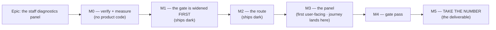

# Implementation Plan: The staff diagnostics panel

- **Feature spec:** [`./feature-spec.md`](./feature-spec.md) — Approved (2026-09-13; CQ-1 both
  counts, D-A first; CQ-2 accepted on the three-clause contract).
- **Status:** Approved
- **Owner:** —

> **The deliverable is a NUMBER, not a panel.** ADR-0128's closing line — _"#75 is not closed by this
> ADR … the readings are the product owner's to take"_ — applies here with one difference worth
> stating: that number was the product owner's to take because only their hardware could produce it.
> This one is theirs to take because only their **database** can. So M4 is not the end of the epic;
> **M5 is**, and M5 is one person pressing one button and one file gaining one section.

> **Two critical questions gate the shape of M0 and M1** (spec §1 "Open questions"). **CQ-1** —
> which count ships (D-A, D-B, or both) — decides whether M1 has one registry entry or two, and
> whether the epic measures a shipped change or a live defect. **CQ-2** — is the ADR-0086 D6
> narrowing accepted on the three-clause contract — decides whether the registry and the four gates
> exist at all. Ask both **before M1**. M0 is safe to run against either answer, which is why it
> comes first.

## Breakdown

### Epic

**The staff diagnostics panel** — close `docs/TECH_DEBT.md` #86's last owed task by putting an
aggregate-only, parameterless, audited diagnostic on the staff console, and decide — in an ADR —
what it costs ADR-0086's boundary. Roadmap theme: operations / staff console (ADR-0086, ADR-0128).

---

## Milestone M0 — Verify the query, measure its cost, and settle the population

**Ships dark:** nothing is user-facing and no product code changes. This milestone produces
documents, an `EXPLAIN` and two committed falsification conditions.
**Journey:** none — nothing to drive.

> **Why M0 exists at all.** Four consecutive epics in this register had a milestone's headline task
> disappear on re-reading, and §19's rule is to re-verify the **problem**. The spec's §0 already did
> that from source and found that the brief's query counts the half of #86 that was fixed (F5). M0
> is where that finding stops being a reading and becomes a decision with numbers behind it.

#### Feature: the query is right, and its cost is known

> **Description:** run the D-A query against a database that can produce a non-zero answer, run
> `EXPLAIN (ANALYZE, BUFFERS)`, and put D-B's shape in front of the product owner with both counts
> costed.
> **Complexity:** M
> **Dependencies:** none
> **Risks:** measuring against a test database and reporting its structural zero as a result →
> **every M0 run states which database it ran against, in its own output**, and the cost limb is run
> against a seeded 2,000-activity plan rather than an empty one; a benchmark over an estate with no
> divergent row reports the fastest number the query can produce and says nothing about the case it
> exists for (ADR-0130's non-vacuity control, one query along).
> **Testing requirements:** this milestone **is** the measurement.

##### Task M0-T1 — Re-verify the SQL against the code, and correct it

- **Description:** confirm spec §0's F1–F4 by reading, then produce the corrected query: drop the
  ungrounded `DISTINCT ON` (or give it an `ORDER BY`), add `AND p.deleted_at IS NULL` with the
  redundant-by-cascade comment, add the `is_driving`-means-two-things note, and re-anchor the query
  on `resource_assignments` per §4.5.
- **Complexity:** S
- **Dependencies:** none
- **Risks:** the re-anchored query is not equivalent to the brief's → run **both** forms against the
  same seeded database and assert the counts are equal; a rewrite that changes the answer is a
  defect, and a rewrite that changes it _silently_ is the whole failure class this repo records.
- **Testing:** n/a — the deliverable is the corrected SQL constant and an equivalence run.
- **Development steps:**
  1. Re-read `day-factor.ts:24-62`, `calendar.repository.ts:363-384`,
     `driving-calendars.ts:20-36` and confirm each rung of §0's F1 table still holds. Record the
     date — a citation that resolved twelve days ago is not evidence today (`#246`).
  2. Write the corrected query as one named constant.
  3. Run both forms on a seeded database with a genuinely divergent fixture; assert equal counts.

##### Task M0-T2 — Measure the cost, with the condition committed first

- **Description:** `EXPLAIN (ANALYZE, BUFFERS)` both anchorings against the seed catalogue's
  2,000-activity plan (and, if available, a scaled estate), and record the plan shape, the timing and
  whether the partial unique `uq_resource_assignments_activity_driving` is used.
- **Complexity:** M
- **Dependencies:** M0-T1
- **Risks:**
  - _Reasoning about the plan instead of reading it._ → The spec deliberately labels the
    index-usage expectation **reasoned, not measured**; ADR-0086 M6 records Postgres matching a
    partial index by expression equality rather than containment, which is exactly why this is an
    `EXPLAIN` and not a paragraph.
  - _Tuning the bar to the answer._ → **Commit the falsification condition in its own commit,
    before the run**: ≤ **500 ms** wall clock at 2,000 activities, and **no sequential scan of
    `activities`** in the chosen plan. If either fails, §4.5's anchoring is reopened or M0-T3 arms —
    the bar is not moved.
- **Testing:** measurement, recorded in this directory as `m0-measurements.md`.
- **Development steps:**
  1. Commit the condition.
  2. Run, both anchorings, both scales. Record the plan text verbatim, not a summary of it.
  3. Record the verdict, including a failure. Derive the M2 throttle number from the measured cost
     (spec Q-e) rather than keeping the placeholder 6/60 s (the ADR-0116 M6 precedent).

##### Task M0-T3 — _(armed by M0-T2, does not open otherwise)_ — design the index

- **Description:** if and only if M0-T2 reports a sequential scan of `activities` that matters,
  design the index with **database-architect**.
- **Complexity:** S
- **Dependencies:** M0-T2
- **Risks:** deciding the change is "too small" to need the agent → §19.3 says that judgement is the
  one the agent exists to make. If the agent returns nothing, fails or is slow, **re-run it**; an
  unavailable agent is a reason to wait, never a reason to proceed.
- **Testing:** the migration's own suite, per `docs/DATABASE.md`.
- **Development steps:** 1. run the agent. 2. write the migration to its design. 3. re-run M0-T2 and
  record the before/after.

##### Task M0-T4 — Put CQ-1 and CQ-2 to the product owner, with numbers

- **Description:** present D-A and D-B side by side — predicate, tables, measured cost, and for D-B
  the four citations establishing it is still live — and ask CQ-1. Present spec §4.2's three-clause
  contract and ask CQ-2.
- **Complexity:** S
- **Dependencies:** M0-T1, M0-T2
- **Risks:** presenting D-B as a certainty when it is a reading → **it is four file:line citations
  and no execution**, and it contradicts `docs/TECH_DEBT.md:1435`'s own headline. Say that. Offer to
  settle it by experiment first (the M0-T2b twin fixture already exists and can simply be re-run
  against `api-v0.62.0`) rather than asking the product owner to act on a reading.
- **Testing:** n/a.
- **Development steps:**
  1. Re-run the `m0-measurements.md` §M0-T2b twin experiment against today's build. **This is the
     discriminating test and it costs almost nothing** — two identical tasks, one inheriting and one
     explicit, and the assertion is whether their floats still differ.
  2. Ask CQ-1 with that result in hand.
  3. Ask CQ-2 with §4.2 and §4.3 in hand — in particular that the scalar guarantee is **weaker than
     ADR-0086 D1's** and why.
  4. Record the answers, and record the F5 finding on `docs/TECH_DEBT.md` #86 whatever the answer —
     noticing drift and stepping over it leaves the register exactly as wrong as not noticing
     (ADR-0071).

---

## Milestone M1 — The boundary gate is widened, and the ADR is filed (ships dark)

**Ships dark:** no route, no screen, no behaviour. A gate goes red against code that does not exist
yet, and a decision is recorded.
**Journey:** none.

> **This milestone is first for one reason, and it is the epic's central discipline.**
> `staff-boundary.structural.spec.ts:115-140` bans `prisma.activity`, `prisma.plan`,
> `prisma.calendar` and `prisma.resource` under `modules/staff/` — and **cannot see `$queryRaw` at
> all**. Writing the raw query first and noticing later would be exploiting a blind spot and calling
> it compliance. Widening the gate first makes the breach **visible in the gate** rather than
> invisible to it.

#### Feature: the decision, and the gate that holds it

> **Description:** file the ADR amending ADR-0086 D6; widen the boundary gate with one declared,
> reasoned exception; add the four new structural gates as failing assertions against the shape M2
> will build.
> **Complexity:** M
> **Dependencies:** M0-T4 (both critical answers)
> **Risks:** the ADR asserting D1's strength for a weaker guarantee → §4.3 is written into the ADR
> **in its own words**, including the three ways the scalar property is weaker and the repair for
> each. This register has overstated a guarantee before and records the corrections; better to state
> the gap than to have a reviewer find it.
> **Testing requirements:** every gate verified red against a **named mutation** (ADR-0110 D5: a
> gate is not finished when it passes, it is finished when it has been made to fail by the defect it
> was written for).

##### Task M1-T1 — File the ADR

- **Description:** write the ADR from spec §4.1–§4.5, **before** any code — the #86 epic's M2-T1
  precedent. It **amends ADR-0086 D6** and builds on ADR-0128.
- **Complexity:** M
- **Dependencies:** M0-T4
- **Risks:** a number taken between plan and filing → check `docs/adr/` **at filing time** (0138 was
  the highest when this plan was written; do not assume 0139 is free) and **record a collision
  rather than routing around it** (ADR-0071). `pnpm check:adr-coverage` checks the index in both
  directions (ADR-0110 D6), so run `pnpm prepush` and not its parts.
- **Testing:** `pnpm check:adr-coverage`, `pnpm check:claims`, `pnpm check:spec-status`.
- **Development steps:**
  1. Draft, carrying: the three-layer D1/D6/D3 table; the three clauses; the honest §4.3 statement
     that the guarantee is weaker than D1's; the explicit list of what it does **not** license.
  2. Update `docs/adr/README.md` **and** `CLAUDE.md` §16 — `check:adr-coverage` reads the index and
     `#291` records that nothing reads `CLAUDE.md`'s register, so that half is a person's job and
     has been missed twice.
  3. Decide `docs/ROADMAP.md` vs. an entry in `scripts/adr-coverage.json`. **Default: exempt**, with
     the written reason "a staff-console operations surface; a planner cannot act on it".
  4. Set this spec's header to `Approved`.

##### Task M1-T2 — Widen `staff-boundary.structural.spec.ts` (gate S-3)

- **Description:** add `$queryRaw`, `$queryRawUnsafe` and `$executeRaw` to the forbidden set, with
  **one** declared exception naming the diagnostics repository file and its reason. No exception for
  `$queryRawUnsafe` — string-built SQL is refused outright.
- **Complexity:** S
- **Dependencies:** M1-T1
- **Risks:** the exception becoming a licence for the next file → it names **one path**, not a
  directory, and carries its reason inline in the shape `dependency-claims.json` and
  `adr-coverage.json` use.
- **Testing:** verified red three ways — a raw query in another staff file; `$queryRawUnsafe` in the
  excepted file; the exception's reason removed. **And the three ADR-0086 D1 assertions must pass
  unedited** — if one needs changing, the milestone did more than it says.
- **Development steps:**
  1. Widen the forbidden set and add the exception register.
  2. Verify red for each mutation, recording which.
  3. State the gate's remaining blind spot in its own docblock: it reads source text, so a raw query
     reached through a helper in another module is invisible to it.

##### Task M1-T3 — Add gates S-1, S-2, S-4, S-5 as failing assertions

- **Description:** the DTO-shape gate, the no-input gate, the SQL-projection gate and the registry
  uniformity gate, each against the shape M2 will build.
- **Complexity:** M
- **Dependencies:** M1-T2
- **Risks:** a gate that passes because it found nothing (ADR-0093/ADR-0108: ADR-0108's census
  passed perfectly because its glob matched zero files) → **each gate carries a pinned positive
  case** asserting the population is non-empty, and that case is the one verified red first.
- **Testing:** each gate red against the named mutation in spec §4.4's table.
- **Development steps:**
  1. Write each gate with its pinned positive.
  2. Verify red, recording the mutation for each.
  3. Comment-strip before scanning — **four gates in this repository have matched their own
     docblocks** and reported prose as a violation; `staff-boundary.structural.spec.ts:28-41`
     already records that exact defect and its fix.

---

## Milestone M2 — The route (ships dark)

**Ships dark:** reachable by `curl` with a staff session cookie and nothing else. No web route, no
navigation entry, no screen — declared rather than implied (ADR-0081 §1), exactly as
`staff.controller.ts:45-52` declared M2 of ADR-0086.
**Journey:** none yet; the API e2e lands here and carries the discriminating case.

#### Feature: a parameterless aggregate behind the registry

> **Description:** `GET /api/v1/staff/diagnostics`, `StaffDiagnosticsService`, the registry, the
> repository and its one SQL constant.
> **Complexity:** L
> **Dependencies:** M1 (all gates present and red)
> **Risks:**
>
> - _1,589 unit tests green and the route unable to serve a request._ ADR-0086's M2 shipped exactly
>   that, because every unit test mocks Prisma. → The API e2e in M2-T4 is not optional and lands in
>   this milestone.
> - _A `bigint` reaching the JSON serialiser._ `count(*)` returns `bigint`; `JSON.stringify` throws
>   on one. → Converted at the repository boundary with a bound assertion, and the e2e asserts a
>   parsed body rather than a status code.
> - _The registry drifting from the DTO._ → Gate S-5, and the fixture entry it adds.
>
> **Testing requirements:** unit (service, registry, bigint boundary); **API e2e with a pinned
> positive fixture**; all four new gates green; the three D1 assertions unedited.

##### Task M2-T1 — The registry and the row shape

- **Description:** `DIAGNOSTICS`, a frozen array of entries — `{ id, label, denominator, numerator }`
  — and `StaffDiagnosticRowDto`, whose every property is `number` except the two registry literals.
- **Complexity:** M
- **Dependencies:** M1-T3
- **Risks:** a shape loose enough to carry anything → the row shape is **closed**, and a diagnostic
  that cannot fill it does not belong in this registry (spec §4.2 clause 3). Gate S-1 holds it.
- **Testing:** S-1 and S-5 flip from red to green; a unit case adding a fixture entry.
- **Development steps:** 1. the entry type. 2. the DTO with OpenAPI annotations. 3. the D-A entry
  (and D-B's, if CQ-1 said both).

##### Task M2-T2 — The repository: one SQL constant, no interpolation

- **Description:** `StaffDiagnosticsRepository` running each entry's two aggregates via
  `prisma.$queryRaw` with `Prisma.sql` and **zero** interpolated values, converting `bigint` to
  `number` at the boundary.
- **Complexity:** M
- **Dependencies:** M2-T1
- **Risks:** the raw row type being an unchecked cast (spec §4.3 point 2) → a runtime shape check on
  what comes back, plus gate S-4 over the projection list. The type assertion is documented as an
  assertion in the file, not presented as a check.
- **Testing:** unit against a stubbed client for the bigint boundary; the real behaviour is M2-T4's.
- **Development steps:**
  1. The SQL constant, from M0-T1, with its comments intact (they record why each filter is there).
  2. The runner, read-only, no interpolation.
  3. The boundary conversion with its bound assertion.

##### Task M2-T3 — The controller route

- **Description:** `@Get('diagnostics')` on the existing `StaffController`, a tighter `@Throttle`
  from M0-T2's number, `record()` of `staff.panel_read` with `subjectLabel: 'diagnostics'`, full
  OpenAPI, and **no input decorator of any kind**.
- **Complexity:** S
- **Dependencies:** M2-T2
- **Risks:**
  - _Returning the `{ data }` envelope by hand._ → `TransformInterceptor` adds it; returning one
    double-wraps, and only the e2e can see that (`staff.controller.ts:135-137`).
  - _Reaching for `recordBestEffort`._ → `record()`, for the reason `staff.controller.ts:117-121`
    gives: a staff read that could not be recorded is the thing this replaces.
- **Testing:** gate S-2 flips green; the route census's seventh assertion covers it automatically
  (`audit-coverage.structural.spec.ts:489-504`) — add its `AUDITED_ROUTES` entry and verify red by
  omitting it.
- **Development steps:** 1. the handler. 2. the `AUDITED_ROUTES` entry. 3. `docs/API.md` — named as
  a step because the ADR-0130 gate pass found it skipped while its sibling doc was updated.

##### Task M2-T4 — API e2e, with the pinned positive fixture

- **Description:** Supertest cases against a real Postgres: a staff session gets 200 with parsed
  integers; a member session gets 404; an anonymous caller gets 401; **and a fixture built through
  the public REST API where divergence genuinely exists returns a non-zero `affected`.**
- **Complexity:** L
- **Dependencies:** M2-T3
- **Risks:**
  - _A suite that only ever sees zeros._ It would pass equally against a query returning nothing.
    → The positive fixture is **mandatory**, and a sibling case on the same plan with matching
    calendars asserts the count does **not** move — so a query that counts everything fails too.
  - _Building the fixture below the write path._ → Built through the REST API, never Prisma directly
    (ADR-0066: a fixture built below the write path reuses the assembly the defect lives in). The
    #86 epic's M0-T1 fixture is the model and may be reusable.
- **Testing:** the test is the deliverable. Run `scripts/e2e-local.sh api`.
- **Development steps:**
  1. Build the divergent fixture (plan on an 8 h calendar, resource on a 24 h calendar, driving
     assignment, `RESOURCE_DEPENDENT` activity).
  2. Assert non-zero `affected`, non-zero `examined`, and `affected < examined`.
  3. Add the same-calendar control and assert it does not count.
  4. Assert the audit row exists, names the panel and **does not** carry any count in its payload.

---

## Milestone M3 — The panel (**first user-facing milestone**)

**Outcome:** a staff member can take the number from a button.
**Entry point:** the **Diagnostics** panel on `/staff`, control accessible name **"Run
diagnostics"** — reached from the account menu's **Staff console** link (ADR-0086 D9). Named here
because ADR-0081 exists and because ADR-0086 itself shipped a console reachable only by typing the
address.
**Journey:** `apps/web/e2e-staff/staff.spec.ts` gains a step that signs in as staff, presses **Run
diagnostics**, and asserts a count renders **with its denominator** and that the audit row appears
in the Activity panel. It lands **here**, not at M4 (ADR-0081 §2).

#### Feature: the Diagnostics panel

> **Description:** the panel, the manual-trigger hook, the pure report formatter, and registration
> beside `<PerformanceProbePanel />`.
> **Complexity:** M
> **Dependencies:** M2
> **Risks:**
>
> - _A rendered `0` that means "broken"._ → Every count renders with its denominator, and
>   `examined = 0` has its own sentence. Verified red against a denominator-free render.
> - _Focus dropping to `<body>`._ The most-repeated defect in this register. → The button relabels
>   rather than unmounting; a unit case focuses the button first and asserts it did, because
>   `fireEvent.click` does not move focus in jsdom and a naive assertion passes against a panel that
>   drops it (ADR-0128's gate pass records exactly that).
> - _The error state rendering a number._ → An `Alert purpose="event"` and **no** result block.
>
> **Testing requirements:** unit for all four states and both zero shapes; the formatter tested from
> literals; the journey step; an axe scan that runs against a state with a **result on screen**, not
> only the idle one (ADR-0116's gate pass found a scan certifying only the all-PASS state).

##### Task M3-T1 — The hook and the pure formatter

- **Description:** `useStaffDiagnostics` (manual trigger) and `formatDiagnosticsReport`, pure and
  exported so the copy block is assertable from literals — the `formatProbeReport` /
  `confirmationCopy` precedent.
- **Complexity:** S · **Dependencies:** M2
- **Risks:** the copy block and the screen disagreeing → both render from the same model, and a
  unit case asserts a field present on screen is present in the block.
- **Testing:** unit from literals, including `0 of 0`, `0 of N` and a missing `elapsedMs`.
- **Development steps:** 1. the hook. 2. the formatter, carrying the SQL verbatim. 3. unit cases.

##### Task M3-T2 — The panel

- **Description:** the component, composed with `Panel`; the shaded-with-a-reason copy control; the
  four states.
- **Complexity:** M · **Dependencies:** M3-T1
- **Risks:** a hand-rolled card → `Panel` exists because the component review found five panels each
  reinventing the spacing scale. Use it.
- **Testing:** unit per state; `accessibility-reviewer` before merge — this adds a control to a
  shared surface and §19.13's trigger is close enough that the cheap run is worth it.
- **Development steps:** 1. the component. 2. register it in `routes/staff.tsx`. 3. the states.

##### Task M3-T3 — The journey step

- **Description:** extend `apps/web/e2e-staff/staff.spec.ts`.
- **Complexity:** M · **Dependencies:** M3-T2
- **Risks:** the journey asserting only a zero → **state its blind spot in its own docblock**: the
  staff journey's database may hold no divergent row, so this proves the control, the audit row, the
  a11y and that a denominator renders — **the discriminating positive case is M2-T4's**, in the API
  e2e where a fixture can be built. Two suites, two jobs, each honest about which.
- **Testing:** `scripts/e2e-local.sh web:staff`, plus the base journey (§19.8: change a screen, run
  the base journey).
- **Development steps:** 1. the step. 2. locate the control by **role and accessible name**, never
  by copy or a selector string (ADR-0091's recorded rule). 3. run it locally before CI.

---

## Milestone M4 — The gate pass

**Ships dark:** no new capability; findings folded.
**Journey:** the M3 journey, re-run.

##### Task M4-T1 — Six specialists over the combined diff

- **Description:** **security-reviewer** (mandatory — this epic's subject), **database-architect**
  (the query, even though no schema changed: it reads five customer tables unbounded),
  **backend-performance-reviewer**, **api-reviewer**, **accessibility-reviewer**, **ux-reviewer**.
- **Complexity:** M · **Dependencies:** M3
- **Risks:** _a clean pass._ It has blocked in eight consecutive epics here; a clean pass is the
  outcome to distrust, not to celebrate.
- **Testing:** every fix carries a regression test **verified red first**.
- **Development steps:** 1. run them. 2. fold the blocking findings. 3. file the non-blocking ones as
  a `docs/TECH_DEBT.md` row with reasons — not as a promise to look later.

##### Task M4-T2 — Re-derive this epic's own numbers from the shipped code

- **Description:** re-run M0-T2's `EXPLAIN` and timing against the merged build, not against M0's
  branch.
- **Complexity:** S · **Dependencies:** M4-T1
- **Risks:** carrying M0's figures forward → ADR-0130's reviewers re-derived the epic's own
  measurements from the final code rather than trusting them, and ADR-0125's second run differed
  from its first. A second run that agrees to the decimal is more suspicious than one that does not.
- **Testing:** the measurement.
- **Development steps:** 1. re-run. 2. record any divergence and its evidence (`git diff --stat`
  between the runs). 3. update the throttle if the cost moved.

---

## Milestone M5 — **Take the number** (the deliverable)

**Outcome:** `docs/TECH_DEBT.md` #86's M0-T3 is closed with a taken figure.
**Entry point:** the product owner presses **Run diagnostics** on their own host, after the release
has been pulled (ADR-0047 auto-pull).
**Journey:** none — this is a person using the product.

##### Task M5-T1 — Record it

- **Description:** the product owner runs it; the result goes into
  `docs/specs/resource-dependent-day-factor/m0-measurements.md` as an M0-T3 section carrying the
  query, the date, the counts and the elapsed time.
- **Complexity:** S · **Dependencies:** M4, and a release reaching the host.
- **Risks:**
  - _Estimating instead of measuring._ The #86 plan's own wording: _"the count is **taken**, never
    guessed"_, and step 3, _"record it, including `0` if that is the answer — a zero is the
    strongest possible argument for CQ-1 and must not be left unstated."_
  - _The epic reading as finished at M4._ → **It is not.** M4 ships an instrument; M5 is the
    number. ADR-0128 closed with #75 still open for exactly this reason, and said so.
- **Testing:** n/a.
- **Development steps:**
  1. Product owner runs it and pastes the block.
  2. Close M0-T3 on `docs/TECH_DEBT.md` #86; record F5 on the same row whatever CQ-1 decided.
  3. If the number is large, open the follow-on question as its own row — **do not fold a remedy
     into this epic's last milestone** (ADR-0105's trigger, and the rule that keeps a shared-gate
     change out of a gate pass).

---

## Sequencing & slices

| Slice | Releasable alone?                    | User-visible?                   |
| ----- | ------------------------------------ | ------------------------------- |
| M0    | yes — documents only                 | no                              |
| M1    | yes — a gate and an ADR              | no                              |
| M2    | yes — route reachable by `curl` only | no (**ships dark**, declared)   |
| M3    | yes                                  | **yes** — one panel, one button |
| M4    | yes                                  | no                              |
| M5    | n/a — a measurement                  | no                              |

**No feature flag** (ADR-0088 D1: `apps/web/Dockerfile` declares one `VITE_` build arg and
`docker-publish.yml` passes none, so every published image carries every flag at its default and an
operator cannot switch one off). The rollback is a commit boundary, and M2 and M3 are deliberately
separate commits so the route and the screen can be reverted independently. M2 additionally cannot
be flagged even in principle — a client build-time constant structurally cannot gate a server route
(the ADR-0060 M0 / ADR-0074 rule).

**Version impact:** minor, `api` and `web` (pre-1.0). One additive endpoint, one additive panel;
nothing removed or renamed. A changeset lands with M2 and with M3 — and **M2's is not optional**:
ADR-0130 records a release that would have shipped no image carrying its own DTO because a
milestone added accepted body fields with no changeset.

## Definition of Done (per task)

Each task's PR satisfies the Feature Completion Criteria in [`docs/PROCESS.md`](../../PROCESS.md).
Three are called out because this epic is where they bite:

- **`pnpm prepush`, as one command** — not its parts. It derives its gate list from `package.json`
  precisely so nobody keeps one in their head (§19.8, ADR-0110). Following the older by-hand wording
  once sent an ADR to CI that `check:adr-coverage` refused.
- **`scripts/e2e-local.sh api`** for every `apps/api` change (M2), and
  **`scripts/e2e-local.sh web:staff` plus the base journey** for M3.
- **Read the check runs for the PR's current head, deduped by name keeping the most recently
  started** (§19.9). It is this repository's only merge gate — `main` carries no branch protection —
  and the list is ten entries since ADR-0138, four of them shards of what used to be one check.

## Risks & assumptions (rollup)

| Risk / assumption                                                                   | Likelihood | Impact                                                                                                                           | Mitigation                                                                                                                                                                                                   |
| ----------------------------------------------------------------------------------- | ---------- | -------------------------------------------------------------------------------------------------------------------------------- | ------------------------------------------------------------------------------------------------------------------------------------------------------------------------------------------------------------ |
| **CQ-2 is declined** — the product owner will not narrow ADR-0086 D6                | low        | **high** — the epic ends at M0, and M0's documents are still the deliverable (the number is then taken over `psql` and recorded) | Ask **before** M1. A spec whose most valuable output is a decision not to build is a real outcome here (ADR-0085, ADR-0137)                                                                                  |
| **CQ-1 is "D-B instead"**                                                           | med        | med — M1's registry carries a different entry; the SQL, the cost limb and the ADR are unchanged                                  | Ask at M0-T4, after re-running the twin experiment                                                                                                                                                           |
| **F5 is wrong — the inheriting-calendar defect was fixed and the comment is stale** | **med**    | med — it removes CQ-1's second option and nothing else                                                                           | It is four citations and no execution. **Re-run the M0-T2b twin experiment** (M0-T4 step 1) before telling anybody it is live                                                                                |
| The `$queryRaw` exception becomes a licence for the next staff file                 | med        | **high** — the boundary erodes one convenience at a time                                                                         | Gate S-3 names **one path**, not a directory, with its reason inline; `$queryRawUnsafe` has no exception at all                                                                                              |
| A later change adds a parameter "just for support"                                  | med        | **high** — clause 2 collapses and the route becomes a differencing oracle                                                        | Gate S-2, verified red; and the ADR names the parameter request by name as a **new decision**, not an extension                                                                                              |
| The DTO is widened with a name or an id                                             | med        | **high**                                                                                                                         | Gate S-1 over the DTO source, plus gate S-4 over the SQL projection — the two together cover both ends                                                                                                       |
| The query is expensive on a large estate                                            | med        | med                                                                                                                              | M0-T2 measures it with the condition committed first; failing it reopens the anchoring rather than moving the bar; the route is button-triggered and throttled below the controller default                  |
| The panel ships and nobody takes the number                                         | **med**    | **high** — #75 spent a year in exactly this state                                                                                | M5 is a milestone with an owner, not a footnote. The epic is not done at M4                                                                                                                                  |
| A gate passes because it found nothing                                              | med        | high                                                                                                                             | Every gate carries a pinned positive case, and that case is verified red first (ADR-0093, ADR-0108)                                                                                                          |
| A claim in this plan is stale by the time it is built                               | med        | med                                                                                                                              | §19's rule applies to the **problem** as well as the design. Every citation here was taken 2026-09-13 by reading, with **no shell available** — re-run them, and re-read `schedule.service.ts:345-373` first |
| The gate pass finds nothing                                                         | **low**    | —                                                                                                                                | It has blocked in eight consecutive epics; a clean pass is the outcome to distrust                                                                                                                           |
