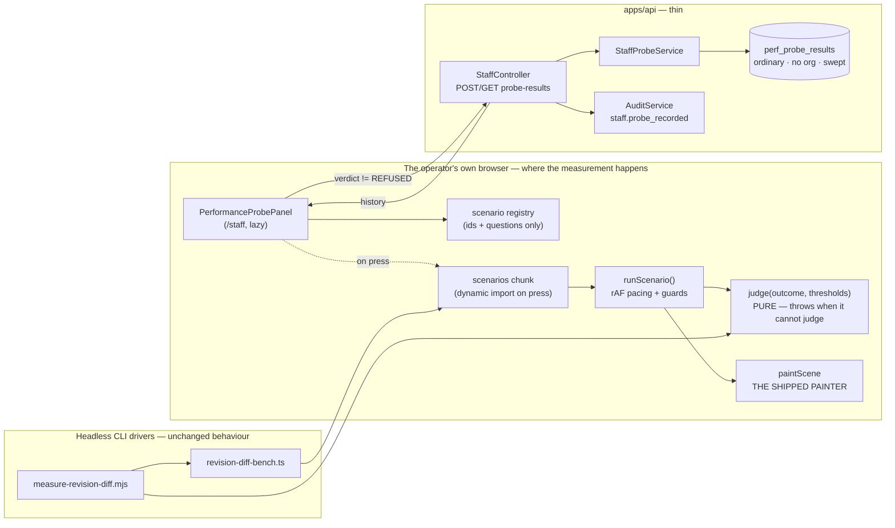
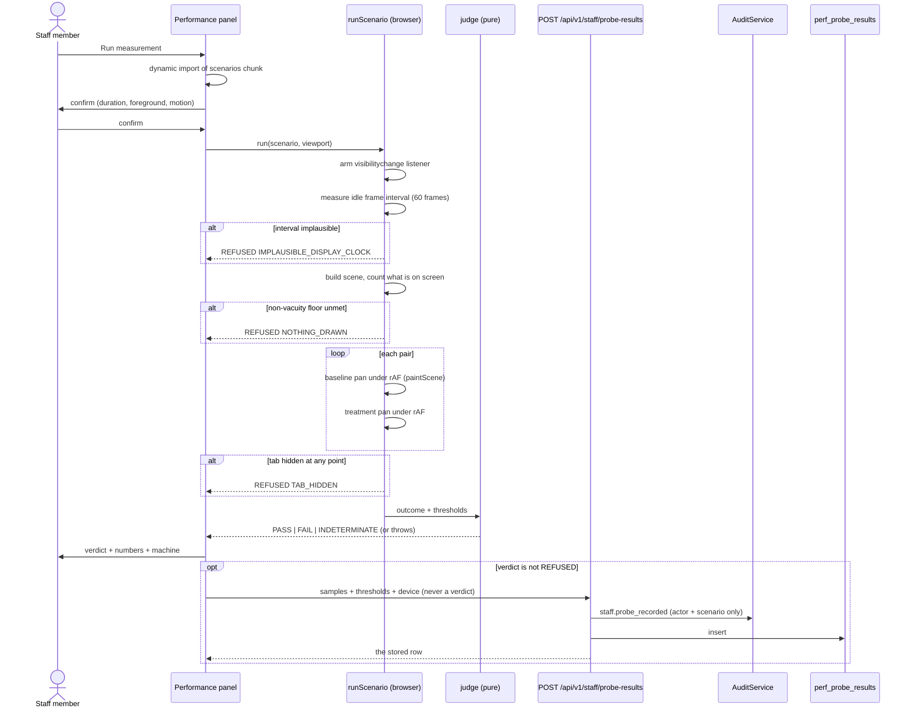
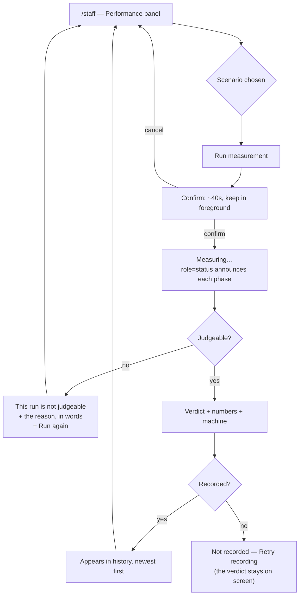

# Feature Spec: Canvas performance probe on the staff console

- **Status:** Accepted — shipped (ADR-0128) — extended by ADR-0130
- **Author(s):** feature-analyst
- **Date:** 2026-09-07
- **Tracking issue / epic:** _(none yet)_
- **Roadmap link:** operational tooling; closes the measurement half of `docs/TECH_DEBT.md` #75
- **Related ADR(s):** ADR-0026 §9/§9a/§9b (the fps gate), ADR-0066 (the scale generator),
  ADR-0073 (audit coverage tests), ADR-0081 (a milestone names its entry point), ADR-0085
  (erasure), ADR-0086 (`StaffPrincipal`), ADR-0087 (the retention sweep), ADR-0100 M0 (the
  paired same-session design), ADR-0102 (the canvas surface scope), ADR-0121 (conditions
  committed first). **A new ADR is required** — see §4.9.

> **Evidence rule (ADR-0076 / PROCESS.md).** Every decision-bearing claim below names the file,
> line or command that established it. Claims inherited from the brief were re-checked; §0
> records the four places where checking changed something.

---

## 0. What was checked, and what checking changed

The brief asked for verification rather than acceptance. Five claims were checked. Three held,
one held with a correction that changes the design, and one turned out to be **false in the
register itself**.

| Claim (from the brief)                                               | Verified?               | Evidence                                                                                                                                                                                                                                              |
| -------------------------------------------------------------------- | ----------------------- | ----------------------------------------------------------------------------------------------------------------------------------------------------------------------------------------------------------------------------------------------------- |
| `revision-diff-bench.ts` is already pure browser code                | **Yes**                 | `apps/web/scripts/revision-diff-bench.ts:1-11` imports `paintScene` from `../src/features/tsld/render/paint`; the entry point is `window.__benchRevisionDiff` (`:347`). No `node:` import anywhere in the file.                                       |
| `measure-revision-diff.mjs` is only a driver, and its verdict throws | **Yes**                 | `measure-revision-diff.mjs:87-100` (esbuild), `:113` (Chromium launch), `:168-177` (non-vacuity **throws**), `:183-185` ("NOTHING TO JUDGE").                                                                                                         |
| The staff module has six `@Get` and no `@Post`                       | **Yes**                 | `apps/api/src/modules/staff/staff.controller.ts` — `@Get` at `:74, :118, :151, :178, :195, :216`. No `@Post`/`@Patch`/`@Put`/`@Delete` in the file.                                                                                                   |
| The container measurement is disqualified                            | **Yes**                 | `docs/specs/revision-compare-changes/m0-condition.md:246-265` — the **baseline** (shipped painter, no treatment) moved 0.56 → 1.85 pp @1646 and 0.93 → 10.00 pp @1920 between two runs an hour apart, against a 2.00 pp bar.                          |
| ADR-0086 D6: "One write exists in v1: send a test message"           | **FALSE — never built** | `docs/adr/0086-staff-principal.md:143-145` says it exists. It does not: the controller has no `@Post`. The `mail_events.kind` CHECK already permits `test` and `staff-health.dto.ts:12` enumerates it, so the **shape** landed and the route did not. |

**The last row matters to this feature and is recorded rather than stepped over** (the ADR-0071
lesson). It means this epic adds the **first write of any kind** to the staff surface — not the
second, as the register implies — so every property that a write must not break has to be argued
here for the first time rather than inherited. It is also the ADR-0081 shape (a capability
described in an accepted document with no entry point), and it is filed in §6 as a debt row
rather than fixed here.

Two further facts were established that no document stated:

- **`@repo/seed` is a `devDependency` of `@repo/web`** (`apps/web/package.json:90`), not a
  dependency. The scale scene the existing bench uses (`scripts/scale-scene.ts:5`) therefore
  cannot be imported from `src/` without promoting it. This changes M1 (§5, D6).
- **The staff route is already code-split** (`apps/web/src/app/router.tsx:314-316`), so the
  panel inherits a lazy chunk. The scenarios need a **second** dynamic import inside it — see
  D6 and the falsification condition F2.

---

## 1. Business understanding

### Problem

**SchedulePoint cannot measure its own primary surface on the hardware it is used on, and the
one person who could will not run a terminal command.**

Three facts, each checked, combine into the problem:

1. **The environment this repository runs in is disqualified from answering canvas performance
   questions.** Not "noisy" — disqualified. `m0-condition.md:250-265` compares two runs of
   _identical code_: the shipped painter with no treatment at all moved from 0.56 pp to 1.85 pp
   dropped frames at 1646, and from 0.93 pp to 10.00 pp at 1920, an hour apart. The bar those
   runs are judged against is 2.00 pp. **The instrument's noise floor is wider than the
   criterion**, so no number of repetitions here helps, and the file says so in those words.

2. **The real-hardware numbers that exist are a single reading, a month old, never re-derived.**
   `docs/TECH_DEBT.md:504-518` records one run on a Dell Precision 5690 on 2026-08-03. Since
   then ADR-0099 (Graphite), ADR-0100 (the minimap), ADR-0102 (the light theme, which re-valued
   every canvas token), ADR-0106 (the axis markers) and ADR-0109 (lane hairlines, the weekend
   hatch removal) have all changed what the painter draws, and **not one of them re-measured**.
   The 500-activity limb of ADR-0026 §9's two-limb gate has no real-hardware reading at all
   (`TECH_DEBT.md:544-546`). That is the exact drift class ADR-0058 and ADR-0076 exist for,
   applied to a number instead of a sentence.

3. **The only route to a real-hardware number today requires a terminal or a DevTools console.**
   `TECH_DEBT.md:483-493` documents two: Route B (`pnpm --filter @repo/web measure:draw` — a
   checkout, an install, a command) and Route A (`measure-draw-in-browser.js`, pasted into
   DevTools). The product owner has stated they will not do either. A capability that requires
   an action its user will not take **does not exist for that user** — which is ADR-0081's
   argument about entry points, one layer up.

There is a second, immediate consumer. `docs/specs/revision-compare-changes/m0-condition.md`
Condition A stands **UNANSWERED** (`:265`), and the decision it gates —
whether the revision-compare-on-diagram overlay becomes default-on — is explicitly waiting on "a
headed run on real hardware" (`:279-280`). Today nothing can produce one.

### Users

**Exactly one role: SchedulePoint staff** (ADR-0086), resolved by `StaffGuard` from the
`STAFF_EMAILS` allowlist. Not an organisation role — a `StaffPrincipal` holds no memberships, no
`can()`, no `organizationId` (`apps/api/src/common/auth/staff-principal.ts:27-38`).

No planner, Org Admin, Contributor, Viewer or External Guest can reach this, see it, or learn it
exists: every non-staff caller of a `/api/v1/staff/*` route receives the same 404 an unmapped
route gives (`staff.guard.ts:99-118`, `:160-162`).

There is **no planner-facing variant, and that is a decision rather than a deferral** — see D9.

### Primary use cases

1. **Answer "is the diagram smooth on this machine?"** — press a button on `/staff`, watch a
   sustained pan of a 2,000-activity programme, and read a verdict against ADR-0026 §9's fps
   gate.
2. **Answer a specific pending question** — run the revision-compare overlay scenario, which is
   Condition A of an epic that is currently blocked on it.
3. **Compare across releases and across machines** — because each result is stored with the app
   version and the machine it came from.
4. **Refuse to answer when the run is not judgeable** — a backgrounded tab, a throttled rAF, a
   scene that drew nothing, or a baseline whose own spread swamps the bar.

### User journeys

**Happy path.** Staff member signs in → `/staff` → the **Performance** panel names the available
scenarios and says what each answers → chooses `Canvas draw (2,000 activities)` → presses **Run
measurement** → a confirmation states that the page will animate for about 40 seconds and must
stay in the foreground → a full-width canvas appears and pans → progress is announced → the run
finishes → the panel shows the verdict, the numbers, the machine it was taken on, and (M4) records
it in a history table beside earlier runs.

**Refusal path.** The operator switches tabs mid-run → on return the panel shows **"This run is
not judgeable"** with the reason ("the tab was hidden for part of the run, which throttles the
browser's frame clock") and a **Run again** button. **Nothing is recorded.**

**Indeterminate path.** The run completes, every guard passes, and the baseline's own run-to-run
spread exceeds the difference bar. The panel shows **INDETERMINATE**, prints both numbers, and
says in words that this machine cannot discriminate at this bar today — the finding
`m0-condition.md:204-211` had to write by hand.

### Expected outcomes

- `docs/TECH_DEBT.md` #75 gets its first re-derivation since 2026-08-03, including the
  **500-activity limb it has never had**, and gets one after every subsequent release for free.
- `m0-condition.md` Condition A gets an answer, or gets a recorded statement that the operator's
  machine cannot answer it either — which is itself the finding.
- The next canvas epic can be **measured before and after** on the machine that matters, instead
  of arguing from a container.

### Success criteria

| #   | Criterion                                                                                                                | How it is judged                                                    |
| --- | ------------------------------------------------------------------------------------------------------------------------ | ------------------------------------------------------------------- |
| S1  | A staff member with no terminal reaches a real-hardware pacing number in **one press** from `/staff`                     | The M3 journey drives exactly that                                  |
| S2  | Every number stored or displayed carries the **machine, the width, the scene and the app version** it came from          | Unit assertion on the result shape; visible in the panel            |
| S3  | A run that cannot be judged produces **no verdict and no stored row** — never a confident wrong number                   | Unit cases per guard, each verified red first                       |
| S4  | The instrument reports **INDETERMINATE** rather than PASS when the baseline's spread exceeds the bar                     | Unit case using `m0-condition.md`'s own 1920 figures as the fixture |
| S5  | The **initial** (non-lazy) web bundle is unchanged, byte for byte in gzip terms                                          | Falsification condition F2, measured                                |
| S6  | The CLI drivers (`measure-revision-diff.mjs`, `measure:draw`) still run and still judge identically after the extraction | M1 acceptance: the existing headless run reproduces its own shape   |
| S7  | The **CPM engine is not imported** anywhere in the added code                                                            | Structural import-ban test, the ADR-0116 D1 precedent               |

### Open questions

See §7. Two are **CRITICAL**; the rest carry stated defaults and do not block.

---

## 2. Functional requirements

### User stories & acceptance criteria

> **US-1** — As **staff**, I want to run a canvas performance measurement from the console, so
> that I get a real-hardware number without a terminal.
>
> - **Given** I am staff on `/staff`, **when** the page loads, **then** a **Performance** panel
>   lists the scenarios with a one-line statement of what each answers, and **no measurement
>   code has been downloaded yet**.
> - **Given** the panel, **when** I press **Run measurement**, **then** the scenario module is
>   fetched, a confirmation names the duration and the foreground requirement, and nothing runs
>   until I confirm.
> - **Given** a confirmed run, **when** it is in progress, **then** a `role="status"` region
>   announces the phase (`Measuring the display… Pair 2 of 3, baseline…`) and the **Run** control
>   is shaded with `aria-disabled` and a reason — **never the native `disabled` attribute**,
>   which blurs focus to `<body>` (the repeated finding in ADR-0060 M6, ADR-0063 M6, ADR-0064 §7).
> - **Given** a completed run, **when** it settles, **then** the panel shows the verdict, each
>   pair's numbers, the aggregate, the thresholds it was judged against, and the machine
>   description.

> **US-2** — As **staff**, I want the probe to refuse rather than guess, so that a stored number
> is never a confident lie.
>
> - **Given** a run in progress, **when** the tab becomes hidden at any point, **then** the run
>   ends as **REFUSED** with reason `TAB_HIDDEN`, and **no result is displayed as a verdict and
>   none is recorded**.
> - **Given** a run, **when** the measured idle frame interval is outside 4–50 ms, **then**
>   **REFUSED**/`IMPLAUSIBLE_DISPLAY_CLOCK` — the frame clock is being throttled or virtualised
>   and there is nothing to score dropped frames against (`revision-diff-bench.ts:227-247` is why
>   this baseline exists at all).
> - **Given** a run, **when** the scenario's non-vacuity floor is not met **inside the measured
>   viewport**, **then** **REFUSED**/`NOTHING_DRAWN`, checked and reported **first, before any
>   timing** — a treatment that drew nothing passes every pacing gate
>   (`measure-revision-diff.mjs:153,168-177`).
> - **Given** a completed run, **when** fewer than the scenario's declared minimum frames were
>   delivered, **then** **REFUSED**/`TOO_FEW_FRAMES`.
> - **Given** a completed, non-refused run, **when** the baseline's own max−min dropped-frame
>   spread across pairs is **≥ the difference bar**, **then** the verdict is **INDETERMINATE**,
>   never PASS and never FAIL.

> **US-3** — As **staff**, I want each result recorded with the machine it came from, so that
> runs are comparable over time and across machines.
>
> - **Given** a run whose verdict is PASS, FAIL or INDETERMINATE, **when** it settles, **then**
>   the result is posted and appears in the panel's history, newest first.
> - **Given** a REFUSED run, **when** it settles, **then** **nothing is posted** — asserted by a
>   test that spies on the client, not by reading the code.
> - **Given** the history, **when** I read a row, **then** it names the scenario, the verdict, the
>   viewport width, the display refresh, the GPU (or that the browser masked it), the app
>   version and when it was taken.
> - **Given** the browser refuses `WEBGL_debug_renderer_info`, **when** a result is recorded,
>   **then** the GPU is recorded as masked **and never guessed**
>   (`measure-draw-in-browser.js:169-182` is the precedent, verbatim).

> **US-4** — As **staff**, I want to see whether the diagram passes its own stated gate, so that
> a regression is visible rather than inferred.
>
> - **Given** the canvas-draw scenario at 2,000 activities, **when** it completes, **then** the
>   verdict is stated against **ADR-0026 §9's ≥ 30 fps** and the reading is labelled with the
>   preset (Week / Fit), because the same machine passes one and judders on the other
>   (`TECH_DEBT.md:566-569`).
> - **Given** the same scenario at 500 activities, **when** it completes, **then** the verdict is
>   stated against **≥ 45 fps** — the limb of §9 that has never been measured on real hardware.

> **US-5** — As **staff**, I want the console's other guarantees to be unchanged, so that adding
> a write does not cost the epic its central property.
>
> - **Given** the new route, **when** a non-staff authenticated caller posts to it, **then** they
>   receive the same **404** every other staff route gives — never 403, never 400.
> - **Given** a successful post, **when** the audit log is read, **then** one `staff.probe_recorded`
>   row exists naming the actor and the scenario, and **carrying no device characteristics**.

### Workflows

**Run.**

1. Panel mounts. **No scenario code is loaded.** The list is a static registry of ids, titles and
   one-line questions.
2. Press **Run measurement** → `await import('@/features/perf-probe/scenarios')` → confirmation
   dialog (duration, foreground requirement, and, if `prefers-reduced-motion: reduce` matches, an
   explicit statement that the run animates a diagram for ~40 s).
3. Confirm → a canvas is mounted at the panel's own width, a `visibilitychange` listener arms, and
   the display's idle interval is measured over 60 frames.
4. Guard: idle interval plausible? No → REFUSED.
5. Scenario builds its scene; the non-vacuity counts are taken **inside the viewport**. Floor
   unmet → REFUSED.
6. For each pair: baseline run, then treatment run (for a difference scenario), or a single run
   (for an absolute scenario), each under `requestAnimationFrame`.
7. Any `visibilitychange` to hidden at any point in 3–6 → abort immediately, REFUSED.
8. `judge(outcome, thresholds)` → verdict. It **throws** if it has nothing to judge; the panel
   renders the throw as REFUSED with the message, never as a verdict.
9. Verdict is PASS/FAIL/INDETERMINATE → post (M4). Verdict is REFUSED → post nothing.

**Read.** The panel lists the most recent results for the installation, newest first, grouped by
scenario. No pagination in v1 — the table is bounded by how often a human presses a button.

### Edge cases

| Case                                          | Behaviour                                                                                                                                                 |
| --------------------------------------------- | --------------------------------------------------------------------------------------------------------------------------------------------------------- |
| Tab hidden mid-run                            | REFUSED / `TAB_HIDDEN`. Not recorded.                                                                                                                     |
| Window unfocused but visible (second monitor) | **Recorded as a flag, not a refusal.** A foreground-but-unfocused window still composites; refusing would make the probe unusable on a two-monitor desk.  |
| `prefers-reduced-motion: reduce`              | Allowed, after an explicit confirmation naming the animation. Recorded on the row, because it is a fact about how the machine is configured.              |
| Very narrow viewport (< 800 px)               | Allowed and **recorded**, with the panel stating that a narrow viewport culls more and is not comparable to a wide one.                                   |
| Scenario module fails to load                 | Error state with **Try again**; nothing recorded. (The panel and the scenarios are separate chunks; the panel must survive its dependency being absent.)  |
| Two runs started at once                      | Impossible by construction: the control is shaded for the duration of a run and the panel holds one run at a time.                                        |
| Result POST fails                             | The verdict **stays on screen** with a "not recorded" notice and a **Retry recording** button. The measurement is not lost because the write failed.      |
| Storage empty (first ever run)                | "No measurements recorded yet." — distinct from "no measurements match", which does not exist here (no filters in v1). The ADR-0073 C1 distinction.       |
| A stored row from an older app version        | Displayed with its version; the panel does **not** compare across versions automatically, because a painter change is exactly what a difference would be. |
| GPU string masked                             | Recorded as masked, displayed as masked, never guessed.                                                                                                   |
| Zero pairs configured                         | `judge()` throws (`NOTHING TO JUDGE`); the panel shows REFUSED. This is the ADR-0097 Landing C failure and the one behaviour the CLI already gets right.  |

### Permissions

**Not RBAC.** This surface has no organisation and no role. Access is `StaffGuard` alone:
allowlisted address + `emailVerified` + the account still exists (`staff.guard.ts:101-120`).
Deny-by-default is the guard's uniform `NotFoundError`.

The write is `POST /api/v1/staff/probe-results` and needs **no new permission** — there is no
permission vocabulary on this surface, by design (ADR-0086 D1 rejected a `STAFF` role
specifically to avoid adding a branch to twenty modules' org-scope assertions).

### Validation rules

The request body is **attacker-influenced** — a compromised staff session can post anything — so
the DTO is strict and every bound is a refusal, not a coercion.

| Field                  | Rule                                                                                    |
| ---------------------- | --------------------------------------------------------------------------------------- |
| `scenarioId`           | Must be one of the closed scenario vocabulary (`@IsIn`), else 422                       |
| `scenarioVersion`      | Integer, 1–9999                                                                         |
| `pairs`                | Array, 1–20 entries; each number finite and in range (`droppedPct` 0–100, `fps` 0–1000) |
| `thresholds`           | Object of finite numbers within declared ranges                                         |
| `viewportWidth/Height` | Integer 200–10000                                                                       |
| `devicePixelRatio`     | Number 0.1–8                                                                            |
| `idleIntervalMs`       | Number 1–200                                                                            |
| `gpuRenderer`          | String ≤ 256 chars, or null                                                             |
| `userAgent`            | String ≤ 512 chars                                                                      |
| `appVersion`           | String ≤ 64 chars, semver-shaped                                                        |
| `machineLabel`         | Optional operator note, ≤ 200 chars, plain text                                         |

**The server does not judge, and does not trust a client-supplied verdict** — see D5. It stores
samples and thresholds; the verdict is derived on read by the one shared `judge()`.

### Error scenarios

| Scenario                        | Detection             | User-facing result                     | Status  |
| ------------------------------- | --------------------- | -------------------------------------- | ------- |
| Non-staff caller posts a result | `StaffGuard`          | Nothing (uniform "not found")          | **404** |
| Anonymous caller                | `AuthenticationGuard` | —                                      | 401     |
| Body fails a bound              | DTO validation        | The panel shows "not recorded" + Retry | 422     |
| More than 30 requests/minute    | `@Throttle`           | "Too many requests"                    | 429     |
| `audit_events` unwritable       | `record()` throws     | 500; **nothing is stored** (see D8)    | 500     |
| Database unavailable            | Prisma throws         | "not recorded" + Retry; verdict stays  | 500     |

---

## 3. Technical analysis

| Area               | Impact   | Notes                                                                                                                                                                                                   |
| ------------------ | -------- | ------------------------------------------------------------------------------------------------------------------------------------------------------------------------------------------------------- |
| **Frontend**       | **High** | New `features/perf-probe/` (scenario registry, pure judge, run loop), a `Performance` panel on `/staff`, a second dynamic import inside an already-lazy route. `@repo/seed` moves dev → prod dep.       |
| **Backend**        | Medium   | The staff module's **first write**: one `@Post`, one `@Get`, a service, a repository. No new module.                                                                                                    |
| **Database**       | Medium   | **One new table.** Installation-wide, no `organization_id`, **ordinary** (updatable/deletable/expirable) — the `mail_events`/`csp_reports` class (`docs/DATABASE.md:1389-1414`). **Not designed here.** |
| **API**            | Medium   | Two routes under `/api/v1/staff/`. OpenAPI as per the controller's existing conventions (404/429 already declared at class level).                                                                      |
| **Security**       | Medium   | First staff write; attacker-influenced body; a stored GPU string; the `StaffPrincipal` compile-error property must be preserved and **shown** to be preserved (D7).                                     |
| **Performance**    | Medium   | Server side trivial (one insert, one bounded read). **Client side is the whole point** — and the bundle must not grow for anyone who is not staff (F2).                                                 |
| **Infrastructure** | Low      | One env var, `RETENTION_PERF_PROBE_DAYS`, joining three siblings in `env.validation.ts:154-218`. No new service.                                                                                        |
| **Observability**  | Low      | One new audit action. The retention panel gains a row (derived from the policy list, not hand-added).                                                                                                   |
| **Testing**        | **High** | Unit (judge, guards, scenarios, panel), API e2e (route + guard + audit row), Playwright (`e2e-staff`, extended). Two structural gates. Two falsification conditions committed before code.              |

### Dependencies

**Prerequisites:** none. Nothing must land first.

**Affected, and the reason each is named rather than assumed:**

- `apps/web/scripts/revision-diff-bench.ts` and `measure-revision-diff.mjs` — refactored to
  consume the extracted scenario, **never copied** (D2).
- `apps/api/src/modules/audit/audit-coverage.structural.spec.ts` — its **seventh assertion**
  (`:478-493`) derives from the path, so any `/api/v1/staff/` route **must** appear in
  `AUDITED_ROUTES`. Both new routes therefore audit, whatever ADR-0073's two tests say (§4.7).
- `packages/types/src/index.ts` — `AUDIT_ACTIONS` (`:2145-2151`) and the total
  `AUDIT_ACTION_CATEGORY` record (`:2260-2262`) gain one member each; `audit-redactor.ts`'s
  `ALLOWED_FIELDS` is keyed exhaustively (`:24`), so omitting the new action is a **compile
  error** — which is the mechanism, not a checklist.
- `apps/api/src/common/operational/` retention policy + `env.validation.ts` — one table joins
  the sweep.
- `scripts/frontend-only.json` — **checked, and it does not apply**: `"active": false` since
  2026-08-26 (`:2`, `:5`). This epic touches `apps/api/` legitimately, and the declaration is
  deactivated, so `pnpm check:frontend-only` is a no-op for it. Recorded because the file's own
  history shows it going **wrong about a different change** twice when left armed.

**Not affected, verified rather than assumed:** the CPM engine (`computeSchedule` is not imported
and cannot be — the probe has no plan), the recalculation parity gate (nothing here is a
scheduling input), `Principal`, `AuthContextService`, `permissionsForRole`, and every
organisation-scoped module.

---

## 4. Solution design

### 4.1 Architecture overview



Three properties are structural rather than conventional and each is asserted:

- **One scenario derivation.** The CLI bench and the panel import the same module. Two copies
  would drift, and the drift would be invisible — each looks right alone, and only somebody
  comparing two published numbers months apart would see they measured different pictures. This
  is the `routeOrthogonal` argument (ADR-0065) and the `stackSeries` finding (ADR-0121).
- **One judge.** Currently the verdict lives in `measure-revision-diff.mjs:153-243`, in a
  `.mjs` file with `playwright` and `esbuild` imports that a browser cannot load. It is extracted
  to a pure TS module both consume. Its "throws when it has nothing to judge" property
  (`:183-185`) survives the move, verified red.
- **The engine is not reachable.** A structural import-ban test, the ADR-0116 D1 precedent,
  verified red against a deliberate import.

### 4.2 Data flow



### 4.3 User flow



### 4.4 The load-bearing decision — D1: the measurement runs in the operator's browser, and a server-side job is refused

**A server-side probe is not a weaker version of this feature. It is a worse-than-nothing
version, and the evidence is in this repository.**

The API runs headless in Docker on the host. Headless Chromium can serve Canvas 2D from a
**software rasteriser**, so a server-side run measures a code path no planner ever executes.
That is not a theoretical caveat — it is why the existing container measurement was
**disqualified**, in writing:

- `m0-condition.md:250-265`: the **shipped painter with no treatment at all** moved from 0.56 pp
  to 1.85 pp dropped frames at 1646, and 0.93 pp → 10.00 pp at 1920, between two runs an hour
  apart. "Nothing in its code path changed." The conclusion recorded there is
  `Condition A therefore stands UNANSWERED, and this environment is disqualified from answering
it` — "a stronger statement than 'the numbers are not quotable': it means no number of
  repetitions here will help."
- `m0-condition.md:213-217`: the Fit baseline dropped **99.07 %** of frames headless, against
  **10.2 %** measured on real hardware (`TECH_DEBT.md:511`). An order of magnitude, on the
  shipped painter, with nothing changed.

So a server-side button would produce an authoritative-looking number **from the wrong machine**.
That is worse than no number, because the number would be believed. Nobody reading "10.2 % of
frames dropped" in a staff console thinks to ask which rasteriser produced it, and the whole
reason ADR-0058 exists is that a confident sentence nobody re-checked is the commonest defect in
this repository.

**Consequences accepted rather than mitigated:**

- The measurement is **client-reported**, and the server cannot verify it. Bounded by strict DTO
  validation and by the audit row naming who posted it; stated in the panel and in the API
  description. There is no version of this feature where the server can verify a client's frame
  clock.
- The result describes **one machine at one moment**. Every stored row carries its machine, and
  the panel never averages across machines.
- A container CI gate for canvas pacing remains **impossible**, and this feature does not pretend
  otherwise. That is already the position `TECH_DEBT.md:428-431` and `:493` record.

### 4.5 D2 — one scenario derivation, extracted rather than copied

`revision-diff-bench.ts` is already pure browser code that imports the real painter — verified,
`:1-11` and `:347`. The panel could import it directly. It will not, for two reasons:

1. The file lives in `scripts/`, which is in `tsconfig.json`'s `include` (`:17`) but is **not**
   part of the app's module graph. Importing across that boundary makes `scripts/` a de-facto
   source directory with none of the review that implies.
2. The file mixes three things: the **scene** (synthetic activities and edges), the **treatment**
   (what the scenario adds), and the **rAF loop** (which is generic). Only the first two are
   scenario-specific.

So: `apps/web/src/features/perf-probe/` holds the registry, the loop, the guards and the pure
judge; `scripts/revision-diff-bench.ts` becomes a thin `window.__benchRevisionDiff` adapter over
it. **M1's acceptance condition is that the existing headless driver runs and reports the same
shape** — the before/after oracle is the driver itself, the ADR-0078 barrel-preserving argument.

### 4.6 D3 — the scene is synthetic **by construction**, not by convenience

A staff member cannot reach a plan. Not "does not" — **cannot**: reaching plan data requires a
`Principal`, and `StaffPrincipal` is deliberately not assignable to one
(`staff-principal.ts:7-15`), which ADR-0086 D2 calls "the largest simplification in the design".

So the probe's scenes are the two the bench already uses, and this is a property of the surface
rather than a shortcut:

| Scene     | Size                                                                                     | Source                                        |
| --------- | ---------------------------------------------------------------------------------------- | --------------------------------------------- |
| `scale`   | 2,160 activities / 3,200 links (and a **500-activity** variant for §9's unmeasured limb) | `scripts/scale-scene.ts` → `@repo/seed/scale` |
| `fixture` | 147 activities / 188 links (the control)                                                 | `revision-diff-bench.ts:320-339`              |

**What this does not establish, stated because ADR-0081 §3 requires a harness to say where it
bypasses the product** — and because #75's own honesty about its caveats is what makes its
numbers usable:

- It measures **the painter in a real browser on real hardware**, not the product: no fetch, no
  React tree above the canvas, no dock, no panel, no ruler sync. `TECH_DEBT.md:496-499` is
  explicit that a whole frame includes the ruler sync and the interaction layer, and that
  "neither figure is implied by the other".
- The palette is the bench's hard-coded literal (`link-routing-bench.ts:30-55`), not the live
  token-resolved one. **This is deliberate and it is also a live trap worth naming**: ADR-0102
  found `resolveTsldPalette` reading `document.documentElement`, so a painter mounted outside
  `CanvasSurfaceProvider` silently gets the page's family — and `/staff` is exactly such a host.
  A probe that resolved tokens from the staff page would measure the wrong palette and nothing
  would report it. A fixed literal cannot have that defect. Fill colour does not change fill
  **rate** materially, so the cost is representative; the caveat is stated on the panel.
- The scale scene is a **layout, not a schedule** (`scale-scene.ts:20-29`). It has never been a
  CPM result and does not need to be.

**Comparability is the argument for keeping these scenes rather than inventing new ones.** #75's
container table (`:452-457`) and `m0-condition.md`'s two runs are both taken on `scale`. Running
the same scene on real hardware makes the real number **directly comparable** to the numbers
already published, which is what turns two figures into a finding.

### 4.7 D4 — validity guards, and a fourth verdict value

The panel must be able to say "this run is not judgeable" rather than record a confident wrong
number. The guards, and what each is for:

| Guard                          | Test                                                                       | Result                                  | Why it exists                                                                                                                                                                                                               |
| ------------------------------ | -------------------------------------------------------------------------- | --------------------------------------- | --------------------------------------------------------------------------------------------------------------------------------------------------------------------------------------------------------------------------- |
| Page Visibility                | `visibilityState !== 'visible'` at start, or any `visibilitychange` during | **REFUSED** `TAB_HIDDEN`                | A hidden tab throttles `requestAnimationFrame` to roughly nothing. The run would report near-perfect pacing over four frames.                                                                                               |
| Display clock plausibility     | idle interval outside **4–50 ms**                                          | **REFUSED** `IMPLAUSIBLE_DISPLAY_CLOCK` | Without a real idle interval there is nothing to call a dropped frame _against_ (`revision-diff-bench.ts:227-233`).                                                                                                         |
| Non-vacuity, **checked first** | scenario's declared floor, **proportional**, counted inside the viewport   | **REFUSED** `NOTHING_DRAWN`             | "A treatment that drew nothing passes every pacing gate" (`measure-revision-diff.mjs:153`). The floor is proportional because an absolute one made the control cell unrunnable by construction (`m0-condition.md:219-228`). |
| Frame count                    | delivered frames < scenario minimum                                        | **REFUSED** `TOO_FEW_FRAMES`            | A short run has no p95.                                                                                                                                                                                                     |
| Nothing to judge               | zero pairs, or any non-finite aggregate                                    | **throws** → rendered REFUSED           | ADR-0097 Landing C emitted a **PROCEED from an `undefined`**, because `undefined >= 120` is `false`. The CLI already guards this (`:183-185`); the shared judge inherits it.                                                |
| **Baseline spread ≥ the bar**  | `max(baseline) − min(baseline) >= differenceBar`                           | **INDETERMINATE**                       | See below.                                                                                                                                                                                                                  |
| Window focus                   | `document.hasFocus()` false at any sample                                  | **recorded as a flag**, not a refusal   | A visible-but-unfocused window still composites. Refusing would make the probe unusable on a two-monitor desk — a guard that stops people using the instrument is a worse defect than the noise it removes.                 |

**INDETERMINATE is the single most valuable thing here, and it is a first-class verdict rather
than a footnote.** `m0-condition.md:204-211` had to write this by hand: at 1920 the delta failed
at +2.22 pp against a 2.00 pp bar, and the baseline's own spread in that same cell was **2.22
pp** — so "the bar sits _below the instrument's noise floor_, so this cell discriminates
nothing: the identical run could report a pass or a fail depending on which three pairs it
happened to take." The CLI prints a NOTE after the verdict (`:234-241`); the panel makes it
**the** verdict, because a PASS with a caveat underneath is read as a PASS.

The verdict vocabulary is therefore `PASS | FAIL | INDETERMINATE | REFUSED`, and the judge is
total over it.

### 4.8 D5 — the server stores samples and thresholds, and does not judge

The client posts **numbers and the bar it used**, never a verdict. The verdict is derived on read
by the same `judge()` the panel used.

Rejected: **posting the verdict.** A client-supplied verdict is a claim, and a stored verdict
that disagrees with the numbers beside it is precisely the kind of quiet inconsistency this
repository keeps finding (ADR-0093's two registries, ADR-0121's two renderers). Deriving it means
they cannot disagree.

Rejected: **judging on the server.** It would need the pure judge in `apps/api` as well, which
means a shared package (`@repo/types` widening to carry a function, or a new package under the
ADR-0019 build contract) — real cost, for no property the derive-on-read design does not already
have. The API stays thin, which is the repository's own backend standard.

**The accepted consequence, stated:** changing the judge's _algorithm_ re-interprets historic
rows. Changing a _bar_ does not, because each row carries the thresholds it was taken against.
That asymmetry is deliberate: a bar is a decision recorded with the measurement; an algorithm
correction should apply to everything, exactly as the `m0-condition.md` floor correction did.

### 4.9 D6 — what is stored, whether it is personal data, and the GPU string

**The table is ordinary — updatable, deletable, expirable — and that is a requirement rather than
a default.** `docs/DATABASE.md:1406-1414` names the reflex it exists to resist: after ADR-0072
the instinct is to model a new "things that happened" table on `audit_events`, and in both prior
cases that would have been a defect. Here it would be a defect too, for a variant of the same
reason: the row names a **staff member and their machine**, and `audit_events` refuses `UPDATE`
and `DELETE` in the database, so ADR-0085 D1's anonymisation tombstone could never reach it.

**Is it personal data?** The measurement is about a machine; the row is about a **person's**
machine, joined to them by `recorded_by_user_id`. Treat it as personal data of a staff member.
Two consequences follow and both are structural: the table is ordinary (above), and **no customer
data can be in it by construction** — there is no plan, no organisation, no activity, and no
column that could hold one.

**The GPU renderer string: recorded, with the argument stated rather than assumed.**

`WEBGL_debug_renderer_info` is fingerprinting-adjacent, and that concern is real — in its proper
context, which is a site profiling an unwitting visitor. This is not that context, and the
difference is not cosmetic:

- The subject is a **named, authenticated staff member** who has pressed a button labelled "run a
  measurement on this machine". They are the operator, the reader and the beneficiary.
- It is captured **only on that press**, never on page load, and by no other code path.
- It is **the single most decision-relevant fact in the existing reading**. `TECH_DEBT.md:516-518`:
  `ANGLE (Intel, Intel(R) Arc(TM) Pro Graphics, D3D11)` — "the **integrated** adapter, which is
  what the browser chose on a machine that also has a discrete one. That is what a planner gets,
  so it is the number that counts." Without it, a slow reading is unattributable: nobody can tell
  a slow machine from a fast machine that picked the wrong adapter.
- A masked value is **recorded as masked and never guessed**, reusing the existing precedent
  verbatim (`measure-draw-in-browser.js:169-182`, which already says "an unavailable answer is
  reported as unavailable and `chrome://gpu` named as the fallback — never guessed").

This is **Q1**, and it is critical because reversing it later costs a migration and a scrub
rather than an edit.

The proposed row (shape only — **the schema is not finalised here**, see D10):

| Group       | Fields                                                                                                                                                                                                                                                  |
| ----------- | ------------------------------------------------------------------------------------------------------------------------------------------------------------------------------------------------------------------------------------------------------- |
| Identity    | `id`, `recorded_at`, `recorded_by_user_id`, `recorded_by_label`                                                                                                                                                                                         |
| Subject     | `scenario_id`, `scenario_version`, `scene_summary`, `preset`, `activity_count`, `edge_count`                                                                                                                                                            |
| Machine     | `viewport_width`, `viewport_height`, `device_pixel_ratio`, `idle_interval_ms`, `hardware_concurrency`, `device_memory_gb`, `gpu_renderer` (nullable = masked), `user_agent`, `reduced_motion`, `lost_focus_during_run`, `machine_label` (operator note) |
| Measurement | `pairs` (JSON array of finite numbers), `counts` (non-vacuity numerators **and denominators**)                                                                                                                                                          |
| Judgement   | `thresholds` (JSON) — **no verdict column**, see D5                                                                                                                                                                                                     |
| Provenance  | `app_version`, `api_version`                                                                                                                                                                                                                            |

**Comparability across releases (the brief's point 7).** `__APP_VERSION__` is baked into the
bundle at build time (`apps/web/vite.config.ts:8-13, :28`) and is the web package version.
`GET /api/v1/version` gives the API's (`apps/api/src/version/version.controller.ts:23-25`). **A
commit SHA is not available** — ADR-0088 D1 established that `docker-publish.yml` passes no build
args, so nothing carries one into the bundle. Default: record both package versions and **do not**
add a SHA build arg in this epic; note the gap on the row's docblock so a future reader knows the
granularity is a release, not a commit.

### 4.10 D7 — the write, and the property it must not break

ADR-0086 D1's guarantee is that **staff reaching customer data is a compile error**. Adding a
write must preserve it, and preserving it must be shown rather than asserted.

- The controller method takes `@CurrentStaff() staff: StaffPrincipal`. It never touches
  `request.principal` (the guard deliberately does not clear it — `staff.guard.ts:45-48` — and
  the compile-error property is what makes that safe).
- `StaffProbeService` takes `StaffPrincipal` and a validated DTO. It cannot be handed a
  `Principal`, and it cannot call a member service, because every member service takes a
  `Principal` and the two types are not assignable in either direction.
- The table has **no `organization_id`, no FK to any customer model, and no column that could
  hold a plan, activity or client id**. There is nothing to scope, so there is no scope to get
  wrong — no IDOR surface exists.
- `staff-boundary.structural.spec.ts` already pins the boundary; the new service is added to
  whatever roster it derives (to be confirmed against that file during M4, not assumed).

**And the honest part:** ADR-0086 D6 claims a write already exists ("send a test message"). It
does not (§0). So this is the first, and the argument above is being made for the first time
rather than inherited. That is why it is written out in full.

### 4.11 D8 — the audit classification, worked rather than asserted

ADR-0073's two tests, applied to `POST /api/v1/staff/probe-results`:

- **Test 1, durability.** Does something durable change that the row itself does not already
  record? A `perf_probe_results` row carries `recorded_by_user_id` and `recorded_at`, which is
  durable attribution — the `DURABLY_ATTRIBUTED` reason (`audit-coverage.structural.spec.ts:148-153`).
  **By Test 1 alone, no row is earned.**
- **Test 2, blast radius.** Does it change anybody's rights or anybody's work? No. **Test 2 fails.**

**And it is audited anyway, which is not an exception but D5 of ADR-0086 doing its job.** On this
surface the ordinary rule is deliberately inverted: `audit-coverage.structural.spec.ts:478-493`
derives a positive assertion **from the path** — every route containing `/api/v1/staff/` must
appear in `AUDITED_ROUTES` — precisely so a staff route added later is covered "the day they
write it rather than when they remember this file exists". A `POST` here would fail that
assertion if left unaudited. The whole argument the epic rests on is that staff acts leave a
record, and this is the first staff act that **writes**.

So: a new action **`staff.probe_recorded`**, category `access` (joining the three existing staff
actions at `packages/types/src/index.ts:2260-2262`).

**Its allow-list is EMPTY, and the scenario travels in `subjectLabel` instead.** The existing
staff rule is that a staff row records **that** a surface was reached, never **what** was on it
(`audit-redactor.ts:175-187`). A scenario id is not customer PII, so the letter of that rule
could be relaxed — but the columns already carry the fact: `subjectType: 'staff_probe'`,
`subjectLabel: <scenarioId>`, exactly as the panel reads use `subjectLabel: 'health'`
(`staff.controller.ts:143-144`). Using a first-class column rather than a `changes` payload keeps
the staff allow-list uniformly empty, which means the rule stays checkable by reading rather than
by reasoning about which exception applies. **No device characteristics reach `audit_events`** —
they name a person's machine, and that table refuses `DELETE`, which is the ADR-0085 D3 collision
this repository has already spent one decision avoiding.

`record()`, not `recordBestEffort()` — the `staff.controller.ts:95` argument applies unchanged: on
this surface a staff act that could not be recorded is exactly the thing the console replaces.
Consequence: an unwritable `audit_events` makes the POST a 500 and **nothing is stored**, which
is the right way round (a lost measurement, not an unrecorded one).

The **`GET`** is a panel read and takes `staff.panel_read` with `subjectLabel: 'performance'`,
matching all four existing panels — no new action.

### 4.12 D9 — retention: 365 days, swept

**It does not grow forever, and the reason is not volume.** These rows are minted only when a
human presses a button — a handful per release at most — so a bounded-growth argument would be
easy and would be answering the wrong question. The reason to sweep is that the row **names a
staff member and their machine**, and every other table in this class got a retention answer
(ADR-0087 for `csp_reports` and `mail_events`, ADR-0096 for the hierarchy).

`RETENTION_PERF_PROBE_DAYS`, default **365**, `min(1).max(3650)`, joining its three siblings in
`env.validation.ts:154-218` and the ADR-0087 sweep. Swept by the existing hourly runner; the
staff Retention panel gains a row, and it should gain it **from the policy list rather than by
hand** — to be confirmed against `retention-policy.ts` in M4, not assumed.

- **Why 365 and not 90:** the value of a stored result is comparison against the previous
  release. 90 days would delete the baseline you want to compare against.
- **Why not indefinite:** it names a person's hardware, and ADR-0085 D1's tombstone must have
  something to reach.
- **Why not shorter:** shortening is free and reversible by an env var; lengthening recovers
  nothing. Ship the longer one.

`z.enum(['true','false'])` is **not** needed here (there is no boolean), but the sweep's
`RETENTION_HIERARCHY_ENABLED` lesson applies to any boolean added later:
`z.coerce.boolean()('false') === true` (`env.validation.ts:197-205`).

### 4.13 D10 — the schema is **not** designed here

Per `CLAUDE.md` §19.3 and §20, **every schema change goes through the database-architect agent,
without exception, and deciding a change is too small to need it is the judgement the agent
exists to make.** §4.9 above proposes a **shape and a set of questions**, not a migration.

Questions to put to that agent, written now so they are not rediscovered mid-build:

1. `recorded_by_user_id` — a real FK to `users`, or a bare column? `mail_events` has no FK;
   `audit_events.actor_user_id` is the other precedent. Better Auth users are **hard-deleted**
   (`staff.guard.ts:29-31`), which argues against `RESTRICT`.
2. `pairs`, `counts`, `thresholds` as `jsonb` versus flattened columns. Flattening survives
   schema evolution badly; `jsonb` cannot be indexed usefully here and cannot be CHECKed cheaply.
   The read is "newest N for this installation", so neither is a query-shape question.
3. The index. The only reads are "newest first" and the retention sweep's ranged delete, which is
   the `mail_events` `@@index([occurredAt, id])` argument verbatim (`schema.prisma:3239-3256`) —
   including its ASC-declared-read-backwards reasoning.
4. Is a value-list CHECK on `scenario_id` right, or does it repeat the `csp_reports`
   `effective_directive` mistake, where "a refusal on this table is a silent delete"
   (`schema.prisma:3436-3444`)? The scenario vocabulary here **is** closed and client-supplied,
   which is the opposite case — but that is the agent's call.
5. Does the retention sweep's existing table-driven policy accept a fourth entry without change?
6. Migration ordering: the new `AuditAction` is a **TEXT + CHECK** vocabulary, not a Postgres
   enum (`schema.prisma:3205-3212`), so it costs **one** migration — unlike `AuditActorType`,
   which cost two (ADR-0086 D5, `:129-130`). Confirm against the live schema.

### 4.14 API changes

```
POST /api/v1/staff/probe-results        → 201, the stored row
GET  /api/v1/staff/probe-results?limit= → 200, newest first (limit 1..100, default 50)
```

Both inherit the controller's class-level `@ApiCookieAuth`, uniform-404 `@ApiNotFoundResponse`
and `@Throttle({ limit: 30, ttl: 60_000 })` (`staff.controller.ts:45-67`). The POST additionally
declares 422. Responses use the standard `{ data }` envelope via `TransformInterceptor`, so the
methods return bare DTOs — the trap `staff.controller.ts:108-110` records.

### 4.15 Component changes

New, in `apps/web/src/features/perf-probe/`:

| Module                 | Contents                                                                                 |
| ---------------------- | ---------------------------------------------------------------------------------------- |
| `model/registry.ts`    | Scenario ids, titles, the one-line question each answers, thresholds. **No scene code.** |
| `model/judge.ts`       | The pure verdict. Shared with the CLI driver. Throws when it has nothing to judge.       |
| `model/verdict.ts`     | `PASS \| FAIL \| INDETERMINATE \| REFUSED` + refusal reasons + their sentences           |
| `run/run-scenario.ts`  | The rAF loop, the idle-interval baseline, the guards                                     |
| `run/device.ts`        | Device characteristics, including the masked-GPU precedent                               |
| `scenarios/*.ts`       | `canvas-draw`, `revision-diff` — **only these import the painter and `@repo/seed`**      |
| `api/probe-results.ts` | TanStack Query hooks, matching `features/staff/api/` conventions                         |

New, in `apps/web/src/routes/staff.tsx`: a `PerformanceProbePanel`, composed through the file's
existing `Panel` helper (`:120-151`) — **not a bespoke card**, which is the exact defect the
component review already found on this file once ("the **only** place in the codebase using
`Card` against its documented composition contract, five times").

Accessibility, decided rather than deferred:

- The **Run** control shades with `aria-disabled` + a linked reason, never native `disabled`
  (ADR-0083; the `<body>` focus-drop finding recurs in ADR-0060 M6, ADR-0063 M6, ADR-0064 §7).
- Progress goes through the panel's existing `aria-live="polite"` `status` slot (`:144-146`).
- The measuring canvas is `aria-hidden` with a visible caption naming it a test picture — it is
  decoration for this purpose and has no parallel focusable layer, unlike the real TSLD
  (ADR-0026 D7).
- `prefers-reduced-motion: reduce` gets an explicit confirmation naming the animation. It does
  **not** block: the operator asked for a measurement of animation.
- The whole panel is inside the existing `e2e-staff` axe sweep (`staff.spec.ts:278-281`), which
  already runs `wcag22aa`.

### 4.16 Bundle cost, and the dependency that has to move

`@repo/seed` is a **devDependency** of `@repo/web` (`apps/web/package.json:90`). The scale scene
needs it, so it must move to `dependencies`. Two things make that affordable and one makes it
checkable:

- The **subpath** `@repo/seed/scale` is browser-safe by an existing decision — the barrel drags
  `node:fs` in and the subpath does not (`scripts/scale-scene.ts:1-6`, `docs/specs/seed-browser-safe/`,
  `docs/TECH_DEBT.md` #252). Importing the barrel would break the bundle, and did once.
- `/staff` is already lazy (`app/router.tsx:314-316`); the scenarios get a **second** dynamic
  import inside the panel, on press, so even a staff member loading the console downloads nothing
  until they ask for a measurement.
- **F2 makes it falsifiable** (§4.17).

**Fallback if F2 fails**, named now rather than improvised: generate the scale scene into a static
JSON asset at build time and fetch it. It keeps generator code out of the client entirely, at the
cost of a materialised second copy of the truth — which is why it is the fallback and not the
plan.

### 4.17 Falsification conditions — committed before any harness code

Repository practice (`m0-condition.md`, ADR-0100 M0, ADR-0121): the condition is written first,
in its own commit, and **the remedy is applied rather than the criterion softened**.

> **F1 — the extraction is a no-op for the existing instrument.** After M1, running
> `node apps/web/scripts/measure-revision-diff.mjs --scene fixture --preset week` produces a
> verdict of the **same shape**, with non-vacuity counted the same way and the same
> throw-when-nothing-to-judge behaviour. Absolute timings will differ (this container's do not
> reproduce, which is the whole premise) — **the assertion is on shape and behaviour, not on
> milliseconds**, and that limitation is stated because the honest alternative is no assertion at
> all.
>
> **F2 — the initial bundle does not move.** `pnpm --filter @repo/web build` before and after the
> whole epic: the **entry chunk's gzip size is unchanged**, and the probe's chunk is separate and
> reported. Any movement in the entry chunk means the dynamic import did not split and the epic
> **stops** until it does. The lazy chunk's size is **reported, not gated** — gating a number
> nobody has measured is how a gate gets set to whatever the first run produced.
>
> **F3 — the panel produces the same verdict as the CLI on the same inputs.** Feed both the
> **stored fixture** of `m0-condition.md`'s own second run (the 1920 cell: baseline mean 10.00 pp,
> spread 6.67, treatment 20.19 pp) and assert both report the same thing. That cell must come back
> **INDETERMINATE**, not FAIL — the spread exceeds the bar — which is the correction this epic
> exists to make automatic, and it is verified against a real recorded run rather than an
> invented one.

**If F3's expected value is wrong, the judge is wrong and not the fixture.** That is the ADR-0121
standard: both its conditions failed and both remedies were applied.

### 4.18 The honest cost — does this earn its place?

The brief asked for an argument, not an assumption. Here is both columns.

**Against.**

- It ships a **benchmark into a production admin panel** — a development tool in production. That
  is a real category of decision and it is usually wrong.
- It puts the **first write** on the most privileged surface in the product, with an
  attacker-influenced body, and the server structurally cannot verify what it stores.
- It adds a table, a migration, an audit action, a retention period and an env var, plus a
  promoted dependency, for a capability **two existing routes already deliver**
  (`TECH_DEBT.md:483-493`).
- The numbers it produces are **client-reported and unverifiable**, and describe a synthetic
  scene rather than a customer's plan.

**For.**

- Route A and Route B both **require an action the person who needs the number will not take.**
  A capability whose entry point nobody uses is the ADR-0081 defect one layer up, and this
  repository has recorded that shape five times.
- The alternative to storing is **nothing being comparable.** #75 has exactly one real-hardware
  reading, a month old, and five subsequent canvas epics have changed the painter without
  re-deriving it. A number that is taken once and never again is how a budget comes to be quoted
  for months after it stopped being true — which is what #75's own correction block records
  happening.
- The measurement-environment problem is **structural**, not a tooling gap
  (`m0-condition.md:265`). The operator's machine is the only instrument that can answer these
  questions, and a button is the only way to reach it.
- The blast radius is genuinely small and mostly **structural rather than careful**: no customer
  data is reachable (there is no `Principal`), the initial bundle does not move (F2), the write
  is one insert with no scope to get wrong, and the table is swept.
- A pending decision is **blocked** on it today (`m0-condition.md:279-280`).

**Verdict: it earns its place, conditionally.** The conditions are F2 (no cost to anyone who is
not staff), D1 (it must be the operator's browser or it is worse than nothing), and D4 (it must
refuse rather than guess). If F2 fails and the fallback is also unacceptable, the right answer is
to ship M0–M3 and drop the storage, not to ship a heavier bundle.

### 4.19 Alternatives considered

| Option                                       | Why not                                                                                                                                                                                                      |
| -------------------------------------------- | ------------------------------------------------------------------------------------------------------------------------------------------------------------------------------------------------------------ |
| **Server-side job on the API host**          | D1. Measures a software rasteriser; the container is disqualified in writing. Would produce an authoritative-looking number from the wrong machine.                                                          |
| **Improve the DevTools paste script**        | The product owner will not open a console. It also stores nothing, so nothing is comparable — which is the half of the problem that outlasts any one reading.                                                |
| **A "Copy result" button with no storage**   | Genuinely cheaper: no table, no migration, no audit action, no retention. **Kept as M3** — which delivers the first number a release earlier — and then extended, rather than being the whole feature.       |
| **Measure a real plan**                      | Impossible on this surface without destroying ADR-0086's compile-error property (D3). A planner-facing probe is a different feature with a different ADR.                                                    |
| **Run it in a Web Worker / OffscreenCanvas** | Changes what is measured. The unattributed ~8 ms at Fit (`TECH_DEBT.md:530-538`) is suspected to be raster/upload/compositing, which an offscreen path does differently. It would measure a different thing. |
| **Store in `audit_events`**                  | Refused. It refuses `DELETE`, and the row names a person's machine — the ADR-0085 D3 collision, and the exact reflex `DATABASE.md:1406-1414` warns against.                                                  |
| **A CI gate on canvas pacing**               | Structurally impossible: CI is the disqualified environment. Not deferred — decided against.                                                                                                                 |

### 4.20 ADR

**An ADR is required.** It adds the first write to a surface whose central property is a type that
cannot reach customer data, it introduces a persistent record of an operator's hardware, and it
sets a precedent — _a measurement whose only valid instrument is the operator's own machine is
taken there and nowhere else_ — that later work will cite. Draft outline:

1. **Context** — the disqualified environment, one month-old reading, five epics since, and an
   operator who will not run a command.
2. **D1** — the measurement runs in the operator's browser; a server-side job is refused, with the
   0.56→1.85 / 0.93→10.00 pp evidence.
3. **D2** — one scenario derivation and one judge; the CLI is refactored, never forked.
4. **D3** — the scene is synthetic by construction, because a `StaffPrincipal` cannot reach a plan.
5. **D4** — four verdict values, and why INDETERMINATE is first-class.
6. **D5** — samples and thresholds are stored; the verdict is derived on read.
7. **D6** — the GPU string is recorded, with the fingerprinting argument answered rather than
   waved away; masked is recorded as masked.
8. **D7** — the first staff write, and how it preserves the compile-error property.
9. **D8** — audited despite failing both ADR-0073 tests, because ADR-0086 D5's inversion is
   derived from the path.
10. **D9** — retention 365 days, and why not indefinite.
11. **Correction** — ADR-0086 D6's "one write exists in v1" is false; this is the first.
12. **Consequences** — client-reported numbers, one machine at a time, no CI gate ever.

---

## 5. What this feature is not

Stated because a probe invites scope creep in four specific directions:

- **Not a planner-facing feature.** No planner sees it, and a planner-facing variant needs
  customer plan data, which needs a `Principal`, which is a different decision with its own ADR.
- **Not a CI gate.** Impossible by D1.
- **Not a profiler.** It reports pacing. The unattributed ~8 ms at Fit (`TECH_DEBT.md:530-538`)
  needs a DevTools Performance recording and this does not replace it — that row's step 3 stands.
- **Not automatic.** Nothing runs on page load, on a schedule, or in the background. A run is
  always an explicit press, which is what makes the device capture defensible.

---

## 6. Debt this surfaces (filed, not fixed here)

1. **ADR-0086 D6 describes a write that was never built** (`:143-145`). The `mail_events.kind`
   CHECK and `staff-health.dto.ts:12` both carry `test`, so the shape landed and the route did
   not. ADR-0081's class, in an accepted ADR. File a row; do not build it here.
2. **`docs/TECH_DEBT.md` #75's 500-activity limb** has never been measured on real hardware
   (`:544-546`). This epic makes it measurable; whether the number is taken is M5's job.
3. **No commit SHA in the web bundle.** ADR-0088 D1 established `docker-publish.yml` passes no
   build args, so stored results are comparable at release granularity, not commit granularity.

---

## 7. Critical questions

Two, and only two. Everything else carries a default and proceeds.

> **Both were put to the product owner on 2026-09-07 and both were ANSWERED — each taking the
> default.** Recorded here rather than left in a conversation, because a decision that lives only in
> chat is exactly the drift this repository keeps paying for.
>
> - **Q1 → (a) record the GPU renderer string**, masked values recorded as masked. The deciding
>   argument was the one the question leads with: `TECH_DEBT.md:516-518` is legible only because the
>   adapter is known, and a number whose hardware is unknown is hard to attribute to hardware rather
>   than to code.
> - **Q2 → (a) information; the decision is theirs.** A FAIL is reported plainly and the epic ends
>   there. #75 has needed a real-hardware number for a month; obtaining one is the win, and what to
>   do about it is decided with the number in hand rather than pre-committed. M5 therefore files
>   rather than opens work, and the panel's FAIL wording must not imply an obligation.

> **Q1 (CRITICAL) — is the GPU renderer string recorded?**
>
> It is fingerprinting-adjacent, and it is also the most decision-relevant fact in the existing
> reading (`TECH_DEBT.md:516-518` — the integrated adapter the browser chose on a machine with a
> discrete one). Reversing this later costs a migration and a scrub of existing rows, not an edit.
>
> - **(a) Record it** — masked values recorded as masked, never guessed. **← default**
> - **(b) Record a coarsened form** (vendor and API only, e.g. `ANGLE / D3D11`) — loses the
>   adapter, which is the fact that mattered.
> - **(c) Do not record it** — the operator types a machine label instead. Cheapest privacy
>   answer, and it makes cross-machine comparison depend on somebody remembering to type.

> **Q2 (CRITICAL) — if the canvas-draw scenario FAILS ADR-0026 §9 on the operator's own machine,
> what happens?**
>
> This decides whether M5 opens work or files a row, and it decides how loudly the panel words a
> FAIL.
>
> - **(a) Information.** Report the number, take it to the product owner, decide then — the
>   `m0-condition.md:110` position, "the decision is theirs; the measurement is mine". **← default**
> - **(b) It opens an investigation** — a DevTools Performance recording per #75 step 3, ahead of
>   other work.
> - **(c) It blocks the next canvas epic** until attributed.

### Defaults taken without asking

| Decision                | Default                                                                                                                                                                                        |
| ----------------------- | ---------------------------------------------------------------------------------------------------------------------------------------------------------------------------------------------- |
| Retention               | 365 days, `RETENTION_PERF_PROBE_DAYS`, swept by the ADR-0087 runner (D9)                                                                                                                       |
| Feature flag            | **None.** ADR-0088 D1: a `VITE_` constant is inlined at build time and is not an operator rollback. The rollback is a commit boundary. And the surface is already gated by runtime staff-ness. |
| Measurement width       | The operator's **actual viewport**, recorded — not a forced 1646/1920. On the real machine the real width is the truth; the fixed widths existed so a container could stand in for one.        |
| Storage sequencing      | M3 ships the measurement with a **Copy** button and no storage; M4 adds the table. The first real number arrives one release earlier and needs no migration.                                   |
| Result visibility       | Staff-only, installation-wide, newest 50. No filters, no pagination in v1.                                                                                                                     |
| New audit action        | `staff.probe_recorded`, category `access`, **empty allow-list**; the scenario travels in `subjectLabel` (D8)                                                                                   |
| Focus loss during a run | Recorded as a flag, not a refusal (D4)                                                                                                                                                         |
| Commit SHA              | Not added. Release-granularity comparability, gap recorded (§6.3)                                                                                                                              |

---

## 8. Links

- Implementation plan: [`./implementation-plan.md`](./implementation-plan.md)
- Falsification conditions: `./m0-conditions.md` (to be committed in its own commit, before any
  harness code — M0-T1)
- Docs this change updates: `docs/TECH_DEBT.md` (#75), `docs/DATABASE.md` (a third operational
  table), `docs/API.md`, `docs/DEPLOYMENT.md` (the new env var), `docs/TESTING.md` (the extended
  staff journey), `CLAUDE.md` §16 (the new ADR), `docs/adr/README.md`
