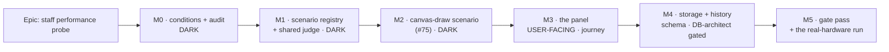

# Implementation Plan: Canvas performance probe on the staff console

- **Feature spec:** [`./feature-spec.md`](./feature-spec.md)
- **Status:** Draft — **awaiting approval**
- **Owner:** _(unassigned)_

> **No application code has been written.** This plan is Stage 5 output only.
>
> **Two gating rules apply and are called out where they bite:**
>
> - **Every schema change goes through `database-architect`, without exception** (CLAUDE.md
>   §19.3/§20). M4-T1 is that task, and M4 cannot start without it. An agent that returns nothing,
>   fails or is slow is **re-run**, never worked around.
> - **A milestone claiming user-facing capability names its entry point, or declares itself dark**
>   (ADR-0081 §1), and **the journey lands with the first user-facing milestone** (§2). M0–M2 are
>   dark and say so; M3 is the first with an entry point and carries the journey.

## Breakdown

### Epic

**Canvas performance probe on the staff console** — put a real-hardware canvas measurement in
reach of the one person who can take it, and make its results comparable across releases and
machines. Roadmap theme: operational tooling; closes the measurement half of
`docs/TECH_DEBT.md` #75 and unblocks `docs/specs/revision-compare-changes/m0-condition.md`
Condition A.

**Sequencing principle.** The epic's deliverable is **a number**, not a panel — so the number
arrives at M3, before any migration. M4 turns one number into a series. M5 takes the readings and
writes them where they will be read.

---

## Milestone 0 — the conditions, and an audit of the instrument

**Outcome:** the bars this epic is judged against exist in the repository **before** any harness
code, and three claims that would otherwise be discovered mid-build are settled.
**Ships dark:** nothing is reachable; no product code changes at all. M3 is the first surface.
**Journey:** none — there is nothing to drive.

#### Feature: falsification conditions and instrument audit

> **Description:** commit F1/F2/F3 in their own commit, then verify three preconditions.
> **Complexity:** S
> **Dependencies:** none
> **Risks:** a condition written after the run is not a condition (ADR-0097 Landing C emitted a
> PROCEED from an `undefined`) → the conditions land in a commit of their own, first.
> **Testing requirements:** none yet; this milestone produces documents and measurements.

##### Task M0-T1 — commit `m0-conditions.md`

- **Description:** F1 (the extraction is a no-op for the CLI), F2 (the initial bundle does not
  move), F3 (the panel and the CLI agree, and `m0-condition.md`'s own 1920 cell comes back
  **INDETERMINATE**) — verbatim from spec §4.17, with the expected values written down.
- **Complexity:** S · **Dependencies:** none
- **Risks:** the temptation to soften a bar later → the file states ADR-0121's standard in its own
  header (both conditions failed; both remedies were applied).
- **Testing:** n/a
- **Steps:**
  1. Write `docs/specs/staff-performance-probe/m0-conditions.md`.
  2. Commit it **alone**, touching no other file.

##### Task M0-T2 — measure the baseline bundle

- **Description:** record the entry chunk's gzip size before anything changes, so F2 has a
  before.
- **Complexity:** S · **Dependencies:** M0-T1
- **Risks:** measuring a dirty tree (ADR-0099's recorded failure: a sweep left running while the
  next milestone was written) → measure on a clean checkout of `main` and record the SHA.
- **Testing:** n/a
- **Steps:**
  1. `pnpm --filter @repo/web build`; record every chunk's gzip size and the commit SHA into
     `m0-conditions.md`.

##### Task M0-T3 — verify three preconditions rather than assume them

- **Description:** three things the design rests on, each checked by running or reading rather
  than by inference.
- **Complexity:** S · **Dependencies:** none
- **Risks:** a precondition assumed and wrong costs a milestone (`@repo/seed`'s dev/prod status
  was assumed by the brief and is not what it looked like) → each is written up with its evidence.
- **Testing:** n/a
- **Steps:**
  1. **`@repo/seed/scale` is browser-safe.** Bundle it alone with esbuild for a browser target
     and confirm no `node:` built-in is required (`scripts/scale-scene.ts:1-6` claims it; verify).
  2. **The retention policy list is table-driven.** Read `retention-policy.ts` and the staff
     Retention panel, and record whether a fourth entry appears **automatically** or needs a hand
     edit in three places. The panel's own copy is derived from the API's list
     (`routes/staff.tsx:297-319`), so the answer decides M4-T5's size.
  3. **`AuditAction` is TEXT + CHECK, not a Postgres enum.** `schema.prisma:3205-3212` says the
     `mail_events.kind` vocabulary is; confirm `audit_events.action` is too, because it decides
     whether M4 costs one migration or two (ADR-0086 D5 paid two for `AuditActorType`).
  4. Record all three, including anything that came back differently from expected.

##### Task M0-T4 — file the ADR-0086 D6 finding

- **Description:** ADR-0086 D6 claims a staff write exists ("send a test message"); the controller
  has no `@Post` (spec §0). File a `docs/TECH_DEBT.md` row.
- **Complexity:** S · **Dependencies:** none
- **Risks:** noticing drift and stepping over it leaves the register exactly as wrong as not
  noticing (the ADR-0071 lesson, cited in CLAUDE.md §16) → file it in this milestone, not "later".
- **Testing:** `pnpm check:debt-status` (a status is mandatory since ADR-0120).
- **Steps:**
  1. Add the row with its evidence and a `**Status:**` line.
  2. Do **not** build the test-send route here — it is a different capability.

**Acceptance:** the conditions file exists with expected values; the baseline bundle sizes and the
SHA are recorded; the three preconditions are answered in writing; the debt row is filed.

---

## Milestone 1 — the scenario registry and the shared judge

**Outcome:** one scenario derivation and one verdict function, consumed by both the browser and
the existing CLI driver. **No behaviour changes anywhere.**
**Ships dark:** no route, no panel, no navigation entry. The only reachable consumer is the
existing headless CLI, which behaves exactly as it did.
**Journey:** none — nothing is reachable. M3 carries the first.

#### Feature: extract, never fork

> **Description:** move the scene/treatment/loop out of `scripts/` into `src/features/perf-probe/`,
> and the verdict out of the `.mjs` driver into a pure TS module. Both existing entry points keep
> working.
> **Complexity:** M
> **Dependencies:** M0
> **Risks:**
>
> - A second copy drifts invisibly — each looks right alone, and only somebody comparing two
>   published numbers months apart would see it (ADR-0065's `routeOrthogonal`, ADR-0121's
>   `stackSeries`) → nothing is copied; the CLI becomes an adapter, and F1 is the proof.
> - The extraction silently changes what is measured → the **existing driver is the before/after
>   oracle** (the ADR-0078 barrel-preserving argument), and its assertions do not change.
>
> **Testing requirements:** unit for the judge (every verdict value, verified red); F1 run and
> recorded; the existing `revision-diff` headless run still produces a verdict of the same shape.

##### Task M1-T1 — the pure judge

- **Description:** lift `measure-revision-diff.mjs:153-243` into
  `src/features/perf-probe/model/judge.ts` as a pure function over plain data. Four verdict
  values (`PASS | FAIL | INDETERMINATE | REFUSED`), total.
- **Complexity:** M · **Dependencies:** M0
- **Risks:**
  - The "throws when it has nothing to judge" property is lost in the move → a test asserting the
    throw is written **first and verified red** against a version that returns a verdict.
  - `INDETERMINATE` is folded into a note (which is what the CLI does today, `:234-241`) → the
    F3 fixture is `m0-condition.md`'s real 1920 cell and must come back INDETERMINATE, not FAIL.
- **Testing:**
  - Zero pairs → throws. Non-finite aggregate → throws.
  - Non-vacuity checked **first**, before any timing (`measure-revision-diff.mjs:153`).
  - Proportional floor with the absolute guard underneath (`:73-74`), including the case that
    made the control unrunnable (`m0-condition.md:219-228`).
  - Baseline spread ≥ bar → INDETERMINATE, using the real recorded 1920 numbers.
  - Thresholds travel **in** the result, so a stored row records what bar it was judged against
    (the ADR-0116 G3 precedent).
- **Steps:**
  1. Write the verdict vocabulary and refusal reasons with their sentences.
  2. Write the tests, verified red.
  3. Write `judge()`.

##### Task M1-T2 — the run loop and the guards

- **Description:** `run/run-scenario.ts` — idle-interval baseline, paired alternating runs,
  visibility/clock/frame guards, device capture.
- **Complexity:** M · **Dependencies:** M1-T1
- **Risks:**
  - A guard that refuses too much makes the instrument unusable → focus loss is a **flag**, not a
    refusal (spec §4.7); only visibility refuses.
  - The idle-interval baseline is dropped as "decoration" → its docblock reason is carried across
    verbatim: without it a 120 Hz machine is scored against 16.7 ms and reported as dropping half
    its frames (`revision-diff-bench.ts:227-233`).
- **Testing:** unit with a faked `requestAnimationFrame` and `document.visibilityState`; one case
  per refusal reason, each verified red. **The jsdom limit is stated in the suite's docblock**: it
  has no compositor and no real frame clock, so these tests prove the guards' _logic_ and nothing
  about pacing. Pacing is M3's journey and M5's real run.
- **Steps:**
  1. Device capture in `run/device.ts`, reusing the masked-GPU precedent verbatim
     (`measure-draw-in-browser.js:169-182`).
  2. The loop, with the guards armed before the first frame and disarmed in a `finally`.
  3. Tests.

##### Task M1-T3 — the registry and the `revision-diff` scenario

- **Description:** `model/registry.ts` (ids, titles, questions, thresholds — **no scene code**) and
  `scenarios/revision-diff.ts` (the scene and treatment, moved from the bench).
- **Complexity:** M · **Dependencies:** M1-T2
- **Risks:** the registry accidentally imports a scenario, defeating the split → a structural test
  asserts `model/registry.ts` imports nothing from `scenarios/`, verified red.
- **Testing:** the scene builder's counts (bars/links visible) are asserted for both scenes at a
  fixed viewport, so a change to the generator that alters non-vacuity is visible.
- **Steps:**
  1. Move `changedSet`, `paintChangedLinks`, `fixtureScene` and the treatment wiring.
  2. Keep every comment verbatim — these comments record defects that shipped
     (`revision-diff-bench.ts:137-152` records two that produced a confident FAIL).
  3. The registry, with the thresholds from `m0-condition.md`.

##### Task M1-T4 — the CLI becomes an adapter, and F1 is run

- **Description:** `scripts/revision-diff-bench.ts` reduces to a `window.__benchRevisionDiff`
  adapter; `measure-revision-diff.mjs` imports the extracted judge instead of holding its own.
- **Complexity:** M · **Dependencies:** M1-T3
- **Risks:** the `.mjs` driver cannot import a `.ts` module → it already bundles with esbuild
  (`:87-100`); the judge is bundled the same way, or the driver reads it from the bench's bundle.
  **Verify which before writing**, rather than discovering it at the first run.
- **Testing:** **F1** — run the headless driver on both scenes and both presets; assert the
  verdict's shape and the throw behaviour are unchanged. Record the output in `m0-conditions.md`,
  including that absolute timings differ and why that is expected here.
- **Steps:**
  1. Refactor. 2. Run F1. 3. Record. 4. If F1 fails, fix the extraction — not the condition.

##### Task M1-T5 — promote `@repo/seed`, and the engine import ban

- **Description:** move `@repo/seed` from `devDependencies` to `dependencies` in
  `apps/web/package.json`, and add a structural test that no module under `features/perf-probe/`
  imports the CPM engine.
- **Complexity:** S · **Dependencies:** M1-T3
- **Risks:**
  - The **barrel** gets imported instead of `@repo/seed/scale`, dragging `node:fs` into the
    bundle — which happened once (`docs/TECH_DEBT.md` #252) → a structural test bans the barrel
    import under `features/perf-probe/`, verified red.
  - The promotion moves bundle weight into the entry chunk → **F2 is not run until M3**, when the
    dynamic import exists; until then the scenarios have no importer in `src/`, so there is
    nothing to bundle.
- **Testing:** two structural tests, each verified red against a deliberate violation.
- **Steps:**
  1. Move the dependency. 2. Both structural tests. 3. `pnpm typecheck`, `pnpm lint`.

**Acceptance:** F1 recorded; the existing CLI produces a same-shape verdict; the judge's four
values are covered with every refusal verified red; two structural tests pass and were red first;
no product surface changed.

---

## Milestone 2 — the canvas-draw scenario (`docs/TECH_DEBT.md` #75)

**Outcome:** the scenario that answers #75 exists as a pure module: sustained pan under rAF, at
Week and Fit, at **2,000 and 500 activities**.
**Ships dark:** no surface. Reachable only from a test and (optionally) a CLI driver.
**Journey:** none. M3 carries the first.

#### Feature: the draw scenario

> **Description:** an **absolute** scenario (one run per pair, no treatment) reporting dropped
> frames, interval p50/p95 and fps, judged against ADR-0026 §9's fps gate.
> **Complexity:** M
> **Dependencies:** M1
> **Risks:**
>
> - **Measuring the cull rather than the painter.** ADR-0066 records exactly this: a plan laid
>   nose-to-tail spanned 28 years, so "whole plan" zoom culled nine bars in ten and reported
>   4.6 ms p95 — "it looked like the budget being met" (`TECH_DEBT.md:470-475`) → the scenario
>   asserts a **minimum visible-bar count** at each preset as its non-vacuity floor, and the
>   count is reported beside every number.
> - **Quoting the wrong gate.** 4 ms was never a budget; §9's gate is **fps**
>   (`TECH_DEBT.md:391-394`) → the thresholds are `≥ 45 fps @ 500` and `≥ 30 fps @ 2,000`, named
>   in the registry with the citation, and a duration is reported but never gated.
>
> **Testing requirements:** unit on the scene's shape and non-vacuity counts; the fps thresholds
> asserted against the registry rather than restated in the scenario.

##### Task M2-T1 — the scenario

- **Description:** `scenarios/canvas-draw.ts` — `scaleScene(2000)`, `scaleScene(500)` and the
  147-activity control, at Week (12 px/day) and Fit (derived from the plan's own span, per
  `revision-diff-bench.ts:362-368`).
- **Complexity:** M · **Dependencies:** M1
- **Risks:** the Fit preset produces a different framing at a different viewport, making two
  machines incomparable → the derived px/day and the visible-bar count are both recorded on the
  result, so a reader can see the framing rather than assume it.
- **Testing:** the visible-bar count at each preset/size is asserted at a fixed viewport; the
  500-activity variant is asserted to be genuinely 500-ish, not a truncation artefact.
- **Steps:**
  1. The scene sizes and presets. 2. The non-vacuity floors. 3. Registry entries with the §9
     citation. 4. Tests.

##### Task M2-T2 — Fit is reported, never gated

- **Description:** at Fit the shipped painter already drops 10.2 % of frames on real hardware
  (`TECH_DEBT.md:511`), and §9's fps gate still **passes** there (`:566-569`). The scenario reports
  Fit and gates only where the gate is meaningful.
- **Complexity:** S · **Dependencies:** M2-T1
- **Risks:** a gate that fails on day one gets deleted rather than fixed (ADR-0058) → Fit is
  P3-shaped, exactly as `m0-condition.md:87-90` and `measure-revision-diff.mjs:215-221` handle it.
- **Testing:** a unit case asserting a Fit result carries numbers and **no** pass/fail verdict.
- **Steps:** 1. Add the preset's report-only marking to the registry. 2. Test.

**Acceptance:** both scenarios exist and are pure; the fps thresholds cite §9 and are not
restated; Fit reports without gating; the 500-activity limb exists for the first time.

---

## Milestone 3 — the panel (**first user-facing milestone**)

**Outcome:** a staff member presses one control and gets a real-hardware verdict, with a **Copy**
button. **No API, no schema** — the number arrives a release before storage does.
**Entry point:** `/staff` → the **Performance** panel → the button **Run measurement**
(`role="button"`, accessible name `Run measurement`).
**Journey:** `apps/web/e2e-staff/staff.spec.ts` is extended (or a sibling spec is added under the
same `playwright.staff.config.ts`, whose `STAFF_EMAILS` pinning is what makes the staff path
reachable at all) — it signs in as staff, presses the control, and asserts the panel reaches a
terminal state. **This is not deferred to M5** (ADR-0081 §2).

#### Feature: the Performance panel

> **Description:** the registry, the confirmation, the run, the announced progress, the verdict,
> the refusal, and Copy.
> **Complexity:** L
> **Dependencies:** M2
> **Risks:**
>
> - **The milestone ships with no reachable entry point.** ADR-0081's own defect, recorded five
>   times in this register (most recently ADR-0099 M10's drawer) → the journey is a task in **this**
>   milestone and drives the real control, not a mounted component.
> - **Native `disabled` on the Run control**, which blurs focus to `<body>` and flips twice per
>   run — found in ADR-0060 M6, ADR-0063 M6, ADR-0064 §7, ADR-0077 → `aria-disabled` + a guard +
>   a linked reason (ADR-0083), with a test.
> - **A bespoke card.** This exact file was found to be the only place in the codebase using
>   `Card` against its documented composition contract, five times → compose through the file's
>   existing `Panel` helper (`routes/staff.tsx:120-151`).
> - **F2 fails and the entry bundle grows** → the fallback (a build-time JSON asset, spec §4.16)
>   is named now; the epic stops until one of the two holds.
>
> **Testing requirements:** unit (panel states, each refusal rendered, the Run control's gating,
> nothing posted on refusal); F2 and F3 run and recorded; the journey; axe within the existing
> `e2e-staff` sweep.

##### Task M3-T1 — the panel shell and the lazy scenario import

- **Description:** the panel lists scenarios from the registry and downloads **nothing** until the
  press.
- **Complexity:** M · **Dependencies:** M2
- **Risks:** the panel statically imports a scenario and the split silently disappears → a
  structural test asserts the panel imports only `model/`, verified red; and **F2 is the real
  proof**.
- **Testing:** unit — the panel renders with the scenarios module mocked as never-resolving, and
  the list is still readable.
- **Steps:** 1. `PerformanceProbePanel` via `Panel`. 2. Registry-driven list. 3. Dynamic import on
  press, with its own error state (the panel must survive its dependency being absent).

##### Task M3-T2 — the run, the confirmation and the announcement

- **Description:** the confirmation dialog (duration, foreground requirement, reduced-motion
  statement), the measuring state, the progress announcement.
- **Complexity:** M · **Dependencies:** M3-T1
- **Risks:**
  - A modal `<dialog>`'s focus restoration drops focus to `<body>` when the opener unmounts — this
    repository's third-most-repeated defect (ADR-0080, ADR-0096, ADR-0099 M10) → the confirmation
    returns focus to the Run control, asserted.
  - The live region is overwritten by a later announcement (ADR-0079's debounced count, ADR-0080's
    focus announcement) → progress and verdict share one region and the verdict is announced
    **inside** the focus frame.
- **Testing:** unit for each state; the focus-return case verified red.
- **Steps:** 1. Confirmation. 2. Measuring state with `aria-disabled` Run. 3. Progress through the
  existing `Panel` `status` slot (`routes/staff.tsx:144-146`).

##### Task M3-T3 — the verdict, the refusal and Copy

- **Description:** render all four verdict values, each refusal reason as a sentence, and a Copy
  button producing a paste-ready block in the shape `measure-draw-in-browser.js:212-227` already
  uses.
- **Complexity:** M · **Dependencies:** M3-T2
- **Risks:**
  - A refusal rendered as a verdict → a test asserts a REFUSED run shows **no** PASS/FAIL wording
    anywhere in the panel.
  - `INDETERMINATE` rendered as a caveat under a PASS → a test asserts the word PASS does not
    appear for the F3 fixture.
  - Copy needs `clipboard-write`, which the CSP `Permissions-Policy` **enumerates rather than
    blanket-denies** (ADR-0074) — confirm the header already permits it for this origin rather
    than assuming, since two Copy buttons already depend on it.
- **Testing:** unit per verdict; the F3 fixture drives INDETERMINATE end to end through the panel.
- **Steps:** 1. Verdict rendering. 2. Refusal sentences. 3. Copy. 4. Tests.

##### Task M3-T4 — run F2 and F3

- **Description:** the two conditions this milestone can answer.
- **Complexity:** S · **Dependencies:** M3-T3
- **Risks:** measuring a dirty tree → clean build, SHA recorded, compared against M0-T2.
- **Testing:** F2 (entry chunk gzip unchanged; probe chunk reported), F3 (panel and CLI agree on
  the recorded 1920 cell, both INDETERMINATE).
- **Steps:** 1. Build and compare. 2. Run F3 both ways. 3. Record both in `m0-conditions.md`,
  including anything that came back differently from the prediction.

##### Task M3-T5 — the journey

- **Description:** extend `apps/web/e2e-staff/` to drive the real control against a real API with
  the real staff guard.
- **Complexity:** M · **Dependencies:** M3-T3
- **Risks:**
  - The run takes ~40 s and the suite's timeout is 120 s (`playwright.staff.config.ts:30`) → the
    journey uses a **short** scenario variant (few pairs, few frames) exposed for testing, and
    asserts the _machinery_, not a pacing number. **State this in the spec's docblock**: a CI
    container cannot produce a quotable number (spec §4.4), so the journey proves the path and
    nothing about performance.
  - A locator tied to copy rather than to a role/name (ADR-0091's recorded lesson) → locate by
    role and accessible name.
- **Testing:** the journey itself; it must be **run locally** (`scripts/e2e-local.sh web:staff`)
  before push, per CLAUDE.md §19.8 — CI is the second opinion, never the first.
- **Steps:**
  1. Press the control, confirm, wait for a terminal state, assert **either** a verdict **or** a
     refusal is shown with its reason — both are correct outcomes in a container, and asserting
     only one would make the suite depend on the runner's frame clock.
  2. Assert no PASS wording accompanies a refusal.
  3. Confirm the existing axe sweep (`staff.spec.ts:278-281`) now covers the panel.

**Acceptance:** a staff member reaches a verdict in one press; every refusal renders as a refusal;
F2 and F3 recorded; the journey runs locally and in CI; axe clean.

---

## Milestone 4 — storage and history

**Outcome:** results are recorded and comparable across releases and machines.
**Entry point:** the same **Run measurement** control, which now also records; plus the
**Recorded measurements** table in the Performance panel.
**Journey:** M3's journey is extended to assert a row appears after a recorded run and that a
refused run records nothing.

#### Feature: the table, the routes and the history

> **Complexity:** L
> **Dependencies:** M3
> **Risks:** see per-task.
> **Testing requirements:** API e2e against a real Postgres (the guard, the uniform 404, the audit
> row, the DTO bounds); unit for the service; the extended journey.

##### Task M4-T1 — **GATING: design the schema with `database-architect`**

- **Description:** put spec §4.13's six questions to the agent and design
  `perf_probe_results` with it. **No migration is written before this task completes.**
- **Complexity:** M · **Dependencies:** M3
- **Risks:** the agent returns nothing, fails, or is slow → **re-run it**. An unavailable agent is
  a reason to wait, never to proceed (CLAUDE.md §20). A migration is checksummed the moment it
  lands and applies to a real database, so a mistake costs a second migration in every
  environment rather than an edit. The one prior instance of skipping this
  (`csp_reports`, hand-written) produced four defects, two of them fatal.
- **Testing:** n/a — this task produces a design.
- **Steps:**
  1. Hand the agent spec §4.9's proposed shape and §4.13's six questions.
  2. Record the agent's answers **and any disagreement with §4.9**, in this directory. A
     disagreement is the finding, not a nuisance.
  3. Only then write the migration.

##### Task M4-T2 — the table and the migration

- **Description:** the model, the migration, and its docblocks.
- **Complexity:** M · **Dependencies:** M4-T1
- **Risks:**
  - It gets modelled on `audit_events` — the reflex `docs/DATABASE.md:1406-1414` warns about →
    the migration says **in the file** that this table is ordinary, updatable, deletable and
    expirable, and why (spec §4.9).
  - A `DEFAULT` invents a fact. ADR-0126's rule: `lane_index`'s `DEFAULT 0` would tell every
    pre-existing row it sat in the top lane → **no defaults on device columns**; absent is NULL
    and means "not captured".
  - A new child table breaks unrelated suites on a `RESTRICT` FK — ADR-0126 broke 557 of 587 API
    e2e tests this way → this table has no parent in the hierarchy, but the FK question from
    M4-T1(1) is exactly this risk and must be answered before the migration.
- **Testing:** `pnpm --filter @repo/api test` plus the schema-drift check; `scripts/e2e-local.sh api`.
- **Steps:** 1. Model + docblocks. 2. Migration. 3. `docs/DATABASE.md` §"Operational telemetry"
  gains a third table, written to the same standard as its two siblings.

##### Task M4-T3 — the audit action and the census

- **Description:** `staff.probe_recorded` joins `AUDIT_ACTIONS`, `AUDIT_ACTION_CATEGORY` and
  `ALLOWED_FIELDS` (empty); both new routes join `AUDITED_ROUTES`.
- **Complexity:** S · **Dependencies:** M4-T2
- **Risks:**
  - The census's **seventh assertion** derives from the path
    (`audit-coverage.structural.spec.ts:478-493`), so leaving either route unaudited fails CI —
    which is the gate working. Do not "fix" it by classifying the route as a read.
  - A new action widens the ADR-0073 C4 action-filter cap, which shipped as a literal `20` and was
    reached by two chips the day the vocabulary grew → the cap is **derived** now
    (`packages/types`), so confirm rather than assume, and check the audit-filter surface.
  - `ALLOWED_FIELDS` is keyed exhaustively (`audit-redactor.ts:24`) so omitting the action is a
    **compile error** — that is the mechanism; no checklist needed.
- **Testing:** the census suite; a redactor test asserting the new action records **no** fields.
- **Steps:** 1. Vocabulary. 2. Category. 3. Empty allow-list. 4. Census entries. 5. Run the census.

##### Task M4-T4 — the routes

- **Description:** `POST` and `GET` on `StaffController`, a `StaffProbeService`, DTOs with every
  bound from spec §2.
- **Complexity:** M · **Dependencies:** M4-T3
- **Risks:**
  - The response gets double-wrapped — `TransformInterceptor` already wraps, and the controller's
    own docblock records the trap (`staff.controller.ts:108-110`) → return bare DTOs; the **API
    e2e is the only place the real interceptor runs**.
  - The service accidentally takes a `Principal` → it takes `StaffPrincipal`, and the compile
    error is the guarantee (spec §4.10). Confirm `staff-boundary.structural.spec.ts` covers the
    new service, by **reading that file**, not by assuming its roster is derived.
  - `record()` vs `recordBestEffort()` — the wrong choice on the first staff write sets the
    precedent → `record()`, per `staff.controller.ts:88-95`'s argument; the consequence (an
    unwritable audit table means nothing is stored) is the right way round and is stated.
- **Testing:** API e2e — a member gets 404; a staff member gets 201; the audit row exists with the
  scenario in `subjectLabel` and **no** device data; every DTO bound rejected with 422; the
  throttle.
- **Steps:** 1. DTOs. 2. Service + repository. 3. Controller methods with OpenAPI. 4. `docs/API.md`.

##### Task M4-T5 — retention

- **Description:** `RETENTION_PERF_PROBE_DAYS` (default 365) joins the policy and the sweep; the
  staff Retention panel gains a row.
- **Complexity:** S · **Dependencies:** M4-T2, and **M0-T3(2)'s answer**
- **Risks:**
  - The panel does **not** pick the table up automatically and the row is silently missing → that
    is exactly what M0-T3(2) was for; size this task from its answer.
  - A boolean added later uses `z.coerce.boolean()`, where `'false'` parses to `true`
    (`env.validation.ts:197-205`) → no boolean is added here; the note is carried in the docblock.
- **Testing:** the retention sweep's own suite; the journey's existing retention assertions must
  still pass with a fourth row present.
- **Steps:** 1. Env var + validation. 2. Policy entry. 3. `.env.example` + `docs/DEPLOYMENT.md`. 4. Confirm the panel.

##### Task M4-T6 — the panel records, and the history table

- **Description:** post on a non-refused verdict; render the history; **post nothing on a refusal**.
- **Complexity:** M · **Dependencies:** M4-T4
- **Risks:**
  - A refused run gets posted → asserted with a **spy on the client**, not by reading the code.
  - A failed POST loses the measurement → the verdict stays on screen with "not recorded" and a
    **Retry recording** control.
  - The empty state conflates "nothing recorded yet" with "nothing matched" — ADR-0073 C1's
    accessibility finding, where a live region said "Showing 0 events" for both → there are no
    filters here, so there is exactly one empty state and it says so.
- **Testing:** unit (post/no-post, retry, empty); the extended journey.
- **Steps:** 1. Hooks. 2. Post on verdict. 3. History via `DataTable`. 4. Extend the journey.

**Acceptance:** a recorded run appears in the history with its machine and app version; a refused
run records nothing; a member gets 404 from both routes; one audit row per recording with no
device data; the retention row is visible; `scripts/e2e-local.sh api` and `web:staff` both green
locally.

---

## Milestone 5 — the gate pass, and the number

**Outcome:** the specialist reviews are folded, **and the epic's actual deliverable exists** — a
real-hardware reading, written where it will be read.
**Entry point:** unchanged. This milestone adds no capability.
**Journey:** unchanged, plus whatever the reviews require.

#### Feature: reviews, then the run

> **Complexity:** M
> **Dependencies:** M4
> **Risks:** the epic is declared done at M4 with a panel and no number — which would be the
> ADR-0081 shape at epic scale: a working task list and no capability exercised.
> **Testing requirements:** every fix carries a regression test **verified red first**.

##### Task M5-T1 — the gate pass

- **Description:** run the specialists over the combined diff.
- **Complexity:** M · **Dependencies:** M4
- **Risks:** deferring reviews to "later" — this repository's gate pass has blocked on real
  defects in **eight consecutive epics** → they run before the number is quoted.
- **Testing:** regression tests for every blocking finding, each verified red.
- **Steps:**
  1. **security-reviewer** — the first staff write, the attacker-influenced body, the stored GPU
     string, the compile-error property.
  2. **api-reviewer** — status codes, envelopes, the uniform 404, OpenAPI, pagination.
  3. **backend-performance-reviewer** — the insert, the bounded read, the sweep's new predicate.
  4. **component-reviewer** — `Panel` composition, the `aria-disabled` gate, no one-off styling.
  5. **accessibility-reviewer** — the live region, focus return from the confirmation, the
     `aria-hidden` canvas, reduced motion.
  6. **ux-reviewer** — the refusal sentences, which are the whole product here: a reader must be
     able to tell "not judgeable" from "bad" from "not recorded".
  7. Fold every blocking finding; file the rest as a `docs/TECH_DEBT.md` row with reasons.

##### Task M5-T2 — take the reading

- **Description:** the product owner runs each scenario on their own machine, headed, on mains,
  and the results are recorded.
- **Complexity:** S · **Dependencies:** M5-T1
- **Risks:** a single run is quoted as a fact → take **three** on each scenario and quote the
  spread beside the value, which is the design that passed (ADR-0100 M0) and the one
  `m0-condition.md` insists on.
- **Testing:** n/a — this task produces measurements.
- **Steps:**
  1. Canvas draw @ 2,000, Week and Fit. 2. Canvas draw @ **500** — §9's never-measured limb.
  2. Revision diff (Condition A). 4. Record the machine, the width and the browser.

##### Task M5-T3 — write the numbers where they will be read

- **Description:** the readings go into the documents that currently carry the stale or absent
  ones.
- **Complexity:** M · **Dependencies:** M5-T2
- **Risks:** the numbers live only in the panel, and the register keeps quoting 2026-08-03 →
  #75 and `m0-condition.md` are both edited, in this task, with the date and the machine.
- **Testing:** `pnpm check:debt-status`, `pnpm check:counts`, `pnpm check:doc-links`.
- **Steps:**
  1. `docs/TECH_DEBT.md` #75 — the new readings, the 500-activity limb, and whether §9 still
     passes. **Do not close the row**: its unattributed ~8 ms at Fit is a separate, open question
     and step 3 stands.
  2. `m0-condition.md` — Condition A answered, or recorded as still unanswerable **and why**.
  3. The ADR (spec §4.20), filed with a number, and `docs/adr/README.md` updated —
     `check:adr-coverage` validates **both directions** since ADR-0110 D6.
  4. `CLAUDE.md` §16 entry; changeset; `docs/DECISIONS.md` for anything smaller.

##### Task M5-T4 — take the answer back to the product owner

- **Description:** if a scenario FAILS its gate, the numbers and the options go to them.
- **Complexity:** S · **Dependencies:** M5-T3
- **Risks:** an engineer decides what a FAIL means → `m0-condition.md:110`: "The decision is
  theirs; the measurement is mine." **Q2 in the spec pre-answers this**; if Q2 was answered (a),
  this task is a report and nothing more.
- **Steps:** 1. Present numbers, spread, machine. 2. Present options. 3. Record the decision.

**Acceptance:** all six reviews run and their blocking findings folded with red-first regression
tests; three readings per scenario recorded with their spread; #75 and `m0-condition.md` updated;
the ADR filed and indexed.

---

## Sequencing & slices

| Slice | Ships                                  | Reachable? | Releasable alone                                 |
| ----- | -------------------------------------- | ---------- | ------------------------------------------------ |
| M0    | conditions, measurements, one debt row | No — dark  | Yes (docs only)                                  |
| M1    | one derivation, one judge              | No — dark  | Yes (no behaviour change; the CLI is the oracle) |
| M2    | the #75 scenario                       | No — dark  | Yes                                              |
| M3    | **the panel — the first number**       | **Yes**    | Yes                                              |
| M4    | storage and history                    | Yes        | Yes                                              |
| M5    | reviews + the reading + the ADR        | Yes        | Yes                                              |

**No feature flag.** ADR-0088 D1 established that a `VITE_` constant is inlined at build time,
`docker-publish.yml` passes none, and `.dockerignore` strips `**/.env` — so a `VITE_` flag has
never been an operator rollback. The rollback here is a commit boundary, and the surface is
already gated by runtime staff-ness, which an operator _can_ change without a release
(`STAFF_EMAILS`).

**`pnpm check:frontend-only`** is a no-op: `scripts/frontend-only.json` is `"active": false`
(`:2`, deactivated 2026-08-26). Verified rather than assumed, because that file has gone **wrong
about a different change** twice when left armed.

## Definition of Done (per task)

Each task's PR satisfies the Feature Completion Criteria in [`docs/PROCESS.md`](../../PROCESS.md).
Three are called out because this epic makes them easy to miss:

- **`pnpm prepush` is one command and is run as one.** Running its parts by hand is how a gate
  gets missed — that cost a CI round on an ADR whose whole subject was filing one (CLAUDE.md
  §19.8).
- **`scripts/e2e-local.sh api`** for every M4 task; **`scripts/e2e-local.sh web:staff`** for M3-T5
  and M4-T6. Not optional and not CI's job.
- **Nothing may be running on ports 3000 or 5173** when a journey is started: `reuseExistingServer`
  is true outside CI, so a leftover dev server is silently adopted and a config's env pins never
  apply — which produced three consecutive false diagnoses in one session (ADR-0099).

## Risks & assumptions (rollup)

| Risk / assumption                                                         | Likelihood | Impact   | Mitigation                                                                                                            |
| ------------------------------------------------------------------------- | ---------- | -------- | --------------------------------------------------------------------------------------------------------------------- |
| A server-side probe is proposed later as "simpler"                        | med        | **high** | D1 is an ADR decision with the 0.56→1.85 / 0.93→10.00 pp evidence, not a preference                                   |
| F2 fails: the entry bundle grows for every user                           | med        | high     | Condition committed before code; fallback (build-time JSON asset) named in spec §4.16; the epic stops until one holds |
| The scenario code forks from the CLI bench                                | med        | high     | M1 extracts rather than copies; F1 is the proof; a structural test bans the barrel import                             |
| A refused run is recorded as a verdict                                    | low        | **high** | Four-value verdict; refusal tests verified red; the no-post case asserted with a spy                                  |
| INDETERMINATE is collapsed into PASS                                      | med        | high     | F3 uses `m0-condition.md`'s real 1920 cell and must return INDETERMINATE                                              |
| The schema is written without `database-architect`                        | low        | **high** | M4-T1 is a gating task; the one prior instance produced four defects, two fatal                                       |
| The stored GPU string is later judged unacceptable                        | med        | med      | **Q1** is asked before any migration; reversing after M4 costs a migration and a scrub                                |
| The panel ships with no reachable entry point                             | low        | high     | ADR-0081: M3 names its control and carries the journey; five recorded instances of this class                         |
| The journey asserts a pacing number and fails in CI on the runner's clock | med        | med      | M3-T5 asserts a terminal state, never a number; the docblock states that a container cannot produce a quotable one    |
| The numbers stay in the panel and #75 keeps quoting 2026-08-03            | med        | high     | M5-T3 is a task with named files, not a follow-up                                                                     |
| ADR-0086 D6's phantom write is "fixed" opportunistically inside this epic | low        | med      | M0-T4 files it as debt; building it is a different capability with its own spec triggers (ADR-0105)                   |
| The audit census fails at M4 and is "fixed" by reclassifying the route    | low        | high     | Spec §4.11 works both ADR-0073 tests in writing and states that the seventh assertion is the gate doing its job       |
| `@repo/seed`'s barrel is imported and drags `node:fs` into the bundle     | med        | med      | Structural test verified red; the incident (`docs/TECH_DEBT.md` #252) is cited in the test's docblock                 |
| A measurement is taken on a dirty tree                                    | med        | med      | Every measurement records its SHA; M0-T2 establishes the baseline on a clean checkout                                 |
