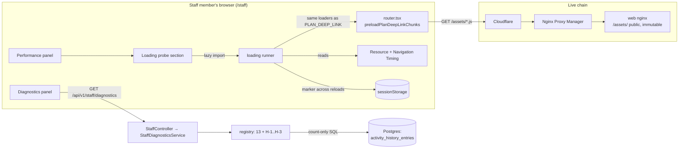
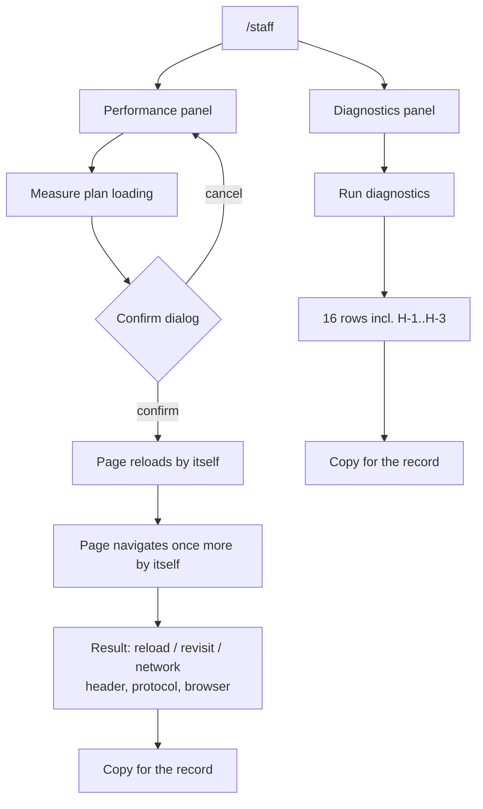

# Feature Spec: Two server readings from the staff console (plan-screen loading, activity-history volume)

- **Status:** Approved — by the product owner, 2026-10-05 (in session), "approved as described": defaults D-1 to D-6 stand; M1 (history counts) first, before 1 November.
- **Author(s):** Claude Code (feature-analyst), for James Ewbank (product owner)
- **Date:** 2026-10-05
- **Tracking issue / epic:** `docs/TECH_DEBT.md` #433 and #443; ADR-0174 plan task M3-T2
- **Roadmap link:** none (debt and owed measurements, not a roadmap theme)
- **Related ADR(s):** ADR-0086 (staff principal), ADR-0128 (in-browser probe), ADR-0140 (a diagnostic
  takes no input), ADR-0171 (route code-splitting), ADR-0174 (activity history), ADR-0081 (entry point
  and journey), ADR-0088 D1 (no flag), ADR-0105 (when a debt row stops being a spec). **No new ADR is
  proposed** (§4 "Implementation approach" says why).

> **Why this is a spec and not a debt-row fix (ADR-0105).** Both readings add a control to the staff
> console. That is a **user-facing entry point**, so the full spec is required whatever the size.
> The other three triggers: **Playwright config / CI step**: no new config. The existing `e2e-staff`
> suite gains steps. **Component public contract / shared gate**: no primitive changes. The
> diagnostics DTO's closed `unit` vocabulary gains a member, which widens an API contract (OpenAPI)
> but changes no gate. **Schema**: none in the default design. The one conditional route to a schema
> change is in §3 (Performance) and goes to **database-architect** if it is ever taken.

---

## 0. What was checked before writing, and what was found wrong

The brief, the two rows and the documents they cite were each read against the code (CLAUDE.md
§19.11: "the brief is not evidence"). Findings that change the design are marked **(design)**. The
others are corrections for the register.

### #433 — plan-screen refresh

1. **The measured path was not a refresh.** `planDeepLinkWarm` navigates to `about:blank` first, "so
   the second visit is a fresh document load, **not a reload** that revalidates"
   (`apps/web/measure-route-splitting/timing.spec.ts:229-232`). The route-splitting spec named it "warm
   first-plan-open" with a **5 %** bar (`docs/specs/route-code-splitting/feature-spec.md:302`). The CQ-2
   outcome (`:394-404`), ADR-0171 (`:85`) and #433 call it "refresh" and judge it against **10 %**.
   It fails under either bar, so the verdict stands. But the row names a path nobody measured.
   **(design)**: the probe reports a **reload** and a **revisit** separately, and checks each with
   `PerformanceNavigationTiming.type`.
2. **The row's cause is not the cause §13 gives for the remaining gap.** #433 says
   "six-connections-per-origin is the cause of the regression and h2 removes the limit."
   `m0-measurement.md` §13 credits six-connection saturation to the **M3** build's 54 requests
   (`:390-404`), which the `ui-shared` group fixed. It puts the remaining ~190 ms down to "one extra
   wave: the router asks for a route's chunk only after the entry has executed" (`:433-436`). That is
   a **sequential** dependency, and HTTP/2 does not remove one. If the chunks come from cache, neither
   mechanism costs a round trip. **(design)**: the protocol is recorded, but it only matters if
   chunks are revalidated. The probe's deciding number is **how many chunks went to the network on
   a reload**.
3. **The live chain is not nginx alone.** Production is Cloudflare → Nginx Proxy Manager → web
   (`apps/web/nginx.conf:17-18`, `docs/DEPLOYMENT.md:96-106`). Either hop could rewrite
   `Cache-Control`, so `nginx.conf:35-38` is a claim about one hop, not about what reaches the
   browser. **(design)**: the reading is taken **in the browser**, after every hop.
4. **Found while reading, not in scope, not in the register** (`grep add_header docs/` finds nothing):
   `location /assets/` uses `add_header` (`nginx.conf:37`). The file's own comment (`:46-48`) says an
   `add_header` in a location **replaces** every server-level header. So hashed JS and CSS are served
   **without** `X-Content-Type-Options: nosniff` or `Cross-Origin-Resource-Policy`, both of which apply
   to subresources. The same is true of `/theme-boot.js` and `/favicon.svg`. This should become a new
   register row, not part of this epic.

### #443 — activity history

5. **The 1 November obligation is not in #443.** #443 covers write cost and expiry cost. The row rate
   is ADR-0174 plan task **M3-T2** ("on the product owner's host four weeks after M2, count entries per
   plan per day, bytes per entry, and the share from `LOGIC` / `RESOURCES`",
   `docs/specs/activity-change-history/implementation-plan.md:663-667`). M3-T2 has **no register row**.
   `docs/HANDOFF.md:47` files it under #443.
6. **#443's "Next" step has nobody who can perform it.** It says "run
   `activity-history.measure.ts` against a disposable database on the deployed host (or the product
   owner's machine)". That needs a shell and a checkout. The product owner does not run terminal
   commands, and no agent has a shell on that host.
7. **A passive source for the expiry reading already exists, and #443 does not mention it.** Each
   real expiry logs `durationMs` beside its counts, including `activityHistoryEntries`
   (`apps/api/src/common/hierarchy/hierarchy-expiry.service.ts:347-357`). That is the cold, interleaved,
   production reading #443 wants. It only appears when `RETENTION_HIERARCHY_ENABLED` is on and a scope
   expires, and it only appears in the API log.

---

## 1. Business understanding

### Problem

Two measurements have been promised and can only be taken on the live server:

- **#433.** The September code-splitting change made the plan screen about 17 % slower to reopen
  (1,199 → 1,403 ms median, 4 → 8 JavaScript requests). That figure came from a test server that
  re-checks every code file with the server on each visit. The live server tells browsers to keep
  those files for a year. Nobody has checked whether the live server actually pays the cost.
- **#443 / M3-T2.** Activity history (shipped 2026-10-04) was sized from an **estimate** of 18k–190k
  entries a year per busy plan. Two things rest on that estimate: the retention trigger (one plan
  above 1,000,000 entries) and the clean-up cost budget (`HISTORY_ROWS_PER_ACTIVITY = 5`). The real
  rate is owed around **1 November 2026**, four weeks after the feature started recording.

Today the only ways to take either reading are a terminal on the server or a developer tool. The
product owner has asked for "automated via the staff panel where feasible". The staff console already
does this for canvas frame rates (ADR-0128) and for counts over customer data (ADR-0140).

### Users

- **Staff** (an address in `STAFF_EMAILS`, ADR-0086). In practice, the product owner. This is the only
  user of both features.
- **Not** Org Admin, Planner, Contributor, Viewer or External Guest. No organisation role sees
  either surface, and the console answers a uniform 404 to all of them (`staff.controller.ts:66-75`).

### Primary use cases

1. **Read the plan-screen reload cost on the live server.** Press one control in the staff console
   and get the following, ready to paste: how many of the plan screen's code files went to the network
   on a reload and on a revisit, which protocol was used, what caching header actually arrived, and how
   long the files took to become ready.
2. **Read activity-history volume on the live server.** Press **Run diagnostics** on or after
   2026-11-01 and get, as counts: entries in total, entries begun in the last 28 days with the plans
   and organisations they fall in, the share of those that are link and resource entries, and how many
   entries are larger than the estimate assumed.

### User journeys

- **Loading reading:** `/staff` → Performance → **Measure plan loading** → confirm → the page reloads
  itself (and navigates once more) without any further input → the result appears with **Copy for the
  record**. About 10–20 seconds in all.
- **History reading:** `/staff` → Diagnostics → **Run diagnostics** (unchanged control) → three new
  rows appear in the existing list → **Copy for the record** (unchanged).

### Expected outcomes

- #433 can be **closed or made concrete**, as its own remedy asks: either "no chunk revalidates on
  the live server, delete the row", or "N chunks revalidate over protocol P, file the build step".
- M3-T2 is **taken**. ADR-0174's estimate is replaced by a measured rate, and the retention trigger
  becomes something a press can check.
- #443's write-cost and expiry-cost halves are **re-scoped honestly** (§4): not automatable inside
  the console's rules, not decision-bearing today, and with a trigger the new count can observe.

### Success criteria

- **S1.** The product owner takes the #433 reading in **one press** and pastes it, with no developer
  tools and no terminal.
- **S2.** The probe is verified against the defect it names (ADR-0110). Served by `vite preview`,
  which answers `Cache-Control: no-cache` with a weak `ETag` (checked with `curl -I`,
  `m0-measurement.md` §11, `:330-333`), its reload limb reports **every** plan chunk as revalidated
  or downloaded. Served by the `web` image's nginx, it reports **none** going to the network. Both
  readings are recorded in M2-T3. Classification is also unit-tested against synthetic timings for
  every outcome. The e2e journey runs on the **development** server (`playwright.staff.config.ts:87`,
  `pnpm dev`), whose caching differs from both, so it asserts only that the reading is complete and
  internally consistent, not what it contains.
- **S3.** A press of the loading probe makes **no API request** that a plain reload of `/staff`
  does not make. This is asserted in the journey.
- **S4.** The three history diagnostics each cost **≤ 500 ms** per statement at 1,000,000 history rows
  (ADR-0140's bar). If not, they ship with a measured re-arm trigger stated in the entry's own
  denominator (the `baselines-over-placed-plans` precedent, `staff-diagnostics.registry.ts:332-358`).
- **S5.** A press on or after 2026-11-01 gives the M3-T2 figures, recorded in ADR-0174 Consequences.

### Open questions

**Critical:** none. Each answer below has a default, and the work can proceed on the defaults.

**Defaults (non-critical):**

- **D-1 — The loading reading is not stored on the server.** It is shown, with a copy block, the way
  the diagnostics panel works. Storing it in `perf_probe_results` would need a schema change: that
  table's columns are frame-rate shaped, and `px_per_day`, `activity_count` and `edge_count` are
  `NOT NULL` (`schema.prisma:4405-4440`). That would need database-architect and retention work for a
  reading taken a few times a year.
- **D-2 — The history window is a fixed 28 days.** It is a constant in the SQL, never a parameter
  (ADR-0140 clause 2). Before 2026-11-01 the window reaches back past the day recording began. The
  first row makes that visible: if `examined` equals `affected`, the whole history fits inside the
  window, and the copy says the window is not yet full.
- **D-3 — Link and resource entries are counted together** (`scope IN ('LOGIC','RESOURCES')`). M3-T2
  asks for "the share from LOGIC / RESOURCES", and the estimate it replaces used one combined uplift
  (20–40 %, `m3-measurement.md:72-77`).
- **D-4 — "Bytes per entry" is a count above one threshold**, not an average. ADR-0140 clause 3
  admits counts only (gate S-4 refuses any other projection). The threshold is the top of the
  estimate's range: entries whose stored row exceeds **512 bytes**. A high share means the size
  estimate was low.
- **D-5 — The loading probe ships in the existing Performance panel** as a second section, not as a
  new panel. That leaves the status summary and the panel census alone. ux-reviewer may move it.
- **D-6 — No `VITE_` flag** (ADR-0088 D1). Rollback is the commit boundary.

---

## 2. Functional requirements

### User stories & acceptance criteria

> **US-1 — Plan-screen loading reading (#433).** As staff, I want to measure how the live server
> delivers the plan screen's code on a reload and on a revisit, so that #433 can be closed or acted
> on with a real number.
>
> - **Given** the staff console on a production build **when** I press **Measure plan loading** and
>   confirm **then** the page reloads, requests the plan screen's code exactly as a bookmarked plan
>   URL does, navigates once more to a new URL, requests it again, and shows a result. I do not touch
>   anything after confirming.
> - **Given** a result **then** it states, for each limb (**reload**, **revisit**, **from the network**):
>   the number of plan-screen and entry code files observed; how many came **from cache**, how many
>   were **revalidated** and how many were **downloaded**; the protocol(s) used; and the time from the
>   request to every file being ready. It also states, once: the `Cache-Control` value that arrived
>   on a code file, whether it contains `immutable`, the browser and its version, and the API and web
>   versions.
> - **Given** a limb whose navigation type is not the intended one (`reload` for the reload limb,
>   `navigate` for the revisit) **then** that limb is reported as **not taken, and why**, never as a
>   reading.
> - **Given** the browser does not expose a field (for example `nextHopProtocol` or `transferSize`)
>   **then** the result says **"not exposed by this browser"** for that field and does not guess.
> - **Given** a development build (`import.meta.env.DEV`) **then** the result is labelled
>   **"development build: not a reading of the live server"**. The probe still runs, which is what
>   the journey drives. A development server serves unbundled `/src/` modules rather than `/assets/`
>   chunks, so the probe counts same-origin script resources, not `/assets/` only.
> - **Given** any press **then** no request is made to `/api/` beyond what a plain reload of `/staff`
>   makes, and nothing is written on the server.
> - **Given** the result **when** I press **Copy for the record** **then** a plain-text block with every
>   number above is on the clipboard, or the clipboard failure is announced and the numbers stay
>   visible (`useClipboardCopy`).

> **US-2 — History volume (#443 / M3-T2).** As staff, I want the diagnostics press to count activity
> history, so that the real row rate replaces the estimate, and the retention trigger can be checked
> without a shell.
>
> - **Given** the Diagnostics panel **when** I press **Run diagnostics** **then** three new rows appear,
>   in the existing fixed shape (examined, affected, affected plans, affected organisations), with the
>   noun "history entry / history entries":
>   - **H-1 "History entries begun in the last 28 days":** examined = every history entry; affected =
>     entries whose `first_recorded_at` is within 28 days of the press, the plans they belong to, and
>     their organisations.
>   - **H-2 "Of those, link and resource entries":** examined = entries begun in the last 28 days;
>     affected = those whose scope is `LOGIC` or `RESOURCES`.
>   - **H-3 "History entries larger than 0.5 KB":** examined = every history entry; affected = those
>     whose stored row exceeds 512 bytes.
> - **Given** H-1 with `examined = affected` **then** the row's sentence says the 28-day window is not
>   yet full, so the rate is a floor.
> - **Given** the estate holds fewer than 1,000,000 history entries (H-1 `examined`) **then** no single
>   plan can be above CQ-2's retention trigger. The copy block states this inference, so the reader
>   does not need a per-plan maximum that the row shape cannot express.
> - **Given** any press **then** no activity, plan, user or `changes` content is returned or logged,
>   and the press writes the existing single `staff.panel_read` audit row (subject label
>   `diagnostics`).

### Workflows

**Loading probe** (all in the browser, on `/staff`):

1. Press **Measure plan loading** → a confirmation dialog explains that the page will reload twice
   and that nothing is sent anywhere → confirm.
2. The probe writes a small marker to `sessionStorage` (`{ runId, step: 'reload' }`) and calls
   `location.reload()`.
3. On the reloaded `/staff`, the screen sees the marker and **immediately** calls the same two
   loaders a bookmarked plan URL calls at boot (`AuthedLayout.preload()`,
   `PlanDetailScreen.preload()`, `apps/web/src/app/router.tsx:171-175`), through one exported function
   so there is a single source of truth. It waits for them, then reads `performance.getEntriesByType('resource')`
   for same-origin script entries since navigation start, and `getEntriesByType('navigation')[0].type`.
   It stores the limb in the marker.
4. It sets `step: 'revisit'` and navigates to a **different URL** of the same screen (default
   `/staff?reading=revisit`; the router keeps search as a string, ADR-0123), which is a fresh document
   load with the cache already primed. That is the path the harness actually measured. Step 3 repeats.
5. **From the network:** it fetches every URL observed in step 3 in parallel with
   `cache: 'no-store'` and records the same fields. This is what the same files cost when nothing is
   cached, standing in for a first visit (`index.html` excluded).
6. It sends one `HEAD` with `cache: 'no-store'` to one observed chunk and reads `cache-control` (a
   same-origin read). This is the value **after** Cloudflare and Nginx Proxy Manager.
7. It clears the marker, renders the result and enables **Copy for the record**.

**Classification of one resource entry** (a pure function, unit-tested):

- `transferSize === 0 && decodedBodySize > 0` → **from cache**.
- `responseStatus === 304` where exposed; otherwise `transferSize > 0 && encodedBodySize > 0 &&
transferSize < encodedBodySize` → **revalidated**. The heuristic is labelled as one in the output
  whenever `responseStatus` was not exposed.
- otherwise, with `transferSize > 0` → **downloaded**.
- `transferSize` undefined → **not exposed**.

**History diagnostics:** unchanged flow (ADR-0140). Three registry entries, nothing else.

### Edge cases

- **The plan chunks are already in this document's module map.** This happens if the staff member
  came to `/staff` by an in-app link after opening a plan. It cannot affect the reading, because every
  limb starts with a fresh document load (steps 2 and 4). `/staff` sits outside `_authed`
  (`router.tsx:446`), so `warmHierarchyScreens` never preloads plan chunks there.
- **A press interrupted mid-cycle** (the tab is closed, or the staff member navigates away). The
  marker carries a `startedAt`. If it is older than two minutes when `/staff` mounts, it is discarded
  with a notice ("An earlier measurement did not finish and was discarded"), never resumed.
- **Two staff tabs.** `sessionStorage` is per tab, so a press in one tab cannot steer another.
- **A chunk fails to download during the probe.** `lazyRouteComponent` resolves rather than rejects
  on failure (`router.tsx:190-192`). The probe reports the missing entries and the limb as
  **incomplete**, never as fast.
- **Resource Timing buffer full** (default 250 entries; a dev build can exceed it). The probe raises
  `setResourceTimingBufferSize` before step 3. If `resourcetimingbufferfull` still fires, the limb is
  reported as **incomplete**.
- **Safari / Firefox.** Fields that are not exposed are reported as such (US-1). One browser's
  reading speaks for that browser only. The copy says so and names the browser.
- **History table empty.** H-1/H-3 return `0 of 0`. The existing panel already renders "zero examined"
  as a separate fact from "zero affected" (`diagnostics-panel.tsx` "both zero shapes").
- **History rows on soft-deleted activities.** They are counted (`any-state`). They exist, occupy
  space and are deleted by expiry, which is what the volume question is about. This is stated in the
  registry with the ADR-0172 `soft-delete: any-state` annotation and its reason.

### Permissions

| Actor                                             | Loading probe                                                                                                                                                                                                       | History diagnostics                                                    |
| ------------------------------------------------- | ------------------------------------------------------------------------------------------------------------------------------------------------------------------------------------------------------------------- | ---------------------------------------------------------------------- |
| Staff (`STAFF_EMAILS`, verified)                  | yes                                                                                                                                                                                                                 | yes (existing `GET /api/v1/staff/diagnostics`, `StaffGuard`, 6 / 60 s) |
| Any organisation role, External Guest, signed-out | no: the `/staff` screen is a uniform "not found" (`router.tsx:446-462`). The probe loads only `/assets/` files, which are **public static files any visitor can already fetch**, so the probe itself grants nothing | no: uniform 404 (`StaffGuard`)                                         |

ADR-0086 D1 is untouched: no `Principal` is minted and no member service or member route is called.
The loading probe loads plan-screen **code**, never plan **data**, and S3 asserts that in the journey.
ADR-0140's three clauses hold for H-1..H-3: integers only, no input, the fixed row shape.

### Validation rules

- No caller input on either path (ADR-0140 clause 2, gate S-2 unchanged). The 28-day window and the
  512-byte threshold are SQL literals, with no interpolation (gate S-3).
- The probe's `sessionStorage` marker is parsed defensively. A malformed or foreign marker is
  discarded, never trusted.

### Error scenarios

| Scenario                                | Detection                          | User-facing result                                                                 | Status |
| --------------------------------------- | ---------------------------------- | ---------------------------------------------------------------------------------- | ------ |
| Navigation type is not the intended one | `PerformanceNavigationTiming.type` | that limb "not taken" with the observed type                                       | n/a    |
| Stale or malformed marker on mount      | `startedAt` age / parse            | `Alert purpose="event"`: earlier measurement discarded                             | n/a    |
| `HEAD` on a chunk fails                 | rejected fetch / non-2xx           | header line reads "could not be read", and the limbs still report                  | n/a    |
| Resource Timing buffer overflow         | `resourcetimingbufferfull`         | limb "incomplete"                                                                  | n/a    |
| Diagnostics query fails                 | existing                           | existing `Alert purpose="event"`, no stale numbers (`diagnostics-panel.tsx:47-60`) | 500    |
| Diagnostics throttled                   | existing                           | existing                                                                           | 429    |

## 3. Technical analysis

| Area           | Impact | Notes                                                                                                                                                                                                                                                                                                                                                                                                                          |
| -------------- | ------ | ------------------------------------------------------------------------------------------------------------------------------------------------------------------------------------------------------------------------------------------------------------------------------------------------------------------------------------------------------------------------------------------------------------------------------ |
| Frontend       | med    | New `features/perf-probe/loading/` (pure classifier + runner + section UI), lazily imported like the frame-rate runner (`panel-imports.structural.test.ts`). `app/router.tsx` exports one function wrapping the two plan-deep-link preloads, and the `PLAN_DEEP_LINK` branch calls the same function. `features/staff/model/diagnostics-report.ts` gains one `UNIT_NOUNS` entry (the compiler forces it).                      |
| Backend        | low    | Three entries in `staff-diagnostics.registry.ts`, and one member added to `DIAGNOSTIC_UNITS`. No controller or service change (ADR-0140: "one entry here and nothing else").                                                                                                                                                                                                                                                   |
| Database       | none\* | Reads only. \*If the cost measurement (M1-T1) fails the bar and an index is proposed, that is a schema change and goes to **database-architect** first (CLAUDE.md §19.3). **The default is not to index:** ship with a measured re-arm trigger.                                                                                                                                                                                |
| API            | low    | `StaffDiagnosticsDto` `unit` enum gains `history-entry` (OpenAPI regenerates). The response gains three rows. Additive; no new route.                                                                                                                                                                                                                                                                                          |
| Security       | low    | Diagnostics: within ADR-0140 (counts, no input, fixed shape). This is the first diagnostic over `activity_history_entries`, which carries `actor_user_id` and content in `changes`. Neither is projected or counted distinctly: no `count(DISTINCT actor_user_id)`, by decision. Loading probe: no server write and no new route. It fetches only public static files.                                                         |
| Performance    | med    | Each history entry is two statements over `activity_history_entries`, and the window filter has no index of its own. At 1M rows the heap is ~710 MB (ADR-0174:136). The press currently runs 26 statements. This must be measured, not argued (ADR-0140 "no query whose cost is unknown ships"). The D7 reopen trigger is a press reaching ~800 ms. Live host today: hundreds of activities, so it is immediately cheap there. |
| Infrastructure | none   | No env var, service, CI step or container change.                                                                                                                                                                                                                                                                                                                                                                              |
| Observability  | none   | The audit row is the existing `staff.panel_read`. The loading probe makes no server call, so it leaves no server trace. That is acceptable because it discloses nothing.                                                                                                                                                                                                                                                       |
| Testing        | med    | Unit: classifier (cache / 304 / downloaded / not exposed / heuristic label), the marker state machine, and the report formatter. API e2e: `staff-diagnostics.e2e-spec.ts` seeds history rows and asserts H-1..H-3 counts, including the any-state and window edges. Structural: S-1..S-5 pass unedited. Journey: `e2e-staff` (below).                                                                                          |

### Dependencies

- None to land first. Activity history (ADR-0174) and the diagnostics registry (ADR-0140) are both
  on `main`.
- **Calendar:** M1 must be **released before 2026-11-01** for M3-T2 to be taken on time. The press
  itself can be on any later date.
- The loading probe's verification against the defect needs a build served **with** revalidation and
  one **without** (M2-T3).

## 4. Solution design

### Architecture overview



### Data flow

```mermaid
sequenceDiagram
  participant S as Staff (browser)
  participant P as Loading probe
  participant E as Edge (CF → NPM → nginx)
  S->>P: Measure plan loading → confirm
  P->>P: sessionStorage {runId, step: reload}
  P->>S: location.reload()
  S->>E: GET /staff (document, no-cache), entry chunks
  P->>E: preloadPlanDeepLinkChunks() → plan chunks
  E-->>P: 200 / 304 / (cache: no request)
  P->>P: classify Resource Timing entries; check nav type = reload
  P->>S: location.assign(/staff?reading=revisit)
  S->>E: fresh document load, cache primed
  P->>E: preloadPlanDeepLinkChunks()
  P->>P: classify; check nav type = navigate
  P->>E: fetch(each observed URL, no-store) ∥  → "from the network"
  P->>E: HEAD one chunk → read cache-control
  P-->>S: result + Copy for the record (nothing sent to the API)
```

### User flow



### Database changes

**None.** Read-only SQL over existing tables and indexes. The conditional route is in §3.

### API changes

- `GET /api/v1/staff/diagnostics`: unchanged route, throttle and audit. The response's `rows` gain
  three entries. `unit` gains the literal `history-entry`. Additive, so the change is a **minor** bump
  on `api` pre-1.0.
- No new endpoint. The loading probe calls none.

### Component changes

- `features/perf-probe/loading/model/classify.ts`: the pure classifier (§2 Workflows).
- `features/perf-probe/loading/model/report.ts`: the plain-text block for the clipboard (the
  `formatDiagnosticsReport` precedent).
- `features/perf-probe/loading/runner/run-loading-probe.ts`: the marker state machine and timing reads.
  **Dynamically imported** from the panel, and the static-import test is extended to cover it.
- `features/perf-probe/ui/loading-probe-section.tsx`: idle (what it does and does not measure,
  including "this measures code delivery only; the plan's own data requests are not part of it"),
  running (`aria-busy`, the polite region `Panel` owns), result, and failure as `Alert purpose="event"`
  (ADR-0132). Uses the existing `Button`, `AlertDialog` (confirm) and `useClipboardCopy`. No one-off
  styling. A section heading inside the Performance panel (D-5).
- `app/router.tsx`: `export function preloadPlanDeepLinkChunks(): Promise<unknown>`. The
  `PLAN_DEEP_LINK` branch calls it. A structural test pins that the branch and the probe share it,
  so the probe cannot drift from what a bookmark loads.
- `features/staff/model/diagnostics-report.ts`: `UNIT_NOUNS['history-entry'] = { one: 'history entry',
many: 'history entries' }`, plus the H-1 "window not yet full" clause. That clause is keyed on the
  entry id, not inferred from the numbers alone.

### Implementation approach & alternatives

**#433: build the in-browser loading probe. Recommended.**

| Option                                                                                 | Verdict                                                                                                                                                                                                                                                                                                                                                                              |
| -------------------------------------------------------------------------------------- | ------------------------------------------------------------------------------------------------------------------------------------------------------------------------------------------------------------------------------------------------------------------------------------------------------------------------------------------------------------------------------------ |
| **A. Staff-console probe that reloads `/staff` and loads the plan chunk set (chosen)** | Real chunks, real headers after every hop, real protocol, real browser. No customer plan, no API call, no write. Reusable at #433's own recurring trigger ("the next change to chunking or preloads"). Costs one exported router function and one lazy feature folder.                                                                                                               |
| B. Iframe a plan URL from the console                                                  | **Refused by the product's own headers.** `X-Frame-Options: DENY` (`nginx.conf:95`) applies to same-origin framing too, and a `srcdoc` frame inherits the CSP that blocks inline script. It would also call member routes as the staff member, which is the ADR-0086 D1 line.                                                                                                        |
| C. Reload a real plan and read the timings                                             | Needs a plan, which a `StaffPrincipal` cannot reach (ADR-0086 D1). A dual-hatted person could do it in the planner surface, but recording timings there is telemetry on the member surface: a new capability and a new decision.                                                                                                                                                     |
| D. Put nginx in the measurement harness                                                | #433's other remedy. It measures nginx in a container, not Cloudflare and NPM in front of it, and it needs a terminal. It stays useful for development work and is not built here.                                                                                                                                                                                                   |
| E. **Manual fallback, if this milestone is declined**                                  | In Chrome or Edge, open a plan → **F12** → **Network** → leave "Disable cache" unticked → type `assets` in the filter → right-click a column heading and tick **Protocol** → press **F5** → take one screenshot and send it. The Size column shows `(memory cache)` / `(disk cache)` or a byte count per file, and Protocol shows `h2`/`h3`/`http/1.1`. One screenshot, no terminal. |

**What the probe can and cannot establish** (the spec states this to the reader): it measures the
**code-delivery** part of a reload and of a revisit, which is the part splitting changed. §13 records
that the data path did not change in that epic. It cannot reproduce the "+17 %" comparison, because
no pre-split build runs on the live server. That number stays a container figure. The probe's job is
the row's own question: does the live server make the reload pay round trips for hashed code?

**#443: three diagnostics for the row rate (M3-T2). Recommended.** This fits ADR-0140 as written:
"Adding a diagnostic is one entry here and nothing else" (`staff-diagnostics.registry.ts:6-10`). The
only vocabulary that widens is `DIAGNOSTIC_UNITS`, which the registry's docblock anticipates
("widening the row means widening a vocabulary somebody has to write down", `:69-76`). Without this
there is **no** route to the number for the product owner. `psql` is the only alternative.

**#443: write cost and expiry cost. Not automated, and the honest reason.**

| Option                                                                                                                     | Verdict                                                                                                                                                                                                                                                                                                                                                                      |
| -------------------------------------------------------------------------------------------------------------------------- | ---------------------------------------------------------------------------------------------------------------------------------------------------------------------------------------------------------------------------------------------------------------------------------------------------------------------------------------------------------------------------- |
| Staff-triggered synthetic write and expiry benchmark                                                                       | **Not feasible within the rules.** It writes activities and history into the production database, and ADR-0140's "What this ADR does not do" refuses "any write to a customer table". A write as an organisation member breaks ADR-0086 D1. Seeding 1M rows next to production data also measures contention with real users, not the cost.                                  |
| Passive in-process timing of the recorder, shown on the health panel                                                       | **Not worth it.** It adds instrumentation to the hot write path of every save. On a single-installation, single-planner host the sample is tiny. It measures only the total, while #443's open question is **attribution** of 2–4 ms. And the binding bar is now the machine-independent statement count (ADR-0174:195-201), so no decision currently rests on milliseconds. |
| Cold expiry, passively                                                                                                     | **Already exists**: `hierarchy_expiry.batch` logs `durationMs` with `activityHistoryEntries` (`hierarchy-expiry.service.ts:347-357`), on production data, cold and interleaved. It is visible only in the API log and only when retention is enabled. Nothing is built. The register row should name it.                                                                     |
| **Recommended:** keep both halves **deferred on their existing triggers**, and make the volume trigger observable with H-1 | #443's own trigger includes "a scope within an order of magnitude of CQ-2's 1,000,000-entry trigger". H-1's `examined` is that number, readable in one press. The expiry ceiling (~7.7M warm interleaved rows, `m3-measurement.md:65-70`) is about 40× beyond it. Re-measuring cost is worth the effort when H-1 approaches 100,000, not before.                             |

**No ADR.** Nothing here moves a boundary. The diagnostics entries are the extension ADR-0140
designed for. The loading probe reads public static files and calls no API, so neither ADR-0086 D1
nor ADR-0140 is engaged. Two smaller decisions go to `docs/DECISIONS.md`: (1) the first
time-relative diagnostic (a fixed window is a property of the question, not caller input); (2) a
staff probe may **load member-surface code** to measure delivery, never member data. If a reviewer
judges (2) to be boundary-moving, it becomes a short ADR before M2 merges. That is the one place the
call could reasonably go the other way.

**Recalc parity, pen, flag.** `computeSchedule` is untouched and nothing imports
`schedule/engine` (the staff boundary gate already pins this). There is no plan write, so the pen
(ADR-0028) is not involved. There is no `VITE_` flag (ADR-0088 D1).

## 5. Links

- Implementation plan: [`./implementation-plan.md`](./implementation-plan.md)
- Related docs updated by this change: `docs/TECH_DEBT.md` #433 and #443 (and a new row for the
  `/assets/` header inheritance, §0.4); ADR-0174 Consequences (the M3-T2 reading);
  `docs/specs/activity-change-history/implementation-plan.md` M3-T2 status; `docs/DECISIONS.md`
  (two entries); `docs/HANDOFF.md` (the 1 November item re-pointed); `docs/TEST_PLAYBOOK.md` if
  `check:playbook` requires the new diagnostics to be listed; `docs/API.md` only if it enumerates
  diagnostic units.
