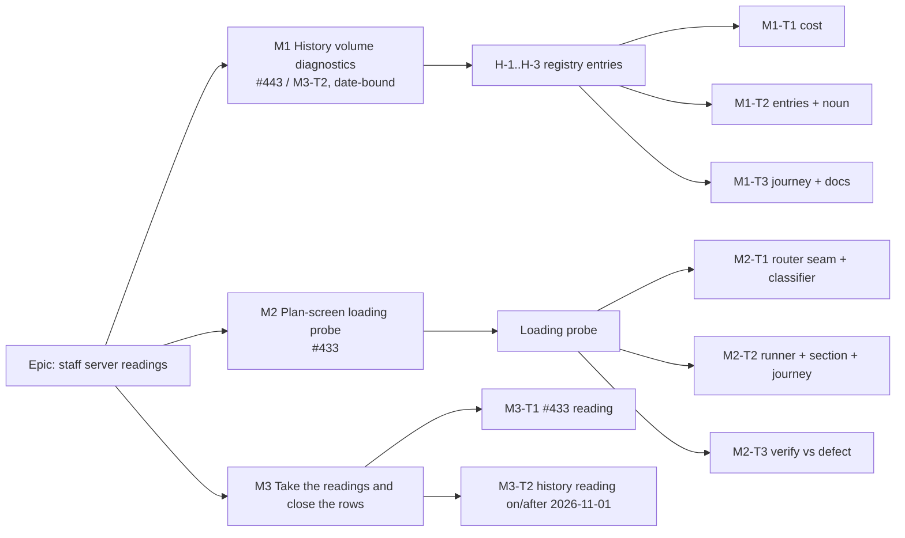

# Implementation Plan: Two server readings from the staff console

- **Feature spec:** [`./feature-spec.md`](./feature-spec.md)
- **Status:** Approved — by the product owner, 2026-10-05 (in session), "approved as described": defaults D-1 to D-6 stand; M1 (history counts) first, before 1 November.
- **Owner:** Claude Code (builder), for James Ewbank (product owner)

## Breakdown

### Epic

**Staff server readings.** Two owed measurements become one press each in the staff console, inside
ADR-0086, ADR-0128 and ADR-0140. This is debt and measurement work, not a roadmap theme.

**Order:** M1 first, because it is date-bound: it must be **released before 2026-11-01**. M2 next.
M3's two tasks run whenever their reading is due. M1 and M2 are independent, and either can ship
without the other.

---

### Milestone M1: History volume in the diagnostics press (#443 / ADR-0174 M3-T2)

**Outcome:** a staff member presses **Run diagnostics** and gets the history row counts that replace
ADR-0174's volume estimate.
**Entry point:** `/staff` → Diagnostics → **Run diagnostics** (existing control). The new capability
is three new rows in its result.
**Journey:** `e2e-staff/staff.spec.ts`'s third test ("a staff member runs the diagnostics and can paste
the result", `:968`) seeds history through the real API (an activity PATCH as a member). It then
presses **Run diagnostics** and asserts the three new labels render with non-zero counts, and that
**Copy for the record** contains them.

#### Feature: H-1..H-3 registry entries

> **Description:** Add three count-only entries over `activity_history_entries` and the
> `history-entry` unit (spec US-2).
> **Complexity:** M (S of code; the cost measurement is the work)
> **Dependencies:** none
> **Risks:** a press slows at scale → measured first (M1-T1), with the D-E precedent for a recorded
> re-arm trigger. Reading `changes` content → only `pg_column_size` of the row crosses into a
> predicate, and nothing is projected but counts (gate S-4).
> **Testing requirements:** API e2e counts at the edges; gates S-1..S-5 unedited and green; the journey.

##### Task M1-T1: Cost the six statements before they exist (ADR-0140 "no query whose cost is unknown ships")

- **Description:** Measure H-1..H-3's six statements at **100,000** and **1,000,000** history rows,
  interleaved in time (the `m3-measurement.md` interleaved order), on the 102,000-activity diluted
  estate the registry's other costs were taken on. Measure the **whole press** before and after.
  Use `EXPLAIN (ANALYZE)`, median of five, recording the plan shape.
- **Complexity:** M
- **Dependencies:** none
- **Risks:**
  - Any statement is above 500 ms at 1M → **default: ship anyway**, with a re-arm trigger expressed
    as an H-1 `examined` value (the entry observes its own trigger), recorded in the entry docblock
    and `m1-measurement.md`.
  - A proposed index → **stop**. It is a schema change: database-architect first, no exceptions
    (CLAUDE.md §19.3). Do not write a migration in this epic without that.
  - The whole press reaches ~800 ms (ADR-0140 D7's reopen trigger) → report it to the product owner,
    because the throttle decision reopens.
- **Testing:** this is the measurement, written up as `docs/specs/staff-server-readings/m1-measurement.md`
  with the command, machine and Postgres version (ADR-0076).
- **Development steps:**
  1. Reuse the seeding in `apps/api/test/measure/hierarchy-expiry-history.measure.ts` (interleaved
     order) or `activity-history.measure.ts`. Do not write a third seeder.
  2. Take the SQL text **from the registry constants** (the `scripts/measure-zero-duration-diagnostics.mts`
     precedent), so the measured SQL is the shipped SQL.
  3. Record the readings, the plans and the verdict against ≤ 500 ms per statement.

##### Task M1-T2: The entries, the unit and the noun

- **Description:** Three entries in `staff-diagnostics.registry.ts`, after `ZERO_DURATION_TASKS_RESOURCED`:
  - `history-entries-last-28-days`: `unit: 'history-entry'`, `nature: 'prospective'`. Denominator:
    `count(*)` over all entries. Numerator: entries with `first_recorded_at >= now() - interval '28
days'`, `count(DISTINCT a.plan_id)` through `activities`, and `count(DISTINCT h.organization_id)`.
  - `history-entries-links-and-resources-28-days`: denominator = H-1's numerator population; numerator
    adds `scope IN ('LOGIC','RESOURCES')`.
  - `history-entries-over-512-bytes`: denominator = all entries; numerator `pg_column_size(h.*) > 512`.
  - Each SQL that touches `activities` carries `// soft-delete: any-state` with its reason (spec
    §2 Edge cases; ADR-0172's annotation). There is no `count(DISTINCT actor_user_id)` anywhere, by
    decision (spec §3 Security).
  - `DIAGNOSTIC_UNITS` gains `'history-entry'`. The DTO enum follows. `UNIT_NOUNS` gains
    `{ one: 'history entry', many: 'history entries' }` (the compiler requires it).
  - `diagnostics-report.ts`: the H-1 "window not yet full" clause when `examined === affected`, and
    the copy-block line stating that `examined < 1,000,000` means no plan is above CQ-2's trigger.
    Both are keyed on the entry id.
  - Each entry's docblock states its measured cost from M1-T1.
- **Complexity:** S
- **Dependencies:** M1-T1 (the costs go in the docblocks; a failed bar changes the default)
- **Risks:** an `EXISTS` or a CTE projecting a column → gate S-4 refuses it, which is correct.
  Use joins with `count(DISTINCT …)` (the D-M precedent).
- **Testing:**
  - `apps/api/test/staff-diagnostics.e2e-spec.ts`: seed entries inside and outside the window (by
    setting `first_recorded_at` directly in the test database), one on a soft-deleted activity,
    one per scope, and one above 512 bytes. Assert each count exactly, and assert that the response
    carries no string beyond the registry literals.
  - Web unit tests: the noun and the window clause in `diagnostics-report.test.ts`.
  - The S-1..S-5 structural gates pass **unedited**. Editing one is a stop-and-ask (shared gate,
    ADR-0105).
- **Development steps:**
  1. Write the e2e red first.
  2. Add the vocabulary member, then the entries, then the renderer.
  3. Run `pnpm prepush` and `scripts/e2e-local.sh api`.

##### Task M1-T3: Journey, docs, changeset

- **Description:** Extend the third `e2e-staff` test (above). Then update the docs:
  - `docs/TECH_DEBT.md`: **#443** re-scoped per spec §4. It names the passive `hierarchy_expiry.batch`
    log line, replaces the unexecutable "Next", and makes its volume trigger "H-1 `examined` ≥ 100,000".
    **M3-T2** gets a pointer, and `docs/HANDOFF.md`'s 1 November line is re-pointed to M3-T2.
  - `docs/DECISIONS.md`: the first time-relative diagnostic.
  - `docs/specs/activity-change-history/implementation-plan.md` M3-T2: "instrument shipped; reading
    owed on or after 2026-11-01".
  - Changesets: **api minor**, **web minor**.
- **Complexity:** S
- **Dependencies:** M1-T2
- **Testing:** `scripts/e2e-local.sh web:staff` (the suite name `e2e-local.sh` uses for `e2e-staff`).
- **Development steps:** journey → docs → changesets → `pnpm prepush` → reviewers (below).

**M1 reviewers:** security-reviewer (ADR-0140 clauses over a new table), backend-performance-reviewer
(M1-T1 readings), api-reviewer (the enum widening), test-engineer (the e2e edges).

---

### Milestone M2: Plan-screen loading probe (#433)

**Outcome:** a staff member measures, on the live server, whether a reload or revisit of the plan
screen sends its code files to the network, over which protocol, and under which `Cache-Control`
header.
**Entry point:** `/staff` → Performance → **Measure plan loading** → confirm dialog **Measure**.
**Journey:** a new `test()` in `e2e-staff/staff.spec.ts` presses the control and confirms. It then
waits for the page to reload and navigate by itself, and asserts:

- the result region shows all three limbs, each **taken** with the right navigation type (`reload`,
  then `navigate`);
- the "development build" label is shown;
- for each limb, the cache, revalidated, downloaded and not-exposed counts add up to the observed
  count;
- **Copy for the record** is enabled;
- the set of `/api/` request paths during the press equals the set made by a plain reload of `/staff`
  (spec S3, recorded with `page.on('request')`).

#### Feature: the loading probe

> **Description:** spec US-1, an in-browser, input-free, write-free probe.
> **Complexity:** M
> **Dependencies:** none (independent of M1)
> **Risks:** module evaluation of the plan-screen graph in the staff document has a side effect →
> the journey's S3 assertion catches a request. Browser cache semantics → reported per browser,
> never generalised.
> **Testing requirements:** pure-function units, a structural test of the router seam, the journey,
> and verification against the defect (M2-T3). A11y review of the new section.

##### Task M2-T1: The router seam and the classifier

- **Description:**
  - `app/router.tsx`: `export function preloadPlanDeepLinkChunks()`, which returns the promise of
    `AuthedLayout.preload?.()` and `PlanDetailScreen.preload?.()`. The `PLAN_DEEP_LINK` branch
    (`:171-175`) calls it.
  - A structural test asserts the branch calls the exported function. Mutation: inline the two
    preloads in the branch, and the test must fail.
  - `features/perf-probe/loading/model/classify.ts`, a pure function from a Resource Timing–shaped
    record to `cache | revalidated | downloaded | not-exposed`, with `heuristic: boolean` when
    `responseStatus` is absent.
  - `report.ts`, the plain-text block.
- **Complexity:** S
- **Dependencies:** none
- **Risks:** exporting from `router.tsx` creates an import cycle → the probe reaches it only through a
  **dynamic** import from the lazily loaded runner, and the existing chunk-cycle gate must stay green.
- **Testing:** unit tests for every classifier branch, including `responseStatus` both present and
  absent and `transferSize` undefined; a report snapshot; the structural test with its named
  mutation verified red (ADR-0110 D5).
- **Development steps:** tests red → classifier → seam → structural test → mutation check.

##### Task M2-T2: The runner, the section and the journey

- **Description:**
  - `runner/run-loading-probe.ts`: the `sessionStorage` marker state machine (`reload` → `revisit` →
    `network` → done). It discards a marker older than two minutes or malformed. It calls
    `setResourceTimingBufferSize` and listens for `resourcetimingbufferfull`. It checks
    `PerformanceNavigationTiming.type` per limb, runs the `no-store` network limb, and sends one `HEAD`
    to read `cache-control`.
  - The section UI (spec §4 Component changes), dynamically importing the runner. The panel's
    static-import test is extended to name `../loading/runner/`.
  - The staff screen resumes a pending marker on mount. That code path must not import the runner
    statically either.
  - Copy: what it measures (code delivery on reload and revisit), what it does not (the plan's data,
    other browsers, the "+17 %" comparison), and that nothing is sent anywhere.
- **Complexity:** M
- **Dependencies:** M2-T1
- **Risks:**
  - A revisit URL the staff route rejects or rewrites → the navigation-type check reports the limb as
    "not taken" rather than misreading it, and the journey asserts the limb was taken.
  - A reload interrupting an in-flight staff query → harmless, because staff panels fetch only on press.
  - Focus after reload → the result heading takes focus when the run completes (ADR-0135 pattern).
    This goes to accessibility-reviewer before release (CLAUDE.md §19.13 applies if `AlertDialog`'s
    focus contract is touched; it should not be).
- **Testing:** unit tests for the state machine with a fake `sessionStorage`, `performance` and
  `location`. The journey (above). `scripts/e2e-local.sh web:staff`.
- **Development steps:** state machine tests → runner → section → journey → `pnpm prepush`.

##### Task M2-T3: Verify the probe against the defect it names, and record the reading set

- **Description:** Run the probe once on a build served by `vite preview`, where the defect is present:
  `Cache-Control: no-cache` with a weak `ETag`, so the plan chunks must report **revalidated or
  downloaded**. Run it once on the `web` image's nginx, where the defect is absent: `public, immutable`,
  so the plan chunks must report **from cache** on the reload limb. Record both readings, the browser
  and the commands in `docs/specs/staff-server-readings/m2-verification.md`. If the nginx image cannot
  be run where the builder works, say so in that file, and the first live reading (M3-T1) is
  explicitly the unverified limb until it is taken. Do not imply it was verified.
- **Complexity:** S
- **Dependencies:** M2-T2
- **Risks:** Chromium may not revalidate fresh subresources on a reload even without `immutable`
  (expected, **not established**: this run establishes it for that browser). The `vite preview`
  limb still discriminates, because `no-cache` forces revalidation in every browser.
- **Testing:** this task is the verification.
- **Development steps:** build → preview reading → nginx image reading → record → docs:
  - `docs/DECISIONS.md`: a staff probe may load member-surface **code**, never data.
  - `docs/TECH_DEBT.md`: a **new row** for the `/assets/` `add_header` inheritance (spec §0.4).
  - Changeset: **web minor**.

**M2 reviewers:** accessibility-reviewer and component-reviewer (the new section, the confirm, focus
after reload), ux-reviewer (copy, placement D-5), performance-reviewer (the lazy boundary: the staff
chunk must not grow by the runner), security-reviewer (the "code not data" argument, and S3).

---

### Milestone M3: Take the readings and close the rows

**Outcome:** both registers say what the live server measured.
**Entry point:** the two controls above. The product owner presses them. Ships dark: no code; this
milestone records the product owner's readings.

##### Task M3-T1: #433 reading

- **Description:** The product owner presses **Measure plan loading** in the browser planners use
  (ideally once in each browser in use), then pastes the block. The assistant records it in #433.
  - If **0** plan chunks went to the network on reload and revisit: **delete #433** and add it to the
    ledger with the reading, as its own remedy says.
  - If any did: keep the row, and state the count, the protocol and the header that arrived. File the
    "plan chunks in the HTML for plan URLs" build step as the remedy, with the reading as its evidence.
  - Either way, correct the row's two errors (spec §0.1 and §0.2).
- **Complexity:** S
- **Dependencies:** M2 released and pulled by the host (ADR-0047). The installation panel shows the
  running web version.
- **Testing:** n/a (a reading).

##### Task M3-T2: History reading (ADR-0174 M3-T2), on or after 2026-11-01

- **Description:** The product owner presses **Run diagnostics** on or after **2026-11-01** and pastes
  the block. The assistant derives:
  - entries per day = H-1 affected ÷ 28;
  - per active plan per day = ÷ H-1 affected plans;
  - link and resource share = H-2;
  - share above 0.5 KB = H-3;
  - estate total = H-1 examined.

  These are written into ADR-0174 Consequences ("The real entry rate", replacing "remains an
  estimate until M3-T2") and the activity-history plan's M3-T2. If H-1 reports the window not full,
  the reading is recorded as a **floor** and retaken a week later.

- **Complexity:** S
- **Dependencies:** M1 released and pulled before 2026-11-01.
- **Testing:** n/a (a reading).

## Sequencing & slices

1. **M1** (T1 → T2 → T3). One PR, or two if M1-T1's write-up is large. Released well before
   2026-11-01.
2. **M2** (T1 → T2 → T3). M2-T1 is a safe PR of its own: a seam and a pure function, nothing
   user-visible.
3. **M3-T1** after M2 reaches the host; **M3-T2** on or after 2026-11-01.

`main` stays releasable throughout. Every slice is additive, and no `VITE_` flag is used (ADR-0088
D1): rollback is the commit boundary. Session routing (CLAUDE.md §19.14): this plan was written by
feature-analyst (Opus). After approval, switch to Sonnet and send M1-T1 onwards to **builder**. If
M1-T1 proposes an index, it goes to **database-architect** before anything else.

## Definition of Done (per task)

Each task's PR must satisfy the Feature Completion Criteria in [`docs/PROCESS.md`](../../PROCESS.md)
(code, tests, docs, security, performance, accessibility, Docker build, CI, changelog, version
impact). "Tests" means `pnpm prepush` was **run**, plus `scripts/e2e-local.sh api` for M1-T2 and
`scripts/e2e-local.sh web:staff` for M1-T3 and M2-T2.

## Checklist of what this epic does and does not need

| Item                          | Needed?                                                                                                                                                  |
| ----------------------------- | -------------------------------------------------------------------------------------------------------------------------------------------------------- |
| ADR-0105 triggers             | **Entry point: yes** (new control, M2; new rows, M1). Playwright config / CI: no. Component contract / shared gate: no. Schema: no (conditional, M1-T1). |
| ADR                           | No. Two `DECISIONS.md` entries. One judgement call (code-not-data) may become a short ADR if security-reviewer says so.                                  |
| Schema change                 | No. If an index is proposed, it goes to **database-architect** before anything else.                                                                     |
| Audit events                  | No new action. M1 uses the existing `staff.panel_read` / `diagnostics`. M2 makes no server request, so there is nothing to audit.                        |
| Retention                     | No new table, no new data.                                                                                                                               |
| Playwright journey (ADR-0081) | Yes. M1 extends the diagnostics test; M2 adds a test. Both are in `e2e-staff`.                                                                           |
| Changeset                     | Yes. M1: api minor and web minor. M2: web minor.                                                                                                         |
| Feature flag                  | No (ADR-0088 D1).                                                                                                                                        |
| Recalc parity / pen           | Not engaged. No engine import, no plan write.                                                                                                            |

## Risks & assumptions (rollup)

| #   | Risk / assumption                                                  | Likelihood | Impact | Mitigation                                                                                                                 |
| --- | ------------------------------------------------------------------ | ---------- | ------ | -------------------------------------------------------------------------------------------------------------------------- |
| R1  | History statements are slow at 1M rows                             | med        | low    | Measured first (M1-T1). A re-arm trigger is read from H-1 itself. An index only via database-architect.                    |
| R2  | M1 not on the host by 2026-11-01                                   | low        | med    | M1 is first and small. The reading can be taken any day after; the window only needs to be full.                           |
| R3  | Probe misclassifies a revalidation as a cache hit                  | low        | high   | `responseStatus` where exposed; the heuristic labelled; verified against `vite preview` (M2-T3).                           |
| R4  | One browser's reading is read as universal                         | med        | med    | The browser is named in the result. The copy says so. M3-T1 asks for each browser in use.                                  |
| R5  | Loading the plan graph in the staff document triggers a request    | low        | med    | Journey S3 assertion over `/api/` request paths.                                                                           |
| R6  | The probe cannot speak to "+17 %" (no pre-split build on the host) | certain    | low    | Stated in the spec and in the panel copy. The row's own question (round trips on reload) is what it answers.               |
| R7  | A reviewer judges "staff loads member code" boundary-moving        | low        | low    | A short ADR before M2 merges. The design does not change.                                                                  |
| R8  | Write-cost and expiry-cost halves of #443 stay unmeasured          | certain    | low    | By decision. No decision rests on ms (statement-count bar). Triggers made observable via H-1, plus the passive expiry log. |
