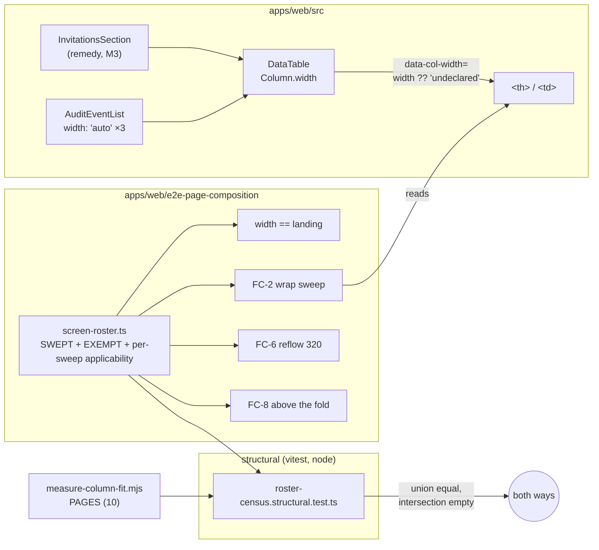
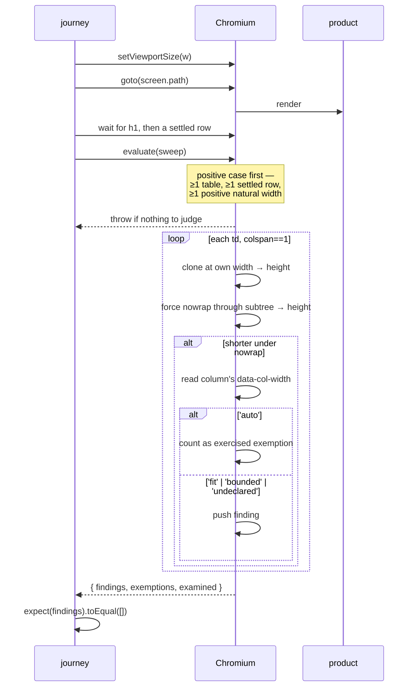
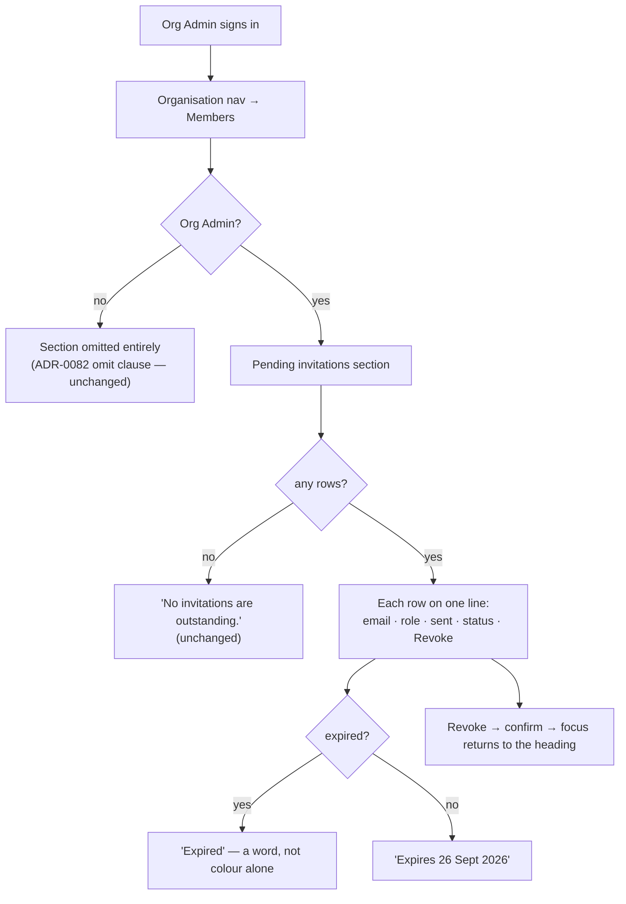

# Feature Spec: Table wrap coverage — the FC-2 gate's screen list, and the Members invitations fit

- **Status:** Draft — awaiting approval before implementation
- **Author(s):** feature-analyst (for the product owner)
- **Date:** 2026-09-19
- **Tracking issue / epic:** `docs/TECH_DEBT.md` **#344**
- **Roadmap link:** none — this is register work, not a roadmap theme (the ADR-0124/ADR-0131
  class: a planner cannot act on a CI gate, and the layout half is a defect fix).
- **Related ADR(s):** ADR-0146 (the column model and FC-2), ADR-0093 (pinned positive case),
  ADR-0110 D5 (a gate is verified red against the defect it names), ADR-0120 A9 (declared, never
  derived), ADR-0128 (falsification before measurement), ADR-0142 D4 (a remedy is measured before
  it is chosen), ADR-0105 (this spec's trigger), ADR-0088 D1 (no `VITE_` flag).

---

## 0. Why this needs a spec at all

**ADR-0105's trigger fires on "a shared gate".** This work widens
`apps/web/e2e-page-composition/composition.spec.ts` — a standing CI gate cited by two epics'
falsification tables — and adds a DOM attribute to `DataTable`, a shared primitive with **23
production call sites across 17 files** (counted, not estimated: this paragraph said "eleven" until
the count was taken, which is ADR-0076 Class 3 inside a spec whose §0.1 is about unchecked claims,
and the correction is recorded rather than quietly applied). Either alone would be enough; a
tech-debt row covers stages 1–2 only while the change adds no new surface, and this adds both.

It also crosses a second trigger: the layout remedy may change `PageGrid`, an archetype consumed
by three screens including the staff console, whose tables ADR-0143 was opened on being cramped.

---

## 0.1 What was re-verified, and the four findings

Per CLAUDE.md §19.11, every claim inherited from the register row and the briefing was checked
against the code rather than accepted. The row survives intact; four things it does **not** say
were found, and the first changes the design.

### Finding 1 — the gate does not check slack, and its title says it does

`composition.spec.ts:232` is titled **`no table cell wraps while its table has room`**. Read the
body (`:252-287`): it clones each `<td>`, forces `nowrap` through the subtree, compares heights,
and pushes any cell that got shorter onto `out`. `expect(wrapped).toEqual([])`. **There is no
slack computation anywhere in the test.** `tableWidth`, `naturalTotal` and `slack` are quantities
of `measure-column-fit.mjs`, not of this gate.

This matters more than a naming quibble, because **the row's own first reading was misled by that
title** — it reasoned that the condition excluded Members since the table has no slack, and the
correction is recorded in the row. The title is the only artefact in the repository that states
FC-2 as a slack rule. The canonical condition does not:

> **FC-2** — At 1280, 1646 and 1920, **zero** cells in any in-scope table wrap to more than one
> line, **except in columns declared `auto`**.
> — `docs/specs/page-composition/feature-spec.md:375`

and the product's own source says the same in as many words:

> FC-2 says no cell wraps except in a column declared `auto`, and a rule whose exception is also
> its default is vacuous unless somebody writes the exception down.
> — `apps/web/src/features/audit/components/AuditEventList.tsx:79-85`

So there are **three** statements of FC-2 in the tree and they are not the same rule:

| Where                                | The rule it states                          | Screens         |
| ------------------------------------ | ------------------------------------------- | --------------- |
| `feature-spec.md:375` (canonical)    | no wrap **except a column declared `auto`** | in-scope tables |
| `composition.spec.ts:232` (title)    | no wrap **while the table has room**        | 3               |
| `composition.spec.ts:252-287` (body) | no wrap, **full stop**                      | 3               |

The body is **stricter** than the canonical rule (it has no `auto` exemption at all) and
**narrower** (three screens of ten). It passes today only because none of those three screens has
a declared-`auto` column that wraps.

**The consequence for this work is the decision the briefing asked for.** The widening must
introduce the **`auto` exemption**, not a slack test. A slack test would be wrong in both
directions: it is not the accepted condition, and — measured — it would make the gate **green over
the very defect #344 is about**, because the Members table has **no** slack (−149px at 1646). It
would equally excuse the audit log. A gate that passes both the legitimate case and the defect
distinguishes nothing.

### Finding 2 — four sweeps, four hand-written rosters, none the same

The row says the FC-2 sweep reads three screens of ten. It is not the only one. This file contains
**four per-screen sweeps with four independently hand-written screen lists**:

| Line   | Sweep                            | Screens                                           | Count |
| ------ | -------------------------------- | ------------------------------------------------- | ----- |
| `:226` | content width equals the landing | clients, calendars, resources, members, audit-log | 5     |
| `:247` | **FC-2, no cell wraps**          | calendars, resources, clients                     | 3     |
| `:504` | FC-6, no overflow at 320px       | calendars, resources, clients, recently-deleted   | 4     |
| `:544` | FC-8, first row above the fold   | clients, calendars, resources, members, audit-log | 5     |

Four lists, `{5}, {3}, {4}, {5}`; two coincide. **`recently-deleted` appears in exactly one.
`client-detail`, `project-detail`, `my-activity` and `org-home` appear in none.** `members` is
absent from the two sweeps that would have caught #344 and present in the two that would not.

This is the durable shape of the defect and it is larger than the row states: the answer is not
"add `members` to one list" but **one declared roster, with per-sweep applicability declared
beside it**, asserted against `measure-column-fit.mjs`'s own `PAGES` in both directions.

**And the scope boundary that follows from it must be stated rather than left to be assumed.** The
probe covers **ten screens**; `DataTable` has **23** production call sites. Tables on the plan
workspace (`ActivitiesTable`, `DependencyTable`, `BaselinesPanel`), the share dialog, cross-plan
links, projects, plans and the perf-probe panel are on **none** of the ten, and this epic does not
bring them in. "The gate reads the estate" means _the probe's estate_. Widening past it is a
larger question — those screens have no measurement, several sit behind a canvas whose fixtures are
expensive, and a roster that silently claims more coverage than it has is the defect this epic was
opened on. The census (FC-3) makes the true extent **readable** rather than implied, which is the
honest deliverable.

### Finding 3 — the regression's cause is nameable, and it is ADR-0146's own M4

The row says "something between that reading and today moved the section into a narrow grid
column". It is identifiable. `m2/column-fit-1646.json:707-711` records the Pending invitations
table at **1271px wide, `naturalTotal` 748, slack +523** — comfortably fitting. M2's reading was
taken **2026-09-17**; `m3-m4-record.md:59-64` records **M4**, the same day, introducing
`PageGrid` "with spans by demand" and making invitations `narrow`. The FC-2 verdict at
`m8-verdict.md:16` is **PASS**, evidenced by `m2-measurement.md` — a reading taken **two
milestones before the change that broke it**.

So the transferable part is sharper than the row puts it: the condition was not merely judged once
and quoted afterwards; **it was judged before the milestone that falsified it, in the same epic.**

### Finding 4 — the fixture trap, and the shape a careless journey would miss

The journey's `beforeAll` (`:65-109`) creates one client, one calendar and one resource. It creates
**no invitation**, so `Pending invitations` renders its empty state. An empty table cannot wrap:
adding `members` to the sweep without seeding an invitation produces a **green run about nothing**
(ADR-0093), and the row's defect is untouched.

Worse, the obvious half-seed also fails. `Status` renders an `Expired` **badge** for a lapsed
invitation and the sentence `Expires 26 Sept 2026, 08:33` for a live one — 197px natural. **Only
a live invitation makes `Status` wrap.** A fixture seeded with an expired invitation alone reports
one finding instead of two and looks like partial success.

`Sent` wraps on any row (147px natural against 54/86/120 used), so the fixture must hold **at
least one live, unexpired invitation** for both columns to be exercised.

---

## 1. Business understanding

### Problem

Two problems, one of which causes the other to be invisible.

**(a) The product.** `/orgs/:slug/members` renders _Pending invitations_ in a half-width grid
column. The table's five columns need **748px** and it is rendered **519 / 599 / 682px** wide at
1280 / 1646 / 1920. `Sent` and `Status` wrap on every row at every width measured — a date broken
over two lines reads as two dates, and `Expires 26 Sept 2026, 08:33` broken over two reads as a
date beside a fragment. The person who sees it is an Org Admin chasing an invitation, on the one
screen that lists them.

| Width | Table / needed | `Sent` used / natural | `Status` used / natural | Table slack |
| ----- | -------------- | --------------------- | ----------------------- | ----------- |
| 1280  | 519 / 748      | 54 / 147              | 62 / 197                | **−229**    |
| 1646  | 599 / 748      | 86 / 147              | 109 / 197               | **−149**    |
| 1920  | 682 / 748      | 120 / 147             | 159 / 197               | **−66**     |

_Source: `docs/specs/unrendered-row-facts/m3/cf-1280|1646|1920.json`, one sitting, 2026-09-19._
It is **not** a narrow-viewport problem a wider screen relieves: at 1920 it is still 27 and 38px
short. The sibling _Organisation members_ table on the same screen renders at 1271px with **+513px
of slack**.

**(b) The gate.** FC-2 exists to catch exactly this and reads three screens of ten — and, per
Finding 2, three of its four sibling sweeps read four other partial lists. The defect survived an
eight-milestone gate pass with five specialist reviews because **nothing ever pointed an
instrument at the screen**.

### Users

| Role                            | What changes                                                                                                                                                   |
| ------------------------------- | -------------------------------------------------------------------------------------------------------------------------------------------------------------- |
| **Org Admin**                   | The only reader of this section (ADR-0082's first omit clause: it is omitted entirely for everyone else). They get an invitation list whose dates are legible. |
| Planner / Contributor / Viewer  | Nothing. They cannot see the section.                                                                                                                          |
| **Every engineer and reviewer** | A wrap on any table on any of the ten probed screens becomes a CI finding instead of something somebody has to think to measure.                               |

### Primary use cases

1. An Org Admin opens Members to see who has been invited and when, and whether an invitation has
   lapsed — and reads each row on one line.
2. An engineer changes a column, a measure or a grid span anywhere in the non-canvas estate, and
   CI tells them if a cell now wraps.

### User journeys

Happy path: sign in → **Members** in the organisation nav → the _Pending invitations_ section →
each row reads `email · role · sent · status · Revoke` without a broken date. See §4.

### Expected outcomes

- Zero wrapped cells in the Pending invitations table at 1280, 1646 and 1920, **without** declaring
  a column `auto` to achieve it.
- FC-2's gate implements FC-2's accepted condition — including the `auto` exemption it has never
  had — across every screen the probe covers, with the exemptions declared and asserted both ways.
- The four divergent rosters become one.

### Success criteria

The falsification conditions in [`falsification.md`](./falsification.md), judged in one sitting.
Summarised: FC-1 the widened gate sees today's defect; FC-2 it does not fire on the audit log's
declared-`auto` wrap; FC-3 coverage is provable both ways; FC-4 the chosen remedy fits at three
widths; FC-5 it costs no other screen width; FC-6 reflow at 320px is unchanged.

### Open questions

**CRITICAL — CQ-1. Is a fourth layout candidate in scope for measurement?**
The briefing names three (widen the grid column, narrow the table, move the section) and forbids
choosing on precedent. A fourth exists and is cheaper than all three: **shorten the content** —
`Sent` as `19 Sept 2026` rather than `19 Sept 2026, 08:33`, `Status` as `Expires 26 Sept 2026`.
Arithmetic says it is insufficient alone (≈634 natural against 599) but composes with the others.
**Default if unanswered: measure it as C4 and report it; do not ship it alone.** Measuring is one
file edit in a sitting that is running anyway; excluding a candidate because the briefing predates
it is the ADR-0142 D4 error one level up.

**CRITICAL — CQ-2. Does `width: 'auto'` become load-bearing?**
The exemption needs to be observable in the browser, and today it is not: `WIDTH_CLASSES.auto` is
`''`, so a declared-`auto` column and an undeclared one render **identical DOM**. The design (§4)
emits `data-col-width` from `Column.width ?? 'undeclared'`. That makes ADR-0146's sentence "this
line changes no CSS and is not decoration" **false in the first clause** — it now changes the DOM —
and makes deleting one of the audit log's three declarations turn a gate red instead of being
invisible. **Default: yes, emit it.** The alternative (a hand-written exemption list in the test
file) puts the audit log's reasoning in a file the audit log's author will never open, and is the
ADR-0073 C4 defect — a list that falls behind.

**Non-critical, with defaults:**

- **Three widths or one?** The journey runs at 1646 only. Canonical FC-2 names 1280, 1646 and
  1920, and the `auto` exemption is only exercised at 1280 — at 1646 the audit log has +210px of
  slack and wraps nothing. **Default: sweep all three.** An exemption path that never executes is
  untested, and the register holds two instances of a gate whose blind half was found years later.
- **Does `recently-deleted` / `project-detail` join the roster?** **Default: yes**, by seeding a
  deletion and a project in `beforeAll`. Declaring them "not swept because the fixture does not
  seed them" is a to-do wearing a reason's clothes — the `PENDING_COVERAGE` shape ADR-0073 C3.4
  deleted. `org-home` remains the one genuine exemption (it has no tables — ADR-0098), matching
  `measure-column-fit.mjs`'s own `TABLE_FREE_SCREENS`.
- **Does the gate arm immediately?** **Default: no.** See §4.6 — arming it at M1 makes `main` red
  until the layout lands, which no milestone may do. The wrap limb ships **report-only with its red
  run committed**, and is armed in the commit that deletes the report-only switch (the ADR-0120 /
  ADR-0131 sequence). The existing three-screen assertion is kept armed throughout, so coverage is
  never lost, and is deleted only when the widened one replaces it.
- **ADR or `docs/DECISIONS.md`?** See §4.8. **Default: a `DECISIONS.md` entry**, unless M2 selects
  the asymmetric-grid candidate, which is an ADR amending ADR-0146.
- **Feature flag?** **None.** ADR-0088 D1: a `VITE_` constant is inlined at build time, every
  published image carries every flag at its default, and an operator cannot switch one off. The
  rollback is a commit boundary. Stated rather than left open.

---

## 2. Functional requirements

### User stories & acceptance criteria

> **US-1** — As an **Org Admin**, I want each pending invitation to read on one line, so that I can
> tell when it was sent and when it lapses without parsing a broken date.
>
> **Acceptance criteria**
>
> - **Given** an organisation with at least one live pending invitation **when** I open
>   `/orgs/:slug/members` at 1280, 1646 or 1920 **then** no cell in the _Pending invitations_ table
>   renders on more lines than its content needs.
> - **Given** an expired invitation **then** its status still reads `Expired` as a word, not colour
>   alone (WCAG 2.2 §1.4.1), and is still distinguishable from a live one.
> - **Given** the remedy folds a fact under the row **then** that fact is still rendered and still
>   reachable by a screen reader in the same row — a column may be removed, **a fact may not**.
> - **Given** no pending invitations **then** the empty state is unchanged.

> **US-2** — As an **engineer**, I want a wrap on any probed screen to fail CI, so that a layout
> change cannot quietly break a table nobody photographs.
>
> **Acceptance criteria**
>
> - **Given** any screen in the declared roster **when** a cell wraps and its column is **not**
>   declared `auto` **then** the journey fails and names the screen, the column and the text.
> - **Given** a cell wraps in a column **declared** `auto` **then** the journey passes.
> - **Given** a swept screen yields no table, or a table with no settled rows, **then** the journey
>   **fails** rather than reporting zero findings (ADR-0093).
> - **Given** a screen is added to `measure-column-fit.mjs`'s `PAGES` and to neither the swept
>   roster nor the declared exemptions **then** the census test fails.
> - **Given** a screen is in **both** **then** the census test fails.

> **US-3** — As a **reviewer**, I want each of this file's per-screen sweeps to read one declared
> roster, so that "which screens does this cover?" has one answer.
>
> **Acceptance criteria**
>
> - **Given** the four sweeps **then** each derives its screen list from the shared roster's
>   per-sweep applicability, and no sweep carries a literal array of screen names.
> - **Given** a screen that a sweep genuinely cannot cover **then** its exclusion is declared beside
>   the roster with a reason, and is asserted.

### Workflows

**Widened sweep, per width ∈ {1280, 1646, 1920}, per swept screen:**

1. Set the viewport, navigate, wait for the `<h1>`, then wait for a **settled row** — not for a
   row. `DataTable`'s skeleton renders three visible `<tr>`s and its `<thead>` prints no header
   text, so a scan taken in flight examines nothing and reports it as nothing wrong. This file has
   shipped that defect twice (`:389`, `:507`) and both docblocks say so.
2. Assert the positive case: ≥ 1 table, ≥ 1 settled body row, ≥ 1 column with positive natural
   width.
3. For each single-`colspan` `<td>`: clone at its own width, measure, force `nowrap` through the
   subtree, measure again. Shorter ⇒ it was wrapping (1px tolerance).
4. If it wrapped, read the owning column's `data-col-width`. `auto` ⇒ exempt, and recorded as an
   **exercised exemption**. Anything else — including `undeclared` — ⇒ a finding.
5. Assert findings is empty, naming screen, column and text.

### Edge cases

| Case                                                         | Expected behaviour                                                                                                                                                                                                                                                                        |
| ------------------------------------------------------------ | ----------------------------------------------------------------------------------------------------------------------------------------------------------------------------------------------------------------------------------------------------------------------------------------- |
| Screen has no table (`org-home`)                             | Declared exempt with its reason; asserted **both ways** — if it grows a table, the census fails.                                                                                                                                                                                          |
| Table present, no rows                                       | **Fail.** The positive case refuses a verdict (ADR-0093).                                                                                                                                                                                                                                 |
| Scan runs against the loading skeleton                       | **Fail**, via the same positive case; the skeleton carries no `data-col-width` and no settled text.                                                                                                                                                                                       |
| Cell holds two stacked elements (a fact folded under a name) | **Not a wrap.** Two line boxes, unchanged height under `nowrap`. This is exactly the discrimination the height method exists to make, and the rect-counting version got it wrong (`measure-column-fit.mjs:106-119`). It is load-bearing here because candidate C2 **creates** such cells. |
| `colspan` cell (expanded detail row, empty state)            | Skipped, as today.                                                                                                                                                                                                                                                                        |
| A column wraps in a declared-`auto` column                   | Exempt, and **counted**, so the run reports how many exemptions fired.                                                                                                                                                                                                                    |
| Every wrap on a screen is exempt                             | Passes, and the report says so — distinguishable from "no wraps".                                                                                                                                                                                                                         |
| Only an **expired** invitation is seeded                     | `Status` fits; `Sent` still wraps. The fixture control (§4.5) refuses this.                                                                                                                                                                                                               |
| Fixture seeds two invitations to one address                 | 409 — `uq_invitations_org_email_pending`. Addresses must differ (`landing-fixture.mjs:237-239`).                                                                                                                                                                                          |

### Permissions

No permission changes. The section is already gated: `canAdministerInvitations(role)` omits it
entirely for anyone but an Org Admin (`members.tsx:53`), and `invitation:read` / `invitation:revoke`
are one bundle held by one role, pinned by
`apps/api/src/common/auth/invitation-permissions.structural.spec.ts`. The journey's fixture user is
the organisation's creator and therefore `ORG_ADMIN`.

### Validation rules

None. No new input, no new field, no wire change.

### Error scenarios

No new runtime error paths. The gate's failure modes:

| Scenario                                                   | Detection         | Result                                   |
| ---------------------------------------------------------- | ----------------- | ---------------------------------------- |
| A cell wraps in an undeclared column                       | the sweep         | journey fails, naming screen/column/text |
| A swept screen yields nothing to judge                     | the positive case | journey fails — never a silent pass      |
| A probe screen is classified nowhere, or twice             | the census test   | vitest fails                             |
| The roster and `measure-column-fit.mjs`'s `PAGES` disagree | the census test   | vitest fails, both directions            |

---

## 3. Technical analysis

| Area           | Impact                             | Notes                                                                                                                                                                                                                                                                          |
| -------------- | ---------------------------------- | ------------------------------------------------------------------------------------------------------------------------------------------------------------------------------------------------------------------------------------------------------------------------------ |
| Frontend       | **medium**                         | `DataTable` emits `data-col-width` (shared primitive, **23** production call sites across 17 files). `InvitationsSection` columns change under the chosen remedy. `PageGrid` **only** if C1 wins.                                                                              |
| Backend        | **none**                           | No module, service or endpoint is touched.                                                                                                                                                                                                                                     |
| Database       | **none**                           | No model, column, index, constraint or migration. `database-architect` is therefore **not engaged — because there is nothing to design**, not because a change was judged too small (§19.3).                                                                                   |
| API            | **none**                           | `GET …/organizations/:slug/invitations` is unchanged; `createdAt` and `expiresAt` are already on the wire.                                                                                                                                                                     |
| Security       | **none**                           | No new surface; the section's omission rule is untouched.                                                                                                                                                                                                                      |
| Performance    | **negligible**                     | One attribute per `<th>`/`<td>`, on every table in the product — largest probed table is 30 rows × 5 columns = 150 attributes; the largest in the product is `ActivitiesTable`, which is outside the probe and should be sanity-read once. Journey duration rises (see risks). |
| Infrastructure | **none new**                       | No new Playwright config, no new CI step, no new script ⇒ `check:ci-roster` and `check:e2e-roster` need no entry. `scripts/e2e-durations.json` will drift and is re-derived.                                                                                                   |
| Observability  | none                               |                                                                                                                                                                                                                                                                                |
| Testing        | **high — this is the deliverable** | Widened journey, census structural test, `DataTable` unit cases for the attribute, exemption-predicate unit cases both ways.                                                                                                                                                   |

### Dependencies

- `apps/web/scripts/measure-column-fit.mjs` — unchanged, and used as-is to judge FC-4/FC-5. Its
  pinned case must pass; `EXPECT_KNOWN_WRAPS=0` is **not acceptable evidence** here.
- `apps/web/scripts/shoot.mjs` + `landing-fixture.mjs` — the tenant M2 measures against. Already
  seeds one live and one expired invitation (`landing-fixture.mjs:242-249`), which is why the
  register's readings exist.
- `docs/specs/unrendered-row-facts/m3/cf-*.json` — the committed before-state.
- **Nothing blocks this.** #343 is complete; the briefing's concern about confounding FC-D no
  longer applies, and this spec touches no Clients column.

---

## 4. Solution design

### Architecture overview



### Data flow



### User flow



### Database changes

**None.**

### API changes

**None.**

### Component changes

**1. `DataTable` — `data-col-width` (M1).** `<th>` at `:330` and `<td>` at `:349` emit
`data-col-width={column.width ?? 'undeclared'}`. Four values: `fit`, `bounded`, `auto`,
`undeclared`. The **skeleton does not carry it**, following the same split as the width classes
(`:112-121`: a `fit` column applied to a skeleton has nothing to fit) — and, more usefully, so that
a sweep that accidentally runs against a skeleton reads maximum strictness rather than a
comfortable exemption. Pinned by a unit test in both branches.

This makes `width: 'auto'` observable, which is the point. Today the three audit-log declarations
are prose: deleting one changes no CSS, no DOM and no test. After this, deleting one turns the
1280 sweep red.

**2. `InvitationsSection` — the remedy (M3).** Determined by measurement, not here. Candidates in
§4.4.

**3. `PageGrid` — only under C1.** Would become asymmetric at `md`, touching Members, the staff
console and the organisation landing. Its docblock's two standing guarantees — no `order`, no
`dense`, DOM sequence _is_ reading sequence (WCAG 1.3.2) — are **not** in play; only the track
sizes are.

**4. `e2e-page-composition/screen-roster.ts` — new (M1).** The single declared roster:

```
SCREENS: name → { path(slug, ids), sweeps: { width, wrap, reflow, fold }, why? }
EXEMPT:  name → reason           // org-home: sections and lists, not tables (ADR-0098)
```

Declared, never derived (ADR-0120 A9: a set computed from the run it controls agrees with itself).

**5. `roster-census.structural.test.ts` — new (M1).** Reads `measure-column-fit.mjs` and
`screen-roster.ts` **as text** — the `check:ci-roster` pattern, which avoids a `.mjs` ↔ `.ts`
module-format problem and is precedented (ADR-0136). Asserts:

- every `PAGES` name is in `SCREENS` **or** `EXEMPT` — never neither;
- never **both**;
- `EXEMPT` is non-empty and every entry carries a reason string;
- `members` and `audit-log` are both in the wrap sweep (the two this row turns on);
- a **pinned positive case**: `PAGES` parsed ≥ 10 and `SCREENS` parsed ≥ 1, so a parser that
  matched nothing cannot report agreement. This is ADR-0120's A9 failure — two sides sharing one
  blind spot and therefore unable to disagree — and ADR-0108's census, which passed perfectly over
  a glob matching zero files.

### 4.4 The layout remedy — candidates, predictions, and what disqualifies each

**Nothing is chosen here.** ADR-0142 D4: an approved remedy is a claim that it will work, and
approval does not make it one. M2 measures all of them in **one sitting** and M3 builds the winner.
Each prediction below is written to be falsified, and each is arithmetic over two **measured**
quantities — the table's `naturalTotal` (748) and its rendered width (519 / 599 / 682).

| #       | Candidate                                     | What changes                  | Prediction (natural vs available)                                                                                                                                                                             | What would disqualify it                                                                                                                                                      |
| ------- | --------------------------------------------- | ----------------------------- | ------------------------------------------------------------------------------------------------------------------------------------------------------------------------------------------------------------- | ----------------------------------------------------------------------------------------------------------------------------------------------------------------------------- |
| **C0**  | `width: 'fit'` on `Sent` + `Status`           | the obvious move              | **Converts a wrap into an overflow.** `fit` is `md:w-px md:whitespace-nowrap`; min-content becomes 748 inside a 519–682px scroll container, so the table gains a horizontal scrollbar at every desktop width. | Measured as a **control**, not a candidate. M0 already recorded `fit` producing 793px inside 320px. It is here so the candidate set is not vacuous.                           |
| **C1**  | Widen the grid column (asymmetric `PageGrid`) | shared archetype; 3 consumers | Must transfer **229 / 149 / 66px** from the roles panel. At 1280 the panel would keep ~290px at best.                                                                                                         | Fails FC-4 at 1280 at any split leaving the roles panel usable; or fails FC-5 by narrowing a staff-console table (ADR-0143's founding complaint).                             |
| **C2a** | Fold `Sent` under the email                   | −147px                        | 748−147 = **601 vs 599 — short by 2px at 1646**, and by 82 at 1280. Predicted **insufficient**.                                                                                                               | Expected to fail FC-4. Recorded because it is the smallest edit and the one most likely to be tried.                                                                          |
| **C2b** | Fold `Status` under the email                 | −197px                        | 748−197 = **551**; fits at 1646 (+48) and 1920, **fails at 1280** (551 > 519).                                                                                                                                | Predicted to fail FC-4's 1280 limb.                                                                                                                                           |
| **C2c** | Fold **both** under the email                 | −344px                        | 748−344 = **404**; fits at all three (+115 at 1280). Predicted the **only fold that passes all three**.                                                                                                       | A three-line email cell that pushes the first row below the fold (FC-C-style), or a row whose facts are no longer scannable.                                                  |
| **C3**  | Move the section (`span="wide"`)              | none shared                   | 1271 at 1646 ⇒ +523 slack, fits everywhere.                                                                                                                                                                   | Leaves `RolesPanel` alone in a half-row — the "ragged column" `m3-m4-record.md:59-64` and `members.tsx:38-43` explicitly argue against. Fails on composition, not arithmetic. |
| **C4**  | Shorten the content (date without time)       | none shared                   | `Sent` ≈ 90, `Status` ≈ 140 ⇒ ≈ **634 vs 599 — still short at 1646**. Predicted **insufficient alone**; composes with C2a.                                                                                    | In scope only if CQ-1 is answered yes.                                                                                                                                        |

Two things the table encodes that are easy to get wrong:

- **A fact may be moved; it may not be dropped.** ADR-0146 D4's rule is that a fact about a row
  belongs _under_ that row, never in a column of its own — not that it stops being rendered. C2's
  folded cell keeps `Sent` and `Status` in the same `<tr>`, which is also what keeps the stacked-cell
  case a non-wrap.
- **`auto` is not available as a remedy.** FC-4's bar forbids reaching zero findings by declaring a
  column `auto`. A wrapped date reads as two dates (`m2-measurement.md:18-19`) and a wrapped
  `Expires …` is worse; the withdrawal clause folds the fact under the row instead.

The grid's exact track widths are **not reconstructible** from the committed JSON — the two tables'
rendered widths (905 wide-span, 519 narrow at 1280) are not in the ratio `grid-cols-2` implies, so
a box-model figure stated here would be a guess. M2-T1 measures them. Every number above avoids
depending on it.

### 4.5 The fixture, and the control that refuses a half-seed

`beforeAll` gains, through the same in-page `fetch` it already uses:

- **one live pending invitation** (`POST /organizations/:slug/invitations`), and
- one project and one plan (unlocking `client-detail` and `project-detail`), and
- one deletion (unlocking `recently-deleted`).

And a control asserted **before** any sweep: the Pending invitations table holds ≥ 1 row whose
`Status` cell renders `Expires …` rather than `Expired`. Without it, an expired-only fixture
reports one finding instead of two and reads as partial success. A freshly created invitation is
live by construction — `INVITATION_TTL_MS` is seven days, and note that this figure is **cited
second-hand**, from `landing-fixture.mjs:271`'s own citation of
`apps/api/src/modules/invitations/invitations.service.ts:27`, rather than read at source; M1-T1
reads it before relying on it. The control is cheap either way and guards a later fixture edit
rather than today's code.

### 4.6 Sequencing: why the gate does not arm at M1

Arming the widened wrap limb at M1 makes CI red on `main` until M3 lands, which no milestone may
do. Three options were considered:

1. **Report-only, then armed** (ADR-0120 D5, ADR-0131's "report-only, then swept, then armed and
   watched failing"). **Chosen.** The widened limb lands beside the existing three-screen
   assertion, reports its findings, and commits the red run. The existing assertion stays armed, so
   **coverage is never lost for a moment**. M4 arms the widened limb and deletes the old one in one
   commit.
2. Put `members` on the exemption list with a reason naming #344. **Rejected** — that is the
   `PENDING_COVERAGE` queue ADR-0073 C3.4 deleted, and it conflates "structurally not sweepable"
   with "sweepable and currently failing" in one map.
3. Fix the layout first. **Rejected** — it is the reverse of the product owner's decision, and it
   throws away the one thing this sequencing buys: the gate is **verified red against the live
   product**, not against a mutation. That is ADR-0110 D5 in its strongest available form.

### 4.7 Red-verification, per assertion

ADR-0110 D5: a gate is finished when it has been **made to fail by the defect it was written for**.

| Assertion                    | Named mutation that must turn it red                                                             |
| ---------------------------- | ------------------------------------------------------------------------------------------------ |
| Wrap sweep sees Members      | none needed — **the live product at M1**, committed as the red run                               |
| `auto` exemption is real     | delete `width: 'auto'` from `AuditEventList`'s `Event` (`:86`) ⇒ exactly one new finding at 1280 |
| …and is not over-broad       | set `width: 'auto'` on `InvitationsSection`'s `Sent` ⇒ that finding disappears                   |
| Positive case                | point a swept screen at `/orgs/:slug` (no tables) ⇒ fails rather than reporting zero             |
| …and at a skeleton           | remove the settled-row wait ⇒ fails                                                              |
| Census, direction 1          | delete `members` from `SCREENS` ⇒ fails ("classified nowhere")                                   |
| Census, direction 2          | add `members` to `EXEMPT` as well ⇒ fails ("classified twice")                                   |
| Census, both-ways exemption  | delete `org-home` from `EXEMPT` ⇒ fails                                                          |
| Census positive case         | break the `PAGES` parser regex ⇒ fails on the ≥ 10 floor, **not** silently agreeing              |
| `data-col-width`             | delete the attribute from `<td>` ⇒ every wrap reads `undeclared`, audit-log fires at 1280        |
| Roster feeds all four sweeps | delete a screen from `SCREENS` ⇒ all four sweeps shrink together, census fails                   |

### 4.8 ADR or decision log

**Recommendation: a `docs/DECISIONS.md` entry, not an ADR — with one conditional trigger.**

The gate half **implements an already-accepted condition**. FC-2's canonical bar has carried the
`auto` exemption since ADR-0146; nobody ever built it. Making a gate implement its own condition,
and making a declaration the gate can read, is not a new decision — it is the ADR-0058 rule applied
to a gate (verify the claim; the claim here is the test's own title). The `data-col-width`
attribute is the mechanism, and it narrows one sentence of ADR-0146 (`width: 'auto'` now changes
the DOM), which a decision-log entry records adequately.

**The trigger for an ADR: if M2 selects C1**, the asymmetric grid. `PageGrid`'s span model is an
archetype with three consumers and a written argument for equal-by-demand tracks; changing it to
serve one screen is architecturally significant and amends ADR-0146 directly. In that case the ADR
is written **before M3 builds it**, and it carries M2's measurements — including the staff console
and overview readings FC-5 demands.

Either way the entry records: the three divergent statements of FC-2 (Finding 1); that the gate
never checked slack and that a slack test would have been the wrong repair; the four rosters
(Finding 2); and that the FC-2 PASS at `m8-verdict.md:16` was evidenced by a reading taken two
milestones before the change that falsified it (Finding 3).

### 4.9 Implementation approach & alternatives

**Chosen:** one declared roster feeding four sweeps; a browser-readable width declaration; the
`auto` exemption from canonical FC-2; a census asserting coverage against the probe both ways;
report-only then armed; and a measured choice of layout remedy.

| Alternative                                                        | Why not                                                                                                                                                                                                                                                                                                                                                         |
| ------------------------------------------------------------------ | --------------------------------------------------------------------------------------------------------------------------------------------------------------------------------------------------------------------------------------------------------------------------------------------------------------------------------------------------------------- |
| **Add a slack test, matching the gate's title**                    | The briefing asked this to be established rather than assumed, and the answer is **no**. It is not the accepted condition, and — measured — it would make the gate green over #344 itself (Members slack −149) _and_ over the audit log. A rule that excuses both the defect and the legitimate case distinguishes nothing. The **title** is corrected instead. |
| **Hand-written exemption list in the spec file**                   | The audit log's reasoning would live where its author never looks; the list falls behind (ADR-0073 C4's literal `20`). The declaration already exists beside the column — the gate should read it.                                                                                                                                                              |
| **Export the roster from a shared module both instruments import** | `.mjs` run by node vs `.ts` run by Playwright; the text-reading census is precedented (`check:ci-roster`) and cheaper. Recorded so the next reader knows it was chosen.                                                                                                                                                                                         |
| **Promote `measure-column-fit.mjs` to a CI gate instead**          | It needs the shoot tenant, a database and ~10 navigations × 3 widths; it is a harness by design (`docs/TECH_DEBT.md` #344 is right that no gate catches this). The journey already has a fixture and a CI step.                                                                                                                                                 |
| **Sweep at 1646 only**                                             | The `auto` exemption would never execute, so the exemption path ships untested — and canonical FC-2 names three widths.                                                                                                                                                                                                                                         |
| **Fix Members and skip the gate**                                  | The product owner's decision is explicitly the gate first. It is also what makes the next instance findable.                                                                                                                                                                                                                                                    |

---

## 5. Links

- Implementation plan: [`./implementation-plan.md`](./implementation-plan.md)
- Falsification conditions: [`./falsification.md`](./falsification.md) — **committed in their own
  commit, before any harness runs** (ADR-0128)
- Register row: `docs/TECH_DEBT.md` #344
- Prior art: `docs/specs/page-composition/` (ADR-0146; FC-2, the column model, `m8-verdict.md:16`),
  `docs/specs/unrendered-row-facts/` (the readings, and the one-sitting technique at `m3/README.md:3-14`)
- Docs to update: `docs/DECISIONS.md` (or a new ADR under the §4.8 trigger), `docs/TECH_DEBT.md`
  (#344 closed and ledgered), `docs/DESIGN_SYSTEM.md` (the `width` declaration is now observable),
  `docs/TESTING.md` (the roster is the single source for this journey's screen lists)
