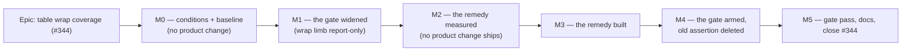

# Implementation Plan: Table wrap coverage — the FC-2 gate's screen list, and the Members invitations fit

- **Feature spec:** [`./feature-spec.md`](./feature-spec.md) — **Draft — awaiting approval before
  implementation** (the same state its own header holds; `check:spec-status` compares the two).
- **Falsification conditions:** [`./falsification.md`](./falsification.md) — committed **first, in
  their own commit, before any harness runs** (ADR-0128).
- **Status:** Draft — awaiting approval before implementation
- **Owner:** web

---

## Breakdown

### Epic

**Table wrap coverage** — make the FC-2 gate read the estate rather than 30% of it, then fix the
table that proves it does not. `docs/TECH_DEBT.md` #344, both halves, gate first.

---

## Milestone 0 — The conditions, and the baseline nobody has taken

**Outcome:** the bars exist, in their own commit, before any instrument runs; and the four things
this epic will later claim to have improved are measured in their unimproved state.
**Entry point:** **Ships dark** — documents and readings only, no product code, no test change.
M3 is the first user-facing milestone.
**Journey:** none (nothing is reachable).

---

#### Feature: falsification conditions and the before-state

> **Description:** Commit `falsification.md`; then take the readings the conditions are judged
> against, including two that have never been taken.
> **Complexity:** S
> **Dependencies:** none
> **Risks:** the conditions are written against numbers already in the tree and could be tuned to
> them → each bar is relative or structural, and the three numeric predictions are labelled
> predictions and will be recorded if falsified.
> **Testing requirements:** none — no code changes.

##### Task M0-T1 — Commit the falsification conditions, alone

- **Description:** `falsification.md` lands in its own commit with nothing else in it.
- **Complexity:** S
- **Dependencies:** none
- **Risks:** none.
- **Testing:** none.
- **Development steps:**
  1. Commit `docs/specs/table-wrap-coverage/falsification.md` **alone**. Not beside the spec, not
     beside a harness edit. The commit boundary is the evidence that the bars predate the work
     (ADR-0128).

##### Task M0-T2 — The before-state, in one sitting

- **Description:** Take every baseline the six conditions name, on one tenant, one server, one
  sitting. Two of them do not exist yet.
- **Complexity:** S
- **Dependencies:** M0-T1
- **Risks:** readings taken across sittings are not comparable → one sitting, and the sitting is
  named in the output (`m0/README.md`), per `unrendered-row-facts/m3/README.md:3-14` and
  `page-composition/m7-measurement.md`'s 555px drift with no product change.
- **Testing:** the probe's own pinned case must pass at all three widths; **no run may use
  `EXPECT_KNOWN_WRAPS=0`**, and the run's stderr line proving the pinned case passed is committed.
- **Development steps:**
  1. `pnpm --filter @repo/web shoot` to mint the tenant; record the slug.
  2. `SLUG=… WIDTH=1280|1646|1920 node scripts/measure-column-fit.mjs` → `m0/cf-*.json`. Confirms
     the register's table (Members 2 findings × 3 widths; audit-log 3 findings at 1280 only).
  3. `measure-page-drift.mjs` at the three widths → `m0/drift-*.json` (FC-5 clause 1 baseline).
  4. **New reading A — the grid's actual tracks.** Measure, in the browser, the `PageGrid` track
     widths and the `SectionCard`/table insets on Members at all three widths, and the rendered
     width of `RolesPanel`'s content. **This has never been measured** and §4.4 of the spec
     deliberately quotes no box-model figure because of it. FC-5 clause 2 and C1's cost both need it.
  5. **New reading B — Members at 320px.** Members is not in the reflow sweep
     (`composition.spec.ts:504`), so its reflow behaviour is unmeasured. FC-6's baseline.
  6. Reading C — the same track/section widths on `/staff` and `/orgs/:slug` (the other two
     `PageGrid` consumers), for FC-5 clause 2.
  7. `pnpm --filter @repo/web shoot --only members` at 1646 → a photograph. Three findings in this
     register were visible only in one.
  8. Write `m0/README.md`: the sitting, the tenant, the numbers, and **which of them contradict the
     spec's predictions** if any already do.

---

## Milestone 1 — The gate widened (wrap limb report-only)

**Outcome:** one declared roster feeds all four per-screen sweeps; every probed screen is
classified; the wrap sweep runs at three widths over the whole roster with the `auto` exemption —
and **reports** rather than asserts, with its red run committed. The existing three-screen
assertion stays armed, so no coverage is lost for a moment.
**Entry point:** **Ships dark** — test and fixture code plus one DOM attribute with no visual
effect. Nothing a planner can press changes.
**Journey:** `test:e2e:page-composition` (existing step, existing config) — widened here, armed at
M4.

---

#### Feature: one roster, a readable declaration, and the widened sweeps

> **Description:** Replace four hand-written screen lists with one declared roster asserted against
> the probe's `PAGES` both ways; make `Column.width` observable in the DOM; widen the wrap sweep to
> three widths and the whole roster with the canonical `auto` exemption.
> **Complexity:** L
> **Dependencies:** M0
> **Risks:** the widened run surfaces a second, unrelated wrap → FC-1 clause 2 forces it to be
> triaged and filed as its own register row, never absorbed into this epic; the journey gets slower
> → no condition asserts a wall-clock time and `e2e-durations.json` is re-derived (ADR-0138).
> **Testing requirements:** every assertion verified red against its named mutation (spec §4.7);
> census carries a pinned positive case; `DataTable`'s attribute unit-tested in both branches.

##### Task M1-T1 — Extend the fixture so every probed screen can be judged

- **Description:** `beforeAll` seeds a **live** pending invitation, one project, one plan and one
  deletion, through the same in-page `fetch` it already uses; and a control refuses a half-seed.
- **Complexity:** M
- **Dependencies:** M0
- **Risks:** **an empty table cannot wrap**, so a sweep added without rows is a green result about
  nothing (ADR-0093) → the positive case in M1-T4 refuses it; **an expired-only invitation makes
  `Status` fit**, so a half-seed reports one finding instead of two and reads as partial success →
  the control below; two invitations to one address is a 409
  (`uq_invitations_org_email_pending`, `landing-fixture.mjs:237-239`) → distinct addresses.
- **Testing:** the control is an assertion in `beforeAll`, not a comment.
- **Development steps:**
  1. `POST /organizations/:slug/invitations` with a distinct address and a role. `INVITATION_TTL_MS`
     is seven days (`invitations.service.ts:27`), so it is live by construction.
  2. Seed a project and a plan (unlocks `client-detail`, `project-detail`); soft-delete a throwaway
     entity (unlocks `recently-deleted`). Each through the public API, as the existing block does.
  3. **The control:** assert the Pending invitations table holds ≥ 1 row whose `Status` cell reads
     `Expires …` rather than `Expired`. Verified red by seeding only an expired invitation.
  4. Do **not** add rows to Clients/Calendars/Resources — the existing assertions name specific
     fixture rows (`:544-550`) and a changed population would move numbers those tests read.

##### Task M1-T2 — `DataTable` emits `data-col-width`

- **Description:** `<th>` (`:330`) and `<td>` (`:349`) emit `data-col-width={column.width ??
'undeclared'}`. The skeleton does not.
- **Complexity:** S
- **Dependencies:** none
- **Risks:** it makes ADR-0146's "this line changes no CSS and is not decoration" **false in its
  first clause** → stated in the decision-log entry (M5-T2), and it is an improvement: the three
  audit-log declarations stop being prose and start being load-bearing; the skeleton omission could
  be read as an oversight → pinned by a test with the reason, following the same split the width
  **classes** already make (`data-table.tsx:112-121`).
- **Testing:** unit — four values render; a column with no `width` renders `undeclared`; the
  skeleton renders **no** attribute. Verified red by emitting `column.width` directly (an
  undeclared column would then render nothing at all, which the exemption would read as "not
  auto" by accident rather than by rule). Sanity-read the largest table in the product
  (`ActivitiesTable`, outside the probe) once for render cost, and record the reading rather than
  asserting "negligible".
- **Development steps:**
  1. Emit on both cells; leave `headClassesOf`/`cellClassesOf` untouched — the classes and the
     attribute are two expressions of one declaration and neither derives from the other.
  2. Docblock: **why** the attribute exists (a gate must be able to tell a declared `auto` from a
     defaulted one, and `WIDTH_CLASSES.auto` is `''`), and why the skeleton is excluded.
  3. Confirm the ADR-0097 weight and sizing ratchets do not move — they scan `className`/`style`,
     not attributes, but it is one command and the ratchets have fired on prose twice.

##### Task M1-T3 — The declared roster and its census

- **Description:** `e2e-page-composition/screen-roster.ts` declares every screen, its path and its
  per-sweep applicability, plus a declared exemption map with reasons.
  `roster-census.structural.test.ts` asserts it against `measure-column-fit.mjs`'s `PAGES` **both
  ways**.
- **Complexity:** M
- **Dependencies:** M1-T1
- **Risks:** a roster derived from the run it controls agrees with itself (ADR-0120 A9) → the
  roster is **declared**, and the census's second side is parsed from a **different file**; a regex
  that matches nothing reports perfect agreement → the pinned positive case below; an exemption
  becomes a queue → a reason of the form "the fixture does not seed it" is inadmissible (FC-3), and
  M1-T1 exists to make it unnecessary.
- **Testing:** five red-verified mutations (spec §4.7: delete `members`; list it twice; delete
  `org-home` from the exemptions; break the `PAGES` parser; drop a reason string).
- **Development steps:**
  1. Write the roster with `org-home` as the **only** exemption, reason quoting ADR-0098 and
     mirroring `measure-column-fit.mjs:83-88`'s own `TABLE_FREE_SCREENS` wording — so the same
     exemption is asserted both ways by two instruments that share no code.
  2. Write the census reading both files **as text** (the `check:ci-roster` pattern — it avoids a
     `.mjs` ↔ `.ts` module-format problem, and the alternative is recorded in the spec §4.9 so the
     next reader knows it was chosen).
  3. **Pinned positive case first:** `PAGES` parsed ≥ 10, roster parsed ≥ 1. Verified red by
     breaking either regex — the run must fail on the floor, never agree silently.
  4. Assert `members` and `audit-log` are in the wrap sweep (FC-3 clause 4).

##### Task M1-T4 — Widen the four sweeps onto the roster

- **Description:** All four per-screen sweeps (`:226`, `:247`, `:504`, `:544`) read the roster's
  per-sweep applicability. The wrap sweep gains three widths, the `auto` exemption, and a positive
  case — and **reports without asserting**.
- **Complexity:** L
- **Dependencies:** M1-T2, M1-T3
- **Risks:** **arming it here makes `main` red until M3**, which no milestone may do → report-only,
  red run committed, armed at M4 (the ADR-0120 / ADR-0131 sequence; the two rejected alternatives
  are recorded in spec §4.6); a scan taken against a skeleton examines nothing and reports it as
  nothing wrong → wait for a **settled row**, the defect this file has shipped twice (`:389`,
  `:507`); a stacked cell reads as a wrap → the height-under-`nowrap` method already discriminates
  (`measure-column-fit.mjs:106-119`) and **candidate C2 creates exactly such cells**, so a case is
  added now rather than discovered at M3.
- **Testing:** FC-1 (the live product, red run committed); FC-2 both clauses with the named
  mutation; positive case red-verified two ways.
- **Development steps:**
  1. Extract the sweep body so the three widths run one implementation.
  2. **Positive case first**, before any wrap logic: ≥ 1 table, ≥ 1 settled row, ≥ 1 positive
     natural width, per screen per width. A sweep that finds no table must **throw**, not pass.
  3. Add the exemption: on a wrap, read the owning column's `data-col-width`; `auto` ⇒ exempt and
     **counted**; anything else including `undeclared` ⇒ finding. Report `{findings, exemptions,
examined}` — FC-2 clause 1's second half needs the exemption count, or "zero findings" cannot
     be told from "nothing examined".
  4. Split the predicate: `columnWidthOf(td)` is pure and unit-tested in jsdom (attribute reading);
     `wraps(td)` is browser-only (jsdom has no layout). Both branches of the predicate tested.
  5. **Report-only switch**, one named constant carrying `#344` and the milestone that deletes it.
     **Leave the existing three-screen assertion armed and untouched.**
  6. Run it; commit the output as `m1/red-run.md` with the FC-1 verdict, including clause 2's
     triage of any finding that is not Members.

---

## Milestone 2 — The remedy measured

**Outcome:** every candidate is costed against FC-4, FC-5 and FC-6 in **one sitting**, and one is
recommended on its numbers. **No product change ships from this milestone.**
**Entry point:** **Ships dark** — a measurement record. Candidates are applied to a running dev
server and reverted, exactly as `unrendered-row-facts/m3` did.
**Journey:** none.

---

#### Feature: cost all candidates, choose on the numbers

> **Description:** C0 (control), C1, C2a, C2b, C2c, C3 and — subject to CQ-1 — C4, measured at
> three widths on one tenant.
> **Complexity:** M
> **Dependencies:** M0-T2 (the baseline), M1 (not strictly required, but the widened gate confirms
> each candidate end-to-end)
> **Risks:** a candidate is chosen on precedent rather than measurement → ADR-0142 D4 is the
> milestone's whole point, and the control C0 exists so the candidate set cannot be vacuous;
> readings drift between sittings → one sitting, files restored into the running server.
> **Testing requirements:** the probe's pinned case passes at every width; no run uses
> `EXPECT_KNOWN_WRAPS=0`.

##### Task M2-T1 — Measure the grid, and C1's real cost

- **Description:** Establish the track widths and `RolesPanel`'s demand (the reading M0-T2 step 4
  takes), then apply the asymmetric-grid candidate and measure all three `PageGrid` consumers.
- **Complexity:** M
- **Dependencies:** M0-T2
- **Risks:** C1 is a **shared archetype** change measured only on Members → FC-5 clause 2 forces
  the staff console and the landing to be read in the same sitting; ADR-0143 was opened on those
  tables being cramped and a split tuned to Members reverses a three-week-old decision.
- **Testing:** `measure-column-fit.mjs` + `measure-page-drift.mjs` at three widths, plus the
  section-width reading on `/staff` and `/orgs/:slug`.
- **Development steps:**
  1. Record the tracks and insets. The spec quotes **no** box-model figure on purpose: `905` and
     `519` at 1280 are not in the ratio `grid-cols-2` implies, and a guess here would be a
     measurement's clothes on an inference.
  2. Apply C1 at one or two splits; measure Members, staff, landing.
  3. Record the verdict against FC-4 **and** FC-5 clause 2 separately — a candidate can pass one
     and fail the other, and FC-5's withdrawal clause fires regardless of the FC-4 score.

##### Task M2-T2 — Measure the folds, the move, and the control

- **Description:** C0, C2a, C2b, C2c, C3 (and C4 if CQ-1 says so), each applied and reverted.
- **Complexity:** M
- **Dependencies:** M2-T1 (same sitting)
- **Risks:** a fold creates a stacked cell whose min-content width changes → FC-6 is re-run per
  candidate, not once; a fold silently **drops** a fact → each candidate is checked for the fact
  still being in the same `<tr>` and still announced, which is US-1's third criterion and is not a
  probe question.
- **Testing:** probe at three widths per candidate; 320px reflow per candidate; a photograph of the
  two strongest.
- **Development steps:**
  1. **C0 first, as the control.** It is expected to convert a wrap into a horizontal scrollbar. A
     candidate set with no expected failure is not a comparison.
  2. C2a, C2b, C2c, C3 in turn. Record each against the prediction table in `falsification.md`,
     and **record any prediction that was wrong, in place** — the 2px C2a margin is the one most
     likely to fall the other way, and if it does, that is the finding.
  3. `shoot --only members` for the two strongest. Three defects in this register were visible only
     in a photograph.
  4. Write `m2/README.md`: the sitting, the table, the recommendation **with its numbers**, and
     which conditions each candidate failed. If the recommendation is C1, note that M5-T2 becomes
     an ADR rather than a decision-log entry (spec §4.8).

---

## Milestone 3 — The remedy built

**Outcome:** the Pending invitations table reads on one line at 1280, 1646 and 1920.
**Entry point:** `/orgs/:slug/members` → the **Pending invitations** region (`role="region"`, name
`Pending invitations`), visible to an **Org Admin**. This is the epic's first user-facing
milestone.
**Journey:** `apps/web/e2e-page-composition/composition.spec.ts` — the widened wrap sweep from M1,
which visits `/orgs/:slug/members` against a real API with a real live invitation, plus a named
assertion that the region's `Sent` and `Status` facts are present and unwrapped. ADR-0081 §2: the
journey lands **with** this milestone, and in this epic it is already red against it.

---

#### Feature: the chosen candidate

> **Description:** Build whichever candidate M2 recommends.
> **Complexity:** S (C2/C3/C4) or L (C1 — a shared archetype and an ADR)
> **Dependencies:** M2
> **Risks:** the fact is dropped rather than moved → US-1's third criterion is asserted, not
> assumed; the folded cell pushes the first row below the fold → the FC-8 sweep already covers
> Members (`:544-550`) and is re-read; a colour-only status → `Badge`'s word is kept (WCAG 1.4.1).
> **Testing requirements:** `InvitationsSection.test.tsx` updated for the new cell composition; the
> region's accessible name and row semantics unchanged; the journey green at three widths.

##### Task M3-T1 — Build it

- **Description:** Apply the recommended candidate.
- **Complexity:** S–L per above
- **Dependencies:** M2-T2
- **Risks:** as above.
- **Testing:** unit + journey; probe re-run at three widths to confirm the M2 reading reproduces
  against the **shipped** file rather than the one restored into a dev server.
- **Development steps:**
  1. Build it. If C1, write the ADR **before** the code (spec §4.8), carrying M2's measurements.
  2. Keep `Expired` as a word. Keep both facts in the row.
  3. Re-run the probe against the shipped tree. A second run that agrees is evidence; a second run
     that disagrees is the finding (`ADR-0125`'s 58.7 → 65.8ms precedent — divergence is recorded,
     not smoothed).
  4. Add a journey assertion naming the region and both facts, so a future change that deletes a
     fact to satisfy the wrap sweep fails.

---

## Milestone 4 — The gate armed

**Outcome:** the widened wrap limb asserts; the three-screen assertion is deleted; the report-only
switch is gone.
**Entry point:** **Ships dark.**
**Journey:** the same one, now armed.

---

#### Feature: arm it, and delete what it supersedes

> **Description:** Delete the report-only constant and the superseded assertion in one commit.
> **Complexity:** S
> **Dependencies:** M3
> **Risks:** the old assertion is left in place "just in case" → two gates asserting overlapping
> things is how a roster falls behind again, and a gate whose subject is covered elsewhere is not a
> safety net (ADR-0109 D1's reasoning for deleting a gate **with** the thing it tested); the title
> is left saying "while its table has room" → renamed, because that sentence is what misled the
> register row's first reading (spec Finding 1).
> **Testing requirements:** the full journey green at three widths; one mutation re-verified after
> arming.

##### Task M4-T1 — Arm, delete, rename

- **Complexity:** S
- **Dependencies:** M3-T1
- **Risks:** as above.
- **Testing:** re-run the FC-2 mutation (delete `width: 'auto'` from `AuditEventList:86`) **after**
  arming — an exemption verified only in report-only mode has not been verified in the mode that
  ships.
- **Development steps:**
  1. Delete the report-only switch; assert `findings` is empty.
  2. Delete the three-screen assertion it supersedes.
  3. **Rename the test** to `no table cell wraps unless its column is declared auto`, and add a
     docblock recording that the previous title stated a slack rule the body never implemented, that
     the canonical FC-2 (`page-composition/feature-spec.md:375`) has no slack clause, and that a
     slack test would have been green over **both** #344 and the audit log.
  4. Re-derive `scripts/e2e-durations.json`; confirm `check:e2e-roster` and `check:ci-roster` pass
     (no script or step is added, so neither roster changes — confirm, do not assume).

---

## Milestone 5 — The gate pass, the record, and #344 closed

**Outcome:** specialist reviews folded; the decision recorded; the register row closed and
ledgered.
**Entry point:** **Ships dark.**
**Journey:** unchanged.

---

#### Feature: review, record, close

> **Description:** Run the reviews, write the decision, close the row.
> **Complexity:** M
> **Dependencies:** M4
> **Risks:** a verdict is carried forward rather than re-taken — **which is this epic's own
> founding defect** (Finding 3: FC-2's PASS at `m8-verdict.md:16` was evidenced by a reading taken
> two milestones before the change that falsified it) → every condition is re-judged at M5 against
> the **shipped** tree, and the verdict document says which sitting each number came from.
> **Testing requirements:** `pnpm prepush`; `scripts/e2e-local.sh web:page-composition`; the full
> sweep after any label or layout change.

##### Task M5-T1 — The gate pass

- **Complexity:** M
- **Dependencies:** M4-T1
- **Risks:** reviewers are handed this spec's framing as established fact → each review is given the
  code, not the conclusion; ADR-0146's own M8 review found three defects by counting things the
  spec asserted.
- **Testing:** as above.
- **Development steps:**
  1. **accessibility-reviewer** — the folded cell's row semantics, the `Expired` word, focus return
     on revoke (`InvitationsSection.tsx:71-77`), and whether a fact moved under the row is still
     announced in its row.
  2. **component-reviewer** — `DataTable`'s new attribute across all **23** production call sites
     (17 files — counted at M0, after the spec's first draft said eleven), the skeleton split, and
     whether the roster is genuinely the single source for all four sweeps. Most of those call
     sites are on screens the probe never visits, so the attribute lands far wider than the gate
     reads — which is fine, and is exactly the thing a reviewer should confirm rather than assume.
  3. **ux-reviewer** — the invitation row's scannability after the fold; whether `Sent` and
     `Status` still read as two distinct facts.
  4. **test-engineer** — every mutation in spec §4.7 re-verified against the **shipped** code, and
     the census's pinned positive case exercised.
  5. If C1 shipped: **ui-architect** on the `PageGrid` change and its three consumers.
  6. Fold every blocking finding with a regression test **verified red first**. File the rest with
     numbers rather than intentions.

##### Task M5-T2 — Record the decision and close #344

- **Complexity:** S
- **Dependencies:** M5-T1
- **Risks:** the row is marked fixed without the ledger entry → `check:debt-status` has no `closed`
  in its vocabulary (ADR-0138's recorded correction); the row is **deleted and ledgered** so
  inbound citations still resolve.
- **Testing:** `pnpm check:debt-status`, `pnpm check:doc-links`, `pnpm check:spec-status`.
- **The `check:spec-status` consequence, stated because it bites exactly here (ADR-0131 S3):** the
  moment any file in `docs/adr/` names `docs/specs/table-wrap-coverage`, a `Draft` header on
  `feature-spec.md` becomes a CI failure. So **if** M5-T2 files an ADR (the C1 branch), the spec
  and plan headers move to `Accepted — shipped (ADR-NNNN)` **in that same commit**; if it is a
  decision-log entry, nothing cites the slug and `Approved` is the right token. Either way both
  headers move together — P1 compares the plan's annotation against the spec's token.
- **Development steps:**
  1. Write the `docs/DECISIONS.md` entry — **or the ADR, if C1 shipped** (spec §4.8). It records:
     the three divergent statements of FC-2 and that the body never checked slack; that a slack
     test would have been green over the defect; the four rosters; that the M8 FC-2 verdict was
     evidenced by a pre-M4 reading; and that `width: 'auto'` is now load-bearing.
  2. Update `docs/DESIGN_SYSTEM.md` (`Column.width` is now observable, and why),
     `docs/TESTING.md` (the roster is this journey's single screen list), and CLAUDE.md §16 **only
     if** an ADR was filed — noting ADR-0071's lesson and `docs/TECH_DEBT.md` #291's: an ADR
     filed, indexed and absent from that register has happened eight times, and
     `check:adr-coverage` structurally cannot see that file.
  3. Write `m5/verdict.md`: all six conditions, **re-judged against the shipped tree in one
     sitting**, each with the sitting it came from. Record any prediction this epic got wrong.
  4. Delete #344 from `docs/TECH_DEBT.md` and add the ledger entry pointing at `m5/verdict.md`.
  5. Changeset: `apps/web` patch (the product change is the invitations table; the gate is not
     user-visible). If nothing user-visible shipped in a given PR, no changeset — and note that a
     web-only epic with no changeset cuts no release, which is what ADR-0138 records a wake-up
     condition being written against once.

---

## Sequencing & slices

`main` is releasable at every boundary:

| Milestone | Ships                                                   | `main` state                                                             |
| --------- | ------------------------------------------------------- | ------------------------------------------------------------------------ |
| M0        | documents + readings                                    | green, no product change                                                 |
| M1        | fixture, attribute, roster, widened sweep **reporting** | **green** — the existing assertion stays armed; the widened limb reports |
| M2        | a measurement record                                    | green, no product change                                                 |
| M3        | the remedy                                              | green — the widened limb now reports clean                               |
| M4        | arming + deletion                                       | green                                                                    |
| M5        | reviews, docs, close                                    | green                                                                    |

**No feature flag.** ADR-0088 D1: a `VITE_` constant is inlined at build time, `apps/web/Dockerfile`
declares one `VITE_` build arg and `docker-publish.yml` passes none, so every published image
carries every flag at its default and an operator cannot switch one off. The rollback here is a
commit boundary, and M3 is deliberately one revertible commit.

**The only ordering that is not negotiable** is M1 before M3. It is the product owner's decision,
and it is what lets the gate be verified red against the live product instead of against a
mutation — the strongest form of ADR-0110 D5 available, and free only because the defect is
currently shipping.

---

## Definition of Done (per task)

Each task's PR must satisfy the Feature Completion Criteria in
[`docs/PROCESS.md`](../../PROCESS.md). Specific to this epic:

- **Every new assertion has been made to fail by a named mutation** (spec §4.7), and the red run is
  recorded. A gate is not finished when it passes.
- **Every sweep carries a pinned positive case.** A sweep that visits a screen and finds no table
  reports zero wraps, which is indistinguishable from a screen with none (ADR-0093).
- **Every exemption is declared with a reason and asserted both ways** (ADR-0120 A9).
- **No measurement is quoted across sittings.** Each number names the sitting it came from.
- `pnpm prepush`, plus `scripts/e2e-local.sh web:page-composition` for any change to that journey,
  plus **the full journey sweep after any label or layout change** (ADR-0091 M7's recorded rule).

---

## Risks & assumptions (rollup)

| Risk / assumption                                            | Likelihood | Impact   | Mitigation                                                                                                                                                        |
| ------------------------------------------------------------ | ---------- | -------- | ----------------------------------------------------------------------------------------------------------------------------------------------------------------- |
| The widened sweep fires on a screen nobody was looking at    | **med**    | med      | FC-1 clause 2 triages it; a real wrap becomes its own register row, never scope creep                                                                             |
| The `auto` exemption is over-broad and excuses a real defect | low        | **high** | FC-2 clause 2's mutation, verified in **both** directions; and the exemption **count** is reported, so "zero findings" is distinguishable from "nothing examined" |
| A candidate is chosen on precedent                           | low        | **high** | ADR-0142 D4 is M2's whole purpose; C0 is carried as an expected failure so the set is not vacuous                                                                 |
| C1 wins on Members and costs the staff console               | low        | **high** | FC-5 clause 2 measures all three `PageGrid` consumers in the same sitting and withdraws C1 regardless of its FC-4 score                                           |
| The fold drops a fact rather than moving it                  | med        | **high** | US-1's third criterion; a journey assertion naming both facts lands with M3                                                                                       |
| The fixture is half-seeded (expired invitation only)         | **med**    | med      | M1-T1's control, verified red                                                                                                                                     |
| The sweep runs against a skeleton                            | med        | med      | settled-row wait + positive case; this file has shipped that defect twice and both docblocks say so                                                               |
| Arming at M1 turns `main` red                                | —          | —        | Report-only then armed; the existing assertion stays live throughout (spec §4.6)                                                                                  |
| The journey gets materially slower                           | med        | low      | No condition asserts a wall clock; `e2e-durations.json` re-derived; ADR-0138 records two slow samples that changed no test                                        |
| **A verdict is carried forward rather than re-taken**        | med        | **high** | This epic exists because that happened (Finding 3). M5-T3 re-judges every condition against the shipped tree                                                      |
| `data-col-width` is read as decoration and deleted           | low        | med      | The docblock states why; deleting it turns the 1280 sweep red, which is the point                                                                                 |
| An ADR is filed and never reaches CLAUDE.md §16              | med        | low      | M5-T2 step 2; eight recorded instances, and `check:adr-coverage` cannot see that file (#291)                                                                      |

### Assumptions stated rather than assumed

1. **`measure-column-fit.mjs` is not modified.** It is the independent second opinion; changing the
   instrument and the subject in one epic removes the comparison. If it must change, that is its own
   task with its own red-verification.
2. **No schema change exists**, confirmed against the design — which is why `database-architect` is
   **not** engaged. Recorded so "the agent was not run" cannot read as an oversight (§19.3).
3. **The API is unchanged.** `createdAt` and `expiresAt` are already on the wire; this epic renders
   what is already there, exactly as #343 did.
4. **The section's permission model is untouched.** It is omitted entirely for non-Org-Admins
   (ADR-0082's first omit clause) and this epic does not make it visible to anyone new.
