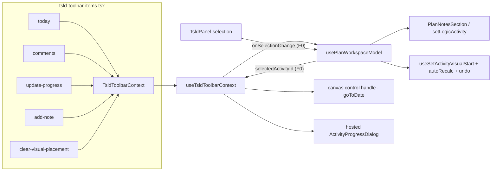
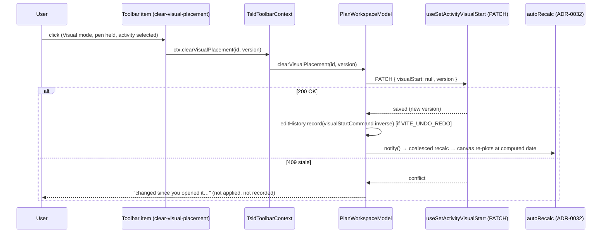
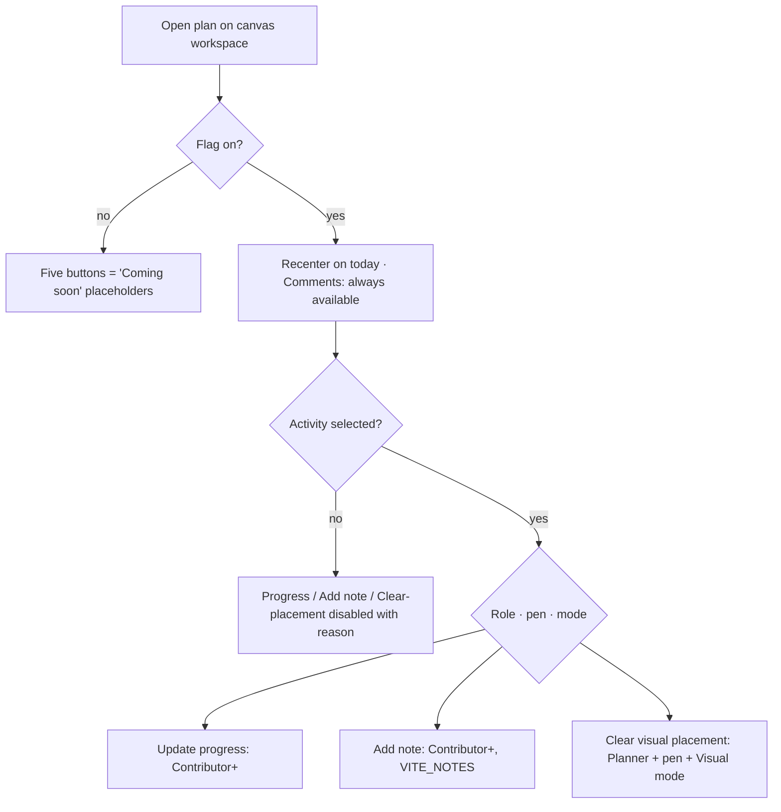

# Feature Spec: TSLD toolbar quick-wins

- **Status:** Draft — awaiting approval
- **Author(s):** Feature Analyst
- **Date:** 2026-07-19
- **Tracking issue / epic:** _(to be created)_
- **Roadmap link:** Canvas workspace polish (ADR-0031 toolbar) / TECH_DEBT toolbar-placeholder burn-down
- **Related ADR(s):** none new — follows ADR-0031 (toolbar registry), ADR-0030 (canvas workspace), ADR-0033 (scheduling modes / `visualStart`), ADR-0046 (notes), ADR-0048 (undo/redo). **No architecturally-significant decision** (see §4).

---

## 1. Business understanding

### Problem

The TSLD two-row toolbar (ADR-0031) is deliberately drawn as a **fully-designed**
surface: controls whose behaviour isn't wired yet render as permanently-disabled
buttons with a "Coming soon" tooltip via the `placeholderItem()` factory. Five of
those placeholders point at capabilities **that already ship in the product** —
their backends, dialogs and sections are live and reachable from other surfaces
(the activities table, the Logic panel, the workspace header, the selection bar).
The toolbar just isn't calling them yet. That is a visible papercut: a planner
sees the icon in the natural place, hovers, and is told "Coming soon" for
something they can already do two clicks away.

This slice wires those five buttons to the existing features. It is **pure UI
wiring** — no new domain capability, no API/schema/engine change.

### Users

Organisation members working a plan on the canvas workspace (ADR-0012 / ADR-0016 roles):

- **Planner / Org Admin** — full authoring; want the recenter, progress, note,
  and clear-placement actions from the toolbar where the icons already sit.
- **Contributor** — can report progress and write notes (neither is pen-gated),
  but cannot edit the schedule; wants progress/notes from the toolbar, and should
  see schedule-editing actions shaded, not offered.
- **Viewer / External Guest** — read-only; want the view-only **Recenter on
  today** and to read **Comments**; must never be offered a mutating action.

### Primary use cases

1. **Recenter on today** — jump the canvas viewport to today's date line (view-only).
2. **Comments** — reveal and focus the plan-level notes thread from the toolbar.
3. **Update progress…** — open the progress editor for the selected activity.
4. **Add note** — open the selected activity's Logic panel at its Notes section.
5. **Clear visual placement** — drop a hand-placed `visualStart` on the selected
   activity so it reverts to its computed date (Visual mode, pen-gated).

### User journeys

**Happy path (view-only, no selection).** A planner pans away while reviewing a
long plan → clicks **Recenter on today** in the Frame cluster → the canvas pans so
today sits at the left edge, and the jump is announced.

**Happy path (selection-aware).** A planner selects an activity on the canvas →
the toolbar's selection-aware actions (**Update progress…**, **Add note**, and —
in Visual mode with the pen — **Clear visual placement**) enable → they click
**Update progress…** → the shared progress dialog opens for that activity → they
save → the canvas re-plots via the existing auto-recalc.

**Alternate (no selection).** With nothing selected, the three selection-aware
buttons are visible but disabled, each with a reason ("Select an activity first").

**Alternate (flag off).** With `VITE_TOOLBAR_QUICK_WINS` off, all five buttons
remain the current "Coming soon" placeholders, byte-for-byte.

Referenced by the user-flow diagram in §4.

### Expected outcomes

Five toolbar icons become live, reusing shipped features. The toolbar reads as
"done" rather than "mostly coming soon". No behaviour change to the underlying
features; only a new entry point to each.

### Success criteria

- A planner reaches each of the five capabilities in **one click** from the
  toolbar (down from navigating to the activities table / Logic panel / header).
- **Zero** change to the recalc parity gate — the CPM engine and
  `apps/api/src/modules/schedule/engine/` are not touched at all.
- All five behave identically to their existing entry points (same dialog, same
  mutation, same auth gates), proven by unit + the existing flag-on Playwright
  journeys.
- WCAG 2.2 AA: every button has a correct enabled/disabled name + reason, and
  reveal/open actions manage focus and announce.

### Open questions

See §4 close and the plan; the two **critical** ones are surfaced to the caller.
Everything else has a stated default and is not blocking.

---

## 2. Functional requirements

### User stories & acceptance criteria

> **US-1 — Recenter on today.** As any member, I want a toolbar button that pans
> the canvas to today, so I can get back to "now" after scrolling.
>
> - **Given** a plan with a data date and today known **when** I click **Recenter
>   on today** **then** the canvas pans so today's line sits at the left inset and
>   the jump is announced (WCAG 4.1.3).
> - **Given** no timeline yet (no data date / no diagram) **when** I look at the
>   button **then** it is disabled with a reason, consistent with the sibling
>   zoom/nav controls.
> - **Given** I am a Viewer **when** I click it **then** it works (navigation
>   never mutates the plan).

> **US-2 — Comments.** As a member, I want a toolbar **Comments** button that
> reveals the plan notes thread, so I can jump to plan-level discussion.
>
> - **Given** `VITE_NOTES` is on and the plan-notes section is mounted **when** I
>   click **Comments** **then** the section scrolls into view and focus moves to
>   its heading (writers land ready to add; viewers land ready to read).
> - **Given** `VITE_NOTES` is off **when** I look at the button **then** it is
>   absent (not a dead control) — Comments has nothing to reveal.

> **US-3 — Update progress…** As a Contributor+ , I want to open the progress
> editor for the selected activity from the toolbar, so I can report actuals
> without leaving the canvas.
>
> - **Given** an activity is selected and I may report progress **when** I click
>   **Update progress…** **then** the shared `ActivityProgressDialog` opens for
>   that activity.
> - **Given** nothing is selected **when** I look at the button **then** it is
>   disabled with "Select an activity first".
> - **Given** I am a Viewer **when** I look at the button **then** it is disabled
>   with a role reason (progress is Contributor+). Progress is **not** pen-gated.

> **US-4 — Add note.** As a Contributor+, I want an **Add note** toolbar button
> that opens the selected activity's Logic panel at its Notes section, so I can
> annotate it in place.
>
> - **Given** `VITE_NOTES` is on, an activity is selected, and I may write notes
>   **when** I click **Add note** **then** the Logic panel opens for that activity
>   with its Notes section revealed/scrolled into view.
> - **Given** nothing is selected **when** I look at the button **then** it is
>   disabled with "Select an activity first".
> - **Given** `VITE_NOTES` is off **when** I look at the button **then** it is
>   absent. Notes writing is **not** pen-gated (role-only, `canWriteNotes`).

> **US-5 — Clear visual placement.** As a Planner holding the pen in Visual mode,
> I want to clear a bar's hand-placed `visualStart` from the toolbar, so it falls
> back to its computed date.
>
> - **Given** Visual mode, I hold the pen, and a placed activity is selected
>   **when** I click **Clear visual placement** **then** the activity's
>   `visualStart` is set to `null`, the change is recorded on the undo stack, and
>   the schedule recalculates (auto-recalc), re-plotting the bar at its computed
>   date.
> - **Given** Early mode, or no pen, or no selection **when** I look at the button
>   **then** it is **visible but disabled (shaded)** with the matching reason — Early → "Only
>   available in Visual mode", no pen → "Start editing…", Late overlay on → "Turn off the Late-start
>   overlay…", no selection → "Select an activity first" (shade-don't-hide, reconciled per U1 review).
> - **Given** a stale version (409) **when** I clear **then** nothing is applied
>   and the standard "changed since you opened it" conflict message shows (the
>   existing reposition contract; never re-sent).

### Workflows

Each button maps to an existing seam (see §4 → Component changes). The only new
plumbing is: (a) a feature flag; (b) lifting the canvas **selection** to the model
so the main toolbar can read it (F0); (c) a handful of context callbacks that call
already-shipped code.

### Edge cases

- **No selection** — the three selection-aware buttons disable with a reason; never throw.
- **Selection then delete / deselect** — `selectedActivityId` clears; buttons re-disable; the hosted progress dialog closes if its target vanished.
- **Stale version on clear-placement** — 409 → not applied, conflict copy, undo not recorded (mirror the reposition VISUAL branch exactly).
- **Flag off** — every button is its current placeholder; F0 selection-lift is inert.
- **`VITE_NOTES` off** — Comments and Add note are absent (nothing to reveal / no notes section).
- **Not in Visual mode** — Clear visual placement stays **visible but shaded** with the reason "Only available in Visual mode" (shade-don't-hide, ADR-0031 — reconciled from the earlier "hidden outside Visual mode" choice per the U1 review finding, so toggling Early↔Visual doesn't shift the bar's silhouette). **`VITE_SCHEDULING_MODES` off** — absent (nothing to place).
- **Responsive single-pane (below `md`)** — Comments must still reveal the plan-notes section (it is mounted in the header stack, present in both panes); if a layout ever hides it, fall back to a no-op-safe guard (see risks).

### Permissions (RBAC + scope, ADR-0012)

| Action                 | Permission gate                                           | Pen-gated? | Scope      |
| ---------------------- | --------------------------------------------------------- | ---------- | ---------- |
| Recenter on today      | none (view-only; all roles incl. Viewer/Guest)            | no         | —          |
| Comments (reveal)      | none to read; write is `canWriteNotes` inside the section | **no**     | plan's org |
| Update progress        | `canProgress` (Contributor+)                              | **no**     | plan's org |
| Add note               | `canWriteNotes` (Contributor+)                            | **no**     | plan's org |
| Clear visual placement | `canEditSchedule` (Planner+ **and pen**) + Visual mode    | **yes**    | plan's org |

All authorisation is already enforced server-side on the reused endpoints; the
toolbar only mirrors the gates for enable/visible state. No new permission.

### Validation rules

None new. Clear-visual-placement sends the existing minimal
`{ activityId, visualStart: null, version }` PATCH (client sends the live version;
the server enforces the optimistic lock). No new form.

### Error scenarios

| Scenario                        | Detection                                   | User-facing result                                                                | Status |
| ------------------------------- | ------------------------------------------- | --------------------------------------------------------------------------------- | ------ |
| Clear-placement on a stale row  | optimistic `version` mismatch               | "This plan changed since you opened it…" (existing copy); not applied, not undone | 409    |
| Clear-placement without the pen | `assertHoldsPen` (server) + client pen-gate | button shaded ("Start editing…"); server would 423                                | 423    |
| Progress/note write by a Viewer | role gate (client) + server authz           | button disabled with role reason                                                  | 403    |
| Recalc after clear fails        | existing auto-recalc `onMessage`            | announced; dates stay until next recalc                                           | —      |

---

## 3. Technical analysis

| Area           | Impact        | Notes                                                                                                                                                                                                                                                                                    |
| -------------- | ------------- | ---------------------------------------------------------------------------------------------------------------------------------------------------------------------------------------------------------------------------------------------------------------------------------------- |
| Frontend       | **low–med**   | One new flag; add `onSelectionChange` to `TsldPanel`; store `selectedActivityId` in the model; add ~6 ctx fields + callbacks; swap 5 placeholders for real items behind the flag; host `ActivityProgressDialog` in the workspace; add a stable ref/id to the mounted `PlanNotesSection`. |
| Backend        | **none**      | Reuses live endpoints only.                                                                                                                                                                                                                                                              |
| Database       | **none**      | No model/migration.                                                                                                                                                                                                                                                                      |
| API            | **none**      | No new/changed endpoint, DTO, or OpenAPI.                                                                                                                                                                                                                                                |
| Security       | **none new**  | All gates already enforced server-side; client mirrors them. Deny-by-default preserved.                                                                                                                                                                                                  |
| Performance    | **none new**  | Selection is already tracked in `TsldPanel`; lifting it adds one memoised callback. Progress dialog is mounted-and-toggled (existing pattern). No new queries.                                                                                                                           |
| Infrastructure | **flag only** | `VITE_TOOLBAR_QUICK_WINS` in `apps/web/src/config/env.ts`; documented `.env.example` shape.                                                                                                                                                                                              |
| Observability  | **none**      | No new logs/metrics; existing announcements reused.                                                                                                                                                                                                                                      |
| Testing        | **med**       | Unit for the registry predicates + new model/ctx state; extend `tsld-toolbar-*.test.tsx`; fold into the existing flag-on Playwright journeys (no new e2e config).                                                                                                                        |

### Dependencies

- **Reuses (must stay unchanged):** `useSetActivityVisualStart`, `ActivityProgressDialog`, `PlanNotesSection`, `ActivityNotesSection` (via `setLogicActivity` → `DependencyEditor` notes slot), the canvas control handle `goToDate`, `model.autoRecalc`, the ADR-0048 `visualStartCommand` inverse.
- **Interacts with flags:** `VITE_NOTES` (Comments, Add note), `VITE_SCHEDULING_MODES` (Clear visual placement), `VITE_CANVAS_TOOLBAR`/`VITE_CANVAS_WORKSPACE`/`VITE_CANVAS_AUTHORING` (the whole toolbar host).
- **Foundation:** F0 selection-lift must land before F3/F4/F5. F1/F2 need no F0.

---

## 4. Solution design

### Architecture overview

The registry never touches the canvas or model directly — it reads
`TsldToolbarContext` and calls its callbacks (ADR-0031). Everything here plugs
into that existing seam: add fields to the context, populate them in
`useTsldToolbarContext` from the model / canvas UI / dialog opener, and call them
from each item's `onActivate` / `isEnabled` / `isVisible`.

### Data flow — Clear visual placement (the most involved; mirrors the reposition VISUAL branch)

### User flow

### Database changes

None.

### API changes

None.

### Component changes

All in the `web` app; reuse existing components — no one-off styling, no new
design-system parts.

**F0 — selection lift (foundation).** Mirror the `editActivityId`/`deleteActivityId`
precedent (`use-plan-workspace-model.ts:106-109`, wired at
`plan-workspace-toolbar.tsx:219-221`, consumed by `ActivityCrudDialogs`):

- `TsldPanel` (`TsldPanel.tsx`) — add an optional `onSelectionChange?: (id: string | null) => void` prop; call it from the existing `setSelectedId` transitions (selection is already local state at line 217). No behaviour change when the prop is absent (flag off / legacy hosts).
- `usePlanWorkspaceModel` — add `selectedActivityId` state + a stable `onSelectionChange` callback; derive the resolved `selectedActivity` (for id + live `version`) from `activities.data`. Return both.
- `TsldToolbarContext` — add `selectedActivityId: string | null` and `selectedActivity` (the resolved summary or null). Populate in `useTsldToolbarContext`.
- Wire `onSelectionChange={model.onSelectionChange}` on the `TsldPanel` render in `plan-workspace-toolbar.tsx`.

**F1 — Recenter on today.** Expose `todayIso` on the context (already on the model
at line 625, not yet on ctx). Replace the `today` placeholder with a real item:
`isEnabled: (ctx) => ctx.hasDiagram`, `onActivate: (ctx) => ctx.goToDate(ctx.todayIso)`.
Default: reuse `goToDate` (12px left inset — consistent with Go-to-date); a
centered variant is not worth a new canvas handle (see alternatives).

**F2 — Comments.** Add a stable id/ref to the mounted `PlanNotesSection`
(`plan-workspace-toolbar.tsx:324-333`) and a `ctx.revealComments()` that scrolls
it into view + focuses its heading. Real item gated `isVisible: () => NOTES_ENABLED`.

**F3 — Update progress…** Host `<ActivityProgressDialog>` in `ToolbarPlanWorkspace`
beside `ActivityCrudDialogs` (`plan-workspace-toolbar.tsx:413`), driven by a new
`model.progressActivityId`. `ctx.openProgress()` sets it to `selectedActivityId`.
Item gated on `canProgress` + a selection; **not** pen-gated.

**F4 — Add note.** `ctx.openActivityNotes()` calls `model.setLogicActivity(selectedActivity)`
(the same path as the canvas "Open logic") so the `DependencyEditor`'s notes slot
(`plan-dialogs.tsx:47-59`, gated `NOTES_ENABLED && model.logicActivity`) renders;
optionally deep-link/scroll to the notes section within it. Gated on
`canWriteNotes` + a selection + `NOTES_ENABLED`; **not** pen-gated.

**F5 — Clear visual placement.** `ctx.clearVisualPlacement(id, version)` →
`model.clearVisualPlacement` which calls `useSetActivityVisualStart` with
`visualStart: null`, records the inverse `visualStartCommand` (ADR-0048, flag-guarded),
then announce + `autoRecalc.notify()` — a faithful subset of the reposition VISUAL branch
(`use-plan-workspace-model.ts:415-435`). Item `isVisible: () => SCHEDULING_MODES_ENABLED`
(shade-don't-hide — visible in both modes, U1); `isEnabled` on `schedulingMode === 'VISUAL'` +
`canEditSchedule` + not the Late overlay + a **resolved** selection (U3); `penGated: true`. Its
`disabledReason` ladder checks the permanent gates (mode → role/pen → Late overlay) before the
transient selection (U2/A5), and reads `ctx.lateOverlayActive` so an overlay-disabled state is
explained (A1). Success + a 409 conflict are **announced** via the shared live region (A2).

### Flag strategy

A single **`VITE_TOOLBAR_QUICK_WINS`** flag via `flagDefaultOff` (build phase),
flipped default-on after specialist reviews — consistent with every prior slice.

- **What it gates:** each of the 5 items is chosen at build time — the real item
  when on, its current `placeholderItem()` when off. Concretely, in
  `buildTsldToolbarItems()` each of the five ids resolves to `real | placeholder`
  on `TOOLBAR_QUICK_WINS_ENABLED`. So flag-off is byte-for-byte today's toolbar
  (five "Coming soon" stubs).
- **F0 stays inert when off:** the `onSelectionChange` prop and
  `model.selectedActivityId` are harmless regardless of the flag — they only feed
  the flag-gated items. When off, nothing reads `selectedActivityId`, the hosted
  progress dialog is never opened (`progressActivityId` stays null), and no new
  behaviour occurs. F0 can therefore land first, dark, without the flag.
- **Nested flag interactions:** Comments/Add note additionally require `VITE_NOTES`;
  Clear visual placement additionally requires `VITE_SCHEDULING_MODES` + Visual mode.
  With those off, the respective items fall back to their placeholder / hidden state.

### Implementation approach & alternatives

**Chosen:** extend the ADR-0031 context seam — add context fields, populate from
existing model/canvas/dialog seams, swap placeholders for real items behind one
flag. This is the smallest change that fully solves the task and reuses every
shipped backend/dialog.

**Alternatives considered:**

1. **Route the three selection-aware actions through `SelectionActionsBar`**
   (`selection-actions.tsx`) which already holds the selected activity — avoids F0
   entirely. **Rejected for this slice:** the task specifies the **main** toolbar
   buttons, and those five placeholders live in `tsld-toolbar-items.tsx`. The
   selection bar is a complementary surface, not a substitute; duplicating the
   actions there is a reasonable **future** enhancement but out of scope here.
2. **A dedicated centered `recenterToday()` canvas handle** for F1 instead of
   reusing `goToDate` (left inset). **Deferred:** marginal UX gain for a new
   imperative handle + tests; the left-inset behaviour is consistent with the
   shipped Go-to-date control. Revisit only if UX review flags it.
3. **A new plan-notes dialog** for Comments instead of revealing the mounted
   section. **Rejected:** no such dialog exists and the section is already mounted;
   reveal+focus is cheaper and keeps one source of truth.

**Is F0 an ADR-level change?** No. It adds one optional prop and one piece of
model state that **exactly mirrors** the accepted `editActivityId`/`deleteActivityId`
precedent (ADR-0031). It introduces no new module boundary, no cross-cutting
pattern, and no engine/API/schema change. A `docs/DECISIONS.md` line is the right
weight; no new ADR. ADR-0031's placeholder enumeration doc-comment should be
updated to reflect the five that are now wired.

---

## 5. Links

- Implementation plan: `docs/specs/toolbar-quick-wins/implementation-plan.md`
- Docs touched by this change: `apps/web/src/config/env.ts` (flag + `.env.example`), `docs/adr/0031-*` (placeholder enumeration doc-comment), `docs/TOOLBAR_ROADMAP.md`, `docs/ROADMAP.md`, `docs/TECH_DEBT.md`, `docs/DECISIONS.md`, a `@repo/web` **minor** changeset.
