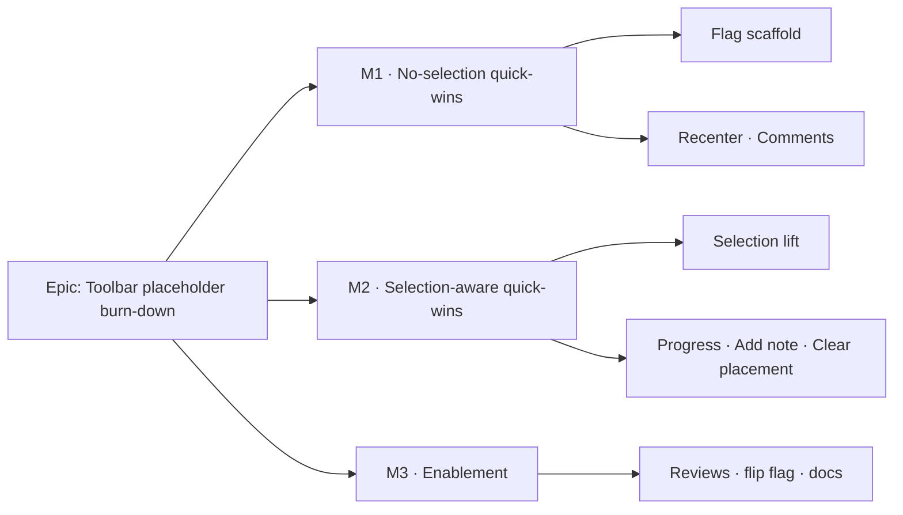

# Implementation Plan: TSLD toolbar quick-wins

- **Feature spec:** `docs/specs/toolbar-quick-wins/feature-spec.md`
- **Status:** Approved (2026-07-19) — build all five, single flip at M3; Recenter reuses `goToDate`.
- **Owner:** _(to be assigned)_

## Breakdown

### Epic

**Toolbar placeholder burn-down** — wire five already-shipped capabilities to
their `tsld-toolbar-items.tsx` placeholders. Roadmap theme: canvas-workspace
polish (ADR-0031) / TECH_DEBT toolbar placeholders. **Frontend only. No API,
schema, `@repo/types`, or CPM-engine change; the recalc parity gate is untouched.**

---

### Milestone 1: No-selection quick-wins (shippable slice)

**Outcome:** behind `VITE_TOOLBAR_QUICK_WINS`, **Recenter on today** and
**Comments** are live from the toolbar — an immediate, low-risk visible win that
needs no selection plumbing. Flag stays default-**off** until M3.

---

#### Feature: Flag scaffold + Recenter + Comments

> **Description:** the feature flag, then the two selection-free buttons.
> **Complexity:** S
> **Dependencies:** none (F1/F2 don't need F0).
> **Risks:** Comments reveal target must stay mounted across the responsive single-pane toggle → mitigate with a guarded scroll-into-view (no-op if absent).
> **Testing requirements:** unit for the flag swap + the two registry items' enable/visible/activate; extend `tsld-toolbar-*.test.tsx`.

##### Task 1.1 — Add `VITE_TOOLBAR_QUICK_WINS` flag + placeholder-swap scaffold (≈ one PR)

- **Description:** add `TOOLBAR_QUICK_WINS_ENABLED = flagDefaultOff(import.meta.env.VITE_TOOLBAR_QUICK_WINS)` in `apps/web/src/config/env.ts` with a doc-comment mirroring the prior slices; introduce the build-time `real | placeholderItem()` selection in `buildTsldToolbarItems()` for the five ids (still all placeholders this PR, flag off).
- **Complexity:** S
- **Dependencies:** none
- **Risks:** accidental default-on → assert `flagDefaultOff` in a unit test.
- **Testing:** unit — with the flag off, all five ids resolve to the "Coming soon" placeholder (byte-for-byte today).
- **Development steps:**
  1. Add the flag + doc-comment; document `.env.example` shape.
  2. Add the per-id `real | placeholder` switch (placeholders only for now).
  3. Unit-assert flag-off = unchanged toolbar.

##### Task 1.2 — Recenter on today (F1)

- **Description:** expose `todayIso` on `TsldToolbarContext` (from `model.todayIso`); replace the `today` placeholder (≈ line 695) with a real item — `isEnabled: (ctx) => ctx.hasDiagram`, `disabledReason` matching the zoom/nav siblings, `onActivate: (ctx) => ctx.goToDate(ctx.todayIso)`.
- **Complexity:** S
- **Dependencies:** Task 1.1
- **Risks:** left-inset vs centered placement → default to `goToDate` (left inset), UX review can request a centered handle later.
- **Testing:** unit — enabled iff `hasDiagram`; activate calls `goToDate(todayIso)` and announces; Viewer can activate.

##### Task 1.3 — Comments (F2)

- **Description:** add a stable ref/id to the mounted `PlanNotesSection` (`plan-workspace-toolbar.tsx:324-333`); add `ctx.revealComments()` (guarded scroll-into-view + focus the section heading); replace the `comments` placeholder (≈ line 1093) with a real item gated `isVisible: () => NOTES_ENABLED`.
- **Complexity:** S
- **Dependencies:** Task 1.1
- **Risks:** section not in the DOM in some responsive branch → `revealComments` no-ops safely; add a unit test for the absent case.
- **Testing:** unit — visible iff `NOTES_ENABLED`; activate scrolls + focuses; absent-target is a safe no-op.

---

### Milestone 2: Selection-aware quick-wins (shippable slice)

**Outcome:** with F0 landed, **Update progress…**, **Add note**, and **Clear
visual placement** enable when an activity is selected (each with its own role /
pen / mode gate), all behind the same flag.

---

#### Feature: F0 — selection lift (foundation)

> **Description:** surface the canvas selection to the main toolbar, mirroring the `editActivityId`/`deleteActivityId` precedent.
> **Complexity:** M
> **Dependencies:** none (can land dark, before the flag flips).
> **Risks:** selection churn re-identifying the toolbar context (perf) → keep the ctx memo keyed on `selectedActivityId` + resolved activity only; a selection change already re-renders the panel.
> **Testing requirements:** unit for the new model state + ctx fields; assert inert when nothing reads them.

##### Task 2.1 — Lift selection into the model + context

- **Description:** add `onSelectionChange?: (id: string | null) => void` to `TsldPanel`, called from the existing `setSelectedId` transitions; add `selectedActivityId` state + a stable `onSelectionChange` in `usePlanWorkspaceModel`, plus a derived `selectedActivity` (id + live `version`) from `activities.data`; add `selectedActivityId` + `selectedActivity` to `TsldToolbarContext` and populate them in `useTsldToolbarContext`; wire `onSelectionChange={model.onSelectionChange}` on the `TsldPanel` render.
- **Complexity:** M
- **Dependencies:** none
- **Risks:** double source of truth vs `SelectionActionContext` → the model holds the canonical id; the in-panel context is unchanged and still local.
- **Testing:** unit — `onSelectionChange` updates `model.selectedActivityId`; `selectedActivity` resolves the row and clears on delete/deselect; ctx exposes both.
- **Development steps:**
  1. Add the `TsldPanel` prop + call sites (no behaviour change when absent).
  2. Add model state + derived activity; return them.
  3. Add ctx fields; populate; wire the prop in the workspace.

#### Feature: F3–F5 — the three selection-aware actions

> **Description:** progress, add-note, clear-placement, each reusing a shipped seam.
> **Complexity:** M
> **Dependencies:** F0 (Task 2.1); Task 1.1 (flag).
> **Risks:** pen-gating matrix must be exact (see below) → cover each gate with a unit test.
> **Testing requirements:** unit per item (visible/enabled/disabledReason/activate); extend `tsld-toolbar-*.test.tsx`; fold into the flag-on Playwright journeys.

##### Task 2.2 — Update progress… (F3)

- **Description:** host `<ActivityProgressDialog>` in `ToolbarPlanWorkspace` (beside `ActivityCrudDialogs`), driven by new `model.progressActivityId` (+ setter); `ctx.openProgress()` sets it to `selectedActivityId`; replace the `update-progress` placeholder (≈ line 1057) with a real item — `isEnabled` on `canProgress` **and** a selection; **not** `penGated`; `disabledReason` = "Select an activity first" / role reason.
- **Complexity:** M
- **Dependencies:** Task 2.1
- **Risks:** dialog target vanishes on delete → the dialog is mounted-and-toggled (existing pattern); clear `progressActivityId` when the selection clears.
- **Testing:** unit — enabled iff `canProgress` + selection; activate sets `progressActivityId`; not pen-gated (enabled without the pen for a Contributor).

##### Task 2.3 — Add note (F4)

- **Description:** `ctx.openActivityNotes()` calls `model.setLogicActivity(selectedActivity)` (same path as canvas "Open logic"), optionally deep-linking/scrolling to the `DependencyEditor` notes slot; replace the `add-note` placeholder (≈ line 905) with a real item gated `isVisible: () => NOTES_ENABLED`, `isEnabled` on `canWriteNotes` + a selection; **not** `penGated`.
- **Complexity:** S–M
- **Dependencies:** Task 2.1
- **Risks:** deep-link to the notes section within the Logic panel is best-effort → if the anchor isn't available, opening the Logic panel (notes visible) still satisfies the story.
- **Testing:** unit — visible iff `NOTES_ENABLED`; enabled iff `canWriteNotes` + selection; activate calls `setLogicActivity` with the selected row.

##### Task 2.4 — Clear visual placement (F5)

- **Description:** add `model.clearVisualPlacement(id, version)` — a faithful subset of the reposition VISUAL branch: `useSetActivityVisualStart` with `visualStart: null`, record the inverse `visualStartCommand` (guarded on `UNDO_REDO_ENABLED`), then `autoRecalc.notify()`; handle 409 as the existing non-destructive conflict (not applied, not recorded). `ctx.clearVisualPlacement(id, version)` calls it. Replace the `clear-visual-placement` placeholder (≈ line 927) with a real item: `penGated: true`; `isVisible`/`isEnabled` on `schedulingMode === 'VISUAL'` + `canEditSchedule` + a selection; disabled reasons for each missing condition.
- **Complexity:** M
- **Dependencies:** Task 2.1
- **Risks:** must **not** touch the parity gate → it calls only the existing PATCH + auto-recalc; add a test asserting the payload is exactly `{ activityId, visualStart: null, version }`; **CANVAS_AUTHORING off** path → mirror the non-auto-recalc branch or gate the item so it's only offered where auto-recalc is live (default: reuse whatever the reposition branch does for the same flag).
- **Testing:** unit — visible/enabled only in Visual + pen + selection; activate sends the null-visualStart PATCH, records the inverse (when `VITE_UNDO_REDO` on), notifies auto-recalc; 409 → conflict copy, nothing recorded.

---

### Milestone 3: Enablement (shippable slice)

**Outcome:** the flag flips default-**on**; the five buttons are live for everyone.

##### Task 3.1 — Reviews, flag flip, docs

- **Description:** run the specialist reviewers (accessibility, ux, component, performance); fold blocking findings; fold the five actions into the existing flag-on Playwright journeys (`e2e-toolbar` / `e2e-authoring` / `e2e-workspace` as appropriate — **no new e2e config**); flip `flagDefaultOff` → `flagDefaultOn` for `VITE_TOOLBAR_QUICK_WINS` with the "pre-flip gates green" doc-comment; update docs.
- **Complexity:** S–M
- **Dependencies:** M1 + M2 complete
- **Risks:** a11y blockers on disabled-reason copy / focus → caught by the accessibility-reviewer before flip.
- **Testing:** Playwright journey assertions for each action (flag-on); full unit suite green.
- **Development steps:**
  1. Specialist reviews + fold findings.
  2. Extend the existing flag-on Playwright journeys.
  3. Flip the flag default; update ADR-0031 placeholder-enumeration doc-comment, `docs/TOOLBAR_ROADMAP.md`, `docs/ROADMAP.md`, `docs/TECH_DEBT.md`, `docs/DECISIONS.md` (F0 note); add the `@repo/web` **minor** changeset.

---

## Sequencing & slices

1. **M1** — Task 1.1 (flag) → 1.2 (Recenter) → 1.3 (Comments). Ships value with no selection plumbing; flag off.
2. **M2** — Task 2.1 (F0, can land dark) → 2.2 / 2.3 / 2.4 in any order.
3. **M3** — reviews → fold into Playwright → flip flag on → docs/changeset.

Each task keeps `main` releasable: flag-off is byte-for-byte today's toolbar, and
F0 is inert until a flag-gated item reads the selection.

### Pen-gating matrix (explicit)

| Item                   | Role gate         | Pen?    | Mode       | View-only ok? |
| ---------------------- | ----------------- | ------- | ---------- | ------------- |
| Recenter on today      | none              | no      | any        | yes (Viewer)  |
| Comments               | none (read)       | no      | any        | yes           |
| Update progress        | `canProgress`     | **no**  | any        | no            |
| Add note               | `canWriteNotes`   | **no**  | any        | no            |
| Clear visual placement | `canEditSchedule` | **yes** | **Visual** | no            |

### Accessibility

- Disabled-reason copy threaded via each item's `disabledReason(ctx)` (mirrors the sibling items): no-selection → "Select an activity first"; no pen → the shared "Start editing…" reason; wrong mode → hidden; flag-off → the existing "Coming soon".
- Recenter and Clear-placement **announce** via the existing `useAnnounce` (Recenter reuses `goToDate`'s announcement; Clear reuses the auto-recalc message).
- **Comments / Add note** manage focus on reveal/open (move focus to the notes section heading / Logic panel), so keyboard users aren't stranded (WCAG 2.4.3 / 4.1.3).

## Definition of Done (per task)

Each task's PR must satisfy the Feature Completion Criteria in
[`docs/PROCESS.md`](../../PROCESS.md) §21 — code, tests (≥ 80% on changed code),
docs, security review, performance, accessibility (WCAG 2.2 AA), Docker build, CI
green, changeset, version impact. This slice needs a **`@repo/web` minor**
changeset, ROADMAP/TECH_DEBT/TOOLBAR_ROADMAP touches, an ADR-0031 placeholder-
enumeration doc-comment update, and a `docs/DECISIONS.md` note for F0 — **no new ADR**.

## Risks & assumptions (rollup)

| Risk / assumption                                                | Likelihood | Impact | Mitigation                                                                             |
| ---------------------------------------------------------------- | ---------- | ------ | -------------------------------------------------------------------------------------- |
| Selection-lift re-identifies the toolbar ctx (perf)              | med        | low    | memo keyed on `selectedActivityId` + resolved row only                                 |
| Comments target hidden in a responsive branch                    | low        | low    | guarded scroll-into-view; unit-test the absent case                                    |
| Clear-placement inadvertently touches the parity gate            | low        | high   | uses only the existing PATCH + auto-recalc; assert exact payload; engine dir untouched |
| Flag accidentally default-on before reviews                      | low        | med    | `flagDefaultOff` + a unit assertion                                                    |
| Pen/role/mode gate wrong on a selection-aware item               | med        | med    | one unit test per gate; security-reviewer sign-off                                     |
| Assumption: `PlanNotesSection` stays mounted in the header stack | —          | —      | verified at `plan-workspace-toolbar.tsx:324-333`; guarded reveal if it moves           |

## Recommended specialist agents (build/review)

- **accessibility-reviewer** — disabled-reason copy, focus management on reveal/open, announcements.
- **ux-reviewer** — state coverage (no-selection / wrong-mode / flag-off), copy, recenter placement.
- **component-reviewer** — registry item shape, ctx field additions, no one-off styling, tests.
- **performance-reviewer** — ctx memoisation under selection churn.
- **test-engineer** — unit predicates + folding into the existing Playwright journeys.
- _security-reviewer_ optional: no new endpoint, but confirm the client gates mirror the server ones (no new IDOR surface).
- _database-architect / api-reviewer / backend-performance-reviewer:_ **not needed** — no DB/API/backend change.
