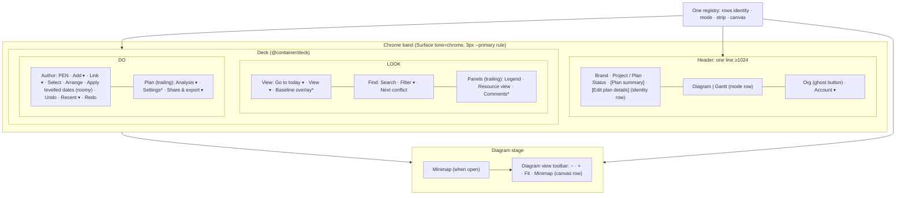

# Feature Spec: Toolbar redesign for a laptop, Surface Pro and monitor-first app

- **Status:** Draft
- **Author(s):** feature-analyst (for the product owner, james); revision 2 folds in the UX, component and
  accessibility reviews
- **Date:** 2026-10-09
- **Tracking issue / epic:** — (none yet)
- **Roadmap link:** UI consistency / minimum-viewport follow-on (ADR-0179)
- **Related ADR(s):** a new ADR is required (outline in §4.10). It completes ADR-0109's supersession of ADR-0090 D6 and
  ADR-0091 D3a by deleting their dead code. It amends the **live** parts of ADR-0031 (tier text; the zoom
  controls in group 1), ADR-0091 D3 (zoom placement), ADR-0100 (minimap toggle location) and ADR-0133 D1 (rows
  sharing a line, argued in §4.4). It applies ADR-0179 D2, ADR-0093, ADR-0082, ADR-0117 and ADR-0135. It does not
  change ADR-0118/0183.
- **Folds in:** `docs/TECH_DEBT.md` #471 (first half). It also **overturns** #193's deliberate keep of the
  ladder machinery: ADR-0110 M5 kept it on purpose, and removing it is an ADR-0105 public-contract change, made
  here with the reason in §4.2.

> **About the measurements.** Revision 1 was written without a shell, and its figures were estimates. The UX
> review then took real readings in the container's Chromium. They are quoted below as **"UX review reading"**.
> The screenshots are in `/tmp/claude-0/shots/`, a temporary directory that is **not committed**. M0 retakes
> these readings and commits a record, including the coarse-pointer and stress-state cells the UX review did not
> take. Anything still marked **estimate** is replaced by M0. If M0 contradicts a premise, the work stops (the
> precedent is `docs/specs/retire-single-pane-workspace/m0-measurement.md` §0).

---

## 1. Business understanding

### Problem

SchedulePoint is designed from a 1024 × 600 floor up (ADR-0179). The narrow single-pane workspace is retired
(ADR-0181) and phones are unsupported. The two toolbars were shaped when **width** was the scarce resource. A
width ladder and a `⋯` overflow were later replaced by "the surface wraps" (ADR-0109), which moved the cost into
**height**. Nobody has since re-asked where each tool belongs.

| Viewport (fine) | Header | Deck              | Canvas            | Source                                                              |
| --------------- | ------ | ----------------- | ----------------- | ------------------------------------------------------------------- |
| 1024 × 600      | 40     | **168 (4 lines)** | **274**           | UX review reading; agrees with `minimum-viewport/m4-measurement.md` |
| 1280 × 800 +    | 40     | 80 (2 lines)      | 562 at 1280 × 800 | UX review reading; m4                                               |

Coarse pointer (m4, not re-read): 1024 × 600 has 4 lines and a 234 px canvas; 1440 × 900 has 3 lines. **M0 re-reads
coarse.**

Below the floor it is worse (#471). The header and the wrapped deck take 355 px at 640 wide and 603 at 320, so the
foot row is unreachable at 640 × 360 (`retire-single-pane-workspace/m0-measurement.md` §2). That is reachable on
supported hardware: **a 1280 × 800 laptop at 200 % zoom is a 640 × 400 viewport**.

**Left over from the width era, verified in code:**

1. **Three things decide whether a label shows:**
   - `Toolbar.tsx:295` (`showLabel !== 'never'`);
   - `Deck`'s `ICON_ONLY` id list (`Deck.tsx:137-148`, used instead of `showLabel` at `:433`);
   - the triggers' `compact` prop via `triggersAreCompact` (`tsld-toolbar-items.tsx:1114-1125`). This can never be
     true, because both `Deck` and `Toolbar` pass `'comfortable'` (`toolbar-registry.ts:108-112`, `Deck.tsx:172-177`).

   The rule is implemented four times: `ToolbarButton`, `ToolbarPopover`, `ToolbarSplitButton`, and the custom
   `render` triggers (Analysis, Share & export). `ICON_ONLY` also lists `print`, which is not a deck item: Print is
   a menu item (`tsld-toolbar-items.tsx:1794-1801`).

2. **`tier` and `priority` are inert** (`toolbar-registry.ts:41-50`, `:285-310`).
3. **Stale prose:**
   - `DESIGN_SYSTEM.md:236-238`: captions that fold;
   - `:239-241`: lists `print` as a deck icon;
   - `:255-258`: tier as "priority within a group";
   - `:304-308`: `min-h-9`, `text-micro` and captions as controls;
   - `Deck.tsx:61`: the `text-micro` label;
   - `tsld-toolbar-items.tsx:2658`: claims Float paths moved;
   - `tsld-toolbar-items.tsx:3150-3153`: "the deck is fixed at `comfortable`" as the reason for icon-only;
   - `plan-workspace-toolbar.tsx:2143`, `:2271`: `resolveLayoutMode` asides;
   - `toolbar-band.tsx:11-16`: density bands.
4. **The View ▾ panel is 584 px tall in a 600 px window at the floor** (UX review reading). It scrolls, and nearly
   covers the diagram.
5. **A group seam is painted at the start of a line at 1024** (UX review reading): the `before:` rule of a group that
   wrapped to a new line (`Deck.tsx:364-365`).

### Users

| Role                | Need                                                                                                                       |
| ------------------- | -------------------------------------------------------------------------------------------------------------------------- |
| Planner / Org Admin | Authoring one press away; the tallest diagram; commands that stay in place                                                 |
| Contributor         | Read, navigate, comment; authoring shaded with its reason                                                                  |
| Viewer              | Read, navigate, export and print; authoring shaded with its reason                                                         |
| External Guest      | **Not affected.** The share route has its own guest bar (`features/share/`); only `plan-detail.tsx` mounts `PlanWorkspace` |

### Primary use cases

1. Work the diagram at 1024 × 600 with the tallest canvas the chrome allows.
2. On a monitor, see every frequent command labelled, in a stable, balanced arrangement.
3. On a Surface in tablet posture (44 px targets), reach everything without the deck eating the diagram.
4. At 200 % zoom (page or text-only), still reach the workspace, the foot row and every command.
5. Find a tool by its subject: the plan's facts by its name, the viewport on the diagram, the selection on the
   selection's bar.

### User journeys (if M0 confirms)

- **1024 × 600 fine:** one header line. Two deck lines:
  - LOOK: View group, Find group, and a trailing Panels group;
  - DO: the pen and Author group, and a trailing Plan group.

  Zoom, Fit and Minimap are in the diagram's corner. Baseline overlay, Comments and Settings show only their
  icons. Canvas about 362 px.

- **Monitor (1912):** the same two lines, every command labelled, Panels and Plan on the trailing edge. No row more
  than 25 % empty.
- **Surface tablet posture:** the same layout at 44 px. At most three deck lines at 1024.
- **Below 1024 wide:** one deck line that scrolls sideways, with a visible edge cue. In very short windows the
  band scrolls away with the page.

### Expected outcomes (if M0 confirms)

- About 88 px more diagram at the floor.
- One label API and one class helper, read from one place.
- Every tool placed with a written reason.
- #471's band half closed.
- The dead ladder deleted.
- The visual decisions in §4.8, each signed off with screenshots.

### Success criteria

Fine pointer unless stated. Deck lines are counted as `command-surface.spec.ts:564-577` does.

| ID    | Criterion                                                                                                                                                                                                     | Today                          | Target                 |
| ----- | ------------------------------------------------------------------------------------------------------------------------------------------------------------------------------------------------------------- | ------------------------------ | ---------------------- |
| SC-1  | 1024 × 600: deck lines; canvas                                                                                                                                                                                | 4; 274                         | **2; ≥ 350**           |
| SC-2  | 1280 × 800, 1440 × 900, 1912 × 1080: each declared row is one line (measured, not forced)                                                                                                                     | holds except LOOK at 1440 (m4) | holds                  |
| SC-3  | Coarse 1024 × 600 / 1440 × 900 / 1912 × 1080: deck lines                                                                                                                                                      | 4 / 3 / 2 (m4)                 | **≤ 3 / 2 / 2**        |
| SC-4  | Header is one line at every viewport ≥ 1024, both pointers                                                                                                                                                    | holds                          | holds                  |
| SC-5  | Below 1024: at 640 × 360 and 320 × 256 the band is ≤ 40 % of viewport height **or** scrolls away vertically; Expand and Recalculate are hit-testable at 640 × 480, 640 × 360, 640 × 300, 320 × 720, 320 × 256 | 99 % / 100 %; unreachable      | met                    |
| SC-6  | 640 × 480 and 320 × 720, panel expanded: ≥ 1 hit-testable table row                                                                                                                                           | 0                              | ≥ 1                    |
| SC-7  | 1280 × 800 with text-only 200 % (`html { font-size: 200% }`): every deck control hit-testable; rows may wrap                                                                                                  | unmeasured                     | holds                  |
| SC-8  | One label decider: `Deck.tsx` and `Toolbar.tsx` hold no label logic of their own; every component calls the one resolver and class helper                                                                     | 3 deciders, 4 implementations  | 1 and 1                |
| SC-9  | `BAND_MAX_PX` holds (`command-surface.spec.ts:535`); a 1024 bar is added at M0's reading                                                                                                                      | ≤ 145                          | ≤ 145, plus a 1024 bar |
| SC-10 | One label size and one control height per surface (`command-surface.spec.ts:500-504`)                                                                                                                         | holds                          | holds                  |
| SC-11 | ≤ 25 % empty horizontal space in each deck row at 1912 × 1080                                                                                                                                                 | M0 records                     | ≤ 25 %                 |
| SC-12 | No group seam at the start of any line, in any state (conflicts present, pen held by peer, shaded)                                                                                                            | fails at 1024                  | holds                  |
| SC-13 | View ▾ panel ≤ 70 % of viewport height at 1024 × 600, no inner scroll                                                                                                                                         | 584 / 600                      | ≤ 420                  |
| SC-14 | **No tool is lost:** a computed test against a committed manifest of registry ids, header controls, selection-bar items and menu item names; every manifest entry resolves in the after state                 | —                              | passes                 |
| SC-15 | Focus not obscured (WCAG 2.4.11): a keyboard reveal scrolls the focused activity clear of the corner cluster and minimap                                                                                      | —                              | journey passes         |
| SC-16 | The visual brief (§4.8): each item signed off by the product owner with before/after screenshots at 1024 × 600, 1280 × 800, 1440 × 900 and 1912 × 1080                                                        | —                              | signed                 |

### Open questions

**Critical.** Each one gates a milestone in the plan's dependency graph.

- **CQ-1 — Do Zoom out, Zoom in, Fit to plan and the Minimap toggle move onto the diagram's corner?**
  _Recommendation: yes._ They only work on the diagram: today they are shaded in the Gantt via
  `canvasViewportReason`. In the corner they cost no height. Geometry is in §4.7. _If no:_ they stay icon-only on
  the deck. Then LOOK needs about 130 px more compaction (estimate), which means more icon-only items than the
  three the UX review accepted.
- **CQ-2 — May exactly three commands show only their icon below the roomy width: Baseline overlay, Comments and
  Settings?** Each keeps its name for assistive tech and gets a hover/focus tooltip. _Recommendation: yes._ It is
  the measured minimum: −107, −71 and −66 px puts LOOK from about 1120 to about 942, inside 1008 (UX review
  reading). Select stays labelled. Resource view is not on the list: its people glyph reads as "members".
- **CQ-3 — Below 1024 wide, may the deck become one line that scrolls sideways? And in very short windows may the
  whole band scroll away vertically?** _Recommendation: yes, triggered by width only._ 1280 × 600 and 1366 × 768
  keep two rows. ADR-0179 D2 already lets the band scroll below the floor. WCAG 1.4.10 Note 2 names "interfaces
  where it is necessary to keep toolbars in view while manipulating content" (W3C Understanding 1.4.10, read
  2026-10-09). The 1.4.10 obligation is that the band not consume the viewport, which is why the vertical
  scroll-away exists.
- **CQ-4 — May the organisation switcher become a ghost button with an icon that opens the existing menu,
  replacing the bordered native `<select>`?** This changes every screen's header, not only the plan's.
  _Recommendation: yes, subject to an accessibility review._ The native select's deliberate reasons
  (`OrgSwitcher.tsx:45-57`) are carried over: name, current value announced, keyboard. _If no:_ restyle the
  select's border and background only.

**Defaults taken (reviewers may overturn):**

- **D-a:** Summary and Edit plan become **registry items in a new `identity` row**, rendered by `Toolbar` after the
  status badge. Summary keeps its popover. The pencil is renamed **"Edit plan details"** so it cannot be confused
  with the pen's "Start/Stop editing".
- **D-b:** **Keyboard shortcuts stay in the Account menu.** ADR-0091 D6b moved them there because they are "a
  reference about the application, not the plan". That argues against the plan's toolbar, not against the app
  header. But the `?` key already opens the sheet and the UX review rates a header button as low value, so the
  smallest correct change is none. A header button (`aria-keyshortcuts="?"`) is recorded as the alternative.
- **D-c:** **Float paths moves to the selection bar if M0 confirms a Gantt route.** `selection-actions.tsx:206`
  says the Gantt renders no selection bar, so its Gantt route would be the Gantt row menu (`GanttRowMenu.tsx`).
  If the row menu does not mirror the bar's object actions, Float paths stays on the deck.
- **D-d:** **A fifth deck group, "Panels"**, on the LOOK row, trailing: Legend, Resource view, Comments. It reuses
  the empty registry group **`help`** (ADR-0031 group 7, which first held the legend) through a `DECK_GROUPS`
  remap, so the taxonomy is unchanged.
- **D-e:** **One trailing group per row: Panels on LOOK, Plan on DO.** Applies when the rows are stacked.
- **D-f:** cut. Analysis ▾ checkable dock items are out of this epic. (`Menu` already supports `menuitemcheckbox`,
  `menu.tsx:368-432`, so there was never a primitive change in it.)
- **D-g:** **The View ▾ panel is fixed at 1024**: two columns and collapsible sections (SC-13). The zoom-preset
  radios stay; they are not duplicates of ±.
- **D-h:** Control heights are unchanged (36 / 44). The keyboard-cover gap stays declined (ADR-0183 D3).
- **D-i:** The organisation switcher stays trailing (only its styling changes, CQ-4).
- **D-j:** #471's second paragraph (the selection bar in the foot row) gets its own row at close-out.
- **D-k:** No feature flag (ADR-0088 D1).
- **D-l:** **Apply levelled dates… is labelled where the row allows** (`roomy`), since its icon fails the glyph
  test. It is icon-only below roomy.
- **D-m:** **Rows share one line on very wide bands** (R2). The ADR-0133 D1 tension is argued in §4.4; it is the
  first thing to drop if the UX review disagrees.

---

## 2. Functional requirements

### User stories & acceptance criteria

> **US-1 — Two lines at the floor.**
>
> - At 1024 × 600 fine (Explorer 276), the deck's controls sit on two lines (LOOK, DO). This is a **measured**
>   outcome: rows keep `flex-wrap` as a safety valve.
> - Coarse 1024: ≤ 3 lines.
> - The same holds in the stress states M0 defines: conflicts present (chip shown), pen held by a peer, no
>   computed diagram, Gantt view.

> **US-2 — One label rule.**
>
> - Every registry item declares `labelVisibility: 'always' | 'never' | 'roomy'`.
>   - The existing `'auto'` (which already means "always") becomes `'always'`, which is also the default.
>   - The band form `{ atLeast }` is removed.
>   - `ICON_ONLY` is deleted. Its members are declared `'never'`, except `apply-levelling`, which becomes `'roomy'`.
>     `print` is dropped.
> - One resolver (`resolveLabelVisibility`) and one exported helper (`toolbarLabelClass()` or `<ToolbarLabel>` in
>   `toolbar-styles.ts`) are used by `ToolbarButton`, `ToolbarPopover`, `ToolbarSplitButton` and every custom
>   trigger. A structural test fails if a component paints a label any other way.
> - **Inside `Deck`** (the only `@container/deck`), a `'roomy'` label is `sr-only` under the theme container token
>   `--container-roomy`, using the named variant `@max-roomy/deck:`. It is never an arbitrary `@max-[…]` value,
>   which is invalid in Tailwind v4.
> - **Inside `Toolbar`** (not a container: mode row, identity row, corner cluster), `'roomy'` resolves to `'always'`,
>   and a unit test says so.
> - **Tooltip:** a CSS rule cannot switch the tooltip, because it is portalled to `document.body`
>   (`tooltip.tsx:389`) and `disabled` is a JS prop (`:62`). **Decision:** every `'roomy'` item always mounts a
>   tooltip whose purpose is its `description`, never a bare name-echo. So it reads correctly whether or not the
>   label is showing, and Escape dismisses it. Baseline overlay and Comments gain a `description`; Settings already
>   has one.
> - **Custom triggers** (Analysis, Share & export, `ToolbarPopover`, `ToolbarSplitButton`) have only a native
>   `title`, so **they may not be `'roomy'`**. A structural test asserts that every `'roomy'` item is a plain
>   `onActivate` item rendered by `ToolbarButton`.
> - **The container-query trap** (`UX_STANDARDS.md:391-398`): `@container` applies `contain: inline-size`, so it
>   goes on the deck's full-width block wrapper, never on a `shrink-0` auto-width item. This is honoured in
>   `container-query.structural.test.ts`, plus a layout assertion that the deck's width equals the band's inner
>   width at every cell.

> **US-3 — Corner cluster (CQ-1).**
>
> - The Diagram view shows a `role="toolbar"` named **"Diagram view"** at the stage's bottom-right: Zoom out, Zoom in,
>   Fit to plan, Minimap. The minimap button has `aria-pressed`.
> - Every item keeps its shortcut on `aria-keyshortcuts` and its shade reasons.
> - It is rendered by `Toolbar` over a registry slice (`row: 'canvas'`). Minimap reaches that slice through a
>   promotion target, like `promotedLensItems()` (`tsld-toolbar-items.tsx:432-451`). There is no second registry.
> - It reuses `toolbarCardVariants`.
> - Geometry, overlaps and states are in §4.7.
> - Tab order: canvas → minimap (when open) → cluster.
> - Shaded buttons stay focusable with a reason (ADR-0082/0083).
> - ADR-0135 focus hand-off: when the cluster unmounts under focus (switching to the Gantt), focus goes to the
>   view switch's pressed segment, and the move is announced. Tested.
> - Switching Diagram ↔ Gantt causes no layout shift in the band.

> **US-4 — Every tool on its subject's surface.**
>
> - Summary is a registry item in the `identity` row: a popover trigger with `aria-haspopup="dialog"`,
>   `aria-expanded`, the name **"Plan summary"**, a tooltip, and focus returning to the trigger.
> - Edit plan is also an identity-row item, renamed **"Edit plan details"**. The rename changes the voice-control
>   command, which is recorded in the changeset.
> - Float paths, if moved (D-c), works by keyboard from the selection bar (Diagram) and the Gantt row menu.
>   `float-paths-view-agnostic.structural.test.ts` stays green.
> - Panels toggles keep `aria-pressed`. Opening a panel never strands focus on `<body>`.
> - SC-14's manifest test passes.

> **US-5 — Anchored, balanced rows (stacked case).**
>
> - With the rows stacked at ≥ 1280: each row's first control starts at the leading inset, and its trailing group
>   (Panels, Plan) ends within 1 px of the trailing inset.
> - DOM order equals visual order, asserted.
> - No leading seam on any line (SC-12).

> **US-6 — Below the floor (#471, CQ-3).**
>
> - Under `max-lg:` the deck renders LOOK then DO on one `flex-nowrap overflow-x-auto` line.
> - Roving focus calls `scrollIntoView({ block: 'nearest', inline: 'nearest' })` (**required**), with
>   `scroll-px-2` padding.
> - A visible overflow cue (an edge fade, and the last item clipped rather than hidden), because overlay
>   scrollbars may not show.
> - A menu anchored to a half-scrolled trigger clamps to the viewport (tested).
> - Under the new `@custom-variant squat` (a height condition beside `tall`/`short`, `globals.css:31,36`, pinned by
>   `breakpoints.test.ts`), the band moves into the scrolling region and scrolls away vertically.
> - At ≥ 1024 the deck never scrolls sideways, whatever the height.

> **US-7 — Rows share a line (D-m).** When the band can hold LOOK and DO side by side, they share one line. A
> group never changes rows.

### Accessibility acceptance criteria (journeys)

1. The deck is one roving stop: ArrowRight order, Home and End, at 1024 × 600, 1440 × 900 and 1912 × 1080.
2. Every compact item keeps its accessible name, shows its tooltip on hover and focus, and Escape dismisses it.
3. Label-in-name (2.5.3): each visible label is contained in its accessible name, swept over every control.
4. Header Summary and Edit plan details: open, close with Escape, focus returns to the trigger.
5. Keyboard shortcuts: `?` and the Account menu item open the same sheet (D-b unchanged).
6. Panels toggles: `aria-pressed` follows state; focus is never on `body` after opening or closing.
7. Float paths (if moved): reachable and operable by keyboard from the selection bar and the Gantt row menu.
8. Cluster: Tab order canvas → minimap → cluster; shaded buttons focusable with their reason; focus after a
   Gantt switch is defined (US-3).
9. SC-7 (text-only 200 %) and SC-15 (focus not obscured).
10. Scroll line: after every arrow press, the focused control's rect is inside the scroller's visible rect.
11. Band ≤ 40 % of height, or scrolled away, at 640 × 360 and 320 × 256 (SC-5).

### Edge cases

| Case                                                                | Expected                                                                                                |
| ------------------------------------------------------------------- | ------------------------------------------------------------------------------------------------------- |
| Empty plan / no diagram                                             | Cluster and lenses shaded with today's reasons; rows keep their shape                                   |
| Gantt view                                                          | No cluster; deck otherwise identical; no band shift                                                     |
| Long plan name at 1024                                              | The name truncates; the identity row's controls are `shrink-0`                                          |
| Conflicts present, pen held by a peer                               | Measured in M0; each row one line at 1024 or M0 stops (plan M0 exit)                                    |
| Minimap on but no room (`minimapRoom` false, `TsldCanvas.tsx:2685`) | Toggle shaded with the reason "Not enough room for the minimap"; cluster unmoved                        |
| Docked panel open (Health, Compare, Float paths, Comments)          | Cluster sits in the stage, left of the dock, never under it                                             |
| Selection bar present                                               | Cluster keeps its corner; the selection bar is docked in the foot row and does not collide; M0 verifies |
| Pointer change (cover folded)                                       | Heights follow `--control-h`; labels follow container width only                                        |
| Non-plan routes                                                     | Header only; no identity row; deck absent                                                               |

### Permissions

No changes. Every control keeps its gate: pen gating (ADR-0028), `canShare`, `canWriteNotes`,
`canInterchangeExport`, `model.canWrite` on Edit plan details. Viewer and Contributor see the cluster fully live:
viewing is not a write. Nothing reaches `computeSchedule` (recalc parity is unaffected), and no new write is
added (the pen is unaffected).

### Validation rules / error scenarios

There is no input. Failures are build failures:

- a manifest entry lost (SC-14);
- a `'roomy'` item that is not a plain button;
- a label painted outside the helper;
- the focused control outside the scroller;
- a leading seam.

The export error banner is unchanged.

---

## 3. Technical analysis

| Area                     | Impact | Notes                                                                                                                |
| ------------------------ | ------ | -------------------------------------------------------------------------------------------------------------------- |
| Frontend                 | high   | See the consumer list in §4.9                                                                                        |
| Backend / Database / API | none   | No schema; database-architect not needed                                                                             |
| Security                 | none   | Gates move with their controls; asserted by the existing suites                                                      |
| Performance              | low    | CSS only for labels; the cluster is DOM over the canvas with no repaint; performance-reviewer confirms (#75)         |
| Infrastructure           | none   | The M0 harness is a spec in the existing non-CI `playwright.measure-toolbar.config.ts`; no new config or CI step     |
| Testing                  | high   | Unit, structural, the journeys in §2, `breakpoints.test.ts`, `container-query.structural.test.ts`, the manifest test |

**Dependencies:**

- M0 readings.
- The CQ answers: gates in the plan graph.
- Installed Tailwind v4 container variants: verify the syntax and register a `scripts/dependency-claims.json`
  entry where a docblock asserts it.
- The Gantt row menu's roster (D-c).

---

## 4. Solution design

### 4.1 Inventory today (verified in code)

**Header:**

| #     | Control                                                                                               | Rule today                                        | Source                                                       |
| ----- | ----------------------------------------------------------------------------------------------------- | ------------------------------------------------- | ------------------------------------------------------------ |
| H1    | Show Project Explorer                                                                                 | `lg:hidden`                                       | `app-header.tsx:139-149`                                     |
| H2    | Brand                                                                                                 | always                                            | `:150`                                                       |
| H3/H4 | Project / Plan crumbs                                                                                 | `nowrap`, truncate; section capped `lg:max-w-1/2` | `plan-workspace-toolbar.tsx:2224-2234`, `app-header.tsx:137` |
| H5    | Status badge                                                                                          | —                                                 | `:2235`                                                      |
| H6    | Edit plan (pencil)                                                                                    | `model.canWrite`                                  | `:2244-2261`                                                 |
| H7    | Diagram \| Gantt                                                                                      | registry `row: 'mode'` via `Toolbar`              | `tsld-toolbar-items.tsx:2722-2750`                           |
| H8    | Organisation (bordered native `select`)                                                               | `max-w-[12rem]`                                   | `app-header.tsx:163`, `OrgSwitcher.tsx`                      |
| H9    | Account ▾: email · Your account · My activity · Staff console · Diagram keyboard shortcuts · Sign out | —                                                 | `account-chip.tsx:79-189`                                    |

**Deck** (`Deck.tsx:96-120`: LOOK = View + Find; DO = Author + Plan). "Label" is what `Deck` paints.

| #       | Id                             | Name                        | Row · group | Label            | Menu / contents                                                                                                         | Source       |
| ------- | ------------------------------ | --------------------------- | ----------- | ---------------- | ----------------------------------------------------------------------------------------------------------------------- | ------------ |
| D1      | `today`                        | Go to today ▾ Go to date    | LOOK · View | yes              | date picker                                                                                                             | `:2666-2687` |
| D2–D4   | `zoom-out`, `zoom-in`, `fit`   | Zoom out / in, Fit to plan  | LOOK · View | no (`ICON_ONLY`) | —                                                                                                                       | `:2596-2657` |
| D5      | `view`                         | View ▾                      | LOOK · View | yes              | Zoom radios · Structure (6) · Markers (6) · Insight (colour-by radios + 8 toggles) · Panels (Minimap) · Columns (Gantt) | `:1918-2038` |
| D6      | `resource-view`                | Resource view               | LOOK · View | yes              | —                                                                                                                       | `:319-334`   |
| D7      | `legend`                       | Legend                      | LOOK · View | yes              | —                                                                                                                       | `:384-396`   |
| D8      | `baseline-overlay`             | Baseline overlay            | LOOK · View | yes              | —                                                                                                                       | `:254-286`   |
| D9      | `search`                       | Search or filter activities | LOOK · Find | field 168 / 240  | —                                                                                                                       | `:2761-2778` |
| D10     | `filter`                       | Filter ▾                    | LOOK · Find | yes              | Critical, Has constraint, Has conflict                                                                                  | `:1562-1600` |
| D11/D12 | `next-conflict`, chip          | Next conflict               | LOOK · Find | yes, read-out    | —                                                                                                                       | `:2798-2920` |
| D13     | `float-paths`                  | Float paths                 | LOOK · Find | yes              | —                                                                                                                       | `:2837-2859` |
| D14     | `pen`                          | Start / Stop editing        | DO · Author | yes, primary     | —                                                                                                                       | `:2957-3011` |
| D15     | `add-activity`                 | Add activity ▾              | DO · Author | yes              | Task, Start / Finish milestone, Level of effort                                                                         | `:3012-3054` |
| D16     | `link-tool`                    | Link activities ▾           | DO · Author | yes              | FS / SS / FF / SF                                                                                                       | `:3058-3073` |
| D17     | `marquee-select`               | Select                      | DO · Author | yes              | —                                                                                                                       | `:3092-3108` |
| D18     | `auto-arrange`                 | Arrange                     | DO · Author | yes              | —                                                                                                                       | `:3109-3125` |
| D19     | `apply-levelling`              | Apply levelled dates…       | DO · Author | no               | dialog                                                                                                                  | `:3140-3166` |
| D20–D22 | `undo`, `undo-history`, `redo` | Undo, Recent edits ▾, Redo  | DO · Author | no               | steps                                                                                                                   | `:2288-2323` |
| D23     | `summary`                      | Summary ▾                   | DO · Plan   | yes              | status, data date, schedule strip, Edit plan…                                                                           | `:3211-3229` |
| D24     | `analysis`                     | Analysis ▾                  | DO · Plan   | yes              | Baselines…, Earned value…, Resource histogram…, Health check…, Compare revisions…                                       | `:1455-1553` |
| D25     | `calendar`                     | Settings…                   | DO · Plan   | yes              | dialog                                                                                                                  | `:3295-3333` |
| D26     | `comments`                     | Comments                    | DO · Plan   | yes              | dock toggle                                                                                                             | `:3379-3389` |
| D27     | `export`                       | Share & export ▾            | DO · Plan   | yes              | CSV (+ matching), PNG ×2, PDF ×2, XER, MSPDI, Print…, Share…                                                            | `:1637-1817` |

### 4.2 Rules that change, and their true sources

| Rule                                                      | True source                                                                           | Status                                              | Change                                                                                                                                        |
| --------------------------------------------------------- | ------------------------------------------------------------------------------------- | --------------------------------------------------- | --------------------------------------------------------------------------------------------------------------------------------------------- |
| Width bands, `{ atLeast }` labels, `triggersAreCompact`   | ADR-0090 D6, ADR-0091 D3a                                                             | **Already superseded by ADR-0109**; dead code since | **Delete.** This completes the supersession; no ADR amendment is needed for these                                                             |
| `ICON_ONLY` in `Deck`                                     | `Deck.tsx:137-148` (no ADR)                                                           | live, conflicting                                   | Delete; one resolver                                                                                                                          |
| `tier` / `priority`                                       | ADR-0031 tier text; kept deliberately by ADR-0110 M5 (#193)                           | live text, inert code                               | **Overturn the keep** (ADR-0105 contract change): the deck has no ranking and will not get one under R1                                       |
| "Never `overflow-x-auto`"                                 | **`DESIGN_SYSTEM.md:225`**, not ADR-0109 D1 (whose words are "wraps; it never hides") | live                                                | Amend the design-system rule: allowed below the floor, as ADR-0179 D2 already permits. ADR-0109 D1 still holds: nothing is hidden, it scrolls |
| A group may not move rows responsively; rows are declared | ADR-0133 D1                                                                           | live                                                | Kept for groups. Rows sharing a line is argued in §4.4 (D-m)                                                                                  |
| Zoom and fit in deck group 1                              | ADR-0031, ADR-0091 D3                                                                 | live                                                | Amend (CQ-1)                                                                                                                                  |
| Minimap toggle inside View ▾                              | ADR-0100                                                                              | live                                                | Amend (CQ-1)                                                                                                                                  |
| Keyboard shortcuts in the Account menu                    | ADR-0091 D6b                                                                          | live                                                | **Unchanged** (D-b)                                                                                                                           |

### 4.3 Architecture overview

`*` marks the three compact items (CQ-2). The shell stays plan-unaware (ADR-0029): the identity row is portalled
through the existing `identity` slot.

### 4.4 Layout rules

- **R1. Two declared rows; one line each is the measured target, not a constraint.** Rows keep `flex-wrap` at
  ≥ 1024 as a safety valve, so text-only zoom or a long label wraps rather than overlapping (SC-7). The
  `command-surface.spec.ts` LINES gate pins the measured outcome.
- **R2. Rows may share a line (D-m).** **The ADR-0133 D1 tension.** D1 declared the rows because flex once moved
  _groups_ between lines, so commands changed place. Under R2 a group's row never changes and its order within the
  row never changes; only the DO row's _position_ changes (below LOOK, or beside it). That happens at one width
  boundary that does not move with content. Membership assertions stay. If the UX review judges the move itself
  disorienting, drop R2.
- **R3. Labels: one API, one resolver, one helper** (US-2). The container is the deck. `Toolbar` has no container
  and treats `'roomy'` as `'always'`. The token is `--container-roomy` in `@theme`, its value from M0 (the smallest
  deck width at which every row is one line with every label visible).
- **R4. One trailing group per row, when stacked:** Panels on LOOK and Plan on DO, each pushed by a single `ml-auto`.
- **R5. A control lives on its subject's surface:**
  - plan facts in the identity row;
  - the viewport on the diagram;
  - the selection on the selection bar and Gantt row menu;
  - panels in the Panels group;
  - deliverables closing the DO row.
- **R6. Below the floor (width only):** under `max-lg:`, one scrolling line (US-6). The `squat` height variant
  makes the band scroll away vertically.
- **R7. No new heights, colours or type sizes.**
- **R8. No flag; every milestone names its entry point and lands with a journey.**

### 4.5 The compact set (CQ-2, UX review reading)

| Item             | Row           | Saves  | Glyph         | Why                                                  |
| ---------------- | ------------- | ------ | ------------- | ---------------------------------------------------- |
| Baseline overlay | LOOK          | 107 px | Layers        | Its largest saving; a lens with a reason when shaded |
| Comments         | LOOK (Panels) | 71 px  | speech bubble | Universal                                            |
| Settings…        | DO            | 66 px  | gear          | Universal                                            |

LOOK is about 1120 → about 942 in a 1008 px row. DO is about 1000 and fits "by a hair", so Settings compacting gives
it about 66 px of margin. **Not compacted:** Resource view (its glyph reads as "members"), Select, and every
custom trigger (US-2). Apply levelled dates… is `'roomy'`: labelled at roomy widths, icon-only below.
**M0's exit rule:** if any row misses one line by **less than 20 px** in any stress state, stop and ask rather than
compacting a fourth item.

### 4.6 Placement, item by item

| Item                                   | New home                             | Size / label                                                                                      | Why                                                  |
| -------------------------------------- | ------------------------------------ | ------------------------------------------------------------------------------------------------- | ---------------------------------------------------- |
| H1–H5                                  | stay                                 | —                                                                                                 | identity                                             |
| **D23 Summary**                        | identity row, after status           | icon button "Plan summary", popover, tooltip                                                      | plan facts beside the plan name; −about 100 px on DO |
| **H6 Edit plan → "Edit plan details"** | identity row                         | icon button                                                                                       | registered beside Summary; renamed against the pen   |
| H7 Diagram \| Gantt                    | stays                                | labelled segment                                                                                  | ADR-0091 D1                                          |
| H8 Organisation                        | stays trailing                       | ghost button + menu (CQ-4)                                                                        | fixes the bordered select on every header            |
| H9 Account                             | stays; shortcuts stay inside         | —                                                                                                 | D-b                                                  |
| D1 Go to today ▾                       | stays first                          | labelled split                                                                                    | works in both views                                  |
| **D2–D4 Zoom, Fit**                    | corner cluster                       | icon-only, tooltips                                                                               | CQ-1                                                 |
| D5 View ▾                              | stays                                | panel in two columns at 1024; the Panels fieldset deleted once Minimap leaves (its sole occupant) | SC-13; the `panels` `ViewToggleGroupId` goes         |
| D8 Baseline overlay                    | stays in View                        | `'roomy'`                                                                                         | CQ-2                                                 |
| D9–D12 Find                            | stay                                 | —                                                                                                 | —                                                    |
| **D13 Float paths**                    | selection bar + Gantt row menu (D-c) | labelled                                                                                          | ADR-0093                                             |
| **D6/D7 Resource view, Legend**        | Panels (`help`)                      | labelled                                                                                          | they open panels                                     |
| **D26 Comments**                       | Panels                               | `'roomy'`                                                                                         | opens a panel; rebalances the rows                   |
| D14–D18, D20–D22                       | stay                                 | as today (`'never'` for undo/redo)                                                                | —                                                    |
| D19 Apply levelled dates…              | stays                                | `'roomy'`                                                                                         | D-l                                                  |
| D24 Analysis ▾                         | stays, Plan                          | labelled                                                                                          | menu kept as is (D-f cut)                            |
| D25 Settings…                          | stays, Plan                          | `'roomy'`                                                                                         | CQ-2                                                 |
| D27 Share & export ▾                   | stays, last                          | labelled, the row's deliberate closing action (V4)                                                | deliverables                                         |
| **Minimap**                            | corner cluster (promotion target)    | icon toggle, `aria-pressed`                                                                       | navigation of the same viewport                      |

Menus re-evaluated and kept: Add, Link, Recent edits, Filter, Analysis, Share & export, View. Colour-by stays in
View, with the trigger's annotation.

### 4.7 Corner cluster geometry (CQ-1)

- **Today:** the minimap is `absolute right-3` with `z-10`, a fixed 200 × 120 box (`TsldMinimap.tsx:43,400`), and is
  rendered only when `minimapActive && minimapRoom` (`TsldCanvas.tsx:2685`).
- **Design:** one positioned column at the stage's bottom-right (inset `3`, 12 px, matching the minimap). The
  **cluster is fixed at the bottom**; the minimap, when open, stacks **above** it with `gap-2`. Opening or closing
  the minimap never moves the button the pointer is on. The minimap's own `bottom` offset becomes the column's job
  (M0 reads its current `bottom`).
- **Room:** `minimapRoom` also accounts for the cluster's height. When there is no room, the toggle is shaded with a
  reason and the cluster stays.
- **Overlaps:**
  - the foot row is outside the stage, so no overlap;
  - a docked panel narrows the stage, and the column moves with the stage's right edge;
  - the selection bar is docked in the foot row, not the stage (M0 verifies);
  - in the loading state the cluster renders shaded.
- **Gantt:** the stage unmounts, so the cluster unmounts and focus hands off (US-3). The band does not change, so
  there is no layout shift.
- **Reveal margin (SC-15):** the keyboard reveal that scrolls a focused activity into view adds a bottom-right
  margin equal to the column's rect, so the activity is never under the cluster or the minimap. The journey focuses
  the bottom-right-most activity and asserts its rect does not intersect either.
- **Style:** `toolbarCardVariants`, `shadow-sm` (elevation 1), inside the canvas surface scope (ADR-0055).

### 4.8 Visual brief (each is an M6 item with before/after screenshots at four viewports)

| V   | Decision                                                                                                                                                                                                                                                                                                                                                                                                                    | Tokens / primitive                                   |
| --- | --------------------------------------------------------------------------------------------------------------------------------------------------------------------------------------------------------------------------------------------------------------------------------------------------------------------------------------------------------------------------------------------------------------------------- | ---------------------------------------------------- |
| V1  | **Row identity:** LOOK and DO read as two rows at a glance: a faint leading mark or a tint difference on the DO row, chosen at review                                                                                                                                                                                                                                                                                       | `--chrome-muted` / `--chrome-accent` only            |
| V2  | **Subtle group containers:** each deck group a low-contrast pill, matching the Diagram \| Gantt segment's container, replacing bare seams where it reads better (and so removing the leading-seam defect, SC-12)                                                                                                                                                                                                            | `rounded-md`, `--chrome-muted`                       |
| V3  | **Fewer dead-grey controls:** audit every control shaded in an ordinary editing state (5+ today). ADR-0082 keeps shade-with-reason for a state the reader can change (for example Baseline overlay with no baseline), so the remedy is visual (a quieter shaded style) plus omission only where an action does not apply. Recommendation: the Author group reads as one locked unit led by the pen when the pen is not held | existing `disabled` state variant                    |
| V4  | **Share & export is the row's deliberate closing action:** secondary-filled                                                                                                                                                                                                                                                                                                                                                 | `secondary` variant on chrome (`--chrome-secondary`) |
| V5  | **Organisation switcher as a ghost button** with the org icon and a menu (CQ-4), on every header                                                                                                                                                                                                                                                                                                                            | `Button` ghost + `Menu`                              |
| V6  | **View panel at the floor:** two columns, collapsible sections (SC-13)                                                                                                                                                                                                                                                                                                                                                      | `Popover`, `fieldset`                                |
| V7  | **Balance:** ≤ 25 % empty per row at 1912 (SC-11); one trailing group per row                                                                                                                                                                                                                                                                                                                                               | —                                                    |

If the product owner declines V1–V5, SC-16 drops the word "amazing" and keeps only SC-1 to SC-15.

### 4.9 Component changes and consumers

| Component                                                                                                    | Change                                                                                                                                                                         | Contract (ADR-0105) |
| ------------------------------------------------------------------------------------------------------------ | ------------------------------------------------------------------------------------------------------------------------------------------------------------------------------ | ------------------- |
| `toolbar-registry.ts` (+ `toolbar-registry.test.ts`)                                                         | `labelVisibility`; rows `identity`, `canvas`; delete bands, `ToolbarLayoutEnv.layout`, `isVisible`'s env argument, `priority`, `priorityOf`, `partitionByTier`, the tier guard | yes                 |
| `toolbar-styles.ts`                                                                                          | `toolbarLabelClass` / `<ToolbarLabel>`; one resolver                                                                                                                           | yes                 |
| `Deck.tsx` (+ tests)                                                                                         | container, `DECK_GROUPS` with Panels (`help`), trailing groups, scroll line, no `ICON_ONLY`                                                                                    | yes                 |
| `Toolbar.tsx` (+ `Toolbar.test.tsx`)                                                                         | uses the resolver (`'roomy'` → `'always'`); `ToolbarItemRenderApi.layout` removed                                                                                              | yes                 |
| `toolbar-band.tsx`                                                                                           | density-band text and provider purpose re-read; deleted if nothing reads it                                                                                                    | yes                 |
| `ToolbarButton`, `ToolbarPopover`, `ToolbarSplitButton`, the Analysis / Share & export / Add / Link triggers | the label helper; `compact` removed                                                                                                                                            | yes                 |
| `tsld-toolbar-items.tsx`                                                                                     | the moves; the stale docblocks fixed                                                                                                                                           | —                   |
| `app-header.tsx`, the identity portal in `plan-workspace-toolbar.tsx`                                        | identity-row `Toolbar`                                                                                                                                                         | entry point         |
| `OrgSwitcher.tsx`                                                                                            | ghost button + Menu (CQ-4)                                                                                                                                                     | yes                 |
| `selection-actions.tsx`, `GanttRowMenu.tsx`, `GanttPanel.tsx`                                                | Float paths (D-c); correct `:183-199`, `:206` if stale                                                                                                                         | entry point         |
| `TsldCanvas.tsx`, `TsldMinimap.tsx`                                                                          | the column; `minimapRoom`; reveal margin                                                                                                                                       | entry point         |
| `globals.css`, `breakpoints.test.ts`, `container-query.structural.test.ts`                                   | `--container-roomy`, `@custom-variant squat`                                                                                                                                   | token               |
| `measure-toolbar/m1-icon-only.spec.ts`                                                                       | harness reads `ICON_ONLY`: update or delete                                                                                                                                    | —                   |
| Every `isVisible` call site using `env`                                                                      | typecheck-driven                                                                                                                                                               | —                   |

### 4.10 ADR outline (ADR-0184, proposed)

**"A command surface is designed from the floor up: two declared rows, labels that give way by declaration, tools on
their subject's surface, and one scrolling line below the floor."**

- **D1:** R1 + R2, with the ADR-0133 D1 tension argued.
- **D2:** the one label API; deleting the ladder completes ADR-0109's supersession of ADR-0090 D6 and ADR-0091 D3a;
  #193's keep (ADR-0110 M5) is overturned.
- **D3:** placements: the corner cluster (amends ADR-0031 group 1, ADR-0091 D3, ADR-0100), the identity row, Panels
  via `help`, Float paths.
- **D4:** below the floor: amends `DESIGN_SYSTEM.md:225`; uses ADR-0179 D2; WCAG 1.4.10 Note 2.
- **D5:** no flag.
- **Rejected options:**
  - menus to reach one line (against "all commands visible", ADR-0109);
  - JS label measurement;
  - whole-shell scroll at every short height;
  - a second registry for the cluster;
  - Shortcuts in the header (low value; `?` exists).

### Database / API changes

None.

### Implementation approach & alternatives

Measure (M0), then: the docs and the label rule, the moves, the floor below 1024, the cluster, wide screens and the
View panel, the visual brief, and close-out. **Rejected:**

- polish only (the floor stays at four lines);
- a JS ladder;
- `Plan ▾` folding (nested menus, `tsld-toolbar-items.tsx:2446-2451`);
- merging the header and LOOK (fits only above about 2160 px).

## 5. Links

- Plan: [`implementation-plan.md`](implementation-plan.md)
- Baselines: `docs/specs/minimum-viewport/m0-measurement.md`, `m4-measurement.md`,
  `docs/specs/retire-single-pane-workspace/m0-measurement.md`
- Docs at close-out:
  - `DESIGN_SYSTEM.md` (the stale lines in §1 item 3, and the R1–R6 rules);
  - `UX_STANDARDS.md` (R5);
  - `TECH_DEBT.md` (#471, #193, a new row for #471's second half);
  - `CLAUDE.md` §1 counts (`pnpm check:counts`) and §16;
  - ADR amendment notes.
