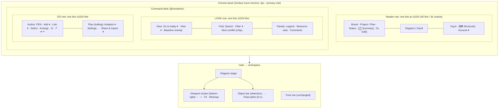
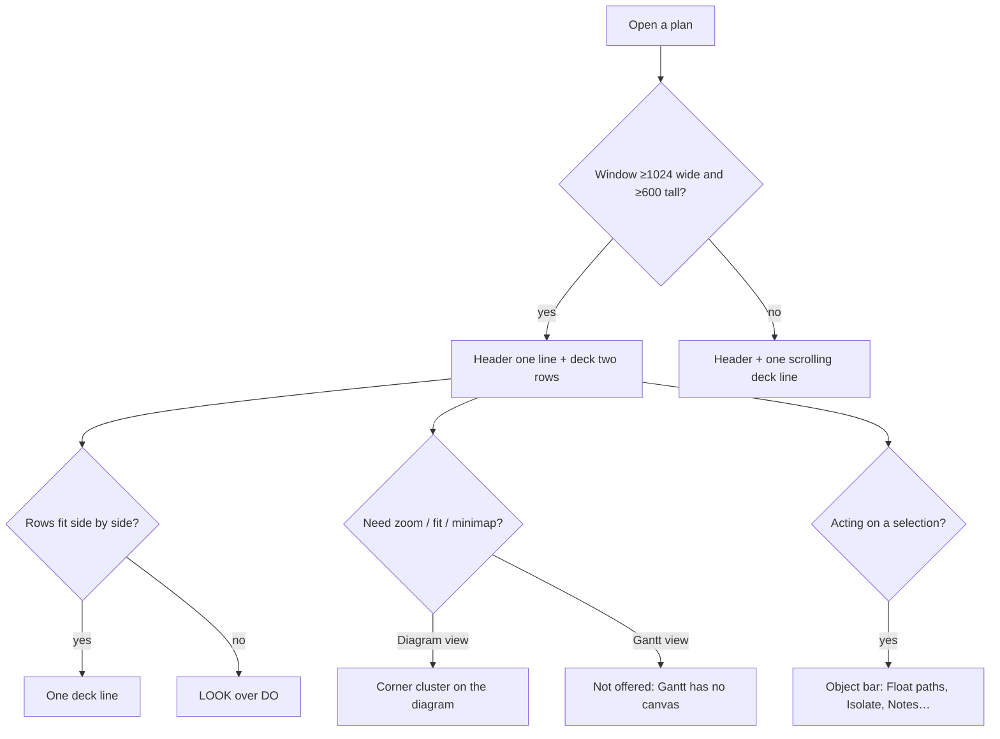

# Feature Spec: Toolbar redesign for a laptop, Surface Pro and monitor-first app

- **Status:** Draft
- **Author(s):** feature-analyst (for the product owner, james)
- **Date:** 2026-10-09
- **Tracking issue / epic:** — (none yet)
- **Roadmap link:** UI consistency / minimum-viewport follow-on (ADR-0179)
- **Related ADR(s):** amends ADR-0031, ADR-0090 D6, ADR-0091 D3a/D6b, ADR-0109 D1, ADR-0133 D1; applies ADR-0093,
  ADR-0117, ADR-0118/0183 (unchanged), ADR-0179 D2, ADR-0181. New ADR required (outline in §4.9).
- **Folds in:** `docs/TECH_DEBT.md` #471 (first half), #193 (the inert ladder machinery).

> **Read this first: the measurements in this spec were not taken in this session.** The analyst that wrote it
> had no shell, so it could not drive the harness. Every "today" figure below is quoted from a committed
> measurement record, with the file named. Every "target" figure is an **estimate** derived from those records
> and the class names in the code, and is labelled as one. **M0 of the plan retakes all of them** at the matrix the
> product owner asked for (1024 × 600, 1280 × 800, 1440 × 900, 1912 × 1080), on both pointers, before any build
> work starts. If M0 contradicts a premise, the work stops and this spec is amended (the precedent is
> `docs/specs/retire-single-pane-workspace/m0-measurement.md` §0). That is ADR-0113/0142 applied honestly rather
> than claimed.

---

## 1. Business understanding

### Problem

SchedulePoint is now designed for laptops, Surface Pros and desktop monitors. The floor is 1024 × 600 (ADR-0179),
the narrow single-pane workspace has been retired (ADR-0181), and phones are not supported. The two toolbars at
the top of the app were shaped through a long period when every pixel of **width** was fought over: a width
ladder, a `⋯` overflow menu, band floors and label-demotion passes (ADR-0090, ADR-0091, ADR-0094). ADR-0109
replaced all of that with "the surface wraps", which fixed the hiding. It also moved the cost into **height**,
and nobody has gone back over the tools to ask where each one belongs now that width is not the scarce thing.

What a planner gets today (measured, `docs/specs/minimum-viewport/m4-measurement.md`, fine pointer):

| Viewport   | Header | Deck lines | Canvas height | Canvas as share of window |
| ---------- | ------ | ---------- | ------------- | ------------------------- |
| 1024 × 600 | 40     | **4**      | **274**       | 46 %                      |
| 1280 × 800 | 40     | 2          | 562           | 70 %                      |
| 1440 × 900 | 40     | 2          | 662           | 74 %                      |
| 1912 × 948 | 40     | 2          | 710           | 75 %                      |

Coarse pointer (Surface without its keyboard cover, 44 px controls, same record): **1024 × 600: 4 lines, canvas
234**; 1280 × 800: 4 lines, canvas 434; 1440 × 900: 3 lines, canvas 586; 1912 × 948: 2 lines, canvas 686.

At the floor the command deck alone is **168 px, 28 % of the window** (`minimum-viewport/m0-measurement.md` §1),
and M4 of that epic records that it is four lines "by arithmetic": the four groups are 733, 513, 627 and 622 px
in a 1008 px row, so no two share a line without something losing its label. That M4 also wrote down the option
this spec takes up: _"dropping the labels of Summary, Calendar and Export below 1280 px … would put DO on one line
… It trades labelled commands for height and is a design call"_ (`m4-measurement.md:56-58`).

Below the floor it gets much worse, which is #471: the header plus the wrapped deck take **355 px at 640 wide
and 603 px at 320**, so the workspace body is 0 px at 640 × 360 and the foot row (Expand, Recalculate) is out of
reach (`retire-single-pane-workspace/m0-measurement.md` §2). That is not only a phone problem. **A 1280 × 800
laptop at 200 % browser zoom is a 640 × 400 CSS viewport**, and WCAG 1.4.4 (resize text) applies there. So #471 is
reachable by a supported device and an AA obligation, not just by an unsupported phone.

There is also code left over from the width era that no longer does anything, and some of it is now **wrong**.
Each item below was checked against the code:

1. **The layout bands have no production caller.** `resolveLayoutMode` (`toolbar-registry.ts:108-112`), and
   `Deck` passes the literal `'comfortable'` (`Deck.tsx:172-177`, `:414`). So every `compact` branch in a trigger
   (`triggersAreCompact`, `tsld-toolbar-items.tsx:1114-1125`) can never run, and every `showLabel: { atLeast }`
   rule always resolves to "labelled".
2. **Two sources decide whether a deck button shows its label, and they disagree.** The registry's `showLabel`,
   and `Deck`'s own `ICON_ONLY` set (`Deck.tsx:137-148`), which `Deck` uses **instead** (`:433`). The zoom items
   declare `showLabel: { atLeast: 'comfortable' }` (labelled), but `ICON_ONLY` makes them icon-only.
   `ICON_ONLY` also lists `print`, and no deck item has that id: Print is a menu item inside Share & export
   (`tsld-toolbar-items.tsx:1794-1801`).
3. **`tier` and `priority` are inert** (`toolbar-registry.ts:41-50`, `:285-290`). Ten items still carry
   `priority: -100 … 110` with long comments about a demotion pass that no longer exists.
4. **Two documents describe things that are no longer true.** `DESIGN_SYSTEM.md:236-238` says the deck's groups
   are captioned and "a reader can **fold**" them. The fold was removed on 2026-08-28 and the captions at console
   M6 (`Deck.tsx:42-52`). `DESIGN_SYSTEM.md:304` says the deck's height is `min-h-9`; it is `--control-h`
   (`toolbar-styles.ts:179`, `globals.css:1034`).
5. **A registry comment claims a move that did not happen.** `tsld-toolbar-items.tsx:2658` says Float paths
   moved to the selection bar with Isolate and Zoom to selection. It did not, on purpose:
   `selection-actions.tsx:183-199` says Float paths "keeps its Row-1 seat **until a destination exists that both
   views share**". Since then the object bar has gained Notes, present in both views, with the Gantt row menu
   mirroring its roster (`tsld-toolbar-items.tsx:3167-3179`). The condition looks met. M0 confirms it before
   anything moves.

**Why now:** the product owner has made the device decision (ADR-0179/0181) and asked for both toolbars to "look
amazing", with every tool, including the ones in dropdowns, re-evaluated. #471 is open and records that it
"needs its own spec".

### Users

Every organisation role sees both toolbars. Nothing here changes what a role may do.

| Role                | What they need from the toolbars                                                                                                                                       |
| ------------------- | ---------------------------------------------------------------------------------------------------------------------------------------------------------------------- |
| Planner / Org Admin | Authoring tools (pen, add, link, arrange, undo) one press away. Diagram as tall as possible. Commands always in the same place.                                        |
| Contributor         | Read and navigate. Comments, notes and progress (object bar). Authoring shown shaded with the reason.                                                                  |
| Viewer              | Read and navigate. Export and print. Authoring shown shaded with the reason.                                                                                           |
| External Guest      | **Not affected.** The share route renders its own guest bar (`features/share/`), not this band. Checked: no route other than `plan-detail.tsx` mounts `PlanWorkspace`. |

### Primary use cases

1. A planner on a 1024 × 600 laptop window works the diagram with the tallest canvas the chrome allows.
2. A planner on a 1920-wide monitor sees every frequent command with its name, anchored in a stable place.
3. A planner on a Surface in tablet posture (44 px targets) reaches every command without the deck eating the
   diagram.
4. A planner at 200 % browser zoom (or in a short window) can still reach the workspace, the foot row and every
   command.
5. Any reader finds a tool by where its subject lives: plan facts by the plan's name, viewport controls on the
   diagram, selection actions on the selection, application help in the header.

### User journeys

- **Happy path (1024 × 600, fine):** open a plan. One header line (brand, Project / Plan, status, Summary, Edit,
  Diagram | Gantt, organisation, help, account). Two deck lines: LOOK (Go to today, View, Baseline overlay,
  Find, Panels) and DO (pen, authoring, then Plan actions on the trailing edge). Zoom and Fit are in the diagram's
  corner. Canvas about 360 px instead of 274 (estimate, SC-1).
- **Alternate, monitor:** at 1912 the same two lines, every command labelled, Find and Plan held to the
  trailing edge. At 2560 wide the two rows share one line if they fit (R2).
- **Alternate, Surface tablet posture:** the same layout at 44 px. The deck may take a third line at 1024
  (SC-3), never four.
- **Alternate, short or zoomed window (#471):** below 1024 wide or 600 tall the deck becomes one line that
  scrolls sideways (R6). The workspace keeps its body and the foot row stays reachable.

### Expected outcomes

- About **88 px more diagram at the floor** (four deck lines become two). Estimate, SC-1.
- Every tool placed for a reason that is written down in §4.6, including those inside menus.
- One rule for icon-only labels, read from one place, applied by CSS (no JavaScript measuring).
- #471's band half closed; #193's inert machinery deleted.
- A cleaner, more balanced look: edges anchored, one label size, one control height, a clear hierarchy of
  separators. The tokens do not change.

### Success criteria

All are measured by M0's harness (before) and by the journeys and harness after each milestone. Fine pointer
unless stated. "Deck lines" counts distinct control rows, the way `command-surface.spec.ts:564-577` does it.

| ID    | Criterion                                                                                                                                                                     | Today (record)                              | Target                         |
| ----- | ----------------------------------------------------------------------------------------------------------------------------------------------------------------------------- | ------------------------------------------- | ------------------------------ |
| SC-1  | 1024 × 600 fine: deck lines; canvas height                                                                                                                                    | 4; 274                                      | **2; ≥ 350** (estimate 362)    |
| SC-2  | 1280 × 800, 1440 × 900, 1912 × 1080 fine: deck lines (each declared row exactly one line)                                                                                     | 2 (LOOK may wrap at 1440)                   | **2, no row wraps**            |
| SC-3  | 1024 × 600 coarse: deck lines; 1440 × 900 coarse; 1912 × 1080 coarse                                                                                                          | 4; 3; 2                                     | **≤ 3; 2; 2**                  |
| SC-4  | Header is one line at every viewport ≥ 1024, both pointers                                                                                                                    | holds (M4)                                  | holds                          |
| SC-5  | #471 cells 640 × 480, 640 × 360, 640 × 300, 320 × 720, 320 × 256: `<main>` starts at y ≤ 150 at 640 and ≤ 200 at 320; Expand and Recalculate are hit-testable at their centre | y = 355 / 603; unreachable at 360 and below | **met at every cell**          |
| SC-6  | 640 × 480 and 320 × 720, panel expanded: ≥ 1 hit-testable table row                                                                                                           | 0                                           | **≥ 1**                        |
| SC-7  | Every command is reachable at every cell above, by pointer and by keyboard, with an accessible name; any icon-only control has a tooltip (ADR-0117)                           | holds ≥ 1024                                | holds at every cell            |
| SC-8  | One source decides a label: `Deck.tsx` holds no id list; every icon-only deck control is declared `showLabel` in the registry                                                 | 2 sources                                   | 1 source                       |
| SC-9  | Band height bar `BAND_MAX_PX` (`command-surface.spec.ts:535`) still holds at every gated width, and is lowered to the new reading at 1024                                     | ≤ 145                                       | ≤ 145, plus a 1024 bar from M0 |
| SC-10 | One label size and one control height per surface (the existing `command-surface.spec.ts` label-size assertion, `:500-504`)                                                   | holds                                       | holds                          |
| SC-11 | The product owner signs off screenshots at 1024 × 600, 1280 × 800, 1440 × 900, 1912 × 1080, fine and coarse                                                                   | —                                           | signed                         |

The figures for SC-1, SC-3 and SC-5 are estimates (§4.7). M0 replaces them with measured targets before M1 starts.

### Open questions

**Critical** (they change the design or the scope). Each has a recommendation.

- **CQ-1 — Do Zoom out, Zoom in, Fit to plan and the Minimap toggle move onto the diagram itself?** A small
  floating cluster in the diagram's bottom-right corner, the way maps and whiteboards do it.
  _Recommendation: **yes**._ They only work on the diagram: today they shade in the Gantt with a "canvas only"
  reason (`canvasViewportReason`). On the diagram they cost no height and they sit beside what they control.
  They also free about 130 px of the LOOK row (estimate), which is part of what gets the floor to two lines. The
  cost is a small overlay over the diagram's corner and a new keyboard stop. _If no:_ they stay icon-only on the
  deck, and SC-1 needs one or two more compact labels on LOOK (§4.5) to compensate.
- **CQ-2 — At narrower windows, may a short named list of commands show only their icon (name kept for screen
  readers and in a tooltip), so each toolbar row stays on one line?** The list (§4.5) starts with the clearest
  icons: Settings (gear), Comments (speech bubble), Select (marquee). Only as many are switched as M0 shows are
  needed, and only below one width, set by a token.
  _Recommendation: **yes**._ It is the option M4 of the minimum-viewport epic measured and left open. The
  commands stay visible and named; only the word beside the icon goes, and only where it is needed. _If no:_ the
  floor stays at three or four deck lines and SC-1 is withdrawn.
- **CQ-3 — In a short or zoomed window (below 1024 wide or 600 tall), may the command deck become a single line
  that scrolls sideways, instead of wrapping into many lines?** (#471.)
  _Recommendation: **yes**._ ADR-0179 D2 already allows "the command band may scroll in both directions" below
  the floor, and WCAG 1.4.10 names "interfaces where it is necessary to keep toolbars in view while manipulating
  content" as an allowed two-dimensional case (W3C Understanding 1.4.10, Note 2, read 2026-10-09). The
  alternative, letting the whole shell scroll, scrolls the toolbar away from the diagram it operates.

**Not asked. Defaults taken, and a reviewer may overturn any of them:**

- D-a: **Summary moves into the header**, as an icon button beside the plan's status. It is the plan's facts, so
  it belongs beside the plan's name.
- D-b: **Keyboard shortcuts move from the Account menu to a header help button** (keyboard icon, tooltip
  "Keyboard shortcuts (?)"), only on plan routes. The Account menu is about the person; this is a reference about
  the app.
- D-c: **Float paths moves to the object bar** (and so to the Gantt row menu) **if M0 confirms** that destination
  renders in both views. If it does not, it stays on the deck.
- D-d: **Legend, Resource view and Comments form a "Panels" section** at the trailing end of the LOOK row. All
  three open a panel beside the diagram. Comments leaves the DO row.
- D-e: **Each row's last group is held to the trailing edge**: Find on LOOK, Plan on DO.
- D-f: **Analysis ▾ shows which docks are open** (Health check and Compare revisions as checkable items), if the
  `Menu` primitive's keyboard contract review (ADR-0111) accepts it. If not, they stay plain items.
- D-g: **The View ▾ panel lays out in columns at ≥ 1280** instead of one long scrolling list.
- D-h: **Control heights do not change** (36 / 44 px, ADR-0118/0183). The keyboard-cover gap (ADR-0183 D3) stays
  declined, as decided there.
- D-i: **The organisation switcher stays on the trailing side.** Moving it into the leading path would cut about
  190 px from the plan name at 1024.
- D-j: **#471's second paragraph (the selection bar growing the foot row) is split into its own row at close-out
  and not built here.** It is the foot row, a third surface the product owner did not name.
- D-k: **No feature flag** (ADR-0088 D1). Each milestone is a commit boundary.

---

## 2. Functional requirements

### User stories & acceptance criteria

> **US-1 — Two lines at the floor.** As a planner on a 1024 × 600 window, I want the command deck on two lines,
> so that the diagram gets the height.
>
> - **Given** a plan open at 1024 × 600 (fine), Explorer at its 276 px default, **then** the deck's controls sit
>   on exactly two rows (LOOK, DO), and neither declared row wraps.
> - **Given** the same at 1024 × 600 coarse, **then** the deck has at most three rows, and only LOOK or DO wraps,
>   never both (SC-3).
> - **Given** any width ≥ 1280 (fine), **then** each declared row is one line (SC-2).

> **US-2 — Labels give way by a rule, not by measuring.** As a planner, I want the same commands to lose their
> words in the same order every time, so that the toolbar never rearranges itself unpredictably.
>
> - **Given** an item declared `showLabel: { below: 'roomy' }` (name final at build), **when** the deck's
>   container is narrower than the `roomy` container token, **then** its label is visually hidden and still in
>   the accessible name, and the control has a name-echo tooltip on hover and focus (ADR-0117).
> - **Given** the deck at or above the token, **then** the label is visible and the tooltip is not a bare
>   name-echo.
> - **Given** any item, **then** whether it shows its label is decided only by its registry `showLabel`
>   (`Deck.tsx` holds no id list) (SC-8).
> - No JavaScript reads the deck's width to decide a label (structural test).

> **US-3 — Viewport controls on the diagram (CQ-1).** As a planner, I want zoom, fit and the minimap on the
> diagram, so that they sit beside what they control and cost the diagram no height.
>
> - **Given** the Diagram view, **then** a "Diagram view" toolbar (`role="toolbar"`) with Zoom out, Zoom in, Fit
>   to plan and Minimap is pinned to the stage's bottom-right inset, above the canvas and below any dock.
> - **Given** the Gantt view, **then** the cluster is absent, because the Gantt mounts no canvas (ADR-0082: omit
>   when the action does not apply).
> - **Given** no computed diagram, **then** Zoom and Fit are shaded with today's reasons
>   (`canvasViewportReason`); Minimap is shaded with `LENS_NO_DIAGRAM_REASON`.
> - **Given** keyboard focus, **then** the cluster is one Tab stop with arrow-key roving (the `Toolbar` primitive),
>   and it comes after the canvas in the tab order.
> - **Given** the minimap is open, **then** the cluster sits beside it rather than over it (ADR-0100's panel
>   keeps its position).
> - Keyboard shortcuts for zoom and fit are unchanged.

> **US-4 — Every tool on the surface of its subject.** As any reader, I want each tool where its subject lives.
>
> - Summary is an icon button in the header after the status badge, named "Plan summary", and opens today's
>   popover unchanged (D-a).
> - Keyboard shortcuts is a header button on plan routes and no longer in the Account menu. `?` still opens it
>   (D-b).
> - Float paths, if moved (D-c), is an object-bar action available in Diagram **and** Gantt (row menu), and
>   `float-paths-view-agnostic.structural.test.ts` still passes.
> - Legend, Resource view and Comments sit in a Panels section at the trailing end of LOOK, keep their pressed
>   state, and each still opens its panel (D-d).
> - **No tool is lost.** The before/after inventory (M0 vs. close-out) lists every command id and menu item with
>   its home, and every "before" entry has an "after" entry.

> **US-5 — A stable, anchored layout.** As a planner, I want each row's groups anchored to the row's edges.
>
> - **Given** ≥ 1280 fine, **then** the first control of each row starts at the deck's leading inset, and the last
>   control of each row ends within 1 px of the trailing inset (D-e).
> - **Given** a toggle changes a label (for example "View · WBS group"), **then** no control in the other row
>   moves.

> **US-6 — Short and zoomed windows (#471, CQ-3).** As a planner at 200 % zoom or in a short window, I want the
> toolbar to stay one line, so that I can still work the plan.
>
> - **Given** a viewport below 1024 wide **or** below 600 tall, **then** the deck is one line that scrolls sideways
>   (`overflow-x-auto`, scrollbar visible), LOOK then DO, and does not wrap.
> - **Given** keyboard focus moves by arrow keys onto an off-screen control, **then** the control scrolls into
>   view.
> - **Given** the #471 cells, **then** SC-5 and SC-6 hold.
> - **Given** ≥ 1024 × 600, **then** the deck never scrolls sideways.

> **US-7 — Wide monitors use the width.** As a planner on a very wide monitor, I want both rows on one line when
> they fit.
>
> - **Given** the band can hold LOOK and DO side by side, **then** they share one line; otherwise they stack. A
>   declared row never splits across lines at ≥ 1024 fine (R2).

### Workflows

- **Finding a tool:** subject first. The plan's facts and name are in the header. Looking (frame, lens, find,
  panels) is the LOOK row. Doing (pen, authoring, plan actions, deliverables) is the DO row. The viewport is on
  the diagram. The selection is on the object bar.
- **Taking the pen:** unchanged. The pen leads the DO row (ADR-0133 D5) and shades or unshades the Author group
  as one set.

### Edge cases

| Case                                         | Expected                                                                                                                                       |
| -------------------------------------------- | ---------------------------------------------------------------------------------------------------------------------------------------------- |
| Empty plan / no computed diagram             | Zoom, Fit, Minimap shaded with reasons. Deck rows keep their shape (shade, don't hide).                                                        |
| Gantt view                                   | Viewport cluster absent. Deck identical to the Diagram view's except view-scoped items (which already exist).                                  |
| Very long plan or project name at 1024       | Header section 1 truncates with `title` (`app-header.tsx:137`). The new Summary button is `shrink-0`; the **name** gives way, never a control. |
| Conflicts present (chip visible)             | LOOK still one line at ≥ 1280. At 1024 the chip is accounted for in M0's compact set.                                                          |
| Pen held by a peer / hand-off                | Unchanged (foot row).                                                                                                                          |
| Minimap open plus a dock open                | Cluster stays inside the stage, beside the minimap. Never under a dock.                                                                        |
| Window resized across 1024 or 600            | Switches between the two-row deck and the scrolling line with no remount of items (same registry, same roving state).                          |
| `pointer` changes (cover folded or unfolded) | Heights follow `--control-h`. Labels follow the container token (independent of pointer).                                                      |
| Browser zoom 150–400 %                       | Behaves as the equivalent CSS viewport. SC-5/6/7 cover 200 % on 1280 × 800 and 400 % (320 wide).                                               |
| Non-plan routes                              | Header only. No Summary or help button (plan-scoped, registered callbacks). Deck absent.                                                       |

### Permissions

No permission changes. Every control keeps its existing gate: pen-gated authoring (ADR-0028), `canShare`,
`canWriteNotes`, `canInterchangeExport`, `model.canWrite` for Edit plan. Viewing controls stay open to every role.
Organisation scoping is untouched: no new API call, no new data. **The recalc parity gate is unaffected:** this is
presentation only, nothing reaches `computeSchedule`, and no scheduling input is added. **The pen:** no new write,
so no new structural write.

### Validation rules

None. There is no input or data. The "rules" are layout rules (§4.4), enforced by structural tests and journeys.

### Error scenarios

| Scenario                                     | Detection                                                                | User-facing result | Status |
| -------------------------------------------- | ------------------------------------------------------------------------ | ------------------ | ------ |
| A command ends up in no surface after a move | M0 → close-out inventory diff; registry structural test                  | Build fails        | —      |
| An icon-only control has no tooltip or name  | coarse/fine sweep in `command-surface.spec.ts`; `ToolbarButton` contract | Build fails        | —      |
| Scrolling deck hides the focused control     | journey: arrow to last control, assert in view                           | Build fails        | —      |
| Export/print failure                         | unchanged (`exportError` banner)                                         | unchanged          | —      |

---

## 3. Technical analysis

| Area           | Impact   | Notes                                                                                                                                                                                                                                                                                                                                                          |
| -------------- | -------- | -------------------------------------------------------------------------------------------------------------------------------------------------------------------------------------------------------------------------------------------------------------------------------------------------------------------------------------------------------------- |
| Frontend       | **high** | `Deck.tsx`, `toolbar-registry.ts`, `ToolbarButton`, the trigger controls in `tsld-toolbar-items.tsx`, `app-header.tsx`, `account-chip.tsx`, `plan-workspace-toolbar.tsx` (portals), `selection-actions.tsx` (D-c), a new on-canvas viewport cluster in the TSLD stage (CQ-1), `globals.css` (one container token).                                             |
| Backend        | none     | —                                                                                                                                                                                                                                                                                                                                                              |
| Database       | none     | No schema. `database-architect` not required.                                                                                                                                                                                                                                                                                                                  |
| API            | none     | —                                                                                                                                                                                                                                                                                                                                                              |
| Security       | none     | No new data, call or permission. Existing gates move with their controls (verified per item at M2).                                                                                                                                                                                                                                                            |
| Performance    | low      | CSS container queries replace nothing that ran (the ladder is already gone). The on-canvas cluster is DOM over the canvas and does not repaint it. Canvas frame budget (#75) unaffected; performance-reviewer confirms.                                                                                                                                        |
| Infrastructure | none     | No new Playwright config or CI step. The M0 harness is a spec in the existing `playwright.measure-toolbar.config.ts`, which is not a CI gate.                                                                                                                                                                                                                  |
| Observability  | none     | —                                                                                                                                                                                                                                                                                                                                                              |
| Testing        | **high** | Unit (registry, `Deck`, `ToolbarButton` label rule), structural (one label source; no width reads), journeys (`e2e-workspace-fit/command-surface.spec.ts` LINES/band bars, `pen-status.spec.ts`, `e2e-narrow-shell`, `e2e-gantt*`, minimap and float-paths journeys), a11y (ADR-0111 review for `Deck` scroll focus, `Menu` checkable items, the new cluster). |

### Dependencies

- **Before M1:** M0's readings, and CQ-1/2/3 answered.
- Tailwind v4 container-query variants (`@container`, `@max-*`, theme `--container-*`). The builder verifies the
  exact syntax against the installed version, and registers the claim in `scripts/dependency-claims.json` if a
  docblock asserts it (§19.11).
- The object bar renders in both views (D-c). M0 verifies; if false, D-c is dropped.
- ADR-0100 (minimap panel position) for CQ-1.
- Suites that locate commands by role and name will need updating where commands move:
  `command-surface.spec.ts` (group membership), the shortcuts sheet, float paths, minimap, legend and comments
  journeys. The suite-impact list is an M0 output.

---

## 4. Solution design

### 4.1 Inventory today (verified against code, 2026-10-09)

**Header row** (`app-header.tsx`, `plan-workspace-toolbar.tsx:2155-2355`):

| #   | Control                                                                                                                                | Where / rule today                                            | Source                                                       |
| --- | -------------------------------------------------------------------------------------------------------------------------------------- | ------------------------------------------------------------- | ------------------------------------------------------------ |
| H1  | Show Project Explorer (≡)                                                                                                              | leading; `lg:hidden` (below 1024 only)                        | `app-header.tsx:139-149`                                     |
| H2  | Brand link                                                                                                                             | leading, always                                               | `:150`                                                       |
| H3  | Project crumb (link)                                                                                                                   | section 1, `nowrap`, truncates; section capped `lg:max-w-1/2` | `plan-workspace-toolbar.tsx:2224-2234`, `app-header.tsx:137` |
| H4  | Plan name crumb                                                                                                                        | as H3                                                         | same                                                         |
| H5  | Plan status badge                                                                                                                      | after crumbs                                                  | `:2235`                                                      |
| H6  | Edit plan (pencil, icon)                                                                                                               | `model.canWrite` only                                         | `:2244-2261`                                                 |
| H7  | Diagram \| Gantt                                                                                                                       | section 2, registry `row: 'mode'`, labelled always            | `tsld-toolbar-items.tsx:2722-2750`                           |
| H8  | Organisation switcher (native `select`)                                                                                                | section 3, `max-w-[12rem]`                                    | `app-header.tsx:163`                                         |
| H9  | Account ▾ menu: email · Your account · My activity · Staff console (runtime) · **Diagram keyboard shortcuts** (plan routes) · Sign out | section 3                                                     | `account-chip.tsx:79-189`                                    |

**Command deck** (`Deck`, two declared rows, `Deck.tsx:96-120`). Rows → groups → registry sections. "Label"
means what `Deck` paints: `ICON_ONLY` wins over `showLabel` (`Deck.tsx:433`).

| #   | Id                     | Label (accessible name)             | Row · group · section | Tier | Label shown                      | Menu / popover contents                                                                                                                                                                                                                                                                                                                                                                                                                                                                                                | Source                               |
| --- | ---------------------- | ----------------------------------- | --------------------- | ---- | -------------------------------- | ---------------------------------------------------------------------------------------------------------------------------------------------------------------------------------------------------------------------------------------------------------------------------------------------------------------------------------------------------------------------------------------------------------------------------------------------------------------------------------------------------------------------- | ------------------------------------ |
| D1  | `today`                | Go to today ▾ Go to date            | LOOK · View · frame   | 1    | yes                              | date picker                                                                                                                                                                                                                                                                                                                                                                                                                                                                                                            | `:2666-2687`                         |
| D2  | `zoom-out`             | Zoom out                            | LOOK · View · frame   | 2    | **no** (ICON_ONLY)               | —                                                                                                                                                                                                                                                                                                                                                                                                                                                                                                                      | `:2596-2617`                         |
| D3  | `zoom-in`              | Zoom in                             | LOOK · View · frame   | 2    | no                               | —                                                                                                                                                                                                                                                                                                                                                                                                                                                                                                                      | `:2618-2637`                         |
| D4  | `fit`                  | Fit to plan                         | LOOK · View · frame   | 2    | no                               | —                                                                                                                                                                                                                                                                                                                                                                                                                                                                                                                      | `:2638-2657`                         |
| D5  | `view`                 | View ▾ (· colour when not default)  | LOOK · View · lens    | 2    | yes                              | **Zoom** (Day/Week/Month/Quarter/Year radios) · **Structure** (Day grid, Month grid, Year grid, Month bands, WBS band, Logic links [Gantt]) · **Markers** (Data date line, Today line, Non-working, Labels, Activity codes [Diagram], Duration & float [Diagram]) · **Insight overlays** (Colour by: Criticality / Total float / WBS group; Dates, Feasible window, Link gaps [Diagram], Late-start overlay, Compare on diagram, Levelled placement, Flag over-allocated) · **Panels** (Minimap) · **Columns** (Gantt) | `:1918-2038`, `:462-522`, `:253-413` |
| D6  | `resource-view`        | Resource view                       | LOOK · View · lens    | 2    | yes                              | —                                                                                                                                                                                                                                                                                                                                                                                                                                                                                                                      | `:319-334`, `:432-451`               |
| D7  | `legend`               | Legend                              | LOOK · View · lens    | 2    | yes                              | —                                                                                                                                                                                                                                                                                                                                                                                                                                                                                                                      | `:384-396`                           |
| D8  | `baseline-overlay`     | Baseline overlay                    | LOOK · View · lens    | 2    | yes                              | —                                                                                                                                                                                                                                                                                                                                                                                                                                                                                                                      | `:254-286`                           |
| D9  | `search`               | Search or filter activities (field) | LOOK · Find           | 1    | field, 168 / 240 px              | —                                                                                                                                                                                                                                                                                                                                                                                                                                                                                                                      | `:2761-2778`, `m4-measurement.md:51` |
| D10 | `filter`               | Filter ▾                            | LOOK · Find           | 2    | yes                              | Show only: Critical, Has constraint, Has conflict                                                                                                                                                                                                                                                                                                                                                                                                                                                                      | `:1562-1600`                         |
| D11 | `next-conflict`        | Next conflict                       | LOOK · Find           | 1    | yes                              | —                                                                                                                                                                                                                                                                                                                                                                                                                                                                                                                      | `:2798-2821`                         |
| D12 | `next-conflict-status` | (read-out chip)                     | LOOK · Find           | 2    | read-out, when conflicts exist   | —                                                                                                                                                                                                                                                                                                                                                                                                                                                                                                                      | `:2885-2920`                         |
| D13 | `float-paths`          | Float paths                         | LOOK · Find           | 3    | yes                              | — (selection-gated)                                                                                                                                                                                                                                                                                                                                                                                                                                                                                                    | `:2837-2859`                         |
| D14 | `pen`                  | Start / Stop editing                | DO · Author · tools   | 1    | yes, primary slab                | —                                                                                                                                                                                                                                                                                                                                                                                                                                                                                                                      | `:2957-3011`                         |
| D15 | `add-activity`         | Add activity ▾                      | DO · Author           | 1    | yes                              | Draw: Task, Start milestone, Finish milestone · Span: Level of effort (+ placeholders)                                                                                                                                                                                                                                                                                                                                                                                                                                 | `:3012-3054`, `:738-`                |
| D16 | `link-tool`            | Link activities ▾                   | DO · Author           | 1    | yes                              | Link type: FS / SS / FF / SF                                                                                                                                                                                                                                                                                                                                                                                                                                                                                           | `:3058-3073`, `:937-`                |
| D17 | `marquee-select`       | Select                              | DO · Author           | 2    | yes                              | —                                                                                                                                                                                                                                                                                                                                                                                                                                                                                                                      | `:3092-3108`                         |
| D18 | `auto-arrange`         | Arrange                             | DO · Author           | 2    | yes                              | —                                                                                                                                                                                                                                                                                                                                                                                                                                                                                                                      | `:3109-3125`                         |
| D19 | `apply-levelling`      | Apply levelled dates…               | DO · Author           | 3    | no (`'never'` **and** ICON_ONLY) | — (dialog)                                                                                                                                                                                                                                                                                                                                                                                                                                                                                                             | `:3140-3166`                         |
| D20 | `undo`                 | Undo                                | DO · Author           | 2    | no                               | —                                                                                                                                                                                                                                                                                                                                                                                                                                                                                                                      | `:2288-2299`                         |
| D21 | `undo-history`         | Recent edits ▾                      | DO · Author           | 2    | (caret)                          | Undo… / Redo… steps                                                                                                                                                                                                                                                                                                                                                                                                                                                                                                    | `:2300-2311`                         |
| D22 | `redo`                 | Redo                                | DO · Author           | 2    | no                               | —                                                                                                                                                                                                                                                                                                                                                                                                                                                                                                                      | `:2312-2323`                         |
| D23 | `summary`              | Summary ▾                           | DO · Plan · object    | 2    | yes                              | status, data date, schedule strip, Edit plan…                                                                                                                                                                                                                                                                                                                                                                                                                                                                          | `:3211-3229`                         |
| D24 | `analysis`             | Analysis ▾                          | DO · Plan · object    | 2    | yes                              | Baselines…, Earned value…, Resource histogram…, Health check… (dock), Compare revisions… (dock)                                                                                                                                                                                                                                                                                                                                                                                                                        | `:3254-3288`, `:1455-1553`           |
| D25 | `calendar`             | Settings…                           | DO · Plan · object    | 2    | yes                              | — (dialog: calendar + six settings groups)                                                                                                                                                                                                                                                                                                                                                                                                                                                                             | `:3295-3333`                         |
| D26 | `comments`             | Comments                            | DO · Plan · object    | 2    | yes                              | — (dock toggle)                                                                                                                                                                                                                                                                                                                                                                                                                                                                                                        | `:3379-3389`                         |
| D27 | `export`               | Share & export ▾                    | DO · Plan · output    | 2    | yes                              | Schedule: CSV (+ matching) · Diagram: PNG whole/view, PDF whole/view · Interchange: XER, MSPDI · Deliver: Print…, Share…                                                                                                                                                                                                                                                                                                                                                                                               | `:3354-3374`, `:1637-1817`           |

Outside the two toolbars, for context only and not moved here (except D-c): the object/selection bar
(`selection-actions.tsx`: Zoom to selection, Isolate, Notes, Progress, …), the foot row (facts, Recalculate when
stale, Expand, pen status and hand-off), and the Gantt row menu.

### 4.2 Which width-era rules no longer apply (amendments)

| Rule today                                                                                         | Where                                                                  | Why it no longer holds                                                            | Change                                                                                                                                                                  |
| -------------------------------------------------------------------------------------------------- | ---------------------------------------------------------------------- | --------------------------------------------------------------------------------- | ----------------------------------------------------------------------------------------------------------------------------------------------------------------------- |
| Four width bands (`comfortable/compact/condensed/collapsed`) resolved from the row's `clientWidth` | ADR-0090 D6; `toolbar-registry.ts:53-125`                              | No caller since ADR-0109 (`:108-112`); `Deck` passes `'comfortable'`              | **Retire.** Replaced by one CSS container token (R3)                                                                                                                    |
| `showLabel: { atLeast: band }`; `triggersAreCompact`                                               | ADR-0091 D3a; `toolbar-registry.ts:157`; `tsld-toolbar-items.tsx:1114` | Always resolves to "labelled"                                                     | **Re-point** to the container token (`{ below: 'roomy' }`); triggers honour it through CSS                                                                              |
| `ICON_ONLY` id list inside `Deck`                                                                  | `Deck.tsx:137-148`                                                     | A second source that overrides the registry; lists a non-item (`print`)           | **Delete**; the registry's `showLabel` is the only source                                                                                                               |
| `tier` as prominence, `priority` as a demotion rank                                                | ADR-0031, ADR-0090 D2, ADR-0091 D2                                     | Inert (`toolbar-registry.ts:41-50`, `:285-310`); nothing ranks or demotes         | **Delete** `priority`, `priorityOf`, `partitionByTier`, and the tier-mixing guard. Keep `tier` only if the reviewers want it as documentation; default is delete (#193) |
| "Never `overflow-x-auto`" for a command surface                                                    | ADR-0109 D1; `DESIGN_SYSTEM.md:225`                                    | ADR-0179 D2 allows the band to scroll below the floor; WCAG 1.4.10 Note 2         | **Amend:** permitted below the floor or 600 px tall only (R6)                                                                                                           |
| A declared row's lines are produced by flex only; rows always stack                                | ADR-0133 D1                                                            | On monitors wide enough for both rows, stacking wastes a line                     | **Amend:** a declared row is the unit of wrap; rows may share a line (R2)                                                                                               |
| Viewport commands live in the deck's frame section, shaded in the Gantt                            | ADR-0031 group 1, ADR-0091 D3                                          | Shading a canvas-only control in a view without a canvas costs a slot for nothing | **Amend** (CQ-1): on-canvas cluster                                                                                                                                     |
| Keyboard shortcuts in the Account menu                                                             | ADR-0091 D6b                                                           | Chosen because the `⋯` was the only alternative; a desktop app has header room    | **Amend** (D-b)                                                                                                                                                         |
| "Captions fold" / `min-h-9`                                                                        | `DESIGN_SYSTEM.md:236-238`, `:304`                                     | Already false (§1 item 4)                                                         | **Correct the doc**                                                                                                                                                     |
| Header section 1 uncapped "below `lg`… a phone's width"                                            | `app-header.tsx:131-133` comment                                       | Phone unsupported (ADR-0179/0181); below the floor is reflow-only                 | Correct the comment. Behaviour stays (below-floor reflow)                                                                                                               |

**Not amended, on purpose:** ADR-0118/0183 heights (36 / 44 px) and their pointer axis; ADR-0133 D5 (pen leads DO);
ADR-0028 pen gating; ADR-0082/0083 shade-with-reason; ADR-0117 tooltips; ADR-0135 focus hand-off; ADR-0093
(applied, not changed).

### 4.3 Architecture overview



The shell stays plan-unaware (ADR-0029). The header's Summary and Shortcuts arrive through the existing `identity`
slot and a `HelpActionProvider` registration, the same way the mode cluster and the shortcuts callback reach the
header today (`chrome-band.tsx:94-130`, `account-chip.tsx:163`).

### 4.4 Layout rules (the new standard)

- **R1. Two declared rows, each one line, from the floor up.** Fine pointer: LOOK and DO are each one line at
  every width ≥ 1024. Coarse: each is at most two lines at 1024 and one line at ≥ 1440 (SC-3). Enforced by
  `command-surface.spec.ts` LINES, tightened to the new readings.
- **R2. A declared row is the unit of wrap.** The deck is a wrapping flex container whose two children are the
  rows; a row does not wrap internally at ≥ 1024 fine. If both fit, they share one line; if not, DO goes below
  LOOK. A command can never change rows (ADR-0133's guarantee, kept).
- **R3. A label gives way by declaration and container width, never by measurement.** The registry declares
  `showLabel: 'always' | 'never' | { below: 'roomy' }`. `Deck` is `@container/deck`. The label span of a
  `{ below }` item is `sr-only` under that container size (accessible name kept, tooltip on). The size is one
  theme token in `globals.css` (`--container-deck-roomy`, set from M0, expected around 78–80rem), never an
  arbitrary value. This is not the old ladder: the deck's width is imposed by the full-bleed band and does not
  depend on its content, so there is no feedback loop to damp, and no JavaScript reads a width.
- **R4. Edges are anchored.** The last group of each row is pushed to the trailing edge with **one** `ml-auto` per
  row (ADR-0091 M7's single-auto-margin rule): Panels on LOOK, Plan on DO. The first control of each row sits at
  the leading inset.
- **R5. A control lives on the surface of its subject.** Plan facts → header. Viewport → the diagram. Selection →
  object bar. Application reference → header. Panels → the Panels section. Deliverables → the trailing end of DO.
- **R6. Below the floor, one scrolling line.** At `(max-width: 63.99rem), (max-height: 37.49rem)` the deck renders
  LOOK then DO on one line, `overflow-x-auto`, scrollbar visible, `flex-nowrap`. Focusing a control by arrow key
  scrolls it into view. The two-row deck and the line are the same `Deck` and registry; only CSS changes.
- **R7. No new heights, colours or type sizes.** `--control-h` 36 / 44, `text-sm font-medium`, Lucide 16 px, the
  existing state ladder (`toolbar-styles.ts`).
- **R8. No flag** (ADR-0088 D1). Every user-facing milestone names its entry point and lands with a journey
  (ADR-0081).

### 4.5 Compact-label candidates (CQ-2)

Applied **in this order, and only as far as M0 shows each row needs** to hold one line at 1024 × 600 fine. The
test is the `Deck` docblock's own test: "would a planner who has never seen this product guess wrong?"
(`Deck.tsx:126-136`).

| Order | Item             | Row           | Icon                   | Why it passes the test             |
| ----- | ---------------- | ------------- | ---------------------- | ---------------------------------- |
| 1     | Settings…        | DO            | gear                   | the most standard settings glyph   |
| 2     | Comments         | LOOK (Panels) | speech bubble          | universal for comments             |
| 3     | Select           | DO            | dashed-marquee pointer | standard selection-tool glyph      |
| 4     | Baseline overlay | LOOK          | layers                 | weaker; only if 1–3 are not enough |
| 5     | Resource view    | LOOK (Panels) | people                 | weaker                             |

Never compacted: the pen, Add activity, Link activities, Arrange, Go to today, View, Filter, Next conflict,
Analysis, Share & export, Legend, the search field. These are names a planner searches for, and two
(`Arrange`, `Float paths`) the `Deck` docblock already names as failing the glyph test.

### 4.6 Item-by-item placement

"New size / label" uses the registry vocabulary. Every row has a reason. "Stays" is a decision too.

**Header**

| Item                                      | New home                       | New size / label                                                           | Why                                                                                                                                                   |
| ----------------------------------------- | ------------------------------ | -------------------------------------------------------------------------- | ----------------------------------------------------------------------------------------------------------------------------------------------------- |
| H1 Explorer drawer                        | stays; below 1024 only         | icon                                                                       | Above 1024 the Explorer is docked                                                                                                                     |
| H2 Brand                                  | stays leading                  | —                                                                          | Identity                                                                                                                                              |
| H3/H4 Crumbs                              | stay; the name gives way first | text, truncates with `title`                                               | Only route from a plan to its project (`plan-workspace-toolbar.tsx:2206-2219`)                                                                        |
| H5 Status                                 | stays                          | badge                                                                      | Plan fact                                                                                                                                             |
| **D23 Summary → header**                  | after the status badge         | `Button` ghost icon, `Info`, name "Plan summary", tooltip                  | Its content is the plan's facts and Edit plan (`use-tsld-toolbar-context.tsx:262-274`); belongs by the name (R5). Frees about 100 px of DO (estimate) |
| H6 Edit plan                              | stays, after Summary           | icon (`SquarePen`)                                                         | One-press edit is a deliberate shortcut                                                                                                               |
| H7 Diagram \| Gantt                       | stays, section 2               | labelled segment                                                           | A mode belongs beside the identity (ADR-0091 D1)                                                                                                      |
| H8 Organisation                           | stays trailing                 | select, `max-w-[12rem]`                                                    | Leading placement costs plan-name width at 1024 (D-i)                                                                                                 |
| **Keyboard shortcuts → header** (from H9) | trailing, before Account       | ghost icon, `Keyboard`, tooltip "Keyboard shortcuts (?)", plan routes only | A reference about the app, on a keyboard-heavy desktop surface; the Account menu is about the person (D-b)                                            |
| H9 Account ▾                              | stays last                     | avatar + caret                                                             | Menu becomes: email, Your account, My activity, Staff console, Sign out                                                                               |

**LOOK row**

| Item                                       | New home                                                | New size / label                                                          | Why                                                                                                                                                             |
| ------------------------------------------ | ------------------------------------------------------- | ------------------------------------------------------------------------- | --------------------------------------------------------------------------------------------------------------------------------------------------------------- |
| D1 Go to today ▾                           | stays, first                                            | split, labelled                                                           | Works in both views (the caret needs only an anchored plan, `:592-596`); first in the row that frames                                                           |
| **D2–D4 Zoom out, Zoom in, Fit → diagram** | on-canvas viewport cluster (CQ-1)                       | icon-only, tooltips                                                       | Canvas-only commands on the canvas; absent rather than shaded in the Gantt; zero height                                                                         |
| D5 View ▾                                  | stays                                                   | labelled popover; panel in columns at ≥ 1280 (D-g); Minimap row leaves it | The settings drawer for the diagram; 30-odd rows deserve a wide panel on a wide screen                                                                          |
| D8 Baseline overlay                        | stays in View group                                     | labelled, compact candidate 4                                             | A mark drawn **on** the diagram, a lens rather than a panel                                                                                                     |
| D9 Search                                  | stays, starts Find                                      | 168 / 240 px field                                                        | Unchanged (M4)                                                                                                                                                  |
| D10 Filter ▾                               | stays                                                   | labelled                                                                  | —                                                                                                                                                               |
| D11/D12 Next conflict + chip               | stay                                                    | labelled + read-out                                                       | A count that must be seen without opening anything (ADR-0094)                                                                                                   |
| **D13 Float paths → object bar**           | object half of the selection bar + Gantt row menu (D-c) | labelled                                                                  | Its subject is the selected activity (ADR-0093); `selection-actions.tsx:198` waited for a destination both views share, which now exists. **Conditional on M0** |
| **D7 Legend → Panels**                     | Panels section, trailing end of LOOK                    | labelled                                                                  | Opens a panel beside the diagram                                                                                                                                |
| **D6 Resource view → Panels**              | Panels                                                  | labelled, compact candidate 5                                             | Opens a panel                                                                                                                                                   |
| **D26 Comments → Panels** (from DO)        | Panels                                                  | labelled, compact candidate 2                                             | Opens a panel (`notesOpen`); reading, not authoring. Rebalances LOOK and DO                                                                                     |

**DO row**

| Item                               | New home                     | New size / label                                             | Why                                                                            |
| ---------------------------------- | ---------------------------- | ------------------------------------------------------------ | ------------------------------------------------------------------------------ |
| D14 Pen                            | stays first                  | primary slab, labelled                                       | ADR-0133 D5                                                                    |
| D15 Add activity ▾                 | stays                        | labelled                                                     | Name is the affordance                                                         |
| D16 Link activities ▾              | stays                        | labelled                                                     | —                                                                              |
| D17 Select                         | stays                        | labelled, compact candidate 3                                | Standard glyph                                                                 |
| D18 Arrange                        | stays                        | labelled                                                     | Fails the glyph test (`Deck.tsx:130-132`)                                      |
| D19 Apply levelled dates…          | stays                        | `'never'` in the registry (one source)                       | Already decided (ADR-0090, `:3150-3156`)                                       |
| D20–D22 Undo, Recent edits ▾, Redo | stay, end of Author          | icon-only, `'never'`                                         | Universal glyphs                                                               |
| D24 Analysis ▾                     | stays, Plan group (trailing) | labelled; Health check and Compare revisions checkable (D-f) | Measurement tools used occasionally; the dock items show whether they are open |
| D25 Settings…                      | stays                        | labelled, compact candidate 1                                | Gear                                                                           |
| D27 Share & export ▾               | stays, **last**              | labelled                                                     | Deliverables close the row; contents unchanged                                 |

**New: viewport cluster on the diagram (CQ-1)**

| Item                           | From               | Size                                     | Why                                                               |
| ------------------------------ | ------------------ | ---------------------------------------- | ----------------------------------------------------------------- |
| Zoom out, Zoom in, Fit to plan | deck frame section | `--control-h` icon buttons, tooltips     | Above                                                             |
| Minimap                        | View ▾ › Panels    | icon toggle (`Map` glyph), pressed state | Navigation of the same viewport; the map control's natural member |

**Menus, re-evaluated and kept as menus:** Add ▾ (draw kind), Link ▾ (link type), Recent edits ▾, Filter ▾,
Analysis ▾ and Share & export ▾. Each holds alternatives or occasional actions behind a labelled trigger. That
is the right shape on any screen, not a space saving. View ▾ keeps its settings. Colour-by stays inside it, with
the trigger's "View · WBS group" annotation (`:1900-1916`). Promoting it would cost about 250 px for a setting
changed rarely.

### 4.7 Visual and size decisions (tokens)

| Decision                    | Token / primitive                                                                                                | Note                                                                                                         |
| --------------------------- | ---------------------------------------------------------------------------------------------------------------- | ------------------------------------------------------------------------------------------------------------ |
| Band surface                | `Surface tone="chrome"` (`--chrome`), `border-b-[3px] border-b-primary`                                          | Unchanged (`chrome-band.tsx:74`)                                                                             |
| Control box                 | `toolbarControlVariants`, `min-h-(--control-h)`, `rounded-md`, `text-sm` medium, Lucide `size-4`                 | Unchanged; one geometry (ADR-0110)                                                                           |
| Group seam vs. section seam | group rule `inset-y-1/5` (60 %), section `TOOLBAR_INSET_RULE` (50 %)                                             | Unchanged hierarchy (`Deck.tsx:361-365`)                                                                     |
| Spacing                     | `gap-1` within a section, `gap-2` + rule between groups, `gap-2` between rows                                    | Spacing scale only; M0 checks whether `gap-1` between rows reads cleaner (saves 4 px)                        |
| Emphasis                    | pen = only `primary` slab; armed tools `armed`; toggles `selected`                                               | `defineToolbar` enforces one primary per registry                                                            |
| Compact label               | `sr-only` under `@max-[--container-deck-roomy]/deck`; tooltip `purpose: 'name-echo'`                             | ADR-0117                                                                                                     |
| Viewport cluster            | `bg-background border border-border rounded-lg shadow-sm`, inset `4` (16 px) from the stage edges; one `Toolbar` | Elevation level 1 (`DESIGN_SYSTEM.md:170-180`); canvas surface scope (ADR-0055); does not repaint the canvas |
| Header buttons              | `Button variant="ghost" size="icon"`                                                                             | Same as Edit plan (`plan-workspace-toolbar.tsx:2251-2260`)                                                   |
| Scrolling line              | `overflow-x-auto`, visible scrollbar, `scroll-px-2`                                                              | No hidden-scrollbar trick; the affordance must be visible                                                    |
| Motion                      | none on wrap, compaction or row-sharing; hover and press 150 ms                                                  | `DESIGN_SYSTEM.md:184-192`                                                                                   |

**Height estimates** (derived, not measured; M0 replaces them). A deck line is `--control-h` (36) and rows are
`gap-2` (8) apart (`Deck.tsx:298`), inside a `py-1` wrapper (`plan-workspace-toolbar.tsx:2406`). So two lines are
36 + 8 + 36 + 8 = **88 px** and four lines **168** (agrees with the measured 168). The floor therefore gains
**about 80–88 px of canvas**: 274 → about 354–362 at 1024 × 600 fine (SC-1). Below the floor the band becomes the
header plus one line (36 + 8): at 640 wide 88 + 44 + 3 = **about 135 px** (today 355); at 320 wide 136 + 44 + 3 =
**about 183 px** (today 603). SC-5's bars (150 / 200) leave margin for M0's reading.

**Width estimates for the floor** (from M4's group widths, `m4-measurement.md:46`). LOOK today 733 + 513 = 1246,
less the three zoom controls and their section (about 130), less Float paths (about 110), plus Comments (about
110): **about 1120 against 1008**, so compact candidates 2 and 4 (about 70 + 100) bring it to about 950. DO today
627 + 622 = 1249, less Summary (about 100), less Comments (about 110): **about 1040**, so candidate 1 (about 70)
brings it to about 970. The individual item widths are guesses at roughly 7 px per character plus padding, which is
exactly why M0 measures each item before the compact set is frozen.

### 4.8 Data flow and user flow

```mermaid
sequenceDiagram
  participant Reg as Registry (buildTsldToolbarItems)
  participant Res as resolveItems (no layout arg)
  participant Deck as Deck (@container/deck)
  participant CSS as Container query (--container-deck-roomy)
  participant AT as Accessibility tree
  Reg->>Res: items (showLabel declared per item)
  Res->>Deck: resolved items (enabled, active, reason)
  Deck->>Deck: group into LOOK / DO rows (R2)
  Deck->>CSS: label span classes from showLabel
  CSS-->>Deck: label visible or sr-only (no JS)
  Deck->>AT: name = label text in both states; tooltip when compact
```



### 4.9 ADR required: outline

**ADR-0184 (proposed) — A command surface is designed from the floor up: two rows that never wrap, labels that
give way by declaration, and one scrolling line below the floor.**

- **Context:** the §1 measurements; the dead ladder (§1 items 1–3); #471; ADR-0179/0181.
- **D1:** R1 + R2 (amends ADR-0133 D1).
- **D2:** R3; deletes `ToolbarLayoutMode`, `resolveLayoutMode`, `bandIsAtLeast`, `priority`, `priorityOf`,
  `partitionByTier`, `ICON_ONLY` (amends ADR-0090 D6, ADR-0091 D3a, ADR-0031 tiers; closes #193).
- **D3:** R5 placements: viewport cluster (amends ADR-0031 group 1, ADR-0091 D3), Summary and Shortcuts to the
  header (amends ADR-0091 D6b), Float paths to the object bar (applies ADR-0093), Panels section.
- **D4:** R6 (amends ADR-0109 D1, under ADR-0179 D2 and WCAG 1.4.10 Note 2); closes #471's band half.
- **D5:** no flag (ADR-0088 D1).
- **Options rejected:** (a) one deck line by moving many commands into menus (reverses the product owner's "all
  commands visible", ADR-0109); (b) JS measurement for labels (the defect class ADR-0109 removed); (c) whole-shell
  scroll for #471 (scrolls the toolbar away from the diagram); (d) the org switcher in the leading path (plan-name
  truncation).
- **Consequences:** suites that locate moved commands need edits; one new keyboard stop on the diagram; a
  container token to keep in step with M0.

### Database changes

None.

### API changes

None.

### Component changes

| Component                                                                                                     | Change                                                                                                                                                 | Contract change (ADR-0105)     |
| ------------------------------------------------------------------------------------------------------------- | ------------------------------------------------------------------------------------------------------------------------------------------------------ | ------------------------------ |
| `toolbar-registry.ts`                                                                                         | `showLabel` gains `{ below: 'roomy' }`; band types and the inert fields are removed                                                                    | **yes** (shared primitive)     |
| `Deck.tsx`                                                                                                    | `@container/deck`; reads `showLabel`; `ICON_ONLY` deleted; rows as wrap units; `ml-auto` on each row's last group; scrolling-line mode below the floor | **yes**                        |
| `ToolbarButton.tsx`, `ToolbarPopover`, `ToolbarSplitButton`, the trigger controls in `tsld-toolbar-items.tsx` | Label span carries the container class; tooltip when compact; `compact` / `triggersAreCompact` removed                                                 | **yes**                        |
| New `CanvasViewportControls` (TSLD stage)                                                                     | `Toolbar` of four items; positioned in the stage                                                                                                       | new (CQ-1)                     |
| `app-header.tsx` / identity slot                                                                              | Summary button; Shortcuts button via `HelpActionProvider`                                                                                              | entry points                   |
| `account-chip.tsx`                                                                                            | Shortcuts item removed                                                                                                                                 | —                              |
| `selection-actions.tsx`                                                                                       | Float paths object action (D-c)                                                                                                                        | entry point                    |
| `Menu` (`menuitemcheckbox`)                                                                                   | only if D-f is accepted                                                                                                                                | **yes**; ADR-0111 review first |
| `globals.css`                                                                                                 | `--container-deck-roomy`                                                                                                                               | token                          |

States: every control keeps its loading, shaded (reason), pressed and armed states. The cluster's shaded state
reuses today's reasons. No empty or error state is new.

### Implementation approach & alternatives

**Chosen:** measure first (M0), then a sequence of commit-sized slices. The primitive's label rule comes first
because the floor needs it. Then the relocations, each with its journey. Then the canvas cluster, rows as wrap
units with the View panel, and the below-floor line. Then docs and the ADR. See the plan.

**Alternatives considered:**

1. **Keep the layout and only polish visuals.** Leaves the floor at four lines and #471 open. Rejected.
2. **Re-introduce a JS layout ladder.** Rejected (ADR-0109's whole argument; `Deck.tsx:35-38`).
3. **One deck line at every width by folding Plan actions into a `Plan ▾` menu.** Already rejected once
   (nested menus, `tsld-toolbar-items.tsx:2446-2451`), and against "all commands visible".
4. **Merge the header and the LOOK row.** Header sections need about 1040 px and LOOK about 1100 at 1920
   (estimate), so it fits only above about 2160. R2's row-sharing gets the same effect on very wide screens without
   coupling the shell to the plan.

---

## 5. Links

- Implementation plan: [`implementation-plan.md`](implementation-plan.md)
- Measurement baselines: `docs/specs/minimum-viewport/m0-measurement.md`, `m4-measurement.md`,
  `docs/specs/retire-single-pane-workspace/m0-measurement.md`
- Docs updated by this change (at close-out): `docs/DESIGN_SYSTEM.md` (§ "A command surface wraps", "One geometry"),
  `docs/UX_STANDARDS.md` (where a tool lives), `docs/TECH_DEBT.md` (#471, #193, new row for #471's second half),
  `CLAUDE.md` §16 (the new ADR line), the ADRs listed in §4.2 (amendment notes), `docs/TEST_PLAYBOOK.md` if a seeded
  plan is used for the journeys.
