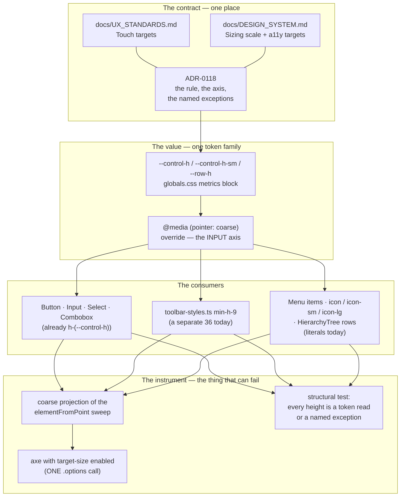
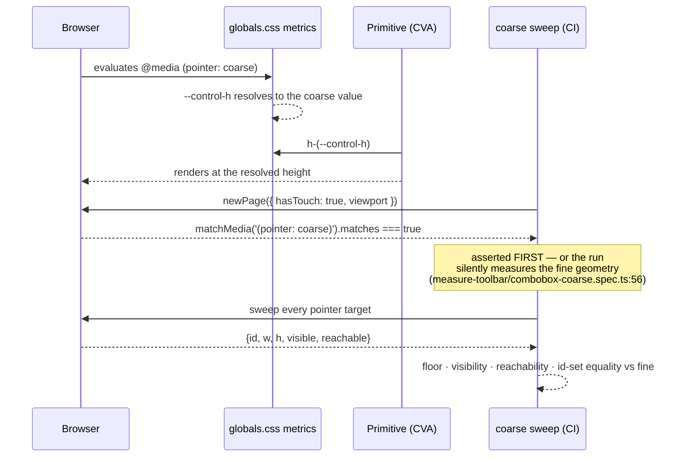
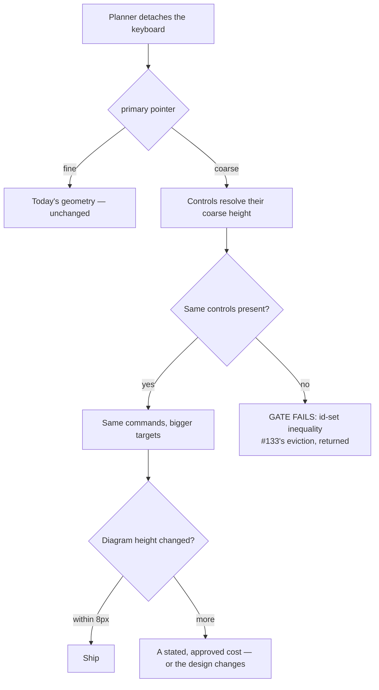

# Feature Spec: Touch, the coarse pointer, and the control-height contract

- **Status:** **Approved 2026-08-29** by the product owner — CQ-1 answered
  **(a) narrow to `pointer: coarse` with named exceptions**, each stating its non-pointer
  equivalent; scope **full plan as specced**, with CQ-2/3/4/5 taken at their stated defaults.
  The 36 px fine-pointer default stands: it was the same owner's ADR-0097 CQ-C decision (down
  from 40) ten days earlier, and WCAG AA's 24 px floor is already met — 44 px is **2.5.5 AAA**,
  so this is a house-quality rule, not a compliance one.
- **Author(s):** feature-analyst (Product Owner / Solution Architect / Technical Lead hats)
- **Date:** 2026-08-29
- **Tracking issue / epic:** _(to be opened)_
- **Roadmap link:** quality/consistency theme — the command-surface lineage's unfinished axis
- **Related ADR(s):** proposes a new ADR (**0118** is the next free number as of 2026-08-29 —
  `docs/adr/` tops out at 0117; ADR-0079 records a number being taken between plan and filing, so
  the plan re-checks at filing time). Builds on **ADR-0090 / 0091 / 0092 / 0094 / 0099 / 0109 /
  0110 / 0114 / 0115** (the command-surface lineage), **ADR-0097** (metrics tokens, the single
  theme), **ADR-0102** (values), **ADR-0117** (the tooltip's long-press), **ADR-0105** (why this is
  spec work), **ADR-0081** (entry points and journeys), **ADR-0058 / 0076** (verify the claim).

---

## 0. What I verified, and where the brief was wrong

The task that launched this work said explicitly that its claims were to be re-verified rather than
inherited (CLAUDE.md §19.11, ADR-0076 Class 3: _a claim inherited from the brief is checked like any
other_). Five were checked. **Two are wrong as stated, one is stronger than stated, one is already
recorded in the register, and one cannot be settled by reading.** Six further findings were not in
the brief at all, and two of them change what this epic is about.

**Method, stated because it bounds every claim below.** This analysis had **no shell** — Read, Grep
and Glob only. Every verdict here is _read from the working tree at `/home/user/SchedulePoint_1`_,
with file and line given. Nothing here was established by running a command, a test or a browser,
and **no measurement in this document is mine**; where a number appears it is quoted from the
artefact that measured it, named. That is precisely why **M0 exists and why nothing may be designed
before it runs**.

### 0.1 The brief's five claims

| #   | Claim as briefed                                                                | Verdict                                                          | Evidence (read, not run)                                                                                                                                                                                                                                                                                                                    |
| --- | ------------------------------------------------------------------------------- | ---------------------------------------------------------------- | ------------------------------------------------------------------------------------------------------------------------------------------------------------------------------------------------------------------------------------------------------------------------------------------------------------------------------------------- |
| 1   | "No Playwright **gate** has ever run with a coarse pointer."                    | **True today, false as history — and the true version is worse** | No `hasTouch` in any `apps/web/playwright.*.config.ts` (grep: 3 hits in `apps/web`, all in spec files, none in a config). **But a coarse gate did exist**: `docs/TECH_DEBT.md` #133:2422-2425 records `e2e-toolbar-fit`'s `coarse pointer` block (ADR-0090 M3-T4) running at 1024 × 1366 asserting 40 × 36. ADR-0109 D1 deleted that suite. |
| 2   | One measurement **harness** does.                                               | **True, and there are two coarse measurements, not one**         | `apps/web/measure-toolbar/combobox-coarse.spec.ts:35` (`test.use({ hasTouch: true })`, 1646). Plus a second: #133's closing measurement of 2026-08-28 (`TECH_DEBT.md:2437-2444`), hand-run in Chromium at 1646 with `hasTouch: true`.                                                                                                       |
| 3   | "**Six** `pointer-coarse:` variants ship … `tsld-toolbar-items.tsx:1039,1045`." | **FALSE**                                                        | Live: **three** — `toolbar-styles.ts:145` (`TOOLBAR_CARET_TARGET`), `:170` (`toolbarControlVariants`), `ToolbarSplitButton.tsx:195`. `tsld-toolbar-items.tsx:1039/1045/1051` are **comments recording a conditional that was removed**; `:1053` is `h-9` unconditionally, and `:1051-1052` says why.                                        |
| 4   | "#133's premise has **lapsed**; re-derive rather than inherit."                 | **True — and the register got there first**                      | #133 is **CLOSED 2026-08-28** (`TECH_DEBT.md:2433`) with exactly that re-derivation. It is not an open row to correct. What _has_ lapsed and is **not** recorded is elsewhere — see §0.2 finding C.                                                                                                                                         |
| 5   | "The toolbar's coarse harness was deleted."                                     | **True in outcome, unverified in detail**                        | #188 (`TECH_DEBT.md:4843`, CLOSED 2026-08-26) deleted seven harnesses including `item-widths`. `combobox-coarse` **survives and passes** (`:4879-4880`). Whether `item-widths` was itself coarse — #145:2623 says it was "the shape used for #133" — **cannot be verified by reading a deleted file**.                                      |

**Claim 1 restated, because the stronger version is the epic's best argument.** `e2e-toolbar-fit`
carried two things: an `elementFromPoint` sweep for WCAG 2.5.8, and a coarse-pointer geometry block.
ADR-0109 D1 deleted the suite — correctly, since it asserted a width ladder that no longer exists.
`docs/TECH_DEBT.md` #186 noticed the **2.5.8 half** was gone and it was lifted into
`apps/web/e2e-workspace-fit/command-surface.spec.ts` (closed 2026-08-25). **Nothing noticed the
coarse half.** So this is not "a gate that never existed"; it is **half a deleted gate restored and
half not, with no row recording the difference** — the `docs/TECH_DEBT.md` #124 shape (a deferral
whose reason has lapsed reads exactly like one whose reason still holds), one level up.

**Claim 3's correction has a second half the brief could not have seen.** The grep that finds three
also **misses one**: `HierarchyTree.tsx:483` carries
`'[@media(pointer:coarse)]:opacity-100'` — Tailwind's arbitrary-variant syntax, so it does not
contain the string `pointer-coarse`. It is the **only** coarse branch outside the toolbar, and the
only one that changes _visibility_ rather than _padding_. A search for this epic's subject scoped by
one spelling would have missed the one instance that is not about size.

### 0.2 Six things the brief did not have

**A. `--control-h` already exists.** `globals.css:905-907` declares `--control-h: 2.25rem` (36 px),
`--control-h-sm: 2rem` (32), `--row-h: 1.75rem` (28) — the metrics tokens ADR-0097 added, and the
first non-colour tokens this product ever had. Four primitives consume it: `button.tsx:32-33`,
`input.tsx:17`, `select.tsx:16`, `combobox.tsx:476`. #145's closing line — _"it is a product-wide
control-height question (`--control-h`)"_ — reads, in the brief, as though the token is the thing to
build. **It is not.** The epic's subject is the token's **coverage** and its **missing input axis**,
which is a materially smaller and better-shaped problem.

**B. 36 px is a decision the product owner made ten days ago, deliberately, against the
recommendation.** `globals.css:895-900`: _"`--control-h` is 36 px, **down from 40** (CQ-C). The
product owner chose the move explicitly, departing from the recommended default."_ Any proposal that
raises every control to 44 is partly a reversal of that, and must be put that way rather than as a
neutral standards fix.

**C. A live deferral points at a closed row.** `playwright.narrow-shell.config.ts:15-17`: _"**The
pointer stays fine** (Playwright's default): the coarse-pointer axis belongs to `docs/TECH_DEBT.md`
#133 and `measure-toolbar`."_ #133 closed on 2026-08-28. The CI step repeats it
(`ci.yml:584`). So the newest journey in the estate — the only authenticated one that runs at
390 × 844 — defers coarse to an owner that no longer exists.

**D. The approved plan for `e2e-workspace-fit` specified a coarse run, and it did not ship.**
`docs/specs/workspace-chrome-fit/implementation-plan.md:305-306`, task M1-T5 step 3: _"SC-7: every
`[data-toolbar-focusable]` clears 24 × 24 and is hit-testable, at every width, **in both plan views,
once with a coarse pointer**."_ And its `feature-spec.md:258-259` carries an approved acceptance
criterion: _"**Given** `@media (pointer: coarse)`, **when** the sweep runs, **then** no control's
minor axis is smaller than it was at `web-v0.103.0`."_ The shipped
`e2e-workspace-fit/command-surface.spec.ts` (362 lines, read in full) contains **no `hasTouch`, no
`pointerType`, and no `view=gantt`** — so **two** of that step's clauses are unbuilt and **one
approved AC has never been asserted**. This is ADR-0090 M5's newest drift shape: _a document
describing work correctly and the work not happening_, which `verify the claim` cannot catch because
there is no false claim to verify.

**E. The two standards documents disagree, and one of them is unmeetable.**

- `docs/UX_STANDARDS.md:168` — **"Touch targets ≥ 44px"**, an unconditional rule.
- `docs/DESIGN_SYSTEM.md:453` — **"Targets: ≥ 24×24px (prefer ≥ 44px on touch)"**, a preference.
- `docs/DESIGN_SYSTEM.md:113` — the scale: **sm 32 / md 36 (default) / lg 44**, i.e. the design
  system's own default control is 36 and its 44 is an opt-in size.

The 44 px rule is therefore contradicted by the sizing scale in the same document that states it as
a preference, and by the default value of the token that implements the scale. **A published
standard that nothing meets is worse than no standard** — this register records that lesson
repeatedly — and this one has three inconsistent statements across two files.

**F. There are TWO independent "touch" mechanisms in this product, and only one is testable today.**

| Mechanism                          | Where it branches        | Live consumers                                                                                           | Coverage                                                                                               |
| ---------------------------------- | ------------------------ | -------------------------------------------------------------------------------------------------------- | ------------------------------------------------------------------------------------------------------ |
| **CSS** `@media (pointer: coarse)` | the browsing **context** | `toolbar-styles.ts:145,170`, `ToolbarSplitButton.tsx:195` (padding-x), `HierarchyTree.tsx:483` (opacity) | **none** — no gate sets `hasTouch`; two harnesses and one hand-run measurement, all outside CI         |
| **JS** `event.pointerType`         | each **event**           | `tooltip.tsx:258,263,273` (ADR-0117 long-press), `HierarchyTree.tsx:386` (row-menu long-press)           | unit (`tooltip.test.tsx`, `HierarchyTree.crud.test.tsx`) **and** a browser journey (`e2e-toolbar:239`) |

`e2e-toolbar/toolbar.spec.ts:223-225` says why, and it is right: _"Long-press is driven by
dispatching `pointerType: 'touch'` pointer events rather than a `hasTouch` context: Playwright has
no native long-press gesture."_ The consequence, which nothing states, is that **the tooltip's
long-press runs in a context where the CSS coarse branch is off** — so the two mechanisms have never
been exercised together, and no test in this repository has ever rendered the product as a touch
user actually receives it.

**G (bonus, out of scope, filed).** `docs/UX_STANDARDS.md:216` still requires "Correct in light and
dark". ADR-0097 withdrew dark. Not this epic's subject; recorded so it is not lost.

---

## 1. Business understanding

### Problem

**The product publishes a touch-target rule it meets nowhere, implements touch in two mechanisms
only one of which is tested, and has no instrument that could tell anyone either fact.**

Concretely, four things are true at once:

1. **The rule is unmeetable and inconsistent.** `UX_STANDARDS.md` says ≥ 44 px; the design system's
   own default control is 36 px and its own accessibility section calls 44 a preference (§0.2 E).
   Nothing in the product's chrome, forms, menus, tables or dense rows meets 44 except two
   deliberately-sized controls.
2. **There is no gate.** WCAG 2.2 §2.5.8's 24 px floor is gated — `e2e-workspace-fit` sweeps it with
   `elementFromPoint`, and two axe scans opt `target-size` in (`e2e-minimap`,
   `e2e-shell/org-less-screens`). **The 44 px rule has no instrument of any kind**, and the coarse
   projection that the fit gate's own approved plan specified was never built (§0.2 D).
3. **The height contract is half-tokenised.** `--control-h` governs four form primitives. The
   command surface is a separate `min-h-9` in `toolbar-styles.ts`. `icon` (40), `icon-sm` (28),
   `lg`/`icon-lg` (44) and menu-item padding (`px-2 py-1.5`, ~32) are literals. So "how tall is a
   control" has **five** answers in five places, and only one of them moves when the theme moves.
4. **The device this matters on is the one the product is judged on.** The product owner's Surface
   Pro reports `pointer: coarse` in tablet mode and `fine` with the keyboard attached (#133:2396-97),
   at 1646 CSS px. Every measurement in the six-epic command-surface lineage was taken fine.

**Why now.** Three reasons, in order. (a) The lineage that owned this question is finished — six
epics reshaped the command surface and each deferred touch; #133 closed on 2026-08-28 and took the
last named owner with it, so the axis now has none. (b) `docs/TECH_DEBT.md` #172 closed the same week
by **declaring below-`lg` a supported surface and building a journey for it** — which makes an
untested coarse branch a promise the product has now explicitly made. (c) #145 is measured and
answered, and its answer is a question this epic must take: the 44 px line is missed by both control
types, so it is a product-wide contract question, not a picker question.

### Users

| Persona                                               | Organisation role         | What they need                                                                                                                                              |
| ----------------------------------------------------- | ------------------------- | ----------------------------------------------------------------------------------------------------------------------------------------------------------- |
| **The product owner on a Surface Pro in tablet mode** | Org Admin                 | The same plan workspace they use with a keyboard, without controls becoming harder to hit or the diagram becoming smaller because they detached a keyboard. |
| **A planner reviewing on site**                       | Planner                   | To open a plan on a tablet, read the diagram, select an activity and report progress with a finger.                                                         |
| **A contributor reporting progress from a phone**     | Contributor               | The below-`md` shell #172 declared supported: the Explorer sheet, the facts fallback, the progress fields.                                                  |
| **An external guest opening a share link**            | External Guest (ADR-0051) | A read-only plan on whatever device the link was opened on — the one audience with **no** keyboard fallback assumption available.                           |
| **Every engineer after this epic**                    | —                         | One place that says how tall a control is, and a gate that fails when it stops being true.                                                                  |

**No role gains or loses a permission.** This epic changes geometry, documentation and test
coverage. RBAC, org scope, the pen (ADR-0028) and every guard are untouched.

### Primary use cases

1. A planner on a coarse pointer can hit every command on the plan's command surface, the object
   bar, the row menus and the form controls **without a mis-hit**, at 1646 and at 390.
2. An engineer changing a control's height changes **one value**, and a gate tells them what it cost.
3. A reviewer can read one sentence that says what the target rule is, and point at the test that
   enforces it.
4. The register's four open touch rows (#127, #145's residue, #153, and #133's orphaned successor
   deferrals) each **close, narrow, or are consciously left with a written reason** — none is left
   pointing at an owner that does not exist.

### User journeys

**Happy path (the gate's own journey).** A planner opens a plan on a coarse-pointer device at 1646.
Every command in the deck, every action on the object bar, every row menu item and every form
control in the activity editor clears the decided floor and a pointer can reach it. The diagram is
**no smaller than it was on the same device before this epic** — that is an acceptance criterion,
not an aspiration, and M0 measures whether it is affordable before anything is designed.

**Alternate — the keyboard is reattached.** The same planner docks the keyboard. The context flips to
`pointer: fine`. Controls return to their fine geometry. **The layout must not change what a planner
can reach or where it is** — only how big it is. Nothing may enter or leave a surface on a pointer
change; that is the eviction failure #133 recorded and ADR-0109's wrap already removed, and this
epic must not reintroduce it by another route.

**Alternate — phone.** A contributor opens the shell at 390 × 844 coarse. The Explorer sheet, the
hamburger, the below-`md` facts row and the progress fields are reachable with a thumb.

**Alternate — the rule cannot be met on a surface.** A dense tree row is 28 px by design (`--row-h`),
because a Project Explorer whose rows are 44 px shows five clients where it showed nine. Where the
floor is not met, the product **says so in the standard, names the non-pointer equivalent it relies
on (long-press, keyboard, the row menu), and the gate encodes the exception rather than being
weakened.** An exception that is written down is a decision; one that is absent is a defect.

### Expected outcomes

- Touch targets are a **decision with a number and a gate**, not a published aspiration.
- Control height is **one token family with an input axis**, not five literals.
- The coarse-pointer branch of the product is **executed by CI** for the first time.
- The command-surface lineage's last deferred axis is closed rather than re-deferred.

### Success criteria

| #   | Criterion                                                                                                                                                                   | Measured by                                                              |
| --- | --------------------------------------------------------------------------------------------------------------------------------------------------------------------------- | ------------------------------------------------------------------------ |
| S1  | A coarse-pointer run exists **in CI** and covers the plan command surface, the object bar and the below-`md` shell.                                                         | CI step green; the run's own inventory output                            |
| S2  | Every control on the swept surfaces clears the **decided** floor under a coarse pointer, and a pointer can reach it (`elementFromPoint`).                                   | The gate, **verified red first** against the pre-epic tree (ADR-0110 D5) |
| S3  | The diagram's height at 1646 under a coarse pointer is **within 8 px of** its height under a fine pointer on the same build — or the difference is a stated, approved cost. | `vertical-stack` harness, fine and coarse, 3 runs, spread reported       |
| S4  | `UX_STANDARDS.md` and `DESIGN_SYSTEM.md` state **one** rule, in one place, cross-referenced.                                                                                | Reading both; a doc-link check                                           |
| S5  | Every height on the swept surfaces resolves from a token, or is a **named** exception in the ADR.                                                                           | A structural test over the primitives                                    |
| S6  | #127, #153 and the orphaned deferrals in `playwright.narrow-shell.config.ts` and `command-surface.spec.ts` each close or carry a live owner.                                | The register diff                                                        |
| S7  | No control's minor axis on any surface is **smaller** after this epic than before, on either pointer.                                                                       | The M0 inventory as the before-baseline; the gate as the after           |

S7 is `workspace-chrome-fit`'s never-asserted AC (§0.2 D), adopted here rather than re-deferred.

### Open questions

Only the five in **§6** are critical. Each has a stated default so they can be accepted in one pass.

---

## 2. Functional requirements

### User stories & acceptance criteria

> **US-1** — As a **planner on a coarse pointer**, I want every command on the plan's command
> surface to be big enough to hit, so that I do not arm the wrong tool on a plan I am accountable for.
>
> **Acceptance criteria**
>
> - **Given** a coarse-pointer context at 1646, **when** the deck is swept, **then** every focusable
>   control **and every split-button caret** clears the decided floor on both axes.
> - **Given** the same, **then** `document.elementFromPoint` at each control's centre returns that
>   control (or a descendant/ancestor of it) — the ADR-0090 M5 trap: a control at 0 px has 0 overhang.
> - **Given** the same sweep, **then** it reports **more than fifteen** controls — the pinned
>   positive, or the gate passes against a deck that renders nothing (the ADR-0093 lesson).
> - **Given** a fine-pointer context at the same width, **then** the **set of `data-toolbar-item`
>   ids present** is identical to the coarse set. Nothing may be evicted, hidden or demoted by a
>   pointer change.

> **US-2** — As a **planner**, I want the diagram to be the same size whether or not my keyboard is
> attached, so that detaching it does not cost me the picture.
>
> **Acceptance criteria**
>
> - **Given** the plan workspace at 1646, **when** `aboveCanvas` is measured fine and coarse on one
>   build, **then** the difference is ≤ 8 px, **or** it is a cost stated in the ADR and approved.
> - **Given** the same, **then** the number of wrapped lines in the command deck is equal on both
>   pointers, or the difference is stated.

> **US-3** — As a **contributor on a phone**, I want the below-`md` shell to be operable with a
> thumb, so that the surface #172 declared supported actually is.
>
> **Acceptance criteria**
>
> - **Given** 390 × 844 coarse, **when** the shell is swept, **then** the hamburger, the Explorer
>   sheet's rows and their action triggers, and the below-`md` facts row all clear the floor and are
>   reachable.
> - **Given** the same context, **then** the Explorer's row-action `⋯` is **visible without hover**
>   (`HierarchyTree.tsx:483`'s coarse branch, executed by a gate for the first time).
> - **Given** the same context, **then** the axe scan (`wcag22aa` + `target-size` enabled, via ONE
>   `.options()` call — `TECH_DEBT` #170's trap) reports no violation.

> **US-4** — As an **engineer**, I want one place that decides how tall a control is, so that the
> next height change is one edit and not five.
>
> **Acceptance criteria**
>
> - **Given** the primitives, **when** a structural test reads them, **then** every control height is
>   a `var(--control-h*)` read or appears in a **named exception list** with a reason.
> - **Given** the token, **when** its coarse value is changed in `globals.css`, **then** every
>   governed control moves, proven by the coarse gate rather than by inspection.
> - **Given** the sizing ratchet (`token-architecture.test.ts:647`, ceiling **17**), **then** this
>   epic does not raise it. A height literal removed is a ratchet step earned, never spent.

> **US-5** — As a **reviewer**, I want the target rule stated once and enforced, so that "the axe
> scan is green" stops being true and meaningless.
>
> **Acceptance criteria**
>
> - **Given** `UX_STANDARDS.md` and `DESIGN_SYSTEM.md`, **then** they state one rule and cross-refer.
> - **Given** a surface that does not meet the floor, **then** the standard **names** it, states the
>   non-pointer equivalent it relies on, and the gate encodes the exception explicitly.
> - **Given** the gate, **then** it was **verified red** against a deliberately undersized control
>   before it was believed (ADR-0110 D5 — the gate that could not see a caret is this epic's
>   nearest precedent and it is one file away).

> **US-6** — As a **screen-reader or keyboard user**, I want nothing about this to cost me a control.
>
> **Acceptance criteria**
>
> - Roving `tabindex` sequence on the deck, the object bar and every menu is **unchanged**.
> - No control acquires the native `disabled` attribute (ADR-0083); shading stays `aria-disabled` +
>   a linked `sr-only` reason.
> - The tooltip's long-press (ADR-0117) continues to show a name **without firing the command**, and
>   is exercised for the first time in a context where the CSS coarse branch is also on (§0.2 F).

### Workflows

**W1 — The gate.** Build the fixture once → for each `(width, pointer)` in the decided matrix →
resize → sweep every pointer target in the surface → assert floor, visibility, reachability, and the
id-set equality of US-1 → report the inventory as an artefact.

**W2 — Changing a height.** Edit `--control-h` (or its coarse override) in `globals.css` → the
governed primitives move → the coarse gate reports the new geometry and the vertical harness reports
the canvas cost → if the cost exceeds the stated bar, the change does not ship.

**W3 — Adding a control that cannot meet the floor.** The author adds it to the named-exception list
with a reason and a non-pointer equivalent → the structural test accepts it → the ADR's exception
table is the review surface. There is no third option: a control is governed or it is named.

### Edge cases

| Case                                                                                  | Expected behaviour                                                                                                                                                                                                                            |
| ------------------------------------------------------------------------------------- | --------------------------------------------------------------------------------------------------------------------------------------------------------------------------------------------------------------------------------------------- |
| **Hybrid device** (Surface Pro with keyboard attached, touchscreen present)           | `pointer: coarse` is false, `any-pointer: coarse` is true. **The rule keys on `pointer`, the primary pointer** — matching what the three shipped variants already do. Named, not implied.                                                     |
| The context flips mid-session (keyboard detached)                                     | CSS re-evaluates; no JS remount, no state loss, no control enters or leaves (US-1). The gate asserts the id-set equality at both, not the transition (a transition test is M3 scope if M0 shows a difference).                                |
| A control is **already** ≥ the floor                                                  | Unchanged. This epic raises floors; it never lowers a target (S7).                                                                                                                                                                            |
| A dense surface where the floor costs information (tree rows, Gantt rows, menu items) | The exception path (W3). `--row-h` is 28 px and governs the Gantt and the tables **as one rhythm** (`globals.css:902-903`) — raising it is a data-density decision, not a target-size one.                                                    |
| A surface reachable only with a keyboard (canvas parallel listbox)                    | Out of scope: it has no pointer target. ADR-0026 D7's DOM layer is `sr-only`.                                                                                                                                                                 |
| The **exported PNG / printed programme** (ADR-0103)                                   | Out of scope — paper has no pointer. Stated so its absence is a decision.                                                                                                                                                                     |
| A control inside a native `<dialog>` (top layer)                                      | Swept like any other; `elementFromPoint` resolves through the top layer correctly. The ADR-0067 finding (a menu portalled to `document.body` under a modal) is a **positive** reason to sweep dialogs on a coarse pointer, since nothing has. |
| The guest share view (ADR-0051)                                                       | Read-only, session-less, and the one surface with no keyboard-fallback assumption. **In scope for the inventory at M0**, in scope for the gate only if M0 finds a control below the floor there.                                              |

### Permissions

**None change.** No new endpoint, no new permission, no new scope. The coarse gate signs in as an
ordinary member and takes the pen exactly as `e2e-workspace-fit` does today
(`command-surface.spec.ts:131-146`, `PLAN_EDIT_LOCK_ENFORCED=true`). The pen matters to the sweep for
one reason only: it changes which controls are enabled, and a sweep without it measures a smaller
set — that is already recorded in that file at `:142-144` and is inherited, not re-derived.

### Validation rules

Not a data feature. The "validation" here is the gate's own contract:

- The floor is a **constant in the gate**, derived from the decided rule, never restated in prose.
- The exception list is **data**, and every entry carries a reason string.
- The sweep enumerates targets in **one pass over the surface** (`button, a, [role=button], input`),
  never per `[data-toolbar-item]` — `command-surface.spec.ts:73-80` records why, and that reasoning
  is inherited verbatim rather than re-invented.
- Every measurement reports **three runs with the spread**, because a single browser number in this
  repository has been wrong often enough to be a rule (ADR-0055 S4, ADR-0100 M0).

### Error scenarios

| Scenario                                                        | Detection            | Result                                                                                                                                          |
| --------------------------------------------------------------- | -------------------- | ----------------------------------------------------------------------------------------------------------------------------------------------- |
| A control drops below the floor under coarse                    | the gate's sweep     | CI red, naming the control, its size, its width and its pointer                                                                                 |
| A control is present fine and absent coarse                     | US-1 id-set equality | CI red — this is #133's eviction failure returning by a different route                                                                         |
| A control is painted at 0 px                                    | the `visible` filter | CI red (kept from `command-surface.spec.ts:235-239`)                                                                                            |
| A pointer cannot reach a visible control                        | `elementFromPoint`   | CI red                                                                                                                                          |
| The sweep finds nothing                                         | the pinned positive  | CI red — a gate that passes by finding nothing is worse than no gate                                                                            |
| The coarse fixture cannot be built (context option unsupported) | harness throws       | CI red, never a skip. `--pass-with-no-tests` is a config-level allowance and must not become a silent zero-case run for a suite that has cases. |

---

## 3. Technical analysis

| Area               | Impact     | Notes                                                                                                                                                                                                                                 |
| ------------------ | ---------- | ------------------------------------------------------------------------------------------------------------------------------------------------------------------------------------------------------------------------------------- |
| **Frontend**       | **medium** | `globals.css` metrics block; `button/input/select/combobox/toolbar-styles/menu` heights; possibly `HierarchyTree`, `TsldLegendPanel` (#153), `TsldViewControls`. No routes, no state, no data.                                        |
| **Backend**        | **none**   | Nothing in `apps/api` is touched.                                                                                                                                                                                                     |
| **Database**       | **none**   | **No schema change, so `database-architect` is not engaged** — stated rather than omitted, per the brief. If any milestone is found to need a column, the work **stops** and this spec is amended (CLAUDE.md §19.3 is unconditional). |
| **API**            | **none**   | No endpoint, DTO or OpenAPI change.                                                                                                                                                                                                   |
| **Security**       | **none**   | No authN/Z, no input, no secrets. The gate signs in as an ordinary member.                                                                                                                                                            |
| **Performance**    | **low**    | A media-query override costs nothing at runtime. The real cost is **CI wall clock** — a coarse projection re-pays the ~25 s fixture of `e2e-workspace-fit` (`command-surface.spec.ts:126-127`). Measured at M0-T5, not assumed.       |
| **Infrastructure** | **low**    | Possibly one new `playwright.*.config.ts` + one `package.json` script + one CI step + one report path (`ci.yml:769`). **This is what fires ADR-0105** and makes the full spec mandatory whatever the diff size.                       |
| **Observability**  | **none**   | No logs, metrics or traces.                                                                                                                                                                                                           |
| **Testing**        | **high**   | This epic is mostly test and documentation. Unit: structural tests over the primitives. e2e: the coarse projection(s) + an axe scan with `target-size` enabled. Harness: the M0 inventory and vertical-cost measurements.             |

### The recalculation parity gate (ADR-0034)

**The CPM engine is not imported and no migration runs.** This is `apps/web` styling, documentation
and test code; `computeSchedule` is not reachable from any file this epic touches. The parity gate is
untouched **by construction**, in its honest form: there is nothing here to hold parity for.

### The pen (ADR-0028)

**No new write of any kind.** The gate takes the pen only because a pen-gated deck exposes more
enabled controls to sweep.

### Feature flags

**None.** ADR-0088 D1: a `VITE_` constant is inlined at build time and has never been an operator
rollback — `apps/web/Dockerfile` declares one `VITE_` build arg and `docker-publish.yml` passes none.
The rollback for a geometry change is a commit boundary, and each milestone lands revertible.
Adding a flag here would additionally create ADR-0088's Class A shape (a second geometry maintained
forever) for a change whose whole point is that there should be **one** answer to a control's height.

### Dependencies

| Prerequisite                                          | State                                                                                 |
| ----------------------------------------------------- | ------------------------------------------------------------------------------------- |
| `--control-h` metrics tokens (ADR-0097)               | **Shipped** — `globals.css:905-907`                                                   |
| The 2.5.8 sweep to project from (`e2e-workspace-fit`) | **Shipped** — ADR-0110 M1, CI step at `ci.yml:565-566`                                |
| A below-`lg` authenticated journey to project from    | **Shipped** — `e2e-narrow-shell`, ADR/#172 closure, CI step at `ci.yml:588-589`       |
| A wrapping command surface (no eviction to model)     | **Shipped** — ADR-0109 D1                                                             |
| The `.options()` axe trap being understood            | **Recorded and fixed** — `TECH_DEBT` #170, `e2e-minimap:103-113`, `e2e-shell:140-163` |
| The tooltip long-press (ADR-0117)                     | **Shipped** — it is a consumer of this epic's coarse context, not a blocker           |

**Nothing must land first.** Every prerequisite is already in `main`. The only ordering constraint is
internal: **M0 before any design is fixed.**

---

## 4. Solution design

> Everything in §4 is **proposed and contingent on M0**. Four consecutive epics in this register
> (ADR-0090, 0091, 0092, 0097 Landing C) had their headline expectation contradicted by their own
> measurement, and ADR-0099 M0 is the one that caught it before building. M0 here is written to be
> capable of contradicting §4, and §6 CQ-2 names what happens when it does.

### Architecture overview

### The design, in four decisions

**D1 — Input is an axis of the metrics tokens, not a per-component variant.** Today three components
each carry their own `pointer-coarse:` padding and one carries a coarse opacity. That is the
pre-ADR-0097 world one axis over: a design decision expressed as a literal in a `className`, four
times, with no way to change it once. The proposal is a `@media (pointer: coarse)` override of the
metrics block, so a control's touch height is **one value in one file**.

**This needs the ADR because ADR-0097's structure has no slot for it.** That decision gave the
product a vocabulary for _which theme_ (`THEME_SELECTORS`, now one entry) and _which surface_
(`[data-surface]` rebinds, six scopes). It has no vocabulary for _which input_, and its own comment
at `globals.css:1316` states a **"no token outside a theme block"** rule. An input-modality override
is a third kind of declaration and must be named as one, or the next reader will either delete it as
a violation or copy it for a fourth kind that should not exist.

**D2 — The rule is restated, scoped, and its exceptions are named.** The proposed shape (final wording
is CQ-1):

- **≥ 24 × 24 px always, every pointer, no exceptions** — WCAG 2.2 §2.5.8 AA, already met and gated.
- **≥ 44 px on a coarse pointer** for: command-surface controls, object-action controls, panel chrome
  (close/toggle), form controls, and everything on a surface reachable below `md`.
- **Named exceptions**, each with the non-pointer equivalent it relies on: dense list and tree rows
  (`--row-h`, 28 px — the Explorer and the Gantt), and menu items (~32 px), both of which reach their
  actions by long-press, keyboard and the row menu (`UX_STANDARDS.md:92-97`'s four ways).

The exceptions are the honest half. A rule with no exceptions that nothing meets is what the product
has now; a rule whose exceptions are written down is a decision that can be reviewed.

**D3 — The gate is a coarse projection of the sweep that already exists, not a second gate.** Two
gates with one job disagree about what "reachable" means — `command-surface.spec.ts:316-317` says so
in the commit that widened it to the object bar, and that is the same argument. The projection also
**discharges the debt in the place it was owed** (§0.2 D). `e2e-narrow-shell` gains the same
projection for the below-`md` half, replacing its lapsed deferral to #133.

**D4 — Register dispositions, decided rather than deferred.**

| Row                                                         | Disposition                                                                                                                                                               |
| ----------------------------------------------------------- | ------------------------------------------------------------------------------------------------------------------------------------------------------------------------- |
| **#127** (40 × 36 vs a 44 rule)                             | **Closes** with D1+D2 — or **narrows** to a stated exception if M0-F2 shows the deck cannot afford 44. Either way it stops being open.                                    |
| **#145** (residue: "a product-wide `--control-h` question") | **Closes** — this epic is that question. The two held picker conversions unblock as a consequence.                                                                        |
| **#153** (two close buttons, 28 vs 44)                      | **Closes** in M3 — its own text says the Legend's close moves to `icon-lg` "when #127 is picked up". Verified live at `TsldLegendPanel.tsx:166` vs `TsldMinimap.tsx:375`. |
| **#133**                                                    | Already closed. Its **orphaned successors** — `playwright.narrow-shell.config.ts:15-17` and `ci.yml:584` — are repaired to name this epic.                                |
| **`workspace-chrome-fit` M1-T5 step 3**                     | Discharged (coarse). Its "in both plan views" clause is **also** unbuilt; folded in or filed with a reason, never silently dropped.                                       |
| **#172's `light and dark` residue** (§0.2 G)                | Filed as a new row. Not this epic.                                                                                                                                        |

### Data flow

There is none — no data moves. What follows is the **decision** flow, which is what this epic
actually plumbs.

The `matchMedia` self-check is not decoration. `workspace-layout/implementation-plan.md:965-966`
records the same guard for the same reason: without it a misconfigured context measures the fine
geometry and reports a confident green about nothing.

### User flow

### Database changes

**None.** No model, column, index, constraint or data migration. `database-architect` is
**deliberately not engaged**, and that is a statement about the change rather than a judgement about
the agent's value: CLAUDE.md §19.3 is unconditional for schema work, and there is no schema work
here. If any task discovers otherwise, the work stops and this spec is amended.

### API changes

**None.**

### Component changes

| Component / file                                      | Change                                                                                                                                                                                  | Milestone |
| ----------------------------------------------------- | --------------------------------------------------------------------------------------------------------------------------------------------------------------------------------------- | --------- |
| `src/styles/globals.css` (metrics block)              | An input axis for the control-height tokens; the block's comment states what kind of declaration it is (D1)                                                                             | M2        |
| `src/components/ui/button.tsx`                        | `icon` (40) and `icon-sm` (28) move onto tokens so the axis reaches them; `icon-lg`/`lg` (44) confirmed as the ceiling                                                                  | M2        |
| `src/components/ui/toolbar/toolbar-styles.ts`         | `min-h-9` resolves from the token rather than being a second, parallel 36; the three `pointer-coarse:` padding utilities are reconsidered against the token (they may become redundant) | M2        |
| `src/components/ui/toolbar/ToolbarSplitButton.tsx`    | The caret is the control ADR-0090 records shipping at 23 × 36 and ADR-0110 D5 records a gate failing to see. It is swept explicitly and sized with its primary.                         | M2        |
| `src/components/ui/menu.tsx`                          | Menu-item height: either the token or a named exception (`px-2 py-1.5` today, ~32 px)                                                                                                   | M3        |
| `src/features/navigator/components/HierarchyTree.tsx` | The row `⋯` (`icon-sm`, 28) and the coarse opacity branch — the exception path, with its long-press equivalent named                                                                    | M3        |
| `src/features/tsld/components/TsldLegendPanel.tsx`    | Close `icon-sm` → `icon-lg` (closes #153)                                                                                                                                               | M3        |
| `src/features/tsld/components/TsldViewControls.tsx`   | `icon` (40) — a third panel-chrome size; resolved with the other two                                                                                                                    | M3        |
| `apps/web/e2e-workspace-fit/command-surface.spec.ts`  | The coarse projection                                                                                                                                                                   | M2        |
| `apps/web/e2e-narrow-shell/narrow-shell.spec.ts`      | The coarse projection at 390; the lapsed #133 deferral repaired                                                                                                                         | M3        |

**States.** No loading, empty, error or success state changes — no component gains or loses a state.
That is worth writing down rather than leaving blank: the "every view" rule (`UX_STANDARDS.md:56-64`)
is satisfied because nothing here is data-driven.

### Implementation approach & alternatives

**Chosen: measure first, then one token axis, one restated rule, one projected gate.**

| Alternative                                                           | Why not                                                                                                                                                                                                                                                                                                                                                           |
| --------------------------------------------------------------------- | ----------------------------------------------------------------------------------------------------------------------------------------------------------------------------------------------------------------------------------------------------------------------------------------------------------------------------------------------------------------- |
| **Raise everything to 44 unconditionally**                            | Reverses a product-owner decision made 2026-08-19 (`globals.css:895-900`, ADR-0097 CQ-C) and charges every desktop user the vertical space that four consecutive epics were opened to recover. Remains **open** as an outcome if M0-F2 shows the cost is negligible — which would be the cheapest possible answer, and is why F2 is written to be able to say so. |
| **Delete the 44 rule; ship WCAG's 24 and stop**                       | Defensible and cheap, and it is the honest floor of CQ-1. Rejected as the _default_ because the product now explicitly supports a below-`md` surface (#172's closure) and a share link opened on a phone, and 24 px is a legal minimum rather than a usable one on those. Offered as CQ-1's alternative rather than dismissed.                                    |
| **Per-component `pointer-coarse:` variants (extend today's pattern)** | This is the status quo and it has produced four ungoverned branches in three files, one of which is invisible to a search for the other three (§0.1 claim 3). It is ADR-0097's original defect one axis over.                                                                                                                                                     |
| **A JS `useCoarsePointer()` hook driving props**                      | Puts a layout decision in React, re-renders the whole workspace on a keyboard attach, and creates a second source of truth beside the CSS the product already ships. ADR-0097's rule — never branch on theme in JS — generalises.                                                                                                                                 |
| **A new `e2e-touch` suite**                                           | A second config, a second CI step, a second ~25 s fixture, and two gates with one job (`command-surface.spec.ts:316-317`). Kept as CQ-3's fallback if M0-T5 measures the projection as prohibitively slow.                                                                                                                                                        |
| **Rely on axe's `target-size`**                                       | It implements the **24 px** criterion, not the 44 px preference — so it structurally cannot enforce the rule this epic is about. It is retained as a complement, not a substitute. (And it is disabled by default and mis-tagged for every legacy scan here — ADR-0090 M5, `TECH_DEBT` #170.)                                                                     |
| **Emulate a real device (`devices['iPad Pro']`)**                     | Bundles viewport, DPR, user-agent and `isMobile` into one opaque change, and `isMobile` alters Chromium's viewport metrics and touch emulation together — `measure-toolbar/combobox-coarse.spec.ts:21` deliberately sets `hasTouch` **without** `isMobile` for exactly that reason. One axis at a time.                                                           |

**An ADR is required.** Three of the four decisions are architecturally significant on this
repository's own terms: a new kind of token declaration (D1), a change to a published standard (D2),
and a shared gate (D3). ADR-0105's triggers fire on the Playwright/CI change and the shared gate
independently of size.

---

## 5. Links

- Implementation plan: [`./implementation-plan.md`](./implementation-plan.md)
- Docs this change updates: `docs/UX_STANDARDS.md`, `docs/DESIGN_SYSTEM.md`, `docs/TECH_DEBT.md`
  (#127, #145, #153 dispositions + the new rows), `docs/TESTING.md` (the new/changed suite),
  `CLAUDE.md` §16 (the ADR entry), `docs/adr/README.md` (the index — ADR-0110 D6 gates both
  directions), `.github/workflows/ci.yml`.
- Primary evidence read: `apps/web/src/styles/globals.css:895-907`,
  `apps/web/src/components/ui/button.tsx:31-43`,
  `apps/web/src/components/ui/toolbar/toolbar-styles.ts:145-186`,
  `apps/web/src/components/ui/toolbar/ToolbarSplitButton.tsx:188-195`,
  `apps/web/src/features/tsld/toolbar/tsld-toolbar-items.tsx:1039-1053`,
  `apps/web/src/features/navigator/components/HierarchyTree.tsx:386,465,480-487`,
  `apps/web/src/components/ui/tooltip.tsx:258-273`,
  `apps/web/src/components/ui/menu.tsx:449`,
  `apps/web/e2e-workspace-fit/command-surface.spec.ts` (whole file),
  `apps/web/playwright.workspace-fit.config.ts`, `apps/web/playwright.narrow-shell.config.ts:15-17`,
  `apps/web/e2e-toolbar/toolbar.spec.ts:217-249`,
  `apps/web/measure-toolbar/combobox-coarse.spec.ts:21,35,56`,
  `apps/web/src/styles/token-architecture.test.ts:584-664`,
  `.github/workflows/ci.yml:544-590`,
  `docs/TECH_DEBT.md` #124/#127/#133/#145/#153/#170/#172/#186/#188,
  `docs/specs/workspace-chrome-fit/{feature-spec.md:248-272,implementation-plan.md:285-311}`,
  `docs/UX_STANDARDS.md:168`, `docs/DESIGN_SYSTEM.md:113-125,453`.

---

## 6. Critical questions

Five. Each has a default that can be accepted as-is; answering all five in one pass unblocks the
whole epic. **CQ-1 and CQ-2 are the only two that change the design.**

---

### CQ-1 — Does the 44 px rule stand, narrow, or go?

`UX_STANDARDS.md:168` publishes it unconditionally; nothing meets it; `DESIGN_SYSTEM.md:453` already
weakens it to a preference and `:113` sets the default control at 36. Three options:

- **(a) Stands unconditionally** — every pointer, every surface. Honest, and expensive: it makes
  dense rows (28 px) and menu items (~32 px) permanent violations, which is the state we are in.
- **(b) Scoped to a coarse pointer, with named exceptions** — the proposed default.
- **(c) Withdrawn; WCAG's 24 px is the rule** — cheapest, already gated, and the most defensible if
  touch is not a supported mode. It makes the below-`md` shell #172 just declared supported a
  24 px surface.

> **Default if unanswered: (b).** A rule that binds where it matters and names where it does not is
> the only one of the three that can be both true and enforced. **This spec cannot fully justify (b)
> over (c) without M0's numbers** — which is the point of M0, and CQ-2 is how the answer feeds back.

---

### CQ-2 — What happens if M0 says 44 is unaffordable on the command surface?

The pre-written falsification condition (M0-F2) can come back saying a 44 px deck costs an extra
wrapped line (≈ 36–44 px of diagram) on a coarse pointer at 1646 — the product owner's device in the
mode this epic is for. Three responses:

- **(a) Pay it.** A touch user gets bigger targets and a smaller diagram. Defensible: they are not
  typing, they are reviewing.
- **(b) Exempt the command surface**, name it in the standard, and rely on its existing 40 × 36 plus
  the ADR-0117 long-press. The rule then binds on forms, panel chrome and the below-`md` shell.
- **(c) Withdraw the height half entirely** and ship only the gate, the contract and the register
  dispositions — the epic becomes "measure it, write it down, gate it".

> **Default if unanswered: (b), with the cost stated in the ADR.** Four epics have fought for that
> vertical space and one of them (ADR-0092) measured 31 % of the workspace as chrome; spending it
> back silently would be the register's own worst pattern. **(c) is a legitimate and cheap outcome
> and is not a failure** — ADR-0097 Landing C and ADR-0112 M3 both ended that way, on their own
> numbers, and both were the better call.

---

### CQ-3 — One projected gate, or a new suite?

- **(a) Project** the coarse pass into `e2e-workspace-fit` and `e2e-narrow-shell`. No new config, no
  new CI step, discharges the debt where it was owed (§0.2 D), one definition of "reachable".
- **(b) A new `e2e-touch` suite.** Cleaner subject boundary; costs a config, a CI step, a fixture and
  a second definition of reachability.

> **Default: (a)**, escalating to (b) only if M0-T5 measures the projection adding more than ~90 s to
> either suite's wall clock. The threshold is written here so the escalation is a measurement rather
> than a preference.

---

### CQ-4 — Which contexts does the gate run?

> **Default: two.** `hasTouch: true` at **1646 × 1097** (the product owner's Surface Pro in tablet
> mode — the width every measurement in this lineage uses) and at **390 × 844** (the phone
> `e2e-narrow-shell` already runs, whose pointer is fine today for a reason that has lapsed).
> `isMobile` is deliberately **not** set, following `combobox-coarse.spec.ts:21`: it changes viewport
> metrics and touch emulation together, and this epic changes one axis at a time.

---

### CQ-5 — How far does the token migration reach in this epic?

The five heights are 28 / 32 / 36 / 40 / 44, in five places.

> **Default: the primitives only** — `Button`'s `icon` and `icon-sm` join the token family; the
> command surface's `min-h-9` resolves from the same token instead of being a parallel 36; `menu.tsx`
> and the three canvas panels are M3 and may end as **named exceptions** rather than conversions.
> Feature-level literals (Gantt rows, table cells) are **out of scope** and stay on `--row-h`:
> `globals.css:902-903` states that as one deliberate rhythm, and re-opening it is a data-density
> decision, not a target-size one.

---

## 7. Risks

| Risk                                                                                                                                  | Likelihood  | Impact | Mitigation                                                                                                                                                                                                                     |
| ------------------------------------------------------------------------------------------------------------------------------------- | ----------- | ------ | ------------------------------------------------------------------------------------------------------------------------------------------------------------------------------------------------------------------------------ |
| **M0 contradicts §4** — the seventh consecutive epic on this surface whose expectation its own measurement reverses                   | **high**    | med    | That is M0's purpose. Falsification conditions are written **before** the run (M0-T0); CQ-2 pre-agrees the response; §4 is labelled contingent throughout.                                                                     |
| A coarse-only height **changes what is reachable**, reintroducing #133's eviction by another route                                    | med         | high   | US-1's id-set equality assertion, fine vs coarse, at every swept width — the single most important assertion in the epic.                                                                                                      |
| The gate is written and **cannot see the defect it names** — ADR-0110 D5, whose instance was a split-button caret in this exact sweep | **high**    | high   | Every assertion **verified red first** against a deliberately undersized control, including a caret specifically. The sweep's one-pass enumeration is inherited verbatim from `command-surface.spec.ts:73-80`, not re-derived. |
| The coarse projection is green **because the context is not actually coarse**                                                         | med         | high   | `matchMedia('(pointer: coarse)').matches` asserted before any measurement (`combobox-coarse.spec.ts:56`, `workspace-layout/implementation-plan.md:965-966`).                                                                   |
| Height literals added, tripping the sizing ratchet (`token-architecture.test.ts:647`, ceiling 17)                                     | med         | low    | The epic **removes** literals. If a task needs one, it goes through the token or the exception list. The ratchet is not raised (US-4).                                                                                         |
| The `@media (pointer: coarse)` token override is read as violating the "no token outside a theme block" rule (`globals.css:1316`)     | med         | med    | Named in the ADR as a **third kind of declaration** with its own reason, and a structural assertion added so the shape is pinned rather than conventional.                                                                     |
| CI wall clock grows on the two longest suites                                                                                         | med         | low    | Measured at M0-T5 against a written threshold (CQ-3); the coarse pass reuses one fixture where possible.                                                                                                                       |
| A dense-surface exception is written to excuse an oversight rather than to state a decision                                           | med         | med    | Every exception carries a **non-pointer equivalent** and is reviewed by `accessibility-reviewer` before M3 merges (CLAUDE.md §19.13 — the primitives' keyboard/pointer contract).                                              |
| **A milestone ships with no entry point** (ADR-0081, five recorded instances)                                                         | med         | high   | Every milestone header names its entry point or declares itself dark; the first user-facing milestone lands its journey step.                                                                                                  |
| This spec is wrong somewhere                                                                                                          | **certain** | varies | §0 states the method and its bound (read, not run). M0-T6 re-verifies §0's own table against the tree before M1 fixes anything.                                                                                                |
