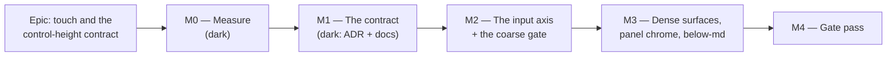

# Implementation Plan: Touch, the coarse pointer, and the control-height contract

- **Feature spec:** [`./feature-spec.md`](./feature-spec.md) — **approved 2026-08-29**
- **Status:** **Approved 2026-08-29** by the product owner — CQ-1 answered
  **(a) narrow to `pointer: coarse` with named exceptions**, each stating its non-pointer
  equivalent; scope **full plan as specced**, with CQ-2/3/4/5 taken at their stated defaults.
  The 36 px fine-pointer default stands: it was the same owner's ADR-0097 CQ-C decision (down
  from 40) ten days earlier, and WCAG AA's 24 px floor is already met — 44 px is **2.5.5 AAA**,
  so this is a house-quality rule, not a compliance one.
- **Owner:** _(unassigned)_

## Breakdown

### Epic

**Touch and the control-height contract** — make the product's touch-target rule true, singular and
enforced: one token family with an input axis, one restated standard with named exceptions, and the
first coarse-pointer run this repository has had in CI since ADR-0109 D1 deleted the last one.

**Roadmap theme:** quality and consistency — the unfinished axis of the six-epic command-surface
lineage (ADR-0090 → ADR-0115).

**Not in this epic:** the Gantt/table row rhythm (`--row-h` as a data-density decision), the exported
and printed surfaces (no pointer), and `UX_STANDARDS.md`'s stale light/dark clause (filed, §0.2 G).

---

## Milestone M0 — Measure, before anything is designed

**Outcome:** a measurement document that either supports or contradicts the spec's §4, and answers
CQ-1/CQ-2 with numbers.
**Ships dark:** nothing is reachable and nothing changes for a user. M0 produces harnesses in
`apps/web/measure-toolbar/` and a document; no product code is touched. _(ADR-0081 §1 — a milestone
that ships dark says so in the same place a user-facing one names its entry point.)_
**Journey:** none, and that is correct — there is no capability to drive. The journey obligation
lands with **M2**, the first user-facing milestone.

**Why this milestone exists at all.** ADR-0090, ADR-0091 D4, ADR-0092 M5 and ADR-0097 Landing C each
had their headline expectation contradicted by their own measurement; ADR-0099 M0 was the first to
catch it before building, and ADR-0113 records the further lesson that **a problem statement is a
claim too**. M0 is written so §4 can lose.

**Acceptance condition:** `m0-measurement.md` exists, every falsification condition below has a
recorded verdict, and each verdict names the artefact that produced it. **A PASS is not required —
only a recorded, honest answer.**

---

#### Feature: The pre-committed falsification conditions

> **Description:** write down, before any harness runs, what result would prove the spec wrong.
> **Complexity:** S
> **Dependencies:** none
> **Risks:** conditions written to be un-failable → each is stated as a number with a direction and a
> named consequence; the design agent that writes them does not run them.
> **Testing requirements:** none — this is a document, and it is the input to everything below.

##### Task M0-T0 — Commit the falsification conditions (≈ one PR, docs only)

- **Description:** `docs/specs/touch-and-control-height/m0-falsification.md`, committed **before**
  any measurement runs, in its own commit so the ordering is provable from the log.
- **Complexity:** S
- **Dependencies:** none
- **Risks:** none material.
- **Testing:** n/a.
- **Development steps:**

  1. Record the five conditions verbatim:

     - **F1 — the height axis is untouched by pointer.** _Prediction:_ **no** control in the product
       renders at a different **height** under a coarse pointer than under a fine one; the three live
       `pointer-coarse:` utilities change padding-x only and the fourth changes opacity.
       _Falsified if_ any control's height differs. _Consequence:_ `docs/TECH_DEBT.md` #127's framing
       ("one axis moved and the other did not") is wrong, the inventory is re-derived, and the design
       restarts.
     - **F2 — 44 px costs the command deck a wrapped line.** _Prediction:_ forcing the deck's control
       height to 44 under coarse at 1646 increases `aboveCanvas` by **≥ 36 px**. _Falsified if_ the
       increase is **< 16 px**. _Consequence if falsified:_ the deck can take 44 outright, the input
       axis is unnecessary there, and CQ-2 is moot — **the cheapest possible outcome, and this
       condition is written so the measurement can deliver it.**
     - **F3 — the form half is free.** _Prediction:_ raising `--control-h` to 44 under coarse costs
       **0 px** of diagram (form controls live in dialogs and panels, not in the chrome above the
       canvas), but causes **at least one** dialog to exceed the viewport at 390 × 844 coarse.
       _Falsified if_ either half is wrong. _Consequence:_ if it costs canvas, the token is not the
       right seam; if no dialog overflows, the form half can ship first and alone.
     - **F4 — #127's numbers still describe the deck.** _Prediction:_ an icon-only deck control still
       measures **40 × 36** under coarse at 1646. _Falsified if_ it measures anything else.
       _Consequence:_ #127's figures describe a surface that no longer exists — the same lapse #133
       had, and the row is re-derived before being acted on.
     - **F5 — the projection is cheap.** _Prediction:_ a coarse pass added to
       `e2e-workspace-fit` adds **< 90 s** to that suite's wall clock. _Falsified if_ ≥ 90 s.
       _Consequence:_ CQ-3 escalates to a separate suite.

  2. State the measurement protocol once: **three runs per figure, min/median/max reported, spread
     stated in the verdict.** A single browser number has been wrong often enough here to be a rule.
  3. State the self-check: every coarse run asserts `matchMedia('(pointer: coarse)').matches` **before
     measuring anything**, or it silently measures the fine geometry
     (`measure-toolbar/combobox-coarse.spec.ts:56`).

---

#### Feature: The inventory — every control height, both pointers, derived not read

> **Description:** the one artefact this epic's every later decision reads from.
> **Complexity:** M
> **Dependencies:** M0-T0
> **Risks:** measuring the wrong thing (ADR-0091's harness measured the bars; ADR-0110's sweep could
> not see a caret) → the sweep is **inherited verbatim** from
> `e2e-workspace-fit/command-surface.spec.ts:73-106`, one pass over
> `button, a, [role=button], input`, never per-`[data-toolbar-item]`.
> **Testing requirements:** the harness is the test; it throws rather than reporting a verdict it
> cannot justify (the rule `combobox-coarse.spec.ts` earned).

##### Task M0-T1 — The control-height inventory harness

- **Description:** `apps/web/measure-toolbar/control-heights.spec.ts` — sweeps every pointer target on
  every surface a touch user reaches, at `{1646, 390} × {fine, coarse}`, and writes
  `apps/web/measure-output/m0-control-heights.json`.
- **Complexity:** M
- **Dependencies:** M0-T0
- **Risks:**
  - _The harness lives in a directory named for the toolbar while its subject is product-wide_ →
    recorded in its docblock; `combobox-coarse.spec.ts` is already a non-toolbar harness in that
    directory, so this is the existing precedent rather than a new muddle. **No new config**, which
    is also what keeps M0 outside ADR-0105's Playwright trigger.
  - _A surface is missed because the list was assembled by reading_ (#188's own finding about itself)
    → the surface list is **derived** by walking the shell's routes, and the harness fails if a
    named surface renders zero targets.
- **Testing:** self-checking (`matchMedia` assertion; a pinned positive per surface).
- **Development steps:**
  1. Surfaces: the plan command deck; the object-action bar; the Project Explorer rows and their `⋯`;
     the activity editor's tabs and form controls; a `Menu` opened from a table row; the canvas
     panel chrome (Legend, Minimap, view controls); the below-`md` shell (hamburger, sheet, facts
     row); and the guest share view (ADR-0051 — the one surface with no keyboard-fallback
     assumption).
  2. For each target record `{surface, id, tag, w, h, visible, reachable, cssHeightSource}` — the
     last being whether the height resolved from `var(--control-h*)` or a literal, which is what
     M2's structural test will need.
  3. Assert `matchMedia('(pointer: coarse)')` first on the coarse pass.
  4. Emit the JSON; three runs; report spread.
  5. Docblock: what it does **not** cover — real device pickers, a virtual keyboard taking half the
     viewport, and any platform other than Chromium (`TECH_DEBT` #25a). `combobox-coarse.spec.ts`
     records the first two as unanswerable in Chromium and that is inherited, not re-litigated.

##### Task M0-T2 — The vertical cost, both directions

- **Description:** what 44 px costs the diagram, measured rather than argued — the number CQ-1 and
  CQ-2 turn on.
- **Complexity:** M
- **Dependencies:** M0-T1
- **Risks:** _measuring the epic's own output_ — ADR-0091 D4 was withdrawn because a toolbar resolved
  its density from its **own** leftover width, and ADR-0114 M7 records a pass whose input was its
  output. Here: `aboveCanvas` is read from the **band elements**, never from the toolbar's
  `clientWidth`, and each forced-height run is a **separate build**, never a live style mutation.
- **Testing:** the existing `vertical-stack` harness, extended with a pointer axis. Note ADR-0091's
  finding that a band which cannot be located now **throws** rather than being filtered out — keep it.
- **Development steps:**
  1. Baseline: `aboveCanvas` and canvas height at 1646, fine and coarse, current `main`, 3 runs.
  2. Treatment A (global): `--control-h: 2.75rem` + the deck's `min-h-11`, both pointers → the cost
     to a **desktop** user.
  3. Treatment B (coarse-only): the same values behind `@media (pointer: coarse)` → the cost to a
     **touch** user, at 1646 and 390.
  4. Treatment C (forms only): `--control-h` coarse-only, deck untouched → F3.
  5. Record every figure with its spread; write the F2/F3 verdicts.
  6. **Revert every treatment.** None of these commits ship; the branch ends where it started.

##### Task M0-T3 — Where the projection goes, and what it costs

- **Description:** settle CQ-3 with a number rather than a preference.
- **Complexity:** S
- **Dependencies:** M0-T1
- **Risks:** the fixture is ~25 s of real sign-up, hierarchy, plan, seed and recalculation
  (`command-surface.spec.ts:126-127`), and a second coarse **context** cannot share a page with the
  fine one → measure both shapes (a second `browser.newPage({ hasTouch: true })` in the same file vs
  a separate suite) rather than assuming either.
- **Testing:** wall-clock, 3 runs, spread.
- **Development steps:** prototype the projection on a throwaway branch; time it; write the F5
  verdict; **delete the prototype**.

##### Task M0-T4 — Re-verify the register rows against the shipped tree

- **Description:** #127, #145, #153 and every deferral naming the closed #133, re-derived from code.
- **Complexity:** S
- **Dependencies:** M0-T1
- **Risks:** inheriting a row's numbers is exactly the failure #133 and #124 record → each row's
  figures are re-measured or marked **unverifiable**, never carried.
- **Testing:** n/a (a document).
- **Development steps:**
  1. #127: does an icon-only deck control still measure 40 × 36 coarse? (F4.)
  2. #145: confirm the two held picker conversions are still held and still on the same argument.
  3. #153: confirmed live by reading (`TsldLegendPanel.tsx:166` `icon-sm` vs `TsldMinimap.tsx:375`
     `icon-lg`); measure both and add `TsldViewControls.tsx:92,98` (`icon`, 40) — a **third** size in
     the same family of panels, which #153 does not mention.
  4. List every artefact deferring to #133: `playwright.narrow-shell.config.ts:15-17`, `ci.yml:584`,
     and any docblock the grep finds.

##### Task M0-T5 — The M0 document

- **Description:** `m0-measurement.md` — the numbers, the five verdicts, and the recommendation.
- **Complexity:** S
- **Dependencies:** M0-T1…T4
- **Risks:** a verdict produced from an `undefined` — ADR-0097's closure measurement produced a
  PROCEED out of one → the document **fails to build** if any figure is missing, and each verdict
  quotes its source file.
- **Testing:** n/a.
- **Development steps:** write it; state which of §4's decisions the numbers **support** and which
  they **contradict**; make the CQ-1/CQ-2 recommendation; **stop and put it to the product owner if
  F2 or F3 is falsified**, because both change the design.

##### Task M0-T6 — Re-verify the spec's own §0 table

- **Description:** the spec's §0 was produced by reading, with no shell. Re-check it with commands.
- **Complexity:** S
- **Dependencies:** none (can run first)
- **Risks:** the spec becomes the next document nobody re-checks — the exact failure it documents.
- **Testing:** n/a.
- **Development steps:**
  1. Re-run each grep behind §0.1 and §0.2 and record the counts.
  2. Settle the one **unverified** claim: `git log`/`git show` the deleted `item-widths.spec.ts` and
     state whether it was a coarse harness, closing #145:2623's second-hand attribution.
  3. Correct the spec **in place, visibly**, noting what was wrong. A silently corrected spec is the
     drift this epic keeps citing.

---

## Milestone M1 — The contract

**Outcome:** the product states **one** target rule, in one place, with its exceptions named — and an
ADR records why the rule is what it is and what kind of declaration the input axis is.
**Ships dark:** documentation and an ADR only; no product code, no test, nothing a user can reach.
**Journey:** none (dark). The obligation lands with M2.

**Acceptance condition:** `UX_STANDARDS.md` and `DESIGN_SYSTEM.md` agree; the ADR is filed and in
`docs/adr/README.md` (ADR-0110 D6 gates the index in both directions); `pnpm check:doc-links` and
`pnpm check:adr-coverage` pass. **Nothing in M1 may change a rendered pixel** — if a doc change
implies one, it belongs to M2.

---

#### Feature: One rule, stated once

> **Description:** reconcile `UX_STANDARDS.md:168` (≥ 44 unconditional), `DESIGN_SYSTEM.md:453`
> (≥ 24, prefer 44 on touch) and `DESIGN_SYSTEM.md:113` (the 32/36/44 scale whose default is 36).
> **Complexity:** S
> **Dependencies:** M0 (the numbers decide CQ-1)
> **Risks:** writing a rule the product still cannot meet → every clause is checked against the M0
> inventory before it is written, and anything unmet becomes a **named exception**, not a promise.
> **Testing requirements:** the doc-link checker; a reviewer read.

##### Task M1-T1 — Restate the rule and its exceptions

- **Description:** one canonical statement in `UX_STANDARDS.md`; `DESIGN_SYSTEM.md` cross-refers
  rather than restating (a restatement is how three inconsistent versions arose).
- **Complexity:** S
- **Dependencies:** M0-T5
- **Risks:** an exception written to excuse an oversight → each carries the **non-pointer
  equivalent** it relies on, and `accessibility-reviewer` reads the section before merge.
- **Testing:** `pnpm check:doc-links`.
- **Development steps:**
  1. Write the floor, the coarse rule, and the exception table (surface · size · equivalent · reason).
  2. Delete the two divergent statements; leave one pointer each way.
  3. Note the WCAG position precisely: **2.5.8 (24 px) is AA and is met and gated; 2.5.5 (44 px) is
     AAA and this product does not claim AAA** — the house rule is a product preference stricter than
     the AA bar, which is what makes withdrawing it (CQ-1c) a legitimate option rather than a
     regression. Say so, because "44 px" reads as a WCAG requirement to most reviewers and is not one.
  4. Fix `UX_STANDARDS.md:216`'s stale "light and dark" as a **separate** commit, or file it — do not
     bundle an unrelated correction into the rule change.

##### Task M1-T2 — The ADR

- **Description:** file the decision. Number: the next free one at filing time (**0118** as of
  2026-08-29 — re-check, per ADR-0079, which was filed as 0079 because 0078 was taken between plan
  and milestone).
- **Complexity:** M
- **Dependencies:** M1-T1
- **Risks:** an ADR that asserts what M0 measured, second-hand → every decision-bearing claim cites
  the harness output that produced it (ADR-0076).
- **Testing:** `pnpm check:adr-coverage` (both directions — ADR-0110 D6).
- **Development steps:**
  1. D1 — input is an axis of the metrics tokens. **Name it as a third kind of declaration**, beside
     ADR-0097's theme block and surface rebind, and answer the rule at `globals.css:1316` explicitly.
  2. D2 — the rule and its exceptions.
  3. D3 — the gate is a projection, not a second gate (or CQ-3's escalation, with F5's number).
  4. D4 — the register dispositions.
  5. Record what was **wrong** on the way, in the ADR's own voice: the brief's six-variants claim, the
     coarse gate that was deleted and half-restored, the approved-but-unbuilt coarse sweep, and any
     falsified M0 condition. The register's most useful entries are the ones that say what the author
     got wrong.
  6. Update `CLAUDE.md` §16 and `docs/adr/README.md` in the same PR.

---

## Milestone M2 — The input axis, and the first coarse gate

**Outcome:** on a coarse pointer, every control on the plan's command surface and the object-action
bar meets the decided floor — and a CI gate fails if that stops being true.
**Entry point:** **the plan workspace itself, on a touch device.** A planner opening
`/orgs/:slug/plans/:id` on a coarse pointer presses the same commands, larger. There is no new
control to name, and that is the honest form of the entry point for a geometry change — the milestone
is user-facing because a user sees a different product, not because a new button exists.
**Journey:** the coarse projection of `apps/web/e2e-workspace-fit/command-surface.spec.ts` — lands
**with this milestone, not at the end** (ADR-0081 §2), and is **verified red first**.

**Acceptance condition:** the gate is red against the pre-M2 tree and green after; `aboveCanvas` at
1646 coarse is within the bar M0 set (or the excess is the ADR-stated, approved cost); the id-set
equality holds fine vs coarse; the sizing ratchet has not risen.

---

#### Feature: The input axis on the metrics tokens

> **Description:** `--control-h` (and the sizes that should have been it) gain a coarse value in one
> place.
> **Complexity:** M
> **Dependencies:** M1
> **Risks:** the override is read as violating the "no token outside a theme block" rule → the ADR
> names it and a structural assertion pins the shape.
> **Testing requirements:** `token-architecture.test.ts` extended; the coarse gate; the vertical
> harness re-run.

##### Task M2-T1 — The coarse override in the metrics block

- **Description:** an `@media (pointer: coarse)` override of the control-height tokens, in
  `globals.css`, beside the metrics block and commented with what kind of declaration it is.
- **Complexity:** S
- **Dependencies:** M1-T2
- **Risks:** `pointer` vs `any-pointer` chosen by habit → the ADR names `pointer` (the **primary**
  pointer) and the reason: it matches what the three shipped variants already do, so a hybrid device
  with a keyboard attached keeps its fine geometry.
- **Testing:** a structural assertion that the override exists, names only control-height tokens, and
  declares no colour (a colour there would escape the contrast matrix entirely — the ADR-0102 finding
  one axis over).
- **Development steps:** add it; state the value from M0; assert the shape; do **not** touch any
  component in this task, so the token's effect is measurable in isolation.

##### Task M2-T2 — The primitives read the token

- **Description:** `Button`'s `icon` (40) and `icon-sm` (28) resolve from tokens; the command
  surface's `min-h-9` resolves from the same token rather than being a parallel 36.
- **Complexity:** M
- **Dependencies:** M2-T1
- **Risks:**
  - _A control shrinks_ (S7) → the M0 inventory is the before-baseline and the gate asserts against
    it; **no target may get smaller on either pointer.**
  - _The three `pointer-coarse:px-3` utilities become redundant or double-count_ → resolved
    explicitly, with the padding decision stated. `TOOLBAR_CARET_TARGET` (`toolbar-styles.ts:145`) is
    the caret half of the control ADR-0090 shipped at 23 × 36 and ADR-0110 D5 records a gate failing
    to see; it is handled deliberately, never incidentally.
- **Testing:** a structural test — every control height in the primitives is a `var(--control-h*)`
  read or appears in the named-exception list with a reason. **Verified red** against the current
  tree, which has five literals.
- **Development steps:** convert; keep `lg`/`icon-lg` at 44 as the ceiling; re-run the vertical
  harness and record the delta; ensure the sizing ratchet **falls** rather than rises.

#### Feature: The coarse gate

> **Description:** the first coarse-pointer run in CI since ADR-0109 D1 deleted the last one.
> **Complexity:** M
> **Dependencies:** M2-T2
> **Risks:** the ADR-0110 D5 risk in full — _a gate is not finished when it passes; it is finished
> when it has been made to fail by the defect it names._
> **Testing requirements:** this **is** the test.

##### Task M2-T3 — The coarse projection of the command-surface sweep

- **Description:** extend `e2e-workspace-fit/command-surface.spec.ts` with a coarse context covering
  the deck and the object bar. **This discharges `workspace-chrome-fit` M1-T5 step 3 and its
  never-asserted US-5 acceptance criterion** (`feature-spec.md:258-259`).
- **Complexity:** M
- **Dependencies:** M2-T2, CQ-3
- **Risks:**
  - _The context is not actually coarse_ → `matchMedia('(pointer: coarse)').matches` asserted first.
  - _`test.use({ hasTouch: true })` does not reach a page built with `browser.newPage()` in
    `beforeAll`_ — which is how this suite builds its shared page (`:131-146`), and a fixture option
    silently not applying is the exact shape of a green run about nothing. Use
    `browser.newPage({ hasTouch: true, viewport })` and **assert the media query**, which catches the
    mistake either way.
  - _The suite's serial/shared-page model_ (`:118-129`, whose first version failed because
    `mode: 'serial'` shares the worker and not the page) → the coarse page is built explicitly and
    closed explicitly.
- **Testing:** every assertion **verified red** first — including one deliberately shrunk **caret**,
  not just a button, because that is the control this sweep's ancestor could not see.
- **Development steps:**
  1. Build the coarse page at 1646; assert the media query; sweep the deck and the object bar at the
     decided widths.
  2. Assert the floor, `visible`, `reachable`, and the **pinned positive** (> 15 controls).
  3. Assert the **id-set equality** fine vs coarse — nothing enters or leaves on a pointer change.
  4. Assert S7 against the M0 baseline: no minor axis smaller than before.
  5. Verify red against the pre-M2 tree; record what it named.
  6. Extend the CI step's comment (`ci.yml:549-566`) to say the suite is now the coarse gate too;
     **no new CI step** if CQ-3's default holds.
  7. Run `scripts/e2e-local.sh web:workspace-fit` before pushing (CLAUDE.md §19.8) — and, per
     ADR-0091 M7's rule, run the **whole** journey sweep after any label or layout change, not only
     the suite CI names.

##### Task M2-T4 — The plan-view clause the original task also dropped

- **Description:** `workspace-chrome-fit` M1-T5 step 3 said "in **both plan views**", and the shipped
  sweep drives only the TSLD. Either add the Gantt pass or file it with a reason.
- **Complexity:** S
- **Dependencies:** M2-T3
- **Risks:** silently dropping it a second time — which is how it got here.
- **Testing:** the same sweep at `?view=gantt` (ADR-0095 made the Gantt a working surface with an
  object bar of its own, so it has real targets).
- **Development steps:** add it, or file a row naming what is uncovered and why. **Not silence.**

---

## Milestone M3 — Dense surfaces, panel chrome, and the below-`md` shell

**Outcome:** the surfaces the command deck does not cover either meet the floor or are named
exceptions with a working non-pointer equivalent — and the phone shell is swept coarse.
**Entry point:** the **Project Explorer row menu on a touch device** (its `⋯` visible without hover,
its long-press opening the menu) and the **canvas panel closes** (Legend, Minimap, view controls, one
size between them). Both are controls a planner presses.
**Journey:** the coarse projection of `apps/web/e2e-narrow-shell/narrow-shell.spec.ts` at 390 × 844,
replacing that config's lapsed deferral to the closed #133.

**Acceptance condition:** #153 closes; every exception is in the M1 table with an equivalent; the
axe scan runs with `target-size` enabled through **one** `.options()` call (`TECH_DEBT` #170's trap,
and `e2e-minimap:103-113` is the pattern to copy).

---

##### Task M3-T1 — Panel chrome resolves to one size

- **Description:** `TsldLegendPanel.tsx:166` (`icon-sm`, 28) → `icon-lg`; `TsldViewControls.tsx:92,98`
  (`icon`, 40) resolved with it. Closes `docs/TECH_DEBT.md` **#153**, which named exactly this and
  deferred it to "when #127 is picked up".
- **Complexity:** S
- **Dependencies:** M2-T2
- **Risks:** a 44 px close on a small floating panel changes the panel's own geometry → measured
  before and after; the minimap already carries this size and is the precedent.
- **Testing:** unit assertions mirroring `TsldMinimap.test.tsx:159`; the coarse sweep extended to the
  canvas panels.
- **Development steps:** convert; measure; close #153 with the measurement in the row.

##### Task M3-T2 — Dense rows and menu items: convert or name

- **Description:** `menu.tsx:449` (`px-2 py-1.5`, ~32 px) and `HierarchyTree`'s rows +
  `icon-sm` trigger (28 px). The likely outcome is **named exception**, not conversion.
- **Complexity:** M
- **Dependencies:** M1-T1, M2-T2
- **Risks:**
  - _An exception written to excuse an oversight_ → each names its non-pointer equivalent, and the
    Explorer's are real and already shipped: long-press (`HierarchyTree.tsx:386`), the keyboard, and
    `UX_STANDARDS.md:92-97`'s four ways.
  - _Raising a menu item's height changes every menu's size on every surface_ → measured on the
    longest menu in the product before deciding.
- **Testing:** the coarse sweep over an opened `Menu`; the exception list's structural test.
- **Development steps:** measure; decide; write the decision into the M1 table; **do not** convert
  `--row-h` (out of scope, CQ-5).

##### Task M3-T3 — The below-`md` coarse projection

- **Description:** a coarse pass in `e2e-narrow-shell` at 390 × 844; the hamburger, the Explorer
  sheet's rows and triggers, and the below-`md` facts row.
- **Complexity:** M
- **Dependencies:** M2-T3
- **Risks:** _this is the first execution of `HierarchyTree.tsx:483`'s coarse branch by any test_, so
  it may well find something — treat a first-run failure as a finding, not as a broken test.
  (`e2e-narrow-shell`'s own first run found the Explorer sheet had no background at all.)
- **Testing:** the sweep + an axe scan with `target-size` enabled via one `.options()` call.
- **Development steps:**
  1. Add the coarse pass; assert the media query first.
  2. Assert the `⋯` is visible **without hover** on coarse — the branch's whole purpose.
  3. Repair `playwright.narrow-shell.config.ts:15-17` and `ci.yml:584`: both defer to the **closed**
     #133. Replace with this epic's ADR.
  4. Run `scripts/e2e-local.sh web:narrow-shell` before pushing.

##### Task M3-T4 — Register dispositions

- **Description:** #127, #145's residue and #153 closed or narrowed; the new rows filed.
- **Complexity:** S
- **Dependencies:** M3-T1…T3
- **Risks:** closing a row whose subject survives → each closure states what was measured and what
  is left, in the row.
- **Development steps:** write the dispositions; file the new rows (the `light and dark` residue; the
  M4 non-blocking findings; anything M0 falsified that is not fixed here).

---

## Milestone M4 — The gate pass

**Outcome:** the epic's own premise applied to itself.
**Ships dark:** review and fixes only — though experience says it will not be small. Seven
consecutive epics in this register have had a gate pass find defects that passed a human read, and
four of the last five found the same shape: **one correct pattern applied to a control and not its
neighbour.** This epic touches five primitives and four surfaces, which is that shape's natural
habitat.
**Journey:** the full suite sweep, not only the suites CI names (ADR-0091 M7's rule).

**Acceptance condition:** every blocking finding folded with a regression test **verified red first**;
non-blocking findings filed as a numbered `TECH_DEBT` row rather than mentioned in a summary.

##### Task M4-T1 — Specialist reviews over the combined diff

- **Description:** `accessibility-reviewer` (mandatory — this is a target-size and primitives-contract
  epic, CLAUDE.md §19.13), `ux-reviewer`, `component-reviewer`, `ui-architect`,
  `performance-reviewer`. **`database-architect` is not engaged: there is no schema change** — stated
  rather than omitted. `security-reviewer` is not engaged: no authN/Z, no input, no endpoint.
- **Complexity:** M
- **Dependencies:** M3
- **Testing:** the findings' own regression tests.

##### Task M4-T2 — Re-derive M0's numbers against the shipped code

- **Description:** re-run the inventory and the vertical harness on the final tree and compare with
  M0. A figure carried forward from a prototype is the ADR-0076 Class 2 shape.
- **Complexity:** S
- **Dependencies:** M4-T1
- **Development steps:** re-run; publish the deltas; correct the ADR **in place** where a number moved.

##### Task M4-T3 — Changeset, docs, and the release

- **Description:** changeset (`web` minor — user-visible geometry), `docs/TESTING.md` updated with
  the coarse coverage, `CLAUDE.md` §16 entry final.
- **Complexity:** S
- **Dependencies:** M4-T2

---

## Sequencing & slices

Each milestone leaves `main` releasable.

1. **M0** — measurement only. Reverts everything it forces. Nothing ships.
2. **M1** — documentation and an ADR. Zero rendered pixels change.
3. **M2** — the token axis + the primitives + the coarse gate, in three commits (`M2-T1` token,
   `M2-T2` primitives, `M2-T3/T4` gate) so a revert is surgical. **The gate lands with the change it
   gates**, verified red first, because a gate that ships green proves nothing and a change that
   ships ungated is what this epic exists to stop.
4. **M3** — the remaining surfaces, one commit per surface.
5. **M4** — the gate pass.

**No feature flag** (spec §3): ADR-0088 D1 — a `VITE_` constant is inlined at build time and has
never been an operator rollback; the shipped image carries every flag at its default. The rollback is
the commit boundary, which is why the slices are cut as above.

**Stop conditions.** The work **stops and returns to the product owner** if: M0 falsifies F2 or F3
(the design changes — CQ-2); any task is found to need a schema change (CLAUDE.md §19.3); or a
milestone crosses a trigger this spec did not anticipate (ADR-0105 — crossing mid-flight stops the
work).

## Definition of Done (per task)

Each task's PR satisfies the Feature Completion Criteria in [`docs/PROCESS.md`](../../PROCESS.md).
Two clauses matter more than usual here:

- **The pre-push gate is run, not written** — `pnpm prepush` (one command; it derives its ten checks
  from `package.json`, and running the parts by hand is how one gets missed), **plus**
  `scripts/e2e-local.sh web:workspace-fit` and `web:narrow-shell` for M2/M3, **plus** the whole
  journey sweep after any layout change.
- **A gate is finished when it has been made to fail by the defect it names** (ADR-0110 D5), not when
  it passes.

## Risks & assumptions (rollup)

| Risk / assumption                                                            | Likelihood | Impact | Mitigation                                                                                                                                      |
| ---------------------------------------------------------------------------- | ---------- | ------ | ----------------------------------------------------------------------------------------------------------------------------------------------- |
| M0 contradicts the design (the seventh consecutive time on this surface)     | high       | med    | F1–F5 pre-committed in M0-T0; CQ-2 pre-agrees the response; §4 labelled contingent.                                                             |
| A coarse height change evicts or hides a control (#133's failure, new route) | med        | high   | The id-set equality assertion, fine vs coarse, at every swept width (M2-T3 step 3).                                                             |
| The new gate cannot see the defect it names                                  | high       | high   | Verified red against a shrunk **caret**; the sweep inherited verbatim rather than re-derived.                                                   |
| A coarse run is green because the context was never coarse                   | med        | high   | `matchMedia` asserted before any measurement, in every coarse pass.                                                                             |
| An exception is written to excuse rather than to decide                      | med        | med    | Every exception names its non-pointer equivalent; `accessibility-reviewer` reads the table before M3 merges.                                    |
| 44 px costs the diagram more than the product owner will accept              | med        | high   | Measured at M0 **before** anything is built; CQ-2's (c) — ship only the gate, contract and dispositions — is an approved outcome.               |
| CI wall clock                                                                | med        | low    | F5's 90 s threshold, written before the run; CQ-3 escalates on the number.                                                                      |
| A milestone ships with no entry point (ADR-0081 — five recorded instances)   | med        | high   | Every header above names one or declares itself dark; M2 and M3 each land their journey step with the capability.                               |
| The register rows are closed on inherited numbers                            | med        | med    | M0-T4 re-derives each; anything unverifiable is marked so rather than carried.                                                                  |
| **This plan is wrong somewhere**                                             | certain    | varies | M0-T6 re-verifies the spec's own §0 with commands and corrects it **visibly**. Two claims in ADR-0080's plan were wrong and found the same way. |
