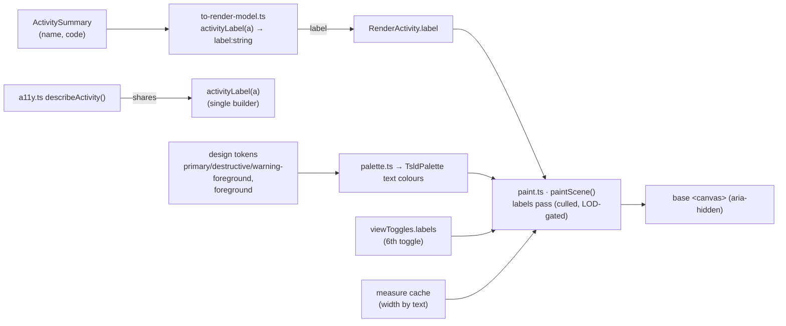
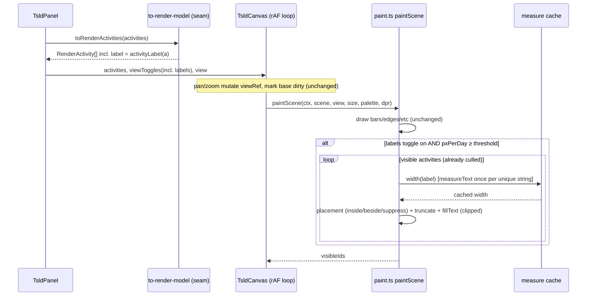
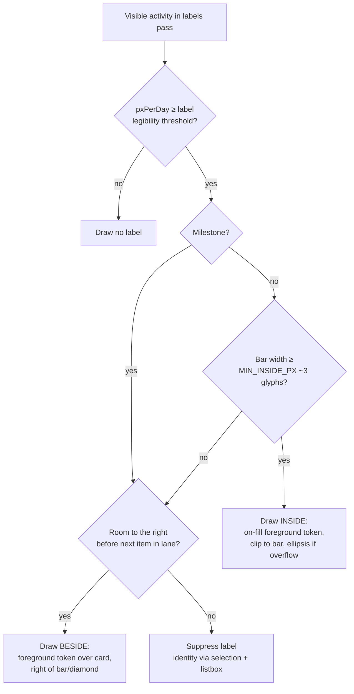

# Feature Spec: On-canvas activity labels for the TSLD canvas

- **Status:** Shipped — `code + name + duration` on the bar, canvas `fillText` (ui-architect
  confirmed), sixth "Labels" toggle default-on; perf re-verified on the corrected spike (p95 9.4ms
  draw @ 2,000 activities, vs 3.6ms labels-off — inside the ADR-0026 ≤16ms 60fps budget).
- **Author(s):** feature-analyst (Claude Code)
- **Date:** 2026-07-13
- **Tracking issue / epic:** TBD (TSLD readability)
- **Roadmap link:** TSLD flagship editing surface (post-M6 readability hardening)
- **Related ADR(s):** ADR-0026 (TSLD canvas — **this is an extension within it**, see §4);
  ADR-0006 (design tokens), ADR-0023 (CPM date convention). No new ADR proposed —
  a `docs/DECISIONS.md` entry, matching the ruler / zoom / constraint-pin / today-marker
  precedent.

## 1. Business understanding

### Problem

The TSLD is sold as a **document you can read** — "a schedule you draw and hand to a
client" (PROJECT_BRIEF §1, §11; Journey 3). Today the canvas draws **unlabelled bars**:
`paint.ts` renders bar fills, criticality outline/dash, constraint pins, dependency
arrows, non-working shading and the today marker, but **no text on or beside any bar**.
Only the ruler carries text (date ticks). Consequently an activity's **identity** is only
discoverable by (a) selecting the bar (which announces + rings it) or (b) reading the
parallel accessible listbox — neither of which lets a planner _scan_ the diagram and read
_which_ bar is which. A wall of anonymous coloured bars is not a legible plan: it fails the
product's core "read it at a glance" promise, makes screenshots/exports useless as
communication, and forces click-to-identify on every bar.

Why now: M1–M6 landed the canvas, editing, criticality/driving arrows, calendars, the
today marker, the multi-row ruler and the full a11y/keymap. Readability of the _bars
themselves_ is the conspicuous remaining gap before the surface reads as a finished plan
document. ADR-0026 D1 **already budgeted for this** ("Text is the dominant cost, and is
budgeted … draw labels only above a per-zoom-level legibility threshold; clip each label to
its bar; cache measured text metrics") — this feature realises that deferred budget.

### Users

- **Planner** (`PLANNER`) — the primary user; builds and reads the plan, needs to scan and
  identify activities without selecting each one.
- **Org Admin** (`ORG_ADMIN`) — same reading needs; also reviews others' plans.
- **Contributor / Viewer** (`CONTRIBUTOR`, `VIEWER`) — read the plan (e.g. to record
  progress, or just to understand it); labels are purely a _read_ affordance and benefit
  every role, including read-only viewers and External Guests on a share link.

This is a **client-only presentation change**: no permission gates it (see §2 Permissions).

### Primary use cases

1. **Read the plan at a glance** — see each activity's name (and code where present) drawn
   on or beside its bar, so the diagram is self-describing without selection.
2. **Identify short bars and milestones** — a 1-day task or a zero-width milestone diamond
   still shows its name (placed beside it, since it has little or no interior width).
3. **Keep the diagram legible while zooming/panning** — labels appear when they fit, shorten
   with an ellipsis when cramped, and disappear when the zoom is too coarse to read them,
   without ever tanking pan/zoom smoothness.
4. **Turn labels off** — a planner who wants the pure critical-path shape (or a denser view)
   toggles labels off, consistently with the existing five view toggles.

### User journeys

- **Happy path.** Planner opens a calculated plan → the diagram renders with each visible
  bar carrying its `code name` inside the bar (clipped with an ellipsis if the name is
  longer than the bar), short bars/milestones carrying their name just to the right → the
  planner reads the plan top-to-bottom without clicking. Zooming out past the legibility
  threshold hides labels (bars stay); zooming back in restores them. See §4 user-flow
  diagram.
- **Alternate — dense region.** Two short bars sit close in one lane; the second's
  beside-label would collide with the next bar, so it is suppressed (the first still shows;
  identity of the suppressed one remains available via selection/listbox). Zooming in gives
  it room and it reappears.
- **Alternate — labels off.** Planner unticks "Labels" in the view controls → all on-canvas
  text disappears immediately (one repaint); the accessible listbox is unchanged.
- **Alternate — editing.** During a drag the moving bar is promoted to the interaction layer
  (no label needed on the ghost); on drop and recalc the base layer repaints and the label
  reappears at the new position. Labels never interfere with hit-testing or gestures.

### Expected outcomes

The TSLD reads as a finished, shareable plan document: a planner (or a client viewing a
share link) can identify every visible activity without interacting. Screenshots and the
future PDF/print path become meaningful. No regression to pan/zoom/drag smoothness or to the
accessibility model.

### Success criteria

- On a calculated plan at day/week zoom, **≥ 95%** of on-screen bars wide enough to hold
  ≥ 3 glyphs show a (possibly truncated) label; milestones and sub-threshold bars that have
  room show a beside-label.
- The visible label text is **always a leading substring of the activity's accessible name**
  (WCAG 2.5.3 label-in-name holds by construction — one shared builder, §4).
- Label text meets **WCAG 2.2 AA contrast (≥ 4.5:1)** over its background (bar fill or card)
  in **both** light and dark themes, verified per token.
- The per-frame **draw stays within the ADR-0026 60fps CPU budget** (draw p95 ≤ 16 ms at the
  2,000-activity ceiling under continuous pan/zoom) — re-measured with labels on via the spike
  harness (corrected to run the real label path) before enabling by default. Measured: **p95
  9.4 ms** with labels (median 6 ms), vs 3.6 ms labels-off in the same harness.
- Turning labels off is a single repaint and produces the exact pre-feature pixels for the
  bar layer.

### Open questions

See the consolidated **Critical questions** at the end of this spec (canvas-text vs
DOM-overlay; which fields to show; togglable layer). Non-blocking defaults are stated inline
and carried into the design.

## 2. Functional requirements

### User stories & acceptance criteria

> **US-1** — As a **Planner**, I want each activity's name drawn on its bar, so that I can
> read the plan without selecting bars.
>
> **Acceptance criteria**
>
> - **Given** a calculated plan **when** the diagram renders **then** every visible task bar
>   wide enough to hold at least 3 glyphs shows its label (`code name`, or `name` when there
>   is no code) inside the bar, vertically centred, left-aligned, clipped to the bar with a
>   trailing ellipsis when it overflows.
> - **Given** a bar too narrow to hold 3 glyphs **when** it renders **then** no text is drawn
>   _inside_ it (it may still be labelled beside it per US-2).
> - **Given** the label is drawn **then** its text is identical to the leading name portion
>   of the activity's accessible listbox entry (`describeActivity`).

> **US-2** — As a **Planner**, I want short bars and milestones labelled beside them, so that
> even zero/low-width items are identifiable.
>
> **Acceptance criteria**
>
> - **Given** a task bar too narrow for an inside label **and** there is clear horizontal
>   room to its right before the next bar in the same lane **when** it renders **then** its
>   label is drawn immediately to the right of the bar in the foreground text colour over the
>   card background.
> - **Given** a milestone (diamond, zero width) **when** it renders **then** its label is
>   drawn to the right of the diamond (never inside).
> - **Given** a beside-label would overlap the next bar or its label in the lane **then** the
>   beside-label is suppressed (not clipped into the neighbour).

> **US-3** — As any viewer, I want labels to stay legible while I zoom and pan, so that the
> diagram is readable at working zoom and uncluttered when zoomed out.
>
> **Acceptance criteria**
>
> - **Given** `pxPerDay` is below the label legibility threshold (bars too narrow to read at
>   e.g. quarter/year zoom) **when** the frame paints **then** **no** labels are drawn.
> - **Given** I pan or zoom **then** labels re-place from the live viewport each repaint with
>   no visible lag or per-frame stutter beyond the ADR-0026 budget.

> **US-4** — As a **Planner**, I want to toggle labels on/off, so that I can choose a labelled
> reading view or a clean critical-path view.
>
> **Acceptance criteria**
>
> - **Given** the view controls **when** I untick "Labels" **then** all on-canvas label text
>   disappears on the next repaint and the bar layer is pixel-identical to the pre-feature
>   canvas; **when** I re-tick it **then** labels reappear.
> - **Given** the "Labels" toggle **then** it renders and behaves exactly like the existing
>   five toggles (labelled checkbox, ≥ 24px target, keyboard-operable), defaulting **on**.

> **US-5** — As a screen-reader user, I want the visible labels to never diverge from the
> accessible representation, so that the sighted and accessible views agree.
>
> **Acceptance criteria**
>
> - **Given** any activity **then** the on-canvas label and the accessible name are produced
>   by **one** shared builder, so they can never disagree (unit-asserted).
> - **Given** the labels layer **then** it changes nothing about the `aria-hidden` canvas, the
>   listbox, `describeActivity`, announcements, or the keymap.

### Workflows

1. **Paint a frame (labels on).** After bars/milestones are drawn, the painter runs a
   **labels pass** over the already-computed visible set: for each visible activity, decide
   placement (inside / beside / suppressed) from bar width, milestone-ness, and lane
   neighbour geometry; measure/truncate using a cached width table; `fillText` clipped to the
   available box in the placement-appropriate colour.
2. **Zoom/pan.** The viewport ref mutates and the base layer is marked dirty exactly as
   today; the labels pass re-runs inside the same repaint from the live viewport snapshot.
3. **Toggle off.** `viewToggles.labels = false` flows through the existing `sceneRef` effect;
   the labels pass is skipped; one repaint.

### Edge cases

- **Empty label.** `name` is never empty (server-validated); `code` may be null → label is
  just `name`.
- **Very long name.** Clipped to the bar with an ellipsis; the full name remains in the
  accessible listbox and on selection.
- **No computed dates.** Activity has no rect (`earlyStart === null`) → not culled in, so no
  label (nothing to place).
- **Overlapping bars in a lane** (a manual same-lane date overlap, TECH_DEBT #24c). Inside
  labels are each clipped to their own bar; a beside-label that would collide is suppressed.
- **Milestone at the far right edge.** Beside-label may be partly off-screen → it is still
  drawn (clipped by the canvas edge, like any near-edge content); culling margin keeps
  near-edge items in the visible set.
- **RTL / non-Latin names.** v1 draws left-aligned LTR (the app is single-locale today,
  CLAUDE.md §17). Note as a known limitation; the shared builder is the future seam for
  bidi/locale handling.
- **2,000-activity ceiling.** Culling bounds the labels pass to the visible set (a few
  hundred bars max on screen); re-verified against the draw budget (§3, §4).

### Permissions

**None specific.** Labels are a read-only presentation of already-authorised data
(`ActivitySummary.name`/`.code`, which every member who can read the plan already receives).
No new endpoint, no RBAC change; the "Labels" toggle is available to every viewer (including
`VIEWER` and External Guest), consistent with the other five view toggles (ADR-0012 unchanged).

### Validation rules

No new input. The label string is derived, not entered: `code ? \`${code} ${name}\` : name`,
trimmed. `name`/`code` are already validated at their existing write endpoints. This is a
**pure client-side derivation**; nothing is persisted.

### Error scenarios

| Scenario                                    | Detection                                           | User-facing result                                                         | Status       |
| ------------------------------------------- | --------------------------------------------------- | -------------------------------------------------------------------------- | ------------ |
| Label text can't fit even 3 glyphs          | width check in the labels pass                      | no inside label (beside or suppressed)                                     | n/a (client) |
| Beside-label would collide with a neighbour | lane-neighbour geometry check                       | beside-label suppressed                                                    | n/a (client) |
| Zoom below legibility threshold             | `pxPerDay` threshold                                | all labels hidden                                                          | n/a (client) |
| Token contrast insufficient in a theme      | design-time contrast audit (accessibility-reviewer) | choose a paired on-fill/foreground token that passes; blocks merge if none | n/a          |

There are no network, auth, or server error paths — this feature adds none.

## 3. Technical analysis

| Area           | Impact             | Notes                                                                                                                                                                                                                                                                                                                                                                                                       |
| -------------- | ------------------ | ----------------------------------------------------------------------------------------------------------------------------------------------------------------------------------------------------------------------------------------------------------------------------------------------------------------------------------------------------------------------------------------------------------- |
| Frontend       | **med**            | New render field (`RenderActivity.label`), a labels pass in `paint.ts`, a width-measure cache, one new view toggle, palette additions. No new component; extends `TsldCanvas`/`TsldPanel`/`TsldViewControls`.                                                                                                                                                                                               |
| Backend        | **none**           | No modules/services/endpoints. `name`/`code` already on `ActivitySummary`.                                                                                                                                                                                                                                                                                                                                  |
| Database       | **none**           | No schema/migration.                                                                                                                                                                                                                                                                                                                                                                                        |
| API            | **none**           | No contract change; `@repo/types` unchanged.                                                                                                                                                                                                                                                                                                                                                                |
| Security       | **none**           | No new data exposed (name/code already returned); no auth surface.                                                                                                                                                                                                                                                                                                                                          |
| Performance    | **med (the crux)** | `fillText`/`measureText` are the dominant Canvas 2D cost (ADR-0026 D1). Mitigations: cull to visible, cache measured widths, cache ellipsis width, LOD/zoom threshold, set font once/frame, avoid per-frame allocation. Re-verify the p95 draw budget.                                                                                                                                                      |
| Infrastructure | **none**           | No services/env/CI/containers.                                                                                                                                                                                                                                                                                                                                                                              |
| Observability  | **none**           | No new logs/metrics. (Optional: fold a labels-on/off count into any existing spike harness note.)                                                                                                                                                                                                                                                                                                           |
| Testing        | **med**            | Unit: the shared label builder, the placement/truncation/threshold pure helpers, the width cache. Painter: labels-pass behaviour with a mocked `Ctx2D` (extended to include `fillText`/`measureText`/`save`/`restore`/`clip`/`rect`/`font`/`textBaseline`/`textAlign`). a11y: label-in-name equality assertion + axe on the panel (unchanged tree). Perf: extend the ADR-0026 spike harness with labels on. |

### Dependencies

- **Prerequisite:** none new — builds entirely on shipped M1–M6 render pipeline
  (`render-model.ts`, `to-render-model.ts`, `paint.ts`, `palette.ts`, `TsldCanvas.tsx`,
  `TsldViewControls.tsx`, `TsldPanel.tsx`, `a11y.ts`).
- **Affected:** `paint.ts` (new pass + `Ctx2D` surface widening), `TsldViewToggles` and its
  three consumers (`paint.ts` defaults, `TsldViewControls`, `TsldPanel` state), the painter
  palette + `palette.ts`/`resolveTsldPalette`, the render model + mapping seam, and
  `a11y.ts` (extract the shared name builder).
- **Interacts with:** TECH_DEBT #28 (canvas colour tokens) — labels **add their own text
  tokens** rather than reusing the fill/stroke tokens flagged there, so this feature does not
  deepen #28 and should be cross-checked by the same accessibility review.
- **Third parties:** none.

## 4. Solution design

### Architecture overview

The change is confined to the **render layer** of `features/tsld/`. The pure render model
gains a plain `label: string`, threaded at the existing `to-render-model.ts` seam (keeping
`paint.ts` free of domain enums, exactly like the `constraint` anchor). `paint.ts` gains a
**labels pass** at the end of `paintScene` (base layer only), gated by a new
`viewToggles.labels` and a zoom threshold, drawing with **new palette text colours**. One
shared `activityLabel(a)` builder is the single source of truth for both the canvas text and
the accessible name in `a11y.ts` (WCAG 2.5.3).

### Data flow

### User flow (label placement / level-of-detail decision)

### Database changes

None.

### API changes

None. `ActivitySummary` already carries `name: string` and `code: string | null`;
`@repo/types` is unchanged.

### Component changes

All within `apps/web/src/features/tsld/`:

- **`render/render-model.ts`** — add `label: string` to `RenderActivity` (a plain, pre-built
  string; the pure model stays domain-enum-free). Add label geometry/threshold constants
  (`LABEL_MIN_PX_PER_DAY`, `LABEL_INSIDE_MIN_PX`, `LABEL_PAD_PX`, `LABEL_GAP_PX`,
  `LABEL_FONT`) and small pure helpers where they aid testing (e.g. `labelPlacement(...)`
  returning `'inside' | 'beside' | 'none'` from bar rect + next-neighbour x + milestone flag,
  and a `truncateToWidth(text, maxPx, measure)` that trims with a cached ellipsis width).
- **`render/to-render-model.ts`** — set `label: activityLabel(a)` in `toRenderActivities`.
- **`render/a11y.ts`** — extract `export function activityLabel(a): string`
  (`a.code ? \`${a.code} ${a.name}\` : a.name`) and have `describeActivity`use it for its`name` const, so the visible label is provably the accessible name's prefix.
- **`render/paint.ts`** — (a) extend the `Ctx2D` type with the text ops
  (`fillText`, `measureText`, `save`, `restore`, `clip`, `rect`, and the `font`,
  `textBaseline`, `textAlign` properties); (b) add `labels: boolean` to `TsldViewToggles`
  and `DEFAULT_VIEW_TOGGLES` (default `true`); (c) add text colours to `TsldPalette`
  (`labelInsideOn`/`labelInsideCritical`/`labelInsideNearCritical` = the paired
  `*-foreground` tokens, and `labelBeside` = `--color-foreground`); (d) the labels pass
  (culled, threshold-gated, cache-backed) after the bars layer and before/aligned with the
  selection ring. A per-`paintScene` measure cache is passed in or held on a module-level
  `WeakMap`/`Map` keyed by text (font is constant), so `measureText` runs at most once per
  unique string across frames.
- **`render/palette.ts`** — resolve the new `--color-*-foreground` / `--color-foreground`
  tokens into the palette (with jsdom fallbacks), same pattern as today.
- **`components/TsldViewControls.tsx`** — add a sixth `{ key: 'labels', label: 'Labels' }`
  entry to `TOGGLES`.
- **`components/TsldPanel.tsx`** — `DEFAULT_VIEW_TOGGLES` already seeds `viewToggles`; the new
  key rides the existing `toggleView`/`viewToggles` plumbing with **no structural change**.
  Legend: optionally add an unobtrusive note; not required.
- **`components/TsldCanvas.tsx`** — **no interface change**; `view` already flows into
  `sceneRef` and the labels pass reads it. The measure cache is created once (a ref) and
  passed to `paintScene`, or lives module-scoped in `paint.ts`.

States: labels are a pure paint of loaded data — no loading/empty/error states of their own
(the panel's existing empty/uncalculated states already gate the whole diagram).

### Implementation approach & alternatives

**Chosen: draw labels in Canvas 2D (`fillText`) as a new culled, LOD-gated pass in the
existing base-layer painter, with a cross-frame measured-width cache and adaptive
inside/beside/suppress placement.** This is the approach ADR-0026 D1 explicitly pre-designed
("draw labels only above a per-zoom-level legibility threshold; clip each label to its bar;
cache measured text metrics; avoid per-frame font string churn"). It keeps one draw pass,
one painter, one culled visible set, and stays **painter-swappable** for a future WebGL
escalation. Contrast is solved token-by-token using the paired **on-fill foreground** tokens
for inside labels (`--color-primary-foreground` over on-schedule, `--color-destructive-
foreground` over critical, `--color-warning-foreground` over near-critical) and
`--color-foreground` over the card for beside labels — both themes, audited by the
accessibility-reviewer. This deliberately **does not reuse** the fill/stroke tokens flagged in
TECH_DEBT #28, so it neither depends on nor deepens that debt.

Performance is held inside the ADR-0026 budget by: **culling** (the pass iterates only the
already-computed `visibleIds` — a few hundred bars, not 2,000); a **measured-width cache**
keyed by the label string (font is fixed, so width is stable across pan/zoom — the cache
warms once and never re-measures on pan), plus a **cached ellipsis width**; a **zoom
threshold** that draws nothing below `LABEL_MIN_PX_PER_DAY`; setting the **font string once
per frame** (not per bar); and **zero steady-state allocation** in the pass. The p95 draw is
re-measured with labels on using the existing `prototypes/tsld-spike/` harness before the
default-on flip (the ADR-0026 evidence-gate discipline).

**Alternatives considered:**

- **Pooled absolutely-positioned DOM overlay (like the ruler labels).** Crisper text and
  browser-native truncation/ellipsis, and the ruler already proves the pool pattern.
  **Rejected as the primary mechanism.** The ruler pool is cheap because on pan **only
  `originX` changes and every label shifts by the _same_ `translateX`** — one style write per
  frame, no per-node work (see DECISIONS 2026-07-12 "Informative TSLD canvas" seam). Activity
  labels do **not** share that property: each bar has an **independent x**, labels move on
  **both** axes (lane pan changes `originY`), and there are an order of magnitude more of them
  than ruler ticks. A DOM overlay would therefore need **per-node repositioning every pan
  frame** across the whole visible set — reintroducing exactly the "thousands of DOM/SVG nodes
  with per-frame transform updates" cost ADR-0026 rejected SVG-per-activity for. Canvas
  `fillText` over the culled set is already O(visible) and batched into the one base-layer
  repaint. (Left open as the escalation if crispness/i18n truncation later demands it —
  flagged for **ui-architect** confirmation, see critical questions.)
- **Show more fields on the bar (dates/duration/float).** **Rejected for v1.** The ruler
  already carries dates; stacking dates/float on bars bloats text cost (the dominant budget
  line) and clutter for little gain. Kept to `code name`; richer per-bar detail stays in the
  accessible listbox (`describeActivity`) and selection. Revisit as an opt-in "detailed
  labels" mode later if asked.
- **Always-inside labels (no beside/suppress).** **Rejected.** Milestones have zero width and
  short bars can't hold text; inside-only would leave the most common construction items
  anonymous. Adaptive placement is the whole point.
- **A new ADR.** **Rejected — extension within ADR-0026**, recorded in `docs/DECISIONS.md`.
  ADR-0026 D1 already fixed the rendering technology, the culling/layering model, the token
  bridge and the **text budget**; this feature only _realises_ that budgeted, named-but-
  deferred capability. It changes no coordinate/viewport/state/interaction/a11y decision, adds
  no dependency, and touches no data model — the same bar every prior TSLD addition (ruler,
  zoom, constraint pins, today marker, driving arrows) cleared with a DECISIONS entry. The one
  genuinely architectural sub-decision — **canvas `fillText` vs DOM overlay** — is recommended
  as canvas-text above; **ui-architect should confirm that call before build** (if they
  preferred a DOM overlay, _that_ would be the larger deviation warranting an ADR).

## 5. Links

- Implementation plan: `docs/plans/tsld-activity-labels.md`
- Related docs updated by this change: `docs/DECISIONS.md` (new entry), and — if the palette
  gains documented tokens — a note in `docs/DESIGN_SYSTEM.md`; ADR-0026 remains the governing
  record (referenced, not amended).
