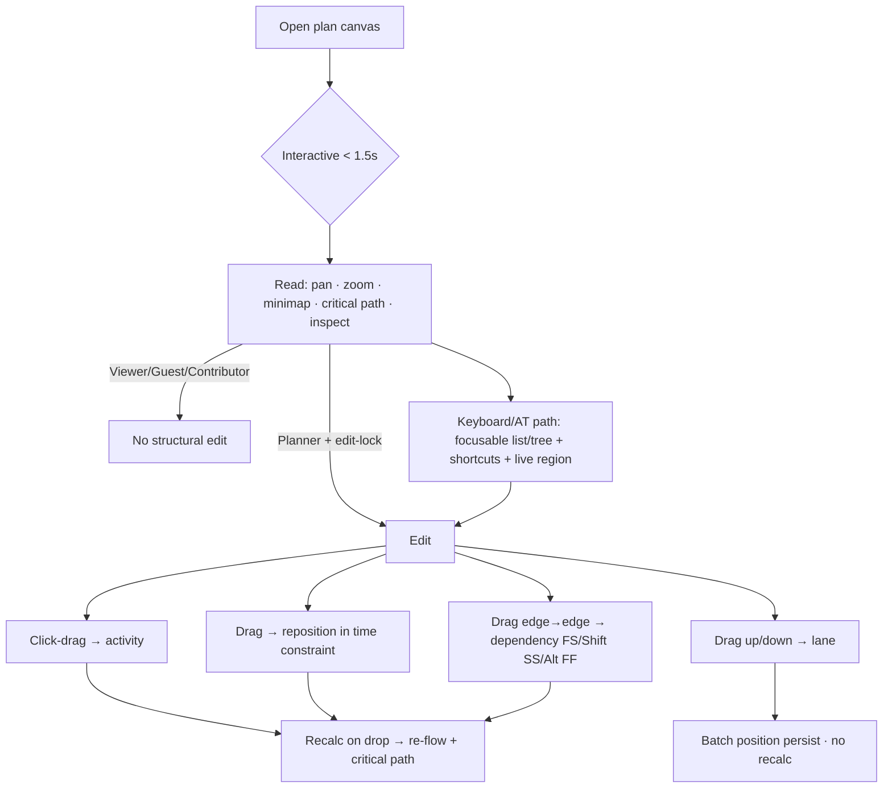

# Feature Spec: Time-Scaled Logic Diagram (TSLD) graphical canvas

- **Status:** Draft
- **Author(s):** Feature Analyst (Product Owner / Solution Architect / Technical Lead hats)
- **Date:** 2026-07-10
- **Tracking issue / epic:** TBD
- **Roadmap link:** [`docs/ROADMAP.md`](../ROADMAP.md) → "The TSLD graphical canvas — the flagship primary editing surface"
- **Related ADR(s):**
  - **ADR-0026 (proposed) — Canvas rendering technology (Canvas 2D vs WebGL).** _Owned and drafted by the **ui-architect** agent, in parallel with this spec._ This spec deliberately **defers** the deep rendering-architecture decision to that ADR and references it; it is the single critical design question (see §1 Open questions and §4).
  - Extends **ADR-0022** (CPM execution & persistence) and **ADR-0023** (scheduling date convention) — the canvas consumes engine outputs and, for driving arrows, requires the engine to emit driving-logic flags (§3, §4).
  - Builds on **ADR-0012/0016** (RBAC + org scope), **ADR-0004/0005/0006/0007** (frontend state/routing/styling/forms), **ADR-0021** (DAG invariant), **ADR-0024** (calendars).

> **Scope note.** This is the largest, most design-heavy milestone in SchedulePoint. It is **design-first** (CLAUDE.md §19/§21). No application code is written at this stage. A companion **ui-architect** agent produces the frontend-architecture design and the canvas-technology ADR-0026 in parallel; this spec owns product understanding, functional requirements, technical analysis, a solution-design **overview**, and a staged implementation plan (in the sibling plan document).

---

## 1. Business understanding

### Problem

SchedulePoint's entire product thesis is that the **Time-Scaled Logic Diagram is the primary way a planner creates and edits a schedule** — not a bar chart, and not a data grid (PROJECT_BRIEF §1, §2, §6). Today the engineering foundation is complete — activities, four dependency types with lag, the DAG invariant, working-day calendars, a synchronous CPM engine, and baselines all exist behind the standard envelopes and RBAC — but **the flagship editing surface does not exist**. Planners can only interact with the schedule through a tabular activities view (M3/M6/M7). Without the TSLD canvas, SchedulePoint is "another Gantt-ish web tool"; with it, it is the browser-native GPM tool the market lacks (PROJECT_BRIEF §6, competitor gap vs Netpoint/P6).

Building it now is correct sequencing: the domain model, the CPM engine, and the persisted graphical `lane_index` column were all built in anticipation of this surface (PROJECT_BRIEF §9; `Activity.laneIndex` already exists). The remaining risk is **rendering performance at scale** (PROJECT_BRIEF §17): the canvas must stay fluid at 500 activities and degrade gracefully at 2,000. That risk is what makes this design-first and what makes the rendering-technology choice an ADR.

### Users

Mapped to the org role set (ADR-0016; PROJECT_BRIEF §5):

- **Planner** (primary persona; holds the plan edit context). Builds and maintains the network: draws activities, drags them through time, pulls logic between them, assigns lanes, reads the critical path. Power user; keyboard-first matters (PROJECT_BRIEF §8 "keyboard-first workflow"). Spends 1–3 hours/day in the schedule.
- **Org Admin.** Superset of Planner on the canvas (full edit).
- **Contributor.** Reads the diagram and updates **progress** on activities (status / % / actual dates) — but **cannot alter logic, dates, or lanes**. On the canvas this is a read + progress-annotate role, not a structural-edit role.
- **Viewer.** Read-only rendering of the diagram: pan, zoom, minimap, critical-path highlight, inspect activities/dependencies. No mutation.
- **External Guest** (per-plan share link, read-only). Same read-only rendering as Viewer, scoped to one plan via a link (share-link infrastructure is a separate feature; the canvas must simply function under a read-only, guest principal — see §3 Dependencies).

**Accessibility persona (first-class, not an afterthought).** A keyboard-only and/or screen-reader planner. A `<canvas>` is opaque to assistive technology, so this milestone must ship a **keyboard interaction model and a parallel accessible representation** of the diagram (§2, §4). This is the hardest accessibility problem in the product and is treated as a functional requirement, not a follow-up.

### Primary use cases

1. **Read a schedule graphically** — open a plan and see activities placed on a time axis by their computed dates, in their lanes, connected by logic arrows, with the critical path highlighted; pan, zoom (day→year), and navigate via a minimap.
2. **Create an activity by click-drag** on the timeline (mouse-down = start, drag right = duration).
3. **Reposition an activity** by dragging it through time (respecting its calendar and constraints) and/or up/down between lanes.
4. **Create a dependency** by dragging from one activity's edge to another (modifier keys pick the type: default FS, Shift = SS, Alt = FF).
5. **See logic drivers at a glance** — live critical-path highlight, near-critical shading, and driving vs non-driving relationship arrows visually distinct, updating after each edit.
6. **Operate the whole surface from the keyboard** and via an accessible non-canvas representation (a11y parity).

### User journeys

Primary reference is PROJECT_BRIEF §10, Journey 1 (green-field build) and Journey 5 (logic what-if). See the user-flow diagram in §4.

- **Happy path — green-field build (Planner).** Planner opens a plan on the canvas → clicks-drags on the timeline to drop the first activity and set its duration → drags a logic line from its finish edge to empty space / another activity to create the successor and the FS tie → repeats; after each structural edit the network re-flows and the critical path re-highlights. Lanes are assigned by dragging activities up/down (optional auto-pack tidies them).
- **Read + progress (Contributor).** Contributor opens the same plan read-only on the canvas, reads the critical path, and updates progress on a slipping activity via the existing progress path (the canvas exposes the progress editor but keeps logic/dates locked).
- **Client review (Viewer / Guest).** Opens the plan and reads the diagram (pan/zoom/minimap/critical path) without the ability to mutate.
- **Keyboard-only planner (a11y).** Tabs into an activity list / diagram tree, arrows between activities and along logic chains, and performs create/move/link/lane operations via keyboard commands with live-region announcements — no pointer required.

### Expected outcomes

- The **graphical view becomes the primary editing surface** it was designed to be (PROJECT_BRIEF §2, §7 target: ≥ 70% of editing sessions in the TSLD, not Gantt — measurable once telemetry lands).
- A planner familiar with Netpoint/P6 can build a **50-activity logic diagram in < 20 minutes on first use** (PROJECT_BRIEF §7).
- SchedulePoint crosses from "foundation" to "usable product" — the differentiator ships.

### Success criteria

Directional and measurable (PROJECT_BRIEF §7, §12, §14; app-specific NFR deltas):

- **Interactivity fps:** sustains **≥ 45 fps** during pan/zoom/drag on a **500-activity** plan; degrades gracefully to **≥ 30 fps** at **2,000** activities (PROJECT_BRIEF §12).
- **Edit feedback latency:** activity create / move / dependency-add shows **visual feedback < 100 ms** (optimistic, local) (PROJECT_BRIEF §14).
- **Time-to-interactive:** plan open → interactive canvas **< 1.5 s (p95) at 500 activities** (PROJECT_BRIEF §14).
- **CPM after edit:** authoritative recalc **< 500 ms (p95) at 500 activities** (existing engine budget; ADR-0022).
- **First-use build:** 50-activity diagram in **< 20 minutes** (usability test with design partners).
- **Accessibility:** WCAG 2.2 AA on all non-canvas controls **and** a documented, tested keyboard + accessible-representation path for every canvas capability (no capability is pointer-only).

### Open questions

> **CRITICAL — answers change design/scope. Defaults stated; the calling agent should confirm via `AskUserQuestion`.**

1. **[CRITICAL] Canvas 2D vs WebGL rendering technology.** _This is THE decision and it is **deferred to ADR-0026**, owned by **ui-architect**, settled by a **prototype-at-scale** benchmark in the design phase (2,000 activities × ~4 deps against the §12 fps budget)._ **Default:** start with **HTML5 Canvas 2D** — a single canvas element with a virtualised (culled) draw loop and layered offscreen caching — because it is the **least deviation from the base's DOM-first posture** (PROJECT_BRIEF §15; no new ADR-worthy deviation if it holds). **Escalate to WebGL only if** the prototype misses the fps budget at 2,000 activities. Either outcome is captured in ADR-0026; if WebGL is chosen, ADR-0026 records the deliberate deviation from DOM-first rendering. This spec's design is written to be **renderer-agnostic** (a `CanvasRenderer` port) so the plan does not block on the answer.
2. **[CRITICAL] Editing model & the plan edit-lock.** The brief assumes a **single-editor-per-plan lock** (PROJECT_BRIEF §5, §21) that is **not yet built**. Does structural editing on the canvas require that lock to land first? **Default:** the canvas ships **read-first** — Milestone 1 (render + pan/zoom/minimap/critical path) has **no lock dependency** and is safe to release immediately. The **edit slices** (create/move/link/lane) treat the **plan edit-lock as a prerequisite** (or, if the lock milestone slips, ship editing behind a flag guarded by **optimistic-locking `version`** conflicts only, accepting last-writer-wins with a conflict banner as an interim). Flagged as a sequencing dependency, not owned here.
3. **[CRITICAL] Recalculate cadence during drag.** The brief aspires to "drag re-flows the network live" (PROJECT_BRIEF §2, §10 Journey 5), but the CPM engine is **server-side and synchronous** (ADR-0022). **Default:** **optimistic local preview during the drag** (the dragged activity and its immediate visual neighbours move under the cursor with no server call), then an **authoritative `POST …/schedule/recalculate` on drop**, after which the canvas reconciles to engine truth. A **client-side incremental CPM preview** (re-flowing the whole visible network live, pre-drop) is **explicitly out of scope for this milestone** and noted as a future enhancement — it is a substantial parallel engine port and risks divergence from server truth.
4. **[CRITICAL] Undo/redo.** Listed Must-have (PROJECT_BRIEF §8, §11) but is a **cross-cutting transactional concern** spanning all model mutations. **Default: OUT of this milestone.** Canvas edits go through the existing REST endpoints; undo/redo is its **own sibling milestone** with a session-scoped command stack. Noted as a dependency/adjacency, not built here. (Interim: destructive canvas actions get confirm affordances and are individually reversible by a second edit.)
5. **[CRITICAL] Layout persistence model (x = time, y = lane).** **Default (confirm):** **vertical position persists** on `Activity.lane_index` (already a column) via a new batch **position** endpoint; **horizontal position is DERIVED** from the computed dates (`earlyStart`/`earlyFinish`) and the active zoom scale — it is **never stored**. This is the essence of a _time-scaled_ logic diagram: x is time, always; only the lane is a stored layout choice. Moving an activity "through time" is really editing its **constraint** (or, in the simplest case, is disallowed for a fully logic-driven activity because the network dictates its dates) — see §2 Workflows for the exact semantics.

> **Non-critical (defaults stated, revisit later):**
>
> - **Auto-pack lane algorithm.** Default: a deterministic greedy first-fit packer (top-down, no lane overlaps in time) offered as an explicit "Auto-arrange lanes" action; manual lane drag remains the primary model (PROJECT_BRIEF §20 default: manual lanes only).
> - **Minimum zoom granularity.** Default: day → week → month → quarter → year discrete steps plus a continuous slider between them.
> - **Selection model.** Default: single-select on the read slice; marquee/multi-select deferred to the edit slices (needed for multi-lane drag / auto-pack).
> - **Milestone/hammock/LOE glyphs.** Default: reuse the domain's activity-type set with distinct glyphs (diamonds for milestones, brackets for hammock/LOE); details in the component design.

---

## 2. Functional requirements

### User stories & acceptance criteria

> **US-1 (Read) — Render the diagram.** As a Viewer/Planner, I want to see the plan's activities placed on a time axis in their lanes and connected by logic, so I can read the schedule graphically.
>
> - **Given** a plan with activities that have computed dates **when** I open the canvas **then** each activity renders as a bar whose **left edge = earlyStart** and **width = duration** at the current zoom, in its `lane_index` row, with a time axis above and today/data-date markers.
> - **Given** activities connected by dependencies **when** the canvas renders **then** each dependency draws as a routed arrow from the correct predecessor edge to the correct successor edge per its type (FS/SS/FF/SF), with lag visually indicated.
> - **Given** milestones/hammocks/LOE activities **then** they render with type-distinct glyphs, not plain bars.
> - **Given** a plan with zero activities **then** an accessible empty state invites the first activity (or, for Viewers, states the plan is empty).

> **US-2 (Read) — Navigate: zoom, pan, minimap.** As any reader, I want to zoom (day→year + slider), pan, and use a minimap, so I can work at large scale.
>
> - **Given** the canvas **when** I change zoom (buttons, slider, or ctrl/⌘-scroll) **then** the time scale changes about the cursor/viewport centre and bars/arrows re-lay-out; the operation sustains ≥ 45 fps at 500 activities.
> - **Given** a diagram larger than the viewport **when** I pan (drag-background / scroll / keyboard) **then** the viewport moves and a **minimap** shows the whole diagram with the current viewport rectangle; clicking the minimap recentres.

> **US-3 (Read) — See the critical path and drivers.** As a reader, I want the critical path highlighted, near-critical activities shaded, and driving vs non-driving arrows visually distinct, so drivers are one glance away.
>
> - **Given** engine outputs **when** the canvas renders **then** `isCritical` activities and the critical chain are highlighted; `isNearCritical` activities are shaded distinctly; **driving** dependency arrows are visually distinct from **non-driving** ones (requires the engine to emit a driving flag — see §3/§4).
> - **Given** meaning is conveyed **then** it is **never encoded in colour alone** (WCAG 1.4.1): critical/near-critical/driving also differ by line weight, pattern, glyph, or label.

> **US-4 (Edit) — Create an activity by click-drag.** As a Planner, I want to click-drag on the timeline to create an activity, so building is direct.
>
> - **Given** edit permission and the edit-lock **when** I mouse-down on empty canvas at time _t_, drag right, and release at time _t+n_ **then** a new activity is created with **start = t (as a start constraint or the plan-relative anchor — see Workflows)** and **duration = n working days**, at the lane under the cursor, with optimistic visual feedback < 100 ms, then persisted and CPM-recalculated on drop.
> - **Given** a drag shorter than one day **then** a **milestone** (0-duration) is offered/created, or a minimum 1-day activity per a stated default.
> - **Given** I release outside the valid canvas area or press `Esc` mid-drag **then** the creation is cancelled with no persistence.

> **US-5 (Edit) — Reposition an activity (time and lane).** As a Planner, I want to drag an activity through time and between lanes, so I can adjust the plan.
>
> - **Given** I drag an activity horizontally **then** the app applies the move as an **imposed date constraint** (default SNET at the dropped start) — respecting the activity's **calendar** (snaps to working days) and rejecting/clamping against existing constraints — then recalculates on drop; the canvas shows the network's re-flowed response.
> - **Given** a fully logic-driven activity with no slack **when** I attempt to drag it earlier than its logic allows **then** the app either clamps to the earliest logically-feasible position or shows a non-destructive "logic-constrained" affordance (no silent data loss).
> - **Given** I drag an activity vertically **then** its `lane_index` changes; on drop the new lane persists via the batch position endpoint (no CPM recalc needed — lane is layout only).

> **US-6 (Edit) — Create a dependency by drag with modifier keys.** As a Planner, I want to pull a logic line between activities, so I can define the network.
>
> - **Given** I drag from an activity's edge to another activity **then** a dependency is created: **default FS**, **Shift = SS**, **Alt = FF** (SF via an explicit menu, since it has no modifier); the current type previews live during the drag.
> - **Given** the new edge would create a **cycle** **then** the create is rejected with a clear message (server enforces the DAG invariant, ADR-0021; the canvas previews validity where cheap).
> - **Given** the edge would duplicate an existing (pred, succ, type) **then** it is rejected as a duplicate (409, existing constraint).
> - **Given** the drop target is empty space **then** (default) a **new successor activity + the tie** are created in one gesture (Journey 1), or the drag is cancelled per a stated default.

> **US-7 (Edit) — Auto-pack lanes (optional).** As a Planner, I want an optional "auto-arrange lanes" action, so I can tidy a messy diagram without hand-placing every activity.
>
> - **Given** I invoke auto-arrange **then** activities are packed into the fewest non-overlapping lanes by a deterministic algorithm; the result persists via the batch position endpoint; the action is a single reversible operation (once undo lands) and is preceded by a confirm since it moves many rows.

> **US-8 (a11y) — Keyboard & accessible representation.** As a keyboard-only or screen-reader planner, I want to operate the diagram without a pointer, so the primary surface is usable by everyone.
>
> - **Given** focus enters the canvas region **then** an accessible parallel representation (a structured, focusable list/tree of activities with their dates, lane, float, critical status, and logic ties) is available and kept in sync with the visual diagram.
> - **Given** keyboard focus on an activity **then** arrow keys move between activities (and along logic chains); documented shortcuts create/move/link/relane; each action announces its result via an ARIA live region.
> - **Given** any canvas capability **then** there exists an equivalent keyboard path (no pointer-only capability). Visible focus indication meets WCAG 2.2 (2.4.7, 2.4.11 focus-not-obscured).

### Workflows

**W-1 Render (open plan).** Route loads → fetch plan + activities + dependencies + schedule summary (existing endpoints) → build the render model (x from dates+scale, y from `lane_index`) → paint axis, lanes, bars, arrows, critical path → attach interaction handlers → interactive.

**W-2 Create activity.** mouse-down (capture start time & lane) → drag (live ghost bar, < 100 ms) → mouse-up → optimistic bar → `POST /activities` (existing) → `POST …/schedule/recalculate` → reconcile canvas to engine truth (dates may shift the ghost) → announce.

**W-3 Reposition (time).** drag-start → live ghost snapped to working days → drop → translate the visual move into a **constraint edit** (`PATCH /activities/:id` with `constraintType`/`constraintDate`, existing DTO) → recalculate → reconcile.

**W-4 Reposition (lane).** vertical drag → drop → `PATCH …/activities/positions` (new batch endpoint) with `{ id, laneIndex, version }[]` → no recalc → done.

**W-5 Create dependency.** drag from edge (type follows modifier) → live preview line + validity hint → drop on target → `POST /dependencies` (existing; server enforces DAG + duplicate) → recalculate → reconcile arrows + driving flags.

**W-6 Auto-pack.** invoke → compute lane assignment client-side → confirm → `PATCH …/activities/positions` (batch) → done.

### Edge cases

- **Empty plan** — designed empty state; first-activity affordance for editors.
- **Maximum scale** — 2,000 activities × ~4 deps: virtualised draw, minimap, graceful fps degradation to ≥ 30 fps; the render model is built incrementally so time-to-interactive stays < 1.5 s at 500.
- **Un-scheduled activities** — activities with null CPM outputs (never recalculated) render in a neutral "not yet scheduled" state at a sensible x (e.g. plan start), not crash.
- **Overlapping bars in a lane** — allowed (lanes are a layout choice, not a mutex); auto-pack is opt-in.
- **Concurrent edit** — without the edit-lock, two editors → optimistic-locking `version` conflict on write → 409 → conflict banner + refetch (no silent overwrite). With the lock, second editor is read-only.
- **Constraint conflict** — dragging into an infeasible position → engine clamps or flags per ADR-0023 moderate-clamping; canvas surfaces the clamp, never loses the user's intent silently.
- **Cycle attempt** — rejected by the server (ADR-0021); canvas shows why and rolls back the optimistic arrow.
- **Very long durations / off-screen edges** — arrows to off-viewport activities route to the viewport edge with an indicator; minimap shows the full extent.
- **Zoom extremes** — at year scale a day is sub-pixel: bars clamp to a minimum drawable width; at day scale over a multi-year plan, virtualisation culls off-screen content.
- **Mid-drag disconnect** — buffer the unsaved edit locally and show a reconnect banner (PROJECT_BRIEF §12 offline behaviour); do not attempt divergent reconciliation.

### Permissions

Deny-by-default, RBAC + org scope, always checked in the activity's/plan's organisation (anti-IDOR; ADR-0012). No **new** backend permissions are introduced beyond a possible batch-position guard; the canvas reuses existing activity/dependency/schedule permissions:

| Capability                                             | Permission (existing)                                    | Roles                                                           |
| ------------------------------------------------------ | -------------------------------------------------------- | --------------------------------------------------------------- |
| Render / read diagram, pan/zoom/minimap, critical path | `activity:read`, `dependency:read`, `schedule:read`      | Org Admin, Planner, Contributor, Viewer, (Guest via share link) |
| Create/move activity, edit constraints                 | `activity:create` / `activity:update`                    | Org Admin, Planner                                              |
| Set lane (batch position)                              | `activity:update` (extended to the batch position route) | Org Admin, Planner                                              |
| Create/edit/delete dependency                          | `dependency:*`                                           | Org Admin, Planner                                              |
| Trigger recalculate                                    | `schedule:recalculate`                                   | Org Admin, Planner                                              |
| Update progress (annotate)                             | `activity:progress` (existing Contributor split)         | + Contributor                                                   |

### Validation rules

Reuse the existing shared client↔server rules (Zod on web, class-validator on API) — the canvas must not fork them:

- **Duration** ≥ 0 int (0 only for milestones — existing `IsZeroWhenMilestone`).
- **Constraint** type+date paired (existing `IsConstraintPaired`), date is a calendar date (existing `IsCalendarDate`).
- **`laneIndex`** 0…10000 int (existing `UpdateActivityDto` bound) — the batch endpoint reuses it.
- **Dependency** type ∈ {FS,SS,FF,SF}; `lagDays` signed, bounded −3650…3650 (existing CHECK + DTO); no cycle (ADR-0021); no duplicate (pred,succ,type) among active rows (existing partial unique).
- **Optimistic locking** `version` required on every mutation (existing).

### Error scenarios

| Scenario                                          | Detection                   | User-facing result                                     | Status        |
| ------------------------------------------------- | --------------------------- | ------------------------------------------------------ | ------------- |
| Reader attempts an edit gesture                   | RBAC guard                  | edit affordances hidden; if forced, friendly forbidden | 403           |
| Edit without the plan edit-lock (once lock ships) | lock check                  | "someone else is editing" banner, read-only            | 409           |
| Concurrent write, stale `version`                 | optimistic lock             | conflict banner + refetch; no overwrite                | 409           |
| Dependency would create a cycle                   | server DAG check (ADR-0021) | rollback optimistic arrow + explain                    | 409/422       |
| Duplicate dependency (pred,succ,type)             | partial unique              | rollback + "already linked"                            | 409           |
| Invalid duration/constraint payload               | DTO validation              | inline error, no persistence                           | 422           |
| Constraint makes activity infeasible              | engine clamp (ADR-0023)     | clamp surfaced, intent preserved                       | 200 (clamped) |
| Not a member of the org / wrong org               | scope check                 | forbidden                                              | 403           |
| Recalculate fails/timing out                      | engine error                | keep optimistic state, "recalc failed, retry" toast    | 5xx           |

---

## 3. Technical analysis

| Area               | Impact      | Notes                                                                                                                                                                                                                                                                                                                                                                                                                                                                                                                                                                                                                        |
| ------------------ | ----------- | ---------------------------------------------------------------------------------------------------------------------------------------------------------------------------------------------------------------------------------------------------------------------------------------------------------------------------------------------------------------------------------------------------------------------------------------------------------------------------------------------------------------------------------------------------------------------------------------------------------------------------- |
| **Frontend**       | **high**    | New `tsld` feature (feature-first, ADR-0004): a renderer-agnostic canvas surface, viewport/interaction state (mostly local + URL for zoom/pan bookmarking), render-model builder (dates+scale→geometry), interaction controllers (create/move/link/lane), overlays (minimap, axis, inspector), and the **accessible parallel representation**. Server state via TanStack Query; edits reuse existing mutations + a new batch-position mutation. New route composes the feature (routes compose features; features import shared only). **The deep rendering architecture is designed by ui-architect (ADR-0026), not here.** |
| **Backend**        | **low–med** | No new module. One **new endpoint**: batch **activity positions** (`PATCH …/activities/positions`) to persist lane changes efficiently (multi-select drag / auto-pack) instead of N single PATCHes. Extend the **CPM engine** to compute & persist **driving-logic** flags (see Database/API). Everything else reuses existing activities/dependencies/schedule endpoints.                                                                                                                                                                                                                                                   |
| **Database**       | **med**     | (1) **`ActivityDependency.is_driving`** column — **absent today** and required for US-3 (driving vs non-driving arrows). Engine-owned output, like `Activity.isCritical`; nullable/defaulted, never client-set. (2) `Activity.lane_index` already exists — **no migration** for lanes; only a new write path. Design with **database-architect**.                                                                                                                                                                                                                                                                            |
| **API**            | **med**     | New batch-position endpoint (envelope, RBAC, optimistic locking per row). `is_driving` added to the dependency response DTO and set by the recalculate flow (extends ADR-0022's engine-owned batched write). No versioning break (additive). Update `docs/API.md` + OpenAPI. Review with **api-reviewer**.                                                                                                                                                                                                                                                                                                                   |
| **Security**       | **med**     | All canvas reads/writes stay behind existing deny-by-default guards + org scope (anti-IDOR): every activity/dependency/position write re-checked in the plan's org. Batch-position endpoint must validate every id belongs to the plan/org and enforce `activity:update`. Rate-limit the recalc/position endpoints against drag-storms. Review with **security-reviewer**.                                                                                                                                                                                                                                                   |
| **Performance**    | **high**    | The defining constraint (PROJECT_BRIEF §12/§17). Client: virtualised/culled draw loop, layered caching, rAF-batched input, decoupling pan/zoom (cheap, no server) from structural edits (recalc on drop). Server: recalc already < 500 ms at 500; batch-position must be a single transaction, not N. Prototype-at-scale (2,000 activities) is a **design-phase gate**. Reviews: **performance-reviewer** (frontend fps/bundle/render) + **backend-performance-reviewer** (batch write, recalc, N+1).                                                                                                                        |
| **Infrastructure** | **low**     | No new services. Export/PDF (which would add a headless-browser worker) is out of scope.                                                                                                                                                                                                                                                                                                                                                                                                                                                                                                                                     |
| **Observability**  | **med**     | Client perf telemetry (fps during interactions, time-to-interactive, edit-feedback latency) to prove the §12/§14 NFRs; view-mode telemetry to measure the ≥ 70% TSLD-usage success metric (PROJECT_BRIEF §7). Server: existing correlation/logging on the endpoints; add metrics on batch-position + recalc volume.                                                                                                                                                                                                                                                                                                          |
| **Testing**        | **high**    | Unit (render-model geometry: dates+scale→pixels, arrow routing, lane packing, hit-testing — all pure and highly testable). Component (interaction controllers with simulated pointer/keyboard). API/e2e (Supertest) for the batch-position endpoint + `is_driving` on recalc. Playwright e2e for the critical journeys **including a11y checks** (keyboard path + accessible representation). A **performance harness** at 500 & 2,000 activities. Design with **test-engineer**.                                                                                                                                            |

### Dependencies

- **ADR-0026 (rendering technology)** — owned by **ui-architect**; the prototype-at-scale gate settles Canvas 2D vs WebGL before the render slice hardens. The render-model and interaction layers are designed renderer-agnostic so build can start in parallel.
- **Engine driving-logic output** — the CPM engine must emit driving-relationship flags for US-3; this extends ADR-0022's engine-owned write and needs `ActivityDependency.is_driving` (database-architect + a short ADR/DECISIONS entry, since it touches the engine contract).
- **Plan edit-lock** — prerequisite (or interim flag) for the **edit** slices (Open question 2). The **read** milestone has no such dependency.
- **Share-link (External Guest) infrastructure** — needed only for the Guest read path; the canvas itself is read-role-agnostic. Not blocking.
- **Existing features (all delivered):** activities CRUD + progress, dependencies + DAG, CPM recalculate/summary, calendars, baselines — the canvas is a new surface over these, reusing their endpoints and envelopes.
- **Undo/redo** — adjacent sibling milestone (Open question 4); not blocking but the canvas edit commands should be shaped so a later command-stack can wrap them.

---

## 4. Solution design

> **Overview only.** The authoritative rendering-architecture design (render loop, layering, WebGL/Canvas2D internals, scene graph, hit-testing strategy) is produced by **ui-architect** and recorded in **ADR-0026**. This section frames how the canvas fits the existing system, the data flow, the user flow, and the schema/API/component deltas — without duplicating ADR-0026.

### Architecture overview

The TSLD is a new **feature-first** frontend module rendering over the existing REST API. Its internals separate a pure **render model** (testable geometry) from a swappable **renderer port** (Canvas 2D now, WebGL if ADR-0026 says so) and from **interaction controllers** that translate gestures into existing mutations.

```mermaid
flowchart LR
  subgraph Web["@repo/web — tsld feature"]
    RT[Route: plan canvas] --> VS[Viewport & interaction state<br/>local + URL zoom/pan]
    Q[TanStack Query<br/>activities · deps · schedule] --> RM[Render model builder<br/>dates+scale → geometry<br/>lane → y]
    VS --> RM
    RM --> RP[[CanvasRenderer port<br/>Canvas2D | WebGL — ADR-0026]]
    RM --> A11y[Accessible representation<br/>focusable list/tree + live region]
    IC[Interaction controllers<br/>create · move · link · lane] --> M[Mutations]
    RP --> IC
    A11y --> IC
  end
  subgraph API["@repo/api (NestJS) — existing + deltas"]
    AC[activities] ; DC[dependencies] ; SC[schedule/recalculate] ; PC[activities/positions ★new]
  end
  M -->|POST/PATCH| AC
  M -->|POST| DC
  M -->|PATCH batch| PC
  M -->|POST recalculate| SC
  Q -->|GET| AC & DC & SC
  SC -.->|engine sets isCritical/float + is_driving ★| DB[(PostgreSQL)]
  PC --> DB
  AC & DC --> DB
```

### Data flow — create activity then recalc (representative edit)

```mermaid
sequenceDiagram
  participant U as Planner
  participant C as Canvas (render model + renderer)
  participant Q as TanStack Query cache
  participant A as API (guards, DTO)
  participant E as CPM engine (sync)
  participant DB as PostgreSQL
  U->>C: mouse-down @t, drag right, release @t+n
  C->>C: optimistic ghost bar (<100ms), lane from cursor
  C->>A: POST /activities { planId, durationDays=n, laneIndex }
  A->>DB: INSERT (org/plan scoped, version=1)
  A-->>C: 201 { data: activity }
  C->>A: POST /plans/:id/schedule/recalculate
  A->>E: run forward/backward pass
  E->>DB: batched write: dates, float, isCritical, is_driving ★
  A-->>C: 200 { data: summary }
  C->>Q: invalidate activities+deps+schedule
  C->>C: reconcile geometry to engine truth; announce (live region)
```

### User flow



### Database changes (design sketch — not committed; design with database-architect)

- **`ActivityDependency.is_driving`** — **new** boolean, engine-owned (mirrors `Activity.is_critical`): `is_driving Boolean @default(false) @map("is_driving")`. Nullable-or-defaulted, **never** client-settable; set by the recalculate batched write. Backfill defaults to `false`; a recalc populates truth. This is the only schema addition.
- **`Activity.lane_index`** — **already exists** (Int, default 0, mapped). **No migration.** Only a new write path (batch endpoint) is added.
- No new tables/indexes anticipated; existing plan/org-scoped indexes on activities/dependencies serve the canvas's plan-scoped bulk reads. Confirm with database-architect whether the driving-arrow read benefits from any index (likely not — it's read as part of the existing dependency list).

### API changes (follow docs/API.md; review with api-reviewer)

| Method  | Path                                                              | Permission             | Body / Returns                                                             | Notes                                                                                                                                    |
| ------- | ----------------------------------------------------------------- | ---------------------- | -------------------------------------------------------------------------- | ---------------------------------------------------------------------------------------------------------------------------------------- |
| PATCH   | `/api/v1/plans/:planId/activities/positions`                      | `activity:update`      | `{ positions: { id, laneIndex, version }[] }` → `200 { data: Activity[] }` | **New.** Single transaction; per-row optimistic lock; every id validated in the plan/org (anti-IDOR). Backs multi-lane drag + auto-pack. |
| POST    | `…/schedule/recalculate`                                          | `schedule:recalculate` | (existing)                                                                 | **Extended:** engine now also writes `ActivityDependency.is_driving`.                                                                    |
| GET     | `…/dependencies`                                                  | `dependency:read`      | (existing)                                                                 | **Extended:** response DTO includes `isDriving`.                                                                                         |
| (reuse) | `POST /activities`, `PATCH /activities/:id`, `POST /dependencies` | existing               | existing                                                                   | create/move/constraint/link all reuse existing contracts.                                                                                |

Additive, non-breaking → minor SemVer (pre-1.0). Update `docs/API.md` + OpenAPI.

### Component changes (design system only; no one-off styling; theme-aware; design with ui-architect + component-reviewer)

- **`TsldCanvas`** — the surface: mounts the renderer port, owns the render loop, forwards input. Renderer internals per ADR-0026.
- **`TimeAxis`, `LaneGutter`, `Minimap`, `ZoomControls`** — chrome around the canvas, built from design-system primitives (buttons, sliders, tokens).
- **`ActivityInspector` / `DependencyInspector`** — side panel (shadcn/ui) for details + the progress editor (reuses existing progress dialog) and constraint/logic editors (reuse existing RHF+Zod forms).
- **`TsldAccessibleView`** — the parallel accessible representation: a focusable, ARIA-annotated list/tree of activities with dates/lane/float/critical/logic, plus keyboard command handling and an ARIA live region. **First-class deliverable**, not an add-on.
- **States:** loading (skeleton axis + spinner within the 1.5 s budget), empty (first-activity affordance / "plan empty" for viewers), error (retry), read-only (edit affordances hidden). All tokenised, light/dark.

### Implementation approach & alternatives

**Chosen approach.** A **renderer-agnostic layered design**: pure render-model + `CanvasRenderer` port + interaction controllers that reuse existing endpoints, with an **accessible parallel representation** as a peer of the visual canvas. Start on **Canvas 2D** (least deviation from DOM-first, PROJECT_BRIEF §15) and **prototype at 2,000 activities in the design phase** to decide, via **ADR-0026 (ui-architect)**, whether to escalate to WebGL. Editing is **optimistic-local preview → authoritative recalc on drop**. Layout persistence is **x = time (derived), y = lane (stored)**.

**Alternatives considered.**

- **DOM/SVG per-activity rendering.** Most accessible and simplest, but does not survive 2,000 nodes × arrows at ≥ 30 fps — fails the core NFR. Rejected as the primary renderer (its ideas inform the _accessible representation_, which is DOM).
- **WebGL from day one.** Best raw performance ceiling, but maximal deviation from DOM-first, higher build/maintenance cost, and harder text/hit-testing — unjustified until the prototype proves Canvas 2D insufficient. Deferred to the ADR-0026 gate.
- **Client-side live CPM during drag.** Matches the "re-flow live" aspiration but duplicates the engine on the client (divergence risk, large scope). Deferred; optimistic-local-preview + recalc-on-drop is the v1 compromise.
- **Storing x-position.** Rejected — it contradicts a _time-scaled_ diagram; x must always derive from computed dates.

### Explicitly out of scope (this milestone)

Gantt view (separate later projection, PROJECT_BRIEF §8/§11); **undo/redo** (sibling milestone); **resources** and resource lanes; **real-time multi-editor collaboration**; **layout auto-arrange beyond the simple opt-in auto-pack**; **PDF/print export of the canvas** (needs the server-side PDF worker); XER/MPP import; client-side incremental live CPM; marquee multi-select beyond what lane drag/auto-pack need.

## 5. Links

- Implementation plan: [`docs/plans/tsld-canvas.md`](../plans/tsld-canvas.md)
- Rendering ADR (parallel, ui-architect): **ADR-0026 (proposed)** — Canvas rendering technology
- Related docs to update on build: `docs/API.md`, `docs/DATABASE.md`, `docs/FRONTEND_ARCHITECTURE.md`, `docs/ROADMAP.md`, OpenAPI spec, `CLAUDE.md` (if standards shift)
