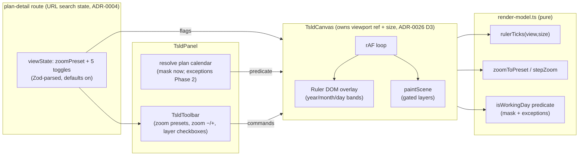
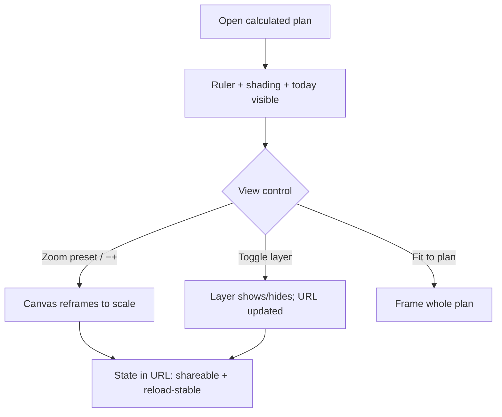

# Feature Spec: Informative TSLD canvas (readability + view-control upgrade)

- **Status:** Draft — **awaiting approval before implementation**
- **Author(s):** Feature Analyst / Claude
- **Date:** 2026-07-12
- **Tracking issue / epic:** _tbd_
- **Roadmap link:** Scheduling core / TSLD — canvas readability & view controls
  (`docs/ROADMAP.md`)
- **Related ADR(s):** **none new.** Stays within **ADR-0026** (TSLD canvas:
  layered/culled Canvas 2D, ruler labels as DOM chrome, parallel focusable a11y
  layer, ≤4 ms p95 draw budget), **ADR-0024** (working-day calendars: weekday
  mask + dated exceptions), **ADR-0023** (date convention / data date),
  **ADR-0006** (semantic tokens). One **`docs/DECISIONS.md`** entry is warranted
  for the view-state ownership + viewport-snapshot seam (see §4).

> **Verification finding (read first).** Before designing, the current code was
> read end-to-end. Two brief assumptions turned out to be wrong in our favour and
> shape the scope:
>
> 1. **The working-day calendar is already exposed to the web client.**
>    `PlanSummary.calendarId` is on the loaded plan, the org calendars list
>    (`CalendarSummary.workingWeekdays`, the 7-bit mask) is **already fetched** in
>    `plan-detail.tsx` (`useCalendars(orgSlug)` → `PlanCalendarPicker`), and the
>    full calendar **with `exceptions`** is reachable through the **existing**
>    `useCalendar(orgSlug, calendarId)` hook + `GET /organizations/:org/calendars/:id`
>    endpoint (returns `CalendarDetail`). **Non-working-day shading therefore needs
>    no new API and no backend work** — a de-risking of the brief's flagged
>    dependency. It is still delivered in two phases for slice size (mask first,
>    exceptions second), but both phases are client-only.
> 2. **The ruler is DOM, not canvas.** `paint.ts` already declares "the ruler
>    labels are DOM chrome" and ADR-0026 §125 fixes each zoom stop's ruler tick
>    granularity. We honour that: the multi-row ruler is a DOM overlay synced to
>    the viewport transform; gridlines stay canvas-drawn (existing Layer 1,
>    extended to day/month/year variants).

## 1. Business understanding

### Problem

SchedulePoint's Time-Scaled Logic Diagram (TSLD) is the product's primary editing
surface, but today the canvas is hard to _read_ as a time-scaled document. It draws
a single weekly gridline set, activity bars, logic and criticality — but it has:

- **no time-scale ruler** — nothing along the top tells a planner _which_ dates a
  column represents, so the "time-scaled" diagram doesn't actually show the scale;
- **no discrete zoom control** — zoom is wheel-only and continuous, so a planner
  can't jump to a Day / Week / Month / Quarter / Year view or nudge in/out with a
  button (a keyboard/touch user has no zoom affordance at all);
- **no "today"** — there's no marker for the current date, so a planner can't see
  the plan's state relative to now at a glance;
- **no non-working shading** — weekends and holidays look identical to working
  days, so bar durations read misleadingly against the calendar;
- **no way to declutter** — gridlines/markers can't be switched off.

The product owner's previous prototype had all of this (a multi-row year→month→day
ruler that adapts to zoom, Day/Week/Month/Quarter/Year presets + zoom −/+, a red
dashed TODAY marker, non-working shading, and checkbox layer toggles) and read far
better. This slice brings that **readability + view-control** layer to the current
canvas — **without** touching scheduling logic, editing, or the backend.

**Why now:** on-canvas structural editing (M2, ADR-0026/0028) has shipped and is on
by default; planners now spend real time on the canvas, and its unreadability as a
time document is the top friction. This is a pure presentation/UX upgrade over an
architecture already designed to host it.

### Users

Organisation members (ADR-0012 / ADR-0016). This slice is **read-only view
control** — it changes nothing about who may _edit_:

- **Planner / Org Admin** — the primary audience: read the time scale, jump zoom
  levels, locate today, judge durations against working/non-working days, and
  declutter the canvas while planning.
- **Contributor / Viewer** — identical read-only benefit; view controls are
  available to every member who can see the diagram (they mutate no data).
- **External Guest** — out of scope (per-plan share is a later feature), but
  nothing here would block it: the controls are presentation-only.

### Primary use cases

1. **Read the time scale** — a multi-row ruler across the top shows year → month →
   day bands that auto-adjust granularity to the current zoom and stay in sync with
   pan/zoom.
2. **Change zoom by preset** — click Day / Week / Month / Quarter / Year (or zoom
   −/+) to reframe the timeline at a known scale; the existing **Fit to plan** stays.
3. **Locate today** — a labelled TODAY vertical marker shows the current date on the
   timeline (when it falls within the plan's range).
4. **See non-working days** — weekend/holiday columns are shaded so bar durations
   read correctly against the working calendar.
5. **Declutter** — toggle Day grid / Month grid / Year grid / Today line /
   Non-working on and off; the choice persists across reloads and is shareable.

### User journeys

**Happy path.** A Planner opens a calculated plan. The canvas now shows a
year→month→day ruler along the top and light shading on weekends. They click
**Month** in the toolbar's zoom presets; the ruler collapses its day row and the
view reframes to month scale, the shading re-tiling to match. They spot the red
dashed **TODAY** line and see which bars are behind it. Finding the day grid noisy
at this zoom, they untick **Day grid**; the fine gridlines disappear, the choice is
remembered next visit. They click **Fit to plan** to reframe the whole schedule.

**Alternate — keyboard/touch user.** The zoom presets and toggles are real,
labelled buttons/checkboxes: a keyboard user tabs to the **Week** preset and presses
Enter to zoom, and toggles **Non-working** with Space — capabilities previously only
reachable by mouse wheel (which had no keyboard equivalent at all). The parallel
focusable activity listbox (ADR-0026 §7) is unchanged; the new visual cues are
`aria-hidden` canvas paint and add no interaction to it.

**Alternate — plan with no calendar.** A plan whose `calendarId` is null works
all-days (ADR-0024). The **Non-working** toggle then has nothing to shade; it stays
present but shades nothing (and can be shown disabled with an explanatory title).

**Alternate — today outside the range.** If "today" is before the plan start or
after its finish, the TODAY marker is simply off-screen until the planner pans to
it (it is drawn at its true day offset like any other layer; it is not clamped).

### Expected outcomes

- The canvas reads as a genuine time-scaled document: every column's date is legible
  from the ruler, at any zoom.
- Planners can reach a known scale (Day…Year) and today in one action, by
  mouse **or** keyboard.
- Durations read truthfully against working vs non-working days.
- The canvas can be decluttered to taste, and the preference sticks.

### Success criteria

- The ruler shows the correct year/month/day bands for the current viewport at every
  zoom stop, proven by unit tests over the pure tick model, and repaints in sync with
  pan/zoom with no visible lag.
- Each zoom preset sets the documented `pxPerDay` (`ZOOM_STOPS`) and reframes about
  the viewport centre; zoom −/+ step within `clampPxPerDay` bounds.
- All five toggles gate their layer, are keyboard-operable and labelled (WCAG 2.2
  AA), and their state survives a reload and is encoded in the URL (shareable).
- The added layers keep the canvas within the **≤4 ms p95 @ 2,000 activities** draw
  budget (ADR-0026) — verified by the existing perf harness; new layers are culled to
  the viewport and drawn in batched passes.
- No regression to editing, hit-testing, the a11y listbox, or theming (axe + existing
  Playwright journeys stay green).

### Open questions

> Each has a **recommended default** so work is not blocked. Only Q1–Q3 are
> **CRITICAL** (their answers change design or scope); the rest are stated defaults.

- **Q1 (CRITICAL) — non-working shading source & phasing.** The plan's calendar
  (mask **and** exceptions) is already reachable client-side (verification finding
  #1). **Default: Phase 1 shades the weekly mask** (from the already-loaded
  `CalendarSummary`, zero extra fetch — weekends for the Standard Mon–Fri calendar,
  any non-worked weekday generally); **Phase 2 adds dated exceptions** (holidays /
  worked-Saturdays) via the existing `useCalendar` detail fetch. Both are client-only;
  **no backend addition**. _Alternative:_ ship exceptions in Phase 1 too — rejected
  only to keep each slice thin and independently releasable, not for any technical
  blocker. If the PO wants holidays in the first release, fold F2 into F1 (still no
  backend work).
- **Q2 (CRITICAL) — where view-toggle + zoom-preset state lives.** **Default: URL
  search params on the plan-detail route (TanStack Router)** for the five toggles and
  the active zoom preset, so the configured view is **shareable and reload-stable**
  (ADR-0004: URL state in the router), with sensible defaults (grids on, today on,
  non-working on) so a bare URL still reads well. The live pan/zoom _viewport_ stays
  ref-authoritative inside the canvas (ADR-0026 D3 — per-frame writes never go through
  setState); only the discrete preset choice is URL state. _Alternative:_ localStorage
  or component state — rejected: not shareable / not reload-stable respectively. A
  lighter fallback (component state only) is acceptable if the router surface proves
  awkward, at the cost of shareability — call it out at build.
- **Q3 (CRITICAL) — does the ruler render inside the canvas host or as a sibling
  toolbar row.** **Default: a DOM overlay rendered _inside_ `TsldCanvas`** (which owns
  the authoritative viewport + measured size), positioned along the top edge and
  updated from the same rAF loop, so it can never desync from the transform. The
  presets/toggles live in the **toolbar row above** (`TsldToolbar`), commanding the
  canvas through a small imperative seam. _Alternative:_ lift the whole viewport into
  React state and render the ruler as a sibling — rejected (violates ADR-0026 D3's
  per-frame-ref rule and risks jank). **This seam is the one part warranting
  ui-architect review + a DECISIONS entry** (§4).
- _Non-critical (defaults, no need to answer):_ **ruler granularity per zoom stop** —
  day columns at `day`/`week`, month bands at `month`/`quarter`, year bands at `year`,
  with a chosen-by-`pxPerDay` rule so continuous wheel zoom between stops also adapts;
  **today source** — the browser's local date, floored to a calendar day, mapped to a
  day offset about `plannedStart` via the existing `daysBetween` (no server "now");
  **toggle defaults** — all on except optionally Day grid off at coarse zoom;
  **colours** — all from existing semantic tokens (non-working = a muted `--color-muted`
  wash; today = `--color-destructive` dashed), no new tokens; **mobile** — toolbar
  controls wrap and the ruler stays a fixed-height top band.

## 2. Functional requirements

### User stories & acceptance criteria

> **US-1** — As a planner, I want a multi-row time-scale ruler along the top of the
> canvas that adapts to zoom, so I can read what dates the columns represent.
>
> - **Given** a calculated plan **when** the canvas renders **then** a ruler shows
>   stacked bands (year row → month row → day row) labelling the visible time range.
> - **Given** I pan or zoom **when** the viewport transform changes **then** the
>   ruler labels move and re-tile in lock-step with the bars beneath them (no drift).
> - **Given** I zoom out past a threshold **then** the finest row drops out (day →
>   month → year) so labels never overlap or crowd; zooming back in restores it.

> **US-2** — As a planner, I want zoom presets and zoom −/+, so I can jump to a known
> time scale by mouse or keyboard.
>
> - **Given** the toolbar **when** I click **Day / Week / Month / Quarter / Year**
>   **then** the canvas reframes to that stop's `pxPerDay` (`ZOOM_STOPS`), anchored on
>   the viewport centre, and the active preset is visually indicated (`aria-pressed`).
> - **Given** I click zoom − or zoom + **then** `pxPerDay` steps down/up within the
>   `clampPxPerDay` bounds, cursor/centre-anchored, and the buttons disable at the
>   min/max bound.
> - **Given** I use only the keyboard **then** every preset and zoom button is
>   reachable (Tab) and operable (Enter/Space) with a visible focus ring.
> - **Given** I click **Fit to plan** (unchanged) **then** the whole computed plan is
>   framed as today.

> **US-3** — As a planner, I want to switch canvas layers on and off, so I can
> declutter, and have my choice remembered.
>
> - **Given** the toolbar **when** I toggle **Day grid / Month grid / Year grid /
>   Today line / Non-working** **then** the corresponding canvas layer shows/hides
>   immediately.
> - **Given** I reload or share the URL **then** the same toggle + zoom-preset state is
>   restored (URL search params).
> - **Given** a screen-reader user **then** each toggle is a labelled control whose
>   pressed/checked state is announced.

> **US-4** — As a planner, I want a labelled TODAY marker, so I can see the plan's
> state relative to now.
>
> - **Given** the **Today line** toggle is on and today falls within the drawn range
>   **then** a vertical dashed marker in the destructive/attention token appears at the
>   day offset for today, with a small "TODAY" label.
> - **Given** today is outside the current viewport **then** the marker is simply not
>   on screen (drawn at its true offset, revealed by panning) — never clamped to an
>   edge that would misreport the date.
> - **Given** the marker is a visual-only cue **then** it does not appear in, or alter,
>   the a11y listbox (the canvas stays `aria-hidden`).

> **US-5** — As a planner, I want non-working days shaded, so bar durations read
> correctly against the calendar.
>
> - **Given** the **Non-working** toggle is on and the plan has a calendar **when** the
>   canvas renders **then** columns for non-worked weekdays (per the plan calendar's
>   `workingWeekdays` mask) are shaded with a muted wash behind the bars.
> - **(Phase 2)** **Given** the calendar has dated exceptions **then** holiday
>   (non-working) exception days are also shaded and worked-exception days are not,
>   overriding the weekly mask for those dates.
> - **Given** the plan has no calendar (`calendarId` null) **then** the toggle shades
>   nothing (and may be shown disabled with an explanatory title).
> - **Given** shading is on **then** the draw budget is still met (the band is one
>   culled, batched fill pass over visible columns, drawn beneath the gridlines/bars).

### Workflows

1. **Render ruler** — from the live viewport + measured width, the pure tick model
   produces the visible year/month/day bands; the DOM overlay renders them and the rAF
   loop keeps their transform synced to the canvas.
2. **Zoom by preset** — the toolbar commands the canvas to set `pxPerDay =
ZOOM_STOPS[level]`, anchored on the viewport centre; the active preset is derived
   from current `pxPerDay` for the pressed state; the choice is written to the URL.
3. **Toggle a layer** — the toolbar flips a boolean in URL state; the panel passes the
   flags to the canvas, which gates the matching paint layer (and the ruler rows).
4. **Draw today** — the canvas maps the local calendar date to a day offset about
   `plannedStart` and paints a dashed vertical + label when the Today toggle is on.
5. **Shade non-working** — the panel resolves the plan's calendar (mask from the loaded
   list; Phase 2 exceptions from `useCalendar`) into a pure "is day D working?"
   predicate; the canvas paints a wash over visible non-working columns when the
   Non-working toggle is on.

### Edge cases

- **Uncalculated plan** — the diagram already hides until recalculated; the ruler,
  today marker and shading appear only alongside the drawn bars (unchanged gate).
- **`plannedStart` null** — no diagram (existing behaviour); nothing to add.
- **Extreme zoom** — at `year`, day gridlines/labels are suppressed (would be
  sub-pixel); at `day`, year band spans wide but stays a single culled label. Tick
  generation is bounded by the visible span, never the plan span.
- **Very long plans (multi-year)** — ruler bands and shading are generated only for
  the visible day range + margin (viewport-culled), so cost is O(visible columns),
  independent of plan length.
- **DST / timezone** — all day math stays UTC-calendar-day via the existing
  `daysBetween`/`addCalendarDays` (ADR-0023); "today" is the local calendar day
  floored to `YYYY-MM-DD`. No wall-clock arithmetic on the canvas.
- **Theme switch** — the ruler (DOM) and new paint layers read the same tokens; the
  existing `MutationObserver` repaint-on-theme path covers the canvas layers.
- **Calendar changed elsewhere** — shading reflects the currently-cached calendar;
  on calendar edit the existing query invalidation refreshes it (no special handling).
- **Toggle state absent/garbled in URL** — parse defensively; fall back to defaults
  (grids/today/non-working on) so a hand-edited or stale URL never breaks the view.

### Permissions

| Action                                   | Permission             | Roles (deny-by-default)  |
| ---------------------------------------- | ---------------------- | ------------------------ |
| Read the diagram + use view controls     | `activity:read` (view) | every member (Viewer up) |
| Edit the schedule (unchanged, pen-gated) | `activity:update`      | Planner, Org Admin       |

**No new permissions.** Every control in this slice is presentation-only and mutates
no server state; they are available to anyone who can already see the diagram. Org
scoping, the pen (ADR-0028) and optimistic locking are untouched.

### Validation rules

- **No server validation** — nothing is written. The only inputs are URL search
  params: the zoom preset must be one of `ZoomLevel` (`day|week|month|quarter|year`)
  and each toggle a boolean; parsed with a Zod schema (client-only) that falls back to
  defaults on anything invalid. `pxPerDay` continues to be clamped by the existing
  `clampPxPerDay`.
- The non-working predicate consumes the existing, already-validated
  `workingWeekdays` mask (`WorkingWeekdays` helpers in `@repo/types`) and
  `CalendarExceptionSummary` shape — no new domain rules.

### Error scenarios

| Scenario                              | Detection                    | User-facing result                         | Status |
| ------------------------------------- | ---------------------------- | ------------------------------------------ | ------ |
| Malformed view state in URL           | client Zod parse of search   | fall back to default view (no error shown) | n/a    |
| Plan has no calendar for Non-working  | `calendarId === null`        | toggle shades nothing / shown disabled     | n/a    |
| Calendar detail fetch fails (Phase 2) | query error on `useCalendar` | mask-only shading (graceful degrade)       | n/a    |
| Today outside range                   | day offset off-screen        | marker simply not visible until panned     | n/a    |

No new API means no new HTTP error codes; every failure degrades gracefully to a
still-usable canvas.

## 3. Technical analysis

| Area           | Impact | Notes                                                                                                                                                                                                       |
| -------------- | ------ | ----------------------------------------------------------------------------------------------------------------------------------------------------------------------------------------------------------- |
| Frontend       | med    | pure ruler/zoom math in `render-model.ts`; new paint layers in `paint.ts`; ruler DOM overlay + viewport seam in `TsldCanvas`; presets+toggles in `TsldToolbar`; URL view-state in `plan-detail`/`TsldPanel` |
| Backend        | none   | no module/service/endpoint change — the calendar is already exposed                                                                                                                                         |
| Database       | none   | no schema change                                                                                                                                                                                            |
| API            | none   | consumes existing `GET /organizations/:org/calendars` (list) + `/:id` (detail); no new/changed contract                                                                                                     |
| Security       | none   | read-only presentation; existing org scope + read gating unchanged; no new input reaching the server                                                                                                        |
| Performance    | med    | new culled/batched paint layers must hold the ≤4 ms p95 @ 2,000 budget (ADR-0026); Phase 2 adds one cached calendar-detail query                                                                            |
| Infrastructure | none   | —                                                                                                                                                                                                           |
| Observability  | none   | —                                                                                                                                                                                                           |
| Testing        | med    | unit (ruler ticks, zoom presets, non-working predicate); component/axe (toolbar presets+toggles keyboard-operable); paint-layer unit; extend a Playwright journey; perf-harness assertion                   |

### Dependencies

- **Prerequisite (already met):** ADR-0026 canvas (render model + painter + host),
  `ZOOM_STOPS`/`clampPxPerDay`/`zoomAt`/`fitToContent` (present), the toolbar/panel,
  and the calendar exposure (`useCalendars`, `useCalendar`, `PlanSummary.calendarId`,
  `WorkingWeekdays` helpers) — **all present**; no prerequisite work.
- **Affected features:** `features/tsld` (render/paint/components), `plan-detail`
  route (URL search schema + passing calendar + view state), `features/calendars`
  (read-only reuse of the detail hook in Phase 2).
- **Third parties:** none. **Must land first:** nothing — this is additive over
  shipped code.

## 4. Solution design

### Architecture overview

The upgrade adds three pure, unit-testable capabilities to the render model (ruler
ticks, zoom-preset math, a non-working predicate), a handful of gated paint layers to
the painter, a DOM ruler overlay inside the canvas host synced to the viewport, and
view-control UI in the toolbar backed by URL state. It introduces **no** new module,
service, endpoint, or ADR — it fills in the layers ADR-0026 already anticipated.



### Data flow — zoom preset & non-working shading

```mermaid
sequenceDiagram
  participant U as Planner
  participant TB as TsldToolbar
  participant R as plan-detail (URL search)
  participant C as TsldCanvas (viewport ref)
  participant M as render-model (pure)
  U->>TB: Click "Month"
  TB->>R: set search { zoom: 'month' }
  R-->>C: prop zoomPreset='month'
  C->>M: zoomToPreset(view, size, ZOOM_STOPS.month)
  M-->>C: new Viewport (centre-anchored)
  C->>C: viewRef = new; mark dirty
  C->>M: rulerTicks(view,size) + isWorkingDay(day) per visible col
  M-->>C: bands + non-working columns
  C-->>U: repaint (ruler re-tiles, weekend/holiday wash re-lays)
```

### User flow



### Database changes

**None.**

### API changes

**None.** Reuses the existing calendars endpoints (list already fetched on the route;
detail via the existing `useCalendar` hook in Phase 2). No new/changed DTO, path, or
status code.

### Component changes

Design-system primitives + tokens only (no one-offs):

- **`render/render-model.ts`** (pure, unit-tested — where this math belongs):
  - `rulerTicks(view, size)` → the visible `{ year[], month[], day[] }` bands (each a
    label + screen-x range), generated over the visible day span only (culled), with a
    granularity rule keyed off `pxPerDay` so continuous zoom adapts too.
  - `zoomToPreset(view, size, pxPerDay)` and `stepZoom(view, size, factor)` — reframe
    about the viewport centre (reusing `zoomAt`/`clampPxPerDay`); `presetOf(pxPerDay)`
    for the toolbar's active-state.
  - `isWorkingDay(dayOffset, dataDate, calendar)` — a pure predicate from the weekday
    mask (`WorkingWeekdays.has`) plus an exceptions map (Phase 2), used by the painter
    to decide which columns to shade.
- **`render/paint.ts`** — extend with **gated** layers, each culled + batched to stay
  in budget, drawn in the right z-order (non-working wash **below** the gridlines;
  today line **above** bars, below selection): `nonWorking`, `dayGrid`/`monthGrid`/
  `yearGrid` (the existing weekly Layer 1 generalises into these), `todayLine`. A
  `TsldViewToggles` flag object on the scene gates them; palette gains
  `nonWorking` + `today` entries resolved from `--color-muted` / `--color-destructive`.
- **`components/TsldCanvas.tsx`** — render the **ruler DOM overlay** inside the host
  (it owns the viewport + measured size), updated from the existing rAF loop so it
  never desyncs; accept `viewToggles` + `zoomPreset` props and a small imperative seam
  (callback props or a ref handle) so the toolbar can command zoom. Viewport stays
  ref-authoritative (ADR-0026 D3). New DOM is `aria-hidden` chrome; the a11y listbox is
  untouched.
- **`components/TsldToolbar.tsx`** — add a zoom-preset segmented control
  (Day/Week/Month/Quarter/Year with `aria-pressed`), zoom −/+ buttons (disabled at
  bounds), and a labelled checkbox group for the five toggles. Reuses `Button` and a
  shadcn checkbox/toggle primitive; wraps responsively on mobile.
- **`components/TsldPanel.tsx`** — thread `viewToggles`/`zoomPreset` + the resolved
  calendar predicate from props to the canvas; extend the visible **legend** with
  "Today" and "Non-working" entries (matching the canvas, non-colour-safe).
- **`routes/plan-detail.tsx`** — own the view state as URL search params (Zod schema,
  defaults on), resolve the plan's calendar (mask from the already-loaded list; Phase 2
  the `useCalendar` detail), and pass both down. **This is the only route touched.**

### Implementation approach & alternatives

**Chosen:** keep the split ADR-0026 already prescribes — **pure math in the render
model, cheap culled layers in the painter, DOM chrome for labels, ref-authoritative
viewport** — and add the readability layer entirely on the client, reusing the
already-exposed calendar. State that is discrete and worth sharing (zoom preset + five
toggles) lives in the URL; the continuous live viewport stays in the canvas ref. Ship
in thin vertical slices (ruler → presets → toggles → today → shading) so `main` stays
releasable after each.

**Alternatives considered:**

- _Draw the ruler on the canvas_ — rejected: contradicts ADR-0026 ("ruler labels are
  DOM chrome"), makes text theming/scaling/selection harder, and adds text-shaping to
  the draw budget. A DOM overlay is cheaper and accessible.
- _Lift the whole viewport into React state to drive ruler/presets_ — rejected:
  violates ADR-0026 D3 (per-frame writes must not go through setState) and risks jank;
  we publish only discrete preset choices to state and keep the live transform in a ref.
- _localStorage / component state for toggles_ — rejected as the default: not
  shareable / not reload-stable; URL search params satisfy both (ADR-0004). Component
  state is an acceptable lighter fallback if the router surface proves awkward, at the
  cost of shareability.
- _Add a backend "canvas calendar" endpoint_ — rejected: unnecessary — the mask and
  exceptions are already exposed; inventing an endpoint would violate "reuse before
  inventing" and expand scope into the backend for no benefit.

**No new ADR.** The change stays inside ADR-0026/0024/0023/0006. It does introduce two
small, durable decisions — (a) **view-toggle + zoom-preset state lives in URL search
params**, and (b) **the ruler is a DOM overlay inside the canvas host, updated from the
rAF loop, with the viewport staying ref-authoritative** — which warrant a
**`docs/DECISIONS.md`** entry (not an ADR, as they refine rather than change ADR-0026).
**ui-architect should review the viewport-snapshot / imperative command seam before
build** (Q3) — it is the one non-obvious architecture point.

## 5. Links

- Implementation plan: [`docs/plans/tsld-informative-canvas.md`](../plans/tsld-informative-canvas.md)
- Related docs likely touched: `docs/DECISIONS.md` (view-state + ruler-overlay seam),
  `docs/ROADMAP.md` (mark the item delivered), a changeset (**minor**, pre-1.0, web).
  No `docs/API.md` / `docs/DATABASE.md` / ADR change.
