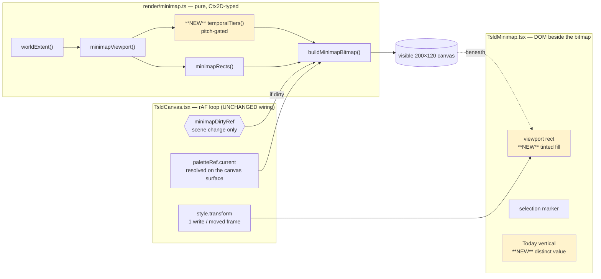
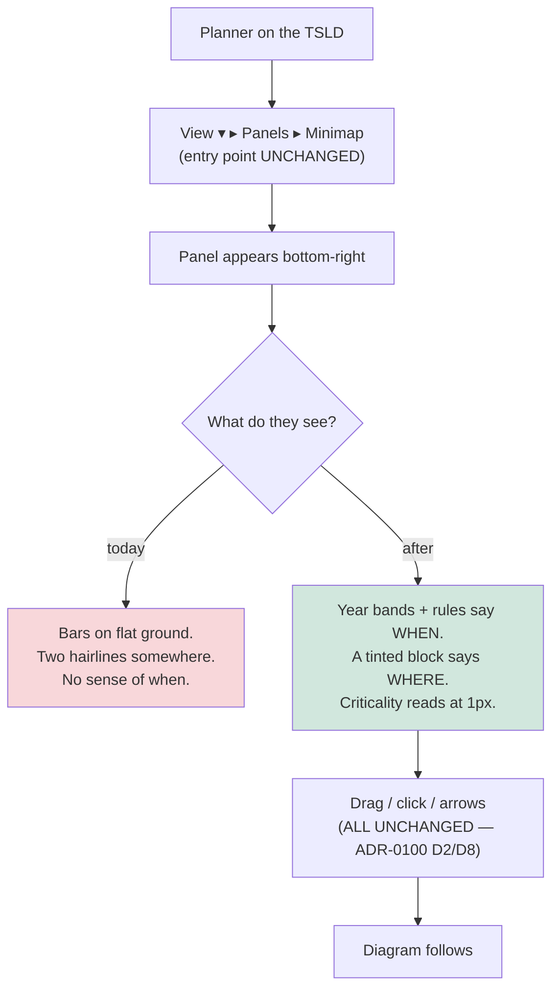

# Feature Spec: TSLD minimap — visual redesign

- **Status:** Approved — 2026-09-14, product owner, all three critical questions answered
  with the recommendation (see "Open questions" below)
- **Author(s):** Claude (feature-analyst), for the product owner
- **Date:** 2026-09-14
- **Tracking issue / epic:** —
- **Roadmap link:** — (a design pass on a shipped Should-have; not a roadmap item)
- **Related ADR(s):** amends **ADR-0100** (D5, D7, D9); builds on ADR-0055/0097/0102
  (surface scopes + the single theme), ADR-0056 (gridline tiers), ADR-0059 (the shared time
  axis), ADR-0063 (the AT set-equality invariant), ADR-0088 D1 (no `VITE_` flag), ADR-0105
  (why this is a full spec). **A new ADR is required** — see §4.9.

---

## 0. Evidence base — what was read, and what could not be run

**Every decision-bearing claim below names the file and line, or the arithmetic, that
established it** (ADR-0076, `docs/PROCESS.md` "Decision-bearing claims carry their
evidence"). Two honesty statements come first, because they bound what this spec is worth.

### 0.1 The instrument I could not use

**`Bash` was disabled for this session.** I could not run `shoot.mjs`, `pnpm test`, a
Playwright suite, or any measurement harness. Consequently:

- **No fresh screenshot was taken**, and **no screenshot of the minimap exists in the
  repository** to look at (`Glob **/plan-workspace-minimap*` → no files; the harness writes
  to an ignored output directory). The shot **is** in the list
  (`apps/web/scripts/shoot.mjs:423-432`, `name: 'plan-workspace-minimap'`, added by
  ADR-0102's 12 → 25 widening), so "nobody has ever looked at it" is **false** and this spec
  does not say it. What is true is narrower: **nobody has looked at it since the product
  owner's complaint, and I could not.**
- **Every number in §1 and §3 is either read from a file or arithmetic on a figure already
  recorded in this repository.** None is an observation I made. Each is labelled.
- **Taking the screenshot is therefore M0-T1**, and it is a blocking task, not a
  formality. ADR-0099 records the first correct screenshot of the plan workspace showing
  "what no measurement had reported"; ADR-0101 records a four-scrollbar editor reaching a
  user because the shot list stopped at the route. §4's option ranking is a **hypothesis
  ordering that M0-T1 may re-order**, and §4.10 states what would falsify it.

### 0.2 The brief is not evidence, and four of its claims moved

The request reached me as a briefing. Per `docs/PROCESS.md` and ADR-0076 Class 3, each
inherited claim was re-checked against the file. Four changed, and each change altered the
design:

| Briefed claim                                                                    | What the file says                                                                                                                                                                                                                                                                                                                                                                                                                                                                                       | Consequence                                                                                                                                                                                                                                                                  |
| -------------------------------------------------------------------------------- | -------------------------------------------------------------------------------------------------------------------------------------------------------------------------------------------------------------------------------------------------------------------------------------------------------------------------------------------------------------------------------------------------------------------------------------------------------------------------------------------------------- | ---------------------------------------------------------------------------------------------------------------------------------------------------------------------------------------------------------------------------------------------------------------------------- |
| "I found nothing anticipating a visual-richness request; confirm that."          | **Partly false.** The v1 _spec directory_ anticipates nothing (grep for `visual\|appearance\|pop\|basic` over `docs/specs/tsld-minimap/` returns only unrelated hits). But the M4 **ux gate** did: `docs/TECH_DEBT.md` #155 item 1 (`:4270-4273`) says the rectangle's drag affordance is cursor-only and — verbatim — _"If first-contact feedback says otherwise, **corner ticks or a faint fill** are the shape."_ Its 2026-08-28 triage (`:4262-4265`) routes items 1–3 to _"a minimap design pass"_. | **The trigger has fired and this epic is its named home.** My ranked hypothesis 1 is #155.1's own prescribed remedy. §4 adopts it and the epic closes #155 items 1 and 3.                                                                                                    |
| The old app's viewport indicator was a "rectangle".                              | **It was a full-height vertical BAND, and time-only.** `schedule-canvas.css:67-74` sets `top: 0; height: 100%`, and `updateMinimapViewport()` (`schedule-canvas.html:326-327`) writes **only `left` and `width`**.                                                                                                                                                                                                                                                                                       | The old app's indicator was far **louder** (a 100px-tall amber band) while carrying **less** information (one axis). The "pop" came from area, not from precision — and we must not buy the area by dropping the lane axis. §4.1.                                            |
| The old per-activity colour options were "green/blue/purple/teal/magenta/brown". | Eight, not six: `activity-editor.js:20` — `['red', 'green', 'blue', 'orange', 'purple', 'teal', 'magenta', 'brown']`.                                                                                                                                                                                                                                                                                                                                                                                    | **Strengthens the decline.** The old palette contained **red and orange**, which in SchedulePoint are _critical_ and _near-critical_ (`render/palette.ts:163,164`). Reproducing the scatter would not merely dilute the semantics, it would **collide** with them. §4.8 D-1. |
| Non-working shading was one of the old app's channels.                           | It was **opt-in and default-off**: `schedule-canvas.html:146` gates it on `localStorage.getItem('colorNonWorkingDays') === 'true'`, which is `null` until set.                                                                                                                                                                                                                                                                                                                                           | The old minimap's **default** appearance had seven channels, not eight. The thing being compared against did not have weekend shading. §4.8 D-2.                                                                                                                             |

Everything else in the brief verified as written, including the whole `drawMinimap()`
inventory, our five `fillRect` layers, the `MINIMAP_BOX` of 200×120
(`TsldMinimap.tsx:43`), and the unfilled two-hairline rectangle
(`TsldMinimap.tsx:435-444`).

### 0.3 The register's own claim about this code, re-checked

`docs/specs/tsld-minimap/input-architecture.md:100` justifies omitting temporal structure
like this:

> "Month bands, hatch, gridlines — **All LOD-gated off far above minimap scale**
> (`NON_WORKING_MIN_PX`, `DAY_GRID_MIN_PX`) — including them ADDS work the scene itself
> refuses at this zoom."

**This is false for month and year gridlines, and ADR-0100 D5 inherited it.** Read
`render/paint.ts:951-957`:

```
if (toggles.dayGrid && view.pxPerDay >= DAY_GRID_MIN_PX) { … }   // ← gated
if (toggles.monthGrid) strokeTier(bounds.months, …);              // ← NOT gated
if (toggles.yearGrid)  strokeTier(bounds.years,  …);              // ← NOT gated
```

`DAY_GRID_MIN_PX = 6` (`paint.ts:103`) and `NON_WORKING_MIN_PX = 3` (`paint.ts:105`) are
both **px-per-day** floors gating **day-pitch** work. Neither touches the month or year
tier: the scene draws both at _every_ zoom, including the Year preset. So the premise
"the scene itself refuses this at this zoom" does not hold for the two tiers a whole-plan
picture would actually want.

**That does not make month gridlines viable** — §3.3 measures the real constraint, which is
**pitch**, and it refuses month rules on long plans for a reason the original never stated.
The point is that the rejection was reasoned from the wrong constant, so the design space it
closed was never actually examined. This is exactly ADR-0058's rule (_verify the claim; do
not trust the document_) applied to a decision input.

---

## 1. Business understanding

### Problem

The product owner, after using the released application:

> _"Next thing we should look at is the minimap, it is extremely basic in appearance and
> doesn't pop like the old minimap of the old repo used to."_

They then chose a full spec over a one-line fix, so the ask is to design this rather than
tweak it.

**The complaint is accurate and this spec does not treat it as taste.** The minimap ships
five semantic marks drawn in **three colours with no second channel**, and two pairs of
those five are **literally the same colour**. Read `render/palette.ts`:

| #   | Mark                                     | Where drawn               | Token                               | Collides with |
| --- | ---------------------------------------- | ------------------------- | ----------------------------------- | ------------- |
| 1   | Non-critical bar                         | `minimap.ts:259-262`      | `--primary` (`palette.ts:162`)      | —             |
| 2   | Critical bar                             | `minimap.ts:274-280`      | `--destructive` (`:163`)            | —             |
| 3   | Critical fringe (the WCAG 1.4.1 channel) | `minimap.ts:268-273`      | `--foreground` (`:167`, `outline`)  | **#4**        |
| 4   | Data-date vertical                       | `minimap.ts:284-287`      | `--foreground` (`:182`, `dataDate`) | **#3**        |
| 5   | Today vertical (DOM)                     | `TsldMinimap.tsx:423-430` | `var(--destructive)`                | **#2**        |

On the scene these five are told apart by channels the minimap does not have: Today is
**dashed** and carries a pill (ADR-0056 F6b), the data date carries its own pill, and the
fringe is an outline around an 18px-tall bar. In a 200×120 box every one of them is a
1px-ish rectangle. **The Today line and a one-day critical activity are the same 1px red
mark**; the data-date line and a critical bar's fringe are the same 1px light mark.

> **Why no gate reports this, and it is worth reading.** `minimap-budget.test.ts:25-31`
> sets its fixture palette to `outline: '#f2f4f8'` with the comment _"distinct from
> dataDate so the fringe assertions can tell them apart"_ — the test fixture **diverges
> from production at exactly the collision**, because the assertions could not be written
> otherwise. `token-contrast.test.ts`'s minimap block (`:339-408`) asserts the _rectangle
> frame_ against three grounds and has no pair for any of these five against each other.
> The collision is invisible to the unit tier by construction and to the contrast matrix by
> scope.

Three further deficits, each verified:

- **No temporal structure at all.** The picture is bars on a flat ground. A planner cannot
  tell, from the minimap, whether they are looking at eighteen months or eleven years —
  which is the first thing the shape of a programme should say. §3.3.
- **The viewport rectangle has no fill.** `TsldMinimap.tsx:435-444` is `border: 1px` +
  `outline: 1px` at `outlineOffset: -2px` and **no `background`**. The one element the eye
  is meant to track is two hairlines, and `sceneWindowRect` floors it at **8×8 px**
  (`minimap.ts:176-177`) — so at the Day preset on a long plan the thing a planner is
  looking for is an 8px empty square in a 200×120 picture. The old app's was a **full-height
  amber band over a 10% amber wash** (`schedule-canvas.css:67-74`).
- **The WCAG 1.4.1 criticality fringe almost never fires.** `CRITICAL_FRINGE_MIN_H = 3`
  (`minimap.ts:95`) and row height is `box.height / laneCount` (`minimap.ts:125`), so the
  fringe needs **`laneCount ≤ 40`**. _Arithmetic on the epic's own recorded lane counts_
  (`docs/specs/tsld-minimap/feature-spec.md:85-88`): the 540-activity plan packs to **41
  lanes → 2.93 px/row**, and the 2,160-activity programme to **274 lanes → 0.44 px/row**.
  **Neither plan the epic measured gets the fringe** — the first misses by 0.07 px. So on
  every plan measured, criticality in the minimap is conveyed by **hue alone**.

### Why now

The complaint is first-contact feedback on a released surface from the only person using
it, and it fires a trigger that was written down and left armed: `docs/TECH_DEBT.md`
#155.1's _"if first-contact feedback says otherwise"_. ADR-0100 D7 likewise says of hover
_"Revisit after M4 with real use"_ — this is that use. A design pass that never happens
because nobody complained loudly enough is the failure `docs/TECH_DEBT.md` #155's triage
already anticipated by naming "a minimap design pass" as items 1–3's home.

### Users

Unchanged from ADR-0100: **everyone who reads a plan.** Navigation is a read (ADR-0063
M4b, ADR-0080), so this is **not pen-gated** and carries **no new permission and no
permission change**. The role table in `docs/specs/tsld-minimap/feature-spec.md:111-117`
stands verbatim, including **External Guest** — `/share` renders the same `TsldPanel`
(`GuestPlanView.tsx:227`), so every change here reaches a guest with no sign-in, which is
the audience with the least prior model of the plan and therefore the most to gain from a
legible picture.

### Primary use cases

The five in ADR-0100 are unchanged. This epic serves the two that the current picture
serves worst:

1. **Read the shape** — see where the critical path runs, and _when_ the programme runs,
   across the whole plan (today: hue-only criticality on a dateless flat ground).
2. **Locate** — find the viewport rectangle at a glance (today: two hairlines, floored at
   8×8).

### User journeys

**Happy path (unchanged entry point).** Planner opens a large plan → `View ▾` → **Panels ▸
Minimap** → the panel appears bottom-right → **they see immediately where in the programme
they are** (a tinted, bordered block, not two hairlines) and **roughly when** (year bands
and rules under the bars) → they drag the block → the diagram follows.

**The journey does not change.** Every gesture, key, announcement and Escape rung in
ADR-0100 D2/D8 is untouched. This epic changes what the surface **looks like**, not what it
does — which is what makes the whole thing revertible at a commit boundary (§3.5).

### Expected outcomes

- A planner can find the viewport without hunting for it.
- A planner can tell a two-year plan from a ten-year one from the picture alone.
- Criticality survives at sub-3px rows (today it does not — it is hue-only).
- Today and the data date stop being indistinguishable from bars.

### Success criteria

| #      | Criterion                                                                                                                                                                                                                                        | How it is known                                                                                                                                              |
| ------ | ------------------------------------------------------------------------------------------------------------------------------------------------------------------------------------------------------------------------------------------------ | ------------------------------------------------------------------------------------------------------------------------------------------------------------ |
| **V1** | The product owner, shown the before/after screenshots at the same widths, says the complaint is answered                                                                                                                                         | M0-T1 shot + M5 re-shot, both attached to the review                                                                                                         |
| **V2** | Five distinct marks are told apart by **more than hue**: no two of {non-critical, critical, critical-emphasis, data date, Today} resolve to the same token, and criticality carries a non-hue channel **at every row height including sub-3 px** | new assertions in `minimap.test.ts` + a `token-contrast.test.ts` distinctness block, each verified red first (ADR-0110 D5)                                   |
| **V3** | The bitmap build stays **O(activities) + O(temporal tiers)** with zero text work, zero per-bar strokes and a **stated, asserted** style-write count                                                                                              | the amended `minimap-budget.test.ts` — the count changes, the _shape_ does not (§4.5)                                                                        |
| **V4** | The bitmap is still rebuilt on scene change only — **zero** rebuilds on a pan-only frame or a selection change                                                                                                                                   | `TsldCanvas.hidden-pane.test.tsx`'s existing S3 spy assertion passes **unchanged** (ADR-0100 S3). An edit to it is the signal the epic did more than it says |
| **V5** | Temporal tiers are admitted by **measured pitch**, never by a hard-coded tier choice; the rule is one function with unit cases at both measured plan spans                                                                                       | `minimap-tiers.test.ts`, new                                                                                                                                 |
| **V6** | `e2e-minimap/minimap.spec.ts` passes **unchanged in its assertions**, including the axe scan with `target-size` enabled                                                                                                                          | the suite, re-run; any assertion edit is justified in the PR                                                                                                 |
| **V7** | No new `fillText`/`measureText`/`strokeRect` unless §4.6's amendment is explicitly approved, and then only where the amendment says                                                                                                              | the budget gate                                                                                                                                              |
| **V8** | `docs/TECH_DEBT.md` #155 items 1 and 3 close, or are re-filed with a reason                                                                                                                                                                      | the register, at M5                                                                                                                                          |

> **V4 is the one that matters most and is the cheapest to lose.** ADR-0100's entire
> performance argument is that the picture is invariant, so the build is off the pan path.
> Every option in §4 is designed to keep the build on the scene-change path; nothing here
> proposes changing _when_ it runs. §3.4 states what would have to happen if anything did.

### Open questions

> **ANSWERED — 2026-09-14, product owner: "go with your recommendations for all three."**
> So: **CQ-1 approved for temporal tiers only** — fills and batched strokes, no text — and
> **declined** for year labels, endpoint dots and links, each on the measurement in §4.6.
> **CQ-2: inside tint.** **CQ-3: size unchanged at 200×120.**
>
> Two things that answer does **not** settle, recorded so nobody reads it as wider than it
> is. It is an answer to the questions **as measured**, and every figure behind them is a
> file read or arithmetic — §0.1 says so, and M0-T1 is blocking precisely because none of it
> was seen. If the screenshot fires one of §4.10's five rows the answer stands and the
> **ranking** changes, which is what that table is for; CQ-3 in particular is re-opened by
> its own row rather than closed by this approval. And the CQ-1 approval is to amend
> ADR-0100 D5 **in the direction §4.6 measures** — it is not standing authority to relax the
> budget gate for whatever a later milestone finds convenient.

**Three are critical** — they change what gets built. Everything else is decided in this
spec with the reasoning in §4.8.

- **CQ-1 — Does the budget amendment (ADR-0100 D5) get approved, and for what?** The
  options split cleanly into "inside today's gate" and "requires amending a shipped
  decision and its gate", and only the product owner can authorise the second. §4.6
  measures each candidate and **recommends approving the amendment for temporal tiers
  only** (fills and batched strokes, no text), and **declining it for year labels, endpoint
  dots and links**. _Default absent an answer: the recommendation._
- **CQ-2 — Is the viewport rectangle's emphasis an INSIDE tint or an OUTSIDE scrim?** Two
  different pictures; both are one CSS change. §4.1 recommends **inside tint** and states
  the case against the scrim (it dims the majority of the picture, fighting the one thing
  the picture is for) — but the scrim is what most IDE minimaps do and it is the strongest
  "pop" available, so it is the product owner's to choose. _Default: inside tint._
- **CQ-3 — Does the panel change size?** 200×120 is recorded as _"the probed working figure
  from the performance report's measurements, **not a decision**"_
  (`docs/specs/tsld-minimap/feature-spec.md:189-194`). §4.4 measures what size buys (less
  than it looks) and what it costs (the decimation arithmetic and the M0 cost figure).
  _Default: **unchanged at 200×120**, with a stepped S/M/L size offered as the affordable
  version of "resizable" if wanted._

**Decided here, not asked** (reasoning in §4.8): per-activity colour scatter (**declined**,
it collides with our semantics), weekend shading (**declined on measurement**), dependency
links (**declined**, ADR-0100 D5 re-affirmed on new arithmetic), year labels (**declined on
measurement** — they collide exactly where they would help most), hover date readout
(**still out**; ADR-0100 D7's reasons re-verified and unchanged), near-critical as a third
ink (**still out**, `input-architecture.md:104`).

---

## 2. Functional requirements

### User stories & acceptance criteria

> **VS-1** — As **any plan reader**, I want the viewport indicator to be an object I can see
> at a glance, so that I know where I am without hunting for two hairlines.
>
> **Acceptance criteria**
>
> - **Given** the minimap is open **when** the picture is painted **then** the viewport
>   indicator is filled as well as bordered, and remains distinguishable at its **8×8 px
>   floor** (`minimap.ts:176-177`).
> - **Given** the indicator overlaps dense bar ink **when** it is rendered **then** the
>   existing two-tone frame pair still clears 3:1 on `--canvas`, `--primary` and
>   `--destructive` (`MINIMAP_GROUNDS`, unchanged).
> - **Given** the indicator's fill composites over a critical and a non-critical bar
>   **then** the two remain distinguishable **through the composite** at the criticality
>   floor the product already gates (ADR-0097 Landing E, 1.5:1) — a **new** pair, landing
>   before the CSS (§4.1).
> - **Given** a pointer user **when** they hover the indicator **then** the existing
>   `cursor-grab`/`grabbing` behaviour is unchanged, and the new static cue is present
>   without hover and on touch (closing `docs/TECH_DEBT.md` #155.1).
> - **Given** the indicator moves **then** it is still moved by exactly one
>   `style.transform` write per moved frame, with **no React render** (ADR-0026 D3,
>   `TsldCanvas.tsx:1937`).

> **VS-2** — As **any plan reader**, I want to see the programme's time structure in the
> minimap, so that the picture reads as a programme rather than a smear.
>
> **Acceptance criteria**
>
> - **Given** any plan **when** the bitmap is built **then** the finest temporal tier whose
>   **measured pitch in this box** clears the legibility floor is drawn, and no finer one is.
> - **Given** the 4,125-day programme **then** month rules are **not** drawn (pitch
>   1.5 px — §3.3), and year structure **is** (pitch 17.7 px).
> - **Given** the 1,059-day plan **then** quarter and year structure are drawn.
> - **Given** a plan whose span makes even the year tier sub-floor **then** nothing is
>   drawn and the picture degrades to today's — never a wash.
> - **Given** any tier is drawn **then** it is drawn **beneath** the bars, so its only
>   ground is `--canvas` and the pairs already asserted in `PLOT_GROUNDS` cover it
>   (`token-contrast.test.ts:690-701`).
> - **Given** the tiers are drawn **then** the day→month→year override rule of ADR-0056 is
>   preserved: a coarser boundary wins at a coincident x.

> **VS-3** — As **any plan reader**, I want the five marks in the picture to be
> distinguishable, so that a red vertical line is not both "today" and "a one-day critical
> activity".
>
> **Acceptance criteria**
>
> - **Given** the picture **then** no two of the five marks in §1's table resolve to the
>   same colour value.
> - **Given** a critical bar at **any** row height, including below `CRITICAL_FRINGE_MIN_H`
>   **then** criticality is carried by a channel that is not hue alone (WCAG 1.4.1).
> - **Given** the Today line and the data-date line **then** each is distinguishable from
>   the other and from a bar, by a channel that survives 1 px.
> - **Given** a colour-vision-deficient reader **then** every distinction above holds on
>   lightness.

> **VS-4** — As **the product owner**, I want the panel's chrome to read as a designed
> object, so that it sits in the product's language rather than looking unfinished.
>
> **Acceptance criteria**
>
> - **Given** the panel **then** it is assembled from the existing design-system surface
>   and elevation vocabulary (ADR-0055 scopes; no one-off colour literals — the
>   `className`/`style` colour-literal lint rule applies).
> - **Given** the panel beside `TsldLegendPanel` **then** the two read as siblings (the M4
>   ux finding that produced the full-weight title, `TsldMinimap.tsx:368-372`).

### Workflows

Unchanged. The only workflow this touches is **painting**, which the planner does not
perform. Every input path in ADR-0100 (drag, click-to-jump, arrows, Home/End, Escape,
close, persistence) is out of scope and must pass its existing tests unedited.

### Edge cases

| Case                                        | Expected behaviour                                                                                                                                                                                                                                                                                                                                                                      | Where enforced                       |
| ------------------------------------------- | --------------------------------------------------------------------------------------------------------------------------------------------------------------------------------------------------------------------------------------------------------------------------------------------------------------------------------------------------------------------------------------- | ------------------------------------ |
| Plan with no computed dates                 | `mapping === null` → today's sentence, no picture, **no temporal tiers**                                                                                                                                                                                                                                                                                                                | `TsldMinimap.tsx:384-388`, unchanged |
| Single-day plan                             | `spanDays` floored at 1 (`minimap.ts:119`); every tier is sub-floor → nothing drawn                                                                                                                                                                                                                                                                                                     | new tier rule, unit case             |
| Plan spanning > ~33 years                   | Even the year tier is sub-floor → nothing drawn; today's picture                                                                                                                                                                                                                                                                                                                        | new tier rule, unit case             |
| 1-lane plan                                 | `pxPerLane = 120`; one very tall bar. Tiers unaffected                                                                                                                                                                                                                                                                                                                                  | existing                             |
| 274-lane programme                          | `pxPerLane = 0.44`; bars floored at 1 px, tiers at year                                                                                                                                                                                                                                                                                                                                 | existing + new                       |
| Viewport rectangle at the 8×8 floor         | Fill is present and readable at 8×8; frame pair unchanged                                                                                                                                                                                                                                                                                                                               | VS-1, journey                        |
| Viewport rectangle covering the whole box   | Fill covers the whole picture — it must still be possible to read the bars through it (the tint's alpha is chosen for this case, not the small one)                                                                                                                                                                                                                                     | VS-1 third criterion                 |
| Data date outside the plan span             | Vertical culled (`minimap.ts:284`), unchanged                                                                                                                                                                                                                                                                                                                                           | existing                             |
| Today outside the plan span                 | Culled (`TsldMinimap.tsx:130`), unchanged                                                                                                                                                                                                                                                                                                                                               | existing                             |
| **WBS summaries present with the band OFF** | **Verify, do not assume.** `wbs-band-source.ts:63` returns the **unfiltered** list when the band is inactive, so every `WBS_SUMMARY` is in `scene.activities` and the minimap draws each as an ordinary bar spanning its whole subtree — potentially several full-width bars. Whether that is a visible contributor to "smear" is an **M0-T1 observation**, not a claim this spec makes | M0-T1                                |

### Permissions

**No change.** No new permission, no RBAC mapping, no organisation-scope decision, no pen
(ADR-0028) involvement. Navigation and the picture are reads. The guest share view
(`/share`) receives every change here, as it does today.

### Validation rules

None — there is no user input in this epic. The one new _internal_ rule is the tier
admission predicate (§4.2), whose inputs are the box width and the plan's day span, both
already derived.

### Error scenarios

| Scenario                                                              | Detection                                                                               | User-facing result                                                                                             | Status |
| --------------------------------------------------------------------- | --------------------------------------------------------------------------------------- | -------------------------------------------------------------------------------------------------------------- | ------ |
| `getContext('2d')` returns null                                       | `TsldCanvas.tsx:1911-1912`                                                              | No rebuild this frame; the panel keeps its last picture. Unchanged                                             | n/a    |
| A new token is declared at `:root` and not aliased in `@theme inline` | **`token-contrast.test.ts:372-386`'s reachability assertion, extended to any new name** | Prevented at CI                                                                                                | n/a    |
| A `var(--chart-n)`-style value reaches a canvas `fillStyle`           | Canvas 2D **silently discards** it and keeps the previous colour (ADR-0121)             | Prevented by resolving through `paletteRef` only — the palette resolver returns computed values, never `var()` | n/a    |

> Both rows above are the two recorded ways a colour change in this exact area ships
> invisible: ADR-0100 M4's own alias-less pair painted **no colour** in a real browser while
> the contrast gate stayed green, and ADR-0121 records the `var()`-to-`fillStyle` discard.
> Any new token in this epic pays both taxes.

---

## 3. Technical analysis

| Area           | Impact                                                      | Notes                                                                                                                                                                                                                                                                                |
| -------------- | ----------------------------------------------------------- | ------------------------------------------------------------------------------------------------------------------------------------------------------------------------------------------------------------------------------------------------------------------------------------ |
| Frontend       | **medium**                                                  | `render/minimap.ts` (the pure core), `components/TsldMinimap.tsx` (DOM overlays), `TsldCanvas.tsx`'s palette hand-off (a few fields), `styles/globals.css` (tokens, if any)                                                                                                          |
| Backend        | **none**                                                    | No module, service or endpoint is touched                                                                                                                                                                                                                                            |
| Database       | **none**                                                    | No model, column, index, constraint or migration. **`database-architect` is therefore not engaged — because there is nothing to design, not because a change was judged too small** (ADR-0140's phrasing; CLAUDE.md §19.3's rule is unconditional and this is its genuine null case) |
| API            | **none**                                                    |                                                                                                                                                                                                                                                                                      |
| Security       | **none**                                                    | No auth surface, no input, no new data reaches the client                                                                                                                                                                                                                            |
| Performance    | **medium — and it is the argument that can kill an option** | §3.4                                                                                                                                                                                                                                                                                 |
| Infrastructure | **none**                                                    | No new service, env var, CI step or container change                                                                                                                                                                                                                                 |
| Observability  | **none**                                                    |                                                                                                                                                                                                                                                                                      |
| Testing        | **medium**                                                  | A shared gate changes (`minimap-budget.test.ts`), the contrast matrix gains pairs, `e2e-minimap` gains assertions. §3.6                                                                                                                                                              |

### 3.1 The recalculation parity gate, in its honest form

**The CPM engine is not imported and no migration runs.** `render/minimap.ts` imports
`ctx-2d`, `geometry` and `working-time` (`minimap.ts:1-9`); nothing in this epic reaches
`apps/api`. So the ADR-0034 parity gate is untouched **by construction** — in its honest
form (ADR-0125 D1's strong sentence, not ADR-0116 D7's weaker sibling): there is nothing
here to hold parity _for_.

### 3.2 Why this is a full spec (ADR-0105)

Two triggers fire, either of which is sufficient:

- **A shared gate changes.** `apps/web/src/features/tsld/render/minimap-budget.test.ts`
  asserts exact call counts (`fillRect`, `styleWrites`) that every option in §4.2 moves.
- **A component's public contract changes.** `TsldMinimapProps`
  (`TsldMinimap.tsx:45-75`) gains at least one prop under §4.1/§4.3.

**No further trigger is crossed**, and this is checked rather than assumed:

| Trigger                          | Crossed? | Evidence                                                                                                                                                                                                                 |
| -------------------------------- | -------- | ------------------------------------------------------------------------------------------------------------------------------------------------------------------------------------------------------------------------ |
| New user-facing entry point      | **No**   | The entry point is unchanged: `View ▾ ▸ Panels ▸ Minimap`, the checkbox `e2e-minimap/minimap.spec.ts:180` presses, backed by `use-minimap-panel-prefs.ts` (`localStorage` key `schedulepoint-tsld-minimap`, default off) |
| New Playwright config or CI step | **No**   | `apps/web/playwright.minimap.config.ts` and its CI step exist; this epic extends the suite, it does not add one                                                                                                          |
| Schema                           | **No**   | See the table above                                                                                                                                                                                                      |

**Any milestone that would add one stops and amends this spec** (`docs/PROCESS.md`
"Crossing a trigger mid-flight is not a reason to carry on").

### 3.3 The measurement that decides §4.2: pitch, not px-per-day

The old app drew month gridlines and they were legible. Copying that is the instinct this
section exists to refuse — **because the old app's plans were prototype-sized and ours are
not**, and the quantity that decides legibility is the **pitch between consecutive rules in
this box**, not the plan's px-per-day.

`minimapViewport` sets `pxPerDay = box.width / spanDays` (`minimap.ts:121`). At
`MINIMAP_BOX.width = 200` (`TsldMinimap.tsx:43`), on the two plans this epic's predecessor
measured (`docs/specs/tsld-minimap/feature-spec.md:79-82`; also ADR-0100 §Context):

| Plan             | Span    | px/day | **Month** pitch (30.44 d) | **Quarter** pitch (91.31 d) | **Year** pitch (365.25 d) |
| ---------------- | ------- | ------ | ------------------------- | --------------------------- | ------------------------- |
| 540 activities   | 1,059 d | 0.189  | **5.7 px**                | **17.2 px**                 | **69.0 px**               |
| 2,160 activities | 4,125 d | 0.0485 | **1.5 px**                | **4.4 px**                  | **17.7 px**               |

> **Derivation, stated:** this is arithmetic on two spans recorded by M0-T2, using the
> constant at `TsldMinimap.tsx:43` and the formula at `minimap.ts:121`. It is **not an
> observation** — I could not run anything (§0.1). M0-T2 of this epic re-derives it in a
> browser against the shipped code before anything is built.

**A 1 px rule at 1.5 px pitch is 68% ink coverage — a wash, not a grid.** So month rules on
the 2,160-activity programme would make the picture _worse_, and month rules on the
540-activity plan are marginal at 5.7 px. The old app's month lines were fine because its
plans were short; ours are not.

**The rule that follows, and its floor's provenance.** Admit the finest tier whose pitch
clears a legibility floor. The scene's own precedent for "a rule needs room" is
`DAY_GRID_MIN_PX = 6` (`paint.ts:103`) — 6 px of pitch per rule — so **6 px is the
starting floor**, and the resulting ladder is:

| Plan span           | Tiers admitted at a 6 px floor |
| ------------------- | ------------------------------ |
| ≤ ~1,014 d (~2.8 y) | month + quarter + year         |
| ≤ ~3,044 d (~8.3 y) | quarter + year                 |
| ≤ ~12,175 d (~33 y) | year only                      |
| beyond              | none — today's picture         |

Both measured plans land honestly: the 540-activity plan gets quarter + year (its month
pitch, 5.7 px, is refused by 0.3 px), the 2,160-activity programme gets year only.

> **The floor is a starting value, not a decision, and the spec says so.** 6 px was chosen
> for a full-height gridline on a scene at reading zoom; a whole-plan thumbnail is a
> different judgement. The precedent for how to settle it is
> `DATE_LABEL_MIN_PX_PER_DAY`'s docblock (`geometry.ts:59`): _"Set from the M3-T5
> measurement, not by eye."_ **M0-T3 sets this floor from the screenshot**, and the
> constant carries the same sentence.

### 3.4 Cost — and what does NOT transfer from `docs/TECH_DEBT.md` #75

**The thing being changed is the bitmap build, and the build is not on the frame path.**
`TsldCanvas.tsx:1899-1934`: the rebuild runs only `if (minimapDirtyRef.current)`, set by
scene-data change (`:1444`), theme/dpr bump (`:2110`) and backing-store resize (`:1907`).
The per-frame work is `if (rect && mapping && (movedThisFrame || rebuilt))` — one
`style.transform` write (`:1937`).

**Measured build cost, already recorded:** 50 forced rebuilds on the 2,160-activity plan,
timed inside the frame loop — **p50 3.4 ms, p95 5.1 ms, max 9.2 ms**
(`docs/specs/tsld-minimap/m0-measurement.md:173-183`), in a headless software-raster
container with that deviation stated. Against that, the work §4.2 adds is:

- **temporal tiers:** `calendarBoundaries` (`time-scale.ts:260-291`) — a per-day loop of
  **integer arithmetic with no `Date` parsing**, 4,125 iterations at the large plan, plus
  ~11 `fillRect`s for year bands and ~11–45 batched `moveTo/lineTo` for rules. Microseconds
  against a 3.4 ms baseline.
- **mark disambiguation:** zero new draw calls; different values, possibly one extra
  `fillStyle` write.
- **the viewport fill:** **zero canvas work.** It is one CSS declaration on a DOM node that
  already exists and already moves by transform.

**What does NOT transfer from #75 and #261.** Those rows are about the **scene painter's
frame pacing under sustained pan** — the current readings being Week 60.0 fps / 0.00 pp
dropped at both 500 and 2,000, and Fit 32.2 fps fullscreen (CLAUDE.md §17; #261's
23.3-vs-39.5 exhibit is recorded as **contaminated** by a cross-sitting artefact). **None of
it bounds a scene-change-only build**, and quoting a dropped-frame percentage at a rebuild
cost would be the category error ADR-0128 exists to prevent. What _does_ transfer is the
**method and the machine's variance profile**: ADR-0127 D8 records a no-change baseline
moving 0.56 → 1.85 pp and 0.93 → 10.00 pp between two runs an hour apart, which is why any
_frame_ measurement here must be a paired same-session run with its own spread stated, and
why `judgeAbsolute` reports **INDETERMINATE** when the baseline's spread exceeds the bar.

> **If any option proposed changing WHEN the bitmap is rebuilt, that is a much larger claim
> and it would need its own falsification condition, committed before the run** (ADR-0128's
> method). **No option in §4 does**, and success criterion **V4** asserts it: ADR-0100 S3's
> existing spy test must pass **unchanged**. That is the single line separating this epic
> from a performance epic.

### 3.5 Rollback

**No `VITE_` flag** (ADR-0088 D1). A `VITE_` constant is inlined at build time,
`apps/web/Dockerfile` declares one `VITE_` build arg and `docker-publish.yml` passes none,
so every published image carries every flag at its default and an operator cannot switch one
off; a flag here would be a second JSX root and a second painter branch maintained forever,
not a rollback. **The rollback is a commit boundary**, and the milestone slicing in the plan
is designed so each visual change is one revertible commit.

### 3.6 Testing

| Tier                                                | What it proves here                                                                          | Change                                                             |
| --------------------------------------------------- | -------------------------------------------------------------------------------------------- | ------------------------------------------------------------------ |
| Unit (`minimap.test.ts`)                            | Tier admission at both measured spans; mark distinctness; draw order                         | new cases, each verified red                                       |
| **Shared gate** (`minimap-budget.test.ts`)          | The build's **shape** — O(n) fills, zero text, zero per-bar strokes, batched styles          | **amended counts**; the shape assertions stay                      |
| **Shared gate** (`token-contrast.test.ts`)          | New pairs land **before** the CSS (this file's own rule, `:145-146`)                         | new block                                                          |
| Structural (`minimap-axes.structural.test.ts`)      | x through `screenXOfDay`; `screenYOfLane`/`LANE_HEIGHT`/`cull(`/`activityRect(` still absent | **unchanged — must pass unedited**                                 |
| Rebuild-cadence (`TsldCanvas.hidden-pane.test.tsx`) | V4                                                                                           | **unchanged — must pass unedited**                                 |
| Journey (`e2e-minimap/minimap.spec.ts`)             | The picture paints; axe with `target-size`; focus; persistence                               | assertions extended, none weakened                                 |
| Screenshot (`shoot.mjs`)                            | What a person sees                                                                           | the existing `plan-workspace-minimap` shot, taken before and after |

> **A gate is not finished when it passes; it is finished when it has been made to fail by
> the defect it was written for** (ADR-0110 D5). Every new assertion in this epic is
> verified red against a named mutation, and the mutation is recorded beside it.

### Dependencies

- **ADR-0100 must be amended by a new ADR** before §4.2 lands (§4.9). ADRs are immutable
  once accepted; D5 is a shipped decision with a gate behind it.
- **`docs/TECH_DEBT.md` #155 items 1 and 3** are inputs, not blockers — this epic is their
  named home.
- **Nothing must land first.** No other epic, no schema, no API.

---

## 4. Solution design

### Architecture overview

Nothing moves. The epic changes **values and two layers inside an existing painter**, plus
**one CSS declaration on an existing DOM node**.



### Data flow

```mermaid
sequenceDiagram
  participant Scene as sceneRef (activities, dataDate)
  participant Loop as rAF frame
  participant Pure as buildMinimapBitmap
  participant Cv as minimap canvas
  participant Rect as rect DOM node

  Note over Loop: scene-change frame (rare)
  Loop->>Pure: activities, dataDate, box, palette, dpr
  Pure->>Pure: worldExtent → minimapViewport
  Pure->>Pure: temporalTiers(span, boxWidth)  %% NEW, pitch-gated
  Pure->>Cv: ground
  Pure->>Cv: year bands + tier rules        %% NEW — BENEATH the bars
  Pure->>Cv: non-critical bars
  Pure->>Cv: critical emphasis + critical bars
  Pure->>Cv: data-date vertical (distinct value)
  Pure-->>Loop: mapping

  Note over Loop: every other frame (the common case)
  Loop->>Rect: style.transform  %% unchanged, no React render
  Note right of Rect: the tint is static CSS —<br/>zero per-frame cost
```

### User flow



### Database changes

**None.** No model, column, index, constraint, relationship or migration. `database-architect`
is not engaged because there is nothing to design.

### API changes

**None.** No endpoint, DTO, status code or OpenAPI change.

### Component changes

| Component                                                    | Change                                                                                                                                                                         | Notes                                                                                                                                                                 |
| ------------------------------------------------------------ | ------------------------------------------------------------------------------------------------------------------------------------------------------------------------------ | --------------------------------------------------------------------------------------------------------------------------------------------------------------------- |
| `render/minimap.ts`                                          | `MinimapPalette` gains fields for the tier inks and the disambiguated marks; `buildMinimapBitmap` gains a tier layer **between ground and bars**; a new pure `temporalTiers()` | Stays pure and `Ctx2D`-typed — which is what earns it the counting-stub gate (`minimap.ts:56-59`)                                                                     |
| `render/minimap-tiers.ts` (new) or a section of `minimap.ts` | The pitch predicate + boundary selection                                                                                                                                       | Kept pure; **must not** import `LANE_HEIGHT`/`screenYOfLane`/`cull(`/`activityRect(` if it lives in `minimap.ts` (the axes pin, `minimap-axes.structural.test.ts:30`) |
| `components/TsldMinimap.tsx`                                 | The rect gains a `background`; the Today vertical's value changes; possibly a new prop for CQ-2                                                                                | `TsldMinimapProps` changes → the ADR-0105 trigger in §3.2                                                                                                             |
| `TsldCanvas.tsx`                                             | The palette object literal at `:1922-1928` gains the new fields                                                                                                                | ~5 lines; no wiring change                                                                                                                                            |
| `styles/globals.css`                                         | New canvas-scope tokens **only if** §4.3/§4.1 need names that do not exist                                                                                                     | Every new name pays the `@theme inline` reachability tax (§2 error table)                                                                                             |

**States:** the panel's loading/empty/error states are unchanged
(`TsldMinimap.tsx:384-388`). #155.3 ("the empty state explains and does not act") is
addressed in M4 with one actionable line, or re-filed with a reason.

---

### 4.1 Option 1 — The viewport indicator becomes an object _(inside today's budget)_

**Rank: 1.** Largest single term against the complaint, lowest cost in the epic, and the
remedy the register already prescribed.

**Today.** `TsldMinimap.tsx:435-444`: `border: 1px solid var(--color-canvas-minimap-frame)`

- `outline: 1px solid …-halo` at `outlineOffset: -2px`. **No `background`.** Floored at
  8×8 px (`minimap.ts:176-177`).

**The old app.** `schedule-canvas.css:67-74` — `border: 2px solid var(--secondary-color)`
over `background-color: rgba(252, 163, 17, 0.1)`, `top: 0; height: 100%`.
`--secondary-color: #fca311` (`main.css:36`), and `rgba(252,163,17,0.1)` is that exact
amber at 10%. **It was a full-height band, not a rectangle** (§0.2) — 240×100 px of tinted
area against our worst case of 8×8.

**Proposed.** Add a translucent tint inside the indicator. One CSS declaration. **Zero
canvas work, zero effect on the rebuild, zero effect on the frame path** — the node already
exists and already moves by `transform`.

**Two decisions inside it:**

- **CQ-2 — inside tint vs outside scrim.** An _outside_ scrim (dimming the three regions
  not in view, the photo-crop convention) is the strongest available emphasis and is what
  most IDE minimaps do. **Recommended against**, because it dims the **majority** of the
  picture — and reading the whole programme's shape is the picture's entire job (use case
  "Read the shape"). It is also more work: a scrim is four rects or a box-shadow spread, and
  it needs its own token. `input-architecture.md:109-110` foresaw it: _"A dimmed
  outside-viewport ink, if wanted, is a NEW token added to `token-contrast.test.ts` BEFORE
  the CSS."_ Offered because it is the product owner's aesthetic call, not mine.
- **Which colour.** The old app's amber is already in our vocabulary — CLAUDE.md records
  `--chrome-primary` holding `#FCA311` since ADR-0102 — but `--chrome-*` is a _different
  surface scope_ and reaching across scopes is precisely what ADR-0055 forbids. **Default:
  a new `--canvas-minimap-frame-fill` in the canvas scope**, valued to sit with the existing
  frame pair, landing in `token-contrast.test.ts` before the CSS.

**The new contrast obligation, stated rather than assumed.** A translucent fill composites
over the bars beneath it. WCAG 1.4.11 governs the indicator's _boundary_, which the existing
two-tone pair already satisfies and which this does not change. What it **does** change is
the criticality distinction **inside** the indicator: the product gates critical against
non-critical at 1.5:1 (ADR-0097 Landing E), and a wash over both shifts both. The composite
pair is **not in the matrix** and cannot be, because the matrix resolves tokens and cannot
see a compositing operation — the ADR-0102 shape one layer along. So:

> **The alpha is chosen so the criticality ratio survives the composite, the pair is
> computed and asserted before the CSS is written, and the case it is judged on is the
> indicator covering the WHOLE box — not the 8×8 one.**

**Also closes** `docs/TECH_DEBT.md` #155.1: a fill is a static cue present without hover and
on touch, which `cursor-grab` is not.

---

### 4.2 Option 2 — Temporal structure, beneath the bars _(needs the D5 amendment)_

**Rank: 2.** The answer to "it reads as a grey smear rather than a programme".

**Proposed:** between ground and bars, draw
**(a) alternating year bands** — one `fillRect` per year, parity from the absolute year
ordinal (the ADR-0055 §4 rule, so the stripes are a property of the calendar); and
**(b) rules at the finest tier whose pitch clears the floor** (§3.3) — one batched stroke
pass per tier, drawn coarse-last so a coarser boundary wins at a coincident x (the ADR-0056
rule).

**Four properties make this affordable, and each is a reuse rather than an invention:**

1. **Beneath the bars, so there is no new contrast obligation.** The tiers' only ground is
   `--canvas`, and `--canvas-grid-month`/`--canvas-grid-year` are **already asserted ≥ 3:1
   against `--canvas`** (`token-contrast.test.ts:690-701`, `PLOT_GROUNDS`). Drawing them
   _over_ the bars would require pairs against `--primary` and `--destructive` that do not
   exist. **Draw order is the whole argument** — the same move ADR-0100 D5 already makes for
   criticality.
2. **The boundaries exist and are cheap.** `calendarBoundaries(firstDay, lastDay, dataDate)`
   (`time-scale.ts:260-291`) returns `{ months, years, startMonthIndex }` by integer
   rollover with **no per-day `Date` parsing**. The old app hand-rolled the same loop with a
   `dayjs` object per day (`schedule-canvas.html:125-142`) — we do not have to.
3. **Quarters are a filter on `months`**, not a new derivation: every third month boundary.
   No new date arithmetic at all.
4. **It stays `fillRect` + batched `stroke`.** No text, no per-bar work.

**What it costs the gate — and this is the amendment.** `minimap-budget.test.ts` asserts
exact numbers: `fillRect === 1 + n + 1`, `styleWrites === 4` (5 fringed), `strokeRect === 0`,
`fillText === 0`, `measureText === 0`. Tiers change the first two and introduce `stroke()`,
which the counting stub currently records but does not assert. So:

| Gate assertion                 | Today         | After                                              | Status                          |
| ------------------------------ | ------------- | -------------------------------------------------- | ------------------------------- |
| `fillText`, `measureText`      | 0             | **0**                                              | **unchanged — the shape holds** |
| `strokeRect` (per-bar strokes) | 0             | **0**                                              | **unchanged**                   |
| `fillRect`                     | `1 + n + 1`   | `1 + years + n + 1`                                | amended, still O(n) + O(tiers)  |
| `styleWrites`                  | 4 (5 fringed) | a **stated** constant, still independent of `n`    | amended, still batched          |
| `stroke()`                     | unasserted    | **newly asserted**: ≤ one per admitted tier        | **strengthened**                |
| Tier count                     | n/a           | **newly asserted**: bounded by the pitch rule, ≤ 3 | **new**                         |

> **The amendment narrows D5 rather than relaxing it.** D5's words are "zero text work, zero
> per-bar strokes, `fillStyle` batched per pass" — **all three survive intact**. What
> changes is the sentence one line up, that the picture omits gridlines because they are
> "unreadable below 1 px/day": §3.3 shows the relevant quantity is pitch, not px/day, and
> that a year tier at **17.7–69 px** of pitch is not remotely marginal. The gate comes out
> of this with **more** assertions than it went in with.
>
> **The premise being corrected was itself inherited, not measured** (§0.3) — and that is
> the reason this is an amendment rather than a reversal.

**Also fixes a second thing, for free.** The picture currently gives no cue that a plan
spans eleven years rather than eighteen months, which is the first thing a whole-plan
thumbnail should say. Year bands say it without a single character of text.

---

### 4.3 Option 3 — Five marks, five distinguishable appearances _(inside today's budget)_

**Rank: 3 by "pop", 1 by correctness.** §1's table established two exact-value collisions
and a 1.4.1 channel that fires on neither measured plan.

**Proposed, in order of how little it costs:**

| Mark                         | Today                                                                           | Proposed                                                                                                                                                                                                                                                     | Channel         |
| ---------------------------- | ------------------------------------------------------------------------------- | ------------------------------------------------------------------------------------------------------------------------------------------------------------------------------------------------------------------------------------------------------------ | --------------- |
| Today vertical               | `var(--destructive)`, 1 px solid — **identical to a critical bar**              | A distinct value **and** a non-hue channel: 2 px, or a dash reproduced as a run of `fillRect`s (still no `strokeRect`)                                                                                                                                       | width + hue     |
| Data-date vertical           | `--foreground`, 1 px — **identical to the critical fringe**                     | Keep `--foreground` (it is the scene's own data-date ink, ADR shared-axis reasoning) and change the **fringe** instead                                                                                                                                       | see next row    |
| Critical emphasis            | `--foreground` fringe, only at rows ≥ 3 px — **fires on neither measured plan** | Replace the row-height-gated fringe with a channel that survives 1 px: e.g. a **lightness-separated critical fill** (ADR-0102 already separates the criticality ladder on lightness, not hue) so the distinction is carried by the fill itself at any height | lightness       |
| Non-critical / critical bars | `--primary` / `--destructive`                                                   | Unchanged values; the ladder's existing lightness separation does the work                                                                                                                                                                                   | lightness + hue |

> **This is where the 1.4.1 obligation actually gets discharged.** ADR-0100 M4 added the
> fringe because "the bitmap separated critical from non-critical by hue alone"; the
> arithmetic in §1 shows the fix does not reach either measured plan. A fill-level lightness
> separation reaches **every** row height, which is strictly better and costs **zero extra
> draw calls** — it may even remove the fringe pass, _reducing_ the style-write count.
>
> **`token-contrast.test.ts:388-402` currently REPORTS the sub-3px degradation without
> asserting it**, deliberately, on the day-tier precedent. If §4.3 lands, that report
> becomes an **assertion**, because the degradation it documents no longer exists.

**Cost:** zero or negative canvas work. **Risk:** it touches the criticality colours, which
are gated in three places — the change lands **after** the pairs, verified red.

---

### 4.4 Option 4 — Panel chrome, and Option 5 — size _(inside today's budget)_

**Rank: 4 and 5. Both modest; both cheap; neither is the complaint's main term.**

**Chrome.** Today: `border-border … rounded-md border shadow-md` on `bg-canvas`
(`TsldMinimap.tsx:357`). The old app: a translucent white card, a 1px **primary-coloured**
border, 4px radius, `0 2px 4px rgba(0,0,0,0.2)` (`schedule-canvas.css:42-55`). Ours is
already closer to the product's design language than the old app's was; the win here is
small and should be taken from the **screenshot**, not from copying. **Constraint:** no
one-off colour literals (the `className`/`style` lint rule), and the panel must still read
as `TsldLegendPanel`'s sibling (the M4 ux finding, `TsldMinimap.tsx:368-372`).

**Size (CQ-3).** 200×120 is on record as "the probed working figure … **not a decision**"
(`docs/specs/tsld-minimap/feature-spec.md:189-194`); the old app was 240×100. **Measured,
size buys less than it looks:**

- Widening 200 → 240 takes the large programme's month pitch from 1.5 px to 1.8 px —
  **still refused**. The tier ladder does not change on either plan.
- Heightening 120 → 160 takes the fringe threshold from `laneCount ≤ 40` to `≤ 53`, which
  **rescues the 41-lane plan** and does nothing for the 274-lane one. If §4.3 lands, this
  benefit disappears because the fringe does.
- Every size change re-runs the decimation arithmetic in §2's edge cases and invalidates the
  recorded build cost.

**Recommendation: unchanged at 200×120.** If the screenshot says otherwise, the affordable
version of "resizable" is a **stepped S/M/L**, because `minimapDirtyRef` already lists box
resize as a rebuild trigger (`TsldCanvas.tsx:1904-1908`) — a _step_ is one rebuild, whereas
Q3 rejected free resize because it would rebuild per drag frame.

---

### 4.5 The four options against the gate, at a glance

| Option                  | Canvas work added                      | Frame-path cost | `minimap-budget.test.ts`            | New contrast pairs             | Rank                      |
| ----------------------- | -------------------------------------- | --------------- | ----------------------------------- | ------------------------------ | ------------------------- |
| **1** Viewport fill     | **none** (CSS)                         | **none**        | **unchanged**                       | 1 composite pair               | **1**                     |
| **3** Mark distinctness | none, possibly −1 pass                 | none            | counts may **fall**                 | 2–3 distinctness pairs         | **3** (1 for correctness) |
| **2** Temporal tiers    | `O(years)` fills + ≤ 3 batched strokes | **none**        | **amended — CQ-1**                  | **none** (drawn on `--canvas`) | **2**                     |
| **4** Chrome            | none (CSS)                             | none            | unchanged                           | possibly 1                     | 4                         |
| **5** Size              | none                                   | none            | unchanged (counts are `n`-relative) | none                           | 5                         |

**Only Option 2 requires CQ-1.** Options 1, 3, 4 and 5 are all inside ADR-0100 D5 as
written, which is why the plan ships them first.

---

### 4.6 What requires the amendment, and what is declined _(CQ-1 in full)_

| Candidate                            | Verdict                                         | The measurement or citation                                                                                                                                                                                                                                                                                                                                                                                                               |
| ------------------------------------ | ----------------------------------------------- | ----------------------------------------------------------------------------------------------------------------------------------------------------------------------------------------------------------------------------------------------------------------------------------------------------------------------------------------------------------------------------------------------------------------------------------------- |
| **Temporal tiers** (§4.2)            | **Approve the amendment**                       | Fills + batched strokes only. D5's three named properties all survive; the gate gains assertions. Pitch 17.7–69 px at the year tier (§3.3)                                                                                                                                                                                                                                                                                                |
| **Year labels** (`fillText`)         | **Decline**                                     | The old app drew `8px Arial` at Jan 1 (`schedule-canvas.html:136-138`). At 8 px, `"2026"` is ~19 px wide; the large programme's year pitch is **17.7 px** — **the labels collide on the very plan where they would help most**, while the short plan (69 px pitch) needs them least. The amendment would be spent buying the least value where it is most expensive. **Year bands (§4.2) give the same information with no text**         |
| **Endpoint dots**                    | **Decline**                                     | `arc`+`fill`+`stroke` **per bar, twice** (`schedule-canvas.html:210-222`) — the exact per-bar stroke pattern D5 bans, at 2,160 bars. And it does not work: at 0.0485 px/day a 30-day bar is **1.5 px** long, so its two 2 px-radius dots overlap each other and the bar                                                                                                                                                                   |
| **Dependency links**                 | **Decline; D5 re-affirmed on new arithmetic**   | The old app drew them (`schedule-canvas.html:226-293`) with a `save()`/`restore()` and a filled arrowhead **per dependency** — on prototype-sized plans. D5's "3,200 links in a 200 px box is a smear" stands, and a 4-px arrowhead on a 1.5 px bar is not a picture of logic                                                                                                                                                             |
| **Weekend shading**                  | **Decline on measurement**                      | A weekend run is 2 days = **0.097 px** at the large plan — ~590 sub-pixel fills producing a uniform wash. The export's merged-run branch (`paint.ts:900-923`) is the right precedent for sub-floor shading and **does not rescue this**: the run itself is sub-pixel, not just the day. It was also **default-off in the old app** (§0.2), so it is not part of what is being compared against                                            |
| **Per-activity colour scatter**      | **Decline — it collides with our semantics**    | Colour in SchedulePoint _means_ criticality (`palette.ts:162-164`; ADR-0097 "cool means interface, warm means attention"; ADR-0102 set the ladder). The old field was user-chosen (`activity-editor.js:557`) from **eight** options **including `red` and `orange`** (`:20`) — the exact two hues that mean critical and near-critical here. Reproducing it would make a user-chosen "red" activity indistinguishable from a critical one |
| **Near-critical as a third ink**     | **Decline; prior decision stands**              | `input-architecture.md:104`: _"Amber at 1.6px reads as a third population, not a shading. Two inks, for legibility."_ Re-checked against §3.3's row heights (0.44–2.93 px) — the reasoning holds a fortiori                                                                                                                                                                                                                               |
| **Hover date readout** (ADR-0100 D7) | **Still out, re-decided rather than inherited** | D7 said "revisit with real use"; this is that use, and **the complaint is about appearance, not information**. Its three reasons re-verified and unchanged: lane rows are 0.44–2.93 px so a hover hit-test cannot be accurate; the date is on the ruler; `docs/TECH_DEBT.md` #148 records what canvas overlays cost. Hover-only affordances are banned (`docs/UX_STANDARDS.md`)                                                           |

---

### 4.7 Implementation approach

**Chosen:** the four inside-budget changes first, each as **one revertible commit**, then
the amendment-requiring tier layer, then the gate pass.

The ordering is deliberate and is the whole slicing argument: **Option 1 is the largest
single term against the complaint and costs one CSS declaration**, so a planner sees the
biggest improvement from the first commit and before any shared gate moves. Option 3 is a
correctness fix and should not wait behind an approval. Option 2 is the only thing gated on
CQ-1, so it sits where a "no" costs nothing already shipped.

### 4.8 Alternatives considered

| Alternative                                              | Why not                                                                                                                                                                                                                                                                                                                                                                                                         |
| -------------------------------------------------------- | --------------------------------------------------------------------------------------------------------------------------------------------------------------------------------------------------------------------------------------------------------------------------------------------------------------------------------------------------------------------------------------------------------------- |
| **Copy the old minimap**                                 | Its viewport indicator was **time-only** (§0.2) — copying it means giving up the lane axis, which is 11.7% visible on a real programme. Its colour scatter collides with our semantics. Its month rules work only because its plans were short. Its per-day loops and per-bar strokes are the two cost patterns D5 exists to refuse. **What is worth taking is the tinted viewport area, and that is Option 1** |
| **Draw the temporal tiers OVER the bars**                | Needs contrast pairs against `--primary` and `--destructive` that do not exist, and puts grid ink on top of the data. Drawing beneath costs nothing and is already gated                                                                                                                                                                                                                                        |
| **A fixed tier choice (always months, or always years)** | Refuted by §3.3: months are a wash at 4,125 days and years are coarse at 1,059. The pitch rule is the only one that is right on both                                                                                                                                                                                                                                                                            |
| **Reuse `paintScene`'s grid layer**                      | ADR-0100's rejection of a second `paintScene` stands unchanged (`minimap.ts:24-28`); the minimap needs six inputs, not `TsldScene`'s ~30                                                                                                                                                                                                                                                                        |
| **A second `resolveMinimapPalette`**                     | `input-architecture.md:109`: _"A `resolveMinimapPalette` is the ADR-0065 drift."_ The palette stays `paletteRef`'s fields, passed by the host (`TsldCanvas.tsx:1922-1928`)                                                                                                                                                                                                                                      |
| **Outside-viewport scrim instead of an inside tint**     | Offered as CQ-2; recommended against because it dims the majority of the picture                                                                                                                                                                                                                                                                                                                                |
| **Make the panel resizable**                             | Q3's reason stands — a free resize rebuilds per drag frame. A **stepped** size does not, and is offered instead                                                                                                                                                                                                                                                                                                 |
| **A `VITE_` flag as the rollback**                       | ADR-0088 D1: not an operator rollback; it is a second painter branch maintained forever                                                                                                                                                                                                                                                                                                                         |

### 4.9 ADR — required, outline

**A new ADR is required and must land before §4.2.** ADR-0100 is Accepted and ADRs are
immutable — D5 is amended by a new decision, never edited (`docs/PROCESS.md` "supersede,
never edit").

- **Number:** allocated **at filing**, not now. The highest on disk today is **ADR-0140**,
  so 0141 is next free — but ADR-0079 records being filed as 0079 rather than the 0078 its
  own plan named, because the number was taken between the plan and the milestone, and
  ADR-0071 records a decision cited by shipped code that was never filed at all.
- **Title (working):** _"A thumbnail's legibility is a pitch, not a zoom."_
- **Amends ADR-0100:** **D5** (the omission list's premise, and the budget's exact counts —
  its three named properties survive); **D7** (hover re-decided as still out, with the
  trigger recorded as fired and answered); **D9** (the token deviation extended to the
  indicator's fill and, if §4.3 lands, to the criticality channel).
- **Decisions it will record:**
  1. Temporal tiers are admitted by **measured pitch in the box**, never by a tier name —
     with the floor **set from a screenshot**, not by eye (`DATE_LABEL_MIN_PX_PER_DAY`'s
     precedent).
  2. Temporal structure is drawn **beneath the bars**, which is what makes its contrast
     obligation nil.
  3. The **five marks are distinct by construction**, asserted rather than left to a fixture
     that diverges from production at exactly the collision.
  4. Criticality carries a **non-hue channel at every row height**, replacing a fringe that
     fires on neither measured plan.
  5. The viewport indicator is **filled**; the composite pair is gated before the CSS.
  6. **No `VITE_` flag** (ADR-0088 D1); the rollback is a commit boundary.
  7. The record that `input-architecture.md:100`'s LOD premise was **wrong about month and
     year gridlines**, and that ADR-0100 D5 inherited it — the ADR-0058 finding this epic
     turned up, kept because the correction is the useful part.

### 4.10 What would falsify this design

Written **before** M0-T1, so the screenshot can disagree with me rather than confirm me:

| If the screenshot shows…                                            | Then…                                                                                                                |
| ------------------------------------------------------------------- | -------------------------------------------------------------------------------------------------------------------- |
| The viewport indicator is already easy to find at 1646              | Option 1 drops from rank 1 and the ranking is re-derived before M1                                                   |
| WBS summary bars dominate the picture (the §2 edge case)            | A summary-handling decision becomes M1, ahead of everything here — it would be a _bigger_ term than any option in §4 |
| Year bands at 17.7 px pitch read as stripes competing with the bars | Option 2 reduces to **rules only**, no bands; the pitch floor rises                                                  |
| The picture is legible and the **panel** is what looks unfinished   | Option 4 rises to rank 1 and the epic becomes a chrome pass                                                          |
| The complaint is really about the panel's **size**                  | CQ-3 is re-opened with the shot as evidence, before M1                                                               |

---

## 5. Links

- Implementation plan: [`./implementation-plan.md`](./implementation-plan.md)
- The v1 epic: [`docs/specs/tsld-minimap/`](../tsld-minimap/) — spec, plan, three input
  reports, `m0-measurement.md`
- [ADR-0100](../../adr/0100-the-canvas-minimap-an-invariant-picture-and-a-dom-rectangle.md)
  — amended by this epic
- `docs/TECH_DEBT.md` #155 (items 1 and 3 — this epic is their named home), #75, #261
- The old application: `/home/user/schedulepoint` @ `cf52029a` —
  `templates/schedule-canvas.html:50-299`, `static/css/schedule-canvas.css:41-97`,
  `static/js/activity-editor.js:20`
- Docs this change will update: `docs/adr/README.md`, `CLAUDE.md` §16, `docs/TECH_DEBT.md`,
  `docs/DESIGN_SYSTEM.md` (if a token lands)
