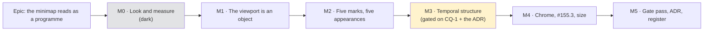

# Implementation Plan: TSLD minimap — visual redesign

- **Feature spec:** [`./feature-spec.md`](./feature-spec.md) — **Draft, awaiting approval**
- **Status:** Draft
- **Owner:** Claude (build), product owner (approval, CQ-1/2/3, and the M0-T1 verdict)

> **Nothing in this plan is implemented.** Stages 1–5 write no application code
> (`docs/PROCESS.md`). M1 is the first milestone that touches `apps/web/src`, and it does not
> start until the spec is approved and **M0-T1's screenshot has been looked at**, because
> §4.10 of the spec lists five things that shot could show which would re-order the whole
> epic.

## Breakdown

### Epic

**The minimap reads as a programme, not a smear** — a design pass on a shipped Should-have,
opened by first-contact feedback from the product owner and by
`docs/TECH_DEBT.md` #155.1's own armed trigger. Roadmap theme: none (it is a design pass on
delivered work, not new capability).

**Two properties are invariant across every milestone and are the epic's acceptance frame:**

1. **The bitmap is rebuilt on scene change only.** `TsldCanvas.hidden-pane.test.tsx`'s
   rebuild-cadence assertion (ADR-0100 S3) and `minimap-axes.structural.test.ts` must pass
   **unedited** at every milestone. **An edit to either is the signal the milestone did more
   than it says** (the ADR-0099 M5 "an invariant you have to touch to make room for your
   feature was never an invariant" rule).
2. **No behaviour changes.** Drag, click-to-jump, arrows, Home/End, Escape, focus return,
   persistence and every announcement are untouched. `e2e-minimap/minimap.spec.ts`'s
   existing assertions are extended, never weakened.

---

## Milestone M0 — Look at it, and measure _(shippable: documents only)_

**Outcome:** the epic's problem statement is re-derived from a photograph and from numbers
taken in a browser, and §4's option ranking is either confirmed or re-ordered **before** any
code is written.

**Ships dark:** deliberately. M0 produces `m0-measurement.md` and a screenshot pair and
changes no product behaviour. Nothing is reachable because there is nothing new to reach.

**Journey:** none — no user-facing capability. The first journey step lands with **M1**
(ADR-0081 §2).

> **Why this milestone is blocking rather than a formality.** The spec's §0.1 states plainly
> that no screenshot was taken and no measurement was run, because `Bash` was disabled for
> the session that wrote it. Every figure in §1 and §3.3 is a file read or arithmetic on a
> recorded number. ADR-0099 records the first correct screenshot of the plan workspace
> showing "what no measurement had reported"; ADR-0101 records a four-scrollbar editor
> reaching a user because the shot list stopped at the route. **§4.10 lists five outcomes
> that would re-order this epic**, and three of them are only visible in a picture.

---

#### Feature: the problem, re-derived

> **Description:** Photograph the surface, measure the pitch in a browser, prove the mark
> collisions live, and record what the shot changes.
> **Complexity:** S
> **Dependencies:** spec approved
> **Risks:** the shot disagrees with the spec's ranking → **that is the milestone working**;
> §4.10 says what each disagreement does
> **Testing requirements:** none (documents); the harnesses used are existing ones

##### Task M0-T1 — Take the screenshot and look at it

- **Description:** Run the existing `plan-workspace-minimap` shot at the widths the product
  owner uses, and write down what is seen — before consulting §4.
- **Complexity:** S
- **Dependencies:** none
- **Risks:** the shot is taken at a width nobody uses → take **1646** (the product owner's
  Surface Pro, CSS px — the width ADR-0091's retrospective established two epics had never
  used) **and 1920**; record both.
- **Testing:** n/a
- **Development steps:**
  1. `pnpm --filter @repo/web shoot` (or the documented invocation) for
     `plan-workspace-minimap` (`apps/web/scripts/shoot.mjs:423-432`), at 1646 and 1920.
  2. Take the **same** shot on a plan large enough to exercise the decimation — the
     2,160-activity seed programme, not the default fixture.
  3. Take a shot with the **WBS band off** and one with it **on**, because
     `wbs-band-source.ts:63` returns the unfiltered list when the band is inactive and every
     `WBS_SUMMARY` is then an ordinary full-width bar in the picture (spec §2 edge case).
  4. **Write the observation before reading §4** — one paragraph, in `m0-measurement.md`,
     saying what is actually wrong with the picture.
  5. Then reconcile against §4.10's table and record any re-ordering.

##### Task M0-T2 — Re-derive the pitch table in a browser

- **Description:** Replace the spec's §3.3 arithmetic with measured numbers from the shipped
  code.
- **Complexity:** S
- **Dependencies:** M0-T1
- **Risks:** the spans in the spec are M0-T2-of-the-_previous_-epic's figures and the
  catalogue may have moved → read `spanDays` out of the live `minimapViewport` result rather
  than recomputing from a documented span.
- **Testing:** n/a
- **Development steps:**
  1. In a browser, on both catalogue plans, read `spanDays`, `pxPerDay`, `laneCount` and
     `pxPerLane` from the live mapping.
  2. Compute month / quarter / year pitch; compare against the spec's table and **record any
     divergence in place** rather than editing the spec's number silently.
  3. Record `pxPerLane` against `CRITICAL_FRINGE_MIN_H = 3` and state, from measurement,
     whether the 1.4.1 fringe fires on either plan (the spec predicts **neither**, by
     arithmetic).

##### Task M0-T3 — Set the legibility floor from the picture

- **Description:** Decide the tier-admission floor by looking, not by inheriting
  `DAY_GRID_MIN_PX`.
- **Complexity:** S
- **Dependencies:** M0-T1, M0-T2
- **Risks:** the floor is set by argument → forbidden; the constant carries the same
  sentence `DATE_LABEL_MIN_PX_PER_DAY`'s docblock carries (`geometry.ts:59`, _"Set from the
  M3-T5 measurement, not by eye"_).
- **Testing:** n/a
- **Development steps:**
  1. Render candidate tier pitches (3, 4.5, 6, 8 px) into the real box, in a browser.
  2. Choose the floor from the images; record all four images.
  3. Record the resulting ladder for both measured plans.

##### Task M0-T4 — Prove the mark collisions live

- **Description:** Confirm in a browser that `today`, `critical`, `outline` and `dataDate`
  resolve to the values the spec's §1 table claims.
- **Complexity:** S
- **Dependencies:** none
- **Risks:** **the claim is a file read and must not stay one.** `palette.ts:163,167,173,182`
  says `today === critical` and `outline === dataDate`; the resolution happens against the
  canvas surface element at runtime, and ADR-0102's finding is precisely that a token can
  resolve somewhere other than where it appears to.
- **Testing:** n/a
- **Development steps:**
  1. Read the four resolved values off `paletteRef` in a live session; record them.
  2. Sample the minimap canvas's pixels at the Today x and at a critical bar; record whether
     they are the same RGB.
  3. If they are **not** identical, the spec's §1 is wrong and §4.3 is re-scoped — record
     that, do not quietly drop it.

##### Task M0-T5 — Record the baseline the gate pass will re-derive

- **Description:** Capture the current `minimap-budget.test.ts` counts and the current build
  cost, so M5 can re-derive rather than trust.
- **Complexity:** S
- **Dependencies:** none
- **Risks:** the recorded build cost (`m0-measurement.md:173-183`, p50 3.4 / p95 5.1 / max
  9.2 ms) is a **headless software-raster** figure with that deviation stated — re-run it in
  the same environment as M5 will, or the comparison imports the machine.
- **Testing:** n/a
- **Development steps:**
  1. Record today's asserted counts verbatim.
  2. Re-run the forced-rebuild probe at 2,160 activities; record p50/p95/max and the
     environment.
  3. State the falsification bar for M3: **the rebuild stays within one order of magnitude
     of this figure, and the per-frame path is unchanged** — committed before M3 runs
     (ADR-0128's method).

---

## Milestone M1 — The viewport indicator becomes an object

**Outcome:** a planner can see where they are at a glance. The indicator is filled as well
as bordered, and the fill is present without hover and on touch.

**Entry point:** unchanged — **`View ▾ ▸ Panels ▸ Minimap`** (the checkbox with accessible
name `Minimap`, `e2e-minimap/minimap.spec.ts:180`). This milestone adds no new control; it
changes what the existing one reveals. Stated explicitly because ADR-0081 §1 requires a
milestone to name its entry point **or** declare itself dark, and "the entry point already
exists" is the third case that rule does not have a slot for — so it is named here rather
than left to inference.

**Journey:** `e2e-minimap/minimap.spec.ts` gains an assertion that the indicator has a
non-transparent computed `background-color` at its **8×8 floor** and at full-box size — the
first user-facing milestone carries its journey step (ADR-0081 §2).

---

#### Feature: a filled viewport indicator

> **Description:** One CSS declaration on an existing DOM node, plus the contrast pair that
> licenses it. Closes `docs/TECH_DEBT.md` #155.1.
> **Complexity:** S
> **Dependencies:** M0-T1; **CQ-2** answered (inside tint vs outside scrim)
> **Risks:** the tint washes out the criticality distinction beneath it → M1-T1 lands the
> composite pair **before** the CSS and judges it on the indicator covering the **whole**
> box, not the 8×8 case
> **Testing requirements:** contrast pair (verified red), unit render assertion, journey
> assertion, screenshot

##### Task M1-T1 — The composite contrast pair, before the CSS

- **Description:** Add the pair that says critical and non-critical stay distinguishable
  **through** the tint, and a reachability assertion for any new token.
- **Complexity:** M
- **Dependencies:** M0-T1
- **Risks:** (a) `token-contrast.test.ts` resolves tokens and **cannot see a compositing
  operation** — the composite must be computed in the test, not assumed (the ADR-0102 shape);
  (b) a new `:root` token not aliased in `@theme inline` paints **nothing at all** in a real
  browser while the gate stays green — ADR-0100 M4's own recorded defect, in this exact
  token family.
- **Testing:** the new block, **verified red** against an alpha high enough to collapse the
  pair, and red again against an un-aliased token.
- **Development steps:**
  1. Add `--canvas-minimap-frame-fill` to the canvas scope **and** to `@theme inline`.
  2. Extend `token-contrast.test.ts`'s minimap block: compute the alpha-composite of the
     fill over `--primary` and over `--destructive`, assert the pair still clears the
     criticality floor the product gates (ADR-0097 Landing E, 1.5:1).
  3. Extend the existing reachability assertion (`:372-386`) to cover the new name.
  4. Verify red twice, as above; record both mutations beside the assertions.
  5. Choose the alpha from the assertion, not by eye.

##### Task M1-T2 — Fill the indicator

- **Description:** Add the `background` to the rect node; keep the two-tone frame pair
  exactly as it is.
- **Complexity:** S
- **Dependencies:** M1-T1
- **Risks:** touching the node that the frame loop transforms → **do not** move, rename or
  re-wrap it; the transform write at `TsldCanvas.tsx:1937` targets `rectRef` and a wrapper
  would silently break the ADR-0026 D3 no-React-render contract.
- **Testing:** a unit assertion that the node carries a non-transparent background; the
  existing rect tests pass unchanged.
- **Development steps:**
  1. Add `background` to the style object at `TsldMinimap.tsx:439-444`. Nothing else.
  2. If CQ-2 chose the scrim instead, implement it as **four positioned siblings or one
     `box-shadow` spread on the same node** — never a new wrapper around `rectRef`.
  3. Confirm the hit pad (`:451-472`) is unaffected: it is a child of the rect and the
     journey asserts ≥ 24×24 (`minimap.spec.ts:162-163`).

##### Task M1-T3 — Journey + screenshot

- **Description:** Prove it in a real browser and photograph it.
- **Complexity:** S
- **Dependencies:** M1-T2
- **Risks:** a unit assertion on an inline style passes against a value a browser discards →
  the journey reads `getComputedStyle`, not the attribute.
- **Testing:** `scripts/e2e-local.sh web:minimap` — **run locally, not left to CI**
  (`docs/PROCESS.md` Completion Criteria; CI is the second opinion).
- **Development steps:**
  1. Add the computed-background assertion at both the 8×8 floor and full-box size.
  2. Confirm the axe scan with `target-size` enabled still passes (`minimap.spec.ts:102-117`).
  3. Re-shoot `plan-workspace-minimap`; attach before/after to the PR.
  4. Changeset (`patch` — a visual change to a shipped surface, user-visible).

---

## Milestone M2 — Five marks, five appearances

**Outcome:** the Today line stops being the same mark as a one-day critical activity, the
data date stops being the same mark as a critical bar's emphasis, and criticality is carried
by a non-hue channel **at every row height** — including the sub-3 px rows where the current
fringe does not fire on either measured plan.

**Entry point:** unchanged (`View ▾ ▸ Panels ▸ Minimap`).

**Journey:** `e2e-minimap` gains a pixel assertion that the Today x and a known critical
bar's x are **not** the same RGB — the only tier that can see it, since the unit fixture
diverges from production at exactly this point.

---

#### Feature: mark distinctness, asserted rather than assumed

> **Description:** Give each of the five marks its own appearance, and pin the distinctness
> so a future palette edit cannot re-collide them.
> **Complexity:** M
> **Dependencies:** M0-T4 (the collision proven live)
> **Risks:** this touches criticality colour, which is gated in three places → every pair
> lands before the value
> **Testing requirements:** a new distinctness block in `token-contrast.test.ts`; unit cases;
> the journey pixel assertion

##### Task M2-T1 — The distinctness gate, before the values

- **Description:** Assert that no two of the five marks resolve to the same value, and that
  criticality carries lightness at any row height.
- **Complexity:** M
- **Dependencies:** M0-T4
- **Risks:** **a fixture that diverges from production hides the defect** — this is the
  recorded cause here (`minimap-budget.test.ts:27`'s _"distinct from dataDate so the fringe
  assertions can tell them apart"_). The new gate resolves the **real** tokens against the
  canvas surface, never a fixture.
- **Testing:** verified red against today's values, which is the point — the gate must fail
  on the shipped code before M2-T2 makes it pass.
- **Development steps:**
  1. Add a `MINIMAP_MARKS` list to `token-contrast.test.ts` naming all five tokens.
  2. Assert pairwise value-distinctness. **Run it red against `main` and commit the red
     output** (the ADR-0120 sequence: the red state disappears once fixed, and it is the only
     record the gate ever had anything to find).
  3. Assert the criticality lightness separation, at a row height **below**
     `CRITICAL_FRINGE_MIN_H`.
  4. If §4.3's fill-level separation lands, **convert** `token-contrast.test.ts:388-402`'s
     deliberately-unasserted sub-3px report into an assertion, and record in the docblock
     that the degradation it documented no longer exists.

##### Task M2-T2 — Give the marks their channels

- **Description:** Change the values and, where needed, add a second non-hue channel.
- **Complexity:** M
- **Dependencies:** M2-T1
- **Risks:** (a) reaching for a `--chart-*` or a `var()` value → **Canvas 2D silently
  discards an unparseable `fillStyle` and keeps the previous colour** (ADR-0121), so every
  minimap ink comes through `paletteRef`'s resolved values; (b) drawing the Today dash with
  `setLineDash`/`stroke` → the budget gate's zero-per-bar-stroke shape is about **bars**, but
  a dash is cheaper and safer as a run of `fillRect`s and keeps the gate's arithmetic simple.
- **Testing:** unit cases per mark; the counts in `minimap-budget.test.ts` updated **only if
  they move**, with the movement stated.
- **Development steps:**
  1. Today: distinct value **plus** width (2 px) or a `fillRect` dash.
  2. Data date: keep `--foreground` (it is the scene's own data-date ink — the ADR-0059
     shared-axis reasoning applies to inks as well as to the clock).
  3. Criticality: replace the row-height-gated fringe with a fill-level lightness
     separation, which reaches every row height and costs zero or **negative** draw calls.
  4. If the fringe pass is removed, the style-write count **falls**; update the gate and say
     so in the PR — a gate whose number drops is as much a change as one whose number rises.
  5. Update `MinimapPalette`'s docblock (`minimap.ts:72-85`) — it currently describes the
     fringe as the 1.4.1 answer.

##### Task M2-T3 — Journey pixel assertion

- **Description:** Prove in a browser that the two colliding pairs no longer collide.
- **Complexity:** S
- **Dependencies:** M2-T2
- **Risks:** the existing "more than one colour" assertion (`minimap.spec.ts:88-99`) is
  satisfied by any two colours and **cannot** see this → a new, specific assertion is needed.
- **Testing:** `scripts/e2e-local.sh web:minimap`.
- **Development steps:**
  1. Seed a plan with a known Today position and a known one-day critical activity.
  2. Sample both x positions from the canvas; assert the RGBs differ.
  3. Re-shoot; changeset.

---

## Milestone M3 — Temporal structure _(gated on CQ-1 and on the ADR)_

**Outcome:** the picture says **when** the programme runs. A planner can tell a two-year
plan from an eleven-year one from the thumbnail.

**Entry point:** unchanged (`View ▾ ▸ Panels ▸ Minimap`).

**Journey:** `e2e-minimap` asserts that a long-span plan's picture contains the year-tier ink
and a short-span plan's contains the quarter tier — i.e. that the ladder is live, not just
unit-tested.

> **This milestone does not start until (a) CQ-1 is answered yes and (b) the ADR amending
> ADR-0100 D5 is filed.** D5 is a shipped decision with a gate behind it, and ADRs are
> immutable once accepted — amending it in a commit that also changes the gate is precisely
> the shortcut ADR-0105 was written about.

---

#### Feature: pitch-gated temporal tiers, beneath the bars

> **Description:** Alternating year bands plus rules at the finest tier whose measured pitch
> clears the M0-T3 floor, drawn between the ground and the bars.
> **Complexity:** M
> **Dependencies:** M0-T2, M0-T3, CQ-1, the ADR
> **Risks:** (1) the tiers compete with the bars → they are drawn **beneath**, and M0-T3's
> floor is set from a picture; (2) the gate's counts move → the amendment states the new
> numbers and **adds** two assertions; (3) the tier rule is written as a tier name rather
> than a pitch → the unit cases pin both measured spans and the two degenerate ones
> **Testing requirements:** `minimap-tiers.test.ts` (new); amended `minimap-budget.test.ts`;
> journey; screenshot

##### Task M3-T1 — The pure tier rule

- **Description:** One pure function: given a span and a box width, return the admitted
  tiers.
- **Complexity:** M
- **Dependencies:** M0-T3
- **Risks:** placing it in `minimap.ts` and reaching for a banned name →
  `minimap-axes.structural.test.ts:30` bans `screenYOfLane`, `LANE_HEIGHT`, `cull(` and
  `activityRect(` from that file, comment-stripped. The tier rule needs none of them; confirm
  rather than assume.
- **Testing:** unit cases at **1,059 d** and **4,125 d** (the measured spans), plus the two
  degenerate cases (1-day plan → no tier; > ~33 y → no tier).
- **Development steps:**
  1. Write `temporalTiers({ spanDays, boxWidth, floorPx })` returning an ordered tier list.
  2. Derive quarters as **every third `months` boundary** from
     `calendarBoundaries` (`time-scale.ts:260-291`) — no new date arithmetic.
  3. Unit-test the four cases; verify the long-plan case red against a hard-coded "always
     months".
  4. The floor constant carries the `DATE_LABEL_MIN_PX_PER_DAY` sentence: set from the
     M0-T3 measurement, not by eye.

##### Task M3-T2 — Paint the tiers beneath the bars

- **Description:** Insert the layer between ground and non-critical bars.
- **Complexity:** M
- **Dependencies:** M3-T1
- **Risks:** drawing the tiers **over** the bars — which is what a careless insertion does,
  because the bar passes come later in the function — would need contrast pairs against
  `--primary` and `--destructive` that do not exist. A unit assertion on **draw order** is
  the guard, not a comment.
- **Testing:** a draw-order assertion in `minimap.test.ts`, verified red against an
  after-the-bars insertion.
- **Development steps:**
  1. Year bands: one `fillRect` per year, parity from the **absolute year ordinal** (the
     ADR-0055 §4 rule, so parity is a property of the calendar).
  2. Tier rules: one batched pass per admitted tier, coarse last, so a coarser boundary wins
     at a coincident x (the ADR-0056 rule).
  3. Inks: `--canvas-grid-month` / `--canvas-grid-year`, already asserted ≥ 3:1 against
     `--canvas` (`token-contrast.test.ts:690-701`). **No new token** — which is what makes
     this milestone's contrast obligation nil, and is worth stating in the PR.
  4. Extend `MinimapPalette` and the host's palette literal (`TsldCanvas.tsx:1922-1928`).

##### Task M3-T3 — Amend the budget gate

- **Description:** Change the counts; keep — and strengthen — the shape.
- **Complexity:** M
- **Dependencies:** M3-T2
- **Risks:** **weakening the gate while amending it.** The three properties ADR-0100 D5
  names (zero text, zero per-bar strokes, batched `fillStyle`) must all still be asserted;
  the amendment adds two assertions rather than removing any.
- **Testing:** the gate itself, plus a mutation check that each new assertion can fail.
- **Development steps:**
  1. Update `fillRect` to `1 + years + n + 1` and `styleWrites` to the new stated constant,
     with a comment saying **why** each term is there.
  2. **Add** an assertion that `stroke()` is called at most once per admitted tier.
  3. **Add** an assertion that the tier count is bounded by the pitch rule (≤ 3).
  4. Verify each new assertion red against a per-tier-per-boundary style write and against
     an unbounded tier list.
  5. **Fix the pre-existing defect found while reading this file:** the third case is named
     _"…: 6 style writes…"_ (`minimap-budget.test.ts:107`) and its comment computes 6, while
     the assertion at `:127` correctly expects **5** — the inset critical fill reuses the
     style already set and writes none. A test whose name states a number its assertion
     contradicts is the ADR-0076 Class 3 shape in a gate; correct the name and the comment,
     do not change the assertion.

##### Task M3-T4 — Re-derive the build cost against the shipped code

- **Description:** Confirm the rebuild is still where M0-T5 said it was.
- **Complexity:** S
- **Dependencies:** M3-T2, M0-T5
- **Risks:** quoting `docs/TECH_DEBT.md` #75's frame-pacing figures at a rebuild cost →
  category error; #75 and #261 bound the **scene painter's pan path** and say nothing about a
  scene-change-only build (spec §3.4).
- **Testing:** the forced-rebuild probe, same environment as M0-T5.
- **Development steps:**
  1. Re-run the probe; compare against M0-T5's bar, which was committed before this ran.
  2. **Separately** confirm `TsldCanvas.hidden-pane.test.tsx` passes **unedited** — the
     per-frame path is what actually matters, and it must be asserted rather than inferred
     from a millisecond figure.
  3. If the rebuild has moved by more than an order of magnitude, **stop and report**; do not
     tune the tier rule to make a number fit.

##### Task M3-T5 — Journey + screenshot + ADR

- **Complexity:** M
- **Dependencies:** M3-T3, M3-T4
- **Testing:** `scripts/e2e-local.sh web:minimap`
- **Development steps:**
  1. Journey assertions for both ladder outcomes (long plan → year tier; short plan →
     quarter tier).
  2. Re-shoot both plans at both widths.
  3. File the ADR (spec §4.9) — **allocating its number at filing time**, having re-checked
     `docs/adr/` for the highest in use (ADR-0079's precedent: a number taken between the
     plan and the milestone).
  4. `pnpm check:adr-coverage` — it gates the ADR **index** and `ROADMAP.md`, and
     structurally cannot see `CLAUDE.md` §16 (`docs/TECH_DEBT.md` #291), so **the register
     entry in `CLAUDE.md` is written by hand in the same commit**. ADR-0132's entry was
     missing from that list for a day and ADR-0049/0122 for longer, each found by accident.
  5. Changeset.

---

## Milestone M4 — Panel chrome, the empty state, and size

**Outcome:** the panel reads as a designed object beside its sibling, and the two remaining
`docs/TECH_DEBT.md` #155 items are closed or consciously re-filed.

**Entry point:** unchanged (`View ▾ ▸ Panels ▸ Minimap`).

**Journey:** the existing suite; no new capability.

---

#### Feature: chrome, #155.3, and CQ-3

> **Description:** Take the chrome improvements the M0/M3 screenshots justify, add the
> empty state's missing route, and answer CQ-3 with the pictures in hand.
> **Complexity:** S
> **Dependencies:** M0-T1, M3-T5's screenshots; **CQ-3**
> **Risks:** taking chrome changes from the old app rather than from the screenshot → the old
> app's card is further from this product's design language than ours is; the win is small and
> must be **seen**, not copied
> **Testing requirements:** the colour-literal lint rule; the sizing/weight ratchets; the
> existing suites

##### Task M4-T1 — Chrome, from the screenshot

- **Complexity:** S
- **Dependencies:** M3-T5
- **Risks:** a one-off colour literal in `className`/`style` → the ADR-0055 lint rule refuses
  it, and a literal cannot follow a surface scope. The weight and sizing **ratchets** also
  count comment text in some of their history — if one moves, check whether the cause is a
  docblock before changing a value (`docs/TECH_DEBT.md` #149's neighbours).
- **Testing:** lint; the ratchets; visual diff.
- **Development steps:**
  1. Compare the panel against `TsldLegendPanel` in the shot; change only what the picture
     justifies.
  2. Design-system vocabulary only.

##### Task M4-T2 — The empty state gets a route (#155.3)

- **Complexity:** S
- **Dependencies:** none
- **Risks:** #155.3's own words are _"One 'add an activity' line **if it ever surfaces in
  use**"_ — the trigger for **this** item has **not** fired. **Do not fold it in on the
  strength of being nearby.** Either it surfaced in M0-T1's shots, or the item is **re-filed
  with that reason recorded** (ADR-0114's finding: a deferral whose reason has lapsed reads
  exactly like one whose reason still holds — and so does the reverse).
- **Testing:** unit case if changed.
- **Development steps:**
  1. Check M0-T1's observations for the empty state.
  2. Change it, or re-file #155.3 with the reason. Not silence.

##### Task M4-T3 — Answer CQ-3

- **Complexity:** S
- **Dependencies:** M0-T2, M4-T1
- **Risks:** changing `MINIMAP_BOX` invalidates the decimation arithmetic in the spec's §2
  edge cases **and** M0-T5's cost baseline.
- **Testing:** re-run the tier unit cases and the budget gate at the new size.
- **Development steps:**
  1. If the answer is "unchanged", **record that it was asked and answered** — Q3 was
     recorded as "not a decision" for a year and nobody revisited it.
  2. If a stepped S/M/L is wanted, note that `minimapDirtyRef` already treats a backing-store
     resize as a rebuild trigger (`TsldCanvas.tsx:1904-1908`), so a step is one rebuild — the
     thing Q3 rejected was a _free_ resize rebuilding per drag frame.

---

## Milestone M5 — The gate pass

**Outcome:** the epic is reviewed by specialists over the combined diff, the findings are
folded with regression tests verified red first, and the record is written.

**Entry point:** n/a (review milestone).
**Journey:** the full `e2e-minimap` suite plus the base journey.

---

#### Feature: review, record, close

> **Description:** The specialist pass, the documentation, and the register.
> **Complexity:** M
> **Dependencies:** M1–M4
> **Risks:** skipping the pass because the epic is "only visual" → the register records eight
> consecutive epics whose gate pass found defects that had passed a human read, and ADR-0100's
> own M4 found six in this exact surface
> **Testing requirements:** the whole pre-push gate, run locally

##### Task M5-T1 — Specialist reviews over the combined diff

- **Complexity:** M
- **Dependencies:** M4
- **Risks:** running the wrong reviewers.
- **Testing:** n/a
- **Development steps:**
  1. **accessibility-reviewer** — WCAG 1.4.1 (the criticality channel at every row height),
     1.4.11 (the frame pair through the new fill), and the `aria-hidden` canvas's unchanged
     relationship to the parallel listbox (ADR-0063's set-equality invariant).
  2. **component-reviewer** — `TsldMinimapProps`' widened contract, token usage, no one-off
     styling.
  3. **ux-reviewer** — does it answer the complaint; does it read as the Legend's sibling.
  4. **performance-reviewer** — the rebuild cost and, specifically, that nothing moved onto
     the frame path.
  5. **`database-architect` is deliberately NOT engaged**, because there is no schema change
     to design — recorded so its absence cannot read as the CLAUDE.md §19.3 omission.
  6. Fold every blocking finding with a regression test **verified red first**; file the
     non-blocking ones with numbers and reasons.

##### Task M5-T2 — Documentation and the register

- **Complexity:** S
- **Dependencies:** M5-T1
- **Risks:** filing the ADR and not the register entry (the ADR-0071 failure) — the ADR index
  **is** gated, `CLAUDE.md` §16 is **not**.
- **Testing:** `pnpm prepush` (one command — running its parts by hand is how a gate gets
  missed, CLAUDE.md §19.8), plus `scripts/e2e-local.sh web:minimap` and the **base** journey
  (`docs/TESTING.md`: change a screen, run the base journey).
- **Development steps:**
  1. Set this spec's header to `Accepted — shipped (ADR-NNNN)` **in the same change that
     files the ADR** (`docs/PROCESS.md`; `pnpm check:spec-status` refuses a `Draft` header a
     filed ADR cites).
  2. Annotate the plan's `Feature spec:` line with the same state.
  3. Write the `CLAUDE.md` §16 entry by hand.
  4. Close `docs/TECH_DEBT.md` #155.1 and #155.3, or re-file each with its reason.
  5. `docs/DESIGN_SYSTEM.md` if a token landed.
  6. Confirm the changesets across M1–M4 add up to the intended bump.

---

## Sequencing & slices

```mermaid
gantt
  dateFormat X
  axisFormat %s
  section Gated on nothing
  M0 look + measure        :m0, 0, 1
  M1 viewport fill         :m1, after m0, 1
  M2 mark distinctness     :m2, after m1, 1
  section Gated on CQ-1 + ADR
  M3 temporal tiers        :m3, after m2, 1
  section Close
  M4 chrome / #155 / size  :m4, after m3, 1
  M5 gate pass             :m5, after m4, 1
```

**Each milestone is independently releasable and independently revertible**, which is the
rollback contract — there is **no `VITE_` flag** (ADR-0088 D1: a `VITE_` constant is inlined
at build time, `docker-publish.yml` passes none, so an operator cannot switch one off; a flag
here would be a second painter branch maintained forever, not a rollback).

**The ordering is the argument, not a convenience.** M1 is the largest single term against
the complaint and costs one CSS declaration, so the biggest visible improvement lands
**first** and **before any shared gate moves**. M2 is a correctness fix and must not queue
behind an approval. M3 is the only milestone gated on CQ-1, so a "no" costs nothing that has
already shipped. M4 needs M3's pictures to judge chrome against.

**If M0-T1's screenshot disagrees with this ordering, the ordering changes** — spec §4.10
says what each disagreement does. That is the milestone's purpose, not a failure of it.

## Definition of Done (per task)

Each task's PR satisfies the Feature Completion Criteria in
[`docs/PROCESS.md`](../../PROCESS.md). Three are called out because this epic can plausibly
skip them:

- **The pre-push gate is run, not written** — `pnpm prepush`, plus
  `scripts/e2e-local.sh web:minimap` for every milestone that touches the panel. CI is the
  second opinion.
- **Every new gate assertion is verified red against a named mutation** (ADR-0110 D5), and
  the mutation is recorded beside it. A gate is not finished when it passes.
- **A changeset per user-visible milestone.** M1–M4 are all user-visible.

## Risks & assumptions (rollup)

| Risk / assumption                                                             | Likelihood           | Impact       | Mitigation                                                                                                            |
| ----------------------------------------------------------------------------- | -------------------- | ------------ | --------------------------------------------------------------------------------------------------------------------- |
| **The screenshot shows the real problem is something this spec did not rank** | **med**              | **high**     | M0-T1 is blocking and its observation is written **before** §4 is re-read; §4.10 pre-commits what each outcome does   |
| The spec's §3.3 pitch table is arithmetic, not observation                    | **certain** (stated) | med          | M0-T2 re-derives it in a browser against the shipped code before M3                                                   |
| The tint washes out criticality inside the indicator                          | med                  | high         | M1-T1 computes the composite and gates it **before** the CSS, judged on the whole-box case                            |
| A new token is not aliased in `@theme inline` and paints nothing              | med                  | high         | The reachability assertion is extended in M1-T1; this is ADR-0100 M4's own recorded defect in this token family       |
| A `var()` value reaches a canvas `fillStyle` and is silently discarded        | low                  | high         | Every minimap ink comes through `paletteRef`'s resolved values (ADR-0121)                                             |
| Temporal tiers compete with the bars                                          | med                  | med          | Drawn **beneath**; floor set from a picture (M0-T3), not by argument                                                  |
| The budget gate is weakened while being amended                               | **med**              | **high**     | M3-T3 **adds** two assertions and keeps all three of D5's named properties; each new assertion verified red           |
| Something moves onto the per-frame path                                       | low                  | **critical** | V4: `TsldCanvas.hidden-pane.test.tsx` must pass **unedited**; M3-T4 asserts it separately from the millisecond figure |
| `docs/TECH_DEBT.md` #75/#261 numbers get quoted at a rebuild cost             | med                  | med          | Spec §3.4 states what does and does not transfer; M0-T5 commits the bar before M3 runs                                |
| #155.3 is folded in although its own trigger has not fired                    | med                  | low          | M4-T2 requires the trigger to have fired **or** the item to be re-filed with that reason                              |
| A further ADR-0105 trigger is crossed mid-flight                              | low                  | med          | Spec §3.2 tabulates all four and checks each; crossing one **stops the work**                                         |
| The ADR is filed and the `CLAUDE.md` register entry is not                    | **med**              | med          | M5-T2 step 3; `check:adr-coverage` structurally cannot see that file (#291), so it is a hand step with a named cause  |
