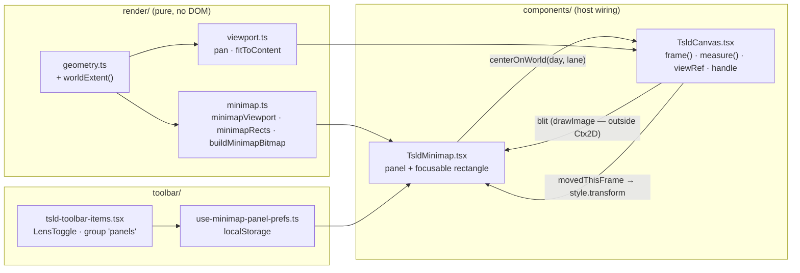
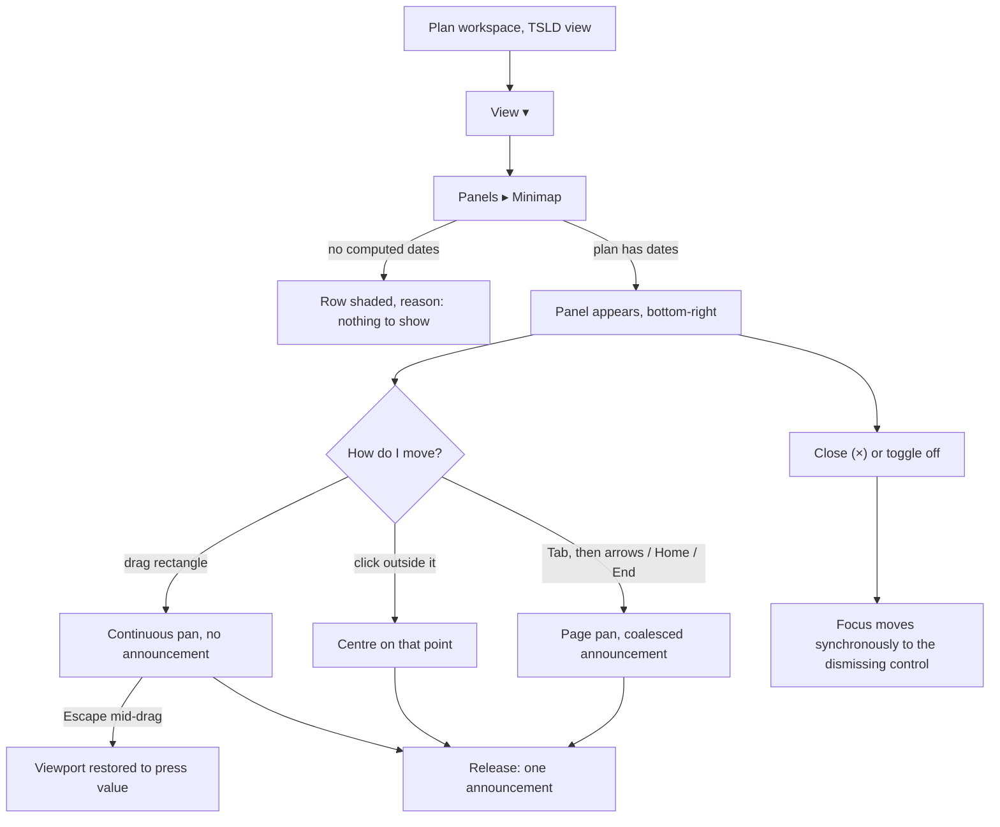

# Feature Spec: TSLD canvas minimap

- **Status:** Draft — awaiting approval
- **Author(s):** feature-analyst (Product Owner / Solution Architect / Technical Lead hats)
- **Date:** 2026-08-20
- **Tracking issue / epic:** _(none yet)_
- **Roadmap link:** `docs/PROJECT_BRIEF.md` §8 Should-have — "Minimap for large diagrams"
  (`:92`), restated at `:165`. ADR-0026 `:500` deferred it explicitly.
- **Related ADR(s):** ADR-0026 (canvas architecture — the deferral, D3 ref-authoritative
  viewport, D7 the parallel a11y layer, §9 the fps gate), ADR-0078 (render module
  boundaries), ADR-0080 (the Escape ladder), ADR-0064 (tool-mode contract), ADR-0063
  (the a11y-layer set-equality invariant), ADR-0065/0079 (the one-function rule),
  ADR-0088 (no new `VITE_` flag), ADR-0081 (a milestone names its entry point),
  ADR-0092/0099 (the canvas's vertical budget), ADR-0097 (surface scopes, one theme).
  **A new ADR is proposed** — outline in §4.9.

### Evidence base and what was re-checked

Three specialist input reports were gathered **before** this spec and carry the deep
evidence; this document cites them by section rather than restating them:

- [`input-architecture.md`](./input-architecture.md) — what/where/draw/render-model/state/
  interaction/slicing.
- [`input-performance.md`](./input-performance.md) — measured costs, redraw policy, gates,
  the falsification condition.
- [`input-accessibility.md`](./input-accessibility.md) — role/keyboard/contrast/invariants/
  announcements/focus. Its items 1–9 are **hard acceptance criteria**, carried into §2.

Each report opens by correcting its own brief, which is why they precede the spec
(ADR-0076, `CLAUDE.md` §19.10). Per that same rule the reports are **not** treated as
evidence: their decision-bearing claims were spot-checked against the code. Results, in
full, including where this spec now differs from them:

| Claim                                                                           | Verdict                                                                                                                                                                                                                                                                                                                                                                                                                                                                          |
| ------------------------------------------------------------------------------- | -------------------------------------------------------------------------------------------------------------------------------------------------------------------------------------------------------------------------------------------------------------------------------------------------------------------------------------------------------------------------------------------------------------------------------------------------------------------------------- |
| No reusable world-extent helper; `dayExtent` is X-only and lives in the painter | **Confirmed.** `render/paint.ts:2203-2204`; `render/geometry.ts` exports no extent function.                                                                                                                                                                                                                                                                                                                                                                                     |
| `maxLane` is derived twice, inline, independently                               | **Confirmed.** `render/viewport.ts:161,168` (and `:178` hardcodes `originY`); `export/export-image.ts:111-115`.                                                                                                                                                                                                                                                                                                                                                                  |
| `paintScene`'s culled-id return names the minimap and is discarded              | **Confirmed.** Docblock `render/paint.ts:775-776`; `components/TsldCanvas.tsx:1317` calls it as a statement.                                                                                                                                                                                                                                                                                                                                                                     |
| `Ctx2D` has no `drawImage`, so the blit cannot be inside a pure painter         | **Confirmed.** `render/ctx-2d.ts:10-46`.                                                                                                                                                                                                                                                                                                                                                                                                                                         |
| `LANE_HEIGHT` is hardcoded, so the world's vertical extent in px is fixed       | **Confirmed.** `render/geometry.ts:35`, consumed at `:430`.                                                                                                                                                                                                                                                                                                                                                                                                                      |
| `ZOOM_TARGET_DAYS.day = 14` (the horizontal-need argument)                      | **Confirmed.** `render/geometry.ts:278`.                                                                                                                                                                                                                                                                                                                                                                                                                                         |
| The 10.2% dropped-frame baseline, its machine and its plan                      | **Confirmed.** `docs/TECH_DEBT.md:489-547` (Dell Precision 5690, Edge 151, 60 Hz, DPR 1, 2,016-activity generated programme at Fit).                                                                                                                                                                                                                                                                                                                                             |
| The `panels` group in `View ▾` is where the toggle belongs                      | **Confirmed as a location — but the section is empty today.** Its only member, `legend`, is _promoted_ to Row 1 (`toolbar/tsld-toolbar-items.tsx:304`), `lensTogglesIn` excludes promoted items (`:308`) and the fieldset is skipped when empty (`:1625`). **The minimap would resurrect the section as its sole occupant**, so the architecture report's discoverability mitigation ("the named `View ▾ ▸ Panels` entry") is weaker than stated. Feeds Q2 in §1.                |
| `zoomToSelection`'s vertical framing is incomplete (reasoned, not observed)     | **Confirmed at the code level, and narrower than the phrasing suggests.** The reveal effect _does_ pan vertically (`TsldCanvas.tsx:1087`). The real gap is that `zoomToActivity` calls `fitToContent`, which computes `maxLane` and never uses it, pinning `originY` to the padding (`viewport.ts:161,168,178`) — and the reveal effect's deps (`TsldCanvas.tsx:1093`) do not include a re-press, so nothing repairs it. **Pre-existing; filed, not absorbed** (§4.8 tension 3). |
| Path/line drift in the reports, non-substantive                                 | `use-viewport-commands.ts` is under `toolbar/commands/`; `token-contrast.test.ts` is under `src/styles/`. Content confirmed at both.                                                                                                                                                                                                                                                                                                                                             |

Four things **none** of the three reports covered, found while checking them:

1. **The Legend is user-draggable anywhere inside the canvas region** and its position is
   persisted (`TsldLegendPanel.tsx:75-79,145`). "Bottom-right is free" is therefore true
   of the _default_ corner only. §2 states the policy.
2. **The viewport rectangle is itself a pointer target and can be ~4 px wide.** At the Day
   preset on a two-year plan it is ~2% of the box. It needs a minimum hit area; §2 AC-3.4.
3. **The design system has no 44×44 icon button.** `icon` is `size-10` (40 px) and
   `icon-sm` is `size-7` (28 px) — `components/ui/button.tsx:35,38`. Accessibility hard
   requirement 7 (≥44 px, `docs/UX_STANDARDS.md:137`) therefore **cannot** be met by
   reusing a variant; §4.6 adds one rather than styling a one-off (`CLAUDE.md` §12).
4. **The guest share view renders the same `TsldPanel`** (`features/share/components/GuestPlanView.tsx:227`,
   `canEdit={false}`), so the minimap reaches External Guests for free. §1 counts them as users.

---

## 1. Business understanding

### Problem

A planner working a real programme on the TSLD cannot see where they are. The canvas is
the product's primary surface and its only navigation aids are **anchored**: zoom presets,
Go to date, zoom-to-selection, search-jump, Next conflict — every one of them requires you
to already know what you are looking for. There is no way to see the shape of the whole
programme, and no way to move to a region you can only point at.

The pain has two axes and they are not equal:

- **Horizontal (the stronger argument).** The Day preset frames **14 days**
  (`render/geometry.ts:278`). On a two-year programme that is **~1.9% of the plan
  visible** — so reaching a region two quarters away is zoom out, hunt, zoom in, repeat.
- **Vertical.** `LANE_HEIGHT` is 28 px (`render/geometry.ts:35`) and the canvas at 1646 CSS
  px is ~681 px tall after ADR-0099 M5, so roughly **24 lanes** are visible against the
  60–80 a large import produces.

> **Both figures are marked pending M0 re-derivation and neither may be quoted as
> established.** ADR-0079's "60–80 lanes, ~a dozen visible" predates Graphite's canvas
> height change and is stale by construction (ADR-0076 Class 1); the ~24 above is derived
> from that change, not measured; the 1.9% is arithmetic over one assumed plan length. M0
> re-derives all of it against the operator's largest real plan and a 500-activity import.
> **The design must not be justified on the vertical case with a horizontal anecdote, or
> the reverse** — M0 says which axis carries the need, and the problem statement above is
> rewritten from its numbers before M1 starts.

**Why now.** It is the last unbuilt Should-have on the primary surface
(`docs/PROJECT_BRIEF.md:92`), ADR-0026 reserved a `Minimap` component in the folder layout
(`docs/adr/0026-…:315`) and classified its visibility as local component state (`:150`),
and six epics of canvas work (ADR-0090 → ADR-0099) have gone into the chrome _around_ the
diagram without ever addressing navigation _within_ it.

### Users

Everyone who reads a plan. Navigation is a read (ADR-0063 M4b, ADR-0080), so this is **not
pen-gated** and carries no new permission.

| Role               | What they need from it                                                                                                                                                                   |
| ------------------ | ---------------------------------------------------------------------------------------------------------------------------------------------------------------------------------------- |
| **Planner**        | Primary. Move between phases of a programme they are authoring, without losing the zoom they are working at.                                                                             |
| **Contributor**    | Find the activities they report progress on, in a plan somebody else laid out.                                                                                                           |
| **Viewer**         | Read a plan they did not build — the case where "where am I?" is hardest.                                                                                                                |
| **Org Admin**      | As Viewer.                                                                                                                                                                               |
| **External Guest** | Highest value per head: a guest opens a shared link with no prior model of the plan at all. Reached for free — the `/share` view renders the same `TsldPanel` (`GuestPlanView.tsx:227`). |

### Primary use cases

1. **Locate.** See at a glance which part of the whole programme the diagram is showing.
2. **Jump.** Move the viewport to a region I can point at but cannot currently see.
3. **Sweep.** Drag continuously across the programme, watching the diagram follow.
4. **Reach it from the keyboard.** Pan to an arbitrary, _unanchored_ point without a
   pointer — which today has **no route at all** (input-accessibility §2).
5. **Read the shape.** See where the critical path runs across the whole plan, even where
   the picture has decimated to one pixel per lane.

### User journeys

**Happy path.** Planner opens a large plan → presses `View ▾` → **Panels ▸ Minimap** → a
200×120 panel appears in the canvas's bottom-right showing the whole programme with a
rectangle over the part they are looking at → they drag the rectangle two-thirds to the
right → the diagram pans with it → they release; the minimap stays open on their next
plan and their next session.

**Keyboard alternate.** Tab to the minimap group → `→` pans a page of days, `↓` a page of
lanes, `End` jumps to the plan's last dated day → one announcement per burst.

**Click-to-jump alternate.** Click anywhere outside the rectangle → the viewport centres
on that world point → one announcement.

**Guest alternate.** Guest opens a share link → same control, same panel, no sign-in.

Diagram in §4.3.

### Expected outcomes

- Reaching a distant region becomes **one gesture** instead of a zoom-out/hunt/zoom-in cycle.
- The planner keeps their working zoom while moving — today, zooming out to navigate
  destroys it (ADR-0056: a preset is a command, and re-picking one is a new decision).
- A keyboard-only user gains the first unanchored pan in the product.
- The last outstanding Should-have on the primary surface closes.

### Success criteria

| #   | Criterion                                                                                                                                                                                                                                                                                      | How it is known                                                                                  |
| --- | ---------------------------------------------------------------------------------------------------------------------------------------------------------------------------------------------------------------------------------------------------------------------------------------------- | ------------------------------------------------------------------------------------------------ |
| S1  | The M0 need re-derivation shows the visible fraction on a real plan is small enough that the control is warranted, **on a named axis**                                                                                                                                                         | M0-T2; if it does not, the feature is withdrawn before M1                                        |
| S2  | Dropped-frame % at Fit zoom with the minimap open and live does **not** exceed the same-session baseline by more than 2 percentage points — **and the baseline triple's own spread is stated in the verdict and sits inside that band** (else runs are added or the band re-derived, recorded) | M0-T1 falsification condition, re-run at M4-T2                                                   |
| S3  | The bitmap is rebuilt on scene change and **not** on a pan-only frame                                                                                                                                                                                                                          | `TsldCanvas.hidden-pane.test.tsx` extension (M2-T4), verified red against a naive implementation |
| S4  | Zero new `ResizeObserver`s (seven exist — input-performance §4)                                                                                                                                                                                                                                | code review + M4                                                                                 |
| S5  | The count of AT-reachable activities is unchanged with the minimap open (ADR-0063)                                                                                                                                                                                                             | set-equality structural test (M2-T5)                                                             |
| S6  | Every viewport position reachable by pointer on the minimap is reachable by keyboard                                                                                                                                                                                                           | journey (M3-T7) + axe with `wcag22aa` and `target-size` enabled                                  |
| S7  | The entry point exists and a real browser presses it                                                                                                                                                                                                                                           | `apps/web/e2e-minimap/` lands with M2, not at M4 (ADR-0081)                                      |
| S8  | `maxLane` is derived in exactly one place afterwards, not three                                                                                                                                                                                                                                | one-derivation structural test (M1-T1)                                                           |

### Open questions

Three are **critical** — different answers produce materially different work. Each carries
the default that governs absent an answer. Everything else is decided in this spec.

- **Q1 — Does the minimap default off or on?** _(Recommended default: **off**.)_ Off
  matches every sibling panel (Legend `use-legend-panel-prefs.ts:51`, Resource view, WBS
  band) and honours ADR-0092/0099's refusal to spend canvas without being asked. **The
  cost is stated rather than hidden:** a default-off Should-have on a control that
  resurrects an empty menu section may never be discovered — the ADR-0081 dark-milestone
  shape, one layer along. Answering "on" adds: a first-open dismissal state, an
  auto-placement rule against a dragged Legend, and a flag-off-equivalent parity argument
  for the default view (~1 extra task). **Auto-open on large plans is rejected either way**
  — a panel that appears by itself was not asked for and would flicker as the planner zooms.
- **Q2 — Is the toggle promoted to the command strip in v1?** _(Recommended default:
  **no**.)_ Promotion is one field on the registry record (`tsld-toolbar-items.tsx:237`),
  so it is cheap to _add_ and expensive to _afford_: `PINNED_FLOOR_WIDTH` is 960 after
  ADR-0099 M5 and `docs/TECH_DEBT.md` #147 records the strip's labelled-width squeeze at 1646. **The spot-check strengthens the case for promoting** (the popover section is
  empty today, so the menu route is unfamiliar) and the arithmetic strengthens the case
  against. If wanted, it is an M0 measurement (`e2e-toolbar-fit` at 1646/1440/1280/960),
  not a default.
- **Q3 — Is 200×120 the size?** _(Recommended default: **200×120 fixed**.)_ This is the
  probed working figure from the performance report's measurements, **not a decision**. It
  is fixed rather than resizable because a resizable minimap re-derives scale and repaints
  the whole picture per drag frame. A different size changes only two constants, but it
  changes the decimation arithmetic in §2's edge cases and the M0 cost measurement, so it
  is asked once, before M0 measures.

Non-critical, decided here with the reasoning in §4.8: hover behaviour (nothing), links
(omitted), the culled set (not used), placement (bottom-right overlay), persistence
(global `localStorage`), URL state (no).

---

## 2. Functional requirements

### User stories & acceptance criteria

> **US-1** — As any plan reader, I want a small picture of the whole programme with a
> rectangle over what I am looking at, so that I know where I am.
>
> - **AC-1.1** **Given** a plan with computed dates and the minimap on, **when** the canvas
>   paints, **then** the panel shows every activity in the plan — never only the culled
>   (on-screen) set — decimated so that a bar is at least 1×1 px.
> - **AC-1.2** **Given** more activities than the box has pixels, **when** two bars land on
>   the same pixel, **then** the **critical** ink survives the merge, because critical bars
>   are painted after non-critical ones and later strokes overwrite earlier ones.
> - **AC-1.3** **Given** the viewport moves, **when** the frame is painted, **then** the
>   rectangle moves and **the plan picture does not repaint** — it is invariant under pan
>   and zoom (`LANE_HEIGHT` is fixed, so world extent in px is fixed).
> - **AC-1.4** **Given** the plan has no activity with a computed `earlyStart`, **when** the
>   minimap is toggled on, **then** the panel states that there is nothing to show — it does
>   not render an empty box, and the `View ▾` row carries the existing no-diagram reason
>   (`LENS_NO_DIAGRAM_REASON`, `tsld-toolbar-items.tsx:266`).
> - **AC-1.5** **Given** the whole plan already fits the viewport, **when** the rectangle is
>   drawn, **then** it is clamped to the box — it never overhangs — and that reads correctly
>   as "you can see everything".

> **US-2** — As any plan reader, I want to click a region of the minimap, so that the
> diagram jumps there without changing my zoom.
>
> - **AC-2.1** **Given** the minimap is open, **when** I click outside the rectangle, **then**
>   the viewport centres on that world point, **`pxPerDay` is unchanged**, and one
>   announcement is made naming the new visible range.
> - **AC-2.2** **Given** the click would centre past the plan's extent, **when** it is
>   applied, **then** the viewport is clamped exactly as an ordinary pan is.
> - **AC-2.3** Click-to-jump and drag commit through **one** function (`centerOnWorld`) —
>   never two implementations of "centre the view here" (ADR-0065/0079).

> **US-3** — As any plan reader, I want to drag the rectangle, so that I can sweep across
> the programme and watch the diagram follow.
>
> - **AC-3.1** **Given** a pointer down on the rectangle, **when** I move, **then** the
>   viewport pans continuously with **no announcement per frame** and the cursor reads
>   `grabbing`; outside the rectangle the cursor is `pointer`, over it `grab`.
> - **AC-3.2** **Given** a drag is in flight, **when** I press `Escape`, **then** the
>   viewport is restored to its value at press and the drag ends. This is **one rung,
>   innermost**, of the ADR-0080 ladder: it claims the press only while dragging.
> - **AC-3.3** **Given** no drag is in flight, **when** `Escape` is pressed, **then** the
>   minimap does not see it and the existing ladder is byte-for-byte unchanged.
> - **AC-3.4** **Given** the rectangle is narrower or shorter than 24 CSS px, **when** I aim
>   at it, **then** the draggable hit area is still at least 24×24 CSS px (a transparent pad
>   around the visible frame) and the visible frame is never drawn smaller than 8 px on
>   either axis. _(At the Day preset on a two-year plan the true rectangle is ~4 px wide.)_
> - **AC-3.5** **Given** a Link pick is open (ADR-0064), **when** I drag the minimap, **then**
>   the pick is **not** dropped: `dropLinkPickSignal` means "the bars are about to move"
>   (`TsldCanvas.tsx:261-267`), i.e. a data change, and a pan moves only the camera.
> - **AC-3.6** **Given** `Ctrl` is held, **when** I drag on the minimap, **then** it is an
>   ordinary pan — never a marquee (that chord belongs to the scene, `TsldCanvas.tsx:1729-1730`).
> - **AC-3.7** **Given** I am a Viewer or an External Guest, **when** I drag, **then** it
>   works: the minimap is not pen-gated and takes no recalculation hold (it writes nothing).

> **US-4** — As a keyboard-only user, I want to pan to an arbitrary point, so that I can
> reach a region that is not anchored to any activity, match, conflict or typed date.
>
> - **AC-4.1** **Given** the minimap is open, **when** I press `Tab` into it, **then** the
>   group takes focus with a visible focus ring and an accessible name.
> - **AC-4.2** `←`/`→` pan by one page of days; `↑`/`↓` by one page of lanes; `Home`/`End`
>   jump to the plan's first/last dated day. Every key calls **the same pure `pan`**
>   (`render/viewport.ts:81-83`) the pointer path calls.
> - **AC-4.3** **Given** I hold an arrow key, **when** the burst ends, **then** exactly one
>   announcement is made for the burst (the `useCoalescedNudge` pattern,
>   `TsldPanel.tsx:1606-1619`) — never one per repeat.
> - **AC-4.4** The minimap's keys do **not** collide with the listbox's selection cursor,
>   `Alt+Arrow` or `Shift+←/→` — it is a distinct DOM node and claims nothing globally.
> - **AC-4.5** Any movement animation is gated on `matchMedia('(prefers-reduced-motion: reduce)')`
>   or is an instant jump; the global CSS rule (`globals.css:1106-1116`) cannot reach a
>   JS-driven canvas repaint. **Default: instant jump, no tween.**

> **US-5** — As any plan reader, I want the minimap to stay as I left it, so that I do not
> re-open it on every plan.
>
> - **AC-5.1** Visibility persists in global `localStorage` under
>   `schedulepoint-tsld-minimap`, copying `use-legend-panel-prefs.ts:30-52` including the
>   try/catch shape. **Not per-plan** and **not in the URL**.
> - **AC-5.2** **Given** corrupt, absent or blocked storage, **when** the panel initialises,
>   **then** it falls back to the default (Q1) silently.
> - **AC-5.3** **Given** focus is inside the minimap, **when** it is toggled or closed,
>   **then** focus moves **synchronously, in the same handler**, to the control that
>   dismissed it — never to `<body>`. _(The most repeated named a11y regression in this
>   codebase: `app-shell.tsx:181-205` and five recorded instances.)_

> **US-6** — As a reviewer of this codebase, I want the minimap not to weaken the invariants
> the canvas already holds.
>
> - **AC-6.1** No second per-activity DOM list. The parallel listbox is built from
>   `activities`, never from what is painted (`a11y.ts:8-11`), and the count of AT-reachable
>   activities is **unchanged** with the minimap on — asserted as **set equality**, not a count.
> - **AC-6.2** No new `ResizeObserver`; the minimap joins `measure()`'s existing block
>   (`TsldCanvas.tsx:1213-1256`, `:1436-1437`).
> - **AC-6.3** No second rAF loop; the minimap paints inside the existing `frame()` closure,
>   so the hidden-pane pause (`visibleRef`, TECH_DEBT #30d) covers it.
> - **AC-6.4** The minimap resolves **no palette of its own** — it reads the scene's
>   `paletteRef`, resolved against the same `useCanvasSurface()` element and re-resolved on
>   `themeVersion` (`render/palette.ts:12-19` requires the root for a reason).

### Workflows

**Toggle on.** `View ▾` → the **Panels** fieldset (which the minimap re-creates; it is
empty today) → `Minimap` checkbox → the panel mounts in the canvas container's bottom-right,
offset upward by `RESOURCE_STRIP_HEIGHT` when the resource strip is active
(`TsldCanvas.tsx:147`) → the bitmap is built once → the rectangle is placed from `viewRef`.

**Pan (any source).** Any viewport change sets `dirtyRef`; the frame snapshots it as
`movedThisFrame` (`TsldCanvas.tsx:1315`) and the rectangle's `style.transform` is written —
one style write, no React render (ADR-0026 D3).

**Scene change.** Activities change, the box resizes, or the theme bumps → `minimapDirtyRef`
→ the bitmap is rebuilt once, in one O(n) pass that computes extent and bar geometry together.

**Drag.** Pointer down on the rectangle (or its pad) → pointer capture → each move computes
a world point and calls `centerOnWorld` → release commits and announces once.

### Edge cases

| Case                                                 | Expected behaviour                                                                                                                                                                                                                                                                         |
| ---------------------------------------------------- | ------------------------------------------------------------------------------------------------------------------------------------------------------------------------------------------------------------------------------------------------------------------------------------------ |
| No activity has computed dates                       | Panel states there is nothing to show (AC-1.4); the toggle row carries the no-diagram reason.                                                                                                                                                                                              |
| One activity                                         | Extent has zero span on one or both axes → the picture pads to a minimum span rather than dividing by zero; the rectangle is the whole box.                                                                                                                                                |
| All activities in lane 0                             | `maxLane + 1 = 1`; every bar gets the full box height, floored at 1 px.                                                                                                                                                                                                                    |
| 2,160 activities, ~1.6 px per lane                   | The normal case at scale. `max(1, …)` on both axes plus paint order is the decimation policy; the critical path survives (AC-1.2).                                                                                                                                                         |
| Resource strip active                                | The panel offsets by `RESOURCE_STRIP_HEIGHT`. **The Legend does not do this today and can sit over the strip** (`TsldLegendPanel.tsx:64-87` clamps to the container, which includes the strip) — the minimap does not inherit that.                                                        |
| Legend dragged to the bottom-right                   | **No auto-avoidance.** Both are `z-10`, both are the planner's to place, and a panel that moves itself is worse than one that overlaps. The Legend is movable and the minimap is not, so the resolution is the planner's. Recorded, and checked in a browser at M0-T3 rather than assumed. |
| Diagram pane hidden below `md`                       | No paint at all — the minimap is inside the paused `frame()` (AC-6.3).                                                                                                                                                                                                                     |
| Canvas region smaller than the panel                 | The panel is clamped inside the container like the Legend; below a floor it withdraws rather than covering the diagram it describes.                                                                                                                                                       |
| Plan changes under the panel (recalculation, import) | `minimapDirtyRef` → one rebuild; the rectangle is unaffected.                                                                                                                                                                                                                              |
| Theme bump                                           | Palette re-resolved, bitmap rebuilt (it holds resolved colours).                                                                                                                                                                                                                           |

### Permissions

**None, deliberately.** No permission is checked, no organisation scope is consulted, no
pen (ADR-0028) is required, and no role is refused — navigating is a read (ADR-0063 M4b /
ADR-0080). It works for Viewer and for External Guest on `/share`. There is no server
interaction at all, so there is no IDOR surface, no scope assertion and no audit event
(ADR-0073's durability test: nothing durable changes).

### Validation rules

Client-only; nothing crosses a boundary.

| Input                  | Rule                                                                                                                                           |
| ---------------------- | ---------------------------------------------------------------------------------------------------------------------------------------------- |
| `localStorage` payload | `{ open: boolean }`; anything else → default. Same try/catch shape as `use-legend-panel-prefs.ts:32-52`.                                       |
| Pointer coordinates    | Clamped to the box before converting to a world point; the resulting viewport is clamped by the existing `pan` (`render/viewport.ts:81-83`).   |
| World extent           | `{ minDay, maxDay, maxLane }` or `null` when nothing is placeable — a nullable return, not a sentinel, so a caller must handle the empty plan. |

### Error scenarios

No request is made, so there is no status code to return. The column is kept for template
shape and reads `n/a`.

| Scenario                                       | Detection                       | User-facing result                                                    | Status |
| ---------------------------------------------- | ------------------------------- | --------------------------------------------------------------------- | ------ |
| `localStorage` unavailable or corrupt          | try/catch around read and write | Default visibility; preference silently does not persist              | n/a    |
| No computed dates in the plan                  | `worldExtent` returns `null`    | Panel says there is nothing to show; toggle carries the reason        | n/a    |
| 2D context unavailable for the minimap canvas  | `getContext('2d')` null         | Panel does not mount; the diagram is untouched                        | n/a    |
| Container too small for the panel              | measured at `measure()`         | Panel withdraws; the toggle stays on so it returns when there is room | n/a    |
| Drag interrupted (pointer cancel, window blur) | `pointercancel` / capture loss  | Drag ends at the last committed position; no announcement storm       | n/a    |
| Escape during drag                             | innermost ladder rung           | Viewport restored to its value at press                               | n/a    |

---

## 3. Technical analysis

| Area           | Impact                                        | Notes                                                                                                                                                                                                                                                                                     |
| -------------- | --------------------------------------------- | ----------------------------------------------------------------------------------------------------------------------------------------------------------------------------------------------------------------------------------------------------------------------------------------- |
| Frontend       | **high**                                      | One new pure render module, one new component, one new prefs hook, one new registry row, one new `TsldCanvasHandle` method, one extraction (`worldExtent`) touching three existing call sites.                                                                                            |
| Backend        | **none**                                      | No module, service or endpoint.                                                                                                                                                                                                                                                           |
| Database       | **none**                                      | No model, column, index, constraint or migration. **The database-architect agent is not engaged, because there is no schema change to design** — not because one was judged too small (`CLAUDE.md` §19.3).                                                                                |
| API            | **none**                                      | No route, DTO, contract or OpenAPI change.                                                                                                                                                                                                                                                |
| Security       | **none**                                      | No request, no permission, no scope, no secret, no audit event. Nothing leaves the browser.                                                                                                                                                                                               |
| Performance    | **high — the risk that can kill the feature** | The pan path already drops 10.2% of frames at 2,016 activities at Fit (`docs/TECH_DEBT.md:489-547`) with ~8 ms/frame unattributed. A minimap is a second full-canvas raster if built naively. The invariant-picture + DOM-rectangle design is the answer, and M0 must prove it before M1. |
| Infrastructure | **low**                                       | One new Playwright config + package script + CI step + `scripts/e2e-local.sh` target for `e2e-minimap`. No service, env var or container change.                                                                                                                                          |
| Observability  | **none**                                      | No log, metric, trace or health impact.                                                                                                                                                                                                                                                   |
| Testing        | **high**                                      | Unit (pure core), counting-stub budget test, component invocation test (extends `hidden-pane`), structural tests (one-derivation, axis asymmetry, set-equality), contrast gate, a11y-opted-in journey, and a hand-run browser measurement harness.                                        |

### The recalculation parity gate, in its honest form

**The CPM engine is not imported.** No scheduling input is added, `computeSchedule` is not
called from the web app at all, and nothing this feature touches reaches the request that
does call it. So the ADR-0034 parity gate is untouched **by construction** — in the honest
form ADR-0096 uses: there is nothing here to hold parity _for_. `lane_index`, `earlyStart`
and `earlyFinish` are read; none is written.

### No feature flag

**No new `VITE_` flag** (ADR-0088 D1): a `VITE_` constant is inlined at build time,
`docker-publish.yml` passes none, and every published image therefore carries every flag at
its default — so a flag would not be an operator rollback. The rollback is a **commit
boundary**, and the panel **defaults off** (Q1), which is a behavioural rollback anyway.
The estate's Class A count is not increased: this adds no second JSX root.

### Dependencies

- **Nothing must land first.** No prerequisite feature, package or service.
- **M0 needs:** the operator's largest real plan and a 500-activity import (need
  re-derivation); the 2,016-activity generated programme
  (`packages/interchange/scripts/generate-scale-xer.mjs`) and the machine
  `docs/TECH_DEBT.md:486-487` names (the falsification run); `scripts/shoot.mjs` at 1646.
- **Affected by this change:** `render/paint.ts` (`dayExtent` → `worldExtent`, plus one
  docblock correction), `render/viewport.ts` (`fitToContent`), `export/export-image.ts`
  (`buildExportViewport`), `render/geometry.ts` (gains `worldExtent`),
  `components/TsldCanvas.tsx` (a fifth pinned layer, `measure()`, `frame()`, the handle),
  `toolbar/tsld-toolbar-items.tsx` (one `LensToggle`), `components/ui/button.tsx` (one CVA size).
- **Not affected:** every API module, the engine, the Gantt (`GanttPanel` has its own row
  model and does not import the painter), the share API.

---

## 4. Solution design

### 4.1 Architecture overview

A **new pure layer painter with its own narrow scene and its own viewport**, drawn into a
cached bitmap, plus a **DOM rectangle** over it. Not a second `paintScene` call, not an
offscreen tile on a cadence, not its own rAF loop.

The load-bearing observation: **the minimap picture is invariant under pan and zoom.**
`screenYOfLane` hardcodes `LANE_HEIGHT` (`render/geometry.ts:35,430`), so the world's
vertical extent in pixels is fixed; the minimap's own viewport derives from world extent
and box size, neither of which changes when the main canvas moves.

| Layer              | Substrate                          | Dirty when                              | Cost per pan frame |
| ------------------ | ---------------------------------- | --------------------------------------- | ------------------ |
| Plan picture       | `<canvas>` (cached bitmap)         | activity data / box resize / theme bump | **0**              |
| Viewport rectangle | **DOM `<div>`**, `style.transform` | every frame the view moves              | one style write    |
| Selection marker   | DOM `<div>` (`aria-hidden`)        | selection change (an ordinary render)   | **0**              |
| Today vertical     | DOM `<div>` (`aria-hidden`)        | the `useNow(60_000)` tick               | **0**              |

The last two rows are the agreement round's second blocking finding folded in: the selection
and Today both move without the scene changing, so leaving them in the bitmap meant a stale
selection marker until an unrelated rebuild and a Today line that goes wrong at midnight —
the defect ADR-0056 F6a fixed on the main canvas, re-introduced one layer down. Putting them
in the DOM is the table's own thesis applied consistently: the picture is invariant, and
everything that moves is DOM. The **data-date** vertical stays in the bitmap — it is plan
data and changes only with the scene.

The DOM rectangle is ADR-0059's argument one level down: the minimap's interactive content
is exactly **one** rectangle, and the DOM gives it focus ring, role, name, pointer capture
and keyboard operation natively — so it needs **no parallel a11y layer**, the expensive
thing ADR-0026 D7 had to build for the scene.



**Why not the obvious reuses**, each with its reason:

- **Not a second `paintScene`.** The minimap's `pxPerDay` for a two-year plan in 200 px is
  ~0.27, below `MIN_PX_PER_DAY = 0.4` (`render/geometry.ts:300`); whole-plan `paintScene`
  is the dearest measured case in the product; and `TsldScene` has ~30 optional fields, so
  **every future scene layer would land in the minimap silently**. The minimap needs six.
- **Not `cull()` + `activityRect()`.** Measured: at a whole-plan viewport into a 200×120
  box, `cull()` returns **255 of 2,160** bars — the rest fall outside vertically, because
  `Viewport` can pan Y but never compress lane spacing (input-performance §5). That is a
  correctness bug waiting for whoever reaches for the obvious reuse.
- **Not the culled-id set from `paintScene`.** The culled set is precisely what is **on**
  screen; a minimap's subject is what is **off** it. See §4.8 tension 2.

### 4.2 Data flow

```mermaid
sequenceDiagram
  participant U as Planner
  participant P as TsldMinimap (DOM)
  participant H as TsldCanvas frame() / refs
  participant M as render/minimap.ts (pure)

  Note over H,M: scene change only
  H->>M: buildMinimapBitmap(activities, dataDate, box, palette)
  M-->>H: detached canvas (one O(n) pass: extent + rects)
  H->>P: blit (drawImage), minimapDirtyRef cleared

  Note over U,H: every pan frame
  U->>H: wheel / drag / command changes viewRef
  H->>H: movedThisFrame = dirtyRef snapshot
  H->>P: rectangle style.transform (one write, no React render)

  Note over U,H: minimap gesture
  U->>P: pointerdown on rectangle / click outside / arrow key
  P->>M: minimapViewport → world point (day, lane)
  P->>H: centerOnWorld(day, lane)
  H->>H: viewRef = pan(...); dirtyRef = true
  H-->>P: next frame moves the rectangle
  P-->>U: one announcement on commit (never per frame)
```

### 4.3 User flow



### 4.4 Database changes

**None.** No model, column, index, constraint, relationship or data migration. The
database-architect agent is not engaged for the reason stated in §3.

### 4.5 API changes

**None.** No endpoint, DTO, status code, error or OpenAPI change.

The only contract that changes is **internal to the web app**: `TsldCanvasHandle`
(`components/TsldCanvas.tsx:107-133`) gains exactly one method —

```ts
/** Pan (no zoom) so the given world point sits at the centre of the surface. */
centerOnWorld: (day: number, lane: number) => void;
```

`centerOnDate` is deliberately **not** refactored into it: it centres horizontally only,
takes an ISO date, has three callers and its own suite, and widening it in this epic would
put an unrelated regression risk on the same diff.

### 4.6 Component changes

New files, mirroring `render/resource-strip.ts` + host wiring — the shipped precedent for a
pure painter with a thin host (input-architecture §4):

```text
features/tsld/render/minimap.ts                    # pure: minimapViewport · minimapRects · buildMinimapBitmap
features/tsld/render/minimap.test.ts
features/tsld/render/minimap-budget.test.ts        # counting-stub, the paint.*-budget.test.ts pattern
features/tsld/render/minimap-axes.structural.test.ts
features/tsld/components/TsldMinimap.tsx           # DOM panel + focusable rectangle
features/tsld/components/TsldMinimap.test.tsx
features/tsld/toolbar/use-minimap-panel-prefs.ts   # localStorage, the use-legend-panel-prefs shape
apps/web/e2e-minimap/minimap.spec.ts               # the journey, landing with M2
```

Changed files: `render/geometry.ts` (+`worldExtent`), `render/paint.ts` (`dayExtent` reads it;
two docblocks corrected), `render/viewport.ts` (`fitToContent` reads it),
`export/export-image.ts` (`buildExportViewport` reads it), `components/TsldCanvas.tsx`
(fifth pinned layer, `measure()`, `frame()`, `centerOnWorld`),
`toolbar/tsld-toolbar-items.tsx` (one `LensToggle` in `panels`),
`styles/globals.css` + `styles/token-contrast.test.ts` (`--canvas-minimap-frame`),
`components/ui/button.tsx` (one CVA size — below).

**Design-system additions, both deliberate and both minimal:**

1. **`--canvas-minimap-frame`**, a `canvas`-scope token for the rectangle's frame. The
   rectangle is "the boundary of a UI component" — the case WCAG 1.4.11 names — so it must
   clear **3:1**. Its grounds are **not** `PLOT_GROUNDS`: a minimap has no month band, and
   at scale the rectangle crosses dense bars. The gate sweeps
   `MINIMAP_GROUNDS = [--canvas, --primary, --destructive]` (the ground and the two bar
   inks), by `it.each`, exactly as `token-contrast.test.ts:260-271` does for the grid — and
   it lands **before** the CSS.
2. **`icon-lg` (`size-11`, 44 px) on the `Button` CVA.** Accessibility hard requirement 7
   asks for ≥44 px on any new close/toggle affordance (`docs/UX_STANDARDS.md:137`), and the
   library has no such size: `icon` is `size-10` (40 px) and `icon-sm` is `size-7` (28 px)
   — `components/ui/button.tsx:35,38`. A one-off `className` is banned (`CLAUDE.md` §12), so
   the variant is added once and the minimap's close button uses it. The resulting
   inconsistency with the Legend's 28 px close (`TsldLegendPanel.tsx:165`) is **recorded as
   a pre-existing shortfall, not propagated** — TECH_DEBT row at M4, alongside #127.

**States.** Loading: none (no fetch). Empty: AC-1.4's sentence. Error: §2's table. Success:
the picture. Shaded: the toggle row's no-diagram reason, expressed exactly as its siblings
express theirs (ADR-0082 — shade with a reason, never hide).

### 4.7 Implementation approach & alternatives

**Chosen:** pure core in `render/minimap.ts` with the extent extracted to the geometry leaf;
cached bitmap rebuilt on scene change only; DOM rectangle transformed on `movedThisFrame`;
mounted **inside** `TsldCanvas` as a fifth pinned layer reading `viewRef` directly; one new
handle method; one `LensToggle` in `View ▾ ▸ Panels`; `localStorage` persistence.

`worldExtent` goes in `render/geometry.ts` and **costs no new import**: `RenderActivity` is
declared there (`:336`) and `daysBetween` is already imported (`:18`), so
`geometry-is-a-leaf.structural.test.ts:40`'s pinned specifier list is unchanged. All three
existing derivations are converted, and a structural test pins that there is exactly one.

**One deliberate asymmetry, written down where it will be read:** minimap **x** must be
`screenXOfDay` (pinned structurally); minimap **y** must **not** be `screenYOfLane`, which
hardcodes `LANE_HEIGHT` — the minimap compresses lanes, so it computes
`y = laneIndex * boxHeight / (maxLane + 1)`, floored at 1 px. The docblock says why the axes
differ, and `minimap-axes.structural.test.ts` pins both halves.

| Alternative                                    | Why not                                                                                                                                                                                                                                                                                                                                                                                                                        |
| ---------------------------------------------- | ------------------------------------------------------------------------------------------------------------------------------------------------------------------------------------------------------------------------------------------------------------------------------------------------------------------------------------------------------------------------------------------------------------------------------ |
| Second `paintScene` into the small box         | Below `MIN_PX_PER_DAY`; dearest measured case in the product; every future scene layer lands in the minimap silently.                                                                                                                                                                                                                                                                                                          |
| Reuse `cull()` + `activityRect()`              | Measured: 255 of 2,160 bars survive. Silently wrong.                                                                                                                                                                                                                                                                                                                                                                           |
| Reuse `paintScene`'s culled-id return          | Its subject is the wrong set (§4.8 tension 2).                                                                                                                                                                                                                                                                                                                                                                                 |
| Bitmap rebuilt per frame                       | The real risk — a second full-canvas raster on a pan path already dropping 10.2%.                                                                                                                                                                                                                                                                                                                                              |
| Own component + own rAF                        | Would paint a hidden pane's minimap 60×/s; `visibleRef` only protects work inside `frame()`.                                                                                                                                                                                                                                                                                                                                   |
| Rectangle drawn on the canvas                  | Rebuilds focus, role, name, capture and keyboard by hand — ADR-0026 D7's expense, for one rectangle.                                                                                                                                                                                                                                                                                                                           |
| Mount beside `TsldCanvas` (the Legend's shape) | Needs a new `subscribeViewport` seam, because `getViewport()` from React is a per-frame `setState` (ADR-0026 D3 forbids it). Honest counter-argument: `TsldCanvas.tsx` is ~2,000 lines and ADR-0078 §3 defers its decomposition, so a fifth layer is more of what that ADR was written about. **Inside still wins** — the panel genuinely needs `viewRef` every frame, and the pure/host split keeps host wiring to ~40 lines. |
| A chrome band above the canvas                 | ADR-0092/0099 spent two epics taking `aboveCanvas` 249 → 135 px. A band hands it back.                                                                                                                                                                                                                                                                                                                                         |
| The trailing drawer                            | `DrawerSubject` is exactly `'explorer' \| 'context'` (`drawer-subject.tsx:35-46`) and the plan owns `context` for the activity editor. "Put it in the drawer" means no minimap while editing — and wanting both at once is the normal case.                                                                                                                                                                                    |
| URL-persisted visibility                       | ADR-0026 §3's URL-committed viewport **was never built** (no `validateSearch` carries `pxPerDay`/`originX`; `zoomPreset` is plain `useState`). A shareable viewport is its own decision and is **not** minimap scope.                                                                                                                                                                                                          |

### 4.8 Tensions resolved explicitly

**T1 — Two different falsification conditions.** input-architecture §7 says ">2 percentage
points worse ⇒ demote/withdraw"; input-performance §3.4 says "not measurably worse than the
10.2% baseline on the same machine". They are not the same test, and one is not runnable as
written (comparing to a figure recorded on 2026-08-03 imports every difference between that
session and this one).

**Resolved to one condition, written in the plan's M0 before any code:** a paired
same-session run — baseline (minimap absent) then treatment (minimap open and live) — three
runs each on the 2,016-activity generated programme at Fit zoom, on the machine
`docs/TECH_DEBT.md:486-487` names, via `apps/web/scripts/measure-draw-in-browser.js`. The
condition is `median(treatment dropped-frame %) ≤ median(baseline dropped-frame %) + 2.0
percentage points`. The band is deliberate: 10.2% is 54 of 527 frames, and run-to-run noise
on that sample would make a strict-inequality gate fail on day one, which is how gates get
deleted rather than fixed (ADR-0058). The same-session pairing is what makes it a
measurement rather than a comparison across machines. Failure triggers an **ordered ladder**,
not a binary — M0-T1 in the plan.

**T2 — `paintScene`'s culled-ids docblock names the minimap.** The docblock
(`render/paint.ts:775-776`) says the caller reuses the returned set "for hit-testing / the
minimap"; the only production caller discards it (`TsldCanvas.tsx:1317`), and every consumer
of the return value is a test. **Decision: correct the docblock in M1, and do not wire it.**
The minimap must not use the culled set — the culled set is what is _on_ screen and the
minimap's subject is what is _off_ it, and both reports reached that independently. Leaving
a sentence that names an unbuilt feature as its consumer is live misinformation in the first
file the next implementer opens (ADR-0058's class). The sibling docblock on `dayExtent`
(`render/paint.ts:2203`, "(for the ruler/minimap)") is corrected in the same task — it will
be true of `worldExtent` and false of `dayExtent` once M1 lands.

**T3 — The accessibility report's "reasoned, not observed" items.** Split three ways:

- **`zoomToSelection`'s vertical framing** — **out of scope, filed not absorbed.** Confirmed
  at the code level while checking this spec: `fitToContent` computes `maxLane` and never
  uses it, pinning `originY` to the padding (`render/viewport.ts:161,168,178`), and the
  reveal effect will not re-run on a re-press (`TsldCanvas.tsx:1093`). It is a **pre-existing
  defect** with its own blast radius (`fitToContent` is also _Fit to plan_ and the export
  path), it predates this feature, and folding it in would put an unrelated behavioural
  change on a diff whose whole argument is that it changes nothing about the scene. **M0-T5
  files it to `docs/TECH_DEBT.md` with the Playwright probe that confirms it live.** This
  spec must not lean on it: nothing in the minimap's design assumes zoom-to-selection frames
  vertically.
- **Real-AT announcement behaviour** (`role="group"` + coalesced announcements on NVDA /
  JAWS / VoiceOver) — **in scope, as a verification task**, M4-T5. Reasoned from
  specification is not the same as observed, and this is cheap to check once the surface exists.
- **Whether a low-vision keyboard user gets adequate visual feedback from a coalesced
  arrow-pan** — **in scope, as a verification task**, M4-T5. Hands-on, not a code read.

**T4 — Hover.** **Adopted: hover does nothing.** The only hover affordance is the cursor
(`grab`/`grabbing` over the rectangle, `pointer` elsewhere — mirroring
`TsldCanvas.tsx:1706-1715`). At 200×120 over 60–80 lanes a lane is ~1.6 px tall, so a
hover hit-test cannot be accurate, a tooltip naming the wrong activity is worse than none,
and hover-only affordances are banned (`docs/UX_STANDARDS.md:137`).

> **The counter-argument, recorded rather than dismissed:** a minimap that shows _where_ but
> never _what_ makes the planner jump before knowing whether they wanted to. A hover **date**
> readout would be accurate — x is continuous — and near-free via `render/cursor-readout.ts`.
> It is not built in v1 because the date is on the ruler two centimetres away and every
> canvas overlay has cost something (`docs/TECH_DEBT.md` #148: three date pills painted over
> the first two lanes). **Revisit after M4 with real use, not before.**

### 4.9 ADR — proposed, outline

This is architecturally significant: it adds a **new kind of render layer** (a cached
bitmap with a scene-change dirty rule, where every existing layer is either per-frame or
LOD-gated), a **second viewport concept** inside a canvas whose viewport model ADR-0026
defined as singular, and a **DOM-over-canvas interactive control** where ADR-0026 D7 built a
parallel a11y layer instead. It also amends the folder layout ADR-0026 `:315` reserved.

**Draft outline** — filed _Proposed_ with M1, moved to _Accepted_ at M4:

- **Title:** The canvas minimap: an invariant picture and a DOM rectangle.
- **Number:** next free at filing time. The register is at ADR-0099, so **ADR-0100**
  presumptively — **verified against `docs/adr/` and `docs/adr/README.md` on the day it is
  filed, not assumed** (ADR-0071 was cited by shipped code while absent from the register;
  ADR-0079 took a number that had been claimed between its plan and its milestone).
- **Context:** the last unbuilt Should-have; the two navigation axes with M0's numbers; the
  pan path's existing 10.2% dropped frames.
- **One deliberate deviation to name in the ADR** (agreement round, accessibility
  non-blocking note): the frame token is gated against `MINIMAP_GROUNDS` — the canvas ground
  plus the two bar inks — rather than the existing `PLOT_GROUNDS`, because the minimap has no
  month band and DOES have dense bar ink under the rectangle at scale. Named so it reads as a
  decision, not an oversight.
- **Decisions:** (1) the picture is invariant under pan and zoom, so it is a cached bitmap
  rebuilt on scene change only; (2) the rectangle is DOM, not canvas — the interactive
  content is one rectangle, so the platform gives us D7's expensive half free; (3) the
  world extent is extracted to the geometry leaf and derived exactly once; (4) the x axis
  is shared with the scene and the y axis deliberately is not, with the reason in the
  docblock; (5) links, labels and ten of the painter's fifteen layers are omitted, and paint
  order **is** the decimation policy, so the critical path survives the merge; (6) the
  culled set is not the minimap's subject and the docblock claiming otherwise is corrected;
  (7) hover does nothing, with the date-readout counter-argument recorded; (8) one Escape
  rung, innermost.
- **Alternatives rejected:** §4.7's table, with the measured 255-of-2,160 cull result.
- **Consequences:** a fifth pinned layer in a file ADR-0078 §3 wants decomposed; one new
  design-system size; a `canvas`-scope token with its own grounds; the M0 numbers as the
  standing baseline for the next canvas epic.

---

## 5. Links

- Implementation plan: [`./implementation-plan.md`](./implementation-plan.md)
- Input reports: [`./input-architecture.md`](./input-architecture.md),
  [`./input-performance.md`](./input-performance.md),
  [`./input-accessibility.md`](./input-accessibility.md)
- Docs this change updates: `docs/PROJECT_BRIEF.md` §8 (Should-have status),
  `CLAUDE.md` §16 (ADR register entry), `docs/TECH_DEBT.md` (the `zoomToSelection` gap, the
  44 px close-button inconsistency, any M4 non-blocking findings), `docs/TESTING.md` +
  `.github/workflows/ci.yml` + `scripts/e2e-local.sh` (the `e2e-minimap` suite),
  `docs/DESIGN_SYSTEM.md` (the `icon-lg` size), `docs/adr/README.md` (the new ADR).
