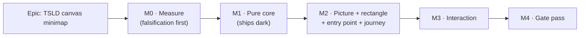

# Implementation Plan: TSLD canvas minimap

- **Feature spec:** [`./feature-spec.md`](./feature-spec.md)
- **Status:** Draft — awaiting approval
- **Owner:** _(unassigned)_

## Breakdown

### Epic

**TSLD canvas minimap** — close the last unbuilt Should-have on the primary surface
(`docs/PROJECT_BRIEF.md:92`, deferred by ADR-0026 `:500`) by giving the diagram a whole-plan
overview with a draggable viewport rectangle. Roadmap theme: the plan workspace.

**Standing rules for this epic**, each with the failure it is written against:

- **No `VITE_` flag** (ADR-0088 D1). Rollback is a commit boundary; the panel defaults off.
- **Frontend-only.** No API, no schema, no migration; the CPM engine is not imported, so the
  ADR-0034 parity gate is untouched by construction — there is nothing here to hold parity
  _for_. The database-architect agent is not engaged because there is **no schema change to
  design**, not because one was judged too small.
- **The journey lands with the first user-facing milestone** (M2), not at enablement — flag
  or no flag (`CLAUDE.md` §19, ADR-0081).
- **Every milestone header names its entry point or declares itself dark, in those words.**
- **A claim that decides something names what was run or read** (ADR-0076). Where a task
  says "verified red first", that means the test was run against the pre-change code and
  observed to fail.
- **Re-verify the problem, not only the design** (`CLAUDE.md` §19): M0-T2 rewrites the spec's
  problem statement from its own numbers before M1 starts.

---

## Milestone M0 — Measure, with the falsification condition written first

**Outcome:** a decision, backed by numbers, about whether and how to build. Nothing ships.
**Ships dark:** nothing is reachable and nothing is built — this milestone produces
measurements, three documents and one TECH_DEBT row. **M1 does not start until M0 reports.**
**Journey:** none (no capability). M0-T1 uses the existing browser harness, not Playwright.

**Why it exists.** Six consecutive epics in this register had a width or cost expectation
contradicted by their own measurement (ADR-0090 D-, ADR-0091 D4, ADR-0092 M4/M5, ADR-0093,
ADR-0094 M0-T1, ADR-0097 Landing C). The pan path is **already** dropping 10.2% of frames at
2,016 activities at Fit with ~8 ms/frame unattributed (`docs/TECH_DEBT.md:489-547`), and a
naive minimap is a second full-canvas raster. This is the risk that can kill the feature.

---

#### Feature: M0 evidence

> **Description:** the cost measurement, the need re-derivation, the collision check, and
> two decisions that must be recorded before they can be discovered late.
> **Complexity:** M
> **Dependencies:** access to the machine `docs/TECH_DEBT.md:486-487` names, the
> 2,016-activity generated programme, the operator's largest real plan, a 500-activity import.
> **Risks:** the measurement is taken on the wrong machine or a different plan and is
> therefore not comparable → the falsification condition below is **paired and same-session**,
> which removes both variables by construction.
> **Testing requirements:** none of M0 is a CI gate. Its outputs are numbers in this
> directory and one TECH_DEBT row.

##### Task M0-T1 — Write the falsification condition, then run it

- **Description:** resolve the two input reports' differing conditions into **one runnable
  test**, commit it to `docs/specs/tsld-minimap/m0-measurement.md` **before** any minimap
  code exists, then measure a prototype against it.
- **Complexity:** M
- **Dependencies:** none
- **The condition, in full:**
  - Harness: `apps/web/scripts/measure-draw-in-browser.js`, the Route-A DevTools script
    (`docs/TECH_DEBT.md:470-481`), `--headed`, on the machine named at `:486-487`.
  - Plan: the 2,016-activity generated programme
    (`packages/interchange/scripts/generate-scale-xer.mjs`), imported through the product's
    own importer, at **Fit** zoom — the dearest case.
  - **Paired and same-session.** Three baseline runs (minimap absent) and three treatment
    runs (minimap open, rectangle live) interleaved in one sitting on one machine. The
    2026-08-03 figure is a **reference, never the comparator** — comparing to it imports
    every difference between that session and this one.
  - **Pass:** `median(treatment dropped-frame %) ≤ median(baseline dropped-frame %) + 2.0
percentage points`. Interval p95 and heaviest-callback p95 are reported alongside.
  - **Why a 2 pp band and not strict inequality:** 10.2% is 54 of 527 frames; run-to-run
    noise on that sample would fail a strict gate on day one, and a gate that does that gets
    deleted rather than fixed (ADR-0058). Reasoned as ~1.5× a single run's binomial sampling
    noise (SE ≈ 1.3 pp at 54/527) — reasoned, not yet observed, which is the next clause's job.
  - **The band must exceed the noise it absorbs, and the run itself proves it** (agreement
    round, blocking finding 3): the baseline triple's own spread (max − min dropped-frame %)
    is recorded and **stated in the verdict**. If it exceeds the 2.0 pp band, the band cannot
    resolve the effect and a pass proves nothing while reading as proof — so runs are added
    until the spread sits inside the band, or the band is re-derived from the observed spread
    with the re-derivation recorded. A verdict that does not state the spread is not a verdict.
- **On failure, an ordered ladder — not a binary:**
  1. Confirm the rectangle is a pure `style.transform` write and nothing else per frame.
  2. Confirm the bitmap is **not** rebuilt per frame (the M2-T4 spy, run early).
  3. Demote the live rectangle: update it on pan **end** / throttled, keeping the picture.
  4. Withdraw to a static picture with no rectangle — at which point the feature is a
     picture, not a control, and **the epic is re-put to the product owner** rather than
     shipped quietly in a reduced form.
- **Risks:** a prototype good enough to measure is code, and code written to measure gets
  kept → it is written on a throwaway branch and **not** merged; M1 re-derives it from the
  spec. Stated so the shortcut is refused in advance.
- **Testing:** n/a — this _is_ the measurement.
- **Development steps:**
  1. Write and commit `m0-measurement.md` with the condition above and both input reports'
     original wordings, so the resolution is auditable.
  2. Throwaway prototype: bitmap build + blit + DOM rectangle, enough to be live.
  3. Six interleaved runs; record every figure, not just the medians.
  4. Record the verdict and, if it fails, which rung of the ladder was taken.

##### Task M0-T2 — Re-derive the need, and rewrite the problem statement

- **Description:** establish which axis carries the need, on real plans, at the width this
  product is judged on (1646 CSS px).
- **Complexity:** S
- **Dependencies:** none
- **Description of the measurement:** for the operator's largest real plan and a
  500-activity import, record world extent in **days** and **lanes**, then the visible
  fraction of each at every zoom preset at 1646.
- **Risks:** quoting a stale figure as established. ADR-0079's "60–80 lanes, ~a dozen
  visible" **predates** Graphite's canvas-height change (576 → 681 px) and is stale by
  construction (ADR-0076 Class 1); the spec's ~24 lanes and ~1.9% are derived and assumed
  respectively, and both are marked pending → this task replaces them and **rewrites
  `feature-spec.md` §1's problem statement from its own numbers**.
- **Testing:** n/a.
- **Development steps:**
  1. Measure both plans; record days, lanes, and visible fraction per preset.
  2. State which axis carries the argument, in one sentence.
  3. Rewrite the spec's Problem section; remove the "pending M0" markers.
  4. **If neither axis supports the control, say so and stop** — S1 in the spec's success
     criteria is a withdrawal condition, not a formality.

##### Task M0-T3 — Collision check, in a browser

- **Description:** confirm the canvas's bottom-right corner is genuinely free.
- **Complexity:** S
- **Dependencies:** none
- **Risks:** assuming rather than looking. Two known occupants and one unknown: the resource
  strip (`TsldCanvas.tsx:147`, 72 px, bottom full-width), the canvas dock below the container
  (`canvas-dock.tsx:89-105`), and **the Legend, which the planner can drag anywhere and
  which persists where it was put** (`TsldLegendPanel.tsx:75-79,145`) — so "bottom-right is
  free" is true of the default corner only.
- **Testing:** n/a — `scripts/shoot.mjs` at 1646.
- **Development steps:**
  1. Shoot the workspace at 1646 with the Legend open at its default corner, the resource
     strip active, and the WBS band on.
  2. Shoot it again with the Legend **dragged to the bottom-right**.
  3. Record the outcome and confirm the spec's policy (no auto-avoidance; the minimap
     offsets by `RESOURCE_STRIP_HEIGHT`; the Legend is the movable one).

##### Task M0-T4 — Re-run the bitmap-build probe, headed, on a named machine

- **Description:** confirm the input report's headless order-of-magnitude figures on real
  hardware, for the shape M1 will actually build: `worldExtent()` followed by one O(n)
  bar-geometry pass. The input report's reasoned ~2× fold saving is **not** measured because
  the fold is not built — the agreement round withdrew it (it collides with M1-T1's
  one-derivation invariant, and the whole cost sits on the scene-change path where 2 ms is
  noise). Recorded here so the premise does not resurface as an optimisation PR.
- **Complexity:** S
- **Dependencies:** M0-T1's prototype
- **Risks:** the headless numbers (input-performance §2) are explicitly order-of-magnitude
  only; building on them unverified is ADR-0076 Class 2.
- **Testing:** n/a.
- **Development steps:** run the probe headed; record p50/p95/max for the two-pass shape;
  state the figure beside the headless one so the order-of-magnitude claim is settled.

##### Task M0-T5 — File the `zoomToSelection` vertical-framing gap; do not absorb it

- **Description:** confirm live, then file, the **pre-existing** defect the accessibility
  report reasoned about.
- **Complexity:** S
- **Dependencies:** none
- **Evidence already established by reading:** `fitToContent` computes `maxLane` and never
  uses it, pinning `originY` to the padding (`render/viewport.ts:161,168,178`); the reveal
  effect's deps do not include a re-press (`components/TsldCanvas.tsx:1093`), so nothing
  repairs the framing. The reveal effect **does** pan vertically on a selection change
  (`:1087`) — the gap is narrower than "zoom to selection does not reveal".
- **Risks:** absorbing it into this epic would put an unrelated behavioural change on a diff
  whose whole argument is that it changes nothing about the scene — and `fitToContent` is
  also _Fit to plan_ and the export path.
- **Testing:** a Playwright probe that selects an activity in a high lane on a tall plan,
  presses zoom-to-selection, and records whether the bar is in view. Kept with the TECH_DEBT
  row, not merged as a gate.
- **Development steps:** write the probe; run it; file the row with the probe's output and
  both candidate fixes; **do not fix it here**.

##### Task M0-T6 — Decide and record two scope questions before they are discovered late

- **Description:** two questions that cost nothing now and a milestone later.
- **Complexity:** S
- **Dependencies:** none
- **Development steps:**
  1. **Does the minimap drag inherit ADR-0026 §9's `<100 ms` interaction-feedback clause?**
     Record the answer and its reason. _(Recommended: yes — it is interactive, the clause is
     about interactive feedback, and the DOM-rectangle design meets it trivially. Recorded so
     it is scoped, not discovered.)_
  2. **Q2 arithmetic, only if the product owner answered "promote".** Measure the strip at
     1646/1440/1280/960 with one extra pinned item via `e2e-toolbar-fit`; `PINNED_FLOOR_WIDTH`
     is 960 after ADR-0099 M5 and `docs/TECH_DEBT.md` #147 records the labelled-width squeeze.

---

## Milestone M1 — The pure core

**Outcome:** the world extent is derived exactly once in the codebase instead of three
times, and the minimap's picture is computable and tested.
**Ships dark — in those words:** **nothing is reachable from the product.** No panel mounts,
no toolbar row exists, no pixel changes. The capability is surfaced by **M2**.
**Journey:** none, deliberately — there is no entry point to press. M2 carries the journey.

---

#### Feature: `worldExtent` and the minimap render core

> **Description:** extract the world extent to the geometry leaf and convert all three
> existing derivations; add `render/minimap.ts` as a pure painter with its own scene and
> viewport.
> **Complexity:** L
> **Dependencies:** M0 reported and did not fail its falsification condition.
> **Risks:** (a) the extraction changes framing behaviour somewhere → the three call sites'
> existing suites are the before/after oracle and must pass **unchanged** (the ADR-0078
> barrel-preserving argument); (b) a fourth derivation appears later → structural test.
> **Testing requirements:** unit for `worldExtent` and the minimap core; counting-stub budget
> test; two structural tests (one-derivation, axis asymmetry); the three converted call
> sites' suites pass untouched.

##### Task M1-T1 — Extract `worldExtent` and convert all three derivations

- **Description:** add `worldExtent(activities, dataDate): { minDay, maxDay, maxLane } | null`
  to `render/geometry.ts`; make `dayExtent` (`render/paint.ts:2204`), `fitToContent`
  (`render/viewport.ts:159-169`) and `buildExportViewport` (`export/export-image.ts:106-117`)
  read it.
- **Complexity:** M
- **Dependencies:** none
- **Established, not assumed:** this costs the geometry leaf **no new import** —
  `RenderActivity` is declared in that file (`render/geometry.ts:336`) and `daysBetween` is
  already imported (`:18`), so `geometry-is-a-leaf.structural.test.ts:40`'s pinned specifier
  list is unchanged.
- **Risks:** `fitToContent` currently ignores its own `maxLane` (`viewport.ts:168` computes,
  `:178` discards). **Preserve that behaviour exactly** — repairing it here is M0-T5's filed
  defect, and fixing it inside a refactor is how a behavioural change hides in a "no
  behaviour change" diff.
- **Testing:** unit for `worldExtent` including the empty case (returns `null`), a
  single-activity case and a single-lane case; **`viewport.test.ts`, the export suites and
  the painter suites pass unchanged** — that is the acceptance condition.
- **Development steps:**
  1. Add `worldExtent` with a docblock stating it is the one derivation.
  2. Convert the three call sites, preserving `fitToContent`'s ignored-`maxLane` behaviour.
  3. Add `one-world-extent.structural.test.ts`: no file outside `geometry.ts` derives a lane
     maximum or a day extent inline. **Verified red** against the pre-change tree.
  4. Run the three suites; confirm zero assertion changes.

##### Task M1-T2 — `render/minimap.ts`, the pure core

- **Description:** `minimapViewport(extent, box)`, `minimapRects(activities, dataDate, extent, box)`
  and `buildMinimapBitmap(...)`, which **calls `worldExtent()` first and then makes one O(n)
  bar-geometry pass** — two passes, by decision. The agreement round caught the first wording
  ("one O(n) pass computing extent and bar geometry together") specifying the thing M1-T1's
  structural test forbids in the same milestone: folding the extent into the bar pass is a
  fourth inline derivation, and S8 sits exactly on that collision. The ~2× fold saving the
  performance input reasoned about is **withdrawn as a premise**: it would buy ~2 ms on a
  scene-change-only path measured in single-digit milliseconds, at the price of the epic's own
  one-derivation invariant. M0-T4 measures the two-pass shape as built.
- **Complexity:** L
- **Dependencies:** M1-T1
- **Design constraints carried from the spec:**
  - Draws, in this order (the order **is** the decimation policy): ground; non-critical bars;
    critical bars; the **data-date** vertical at 1 px. Later strokes overwrite earlier ones,
    so **the critical path survives the merge**.
  - **The selection marker and the Today vertical are NOT in the bitmap** — the agreement
    round caught both violating the dirty rule: a selection change and midnight both move
    marks that the rebuild triggers (data/resize/theme) never fire for, so the bitmap would
    show the previous selection until something unrelated invalidated it, and Today would go
    stale at midnight — the exact defect ADR-0056 F6a fixed on the main canvas, re-introduced
    one layer down. Both render as **DOM overlays beside the rectangle** (M2-T2), which is
    §4.1's own thesis applied consistently: the picture is invariant, and everything that
    moves is DOM. The data-date vertical stays in the bitmap because the data date is plan
    data — it changes only with the scene.
  - `w`/`h` floored at 1 px on both axes.
  - **x uses `screenXOfDay`; y deliberately does not use `screenYOfLane`** (which hardcodes
    `LANE_HEIGHT`) — `y = laneIndex * boxHeight / (maxLane + 1)`. The docblock says why.
  - Omits ten of the painter's fifteen layers, each with its reason in the docblock — links
    above all (3,200 links in a 200 px box is a smear that hides the bars).
  - Takes the scene's palette; resolves none of its own (`render/palette.ts:12-19`).
  - The bitmap is a plain detached canvas keyed by identity, following `nonWorkingHatchTile`
    (`render/paint.ts:402-422`) — **not** the `OffscreenCanvas` API, which this codebase does
    not use.
  - **The blit is not in here.** `Ctx2D` has no `drawImage` (`render/ctx-2d.ts:10-46`), so
    the build stays pure and `Ctx2D`-typed (which is what earns it the counting-stub gate)
    and the per-frame blit happens in `TsldCanvas.tsx` against the real context.
- **Risks:** reaching for `cull()` + `activityRect()` — measured to return **255 of 2,160**
  bars at a whole-plan viewport (input-performance §5). The docblock records that number so
  the next reader does not "simplify" it back.
- **Testing:** unit — extent-to-box mapping, the 1 px floor, critical-after-non-critical
  ordering, the empty and single-activity cases, and a decimation case asserting a critical
  bar survives a collision with a non-critical one.
- **Development steps:** write the module; write `minimap.test.ts`; write
  `minimap-axes.structural.test.ts` pinning both halves of the asymmetry.

##### Task M1-T3 — The counting-stub budget gate

- **Description:** `render/minimap-budget.test.ts`, modelled on
  `render/paint.wbs-band-budget.test.ts`'s `countingCtx()`.
- **Complexity:** S
- **Dependencies:** M1-T2
- **Asserts:** draw-call count is O(activities); **zero** `fillText`/`measureText` and zero
  per-bar `strokeRect` in the bitmap pass; `fillStyle` is batched into exactly two passes
  (normal, then critical).
- **Risks:** the counting stub **cannot** catch a per-frame-rebuild regression — that is
  M2-T4's job, and this test's docblock says so, so a green suite is not read as covering it.
- **Testing:** the test is the deliverable.

##### Task M1-T4 — Correct two docblocks that name this feature

- **Description:** `render/paint.ts:775-776` says the caller reuses the culled-id set "for
  hit-testing / the minimap"; the only production caller discards it
  (`components/TsldCanvas.tsx:1317`) and every consumer of the return value is a test. The
  minimap **must not** use it — the culled set is what is _on_ screen and the minimap's
  subject is what is _off_ it. Correct the sentence; do not wire it. Correct `dayExtent`'s
  "(for the ruler/minimap)" (`:2203`) in the same task — it becomes true of `worldExtent`.
- **Complexity:** S
- **Dependencies:** M1-T1
- **Risks:** none. Leaving it is ADR-0058's class in the first file the next implementer opens.
- **Testing:** none (comment only); called out in the PR description so it is not read as churn.

##### Task M1-T5 — File the ADR as Proposed

- **Description:** write the ADR from `feature-spec.md` §4.9's outline and file it _Proposed_.
- **Complexity:** S
- **Dependencies:** M1-T1..T4
- **Risks:** taking a number that has been claimed since the spec was written. **Verify the
  next free number against `docs/adr/` and `docs/adr/README.md` on the day of filing**
  (ADR-0071 was cited by shipped code while absent from the register; ADR-0079 hit exactly
  this). Add the register entry to **both** files in the same commit.
- **Testing:** `pnpm check:doc-links`.

---

## Milestone M2 — The picture, the rectangle, and the way in

**Outcome:** a planner can turn on a minimap and see where they are in the whole programme.
**Entry point:** the plan workspace → **`View ▾`** → the **Panels** fieldset → the
**`Minimap`** checkbox. _(The Panels section is **empty today** — `legend`, its only member,
is promoted to Row 1 (`toolbar/tsld-toolbar-items.tsx:304`), `lensTogglesIn` excludes
promoted items (`:308`) and the fieldset is skipped when empty (`:1625`). The minimap
re-creates the section as its sole occupant.)_
**Journey:** `apps/web/e2e-minimap/minimap.spec.ts` — **lands here, not at M4** (ADR-0081,
`CLAUDE.md` §19). Its first step opens a plan, opens `View ▾`, presses `Minimap` by
accessible name, and asserts the panel is present with the rectangle inside it.

**Deliberately not sliced picture-from-rectangle.** A minimap with no rectangle is
ADR-0059 M6's lit-but-inert shape: it would look finished and answer nothing.

---

#### Feature: the minimap panel

> **Description:** the DOM panel, the cached bitmap wired into the existing rAF loop, the
> read-only viewport rectangle, the toggle, and persistence.
> **Complexity:** L
> **Dependencies:** M1 complete.
> **Risks:** (a) a second rAF loop or a second `ResizeObserver` creeps in → both are asserted;
> (b) a bitmap rebuilt per frame → M2-T4's spy, verified red; (c) the panel covers something
> → M0-T3's screenshots.
> **Testing requirements:** contrast gate before the CSS; component tests; the hidden-pane
> invocation test; the set-equality structural test; the journey with axe opted in.

##### Task M2-T1 — The frame token and its contrast gate, **before** the CSS

- **Description:** add `--canvas-minimap-frame` to the `canvas` surface scope and its pairs
  to `styles/token-contrast.test.ts` **first**.
- **Complexity:** S
- **Dependencies:** none
- **Design:** the rectangle's frame is "the boundary of a UI component" — the case WCAG
  1.4.11 names — so it must clear **3:1**. Its grounds are **not** `PLOT_GROUNDS`: a minimap
  has no month band, and at scale the rectangle crosses dense bars. Sweep
  `MINIMAP_GROUNDS = ['--canvas', '--primary', '--destructive']` with `it.each`, exactly as
  `token-contrast.test.ts:260-271` does for the grid tiers.
- **Risks:** writing the CSS first and the gate after is how `--canvas-grid-month` shipped at
  2.08:1 behind a green suite and a paragraph saying it could not (`token-contrast.test.ts:225-234`).
- **Testing:** the gate is **verified red** by adding the pairs before the token has a value.
- **Development steps:** add the pairs (red) → add the token value → green → then M2-T2.

##### Task M2-T2 — `TsldMinimap.tsx` and the host wiring

- **Description:** the panel, the `aria-hidden` preview canvas, the DOM rectangle, and the
  five lines of `TsldCanvas` orchestration.
- **Complexity:** L
- **Dependencies:** M1-T2, M2-T1
- **Design constraints:**
  - Mounted **inside** `TsldCanvas`'s container as a fifth pinned layer reading `viewRef`
    directly — the resource strip's palette/canvas/dirty-ref trio, already copied once by the
    WBS band (`TsldCanvas.tsx:679-695, 1105-1112, 1390-1402`).
  - `
` containing an `aria-hidden="true"`
    canvas — matching every other canvas layer (`TsldCanvas.tsx:610, 1659, 1684, 2023`).
    **No `role="scrollbar"`, `role="slider"` or `role="application"`** — the first two are
    single-axis single-value contracts and this viewport is 2-D plus zoom; the third appears
    **nowhere** in `apps/web/src` and every hand-rolled widget here is semantic HTML plus
    explicit roles (`CLAUDE.md` §12).
  - Bitmap rebuilt on `minimapDirtyRef` only — set on activity-data change, box resize and
    theme bump. **Not** on `movedThisFrame`, not on selection change, not on a clock tick.
  - **Two DOM overlays beside the rectangle, for the two marks whose subjects move without
    the scene changing** (agreement round, blocking finding 2): the selection marker
    (≥3×3 px, positioned from the selected activity's minimap coords on the React render a
    selection change already causes) and the Today vertical (1 px, positioned via the
    existing `useNow(60_000)` tick — `render/use-now.ts`, the ADR-0056 F6a instrument, so
    minimap-Today and canvas-Today go stale or stay fresh together). Neither costs a rebuild;
    both are `aria-hidden` decoration like the picture beneath them.
  - Rectangle updated on `movedThisFrame` (`TsldCanvas.tsx:1315`) by one `style.transform`
    write on a ref'd div — no `setState` per frame (ADR-0026 D3).
  - Sizing joins `measure()`'s existing single `getDpr()` block (`:1213-1256`, `:1436-1437`).
    **No new `ResizeObserver`** — seven already exist.
  - Offset upward by `RESOURCE_STRIP_HEIGHT` when the strip is active. The Legend does **not**
    do this and can sit over the strip; the minimap does not inherit that.
  - Rectangle clamped to the box; visible frame never drawn below 8 px on either axis.
  - Close button uses a **new `icon-lg` (`size-11`, 44 px) `Button` size** — the library has
    no 44 px icon variant (`components/ui/button.tsx:35,38` are 40 px and 28 px) and a
    one-off `className` is banned (`CLAUDE.md` §12).
- **Risks:** `TsldCanvas.tsx` is ~2,000 lines and ADR-0078 §3 defers its decomposition, so a
  fifth layer is more of what that ADR was written about → the pure/host split keeps host
  wiring near the resource strip's ~40 lines, and the counter-argument is recorded in the ADR
  rather than dismissed.
- **Testing:** `TsldMinimap.test.tsx` — renders the group with its name; the canvas is
  `aria-hidden`; the rectangle reflects a given viewport; the empty-plan sentence renders
  instead of a blank box; the strip offset applies when active; **a selection change moves
  the marker while the bitmap-build spy records zero calls** (the finding's regression test,
  verified red against a bitmap-resident selection).
- **Development steps:** pure-to-host wiring → the panel → the rectangle → the strip offset →
  the `icon-lg` size and its `docs/DESIGN_SYSTEM.md` line.

##### Task M2-T3 — The toggle and persistence

- **Description:** `use-minimap-panel-prefs.ts` plus one `LensToggle` in `LENS_TOGGLES`.
- **Complexity:** S
- **Dependencies:** M2-T2
- **Design:** `group: 'panels'`, `label: 'Minimap'`, `checked`/`toggle` from the prefs hook,
  `reason: (ctx) => ctx.hasDiagram ? undefined : LENS_NO_DIAGRAM_REASON`
  (`tsld-toolbar-items.tsx:266`'s shape — **shade with a reason, never hide**, ADR-0082). **No
  `promotion` field in v1** (Q2). **No `TsldViewToggles` key** — that type means "which
  optional canvas layers draw", is read by the pure painter and the Gantt, and both existing
  panels sit outside it. Storage key `schedulepoint-tsld-minimap`, copying
  `use-legend-panel-prefs.ts:30-52` including the try/catch shape. Global, not per-plan, not
  in the URL.
- **Risks:** persisting to the URL by analogy with ADR-0095's Gantt memory → that earned the
  URL because sort and columns change what the reader is _looking at_; minimap visibility is
  a workstation preference, and a link forcing the recipient's minimap open is noise.
- **Testing:** hook unit tests (default, round-trip, corrupt payload, blocked storage);
  registry test that the row appears under Panels and carries the reason when there is no
  diagram.

##### Task M2-T4 — Extend the hidden-pane test with a minimap spy

- **Description:** extend `components/TsldCanvas.hidden-pane.test.tsx` (which today spies
  only `paintScene`) to assert the bitmap build is **not** called on a pan-only frame,
  **is** called once on a scene change, and is **not** called while the pane is hidden.
- **Complexity:** M
- **Dependencies:** M2-T2
- **Risks:** this is the load-bearing gate and the counting stub cannot stand in for it.
- **Testing:** **verified RED first against a naive own-rAF implementation** — write the
  naive version, watch the test fail, then implement correctly. Without that step the test
  proves nothing about what it was written to prevent.

##### Task M2-T5 — Pin the a11y-layer invariant

- **Description:** `minimap-a11y-parity.structural.test.ts` — the count **and identity** of
  AT-reachable activities is unchanged with the minimap open.
- **Complexity:** S
- **Dependencies:** M2-T2
- **Design:** **set equality, not a count** — the count is the weaker check
  (`TsldPanel.wbs-band.test.tsx:86-99` is the shipped precedent). The listbox is built from
  `activities`, never from what the canvas paints (`render/a11y.ts:8-11`); the minimap must
  not mirror activities into minimap-scoped DOM, which is the exact draft ADR-0063 rejected.
- **Testing:** the test is the deliverable; verified red against a deliberate violation.

##### Task M2-T6 — Focus never drops to `<body>`

- **Description:** closing the panel (× button, toggle off, responsive withdrawal) moves
  focus **synchronously, in the same handler**, to the control that dismissed it.
- **Complexity:** S
- **Dependencies:** M2-T2, M2-T3
- **Risks:** this is the most repeated named a11y regression in this codebase —
  `app-shell.tsx:181-205` records it shipping three times, and widening the search finds at
  least five (ADR-0060 M6, ADR-0063 M6, ADR-0064 §7, ADR-0096, ADR-0099 M10). "We'll be
  careful" is not credible against that history.
- **Testing:** a regression test per route (close button, toggle off, withdrawal), each
  asserting `document.activeElement` is the expected control and **not** `<body>`.

##### Task M2-T7 — The journey

- **Description:** `apps/web/e2e-minimap/` + `playwright.minimap.config.ts` +
  `test:e2e:minimap` script + a CI step + a `scripts/e2e-local.sh` target.
- **Complexity:** M
- **Dependencies:** M2-T2, M2-T3
- **Design:** opens a plan with a real API, presses `View ▾`, presses `Minimap` **by
  accessible name**, asserts the panel and the rectangle. Locates controls by role and name,
  never by copy or CSS selector (ADR-0091 M7's rule after three journeys broke on labels).
  The axe scan **opts in `wcag22aa` and `target-size: { enabled: true }`**, mirroring
  `e2e-toolbar-fit/fit.spec.ts:708-739` — every existing suite scans only `wcag2a`/`wcag2aa`
  and axe ships `target-size` disabled, so "the scan is green" is otherwise meaningless
  (ADR-0090 M1).
- **Risks:** deferring the journey to M4 is exactly the ADR-0081 failure; it lands here.
- **Testing:** run locally via `scripts/e2e-local.sh web:minimap` **before** pushing —
  CI is the second opinion, never the first.
- **Development steps:** config → spec → package script → CI step → `e2e-local.sh` target →
  `docs/TESTING.md` line.

---

## Milestone M3 — Interaction

**Outcome:** the minimap becomes a control rather than a picture — drag to pan, click to
jump, and full keyboard operation.
**Entry point:** the same panel from M2. The new affordances are the rectangle itself
(pointer) and the group's keyboard contract (`Tab`, arrows, `Home`/`End`).
**Journey:** M2's suite is extended in M3-T7 with drag, click-to-jump and keyboard cases.

---

#### Feature: pan, jump, keyboard

> **Description:** one command (`centerOnWorld`) reached three ways, plus the Escape rung and
> the announcement policy.
> **Complexity:** L
> **Dependencies:** M2 complete.
> **Risks:** (a) a second implementation of "centre the view here" → one function, pinned;
> (b) a new global Escape listener instead of a ladder rung → verified red both ways;
> (c) an unreachably small drag target → AC-3.4's pad.
> **Testing requirements:** unit, component, structural, and journey; plus the accessibility
> hard requirements 1, 2, 5 and 6.

##### Task M3-T1 — `centerOnWorld` and the drag

- **Description:** add `centerOnWorld(day, lane)` to `TsldCanvasHandle`
  (`components/TsldCanvas.tsx:107-133`) as a pure view transform; wire pointer-down/move/up
  on the rectangle with pointer capture.
- **Complexity:** M
- **Dependencies:** M2
- **Design:** `centerOnDate` is **not** refactored into it — it centres horizontally only,
  takes ISO, has three callers and its own suite. Cursor: `grab` over the rectangle,
  `grabbing` while dragging, `pointer` elsewhere (`TsldCanvas.tsx:1706-1715`'s shape).
  **No announcement per frame.**
- **Risks:** panning past the extent → the existing `pan` clamp does it; nothing new.
- **Testing:** unit for `centerOnWorld`'s arithmetic; component test for capture and cursors.

##### Task M3-T2 — Click-to-jump, through the same path

- **Description:** a click outside the rectangle centres on that world point and announces once.
- **Complexity:** S
- **Dependencies:** M3-T1
- **Design:** the same `centerOnWorld` — one code path entered differently (ADR-0065/0079's
  one-function rule). Announcement follows the verified house pattern: continuous pointer
  gestures announce nothing (`TsldCanvas.tsx:1890-1898`, `:1454-1467`), discrete jumps
  announce once (`toolbar/commands/use-viewport-commands.ts:60`). Sentence shape: "Viewing
  {range}, lanes {n}–{m}."
- **Testing:** structural test that both entry points call one function; component test for
  exactly one announcement per commit.

##### Task M3-T3 — The keyboard contract

- **Description:** `Tab` focuses the group; `←`/`→` page-pan days; `↑`/`↓` page-pan lanes;
  `Home`/`End` jump to the plan's first/last dated day.
- **Complexity:** M
- **Dependencies:** M3-T1
- **Design:** every keypress calls the **identical pure functions** the pointer path calls
  (`render/viewport.ts:81-83`), modelled on `components/ui/panel-resizer.tsx:41-49,116-144`.
  Held-key bursts **coalesce** to one announcement (`TsldPanel.tsx:1606-1619`'s
  `useCoalescedNudge`). Any tween gates on `matchMedia('(prefers-reduced-motion: reduce)')`
  — the global CSS rule (`styles/globals.css:1106-1116`) cannot reach a JS-driven canvas
  repaint. **Default is an instant jump and no tween**, which makes the question moot in v1
  and is recorded as the reason.
- **Why it is not optional (2.1.1):** every existing keyboard route to a viewport position is
  **anchored** — to an activity, a match, a conflict or a typed date. There is **no** keyboard
  command that pans to an arbitrary unanchored point the way empty-ground drag and wheel-zoom
  do. A pointer-only minimap is arguably defensible by the letter and is not defensible by
  this repository's practice: ADR-0064/0079/0080 all shipped keyboard parity beside every
  pointer gesture, and the minimap's headline value is on exactly the plans where a
  keyboard-only user needs it most.
- **Risks:** colliding with the listbox's selection cursor (`TsldPanel.tsx:1869-1878,1894`),
  `Alt+Arrow` or `Shift+←/→` (`:1818-1848`) → distinct DOM node, nothing claimed globally;
  asserted.
- **Testing:** component tests per key; a collision test proving the listbox's bindings are
  unchanged while the minimap has focus; a coalescing test asserting one announcement per burst.

##### Task M3-T4 — One Escape rung, innermost

- **Description:** Escape cancels an **in-flight** minimap drag, restoring the viewport to its
  value at press.
- **Complexity:** S
- **Dependencies:** M3-T1
- **Design:** a rung, not a listener — `preventDefault()` **then** act, so outer rungs see the
  press was answered (`lib/escape-rungs.ts:39-45`'s contract). It claims the press **only**
  while dragging; the minimap adds no rung at rest.
- **Testing:** **verified red both ways** — (a) Escape mid-drag restores the viewport;
  (b) Escape with **no** drag does not reach the minimap and the existing ladder behaves
  byte-for-byte as before.

##### Task M3-T5 — The tool-mode and gating contract

- **Description:** three behaviours that are one line each and are the difference between a
  control and a trap.
- **Complexity:** S
- **Dependencies:** M3-T1
- **Design and its reasons:**
  - A minimap drag must **not** drop an open Link pick. `dropLinkPickSignal` means "the bars
    are about to move" (`TsldCanvas.tsx:261-267`) — a _data_ change. A pan moves the camera
    and the pick is against an activity id. The distinction is written down in the code.
  - `Ctrl`-drag on the minimap is an ordinary pan, **never** a marquee (that chord belongs to
    the scene, `TsldCanvas.tsx:1729-1730`).
  - **Not pen-gated and no recalculation hold** — navigating is a read (ADR-0063 M4b /
    ADR-0080) and the minimap writes nothing. A Viewer and an External Guest get a working
    minimap.
- **Testing:** one test per bullet; the Viewer/guest case asserted through a rendered panel
  with `canEdit={false}` (the shape `features/share/components/GuestPlanView.tsx:227` uses).

##### Task M3-T6 — A rectangle you can actually hit

- **Description:** a transparent hit pad giving the draggable rectangle a minimum of
  **24×24 CSS px**, with the visible frame floored at 8 px per axis.
- **Complexity:** S
- **Dependencies:** M3-T1
- **Why:** at the Day preset (`ZOOM_TARGET_DAYS.day = 14`, `render/geometry.ts:278`) on a
  two-year plan the true rectangle is ~2% of a 200 px box — about **4 px** wide. **None of the
  three input reports covered this**; it was found while checking them. WCAG 2.5.8's AA
  minimum is 24×24, and while the _Equivalent_ exception arguably applies (click-to-jump and
  the keyboard both reach every position), relying on an exception for the feature's primary
  gesture is not this repository's practice.
- **Testing:** a unit test for the pad arithmetic at extreme zooms; the journey's axe scan
  with `target-size` enabled (M2-T7) covers it end to end.

##### Task M3-T7 — Extend the journey

- **Description:** add drag, click-to-jump and keyboard cases to `e2e-minimap`.
- **Complexity:** M
- **Dependencies:** M3-T1..T6
- **Risks:** a journey that asserts only the DOM and not the effect. It must assert the
  **viewport moved** — read back through the canvas's own observable state, not from the
  element under test.
- **Testing:** run locally before pushing (`scripts/e2e-local.sh web:minimap`).

---

## Milestone M4 — The gate pass

**Outcome:** the epic is reviewed by specialists over the combined diff, M0's numbers are
re-derived from the **final** code, and the ADR moves to Accepted.
**Entry point:** none new — this milestone changes no capability. _(It is not "ships dark":
the capability shipped at M2. M4 hardens it.)_
**Journey:** the existing `e2e-minimap` suite, plus any regression case a finding produces.

**Why this milestone always earns its place.** Seven consecutive epics' gate passes found
defects that had passed a human read, and the recurring shape is _one correct pattern applied
to a control and not its neighbour_.

---

#### Feature: review, re-measure, record

> **Complexity:** M
> **Dependencies:** M3 complete.
> **Risks:** treating the reviews as a formality → every blocking finding is folded with a
> regression test **verified to fail against the pre-fix code first**.
> **Testing requirements:** the full pre-push gate plus `scripts/e2e-local.sh web:minimap`.

##### Task M4-T1 — Five specialist reviews over the combined diff

- **Description:** `ux-reviewer`, `accessibility-reviewer`, `component-reviewer`,
  `performance-reviewer`, `ui-architect`.
- **Complexity:** M
- **Dependencies:** M3
- **Note:** `security-reviewer` and `backend-performance-reviewer` are **not** engaged, and
  the reason is stated rather than implied: there is no request, no permission, no scope, no
  secret, no query and no schema in this diff.
- **Testing:** each blocking finding gets a regression test verified red first.

##### Task M4-T2 — Re-derive M0 from the final code

- **Description:** re-run M0-T1's paired falsification condition against the shipped
  implementation, and M0-T4's probe.
- **Complexity:** S
- **Dependencies:** M4-T1
- **Risks:** carrying M0's numbers forward as if they described the final code — the failure
  ADR-0099 M3 caught by running the harness against the before state.
- **Testing:** the measurement is the deliverable; recorded in `m0-measurement.md` beside the
  original.

##### Task M4-T3 — The two "reasoned, not observed" verifications

- **Description:** the accessibility report's own caveats, now that a surface exists.
- **Complexity:** S
- **Dependencies:** M4-T1
- **Development steps:**
  1. Real-AT behaviour of `role="group"` plus coalesced announcements (NVDA / VoiceOver at
     minimum). Record what was heard, not what was expected.
  2. Whether a sighted low-vision keyboard user gets adequate visual feedback from a
     coalesced arrow-pan (the frame moving) — hands-on, not a code read.
  3. Anything found becomes a fix with a test, or a TECH_DEBT row with the observation.

##### Task M4-T4 — Documentation, register and release

- **Complexity:** S
- **Dependencies:** M4-T1..T3
- **Development steps:**
  1. Move the ADR to **Accepted**; add its entry to `CLAUDE.md` §16 and `docs/adr/README.md`.
  2. `docs/PROJECT_BRIEF.md` §8 — mark the Should-have met, in the honest form (what shipped
     and what did not: no hover readout, no links, no shareable viewport).
  3. `docs/TECH_DEBT.md` — the `zoomToSelection` gap (filed at M0-T5, cross-referenced), the
     44 px vs 28 px close-button inconsistency beside #127, and M4's non-blocking findings as
     one numbered row.
  4. `docs/DESIGN_SYSTEM.md` — the `icon-lg` size; `docs/TESTING.md` — the `e2e-minimap` suite.
  5. `pnpm changeset` (minor, `@repo/web`), and confirm `pnpm check:doc-links`,
     `pnpm check:counts` and `pnpm check:claims` are green.

---

## Sequencing & slices

`M0 → M1 → M2 → M3 → M4`, in order, each keeping `main` releasable.

- **M0 gates M1.** If the falsification condition fails, the ladder in M0-T1 is walked and
  the outcome is re-put to the product owner. If M0-T2 finds neither axis supports the
  control, the epic is withdrawn.
- **M1 is dark and independently releasable** — its user-visible effect is nil, and the
  `worldExtent` extraction is a net simplification (three derivations → one) that stands on
  its own if the epic later stops.
- **M2 is the first user-facing slice and carries the entry point and the journey.**
- **M3 is additive** — the panel from M2 remains correct throughout.
- **M4 changes no capability.**
- **No feature flag** (ADR-0088 D1). The rollback for each slice is its commit boundary, and
  the panel defaults off (Q1), which is a behavioural rollback in itself.
- **Approved work runs to completion** (`CLAUDE.md` §19.11): the next slice starts in the
  same turn. A blocking question blocks one milestone, not the programme.

## Definition of Done (per task)

Each task's PR satisfies the Feature Completion Criteria in
[`docs/PROCESS.md`](../../PROCESS.md). For this epic specifically:

- The pre-push gate is **run**, not merely written: `pnpm lint && pnpm typecheck && pnpm test`.
- `scripts/e2e-local.sh web:minimap` is run for every task that touches the journey — and
  `scripts/e2e-local.sh api` is **not** applicable, because no task touches `apps/api`.
- Any task that changes a screen also runs the **base** journey (`pnpm --filter @repo/web
test:e2e`), per the rule ADR-0096 added after the base suite was the one thing the
  documented gate could not run.
- No task adds a `VITE_` flag, a `ResizeObserver`, an rAF loop, or a second per-activity DOM list.

## Risks & assumptions (rollup)

| Risk / assumption                                                                                                                          | Likelihood                                | Impact                                                             | Mitigation                                                                                                                     |
| ------------------------------------------------------------------------------------------------------------------------------------------ | ----------------------------------------- | ------------------------------------------------------------------ | ------------------------------------------------------------------------------------------------------------------------------ |
| **The pan path is already dropping frames (10.2% at 2,016 at Fit, ~8 ms/frame unattributed) and a minimap is a second full-canvas raster** | med                                       | **high — can kill the feature**                                    | The invariant-picture + DOM-rectangle design; M0-T1's paired falsification condition **before** M1; the M2-T4 spy verified red |
| The measured need is stale and points at the wrong axis                                                                                    | **high**                                  | med                                                                | M0-T2 re-derives and **rewrites** the problem statement; the spec marks every figure pending                                   |
| A fourth inline derivation of `maxLane` appears later                                                                                      | med                                       | med                                                                | M1-T1's one-derivation structural test                                                                                         |
| An implementer reuses `cull()`/`activityRect()` for the minimap                                                                            | med                                       | high (silently wrong: 255 of 2,160 bars)                           | The measured number is in the module docblock; the axis-asymmetry structural test                                              |
| Decimation below 1 px/lane hides the critical path                                                                                         | **high (it is the normal case at scale)** | med                                                                | `max(1, …)` plus paint order as the policy, with a unit test asserting a critical bar survives a collision                     |
| Panel-on-panel collision (resource strip; a Legend dragged to the corner)                                                                  | med                                       | low                                                                | M0-T3's browser check; the strip offset; a stated no-auto-avoidance policy                                                     |
| A hover tooltip will be requested                                                                                                          | **high**                                  | low                                                                | Said no in the spec **with the pixel arithmetic**, and the date-readout counter-argument recorded for a later revisit          |
| Focus drops to `<body>` on close                                                                                                           | med                                       | high (WCAG 2.4.3, and it silently disables workspace accelerators) | M2-T6's three regression tests; the five recorded prior instances named in the task                                            |
| The rectangle is too small to hit at fine zooms                                                                                            | **high**                                  | med                                                                | M3-T6's 24×24 pad and 8 px visible floor                                                                                       |
| The new ADR takes a number claimed since the spec was written                                                                              | med                                       | low                                                                | M1-T5 verifies against `docs/adr/` **and** `README.md` on the day                                                              |
| `TsldCanvas.tsx` grows a fifth layer against ADR-0078 §3's deferral                                                                        | **certain**                               | low                                                                | Accepted knowingly; the pure/host split keeps host wiring small; recorded in the ADR's Consequences rather than omitted        |
| **Assumption:** the ADR-0034 parity gate is untouched                                                                                      | —                                         | —                                                                  | Structural: the CPM engine is not imported and `computeSchedule` is not called; there is nothing here to hold parity _for_     |
| **Assumption:** no schema change, so no database-architect                                                                                 | —                                         | —                                                                  | Verified: no model, column, index, constraint or migration in any task                                                         |
