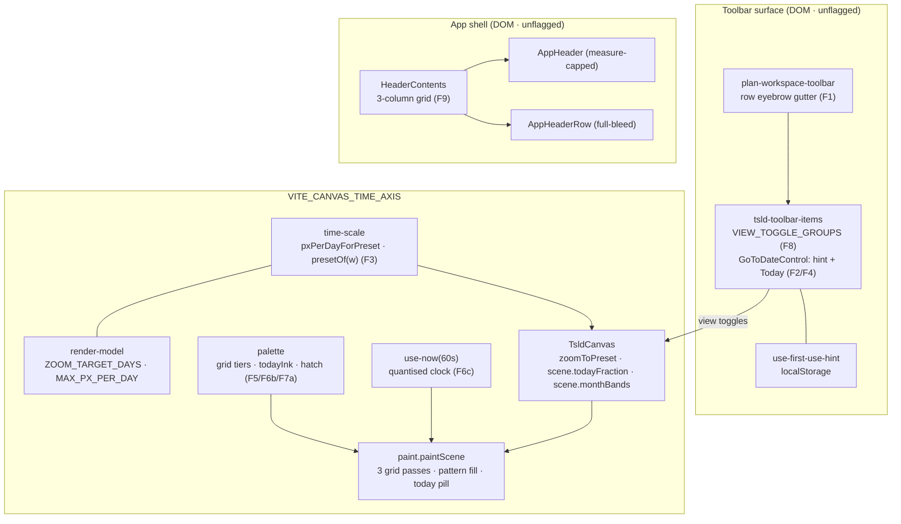
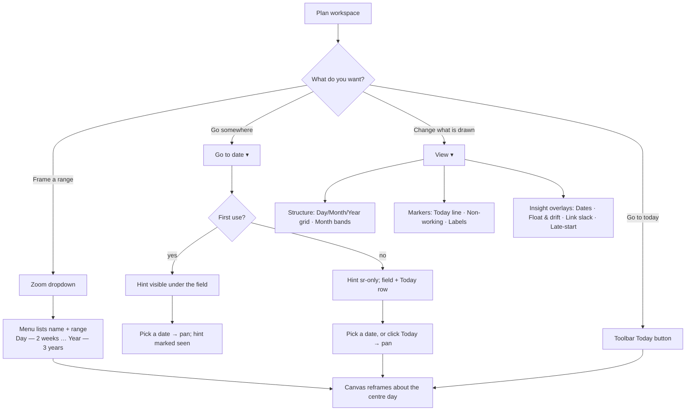

# Feature Spec: TSLD toolbar & canvas refinements

- **Status:** Draft — awaiting approval
- **Author:** feature-analyst
- **Date:** 2026-07-27
- **Roadmap link:** TSLD workspace quality (continuation of the ADR-0031 toolbar surface)
- **Related ADR(s):** ADR-0031 (toolbar registry & taxonomy — refined), ADR-0026 (canvas
  rendering & viewport — amended by §4.3/§4.6), ADR-0054 (live feedback — hatch & chip
  precedent), ADR-0055 (visual language & token architecture — §4 amended by §4.7),
  ADR-0029 (app shell — §4.9), **ADR-0056 (proposed, drafted in §4.11)**
- **Predecessor:** the four-item toolbar-polish pass (`.changeset/tsld-toolbar-polish.md`,
  PR #176/#177, released `web-v0.52.1`). This batch is the same family of change, one
  review cycle later.

---

## 1. Business understanding

### Problem

The canvas-maximal toolbar workspace (ADR-0031) and the canvas visual language (ADR-0055)
both shipped and are default-on. A second product-owner walkthrough found ten residual
defects. None is a missing capability; every one is a case where the surface **says
something it does not mean**:

| #   | What the surface says                                                           | What is true                                                                       |
| --- | ------------------------------------------------------------------------------- | ---------------------------------------------------------------------------------- |
| 1   | "Navigate" / "Build" look like two more toolbar buttons                         | They are row-purpose labels, not controls                                          |
| 2   | "Pans the timeline only — nothing is saved." is permanent policy text           | It is a one-time disclosure for a first-time user                                  |
| 3   | "Week" is a named amount of time                                                | It is a fixed px-per-day constant; the visible range changes with the window width |
| 4   | Go-to-today exists only on the bar                                              | It is the same command as Go-to-date, and belongs beside it too                    |
| 5   | Day, month and year gridlines are one kind of line                              | They are three levels of a hierarchy, drawn identically                            |
| 6   | The Today line marks "today"                                                    | It marks **midnight** at the start of today, and goes stale as the session runs    |
| 7   | Two near-identical greys mean two different things (month band vs. non-working) | Only one of them is even user-controllable                                         |
| 8   | `View▾` is a flat list of nine unrelated switches                               | It is three distinct concerns (structure, markers, insight overlays)               |
| 9   | The header's nav "fills the middle"                                             | It occupies leftover space; it is not centred                                      |
| 10  | Row 2's icon-only buttons are icon-only because there is no room                | They are icon-only because `tier === 2`, regardless of room                        |

Items **1–8** have an approved direction (§2). Items **9 and 10** are approved in
principle but carry an unresolved design/measurement question, resolved in §3.9 / §3.10
and §4.9 / §4.10.

### Users

**Planner** and **Org Admin** feel all ten (they author on this surface daily).
**Contributor / Viewer** feel 1, 2, 3, 5, 6, 7, 8, 9 — every one of those is display or
navigation, not authoring, so nothing here is pen-gated (ADR-0028) or permission-gated.
**External Guest** (ADR-0051 `/share`) renders the same `TsldPanel`, so the canvas items
(5, 6, 7) reach the guest view too; that is intended and adds no capability.

### Primary use cases

1. Read a toolbar row and know instantly which parts are controls.
2. Pick a zoom preset and get a **predictable amount of calendar time** on screen.
3. Read the time axis and tell a day boundary from a month boundary from a year boundary.
4. See where "now" is, to the hour, without doing arithmetic — and trust it after lunch.
5. Tell a weekend from a month band at a glance.
6. Find a display switch in `View▾` without reading all nine.
7. Jump the viewport to today from wherever the date controls are.

### Expected outcomes

The workspace stops needing explanation. Specifically: no label reads as a button; a
preset name means a duration; the axis reads as a hierarchy; "today" means today; a
weekend reads as a weekend; and the header's centre looks deliberate.

### Success criteria

- Picking any zoom preset frames its target range within **±10%** at every canvas width
  between 800 px and 2 560 px (§4.3) — verified by unit test, not by eye.
- The Today marker is never more than **60 s** out of date while the tab is visible (§4.6).
- Every changed canvas layer holds the ADR-0026 draw budget: **no increase in per-frame
  primitive-call counts** for the layers it touches (structural counting-stub gates, §3.7).
- `VITE_CANVAS_TIME_AXIS=false` paints **byte-for-byte** the pre-change canvas (the
  rollback contract).
- Zero new API, DB, or backend surface; zero new permission.

### Open questions

None blocking. Defaults stated for every judgement call, marked **[default]** in §4.
Two items carry an explicit gate rather than a question:

- **§3.10 is a go/no-go gate**, not a question: no plan line-item may promote a named
  Row-2 icon to a labelled tier until the measurement in §3.10 passes.
- **§3.9** carries a visual-verification task inside its own milestone; the layout
  approach itself is settled in §4.9.

---

## 2. Functional requirements

Requirements are numbered to match the review items so the plan, the spec and the review
transcript stay addressable by one id.

| #       | Requirement                                                                                                                                       | Milestone |
| ------- | ------------------------------------------------------------------------------------------------------------------------------------------------- | --------- |
| **F1**  | The row-purpose labels read as section labels, not controls: inset into a gutter, separated by a hairline rule, visible text retained             | M1        |
| **F2**  | The Go-to-date hint shows to a **first-time** user only; its meaning stays permanently available to assistive technology                          | M1        |
| **F3**  | Each zoom preset frames a **fixed target visible range** independent of canvas width (Day 14 d · Week 1 mo · Month 3 mo · Quarter 1 y · Year 3 y) | M2        |
| **F4**  | The Go-to-date popover offers a **Today** row driving the same `goToDate` command as the standalone toolbar button                                | M1        |
| **F5**  | Day / month / year gridlines are differentiated by **line weight + a per-tier colour token**; heavier tiers win at coincident x                   | M3        |
| **F6a** | The Today line is plotted at the actual **time-of-day fraction**, not the midnight boundary                                                       | M4        |
| **F6b** | An on-canvas **Today pill** matches the cursor-chip treatment in `palette.today`, vertically offset so the two never overlap                      | M4        |
| **F6c** | A documented **periodic invalidation** keeps the marker fresh; it pauses while the tab is hidden                                                  | M4        |
| **F7a** | Non-working days are drawn with a **hatch**, not a flat grey near-identical to the month band                                                     | M5        |
| **F7b** | Month bands gain a **`View▾` toggle**; the flag becomes the default, the user can switch it off                                                   | M5        |
| **F8**  | `View▾` groups into **Structure / Markers / Insight overlays** with consistent headers; empty groups render nothing                               | M1        |
| **F9**  | The org-switcher + nav group is **centred** in the header, in both header variants, without changing DOM order                                    | M6        |
| **F10** | Row 2's width utilisation is **measured** at the supported breakpoints before any tier reassignment                                               | M0        |
| **F11** | `VITE_CANVAS_TIME_AXIS=false` paints byte-for-byte the pre-change canvas                                                                          | M2–M5     |

### Settled as no-change (context only, no work)

- **Go-to-date's click count.** The perceived "one click too many" was inaccurate: the
  popover contains the date input directly (`GoToDateControl`, no intermediate menu). One
  click to the field is correct. **No action.**
- **Early | Visual mode.** Stays two visible tier-1 buttons (a segmented-control pattern,
  ADR-0033 M3). Converting to a dropdown was explicitly rejected — a mode that changes how
  every bar reads must be legible without opening anything. **No action.**

### Out of scope

- A width-responsive `showLabel` in the `Toolbar` primitive (see §3.10 — a primitive
  change and its own decision; recorded as a follow-up if the gate fails).
- Any change to the zoom **wheel/step** interaction, `Fit`, or the viewport-preserve
  amendment (ADR-0030).
- Any change to what the engine computes. Every item here is view-layer.
- Re-theming the canvas beyond the four new tokens §4.5/§4.7 require.

### Workflows

**W1 — pick a zoom preset.** Planner opens the zoom dropdown → the menu lists each preset
**with its range** ("Week — 1 month") → picks one → the canvas rescales so that range is
framed about the current centre day → the trigger reads the picked name.

**W2 — jump to today.** Planner opens `Go to date` → the popover shows a date field and a
**Today** row → clicking Today pans the viewport with today at the left inset. The
popover stays open (consistent with picking a date, which also does not close it).

**W3 — first use of Go to date.** A user who has never used the control sees the
disclosure line beneath the field. On their first successful pick the hint is marked seen
and, from then on, renders only to assistive technology.

**W4 — read the axis.** At day/week zoom the planner sees light day lines, a medium month
line, and a heavy year line; weekends are hatched; alternating months are banded (unless
switched off in `View▾ → Structure → Month bands`); and a red dashed Today line topped by
a "Today" pill sits at the current hour.

### Edge cases

| Case                                                           | Expected behaviour                                                                                                                                       |
| -------------------------------------------------------------- | -------------------------------------------------------------------------------------------------------------------------------------------------------- |
| Canvas width so wide that a preset's target needs > max px/day | Clamped at `MAX_PX_PER_DAY`; the preset frames **more** than its target. Documented boundary (§4.3)                                                      |
| Canvas width so narrow that Year needs < min px/day            | Clamped at `MIN_PX_PER_DAY`; Year frames **less** than 3 years. Same boundary rule                                                                       |
| Window resized after picking a preset                          | Scale is **preserved** (a preset is a command, not a mode). Re-pick to re-frame. The trigger label may drift — honestly, since it reports what is framed |
| `localStorage` unavailable / blocked                           | The first-use hint **always shows** (fail open to the more informative state)                                                                            |
| Today outside the plan's plotted span / off-screen             | No line, no pill — unchanged from today's `x >= 0 && x <= width` guard                                                                                   |
| Today at the very left/right edge                              | Pill x-clamped to the surface exactly like the cursor chip                                                                                               |
| Cursor chip and Today pill at the same x during a drag         | They never overlap: cursor chip at `y = 4`, Today pill at `y = 24` (§4.6)                                                                                |
| `CANVAS_LIVE_FEEDBACK` and `SCHEDULING_MODES` both off         | The **Insight overlays** group in `View▾` is empty → the group renders **nothing** (no orphan header)                                                    |
| `VITE_CANVAS_VISUAL_LANGUAGE` off                              | No **Month bands** entry in `View▾` (the toggle cannot control a layer that does not paint)                                                              |
| Zoom coarse enough that day columns are sub-pixel              | Day grid culled at `DAY_GRID_MIN_PX` (unchanged); hatch culled at its own, higher threshold (§4.7)                                                       |
| Non-working hatch where `createPattern` is unavailable (jsdom) | Falls back to today's flat fill — the guarded path, which is also what the unit suites exercise                                                          |
| No org in scope (`orgSlug` absent)                             | Header centre column holds the org switcher alone; still centred (§4.9)                                                                                  |
| Mobile drawer button present/absent (`lg:hidden`)              | Grid `1fr` side tracks absorb it; the centre does not shift (§4.9 — the argument for grid over flex spacers)                                             |
| Org name unusually long                                        | Org switcher capped and truncated; the nav scrolls internally before the account chip is pushed                                                          |

### Permissions

**None.** Every item is view-layer: display toggles, viewport navigation, canvas paint,
and header layout. No RBAC permission is introduced or consulted; nothing here is
pen-gated (ADR-0028) and nothing writes. The External-Guest read-only surface (ADR-0051)
inherits the canvas changes with no scope change — it already renders the same painter
from the same fixed `SCHEDULE_READ` payload.

### Validation rules

Only two, both client-only and both pure:

- `pxPerDayForPreset(level, width)` is clamped to `[MIN_PX_PER_DAY, MAX_PX_PER_DAY]`.
- `todayFraction ∈ [0, 1)`, quantised to a 60 s step; a non-finite or out-of-range value
  is treated as absent (⇒ the integer offset ⇒ today's paint).

### Error scenarios

| Scenario                                     | Detection                   | User-facing result                     | Status |
| -------------------------------------------- | --------------------------- | -------------------------------------- | ------ |
| `localStorage` throws (private mode / quota) | try/catch around read+write | Hint keeps showing; nothing else fails | n/a    |
| `createPattern` / `getContext` unavailable   | null-guard at pattern build | Flat non-working fill (today's paint)  | n/a    |
| `measureText`/`fillText` absent (test ctx)   | existing `typeof` guards    | Pill skipped, line still drawn         | n/a    |

No network, no server error path — nothing in this batch calls the API.

---

## 3. Technical analysis

| Area               | Impact   | Notes                                                                                                      |
| ------------------ | -------- | ---------------------------------------------------------------------------------------------------------- |
| **Frontend**       | **high** | Toolbar registry + two toolbar components, the pure render model, the painter, the palette, the app header |
| **Backend**        | none     | —                                                                                                          |
| **Database**       | none     | —                                                                                                          |
| **API**            | none     | No endpoint, DTO, or OpenAPI change                                                                        |
| **Security**       | none     | No new input, no new trust boundary; `localStorage` holds one boolean of non-sensitive UI state            |
| **Performance**    | **med**  | Four painter layers change. The ADR-0026 budget (≤ 4 ms p95 @ 2 000 activities) is the gate — see §3.7     |
| **Infrastructure** | low      | One new env flag (`VITE_CANVAS_TIME_AXIS`) in `env.ts` + `vite-env.d.ts` + `.env.example`                  |
| **Observability**  | none     | No new log/metric/trace                                                                                    |
| **Testing**        | **high** | Pure unit + painter counting-stub budget gates + flag-off parity suites + existing e2e-toolbar journey     |
| **Accessibility**  | **med**  | `aria-describedby` lifecycle (F2), fieldset/legend grouping (F8), header DOM order + scroll region (F9)    |

### 3.1 Item 1 — row labels

`plan-workspace-toolbar.tsx:68-72` (`ROW_LABEL_CLASSNAME`) and `:486-513` (the two rows).
The label is a `<span aria-hidden>` in a `flex items-center gap-2` row, 8 px from the
first real control — the same rhythm the `<Toolbar>` uses between its own items
(`gap-1`) and between its groups (`ml-1 border-l pl-2`). The defect is **rhythm**, not
type: `text-xs uppercase font-semibold tracking-wide` is already correct eyebrow styling
and `text-xs` is the design system's documented smallest step (`docs/DESIGN_SYSTEM.md`
§Typography — "Captions, meta"). Do **not** reach for an arbitrary size; this codebase
already took an `11px` arbitrary-value finding this cycle.

Constraint: both rows must keep a **single shared constant** so they cannot drift (the
existing comment says so, and it is right).

### 3.2 Item 2 — the first-use hint

`tsld-toolbar-items.tsx:138-175`. The hint is wired `aria-describedby={GOTO_HINT_ID}` on
the date input — so "hide it" is not simply "delete the span": a dangling `idref` is an
a11y defect, and deleting the description removes an instruction that WCAG 3.3.2 wants
available. Assistive technology also has no "I have seen this" memory, so "first use
only" is a **sighted-user** concept.

Two mechanics to choose (resolved in §4.2): what marks it seen, and what happens to the
description afterwards.

**Placeholder folding is not available.** The control is `<input type="date">`; browsers
render a date mask and ignore `placeholder`. The prompt offered it as an option — it is
technically unavailable, recorded here so it is not re-proposed.

Persistence precedent: `use-legend-panel-prefs.ts` (localStorage, try/catch, corrupt →
default). Reuse that shape.

### 3.3 Item 3 — zoom presets

The coupling is wider than the control:

- `render-model.ts:243-249` — `ZOOM_STOPS` (fixed px/day) and
  `MIN_PX_PER_DAY = 0.4` / `MAX_PX_PER_DAY = 60`.
- `time-scale.ts:23` `ZOOM_LEVELS`, `:31` `presetOf(pxPerDay)`, `:45`
  `zoomToPreset(view, size, level)`, `:55` `isAtPreset`.
- `TsldCanvas.tsx:736-742` `reportZoomStop()` → `presetOf(viewRef.current.pxPerDay)` →
  `onZoomStopChange` → `ctx.zoomPreset` → the dropdown's trigger label.
- `TsldViewControls.tsx` (the legacy flag-off segmented control) also reads the preset.

**The load-bearing consequence:** if `zoomToPreset` becomes width-derived but `presetOf`
stays width-blind, the trigger will report a preset the user did not pick. At a 1 600 px
canvas, "Week" (1 month ≈ 30 d) computes ≈ 53 px/day, which today's `presetOf` calls
`day`. So `presetOf`/`isAtPreset` must take the width. Making the parameter **required**
(rather than defaulted) turns every call site into a compile error — the repo's stated
preference over a convention that can be forgotten.

**The clamp is a real boundary, not a footnote.** At 1 600 px, Day = 14 d needs
114 px/day, above today's `MAX_PX_PER_DAY = 60`. The bound must rise or the headline
preset silently misses its own contract. Resolved in §4.3.

**Resize semantics** must be decided explicitly: re-deriving on resize would rescale the
diagram under the user; not re-deriving means the label can drift. Resolved in §4.3.

### 3.4 Item 4 — Today in the popover

`ToolbarPopover` exposes no imperative close to its children, and adding one is a
**primitive** change affecting `View` / `Summary` / `Legend`. It is also unnecessary:
picking a date in this popover already does not close it (`onChange` just pans), so a
Today row that pans and leaves the popover open is the _consistent_ behaviour. No
primitive change.

Note an inherited inconsistency: the standalone `today` toolbar item is `hasDiagram`-gated
("Add an activity to go to today") while `go-to-date` is not (it is gated only on
`plannedStart !== null`). Both are pure viewport pans, so the standalone gate is arguably
wrong — but changing it is a behaviour change outside this batch. Recorded in §4.4.

### 3.5 Item 5 — gridline tiers

`paint.ts:819-835`. All three tiers stroke `palette.gridLine` at `lineWidth 1` inside
**one** batched `beginPath`/`stroke`. Three visual tiers therefore need three batched
passes — 3 `stroke()` per frame instead of 1, with the **same total** `moveTo`/`lineTo`
count. That is the shape of the budget claim (§3.7).

Two details that are easy to get wrong:

- **Crispness.** The code uses `Math.round(x) + 0.5` — correct for **odd** line widths. A
  2 px line must sit on an **integer** x or it renders as two grey pixels.
- **Coincident x.** A month start is also a day; a year start is also both. Today they
  overwrite in the same colour (invisible). With tiers, the heavier line must win, so the
  draw order must be day → month → year (approved).

Tokens: ADR-0055's rule is no inline hex and no reuse of a token across a surface it was
not validated against. The canvas is not a `[data-surface]` DOM element — it is painted
from **resolved** token values (`resolveTsldPalette`) — so new grid tokens live in the
theme blocks beside `--canvas` / `--canvas-band`, and must be added to **both**
`resolveTsldPalette` and `resolvePrintPalette` (the palette contract is deliberately
total; `PrintPalette extends TsldPalette`).

### 3.6 Item 6 — Today interpolation, pill, staleness

- `screenXOfDay(dayOffset, view)` is `originX + dayOffset * pxPerDay` — it already accepts
  a **float**. Interpolation is arithmetic, not new geometry.
- `scene.todayOffset` is `daysBetween(dataDate, todayIso)` — whole days
  (`TsldPanel.tsx:742`, `use-tsld-toolbar-context.tsx:394`). The time-of-day fraction does
  **not exist anywhere on the wire** and must be introduced.
- `todayIso` is derived from `new Date()` **on every render** of
  `use-plan-workspace-model.ts:220-221`, with no memo — so it is already re-derived
  freely; what is missing is anything that **causes** a render.

**The staleness problem is pre-existing and this item makes it visible.** Today lives on
the **base scene layer**, repainted only when `dirtyRef` is set (a data, selection,
viewport or theme change). A plan left open across midnight keeps _yesterday's_ marker
until something unrelated dirties the scene. Adding sub-day precision multiplies the
error window from "one day" to "all day". This must be an explicit, documented decision —
not a silent omission. Options and choice in §4.6.

**Testability constraint (CLAUDE.md §7):** tests must not depend on wall-clock time. Any
clock must be injectable and the position arithmetic must be a **pure function** with its
own unit tests.

**Timezone semantics:** day columns are calendar days in the plan's frame; the fraction is
the **viewer's local clock**. Two viewers in different zones see the marker at slightly
different points inside today's column. That is correct for a "now" marker and is
documented, not fixed.

The pill mirrors `paintInteractionLayer`'s cursor chip (`paint.ts:1546-1600`,
`CURSOR_CHIP_H = 16`, `CURSOR_CHIP_TOP = 4`) — but the two chips live on **different
canvases** (base vs. interaction), so they cannot clip each other's drawing and the
separation must be **geometric**.

### 3.7 Item 7 — hatch & the band toggle, and the draw budget

`paint.ts:792-806` (bands, `scene.monthBands`, flag-only) and `:808-817` (non-working,
user toggle). Palette values `monthBand #f7f7f7` vs `nonWorking #f0f0f0` vs
`gridLine #e5e7eb` (`palette.ts:108,115,131`) — three near-identical greys carrying three
different meanings.

**The per-line hatch is the wrong technique here** and the arithmetic says so. The
float-tail hatch (ADR-0054, `TAIL_HATCH_STEP = 6`) traces diagonals per shape and clamps
them to the viewport — fine for a handful of tails. A non-working column is
**full canvas height**: lines per column ≈ `(pxPerDay + height) / 6`. At the current
`NON_WORKING_MIN_PX = 3` threshold with ~1 000 visible days, ~285 non-working columns ×
~134 lines = **~38 000 segments per frame**. That blows the ADR-0026 budget outright.

The technique that costs nothing is a **`CanvasPattern`** built once per palette
resolution from a small tile: the per-column cost stays exactly **one `fillRect`**,
identical to today, regardless of canvas height or day count. Guards needed for jsdom
(`getContext('2d')` returns null without the `canvas` package) — which conveniently keeps
every existing painter unit suite on the flat-fill path.

The pattern is anchored in **screen space**, so stripes stay put while columns pan. That
is consistent with the shipped float-tail hatch (whose `hx` also runs in screen
coordinates), so it is accepted rather than corrected with a `DOMMatrix` transform (an
extra API with its own jsdom guard, for a difference nobody has complained about).

**Budget gates** (the repo's established form — counting stubs asserting the _shape_ of
per-frame cost, never a millisecond count on a CI runner):

| Layer        | Flag-off           | Flag-on assertion                                                      |
| ------------ | ------------------ | ---------------------------------------------------------------------- |
| Grid         | identical to today | +2 `beginPath`/`stroke`/`strokeStyle`; **`moveTo`/`lineTo` unchanged** |
| Non-working  | identical to today | **`fillRect` count unchanged**; only `fillStyle` differs               |
| Today marker | identical to today | +1 `measureText` / `fillRect` / `fillText`, and only when on-screen    |
| Month bands  | identical to today | Unchanged (`paint.band-budget.test.ts` already pins it)                |

`DEFAULT_VIEW_TOGGLES` lives in `paint.ts` — the **pure** render layer. Importing
`@/config/env` there would be a layering violation, so the flag must stay where it is
already read (`TsldCanvas.tsx:614/695`). See §4.7.

### 3.8 Item 8 — `View▾` grouping

`VIEW_TOGGLES` (`:107-121`) is a flat array whose flag-gated members are appended; the
`TSLD_VIEW_TOGGLE_KEYS` export exists precisely because two entries were once silently
dropped by a bad search-and-replace, leaving paint passes unreachable while the release
notes claimed they shipped. Any restructure must **strengthen** that pin, not step around
it.

`ViewTogglesPanel` (`:1038-1068`) renders one `<fieldset>`/`<legend>` plus a special-cased
Late-start overlay set apart by an incidental `border-t`. Three groups mean three
fieldsets — the semantically correct structure and what AT will announce.

Secondary consequence: three headers make the panel taller. `ToolbarPopover`'s
`ESTIMATED_HEIGHT = 320` is used only for anchor clamping, so on a short window the panel
can run past the viewport bottom with no scroll. Fix locally in the panel content (§4.8),
not in the primitive.

While in this file: `MenuSection` (`:199`) and `SoonTag` (`:190`) use `text-[10px]` —
pre-existing arbitrary type sizes contrary to `docs/DESIGN_SYSTEM.md`. Not part of any
requirement; carried as an explicitly optional clean-up task (M1 T5).

### 3.9 Item 9 — header centring (analysis)

`app-header.tsx`. `HeaderContents` is a **fragment** of five children placed by the
parent's flex row: optional drawer button (`lg:hidden`), `BrandMark`, `OrgSwitcher`, the
`<nav>` (`flex min-w-0 flex-1 items-center gap-1 overflow-x-auto`), and the account chip
(`ml-auto shrink-0`). The nav is **not** centred — `flex-1` makes it consume leftover
room.

Four complicating facts:

1. **The nav must keep scrolling horizontally** on narrow viewports (a drawer-below-`lg`
   shell is still owed — `TECH_DEBT`). Whatever centres it must not take that away.
2. **Two variants** compose the same contents: `AppHeader` (flag-off, own `Surface`,
   `max-w-6xl` measure cap) and `AppHeaderRow` (flag-on, full-bleed inside the sticky
   `ChromeBand`, ADR-0055 §3). They must not diverge.
3. **The centred group's own width varies** — org names differ in length, and the
   `lg:hidden` drawer button appears and disappears.
4. **DOM order is pinned by an e2e test.** `e2e-designed-chrome/designed-chrome.spec.ts`
   asserts tab order brand → nav → account. Any solution using `order-*` utilities or
   absolute positioning to reorder is out — and would break WCAG 2.4.3 anyway.

Fact 3 is the argument that decides the technique: **only equal side tracks centre a
variable-width middle**. `flex-1` on the nav cannot (it centres nothing); absolute
positioning can, but removes the nav from flow and destroys fact 1.

### 3.10 Item 10 — Row-2 labels (measurement, with a gate)

`Toolbar.tsx:284` — `showLabel={r.item.tier === 1}`. The real finding is that `tier`
conflates two orthogonal properties: **priority** (what demotes into `⋯` first) and
**presentation** (icon vs. icon + label). Nothing measures whether a tier-2 item _could_
show a label.

Re-adding labels is not free. `Toolbar.tsx:80-131` carries a deliberate width cache
because a demoted item measures 0 px, which promotes it inline, which re-measures it
non-zero, which demotes it again — a per-frame flip-flop that made the bar jitter. The
overflow model is stable _because_ item widths are content-driven and cached. Widening
items pushes the bar back toward that boundary, and the registry's width is **not fixed**:
it grows with every enabled flag (`export`, `print`, `share`, `undo`/`redo`,
`snap-to-grid`, `add-note`, `clear-visual-placement`, `update-progress`, `comments` all
sit on Row 2 and all are flag-gated).

Therefore: **measure first, at the worst case, with an explicit gate.** Method and gate in
§4.10. No plan line-item names a promoted icon.

### Dependencies

- **M5 depends on M1** — the Month-bands toggle needs the grouped `View▾` structure to
  live in.
- **M2–M5 share one flag** (`VITE_CANVAS_TIME_AXIS`); M7 flips its default.
- **M0 gates a possible M8**; it blocks nothing else.
- **M1, M6 are independent** of the flag and of each other.
- No dependency on any backend, migration, or other in-flight feature.

---

## 4. Solution design

### Architecture overview



Nothing crosses into the API, the engine, or the database. The pure/shell split of
ADR-0026 holds: every new decision (preset scale, marker offset, tier weights, group
membership) is a **pure function or a constant**, and the painter/components only consume
them.

### Data flow

```mermaid
sequenceDiagram
  autonumber
  participant U as Planner
  participant TB as Toolbar item
  participant CV as TsldCanvas (refs + rAF)
  participant TSF as time-scale (pure)
  participant P as paintScene

  U->>TB: pick "Week — 1 month"
  TB->>CV: ctx.setZoomPreset('week')
  CV->>TSF: pxPerDayForPreset('week', sizeRef.width)
  TSF-->>CV: clamped px/day
  CV->>CV: viewRef = zoomToPreset(...); dirty = true
  CV->>TSF: presetOf(px/day, width)  %% report what is ACTUALLY framed
  TSF-->>TB: 'week' → trigger label
  CV->>P: paintScene(scene, view, size, palette)
  Note over P: bands → non-working (pattern) → grid day→month→year<br/>→ bars → today line at offset+fraction → today pill

  loop every 60s while document visible
    CV-->>CV: useNow bump → todayIso/todayFraction re-derived → dirty = true
  end
```

### User flow



### Database changes

**None.**

### API changes

**None.** No endpoint, DTO, status code, or OpenAPI change.

---

### 4.1 F1 — the row eyebrow becomes a gutter

Turn the label from "a thing in the row" into "the row's gutter":

- One shared constant pair: `ROW_LABEL_CLASSNAME` (type, unchanged — `text-xs`, the
  documented smallest step) plus a new `ROW_LABEL_GUTTER_CLASSNAME` carrying the
  **fixed-width, right-ruled** gutter: a fixed inline size so both rows' toolbars begin at
  the same x, `border-r` in the border token, and padding that is visibly larger than the
  toolbar's own inter-item `gap-1`.
- The label keeps its visible text and its `aria-hidden="true"` (each `<Toolbar>`'s own
  `aria-label` already names the row for AT — a second announcement would be redundant and
  out of context).
- The gutter rule is the leftmost rule in the row; the `<Toolbar>` draws `border-l` only
  between groups (`i > 0`), so there is no doubled hairline and no risk of the eyebrow
  reading as "group zero".

**[default]** Fixed gutter width `w-16` (4 rem) — wide enough for "Navigate" at
`text-xs uppercase` without wrapping, and the same for "Build", so the two rows align.
If a longer row name is ever introduced the constant moves once.

**Alternatives considered.** _Stack the label above each row_ — costs two extra lines of
vertical chrome on a surface whose entire point is canvas-maximal; rejected. _Restyle
only (lighter colour / smaller type)_ — the defect is rhythm, not weight; and it would
push type below the design system's smallest step. _Revert to `aria-label` only_ —
explicitly rejected by the product decision.

Contrast is unchanged: `text-muted-foreground` inside the chrome band resolves through the
ADR-0055 surface scope, which the existing computed contrast matrix already covers.

### 4.2 F2 — first-use hint

New hook `apps/web/src/features/tsld/toolbar/use-first-use-hint.ts`, modelled exactly on
`use-legend-panel-prefs.ts`:

```
useFirstUseHint(key) → { unseen: boolean, markSeen: () => void }
```

One `localStorage` key (`schedulepoint-hints`) holding a JSON object of seen hint ids, so
future one-time hints cost no new key. Corrupt/blocked storage → `unseen = true`
(**fail open** to the more informative state).

**What marks it seen [default]:** the **first successful date pick**, not the first open.
Opening and closing without reading proves nothing; picking a date and watching the canvas
pan without a save is exactly the observation the disclosure exists to produce.

**What happens to the description [default]:** the sentence is **never removed from the
accessibility tree**. Seen ⇒ the same `<span id={GOTO_HINT_ID}>` renders `sr-only`;
`aria-describedby` stays wired, so there is no dangling idref and no lost instruction
(WCAG 3.3.2). Only the _visible_ line disappears for repeat sighted users — which is
precisely what was asked for, and strictly better than deleting it.

Recorded in §3.2: `placeholder` folding is not available on `<input type="date">`.

### 4.3 F3 — range-anchored zoom presets

**New pure constant** (`render-model.ts`, beside `ZOOM_STOPS`):

| Preset  | Target visible range | Nominal days |
| ------- | -------------------- | ------------ |
| Day     | 2 weeks              | 14           |
| Week    | 1 month              | 30           |
| Month   | 3 months             | 91           |
| Quarter | 1 year               | 365          |
| Year    | 3 years              | 1 095        |

These are **nominal** day counts: the viewport is a continuous px-per-day scale, so "one
month visible" is a duration, not a calendar-exact span. Documented at the constant.

**New pure function** (`time-scale.ts`):
`pxPerDayForPreset(level, width) = clampPxPerDay(width / ZOOM_TARGET_DAYS[level])`.

`zoomToPreset(view, size, level)` uses it in place of `ZOOM_STOPS[level]`, keeping today's
"hold the centre day centred" behaviour.

**`MAX_PX_PER_DAY` rises from 60 to 200.** Day = 14 days on a 1 600 px canvas needs
114 px/day; on 2 560 px it needs 183. Leaving the bound at 60 would make the headline
preset silently miss its own contract at every ordinary desktop width. 200 covers a
2 560 px canvas with headroom and only _widens_ the free-zoom range (every LOD threshold —
`DAY_GRID_MIN_PX`, `NON_WORKING_MIN_PX`, `DAY_ROW_MIN_PX_PER_DAY` — is a lower bound, so
nothing is destabilised above it). `MIN_PX_PER_DAY` stays 0.4: Year on a 600 px canvas is
0.55 px/day, comfortably inside.

**Residual clamp is documented, not hidden.** Below ~440 px of canvas, Year clamps and
frames less than 3 years. The contract reads: _a preset frames its target range wherever
the scale bounds allow, and clamps to the nearest legal scale otherwise._

**`presetOf` and `isAtPreset` take the width — as a required parameter.** Log-distance is
measured against `pxPerDayForPreset(level, width)`, not `ZOOM_STOPS`. Required (not
defaulted) so the compiler finds every call site (`TsldCanvas.reportZoomStop`,
`TsldViewControls`, tests). A default would let a forgotten site report a preset the user
did not pick — the exact defect this change exists to remove.

**Resize semantics [default]: a preset is a command, not a mode.** Picking one reframes;
resizing afterwards **preserves the scale** (today's behaviour, and consistent with
ADR-0030's viewport-preserve amendment). Re-picking re-frames. The trigger label may drift
after a large resize — and that is honest: it reports what is actually framed, which is
the whole point of making `presetOf` width-aware. Re-deriving on resize was rejected: it
would silently rescale a planner's diagram while they dragged a window edge.

**Menu copy.** Each row states its range — "Day — 2 weeks", "Week — 1 month",
"Month — 3 months", "Quarter — 1 year", "Year — 3 years". The trigger keeps the short
name (it is width-constrained). This is what makes the new contract discoverable and is
half the fix: the names stop being ambiguous because they now say what they mean.

`ZOOM_STOPS` is retained as the **flag-off** scale table, so `VITE_CANVAS_TIME_AXIS=false`
is byte-for-byte today's zoom behaviour.

### 4.4 F4 — Today inside the Go-to-date popover

Inside `GoToDateControl`, below the field: a real `<button>` with the same `LocateFixed`
icon the toolbar's `today` item uses (so the two entry points are recognisably one
command) calling `ctx.goToDate(ctx.todayIso)`.

- **Does not close the popover** — consistent with picking a date, and avoids a
  `ToolbarPopover` primitive change (§3.4).
- **Not `hasDiagram`-gated**, matching its sibling field: `go-to-date` is gated only on
  `plannedStart !== null`, and panning an empty canvas is harmless. The standalone toolbar
  button keeps its existing `hasDiagram` gate untouched (changing it is a behaviour change
  outside this batch). The asymmetry is deliberate and recorded here.
- **No new command, no new context seam** — `ctx.goToDate` and `ctx.todayIso` already
  exist and already drive the toolbar button.
- Focus: the row is inside the popover's `role="dialog"`, so it does not join the
  toolbar's roving-tabindex order. Tab reaches field → Today. Correct as-is.

### 4.5 F5 — gridline tiers

**Tokens** (new, authored per theme block beside `--canvas` / `--canvas-band`, mapped in
`@theme inline` as `--color-canvas-grid-*` for consistency):

| Token                 | Role          | Relative value                      |
| --------------------- | ------------- | ----------------------------------- |
| `--canvas-grid-day`   | finest tier   | a step **lighter** than `--border`  |
| `--canvas-grid-month` | mid tier      | ≈ `--border`                        |
| `--canvas-grid-year`  | coarsest tier | a step **stronger** than `--border` |

Authored for light, dark, and both corporate blocks (ADR-0055 §S5: values land per theme;
a token reused across a surface it was not validated against is the defect that ADR
exists to prevent). Added to **both** `resolveTsldPalette` and `resolvePrintPalette` —
the palette contract is total (`PrintPalette extends TsldPalette`), so a print/export
frame can never pick up an undefined colour.

**Palette fields:** `gridLineDay`, `gridLineMonth`, `gridLineYear`. The existing
`gridLine` field is **kept** and still resolves `--color-border` — it is the value the
flag-off path strokes, which is what makes the parity claim structural rather than a
promise.

**Painter:** three batched passes, in order **day → month → year**, so a heavier tier
overwrites a coincident lighter one.

| Tier  | Colour          | `lineWidth` | x placement          |
| ----- | --------------- | ----------- | -------------------- |
| Day   | `gridLineDay`   | 1           | `round(x) + 0.5`     |
| Month | `gridLineMonth` | 1           | `round(x) + 0.5`     |
| Year  | `gridLineYear`  | 2           | `round(x)` (integer) |

Two cues (weight **and** colour), so the hierarchy survives monochrome print and
colour-blind reading. Dash patterns were rejected as approved: dashes cost more to
rasterise and would collide with the two dash languages already in use — the Today line
`[4,3]` and the cursor guideline `[3,3]`.

`DAY_GRID_MIN_PX` culling is unchanged; the day tier still disappears before it becomes a
solid block.

### 4.6 F6 — the Today marker

**(a) Interpolation.** New optional scene field `TsldScene.todayFraction?: number` (0…1).
The painter draws at `screenXOfDay(todayOffset + (todayFraction ?? 0), view)`. **Absent ⇒
the integer offset ⇒ byte-for-byte today's paint** — the parity guarantee is structural.
`todayOffset` itself stays integral, so every existing fixture, guard and test remains
valid.

The fraction is produced by a **pure** helper (`todayDayFraction(nowMs, tzOffsetMin)`)
with its own unit tests, and quantised to a 60 s step so its value is stable across
unrelated re-renders. Non-finite or out-of-range ⇒ treated as absent.

**(b) The pill.** Mirrors the cursor chip's geometry and treatment, in the Today hue:

| Property | Cursor chip (existing) | Today pill (new)                        |
| -------- | ---------------------- | --------------------------------------- |
| Layer    | interaction            | base (with the line)                    |
| `top`    | `CURSOR_CHIP_TOP = 4`  | `TODAY_CHIP_TOP = 24`                   |
| Height   | `CURSOR_CHIP_H = 16`   | `TODAY_CHIP_H = 16`                     |
| Fill     | `palette.bar`          | `palette.today`                         |
| Ink      | `palette.labelInside`  | **new** `palette.todayInk`              |
| Stroke   | `palette.selection`    | none (the fill is opaque and saturated) |
| Text     | the date sentence      | `Today`                                 |

`todayInk` resolves `--color-destructive-foreground` — the ink **paired** with the
destructive fill, so its contrast is guaranteed by the same 1:1 pairing every bar label
relies on, in both themes. Deliberately **not** `palette.selection`: that is the cursor
chip's hue, and the two markers must never read as the same thing.

The 4 px gap between the two chips (4+16 → 24) is what stops them overlapping during a
drag — they are on separate canvases, so nothing else would. The pill is x-clamped to the
surface like the cursor chip, guarded by the file's existing
`typeof ctx.fillText === 'function' && typeof ctx.measureText === 'function'` pattern, and
rides the existing `today` view toggle (one switch governs line **and** pill).

No new AT surface: canvas text is invisible to assistive technology, and the Today marker
is already named in the legend. The pill adds no information a screen-reader user does not
already have.

**(c) The staleness decision — explicit, as required.**

| Option                                | Cost                      | Leaves                                                     |
| ------------------------------------- | ------------------------- | ---------------------------------------------------------- |
| A. Periodic tick                      | 1 base repaint / interval | Nothing stale                                              |
| B. Document the staleness             | zero                      | A marker that is wrong by up to a day; makes (a) pointless |
| C. Repaint on `visibilitychange` only | ~zero                     | Stale for a user who is watching the screen                |

**[default] Chosen: A, with C folded in.** A `useNow(60_000)` hook in
`use-plan-workspace-model.ts` bumps a counter every 60 s, re-deriving `todayIso` and
`todayFraction`; the timer **pauses while `document.hidden`** and re-syncs immediately on
`visibilitychange`, so a background tab never repaints a canvas.

Why 60 s rather than the cheaper 5–15 min: at the new `MAX_PX_PER_DAY = 200`, one minute
is 0.14 px — so a 60 s tick makes the marker _never visibly stale_, and the rule is
trivially explainable ("the marker is at most a minute old"). The cost is one base-layer
repaint per minute per open plan in a **visible** tab: against a ≤ 4 ms p95 frame, a
0.007 % duty cycle.

This also fixes a **pre-existing latent defect**: today's integer `todayOffset` is equally
frozen, so a plan left open across midnight already shows yesterday's line until something
unrelated dirties the scene. The tick repairs both.

The hook is injectable and every test uses fake timers — no suite depends on the wall
clock (CLAUDE.md §7).

**Timezone note (documented, not fixed):** the fraction is the viewer's local clock while
day columns are calendar days in the plan's frame. Two viewers in different zones see the
marker at slightly different points inside today's column. That is correct for a "now"
marker.

### 4.7 F7 — ground vs. non-working

**(a) Hatch.** Non-working columns keep their flat `palette.nonWorking` fill **and** gain
a diagonal hatch, so the two surfaces differ by **kind**, not by two points of lightness.

Technique: a `CanvasPattern` built **once per palette resolution** from a small offscreen
tile (a 6 px diagonal stripe matching the float-tail hatch's `TAIL_HATCH_STEP` rhythm, so
the canvas has one hatch language, not two). Stripes stroke a new
`--canvas-nonworking-hatch` token (`palette.nonWorkingHatch`), a step stronger than the
fill.

Per-column cost stays **exactly one `fillRect`** — the same call count as today, at any
canvas height and any day count. The per-line alternative was measured and rejected in
§3.7 (~38 000 segments per frame at the existing threshold).

Guards: `document.createElement('canvas').getContext('2d')` returning null (jsdom without
the `canvas` package) ⇒ **fall back to the flat fill**. That keeps every existing painter
unit suite on a deterministic path and gives the counting-stub gate its clean assertion:
_the `fillRect` count is identical; only `fillStyle` differs._

The pattern is screen-anchored (stripes hold still while columns pan) — consistent with
the shipped float-tail hatch, whose `hx` also runs in screen space. Accepted, not
corrected with a `DOMMatrix` transform.

`NON_WORKING_MIN_PX = 3` culling is unchanged.

**(b) Month-bands toggle.** `TsldViewToggles` gains an optional `monthBands?: boolean`
(optional exactly like `dates` / `floatTails` — absent ⇒ existing callers and fixtures
paint byte-for-byte). `VIEW_TOGGLES` gains `{ key: 'monthBands', label: 'Month bands' }`
in the **Structure** group, gated on `CANVAS_VISUAL_LANGUAGE_ENABLED` — mirroring how the
ADR-0054 entries are gated on their own flag. Flag off ⇒ no entry (a toggle must never
control a layer that cannot paint).

**Where the flag is read.** `DEFAULT_VIEW_TOGGLES` lives in the **pure** painter module;
importing `@/config/env` there would be a layering violation. So the default stays pure
(`monthBands: true`) and `TsldCanvas` composes it where it already reads the flag
(`:614/:695`):

```
monthBands: CANVAS_VISUAL_LANGUAGE_ENABLED && (view?.monthBands ?? true)
```

One line; the flag never enters the painter; the flag remains the **default** and the user
can switch it off — exactly as `nonWorking` is already wired.

**ADR-0055 §4 amendment (one line, drafted).** §4 currently says banding is ground and
"deliberately does NOT follow the `Month grid` toggle". That stays true — it now follows
**its own** toggle. Amendment text:

> **Amendment (2026-07-27).** The month bands gain a dedicated `View▾ → Structure → Month
bands` switch. `VITE_CANVAS_VISUAL_LANGUAGE` remains the gate that decides whether the
> layer exists at all and remains its **default-on** value; the switch lets a user turn the
> ground off per session. Banding still does not follow the `Month grid` line toggle — a
> surface and a line are different layers. The flag is read where it already is (in
> `TsldCanvas`), so the pure painter stays flag-free.

### 4.8 F8 — `View▾` grouping

`VIEW_TOGGLES` becomes `VIEW_TOGGLE_GROUPS`:

| Group                | Members                                                                                               |
| -------------------- | ----------------------------------------------------------------------------------------------------- |
| **Structure**        | Day grid · Month grid · Year grid · **Month bands** (`CANVAS_VISUAL_LANGUAGE`)                        |
| **Markers**          | Today line · Non-working · Labels                                                                     |
| **Insight overlays** | Dates · Float & drift · Link slack (`CANVAS_LIVE_FEEDBACK`) · Late-start overlay (`SCHEDULING_MODES`) |

`ViewTogglesPanel` renders **one `<fieldset>` + `<legend>` per non-empty group** inside a
plain wrapper `<div>` (nested fieldsets are legal but noisy for AT). The Late-start
overlay stops being a special case set apart by an incidental `border-t` and becomes an
ordinary member of Insight overlays.

**Empty groups render nothing** — with both flags off there is no orphan "Insight
overlays" header. Pinned by a structural test.

Group headers use `text-xs font-medium uppercase tracking-wide text-muted-foreground` — the
design system's smallest documented step. **No arbitrary sizes.**

**The drift pin is strengthened, not stepped around.** `TSLD_VIEW_TOGGLE_KEYS` is derived
from the grouped structure (so the existing test keeps working) and gains a companion
exhaustiveness map typed `Record<keyof TsldViewToggles, ViewToggleGroupId>` — so a new
toggle key that nobody added to a group becomes a **compile error**, not a silently
unreachable paint pass. That is a direct strengthening of the guard whose absence caused
the original incident.

**Panel height.** Three headers make the panel taller than `ToolbarPopover`'s
`ESTIMATED_HEIGHT = 320` anchor estimate, so on a short window it could run past the
viewport bottom. Fixed **locally** in the panel content (`max-h-[60vh] overflow-y-auto`),
not in the primitive — the primitive is shared with `Summary` and `Legend` and has no
reason to change.

### 4.9 F9 — header centring

**Technique: a 3-column CSS grid on `HeaderContents` itself.**

```
grid grid-cols-[minmax(0,1fr)_minmax(0,auto)_minmax(0,1fr)] items-center gap-4
  ├─ left    justify-self-start  : drawer button (lg:hidden) + BrandMark
  ├─ centre  justify-self-center : OrgSwitcher + <nav>          (min-w-0, nav overflow-x-auto)
  └─ right   justify-self-end    : AccountChip
```

Why grid and not the alternatives:

| Approach                             | Centres a variable-width middle? | Keeps nav scrolling? | Keeps DOM order? | Verdict                                                                          |
| ------------------------------------ | -------------------------------- | -------------------- | ---------------- | -------------------------------------------------------------------------------- |
| Today's `flex-1` nav                 | no (fills leftover)              | yes                  | yes              | the defect                                                                       |
| `absolute left-1/2 -translate-x-1/2` | yes                              | **no** (out of flow) | yes              | rejected                                                                         |
| Flex spacers (`flex-1` either side)  | yes                              | yes                  | yes              | equivalent; grid expresses the intent more directly and needs no filler elements |
| **`1fr auto 1fr` grid**              | **yes**                          | **yes**              | **yes**          | **chosen**                                                                       |

**The overflow rule, stated as a contract:** _centred while it fits, filling when it does
not._ Equal `1fr` side tracks centre the `auto` middle whenever the sides are narrower
than the free space. When content grows past the header, the side tracks shrink to their
content and the centre takes what is left, with the nav scrolling **internally**
(`min-w-0` + `overflow-x-auto`) rather than pushing the account chip off. The transition
is silent and correct — you cannot both centre a group and use all the width.

**DOM order is untouched:** brand → org switcher + nav → account. No `order-*` utilities,
no absolute positioning. The pinned tab-order e2e
(`e2e-designed-chrome/designed-chrome.spec.ts`) stays green, and WCAG 2.4.3 holds by
construction rather than by test.

**Both variants get identical treatment**, because the grid lives on `HeaderContents` —
the one place both compose. `AppHeader` keeps only its measure cap and `Surface`;
`AppHeaderRow` keeps only its height/padding. Neither branches on a flag inside its own
markup (the reason the split exists, per the file's own doc comment). Consequence,
accepted and documented: flag-off the centre is the centre of the `max-w-6xl` measure;
flag-on it is the centre of the viewport, since chrome is full-bleed by ADR-0055 §3.

**Org-name variance:** cap the `OrgSwitcher` (`max-w-[12rem]`, truncating) so a long org
name shifts the nav by a bounded amount rather than an unbounded one.

**No ADR.** This is a refinement inside ADR-0029's shell and ADR-0055's band, not a new
architecture. It gets a `docs/DECISIONS.md` entry recording the three-column rule and the
"centred while it fits, filling when it does not" contract.

**Verification task inside M6** (the approach is settled; the behaviour is not yet
observed): check at 1 280 / 1 440 / 1 920 px, with and without the `lg:hidden` drawer
button, and with a deliberately long org name, that (i) the centre group is visually
centred, (ii) the nav scrolls rather than pushing the chip, (iii) tab order is unchanged,
(iv) both variants match.

### 4.10 F10 — Row-2 measurement and its gate

**This section is a gate, and no implementation-plan line-item promotes a named icon
before it passes.**

**Method.** A measurement spec in the existing `apps/web/e2e-toolbar` harness (a temporary
spec, not a permanent assertion). At each of 1 280 / 1 366 / 1 440 / 1 680 / 1 920 px, with
the pen **held** (authoring cluster live) and **every Row-2 flag on** (the widest possible
registry — `export`, `print`, `share`, `undo`/`redo`, `snap-to-grid`, `add-note`,
`clear-visual-placement`, `update-progress`, `comments`), record:

1. `role="toolbar"[name="Build and manage"]` client width;
2. the summed width of its inline `[data-toolbar-item]` nodes;
3. whether `⋯` is present, and what it holds;
4. per-item widths keyed by item id;
5. the **counterfactual**: the same run with `showLabel` forced true per candidate, so the
   per-item cost is exactly `labelWidth + gap`.

**Go/no-go gate.** A candidate may be promoted **only if**, at **1 280 px** with every
flag on and the pen held, Row 2's inline content plus the promoted labels fits with
**≥ 64 px** of slack and `⋯` remains **empty**.

**If the gate fails at 1 280 but passes wider:** the answer is explicitly **not** a static
tier change. That is precisely how the overflow churn the width cache
(`Toolbar.tsx:80-131`) exists to prevent gets reintroduced. The correct answer would be a
**width-responsive `showLabel`** in the `Toolbar` primitive — a primitive change, its own
decision, and out of scope for this batch. It is recorded as a follow-up, not smuggled in.

**Recorded regardless of outcome:** `showLabel={r.item.tier === 1}` conflates _priority_
(what demotes first) with _presentation_ (icon vs. icon + label). These are orthogonal and
should be separate fields (`tier` for priority, an explicit `showLabel?: boolean` on the
item). New **TECH_DEBT #57**.

**If the gate passes,** the follow-up milestone promotes the named items **and** adds a
permanent e2e assertion that `⋯` is empty on Row 2 at 1 280 px with all flags on — so a
future registry addition cannot silently push the row into overflow again.

### 4.11 ADR-0056 (proposed) — outline

Items 1, 2, 4, 8 (toolbar DOM/copy) and 9 (header) are refinements inside existing ADRs
and belong in `docs/DECISIONS.md`. Items **3, 5, 6, 7** are not: together they change the
canvas's viewport contract, add a token family, and introduce a **timer on the render
path**. That warrants one ADR.

> **ADR-0056: TSLD time-axis legibility & preset framing**
>
> **Context.** The time axis is the diagram's primary instrument, and it currently
> misreports itself in four ways: a preset name is a px constant rather than a duration;
> three levels of calendar hierarchy are drawn as one line; the "today" marker marks
> midnight and then freezes; and the diagram's ground and its non-working days are two
> greys two points apart.
>
> **Decisions.**
>
> 1. **Range-anchored presets.** A preset declares a **target visible range**, not a
>    scale; `pxPerDayForPreset(level, width)` derives px/day at pick time.
>    `MAX_PX_PER_DAY` rises 60 → 200 so the tightest preset can hold its contract at
>    desktop widths. `presetOf`/`isAtPreset` take the width as a **required** parameter, so
>    the reported preset can never disagree with the framed one. A preset is a **command,
>    not a mode**: resizing preserves the scale. (Amends ADR-0026's viewport model.)
> 2. **Gridline tiers.** Three canvas grid tokens and three batched passes drawn
>    day → month → year, differentiated by weight **and** colour (never dash — the dash
>    channel is taken by the Today line and the cursor guideline). Heavier tiers win at
>    coincident x.
> 3. **A fractional, self-refreshing Today marker.** An optional `todayFraction` scene
>    field (absent ⇒ today's paint) plus a **60 s clock tick that pauses while the tab is
>    hidden**. The tick is the first timer on the render path and is justified as the only
>    honest alternative to a marker that is silently wrong; it also repairs the
>    pre-existing midnight staleness of the integer offset. A `Today` pill mirrors the
>    ADR-0054 cursor chip in the Today hue with its paired ink, vertically offset so the
>    two never collide.
> 4. **Ground vs. non-working by kind.** Non-working days gain a hatch via a
>    **`CanvasPattern`** — O(1) per column, so the `fillRect` count is unchanged — with a
>    guarded flat-fill fallback. Month bands gain their own `View▾` switch, the flag
>    staying the gate and the default (**amends ADR-0055 §4**).
>
> **Rejected.** Dashed gridline tiers (rasterisation cost; collides with two live dash
> languages). Per-line hatching (~38 000 segments/frame at the existing threshold).
> Re-deriving the preset scale on resize (rescales the diagram under the user). Documenting
> the marker staleness instead of fixing it (it would make the interpolation pointless).
>
> **Consequences.** One new flag `VITE_CANVAS_TIME_AXIS` with a byte-for-byte flag-off
> parity gate; four new canvas tokens across four theme blocks; a required-parameter
> signature change that the compiler enforces; one timer per visible open plan.

### Component changes

| File                                             | Change                                                                                                |
| ------------------------------------------------ | ----------------------------------------------------------------------------------------------------- |
| `layout/workspace/plan-workspace-toolbar.tsx`    | Row eyebrow gutter (F1)                                                                               |
| `features/tsld/toolbar/tsld-toolbar-items.tsx`   | `VIEW_TOGGLE_GROUPS` + grouped `ViewTogglesPanel` (F8); hint + Today row (F2/F4); zoom menu copy (F3) |
| `features/tsld/toolbar/use-first-use-hint.ts`    | **new** — one-time hint persistence                                                                   |
| `features/tsld/render/render-model.ts`           | `ZOOM_TARGET_DAYS`; `MAX_PX_PER_DAY` 60 → 200 (F3)                                                    |
| `features/tsld/render/time-scale.ts`             | `pxPerDayForPreset`; width-aware `presetOf`/`isAtPreset`/`zoomToPreset` (F3)                          |
| `features/tsld/render/palette.ts`                | grid tiers, `todayInk`, `nonWorkingHatch`, pattern builder (F5/F6b/F7a)                               |
| `features/tsld/render/paint.ts`                  | 3 grid passes, pattern fill, fractional today + pill, `monthBands` toggle (F5–F7)                     |
| `features/tsld/components/TsldCanvas.tsx`        | width-aware `zoomToPreset`/`reportZoomStop`; `todayFraction`; band toggle compose                     |
| `features/tsld/components/TsldViewControls.tsx`  | width-aware `isAtPreset` call site (legacy flag-off control)                                          |
| `layout/workspace/use-plan-workspace-model.ts`   | `useNow(60s)` → `todayIso` + `todayFraction` (F6c)                                                    |
| `components/layout/app-header.tsx`               | 3-column grid on `HeaderContents` (F9)                                                                |
| `styles/globals.css`                             | 4 new canvas tokens × 4 theme blocks + `@theme inline` mappings                                       |
| `config/env.ts`, `vite-env.d.ts`, `.env.example` | `VITE_CANVAS_TIME_AXIS`                                                                               |

No new route, no new dialog, no new server state, no design-system primitive change.

### Implementation approach & alternatives (summary)

**Chosen:** one flag (`VITE_CANVAS_TIME_AXIS`) over the four canvas/viewport items so the
rollback is one env var and the parity gate is structural; unflagged, directly-shipped
changes for the four toolbar-DOM items and the header, matching the just-shipped polish
pass; every new decision expressed as a **pure function or constant** in `render/` so it is
unit-testable without a canvas; and a **measurement gate** rather than a guess for the one
item whose failure mode has already been paid for once.

**Rejected:** shipping the canvas items unflagged (no rollback for a paint change — the
repo's discipline is a flag plus a flag-off parity suite); one flag per item (five flags
for one review cycle); a new ADR per item (four ADRs for one coherent decision); and a
new Playwright project for the flagged canvas (canvas paint is not usefully assertable in
a browser — the counting-stub budget suites and pure geometry tests are the real gate; one
flag-on DOM assertion for the Month-bands entry is enough).

---

## 5. Links

- Implementation plan: [`implementation-plan.md`](implementation-plan.md)
- Docs to update by this change: `docs/adr/0056-*` (new), `docs/adr/0055-*` (§4
  amendment), `docs/DECISIONS.md` (items 1/2/4/8/9), `docs/DESIGN_SYSTEM.md` (canvas grid
  - hatch tokens), `docs/TECH_DEBT.md` (#57), `CLAUDE.md` §16, `.env.example`
