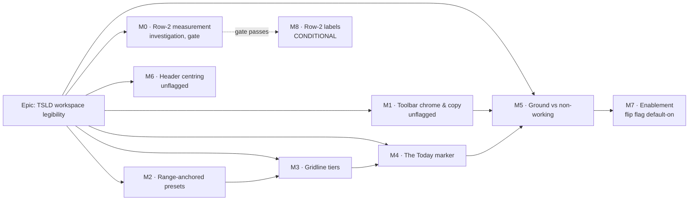

# Implementation Plan: TSLD toolbar & canvas refinements

- **Feature spec:** [`feature-spec.md`](feature-spec.md)
- **Status:** Draft — awaiting approval
- **Owner:** TBD
- **Flag:** `VITE_CANVAS_TIME_AXIS` (new, **default off** until M7) covers M2–M5.
  M0, M1, M6 are unflagged.

## Breakdown



### Epic

**TSLD workspace legibility** — make the toolbar and the time axis mean what they say.
A refinement epic on two already-shipped, default-on surfaces (ADR-0031 toolbar,
ADR-0055 visual language), continuing the polish pass released as `web-v0.52.1`.

---

## Milestone 0 — Row-2 width measurement (investigation)

**Outcome:** a decision, not a product change. Either a named, evidence-backed list of
Row-2 items that can carry labels at 1 280 px with every flag on, or a recorded "no" with
the follow-up that would be needed instead. **Blocks nothing; gates M8.**

#### Feature: Row-2 utilisation measurement

> **Description:** Measure Row 2's actual width utilisation at the supported breakpoints
> before any tier reassignment (spec §3.10 / §4.10).
> **Complexity:** S
> **Dependencies:** none
> **Risks:** measuring the _default_ flag set instead of the widest possible registry
> would produce a false GO → the method mandates all Row-2 flags on and the pen held.
> **Testing requirements:** the measurement spec is temporary and is deleted in the same
> PR that records the result; if the gate passes, M8 adds a _permanent_ assertion instead.

##### Task 0.1 — measurement harness + results

- **Description:** Add a temporary Playwright measurement spec to `apps/web/e2e-toolbar`,
  run it across the five widths, and append the results table + the go/no-go verdict to
  the spec's §4.10.
- **Complexity:** S
- **Dependencies:** —
- **Risks:** flag matrix drift between the measured run and reality → record the exact
  env used, in the results table.
- **Testing:** the spec itself is the instrument; no assertions land permanently.
- **Development steps:**
  1. New `apps/web/e2e-toolbar/row2-measure.spec.ts`: for widths 1 280 / 1 366 / 1 440 /
     1 680 / 1 920, take the pen, then read the `Build and manage` toolbar's `clientWidth`,
     the summed widths of its inline `[data-toolbar-item]` nodes, `⋯` presence + contents,
     and per-item widths keyed by id.
  2. Run once with **every** Row-2 flag on (`export`, `print`, `share`, `undo`/`redo`,
     `snap-to-grid`, `add-note`, `clear-visual-placement`, `update-progress`, `comments`).
  3. Run the counterfactual with `showLabel` forced true per candidate; the delta is
     `labelWidth + gap` per item.
  4. Apply the gate: promotable only if, at **1 280 px**, the promoted set fits with
     **≥ 64 px** slack and `⋯` stays empty.
  5. Append the table + verdict to `feature-spec.md` §4.10; open `TECH_DEBT #57`
     (`tier` conflates priority with presentation).
  6. Delete the temporary spec. **No changeset** (no user-visible change).

---

## Milestone 1 — Toolbar chrome & copy (unflagged)

**Outcome:** the two toolbar rows read as labelled sections; `View▾` reads as three
concerns; `Go to date` explains itself once and offers Today. Ships on its own as a patch,
exactly like the preceding polish pass.

#### Feature: Row eyebrow, hint lifecycle, Today row, `View▾` grouping

> **Description:** F1, F2, F4, F8.
> **Complexity:** M
> **Dependencies:** none
> **Risks:** the `View▾` restructure is the same file/array that once lost two entries to a
> bad search-and-replace → the drift pin is _strengthened_ (compile-time exhaustiveness),
> not merely preserved.
> **Testing requirements:** component tests for each behaviour; the existing
> `e2e-toolbar/toolbar.spec.ts` journey (which opens `View▾` and toggles `Labels`) must stay
> green unchanged; axe scan in that journey covers the new fieldsets.

##### Task 1.1 — row-purpose gutter (F1)

- **Description:** Reposition the "Navigate"/"Build" labels into a fixed-width, ruled
  gutter so they read as section labels, not controls.
- **Complexity:** S
- **Dependencies:** —
- **Risks:** a second hairline reading as "group zero" → the gutter rule is the leftmost
  rule and the `<Toolbar>` draws `border-l` only for `i > 0`, so there is no doubling.
- **Testing:** component test asserting both rows' labels are non-interactive
  (`aria-hidden`, no role, not focusable) and that the two toolbars share a left edge.
- **Development steps:**
  1. Add `ROW_LABEL_GUTTER_CLASSNAME` beside the existing `ROW_LABEL_CLASSNAME`
     (`plan-workspace-toolbar.tsx:68-72`): fixed inline size (`w-16`), `border-r`, padding
     larger than the toolbar's `gap-1`.
  2. Wrap each row's `<span>` in the gutter; keep the shared constant so the rows cannot
     drift; keep `aria-hidden` and `text-xs` (no arbitrary sizes).
  3. Update the inline comment to state the new intent.

##### Task 1.2 — first-use hint (F2)

- **Description:** Show the Go-to-date disclosure to first-time users only, keeping it
  permanently available to assistive technology.
- **Complexity:** S
- **Dependencies:** —
- **Risks:** dangling `aria-describedby` / lost instruction → the span is never removed,
  only made `sr-only`.
- **Testing:** unit tests for the hook (unseen → seen; corrupt storage → unseen; throwing
  storage → unseen); component tests that the hint is visible before first pick, `sr-only`
  after, and that `aria-describedby` resolves in both states.
- **Development steps:**
  1. New `features/tsld/toolbar/use-first-use-hint.ts` modelled on
     `use-legend-panel-prefs.ts` (single `schedulepoint-hints` JSON key, try/catch, corrupt
     → default, fail **open** to `unseen`).
  2. In `GoToDateControl`, call it with key `goto-date`; render the hint span visible when
     unseen and `sr-only` when seen, keeping the same `id`.
  3. Call `markSeen()` on the first successful date pick (not on open).
  4. Comment: `placeholder` is unavailable on `<input type="date">` — recorded so it is
     not re-proposed.

##### Task 1.3 — Today row in the Go-to-date popover (F4)

- **Description:** A `Today` button inside the popover driving the same `goToDate`
  command as the standalone toolbar item.
- **Complexity:** S
- **Dependencies:** Task 1.2 (same component)
- **Risks:** none material; deliberately does **not** close the popover (consistent with
  picking a date, and avoids a `ToolbarPopover` primitive change).
- **Testing:** component test that clicking Today calls `ctx.goToDate(ctx.todayIso)`, that
  the popover stays open, and that focus order is field → Today.
- **Development steps:**
  1. Add the button with the `LocateFixed` icon (matching the toolbar item) beneath the
     field.
  2. Do **not** `hasDiagram`-gate it (matching its sibling field); comment the deliberate
     asymmetry with the standalone button's pre-existing gate.

##### Task 1.4 — `View▾` grouping (F8)

- **Description:** Replace the flat `VIEW_TOGGLES` array with three groups rendered as
  three fieldsets, and strengthen the drift pin.
- **Complexity:** M
- **Dependencies:** —
- **Risks:** silently dropping a toggle (the incident this array's pin exists for) → a
  `Record<keyof TsldViewToggles, ViewToggleGroupId>` map makes an unassigned key a
  **compile error**.
- **Testing:** update the `TSLD_VIEW_TOGGLE_KEYS` pin to derive from the groups; new tests
  for (a) three legends present, (b) the Insight group **absent** with both flags off,
  (c) the Late-start overlay is an ordinary member (no incidental `border-t`), (d) the
  panel scrolls rather than overflowing on a short viewport.
- **Development steps:**
  1. Introduce `VIEW_TOGGLE_GROUPS` (Structure / Markers / Insight overlays) with per-entry
     flag gating preserved; derive `TSLD_VIEW_TOGGLE_KEYS` from it.
  2. Add the exhaustiveness map so every `TsldViewToggles` key must belong to exactly one
     group.
  3. Rewrite `ViewTogglesPanel` to render one `<fieldset>`/`<legend>` per **non-empty**
     group inside a plain wrapper; drop the Late-start special case.
  4. Headers use `text-xs font-medium uppercase tracking-wide text-muted-foreground`.
  5. Add `max-h-[60vh] overflow-y-auto` to the panel content (local fix; the shared
     `ToolbarPopover` primitive is untouched).

##### Task 1.5 — (optional) type-scale clean-up

- **Description:** Replace the pre-existing `text-[10px]` in `MenuSection` and `SoonTag`
  with `text-xs`.
- **Complexity:** S
- **Dependencies:** Task 1.4 (same file)
- **Risks:** menu rows grow slightly → visually check the Add menu; revert if the density
  regresses (this task is explicitly droppable).
- **Testing:** existing menu component tests.
- **Development steps:** swap the two arbitrary sizes; note in `docs/DECISIONS.md` if the
  density change is material.

##### Task 1.6 — docs & release

- **Description:** Record the four decisions and ship.
- **Complexity:** S
- **Dependencies:** 1.1–1.4
- **Testing:** CI green (`pnpm lint && pnpm typecheck && pnpm test`).
- **Development steps:** `docs/DECISIONS.md` entries for F1/F2/F4/F8; changeset
  (`@repo/web` patch).

---

## Milestone 2 — Range-anchored zoom presets (`VITE_CANVAS_TIME_AXIS`)

**Outcome:** picking a preset frames a predictable amount of calendar time, at any canvas
width, and the trigger label always reports what is actually framed.

#### Feature: Preset = a target visible range

> **Description:** F3 + F11 (spec §4.3).
> **Complexity:** M
> **Dependencies:** none (introduces the flag)
> **Risks:** (a) the trigger label disagreeing with the pick — mitigated by making the
> width a **required** parameter of `presetOf`/`isAtPreset` so the compiler finds every
> call site; (b) raising `MAX_PX_PER_DAY` destabilising an LOD threshold — every threshold
> is a _lower_ bound, so widening the top is safe, and a test pins each.
> **Testing requirements:** pure unit tests are the gate — round-trip
> `presetOf(pxPerDayForPreset(l, w), w) === l` for every preset × width; visible-range
> within ±10% for 800–2 560 px; clamp boundaries at both ends; flag-off equals `ZOOM_STOPS`.

##### Task 2.1 — the flag

- **Description:** Introduce `VITE_CANVAS_TIME_AXIS` (default **off**).
- **Complexity:** S
- **Dependencies:** —
- **Risks:** —
- **Testing:** existing env-flag tests pattern.
- **Development steps:** `config/env.ts` (`CANVAS_TIME_AXIS_ENABLED`, default off with the
  documented rollback sentence), `vite-env.d.ts`, `.env.example`.

##### Task 2.2 — pure scale model

- **Description:** `ZOOM_TARGET_DAYS`, `pxPerDayForPreset`, widened `MAX_PX_PER_DAY`.
- **Complexity:** S
- **Dependencies:** 2.1
- **Risks:** nominal vs calendar-exact ranges misread as a bug → documented at the
  constant.
- **Testing:** unit tests as above, including the documented clamp boundaries
  (Day at 2 560 px; Year at 440 px).
- **Development steps:**
  1. `render-model.ts`: add `ZOOM_TARGET_DAYS` beside `ZOOM_STOPS`; raise
     `MAX_PX_PER_DAY` 60 → 200 with the arithmetic in the comment; leave
     `MIN_PX_PER_DAY` at 0.4.
  2. `time-scale.ts`: add `pxPerDayForPreset(level, width)` returning
     `clampPxPerDay(width / target)`.

##### Task 2.3 — width-aware preset reporting + wiring

- **Description:** Thread width through `presetOf` / `isAtPreset` / `zoomToPreset`, and
  branch on the flag so flag-off keeps `ZOOM_STOPS`.
- **Complexity:** M
- **Dependencies:** 2.2
- **Risks:** a missed call site reporting the wrong preset → **required** parameter, so
  this is a compile error rather than a review responsibility.
- **Testing:** flag-off parity test (preset behaviour byte-identical to today);
  `TsldCanvas` test that picking each preset frames its target and that `onZoomStopChange`
  reports the picked level.
- **Development steps:**
  1. Make `width` required on `presetOf` / `isAtPreset`; fix every call site
     (`TsldCanvas.reportZoomStop` via `sizeRef`, `TsldViewControls`, tests).
  2. `zoomToPreset` uses `pxPerDayForPreset` when the flag is on, `ZOOM_STOPS` when off.
  3. Comment the resize semantics: **a preset is a command, not a mode** — resizing
     preserves the scale; re-pick to re-frame.

##### Task 2.4 — menu copy

- **Description:** Each zoom menu row states its range ("Week — 1 month"); the trigger
  keeps the short name.
- **Complexity:** S
- **Dependencies:** 2.3
- **Risks:** copy drift between the constant and the label → derive the range strings from
  a single map beside `ZOOM_TARGET_DAYS`.
- **Testing:** component test on `ZoomPresetControl` menu labels, both flag states.
- **Development steps:** extend `ZOOM_LABELS` with a range label used only in the menu;
  changeset.

---

## Milestone 3 — Gridline tiers (`VITE_CANVAS_TIME_AXIS`)

**Outcome:** the time axis reads as a hierarchy: light days, medium months, heavy years.

#### Feature: Three-tier grid

> **Description:** F5 + F11 (spec §4.5).
> **Complexity:** M
> **Dependencies:** M2 (shares the flag)
> **Risks:** (a) a 2 px line at a half-pixel x rendering blurry → year lines sit on
> integer x, day/month keep `+0.5`; (b) budget regression → the counting-stub gate asserts
> `moveTo`/`lineTo` counts are **unchanged**.
> **Testing requirements:** new `paint.grid-budget.test.ts`; a token-contract test that
> both palette resolvers expose all three fields; the existing contrast/token-architecture
> suites extended to the new tokens.

##### Task 3.1 — tokens

- **Description:** Three canvas grid tokens across all four theme blocks.
- **Complexity:** S
- **Dependencies:** M2
- **Risks:** a token authored in one theme only → the token-architecture test enumerates
  theme blocks.
- **Testing:** `styles/token-architecture.test.ts` extension.
- **Development steps:** add `--canvas-grid-day|month|year` to light, dark, corporate
  light and corporate dark beside `--canvas`/`--canvas-band`; map them in `@theme inline`
  as `--color-canvas-grid-*`; document in `docs/DESIGN_SYSTEM.md`.

##### Task 3.2 — palette fields

- **Description:** `gridLineDay` / `gridLineMonth` / `gridLineYear` in **both**
  `resolveTsldPalette` and `resolvePrintPalette`; keep `gridLine` as the flag-off value.
- **Complexity:** S
- **Dependencies:** 3.1
- **Risks:** an incomplete `PrintPalette` picking up `undefined` → the contract is total by
  test.
- **Testing:** `palette.test.ts` additions (every painter field resolves in both
  resolvers; light-forced fallbacks are light).
- **Development steps:** add the three fields with theme-appropriate fallbacks.

##### Task 3.3 — painter passes

- **Description:** Split the single batched grid stroke into three ordered passes.
- **Complexity:** M
- **Dependencies:** 3.2
- **Risks:** coincident-x precedence inverted → the order day → month → year is asserted.
- **Testing:** `paint.grid-budget.test.ts` (flag-off identical; flag-on +2
  `beginPath`/`stroke`/`strokeStyle`, `moveTo`/`lineTo` unchanged); a paint test asserting
  the year tier's `lineWidth` and integer x.
- **Development steps:**
  1. Replace `paint.ts:819-835` with three gated batched passes in tier order.
  2. Day/month at `round(x)+0.5`, `lineWidth 1`; year at `round(x)`, `lineWidth 2`.
  3. Keep `DAY_GRID_MIN_PX` culling untouched.
  4. Flag-off ⇒ the single `palette.gridLine` pass, byte-for-byte.
  5. Changeset.

---

## Milestone 4 — The Today marker (`VITE_CANVAS_TIME_AXIS`)

**Outcome:** "today" means today, to the hour, and stays true for the whole session.

#### Feature: Fractional Today + pill + clock tick

> **Description:** F6a/F6b/F6c + F11 (spec §4.6).
> **Complexity:** M
> **Dependencies:** M3 (shares the flag; sequenced after so each painter change lands
> alone against its own budget gate)
> **Risks:** (a) a timer on the render path — bounded to one 60 s tick per visible open
> plan, paused on `document.hidden`, and justified in ADR-0056 §3; (b) tests coupling to
> the wall clock — the clock is injectable and every test uses fake timers (CLAUDE.md §7);
> (c) the two chips colliding — geometric separation, since they live on different
> canvases.
> **Testing requirements:** pure `todayDayFraction` unit tests; `useNow` timer tests with
> fake timers **including the hidden-tab pause**; painter tests that an absent
> `todayFraction` paints byte-for-byte today's marker; a budget stub for the pill.

##### Task 4.1 — pure fraction + scene field

- **Description:** `todayDayFraction` (pure, quantised to 60 s) and the optional
  `TsldScene.todayFraction`.
- **Complexity:** S
- **Dependencies:** M3
- **Risks:** out-of-range values shifting the line → non-finite / out-of-range treated as
  absent.
- **Testing:** unit tests across the day boundary, DST boundaries, and invalid inputs.
- **Development steps:** add the helper in `render/`; add the optional scene field with the
  "absent ⇒ integer offset ⇒ parity" comment.

##### Task 4.2 — painter: interpolation + pill

- **Description:** Draw the line at `todayOffset + (todayFraction ?? 0)` and add the
  `Today` pill.
- **Complexity:** M
- **Dependencies:** 4.1
- **Risks:** the pill overlapping the cursor chip → `TODAY_CHIP_TOP = 24` vs
  `CURSOR_CHIP_TOP = 4`, asserted by test.
- **Testing:** paint tests for the offset math, the x-clamp at both edges, the
  `today`-toggle governing both line and pill, and the `measureText`-absent guard; palette
  test for `todayInk`.
- **Development steps:**
  1. Add `palette.todayInk` (`--color-destructive-foreground`) to both resolvers.
  2. Interpolate the line x; add the pill mirroring the cursor-chip geometry in
     `palette.today` + `todayInk`, no stroke, x-clamped, guarded.
  3. Assert the vertical offsets in a test so a future geometry edit cannot silently
     collide them.

##### Task 4.3 — the clock tick

- **Description:** `useNow(60_000)` re-deriving `todayIso` + `todayFraction`, paused while
  hidden.
- **Complexity:** M
- **Dependencies:** 4.2
- **Risks:** a background tab repainting a canvas → the `visibilitychange` pause is part of
  the hook, with its own test.
- **Testing:** fake-timer tests (bumps at the interval; **no** bumps while
  `document.hidden`; immediate re-sync on becoming visible; cleanup on unmount).
- **Development steps:**
  1. New `useNow(stepMs)` hook; wire into `use-plan-workspace-model.ts` beside `todayIso`
     (which already re-derives per render — the tick supplies the render).
  2. Pass `todayFraction` down to `TsldCanvas`, into the scene, into the effect deps.
  3. Comment that this also repairs the pre-existing **midnight** staleness of the integer
     offset, and note the local-clock/timezone semantics.
  4. Changeset.

---

## Milestone 5 — Ground vs. non-working (`VITE_CANVAS_TIME_AXIS`)

**Outcome:** a weekend reads as a weekend and a month band reads as ground — differentiated
by kind, not by two points of grey — and a user can switch the bands off.

#### Feature: Non-working hatch + Month-bands toggle

> **Description:** F7a/F7b + F11 (spec §4.7).
> **Complexity:** M
> **Dependencies:** **M1** (the grouped `View▾` must exist to host the entry) and M4
> (flag order).
> **Risks:** (a) an unbounded hatch cost — avoided by construction with a `CanvasPattern`
> (O(1) per column); (b) `createPattern` unavailable in jsdom — guarded fallback to the
> flat fill, which is also the path the unit suites take; (c) the ADR-0055 §4 amendment
> being mistaken for a redesign — it is one paragraph, drafted verbatim in spec §4.7.
> **Testing requirements:** a non-working budget gate asserting the **`fillRect` count is
> unchanged**; a fallback test with a null 2D context; a `View▾` test that the Month-bands
> entry appears only under `CANVAS_VISUAL_LANGUAGE` and that turning it off stops the band
> layer painting.

##### Task 5.1 — hatch pattern

- **Description:** Build the stripe pattern once per palette resolution; fill non-working
  columns with it; guarded fallback.
- **Complexity:** M
- **Dependencies:** M4
- **Risks:** stripe rhythm diverging from the float-tail hatch → reuse the 6 px step so the
  canvas has one hatch language.
- **Testing:** budget gate (`fillRect` count unchanged, only `fillStyle` differs); fallback
  test; theme-change test (pattern rebuilt on `themeVersion`).
- **Development steps:**
  1. Add `--canvas-nonworking-hatch` across the four theme blocks +
     `palette.nonWorkingHatch` in both resolvers.
  2. Add a guarded pattern builder beside the palette resolution (null `getContext` ⇒
     return null ⇒ flat fill).
  3. Set `fillStyle` to the pattern (or the flat fill) for the existing non-working pass —
     the loop and its `NON_WORKING_MIN_PX` cull are otherwise untouched.
  4. Comment that the pattern is screen-anchored, consistent with the shipped float-tail
     hatch, and that per-line hatching was rejected with its measured cost.

##### Task 5.2 — Month-bands toggle

- **Description:** `monthBands` becomes a user toggle in `View▾ → Structure`, with the flag
  as gate and default.
- **Complexity:** S
- **Dependencies:** Task 5.1, M1 Task 1.4
- **Risks:** importing `@/config/env` into the pure painter → the flag stays in
  `TsldCanvas`, where it already lives.
- **Testing:** the `View▾` tests above; a `TsldCanvas` test that the composed scene field
  is `flag && (view?.monthBands ?? true)`.
- **Development steps:**
  1. Add optional `monthBands?: boolean` to `TsldViewToggles`; add the group entry gated on
     `CANVAS_VISUAL_LANGUAGE_ENABLED`.
  2. Compose in `TsldCanvas` (`:614` and `:695`):
     `monthBands: CANVAS_VISUAL_LANGUAGE_ENABLED && (view?.monthBands ?? true)`.
  3. Apply the drafted one-paragraph **ADR-0055 §4 amendment**.

##### Task 5.3 — ADR-0056 + docs

- **Description:** Write ADR-0056 from the spec §4.11 outline; update the cross-references.
- **Complexity:** S
- **Dependencies:** 5.2
- **Testing:** docs-only.
- **Development steps:** `docs/adr/0056-tsld-time-axis-legibility-and-preset-framing.md`;
  add it to `CLAUDE.md` §16 and `docs/DESIGN_SYSTEM.md`; changeset.

---

## Milestone 6 — Header centring (unflagged)

**Outcome:** the org-switcher + nav group is centred between the brand and the account
chip, in both header variants, with the nav still scrolling and the tab order untouched.

#### Feature: Three-column header

> **Description:** F9 (spec §4.9).
> **Complexity:** M
> **Dependencies:** none (independent of the flag and of every other milestone)
> **Risks:** (a) breaking the pinned tab order — impossible by construction: DOM order is
> unchanged and no `order-*`/absolute positioning is used; (b) the nav pushing the account
> chip off at narrow widths — `min-w-0` + internal `overflow-x-auto` on the centre track;
> (c) the two variants diverging — the grid lives on the shared `HeaderContents`.
> **Testing requirements:** component tests for both variants at wide and narrow widths;
> the existing `e2e-designed-chrome` tab-order journey unchanged and green; an axe pass on
> the header.

##### Task 6.1 — grid layout

- **Description:** Turn `HeaderContents` from a fragment into a
  `1fr auto 1fr` grid owning the three columns.
- **Complexity:** M
- **Dependencies:** —
- **Risks:** as above.
- **Testing:** component tests: (i) DOM order brand → org switcher → nav → account
  unchanged; (ii) the nav keeps `min-w-0 overflow-x-auto`; (iii) both `AppHeader` and
  `AppHeaderRow` render the identical inner structure.
- **Development steps:**
  1. `HeaderContents` renders
     `grid grid-cols-[minmax(0,1fr)_minmax(0,auto)_minmax(0,1fr)] items-center gap-4`.
  2. Left cell: drawer button (`lg:hidden`) + `BrandMark`, `justify-self-start`.
     Centre cell: `OrgSwitcher` + `<nav>` in one `flex min-w-0 items-center gap-2`,
     `justify-self-center`. Right cell: `AccountChip`, `justify-self-end`.
  3. Drop the nav's `flex-1` and the account chip's `ml-auto` (the grid now places them).
  4. Cap the org switcher (`max-w-[12rem]`, truncating) so name length shifts the centre by
     a bounded amount.
  5. `AppHeader` keeps only its `Surface` + `max-w-6xl` cap; `AppHeaderRow` keeps only its
     height/padding.

##### Task 6.2 — verification & record

- **Description:** The spec §4.9 visual verification, then record the contract.
- **Complexity:** S
- **Dependencies:** 6.1
- **Risks:** —
- **Testing:** manual pass at 1 280 / 1 440 / 1 920 px, with and without the drawer button,
  and with a deliberately long org name; both flag states of `VITE_DESIGNED_CHROME`.
- **Development steps:** verify (i) centred, (ii) nav scrolls rather than pushing the chip,
  (iii) tab order unchanged, (iv) variants match; add a `docs/DECISIONS.md` entry recording
  the three-column rule and the **"centred while it fits, filling when it does not"**
  contract; changeset.

---

## Milestone 7 — Enablement

**Outcome:** `VITE_CANVAS_TIME_AXIS` flips **default-on** once the specialist gates have
run over the whole M2–M5 diff and every blocking finding is folded. Mirrors the ADR-0053
M6 enablement pattern.

#### Feature: Flip the flag

> **Description:** Run the deferred specialist reviews, fold blocking findings, flip the
> default, keep the flag-off parity suites.
> **Complexity:** S–M (size depends on findings)
> **Dependencies:** M2–M5
> **Risks:** flipping before review → the flip is a separate PR from every feature PR, by
> design.
> **Testing requirements:** full suite green with the flag **on** and **off**; the flag-off
> parity suites are **kept and pinned**, never weakened — that is the rollback contract.

##### Task 7.1 — specialist gates

- **Description:** Run **ux-reviewer**, **accessibility-reviewer**,
  **component-reviewer** and **performance-reviewer** over the combined M2–M5 diff; fold
  blocking findings.
- **Complexity:** M
- **Dependencies:** M5
- **Testing:** whatever the findings require.
- **Development steps:** run each reviewer; triage blocking vs suggested; fold blocking
  into this milestone; record suggested items in `docs/BACKLOG.md`.

##### Task 7.2 — flip + document

- **Description:** `CANVAS_TIME_AXIS_ENABLED` → `flagDefaultOn`; ADR-0056 status → Accepted.
- **Complexity:** S
- **Dependencies:** 7.1
- **Testing:** full suite in both flag states.
- **Development steps:** flip the default with the dated comment; update ADR-0056,
  `CLAUDE.md` §16 and `.env.example`; changeset (`@repo/web` minor — user-visible default
  change).

---

## Milestone 8 — Row-2 labels (**CONDITIONAL — only if M0's gate passes**)

**Outcome:** the named, measured Row-2 items carry visible labels, with a permanent guard
against future overflow churn.

> **This milestone contains no named items by design.** Its scope is written only after
> M0 records a GO and the promotable set. If M0 records a NO-GO, this milestone is
> replaced by a `docs/BACKLOG.md` entry proposing a width-responsive `showLabel` in the
> `Toolbar` primitive — a primitive change and its own decision.

##### Task 8.1 — promote the measured set (conditional)

- **Description:** Promote exactly the items M0 cleared, and add the permanent guard.
- **Complexity:** S
- **Dependencies:** M0 (GO verdict)
- **Risks:** re-introducing the overflow flip-flop the width cache exists to prevent →
  the permanent e2e assertion below makes a regression fail CI rather than ship.
- **Testing:** a **permanent** `e2e-toolbar` assertion that `⋯` is empty on Row 2 at
  1 280 px with all Row-2 flags on and the pen held.
- **Development steps:** promote the cleared items; add the assertion; changeset.

---

## Sequencing & slices

```
M0  (investigation, parallel — blocks only M8)
M1  ────────────────────────────────► ship (patch, unflagged)
M6  ────────────────────────────────► ship (patch, unflagged, independent)
M2 → M3 → M4 → M5 ──────────────────► ship each behind VITE_CANVAS_TIME_AXIS (off)
                              M7 ───► flip default-on (minor)
M8  (conditional on M0)
```

Every milestone leaves `main` releasable:

- **M1 / M6** are unflagged but self-contained DOM changes, each with its own tests — the
  same shape as the polish pass that just shipped.
- **M2–M5** each land **behind a default-off flag**, so `main` is unchanged for users until
  M7. Each carries its own flag-off parity gate, so the rollback claim is proved
  per-milestone rather than at the end.
- **M0** ships nothing.
- **M8** may never exist; that is the correct outcome if the measurement says so.

Deliberate ordering notes: **M5 after M1** (the toggle needs its group); **M2 → M3 → M4 →
M5** so each painter change faces its own budget gate alone, rather than four changes
sharing one ambiguous measurement; **M7 last and separate**, so the flip is never bundled
with a feature PR.

## Definition of Done (per task)

Each task's PR must satisfy the Feature Completion Criteria in
[`docs/PROCESS.md`](../../PROCESS.md): code, tests (≥ 80% on changed code), docs/ADR
updates, security consideration (n/a here — recorded, not skipped), performance
consideration (the budget gates **are** the evidence), accessibility, Docker build, CI
green, changeset, and version impact.

Two additions specific to this epic:

1. **Every painter change carries a counting-stub budget gate** asserting the _shape_ of
   per-frame cost, per the repo's established practice — never a millisecond count on a CI
   runner.
2. **Every flagged milestone carries a flag-off parity assertion.** The parity suites are
   kept and pinned at M7, never weakened.

## Risks & assumptions (rollup)

| Risk / assumption                                                                | Likelihood | Impact | Mitigation                                                                                        |
| -------------------------------------------------------------------------------- | ---------- | ------ | ------------------------------------------------------------------------------------------------- |
| A missed `presetOf` call site reports a preset the user did not pick             | low        | high   | `width` is a **required** parameter → compile error, not a review responsibility                  |
| Raising `MAX_PX_PER_DAY` destabilises an LOD threshold                           | low        | med    | Every threshold is a _lower_ bound; each is pinned by test                                        |
| The non-working hatch blows the draw budget                                      | low        | high   | `CanvasPattern` is O(1) per column; the gate asserts the `fillRect` count is **unchanged**        |
| The 60 s tick is judged unacceptable on the render path                          | low        | med    | Paused while hidden; ~0.007% duty cycle; the alternative (a knowingly-wrong marker) is documented |
| `createPattern` unavailable in a real browser (not just jsdom)                   | very low   | low    | Guarded fallback to today's flat fill                                                             |
| The `View▾` restructure silently drops a toggle (the prior incident)             | low        | high   | Compile-time exhaustiveness map + the existing key pin, both strengthened                         |
| Header grid regresses the pinned tab order                                       | very low   | high   | DOM order unchanged; no `order-*`, no absolute positioning; the existing e2e is the guard         |
| Promoting Row-2 labels reintroduces overflow churn                               | med        | med    | **Gated** by M0; M8 does not exist unless the gate passes, and adds a permanent guard if it does  |
| Two near-simultaneous canvas epics (this + any in flight) conflict in `paint.ts` | med        | low    | Milestones land sequentially and each touches one layer                                           |
| The batch is perceived as "polish" and skips the specialist gates                | med        | med    | M7 exists precisely to make the gates a blocking, named milestone                                 |
