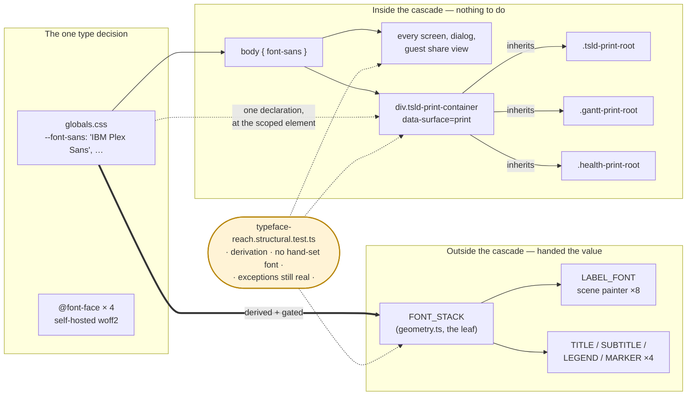
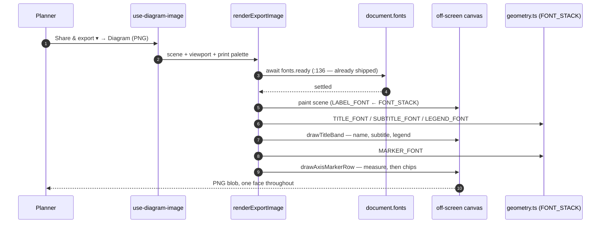
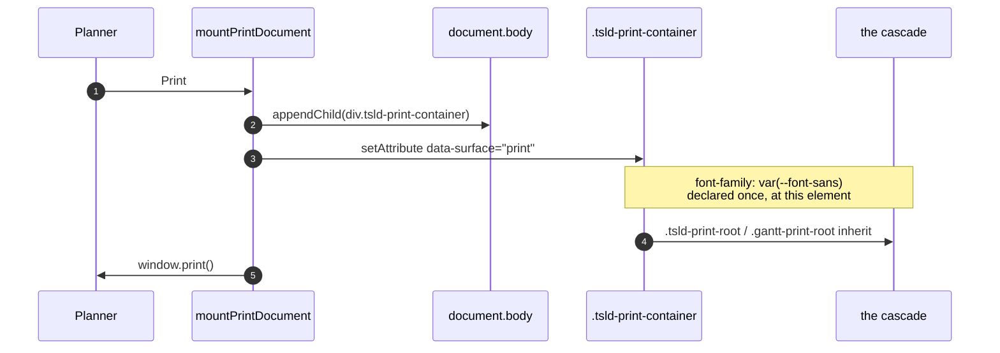
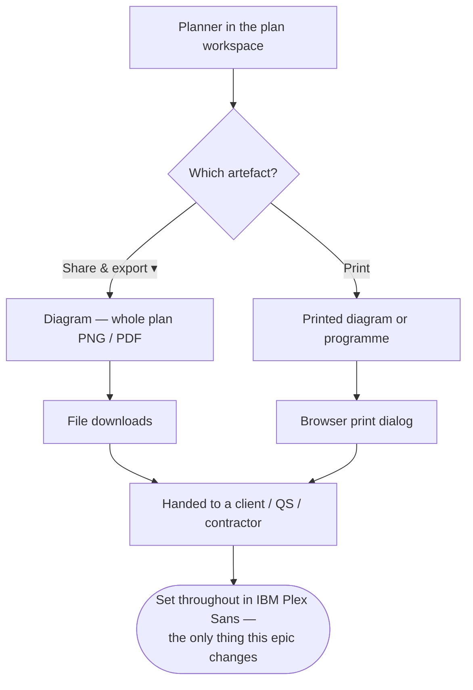

# Feature Spec: The typeface reaches the outward artefacts

- **Status:** Draft — awaiting approval
- **Author(s):** feature-analyst
- **Date:** 2026-08-29
- **Tracking issue / epic:** _(none yet)_
- **Roadmap link:** none — approved directly by the product owner, 2026-08-29, after `web-v0.115.0`
- **Related ADR(s):** ADR-0097 (a theme is a system), ADR-0102 (the scope that never reached the
  painter), ADR-0103 (paper is a surface), ADR-0058 / ADR-0076 (drift is a defect class with
  computed gates), ADR-0118 (the `file::substring` exception pattern this epic's gate copies).
  **No new ADR is proposed** — see §4 "Do we need an ADR?".

---

## 0. What was asked for, and what checking it changed

The product owner, asked what to polish next, said the typeface might be a good target: they had
picked one before, thought it was _"overruled in the toolbars and menus"_, and that those look much
better now. Investigation showed they were endorsing a change that **had** landed — the face is IBM
Plex Sans and the chrome is set in it. The approved scope became **"outward artefacts + a gate"**:
carry the typeface decision to the places it never reached, and add a structural gate so the next
cascade-level type decision cannot miss them again.

**Two claims inherited from the briefing are false, and are corrected here rather than carried**
(PROCESS.md "the brief is not evidence"):

| Inherited claim                                                              | Established by                                                                                            | Verdict                                                                                                                                                                                            |
| ---------------------------------------------------------------------------- | --------------------------------------------------------------------------------------------------------- | -------------------------------------------------------------------------------------------------------------------------------------------------------------------------------------------------- |
| "`docs/TECH_DEBT.md` #173 is stale — it was fixed and nobody closed the row" | Reading `docs/TECH_DEBT.md:4029-4088`                                                                     | **False.** The row is **CLOSED 2026-08-28** with a five-line closure note that is accurate in every particular. There is nothing to correct. It appears exactly once in the file (no stale index). |
| "`e2e-gantt` covers the printed programme"                                   | `rg '[Pp]rint\|programme' apps/web/e2e-gantt/gantt.spec.ts` → **no matches**; the directory holds 3 files | **False.** The printed programme has **never** been driven by any journey. This changes §5's answer.                                                                                               |

**Two claims inherited from the briefing are true**, re-verified before being relied on:

- The golden oracle is untouched. `paint.golden.test.ts:3` imports `paintScene` from `./paint` and
  nothing else; its snapshot contains the `LABEL_FONT` string twice
  (`__snapshots__/paint.golden.test.ts.snap:306`, `:803`) and **no** title/subtitle/legend/marker
  font entry. The four export constants live in a module the golden never loads.
- The font-load race is already closed on both paths.
  `render-export-image.ts:136` — `if (typeof document !== 'undefined' && 'fonts' in document) await document.fonts.ready;`
  — runs at the top of `renderExportImage`, i.e. before `drawTitleBand` (`:182`) and
  `drawAxisMarkerRow` (`:183`). `render/layers/text-measure.ts:26-30` busts the width memo once on
  `document.fonts.ready`. See §3 "The load race" for the residual.

---

## 1. Business understanding

### Problem

SchedulePoint is set in **IBM Plex Sans** (mono: IBM Plex Mono), self-hosted from
`apps/web/src/assets/fonts/`, chosen by the product owner on 2026-08-24 from three fully-realised
directions rendered on the real workspace (`globals.css:30-60`; provenance and licence in
`src/assets/fonts/PROVENANCE.md`). It replaced Space Grotesk, which had itself replaced nothing —
ADR-0097 D18 found the product had never chosen a face at all.

**Nothing in `apps/web/src` overrides `font-family`** — verified: the only `font-family` declarations
anywhere under `apps/web/src` are the four `@font-face` blocks in `globals.css` and two hand-set
stacks (below). One face, declared once.

Except in the artefacts a planner **hands to somebody else**. Six sites set type by hand and none of
them received the decision:

| #   | Site                                                          | Value today                                                                                          | Medium            |
| --- | ------------------------------------------------------------- | ---------------------------------------------------------------------------------------------------- | ----------------- |
| 1   | `features/tsld/export/PrintSurface.css:35`                    | `'Inter', ui-sans-serif, system-ui, -apple-system, 'Segoe UI', Roboto, Helvetica, Arial, sans-serif` | printed diagram   |
| 2   | `features/gantt/components/GanttPrintSurface.css:45`          | the same stack, character for character                                                              | printed programme |
| 3   | `features/tsld/export/render-export-image.ts:33` `TITLE_FONT` | `600 16px system-ui, -apple-system, 'Segoe UI', sans-serif`                                          | exported PNG/PDF  |
| 4   | `…:34` `SUBTITLE_FONT`                                        | `12px system-ui, …`                                                                                  | exported PNG/PDF  |
| 5   | `…:35` `LEGEND_FONT`                                          | `11px system-ui, …`                                                                                  | exported PNG/PDF  |
| 6   | `…:229` `MARKER_FONT`                                         | `11px system-ui, …`                                                                                  | exported PNG/PDF  |

**`Inter` has no `@font-face` block and no file in `src/assets/fonts/`** — verified two ways: a
search across `apps/web/src` returns `Inter` only inside `Interchange*` identifiers, the two print
stylesheets, and a `token-architecture.test.ts` docblock recording that Inter was never served; and
the fonts directory holds four files, all IBM Plex (`PROVENANCE.md` table). So **both print
stylesheets fall through to `system-ui` today**. Inter was `globals.css`'s opening face before
ADR-0097; these two sheets are the last two places in the product that name it.

The shape is precise and it has a name in this register. `LABEL_FONT`
(`features/tsld/render/geometry.ts:267`) **is already correct** — it leads with `'IBM Plex Sans'`,
and `label-font.structural.test.ts` derives the family from `--font-sans` in `globals.css` so the
next face change fails a gate. That fix (TECH_DEBT #173, closed 2026-08-28) reached the canvas
**inside** the exported document and stopped at the band **around** it. So today:

> The diagram inside the exported picture is set in the product's face. The plan's name above it,
> the legend beside it and the date chips under it are not. In the printed programme, every word is
> not.

#173's own diagnosis states the general rule and this epic is its second instance:

> _"One layer of the product opts out of the cascade, so every cascade-level decision has to be
> applied to it by hand, and nothing says so."_

That is the seam ADR-0102 found for **colour** (`resolveTsldPalette` had never once reached the
canvas surface scope). This is the same seam for **type**, one layer further out — and the layer
here is not only the canvas: the two print stylesheets are DOM, sit **inside** the cascade, and are
wrong anyway, because they hand-set a value they would have inherited correctly.

**Two documents are wrong in the same way**, found while checking the above and in scope for the
same reason:

- `docs/DESIGN_SYSTEM.md:78` — _"**Family:** `--font-sans` (Inter + system fallback)"_. This is the
  line a designer or an agent reads to learn what face this product is in. It has been wrong through
  **two** deliberate face decisions.
- `docs/DESIGN_SYSTEM.md:323` — _"**The typeface is Space Grotesk** (ADR-0097)"_. Correct when
  written, superseded on 2026-08-24, never updated.

### Users

Nobody's permissions change and no new capability appears. The people affected:

| Role                                     | How they meet this                                                                                                                   |
| ---------------------------------------- | ------------------------------------------------------------------------------------------------------------------------------------ |
| **Planner**, **Org Admin**               | Press `Share & export ▾ → Diagram — whole plan (PNG)` / `… (PDF)`, or `Print`. The file goes to a client, a QS or a main contractor. |
| **Contributor**, **Viewer**              | Same artefacts wherever their role reaches them; the change is role-invariant because it alters no gate.                             |
| **External Guest** (ADR-0051 share link) | The guest view is ordinary DOM and already inherits the face; this epic changes nothing there.                                       |
| **A recipient who is not a user at all** | The largest group, and the one the epic exists for. They never see the app — only the PNG, the PDF or the paper.                     |

### Primary use cases

1. A planner exports the whole-plan diagram as a PNG and emails it to a client.
2. A planner prints the programme (the Gantt) for a site meeting.
3. A planner prints the TSLD diagram.
4. A designer or an agent opens `docs/DESIGN_SYSTEM.md` to find out what face to set something in.
5. Somebody makes the **next** cascade-level type decision, and the sites that opt out of the
   cascade fail a gate instead of being missed for a third era.

### User journeys

Unchanged, all of them. A planner presses the same control and gets the same file; the words in it
are set in the product's face. There is no new screen, no new control and no new state.

### Expected outcomes

- The artefact a planner hands over looks like the product it came from — one face across the
  picture, its title band, its legend and the paper around it.
- The two print stylesheets stop naming a font this product has never served.
- The design system says what face the product is in.
- The **class** of defect is gated rather than remembered: a hand-set font anywhere under
  `apps/web/src` is a named exception with a written reason, or CI fails.

### Success criteria

| #    | Criterion                                                                                                          | How it is judged                                                                       |
| ---- | ------------------------------------------------------------------------------------------------------------------ | -------------------------------------------------------------------------------------- |
| SC-1 | Zero hand-set font stacks under `apps/web/src` outside the exceptions list.                                        | The new structural gate, verified red first.                                           |
| SC-2 | Every canvas font string in the product is composed from one constant that carries `--font-sans`'s leading family. | Same gate (assertion 1 + 2).                                                           |
| SC-3 | The printed diagram and the printed programme compute a `font-family` leading with `IBM Plex Sans`.                | Browser assertion under `emulateMedia({ media: 'print' })` — see §5, subject to M1-T1. |
| SC-4 | The golden oracle is **not** re-baselined.                                                                         | `paint.golden.test.ts` passes with its snapshot file unmodified.                       |
| SC-5 | `docs/DESIGN_SYSTEM.md` names IBM Plex Sans / IBM Plex Mono in both places.                                        | Read.                                                                                  |
| SC-6 | No visual regression in the exported raster beyond the intended face change.                                       | `e2e-export` passes unchanged; the `export-diagram` shot reviewed.                     |

### Open questions

**CRITICAL — needs an answer before M1 lands:**

- **CQ-1 — the favicon.** `apps/web/public/favicon.svg:16` sets
  `font-family="system-ui, -apple-system, Segoe UI, Roboto, sans-serif"` on the brand `S`. It is the
  most outward artefact this product has — a browser tab, a bookmark, a pinned shortcut — and it is
  set in whatever the reader's machine resolves. It **cannot** simply read the token: an SVG served
  as a file has no access to the app's CSS (its own comment already says so, for colour), and a
  favicon renders in a context that does not fetch external resources, so an `@font-face` inside it
  would not load either. The two real options are:
  - **(a) Named exception, no change** _(the stated default)_ — record the reason in the gate's
    exception list and move on. Cost: the mark is one bold `S` at 16 px in a face that varies by
    platform. At that size the difference is close to invisible, which is exactly why it has never
    been reported.
  - **(b) Convert the `S` to a `<path>`** — bake the Plex Sans Bold outline into the SVG. Cost: the
    glyph stops being editable as text, and the file gains a vendored outline that needs its own
    provenance note beside the woff2 files. Buys: the brand mark is genuinely in the brand face
    everywhere, including where CSS cannot reach.

    This is critical only because it is cheap now and awkward later: option (b) belongs in the same
    commit as the gate that would otherwise permanently exempt it.

**Non-critical — defaults stated, work proceeds:**

- **Q-2 — an ADR?** **Default: no.** See §4 "Do we need an ADR?" for the argument. If the reviewer
  disagrees it is a one-page ADR and the plan carries a task for it (M2-T4, unscheduled).
- **Q-3 — should paper have its own face one day?** **Default: no, and the design deliberately keeps
  the door open** — the mechanism chosen in §4 makes "paper is set in a different face" a one-line
  change at a single element, where inheritance would silently ignore it. Nobody has asked for it.
- **Q-4 — `--font-mono` on the printed programme?** **Default: no.** The programme's numeric columns
  are `<td>`s and pick up `font-variant-numeric: tabular-nums` from `globals.css:1499-1503`; Plex
  Sans is tabular by default anyway (measured, `PROVENANCE.md` §"A measured fact worth keeping").
  Introducing a second face on paper is a design decision nobody has made.
- **Q-5 — the two measurement harnesses** (`measure-toolbar/*`, `measure-axis-markers/*`) **read**
  `fontFamily` from computed style; they set nothing. **Default: out of scope**, and the gate must
  not report them (they are instruments, and they read the live value, which is the correct
  behaviour for an instrument).

---

## 2. Functional requirements

### User stories & acceptance criteria

> **US-1** — As a **planner**, I want the diagram I export to be set throughout in the product's
> typeface, so that the file I send a client looks like one document rather than two.
>
> **Acceptance criteria**
>
> - **Given** a plan with a computed schedule, **when** I export the whole-plan PNG, **then** the
>   plan name, the "As of … · Generated …" subtitle, the legend labels and the axis-marker chips are
>   drawn in IBM Plex Sans (with the shipped fallback stack behind it).
> - **Given** the same export, **then** the diagram body below the band is drawn in the same face —
>   i.e. the band and the diagram agree, which they do not today.
> - **Given** the export runs before the woff2 has arrived, **then** the render still waits for
>   `document.fonts.ready` before painting (unchanged behaviour, `render-export-image.ts:136`).

> **US-2** — As a **planner**, I want the printed programme and the printed diagram set in the
> product's typeface, so that the paper I bring to a site meeting matches the screen it came from.
>
> **Acceptance criteria**
>
> - **Given** the print document is mounted, **when** the browser evaluates print media, **then**
>   the computed `font-family` of the print container leads with `IBM Plex Sans`.
> - **Given** the same document, **then** neither `PrintSurface.css` nor `GanttPrintSurface.css`
>   declares a `font-family` of its own.
> - **Given** a reader on a cold cache or a blocked font request, **then** the fallback stack is the
>   product's own (`ui-sans-serif, system-ui, …`) rather than a stack naming a font that was never
>   served.

> **US-3** — As an **engineer or an agent making the next type decision**, I want a hand-set font to
> fail a gate, so that the artefacts outside the cascade cannot be missed for a third era.
>
> **Acceptance criteria**
>
> - **Given** a new `ctx.font = '13px Helvetica'` anywhere under `apps/web/src`, **when** the suite
>   runs, **then** it fails naming the file and the string.
> - **Given** a new `font-family:` declaration in any `.css` under `apps/web/src` outside
>   `globals.css`'s `@font-face` blocks, **then** it fails the same way.
> - **Given** `--font-sans`'s leading family changes in `globals.css` and the canvas constant does
>   not, **then** it fails.
> - **Given** an exception whose code has since been deleted, **then** the gate fails — an exception
>   list that outlives its subjects is a list of permissions for code that has gone (ADR-0093's
>   shape; the pinned-positive assertion copied from `control-height.structural.test.ts:118`).

> **US-4** — As a **designer or an agent**, I want `docs/DESIGN_SYSTEM.md` to name the face the
> product is actually set in, so that I do not specify the wrong one.
>
> **Acceptance criteria**
>
> - **Given** `DESIGN_SYSTEM.md` §Typography, **then** it names IBM Plex Sans and IBM Plex Mono, and
>   points at `globals.css`'s comment block for the reasoning and at `PROVENANCE.md` for the files.
> - **Given** `DESIGN_SYSTEM.md:323`'s "The typeface is Space Grotesk", **then** it is corrected
>   **in place with the history kept** — this file records superseded decisions rather than erasing
>   them, and "the face changed twice and neither change reached this line" is the useful part.

### Workflows

Unchanged. For completeness, the export path:

1. Planner presses `Share & export ▾` → `Diagram — whole plan (PNG)`.
2. `use-diagram-image.ts` composes the scene from the live canvas, `buildExportViewport` sizes the
   raster, `renderExportImage` awaits `document.fonts.ready`, paints the scene, composites paper,
   draws the title band + legend + marker row, and resolves a PNG `Blob`.
3. The browser downloads it.

And the print path:

1. Planner presses `Print`.
2. `mountPrintDocument` creates a detached `div.tsld-print-container`, stamps
   `data-surface="print"` on it (`print-document.ts:74`), appends it to `document.body`, renders the
   surface into it with `flushSync`, and calls `window.print()`.
3. `@media print` hides `#root` and every other body-level node and reveals the container.

### Edge cases

| Case                                                        | Expected behaviour                                                                                                                                                                                                            |
| ----------------------------------------------------------- | ----------------------------------------------------------------------------------------------------------------------------------------------------------------------------------------------------------------------------- |
| Cold cache / woff2 not yet fetched at export                | Unchanged: `renderExportImage` awaits `document.fonts.ready` first. See §3 "The load race" for the one residual.                                                                                                              |
| woff2 blocked (CSP misconfiguration, offline)               | The band falls through to `ui-sans-serif, system-ui, …` — the product's **own** fallback, which is what the diagram body already does. Today the band and the body would fall through to _different_ stacks; after, the same. |
| Plan name containing `latin-ext` characters (e.g. `Kraków`) | The `latin-ext` subset is a separate file loaded on demand. The plan name is on screen in the workspace header before Export is reachable, so the subset has been requested. Recorded as a residual, not designed around.     |
| A very narrow export crop                                   | `drawLegend` breaks out when the next entry would overflow (`render-export-image.ts:358-359`). Plex's advance widths differ from the runner's `system-ui`, so **which** entry is the last one can change. See §3, R-2.        |
| A print with no activities                                  | `.gantt-print-empty` renders a sentence; it inherits the container's family like everything else.                                                                                                                             |
| jsdom (every export unit suite)                             | `document.fonts` does not exist; the await is skipped, `measureText` is the fake ctx's fixed `{ width: 20 }`. No unit assertion depends on the font string. Verified — see §3, "Blast radius".                                |

### Permissions

**No change.** No permission is added, removed or consulted. RBAC (ADR-0012), organisation scoping
and the ADR-0028 pen are all untouched: this changes the value of four constants, one CSS
declaration's home, and two documentation lines.

### Validation rules

None — there is no user input anywhere in this change.

### Error scenarios

| Scenario                                                | Detection                  | User-facing result                                       | Status |
| ------------------------------------------------------- | -------------------------- | -------------------------------------------------------- | ------ |
| A hand-set font stack is introduced                     | the new structural gate    | CI fails naming the file and the string; nothing ships   | n/a    |
| `--font-sans`'s family changes and the constant doesn't | the same gate, assertion 1 | CI fails                                                 | n/a    |
| An exception outlives the code it exempted              | the gate's pinned positive | CI fails                                                 | n/a    |
| The font never loads at runtime                         | not detectable by any gate | The product's own fallback stack, on every surface alike | n/a    |

---

## 3. Technical analysis

| Area           | Impact   | Notes                                                                                                                                                                                                                                 |
| -------------- | -------- | ------------------------------------------------------------------------------------------------------------------------------------------------------------------------------------------------------------------------------------- |
| Frontend       | **low**  | One new exported constant; five composed font strings; one CSS declaration moved; two deleted. No component, route, state, prop or form changes.                                                                                      |
| Backend        | **none** | Not touched.                                                                                                                                                                                                                          |
| Database       | **none** | **No migration runs**, so `database-architect` is not engaged — because there is no schema change to design, not because one was judged too small.                                                                                    |
| API            | **none** | Not touched.                                                                                                                                                                                                                          |
| Security       | **none** | Self-hosting is unchanged and non-negotiable; no proposal here fetches a font externally. See "The privacy constraint" below.                                                                                                         |
| Performance    | **none** | No new font file, no new request, no new work per frame. The width memo, the `fonts.ready` await and the draw budget are all unchanged.                                                                                               |
| Infrastructure | **none** | No env var, no CI step, no container change. The gate runs inside the existing `pnpm test`; the browser assertion extends an existing suite.                                                                                          |
| Observability  | **none** | No logs, metrics or traces.                                                                                                                                                                                                           |
| Testing        | **med**  | One new structural gate (three assertions + a pinned positive). One new assertion block in the existing `e2e-export` suite. One measurement probe. **No new Playwright config and no new CI step** — a deliberate constraint, see §4. |

### The CPM engine and the parity gate

**The CPM engine is not imported and no migration runs.** This is `apps/web` only, and within it
only presentation: font strings and one CSS declaration. `computeSchedule` cannot observe a font.
The ADR-0034 recalculation parity gate is untouched by construction — in its honest form, there is
nothing here to hold parity for.

### The privacy constraint (non-negotiable, and nothing here touches it)

`globals.css:44-49` and `PROVENANCE.md` §"Why these are not loaded from Google" record the binding
reason for self-hosting: requesting a font from `fonts.gstatic.com` transmits every reader's IP to a
third party on first paint, which a German court found to breach the GDPR, and this product has
European clients. The CSP (`font-src 'self'`) independently blocks it in enforce mode, but the
privacy argument holds regardless of how the CSP is configured. **Every option in §4 uses the
already-vendored files and adds no request.**

### The load race — established, and its residual stated

The question posed was whether the export path can render before Plex is ready, since a canvas does
not repaint when a web font finishes loading the way DOM text reflows (#173's closing paragraph).

**Established by reading the two call sites, not by reasoning:**

- `features/tsld/export/render-export-image.ts:136` awaits `document.fonts.ready` at the top of
  `renderExportImage`, before `createCanvas()` (`:138`) and therefore before `paint` (`:153`),
  `drawTitleBand` (`:182`) and `drawAxisMarkerRow` (`:183`). Its comment states the reasoning
  explicitly: the live canvas repaints every frame so a late woff2 corrects itself, but this paint
  happens once and the file it produces is the deliverable.
- `features/tsld/render/layers/text-measure.ts:26-30` clears the shared width memo once on
  `document.fonts.ready`, because a width measured in the fallback face would poison a cache keyed
  by text alone (`measure.ts:2-8`).

**So this epic introduces no new race**: the await already precedes all four constants' first use.
Both were written by #173's fix; the export **band** was simply not in that diff.

**One residual, stated rather than designed around.** `document.fonts.ready` resolves when _pending_
loads settle — it does not guarantee a face that has never been _requested_ is present. Plex Sans
`latin` is requested at first paint because `body` carries `font-sans` (`globals.css:1474-1475`), so
it is loaded long before Export is reachable. The `latin-ext` subset is a separate file
(`globals.css:73-85`); a plan name containing an accented character would have rendered in the
workspace header before the planner could press Export, so it too has been requested. The window in
which this could bite is narrower than the one that exists today, and no mitigation is proposed.

### Blast radius — counted, not estimated

**Every `ctx.font` write in the product**, enumerated by search (`\bfont\s*=` across
`apps/web/src/features`): **twelve**. Eight are `LABEL_FONT` (`paint.ts:1445, 1502, 1552, 1941,
2030, 2044, 2121, 2206`) and already correct. Four are the export band
(`render-export-image.ts:215, 219, 261, 306`). There is no third writer — the minimap, the WBS band
and the Gantt draw no text through a 2D context outside these.

**Every `font-family` declaration under `apps/web/src`:** six. Four are the `@font-face` blocks in
`globals.css` (`:63, :74, :88, :99`). Two are the print stylesheets. Of the five stylesheets under
`src/`, **three set no family at all** — `print-document.css`, `HealthPrintDocument.css` and
`globals.css`'s body rule via `@apply font-sans`. That is worth noting: the **newest** print surface
(schedule health, ADR-0116) correctly sets nothing and inherits. Inheritance is already the shipped
convention; the two older sheets are the outliers, not the pioneers.

**Do the changed strings change any measured width?**

| Consumer                        | Effect                                                                                                                                                                                                                                                                                                                     |
| ------------------------------- | -------------------------------------------------------------------------------------------------------------------------------------------------------------------------------------------------------------------------------------------------------------------------------------------------------------------------- |
| `paint.golden.test.ts` snapshot | **None, and this is a hard constraint.** The snapshot records the `LABEL_FONT` string verbatim twice. Composing it as `` `11px ${FONT_STACK}` `` must produce a **byte-identical** string; the snapshot is the oracle proving it, and must not be re-baselined (SC-4).                                                     |
| Export unit suites (5 files)    | **None.** Every one mocks the 2D context with `measureText: () => ({ width: 20 })` (`render-export-image.test.ts:24`, `.data-date.test.ts:29`, `.data-date-off.test.ts:26`, `.marker-row.test.ts:30`; the wbs-band file uses `t.length * 6`). No assertion reads a font string. Verified by searching all five for `font`. |
| `MARKER_FONT` → `axisMarkers`   | **Real at runtime.** `drawAxisMarkerRow` sets the font (`:261`) then measures (`:265`), and the measurement feeds chip width, clamping and the collision rule. Self-consistent before and after, so this is the chips being sized for the face actually drawn.                                                             |
| `LEGEND_FONT` → legend advance  | **Real at runtime**, and the one place it can be visible: `drawLegend` breaks out when the next entry would overflow (`:358-359`), so on a narrow crop a different face can change which entry is last. See R-2.                                                                                                           |
| Title band geometry             | **None structurally.** `EXPORT_TOP_BAND` is a constant and the three baselines are fixed (`y = 28 / 48 / 68`); the legend's lowest ink is `68 + 11 = 79` against a 96 px band. Metric differences do not approach the edge.                                                                                                |
| DOM print surfaces              | Text reflows. Table columns are `table-layout: fixed` with `text-overflow: ellipsis` (`GanttPrintSurface.css:77-98`), so a wider face truncates a long name marginally sooner rather than breaking the layout.                                                                                                             |

### Dependencies

None. Nothing must land first; nothing depends on this. The `label-font.structural.test.ts` gate
exists and is generalised rather than duplicated.

---

## 4. Solution design

### Architecture overview

The product has exactly one type decision (`--font-sans` in `globals.css`) and three consumers of
it: layers **inside** the cascade, which need nothing; the shared print container, which is inside
the cascade but had two descendants overriding it; and the canvas, which is outside the cascade
entirely and must be handed the value.

### Data flow

### User flow

### Database changes

**None.** No model, column, index, constraint or data migration. `database-architect` is therefore
not engaged — because there is nothing to design, not because a change was judged too small to need
it (CLAUDE.md §19.3).

### API changes

**None.** No endpoint, DTO, status code or OpenAPI change.

### Component changes

No component's markup, props or public contract changes. The touched files:

| File                                              | Change                                                                                          |
| ------------------------------------------------- | ----------------------------------------------------------------------------------------------- |
| `features/tsld/render/geometry.ts`                | **+** `export const FONT_STACK`; `LABEL_FONT` recomposed from it (byte-identical result).       |
| `features/tsld/export/render-export-image.ts`     | Four constants recomposed from `FONT_STACK` (imported via the `render-model` barrel).           |
| `styles/print-document.css`                       | **+** `font-family: var(--font-sans);` on `.tsld-print-container`.                              |
| `features/tsld/export/PrintSurface.css`           | **−** the `'Inter', …` stack.                                                                   |
| `features/gantt/components/GanttPrintSurface.css` | **−** the `'Inter', …` stack.                                                                   |
| `styles/typeface-reach.structural.test.ts`        | **new** — the gate. Subsumes and replaces `features/tsld/render/label-font.structural.test.ts`. |
| `e2e-export/exported-diagram.spec.ts`             | **+** the print-media assertion block (M2). No new config, no new CI step.                      |
| `docs/DESIGN_SYSTEM.md`                           | Two corrections + the authoring rule.                                                           |
| `apps/web/public/favicon.svg`                     | Depends on **CQ-1**.                                                                            |

### Implementation approach & alternatives

#### D1 — The print stylesheets: one declaration, at the scoped element

**Chosen:** declare `font-family: var(--font-sans)` **once**, on `.tsld-print-container` in
`print-document.css`, and delete both feature sheets' stacks.

Three options were considered and the discriminator is not aesthetics:

| Option                                                      | Buys                                                                                                                                                                          | Costs                                                                                                                                                                                                                                                                                    |
| ----------------------------------------------------------- | ----------------------------------------------------------------------------------------------------------------------------------------------------------------------------- | ---------------------------------------------------------------------------------------------------------------------------------------------------------------------------------------------------------------------------------------------------------------------------------------- |
| **(a) Delete both, inherit from `body`**                    | Zero constants. Matches `HealthPrintDocument.css`, which already does this.                                                                                                   | **Silently ignores a future paper face.** `body { font-family: var(--font-sans) }` resolves the property _on body_; the computed font list inherits. A later `[data-surface='print'] { --font-sans: … }` would change nothing, with no error — the ADR-0102 alias trap in a new costume. |
| **(b) `var(--font-sans)` on each of the two feature roots** | Explicit at each surface.                                                                                                                                                     | Two declarations to keep in step, and the third print surface (health) would still inherit — three surfaces, two mechanisms.                                                                                                                                                             |
| **(c) `var(--font-sans)` once on the shared container** ✅  | One declaration; **re-reads the property at the element the scope is stamped on**, so a paper face becomes a one-line change; all three print surfaces get it from one place. | The declaration is not in the file a reader of `GanttPrintSurface.css` is looking at — mitigated by a comment pointing at it, which those sheets already do for the colour scope.                                                                                                        |

The reasoning for (c) over (a) is the load-bearing part and it is evidence-backed rather than
stylistic: `print-document.ts:74` already stamps `data-surface="print"` on this exact element
specifically so _"the paper family can govern a SUBTREE rather than decorate a throwaway element"_.
Type belongs at the same element as colour, for the same reason.

#### D2 — The canvas: one exported `FONT_STACK`, composed into five strings

**Chosen:** `export const FONT_STACK` in `features/tsld/render/geometry.ts` (the leaf), with
`LABEL_FONT` and the four export constants composed from it by template literal.

| Option                                    | Buys                                                                    | Costs                                                                                                                                                                                                                                                                                                                                                                                                         |
| ----------------------------------------- | ----------------------------------------------------------------------- | ------------------------------------------------------------------------------------------------------------------------------------------------------------------------------------------------------------------------------------------------------------------------------------------------------------------------------------------------------------------------------------------------------------- |
| **(a) One shared constant** ✅            | One string; the existing derivation gate generalises to cover all five. | The stack is duplicated from `globals.css` — mitigated by the gate deriving the leading family from the CSS, which is what `label-font.structural.test.ts` already does.                                                                                                                                                                                                                                      |
| **(b) Read `--font-sans` at paint time**  | No duplication at all.                                                  | **Three fatal costs.** It breaks `measure.ts`'s invariant that the memo may be keyed by text alone _"only while the font is constant"_ (`measure.ts:2-8`) — the whole width cache rests on it. `renderExportImage` paints into a **detached** canvas with no element to resolve from. And a runtime read cannot be asserted by a unit gate, so the recurrence this epic exists to prevent would go unguarded. |
| **(c) Leave four literals and gate them** | Smallest diff.                                                          | Five strings that must be edited together forever. The gate could enforce it, but enforcing sameness across five copies is strictly worse than having one.                                                                                                                                                                                                                                                    |

**Placement matters and is constrained by an existing gate.** `geometry-is-a-leaf.structural.test.ts:40`
pins `geometry.ts`'s import list with an exact `toEqual(['./working-time', '@/lib/constraint-format', '@repo/types'])`,
so `FONT_STACK` **must be declared in `geometry.ts` itself**, not imported into it from a new sibling.
`render-export-image.ts` reaches it through the `render-model` barrel, which it already imports
(`:10`) — no new coupling and no leaf violation.

**A hard constraint on the composition:** `` `11px ${FONT_STACK}` `` must equal the current
`LABEL_FONT` literal **byte for byte**, because `paint.golden.test.ts.snap:306` and `:803` record it
verbatim. A re-baselined golden would be exactly the thoughtless `-u` that suite's docblock names as
the ADR-0034 failure. The snapshot is the oracle; it must not be touched.

#### D3 — The gate: what it asserts, and what it cannot see

**One file, `apps/web/src/styles/typeface-reach.structural.test.ts`**, beside
`token-alias-reads.structural.test.ts` (its nearest sibling in both subject and shape), **subsuming**
`features/tsld/render/label-font.structural.test.ts` rather than sitting beside it — two gates over
one rule is how they drift.

Four assertions:

1. **Derivation.** Parse the leading quoted family out of `--font-sans` in `globals.css` and assert
   `FONT_STACK` contains it. _(This is `label-font.structural.test.ts` generalised from one constant
   to the source all five are composed from.)_
2. **No hand-set canvas font.** Scan every non-test `.ts`/`.tsx` under `apps/web/src`, **comments
   stripped**, for a canvas font shorthand — a string literal matching `<n>px` followed by a family
   list — and for `fontFamily` assignments. Every hit must reference `FONT_STACK`, or be a named
   exception.
3. **No hand-set CSS family.** Scan every `.css` under `apps/web/src` for `font-family:` outside
   `globals.css`'s `@font-face` blocks. Every hit must be `var(--font-sans)` / `var(--font-mono)`,
   or a named exception.
4. **The pinned positive.** Every exception is keyed `file::substring` and must **still match
   something**, with a reason of real length. Copied deliberately from
   `control-height.structural.test.ts:118-130`, whose docblock records why: an exception list that
   outlives its subjects is a list of permissions for code that has gone, and the general assertion
   passes just as happily against it (ADR-0093's shape).

Three implementation rules, each from a recorded failure in this repository:

- **Comments are stripped before scanning.** Four gates here have been caught matching their own
  prose (`control-height.structural.test.ts:21-23` names them). This spec's own gate will contain
  the string `'Inter', ui-sans-serif, …` in its docblock explaining what it forbids.
- **Keyed `file::substring`, never by file.** A file-level exemption hides everything else in the
  file — which is how `control-height`'s first version blinded itself to the one file carrying the
  pattern it existed to enforce.
- **Verified red first**, against the pre-fix tree: it must name `PrintSurface.css`,
  `GanttPrintSurface.css` and the four `render-export-image.ts` constants, and nothing else.

**What the gate CANNOT see** — stated in its own docblock, not left to be discovered:

| Blind spot                                                                                      | Live today?                                                                                                                        |
| ----------------------------------------------------------------------------------------------- | ---------------------------------------------------------------------------------------------------------------------------------- |
| Anything outside `apps/web/src` — `public/`, `index.html`, the nginx template, the Docker image | **Yes, and it matters: `public/favicon.svg:16` is exactly this** (CQ-1). `index.html` sets no font — checked. Nothing else does.   |
| A Tailwind arbitrary-value class (`className="font-['Inter']"`)                                 | No occurrence today. It is a class string, so neither the CSS scan nor the canvas-shorthand pattern would see it.                  |
| A face set from a **dependency's** own stylesheet                                               | No occurrence today. The gate reads this repository only — the ADR-0076 Class 2 boundary.                                          |
| Whether the face actually **rendered**                                                          | Permanently. A missing woff2, a CSP block, a load race, a subset never requested — all invisible to a text scan. That is §5's job. |
| Whether the composed string is the **right size or weight**                                     | Permanently. It asserts the family, not the type scale.                                                                            |

The first row is why CQ-1 is critical rather than tidy: the gate cannot reach the favicon, so
whatever is decided there is recorded in the exception list as a decision or fixed now.

#### Do we need an ADR?

**Default: no.** The argument, so a reviewer can overrule it cheaply:

- It **applies** an existing decision (the 2026-08-24 face, recorded in `globals.css:30-60` and
  ADR-0097 D18) to layers that missed it. It chooses no new architecture.
- The mechanism it settles (D1/D2) is the mechanism already shipped for `LABEL_FONT` and for the
  ADR-0103 paper colour scope, extended by two files and one declaration.
- The genuinely new artefact is a computed gate, which is ADR-0058's standing instruction ("replace
  vigilance with a check") rather than a decision needing one of its own.

**Recorded instead in:** a `docs/DECISIONS.md` entry (the mechanism and the D1(a)-vs-(c)
inheritance finding, which is the one thing a future reader would otherwise re-derive) and an
authoring rule in `docs/DESIGN_SYSTEM.md` §Typography, so the next print surface is not a judgement
call. If the reviewer wants an ADR it is a one-page one and M2-T4 carries it.

---

## 5. What proves it — and where the honest answer is "a person looks"

Asked directly: can `e2e-export` (which decodes the real download) or `e2e-gantt` (which was
believed to cover the printed programme) assert the **face**?

**`e2e-gantt` cannot, because it does not cover the printed programme at all.** Verified: the
directory holds `gantt.spec.ts`, `gantt-scale.spec.ts`, `support.ts`, and a search for
`print`/`programme` across `gantt.spec.ts` returns nothing. The printed programme has never been
driven by a journey in this repository. The brief's belief to the contrary is corrected in §0.

So, three instruments, strongest first:

### (1) The print surfaces — a real, cheap, discriminating browser assertion

`page.emulateMedia({ media: 'print' })` makes the browser evaluate `@media print` rules, so
`getComputedStyle(container).fontFamily` returns what paper will actually get. The API is already in
use in this repository (`e2e-designed-ui/designed-ui.spec.ts:113`, with `colorScheme`).

This is **verifiable red before the fix**, which is what makes it a gate rather than an agreement:
today it must return a list beginning `Inter`; after, one beginning `IBM Plex Sans`. That red-first
check is M1-T1 and it is a **prerequisite**, not a formality — if print-media emulation turns out not
to reach computed style in this Playwright version, the whole print half of §5 changes shape and the
plan says so.

It lands in **`e2e-export`**, which already exists with its own config
(`playwright.export.config.ts:21`) and its own CI step (`.github/workflows/ci.yml:643`), and whose
subject — "the artefact, not the screen" — is exactly this. That avoids adding a Playwright config
or a CI step, which are PROCESS triggers and, more to the point, unnecessary.

### (2) The exported raster — possible, but only if it discriminates, and that must be measured

The raster is a PNG. Asserting a _typeface_ in it means comparing rendered ink against a reference.
The viable shape:

1. In the page, render the plan name to an `OffscreenCanvas` twice — once at the shipped
   `TITLE_FONT`, once at a fallback-only stack — and compare `measureText().width`.
2. **If they differ by a clear margin**, scan the decoded PNG's title row for the horizontal extent
   of dark pixels and assert it matches the shipped-stack measurement rather than the fallback one.
3. **If they do not**, the assertion cannot discriminate and must not be written — a test that
   passes for either face is worse than none, because it stops anyone looking.

Step 1 is a measurement, not a design, and it is **M1-T1's second half**. The falsification
condition is written before it runs: **a margin of ≥ 8 px on the fixture's plan name, at 16 px, is
enough to build on; below that, do not build it.** Whichever way it goes is recorded.

The existing `e2e-export` assertions are unaffected either way — they sample **below**
`EXPORT_TOP_BAND + EXPORT_MARKER_ROW` (`exported-diagram.spec.ts:141-155`), i.e. the diagram, not
the band. Which is itself worth stating: **the journey's current assertions structurally cannot see
this defect**, because the region it measures is the one region that was already correct.

### (3) The screenshot harness — and why it structurally cannot see the print defect

`apps/web/scripts/shoot.mjs` photographs 25 surfaces including `export-diagram` (it captures the
real download — the shot whose absence produced TECH_DEBT #158) and `health-print-document`.

**It cannot see the print-stylesheet defect, and the reason is worth writing down.** The
`health-print-document` shot reveals the container by setting `display: block` in page script
(`shoot.mjs:439-450`) **without emulating print media** — so the `@media print` block never applies,
`font-family` is never set by the sheet, and the container inherits Plex from `body`. The screenshot
shows the _right_ face while paper gets the _wrong_ one. A harness that photographs the print
document is not photographing the print document.

**Recommendation:** add `emulateMedia({ media: 'print' })` to that shot's `after` hook, so the
picture is of the medium it claims to be. Small, and it closes a hole the harness did not know it
had. Filed as M2-T3.

### Summary

| Claim                                        | Instrument                                     | Strength                                                            |
| -------------------------------------------- | ---------------------------------------------- | ------------------------------------------------------------------- |
| The constants and stylesheets carry the face | the structural gate                            | **Strong** — deterministic, verified red                            |
| Paper computes the product's face            | `e2e-export` + `emulateMedia({media:'print'})` | **Strong** — real browser, verifiable red                           |
| The raster's band is drawn in the face       | measured probe → assertion, or nothing         | **Conditional** — M1-T1 decides                                     |
| It looks right                               | `shoot.mjs` `export-diagram` + a human         | **Weak, and named as such** — this is the part where a person looks |

---

## 6. Links

- Implementation plan: [`./implementation-plan.md`](./implementation-plan.md)
- Docs updated by this change: `docs/DESIGN_SYSTEM.md` (§Typography ×2 + a new authoring rule),
  `docs/DECISIONS.md` (the mechanism and the inheritance finding).
- Reference reading: `apps/web/src/styles/globals.css:27-107` (the face and its reasoning),
  `apps/web/src/assets/fonts/PROVENANCE.md` (files, licence, the digit-width measurement),
  `docs/TECH_DEBT.md:4029-4088` (#173 — the same defect one layer in, closed).
