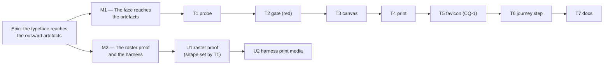

# Implementation Plan: The typeface reaches the outward artefacts

- **Feature spec:** [`./feature-spec.md`](./feature-spec.md)
- **Status:** Draft — awaiting approval
- **Owner:** _(unassigned)_

## Breakdown

### Epic

**The typeface reaches the outward artefacts** — carry the 2026-08-24 face decision to the six
sites that opt out of the cascade, and add one structural gate so the next cascade-level type
decision cannot miss them again. Maps to no roadmap theme; approved directly by the product owner,
2026-08-29.

**Two milestones, and that is the honest count.** M1 is the whole product change and ships alone.
M2 exists only because one of its two tasks has a **shape that M1-T1 measures rather than a design
that can be written now** — and because it fixes a hole in an instrument, which is not a reason to
hold a product change back. If M1-T1 reports that a raster assertion cannot discriminate, M2 is one
small task plus a recorded finding, and it says so rather than being padded.

---

## Milestone 1 — The face reaches the artefacts

**Outcome:** the exported PNG/PDF and both printed documents are set throughout in IBM Plex Sans;
`Inter` is named nowhere in the product; a hand-set font anywhere under `apps/web/src` fails CI.

**Entry point:** unchanged and already live — `Share & export ▾ → Diagram — whole plan (PNG)` and
`→ (PDF)` on the plan workspace command deck, and `Print` on the same deck for the TSLD diagram and
the Gantt programme. **This milestone adds no control and claims none.** It is user-facing all the
same: it changes what those three existing controls produce, which is why it carries its journey
step (T6) rather than deferring one (ADR-0081 §2).

**Journey:** T6 — `apps/web/e2e-export/exported-diagram.spec.ts` gains a test that mounts each print
surface, calls `page.emulateMedia({ media: 'print' })`, and asserts the print container's computed
`font-family` leads with `IBM Plex Sans`. Verified red against the pre-fix `'Inter', …` stack, which
is what makes it a proof rather than an agreement. **No new Playwright config and no new CI step** —
`playwright.export.config.ts` and `.github/workflows/ci.yml:643` already exist.

---

#### Feature: One type decision, five composed strings, one declaration

> **Description:** `FONT_STACK` in the render leaf feeds all five canvas font strings; one
> `font-family: var(--font-sans)` on the shared print container feeds all three print surfaces; one
> structural gate makes both derivable rather than remembered.
> **Complexity:** S
> **Dependencies:** none — nothing must land first.
> **Risks:** see the rollup.
> **Testing requirements:** the new structural gate (verified red); the existing golden snapshot
> unmodified (SC-4); the five export unit suites green unchanged; the print-media journey step.

##### Task M1-T1 — Measure before building (no product code)

- **Description:** Settle the two questions whose answers change what gets built. Nothing else in
  this plan depends on guessing either.
  - **(a) Does print-media emulation reach computed style?** Drive an existing plan, mount a print
    document, `page.emulateMedia({ media: 'print' })`, read
    `getComputedStyle(document.querySelector('.tsld-print-container')).fontFamily`. **Expected
    today: a list beginning `Inter`.** If it returns the screen value instead, the whole print half
    of the spec's §5 changes shape and T6 must be redesigned before it is written.
  - **(b) Can the exported raster's face be asserted at all?** In the page, measure the fixture's
    plan name on an `OffscreenCanvas` at the shipped `600 16px 'IBM Plex Sans', …` and at a
    fallback-only `600 16px system-ui, …`. **Falsification condition, committed before the run: a
    difference of ≥ 8 px means M2-U1 is worth building; below 8 px it is not, and M2-U1 becomes a
    recorded finding instead.**
- **Complexity:** S
- **Dependencies:** none
- **Risks:** (b) may report a small difference on the CI container and a large one on a developer's
  machine, because `system-ui` differs per platform → run it in the same Playwright Chromium the
  journey uses, and record which container the number came from.
- **Testing:** this task **is** the test. Its output is two numbers and a decision, written into
  this plan and into the spec's §5 in the same commit.
- **Development steps:**
  1. Write a throwaway probe spec under `apps/web/e2e-export/` (or run it via `page.evaluate` in a
     scratch run) — **not committed as a suite**; it is an instrument, and a probe left behind as a
     test asserts whatever the tree does today.
  2. Run it against the current tree. Record both numbers verbatim.
  3. Write the outcome into this file (M2's size) and into `feature-spec.md` §5 (the honest answer
     to "what proves it"), including if the answer is "nothing does".

##### Task M1-T2 — The gate, verified red

- **Description:** Add `apps/web/src/styles/typeface-reach.structural.test.ts` with the four
  assertions from the spec's §4 D3. **Land it before the fixes**, so red is the pre-fix tree rather
  than a claim about one.
- **Complexity:** M
- **Dependencies:** M1-T1(a) only for the docblock's accuracy about what the gate cannot see.
- **Risks:**
  - _The scan matches its own docblock_ (four gates in this repository have) → strip comments before
    scanning; the docblock will contain the forbidden `'Inter', …` string deliberately, and a run
    with comments un-stripped is the red-first check for that specific hazard.
  - _An over-broad canvas-font pattern reports the measurement harnesses_ (`measure-toolbar/*`,
    `measure-axis-markers/*` read `fontFamily` from computed style) → scope the scan to
    `apps/web/src`, which excludes them by construction; assert that exclusion in the docblock.
  - _A file-level exemption hides a real offender_ → key exceptions `file::substring`, per
    `control-height.structural.test.ts:99-105`.
- **Testing:** the gate itself, run three ways: **red** against the untouched tree (it must name
  `PrintSurface.css`, `GanttPrintSurface.css` and the four `render-export-image.ts` constants, **and
  nothing else** — an over-report is as much a defect as an under-report); **red** with a
  deliberately deleted exception whose code still exists; **red** with an exception whose code has
  been removed.
- **Development steps:**
  1. Write the file, modelled on `control-height.structural.test.ts` (exception shape, pinned
     positive, comment stripping) and `token-alias-reads.structural.test.ts` (file walking, the
     recorded-blind-spot docblock convention).
  2. Assertion 1 — derivation: parse `--font-sans`'s leading quoted family from `globals.css`,
     assert `FONT_STACK` contains it. Port the regex from
     `features/tsld/render/label-font.structural.test.ts:22`.
  3. Assertion 2 — no hand-set canvas font: `.ts`/`.tsx` under `apps/web/src`, comments stripped,
     canvas-shorthand literals and `fontFamily` assignments must reference `FONT_STACK`.
  4. Assertion 3 — no hand-set CSS family: `.css` under `apps/web/src`, `font-family:` outside
     `globals.css`'s `@font-face` blocks.
  5. Assertion 4 — the pinned positive over the exception map.
  6. Record the blind-spot table from the spec's §4 D3 **in the file's own docblock**, including the
     `public/favicon.svg` row.
  7. **Delete** `features/tsld/render/label-font.structural.test.ts`, subsumed — two gates over one
     rule is how they drift. Its docblock's reasoning moves across verbatim; those comments record
     a defect that shipped.

##### Task M1-T3 — `FONT_STACK`, and the five strings composed from it

- **Description:** One exported constant; `LABEL_FONT` and the four export-band constants composed
  from it.
- **Complexity:** S
- **Dependencies:** M1-T2 (so the gate goes green on this task rather than being written to fit it)
- **Risks:**
  - **The golden snapshot re-baselines.** `paint.golden.test.ts.snap:306` and `:803` record
    `LABEL_FONT` verbatim → `` `11px ${FONT_STACK}` `` must be **byte-identical** to today's
    literal. If the suite goes red, the composition is wrong; **the snapshot is not the thing to
    change** (its own docblock names thoughtless `-u` as the ADR-0034 failure).
  - _Adding an import to `geometry.ts` breaks the leaf gate_ —
    `geometry-is-a-leaf.structural.test.ts:40` pins its import list with an exact `toEqual` →
    declare `FONT_STACK` **in** `geometry.ts`; do not create a sibling module for it.
- **Testing:** `paint.golden.test.ts` green **with `git status` clean on the snapshot file**; the
  five `render-export-image.*.test.ts` suites green unchanged; the new gate's assertions 1 and 2
  green.
- **Development steps:**
  1. In `geometry.ts`, add `export const FONT_STACK = "'IBM Plex Sans', ui-sans-serif, system-ui, -apple-system, 'Segoe UI', Roboto, Helvetica, Arial, sans-serif";`
     with a docblock stating that it mirrors `--font-sans` and that the gate derives the family from
     the CSS rather than trusting this line.
  2. Recompose `LABEL_FONT` as `` `11px ${FONT_STACK}` ``. Run the golden suite; confirm the
     snapshot file is **unmodified**.
  3. In `render-export-image.ts`, import `FONT_STACK` from `../render/render-model` (the barrel it
     already imports from at `:10` — not from `./geometry` directly, and not into the leaf).
  4. Recompose `TITLE_FONT` (`600 16px`), `SUBTITLE_FONT` (`12px`), `LEGEND_FONT` (`11px`),
     `MARKER_FONT` (`11px`). Sizes and weights are unchanged — this task changes the family only.
  5. Update the two docblocks (`:32`, `:228`) to say where the family comes from.

##### Task M1-T4 — One print declaration, two deletions

- **Description:** Declare `font-family: var(--font-sans)` on `.tsld-print-container` in
  `print-document.css`; delete the `'Inter', …` stacks from both feature sheets.
- **Complexity:** S
- **Dependencies:** M1-T2
- **Risks:**
  - _A reader of `GanttPrintSurface.css` cannot see where its face comes from_ → a comment pointing
    at the container, which those sheets already do for the colour scope.
  - _The Gantt table's fixed-layout columns truncate sooner in a wider face_
    (`GanttPrintSurface.css:77-98`, `table-layout: fixed` + `text-overflow: ellipsis`) → this is
    ellipsis behaviour, not breakage; confirmed by eye on the M2-U2 shot.
- **Testing:** the new gate's assertion 3 green; T6's journey step; the existing print unit suites
  green (they assert markup and classes, not families).
- **Development steps:**
  1. Add the declaration to `.tsld-print-container` (`print-document.css:28-30`), **outside**
     `@media print` so the screenshot harness's revealed container gets it too.
  2. Comment it with the D1 reasoning — specifically **why it is not left to inheritance**: `body`
     resolves `var(--font-sans)` on `body`, so a future `[data-surface='print']` rebind would be
     silently ignored, which is the ADR-0102 alias trap in a new costume.
  3. Delete `PrintSurface.css:35-44` and `GanttPrintSurface.css:45-54`; leave a one-line pointer in
     each.
  4. Note in both files that `HealthPrintDocument.css` has always inherited and now shares one
     mechanism with them.

##### Task M1-T5 — The favicon (CQ-1)

- **Description:** Resolve `public/favicon.svg:16`'s `system-ui` stack — **the one outward artefact
  the gate structurally cannot reach.**
- **Complexity:** S (option a) / M (option b)
- **Dependencies:** the product owner's answer to **CQ-1**
- **Risks:** _Option (b) bakes a glyph outline into the repository_ → it needs a provenance note
  beside `PROVENANCE.md`'s table, generated from the same vendored woff2 so the outline and the
  face cannot disagree.
- **Testing:** option (a) — the gate's pinned positive (the exception must still match). Option (b)
  — the `sign-in` shot and a browser tab, by eye; there is no automatable assertion for a favicon's
  typeface and this plan does not pretend otherwise.
- **Development steps (option a, the stated default):**
  1. Add `favicon.svg::system-ui` to the gate's exception map with the reason: an SVG served as a
     file has no access to the app's CSS, and a favicon renders in a context that does not fetch
     external resources, so neither a token nor an `@font-face` can reach it.
  2. Extend the file's existing comment (which already makes this argument for **colour**) to cover
     type, so the two are one explanation rather than two.
- **Development steps (option b):**
  1. Convert the `S` to a `<path>` from IBM Plex Sans Bold, generated from
     `src/assets/fonts/ibm-plex-sans-latin.woff2`.
  2. Record the derivation (tool, command, source file, hash) in `PROVENANCE.md`.
  3. Check the mark at 16 px in a real tab; a hinted `system-ui` `S` may read better than an
     unhinted outline at that size, and if it does, option (a) is the right answer after all —
     **record that if it happens rather than shipping the worse mark to satisfy a rule.**

##### Task M1-T6 — The journey step: paper computes the product's face

- **Description:** Add the print-media assertion to `e2e-export/exported-diagram.spec.ts`. This is
  ADR-0081 §2's step landing with the first user-facing milestone.
- **Complexity:** M
- **Dependencies:** M1-T1(a) — its shape is only valid if print-media emulation reaches computed
  style; M1-T4 for green.
- **Risks:**
  - _The print container is torn down before it can be read_ —
    `mountPrintDocument` schedules teardown on `afterprint` and a 60 s fallback
    (`print-document.ts:105-106`) → stub `window.print` as the screenshot harness does
    (`shoot.mjs:435-437`), so no dialog opens and no `afterprint` fires.
  - _The test drives the wrong surface_ → assert on **both** the TSLD print surface and the Gantt
    programme; the printed programme has never been driven by any journey (spec §0), so this is its
    first coverage of any kind.
  - _`Print` lives behind a deck trigger whose label changes_ → locate by role and accessible name,
    never by copy or a CSS selector (ADR-0091 M7's rule, after three journeys broke on a label
    change).
- **Testing:** verified **red** against the pre-M1-T4 stylesheets (it must report a family beginning
  `Inter`), then green.
- **Development steps:**
  1. New `test()` in the existing spec, reusing the file's `onboard`/`createHierarchy`/`newPlan`
     seeding helpers.
  2. Stub `globalThis.print`; press `Print` for the TSLD surface; `emulateMedia({ media: 'print' })`;
     read the container's computed `font-family`; assert it starts with `IBM Plex Sans`.
  3. Switch to the Gantt view (`?view=gantt`), repeat for the programme.
  4. `emulateMedia({ media: null })` afterwards, so a later assertion in the file is not run under
     print media.
  5. Assert the **negative** too: the resolved family does **not** contain `Inter`. A leading-family
     check alone would pass against a stack that still names a font this product never served.

##### Task M1-T7 — The documents, and the changeset

- **Description:** Correct the two stale lines, write the authoring rule, record the decision.
- **Complexity:** S
- **Dependencies:** M1-T3, M1-T4 (so the rule describes what shipped)
- **Risks:** _the correction goes stale at the next face change, exactly as these two did_ → the new
  §Typography text names **no face inline**; it points at `globals.css:27-107` (which carries the
  face, the reasoning and the privacy argument) and at `PROVENANCE.md` (the files and licence), and
  states the mechanism. A document that does not restate a value cannot disagree with it.
- **Testing:** `pnpm check:doc-links`; the changeset is a `patch` on `@repo/web`.
- **Development steps:**
  1. `docs/DESIGN_SYSTEM.md:78` — replace "(Inter + system fallback)" with a pointer to
     `--font-sans` and `globals.css`, no face named inline.
  2. `docs/DESIGN_SYSTEM.md:323` — correct "The typeface is Space Grotesk" **in place with the
     history kept**: this file records superseded decisions rather than erasing them, and "the face
     changed twice and neither change reached this line" is the useful part of the correction.
  3. Add an authoring rule to §Typography: _a surface that resolves nothing from the cascade — a
     canvas, a file-served SVG — is handed the family explicitly and is covered by
     `typeface-reach.structural.test.ts`; a DOM surface inherits and declares nothing._
  4. `docs/DECISIONS.md` — one entry recording the mechanism (D1 (c) over (a), D2 (a) over (b)) and
     specifically the **inheritance finding**: `body`-inherited type silently ignores a
     surface-scope rebind of `--font-sans`, which is the one thing a future reader would otherwise
     re-derive.
  5. `pnpm changeset` — patch on `@repo/web`, described as the artefacts a planner hands over being
     set in the product's typeface.

---

## Milestone 2 — The raster proof, and the harness that could not see the medium

**Outcome:** the exported raster's typeface is proved by an instrument, or the fact that it cannot
be is written down; and the screenshot harness photographs the print document under print media
instead of under screen media.

**Entry point:** none — **this milestone ships dark, deliberately.** It adds no product code and no
user-reachable behaviour; it is an instrument milestone. Recorded here rather than left implicit,
per ADR-0081 §1's "there is no third state".

**Journey:** M1-T6 already landed the journey step. M2-U1 extends the same suite if M1-T1(b) says it
can discriminate.

**Its size is an output of M1-T1(b), not an estimate.** If the two faces' measured widths differ by
≥ 8 px on the fixture's plan name, M2 is two tasks. If not, U1 becomes a paragraph and M2 is one.

---

##### Task M2-U1 — The raster's face, asserted or honestly declined

- **Description:** Extend `e2e-export/exported-diagram.spec.ts` to assert the exported PNG's title
  band was drawn in the product's face — **only if M1-T1(b) established that the assertion can
  discriminate.**
- **Complexity:** M — or S, if the answer is "it cannot", in which case the deliverable is the
  written finding.
- **Dependencies:** M1-T1(b), M1-T3
- **Risks:**
  - _An assertion that passes for either face._ This is the whole risk, and it is worse than no
    assertion, because a green gate stops anyone looking (ADR-0110 D5's rule: a gate is finished
    when it has been made to fail by the defect it was written for). Mitigation: the ≥ 8 px
    falsification condition, committed before the measurement.
  - _The title's ink extent is polluted by other band content._ The title is drawn alone at
    `y = 28` with the subtitle at `48` and the legend at `68` (`render-export-image.ts:216, 223`,
    `:304`), so a narrow row band isolates it — but that is a claim to verify against the decoded
    pixels, not to assume.
- **Testing:** verified **red** by rendering the reference at the fallback stack and confirming the
  assertion fails.
- **Development steps:**
  1. If M1-T1(b) said no: write the finding into the spec's §5 table and into this file, naming what
     is therefore unproven and who looks at it instead (the `export-diagram` shot, by eye). **Stop.**
  2. If yes: measure the reference width in-page at the shipped `TITLE_FONT`.
  3. Scan the decoded PNG's title row for the horizontal extent of dark pixels.
  4. Assert it matches the shipped-face reference and not the fallback reference, with a tolerance
     derived from the measured gap rather than chosen.

##### Task M2-U2 — The harness photographs the medium it names

- **Description:** `scripts/shoot.mjs`'s `health-print-document` shot reveals the print container by
  setting `display: block` in page script (`:439-450`) **without emulating print media**, so
  `@media print` never applies. Today that means the shot shows the container inheriting Plex while
  paper got Inter→`system-ui`: **a harness photographing the print document was not photographing
  the print document.** Add `emulateMedia({ media: 'print' })`.
- **Complexity:** S
- **Dependencies:** none (independently valuable; would have been true before this epic)
- **Risks:** _print media changes more than the font and the shot's other content shifts_ → this is
  the point; re-review the shot rather than tuning it back. If the reveal hack becomes unnecessary
  under print emulation, simplify it and say so.
- **Testing:** run `shoot.mjs` for that shot; compare before/after by eye. Add the TSLD print surface
  and the Gantt programme to the shot list **if** they are absent — checked at the time rather than
  assumed here.
- **Development steps:**
  1. `page.emulateMedia({ media: 'print' })` before the reveal in that shot's `after` hook.
  2. Re-run; confirm the picture changed and is now the paper document.
  3. Comment the hook with why: a screenshot of a print surface under screen media is a screenshot
     of a different document.

##### Task M2-U3 — An ADR, only if the reviewer asks _(unscheduled)_

- **Description:** The spec's §4 argues **no ADR** — this applies an existing decision to layers
  that missed it, and the new gate is ADR-0058's standing instruction rather than a decision needing
  one. Carried as a task so overruling the default costs a tick rather than a re-plan.
- **Complexity:** S
- **Dependencies:** M1 complete
- **Testing:** `pnpm check:adr-coverage` (which since ADR-0110 D6 checks the index in **both**
  directions — a new ADR absent from `docs/adr/README.md` fails).

---

## Sequencing & slices

1. **M1-T1** first, always — two of the spec's five questions are answered by measurement, and one
   of them decides whether M2-U1 exists at all. Its output is committed before anything is built.
2. **M1-T2** before **M1-T3/T4** — the gate must be red against the pre-fix tree, or "verified red"
   is a claim rather than a fact.
3. **M1-T3 → T4 → T5 → T6 → T7**, then release. `main` is releasable after T7 and after every
   intermediate task: each is independently correct, and none half-changes a surface.
4. **M2** follows and is independently releasable.

**No feature flag.** ADR-0088 D1 established that a `VITE_` constant is inlined at build time and is
not an operator rollback — `apps/web/Dockerfile` declares one `VITE_` build arg,
`docker-publish.yml` passes none — so a flag here would buy nothing and cost a second product. The
rollback is a commit boundary, and this change is a handful of one-line reverts.

**One-line PR-scale slices, deliberately.** The whole product change is one constant, five
compositions, one CSS declaration and two deletions. It is small because the mechanism was already
built for `LABEL_FONT`; the value of the epic is in the **gate** and in what checking turned up
(two stale documents, two false brief claims, a harness photographing the wrong medium).

## Definition of Done (per task)

Each task's PR satisfies the Feature Completion Criteria in [`docs/PROCESS.md`](../../PROCESS.md).
Specifically for this epic:

- **`pnpm prepush`** run locally — it derives ten checks from `package.json`, including
  `check:doc-links` and `check:adr-coverage`, which running the parts by hand has already missed
  once (CLAUDE.md §19.8).
- **`scripts/e2e-local.sh web:export`** for M1-T6 and M2-U1 — a journey drives a real browser, and
  no unit suite can tell you whether print-media emulation reaches computed style.
- **The golden snapshot file is unmodified** (`git status` clean on
  `render/__snapshots__/paint.golden.test.ts.snap`) — SC-4.
- **Every new gate assertion was verified red first**, against the specific defect it guards, and
  the red run is described in the file's docblock (ADR-0110 D5).
- **`apps/api` is untouched** — this is `apps/web` only.

## Risks & assumptions (rollup)

| Risk / assumption                                                                                              | Likelihood | Impact   | Mitigation                                                                                                                                                                           |
| -------------------------------------------------------------------------------------------------------------- | ---------- | -------- | ------------------------------------------------------------------------------------------------------------------------------------------------------------------------------------ |
| **R-1** The composed `LABEL_FONT` is not byte-identical and the golden snapshot re-baselines                   | low        | **high** | The snapshot is the oracle (SC-4). If it goes red the composition is wrong; never `-u`. `paint.golden.test.ts:33-34` names thoughtless re-baselining as the ADR-0034 failure.        |
| **R-2** A wider face changes which legend entry is last on a narrow export crop (`render-export-image.ts:358`) | med        | low      | Cosmetic and self-consistent. Reviewed on the `export-diagram` shot; the band's fixed geometry has 17 px of headroom below the legend baseline.                                      |
| **R-3** Print-media emulation does not reach `getComputedStyle` in this Playwright version                     | low        | med      | M1-T1(a) settles it **before** T6 is written. If it fails, §5's print half is redesigned and the plan says so rather than shipping a vacuous assertion.                              |
| **R-4** The raster assertion cannot discriminate between the two faces                                         | med        | low      | The ≥ 8 px falsification condition, committed before the measurement. If it fails, M2-U1 becomes a written finding — which is a real outcome, not a failure.                         |
| **R-5** The gate over-reports (e.g. the measurement harnesses) or under-reports                                | med        | med      | M1-T2's red run must name **exactly** the six known sites and nothing else. An over-report is as much a defect as an under-report — it is how a gate gets weakened.                  |
| **R-6** The gate matches its own docblock                                                                      | med        | low      | Comments stripped before scanning. Four gates here have been caught doing this; the list is in `control-height.structural.test.ts:21-23`.                                            |
| **R-7** An exception outlives its code and the list becomes a set of permissions for code that has gone        | low        | med      | The pinned positive (assertion 4), copied from `control-height.structural.test.ts:118-130`.                                                                                          |
| **R-8** The `latin-ext` subset is not loaded when a plan name needs it at export time                          | low        | low      | Stated as a residual, not designed around: the plan name renders in the workspace header before Export is reachable, so the subset has been requested. Narrower than today's window. |
| **A-1** `document.fonts.ready` at `render-export-image.ts:136` already closes the load race                    | —          | —        | **Assumption discharged**, not assumed: read at `:136`, before `createCanvas` (`:138`) and all four band draws (`:182-183`). See spec §3.                                            |
| **A-2** The golden oracle records only the scene painter                                                       | —          | —        | **Discharged**: `paint.golden.test.ts:3` imports `paintScene` alone; the snapshot holds the `LABEL_FONT` string twice and no band font.                                              |
| **A-3** `Inter` is not served                                                                                  | —          | —        | **Discharged**: no `@font-face`, no file in `src/assets/fonts/` (four files, all Plex — `PROVENANCE.md`).                                                                            |
| **A-4** Nothing else under `apps/web/src` sets a font                                                          | —          | —        | **Discharged by enumeration**: 12 `ctx.font` writes (8 correct, 4 not) and 6 `font-family` declarations (4 `@font-face`, 2 print sheets). Spec §3 "Blast radius".                    |
