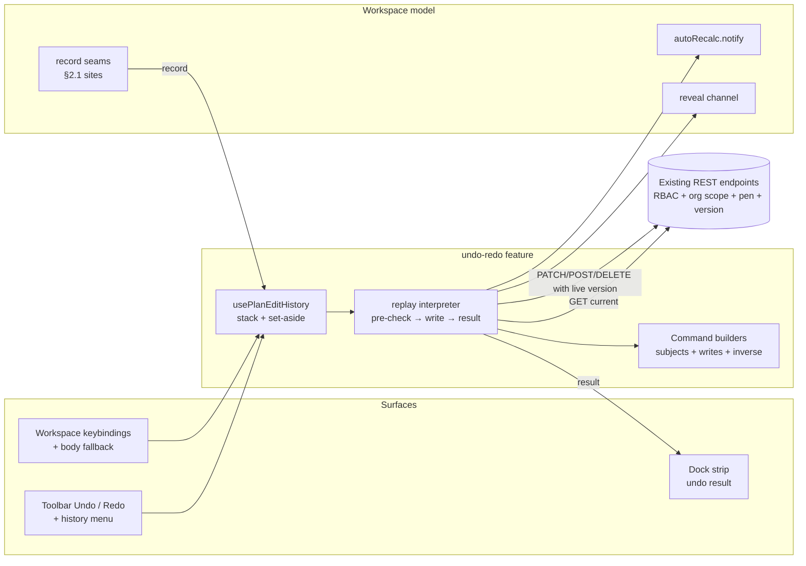
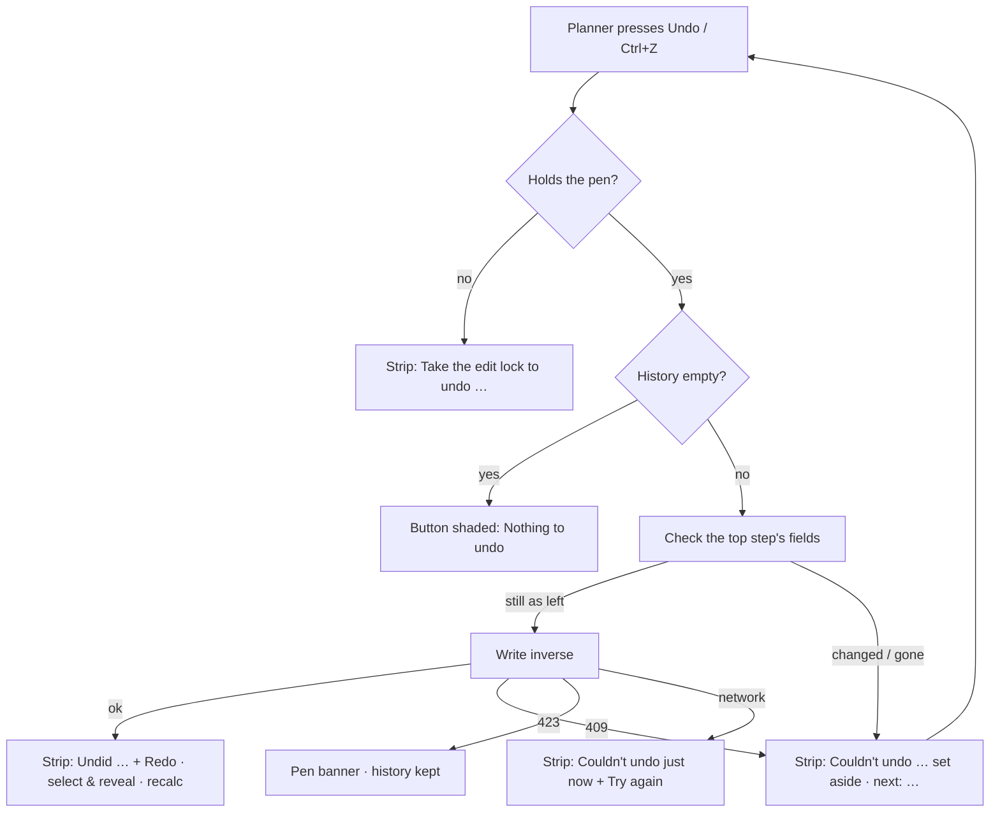

# Feature Spec: Undo/redo that works like it does everywhere else

- **Status:** Approved — product owner, 2026-10-04 ("Approved", in reply to the plain-English summary
  of this spec). CQ-1: plan settings stay **outside** undo (the recommended default). CQ-3: the
  result message lives in the **dock strip under the diagram** (the recommended default).
  **Orchestrator amendment at approval (CQ-2 / F-1):** fix (a) (#447) was built as a per-history
  version ledger that only knows versions produced by edits the stack itself recorded or replayed,
  so a colleague's write during a pen hand-off still bumps the row past the ledger and the replay
  still gets a 409 — the protection F-1 feared losing is kept (the regression test for #447 asserts
  it). M0-T1 (clear history on pen release) is therefore **dropped**; M2-T6 keeps history across a
  hand-off as planned.
- **Author(s):** feature-analyst
- **Date:** 2026-10-04
- **Tracking issue / epic:** product-owner request, 2026-10-04 ("make undo/redo best in class — work
  like undo/redo in most other apps")
- **Roadmap link:** follow-on to the delivered "Undo/redo" item (`docs/ROADMAP.md:776`)
- **Related ADR(s):** ADR-0048 (amended again by this work — successor ADR-0176 drafted in §4.9),
  ADR-0028 (pen), ADR-0032 (coalesced recalculation), ADR-0153 (overlap step), ADR-0092 (the dock),
  ADR-0088 (flag classification), ADR-0081 (journey rule), ADR-0105 (spec triggers)

---

## Plain-English summary (for the product owner)

Undo already works for most edits you make on the diagram. It falls short of Word or Excel in six
ways, and this plan fixes them in order of how much you will notice:

1. **You cannot see it happen.** When Undo works — or fails — the only message goes to screen
   readers. A sighted planner gets nothing. We add a short message in the strip under the diagram
   ("Undid Move “Excavate”", with a Redo button), and a clear explanation when something cannot be
   undone.
2. **It gets stuck.** Today one failed step blocks every earlier step until you reload. After this
   work, if one step cannot be undone (because somebody changed that activity since), Undo says so,
   sets that step aside, and the next press carries on with the earlier steps.
3. **Some edits cannot be undone at all** — adding an activity from the Add dialog or the Gantt's
   "Insert below", indenting/outdenting rows, changing the members of a summary, editing steps or
   resources, cross-plan links, and dissolving a summary (which today even wipes your whole undo
   history). All of those become undoable. A short list of things stays deliberately outside undo
   (progress reports, notes, plan settings, baselines, the shared calendar/resource libraries), each
   with a reason.
4. **It does not show you what it changed.** After Undo, the activity it changed is selected and
   scrolled into view, in the diagram and in the Gantt.
5. **Ctrl+Z sometimes does nothing** because keyboard focus has wandered off. It will work anywhere
   in the plan, while still leaving Ctrl+Z inside a text box to undo your typing.
6. **A history list** beside the Undo button lets you undo back to a chosen step, like Word.

What we are **not** doing, and why: keeping your undo history after you reload the page or leave the
plan. Word, Google Docs and Figma do not do that either, and after a reload SchedulePoint cannot know
what other people changed in between. Your history **does** survive switching between Diagram and
Gantt, opening and closing editors, and handing the edit lock to a colleague and taking it back.

Nothing here touches how the schedule is calculated. No database change. One small addition to one
server response (for undoing a dissolve).

---

## 0. Problem re-verification (CLAUDE.md §19.11, "the brief is not evidence")

Every claim in the brief was checked against the code before design. Four are wrong or stale in ways
that change what gets built.

| Brief claims                                                                 | Verified by                                                                                                                                                                                                                                                  | Verdict                                                                                                                                                                                                                                                                                          |
| ---------------------------------------------------------------------------- | ------------------------------------------------------------------------------------------------------------------------------------------------------------------------------------------------------------------------------------------------------------ | ------------------------------------------------------------------------------------------------------------------------------------------------------------------------------------------------------------------------------------------------------------------------------------------------ |
| 50-deep linear stack, 500 ms coalescing                                      | `apps/web/src/features/undo-redo/use-plan-edit-history.ts:9`, `:18`, `:117-136`                                                                                                                                                                              | **True**                                                                                                                                                                                                                                                                                         |
| Each command threads its own captured version → second undo on same row 409s | `commands.ts:161-170` (`let version = after.version`, rethreaded only from its own responses); same shape at `:200-204`, `:298-302`, `:639-648`, `:687-696`, `:780-790`, `:880-891`                                                                          | **True.** The commonest trigger is not exotic: an edit that creates an overlap records a second step that re-writes the same bar's lane (`use-auto-resolve-overlaps.ts:176-204`), so the edit's own undo then carries a stale version. Being fixed separately (assumed landed, §3 Dependencies). |
| Failure is announced only through an `sr-only` region                        | `components/ui/announcer.tsx:25` (`className="sr-only"`); `use-plan-undo-redo.ts:138-150` calls only `announce`                                                                                                                                              | **True**                                                                                                                                                                                                                                                                                         |
| History is cleared on pen loss (423)                                         | `use-plan-undo-redo.ts:122-129` clears **only when an undo/redo itself is refused with 423**. The only other `clear()` call is the dissolve boundary (`use-plan-workspace-model.ts:1169-1172`). Grep for `.clear()` under `apps/web/src` finds nothing else. | **Half true — and the false half matters.** A voluntary release, or a colleague taking the pen, leaves the history intact. ADR-0048 says it clears "on pen release" (`0048-…:50-51`); the code never did. See F-1.                                                                               |
| Cascade deletes truncate history                                             | ADR-0048 amendment §1 (`0048-…:101-111`); `use-plan-workspace-model.ts:1128-1144`                                                                                                                                                                            | **False since 2026-09-02.** A cascade delete is one id-stable undo step. Only **dissolve** still truncates. (Stale comment left at `activity-crud-dialogs.tsx:77-78`, "cascade → history truncation".)                                                                                           |
| Gantt cell edits are an example of an unrecorded write                       | `features/gantt/model/use-gantt-grid-editing.ts:171` → `recordUpdate` → `plan-workspace-toolbar.tsx:1077` (`recordUpdate: model.recordActivityUpdate`)                                                                                                       | **False.** Gantt cell commits record. Gantt bar drags also record, because they call the diagram's own `onTsldReposition`/`onTsldResize` (`plan-workspace-toolbar.tsx:1098-1112`). The real Gantt gap is **Indent/Outdent** and **Insert below** (§2.1).                                         |
| Tooltips name the step ("Undo move activity")                                | `features/tsld/toolbar/tsld-toolbar-items.tsx:2056-2061`                                                                                                                                                                                                     | **True, with a defect:** `stepLabel.toLowerCase()` lowercases the **whole** label, so the tooltip reads _Undo edit “excavate”_ for an activity named "Excavate". The announcement uses a different rule (`use-plan-undo-redo.ts:59-61`, first letter only), so the two disagree.                 |
| `VITE_UNDO_REDO` status                                                      | `apps/web/src/config/env.ts:491` (`flagDefaultOn`), `scripts/flag-retirement.json:525-532` (Class B, `keep`)                                                                                                                                                 | **Default-on in every published image.** Its docblock (`env.ts:486-487`) still says "set `VITE_UNDO_REDO=false` to ship it inert … emergency rollback" — **false** per ADR-0088 D1 (`0088-…:39-46`): no build path sets a `VITE_` flag. See §4.8.                                                |

Two things the brief did not know, found while checking:

- **F-1 — Fix (a) removes the only protection against overwriting a colleague's edit.** Today a
  stale captured version is what makes an undo after a pen hand-off fail with 409. Once commands read
  the row's **live** version (fix (a)), that 409 disappears: release the pen, a colleague moves
  "Excavate", take the pen back, press Undo — and your old step silently overwrites their move. Nothing
  else guards it, because the history is not cleared on hand-off (row above). **This is why M0's
  interlock exists and why M2 is second, not later.**
- **F-2 — An undo does not always recalculate.** No undo path calls `autoRecalc.notify()`; it relies
  on the inverse changing a field in the "structure signature" (`use-plan-workspace-model.ts:674-686`,
  stated in its own comment). That signature reads `durationDays` and `lagDays` (`:692`, `:697`), both
  **rounded** from stored minutes (`commands.ts:120-125`, ADR-0070). So undoing a sub-day duration or
  lag change, or an activity-calendar change (not in the signature at all), restores the input and
  leaves the dates describing the edit just reversed. Same class as the `visualStart` defect that
  comment already records (`:674-686`).
- **F-3 — The editor's type change has the wrong inverse.** A type change saved from the activity
  editor records `updateCommand` (`ActivityEditorDialog.tsx:117` → `use-plan-workspace-model.ts:1119`),
  a full-definition PATCH that resends dates with the type. `typeChangeCommand`'s own docblock says
  that is wrong for exactly this case (`commands.ts:284-287`: "a date sent WITH the type is read in the
  new type's convention"). Likely user-visible as a milestone landing a day off after undo; M2's
  field-scoped inverse removes the cause. Confirmed by a test in M2, not asserted here.
- **F-4 — Ctrl+Z is dead whenever focus is on `<body>`.** The accelerators are a React `onKeyDown`
  on the workspace root (`plan-workspace-toolbar.tsx:1818`), so a keystroke with focus on `<body>`
  never reaches them. The codebase already knows focus falls there — "deselecting drops focus to
  `<body>` and silently disables the workspace accelerators" (`plan-workspace-toolbar.tsx:1566-1569`)
  — and fixes it one control at a time.

---

## 1. Business understanding

### Problem

Undo/redo shipped in July (ADR-0048) and has been extended edit by edit since. It is correct for
most single edits, but it does not behave the way planners expect from every other application they
use, and the gaps are the kind that make people stop trusting it:

- **Invisible outcome.** A sighted planner presses Ctrl+Z and, if nothing visibly moves (the bar is
  off-screen, or the change is a lag), cannot tell whether anything happened. A failure is equally
  silent (§0).
- **Dead ends.** A conflict on one step blocks every earlier step until the page is reloaded, which
  also destroys the history (`use-plan-undo-redo.ts:131-147` leaves the failing step on top).
- **Holes in coverage.** The same act is undoable from one surface and not another — adding an
  activity by drawing it is undoable; adding it from the dialog or the Gantt's "Insert below" is not
  (§2.1).
- **No orientation.** Undo does not select or scroll to what it changed.

Why now: the product owner reported it directly on 2026-10-04, after observing the silent failure in
a real browser, and two defects in the stack (fix (a), fix (b)) are already being repaired —
the resilience design must land beside fix (a) because of F-1.

### Users

| Role                   | Undo/redo?                                                                                                           |
| ---------------------- | -------------------------------------------------------------------------------------------------------------------- |
| Org Admin, Planner     | **Yes**, while holding the pen (ADR-0028). Every undo is an ordinary pen-gated write.                                |
| Contributor            | **No.** Contributors report progress, which is not pen-gated and stays outside undo (ADR-0048 "Neutral"). Unchanged. |
| Viewer, External Guest | **No.** No authoring, so no history; controls stay shaded with the existing reason.                                  |

### Primary use cases

1. A planner makes a mistake (drag, resize, delete, wrong link) and presses Ctrl+Z; the plan returns
   to how it was, and they **see** it did.
2. A planner undoes several steps in a row without the stack jamming.
3. A planner works in the **Gantt** and expects the same undo as on the diagram.
4. A planner undoes back to "before I started that restructure" in one action (history list).
5. A planner hands the pen to a colleague for a few minutes, takes it back, and can still undo their
   own earlier work — without clobbering the colleague's.

### User journeys

Happy path: edit → Ctrl+Z → bar returns, is selected and in view, dock strip reads "Undid Move
“Excavate”" with **Redo** → Ctrl+Shift+Z → strip reads "Redid Move “Excavate”" with **Undo**.

Alternates: (a) a step whose subject was changed since → strip explains and sets it aside, next press
continues (§4.3); (b) no pen → strip says "Take the edit lock to undo"; (c) history list → choose a
step → undone back to it, stopping and explaining at the first step that cannot apply. See the user
flow in §4.

### Expected outcomes

- Every plan-authoring edit a planner makes in the diagram or the Gantt is reversible, apart from a
  short, written exclusion list.
- Undo never strands the planner: the worst case is "this step was set aside, here is why".
- A sighted planner always knows what undo/redo just did.

### Success criteria

- **Zero dead ends**: the e2e journey changes a row through the REST API behind the planner's back,
  presses Undo, sees the explanation, presses Undo again and the earlier step applies.
- **Coverage is computed, not remembered**: a census test (§4.6) fails if a mutation hook reachable
  from the plan workspace or the Gantt is neither recorded nor listed as an exclusion with a reason.
- **Visible feedback**: for every undo/redo outcome (success, set-aside, pen, transport failure) a
  visible strip appears in both views; asserted per outcome in the journey.
- **No regression of the recalculation parity gate**: no file under
  `apps/api/src/modules/schedule/engine/` changes (checked in each PR).

### Open questions

Critical ones are in §1.1 below. Defaults for the rest:

- History depth stays **50** (§4.5 explains why raising it is not worth its worst case).
- History is **not** kept across reload or across leaving the plan (§4.5).
- History **is** kept across view switch, editor open/close, and pen release/retake (§4.5).
- Feedback lives in the **canvas dock** in both views (§4.2) — see CQ-3.
- `VITE_UNDO_REDO` is **retired** in the final milestone (§4.8).

### 1.1 Critical questions

- **CQ-1 — Plan settings: inside undo or outside?** Changing the plan's calendar, planned start,
  schedule options or recalculation mode moves the whole schedule, and in Microsoft Project it is
  undoable. Here those writes are **not pen-gated** (the `plans` module has no `assertHoldsPen`; the
  pen-gated modules are activities, dependencies, resource assignments, steps, cross-plan links and
  schedule — `grep assertHoldsPen apps/api/src/modules`), they are made in dialogs/popovers with an
  explicit Save, and any Planner can make them while another holds the pen. **Default: outside**, with
  a written trigger to revisit. Answering "inside" adds roughly one milestone (seven controls,
  `PlanFormDialog.tsx:80`, `PlanCalendarPicker.tsx:62`, `PlanScheduleOptionSelect.tsx:39`,
  `PlanRecalcModePicker.tsx:33`, `PlanExpectedFinishToggle.tsx:39`, `PlanEarnedValueSettings.tsx:28`,
  `PlanCriticalFloatThresholdField.tsx:56`).
- **CQ-2 — (for the engineering lead) Fix (a) must not ship without the M0 interlock.** See F-1. If
  fix (a) is already merged, M0-T1 should follow it the same day; if not, fold M0-T1 into it.
- **CQ-3 — Where the feedback appears.** The brief says "near the toolbar". The design puts it in the
  **canvas dock** (the strip row under the diagram, present in both views), because ADR-0092 moved
  every transient strip there and the overlap notice — which already offers Undo — lives there
  (`features/tsld/model/dock-strip.ts:76-133`). A second home for transient messages is the drift
  ADR-0092 removed. **Default: the dock.** The alternative is a small bubble under the Undo button,
  which costs a new positioning primitive and a second precedence rule.

---

## 2. Functional requirements

### 2.1 Coverage census — every write path in the plan workspace and Gantt

**Recorded today** (for completeness; each `editHistory.record` / `history.record` site):

| Edit                                                    | Site                                                                                                        |
| ------------------------------------------------------- | ----------------------------------------------------------------------------------------------------------- |
| Draw an activity on the canvas                          | `use-plan-workspace-model.ts:767`                                                                           |
| Bulk delete / bulk move / link in sequence              | `:855`, `:905`, `:973`                                                                                      |
| Apply levelled dates                                    | `:1061`                                                                                                     |
| Editor definition save, Gantt cell commit               | `:1119` via `activity-crud-dialogs.tsx:148` and `plan-workspace-toolbar.tsx:1077`                           |
| Delete (dialog, Gantt row menu, activities table)       | `:1150` via `activity-crud-dialogs.tsx:80`, `activity-bottom-panel.tsx:320`                                 |
| Link add / remove / edit (Logic tab & dialog)           | `:1201`, `:1181`, `:1599` via `activity-crud-dialogs.tsx:192-194`, `plan-dialogs.tsx:66-68`                 |
| Lane move, move, start-edge resize, finish-edge resize  | `:1251`, `:1324`, `:1407`, `:1445` (Gantt bar drags reach these via `plan-workspace-toolbar.tsx:1098-1112`) |
| Lag drag / nudge, canvas link, Arrange, Clear placement | `:1535`, `:1630`, `:1693`, `:1758`                                                                          |
| Make milestone, level-of-effort span, duplicate/paste   | `:1893`, `:2013`, `:2208`                                                                                   |
| Overlap auto-resolve (own step, ADR-0153 CQ-2)          | `use-auto-resolve-overlaps.ts:204`                                                                          |

**Not recorded — to be made undoable by this epic:**

| Edit                                                                                             | Write site                                                                                                                                                             | Milestone |
| ------------------------------------------------------------------------------------------------ | ---------------------------------------------------------------------------------------------------------------------------------------------------------------------- | --------- |
| Add activity from the dialog (bottom panel **Create activity**, Gantt **Insert activity below**) | `features/activities/components/ActivityCreateDialog.tsx:588` (hosted at `activity-crud-dialogs.tsx:250` and `CreateActivityButton.tsx:47`; neither passes a recorder) | M3        |
| Gantt **Indent / Outdent**                                                                       | `plan-workspace-toolbar.tsx:1439` (`updateParents.mutate`)                                                                                                             | M3        |
| Summary **Members** panel save                                                                   | `features/wbs/components/ActivityMembersPanel.tsx:124`                                                                                                                 | M3        |
| WBS **bulk assign** bar                                                                          | `features/wbs/components/WbsBulkAssignBar.tsx:84`                                                                                                                      | M3        |
| **Steps** save (editor Steps tab)                                                                | `features/activities/components/ActivityEditorDialog.tsx:149`                                                                                                          | M3        |
| **Resource assignment** add / edit / remove                                                      | `features/resources/components/ActivityResourcesPanel.tsx:132`, `AssignmentRow.tsx:122`, `:289-290`                                                                    | M3        |
| **Cross-plan link** add / remove                                                                 | `features/cross-plan-dependencies/components/AddCrossPlanLinkDialog.tsx:141`, `CrossPlanLinksSection.tsx:44`                                                           | M3        |
| **Dissolve summary** (today **clears the whole history**)                                        | `activity-crud-dialogs.tsx:124-128`, `ActivitiesTable.tsx:1027` → `use-plan-workspace-model.ts:1169-1172`                                                              | M6        |

**Deliberately outside undo** (each with its reason; the census test holds this list):

| Edit                                                         | Site(s)                                                                                                                                          | Why outside                                                                                                                                                                                             |
| ------------------------------------------------------------ | ------------------------------------------------------------------------------------------------------------------------------------------------ | ------------------------------------------------------------------------------------------------------------------------------------------------------------------------------------------------------- |
| Progress report                                              | `ActivityEditorDialog.tsx:130`                                                                                                                   | Contributor-writable and not pen-gated; folding it in breaks the single-writer assumption the stack rests on (ADR-0048 "Neutral"). A report is a record of what happened, corrected by reporting again. |
| Notes add / edit / delete                                    | `features/notes/components/NoteComposer.tsx:43`, `NoteItem.tsx:83`, `:257`                                                                       | Non-structural, not pen-gated, author-owned (`apps/api/src/modules/notes/notes.service.ts:35-39`). A comment thread is not plan content.                                                                |
| Plan settings (calendar, start, options, recalc mode, EV, …) | the seven sites in CQ-1                                                                                                                          | Not pen-gated; made in explicit-Save dialogs. **Pending CQ-1.**                                                                                                                                         |
| Baselines (capture, activate, delete)                        | `features/baselines/components/BaselinesPanel.tsx:33-34`                                                                                         | A baseline is a snapshot record, managed in its own dialog; delete is already soft and restorable from Recently deleted.                                                                                |
| Calendar and resource **libraries**                          | `CalendarFormDialog.tsx:130-131`, `CalendarExceptionsEditor.tsx:170`, `:333-334`, `ResourceFormDialog.tsx:104-105`, `ResourcesTable.tsx:148-149` | Organisation-scoped and shared across plans. An undo pressed in one plan must never change another plan's inputs.                                                                                       |
| Recalculate, run levelling preview                           | `use-plan-auto-recalc.ts`, schedule module                                                                                                       | Engine **outputs**. ADR-0048's load-bearing rule: undo replays inputs only, and recalculation recomputes. (Applying levelled dates **is** recorded — it writes inputs.)                                 |
| Pen take/release, share links, export/print, import          | plan-lock, share, interchange                                                                                                                    | Not edits to this plan's content (import creates a new plan).                                                                                                                                           |
| Typing inside a text field before it commits                 | browser                                                                                                                                          | The browser's own field undo owns it, and the accelerators already step aside there (`use-undo-redo-keybindings.ts:58-60`).                                                                             |

### 2.2 User stories & acceptance criteria

> **US-1 — See what undo did.** As a Planner, I want a visible message when I undo or redo, so that
> I know whether it worked and what changed.
>
> - **Given** I hold the pen and have made an edit, **when** I press Undo (button or Ctrl+Z) in the
>   diagram **or** the Gantt, **then** the dock shows "Undid ⟨label⟩." with a **Redo** button, and the
>   same sentence is announced once.
> - **Given** a redo succeeds, **then** the dock shows "Redid ⟨label⟩." with an **Undo** button.
> - **Given** the message is showing, **when** I make another edit or undo/redo again, **then** it is
>   replaced, never stacked (one strip at a time — `resolveDockStrip`).
> - **Given** an undo fails for any reason, **then** a strip states the reason in words, stays until I
>   dismiss it or act again, and is announced once (`role="alert"`, no duplicate `announce`).
> - **Given** I press Ctrl+Z without the pen and the history is not empty, **then** a strip says "Take
>   the edit lock to undo ⟨label⟩." — no silent no-op.
> - **Given** any step label, **then** the tooltip, the accessible name, the strip and the
>   announcement all render it identically, with the activity name's own capitalisation.

> **US-2 — Undo never jams.** As a Planner, I want undo to keep working after one step cannot be
> applied, so that I am never forced to reload.
>
> - **Given** the subject of the top step was changed or deleted since I made it (by a colleague, by
>   me through an unrecorded path, or by a server-side normalisation), **when** I press Undo,
>   **then** nothing is written, the strip explains which activity changed, the step is **set aside**
>   (removed from the history), and the strip names the step the next Undo will run.
> - **Given** a step was set aside, **when** I press Undo again, **then** the step below it runs,
>   checked the same way.
> - **Given** the subject is still exactly as my step left it (only the fields my step wrote are
>   compared), **then** the undo applies even if unrelated fields changed since.
> - **Given** a multi-activity step (bulk move, paste, apply levelling), **when** any of its subjects
>   fails the check, **then** the whole step is set aside — never half-undone.
> - **Given** a transport failure (network, 5xx), **then** the step stays on top and the strip offers
>   **Try again** (unchanged contract: retryable).

> **US-3 — Every edit is undoable.** As a Planner, I want every plan edit I make in the diagram or the
> Gantt to be undoable, so that I never have to remember which ones are.
>
> - **Given** any edit in §2.1's "to be made undoable" table, **when** I press Undo, **then** it is
>   reversed as one step, and Redo re-applies it.
> - **Given** a WBS bulk assign of N rows, **then** it is **one** step.
> - **Given** I dissolve a summary, **then** my earlier history survives and Undo brings the summary
>   back with its children filed under it again.
> - **Given** an edit on the exclusion list, **then** the history is untouched (neither recorded nor
>   cleared).

> **US-4 — Undo shows me where.** As a Planner, I want undo/redo to select and reveal what it changed,
> so that I can see the result.
>
> - **Given** an undo/redo whose subject still exists afterwards, **then** the subject is selected and
>   scrolled into view in whichever view is showing (diagram: centred on its date; Gantt: its row
>   scrolled into view).
> - **Given** a multi-activity step, **then** the first subject is revealed and selected (plural
>   selection where the view supports an inbound set — verified at build, else the first only).
> - **Given** the undo removed the subject (undoing an add), **then** nothing is selected and focus
>   does not drop to `<body>`.

> **US-5 — Keyboard everywhere.** As a keyboard user, I want Ctrl/Cmd+Z, Ctrl/Cmd+Shift+Z and Ctrl+Y
> to work wherever I am in the plan workspace, so that undo is never dead.
>
> - **Given** focus is on `<body>` while a plan is open (no modal), **when** I press Ctrl+Z, **then**
>   the plan's undo runs.
> - **Given** focus is in a text-entry field (text, search, number, date, textarea, contenteditable),
>   **then** the browser's field undo runs and the plan's does not.
> - **Given** focus is on a checkbox, radio, toggle or button-type input, **then** the plan's undo runs
>   (they have no native undo to protect).
> - **Given** a modal dialog is open, **then** the accelerators are inert (unchanged).
> - **Given** macOS, **then** tooltips show ⌘Z / ⇧⌘Z and `aria-keyshortcuts` lists `Meta+Z Control+Z`.

> **US-6 — Undo to a chosen step.** As a Planner, I want a list of my recent steps, so that I can undo
> back to a chosen point in one action.
>
> - **Given** a non-empty history, **when** I open the list beside Undo, **then** I see the steps
>   newest first, labelled as in US-1.
> - **When** I choose step k, **then** steps 1…k are undone in order, and the strip reports "Undid k
>   steps", or "Undid j of k — stopped at ⟨label⟩: ⟨reason⟩" at the first step that cannot apply.

> **US-7 — History lasts the session on this plan.** As a Planner, I want my history to survive
> switching views and handing over the pen, so that ordinary workflow does not erase it.
>
> - **Given** I switch Diagram ↔ Gantt, or open and close an editor, **then** the history is
>   unchanged.
> - **Given** I release the pen (or a colleague takes it) and later retake it, **then** my history is
>   available, and every step is checked as in US-2 before it runs.
> - **Given** I reload, or open another plan, **then** the history starts empty (stated, not hidden:
>   the shortcuts sheet says so).

### 2.3 Workflows

**Undo (single step).** Read the top step → fetch the current state of its subjects → compare the
fields it wrote → if all match, write the inverse with the live version → on success move it to redo,
notify recalculation, reveal, show the strip; if not, set it aside and explain; on 423 run the pen
contract; on transport failure leave it on top and offer Try again.

**Redo** is symmetric (compare against what the undo restored).

**Undo-to-step** runs the single-step workflow k times, stopping at the first non-success.

### 2.4 Edge cases

| Case                                                      | Behaviour                                                                                                                                                                    |
| --------------------------------------------------------- | ---------------------------------------------------------------------------------------------------------------------------------------------------------------------------- |
| Undo pressed twice quickly                                | Second press is ignored while the first runs (existing in-flight guard, `use-plan-edit-history.ts:148`).                                                                     |
| Undo during an in-flight coalesced drag/nudge             | The nudge hooks flush first (fix (b) dependency); the recorded step is the merged one.                                                                                       |
| Undo of the overlap auto-resolve step                     | Unchanged (ADR-0153 CQ-2): first press puts the bar back in the overlapping lane, second undoes the edit. The strip now **names** it, which is the part users could not see. |
| Subject deleted since                                     | Set aside: "⟨name⟩ has been deleted since — that step was set aside."                                                                                                        |
| Undo of a delete whose phase was deleted since            | Existing `PARENT_DELETED` words (`use-plan-undo-redo.ts:41-44`), now visible; the step is set aside.                                                                         |
| Undo of an add-link where the same link now exists        | 409 duplicate → set aside ("that link already exists").                                                                                                                      |
| Redo after a set-aside                                    | Redo branch is cleared on set-aside (as today on 409), so no redo can resurrect a state built on a step that did not apply.                                                  |
| Depth overflow                                            | Oldest step dropped silently (unchanged); the history list shows only what is kept.                                                                                          |
| Late-dates overlay active                                 | Controls shaded with the existing reason; Ctrl+Z shows the same reason in the strip.                                                                                         |
| Dissolve undo when the summary's parent was deleted since | Restore refused (`PARENT_DELETED`) → set aside with the existing words.                                                                                                      |

### 2.5 Permissions

No permission moves. Every inverse is an existing endpoint behind its unchanged RBAC
(`activity:*`, `dependency:*`, assignment, steps, cross-plan), org scope and pen gate (ADR-0048
"Reuse the API + its gates"). The pre-checks are reads the planner can already make. The client
stack still **cannot escalate**: it re-issues writes the user may already make.

### 2.6 Validation rules

None new. The comparison in §4.3 uses exact equality on stored values: minutes (never rounded days),
ISO date strings, ids, enums.

### 2.7 Error scenarios

| Scenario                         | Detection                    | User-facing result                                                                                                           | Status    |
| -------------------------------- | ---------------------------- | ---------------------------------------------------------------------------------------------------------------------------- | --------- |
| Subject changed since the step   | client pre-check (§4.3)      | Strip: "Couldn't undo ⟨label⟩ — ⟨name⟩ was changed since. That step was set aside; Undo again continues with ⟨next label⟩."  | none sent |
| Subject deleted since            | pre-check finds no row / 404 | as above, "…has been deleted since…"                                                                                         | — / 404   |
| Race between pre-check and write | 409 on the write             | treated as "changed since" (never auto-retried)                                                                              | 409       |
| Phase deleted (restore refused)  | 409 `PARENT_DELETED`         | existing words, set aside                                                                                                    | 409       |
| Pen lost                         | 423                          | shared pen banner (single source of the announcement, `use-plan-undo-redo.ts:123-129`); history kept (§4.5), controls shaded | 423       |
| Network / 5xx                    | other error                  | Strip: "Couldn't undo just now." + **Try again**; step stays on top                                                          | 5xx       |
| No pen when pressed              | client gate                  | Strip: "Take the edit lock to undo ⟨label⟩."                                                                                 | none      |

---

## 3. Technical analysis

| Area           | Impact | Notes                                                                                                                                                                                                                                          |
| -------------- | ------ | ---------------------------------------------------------------------------------------------------------------------------------------------------------------------------------------------------------------------------------------------- |
| Frontend       | high   | `features/undo-redo` command contract and replay; dock strip; toolbar control + history menu; recording seams at the §2.1 sites; reveal; keybindings.                                                                                          |
| Backend        | low    | One additive response field on dissolve (`deleteBatchId`). No new endpoint, no service logic change elsewhere.                                                                                                                                 |
| Database       | none   | No schema, no migration, no index. `database-architect` not required (CLAUDE.md §19.3 applies to schema changes only).                                                                                                                         |
| API            | low    | `POST …/activities/:id/dissolve` response gains `deleteBatchId` (additive, non-breaking). OpenAPI + `docs/API.md`.                                                                                                                             |
| Security       | low    | No permission change. Pre-checks are in-scope reads. Undo of a dissolve composes two existing gated writes (restore-batch + update-parents). Audit: produces `activity.restored` + placement history rows, as Recently deleted does today.     |
| Performance    | low    | One extra read per undo/redo (row GET, or the plan's lists for a bulk step). Human-paced. `useMemo` invariant on the history object kept (`use-plan-edit-history.ts:188-193`) — the history list must not re-render the toolbar on every poll. |
| Infrastructure | none   | No new service, env or CI step. Journeys go in the existing `apps/web/e2e-undo` under `playwright.undo.config.ts` (CI already runs it, `.github/workflows/ci.yml:586`).                                                                        |
| Observability  | low    | Client log line (existing logger) when a step is set aside, with step kind and reason — not the activity name.                                                                                                                                 |
| Testing        | high   | Unit per command (pre-check matrix), census test, dock-strip precedence, keybinding matrix, journeys per user-facing milestone, axe on the strip and the menu.                                                                                 |

**Recalculation parity gate.** Untouched by construction: no engine import, no derived column read or
written. Undo writes inputs and asks the ADR-0032 coalescer to recalculate (F-2 makes that explicit
rather than incidental). With undo absent, `computeSchedule` is unaffected because nothing here
reaches it.

**The pen.** Every replay is a structural write and needs the pen, exactly as today. The pre-check
reads do not.

**Flag.** No new `VITE_*` flag (ADR-0088 D1: it could not be switched off on a deployed container).
Rollback is the commit boundary. Each user-facing milestone names its entry point and lands a journey
(ADR-0081).

### Dependencies

- **Fix (a)** (commands read the live version) and **fix (b)** (nudge hooks drop their target after a
  committed write) — assumed landed before M2 and M1 respectively. M0-T1 is the safety interlock F-1
  requires.
- `restore-batch` (`POST …/activities/restore-batch/:batchId`, ADR-0048 M4) — exists; reused by M6.
- `useUpdateActivityFields` partial PATCH (ADR-0060 §4) — exists (`use-plan-workspace-model.ts:1834`);
  M2's field-scoped inverses ride it.
- The reveal channel `revealActivityId` (`use-plan-workspace-model.ts:256-264`, consumed at
  `plan-workspace-toolbar.tsx:1791-1803`) and the Gantt reveal id (`:1777`) — reused by M4.
- The canvas dock and `resolveDockStrip` (`features/tsld/model/dock-strip.ts`) — extended by M1.

---

## 4. Solution design

### 4.1 Architecture overview



Everything stays client-side and in memory (ADR-0048). What changes is the **contract of a
command**: it now declares its subjects and the field values it wrote, and the replay is done by one
interpreter that checks before it writes.

### 4.2 Visible feedback (M1)

- A new dock strip kind, `'history'`, rendered with `NoticeStrip` (`components/ui/notice-strip.tsx`)
  in both hosts (`TsldPanel` and the Gantt's `CanvasDock`, `plan-workspace-toolbar.tsx:1571`).
- **Precedence** (`resolveDockStrip`): a failed undo ranks with `conflict` (a write did not happen and
  needs dismissing); a successful one ranks directly below `mode` and **replaces** `layout-resolved`
  (both describe the top of the stack). Written into the pure function and asserted there.
- **Roles** (ADR-0132's event/condition split; NoticeStrip's "role is the caller's"): success → no
  role, one `announce()`; failure → `role="alert"`, **no** `announce()` — one utterance per event.
- **Lifetime**: success withdraws when the top of the stack changes (the `isTop` rule the overlap
  notice already uses, `use-auto-resolve-overlaps.ts:220-225`) or after a timeout that pauses while
  pointer or focus is inside it (timing confirmed by accessibility-reviewer); failure stays until
  dismissed or superseded.
- **Labels**: one `historyPhrase(verb, label)` used by the tooltip, the accessible name, the strip and
  the announcement — lowercases the first character only. Default labels that do not name their
  subject (`'Add link'`, `'Move activity'`, `'Move activity to lane'`, `'Auto-arrange lanes'`,
  `'Make milestone'` in `commands.ts`) gain names, per the existing S1 convention.

### 4.3 Resilience: check, then write, then explain (M2)

The core change, and the reason for ADR-0176.

**Command contract (replaces `{ label, undo(), redo() }` closures):**

```ts
interface Command {
  readonly label: string;
  /** What the step touched — for the pre-check, the reveal and the history list. */
  readonly subjects: {
    activities: readonly string[];
    dependencies: readonly string[];
    other?: readonly SubjectRef[];
  };
  /** Whether replaying it changes a scheduling input (→ notify recalculation; lane-only = false). */
  readonly affectsSchedule: boolean;
  undo(ctx: ReplayContext): Promise<ReplayResult>;
  redo(ctx: ReplayContext): Promise<ReplayResult>;
  readonly coalescing?: CommandCoalescing;
}
type ReplayResult =
  | { kind: 'applied' }
  | {
      kind: 'not-applicable';
      reason: 'changed' | 'gone' | 'parent-deleted' | 'duplicate';
      subjectName: string;
    };
```

`ReplayContext` supplies the mutations and a **fresh read** of the current rows (`fetchQuery` with
`staleTime: 0`, which also refreshes the cache the views draw from). Commands stop closing over
`mutateAsync` from the render that recorded them, which is also what lets M5's history list replay
older steps safely.

**Field-scoped inverses.** A step restores only the fields it changed, through the partial PATCH,
not the whole definition. Today `definitionSnapshotCommand` resends every definition field
(`commands.ts:152-170`), which (i) is the cause of F-3, and (ii) would, under set-aside semantics,
silently revert a later edit to a different field. The `before`/`after` pair is diffed at record time
from the **server's** post-edit row, so a server-side normalisation (ADR-0162's milestone dates) is
what is compared, not what was sent.

**The pre-check.** For each subject: the fields this step wrote must still hold the values it wrote
(undo), or the values its undo restored (redo). Unrelated fields may have changed; that is what makes
it selective rather than all-or-nothing on the row. For existence steps: undo-add requires the row to
exist; undo-delete requires the batch to be restorable (the server decides, via `restore-batch`'s
guard); undo-link-remove requires both endpoints to exist. Multi-subject steps are all-or-nothing.

**Set aside, do not block.** A `not-applicable` result removes the step from the undo stack (it is
not moved to redo), clears the redo branch (as a 409 does today, `use-plan-undo-redo.ts:136`), and
reports. The **next** press runs the next step; nothing chains automatically, so one keypress never
does more than one thing the planner can see.

```mermaid
sequenceDiagram
  actor P as Planner
  participant H as History
  participant R as Replay
  participant Q as Query cache
  participant A as API
  P->>H: Ctrl+Z
  H->>R: undo(top)
  R->>A: GET current subjects
  A-->>R: rows (+ live versions)
  R->>Q: refresh cache
  alt fields still as the step left them
    R->>A: PATCH only those fields, live version
    A-->>R: 200
    R-->>H: applied
    H->>H: move to redo
    H-->>P: strip "Undid …" + reveal + recalc
  else changed / gone
    R-->>H: not-applicable(reason)
    H->>H: set aside, clear redo
    H-->>P: strip "Couldn't undo … set aside; next: …"
  else 409 on write (race)
    R-->>H: not-applicable(changed)
  else 423
    H-->>P: pen banner (history kept)
  end
```

### 4.4 Coverage (M3, M6)

New record seams, each as an optional host callback so features keep not importing the history (the
established direction — `ActivityLogicPanel` `onAdded/onRemoved/onEdited`, `ActivitiesTable`
`onDeleted`):

| Surface                              | New prop                                                                              | Command                                                                                         |
| ------------------------------------ | ------------------------------------------------------------------------------------- | ----------------------------------------------------------------------------------------------- |
| `ActivityCreateDialog`               | `onCreated(activity)`                                                                 | create toggle (undo = delete; redo = id-stable `restore-batch` of that delete, as paste does)   |
| Indent/Outdent, Members, bulk assign | host-side (Indent is already in the host); `onSaved(before, after)` on the two panels | `reparentCommand` over `useUpdateActivityParents` — one step per batch                          |
| Steps                                | recorded in `ActivityEditorDialog.saveSteps`                                          | replace-steps with the previous list                                                            |
| Resource assignments                 | `onAssignmentChanged(kind, before, after)`                                            | add ↔ remove, edit ↔ edit (assignment lag in minutes, ADR-0071)                                 |
| Cross-plan links                     | `onAdded/onRemoved` on the section                                                    | add ↔ remove                                                                                    |
| Dissolve (M6)                        | `recordDissolve(summary, result)`                                                     | undo = `restore-batch(deleteBatchId)` then `updateParents(children → summary)`; redo = dissolve |

**Redo of an add is a restore, not a re-create.** `createActivityCommand` re-creates with a new id
(`commands.ts:359-381`), so a redo strands every later step that names the old id. Undo-add will use
the delete's `deleteBatchId` and redo will `restore-batch` it — the shape `pasteActivitiesCommand`
already uses for the same reason (`commands.ts:1050-1072`).

**Dissolve's reason for truncating has lapsed**, exactly as the cascade's did. ADR-0048's amendment
says a dissolve "has no inverse the client can compose" because re-creating mints a new id
(`0048-…:119-121`). But the dissolve soft-deletes the summary through `cascadeSoftDelete`
(`apps/api/src/modules/activities/activities.service.ts:1838`), which stamps a `deleteBatchId`
(`common/hierarchy/hierarchy-lifecycle.service.ts:140-141`) — the response simply does not return it
(`activities.service.ts:82-84`). Returning it makes the inverse composable from two existing gated
writes. The promoted children's ids and new versions are already returned (`:1870-1880`), and the
API already documents that a restore brings back "the summary ALONE — its former children stay where
they were promoted to" (`activities.controller.ts:176-177`) — which is exactly why the inverse's
second write re-files them.

### 4.5 Lifetime and depth

| Event                              | Today (verified)                                                  | After                                                                  |
| ---------------------------------- | ----------------------------------------------------------------- | ---------------------------------------------------------------------- |
| Switch Diagram ↔ Gantt             | survives — model lives at the route (`routes/plan-detail.tsx:28`) | survives (journey pins it)                                             |
| Open/close an editor               | survives (same reason)                                            | survives                                                               |
| Release pen / colleague takes it   | survives, **unguarded** (F-1)                                     | M0: cleared (interlock). M2: survives, guarded by the pre-check.       |
| 423 during undo                    | cleared (`use-plan-undo-redo.ts:128`)                             | kept from M2 (the pre-check makes the stale case safe); controls shade |
| Dissolve                           | cleared                                                           | recorded as a step (M6)                                                |
| Open another plan / leave the plan | cleared / unmounted                                               | unchanged                                                              |
| Reload                             | lost                                                              | unchanged — **not** persisted                                          |

**Why not sessionStorage across reload.** Commands would have to become serialisable data with a
rehydrating interpreter (M2 moves toward that but does not finish it); after a reload the client
cannot know what changed in between, so every restored step would be a pre-check gamble; and the
"like most apps" bar points the other way — Word, Google Docs and Figma all drop undo history when the
document is reloaded or closed. Deferred with a trigger: revisit if planners report losing work to an
accidental reload.

**Depth stays 50.** Fifty is the mainstream default (Photoshop's), nobody has reported hitting it, and
the worst case of raising it is real: a single apply-levelling step can hold two placement arrays of
up to 2,000 rows (`@ArrayMaxSize(2000)`,
`apps/api/src/modules/activities/dto/update-placements.dto.ts:123`). Revisit
with a row-budgeted eviction if a planner hits the floor.

### 4.6 Coverage census (a computed gate, ADR-0058)

A Vitest structural test, modelled on the existing `use-auto-resolve.census.structural.test.ts`,
enumerates mutation hooks (`use(Create|Update|Delete|Set|Bulk|Restore|Replace|Batch|Dissolve)…`)
imported by files under `components/layout/workspace/`, `features/gantt/`, and the feature components
those hosts render, and requires each to appear in `features/undo-redo/coverage.ts` as either
`recorded` (with the seam) or `excluded` (with the reason in §2.1). A new write path that is neither
fails the build — which is how the dialog-create gap would have been caught.

### 4.7 Keyboard (M5)

- Narrow the text-field test from `closest('input, …')` (`use-undo-redo-keybindings.ts:60`) to
  text-entry input types plus `textarea`, `select` and `contenteditable`.
- A document-level fallback that acts **only** when `document.activeElement === document.body`, the
  plan workspace is mounted and no modal is open, delegating to the same handler (F-4).
- Platform-correct `aria-keyshortcuts` and tooltip glyphs; Ctrl+Y advertised on Windows/Linux.
- This changes no shared primitive's keyboard contract (the hook is feature code), but the menu in M7
  sits inside the `Toolbar` roving group, so accessibility-reviewer runs before release (ADR-0111).

### 4.8 The flag

`VITE_UNDO_REDO` is default-on and cannot be switched off in a published image (ADR-0088 D1). Its
register entry calls it Class B guard-only (`flag-retirement.json:525-532`), but one site **selects**
between two implementations — placeholder items vs real controls (`tsld-toolbar-items.tsx:2110-2158`)
— which is ADR-0088 D2's Class A shape, and this epic touches every guard site anyway. **Default:
retire it in M8**, removing the `'true'` pins in `playwright.undo.config.ts:63` and
`playwright.copy-paste.config.ts:95` in the same commit (D6), and correcting the false rollback
sentence in `env.ts:486-487` in M1 regardless. No new flag is introduced.

### 4.9 ADR-0176 outline — "Undo checks before it writes, and sets aside what it cannot apply"

Amends ADR-0048 (Decision bullets "Conflict = abort-and-refetch" and "Bounded & session-scoped").

- **Context:** fix (a) removes the version check that accidentally guarded hand-off (F-1);
  abort-and-refetch dead-ends the stack; full-definition inverses revert unrelated fields (F-3).
- **D1** A command declares its subjects and the field values it wrote; replay is one interpreter.
- **D2** Undo/redo pre-checks those fields against a fresh read and writes only them, with the live
  version. Multi-subject steps are all-or-nothing.
- **D3** A step that cannot apply is set aside and explained; the next press continues. No automatic
  chaining.
- **D4** History survives pen release/hand-off within the page session; reload and plan switch still
  end it (sessionStorage rejected, reasons in §4.5).
- **D5** Every replay notifies recalculation when it touches a scheduling input (F-2).
- **D6** Coverage is a computed census with a written exclusion list.
- **Alternatives:** keep abort-and-refetch (dead ends); server-persisted log (rejected again, same
  reasons as ADR-0048); compare whole rows instead of written fields (spurious refusals after any
  unrelated edit); version-only check (fails across one's own later steps).
- **Consequences:** one extra read per replay; a set-aside step is gone (stated in the strip);
  inverses become field-scoped, so a command written against the old contract fails the census.

### 4.10 User flow



### 4.11 Database changes

None.

### 4.12 API changes

`POST …/activities/:activityId/dissolve` (`apps/api/src/modules/activities/activities.controller.ts:169`,
returning `DissolveSummaryResponseDto`): response `data` gains `deleteBatchId: string`, taken from
the `cascadeSoftDelete` result the service currently discards (`activities.service.ts:1838`). Additive;
existing clients ignore it. OpenAPI DTO and `docs/API.md` updated. No status-code change.

### 4.13 Component changes

- `features/undo-redo`: command contract, replay interpreter, set-aside, `historyPhrase`,
  `coverage.ts`, history entries (newest first) for the menu.
- `features/tsld/model/dock-strip.ts`: `'history'` kind + precedence; `HistoryResultStrip` (on
  `NoticeStrip`, no one-off styling) in both dock hosts.
- `tsld-toolbar-items.tsx`: label fix; M7 split control (Undo + menu on the hand-rolled APG `Menu`).
- New optional callbacks on `ActivityCreateDialog`, `ActivityMembersPanel`, `WbsBulkAssignBar`,
  `ActivityResourcesPanel`/`AssignmentRow`, `CrossPlanLinksSection`/`AddCrossPlanLinkDialog`
  (component public contracts — ADR-0105 trigger, hence this spec).
- States: success / set-aside / pen / transport failure / empty, each with copy in §2.7.

### 4.14 Implementation approach & alternatives

Chosen: keep ADR-0048's client-side stack and inputs-only rule; change the command contract to
check-then-write with field-scoped inverses; fill coverage through host callbacks; surface results in
the existing dock. Alternatives rejected: server-side undo log (ADR-0048's reasons still hold, and
the pen already makes editing single-writer); auto-skipping past refused steps in one press
(surprising — one keypress would change several things); toast near the toolbar (CQ-3).

## 5. Links

- Implementation plan: [`./implementation-plan.md`](./implementation-plan.md)
- Related docs updated by this change: ADR-0048 (amendment pointer), new ADR-0176, CLAUDE.md §16
  (one line), `docs/API.md` (dissolve), `docs/TEST_PLAYBOOK.md` if a seeded plan is used,
  `PlanShortcutsHelp.tsx` copy (history lifetime), `scripts/flag-retirement.json` (M8),
  `docs/ROADMAP.md:776`.
