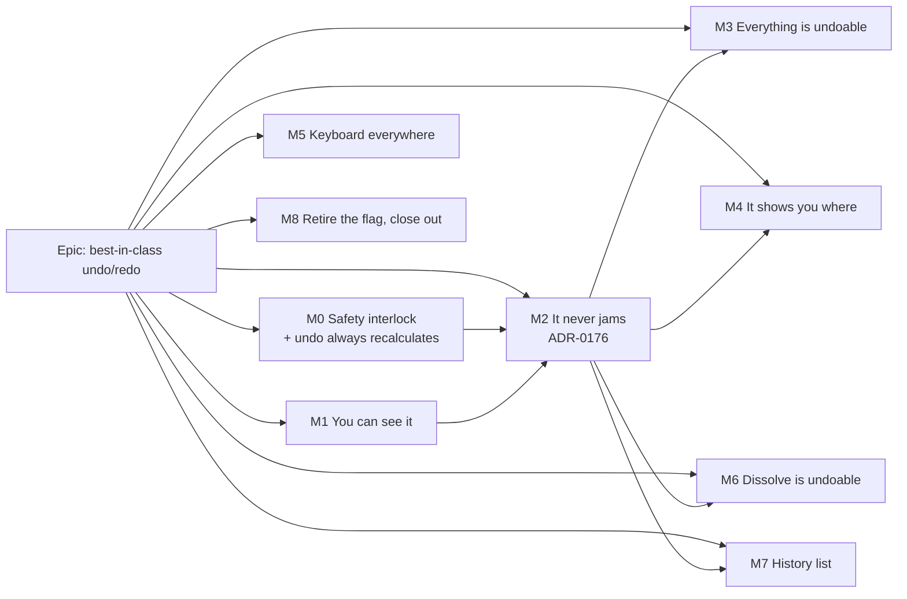

# Implementation Plan: Undo/redo that works like it does everywhere else

- **Feature spec:** [`./feature-spec.md`](./feature-spec.md)
- **Status:** Accepted — shipped ([ADR-0176](../../adr/0176-undo-checks-before-it-writes-and-sets-aside-what-it-cannot-apply.md)). Approved by the product owner 2026-10-04 ("Approved", in reply to the plain-English summary
  of this spec). M0–M8 built: web 0.163.1–0.170.0 (the M7 Recent edits menu in 0.170.0);
  the `VITE_UNDO_REDO` flag was retired in M8. CQ-1: plan settings stay **outside** undo (the recommended default). CQ-3: the
  result message lives in the **dock strip under the diagram** (the recommended default).
  **Orchestrator amendment at approval (CQ-2 / F-1):** fix (a) (#447) was built as a per-history
  version ledger that only knows versions produced by edits the stack itself recorded or replayed,
  so a colleague's write during a pen hand-off still bumps the row past the ledger and the replay
  still gets a 409 — the protection F-1 feared losing is kept (the regression test for #447 asserts
  it). M0-T1 (clear history on pen release) is therefore **dropped**; M2-T6 keeps history across a
  hand-off as planned.
- **Owner:** builder agent (Sonnet) per milestone, reviewed by the agents named on each

## Breakdown

### Epic

**Best-in-class undo/redo** — make plan-authoring undo behave the way planners expect from any other
application: visible, never stuck, complete across the diagram and the Gantt, and oriented. Roadmap:
follow-on to the delivered "Undo/redo" item (`docs/ROADMAP.md:776`).

**Prerequisites (separate bug fixes, not re-planned here):** fix (a) — commands read the row's live
version at replay; fix (b) — the three `use-coalesced-*` nudge hooks drop their absolute target after
a committed write. M0-T1 must follow fix (a) the same day (spec F-1 / CQ-2).

**No feature flag** is added (ADR-0088 D1 — a `VITE_` flag cannot be switched off in a published
image). Each slice is its own commit boundary, which is the rollback. Every user-facing milestone
names its entry point and lands a journey in `apps/web/e2e-undo/` under the existing
`playwright.undo.config.ts` (ADR-0081); no Playwright config or CI step is added.

---

### Milestone M0: Safety interlock, and undo always recalculates (shippable slice)

**Outcome:** after fix (a), an undo can never silently overwrite a colleague's edit made during a pen
hand-off; and undoing a sub-day duration/lag or a calendar change recalculates the dates.
**Entry point:** the existing toolbar **Undo** / **Redo** and Ctrl+Z — no new surface.
**Journey:** none — measured, not assumed (2026-10-04). On a stock plan the REST dates are whole days, and lag edits of `1d 1h 30m`, `1d 3h`, `1d 5h` and `1d 11h` all left the successor's `earlyStart` and `earlyFinish` unchanged, so a journey asserting on dates cannot tell the defect from the fix (an ADR-0076 Class 3 test). The proof is the unit tier: a replay notifies the recalculation unless the command declares `affectsSchedule: false` (`use-plan-undo-redo.test.ts`).

#### Feature: M0 safety

> **Description:** close F-1's window and F-2's gap with the smallest changes that do it.
> **Complexity:** S
> **Dependencies:** fix (a) merged (T1), nothing (T2)
> **Risks:** T1 makes a hand-off erase history again (as ADR-0048 always said it did) → accepted
> until M2 relaxes it; stated in the changeset.
> **Testing requirements:** unit (model + history), one journey case.

##### Task M0-T1 — Clear history when the pen is released or lost

- **Description:** when the workspace's pen state goes from held to not-held for any reason, call
  `editHistory.clear()`. Matches ADR-0048's text (`0048-…:50-51`), which the code never implemented
  (only a 423 during undo clears, `use-plan-undo-redo.ts:122-129`).
- **Complexity:** S
- **Dependencies:** fix (a)
- **Risks:** a pen-status poll flicker clearing history → key on the pen hook's settled "held" state,
  not raw query state; unit test the flicker.
- **Testing:** unit in `use-plan-workspace-model.undo-redo.test.ts`: release → `canUndo` false;
  re-take → still false.
- **Development steps:**
  1. Read the pen hook's held/not-held signal; add a transition effect in `use-plan-workspace-model.ts`.
  2. Tests; changeset (`@repo/web` patch: "Undo history is cleared when you hand over the edit lock").

##### Task M0-T2 — Every replay notifies recalculation

- **Description:** add `affectsSchedule` to `Command` (default `true`; `false` for `relaneCommand`,
  `autoArrangeCommand`); after a successful undo/redo with `affectsSchedule`, call
  `autoRecalc.notify()` from the `undoRedo` wrapper (`use-plan-workspace-model.ts:642-655`). Fixes F-2
  without touching the structure signature (`:688-701`).
- **Complexity:** S
- **Dependencies:** none
- **Risks:** a needless recalculation on a lane-only replay → the `false` flag; the coalescer already
  merges bursts.
- **Testing:** unit — undo of a lag command notifies; undo of a relane does not.
- **Development steps:**
  1. Extend `Command`; set the flag in the two lane builders.
  2. Notify in the wrapper on success.
  3. Correct the comment at `:674-676` ("No undo path calls `notify()`").

##### Task M0-T3 — Correct two false sentences

- **Description:** `env.ts:486-487` (the rollback claim ADR-0088 D1 disproves) and
  `activity-crud-dialogs.tsx:77-78` ("cascade → history truncation", stale since the 2026-09-02
  amendment).
- **Complexity:** S · **Dependencies:** none · **Risks:** none · **Testing:** `pnpm prepush`.

---

### Milestone M1: You can see what undo did (shippable slice)

**Outcome:** a sighted planner sees every undo/redo outcome in both views; labels read correctly.
**Entry point:** toolbar **Undo** / **Redo** (Plan commands toolbar, Row 2) and Ctrl+Z, in the
**Diagram** and the **Gantt**; the result appears in the canvas dock strip.
**Journey:** `e2e-undo/undo.spec.ts` ("a planner sees what undo and redo did") — draw two tasks, click Undo → dock shows "Undid Add
“Foundations”." with a **Redo** button; click it → "Redid Add “Foundations”."; switch to Gantt, press
Ctrl+Z → strip visible there; turn on the Late-dates overlay and press Ctrl+Z → the strip states the
refusal; axe on the strip. (The no-pen variant of that sentence is asserted in M2's journey: until M2
relaxes M0-T1, releasing the pen empties the history, so there is nothing to refuse.)

#### Feature: M1.1 — One phrasing for a step

> **Description:** fix the whole-label lowercasing (`tsld-toolbar-items.tsx:2060`) and the
> disagreement with `use-plan-undo-redo.ts:59-61`; name the subject in every default label.
> **Complexity:** S
> **Dependencies:** none
> **Risks:** label changes break existing assertions → update the suites in the same PR.
> **Testing:** unit — `historyPhrase('Undo', 'Edit “Excavate”')` → `Undo edit “Excavate”`; tooltip,
> aria-label and announcement equal.

##### Task M1-T1 — `historyPhrase` and named default labels

- **Description:** add `historyPhrase(verb, label)` in `features/undo-redo`; use it in
  `UndoRedoControl` and the wrapper; give `dependencyAddCommand`, `dependencyRemoveCommand`,
  `visualStartCommand`, `relaneCommand`, `autoArrangeCommand`, `typeChangeCommand` default labels
  that name their subjects (callers pass names they already hold).
- **Complexity:** S · **Dependencies:** none
- **Risks:** a quoted name containing typographic quotes → test with one.
- **Testing:** unit per builder label; toolbar test.
- **Development steps:** 1. helper + tests; 2. builders; 3. control + wrapper; 4. changeset.

#### Feature: M1.2 — The history result strip

> **Description:** the wrapper reports a structured result; the dock renders it in both views.
> **Complexity:** M
> **Dependencies:** M1-T1
> **Risks:** double announcement (strip role + `announce`) → success: no role + one announce;
> failure: `role="alert"`, no announce (spec §4.2); a strip hiding the armed-tool band → precedence
> written in `resolveDockStrip` and unit-asserted.
> **Testing:** unit (precedence table, strip states, timing pause on hover/focus), journey, axe.

##### Task M1-T2 — Results instead of sentences

- **Description:** `usePlanUndoRedo` exposes `lastResult: { direction, outcome, label, reason?,
nextLabel? } | null` (stable identity per result) and a `dismissResult()`; announce rules move
  with it. Existing messages (`use-plan-undo-redo.ts:19-44`) become the strip copy, rewritten to not
  tell the reader to refresh where refreshing does not help.
- **Complexity:** M · **Dependencies:** M1-T1
- **Risks:** toolbar context memo churn → the result lives outside the object the toolbar memo keys on
  (`use-plan-edit-history.ts:188-193`'s invariant); performance-reviewer confirms.
- **Testing:** unit — each outcome yields one result, one announcement at most.
- **Development steps:** 1. result type + state; 2. migrate announce calls; 3. tests.

##### Task M1-T3 — `'history'` dock strip in both hosts

- **Description:** add the kind to `features/tsld/model/dock-strip.ts` (failure with `conflict`,
  success directly below `mode`, replacing `layout-resolved`); a `HistoryResultStrip` on
  `NoticeStrip` with **Redo**/**Undo**/**Try again**/**Dismiss** as applicable; render in
  `TsldPanel`'s dock and in the Gantt's `CanvasDock` (`plan-workspace-toolbar.tsx:1571`) — both hosts
  in the same PR (the one-host-and-not-its-neighbour defect this repo has recorded repeatedly).
- **Complexity:** M · **Dependencies:** M1-T2
- **Risks:** focus drop when the strip unmounts while focused → hand focus back per ADR-0135;
  success timeout and WCAG 2.2.1 → timing set by accessibility-reviewer.
- **Testing:** unit precedence + component; journey; axe.
- **Development steps:** 1. precedence + tests; 2. component; 3. wire both hosts; 4. focus hand-back.

##### Task M1-T4 — Say why Ctrl+Z did nothing

- **Description:** when the accelerator fires with history non-empty but `undoRedoEnabled` false (no
  pen, or Late overlay), post a `blocked` result with the existing refusal sentence
  (`model.scheduleRefusal`). Today the keystroke falls through silently
  (`use-undo-redo-keybindings.ts:52`).
- **Complexity:** S · **Dependencies:** M1-T3
- **Risks:** pre-empting the browser's Ctrl+Z when nothing would undo → only when history is
  non-empty, and never in a text field.
- **Testing:** keybinding unit matrix; journey step.

##### Task M1-T5 — Journey + docs

- **Description:** the journey in `e2e-undo/undo.spec.ts` as above; `PlanShortcutsHelp.tsx` notes where results
  appear; changeset (`@repo/web` minor).
- **Complexity:** S · **Dependencies:** M1-T3, M1-T4
- **Testing:** `scripts/e2e-local.sh web:undo` before push (CLAUDE.md §19.8).

**Reviewers:** ux-reviewer, accessibility-reviewer, component-reviewer, performance-reviewer.

---

### Milestone M2: Undo never jams (shippable slice; ADR-0176)

**Outcome:** a step that cannot apply is explained and set aside; the next Undo continues. History
survives pen release/retake safely. Undo restores only what the step changed.
**Entry point:** toolbar **Undo** / **Redo**, Ctrl+Z, and the M1 strip's set-aside sentence.
**Journey:** `e2e-undo/resilience.spec.ts` — resize "Excavate", then move "Foundations"; change
Foundations' `visualStart` **through the REST API** (as `e2e-copy-paste/support` seeds); press Undo →
strip "Couldn't undo Move “Foundations” — Foundations was changed since…"; press Undo again →
Excavate's duration returns (read back from the API). Second case: release the pen, press Ctrl+Z →
"Take the edit lock to undo …"; take it again, press Undo → applies.

#### Feature: M2.1 — The decision

##### Task M2-T1 — ADR-0176 and the register

- **Description:** write ADR-0176 from spec §4.9 (reserve the number at build — re-check
  `docs/adr/` for a later one); add the pointer to ADR-0048; one line in CLAUDE.md §16
  (`check:adr-coverage`).
- **Complexity:** S · **Dependencies:** spec approval
- **Testing:** `pnpm prepush` (adr-coverage, claims).

#### Feature: M2.2 — Check, then write

> **Description:** the command contract, the replay interpreter, set-aside in the store.
> **Complexity:** XL (split across T2–T6)
> **Dependencies:** fix (a), M0, M1
> **Risks:** a pre-check comparing a value the server normalised → compare against the server's
> post-edit row captured at record time, never the sent value; a test per builder with a normalising
> case (milestone type change, ADR-0162). Spurious refusals → field-scoped comparison only.
> **Testing requirements:** per-builder matrix — {unchanged → applied; written field changed →
> not-applicable/changed; unrelated field changed → applied; row gone → not-applicable/gone; 409 on
> write → changed; 423 → pen}; history store set-aside tests; journey.

##### Task M2-T2 — Contract, interpreter, set-aside

- **Description:** `Command` gains `subjects`, `undo(ctx)`, `redo(ctx)` returning `ReplayResult`
  (spec §4.3); `ReplayContext` provides mutations and `readActivities(ids)` /
  `readDependencies(ids)` via `queryClient.fetchQuery(..., { staleTime: 0 })`; the store gains
  `setAside` (pop, clear redo, end coalescing window); `usePlanUndoRedo` maps results to M1 results.
  An adapter keeps old-shape builders working until T3–T5 port them, and is deleted in T6.
- **Complexity:** L · **Dependencies:** M2-T1
- **Risks:** two shapes coexisting → the adapter is time-boxed to this milestone and the census
  (M3-T7) refuses the old shape afterwards.
- **Testing:** store + interpreter unit.

##### Task M2-T3 — Port the activity-field commands

- **Description:** `definitionSnapshotCommand` family (`updateCommand`, `durationResizeCommand`),
  `typeChangeCommand`, `visualStartCommand`, `visualResizeCommand` → diffed field sets over the partial
  PATCH (`useUpdateActivityFields`). Confirms and fixes F-3 with a test (editor type change, undo, the
  milestone's stored date unchanged).
- **Complexity:** L · **Dependencies:** M2-T2
- **Risks:** a diff that misses a field the forward write changed → diff the server's before/after
  rows, not the form; test with every field of `activityDefinitionInput`.
- **Testing:** matrix per builder.

##### Task M2-T4 — Port the batch and lane commands

- **Description:** `relaneCommand`, `autoArrangeCommand`, `bulkPlacementCommand` (incl. apply
  levelling, overlap resolve) — all-or-nothing pre-check across subjects.
- **Complexity:** M · **Dependencies:** M2-T2
- **Risks:** a 2,000-row pre-check read cost → one paged list read (`activitiesQueryOptions`,
  `use-activities.ts:224-233`), measured once in a unit benchmark and noted in the PR.
- **Testing:** matrix incl. one-of-many changed → whole step set aside.

##### Task M2-T5 — Port the dependency and existence commands

- **Description:** `lagDragCommand`, `dependencyEditCommand`, add/remove toggles, `createActivityCommand`
  (redo becomes `restore-batch`, not re-create — spec §4.4), `deleteActivityCommand`,
  `bulkDeleteCommand`, `pasteActivitiesCommand`, `createLoeSpanCommand`, link-in-sequence (inline at
  `use-plan-workspace-model.ts:973-994` → a named builder).
- **Complexity:** L · **Dependencies:** M2-T2
- **Risks:** create-undo redo via restore needs the delete's batch id → undo captures it (as paste
  already does, `commands.ts:1113-1139`).
- **Testing:** matrix; existing paste/LOE/bulk suites updated.

##### Task M2-T6 — Lifetime: keep history across hand-off; delete the adapter

- **Description:** remove M0-T1's clear-on-release; on 423 keep the history (controls shade, pen
  banner speaks); delete the old-shape adapter.
- **Complexity:** S · **Dependencies:** M2-T3..T5
- **Risks:** stale steps after a long hand-off → every step is pre-checked; journey proves it.
- **Testing:** unit + journey case 2; changeset (`@repo/web` minor).

**Reviewers:** security-reviewer (no escalation; pre-check reads in scope), component-reviewer,
performance-reviewer, test-engineer (matrix design), accessibility-reviewer (strip copy).

---

### Milestone M3: Everything you edit can be undone (shippable slice)

**Outcome:** every write in spec §2.1's "to be made undoable" table (except dissolve, M6) is one undo
step; coverage becomes a build-time census.
**Entry point:** the surfaces themselves — **Create activity** (Activities panel), **Insert activity
below** (Gantt row menu), **Indent** / **Outdent** (Gantt row menu), **Members** (summary editor),
**Assign** (WBS bulk-assign bar), **Steps** tab, **Resources** tab, cross-plan links section — then
toolbar **Undo**.
**Journey:** `e2e-undo/coverage.spec.ts` — Gantt **Insert activity below** → Undo removes it → Redo
brings back the **same id** (API read); **Indent** a row → Undo outdents it; add a resource
assignment in the editor, close, Undo → assignment gone (API read).

#### Feature: M3.1 — New record seams

> **Description:** optional host callbacks on each surface (the `onAdded/onRemoved/onEdited`
> precedent), recorded by the workspace model.
> **Complexity:** L
> **Dependencies:** M2
> **Risks:** a seam wired in one host and not its neighbour (`ActivityCreateDialog` has two hosts:
> `activity-crud-dialogs.tsx:250` and `CreateActivityButton.tsx:47`) → the census (T7) and a test per
> host.
> **Testing requirements:** unit per command and per host; journey.

##### Task M3-T1 — Dialog create

- **Description:** `onCreated(activity)` on `ActivityCreateDialog` (`:588`), passed by both hosts;
  record the create command (redo = restore).
- **Complexity:** M · **Dependencies:** M2-T5
- **Risks:** the mutate callback dropped after the dialog unmounts (react-query v5 per-call callbacks,
  documented at `ActivityEditorDialog.tsx:100-103`) → record from the `mutateAsync` promise.
- **Testing:** unit both hosts; journey.

##### Task M3-T2 — Re-parenting (Indent/Outdent, Members, bulk assign)

- **Description:** `reparentCommand` over `useUpdateActivityParents` (one step per batch); record at
  `plan-workspace-toolbar.tsx:1439` and via `onSaved(before, after)` on `ActivityMembersPanel.tsx:124`
  and `WbsBulkAssignBar.tsx:84`.
- **Complexity:** M · **Dependencies:** M2-T2
- **Risks:** a batch partially stale → the endpoint is all-or-nothing on versions already (comment at
  `plan-workspace-toolbar.tsx:1430-1433`); pre-check is all-or-nothing too.
- **Testing:** unit; journey (Indent).

##### Task M3-T3 — Steps

- **Description:** record in `ActivityEditorDialog.saveSteps` (`:148-156`) with the pre-save list;
  inverse = replace-steps with it.
- **Complexity:** S · **Dependencies:** M2-T2
- **Testing:** unit.

##### Task M3-T4 — Resource assignments

- **Description:** add/edit/remove seams from `ActivityResourcesPanel` / `AssignmentRow`; inverses
  via the existing assignment endpoints (lag in minutes, ADR-0071).
- **Complexity:** M · **Dependencies:** M2-T2
- **Risks:** assignment writes can change the activity's derived `durationMinutes`
  (`resource-assignment.service.ts:133-137`) → the inverse relies on the server recomputing on the
  reverse write; a Supertest-backed journey asserts the duration returns, not assumed.
- **Testing:** unit; journey.

##### Task M3-T5 — Cross-plan links

- **Description:** seams on `AddCrossPlanLinkDialog.tsx:141` / `CrossPlanLinksSection.tsx:44`;
  add ↔ remove.
- **Complexity:** S · **Dependencies:** M2-T5
- **Testing:** unit.

##### Task M3-T6 — Grouping audit

- **Description:** confirm and test that each compound action is one step (bulk assign, members save,
  dialog create with an initial parent); no new coalescing keys (dialog saves are discrete,
  `commands.ts:864-869`).
- **Complexity:** S · **Dependencies:** T1–T5

##### Task M3-T7 — The coverage census

- **Description:** `features/undo-redo/coverage.ts` + a structural test (modelled on
  `components/layout/workspace/use-auto-resolve.census.structural.test.ts`) per spec §4.6. Lands
  **last** in M3 so the register has no "pending" residue (the ADR-0073 C3.4 rule).
- **Complexity:** M · **Dependencies:** T1–T6
- **Risks:** a scan that misses a hook written another way → it is a tripwire, not a classifier;
  the exclusion list is the authority (ADR-0088 D2's same stance).
- **Testing:** the census itself + a red run recorded in the PR (ADR-0110).

**Reviewers:** component-reviewer (new props), accessibility-reviewer (focus after Undo of a create),
test-engineer.

---

### Milestone M4: Undo shows you where (shippable slice)

**Outcome:** after undo/redo the subject is selected and in view, in the diagram and the Gantt.
**Entry point:** toolbar **Undo** / **Redo** and Ctrl+Z.
**Journey:** `e2e-undo/reveal.spec.ts` — move a bar far off-screen, pan away, Undo → the bar is the
selected option and inside the viewport; same in Gantt (row scrolled into view and selected).

##### Task M4-T1 — Reveal through the existing channel

- **Description:** after `applied`, set `revealActivityId` to the first surviving subject
  (`use-plan-workspace-model.ts:263`; canvas consumer `plan-workspace-toolbar.tsx:1791-1803`) and the
  Gantt reveal id (`:1777`); plural set where an inbound set API exists (checked at build).
- **Complexity:** M · **Dependencies:** M2
- **Risks:** fighting the canvas's own selection (the one-shot rule at `:256-262`) → reuse the
  one-shot request, never a mirror; focus to `<body>` after undoing an add → hand focus to the grid /
  canvas listbox (ADR-0135).
- **Testing:** unit; journey both views. **Reviewers:** accessibility-reviewer, ux-reviewer.

---

### Milestone M5: Keyboard everywhere (shippable slice)

**Outcome:** Ctrl/Cmd+Z, Ctrl/Cmd+Shift+Z and Ctrl+Y work anywhere in an open plan, and never steal
a text field's own undo.
**Entry point:** the accelerators.
**Journey:** `e2e-undo/keyboard.spec.ts` — make an edit, blur to `<body>` (`page.evaluate(() =>
document.activeElement.blur())`), Ctrl+Z → undone; open a Gantt cell editor, type, Ctrl+Z → only the
text reverts (API unchanged); toggle a checkbox-type control, Ctrl+Z → plan undo runs.

##### Task M5-T1 — Text-entry narrowing, body fallback, platform hints

- **Description:** spec §4.7. Document listener active only while the workspace is mounted, focus is
  on `<body>`, and no modal is open; delegates to the same handler. Platform-aware
  `aria-keyshortcuts` and tooltip glyphs.
- **Complexity:** S–M · **Dependencies:** M1
- **Risks:** double-firing when focus is inside the root → the fallback checks
  `activeElement === body` only; unit asserts one call. Cross-browser Back/Forward suppression
  (TECH_DEBT #25) — Chromium in CI, the manual Firefox/Safari sweep noted in the PR.
- **Testing:** keybinding matrix unit; journey. **Reviewers:** accessibility-reviewer before release
  (ADR-0111 / CLAUDE.md §19.13).

---

### Milestone M6: Dissolve is undoable (shippable slice; API additive)

**Outcome:** dissolving a summary no longer wipes the history; Undo brings the summary back with its
children filed under it.
**Entry point:** **Dissolve** (activity menu / Activities table) → confirm → toolbar **Undo**.
**Journey:** `e2e-undo/dissolve.spec.ts` — draw, group under a summary, make one more edit, Dissolve,
Undo → summary back with the same id and both children's `parentId` restored (API read); Undo again
→ the earlier edit reverses (history survived).

##### Task M6-T1 — Return `deleteBatchId` from dissolve

- **Description:** `DissolveSummaryResult` gains `deleteBatchId` from the `cascadeSoftDelete` result
  (`activities.service.ts:1838`); `DissolveSummaryResponseDto`, OpenAPI, `docs/API.md`; Supertest.
- **Complexity:** S · **Dependencies:** none (can land early)
- **Risks:** none beyond contract review — additive.
- **Testing:** Supertest e2e (`scripts/e2e-local.sh api`). Changeset `@repo/api` minor.
- **Reviewers:** api-reviewer, security-reviewer.

##### Task M6-T2 — `dissolveCommand`; delete the truncation

- **Description:** undo = `restore-batch(deleteBatchId)` then `updateParents(children → summary,
versions from the response)`; redo = dissolve again (rethread batch id). Replace
  `recordDissolveBoundary` (`use-plan-workspace-model.ts:1169-1172`) at both hosts
  (`activity-crud-dialogs.tsx:128`, `activity-bottom-panel.tsx:321`). Amend ADR-0176/0048 text on
  dissolve.
- **Complexity:** M · **Dependencies:** M2, M6-T1
- **Risks:** restore succeeds and the reparent fails → leave the restored summary (visible, harmless,
  restorable state) and report set-aside with words saying the children were not re-filed; tested.
  Audit reads `activity.restored` after `activity.dissolved` — acceptable (security-reviewer confirms).
- **Testing:** unit; journey.

---

### Milestone M7: Recent edits list (shippable slice)

**Outcome:** a menu beside Undo lists recent steps; choosing one undoes back to it.
**Entry point:** toolbar **Recent edits** menu button (next to Undo; name chosen to avoid confusion
with the activity editor's **History** tab, ADR-0174).
**Journey:** `e2e-undo/history-menu.spec.ts` — three edits; open the menu (keyboard: Enter, arrows);
choose the third → strip "Undid 3 steps."; set one up to fail → "Undid 1 of 3 — stopped at …".

##### Task M7-T1 — Entries and undo-to-step

- **Description:** the store exposes `entries` (labels newest first) without breaking the memo
  invariant (`use-plan-edit-history.ts:188-193`) — read lazily on menu open; `undoTo(index)` runs the
  single-step workflow sequentially, stopping at the first non-applied result.
- **Complexity:** M · **Dependencies:** M2
- **Testing:** unit.

##### Task M7-T2 — Toolbar control on the APG `Menu`

- **Description:** a registry item (ADR-0031) using `components/ui/menu.tsx`; pen-gated; budgeted per
  ADR-0090 (a row is a budget — measure the row before and after).
- **Complexity:** M · **Dependencies:** M7-T1
- **Risks:** Toolbar roving + Menu focus interplay → accessibility-reviewer and component-reviewer
  **before release** (ADR-0111).
- **Testing:** unit, journey, axe.

---

### Milestone M8: Retire the flag, close out (shippable slice)

**Outcome:** no dead branch; documents match the product.
**Entry point:** `Ships dark: a code removal with no behaviour change in any published image.`
**Journey:** none new; the whole `e2e-undo` suite runs green without the `'true'` pins.

##### Task M8-T1 — Retire `VITE_UNDO_REDO`

- **Description:** delete `UNDO_REDO_ENABLED` and every guard, the placeholder branch
  (`tsld-toolbar-items.tsx:2111-2132`), the register entry (`flag-retirement.json:525-532`), and the
  `'true'` pins (`playwright.undo.config.ts:63`, `playwright.copy-paste.config.ts:95`) in one commit
  (ADR-0088 D5/D6); `check:flags` green.
- **Complexity:** S · **Dependencies:** M0–M7
- **Risks:** a test that pinned flag-off behaviour → delete those cases (they describe a product no
  image can produce).

##### Task M8-T2 — Close out

- **Description:** spec/plan status → Accepted (citing ADR-0176); `docs/ROADMAP.md:776`;
  `docs/TEST_PLAYBOOK.md` if a seeded plan was used; reconciliation pass at the epic boundary
  (`docs/RECONCILE.md`).
- **Complexity:** S.

## Sequencing & slices

1. **M0** immediately after fix (a) — safety first, invisible.
2. **M1** — the highest-value visible change, independent of the refactor.
3. **M2** — the refactor everything else builds on; relaxes M0.
4. **M3** — coverage (largest user-reported gap after visibility).
5. **M4**, **M5** — orientation and keyboard; either order.
6. **M6** — dissolve (M6-T1 may land any time).
7. **M7** — history list (the cut line: stop here if time is short; nothing earlier depends on it).
8. **M8** — retire and close.

Each slice keeps `main` releasable. No feature flag.

## Definition of Done (per task)

Each task's PR satisfies the Feature Completion Criteria in [`docs/PROCESS.md`](../../PROCESS.md):
code, tests, docs, security, performance, accessibility, Docker build, CI, changelog, version impact
— and `pnpm prepush` plus `scripts/e2e-local.sh web:undo` (and `api` for M6-T1) **run** before push
(CLAUDE.md §19.8).

## Risks & assumptions (rollup)

| Risk / assumption                                                                   | Likelihood | Impact | Mitigation                                                                   |
| ----------------------------------------------------------------------------------- | ---------- | ------ | ---------------------------------------------------------------------------- |
| Fix (a) ships without M0-T1 → silent overwrite of a colleague's edit after hand-off | med        | high   | CQ-2; M0-T1 same day; M2 makes it structurally safe                          |
| Pre-check compares a server-normalised value and refuses a valid undo               | med        | med    | compare against captured server rows; normalising case per builder           |
| Field-scoped diff misses a field the forward write changed                          | low        | high   | diff server before/after rows; full-field test                               |
| Strip double-announces or steals the armed-tool band                                | med        | med    | role/announce rule; precedence in the pure function; a11y review             |
| M2 refactor regresses an existing command                                           | med        | high   | adapter during migration; existing suites kept; per-builder matrix; journeys |
| Assignment inverse does not restore derived duration                                | low        | med    | journey asserts the duration via the API                                     |
| Dissolve undo half-applies                                                          | low        | low    | restored summary is a harmless visible state; reported in words              |
| History list breaks the toolbar memo (perf)                                         | low        | med    | lazy entries; performance-reviewer                                           |
| ADR number 0176 taken by parallel work                                              | med        | low    | re-check `docs/adr/` at M2-T1                                                |
| CQ-1 answered "include plan settings"                                               | —          | med    | adds one milestone after M3; seven controls listed in the spec               |
