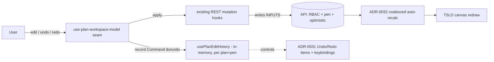
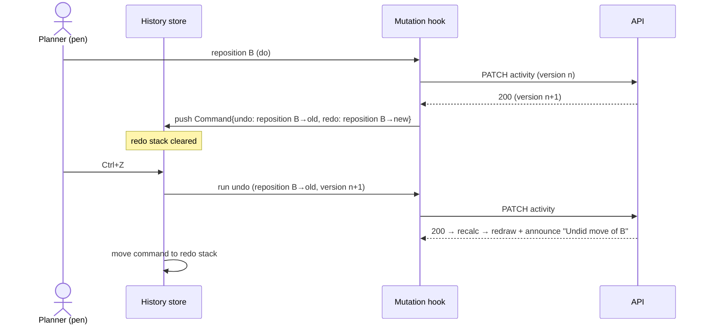
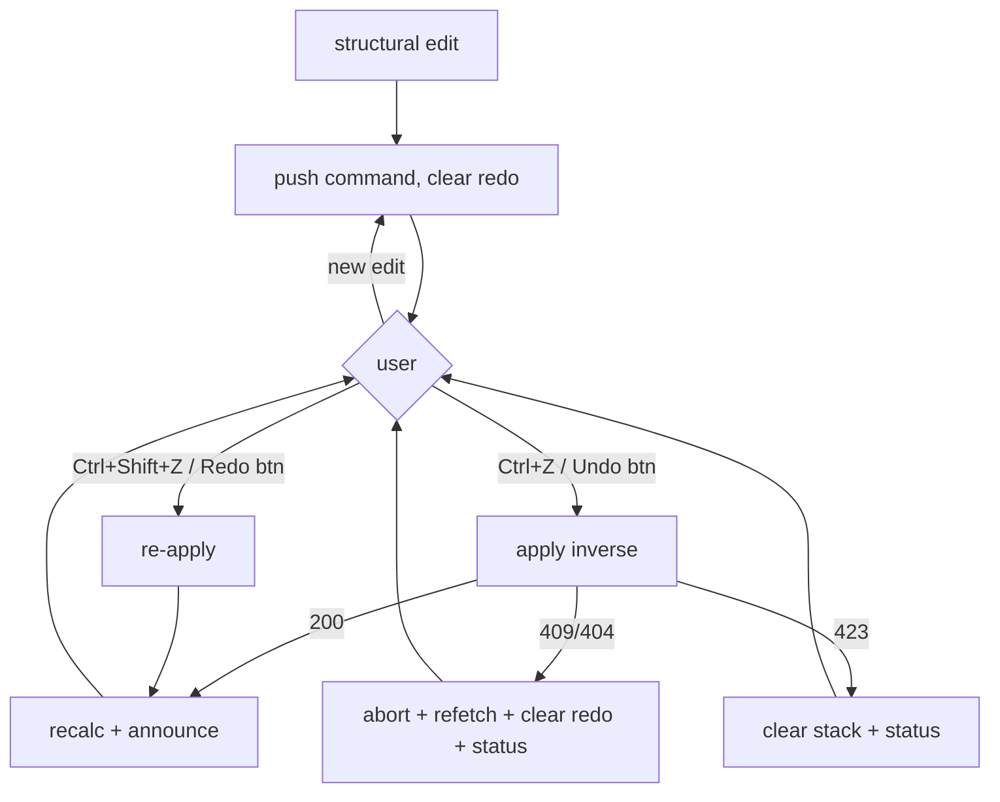

# Feature Spec: Undo / Redo (plan authoring)

- **Status:** Approved
- **Author(s):** feature-analyst (design), approved by product owner
- **Date:** 2026-07-19
- **Tracking issue / epic:** —
- **Roadmap link:** ROADMAP.md → "Next → Product features" (Undo/redo, a MoSCoW Must-have)
- **Related ADR(s):** **ADR-0048 — Client-side command-stack undo/redo for plan authoring**; builds on
  ADR-0022 (engine-owned batched write), ADR-0028 (plan edit-lock), ADR-0031/0032 (toolbar/authoring),
  ADR-0033 (scheduling modes / `visualStart`).

## 1. Business understanding

### Problem

The TSLD canvas is now the primary authoring surface (create / move / relane / link / edit / constrain
/ delete activities; Visual-mode `visualStart` drags), on by default. A planner who fat-fingers a drag,
an errant delete, or a wrong link has **no `Cmd/Ctrl+Z`** — the single most conspicuous gap for a
direct-manipulation editor. ADR-0028 explicitly named undo/redo as the unblocked-but-out-of-scope
follow-on to the pen. Without it, every mistake is a manual re-edit, which erodes trust in editing.

### Users

- **Planner / Org Admin / Contributor holding the plan pen** — the editor doing structural work on the
  canvas/table. Undo/redo is theirs, scoped to their editing session on one plan.
- Viewers and non-pen-holders are unaffected (they can't edit, so there's nothing to undo).

### Primary use cases

1. Undo an accidental **reposition / relane** (the most common misclick on a dense canvas).
2. Undo an accidental **delete** of an activity.
3. Undo/redo a **link** (dependency) add/remove or an **edit** (rename, duration, constraint,
   `visualStart`).
4. **Redo** a just-undone action; redo is invalidated by any new edit.

### User journeys

Happy path: planner drags Activity B, realises it's wrong → presses `Ctrl/Cmd+Z` (or the toolbar Undo)
→ B returns to its prior position, the schedule recalculates, a live-region announces "Undid move of
B." `Ctrl/Cmd+Shift+Z` re-applies. See the user-flow diagram in §4.

Alternate (conflict): the planner undoes an edit whose row was changed underneath them (a later edit,
or the row was deleted) → the inverse write returns 409/404 → undo aborts non-destructively, the thread
of truth is refetched, redo is cleared, and a status explains "Couldn't undo — the plan changed;
review and try again."

### Expected outcomes

Editing feels safe and reversible — the defining trait of a real editor. Fewer support asks, faster
authoring, higher confidence on the canvas.

### Success criteria

- A single structural edit can be undone and redone in **< 1 interaction** (one key / one click), with
  the canvas reflecting the change after the normal auto-recalc.
- Undo/redo never corrupts server state: every inverse rides the same RBAC + scope + pen + optimistic
  gates as a first-class edit; a conflict is surfaced, never silently mis-applied.
- **Flag off ⇒ byte-identical** to today (no store, no keybindings, no toolbar items).

### Open questions

All five critical questions are **resolved** (product owner, 2026-07-19):

1. **History model** — client-side, per-session, in-memory (no schema, no API). _Approved._
2. **Progress edits** — **out of scope** for M1 (Contributor-writable / non-pen-gated; folding them in
   breaks single-writer). _Approved; revisit later._
3. **Delete-undo** — re-create (new id, zero backend) in M1–M2; id-stable restore-by-id deferred to the
   optional **M4** (additive endpoint). _Approved._
4. **Conflict semantics** — abort-and-refetch, clear redo, non-destructive message (no silent skip / no
   auto-retry / no merge). _Approved._
5. **Depth & lifecycle** — cap **50**; scope per plan + pen session; cleared on plan switch / pen
   release / reload. _Approved._

## 2. Functional requirements

### User stories & acceptance criteria

> **US-1** — As a pen-holding editor, I want to **undo** my last structural edit, so that a mistake is
> reversible.
>
> - **Given** I just repositioned/relaned/edited/linked/created/deleted an activity **when** I invoke
>   Undo **then** the inverse edit is applied via the existing endpoint, the schedule recalculates, and
>   a live-region announces what was undone.
> - **Given** the history is empty **when** I invoke Undo **then** the control is disabled and nothing
>   happens.

> **US-2** — As a pen-holding editor, I want to **redo** an undone edit, so that I can step forward
> again.
>
> - **Given** I just undid an edit **when** I invoke Redo **then** the edit is re-applied.
> - **Given** I make **any new edit** after an undo **when** I look at Redo **then** the redo stack is
>   cleared (linear history).

> **US-3** — As a pen-holding editor, I want undo/redo to **fail safely** when the plan changed under
> me, so that I never corrupt the schedule.
>
> - **Given** the target row was changed/deleted since I recorded the command **when** the inverse
>   returns 409/404 **then** undo aborts, the plan is refetched, redo is cleared, and I see a
>   non-destructive status.
> - **Given** I lost the pen (423) **when** I invoke undo **then** the stack is cleared and I'm told
>   editing is paused.

> **US-4** — As a Viewer / non-pen-holder, I see **no** undo/redo affordance (nothing to undo).

### Workflows

Record → invoke → apply-inverse → auto-recalc → announce. Each user edit that mutates plan **inputs**
pushes a `Command { do, undo }` (built from the args it already has) onto the undo stack and clears
redo. Undo pops, runs the inverse via the existing mutation, pushes to redo. Redo is the mirror. A
coalesced gesture (a drag, a burst of nudges) records **one** command.

### Edge cases

- **Empty / full stack** — controls disabled at empty; at depth 50 the oldest command is dropped
  (truncation announced only via the disabled affordance, not intrusive).
- **Coalescing** — a pointer drag or a key-repeat nudge collapses to one undo step (mirrors the
  existing coalesced recalc).
- **Batch edits** — auto-arrange/relane-pack and a WBS/cascade delete collapse to one reversible step;
  cascade delete-undo is only _clean_ at M4 (M2 conservatively truncates history past a cascade delete).
- **Concurrent change / conflict** — see US-3 (abort-and-refetch).
- **Pen release / plan switch / reload** — stack cleared (per Q5).
- **Progress edits** — not recorded (Q2); they interleave harmlessly (undo only replays structural
  inputs).

### Permissions

No new permission. Undo/redo re-issues writes the user **already** may make: each inverse goes through
the unchanged `assertHoldsPen` (423) + RBAC (`activity:*` / `dependency:*`) + org-scope + optimistic
`version` gates. The API remains the sole trust boundary; the client stack is a convenience layer that
cannot escalate.

### Validation rules

Reuses the existing per-mutation DTO validation (client Zod + server class-validator) unchanged — an
inverse is just another validated mutation. No new fields.

### Error scenarios

| Scenario                                   | Detection             | User-facing result                                          | Status |
| ------------------------------------------ | --------------------- | ----------------------------------------------------------- | ------ |
| Inverse targets a row changed since record | optimistic `version`  | abort, refetch, clear redo, "plan changed — review & retry" | 409    |
| Inverse targets a deleted/foreign row      | anti-IDOR / not-found | abort, refetch, clear redo, same status                     | 404    |
| Pen lost before undo                       | `assertHoldsPen`      | clear stack, "editing is paused (you don't hold the pen)"   | 423    |
| Empty stack                                | client                | control disabled; no-op                                     | —      |

## 3. Technical analysis

| Area           | Impact       | Notes                                                                                                                                                  |
| -------------- | ------------ | ------------------------------------------------------------------------------------------------------------------------------------------------------ |
| Frontend       | med          | new `features/undo-redo` (command model + `usePlanEditHistory` store); record at the workspace-model seam; toolbar items + keybindings + announcements |
| Backend        | none (M1–M3) | inverses reuse existing endpoints. **M4 only:** one additive restore endpoint.                                                                         |
| Database       | none (M1–M3) | **M4 only:** reuses existing soft-delete / `deleteBatchId` columns — no schema change.                                                                 |
| API            | none (M1–M3) | no contract change; M4 adds one restore route.                                                                                                         |
| Security       | low          | no new authority; every inverse re-gated server-side. Client stack is per-session, in-memory.                                                          |
| Performance    | low          | O(1) push/pop; bounded depth 50; no extra network beyond the inverse itself.                                                                           |
| Infrastructure | none         | —                                                                                                                                                      |
| Observability  | low          | announcements via the shared live region; no new server logs (M1–M3).                                                                                  |
| Testing        | med          | unit (command round-trip / coalescing / conflict), component (controls/gating), flag-on Playwright                                                     |

### Dependencies

Nothing must land first. Builds on the existing mutation hooks, the ADR-0031 toolbar registry, the
ADR-0032 coalesced auto-recalc, and the ADR-0028 pen. Independent of the auto-deploy work.

## 4. Solution design

### Architecture overview

A thin client-side layer. Every structural edit already flows through a mutation hook at the
`use-plan-workspace-model` seam; we wrap that seam so each edit also **records a `Command`** carrying
its own inverse (built from the pre-edit snapshot the hook already holds). The history store is
per-plan, per-pen-session, in-memory. Undo/redo just re-invoke existing mutations; the ADR-0032 recalc
then redraws. The engine is never read or written by undo.

### Data flow

### User flow

### Database changes

None for M1–M3. **M4 (optional):** no schema change — a restore path reuses the existing
soft-delete + `deleteBatchId` columns (the recycle-bin machinery) to bring a deleted activity/subtree
back with its **original id**.

### API changes

None for M1–M3 — inverses call the existing `activity`/`dependency` CRUD + reposition/relane +
constraint + `visualStart` endpoints. **M4 (optional):** one additive `POST …/activities/:id/restore`
(or batch restore) route, RBAC-gated like delete, for id-stable / cascade-clean delete-undo.

### Component changes

- **`features/undo-redo/`** — `commands.ts` (the `Command` type + inverse builders per edit),
  `use-plan-edit-history.ts` (the bounded per-plan+pen store: push/undo/redo/clear/canUndo/canRedo),
  and the recording wrapper at the `use-plan-workspace-model` seam.
- **Toolbar** — Undo / Redo items in the ADR-0031 registry (pen-gated group state), with disabled
  states from `canUndo`/`canRedo`, plus scoped keybindings (`Cmd/Ctrl+Z`, `Cmd/Ctrl+Shift+Z` / `Ctrl+Y`)
  that suppress browser Back/Forward (the TECH_DEBT #25 precedent).
- Announcements via the shared `useAnnounce` live region. No one-off styling; reuse existing primitives.
- States: disabled (empty), busy (inverse in flight), conflict status (409/404), pen-paused (423).

### Implementation approach & alternatives

**Chosen:** client-side command stack composing inverses from existing endpoints, undoing inputs only.
Matches every editor users know, needs no schema/migration/endpoint (M1–M3), and keeps the recalc
parity gate structurally intact (engine untouched). Architecturally significant → **ADR-0048**.

**Alternatives:** (a) a **server-persisted undo log** — survives reload and is shareable, but adds
tables, endpoints, and cross-session reconciliation for little v1 value (rejected for v1); (b) **snapshot
the whole plan per edit and diff on undo** — simple to reason about but heavy (full-plan copies) and
still needs conflict handling (rejected). See ADR-0048.

## 5. Links

- Implementation plan: `docs/specs/undo-redo/implementation-plan.md`
- ADR: `docs/adr/0048-undo-redo-command-stack.md`
- Docs updated on build: `CLAUDE.md` §16 (ADR list), `docs/ROADMAP.md`, `apps/web` flag comment.
