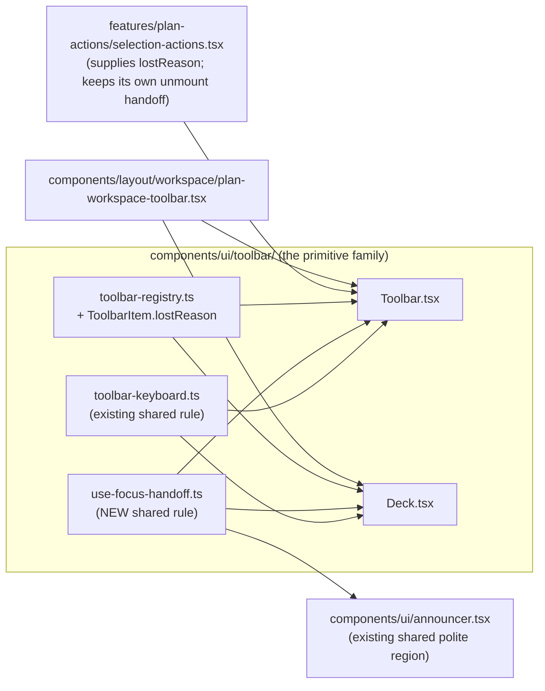
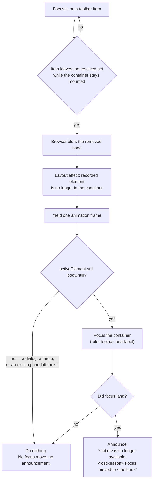

# Feature Spec: A roving container hands focus back when a peer removes the control you are standing on

- **Status:** Draft
- **Author(s):** feature-analyst (for the product owner)
- **Date:** 2026-09-11
- **Tracking issue / epic:** `docs/TECH_DEBT.md` #204(c)
- **Roadmap link:** none — a WCAG 2.2 §2.4.3 (level A) defect repair on a shared primitive
- **Related ADR(s):** ADR-0080 (the announce-inside-the-focus-frame precedent), ADR-0082 (shade vs.
  omit, and its SC-overstatement correction), ADR-0111 + `CLAUDE.md` §19.13 (a shared primitive's
  keyboard contract is reviewed before release), ADR-0117 (`purpose`: an option with no default),
  ADR-0105 (why this needs a spec at all), ADR-0132 (the nearest precedent for an ADR of this size),
  ADR-0028 (the pen, and why a peer can do this at all). **A new ADR is warranted — outline in §4.7.**

---

## 0. Corrections to the brief

`docs/PROCESS.md` — _the brief is not evidence_. Every inherited claim was re-derived. Three of the
brief's claims held exactly; **one did not, and it changes the implementation**.

| Claim inherited                                                                                  | Established                                                                                                                                                                                                                   | How                                                                                                         |
| ------------------------------------------------------------------------------------------------ | ----------------------------------------------------------------------------------------------------------------------------------------------------------------------------------------------------------------------------- | ----------------------------------------------------------------------------------------------------------- |
| `Toolbar.tsx:175-178` derives `effectiveActiveId` and does **not** move `document.activeElement` | **Holds.** The derivation repairs `tabIndex` only; there is no `focus()` outside `onKeyDown` (`:206-208`), which runs only from a key press.                                                                                  | Read `Toolbar.tsx` in full                                                                                  |
| `selection-actions.tsx:953-962` is the closest existing precedent (whole-bar unmount)            | **Holds**, and it is a **different mechanism, not the same one one level down** — see §1.6. Its cleanup cannot fire here, because the component it is attached to does not unmount.                                           | Read `selection-actions.tsx:920-1043`                                                                       |
| `Deck` shares `toolbar-keyboard.ts` with `Toolbar`; establish whether it has the same hazard     | **It does, and by the same code shape.** `Deck.tsx:242-243` derives `rovingId` from `stopIds` exactly as `Toolbar` derives `effectiveActiveId`, and moves focus nowhere. It has a peer-flippable item (§1.5).                 | Read `Deck.tsx:228-243`; `tsld-toolbar-items.tsx:2754`                                                      |
| **"Announcement and focus move together, announcement first."**                                  | **Does not hold as written.** The ADR-0080 precedent in code is the **opposite order**, and the shared announcer's own `requestAnimationFrame` makes "announce first" unimplementable in call order. See §0.1 — this is CQ-1. | `TsldPanel.tsx:1029-1033` + `:725-755`; `announcer.tsx:14-18`; `TsldPanel.bulk-operations.test.tsx:265-270` |

### 0.1 The ordering correction (CQ-1)

The product owner's decision — _move focus to the surrounding selection bar and say why_ — is taken
as given and is **not** reopened. What is corrected is one implementation clause the brief attached
to it.

`docs/TECH_DEBT.md:4605-4607` reads: _"**Announcement and focus move together**, in that order, for
the ADR-0080 reason recorded one epic over: a focus change announces the thing it lands on, so a
message spoken first and moved to second is a message overwritten."_ **The sentence's reason
contradicts its clause**: it states the failure mode of speaking first, and then prescribes speaking
first. Two pieces of evidence settle it against the clause and with the reason:

1. **The precedent's code is focus-first.** `TsldPanel.tsx:1029-1033`, verbatim: _"Announced INSIDE
   the focus callback, and that ordering is load-bearing: focusing the listbox fires its `onFocus`
   default-select, which announces the row it lands on. Announced first, '2 activities deleted.' is
   spoken and then immediately overwritten by a row description — so the one fact the planner needs
   confirmed is the one they never hear."_ `focusListboxAfterModal(then)` (`:725-755`) focuses,
   verifies it won the race, and only then calls `then?.()`. Its regression test asserts
   `toHaveBeenLastCalledWith` for exactly this reason (`TsldPanel.bulk-operations.test.tsx:265-270`).
2. **"Announce first" cannot be built.** `announcer.tsx:14-18` clears the region synchronously and
   sets the message inside `requestAnimationFrame`. A synchronous `focus()` after `announce()` still
   happens **before** the message text exists. Call order and time order differ, so writing the code
   the clause describes produces the behaviour it forbids.

**Recommended reading of the decision:** announcement and focus are one act, and the announcement is
emitted **once focus has landed**. That is what §4 designs. It is a correction to a clause, not to
the decision; if the product owner intends the literal order, say so (CQ-1) and §4.4's ordering
changes — nothing else does.

**One thing the precedent does _not_ establish, stated rather than assumed.** In ADR-0080's case the
destination writes to the **same** shared region on focus (the listbox announces the row), so the
overwrite is literal. Here the destination writes to no live region — `selection-actions.tsx:968-970`
sets a ref and nothing else — so what remains is a _native focus announcement_ racing a polite
region, which is AT-dependent and **not observable in this repository** (`docs/TECH_DEBT.md` #154:
no screen reader in the build container). The order is therefore adopted because it is the one this
repository has evidence for, not because the interleaving has been heard. §5 files the listen.

---

## 1. Business understanding

### Problem

Two Planners, one plan. **A** has it open in Visual mode with an activity selected and keyboard focus
**on** the `Clear visual start` control in the canvas selection bar. **B** changes the plan to Early
through `PATCH /api/v1/organizations/:orgSlug/plans/:planId`. A's client refetches,
`clearPlacementApplies` goes false, `selection-actions.tsx:764`'s `isVisible` predicate removes the
item, `resolveItems` filters it out (`toolbar-registry.ts:668-670`) — and **`document.activeElement`
becomes `<body>`**.

Every workspace keyboard accelerator is a React `onKeyDown` on the workspace root
(`use-plan-workspace-key-scope.ts`, cited at `TsldPanel.tsx:719-723`), so on `<body>` they all reach
nothing. A keyboard planner's Ctrl+Z, their Escape, their arrow navigation: all silently dead, with
nothing on screen or in any live region saying so, until they click something. That is **WCAG 2.2
§2.4.3 Focus Order, level A** — the fifth instance of a class this repository has fixed four times
(ADR-0060 M6, ADR-0080, ADR-0099 M10, ADR-0096).

**It is measured, not argued.** `apps/web/measure-toolbar/tech-debt-204c-mode-flip-focus.spec.ts`
drives two real browser contexts and reports `planReadsByReaderAfterFlip: 1`,
`controlStillPresentOnReadersPage: false`, `focusAfter: { tag: "BODY", isBody: true }` — taken twice,
an hour apart, identical both times (`docs/TECH_DEBT.md:4543-4555`). Re-run with
`scripts/e2e-local.sh measure:toolbar`; `measure-output/` is git-ignored, so the committed evidence
is the spec rather than its output.

**Two things make it reachable rather than contrived**, and both were re-verified here rather than
taken from the row:

- **No pen gate on the write.** `assertHoldsPen`, `holdsPen` and `PlanLock` appear **zero times** in
  `apps/api/src/modules/plans/` (`rg -c` over that directory: no matches), and
  `plans.controller.ts:60-61` documents PATCH as _"Planner or Org Admin; optimistic locking"_. A peer
  can therefore flip `schedulingMode` **while A holds the pen**, changing nothing about that pen. If
  the write had needed the pen, taking it would have unmounted the whole bar and the existing handoff
  would have owned the case.
- **The refetch is the product's normal behaviour, not a stress case.** `query-client.ts:14-16` sets
  `staleTime: 30_000` with `refetchOnWindowFocus: true`. Coming back to the tab after half a minute
  is the commonest thing a planner does.

**Why now.** ADR-0105 fires — the repair changes a shared component's public contract. Beyond that:
the register has carried this since 2026-08-27 through two re-reads, in each of which the _mechanism_
described was stale while the _hazard_ survived; it is now settled in both halves, with a decision
taken, and the only thing left is to build it.

### Users

Nobody's permissions change, no data moves, and no schema is touched. The people affected are
readers.

| Who                                                                    | What they need                                                                                                                                                                      |
| ---------------------------------------------------------------------- | ----------------------------------------------------------------------------------------------------------------------------------------------------------------------------------- |
| **A keyboard-only Planner or Contributor** on a plan a peer is editing | Not to lose every accelerator to somebody else's settings change, and to be told why the control they were standing on went.                                                        |
| **An AT user** on the same plan                                        | The same, plus an announcement that names the control that left and the surface focus landed on — since a silent focus drop is unrecoverable by ear.                                |
| **A pointer user**                                                     | Unaffected in practice. The handoff is invisible to them: a focus ring appears on a bar they were not looking at, which is strictly better than none.                               |
| **The next author of a `Toolbar`/`Deck` registry item**                | A primitive where "my item can vanish under a reader's focus" is handled by construction, and where saying _why_ it vanished sits beside the `isVisible` predicate that removes it. |

Roles map to ADR-0012/ADR-0016 exactly as today: `Clear visual start` is `penGated`, the peer's write
needs `PLANNER` or `ORG_ADMIN`. Nothing here grants or refuses anything — see §2.4.

### Primary use cases

1. A peer changes a plan-level setting; the reader's focused command disappears; focus lands on the
   surrounding bar and the reader is told what left and why.
2. The reader themselves causes an item to disappear; **nothing new happens** — whichever of the
   product's existing answers owns that path keeps owning it.
3. An author registers a toolbar item with an `isVisible` predicate that can flip at runtime, and can
   state the reason it may vanish beside the predicate.

### User journeys

**Today** — A is in Visual mode, an activity selected, focus on `Clear visual start`. B flips the plan
to Early. A alt-tabs back; the client refetches; the button vanishes; focus is `<body>`; Ctrl+Z does
nothing; Escape does nothing; arrow keys do nothing. There is no message. A discovers it by pressing
a key and getting silence, and recovers by clicking.

**After** — the same up to the vanish. Focus lands on the selection bar itself, announced as
"Actions for Excavate, toolbar"; the polite region then says _"Clear visual start is no longer
available: this plan is no longer scheduled in Visual mode. Focus moved to Actions for Excavate."_
Arrow keys walk the bar's remaining commands from the first one; Ctrl+Z works again immediately,
because focus is inside the workspace root.

**Alternate — the reader deselects instead.** The whole bar goes; `SelectionActionsBar`'s existing
cleanup (`:953-962`) fires; focus returns to the canvas listbox. **Unchanged, and it must stay
unchanged** — see §2.3 E4.

**Alternate — the reader's view switch.** Switching TSLD→Gantt removes `zoom-to-selection` and
`isolate-logic` (`isVisible: ctx.canvas !== null`, `:862`/`:881`). Focus was on the switch, not on
those items, so nothing fires. See §2.3 E5.

See §4.4 and §4.5 for the diagrams.

### Expected outcomes

- The measured reading changes from `focusAfter: BODY` to `focusAfter: { tag: 'DIV', role: 'toolbar' }`.
- A keyboard planner never loses the workspace accelerators to a peer's write on any roving command
  surface — not only on the one control that was measured.
- "Where focus goes when an unmount is caused by somebody else" stops being an unanswered question
  (`docs/TECH_DEBT.md:4595-4597`) and becomes a rule with one implementation.
- The next `isVisible` predicate that can flip at runtime inherits the handoff without its author
  doing anything, which is the difference between this and a local patch.

### Success criteria

| #   | Criterion                                                                                                          | Instrument                                                           |
| --- | ------------------------------------------------------------------------------------------------------------------ | -------------------------------------------------------------------- |
| S1  | After a peer's mode flip, `document.activeElement` is the selection bar's `role="toolbar"` container, not `<body>` | `e2e-workspace-chrome` two-context journey (M3)                      |
| S2  | The shared announcer's region holds the reason sentence **after** focus has landed, and holds it last              | Same journey, reading `[data-testid="announcer"]`                    |
| S3  | The same handoff fires for `Deck`, proven on a synthetic registry rather than only on the one real item            | Unit case on the shared hook (M2)                                    |
| S4  | Zero new announcements and zero focus moves on the four reader-caused paths already answered                       | `e2e-multi-select`, `e2e-edit`, `e2e-wbs` unchanged; unit guard case |
| S5  | Every assertion added was verified red against the specific defect it guards                                       | Recorded per task in the plan                                        |

### Open questions

Marked **CRITICAL** where the answer changes the design. Everything else states a default and
proceeds.

- **CQ-1 (CRITICAL) — announcement order.** §0.1 establishes that the brief's "announcement first"
  contradicts both the ADR-0080 code precedent and the announcer's own rAF. **Default: focus lands,
  then announce.** Confirm, or instruct the literal order and §4.4 changes.
- **CQ-2 (CRITICAL) — where inside the bar.** "The surrounding selection bar" admits two readings:
  the `role="toolbar"` container (needs `tabIndex={-1}`), or the item the roving fallback now names
  (`focusableIds[0]`). **Default: the container** — §4.6 argues it, and the argument is that
  `focusableIds[0]` on the selection bar is `Edit`, so the reader would be silently parked on a live
  pen-gated write they did not choose. Confirm.
- **CQ-3 — `lostReason` optional or required.** ADR-0117 made `purpose` required because omission
  reached a _wrong_ behaviour. Here omission reaches a _weaker_ one (a generic sentence), and 6 of
  the 17 `isVisible` predicates are build-time constants for which a reason is meaningless (§1.5).
  **Default: optional, with a development-only warning when a focused item vanishes without one** —
  the `warnRefusedPartition` precedent in this very file (`Toolbar.tsx:89-98`). Its cost is stated:
  a warning is weaker than a compiler gate, and it is §19.13's weak-instrument category.
- **CQ-4 — scope of the repair.** The `Toolbar`/`Deck` family is in. **`HierarchyTree` is a genuine
  sibling instance and is deliberately out** (§1.5 item 4), because it is a different primitive with
  a different and slightly worse failure, and folding it in doubles the blast radius of a WCAG
  level-A repair. **Default: file it as its own register row, do not fix it here.** Confirm.
- **CQ-5 — the journey's 31-second wait.** The trigger is the 30 s `staleTime`, so the journey costs
  ≈ 35 s of wall clock in an already-serial CI suite. **Default: accept it**; the alternative is to
  wake the refetch through a reader action, which weakens the fidelity of "the reader did nothing".

---

## 2. Functional requirements

### User stories & acceptance criteria

> **US-1** — As a keyboard-only Planner, I want focus to land somewhere useful when a peer's change
> removes the control I am standing on, so that my keyboard accelerators keep working.
>
> **Acceptance criteria**
>
> - **Given** focus is on a `Toolbar`/`Deck` item **and** the container stays mounted **when** that
>   item leaves the resolved set and the browser drops focus to `<body>` **then** focus moves to the
>   container, which is `role="toolbar"` with its `aria-label`.
> - **Given** focus has moved to the container **when** the reader presses ArrowRight **then** the
>   roving model walks from the first remaining item (`Toolbar.tsx:194` resolves `current === -1` to
>   index 0 already — no change needed, but it is asserted).
> - **Given** the same **when** the reader presses Ctrl+Z **then** the workspace undo runs, because
>   focus is inside the workspace root again.

> **US-2** — As an AT user, I want to be told what left and why, so that a focus change I did not
> cause is not silent.
>
> **Acceptance criteria**
>
> - **Given** the handoff fires **and** the item declared a `lostReason` **then** the shared polite
>   region receives `"<label> is no longer available: <lostReason> Focus moved to <toolbar label>."`
> - **Given** the item declared no `lostReason` **then** the region receives
>   `"<label> is no longer available. Focus moved to <toolbar label>."` — truthful about _what_,
>   silent about _why_, never inventing a reason.
> - **Given** either **then** the message is written **after** `document.activeElement` is the
>   container, so a destination announcement cannot overwrite it (§0.1).
> - **Given** the vanished item's id could not be attributed (§4.6's split-button caret case)
>   **then** the generic sentence is used with the toolbar's label only, and nothing is guessed.

> **US-3** — As an author of a toolbar item, I want to state why my item can vanish, beside the
> predicate that removes it.
>
> **Acceptance criteria**
>
> - **Given** a `ToolbarItem` **then** it may declare `lostReason: string`, a complete sentence.
> - **Given** an item with an `isVisible` predicate vanishes from under focus with no `lostReason`
>   **then** in development a `console.warn` names the item id once per id (never in production, and
>   never throwing — the handoff still works).

> **US-4** — As a maintainer, I want this to be one mechanism, so that a fix in one primitive cannot
> be missing from its neighbour.
>
> **Acceptance criteria**
>
> - **Given** `Toolbar` and `Deck` **then** both call the same exported hook from
>   `components/ui/toolbar/`, and a structural test asserts neither file contains a second copy of
>   the `document.activeElement` guard.

### Workflows

**W1 — peer-caused removal (the subject).**

1. An item holds DOM focus; the container records the focused **element** (not an id) on `onFocus`,
   guarded on `containerRef.current.contains(target)`.
2. A refetch changes `context`; `resolveItems` drops the item; React removes its node during commit;
   the browser blurs it and `document.activeElement` becomes `<body>`.
3. The container's layout effect runs in the same commit, sees a recorded element that its container
   no longer contains, and schedules a check on the next animation frame.
4. On that frame: if `document.activeElement` is still `null` or `document.body`, focus the container
   and, once focus has landed, announce. Otherwise do nothing — somebody else answered.

**W2 — reader-caused removal that another mechanism already answers.** Steps 1–3 as above; at step 4
`document.activeElement` is no longer `<body>` (a dialog took it, or `restoreFocus` ran), so nothing
happens and nothing is announced.

**W3 — whole-container unmount.** The layout effect's component is gone, so W1 cannot run at all.
`SelectionActionsBar`'s cleanup (`:953-962`) owns the case exactly as today. The separation is
**structural** — a mounted-component effect versus an unmount cleanup — not a matter of which fires
first.

### Edge cases

| #   | Case                                                                            | Expected                                                                                                                                                                                                                                 |
| --- | ------------------------------------------------------------------------------- | ---------------------------------------------------------------------------------------------------------------------------------------------------------------------------------------------------------------------------------------- |
| E1  | Every item vanishes at once (container renders an empty toolbar)                | Focus the container anyway. An empty `role="toolbar"` is still a landmark inside the workspace root, which is what the accelerators need. Announce the generic sentence.                                                                 |
| E2  | The item vanishes while focus is on a **portalled** descendant (an open `Menu`) | The record guard (`contains(target)`) never recorded it, so nothing fires. The menu owns its own focus return.                                                                                                                           |
| E3  | The item vanishes and the browser moves focus somewhere that is not `<body>`    | Guard fails; nothing fires. This is the "never yank back from a planner who moved it themselves" rule, and it is the **same** `active === null \|\| active === document.body` test `selection-actions.tsx:958-959` already uses.         |
| E4  | Deselect (context → null) — the bar's `if (!context) return null`               | The `Toolbar` unmounts with it; W3. Unchanged behaviour, asserted by leaving the existing case green.                                                                                                                                    |
| E5  | The reader switches TSLD → Gantt                                                | The two canvas items vanish but focus was on the view switch, which is in a different container. Nothing recorded, nothing fires.                                                                                                        |
| E6  | Two items vanish in one commit, one of them focused                             | One record, one handoff, one announcement.                                                                                                                                                                                               |
| E7  | The item vanishes and reappears in the next commit (a flapping predicate)       | The rAF check runs once per recorded element. If the element is back in the tree by then it is a different node (React remounts), so `contains` is still false and the handoff fires. Acceptable: the reader's focus really was dropped. |
| E8  | Focus is on a `ToolbarSplitButton` **caret**                                    | The caret is a sibling of the element carrying `data-toolbar-item` (`ToolbarSplitButton.tsx:152,170-171,231`), so id attribution needs the wrapper marker §4.6 adds. Detection is unaffected — it is element-based.                      |
| E9  | `AnnouncerProvider` is absent (an isolated unit render)                         | `useAnnounce()` returns the context default, a no-op (`announcer.tsx:9`). Focus still moves. No crash, no special-casing.                                                                                                                |
| E10 | Reduced motion / `requestAnimationFrame` unavailable (jsdom without a stub)     | The tests stub it, as `TsldCanvas.hidden-pane.test.tsx:88` already does. Production always has it.                                                                                                                                       |

### Permissions

**None change.** This is client-side focus management. It is gated by nothing, offered to everybody,
and reaches no endpoint. Deliberately stated rather than omitted: a reader who may not edit the plan
is exactly the reader most likely to be looking at a plan somebody else is changing, so the handoff
must not be behind `canEditSchedule` or the pen. The registry's existing `penGated`/`isEnabled`
model is untouched.

### Validation rules

`lostReason` is a `string` on `ToolbarItem`, optional, expected to be a complete sentence ending in a
full stop (a lint-level convention, not enforced — the product has no sentence validator and
inventing one here would be scope). It is **static, not a `(ctx) => string` function**, and §4.6
argues why: a function evaluated at focus time runs in the world _before_ the change, and a function
evaluated after the item is gone has no item to evaluate against.

### Error scenarios

No network, no server, no status codes. The failure modes are behavioural and are covered above: the
handoff firing when it should not (E3, W2), not firing when it should (F3 in §5), announcing an
invented reason (US-2), and the two primitives diverging (US-4).

---

## 3. Technical analysis

| Area           | Impact   | Notes                                                                                                                                                                             |
| -------------- | -------- | --------------------------------------------------------------------------------------------------------------------------------------------------------------------------------- |
| Frontend       | **med**  | One new hook in `components/ui/toolbar/`; two call sites (`Toolbar`, `Deck`); one new optional field on `ToolbarItem`; one `tabIndex={-1}` and one wrapper data attribute.        |
| Backend        | **none** | No module, service or endpoint. The API's lack of a pen gate on `PATCH …/plans/:planId` is the _cause_, and adding one is explicitly rejected — see §4.7 "Rejected".              |
| Database       | **none** | No model, column, index, constraint or migration. `database-architect` is therefore **not engaged**, and that is a statement rather than an omission (`CLAUDE.md` §19.3).         |
| API            | **none** | No contract change. `docs/API.md` untouched.                                                                                                                                      |
| Security       | **none** | No authN/Z surface. No new data reaches the client; the reason sentence is authored copy in the registry.                                                                         |
| Performance    | **low**  | One `onFocus`/`onBlur` pair on each container (events it already receives), one ref write, one comparison per render, one rAF **only** when a recorded element leaves.            |
| Infrastructure | **none** | No new Playwright config and no new CI step — §5 lands the journey in the existing `e2e-workspace-chrome` suite, which already runs in Visual mode at 1646 with the pen enforced. |
| Observability  | **none** | One development-only `console.warn` (CQ-3), bounded by item id.                                                                                                                   |
| Testing        | **high** | Unit cases on the hook and both primitives, a structural no-second-copy test, a two-context journey, and a re-run of the measurement harness. See §5.                             |

### The blast radius, counted (Q2 of the brief)

**Two primitives, three production mountings, four mounted instances.** Counted against the code, not
estimated.

| #   | Container                                 | Mounted at                                                                 | Roving model                           | Hazard?                               |
| --- | ----------------------------------------- | -------------------------------------------------------------------------- | -------------------------------------- | ------------------------------------- |
| 1   | `Toolbar` — the plan **mode row**         | `plan-workspace-toolbar.tsx:1799`                                          | `effectiveActiveId`, `Toolbar.tsx:177` | **yes**                               |
| 2   | `Toolbar` — the **selection bar** (TSLD)  | `selection-actions.tsx:1034`, mounted by `TsldPanel.tsx:2739`              | same                                   | **yes** (the measured case)           |
| 3   | `Toolbar` — the **selection bar** (Gantt) | `selection-actions.tsx:1034`, mounted by `plan-workspace-toolbar.tsx:1337` | same                                   | **yes** (same component, second host) |
| 4   | `Deck` — the **command deck**             | `plan-workspace-toolbar.tsx:1893`                                          | `rovingId`, `Deck.tsx:242-243`         | **yes**                               |

Derived by `rg '<Toolbar\b|<Deck\b' apps/web/src` and discarding the 40 test renders. There are no
other production consumers.

**Which items inside them can actually vanish under a reader's focus**, from the 17 `isVisible`
declarations in the tree (`rg 'isVisible:' apps/web/src --glob '!*.test.*'`):

| Predicate                                                                                | Class                        | Peer-flippable?                                                                                         |
| ---------------------------------------------------------------------------------------- | ---------------------------- | ------------------------------------------------------------------------------------------------------- |
| `tsld-toolbar-items.tsx:2471,2491,2522,2536,2856,3117` — `SCHEDULING_MODES_ENABLED` etc. | build-time constants         | **no** — inlined at build (ADR-0088 D1). A `lostReason` here is meaningless, which is CQ-3's argument.  |
| `tsld-toolbar-items.tsx:2706` — `hasConflicts \|\| currentConflict != null`              | plan state                   | **yes** — a peer's edit changes the conflict set on the next recalc.                                    |
| `tsld-toolbar-items.tsx:2754` — `ctx.penLock?.penManaged === true`                       | lock state                   | **yes** — ADR-0028's world exactly. This is why `Deck` is in scope on evidence rather than on symmetry. |
| `selection-actions.tsx:503` — `conflictKey !== null && remedy is openEditorAt`           | plan state                   | **yes**                                                                                                 |
| `selection-actions.tsx:676,692,717` — `ctx.isSummary`                                    | selection **and** plan state | **yes** — a peer dissolving the summary (ADR-0063) flips it under the reader.                           |
| `selection-actions.tsx:764` — `ctx.clearPlacementApplies`                                | plan state                   | **yes — this is the measured one.**                                                                     |
| `selection-actions.tsx:862,881` — `ctx.canvas !== null`                                  | reader's view choice         | **no** — reader-caused, E5.                                                                             |

So: **six live predicates across three of the four containers**, and the repair is not one control's.

**The sibling that is deliberately out of scope (CQ-4).** `HierarchyTree` (`role="tree"`,
`features/navigator/components/HierarchyTree.tsx`) has the same hazard **and a worse consequence**:
`activeKey = focusedKey ?? selected ?? rows[0]` (`:125-126`) does **not** check that `focusedKey`
still resolves, so `activeIndex` becomes `-1` (`:127-130`) and **no row carries `tabIndex={0}`** —
the tree becomes unreachable by Tab, where `Toolbar`/`Deck` at least fall back to the first item. It
has one reader-caused answer already (`:174-181`, focus the parent row after a confirmed delete) and
none for a peer-caused one. A peer deleting a plan a reader is standing on is exactly as reachable as
the case this spec fixes. It is **a different primitive with a different bug**, so it is filed rather
than folded — see §5's deliverable list.

### Dependencies

Nothing must land first. The measurement harness already exists. The journey's host suite already
exists and already runs in Visual mode with the pen enforced at the API
(`playwright.workspace-chrome.config.ts:8-19`, `ci.yml:616-628`), and its `support` module already
exports every helper the measure spec uses.

---

## 4. Solution design

### 4.1 Architecture overview



The shape is deliberately the one `toolbar-keyboard.ts` already has, and for the reason its own
docblock gives (`:5-13`): both primitives put a roving tabindex over items, both had two copies of a
rule, **the copies drifted the moment one was fixed**, and a WCAG 2.1.1 defect was closed in `Deck`
and left standing in `Toolbar`. A second module in the same directory, called by both, is the answer
this subsystem has already learnt.

### 4.2 Which component owns the fix (Q1 of the brief, argued)

Three candidates were considered.

**(a) The selection bar's wrapper (`selection-actions.tsx`).** Smallest diff; ships in one file;
needs no new public contract. **Rejected.** `Deck` demonstrably carries the identical hazard by the
identical code shape (`Deck.tsx:242-243` against `Toolbar.tsx:177`) with a live peer-flippable item
(`pen`, `tsld-toolbar-items.tsx:2754`), and the mode row carries it too. Fixing the measured control
and not its neighbours is "one correct pattern applied to a control and not its neighbour" — the
shape this register has recorded in six consecutive epics, and the one `toolbar-keyboard.ts` exists
because of. It would also leave the fix invisible to the two `SelectionActionsBar` hosts' own future
siblings.

**(b) `Toolbar` alone.** Covers three of the four mountings. **Rejected** for the same reason one
level along: `Deck` is not a `Toolbar`, and this is precisely the pair that drifted before.

**(c) A shared hook in `components/ui/toolbar/`, called by both.** **Chosen.** One rule, one file,
one docblock, two call sites — and a structural test asserting neither primitive grows a second copy
of the `document.activeElement` guard, so the drift that produced `#189`/`#192` cannot recur silently.

**The message is not the mechanism, and the split is where the knowledge is.** The primitive knows
_that_ an item went and _what it was called_; only the registry knows _why_. So the mechanism lives
in the hook and the reason lives on the item, beside the predicate that removes it —
`lostReason` is to `isVisible` exactly what `disabledReason` is to `isEnabled`
(`toolbar-registry.ts`, resolved at `:686`). The parallel is not decorative: the reason a control is
shut and the reason it is gone are the same kind of fact, authored in the same place, and the product
already has one of them.

### 4.3 Data flow

```mermaid
sequenceDiagram
  participant B as Peer B (Planner)
  participant API as API (no pen gate)
  participant Q as A's TanStack Query
  participant T as Toolbar / Deck
  participant D as DOM
  participant AN as Announcer

  B->>API: PATCH …/plans/:planId { schedulingMode: 'EARLY' }
  API-->>B: 200
  Note over Q: staleTime 30 s elapses; focusManager wakes on visibilitychange
  Q->>T: new context (clearPlacementApplies false)
  T->>T: resolveItems drops the item
  T->>D: React commit removes the focused node
  D-->>D: activeElement := <body>
  T->>T: layout effect: recorded element no longer contained
  T->>T: requestAnimationFrame
  alt activeElement is still body/null
    T->>D: container.focus()
    D-->>D: "Actions for Excavate, toolbar"
    T->>AN: announce("Clear visual start is no longer available: …")
  else somebody else answered
    T->>T: do nothing
  end
```

### 4.4 User flow



### 4.5 Database changes

**None.** No model, column, index, constraint or migration — confirmed against the whole design, not
assumed from its size. `database-architect` is therefore not engaged; `CLAUDE.md` §19.3's rule is
that the agent decides whether a change is significant, and here there is no change for it to
decide about.

### 4.6 Component changes

All in `apps/web`. No route, no screen, no new dialog.

**1. `components/ui/toolbar/use-focus-handoff.ts` (new).** Exports one hook:

```
useToolbarFocusHandoff({ containerRef, resolvedIds, toolbarLabel, lostReasonFor })
  → { onFocusCapture, onBlurCapture }   // spread on the container
```

- **Detection is element-based, not id-based**, and that is the load-bearing choice. Recording an id
  and comparing id lists would miss the `ToolbarSplitButton` **caret**, which is a sibling of the
  element carrying `data-toolbar-item` (`ToolbarSplitButton.tsx:152,170-171,231`) — the exact control
  class ADR-0110 D5 records a gate shipping blind to, under a docblock claiming it covered both
  halves. Recording the focused **element** and asking `!containerRef.current.contains(recorded)`
  covers every focusable the container can ever hold, including ones no registry field describes.
- **The record is guarded on containment at focus time** (`containerRef.current.contains(target)`),
  because React's `onFocus` also fires for **portalled** descendants (a `Menu`, a `Combobox`), whose
  nodes are legitimately outside the container and would otherwise read as "removed" on the very
  frame they are focused.
- **The check yields one animation frame before acting.** This is what makes it not a fifth answer:
  by the time it runs, any existing mechanism that was going to move focus has. It is the
  self-verifying shape `focusListboxAfterModal` adopted for `#184`, inverted — that one asks whether
  _it_ won, this one asks whether _somebody else_ did.
- **The guard is the existing one, by value**: `active === null || active === document.body`, copied
  from `selection-actions.tsx:958-959` so the two cannot mean different things by "focus was
  dropped".
- **The announcement is emitted after focus lands**, per §0.1, and only then.

**2. `Toolbar.tsx`.** Call the hook; spread its two handlers on the container; add `tabIndex={-1}` to
the `role="toolbar"` div. No change to `effectiveActiveId`, `onKeyDown`, `renderItem` or the markup
any existing test queries.

**3. `Deck.tsx`.** The same three lines. Its `stopIds` (`:228-236`) is the `resolvedIds` input.

**4. `toolbar-registry.ts`.** `ToolbarItem.lostReason?: string`. **Static, not a function** — a
`(ctx) => string` evaluated at focus time runs in the world _before_ the change ("this plan is
scheduled in Visual mode", present tense, about a fact that has just stopped being true), and one
evaluated afterwards has no item left to evaluate against. A static sentence describing the
_condition_ ("this action applies only while the plan is scheduled in Visual mode") is true in both
worlds, which is what makes the trap unreachable rather than merely avoided.

**5. `Toolbar.tsx` / `Deck.tsx` render-item wrappers.** Add `data-toolbar-item-scope={r.item.id}` to
the `<span className="inline-flex items-center">` that already wraps every `render` item
(`Toolbar.tsx:239`, `Deck.tsx:359`), so the **message** can attribute a caret's disappearance to its
item. A **distinct attribute**, never a second `data-toolbar-item`: `Toolbar.onKeyDown` focuses by
`querySelector('[data-toolbar-item="…"]')` (`:206-208`) and document order would match the wrapper
`<span>` first, whose `.focus()` does nothing — silently breaking roving focus on every split button.

**6. `selection-actions.tsx`.** One line: `lostReason` on the `clear-visual-placement` item
(`:751-793`), beside its `isVisible` at `:764`. Its `heldFocusRef` cleanup (`:953-962`) is
**untouched** — §4.8 explains why it is a different mechanism and must remain.

**7. `docs/DESIGN_SYSTEM.md`.** One authoring rule beside the existing live-regions and
`Alert purpose` entries: _a roving container hands focus to itself when a focused child is removed
by something other than the reader, and says what left._

**States.** No loading, empty, error or success states are added — this is focus management, and its
only observable outputs are a focus ring and one polite sentence.

### 4.7 Implementation approach, alternatives, and the ADR question

**Chosen:** one shared hook in the primitive family, an element-based record, a one-frame yield, the
existing `activeElement` guard, focus to the container, announcement after focus lands, reason
supplied by the registry item.

**Alternatives considered and rejected:**

| Alternative                                                        | Why not                                                                                                                                                                                                                                                                                                                                              |
| ------------------------------------------------------------------ | ---------------------------------------------------------------------------------------------------------------------------------------------------------------------------------------------------------------------------------------------------------------------------------------------------------------------------------------------------- |
| Fix it in `selection-actions.tsx` only                             | §4.2(a). Three of four containers left carrying it, with live peer-flippable items in two.                                                                                                                                                                                                                                                           |
| Focus `focusableIds[0]` instead of the container (CQ-2)            | On the selection bar that is `Edit` — a live, pen-gated write. Parking a reader on a command they did not choose, after a change they did not make, invites an Enter press on the wrong thing. The container is inert and names the subject.                                                                                                         |
| Move focus inside `effectiveActiveId`'s derivation                 | It is a render-phase expression; focusing from render is a side effect in the wrong phase, and `Deck.tsx:238-241` records exactly why the repair was made derived rather than effectful in the first place.                                                                                                                                          |
| Put the mechanism in an unmount **cleanup**, like the bar's        | Cannot fire: the container does not unmount. §4.8.                                                                                                                                                                                                                                                                                                   |
| Keep the control mounted-but-shaded outside Visual mode            | Declined by the product owner (`docs/TECH_DEBT.md:4600-4602`), and it contradicts ADR-0082's omit discriminator — the action does not _apply_ to an Early plan, so there is nothing for a reason sentence to say from a live control.                                                                                                                |
| Announce without moving focus                                      | Declined by the product owner. It fixes the silence and not the dead end; every accelerator stays dead until the reader clicks.                                                                                                                                                                                                                      |
| Add a pen gate to `PATCH …/plans/:planId` so the case cannot arise | Would make one predicate safe and change a server authorisation rule to fix a client focus bug — and leave the other five (§3) untouched. It is also a real capability removal: a Planner can currently correct a plan's settings without taking the pen from a colleague.                                                                           |
| Require `lostReason` on every item                                 | CQ-3. Six of seventeen predicates are build-time constants for which the field is meaningless, and the great majority of registered items declare no `isVisible` at all and therefore can never vanish. _(The 17 is counted; the majority claim is the complement of it against the registries and is not separately counted — M0-T3 derives both.)_ |

**Does this need its own ADR? Yes — recommended, as the ADR (number assigned at filing — see the note below).** The argument both ways, since the
brief asked for it argued:

> **The number in this document was 0134 and is taken.** ADR-0134 was filed on 2026-09-11 for the
> Gantt's typed dates (`docs/specs/gantt-editing-gaps/` M3), hours after this spec was drafted. This
> work takes the **next free number at filing time**, checked against `docs/adr/` on the day rather
> than reserved here — ADR-0079 was filed as 0079 rather than the 0078 its own plan named, and
> ADR-0071 was never filed at all, which is why the plan's own risk line says to check.

_Against:_ it is a focus-management repair on one family of components, with no schema, no API, no
flag and no new capability. It could be a `DESIGN_SYSTEM.md` rule plus a register row.

_For, and this is the stronger half:_ (i) it **answers a question the product has never answered** —
`docs/TECH_DEBT.md:4595-4597` says so in as many words: _"Where focus should go when an unmount is
caused by somebody else is a question this product has answered four times for unmounts the reader
caused, and never for one they did not."_ A rule with no ADR is a rule the next author re-derives.
(ii) It changes **two shared primitives' public contract** and adds a registry field, which is
ADR-0105's trigger and ADR-0132's precedent (that ADR exists for a strictly smaller change — one
required prop on `Alert`). (iii) It **corrects a clause in the register's own decision** (§0.1), and
a correction that lives only in a spec is the ADR-0071 failure. (iv) It names a **fifth-answer rule**
that constrains future work: the guard, the yield, and "the container is still mounted" are the
structural separations that keep five mechanisms from fighting, and those are exactly the things a
later refactor deletes for looking redundant.

**the ADR (number assigned at filing — see the note below) outline** — _A container hands focus back when somebody else removes the control you were
standing on._

- **Context.** `#204(c)`, measured twice. Four existing answers, all for reader-caused unmounts. Two
  primitives with the identical derived-roving-stop shape and six runtime-flippable predicates.
- **D1.** The mechanism belongs to the primitive family, in one shared module, because
  `toolbar-keyboard.ts` records what happened the last time this subsystem kept two copies of a rule.
- **D2.** Detection is by **element containment**, not by id, because a split-button caret carries no
  item id and is exactly the control class a previous gate shipped blind to (ADR-0110 D5).
- **D3.** Focus goes to the **container**, not to a surviving command: the container is inert and
  names the subject; `focusableIds[0]` on the selection bar is a pen-gated write.
- **D4.** The handoff **yields a frame and re-checks `activeElement`**. This is what stops it being a
  fifth answer, and it is structural rather than an ordering hope.
- **D5.** The announcement is emitted **after focus lands** — correcting `#204(c)`'s clause with
  `TsldPanel.tsx:1029-1033` and `announcer.tsx:14-18`, and recording that the AT interleaving itself
  is unobserved here (`#154`).
- **D6.** The reason is **static and lives on the item**, beside `isVisible`, as `disabledReason`
  lives beside `isEnabled`.
- **D7.** No feature flag (ADR-0088 D1 — a `VITE_` constant is inlined at build time and is not an
  operator rollback). The rollback is a commit boundary.
- **D8.** `HierarchyTree` is a sibling instance with a worse failure and is filed, not folded.
- **Consequences.** One more thing that fires on focus change; a development warning that is a weak
  instrument; a rule the next roving container must be told about, because nothing computes it.

### 4.8 Is this the same mechanism as `SelectionActionsBar`'s, one level down? (the brief's question)

**No. It is a different mechanism, and saying so plainly matters because the obvious move — reuse the
existing one — cannot work.**

`selection-actions.tsx:954-962` is an **unmount cleanup** on the component that owns the bar. It
tracks focus in a ref because, as its comment records (`:942-945`), _"by the time either a passive or
a layout cleanup runs, React has already detached the ref, so the element handle is `null` and the
DOM question 'did this bar hold focus?' has no answer left"_. It fires when the whole bar goes.

Here the bar **does not go**. The measurement is itself the evidence: `restoreSelectionFocus` is
`() => listboxRef.current?.focus()` (`TsldPanel.tsx:709`), so had the bar unmounted, `focusAfter`
would have named the listbox `<ul>`. It reports `BODY` — meaning the cleanup never ran, meaning the
component stayed mounted. _(Reasoned from the measurement, not directly observed; M0-T1 turns it into
a direct assertion.)_

The consequences of the difference are the design:

|                      | Existing (`SelectionActionsBar`)                      | New (the hook)                                                     |
| -------------------- | ----------------------------------------------------- | ------------------------------------------------------------------ |
| Trigger              | component unmount                                     | a child leaves while the component stays mounted                   |
| Where it lives       | cleanup of a `useLayoutEffect`                        | body of a `useLayoutEffect` + one rAF                              |
| Container ref        | already detached — unusable                           | live — usable, which is what makes focusing the container possible |
| Focus-held detection | a boolean ref, because the DOM answer is gone         | the element itself, because the DOM answer is still there          |
| Destination          | a caller-supplied `restoreFocus` (the canvas listbox) | the container itself                                               |
| Announces            | no                                                    | yes                                                                |

They are **mutually exclusive by construction**: an effect body cannot run in a commit where the
component unmounted, and a cleanup cannot run in one where it did not. That is why this is not a
fifth answer to a question already answered four times — it answers a **different** question, and the
one-frame yield (D4) is the belt to that braces.

---

## 5. Proof, and the falsification condition stated before the milestones

**The falsification condition is written here, before §5's plan, because the brief requires it and
because a condition written after a run is a description.**

| #   | Condition                                                                                                                                                                                   | If it fails                                                                                                                                                                                                                                                                                                                                                                  |
| --- | ------------------------------------------------------------------------------------------------------------------------------------------------------------------------------------------- | ---------------------------------------------------------------------------------------------------------------------------------------------------------------------------------------------------------------------------------------------------------------------------------------------------------------------------------------------------------------------------- |
| F1  | Re-run unchanged, `measure-toolbar` reports `planReadsByReaderAfterFlip ≥ 1`, `controlStillPresentOnReadersPage: false`, `focusAfter.isBody: true`.                                         | If it reports `INSTRUMENT DID NOT REACH ITS CONDITION`, nothing downstream is a statement about the product and the epic **pauses** until the harness is repaired.                                                                                                                                                                                                           |
| F2  | In the same run, the selection bar's `role="toolbar"` named `Actions for …` is **still present** after the flip.                                                                            | If the bar is gone, §4.8's diagnosis is wrong: the existing cleanup owns the case, and **the epic is withdrawn** in favour of repairing `restoreFocus`.                                                                                                                                                                                                                      |
| F3  | In a browser, with the hook instrumented, `document.activeElement` at the moment the layout effect runs is `body` or `null`.                                                                | If React runs the effect before the browser has blurred the removed node, the guard never sees a drop and the fix **silently never fires**. The remedy is then to record the drop from the container's `onBlur` instead of reading `activeElement`. This is a **reasoned** claim about commit ordering, not an observed one — which is why it is a gate and not a paragraph. |
| F4  | After the fix, `document.activeElement` is the container and the announcer region holds the reason sentence.                                                                                | The fix does not work.                                                                                                                                                                                                                                                                                                                                                       |
| F5  | The announcement is the **last** thing written to the shared region after focus lands (`toHaveBeenLastCalledWith`, the `TsldPanel.bulk-operations.test.tsx:265-270` shape).                 | CQ-1 was answered wrongly; revisit §0.1.                                                                                                                                                                                                                                                                                                                                     |
| F6  | `e2e-multi-select`, `e2e-edit`, `e2e-wbs` and every existing `Toolbar`/`Deck`/`selection-actions` unit suite pass **unchanged**, and no new announcement appears on any reader-caused path. | The hook has become a fifth answer. Tighten the yield or the guard; do not weaken the assertion.                                                                                                                                                                                                                                                                             |

**Which test verified red against what** is recorded per task in the implementation plan; every
assertion added must have been made to fail by the specific defect it guards (ADR-0110 D5 — _a gate
is not finished when it passes; it is finished when it has been made to fail by the defect it was
written for_).

**Why a unit test is not sufficient and what each tier can actually say.**

- **jsdom** has no layout and no real focus model, but it _does_ implement `document.activeElement`,
  `contains`, and blur-on-removal. So the unit tier **can** prove the hook's decision table (record,
  guard, yield, act / do-not-act) on a synthetic registry, for both primitives, including the
  `Deck` case for which no real-world reproduction exists. It **cannot** prove the commit-ordering
  claim F3 depends on, nor that the announcement is heard in the right order.
- **The two-context journey** is the only instrument that has ever reproduced this, and it is the
  only place F1–F5 can be taken. It lands in `apps/web/e2e-workspace-chrome/` — an existing suite
  and an existing CI step (`ci.yml:616-628`) that already runs in **Visual mode** at **1646** with
  `PLAN_EDIT_LOCK_ENFORCED=true` — so **no new Playwright config and no new CI step**, which keeps
  one ADR-0105 trigger unfired that would otherwise have been.
- **The measurement harness** stays as it is. It is not a gate, it is the diagnosis, and it is
  re-run before and after so the before/after reading is on the record.

**What nothing here can prove**, stated rather than implied: whether a real screen reader speaks the
container's name and then the polite sentence in that order. The build container runs no screen
reader (`docs/TECH_DEBT.md` #154), so that observation is **owed to a person on real hardware** and
is added to #154 rather than claimed.

---

## 6. Links

- Implementation plan: [`./implementation-plan.md`](./implementation-plan.md)
- Register row: `docs/TECH_DEBT.md` #204(c)
- Measurement: `apps/web/measure-toolbar/tech-debt-204c-mode-flip-focus.spec.ts`
  (`scripts/e2e-local.sh measure:toolbar`)
- Docs this change updates: `docs/DESIGN_SYSTEM.md` (one authoring rule), `docs/TECH_DEBT.md`
  (#204(c) closed; one new row for `HierarchyTree`; #154 gains one owed listen), `CLAUDE.md` §16
  (the ADR entry).
