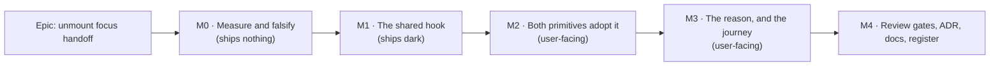

# Implementation Plan: A roving container hands focus back when a peer removes the control you are standing on

- **Feature spec:** [`./feature-spec.md`](./feature-spec.md) — **Draft, awaiting approval**
- **Status:** Draft
- **Owner:** unassigned

---

## The falsification condition comes first

It is restated here, ahead of the milestones, because the brief requires it in that order and because
**M0 can end this epic**. F1–F6 are defined in [`feature-spec.md` §5](./feature-spec.md#5-proof-and-the-falsification-condition-stated-before-the-milestones).

- **F2 is the kill switch.** If the selection bar is _gone_ after the peer's flip rather than merely
  missing one item, the diagnosis in §4.8 is wrong, the existing `restoreFocus` cleanup owns the case,
  and **this epic is withdrawn** in favour of a much smaller repair inside `SelectionActionsBar`.
- **F1 is the pause switch.** If the measurement harness no longer reaches its condition, nothing
  measured afterwards is a statement about the product, and the epic waits on the harness.
- **F3 is the design switch.** If the layout effect runs before the browser has blurred the removed
  node, the `activeElement` read cannot see the drop and detection moves to the container's `onBlur`.
  M0 answers it **before** M1 is written, which is the whole reason M0 exists as its own milestone.

Nothing in M1–M4 may be started on the strength of a reasoned answer to F2 or F3.

---

## Breakdown

### Epic

**Unmount focus handoff** — close `docs/TECH_DEBT.md` #204(c), a live WCAG 2.2 §2.4.3 level-A failure,
by giving the `Toolbar`/`Deck` family one rule for where focus goes when **somebody else** removes the
control a reader is standing on. Roadmap theme: none — accessibility debt repair on a shared
primitive.

---

## Milestone M0 — Measure and falsify (ships nothing)

**Outcome:** F1, F2 and F3 are **answered from a browser**, and the epic is confirmed, withdrawn, or
redesigned before any product code is written.
**Ships dark:** deliberately — M0 adds no product code and changes no surface. It writes to
`apps/web/measure-toolbar/`, which is a measurement harness and not a CI gate.
**Journey:** not applicable (ADR-0081 §1's second branch — this milestone claims no capability).

---

#### Feature: the diagnosis is established rather than inherited

> **Description:** Turn three reasoned claims into observations.
> **Complexity:** S
> **Dependencies:** none
> **Risks:** the harness has failed three times before, each version's write-up describing the
> previous failure while committing a new one (`docs/TECH_DEBT.md:4557-4590`) → do not modify the
> probe's existing assertions; **add** to them, and keep its `verdict` field's four-outcome shape,
> whose first branch is about the instrument rather than the product.
> **Testing requirements:** the harness is the test. Its output is pasted into the milestone record,
> not summarised.

##### Task M0-T1 — Re-run the harness and add the bar-presence reading (F1, F2)

- **Description:** `scripts/e2e-local.sh measure:toolbar` against an unmodified tree. Add **one**
  field to the existing probe: whether `getByRole('toolbar', { name: /^Actions for / })` is present
  after the flip, read at the same moment as `focusAfter`.
- **Complexity:** S
- **Dependencies:** none
- **Risks:** `reuseExistingServer` is true outside CI, so a stale dev server from another harness is
  silently adopted and the config's environment never applies (ADR-0099's recorded three-false-
  diagnoses incident) → run through `scripts/e2e-local.sh`, which refuses while anything answers on
  3000 or 5173.
- **Testing:** n/a (this _is_ the instrument).
- **Development steps:**
  1. Run unchanged; record `verdict`, `planReadsByReaderAfterFlip`, `controlStillPresentOnReadersPage`,
     `focusBefore`, `focusAfter`.
  2. Add `barStillPresentOnReadersPage` beside the existing fields; re-run.
  3. **If the bar is absent → stop. Report F2 failed and withdraw the epic** (the remedy is then a
     repair to `SelectionActionsBar`'s `restoreFocus` path, which is a different and much smaller
     piece of work).
  4. Write `m0-measurement.md` in this directory with the raw output and the verdict against F1/F2.

##### Task M0-T2 — Settle the commit-ordering claim (F3)

- **Description:** Establish, in Chromium, what `document.activeElement` is at the moment a
  `useLayoutEffect` runs in the commit that removed the focused node. §4.8 reasons it is `<body>`;
  nothing here has observed it.
- **Complexity:** S
- **Dependencies:** none
- **Risks:** measuring the wrong thing. The probe must remove a **focused** node via a React state
  change, not by a direct DOM call, or it measures a case React never produces.
- **Testing:** a throwaway probe under `apps/web/measure-toolbar/`, committed with its reading, in
  the shape of the existing probes: it reports a field, not a pass.
- **Development steps:**
  1. Mount a minimal component with a focusable child; focus the child; flip a state flag that
     removes it; read `document.activeElement` inside `useLayoutEffect` and again inside `rAF`.
  2. Record both readings.
  3. **If the layout-effect reading is not `body`/`null`**, record F3 as failed and amend
     `feature-spec.md` §4.6 to record the focus loss from the container's `onBlur` instead — a
     change to M1-T1's detection, not to the milestone's shape.

##### Task M0-T3 — Verify the enumeration (Q2 of the brief) against the tree

- **Description:** Re-derive the container count and the flippable-predicate table in `feature-spec.md`
  §3 from the code on the day the work starts, rather than trusting a table written days earlier.
- **Complexity:** S
- **Dependencies:** none
- **Risks:** a stale enumeration decides M1's shape (the spec's whole argument for a shared hook
  rests on `Deck` having the hazard) → re-run the two `rg` commands the spec names and diff the result
  against its tables.
- **Testing:** n/a.
- **Development steps:**
  1. `rg '<Toolbar\b|<Deck\b' apps/web/src --glob '!*.test.*'` — confirm the production mountings.
     **Measured 2026-09-11: there are THREE, not the four this task originally named** — see
     `m0-measurement.md`. The design is unaffected (§4.2's reopening threshold is one container) and
     the number is corrected here rather than rounded away.
  2. `rg 'isVisible:' apps/web/src --glob '!*.test.*'` — confirm 17 declarations and re-classify each.
  3. Record any drift in `m0-measurement.md`. **A new production mounting or a new flippable
     predicate changes nothing about the design** — it strengthens it — but an enumeration that shrank
     to one container would reopen §4.2.

---

## Milestone M1 — The shared hook (ships dark)

**Outcome:** one module implements the rule and is proven on a synthetic registry for both
primitives, including the decision table's do-**not**-fire branches.
**Ships dark:** nothing calls it. No surface changes, no behaviour changes, and the flag-free
rollback is this milestone's own commit boundary (ADR-0088 D1 — a `VITE_` constant is inlined at
build time and is not an operator rollback, so there is nothing a flag would buy).
**Journey:** none — M1 claims no user-facing capability. The journey lands at M3, with the first
milestone that does (ADR-0081 §2).

---

#### Feature: `useToolbarFocusHandoff`

> **Description:** Record the focused element; detect that it has left a still-mounted container;
> yield a frame; act only if focus really was dropped; focus the container; announce afterwards.
> **Complexity:** M
> **Dependencies:** M0 (F3 decides the detection mechanism)
> **Risks:** (1) becoming a fifth answer to the reader-caused case → the one-frame yield plus the
> `activeElement` guard, both asserted with do-not-fire cases; (2) drifting from
> `selection-actions.tsx`'s guard → copy the predicate by value and cite it; (3) firing for a
> portalled descendant → the containment guard at record time, with its own case.
> **Testing requirements:** unit cases covering **every branch** of the decision table, each verified
> red against a named mutation; a structural test that neither primitive grows a second copy.

##### Task M1-T1 — Write the hook

- **Description:** New `apps/web/src/components/ui/toolbar/use-focus-handoff.ts`, exporting
  `useToolbarFocusHandoff`. No consumer yet.
- **Complexity:** M
- **Dependencies:** M0-T2
- **Risks:** a docblock that overclaims. The module docblock must state, in the
  `toolbar-keyboard.ts` house style, **what it does not decide**: it does not know _why_ an item
  went, it does not fire on container unmount, and it yields to anything else that moves focus.
- **Testing:** none in this task — the cases are M1-T2, written against the finished signature.
- **Development steps:**
  1. `onFocusCapture`: if `containerRef.current?.contains(event.target)`, record the element and, for
     attribution, `target.closest('[data-toolbar-item],[data-toolbar-item-scope]')`'s id.
  2. `onBlurCapture`: clear the record **only** for a real move to another element inside or outside
     — i.e. `relatedTarget !== null` — mirroring `selection-actions.tsx:971-977`, whose comment
     records that a removal blurs with **no** related target and that this is exactly the case the
     handoff must still see as "we had focus".
  3. `useLayoutEffect` keyed on the resolved id list: if a record exists and the container no longer
     contains it, schedule one `requestAnimationFrame`.
  4. On that frame: bail unless `document.activeElement === null || document.activeElement === document.body`;
     otherwise `containerRef.current.focus()`; then, **only if focus landed**, call `announce(...)`.
  5. Clear the record in every exit path, so one removal produces at most one handoff (E6).
  6. Development-only `console.warn`, once per item id, when a recorded item had no `lostReason`
     (CQ-3) — modelled on `warnRefusedPartition` (`Toolbar.tsx:89-98`), and explicitly non-throwing.

##### Task M1-T2 — The decision table, verified red

- **Description:** `use-focus-handoff.test.tsx`, driving a synthetic two-item registry through both
  `Toolbar` and `Deck`.
- **Complexity:** M
- **Dependencies:** M1-T1
- **Risks:** a suite that passes against a hook that never fires. Every **fires** case must be
  verified red by deleting the corresponding line; every **does not fire** case must be verified red
  by removing the guard it tests.
- **Testing:** the cases below. Each row names the mutation it was made to fail against.

  | Case                                                    | Expected     | Verified red by                               |
  | ------------------------------------------------------- | ------------ | --------------------------------------------- |
  | Focused item leaves; `activeElement` is `body`          | fires        | removing the `focus()` call                   |
  | Same, in `Deck`                                         | fires        | the same, in the `Deck` render                |
  | Focused item leaves; a dialog took focus first          | **does not** | removing the `activeElement` guard            |
  | Focused item leaves; an existing handoff won on frame 1 | **does not** | removing the rAF yield                        |
  | A **non**-focused item leaves                           | **does not** | recording on render rather than on focus      |
  | Focus was on a portalled `Menu` item                    | **does not** | removing the containment guard at record time |
  | Every item leaves (E1)                                  | fires        | early-returning on an empty resolved list     |
  | Container unmounts entirely (E4/W3)                     | **does not** | moving the logic into a cleanup               |
  | Announcement is the **last** call after focus (F5)      | asserted     | swapping the two calls                        |
  | Two items leave in one commit (E6)                      | one handoff  | omitting the record clear                     |

- **Development steps:**
  1. Stub `requestAnimationFrame` as `TsldCanvas.hidden-pane.test.tsx:88` already does.
  2. Mock `@/components/ui/announcer` with a spy (the `WbsBulkAssignBar.test.tsx:21` precedent).
  3. Write each case; **run it red first**; then wire the hook branch.

##### Task M1-T3 — The no-second-copy structural test

- **Description:** `focus-handoff-seam.structural.test.ts`: neither `Toolbar.tsx` nor `Deck.tsx`
  contains its own `document.activeElement` comparison or its own `requestAnimationFrame`, and both
  import the hook.
- **Complexity:** S
- **Dependencies:** M1-T1
- **Risks:** a scan matching its own docblock — the **fourth** recorded instance of that class in this
  repository (`reset-fills.structural.test.ts`, the ADR-0097 weight ratchet, the sizing ratchet,
  ADR-0121's gate) → strip comments before scanning, and pin a fixture in both directions.
- **Testing:** verified red by pasting the guard back into `Toolbar.tsx`.
- **Development steps:**
  1. Strip block and line comments; assert on the residue.
  2. Add the positive limb (both files import the hook), so a green run cannot mean "found neither
     primitive" — the ADR-0093/ADR-0108 lesson about a census that passes over an empty population.

---

## Milestone M2 — Both primitives adopt it (user-facing)

**Outcome:** on any of the three production containers (M0-T3 re-derived the count; the spec said four), a focused command removed by a peer hands
focus to its container instead of to `<body>`. The generic sentence is announced; the _reason_ lands
at M3.
**Entry point:** no new control. The capability is reached on the **plan workspace** — the canvas
selection bar (`role="toolbar"`, "Actions for <activity>"), the command deck ("Plan commands") and
the mode row ("Plan mode and view") — at the moment a peer's write removes the focused command.
There is nothing to press; that is the nature of the repair, and it is stated here rather than left
as an implied dark milestone.
**Journey:** the two-context journey lands at **M3**, with the milestone that completes the
user-visible behaviour. M2's proof is M1-T2's cases plus the harness re-run in M2-T3 — and if M3
slipped, M2 would have shipped a user-facing change proven only by unit tests, which is the ADR-0081
hole; so **M2 and M3 ship in one release** (see Sequencing).

---

#### Feature: the primitives call the hook

> **Description:** Three lines each in `Toolbar` and `Deck`, plus `tabIndex={-1}` on the containers
> and the wrapper attribution marker.
> **Complexity:** S
> **Dependencies:** M1
> **Risks:** (1) `tabIndex={-1}` on `role="toolbar"` changes something nobody predicted → assert Tab
> order is unchanged, and have accessibility-reviewer confirm before release (M4-T1); (2) the
> attribution marker breaking roving focus → **never** a second `data-toolbar-item`, with a case
> asserting the split-button's roving focus still lands on the primary button.
> **Testing requirements:** existing `Toolbar.test.tsx`, `Deck.test.tsx`, `toolbar-segments.test.tsx`,
> `deck-seams.structural.test.tsx` and all ~20 `tsld-toolbar-*` suites pass **unchanged** — that is
> the before/after oracle (the ADR-0062 extraction argument).

##### Task M2-T1 — `Toolbar` adopts the hook

- **Description:** Call the hook, spread its handlers, add `tabIndex={-1}`, add
  `data-toolbar-item-scope` to the render-item wrapper (`Toolbar.tsx:239`).
- **Complexity:** S
- **Dependencies:** M1-T1
- **Risks:** the fit gate (`e2e-workspace-fit`) sweeps `[data-toolbar-item]` — a distinct attribute
  is invisible to it, which is intended, but confirm rather than assume.
- **Testing:** existing suites unchanged; one new case that ArrowRight from the focused container
  lands on the first item (`Toolbar.tsx:194` already resolves `current === -1` to 0; the case pins it).
- **Development steps:**
  1. Wire the hook; pass `focusableIds`, the `label`, and a `lostReasonFor` lookup over `resolved`.
  2. `tabIndex={-1}` on the `role="toolbar"` div.
  3. `data-toolbar-item-scope={r.item.id}` on the render-item wrapper span.
  4. Run `rg` for every consumer of `data-toolbar-item` and confirm none is widened.

##### Task M2-T2 — `Deck` adopts the hook

- **Description:** The same three changes, with `stopIds` (`Deck.tsx:228-236`) as the id input and
  the wrapper at `Deck.tsx:359`.
- **Complexity:** S
- **Dependencies:** M2-T1
- **Risks:** doing M2-T1 and not this — the exact drift `toolbar-keyboard.ts`'s docblock records →
  M1-T3's structural test makes it a CI failure rather than a review question.
- **Testing:** `Deck.test.tsx` and `command-surface.spec.ts` unchanged.
- **Development steps:** as M2-T1.

##### Task M2-T3 — Re-run the harness (F4)

- **Description:** `scripts/e2e-local.sh measure:toolbar` against the adopted code; append the
  after-reading to `m0-measurement.md`.
- **Complexity:** S
- **Dependencies:** M2-T2
- **Risks:** reporting an improvement that is really the instrument (the harness's own recorded
  history) → the run must still show `planReadsByReaderAfterFlip ≥ 1` and
  `controlStillPresentOnReadersPage: false`; only the `focusAfter` field may change.
- **Testing:** n/a.
- **Development steps:** run; paste both readings side by side; state which fields moved and which
  did not.

---

## Milestone M3 — The reason, and the journey (user-facing)

**Outcome:** the announcement says **why**, and the whole behaviour is proven end to end against a
real API with two real sessions and the pen enforced.
**Entry point:** as M2 — the selection bar on the plan workspace, Visual mode, with a peer changing
the plan's scheduling mode.
**Journey:** `apps/web/e2e-workspace-chrome/peer-unmount-focus.spec.ts` — the flag-on journey ADR-0081
requires, landing with the first milestone that completes user-facing capability. **No new Playwright
config and no new CI step**: `playwright.workspace-chrome.config.ts` already runs in Visual mode at
1646 with `PLAN_EDIT_LOCK_ENFORCED=true` (`ci.yml:616-628`), which is exactly this fixture.

---

#### Feature: `lostReason`, and end-to-end proof

> **Description:** The registry field, the one real consumer, and the journey.
> **Complexity:** M
> **Dependencies:** M2
> **Risks:** (1) the journey's 31 s wait (CQ-5) making the suite flaky under retries → the wait is the
> `staleTime`, not padding, and the suite is already serial with two retries; (2) the journey
> asserting the prose rather than the behaviour → assert `document.activeElement` via `evaluate`, not
> a visible string; (3) writing a reason sentence that is false in the new world → §4.6's static-string
> rule, stated in the field's own docblock.
> **Testing requirements:** the journey, plus a unit case on the composed sentence with and without a
> `lostReason`.

##### Task M3-T1 — `ToolbarItem.lostReason`

- **Description:** Add the optional static `string` to the registry type; resolve it alongside
  `disabledReason` in `resolveItems`; document the static-not-function rule where the field is
  declared.
- **Complexity:** S
- **Dependencies:** M2-T2
- **Risks:** a later author making it `(ctx) => string` for symmetry with `disabledReason` → the
  docblock must state the trap (evaluated at focus time it describes the old world; evaluated after
  removal it has no item), and a unit case pins that a plain string is what reaches the message.
- **Testing:** `toolbar-registry.test.ts` — the field survives resolution; `defineToolbar` accepts an
  item without it.
- **Development steps:**
  1. Field + docblock.
  2. Thread it through `ResolvedToolbarItem`.
  3. Compose the two sentence forms in the hook, with a case for each (US-2).

##### Task M3-T2 — The one real consumer

- **Description:** `lostReason` on `clear-visual-placement` (`selection-actions.tsx:751-793`), beside
  its `isVisible` at `:764`.
- **Complexity:** S
- **Dependencies:** M3-T1
- **Risks:** adding it to one item and not its five flippable neighbours (§3's table) — the register's
  most-repeated shape → **decide each of the six explicitly** and record the decision in the commit;
  the pen item and the two `isSummary` items are the strongest further candidates, and a reason that
  would be a guess is better omitted than invented (US-2's last criterion exists for this).
- **Testing:** `selection-actions.conflict-remedy.test.tsx` unchanged; one new case asserting the
  composed sentence.
- **Development steps:** write the sentence; check it is true both before and after the flip; add the
  case.

##### Task M3-T3 — The two-context journey (F1, F2, F4, F5)

- **Description:** Port the measurement's two-session fixture into `e2e-workspace-chrome` as an
  assertion rather than a reading.
- **Complexity:** M
- **Dependencies:** M3-T2
- **Risks:** (1) the harness's three recorded failure modes — a non-bubbling `visibilitychange`, a
  `bringToFront` that fires nothing in headless Chromium, a guard that conflates "the page updated"
  with "the plan changed" → reuse the probe's **version 3** structure verbatim, including its
  request counter and its server-side mode guard; (2) a locator by copy rather than by role → locate
  the bar by `getByRole('toolbar', { name: /^Actions for / })`.
- **Testing:** this is the test. It must be **verified red** by reverting M2-T1's `focus()` call.
- **Development steps:**
  1. Two contexts; A takes the pen in Visual mode with a selection and focus on `Clear visual start`.
  2. Assert focus **before** (the probe's Guard 1).
  3. B PATCHes `schedulingMode: 'EARLY'` with no pen; assert the PATCH succeeded.
  4. Count A's plan GETs; wait past `staleTime`; dispatch `visibilitychange` **on `window`**; assert
     the server says `EARLY`.
  5. Assert: the control is gone, the bar is present, `document.activeElement` is the bar's toolbar
     container, and `[data-testid="announcer"]` holds the reason sentence.
  6. Assert the announcement arrived **after** focus (poll focus first, then the region).
  7. Run an axe scan on the settled state — and confirm the `.include()` target matches something, the
     ADR-0099 M5 correction.

##### Task M3-T4 — The four reader-caused paths stay unanswered by this mechanism (F6)

- **Description:** Prove no regression on the paths the product already answers.
- **Complexity:** S
- **Dependencies:** M3-T3
- **Risks:** running only the suite CI names — the recorded failure from ADR-0091's retrospective →
  run the full sweep (`scripts/e2e-sweep.sh`), whose roster is derived rather than remembered.
- **Testing:** `e2e-multi-select` (bulk delete → listbox), `e2e-edit`, `e2e-wbs`, plus
  `TsldPanel.bulk-operations.test.tsx` unchanged; one new unit case asserting the announcer spy is
  **not** called on a deselect.
- **Development steps:** run; record which suites ran and their results; investigate any change
  before attributing it to noise.

---

## Milestone M4 — Review gates, ADR, docs, register

**Outcome:** the change is reviewed by the two agents `CLAUDE.md` §19.13 requires **before release**,
the decision is filed, and the register tells the truth.
**Ships dark:** no product behaviour changes in M4.
**Journey:** none.

---

#### Feature: the gates and the record

> **Description:** Specialist review, the ADR (number assigned at filing — see the note below), documentation, register.
> **Complexity:** M
> **Dependencies:** M3
> **Risks:** deferring the reviews to a later epic's gate pass, which is exactly the failure §19.13
> was written after → they are tasks here, with the reason stated, and M4-T1 **precedes the release**.
> **Testing requirements:** every folded finding carries a regression test verified red first.

> **The number in this document was 0134 and is taken.** ADR-0134 was filed on 2026-09-11 for the
> Gantt's typed dates (`docs/specs/gantt-editing-gaps/` M3), hours after this spec was drafted. This
> work takes the **next free number at filing time**, checked against `docs/adr/` on the day rather
> than reserved here — ADR-0079 was filed as 0079 rather than the 0078 its own plan named, and
> ADR-0071 was never filed at all, which is why the plan's own risk line says to check.

##### Task M4-T1 — accessibility-reviewer **and** component-reviewer, before release

- **Description:** Run both over the combined diff. **This is not optional and not deferrable.**
- **Complexity:** M
- **Dependencies:** M3-T4
- **Risks:** treating a green review as proof. Both reviewers execute the component; neither runs a
  screen reader.
- **Testing:** regression tests for every blocking finding, each verified red first.
- **Why here, in the plan, rather than at a later gate pass:** `CLAUDE.md` §19.13 and ADR-0111 require
  it whenever a change alters **which keys a shared primitive claims, or where focus goes when one
  opens, closes, unmounts or shades**. This change is squarely that: a new focus destination on
  `Toolbar` and `Deck`. The rule exists because **twice in two days** a change to a primitive's
  keyboard model passed every automated gate, a human read and a real-browser journey and was wrong —
  the second time _inside the fix for the first_, and already released (`docs/TECH_DEBT.md` #189, then
  #192). Both were found in minutes by a reviewer that executed the component. It is a weak instrument
  and is labelled one; it is also the only instrument that has ever caught this class here.
- **Development steps:**
  1. accessibility-reviewer: the `tabIndex={-1}` container as a focus destination, the announcement's
     wording and timing, whether anything is announced twice, and the E1 empty-toolbar case.
  2. component-reviewer: the hook's public contract, the `lostReason` field, the wrapper attribute's
     interaction with `data-toolbar-item`, and whether the two primitives really share one rule.
  3. Fold blocking findings with tests; file non-blocking ones as a register row with reasons.

##### Task M4-T2 — the ADR (number assigned at filing — see the note below)

- **Description:** File the ADR outlined in `feature-spec.md` §4.7 as
  `docs/adr/0134-<slug>.md`; add it to `docs/adr/README.md` and to `CLAUDE.md` §16.
- **Complexity:** M
- **Dependencies:** M4-T1
- **Risks:** (1) the number being taken between plan and milestone — ADR-0079 records exactly that →
  re-check `docs/adr/` immediately before writing, and if it has moved, **record the collision rather
  than routing around it** (the ADR-0071 lesson); (2) filing the ADR and not the register entry, which
  is the ADR-0071/ADR-0132 failure twice recorded → `pnpm check:adr-coverage` gates both directions
  since ADR-0110 D6, so run `pnpm prepush`, which derives it.
- **Testing:** `pnpm prepush` (one command — running its parts by hand is how `check:adr-coverage` got
  missed once, on a change whose subject was filing an ADR).
- **Development steps:** write D1–D8; state the §0.1 correction **in the ADR**, not only in the spec;
  set the spec's header to `Accepted — shipped (the ADR (number assigned at filing — see the note below))` in the same change (ADR-0131).

##### Task M4-T3 — Documentation and the register

- **Description:** The authoring rule, and four register edits.
- **Complexity:** S
- **Dependencies:** M4-T2
- **Risks:** closing `#204(c)` as a whole when only (c) is fixed — (b)'s toolbar half and (d)'s record
  are still live → close item (c) precisely, leave the row open, and say which item closed.
- **Testing:** `pnpm check:debt-status`, `pnpm check:doc-links`, `pnpm check:spec-status`.
- **Development steps:**
  1. `docs/DESIGN_SYSTEM.md`: the one-line authoring rule (§4.6 item 7).
  2. `docs/TECH_DEBT.md` #204(c): closed, with the reading before and after.
  3. `docs/TECH_DEBT.md`: **a new row for `HierarchyTree`** (CQ-4) — the same hazard, a worse
     consequence (`activeKey` at `:125-126` does not check that `focusedKey` resolves, so
     `activeIndex` is `-1` and **no** row is a tab stop), one reader-caused answer already present at
     `:174-181`, none for a peer-caused one. Size S, with its own trigger.
  4. `docs/TECH_DEBT.md` #154: add the owed listen — does a real screen reader speak the container's
     name and then the polite sentence, in that order?
  5. Changeset: **patch** to `@repo/web`. User-visible (focus behaviour changes) but additive and
     behind no contract break.

---

## Sequencing & slices

1. **M0** ships nothing and can end the epic. Nothing else starts until F1/F2/F3 are answered.
2. **M1** ships dark: `main` stays releasable with an uncalled module.
3. **M2 + M3 ship in one release.** M2 alone would be a user-facing change proven only by unit tests
   — precisely the ADR-0081 hole — and M3 alone has nothing to prove. They are two milestones because
   they are two reviewable diffs, not because they are two releases.
4. **M4** follows immediately and **precedes the release tag**, because M4-T1's reviews are a
   pre-release gate rather than a retrospective (§19.13).

**No feature flag.** ADR-0088 D1: `import.meta.env.VITE_*` is inlined at build time, the Dockerfile
declares one `VITE_` build arg and the publish workflow passes none, so a flag is not an operator
rollback and never has been. The rollback is a commit boundary, and M1/M2/M3 are each individually
revertible.

**Frontend only.** `apps/web` alone: no API, no schema, no migration, no engine. The CPM engine is not
imported and the ADR-0034 recalculation parity gate is untouched by construction — in its honest form,
there is nothing here to hold parity for.

## Definition of Done (per task)

Each task's PR satisfies the Feature Completion Criteria in [`docs/PROCESS.md`](../../PROCESS.md).
Two clauses are called out because this epic turns on them:

- **The pre-push gate was run, not just written** — `pnpm prepush`, plus
  `scripts/e2e-local.sh web:workspace-chrome` for M3. Do not run its parts by hand; the script
  derives the list.
- **Every assertion added was verified red** against the specific defect it guards (ADR-0110 D5).
  Record the mutation in the commit message, not just the intention.

## Risks & assumptions (rollup)

| Risk / assumption                                                                  | Likelihood | Impact   | Mitigation                                                                                                                                                      |
| ---------------------------------------------------------------------------------- | ---------- | -------- | --------------------------------------------------------------------------------------------------------------------------------------------------------------- |
| **F2 fails** — the bar unmounts after all, so the existing cleanup owns the case   | low        | **high** | M0-T1 answers it first; the epic is withdrawn rather than re-scoped mid-flight.                                                                                 |
| **F3 fails** — the layout effect runs before the browser blurs the removed node    | low        | med      | M0-T2 measures it; the fallback (record the drop from `onBlur`) is named in advance and changes one task.                                                       |
| The hook becomes a **fifth answer** and double-moves focus on a reader-caused path | med        | med      | The one-frame yield + the `activeElement` guard, both with do-not-fire cases; F6 re-runs three journeys and the full sweep.                                     |
| The attribution marker breaks roving focus on split buttons                        | low        | high     | A **distinct** attribute, never a second `data-toolbar-item`; a case pins that roving focus still lands on the primary button.                                  |
| CQ-1 was answered wrongly and the announcement is overwritten in practice          | med        | med      | F5 pins the call order; the AT interleaving itself is unobservable here and is **filed** to #154 rather than claimed.                                           |
| `tabIndex={-1}` on `role="toolbar"` has an AT consequence nobody predicted         | low        | med      | M4-T1's accessibility review before release; the `HierarchyTree.tsx:302` precedent (a `tabIndex={-1}` container focused as a fallback) is cited, not relied on. |
| The journey's 31 s wait destabilises an already-serial CI suite                    | med        | low      | CQ-5. The wait is the mechanism, not padding; the suite has two retries in CI.                                                                                  |
| A reason sentence is written that is false after the change it describes           | med        | med      | Static strings describing the **condition**, not the transition; M3-T2 checks each candidate is true in both worlds or omits it.                                |
| The enumeration in §3 is stale by the time work starts                             | med        | low      | M0-T3 re-derives it from the tree on the day.                                                                                                                   |
| `#204(c)` is closed as if the whole row were fixed                                 | med        | low      | M4-T3 closes item (c) precisely and leaves (b) and (d) standing.                                                                                                |
