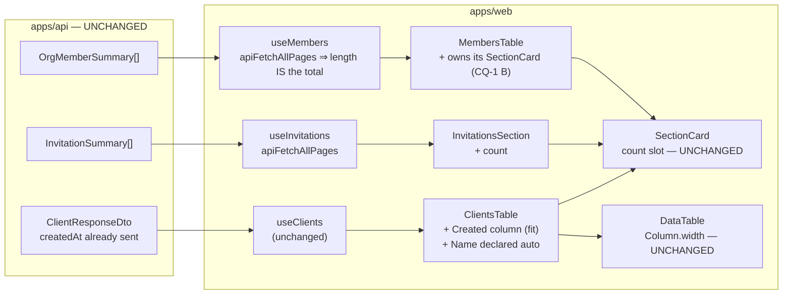
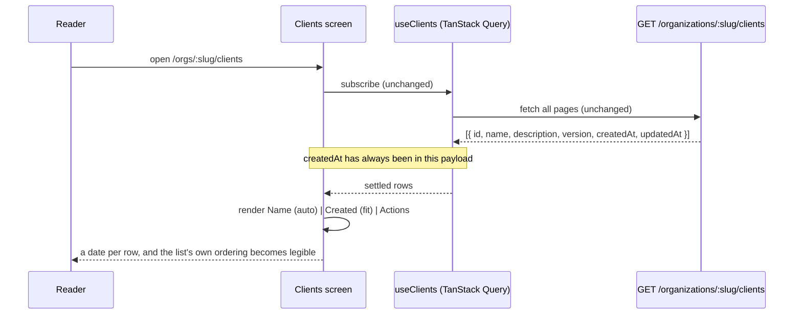
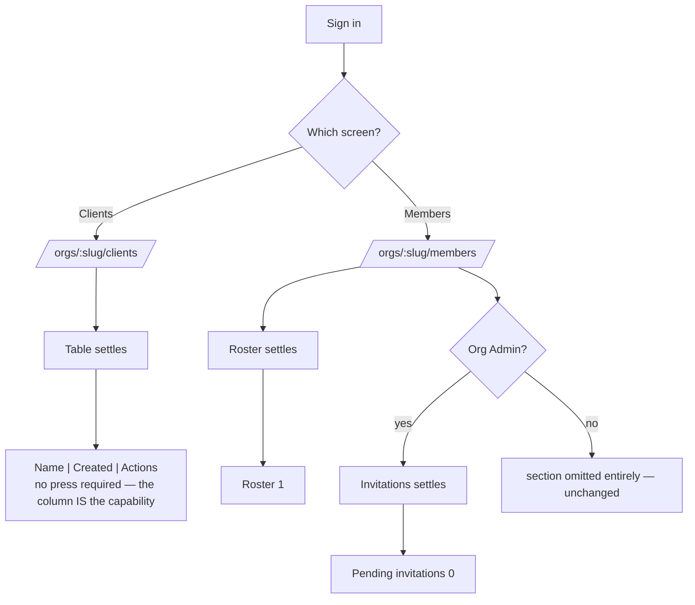

# Feature Spec: Two screens carry facts they already hold and do not render

- **Status:** Draft
- **Author(s):** feature-analyst
- **Date:** 2026-09-19
- **Tracking issue / epic:** `docs/TECH_DEBT.md` #343
- **Roadmap link:** none. This is a debt-register item, not a roadmap theme — see §4.9 for why no
  ADR is proposed either, and therefore why `check:adr-coverage` has nothing to demand here.
- **Related ADR(s):** ADR-0146 (D3 the column vocabulary, D4 facts-under-the-row, M8 the `count`
  slot's AT exposure), ADR-0098 (omitted, never approximated), ADR-0081 (entry point + journey),
  ADR-0088 D1 (no `VITE_` flag), ADR-0105 (why this is a spec and not a fix), ADR-0128/ADR-0142 D4
  (measure first, and an approved remedy is a claim).

---

## 0. What re-verification changed before anything was designed

CLAUDE.md §19 and `docs/RECONCILE.md` say to verify the claim rather than trust the document, and
ADR-0146 D4 extends that to a **remedy**: an approved action is a claim that it will work, and
approval does not make it one. The register row was written 2026-09-17. Nine of its claims and its
brief's were checked against the code as it stands. **Six hold; six do not.** Every one of the six
changed the work, so they lead rather than sit in an appendix.

### 0.1 Verified — the row is right about these

| Claim                                                                          | Established by                                                                                                                       |
| ------------------------------------------------------------------------------ | ------------------------------------------------------------------------------------------------------------------------------------ |
| `ClientsTable` renders two columns                                             | `ClientsTable.tsx:86-155` — one literal `Name`, one `Actions` pushed only `if (canWrite)`                                            |
| `ClientSummary` carries `createdAt`/`updatedAt` **on the wire**                | `ClientResponseDto.from` sets both (`client-response.dto.ts:25-34`); the list maps every row through it (`clients.controller.ts:70`) |
| `members.tsx` passes no `count`                                                | `members.tsx:53-57`                                                                                                                  |
| §4.6 of the page-composition spec specifies `SectionCard( "Roster", count, …)` | `docs/specs/page-composition/feature-spec.md:1101`                                                                                   |
| Nothing recorded a decision either way for (b)                                 | no withdrawal in `m3-m4-record.md`, `m8-record.md` or `m8-verdict.md`; §4.6 stands unamended                                         |
| The `Created` column wants FC-2 re-run rather than a reviewer's eye            | confirmed, and sharpened — see §0.2(c), which is worse than the row thought                                                          |

### 0.2 Corrected — six findings

**(a) The withdrawn "FC-2 prose density" belongs to a different epic, and this is a numbering
collision worth naming.** The brief says to establish what FC-2 still asserts before planning to
re-run it. Established: there are **two FC-2s**.

| Epic                        | FC-2 asserts                      | State                                                                                                  |
| --------------------------- | --------------------------------- | ------------------------------------------------------------------------------------------------------ |
| page-consistency (ADR-0145) | vertical chrome / prose density   | **WITHDRAWN** at M3 by its own clause; `m7-measurement.md:27-29` records that re-judging it is refused |
| page-composition (ADR-0146) | nothing wraps beside unused width | **PASS** at M8, no withdrawal, judged by `measure-column-fit.mjs`                                      |

#343 was raised at ADR-0146 M8, cites that epic's `feature-spec.md` §1.2.9 and §4.6, and words its
concern as "adding a column changes what the **column-fit** measurement is about". So the row means
**page-composition's** FC-2, which is live. The withdrawal the brief warns about is the neighbour's,
and following it would have produced the opposite of the right plan — treating a live condition as
un-re-runnable.

The collision is itself a hazard: two adjacent epics, conditions numbered FC-1…FC-9 in both,
contradictory states under identical names. CLAUDE.md's own ADR-0146 entry has already made this
mistake, carrying page-consistency's sentence ("FC-2's prose-density half withdrew by its own
clause") into the page-composition entry, where `m8-verdict.md:16` records **PASS**. That is
recorded in §6 as a finding rather than repaired here, because editing the register is not this
epic's work.

**(b) A closed epic's condition cannot be "re-run" — its bar is adopted instead.** FC-2 was judged
at M2 and collected at M8; page-composition is finished. Re-opening somebody else's verdict after
their epic closed is precisely what page-consistency's own falsification file refuses in as many
words. So this spec **adopts FC-2's bar verbatim as its own condition** (FC-A, §2.6), with a fresh
baseline taken before the column exists and committed in its own commit ahead of the harness
(ADR-0128's ordering). Same instrument, same bar, new condition, new epic. Nothing about FC-2's
verdict moves.

**(c) The instrument that judges it has a dead control, and it is dead because M2 succeeded.**
`measure-column-fit.mjs` refuses a verdict unless it can still see two pinned wraps —
`KNOWN_WRAPS = [['calendars','Working days'], ['resources','Code']]` (`:47-50`). M2 **fixed both**
(`m2-measurement.md:13-19`: 11 wrapping columns → 0 at 1646, 3 at 1280 and all on the audit log). So
on today's tree the pinned case fails at **both** widths and the only way to get a number out of the
probe is `EXPECT_KNOWN_WRAPS=0`, which disarms the control **entirely**.

That leaves the exact state the control exists to prevent: a probe that selects nothing reports zero
wraps, which is indistinguishable from a product with no wraps (ADR-0093). It is not a defect
anybody introduced — it is a control that was true when written and was made false by the fix it was
measuring, and its own docblock authorises the disarming (`:27-29`) without noticing that the flag
removes the whole guarantee. **Repairing it is task M1-T1, before any reading is taken**, and the
replacement control is available from the same measurement: `m2-measurement.md:14` records three
audit-log columns still wrapping at 1280, which are a live positive case on today's tree.

**(d) `measure-page-drift.mjs` cannot answer (a), and the reason is a name collision inside the two
instruments.** Both report a field called `natural`, and they are different quantities:

- `measure-page-drift.mjs:123-135` builds a `Range` over the cell's contents, which reports the
  **union of its line boxes** — the width the content is currently _rendered_ at.
- `measure-column-fit.mjs:126-151` clones the cell into an absolutely-positioned `max-content`,
  `nowrap` box — the width the content **wants**.

The drift harness's own docblock makes exactly this correction one field along, about `lastCellX`
(`:155-169`), and `measure-column-fit.mjs:120-125` says the Range form is "useless here" in as many
words. The consequence is visible in the committed data: drift reports Clients' `Actions` column at
`natural: 402` against `used: 401`, i.e. "full"; column-fit reports the same column at `natural: 82`.
The cell is a `flex … justify-end` block, so a Range spans the whole cell whatever is in it.

So the instrument for (a) is **`measure-column-fit.mjs`**, and the drift harness contributes two
different things: `firstRowTop` (FC-C) and `factSpread` (FC-D). Neither can substitute for the other.
The brief's premise that drift is "the instrument" is half right — it gained `firstRowTop` at M8 and
that is a condition this work needs — and it cannot judge column fit.

**(e) The row's "900–1000px of nothing" is a pre-D4 number, and the two-column state has never been
measured by the column-fit instrument at all.** `m2/column-fit-1646.json:13-56` records Clients with
**three** columns — `Name` (used 646 / natural 177), `Description` (328 / 90), `Actions` (298 / 82),
`naturalTotal` 349, **slack 922**. That is the 922 the row is quoting. D4 then folded `Description`
into the `Name` cell, and nothing re-ran column-fit afterwards.

The arithmetic says the row is **understating** it: a stacked cell's `max-content` is the _larger_ of
its two children, not their sum, so the post-D4 `naturalTotal` should be about
`max(177, 90) + 82 = 259` and the slack about **1012px**, i.e. D4 made the sparsest table in the
product roughly 90px sparser. That is a prediction and is written here to be falsified, not asserted
— it is the first thing M1's reading settles.

Two smaller precision points in the same family. The row's "1488px measure" is the **declared**
measure (`max-w-screen-2xl` less padding); at 1646, the project's reference width, the Project
Explorer binds first and the table renders **1271px** (`m8/drift-1646.json:117`, `:132-141`). And at
1280 the pre-D4 slack is **556px** (`m2/column-fit-1280.json:647-652`), which is the tightest case a
new column has to fit into — comfortable, given that Calendars survives the same width on 72px.

**(f) Two more claims, one in each half.**

For (a): the row says "exactly two columns", and that holds **only for a writer**. `Actions` is
pushed inside `if (canWrite)` (`ClientsTable.tsx:117`), so a **Viewer** sees **one column** — a
single left-aligned name and 1271px of nothing. The complaint is worse for the reader who has no
action to take, and the remedy helps them most.

For (b): the row names Roster. §4.6 specifies the count on **Roster and Pending invitations**
(`feature-spec.md:1101-1102`) and **neither** was built — `InvitationsSection.tsx:144-147` passes
`title` and `description` and no `count`. And the row's "one line either way" is true of the section
it did not know about and false of the one it named: `InvitationsSection` owns its own query and its
own card, so its count is genuinely one prop; `members.tsx` owns Roster's card while `MembersTable`
owns the data, so nothing at the route knows the number. See §4.4.

### 0.3 A stale claim in the file this work will extend

`e2e-page-composition/composition.spec.ts:139-144` explains its count assertion with "The count
renders `aria-hidden` on purpose — the screen already announces its settled result count through a
live region". That premise was **demolished in the same milestone** that wrote it down: ADR-0146 M8
made the count AT-visible, `section-card.tsx:21-39` records why (the live region is silent on first
paint by its own docblock, and one of the four consumers has no such hook at all), and
`page-archetypes.test.tsx:433-446` now asserts the number is _not_ `aria-hidden`, verified red
against the opposite.

Nothing went red, because the assertion reads `textContent`, which finds the node either way. It is
a docblock asserting the reverse of its own primitive's shipped behaviour, in the file this spec
adds cases to, and it is the direct justification a reader would reach for when deciding whether (b)
is worth doing. Corrected as part of M2 (§5, M2-T3).

---

## 1. Business understanding

### Problem

Two screens hold facts they have already fetched and do not put on screen.

**(a) Clients is the sparsest table in the product.** Since ADR-0146 D4 moved the description under
the name, a row is a name at one end and `Edit ⋯` at the other. Measured at 1646
(`m8/drift-1646.json:126-151`), the row's **`factSpread` is literally `0`** — there is one fact
column, so a reader's eye travels zero distance between a row's first fact and its last, across a
1271px table. Every other in-scope table answers at least three questions per row. This is the most
literal instance in the product of the complaint ADR-0146 was opened on, left behind by that epic's
own remedy.

Meanwhile `ClientSummary` has carried `createdAt` and `updatedAt` the whole time, unrendered — and
the list is **ordered by `createdAt`** (`client.repository.ts:172`, `orderBy: [{ createdAt: 'asc' },
{ id: 'asc' }]`), so the screen sorts by a fact it refuses to show. A reader cannot tell the
ordering from the page.

**(b) Members' Roster and Pending invitations state no count.** Both sit in a `SectionCard` whose
`count` slot exists, is AT-exposed, and is passed by the three sibling list sections (All clients,
Calendar library, Resource library). The approved composition for this screen specifies it on both.
Neither was built and nothing recorded a decision — the silent gap between a spec and its code that
ADR-0081's standing rule is about.

**Why now.** The trigger the row names has fired: this is work taken up deliberately rather than by
somebody happening to touch the screen. It is cheap, it needs no API change, and the measurement it
requires is an afternoon rather than an epic.

### Users

Everyone who reaches these two screens. No permission changes; nothing here is gated.

| Role           | What changes                                                                                                                   |
| -------------- | ------------------------------------------------------------------------------------------------------------------------------ |
| Org Admin      | Clients rows answer "when did we take this client on?"; Members states the seat count and how many invitations are outstanding |
| Planner        | as above, minus the invitations section, which is omitted for them entirely (ADR-0082's first omit clause, unchanged)          |
| Contributor    | as Planner                                                                                                                     |
| Viewer         | **the largest single gain** — a Viewer's Clients row has no `Actions` column, so today it is one column wide (§0.2f)           |
| External Guest | none — neither screen is in the share scope                                                                                    |

### Primary use cases

1. An administrator opening `/orgs/:orgSlug/clients` can see when each client was created, and can
   therefore read the list's own ordering off the page.
2. A reader arriving on `/orgs/:orgSlug/members` learns how many people are in the organisation and
   how many invitations are outstanding, without scrolling to the end of either list and counting.
3. A screen-reader user gets both of those facts on arrival at the heading, once, with no second
   announcement.

### User journeys

**Happy path (a).** Sign in → Clients → the table renders `Name | Created | Actions`, `Created`
showing a real date on every row. Nothing is pressed; the capability _is_ the rendered column.

**Happy path (b).** Sign in → Members → "Roster 1" and "Pending invitations 0" beside their
headings, in the same treatment the three sibling library sections already use.

Both are drawn in §4.3.

### Expected outcomes

- Clients' `factSpread` stops being `0` and its table slack falls by roughly the width of a date.
- Members states two counts that were reachable by no route.
- The approved §4.6 composition and the shipped code agree, and the gap is closed by a decision
  somebody made rather than by nobody noticing.
- `docs/TECH_DEBT.md` #343 closes.

### Success criteria

Four falsification conditions, committed at M1 before any remedy exists (§2.6), plus the two gates
they become. Measured rather than judged by eye — the register row asked for exactly this, and
ADR-0142 D4 is the reason: the remedies below are claims that they will work, and approving them
does not make them true.

### Open questions

**Critical — these change scope or design. Everything else has a stated default and proceeds.**

> **CQ-1 — Where does Roster's `SectionCard` live?** The row assumes one line at the route; it is
> not, because the route does not hold the data (§0.2f). Two options are costed in §4.4.
> **Default: option B** — move the card into `MembersTable`, which is the convention the other four
> sections in the product already follow and the only shape in which the count's honesty is a
> property of the component that knows it. Cost: ~15 lines move, and `members.composition.test.tsx`
> is touched. Option A (call `useMembers` at the route) is three lines and carries a latent lie.
> **Answer needed because B changes what the screen composes**, which is the artefact
> `members.composition.test.tsx` exists to pin.

> **CQ-2 — Does `Actions` on Clients also become `width: 'fit'`?** It renders **401px** for an
> `Edit` and a `⋯` whose content wants ~82 (§0.2d). `RecentlyDeletedTable.tsx:249-252` already
> declares `fit` on its actions column for exactly this reason, so there is precedent and it is the
> single largest available change to this table's arithmetic — larger than the new column.
> **Default: do not decide it here.** It is put to M1's reading and built in M2 only if the numbers
> support it, with the reason recorded either way. Deciding it now, from the precedent, is the
> ADR-0142 D4 failure this spec was asked to avoid. **Answer needed only if the product owner wants
> it in or out regardless of the measurement.**

**Stated defaults (not blocking):**

- **Date format:** `formatTimestamp` — the same helper `Joined`, `Sent` and the audit log's `When`
  use. It prints `17 Sep 2026, 14:32` in the reader's local zone. A date-only variant would read
  better for a client record and would be a **third** shared date format invented for one column;
  ADR-0144's gate pass records "a date beside a date, formatted in the browser's locale next to one
  formatted in en-GB" as a real defect, and the sizing ratchet's argument (a one-off measure
  invented inside a primitive is how a design system acquires a second scale) applies one noun
  along. Consistency wins; the cost is ~40px of column.
- **Column header:** `Created`. Not `Added`, not `Since`. It is what the field is called on the wire.
- **Column position:** between `Name` and `Actions`. `Actions` stays last on every table in the
  product.
- **`updatedAt` is not rendered.** The row offers both; one is enough, the list is ordered by
  `createdAt`, and a second date column would re-open the question this epic is closing.
- **No count on Clients changes** — it already passes one (`ClientsTable.tsx:194`).
- **No `VITE_` flag** (§4.8).
- **No ADR** (§4.9).

---

## 2. Functional requirements

### User stories & acceptance criteria

> **US-1** — As any member of an organisation, I want to see when each client was created, so that
> I can tell recent clients from long-standing ones and read the list's ordering off the page.
>
> **Acceptance criteria**
>
> - **Given** the Clients screen **when** the table has settled **then** it renders a `Created`
>   column between `Name` and `Actions`.
> - **Given** any client row **then** its `Created` cell shows a formatted date, never an em dash —
>   `createdAt` is `NOT NULL` on the wire and on the model, so the absent case does not exist.
> - **Given** a **Viewer**, who sees no `Actions` column **then** the table still renders two
>   columns rather than one.
> - **Given** any of 1280, 1646 and 1920 **then** no cell in the table wraps (FC-A).
> - **Given** a 320px viewport **then** the page does not overflow horizontally (FC-B), because
>   `fit` is `md:` upwards and the cell is free to wrap below it.

> **US-2** — As a reader of the Members screen, I want each section to state how many things it
> holds, so that I do not have to scroll a list to the end and count it.
>
> **Acceptance criteria**
>
> - **Given** the Members screen **when** the roster has settled **then** the "Roster" heading is
>   followed by the number of members.
> - **Given** an Org Admin **when** the invitations section has settled **then** its heading is
>   followed by the number of outstanding invitations, **including `0`** — "none outstanding" is a
>   fact the reader came for (`page-archetypes.test.tsx:459-466`).
> - **Given** either section **while** its query is pending or has failed **then** no number is
>   rendered at all. `undefined` means "the caller could not take this count", which is not `0`
>   (ADR-0126's rule, one primitive along).
> - **Given** a screen-reader user arriving at either heading **then** the number is announced once,
>   as part of the heading's row, and is not `aria-hidden`.
> - **Given** a Planner **then** the invitations section is omitted entirely and no count for it
>   exists — unchanged (`members.composition.test.tsx:50-59`).

### Workflows

Both are pure render. There is no new interaction, no new request, no state, and no mutation.

### Edge cases

| Case                                        | Behaviour                                                                                                                                                                                                                                                           |
| ------------------------------------------- | ------------------------------------------------------------------------------------------------------------------------------------------------------------------------------------------------------------------------------------------------------------------- |
| Clients list empty                          | unchanged — `DataTable`'s empty state spans the row; the new column adds no header row of its own                                                                                                                                                                   |
| Clients list filtered to nothing            | unchanged — the filtered empty state and its `Clear filters` are untouched                                                                                                                                                                                          |
| Clients loading                             | the skeleton deliberately does **not** receive the declared width (`data-table.tsx:112-123`), so it reflows against the settled table by one more column. Pre-existing (`docs/TECH_DEBT.md` #341) and **widened by this change** — stated in §3 rather than glossed |
| Clients query failed                        | unchanged — the error state replaces the body                                                                                                                                                                                                                       |
| Members roster has 0 rows                   | unreachable in practice (the reader is a member) but renders `0` honestly if it happens                                                                                                                                                                             |
| Invitations has 0 rows                      | renders **`0`**, deliberately — see US-2                                                                                                                                                                                                                            |
| Either query pending or errored             | the count slot is omitted, not zeroed                                                                                                                                                                                                                               |
| A future paginated roster                   | the count would silently become "rows loaded" rather than a total. This is the whole argument for CQ-1's option B — see §4.4                                                                                                                                        |
| Very long client name beside the new column | `Name` is declared `auto` and may wrap; that is the declaration's job (§4.2)                                                                                                                                                                                        |
| 320px                                       | `Created` is free to wrap; FC-B asserts no overflow                                                                                                                                                                                                                 |

### Permissions

**Nothing changes.** No new permission, no new scope, no new endpoint, no change to any guard.

| Surface           | Gate today                                                   | Gate after |
| ----------------- | ------------------------------------------------------------ | ---------- |
| Clients list read | org-scoped membership; `GET …/clients`                       | unchanged  |
| `Created` cell    | none — rendered for every role including Viewer              | n/a        |
| Roster count      | org-scoped membership, same query the table already issues   | unchanged  |
| Invitations count | Org Admin only, because the **section** is omitted otherwise | unchanged  |

The one thing worth stating because it would be easy to get wrong: the invitations count must be
rendered **inside** `InvitationsSection`, which is already omitted for non-admins. Putting it
anywhere else would leak the existence of an answer a Planner may not have.

### Validation rules

None. No input, no form, no request body, no parsing. `createdAt` is an ISO instant already
validated at the boundary that produced it; `formatTimestamp` returns an em dash for an unparseable
value (`format-date.ts:36-41`), which is the existing contract and is unreachable here.

### Error scenarios

| Scenario                | Detection                  | User-facing result                                     | Status |
| ----------------------- | -------------------------- | ------------------------------------------------------ | ------ |
| Clients list read fails | existing `DataTable` error | "Couldn't load clients. Please try again." (unchanged) | n/a    |
| Members list read fails | existing `DataTable` error | unchanged; **the count is omitted, never `0`**         | n/a    |
| Invitations read fails  | existing `DataTable` error | unchanged; the count is omitted                        | n/a    |
| `createdAt` unparseable | `formatTimestamp`          | em dash (unreachable — the column is `NOT NULL`)       | n/a    |

No new status code is introduced anywhere.

### 2.6 Falsification conditions

**Committed at M1, in their own commit, before any remedy exists.** That ordering is the point
(ADR-0128; ADR-0142 D4): a condition written after the remedy can be written to describe whatever
was built. Each names its instrument, and the instrument's own control is repaired first (§0.2c).

Baselines live in `m1/`; verdicts in `m3-verdict.md`.

---

#### FC-A — nothing wraps beside unused width

**Bar:** at 1280, 1646 and 1920, **zero** cells wrap in the Clients table, except in a column
explicitly declared `auto`.

This is page-composition FC-2's bar, adopted verbatim rather than re-run (§0.2b). It is the
condition the register row asks for, and it is the one a new column can break: `fit` takes exactly
what its content needs, so the surplus it surrenders has to come from somewhere, and the column it
comes from is the one that then wraps.

**Judged by:** `measure-column-fit.mjs`, **with its control repaired** — the probe must refuse a
verdict unless it can still see a live wrap, and the two it names were fixed at M2. Running it under
`EXPECT_KNOWN_WRAPS=0` is not acceptable evidence here; a probe with no positive case reports zero
wraps and a product with no wraps reports zero wraps, and nothing distinguishes them.

**Withdrawal clause:** a column that cannot meet this without truncating is declared `auto` and the
exception is recorded with the content that forced it. If `Created` is the column that cannot, the
column is **withdrawn** rather than declared `auto` — a date wrapping over two lines reads as two
dates (`m2-measurement.md:18-19`), which is worse than not showing it.

---

#### FC-B — reflow at 320px

**Bar:** at 320px CSS width, `documentElement.scrollWidth <= clientWidth` on `/orgs/:slug/clients`.

**Baseline:** 0px overflow (`m2/drift-320.json`, and the standing journey case at
`composition.spec.ts:468-481`).

This is not ceremony. M0 measured an all-`fit` table rendering **793px inside a 320px container**,
because `white-space: nowrap` has no fallback — a 433px overflow and a WCAG 2.2 §1.4.10 failure.
That is why `fit` is `md:` upwards, and this work adds a `fit` column to a screen that is already in
the journey's 320px sweep.

**Withdrawal clause:** none. This is a merge requirement (CLAUDE.md §13).

---

#### FC-C — the new column pushes nothing below the fold

**Bar:** at 1646 × 1000, the Clients table's `firstRowTop` does not increase, and the page still
does not scroll.

**Baseline:** `firstRowTop: 305`, `mainScrollHeight === mainClientHeight === 949`
(`m8/drift-1646.json:101-102`, `:144`).

A column adds no height — until its **header** wraps, or until a cell taller than the current row
height appears. Both are cheap to check and neither is obvious from source. FC-8 became a gate at
ADR-0146 M8 for exactly this reason and the gate already covers `clients`
(`composition.spec.ts:510-516`), so this condition is mostly a re-reading of an existing assertion
under a changed table.

**Withdrawal clause:** none.

---

#### FC-D — the emptiness the row complains about actually falls

**Bar, relative and deliberately not numeric:**

1. The Clients table's `factSpread` at 1646 is **strictly greater than `0`** (baseline: `0`).
2. The table's slack (`tableWidth − naturalTotal`) at 1646 **falls**, by at least the rendered width
   of the new column — i.e. the column is paid for out of existing emptiness and not out of another
   column's content.

**A numeric bar is refused, and the refusal is the honest half.** Slack here is fixture-dependent:
the shoot harness mints a tenant per run and the client names are arbitrary, so "slack < 700" would
be a number tuned to three rows called _Bellway Homes_. ADR-0146's own record holds two cases of a
bar chosen against one composition and quoted forward as though it were general, and
`m8/README.md:20-23` warns about exactly this family of fixture-dependent figures. A relative bar
cannot be gamed by a fixture.

**It is a weak condition and is labelled as one.** Clause 1 is nearly trivially satisfied by adding
any second fact column — which is precisely what makes it the right statement of the row's
complaint, since the defect _is_ that the number is `0`. Clause 2 is the one that can fail: if the
new column's width comes out of `Name` rather than out of slack, the remedy has moved the emptiness
rather than filled it.

**Prediction, written down to be falsified (§0.2e):** post-D4 pre-remedy slack at 1646 should be
about **1012px**, against the 922px the row quotes from the pre-D4 reading.

**Withdrawal clause:** if clause 2 fails, the column is withdrawn and the reason recorded — a
`Created` column bought by squeezing client names is not an improvement.

---

## 3. Technical analysis

| Area           | Impact   | Notes                                                                                                                                                                                   |
| -------------- | -------- | --------------------------------------------------------------------------------------------------------------------------------------------------------------------------------------- |
| Frontend       | **low**  | one column on `ClientsTable`; one `width` declaration on its neighbour; one or two `count` props on Members; possibly one `SectionCard` relocation (CQ-1)                               |
| Backend        | **none** | `createdAt` is already on the DTO and already mapped by the list route. Nothing in `apps/api` is touched                                                                                |
| Database       | **none** | No model, column, index, constraint or migration. **`database-architect` is therefore not engaged — because there is nothing to design, not because it looked small** (CLAUDE.md §19.3) |
| API            | **none** | No endpoint, no DTO field, no OpenAPI change, no `docs/API.md` change                                                                                                                   |
| Security       | **none** | No new read. The counts derive from queries the screens already issue; the invitations count sits inside a section already omitted for non-admins                                       |
| Performance    | **none** | No new request. `useMembers` is `apiFetchAllPages` and already loads every page; the count is `data.length` on a payload in hand                                                        |
| Infrastructure | **none** | No config, no CI step, no Playwright config — `playwright.page-composition.config.ts` and its CI step (`ci.yml:619-630`) already exist                                                  |
| Observability  | **none** |                                                                                                                                                                                         |
| Testing        | **med**  | one instrument repair, four measured conditions, two journey cases, three unit cases                                                                                                    |

**Two costs stated rather than glossed.**

1. **The loading skeleton reflow (#341) widens.** `DataTable`'s skeleton deliberately withholds the
   declared width, because a `fit` column has no text to fit and collapses to its 1px floor
   (`data-table.tsx:112-123`, measured: `Working days` 16px loading against 190px settled). Adding a
   `fit` column to Clients adds one more column to that jump. Pre-existing, honestly scoped,
   unchanged by this work, and made slightly worse by it.
2. **`Actions` at 401px for 82px of content** is the larger defect in this table and this spec does
   not decide it (CQ-2). It is put to M1's numbers.

### Dependencies

None. Nothing must land first; no other work is blocked on this.

---

## 4. Solution design

### 4.1 Architecture overview

There is no architecture here, and the diagram says so honestly: the whole change is which fields
two already-fetched payloads put on screen.



Nothing in `components/ui/` changes. That is the strongest statement available about blast radius:
`SectionCard.count` and `Column.width` are both used exactly as ADR-0146 shipped them.

### 4.2 Clients — the `Created` column

```ts
{ header: 'Created', width: 'fit', cell: (client) => formatTimestamp(client.createdAt) }
```

Three things go with it.

**`fit`, because a date is the archetypal bounded value.** `DESIGN_SYSTEM.md:754` names "a date"
first in the list of what `fit` is for, and `AuditEventList.tsx:66-69` gives the reason in the
strongest form: _"a date broken over two lines reads as two dates"_. `MembersTable`'s `Joined` is
the same field type declared the same way (`:39`).

**`Name` is declared `width: 'auto'` in the same commit.** It carries no `width` today, which was
fine while it was the only content column. With a `fit` column beside it, `Name` becomes the free
column that absorbs the surplus and may wrap — and ADR-0146 D3's third rule is that `'auto'` must be
**written down**, because it is also the default and FC-A's exception clause is vacuous otherwise
(`DESIGN_SYSTEM.md:760-762`). M2 of that epic learnt this by finding the audit log's `Outcome` as
"the one silent member of a rule about not being silent" (`m2-measurement.md:21-25`). Declaring it
changes no CSS.

**`bounded` was considered for `Name` and rejected.** `md:max-w-prose` would cap the name and its
description sub-line at 65ch — but with only three columns and `Actions` right-aligned, capping
`Name` does not give the width to anything; it moves the emptiness into the middle of the row. The
contested middle is genuinely where this column belongs.

### 4.3 Data flow and user flow





### 4.4 Members — where the count lives (CQ-1)

The convention across the product is already settled and Members is the outlier:

| Section             | Owns the query       | Owns the `SectionCard` | Passes `count` |
| ------------------- | -------------------- | ---------------------- | -------------- |
| All clients         | `ClientsTable`       | `ClientsTable`         | **yes**        |
| Calendar library    | `CalendarsTable`     | `CalendarsTable`       | **yes**        |
| Resource library    | `ResourcesTable`     | `ResourcesTable`       | **yes**        |
| Pending invitations | `InvitationsSection` | `InvitationsSection`   | **no** ← gap   |
| **Roster**          | `MembersTable`       | **`members.tsx`**      | **no** ← gap   |

Roster is the only row where those two columns disagree, and the reason is historical rather than
decided: `members.tsx:21-26` records that the screen was converted from a hand-rolled frame _when
the archetypes shipped_ — i.e. its card landed at the route before the three sibling tables adopted
the pattern internally. Nothing chose it.

**Option A — the route calls `useMembers`.** Three lines. TanStack Query dedupes by key so there is
no extra request. **The objection is not the line count, it is that the count's honesty becomes
unowned**: `ClientsTable.tsx:186-192` and its two siblings each carry a paragraph explaining that
`data.length` is the total _because this query is `apiFetchAllPages`_ — and that the audit screens
withhold it _because theirs are `useInfiniteQuery`_. Put the count at the route and that reasoning
sits one file away from the query it is about. The day somebody paginates the roster, the route goes
on rendering a number that has quietly become "rows loaded", with nothing linking the two. That is
the ADR-0065 argument: two places that must agree, each looking correct alone, drifting invisibly.

**Option B — the card moves into `MembersTable` (default).** ~15 lines relocate; `members.tsx` keeps
`PageGrid`/`PageGridItem` (layout is the route's) and renders `<MembersTable orgSlug={…} />`. The
screen then matches its own sibling section and the rest of the product, and the count's honesty
lives beside the query that determines it.

Checked rather than assumed — two gates touch this and neither breaks:

- `archetypes.structural.test.ts:117-119` asserts that the **set** of archetypes used across the
  nine-screen surface contains `SectionCard`. Five other files in that set import it, so removing it
  from `members.tsx` keeps the gate green. Its `<h2>` assertion is also safe: `SectionCard` still
  owns the rank.
- `members.composition.test.tsx:34-39` stubs `MembersTable`, so its "shows the roster" assertion
  reads the stub's text and is unaffected; but the screen it documents changes, so its docblock is
  updated in the same commit.

**Pending invitations is one line in either option** and is done at the same time:
`count={invitations.data?.length}` on `InvitationsSection.tsx:144`.

### 4.5 Database changes

**None.** No model, column, index, constraint or migration. Recorded explicitly so that
"`database-architect` was not run" reads as the decision it is (CLAUDE.md §19.3: the judgement about
whether a change is significant is the judgement that agent exists to make — and there is no change
to judge).

### 4.6 API changes

**None.** `createdAt` ships on `ClientResponseDto` today and the list route maps every row through
it. No endpoint, no DTO, no OpenAPI, no `docs/API.md`, no changeset for the API.

### 4.7 Component changes

| Component                | Change                                                                            | Contract impact                                                                            |
| ------------------------ | --------------------------------------------------------------------------------- | ------------------------------------------------------------------------------------------ |
| `ClientsTable`           | `Created` column (`fit`); `Name` declared `auto`; possibly `Actions` `fit` (CQ-2) | none — internal                                                                            |
| `InvitationsSection`     | `count={invitations.data?.length}`                                                | none                                                                                       |
| `MembersTable`           | owns its `SectionCard` and passes `count` (CQ-1 B)                                | **renders a section it did not before** — its consumer changes with it, in the same commit |
| `members.tsx`            | drops the `SectionCard` wrapper (CQ-1 B)                                          | none                                                                                       |
| `SectionCard`            | **unchanged**                                                                     | none                                                                                       |
| `DataTable`              | **unchanged**                                                                     | none                                                                                       |
| `measure-column-fit.mjs` | control repaired (§0.2c)                                                          | instrument                                                                                 |
| `composition.spec.ts`    | two cases added; one stale docblock corrected (§0.3)                              | journey                                                                                    |

Loading / empty / error states are all `DataTable`'s and all unchanged, except that the skeleton's
column count grows by one on Clients (§3).

### 4.8 No feature flag

**ADR-0088 D1.** A `VITE_` constant is inlined at build time; `apps/web/Dockerfile` declares one
`VITE_` build arg and `docker-publish.yml` passes none, so every published image carries every flag
at its default and an operator cannot switch one off. A flag here would be a second JSX root
maintained for ever, not a rollback. **The rollback is a commit boundary**, and this work is
naturally shaped for one — (a) and (b) are independent commits, and within (a) the column and the
`Actions` decision are separable.

### 4.9 Why this needs a spec, and why it does not need an ADR

**The spec (ADR-0105).** The register row invokes the rule in as many words — "a new column on a
list screen is a new surface, and the epic's own spec had already declined to scope one of them" —
and that is the honest framing to carry forward, with one precision. CLAUDE.md §19.1's five verbatim
triggers are a user-facing entry point, a Playwright config or CI step, a component's public
contract, a shared gate, and the schema. A rendered column matches none of them **verbatim**: it is
a surface, not an entry point; the journey config and CI step already exist; `DataTable`'s contract
does not move. What _does_ match is narrower and real:

- **CQ-1 option B changes what `MembersTable` renders**, which is the nearest thing this work has to
  a component contract change, and is pinned by a test that documents the screen's composition.
- **The measurement obligation is the substantive reason.** The row's own sentence is that this
  "wants FC-2 re-run rather than a reviewer's eye, which makes it a small measured milestone, not a
  fix" — and a register row covers stages 1–2 only, so a four-condition measured milestone with a
  repaired instrument cannot be discharged by one.

So the spec is warranted, and the row's citation is the _spirit_ of ADR-0105 rather than a verbatim
trigger match. Saying which is better than repeating the citation.

**No ADR.** Nothing here decides anything new:

| The decision                             | Already made by                                                                                       |
| ---------------------------------------- | ----------------------------------------------------------------------------------------------------- |
| A bounded value takes `width: 'fit'`     | ADR-0146 D3                                                                                           |
| `'auto'` must be written down            | ADR-0146 D3, `DESIGN_SYSTEM.md:760`                                                                   |
| A fact most rows lack goes under the row | ADR-0146 D4 — and `createdAt` is carried by **every** row, so D4 does not apply and a column is right |
| A section states its count               | ADR-0146 M8 (`SectionCard.count`, AT-exposed)                                                         |
| A count is omitted, never approximated   | ADR-0098, restated at `ClientsTable.tsx:186-192`                                                      |
| The query-owner owns the card            | the convention four sections already follow (§4.4)                                                    |

This is an application of ADR-0146, not an amendment to it. The outcome belongs in
`docs/DECISIONS.md` — the lightweight running log CLAUDE.md §16 points at — and in the closing note
on #343.

**One exception.** If CQ-1 or CQ-2 is answered _"do not render it"_, that **is** a decision and it
must be written down, because the whole point of (b) is that nobody recorded one. `docs/DECISIONS.md`
is the right home; still not an ADR.

### 4.10 Entry point and journey (ADR-0081)

A rendered column is not a control, so "the entry point" is stated in the honest form the rule
allows: the capability is **visible on arrival** and needs no press.

| Milestone | Entry point                                                                                         | Journey                                    |
| --------- | --------------------------------------------------------------------------------------------------- | ------------------------------------------ |
| M1        | **Ships dark** — measurement and an instrument repair; no product change. M2 surfaces it.           | none owed                                  |
| M2        | `/orgs/:orgSlug/clients`, the `Created` **column header**, and a date cell on every row             | `composition.spec.ts`, new case (§5 M2-T4) |
| M2        | `/orgs/:orgSlug/members`, the number beside the **"Roster"** and **"Pending invitations"** headings | `composition.spec.ts`, new case (§5 M2-T4) |

The journey is `apps/web/e2e-page-composition/composition.spec.ts`, which already exists, already
has a config and a CI step, and already carries the exact precedent to copy —
`composition.spec.ts:337-340` asserts Members' `Joined` columnheader _and_ a real date cell rather
than an em dash, which is the same assertion one screen along.

### 4.11 Implementation approach & alternatives

**Chosen:** measure first (M1), build (M2), judge (M3). Four conditions committed before the harness
runs, the harness's own control repaired before it is trusted, and a written willingness to withdraw
the column if FC-A or FC-D fails.

| Alternative                                              | Why not                                                                                                                                                                                      |
| -------------------------------------------------------- | -------------------------------------------------------------------------------------------------------------------------------------------------------------------------------------------- |
| Just add the column — it is four lines                   | The register row explicitly refuses this, and it is right: adding a column changes what the column-fit measurement is _about_, and nothing else in the product would notice if it broke FC-A |
| Re-open page-composition's FC-2 and re-judge it          | Category error (§0.2b). Its epic is closed and its verdict is PASS; the bar is adopted instead                                                                                               |
| Run `measure-column-fit.mjs` with `EXPECT_KNOWN_WRAPS=0` | That is the flag's only documented caller and it disarms the control entirely, leaving a probe that cannot distinguish "no wraps" from "nothing measured"                                    |
| Use `measure-page-drift.mjs` for the wrap question       | Its `natural` is a rendered-width Range, not `max-content` (§0.2d). It answers FC-C and FC-D and cannot answer FC-A                                                                          |
| Render `updatedAt` too                                   | Two date columns re-open the sparseness question from the other end; the list is ordered by `createdAt` and one date is the fact a reader wants                                              |
| A new date-only formatter for `Created`                  | A third shared date format invented for one column — the ADR-0144 "a date beside a date" defect, and the sizing ratchet's argument one noun along                                            |
| Put Roster's count at the route (CQ-1 A)                 | Separates the count from the query whose shape makes it honest (§4.4)                                                                                                                        |
| Withdraw (b) as "not worth it"                           | It would still be a decision nobody wrote down, which is the defect. Either outcome must be recorded                                                                                         |

---

## 5. Links

- Implementation plan: [`./implementation-plan.md`](./implementation-plan.md)
- Register row: `docs/TECH_DEBT.md` #343
- Prior epic: [`../page-composition/`](../page-composition/) — `falsification.md`, `m2-measurement.md`,
  `m8-verdict.md`, `m8/README.md`
- Neighbouring epic whose FC-2 is a different condition: [`../page-consistency/`](../page-consistency/)
- Docs updated by this change: `docs/TECH_DEBT.md` (#343 closed, #341 note), `docs/DECISIONS.md`
  (the (b) outcome, and CQ-2's answer whichever way it goes). **No** `docs/API.md`, **no**
  `docs/DATABASE.md`, **no** `docs/DESIGN_SYSTEM.md` change — the authoring rules are applied, not
  amended.

---

## 6. Findings this spec produced that are not its own work

Recorded because ADR-0071's lesson is that noticing drift and stepping over it leaves the register
exactly as wrong as not noticing.

1. **`measure-column-fit.mjs`'s pinned control is dead** (§0.2c). Repaired by M1-T1 — in scope.
2. **`composition.spec.ts:139-144`'s docblock contradicts its own primitive** (§0.3). Corrected by
   M2-T3 — in scope, because this work extends that file.
3. **CLAUDE.md's ADR-0146 register entry carries ADR-0145's FC-2 sentence** (§0.2a): it says "FC-2's
   prose-density half withdrew by its own clause" where `m8-verdict.md:16` records **PASS** for a
   condition about column wrapping. Page-composition's FC-2 has no prose-density half. **Out of
   scope** — filed here rather than fixed, because editing the operating manual's register on the
   way past is how a small change acquires a shared-document edit (ADR-0105's own concern). Worth a
   register row of its own if the product owner wants it tracked.
4. **Two epics number their falsification conditions identically** and disagree about the state of
   the same number. No remedy is proposed; the observation is that a citation of "FC-2" is ambiguous
   in this repository from 2026-09-16 onwards and should always carry its epic.
5. **`docs/TECH_DEBT.md` #341 widens** by one column on Clients (§3). Not re-filed; the existing row
   covers it and the increment is stated here rather than discovered later.
