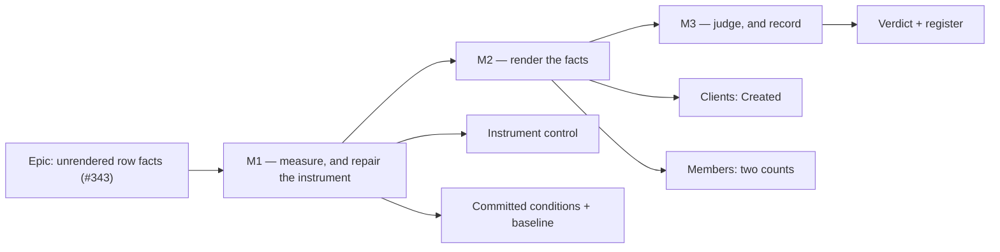

# Implementation Plan: Two screens carry facts they already hold and do not render

- **Feature spec:** [`./feature-spec.md`](./feature-spec.md)
- **Status:** Draft
- **Owner:** unassigned

---

## Breakdown

### Epic

**Unrendered row facts** — close `docs/TECH_DEBT.md` #343 by rendering two facts the product has
already fetched, under a measurement that makes it safe to call done. Maps to no roadmap theme; it
is debt paydown against ADR-0146's own gate pass.

---

## Milestone M1 — Measure, and repair the instrument (ships dark)

**Outcome:** the four falsification conditions are committed, the probe that judges the main one can
refuse a verdict again, and a baseline exists for the two-column Clients table — which nothing in
the repository has ever measured.

**Entry point:** `Ships dark: no product change at all. Its deliverables are a repaired instrument, a
committed conditions file and a committed baseline. M2 surfaces the capability.`

**Journey:** none owed. Nothing user-facing lands (ADR-0081 §1's second branch, taken deliberately).

**The ordering is the milestone.** ADR-0128: the bars are committed in their own commit before the
harness runs, so they cannot be tuned to the answer. ADR-0142 D4: the row's own remedy is a claim
that it will work, and M1 is where that claim is testable rather than approved.

---

#### Feature: the instrument can refuse a verdict again

> **Description:** `measure-column-fit.mjs` refuses a verdict unless it can still see a wrap it
> knows about. Both wraps it names were fixed at page-composition M2, so on today's tree the control
> fails at every width and the only way to get a number is the flag that removes the control.
> **Complexity:** S
> **Dependencies:** none
> **Risks:** the replacement control is fixture-dependent → derive it from a wrap the _fixture_
> guarantees, and assert the fixture produces it, so a green run cannot mean "the fixture changed"
> **Testing requirements:** the probe is run twice — once against today's tree (must report the new
> control) and once with the control's subject artificially widened (must exit non-zero)

##### Task M1-T1 — Give `measure-column-fit.mjs` a control that is true today

- **Description:** replace `KNOWN_WRAPS` with a case that exists on the current tree. The candidate
  is the audit log at **1280**, where `m2-measurement.md:14` records three columns still wrapping
  (`Event`, `By`, `Subject`) — a genuine, declared-`auto`, deliberate wrap in a table that needs
  ~1136px in a ~955px region. Because that case is width-dependent, the control becomes
  width-aware rather than a flat list: at 1280 it demands the audit-log wraps; at 1646 and 1920
  there are legitimately **no** wraps anywhere, so the positive case has to be something else.
- **Complexity:** S
- **Dependencies:** none
- **Risks:**
  - _At 1646 there is no wrap to pin, so the probe has no positive case at the width that matters
    most_ → pin a different property instead: the probe must report a **non-empty set of columns
    with a measurable `natural`** for every named screen, and must throw if any screen yields no
    table. That distinguishes "nothing wraps" from "nothing was measured", which is the whole
    purpose of the original control, and is the property `measure-page-drift.mjs` already got wrong
    once (ADR-0143's rule: a probe that reports a plausible number for the wrong subject is worse
    than one that throws).
  - _The audit fixture's row count varies per run_ (`m8/README.md:20-23`) → the control asserts the
    wrap's **presence**, never a pixel count.
- **Testing:** run the probe at 1280 and confirm it reports the audit-log control; then widen the
  audit log's region (or narrow the viewport further) so the control's subject changes, and confirm
  the probe exits non-zero. **Verify red before trusting green** (ADR-0110 D5).
- **Development steps:**
  1. Replace `KNOWN_WRAPS` with a width-keyed control and a per-screen "something was measured"
     assertion; keep `EXPECT_KNOWN_WRAPS=0` as the documented escape and **state in the docblock
     what it now removes**, which the current one does not.
  2. Record in the docblock that the original control was made false by the fix it was measuring —
     a control retired by success, not by neglect.
  3. Verify red, both ways.

##### Task M1-T2 — Commit the falsification conditions

- **Description:** write `docs/specs/unrendered-row-facts/falsification.md` holding FC-A, FC-B, FC-C
  and FC-D exactly as spec §2.6 states them, including FC-D's refusal of a numeric bar and FC-A's
  withdrawal clause (a `Created` column that cannot fit is **withdrawn**, not declared `auto`).
- **Complexity:** S
- **Dependencies:** none
- **Risks:** _a condition written loosely enough to be reinterpreted at M3 by whoever is trying to
  ship_ → each bar names its instrument, its baseline file and its withdrawal clause, and FC-D's
  prediction (slack ≈ 1012px) is written down **to be falsified**
- **Testing:** n/a — this is the artefact the later tests are judged against
- **Development steps:**
  1. Write the file.
  2. **Commit it alone**, before M1-T3 runs. This commit contains no measurement and no code.

##### Task M1-T3 — Take the baseline

- **Description:** run `shoot` to mint a fixture, then `measure-column-fit.mjs` at 1280/1646/1920
  and `measure-page-drift.mjs` at 1646, against the tree as it stands. Record in `m1/`.
- **Complexity:** S
- **Dependencies:** M1-T1 (the probe must be able to refuse a verdict), M1-T2 (the bars must already
  be committed)
- **Risks:**
  - _Two readings taken in different sittings are not comparable_ (ADR-0143 M7 records this page
    family drifting 555px with no product change) → baseline and after-reading are taken in **one
    sitting** at M3, and M1's baseline is re-taken there if the sittings separate.
  - _`run.sha` records `HEAD`, which may not be the tree served_ (`m8/README.md:6-11`) → the `m1/`
    README states which tree was measured, explicitly.
- **Testing:** the probe's own control must pass; a run under `EXPECT_KNOWN_WRAPS=0` is not
  acceptable evidence
- **Development steps:**
  1. `pnpm --filter @repo/web shoot` for the fixture.
  2. `SLUG=… WIDTH=1646 node scripts/measure-column-fit.mjs`, and at 1280 and 1920.
  3. `SLUG=… WIDTH=1646 node scripts/measure-page-drift.mjs`.
  4. Write `m1/README.md`: the numbers, the tree, the sitting, **and whether the ≈1012px prediction
     held**. A prediction beaten or missed is recorded either way (the `m7-measurement.md:18-22`
     habit) — a prediction that turns out wrong is still a prediction that was wrong.
  5. **Answer CQ-2 from these numbers** and write the answer down: if `Actions` really renders ~401px
     for ~82px of content, declaring it `fit` is a bigger change to this table than the new column
     and belongs in M2-T1; if the reading says otherwise, the option is closed with its reason.

---

## Milestone M2 — Render the facts

**Outcome:** a reader opening Clients sees when each client was created; a reader opening Members
sees how many people are in the organisation and how many invitations are outstanding.

**Entry point:** `/orgs/:orgSlug/clients` — the **`Created` column header** and a date in every row;
and `/orgs/:orgSlug/members` — the number beside the **"Roster"** and **"Pending invitations"**
headings. Nothing is pressed: on both screens the capability is the rendered fact (ADR-0081 §1).

**Journey:** `apps/web/e2e-page-composition/composition.spec.ts` — two new cases (M2-T4), in the
suite that already has a config (`playwright.page-composition.config.ts`) and a CI step
(`ci.yml:619-630`). No new config, no new CI step.

---

#### Feature: Clients states when a client was created

> **Description:** a `Created` column at `width: 'fit'`, with `Name` declared `auto` in the same
> commit, on the table whose `factSpread` is currently `0`.
> **Complexity:** S
> **Dependencies:** M1 (the baseline and CQ-2's answer)
> **Risks:** the new column's width comes out of `Name` rather than out of slack → FC-D clause 2,
> judged at M3, withdrawal clause written
> **Testing requirements:** unit (the column renders, with a real date and never an em dash, for a
> writer **and** for a Viewer); journey (M2-T4); measurement (M3)

##### Task M2-T1 — The `Created` column

- **Description:** add the column between `Name` and `Actions`; declare `Name` as `width: 'auto'`;
  apply CQ-2's answer to `Actions` if M1-T3 supported it.
- **Complexity:** S
- **Dependencies:** M1-T3
- **Risks:**
  - _A `fit` column overflowing 320px_ → `fit` is `md:` upwards by construction
    (`data-table.tsx:74`); FC-B and the existing 320px journey case both cover it.
  - _Declaring `Name` `auto` reads as decoration and gets deleted_ → the docblock carries
    ADR-0146 D3's reason (the exception clause is vacuous unless the default is written down) and
    names `m2-measurement.md:21-25`'s `Outcome` precedent.
  - _CQ-2 applied from precedent rather than from the reading_ → M1-T3 step 5 records the answer
    before this task starts; if the numbers did not support it, the option closes with its reason
    and is not revisited here.
- **Testing:** extend `ClientsTable`'s unit suite — the column is present; its cell renders a
  formatted date and **not** an em dash; it renders for a **Viewer** (`canWrite: false`), which is
  the role for whom the table is currently one column wide.
- **Development steps:**
  1. Add the column with `formatTimestamp(client.createdAt)` and the muted treatment the sibling
     date columns use.
  2. Declare `width: 'auto'` on `Name`, with its reason.
  3. Apply or close CQ-2, citing M1-T3.
  4. Unit cases, including the Viewer case.

---

#### Feature: Members states its counts

> **Description:** `count` on Roster and on Pending invitations — the composition
> `docs/specs/page-composition/feature-spec.md:1101-1102` specifies and neither of which was built.
> **Complexity:** S
> **Dependencies:** CQ-1's answer
> **Risks:** a count that silently becomes "rows loaded" if the roster is ever paginated → CQ-1
> option B puts the count beside the query whose shape makes it honest
> **Testing requirements:** unit (the count renders; it is omitted while pending; `0` renders for
> invitations); journey (M2-T4)

##### Task M2-T2 — Roster's count, and where its card lives

- **Description:** per CQ-1's answer. **Default (option B):** move the `SectionCard` from
  `members.tsx` into `MembersTable`, carrying `title`, `description` and `flush`, and add
  `count={members.data?.length}`. `members.tsx` keeps `PageGrid`/`PageGridItem`.
- **Complexity:** S
- **Dependencies:** CQ-1
- **Risks:**
  - _`archetypes.structural.test.ts` demands `members.tsx` import `SectionCard`_ → checked: it
    asserts the archetype appears in the **set** used across the nine-screen surface, and five other
    files supply it. Re-run the gate rather than trusting this sentence.
  - _`members.composition.test.tsx` stubs `MembersTable`_ → its assertions read the stub's text and
    survive; its **docblock describes the screen's composition** and is updated in the same commit,
    or it becomes the next stale claim this epic exists to find.
  - _The count becomes dishonest under a future paginated roster_ → the docblock states, beside the
    query, that `data.length` is the total **because** `useMembers` is `apiFetchAllPages`
    (`use-members.ts:20-23`) — the sentence `ClientsTable.tsx:186-192` already carries, at the only
    place that can keep it true.
- **Testing:** a unit case that the roster section renders its count; one that the count is **absent**
  while the query is pending (not `0`).
- **Development steps:**
  1. Move the card (or, under option A, call `useMembers` at the route — and record why).
  2. Pass `count`, with the `apiFetchAllPages` reason.
  3. Update `members.composition.test.tsx`'s docblock and assertions as needed.
  4. Run `archetypes.structural.test.ts` and `page-frame.structural.test.ts`.

##### Task M2-T3 — Pending invitations' count, and the stale docblock

- **Description:** `count={invitations.data?.length}` on `InvitationsSection.tsx:144` — genuinely one
  line, since that component owns both its query and its card. In the same commit, correct
  `composition.spec.ts:139-144`, whose docblock says the count "renders `aria-hidden` on purpose"
  and has been contradicted by its own primitive since ADR-0146 M8
  (`section-card.tsx:21-39`, `page-archetypes.test.tsx:433-446`).
- **Complexity:** S
- **Dependencies:** none
- **Risks:** _`0` reads as an error_ → it does not; `0` is "none outstanding", which is the fact the
  reader came for, and `page-archetypes.test.tsx:459-466` already pins the distinction between `0`
  and `undefined`
- **Testing:** a unit case that `0` renders and that `undefined` renders nothing.
- **Development steps:**
  1. Pass the count.
  2. Rewrite the journey docblock to say what is now true, **and say that it was wrong**, rather than
     editing it silently — the correction is the useful part.

##### Task M2-T4 — The journey

- **Description:** two cases in `composition.spec.ts`, modelled on the existing Members `Joined`
  case (`:337-340`), which asserts a columnheader **and** a real date cell rather than an em dash.
- **Complexity:** S
- **Dependencies:** M2-T1, M2-T2, M2-T3
- **Risks:**
  - _An assertion that passes against a skeleton_ → `DataTable`'s loading `<thead>` prints no header
    text and its skeleton rows are visible `<tr>`s, which this file records catching it out twice
    (`:350-356`, `:498-509`). Wait for **settled content** — a named row — before asserting.
  - _A vacuous pass_ → each case asserts on a value (`/\d{4}/` for the date, the literal count),
    never merely on presence.
- **Testing:** this is the test. Run `scripts/e2e-local.sh web:page-composition` locally before
  pushing (CLAUDE.md §19.8) — and run the **base** journey too, because a screen changed
  (ADR-0096's rule, `docs/TESTING.md`).
- **Development steps:**
  1. Case: Clients renders a `Created` columnheader and a date cell matching `/\d{4}/`.
  2. Case: Members' "Roster" and "Pending invitations" regions each state a number beside the
     heading, read as text from the heading's row — the shape the existing clients-count case uses.
  3. Run the suite; run the base journey; run `scripts/e2e-sweep.sh` if any shared primitive moved.

---

## Milestone M3 — Judge, and record

**Outcome:** the four conditions have written verdicts, the register row closes with the numbers
attached, and any refusal is a decision somebody made rather than a gap.

**Entry point:** `Ships dark: no product change. It produces the verdict document and the register
edits.`

**Journey:** none owed.

---

#### Feature: the verdict

> **Description:** re-take the readings and judge FC-A…FC-D against the bars committed at M1-T2.
> **Complexity:** S
> **Dependencies:** M2
> **Risks:** a verdict reached by reinterpreting a bar → the withdrawal clauses are already written;
> softening a bar is not an option, re-arguing one in writing is
> **Testing requirements:** the probe's control must pass on the after-reading too

##### Task M3-T1 — Re-take and judge

- **Description:** run both instruments again, **in one sitting with the baseline** if M1's has
  aged, and write `m3-verdict.md` in the shape of `page-composition/m8-verdict.md`: a table of
  conditions, verdicts and where the evidence is, plus a "what this does **not** claim" section.
- **Complexity:** S
- **Dependencies:** M2
- **Risks:**
  - _Cross-sitting drift read as an effect_ → both readings in one sitting, and the sitting recorded.
  - _A condition with no recorded verdict_ → four of page-composition's nine had none until its last
    milestone; all four here are judged in this task or the milestone is not done.
- **Testing:** n/a
- **Development steps:**
  1. Re-take at 1280/1646/1920 and the drift reading at 1646.
  2. Judge each condition; fire any withdrawal clause **as written** if a bar fails.
  3. Record whether FC-D's ≈1012px prediction held.
  4. State what the verdict does not claim (one fixture, one sitting, one browser).

##### Task M3-T2 — Close the register and record the decisions

- **Description:** close #343 with the numbers; add the `#341` widening note; record in
  `docs/DECISIONS.md` the answers to CQ-1 and CQ-2 and — if either half was refused — **why**,
  because "nothing recorded a decision" is the defect (b) exists to remove.
- **Complexity:** S
- **Dependencies:** M3-T1
- **Risks:** _a row deleted rather than ledgered, or marked with a status the gate's vocabulary does
  not hold_ → `check:debt-status` has a fixed vocabulary and ADR-0138 records a plan instructing a
  status that does not exist in it; follow `docs/TECH_DEBT.md`'s own convention, including the
  `### <number>. <title>` heading form.
- **Testing:** `pnpm check:debt-status`, `pnpm check:counts`, `pnpm prepush`
- **Development steps:**
  1. Close #343 per the register's convention; ledger its number.
  2. Note the #341 increment on that row.
  3. `docs/DECISIONS.md` entries for CQ-1 and CQ-2.
  4. Set this spec's and this plan's `Status` to `Accepted — shipped` (no ADR number; §4.9), and
     confirm `pnpm check:spec-status` agrees with both files.
  5. Consider whether spec §6 finding 3 (CLAUDE.md's ADR-0146 entry carrying ADR-0145's FC-2
     sentence) earns a register row of its own. **Not folded in here** — a shared-document edit at
     the end of an epic is what ADR-0105 exists to stop.

---

## Sequencing & slices

Three milestones, each independently releasable, in this order and not another:

1. **M1 ships dark and must precede M2.** Its baseline is only a baseline while the remedy does not
   exist; taken after M2 it is a measurement of the answer.
2. **M2 is the only milestone with product change**, and it is two independent commits — (a) Clients
   and (b) Members — so either can be reverted without the other. Within (a), the column and CQ-2's
   `Actions` change are separable commits too.
3. **M3 judges and records.**

**`main` stays releasable throughout.** M1 touches one script and adds two documents; M2 is additive
rendering with no request, schema or permission change; M3 is documents.

**No feature flag** (ADR-0088 D1): a `VITE_` constant is inlined at build time and every published
image carries it at its default, so a flag would be a second JSX root rather than a rollback. The
rollback is the commit boundary, which the slicing above is shaped around.

**Specialist agents.**

| Agent                                | When               | Why                                                                                                                                                           |
| ------------------------------------ | ------------------ | ------------------------------------------------------------------------------------------------------------------------------------------------------------- |
| **database-architect**               | **not engaged**    | there is no model, column, index, constraint or migration to design — recorded so it does not read as an oversight (CLAUDE.md §19.3)                          |
| **ux-reviewer**                      | M2, before merge   | both halves originate in a ux finding; the date format and column order are its call                                                                          |
| **accessibility-reviewer**           | M2, before merge   | the count's AT exposure is the reason (b) is worth doing, and `SectionCard`'s M8 change rests on a claim about announcement                                   |
| **component-reviewer**               | M2, only if CQ-1 B | `MembersTable` gains a rendered section; two other reviews of this family have caught a shared-component change applied to one consumer and not its neighbour |
| **test-engineer**                    | M1-T1, optional    | the instrument's replacement control is the subtle part                                                                                                       |
| security / api / backend-performance | **not engaged**    | no endpoint, no query, no guard, no new read                                                                                                                  |

No ADR-0111 review is owed: no primitive's keyboard model changes.

---

## Definition of Done (per task)

Each task's PR must satisfy the Feature Completion Criteria in
[`docs/PROCESS.md`](../../PROCESS.md) — code, tests, docs, security, performance, accessibility,
Docker build, CI, changelog, version impact.

Three additions specific to this epic:

- **A changeset is required for M2** (user-visible change) and **not** for M1 or M3 (instrument and
  documents). ADR-0130 records a release that would have shipped no image carrying its own change
  because a changeset was missed.
- **The pre-push gate is `pnpm prepush`, one command**, plus `scripts/e2e-local.sh web:page-composition`
  and the **base** journey for M2, because a screen changed.
- **Every new assertion is verified red against the defect it names** before it is trusted
  (ADR-0110 D5). That includes M1-T1's repaired control, which is the whole reason that task exists.

---

## Risks & assumptions (rollup)

| Risk / assumption                                                                                    | Likelihood | Impact | Mitigation                                                                                                                                                                                   |
| ---------------------------------------------------------------------------------------------------- | ---------- | ------ | -------------------------------------------------------------------------------------------------------------------------------------------------------------------------------------------- |
| The `Created` column's width comes out of `Name` rather than out of slack                            | low        | med    | FC-D clause 2, with a written withdrawal clause                                                                                                                                              |
| The repaired control is itself wrong, and the probe reports a plausible number for the wrong subject | med        | high   | verify red both ways at M1-T1; the failure mode is a green run about nothing, which this repository records repeatedly                                                                       |
| M1's baseline and M3's reading are taken in different sittings and the drift is read as an effect    | med        | med    | one sitting, recorded; re-take the baseline if they separate                                                                                                                                 |
| CQ-2 gets decided from precedent instead of from the reading                                         | med        | low    | M1-T3 step 5 forces the answer before M2-T1 starts                                                                                                                                           |
| CQ-1 option B breaks a gate nobody checked                                                           | low        | low    | both candidate gates read and named in M2-T2's risks; run them rather than trust the reading                                                                                                 |
| The date format reads badly for a client record (`17 Sep 2026, 14:32`)                               | med        | low    | consistency with three sibling date columns is the stated default; a third date format is the alternative and is refused with its reason                                                     |
| The skeleton/settled reflow (#341) worsens by one column                                             | certain    | low    | stated in the spec rather than discovered later; pre-existing row unchanged                                                                                                                  |
| **Assumption:** `createdAt` is `NOT NULL` for every client row                                       | —          | —      | verified at the DTO (`client-response.dto.ts:31`), which calls `.toISOString()` unconditionally                                                                                              |
| **Assumption:** `useMembers` and `useInvitations` load every page, so `length` is the total          | —          | —      | verified — `use-members.ts:22` and `use-invitations.ts:42` are both `apiFetchAllPages`; the honesty of both counts depends on it, which is why the sentence belongs beside the query (M2-T2) |
| **Assumption:** the journey config and CI step already exist                                         | —          | —      | verified (`playwright.page-composition.config.ts`, `ci.yml:619-630`) — so no ADR-0105 config trigger fires                                                                                   |
