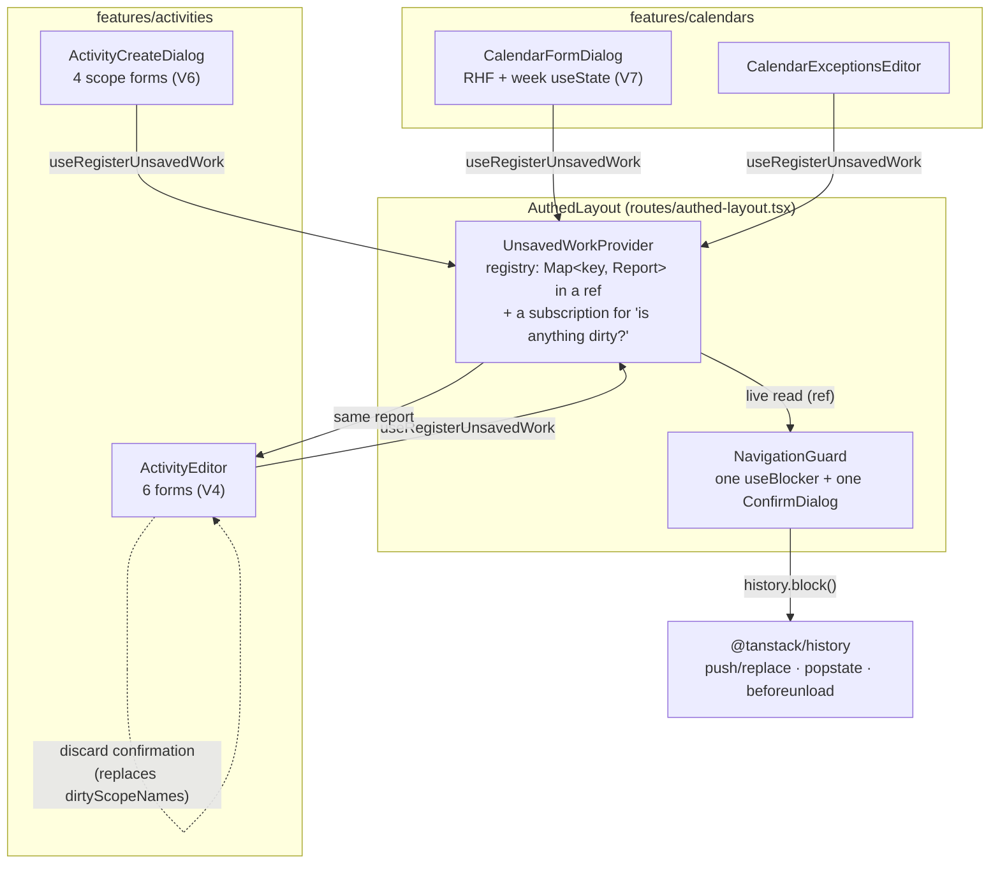
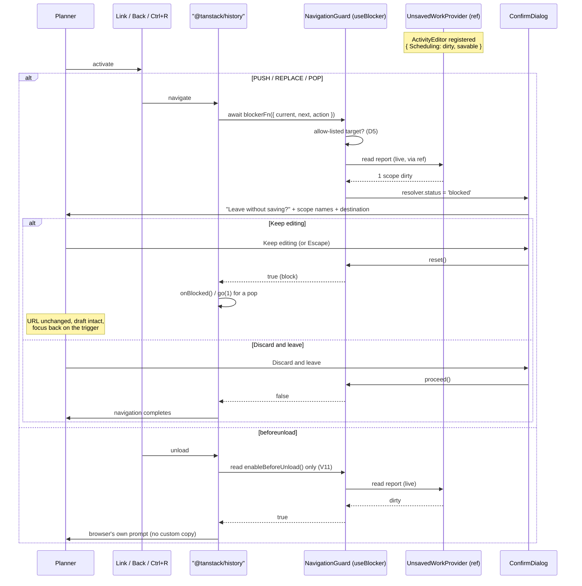
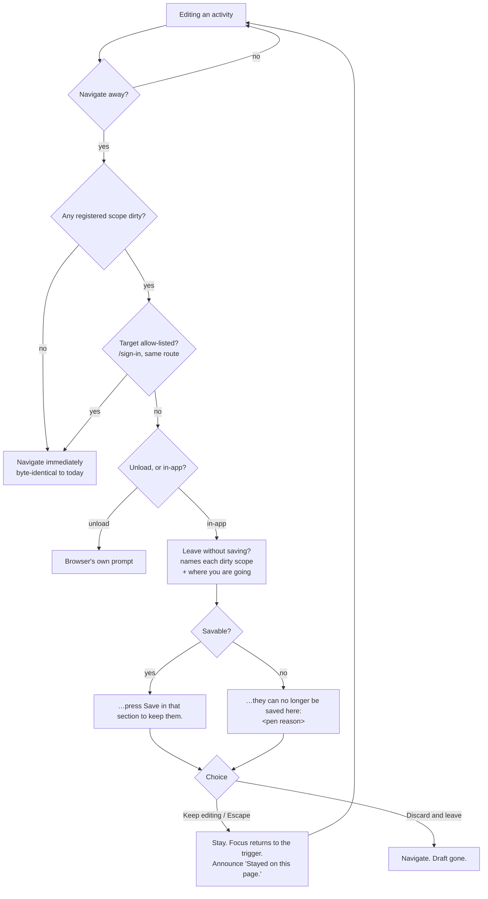

# Feature Spec: The unsaved-work navigation guard

- **Status:** Draft — **awaiting approval before implementation**
- **Author(s):** feature-analyst
- **Date:** 2026-08-23
- **Tracking issue / epic:** —
- **Roadmap link:** `docs/BACKLOG.md` top entry ("The activity editor's docked panel — the part
  ADR-0099 did not close"), the half that is genuinely still owed.
- **Related ADR(s):** builds on ADR-0028 (the pen), ADR-0060 (per-scope save), ADR-0067 (the
  calendar shift editor), ADR-0080 (the Escape ladder), ADR-0082/ADR-0083 (shade with a reason),
  ADR-0088 (no `VITE_` flag), ADR-0099 §Escape (the shell's outermost rung), ADR-0101 (the editor
  is a dialog). **Requires a new ADR** — outline in §4.6.

---

## 0. What was verified, and when

Every claim below that decides something names what established it. Verified 2026-08-23 against
the working tree at `HEAD`.

| #   | Claim                                                                                                                                         | Evidence                                                                                                                                                                                                                                                                                                                                                                                                                   |
| --- | --------------------------------------------------------------------------------------------------------------------------------------------- | -------------------------------------------------------------------------------------------------------------------------------------------------------------------------------------------------------------------------------------------------------------------------------------------------------------------------------------------------------------------------------------------------------------------------- |
| V1  | There is **no** browser-unload handler and **no** router navigation blocker anywhere in the web app.                                          | `Grep beforeunload\|useBlocker\|shouldBlockFn\|blocker -i` over `apps/web/src` → 30 matches, **all** of them the English word "blocker" in prose (`config/env.ts` docblocks, `RecentlyDeletedTable.tsx`'s restore-blocker, `group-deletions.ts`). Zero code matches.                                                                                                                                                       |
| V2  | The activity editor guards discarding **within itself** — close, Escape, backdrop and ✕ all route through one `requestClose`.                 | `ActivityEditorDialog.tsx:373-380` (`requestClose`), `:831` (Close button), `modalShell` at `:912-933` passes `requestClose` as the `Dialog`'s `onClose` **and** sets `confirmBeforeClose`; `dialog.tsx:85-91` cancels the native `cancel` so Escape/backdrop ask; `dialog.tsx:129` shows the ✕ also calls the host's `onClose`.                                                                                           |
| V3  | `confirmBeforeClose` has **exactly one** consumer in the whole app.                                                                           | `Grep confirmBeforeClose` over `apps/web/src` → `dialog.tsx:31,57,89` (the definition) and `ActivityEditorDialog.tsx:76,923` (the only consumer). Every other dialog closes immediately.                                                                                                                                                                                                                                   |
| V4  | The editor holds **six** independently-dirty forms, and its own guard names **three**.                                                        | Six: `general`, `scheduling`, `cost` (`ActivityEditorDialog.tsx:297-304`); `ReportedProgressPanel` (`ActivityProgressPanels.tsx:94-106`), `ValueMeasurePanel` (`:244`), `WeightedStepsPanel` (`:387-397`). Three: `dirtyScopeNames` at `ActivityEditorDialog.tsx:347-351` lists General / Scheduling / Cost only.                                                                                                          |
| V5  | So the editor's own guard already **under-warns**: a dirty Progress panel with clean definition scopes closes on Escape with no confirmation. | `requestClose` (`ActivityEditorDialog.tsx:374-380`) returns `onClose()` when `dirtyScopeNames.length === 0`; the Progress forms are not in that array (V4). Already filed as the second half of `docs/TECH_DEBT.md` **#63**, which says "The discard confirmation on close has the same blind spot — it names General, Scheduling and Cost, never Progress."                                                               |
| V6  | `ActivityCreateDialog` has **no** discard guard at all.                                                                                       | `ActivityCreateDialog.tsx:463-465` passes the host's `onClose` straight to `Dialog`, `:593` on Cancel; no `confirmBeforeClose` (V3). It hosts four scope forms over ~20 fields (`:252` docblock; the field groups are the ADR-0089 shared vocabulary).                                                                                                                                                                     |
| V7  | The calendar shift editor's week is **not** in React Hook Form, so no `formState.isDirty` can see it.                                         | `CalendarFormDialog.tsx:152-156` — `const [week, setWeek] = useState<WeekRows>(emptyWeek)`, with the comment "The shift editor's rows live outside React Hook Form: they are TEXT the planner is mid-way through typing, across seven days". Its RHF form (`:119-129`) holds only name/description/hoursPerDay.                                                                                                            |
| V8  | A gated (read-only) scope **cannot** be dirtied, so a naive `isDirty` guard does **not** over-warn a Viewer.                                  | `deriveActivityEditorGating` returns `writable: false` for a role without `activity:update` (`activity-editor-gating.ts:96`); `FieldGateProvider` publishes that (`field-gate.tsx:38-69`) and ADR-0083 makes a shut field `readOnly`. A `readOnly` input fires no `change`, so RHF never marks the form dirty. **The over-warn risk the brief names is structurally closed; the under-warn risk (V5) is real.**            |
| V9  | The sharp permission case is **pen loss mid-edit**, not role.                                                                                 | `activity-editor-gating.ts:97` — `penManaged && !holdsPen` flips every definition scope to `writable: false`. `docs/TECH_DEBT.md` #64 records this happening under a live session ("the pen can be taken over by another user mid-edit (ADR-0028), which flips every definition field from enabled to disabled under whatever focus the user had"). At that instant the work is **unsaved and unsavable**.                 |
| V10 | One `useBlocker` registration covers **all three** navigation kinds.                                                                          | `@tanstack/react-router@1.170.27` `dist/esm/useBlocker.js:97-100` calls `history.block({ blockerFn, enableBeforeUnload })`. In `@tanstack/history@1.162.1` `dist/esm/index.js`: push/replace at `:24-34`, back/forward/go (popstate) at `:221-238`, `beforeunload` at `:240-262`.                                                                                                                                          |
| V11 | `enableBeforeUnload` accepts a **function**, and the unload path never calls `blockerFn`.                                                     | Type: `useBlocker.d.ts:35` — `enableBeforeUnload?: boolean \| (() => boolean)`. Consumed at `@tanstack/history` `index.js:247-257`: it reads `blocker.enableBeforeUnload`, treats `true` as block, and calls the function form. It does **not** await `blockerFn`. So a blocker registered with the default `true` prompts on **every** reload; the function form is the only way to prompt only when work is outstanding. |
| V12 | A blocked Back is undone with `history.go(1)`.                                                                                                | `@tanstack/history` `index.js:230-233`. This is a real behaviour with a consequence (§2 edge cases E7), not a hypothetical.                                                                                                                                                                                                                                                                                                |
| V13 | `useBlocker`'s effect re-registers whenever `shouldBlockFn` or `enableBeforeUnload` change identity.                                          | `useBlocker.js:101-108` — the dependency array is `[shouldBlockFn, enableBeforeUnload, disabled, withResolver, history, router]`. An inline arrow re-registers every render.                                                                                                                                                                                                                                               |
| V14 | The `beforeunload` listener is attached unconditionally by the history, so we add no listener of our own.                                     | `@tanstack/history` `index.js:297` — `win.addEventListener(beforeUnloadEvent, onBeforeUnload, { capture: true })`, at history construction.                                                                                                                                                                                                                                                                                |
| V15 | The plan's pen is released on `pagehide` and on unmount.                                                                                      | `use-plan-edit-lock.ts:170-183` — a keepalive `fetch` DELETE on `pagehide` and in the effect cleanup. **This does not conflict with an unload prompt**: `pagehide` fires only when the page actually goes away, so a reader who chooses "stay" never releases.                                                                                                                                                             |
| V16 | Two navigations must **never** be blocked, or a dead session traps the reader.                                                                | Sign-out: `account-chip.tsx:172-179` navigates to `/sign-in` **after** `signOut.mutate` succeeds. Session expiry: `app/router.tsx:135-141` — `_authed`'s `beforeLoad` throws `redirect({ to: '/sign-in', … })`.                                                                                                                                                                                                            |
| V17 | The workspace mounts **one** activity editor.                                                                                                 | `Grep "<ActivityEditor"` over `apps/web/src` → one production match, `components/layout/workspace/activity-crud-dialogs.tsx:69`; every other match is a test. `ActivityEditorDialog`'s own docblock at `:880-885` says it has no production caller.                                                                                                                                                                        |
| V18 | The shell already owns an Escape ladder whose outermost rung defers to `defaultPrevented`.                                                    | `app-shell.tsx:343-368`, esp. `:368` — `if (event.key !== 'Escape' \|\| event.defaultPrevented \|\| !drawerVisible) return;`, with the comment at `:362` that a native `<dialog>` closes on Escape and the keydown still bubbles.                                                                                                                                                                                          |
| V19 | Nothing in this app moves focus on a route change.                                                                                            | No `focus()`, `useRouterState` or skip-link handling in `routes/authed-layout.tsx` (`Grep skip-link\|SkipLink\|focus\(\)\|useRouterState` → no matches). Focus after **any** completed navigation is whatever the browser leaves it as. This is pre-existing and is **not** made worse by this feature; see §2 E9 and the debt row proposed in §4.7.                                                                       |

**One thing this spec has NOT verified and must not assert.** Whether a `redirect()` thrown from a
route's `beforeLoad` reaches `history.block` at all, or is issued with `ignoreBlocker: true`. The
only `ignoreBlocker: true` found in the installed router is `Transitioner.js:44-48` (a replace of the
current location), and `link.js:302` threads the option from `Link`. **The redirect path was not
traced.** This is M0-T1's job. The design is safe either way, because V16's two targets are
allow-listed by the blocker itself (D5) — but the claim is recorded as open rather than guessed
(ADR-0076 Class 3).

---

## 1. Business understanding

### Problem

A planner can spend several minutes filling in an activity — twenty-odd fields across four write
scopes, a duration in `2d 4h` grammar, a constraint, a WBS parent, a cost — or building a
seven-day shift pattern by hand (ADR-0067), and then lose all of it to a single keystroke that has
nothing to do with the form: `Ctrl+R`, `Alt+←`, a mouse-4 Back click, a click on the Project
Explorer rail behind the dialog's backdrop, or closing the tab.

The editor is careful about exactly one of the ways this can happen — its own close path (V2) — and
the product is careless about every other one (V1). That asymmetry is not a decision anybody made;
it is where the work stopped. ADR-0060 M6 added the discard confirmation, ADR-0099 M10 fixed the
focus defects around it, and ADR-0101 moved the editor back to a modal. None of them touched
navigation, because none of them was about navigation.

**Two of the exposures are worth naming precisely, because they are not the same problem.**

1. **Outside the editor's close path there is nothing.** A modal `<dialog>` blocks the canvas; it
   blocks _nothing_ about browser Back/Forward, tab close, or reload. Those are browser-level and
   history-level events, and the app has never registered anything on either channel (V1).
2. **Inside the editor's close path the guard is already incomplete.** `dirtyScopeNames` names three
   of six forms (V4/V5). Edit a weighted step, press Escape, and the editor closes silently — the
   guard exists, it is on the right control, and it does not see half its own subject. That is filed
   as `docs/TECH_DEBT.md` #63 and it is not a separate feature: any honest answer to "is there
   unsaved work?" has to enumerate all six, and once it does, #63's second half closes on the way
   past.

**Why now.** `docs/BACKLOG.md`'s top entry was corrected on 2026-08-23 to say precisely this, after
its stated reason ("a drawer does not block the canvas behind it") was found stale — ADR-0101 had
returned the editor to `modalShell` two days earlier and `registerDrawerSubject` has zero production
callers (`docs/TECH_DEBT.md` #156). The correction narrowed the claim and left the exposure intact.

### Users

All of them, on the plan workspace and the calendar library. Mapped to the ADR-0016 roles:

| Role                       | Can produce unsaved work                                                                                           | Where                                                                |
| -------------------------- | ------------------------------------------------------------------------------------------------------------------ | -------------------------------------------------------------------- |
| **Org Admin**, **Planner** | Yes — every scope, when holding the pen (ADR-0028)                                                                 | Activity editor, activity create, calendar form, calendar exceptions |
| **Contributor**            | Yes — **progress only**, and deliberately without the pen (ADR-0028 Q-C, `activity-editor-gating.ts:110-113`)      | The activity editor's Progress tab                                   |
| **Viewer**                 | No — every scope is `readOnly`, so nothing can be dirtied (V8)                                                     | —                                                                    |
| **External Guest**         | No — `/share` is read-only by construction (ADR-0051) and is not under `_authed` at all (`app/router.tsx:377-392`) | —                                                                    |

The Contributor row is the reason this cannot be one boolean. A Contributor's dirty Progress form is
real unsaved work that a pen-based "can this person edit?" test answers _no_ to.

### Primary use cases

1. A planner half-way through creating or editing an activity presses **Back** (or a nav link, or
   the browser reload) and is asked before the draft goes.
2. The same planner closes the tab, or reloads, and the browser asks.
3. A **Contributor** half-way through a progress report gets the same protection — the editor's
   existing close confirmation names their tab, which today it does not (V5).
4. A planner who has had the **pen taken from them** mid-edit is told the truth: the work is unsaved
   _and_ can no longer be saved here.
5. A planner who genuinely wants to leave does so in two presses, and is never asked when there is
   nothing to lose.

### User journeys

**Happy path (in-app navigation).** Planner opens **Edit** on an activity → types into Scheduling →
clicks a plan in the Project Explorer → an alert dialog says which sections have unsaved changes and
where they are going → **Keep editing** returns them, focus back on the link they pressed →
they press **Save scheduling** → click the same plan → no dialog, navigation proceeds.

**Browser Back.** Same, but the dialog is raised by a `popstate` the app cancels with
`history.go(1)` (V12). "Keep editing" leaves the URL where it was.

**Reload / tab close.** The browser's own generic prompt. No custom copy is possible and none is
attempted (§4.4).

**Nothing to lose.** Any navigation with every registered form clean is byte-identical to today: no
dialog, no unload prompt, no extra render.

### Expected outcomes

- A draft is never destroyed by a navigation the planner did not connect to the form.
- The editor's discard confirmation becomes truthful about its own contents (closes #63's second
  half).
- The product gains **one** answer to "is there unsaved work?", in one place, that both the
  in-editor confirmation and the navigation guard read — rather than two lists that would drift.
  This is the ADR-0093 / ADR-0094 lesson applied before the second copy exists rather than after.

### Success criteria

1. With any registered surface dirty, each of these raises exactly one prompt and, on refusal,
   leaves the reader where they were with the draft intact: an in-app link, browser Back, browser
   Forward, `Ctrl+R`, and closing the tab. Proved by a flag-on Playwright journey against a real
   API with the pen enforced — the only place this is testable at all (V11/V12 are browser
   behaviours; jsdom has no history blocker and no `beforeunload` semantics).
2. With every registered surface clean, **zero** prompts on the same five actions. Asserted
   explicitly, because an over-warning guard is the failure mode that gets a guard deleted.
3. Sign-out and a session-expiry redirect are **never** blocked (V16), asserted directly.
4. The editor's confirmation names all six of its forms (V4), asserted per form.
5. No focus lands on `<body>` at any point in the blocked/kept/left cycle. This register records
   three shipped instances of exactly that defect at exactly this seam (ADR-0063 M6, ADR-0092,
   ADR-0099 M10), so it is a success criterion rather than a review note.

### Open questions

See §6. Three are **critical**; everything else has a stated default.

---

## 2. Functional requirements

### User stories & acceptance criteria

> **US-1** — As a **Planner**, I want to be warned before an in-app navigation discards my unsaved
> activity edits, so that a stray click does not cost me ten minutes.
>
> **Acceptance criteria**
>
> - **Given** the activity editor is open with unsaved changes in Scheduling, **when** I activate a
>   Project Explorer link, **then** an `alertdialog` appears naming _Scheduling_ and the destination,
>   and the URL has not changed.
> - **Given** that dialog, **when** I choose **Keep editing**, **then** the dialog closes, the URL is
>   unchanged, my typed value is still in the field, and focus is on the link I activated.
> - **Given** that dialog, **when** I choose **Discard and leave**, **then** the navigation completes
>   and the editor is gone.
> - **Given** the editor is open and **clean**, **when** I activate the same link, **then** no dialog
>   appears and the navigation completes immediately.

> **US-2** — As a **Planner**, I want the same warning for browser Back/Forward, so that the one
> gesture most likely to be reflexive is covered.
>
> - **Given** unsaved work, **when** I press browser Back, **then** the same dialog appears and the
>   document URL is the plan I was on.
> - **Given** I choose **Keep editing**, **then** the URL is still the plan and a subsequent Back
>   with clean forms goes to the previous entry (i.e. the history stack is not corrupted — see E7).

> **US-3** — As a **Planner**, I want the browser to ask before a reload or a tab close, so that
> `Ctrl+R` is not fatal.
>
> - **Given** unsaved work, **when** the page unloads, **then** the browser's native confirmation is
>   raised.
> - **Given** no unsaved work, **when** the page unloads, **then** **no** prompt is raised. (This is
>   the criterion that forces `enableBeforeUnload`'s function form — V11.)
> - The prompt carries the browser's own wording. We neither attempt nor claim custom copy (§4.4).

> **US-4** — As a **Contributor**, I want my unsaved progress report to count as unsaved work, so
> that the protection follows the capability I actually have rather than the pen I do not.
>
> - **Given** I hold no pen and have typed a percent complete, **when** I press Escape on the editor,
>   **then** the discard confirmation appears and names _Reported progress_.
> - **Given** the same, **when** I navigate away, **then** the guard fires.
> - **Given** the same, **then** the confirmation does **not** name General/Scheduling/Cost, which I
>   cannot edit and have not touched.

> **US-5** — As a **Planner whose pen was taken mid-edit**, I want to be told my work cannot be
> saved here, so that I can copy it out rather than discover the loss by pressing a dead Save.
>
> - **Given** my definition scopes are dirty and `gating.general.writable` has gone false (V9),
>   **when** I navigate away, **then** the dialog appears and its description says the changes can no
>   longer be saved on this plan, naming why (the pen reason already computed by `penReason`).
> - The dialog still offers **Keep editing** — the reader may want to select and copy the text.

> **US-6** — As any planner, I want the guard to be silent when there is nothing to lose, so that it
> does not become the thing I click through without reading.
>
> - No prompt of any kind when every registered report is empty. Asserted for all five actions.

> **US-7** — As any user, I want sign-out and a session-expiry redirect to be immediate, so that I am
> never held on a page whose session is gone.
>
> - **Given** unsaved work, **when** I press **Sign out**, **then** no guard dialog appears and I land
>   on `/sign-in`.
> - **Given** unsaved work and an expired session, **when** the `_authed` guard redirects, **then** it
>   is not blocked.

> **US-8** — As a keyboard or screen-reader user, I want the guard to behave like every other
> confirmation in this product.
>
> - The dialog is `role="alertdialog"`, focus moves into it on open, Escape means **Keep editing**,
>   and the Escape does **not** also collapse the context drawer (V18).
> - Focus after **Keep editing** is the control that triggered the navigation.
> - The outcome is announced through the shared polite live region (`useAnnounce`,
>   `components/ui/announcer.tsx:33`).

### Workflows

**W1 — in-app navigation with unsaved work**

1. A `Link`, `navigate()` or `router.history.push` issues a PUSH/REPLACE.
2. `@tanstack/history` sees a registered blocker and awaits `blockerFn` (`index.js:24-34`).
3. `shouldBlockFn` checks the allow-list (D5) and the live registry (D3).
4. Blocked → the resolver sets `status: 'blocked'` and the guard renders its `ConfirmDialog`.
5. **Keep editing** → `reset()` → the navigation is abandoned, `onBlocked` restores the location
   (`index.js:290-292`).
6. **Discard and leave** → `proceed()` → the navigation completes; the registrants unmount and
   deregister.

**W2 — Back/Forward** — identical from step 3, except the history has already popped and undoes it
with `go(1)` on a block (`index.js:230-233`).

**W3 — unload** — `onBeforeUnload` reads `enableBeforeUnload` (never `blockerFn` — V11); our function
returns "is anything dirty?"; a `true` triggers `preventDefault()` + `returnValue = ''`
(`index.js:258-261`) and the browser shows its own prompt.

**W4 — the editor's own close** — unchanged in mechanism (V2); the only change is that
`dirtyScopeNames` is replaced by the same report the guard reads, so it now covers six forms.

### Edge cases

| #   | Case                                                                                                                           | Expected behaviour                                                                                                                                                                                                                                              |
| --- | ------------------------------------------------------------------------------------------------------------------------------ | --------------------------------------------------------------------------------------------------------------------------------------------------------------------------------------------------------------------------------------------------------------- |
| E1  | Two registrants dirty at once (editor open over a dirty calendar dialog — not currently reachable, but the registry allows it) | One dialog, listing both surfaces' scopes, grouped by surface label. The registry is a map, not a single slot, for exactly this.                                                                                                                                |
| E2  | A save is **in flight** when the navigation is attempted                                                                       | Block, and say so: the dialog's confirm is `pending` while a registered mutation is pending (the `ConfirmDialog` already supports `pending`/`pendingLabel`, `confirm-dialog.tsx:20-21`). It must not proceed underneath an in-flight write.                     |
| E3  | The form becomes clean **while the dialog is open** (a background save resolves)                                               | The dialog closes itself and the navigation proceeds. Otherwise the reader is asked about work that no longer exists.                                                                                                                                           |
| E4  | The registrant unmounts while the dialog is open                                                                               | Same as E3 — the registry empties, the dialog closes, navigation proceeds.                                                                                                                                                                                      |
| E5  | Navigation to the **same** route (a search-param change — e.g. `?view=gantt`, `app/router.tsx:303`)                            | **Not blocked.** The editor survives a search-param change; blocking a view toggle for a form that is still on screen afterwards is pure noise. Discriminated on `next.fullPath === current.fullPath`.                                                          |
| E6  | The reader presses Back twice quickly                                                                                          | The second pop arrives while the first dialog is open. The blocker is re-entered; the resolver is single-slot, so the second must not orphan the first's promise. Handled by refusing to open a second dialog while one is blocked (return `true` immediately). |
| E7  | History-stack integrity after a refused Back                                                                                   | A refused Back is undone with `go(1)` (V12), which pushes the reader forward to where they were. The stack length is unchanged. **This is library behaviour, not ours** — it is listed so the journey asserts it rather than discovering it.                    |
| E8  | The pen is lost while the dialog is open                                                                                       | The description re-derives from the live report, so it updates in place from "unsaved" to "unsaved and no longer savable". No second dialog.                                                                                                                    |
| E9  | Focus after **Discard and leave**                                                                                              | The tree unmounts; focus goes wherever a completed navigation leaves it, which in this app is `<body>` for **every** navigation today (V19). This feature does not regress it and does not fix it; §4.7 files it.                                               |
| E10 | `beforeunload` during an automated test                                                                                        | Playwright must handle the native dialog explicitly. The journey states this rather than being surprised by a hang.                                                                                                                                             |
| E11 | The reader is on a **narrow** viewport where the editor is the modal and the drawer is hidden                                  | No difference: the guard is registered by the editor, not by the chrome.                                                                                                                                                                                        |
| E12 | An import navigates to a freshly created plan (`ImportScheduleDialog.tsx:166`)                                                 | Blocked like any other navigation if something is dirty. Correct: the import already succeeded, so nothing is lost by asking.                                                                                                                                   |

### Permissions

**This feature grants and removes nothing.** It reads state that already exists and shows a dialog.
There is no new API call, no new permission, and no server change — so RBAC and organisation scoping
(ADR-0012/ADR-0016) are untouched by construction.

Two role facts nevertheless shape the design and are asserted:

- A **Viewer** cannot produce unsaved work (V8), so the guard is structurally silent for them. There
  is no need for a role check in the guard, and adding one would be a second answer to a question
  the field gate already answers.
- A **Contributor** can (US-4), without the pen. So the report's unit is the **write scope**, never
  "can this person edit the plan".

### Validation rules

None. No input is collected. The one derived value with a rule is the report:

- `UnsavedScope.label` is a **human-facing** name matching the tab or section it belongs to
  (`General`, `Scheduling`, `Cost`, `Reported progress`, `How value is measured`, `Weighted steps`,
  `Working hours`, `Exceptions`, …). It is the same string the tab strip shows, sourced from one
  place per surface so the dialog and the tab cannot disagree.
- `UnsavedScope.savable` is `gate.writable` for that scope, read live (V9).

### Error scenarios

| Scenario                                                                            | Detection                                                                                                   | User-facing result                                                                                             | Status       |
| ----------------------------------------------------------------------------------- | ----------------------------------------------------------------------------------------------------------- | -------------------------------------------------------------------------------------------------------------- | ------------ |
| A registrant throws while computing its report                                      | The provider wraps each report read                                                                         | Treat as **dirty** and block. Failing open would silently discard work; failing closed costs one extra dialog. | n/a (client) |
| The blocker is registered but the router's history is a memory history (tests, SSR) | `createMemoryHistory` has blockers but no `beforeunload` (`@tanstack/history` `index.js:335-343` vs `:297`) | In-app blocking works, unload does not. Documented; the unload half is journey-only.                           | n/a          |
| Two dialogs would open at once (E6)                                                 | Guard's own re-entry check                                                                                  | Second navigation is refused silently.                                                                         | n/a          |
| The reader's browser ignores `beforeunload` (no interaction yet)                    | Platform                                                                                                    | Nothing we can do; noted in §4.4 as a stated limit rather than a claim of coverage.                            | n/a          |

---

## 3. Technical analysis

| Area           | Impact   | Notes                                                                                                                                                                                                                                                                                      |
| -------------- | -------- | ------------------------------------------------------------------------------------------------------------------------------------------------------------------------------------------------------------------------------------------------------------------------------------------ |
| Frontend       | **high** | One new provider + hook in `components/layout/`, one new guard component, one new shared type; six call sites in `features/activities`, one in `features/calendars`. No new route.                                                                                                         |
| Backend        | **none** | No endpoint is added, changed or called.                                                                                                                                                                                                                                                   |
| Database       | **none** | No model, column, index or migration. `database-architect` is therefore **not** engaged — because there is no schema change to design, not because one was judged too small (the ADR-0091 phrasing).                                                                                       |
| API            | **none** | No DTO, no OpenAPI change.                                                                                                                                                                                                                                                                 |
| Security       | **none** | No new trust boundary. The guard is presentational; the API remains the sole authority. Worth stating explicitly: a guard that _prevented_ a navigation could not be used to bypass anything, since it only ever declines to change the URL.                                               |
| Performance    | **low**  | One blocker registration for the lifetime of `_authed` (D3), read through a ref so it never re-registers (V13). No per-keystroke work beyond what RHF already does.                                                                                                                        |
| Infrastructure | **low**  | One new Playwright config + one CI step (`playwright.unsaved-work.config.ts`). This is an ADR-0105 trigger and is why this spec exists.                                                                                                                                                    |
| Observability  | **none** | No logs, metrics or traces. A blocked navigation is not an event worth recording.                                                                                                                                                                                                          |
| Testing        | **high** | Unit (the report derivation, the allow-list, the registry), component (the editor's six-form report, the dialog's copy and focus), and a **flag-on-shaped journey** — required by ADR-0081 §2 on the first user-facing milestone, and the only instrument that can see V10/V11/V12 at all. |

### The CPM engine

**Not imported.** This feature touches `apps/web/src` only, adds no scheduling input, and runs no
migration — so the ADR-0034 recalculation parity gate is untouched by construction, in its honest
form: there is nothing here to hold parity for.

### Feature flag

**None** (ADR-0088 D1). A `VITE_` constant is inlined at build time, `apps/web/Dockerfile` declares
one `VITE_` build arg and `docker-publish.yml` passes none, so a flag here would not be an operator
rollback — and this adds no alternative surface (ADR-0088's Class A discriminator), so there is
nothing for a flag-off branch to be a second product of. The rollback is a commit boundary, and the
plan sequences the milestones so that each is independently revertible.

### Dependencies

- **`@tanstack/react-router@1.170.27`** and **`@tanstack/history@1.162.1`** — already installed;
  no version change. `useBlocker` is exported from the package's public entry
  (`useBlocker.js:131`).
- **ADR-0076 registration.** Nine of the citations in §0 are into `better-auth`-class territory —
  they are claims about a dependency's internals, and V10–V14 are load-bearing. They must be added
  to `scripts/dependency-claims.json` (package + path + line range + anchor) or `pnpm check:claims`
  will not protect them, and a Dependabot bump of either package will move them silently. This is a
  task in the plan, not a note.
- **`docs/TECH_DEBT.md` #63** closes as a by-product of M2. **#64** (native `disabled` on fields) is
  adjacent and stays open — this feature does not touch field primitives.
- Nothing must land first.

---

## 4. Solution design

### 4.1 Architecture overview

One registry, one blocker, two consumers of one report.



The load-bearing shape is the arrow from `P` back into `E`. **The editor's own discard confirmation
and the navigation guard read the same report.** This register has recorded, three times in three
weeks, that two implementations of one rule drift and the drift is invisible because each looks
right alone (ADR-0065 `routeOrthogonal`, ADR-0093 the duplicated `progress` item, ADR-0094 the two
conflict predicates). Writing a second "what is dirty?" list for the guard is that defect with the
ink still wet.

### 4.2 Data flow



### 4.3 User flow



### 4.4 The two mechanisms, and which covers what

The brief asks this to be decided rather than assumed. It is decided as follows.

| Case                                          | Mechanism                                            | Can we show our own copy?                                           | Coverage                                                                                                         |
| --------------------------------------------- | ---------------------------------------------------- | ------------------------------------------------------------------- | ---------------------------------------------------------------------------------------------------------------- |
| In-app `Link` / `navigate()` / `history.push` | `blockerFn` (V10, `index.js:24-34`)                  | **Yes** — our `ConfirmDialog`                                       | Full                                                                                                             |
| Browser **Back / Forward / Go**               | `blockerFn` via `popstate` (V10, `index.js:221-238`) | **Yes** — same dialog                                               | Full, with the `go(1)` undo (V12, E7)                                                                            |
| **Reload / tab close / window close**         | `enableBeforeUnload` (V11, `index.js:240-262`)       | **No** — the browser's generic string; the spec forbids custom text | Best-effort                                                                                                      |
| **Hard `window.location` assignment**         | none                                                 | —                                                                   | **Not covered.** No such assignment exists in `apps/web/src` today; if one is added, the guard is silent for it. |

Three consequences are stated rather than left implicit:

1. **These are one registration, not two mechanisms bolted together** (V10). That matters because
   two registrations would have two ideas of "dirty" and could disagree — the same defect §4.1
   describes.
2. **`enableBeforeUnload` must be the function form or the guard over-warns catastrophically** (V11):
   the unload path never consults `blockerFn`, so a blocker registered with the default `true`
   prompts on **every** reload including a clean one. This is the single most likely way to ship
   this feature broken, and it fails in the direction users notice least charitably.
3. **`beforeunload` is ignored without prior user interaction** (a browser rule, not ours). We do
   not claim reload coverage for a page the reader has not touched. Since producing unsaved work
   _is_ interaction, this limit does not bite in practice — but it is stated so nobody later reads
   "reload is covered" as unconditional.

### 4.5 Design decisions

**D1 — The unit is the write scope, not the surface, and not a boolean.**
`ActivitySummary`-shaped forms carry four definition scopes and three progress panels with three
different permission rules (`activity-editor-gating.ts:16-23`). A boolean would have to pick one and
would be wrong for the others: pen-based over-warns a Contributor's progress edit into invisibility
(it would say "nothing dirty" when there is), role-based collapses the pen-loss case (V9). So:

```ts
interface UnsavedScope {
  /** Stable identity, for tests and for de-duplication. */
  key: string;
  /** The tab or section name the reader sees. Sourced once per surface. */
  label: string;
  /** Can this still be saved right now? False after a pen take-over (V9). */
  savable: boolean;
}
interface UnsavedWorkReport {
  /** The surface, for grouping when two are dirty (E1). */
  label: string;
  scopes: UnsavedScope[];
}
```

**D2 — The editor's existing confirmation is re-pointed at the report, not duplicated.**
`dirtyScopeNames` (`ActivityEditorDialog.tsx:347-351`) becomes a derivation of the same report. Two
consequences: the confirmation gains the three Progress forms, which closes `docs/TECH_DEBT.md`
#63's second half; and a structural test can assert that the guard and the confirmation read one
value, so the two can never name different scopes.

**D3 — Register once, read live.** `useBlocker`'s effect re-registers whenever `shouldBlockFn` or
`enableBeforeUnload` change identity (V13). Both are therefore **stable callbacks reading a ref**,
so the blocker is registered exactly once for the life of `_authed` and never re-registered by a
keystroke. The alternative — recompute the callbacks from state — re-registers the blocker on every
render of a form, which is both wasteful and a race: the `history.block` unsubscribe/subscribe pair
is not atomic with an in-flight navigation.

The registry is therefore a `useRef<Map<string, UnsavedWorkReport>>` plus a small subscription so
the guard's _dialog_ can re-render (E3/E8 need the description to follow live state). The ref is
what the blocker reads; the subscription is only for rendering.

**D4 — The provider lives in `AuthedLayout`, and the guard is one component.**
One blocker, mounted above `<Outlet/>`, so a registrant in any feature tree is covered without any
of them importing the router. Registrants call `useRegisterUnsavedWork(key, report)` and know
nothing about navigation — which is what lets `features/calendars` participate without importing
`features/activities` or the workspace.

**D5 — An allow-list on the target, because two navigations must never be blocked.**
`shouldBlockFn` receives `next.routeId` / `next.fullPath` (`useBlocker.js:59-65`). Sign-out
(`account-chip.tsx:172-179`) and the `_authed` session redirect (`app/router.tsx:135-141`) both go
to `/sign-in`, **after** the session is already gone (V16). Blocking either strands the reader on a
page whose every request will 401, with a dialog offering to keep editing work that can no longer be
saved by anyone. So `/sign-in` is allow-listed, and so is a navigation whose `fullPath` equals the
current one (E5 — a `?view=` toggle is not leaving).

This also makes the one unverified claim in §0 **not load-bearing**: whether or not a `beforeLoad`
redirect reaches the blocker, its target is allow-listed either way. M0-T1 still measures it,
because a design that is safe by accident is one refactor from unsafe.

**D6 — Blocked means blocked, including during an in-flight save (E2).** The confirm button goes
`pending` rather than the dialog proceeding underneath a write. `ConfirmDialog` already supports
this and already uses `aria-disabled` rather than native `disabled` so the button keeps focus
(`confirm-dialog.tsx:59-71`) — which is the ADR-0060 M6 lesson, and the reason not to hand-roll a
dialog here.

**D7 — Escape means Keep editing, and must not reach the shell.** `ConfirmDialog` → `Dialog` is a
native modal `<dialog>`, so Escape fires `cancel` → `onClose` → `reset()`. The shell's Escape rung
defers to `defaultPrevented` (V18, `app-shell.tsx:368`), and `Dialog` already cancels the native
event for `confirmBeforeClose` consumers (`dialog.tsx:89`) — but this dialog is **not** one of those,
so the interaction has to be asserted rather than assumed. A test pins that a guard Escape does not
collapse the context drawer.

**D8 — Which surfaces register: a stated rule, then a list.**
The rule: **a surface registers when a reasonable planner could have spent more than a few seconds
producing state the server has never seen and cannot re-derive from anything on screen.** Applied:

_Registers (M2/M4):_

| Surface                    | Why                                                              | Evidence                           |
| -------------------------- | ---------------------------------------------------------------- | ---------------------------------- |
| `ActivityEditor`           | six forms, four permission rules, minutes of work                | V4                                 |
| `ActivityCreateDialog`     | four scope forms, ~20 fields, **no guard at all today**          | V6                                 |
| `CalendarFormDialog`       | a hand-built seven-day shift pattern, held outside RHF           | V7                                 |
| `CalendarExceptionsEditor` | a dated-exception list on the same `WindowListEditor` (ADR-0067) | `CalendarExceptionsEditor.tsx:313` |

_Does not register (default; §6 Q1 can change this):_ `NoteComposer`/`NoteItem`, `AddLinkSection`,
`EditDependencyDialog`, `InviteMemberDialog`, `CreateBaselineDialog`, `ShareLinksDialog`,
`AddCrossPlanLinkDialog`, `ClientFormDialog`/`ProjectFormDialog`/`PlanFormDialog`,
`ResourceFormDialog`, `ActivityResourcesPanel`'s assign form, `CreateOrganizationForm`, the auth
forms, and the Gantt's single open cell (`use-gantt-grid-editing.ts`). Each is one to three fields;
the interruption costs more than the retype, and a guard that fires for a half-typed note is how a
guard becomes a thing people dismiss without reading.

**D9 — The classification is a gate, not a convention** _(recommended; §6 Q3)_.
A structural test enumerates every `Dialog` consumer holding an RHF form and asserts each is in
exactly one of two lists — registered, or explicitly declared unguarded with a reason string. This
is the ADR-0073 route-census pattern and the ADR-0089 field-partition pattern: it catches what a
per-surface suite structurally cannot, which is a **new** surface belonging to neither list. Without
it, D8's rule degrades to a judgement each author makes alone, which is the shape ADR-0064 §7,
ADR-0067 M4, ADR-0092 and ADR-0099 M5 each record shipping.

### 4.6 The ADR

**Required.** This introduces a cross-cutting registration mechanism, a router-level gate, and a
standing rule about which surfaces participate — all three are architecturally significant. Proposed
outline:

> **ADR-0108 — Unsaved work is a report, and the navigation guard reads it.**
> _(Number provisional: 0107 is the highest filed today. ADR-0079 records taking a number that was
> claimed between plan and landing, and ADR-0071 records the cost of noticing a collision and
> stepping over it. Confirm at filing time.)_
>
> - **Context** — V1 (nothing exists), V4/V5 (the editor's own guard names three of six), V6/V7
>   (two more surfaces with no guard at all), V8/V9 (the permission model is per-scope and the sharp
>   case is pen loss, not role).
> - **Decision 1** — The unit is the **write scope**, carrying `savable`. A boolean cannot express
>   ADR-0060's per-scope save and would be wrong for a Contributor.
> - **Decision 2** — **One report, two consumers.** The in-dialog confirmation and the navigation
>   guard read the same value; a structural test asserts it.
> - **Decision 3** — **One `useBlocker` covers all three channels** (V10), with
>   `enableBeforeUnload` as a **function** (V11) — the difference between "asks when there is
>   something to lose" and "asks on every reload forever".
> - **Decision 4** — **Register once, read live** (V13).
> - **Decision 5** — **An allow-list on the target** (V16); a guard that can strand a dead session
>   is worse than no guard.
> - **Decision 6** — **Which surfaces register**, as a rule plus a gate (D8/D9).
> - **Rejected** — a hand-rolled `beforeunload` listener (would be a second, disagreeing source of
>   truth, and duplicates one the history already attaches at `index.js:297`); a `VITE_` flag
>   (ADR-0088 D1); an autosave (a different feature with a schema question behind it, and it does
>   not remove the need for a guard — an in-flight autosave is still unsaved work).
> - **Consequences** — closes `docs/TECH_DEBT.md` #63's second half; adds a Playwright config and a
>   CI step; leaves #64 and E9's route-focus gap open, both named.

### 4.7 Database, API and component changes

**Database:** none. **API:** none.

**Component changes** (all under `apps/web/src`):

| Path                                                               | Change                                                                                                  | States                                                                   |
| ------------------------------------------------------------------ | ------------------------------------------------------------------------------------------------------- | ------------------------------------------------------------------------ |
| `lib/unsaved-work/report.ts` _(new)_                               | `UnsavedScope`, `UnsavedWorkReport`, and the pure derivations (`isDirty`, `describe`, `groupBySurface`) | pure                                                                     |
| `components/layout/unsaved-work/unsaved-work-provider.tsx` _(new)_ | registry (ref + subscription), `useRegisterUnsavedWork`                                                 | —                                                                        |
| `components/layout/unsaved-work/navigation-guard.tsx` _(new)_      | one `useBlocker`, the allow-list, one `ConfirmDialog`                                                   | idle / blocked / blocked-and-pending (E2) / blocked-and-unsavable (US-5) |
| `routes/authed-layout.tsx`                                         | mount the provider + guard above `<Outlet/>`                                                            | —                                                                        |
| `features/activities/components/ActivityEditorDialog.tsx`          | build the six-scope report; `dirtyScopeNames` derives from it                                           | unchanged visually except the confirmation now names Progress scopes     |
| `features/activities/components/ActivityProgressPanels.tsx`        | lift the three panels' `isDirty` to the host (also the mechanism #63 asks for)                          | —                                                                        |
| `features/activities/components/ActivityCreateDialog.tsx`          | register; **and gain the in-dialog discard confirmation it has never had** (V6)                         | new confirm-on-close                                                     |
| `features/calendars/components/CalendarFormDialog.tsx`             | register; the week's dirtiness compares `week` against the seeded week, since RHF cannot see it (V7)    | —                                                                        |
| `features/calendars/components/CalendarExceptionsEditor.tsx`       | register                                                                                                | —                                                                        |

**No one-off styling.** The dialog is `ConfirmDialog` with `role="alertdialog"`, `confirmVariant`
`destructive`, `cancelLabel="Keep editing"` — the `cancelLabel` prop exists precisely for this
(`confirm-dialog.tsx:29-35`, whose docblock cites the editor's own subject-change guard).

**Two things this feature deliberately does not fix, filed rather than absorbed:**

- **New debt row (proposed #183)** — nothing in this app moves focus on a route change (V19), so
  focus after any completed navigation is `<body>`. The guard makes this newly _visible_ (a reader
  who presses **Discard and leave** notices) without causing it. Fixing it means a route-change
  focus target across thirteen routes, which is its own change.
- `docs/TECH_DEBT.md` **#64** — fields still use native `disabled`, so the pen loss in US-5 also
  drops focus. Adjacent, untouched, and it is the reason US-5's dialog exists at all.

### 4.8 Implementation approach & alternatives

**Chosen:** one router blocker, one registry, one report, three-to-four registrants, no flag.

**Alternatives considered:**

1. **A hand-rolled `window.addEventListener('beforeunload')` plus a separate router blocker.**
   Rejected: two registrations, two ideas of dirty, and the history already attaches the listener
   (V14) — so ours would fire alongside it and the two could disagree about whether to prompt.
2. **Guard only the activity editor; leave the registry out.** Rejected: `ActivityCreateDialog` has
   no guard at all (V6) and the calendar shift editor holds the most laborious draft in the product
   (V7). A per-surface blocker would also mean N registrations racing one navigation.
3. **Autosave instead of a guard.** Rejected as out of scope, and it does not substitute: an
   in-flight autosave is still unsaved work at the instant of a reload, and autosaving a definition
   scope would fire a recalculation per keystroke. It is a different feature with a server design
   behind it.
4. **Extend `Dialog`'s `confirmBeforeClose` to cover navigation.** Rejected: a `<dialog>` knows
   nothing about the router, and half the registrants (the calendar exceptions editor) are not
   dialogs.
5. **Block _every_ form.** Rejected as D8's default — see the non-registering list. A guard that
   fires for a half-typed note trains the reader to dismiss it, which removes its value for the
   twenty-field case it exists for.

---

## 5. Links

- Implementation plan: [`./implementation-plan.md`](./implementation-plan.md)
- Docs this change updates: `docs/adr/0108-*.md` (new), `docs/TECH_DEBT.md` (#63 closed, #183
  raised), `docs/TESTING.md` (the new journey + its CI step), `docs/UX_STANDARDS.md` (the
  leave-confirmation copy pattern), `CLAUDE.md` §16 (the ADR entry), `scripts/dependency-claims.json`
  (V10–V14).

---

## 6. Open questions

### CRITICAL — these change design or scope

**Q1 — Which surfaces register?**
The design covers four (D8): the activity editor, the activity create dialog, the calendar form
(shift editor) and the calendar exceptions editor. The alternative is the activity editor alone,
which is the narrowest reading of the backlog entry and half the work.
**Default if unanswered: all four.** The create dialog has _no_ guard today (V6) and the shift
editor holds the most laborious hand-built state in the product (V7); leaving either out ships a
guard that protects editing an activity but not creating one, which is the "one control and not its
neighbour" shape this register records more often than any other.

**Q2 — When the pen has been taken mid-edit, and the work is unsaved _and unsavable_ (V9) — block, or
let the navigation go?**
Blocking tells the truth and lets the reader copy the text out; it also means a dialog appears in
front of somebody whose only real option is to lose the work. Not blocking is quieter and silently
destroys it.
**Default if unanswered: block, with copy that says the changes can no longer be saved here and
why** (US-5). This is the one case where the dialog's two buttons are not symmetric, and it is worth
a deliberate answer rather than a default.

**Q3 — Build the classification gate (D9), or just register the four?**
The gate is a structural test forcing every form-bearing dialog to be classified once, either way.
It costs about half a milestone and it is a **shared gate**, which is itself an ADR-0105 trigger.
Without it, the next dialog's author decides alone.
**Default if unanswered: build it, in M5.** Every comparable rule in this repository that was left
as a convention (ADR-0064 §7, ADR-0067 M4, ADR-0092, ADR-0099 M5) is recorded shipping wrong at
least once.

### Non-critical — defaults stated, proceeding

- **Copy.** Title `Leave without saving?`; description names each dirty scope, grouped by surface,
  and the destination; buttons `Keep editing` / `Discard and leave`. **Default: as written**, subject
  to the `ux-reviewer` gate in M5.
- **Same-route navigation** (`?view=gantt`, `?q=`). **Default: never blocked** (E5).
- **A single open Gantt grid cell.** **Default: not registered** — one field, and `Escape` already
  cancels it.
- **Announcement.** The outcome goes through the existing shared polite live region
  (`announcer.tsx:33`). **Default: announce both outcomes**, since the dialog closing is otherwise
  silent for a screen-reader user who chose Keep editing.
- **Cross-browser.** Chromium-first like every other journey (`docs/TECH_DEBT.md` #25a). **Default:
  Chromium only**, with the `beforeunload` half noted as the most browser-variable part.
- **ADR number.** `0108` provisional; confirm at filing (§4.6).

---

**Nothing in this spec has been implemented. Awaiting approval before implementation.**
