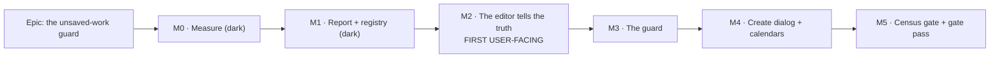

# Implementation Plan: The unsaved-work navigation guard

- **Feature spec:** [`./feature-spec.md`](./feature-spec.md) — **not yet approved**
- **Status:** Draft — awaiting approval
- **Owner:** —

> Evidence convention: every claim below that decides something carries the file, line or command
> that established it, or is marked **UNVERIFIED** with the task that measures it. Claims marked V1–V19
> are the spec's §0 table.

## Breakdown

### Epic

**The unsaved-work guard** — a planner's draft survives a navigation they did not connect to the
form, and the product has one answer to "is there unsaved work?" rather than two. Roadmap theme:
`docs/BACKLOG.md`'s top entry, the half ADR-0099 did not close.

---

## Milestone 0 — Measure before designing further

**Outcome:** three unknowns are settled with numbers or file citations, and any spec claim they
contradict is corrected **in the spec** before code is written.
**Ships dark:** nothing reaches a user. M0 produces a probe harness under
`apps/web/e2e-unsaved-work/probe/` and edits to the spec — no product code at all.
**Journey:** n/a (nothing user-facing). The probe _is_ a Playwright run, and it is the first thing
that drives the real router.

> **Why this milestone exists.** ADR-0090 and ADR-0091 were each drafted without running anything and
> each ended with falsified predictions; ADR-0097 Landing C and ADR-0099 M3 were both withdrawn or
> re-scoped by their own first measurement. The spec above carries exactly one unverified
> decision-bearing claim, and this milestone kills it rather than shipping around it.

---

#### Feature: The three measurements

> **Description:** establish, in a real browser against this app's real router, what the library
> actually does on the three paths the design rests on.
> **Complexity:** M
> **Dependencies:** none
> **Risks:** a measurement contradicts the design → that is the milestone succeeding, and M1's shape
> changes before anything is built.
> **Testing requirements:** the probe is not a permanent suite; it is deleted or promoted in M3. Its
> output is written into the spec.

##### Task M0-T1 — Does a `beforeLoad` redirect reach the blocker?

- **Description:** The one open claim in the spec (§0, closing note). The only `ignoreBlocker: true`
  found in the installed router is `Transitioner.js:44-48`; the redirect path was **not** traced.
  Measure it: register a blocker that logs and always returns `false`, force the `_authed` guard's
  redirect (`app/router.tsx:135-141`) by clearing the session, and record whether `blockerFn` was
  called.
- **Complexity:** S
- **Dependencies:** none
- **Risks:** the answer is "yes, it is blockable" → D5's allow-list is load-bearing rather than
  belt-and-braces, and M3-T2 must land it in the same commit as the blocker, never after.
- **Testing:** the probe records the call, not the outcome — "the redirect happened" is compatible
  with both answers and would prove nothing.
- **Development steps:**
  1. Probe route + a blocker that records `blockerFn` invocations to `window.__probe`.
  2. Drive: sign in, open a plan, expire the session (delete the cookie), navigate.
  3. Repeat for the sign-out path (`account-chip.tsx:172-179`), which is a plain `navigate()` and
     is expected to block — establishing that D5 is needed for at least one of the two.
  4. Write the answer into the spec's §0 table as V20, with the command.

##### Task M0-T2 — Does `enableBeforeUnload`'s function form actually gate the prompt?

- **Description:** V11 is read from source (`useBlocker.d.ts:35`, `@tanstack/history` `index.js:247-257`)
  and is the single most consequential claim in the design — get it wrong and the app prompts on
  every reload forever. Prove it in Chromium: register a blocker whose function returns `false`,
  reload, assert no dialog; flip to `true`, reload, assert the dialog.
- **Complexity:** S
- **Dependencies:** none
- **Risks:** Playwright's default dialog handling auto-dismisses; the probe must install an explicit
  `page.on('dialog')` **before** the reload or it will report "no prompt" for both branches — a
  green run that measures the harness. Assert the handler fired, never the absence of a hang.
- **Testing:** both branches, in one run, in that order.
- **Development steps:**
  1. Probe page with a toggle.
  2. `page.on('dialog', …)` recording; reload in each state.
  3. Record which Chromium version produced the result — this is a browser behaviour, not ours.

##### Task M0-T3 — Enumerate the real dirty-form inventory

- **Description:** The spec's D8 list was derived by `Grep "useForm[<(]"` over `apps/web/src/**/*.tsx`
  (32 matches, of which 10 are test harnesses) plus a read of `CalendarFormDialog.tsx:152-156` for
  the non-RHF case. **Re-derive it as a script**, because a grep for `useForm` cannot see state held
  outside RHF and the one surface that matters most (V7) is exactly that case.
- **Complexity:** S
- **Dependencies:** none
- **Risks:** the list grows → D8's boundary needs re-stating, and Q1's answer changes. Better now
  than in M4.
- **Testing:** the script's output is pasted into the spec; the count is the input to M5's census
  gate.
- **Development steps:**
  1. Script: every `Dialog` consumer; for each, whether it holds a `useForm`, a `useFieldArray`, or
     a `useState` seeded on open.
  2. Cross-check by hand against the D8 table; record every disagreement rather than reconciling
     silently.
  3. Correct §4.5 D8 in place.

##### Task M0-T4 — Register the dependency claims

- **Description:** V10–V14 are claims about `@tanstack/react-router@1.170.27` and
  `@tanstack/history@1.162.1` internals — exactly the ADR-0076 Class 2 shape, and the whole design
  rests on them. Add each to `scripts/dependency-claims.json` with package, path, line range and
  anchor, so `pnpm check:claims` fails on a bump of either package.
- **Complexity:** S
- **Dependencies:** M0-T1, M0-T2 (so the register carries what was _measured_, not only what was read)
- **Risks:** `docs/TECH_DEBT.md` **#181** records that a `ref` is `basename:lines` and carries no
  version, so a coinciding line in a different version passes. Do not treat a green
  `check:claims` as proof these are re-read; the anchors must be distinctive strings.
- **Testing:** `pnpm check:claims` green; **verified red first** by corrupting one anchor.
- **Development steps:**
  1. Add five entries with anchors chosen for distinctiveness (`enableBeforeUnload`,
     `shouldHaveBeforeUnload`, `win.history.go(1)`, `addEventListener(beforeUnloadEvent`).
  2. Verify red, then green.
  3. Note #181's blind spot in the entry comments.

---

## Milestone 1 — The report and the registry

**Outcome:** one typed answer to "is there unsaved work?", and a place to put it.
**Ships dark:** deliberately. Nothing registers and nothing blocks; there is no control to press and
no behaviour change. The milestone that surfaces it is M2.
**Journey:** none — and that is the ADR-0081 declaration, not an omission.

---

#### Feature: `UnsavedWorkReport` and the registry

> **Description:** the pure model, the provider, and the registration hook.
> **Complexity:** M
> **Dependencies:** M0 (its measurements may change the shape)
> **Risks:** building a mechanism with no registrant is `docs/TECH_DEBT.md` #156's exact shape (the
> drawer subject) → mitigated by M2 landing the first registrant immediately after, in the same PR
> series, and by M5's census gate making a registrant-less mechanism a failing test.
> **Testing requirements:** unit only. The derivations are pure and the registry is a map.

##### Task M1-T1 — The pure report model

- **Description:** `lib/unsaved-work/report.ts` — `UnsavedScope`, `UnsavedWorkReport`, and the pure
  functions over them: `hasUnsavedWork(reports)`, `unsavableScopes(reports)`,
  `describeUnsavedWork(reports)` returning the sentence the dialog and the in-editor confirmation
  both use.
- **Complexity:** S
- **Dependencies:** none
- **Risks:** the description function drifting from the editor's existing wording → M2-T3 replaces
  the editor's copy with a call to this, so there is one string builder.
- **Testing:** unit — one scope / two scopes / two surfaces (E1) / all-unsavable (US-5) / mixed
  savable, and the singular/plural agreement the current copy already gets right
  (`ActivityEditorDialog.tsx:857-859`).
- **Development steps:**
  1. Types + derivations, no React.
  2. Tests including the exact strings the editor prints today, so M2-T3 is provably a no-op for the
     three scopes that already worked.

##### Task M1-T2 — The provider and the hook

- **Description:** `components/layout/unsaved-work/unsaved-work-provider.tsx`. Registry in a
  `useRef<Map>` for the blocker to read live, plus a subscription (`useSyncExternalStore`) so a
  consumer that needs to _render_ from it re-renders. `useRegisterUnsavedWork(key, report | null)`
  registers on mount, updates on change, deregisters on unmount.
- **Complexity:** M
- **Dependencies:** M1-T1
- **Risks:**
  - **Deregistration by identity, not by a stale key** — ADR-0099 M4 records two weaker rules for
    clearing the drawer outlet, each of which broke the case the other fixed, with the correct one
    found by the fourth unit case rather than by reading. Same hazard: a registrant that remounts
    under the same key must not have its successor's entry deleted by its predecessor's cleanup.
  - Reading a ref in a render is a lint violation and a correctness hazard → the ref is read only
    inside the blocker callback; rendering goes through the subscription.
- **Testing:** unit — register/update/deregister; two registrants; a remount under the same key
  (the identity hazard, verified red against the naive `delete(key)` cleanup); a registrant whose
  report getter throws (must be treated as dirty, spec §2 error table).
- **Development steps:**
  1. Provider with ref + subscribers set.
  2. Hook with a cleanup that removes **its own** entry.
  3. Tests, with the remount case written first and verified red.

##### Task M1-T3 — Mount it, dark

- **Description:** wrap `routes/authed-layout.tsx`'s children. No guard yet.
- **Complexity:** S
- **Dependencies:** M1-T2
- **Risks:** a context provider above `<Outlet/>` re-rendering the whole shell on every registry
  change → the subscription is scoped so the _provider_ never re-renders; only subscribers do.
- **Testing:** the existing `app-shell` suites must pass unchanged — the before/after oracle
  (ADR-0078's barrel-preserving argument applied to a provider).
- **Development steps:** mount; run `apps/web` unit suite; assert no snapshot or render-count change.

---

## Milestone 2 — The editor tells the truth about its own contents

**Outcome:** the activity editor's discard confirmation names **all six** of its forms, so a dirty
Progress panel is no longer discarded silently. Closes `docs/TECH_DEBT.md` **#63**'s second half.
**Entry point:** the existing **Close** button, **Escape**, the backdrop and the ✕ on the activity
editor dialog (`ActivityEditorDialog.tsx:831`, `modalShell` at `:912-933`). No new control; the
change is that the confirmation now appears in a case where it previously did not — a dirty
**Reported progress**, **How value is measured** or **Weighted steps** panel with clean definition
scopes.
**Journey:** `apps/web/e2e-unsaved-work/editor-scopes.spec.ts` — open a plan as a **Contributor**
against an API with `PLAN_EDIT_LOCK_ENFORCED=true`, open the editor from the activities row menu,
type a percent complete, press Escape, and assert the confirmation names _Reported progress_.
**This is the first user-facing milestone, so the journey lands here** (ADR-0081 §2), not at the end.

> **Why the permission case is the journey's subject.** The Contributor/pen split
> (`activity-editor-gating.ts:110-113`) is the reason the report is per-scope at all, and it is
> untestable in a unit suite: a mocked fetch has no pen and a jsdom mount has no server to enforce
> one. `playwright.activity-editor.config.ts:58` already sets `PLAN_EDIT_LOCK_ENFORCED` for exactly
> this reason, and its docblock says so.

---

#### Feature: Six forms, one report

> **Complexity:** L
> **Dependencies:** M1
> **Risks:** lifting three panels' `isDirty` to the host re-renders the whole editor on every
> keystroke in a Progress field → the panels already `useWatch` their own values
> (`ActivityProgressPanels.tsx:108`, `:246-247`), so the lift must carry the **boolean only** and be
> memoised; assert the render count does not increase (ADR-0026 D3's invariant, which ADR-0078 S1
> notes has never been asserted).
> **Testing requirements:** unit per panel; component for the confirmation copy; the journey above.

##### Task M2-T1 — Lift the three Progress panels' dirtiness

- **Description:** `ReportedProgressPanel`, `ValueMeasurePanel` and `WeightedStepsPanel` report their
  `isDirty` to the host via one callback prop each. This is precisely what #63 says would close it:
  _"lift the three panels' `isDirty`/`errorCount` to the dialog — a callback prop per panel, or a
  small shared context"_.
- **Complexity:** M
- **Dependencies:** M1-T1
- **Risks:** `WeightedStepsPanel` uses its own `useForm` + `useFieldArray`
  (`ActivityProgressPanels.tsx:387-397`), not `useScopeForm`, so its `isDirty` semantics differ —
  a `move()` re-keys rows and marks dirty even if the order is restored. Accepted (a false positive
  costs one dialog); recorded rather than fixed.
- **Testing:** unit per panel — dirty on edit, clean after save (each panel already resets on
  success: `:117`, `:269`, `:432`), clean on reseed.
- **Development steps:**
  1. Add the callback prop to each panel; call it from an effect keyed on `isDirty`.
  2. Host collects into the report.
  3. Tests, each verified red against today's component.

##### Task M2-T2 — Build the six-scope report in the editor

- **Description:** `ActivityEditor` composes one `UnsavedWorkReport` from `general`, `scheduling`,
  `cost` (`:297-304`) and the three lifted panels, each carrying `savable` from its own gate
  (`gating.general.writable`, `gating.progress.writable`, `gating.steps.writable`).
- **Complexity:** M
- **Dependencies:** M2-T1
- **Risks:** the `cost` scope is already conditioned on `gating.cost.readable` (`:350`) — a role that
  cannot read cost has an invisible tab, and its scope must stay out of the report or the dialog
  names a tab the reader cannot see. Preserve that condition exactly; it is the one piece of
  existing logic in `dirtyScopeNames` that is not a plain `isDirty`.
- **Testing:** unit over the gating matrix — Planner-with-pen, Planner-without-pen (US-5),
  Contributor, Viewer (must produce an **empty** report, V8), cost-unreadable.
- **Development steps:** compose; test the matrix; assert the Viewer row is empty.

##### Task M2-T3 — Re-point the existing confirmation at the report

- **Description:** `dirtyScopeNames` (`:347-351`) derives from the report; the description string
  comes from `describeUnsavedWork` (M1-T1). `requestClose` (`:374-380`) and the subject guard
  (`:364-371`) both read it, unchanged in shape.
- **Complexity:** S
- **Dependencies:** M2-T2
- **Risks:** the subject-change guard's four cases (`ActivityEditor.subject-guard.test.tsx`) must
  pass **unchanged** — that suite is the before/after oracle (the ADR-0062 bar). If any assertion
  needs editing, the refactor changed behaviour and that must be deliberate.
  **Note:** that guard's own reachability is doubtful post-ADR-0101 — `onSubjectHeld` is wired from
  `activity-crud-dialogs.tsx:195-197`, but the editor is modal, so its subject cannot change while
  open (`ActivityEditorDialog.tsx:226-230` says exactly this). Do **not** delete it here; record it
  against `docs/TECH_DEBT.md` #156's neighbourhood if it proves dead.
- **Testing:** every existing `ActivityEditorDialog.*.test.tsx` suite passes unchanged; one new case
  per Progress scope, each verified red.
- **Development steps:** replace; run the eleven suites; add the three cases.

##### Task M2-T4 — Register the editor

- **Description:** `useRegisterUnsavedWork('activity-editor', report)` when open, `null` when closed.
- **Complexity:** S
- **Dependencies:** M2-T2, M1-T2
- **Risks:** registering while closed would make a closed editor's stale forms block navigation →
  the report is `null` unless `open`.
- **Testing:** unit — closed editor registers nothing.

##### Task M2-T5 — The journey, and its config

- **Description:** `apps/web/playwright.unsaved-work.config.ts` + `apps/web/e2e-unsaved-work/`, one
  spec, one CI step, `scripts/e2e-local.sh` target `web:unsaved-work`.
- **Complexity:** M
- **Dependencies:** M2-T4
- **Risks:**
  - `docs/TECH_DEBT.md` **#133**'s rule: locate a toolbar control by `[data-toolbar-item]`, never by
    its copy.
  - ADR-0099 records `reuseExistingServer` silently adopting a dev server from a _different_ harness,
    producing three consecutive false diagnoses. `scripts/e2e-local.sh` now refuses to run while
    anything answers on 3000 or 5173 — do not work around it.
  - The base journey must also be run: `docs/TESTING.md`'s post-ADR-0096 rule is that changing a
    screen means running the base suite, and M2 changes the editor.
- **Testing:** this task _is_ the test. It must fail against the pre-M2 build — run it there first.
- **Development steps:**
  1. Config modelled on `playwright.activity-editor.config.ts` (pen enforced, Chromium, serial).
  2. One spec: Contributor, dirty progress, Escape, confirmation names _Reported progress_.
  3. CI step; `docs/TESTING.md` row.
  4. Run against `HEAD~` and confirm red.

---

## Milestone 3 — The guard

**Outcome:** an in-app navigation, browser Back/Forward, a reload and a tab close all ask before
discarding a registered draft.
**Entry point:** no new button — the entry point is **an existing gesture gaining a response**:
activating any Project Explorer or nav link, pressing browser Back/Forward, or `Ctrl+R`, while the
activity editor holds unsaved work. The **new visible control** is the `Leave without saving?`
alert dialog's two buttons, **Keep editing** and **Discard and leave**.
**Journey:** extended in `apps/web/e2e-unsaved-work/` — five actions blocked with work outstanding,
the same five silent when clean, and sign-out never blocked.

---

#### Feature: One blocker, one dialog

> **Complexity:** L
> **Dependencies:** M0 (its two measurements), M1, M2
> **Risks:** the `enableBeforeUnload` trap (V11) → M0-T2 measured it and M3-T1's test asserts both
> branches.
> **Testing requirements:** unit for the allow-list and the block decision; component for the dialog
> and its focus; **journey for everything else**, because V10/V11/V12 are browser behaviours.

##### Task M3-T1 — `NavigationGuard`

- **Description:** `components/layout/unsaved-work/navigation-guard.tsx`. One `useBlocker` with
  `withResolver: true`, a **stable** `shouldBlockFn` and a **stable** `enableBeforeUnload` function,
  both reading the registry ref (D3/V13). One `ConfirmDialog` driven by `resolver.status`.
- **Complexity:** L
- **Dependencies:** M1-T2
- **Risks:**
  - Inline callbacks re-register the blocker every render (V13, `useBlocker.js:101-108`) → both are
    `useCallback` with empty deps over a ref. **Assert it:** a test that types into a form and counts
    `history.block` calls.
  - E6 re-entrancy: a second pop while blocked must return `true` immediately rather than orphaning
    the first promise.
  - E3/E4: the dialog must close and proceed if the work disappears while it is open.
- **Testing:** unit with a memory history — blocked/allowed, allow-list, re-entrancy, E3, E4, and the
  registration-count assertion.
- **Development steps:**
  1. Stable callbacks over the ref.
  2. Resolver → dialog.
  3. E3/E4 as an effect that calls `proceed()` when the report empties while blocked.
  4. Registration-count test, verified red against an inline-arrow version.

##### Task M3-T2 — The allow-list

- **Description:** never block a navigation whose target is `/sign-in` (V16 — sign-out at
  `account-chip.tsx:172-179`, session expiry at `app/router.tsx:135-141`), nor one whose `fullPath`
  equals the current one (E5).
- **Complexity:** S
- **Dependencies:** M3-T1; informed by M0-T1
- **Risks:** an allow-list keyed on a **string literal** rots when a route moves → key on
  `next.routeId` where possible, and pin it with a structural test that the id exists in the route
  tree. A silently-never-matching allow-list is the ADR-0099 "axe scan matching nothing" shape.
- **Testing:** unit per entry; **journey**: sign out with unsaved work and assert `/sign-in` is
  reached with no dialog.
- **Development steps:** list; structural test that each id resolves; journey case.

##### Task M3-T3 — Copy, focus and announcement

- **Description:** the dialog's strings; focus return on **Keep editing**; the announcement; the
  Escape interaction with the shell's ladder (D7/V18).
- **Complexity:** M
- **Dependencies:** M3-T1
- **Risks:** **This is the highest-risk task in the epic and the register says why.** Focus dropping
  to `<body>` at a dialog's close has shipped three times at this exact seam — ADR-0063 M6
  (`visibility: hidden` removed Dissolve from the tab order), ADR-0092 (Cancel/close/error paths),
  ADR-0099 M10 (a native `<dialog>` restoring focus from inside the effect that closes it, to an
  element that had unmounted). Assert focus explicitly in a browser, not in jsdom.
- **Testing:**
  - component: Escape → reset, and `event.defaultPrevented` such that the shell's rung
    (`app-shell.tsx:368`) does not collapse the drawer;
  - journey: after **Keep editing**, `document.activeElement` is the link that was activated —
    asserted by element identity, not by role+name (ADR-0099 records an assertion scoped to the
    document passing on the prose alone);
  - journey: both outcomes are announced.
- **Development steps:**
  1. Strings from `describeUnsavedWork`.
  2. Focus-return test, verified red by removing the restore.
  3. Drawer-not-collapsed test.

##### Task M3-T4 — Mount the guard, and the five-action journey

- **Description:** render `<NavigationGuard/>` inside the provider; extend the journey with the five
  blocked actions, the five silent ones, and E7's history-stack assertion.
- **Complexity:** M
- **Dependencies:** M3-T1..T3
- **Risks:**
  - `page.on('dialog')` must be installed before any unload action or the run hangs or silently
    reports nothing (E10, and M0-T2's finding).
  - The clean-case half is the one that matters most and is the one most likely to be written as a
    weak assertion. Assert **no dialog handler fired** and the navigation completed, not merely that
    the test did not time out.
- **Testing:** ten cases, plus E7.
- **Development steps:** mount; write the dirty five; write the clean five; run against `HEAD~` for
  the dirty five and confirm red.

---

## Milestone 4 — The other three registrants

**Outcome:** creating an activity, and authoring a calendar's shift pattern or exceptions, are
protected — including the in-dialog close path the create dialog has never had (V6).
**Entry point:** the **Cancel**, **Escape**, backdrop and ✕ on **New activity**
(`ActivityCreateDialog.tsx:463-465`, `:593`) gain a confirmation they have never had; and the same
three navigation channels now fire for the calendar form and exceptions editor.
**Journey:** two cases added — fill the create dialog, press Escape, assert the confirmation; and
edit a shift window, press browser Back, assert the guard.

---

#### Feature: Create dialog

> **Complexity:** M · **Dependencies:** M3 · **Risks:** below · **Testing:** unit + journey

##### Task M4-T1 — Register `ActivityCreateDialog`, and give it a discard confirmation

- **Description:** build a report from its four scope forms and register it; **and** add the
  `confirmBeforeClose` + confirmation it has never had (V3/V6). The two halves ship together because
  shipping only the navigation half would leave Escape — the commonest way to lose this form —
  unguarded, which is the "one control and not its neighbour" shape.
- **Complexity:** M
- **Dependencies:** M3
- **Risks:** the create dialog's submit already focuses one ordered first problem across four forms
  (ADR-0089); adding a confirmation must not disturb that. Its suites are the oracle.
- **Testing:** the ten `ActivityCreateDialog.*.test.tsx` suites pass unchanged; new cases for the
  confirmation, verified red.

#### Feature: Calendars

> **Complexity:** M · **Dependencies:** M3 · **Risks:** below · **Testing:** unit + journey

##### Task M4-T2 — Register `CalendarFormDialog`

- **Description:** its RHF form covers name/description/hoursPerDay; the **shift week is
  `useState`** (V7, `CalendarFormDialog.tsx:152-156`), so its dirtiness is a comparison against the
  week seeded at open (`:162-177` already tracks `seededFor` and the seeded value — reuse it rather
  than snapshotting a second time).
- **Complexity:** M
- **Dependencies:** M3
- **Risks:** a naive deep-equal over `WeekRows` will report dirty for whitespace the planner did not
  type → compare the **parsed** shifts where the week parses (`weekRowsToShifts`, `:182`), and fall
  back to raw comparison where it does not, since an unparseable week is by definition mid-edit.
  Get this wrong in the false-positive direction and every calendar edit blocks; get it wrong the
  other way and the epic's most laborious draft is unprotected.
- **Testing:** unit — clean on open, dirty on a typed window, clean after save, dirty when the week
  is mid-typed (`8:`).

##### Task M4-T3 — Register `CalendarExceptionsEditor`

- **Description:** same shape, same `WindowListEditor` (ADR-0067).
- **Complexity:** S
- **Dependencies:** M4-T2 (reuse the comparison)

##### Task M4-T4 — Journey cases

- **Complexity:** S · **Dependencies:** M4-T1..T3
- **Risks:** the calendar library is a different route and a different config's flag set; check
  whether the existing `playwright.calendar-shifts.config.ts` env is needed here rather than
  assuming the base flags reach it.

---

## Milestone 5 — The census gate and the specialist gate pass

**Outcome:** a new form-bearing dialog is classified once, one way; and the combined diff has been
through the reviews this repository's record says catch what a human read does not.
**Entry point:** none — M5 is a gate and a review pass, and says so.
**Journey:** the M2–M4 journey is re-run as a whole against the final code.

---

#### Feature: The classification gate (D9 — subject to Q3)

##### Task M5-T1 — `unsaved-work-census.structural.test.ts`

- **Description:** enumerate every `Dialog` consumer holding form state (M0-T3's script, promoted)
  and assert each appears in exactly one of `REGISTERED` / `UNGUARDED` — the latter carrying a
  reason string, never a bare entry.
- **Complexity:** M
- **Dependencies:** M4
- **Risks:**
  - **A census with no positive assertion passes when everything vanishes.** ADR-0093's duplication
    gate needed a second assertion for exactly this, and ADR-0081 records a milestone whose tests
    validated dead code. So the gate carries a pinned positive case: the four registrants are
    asserted **present**, by name.
  - A scan over raw text counts a docblock as a usage — four instances of that in this repository
    (`reset-fills.structural.test.ts`, the sizing ratchet, the weight ratchet, and one more).
    **Strip comments before matching.**
- **Testing:** verified red three ways — add an unclassified dialog; empty `REGISTERED`; put a name
  in both lists.

#### Feature: The gate pass

##### Task M5-T2 — Five specialist reviews over the combined diff

- **Description:** `ux-reviewer` (copy, the two-button asymmetry in US-5, the clean-case silence),
  `accessibility-reviewer` (WCAG 2.4.3 focus at every dialog transition, 4.1.3 announcements,
  `alertdialog` semantics, the Escape ladder), `component-reviewer` (the callback props added to
  three panels, the provider's contract, no one-off styling), `performance-reviewer` (render counts;
  the registration-count assertion), `security-reviewer` (nominally — no new trust boundary, and a
  reviewer confirming that is worth more than this spec asserting it).
- **Complexity:** L
- **Dependencies:** M5-T1
- **Risks:** the register's own record is that **every** epic's gate pass since ADR-0059 has found
  blocking defects that passed a human read, most often "one correct pattern applied to a control
  and not its neighbour". Budget for fixes, and require each to carry a regression test **verified
  red first**.
- **Testing:** every blocking finding gets a test; non-blocking findings go to `docs/TECH_DEBT.md`.

##### Task M5-T3 — Documentation, ADR and release

- **Description:** file the ADR (§4.6; confirm the number is still free — ADR-0079's lesson), close
  `docs/TECH_DEBT.md` #63, raise #183 (route-change focus, spec §4.7), add the `CLAUDE.md` §16 entry,
  add the `docs/TESTING.md` row and the CI step, add a changeset (**minor**, pre-1.0, user-visible).
- **Complexity:** M
- **Dependencies:** M5-T2
- **Risks:** `pnpm prepush` derives ten checks and running its parts by hand is how one gets missed
  (CLAUDE.md §19.8, written after `check:adr-coverage` refused an ADR-filing PR in CI). Run
  `pnpm prepush` **and** `scripts/e2e-local.sh web:unsaved-work` **and** the base journey.

---

## Sequencing & slices

Each milestone leaves `main` releasable and is independently revertible — which is the rollback
contract, since there is no feature flag (spec §3; ADR-0088 D1).

| Slice | Ships                                      | Reversible by                                          |
| ----- | ------------------------------------------ | ------------------------------------------------------ |
| M0    | nothing (probe + spec edits)               | deleting the probe                                     |
| M1    | nothing user-visible (dark)                | one revert; no registrant depends on it                |
| M2    | the editor's confirmation covers six forms | one revert; the editor returns to its three-scope list |
| M3    | the guard                                  | one revert; the registry goes dormant, not broken      |
| M4    | three more registrants                     | per-registrant revert                                  |
| M5    | the gate + the review fixes                | —                                                      |

**The riskiest single ordering decision** is that M3 (the guard) lands after M2 (the report), not
before. A guard on a report that names three of six forms would ship a navigation prompt that
silently ignores a Contributor's progress edit — worse than no guard, because it would look like
coverage.

## Definition of Done (per task)

Each task's PR satisfies the Feature Completion Criteria in [`docs/PROCESS.md`](../../PROCESS.md).
Three are called out because this epic's shape makes them easy to skip:

- **The e2e half of the pre-push gate is not optional.** `scripts/e2e-local.sh web:unsaved-work`
  from M2 onward, plus the **base** journey (`docs/TESTING.md`'s post-ADR-0096 rule: change a screen,
  run the base suite) — M2 changes the activity editor, which the base journey drives.
- **Every regression test is verified red first**, against the specific defect it guards. This epic
  has three tests whose green state is compatible with the wrong behaviour (the clean-case silence,
  the allow-list, the census) and each is named above.
- **No decision-bearing claim without evidence** (ADR-0076 / CLAUDE.md §19.11), including in
  docblocks and commit messages.

## Risks & assumptions (rollup)

| Risk / assumption                                                                                                         | Likelihood     | Impact   | Mitigation                                                                                                        |
| ------------------------------------------------------------------------------------------------------------------------- | -------------- | -------- | ----------------------------------------------------------------------------------------------------------------- |
| `enableBeforeUnload` shipped as `true` rather than a function → a prompt on **every** reload, forever (V11)               | med            | **high** | M0-T2 measures both branches; M3-T4's journey asserts the clean case explicitly                                   |
| A `beforeLoad` redirect is blockable and the allow-list is not in the same commit → a dead session traps the reader (V16) | **UNVERIFIED** | high     | M0-T1 measures it; M3-T2 lands the allow-list with the blocker regardless                                         |
| Focus drops to `<body>` at a dialog transition                                                                            | med            | high     | Three prior instances (ADR-0063 M6, ADR-0092, ADR-0099 M10); M3-T3 asserts focus in a browser by element identity |
| Over-warning (a false-positive dirty check, esp. the calendar week — M4-T2)                                               | med            | high     | Compare parsed shifts; unit case for a mid-typed `8:`; the clean-case journey                                     |
| Under-warning (a surface nobody registered)                                                                               | med            | med      | D8's rule + M5-T1's census with a pinned positive case                                                            |
| The blocker re-registers on every keystroke (V13)                                                                         | med            | low      | Stable callbacks over a ref; a registration-count test verified red                                               |
| M1 ships a mechanism with no registrant — `docs/TECH_DEBT.md` #156's shape                                                | low            | med      | M2 lands the first registrant immediately; M5-T1 makes registrant-less a failing test                             |
| The subject-change guard being re-pointed in M2-T3 turns out to be unreachable post-ADR-0101                              | med            | low      | Do not delete it inside this epic; record it (M2-T3's note)                                                       |
| `check:claims` goes green against the wrong version (`docs/TECH_DEBT.md` #178/#181)                                       | low            | med      | Distinctive anchors (M0-T4); do not read a green `check:claims` as proof of a re-read                             |
| The gate pass finds blocking defects                                                                                      | **high**       | med      | Budget for it; the register says every epic's pass since ADR-0059 has                                             |

---

**Nothing here has been implemented. Awaiting approval before implementation.**
