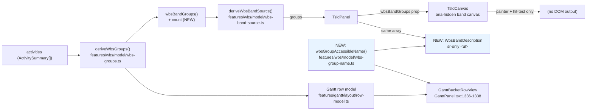
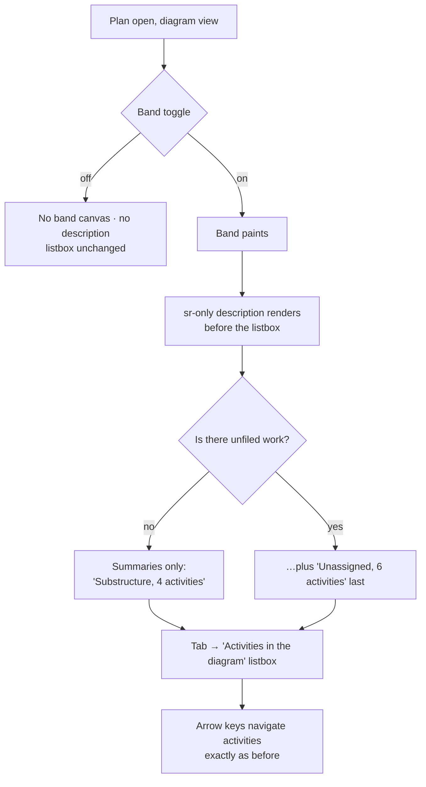

# Feature Spec: The WBS band's accessible equivalent

- **Status:** Draft — awaiting approval
- **Author(s):** feature-analyst (Product Owner / Solution Architect / Technical Lead hats)
- **Date:** 2026-09-01
- **Tracking issue / epic:** `docs/TECH_DEBT.md` **#232** — "The WBS band's derived bucket has no
  accessible name or count"
- **Roadmap link:** none — a defect-class item on a shipped surface (ADR-0063).
- **Related ADR(s):** ADR-0063 (§4, §7 — **amended**, see §4.7), ADR-0026 (D7, D8), ADR-0038,
  ADR-0059, ADR-0058/ADR-0076 (the claim-vs-built failure class). A **new ADR is required** — see
  §4.7.

---

## 0. Why this is a spec and not just a register row

`docs/PROCESS.md` "What a tech-debt row does and does not substitute for" (ADR-0105): a row stands
in for stages 1–2 only while the change **adds no new surface** and does not change a shared
model's or component's public contract. This change does both:

- it adds a **new accessible surface** to the plan workspace (a text equivalent for the band), which
  is a user-facing entry point for one audience even though no pixel moves; and
- it changes a shared model type (`WbsBandGroupInput` gains a member count) consumed by two
  features.

It additionally **corrects a false claim inside an accepted ADR**, and ADRs are immutable
(`CLAUDE.md` §6 — supersede, never edit). So a new ADR is mandatory rather than optional.

---

## 1. Business understanding

### Problem

The TSLD's pinned WBS band (ADR-0063) paints one bar per work-breakdown grouping across the top of
the diagram, and its last bar is the **derived "Unassigned" bucket** — the work in this plan that
has not been filed under any summary. The band canvas is `aria-hidden="true"`
(`apps/web/src/features/tsld/components/TsldCanvas.tsx:2206`), so a screen-reader user reaches it
through a text equivalent or not at all.

**There is no text equivalent. Two places in the repository say there is.**

| Where                                                                 | The claim                                                                              |
| --------------------------------------------------------------------- | -------------------------------------------------------------------------------------- |
| `apps/web/src/features/tsld/components/TsldCanvas.tsx:2198-2202`      | "…its a11y equivalent is the band group in the parallel DOM listbox."                  |
| `docs/adr/0063-pinned-wbs-band-and-the-canvas-band-model.md:123` (§7) | "It carries no activity id, so it **is announced as a group** and cannot be selected". |

**Verified against the code, not taken from the register row** (per `CLAUDE.md` §19.11):

- There is no "band group" anywhere in the DOM. A repository-wide grep for `wbsBandGroups`
  (`rg wbsBandGroups apps/web/src`) returns exactly three runtime consumers, all inside
  `TsldCanvas.tsx`: a ref (`:1398`), the painter (`:1829-1842`) and the hit-test path
  (`:2210-2221`). Nothing renders it.
- The parallel listbox is built from **activities** —
  `apps/web/src/features/tsld/components/TsldPanel.tsx:2912` maps `activities` to `role="option"`
  rows. The bucket has **no activity id** (`WbsBandGroupInput.id` is `string | null`, `null` for the
  bucket — `apps/web/src/features/wbs/model/wbs-groups.ts:163-170, 217-225`) and is not in the
  database at all (`wbs-groups.ts:14-21`), so it **structurally cannot** be an option in that
  listbox.
- For a **real `WBS_SUMMARY`** the claim happens to be true, by accident: a summary is an ordinary
  activity, so it already has a listbox row, and ADR-0063 §4 deliberately keeps it there when the
  band lifts it out of the scene. So the comment is right about half its subject and wrong about the
  half that has no other route — which is why nobody reading it noticed.

The Gantt sibling does the same job properly, and its comment says why:
`apps/web/src/features/gantt/components/GanttPanel.tsx:1336-1338` composes
`` `${row.label}, ${count} activities` `` as the row's accessible **name**, noting that the count
"is part of the accessible name, not a decoration beside it: 'Unassigned' alone does not say whether
the row is worth expanding". That string is also rendered visibly (`GanttPanel.tsx:1389`).

**The net user-facing effect:** a screen-reader user learns there is unfiled work in the Gantt view
of a plan and not in the diagram view of the same plan. The diagram is the surface this product
exists to be.

**Why now.** The defect was found independently by the accessibility and UX reviews of `#71`,
neither of which was asked about it. `#71` shipped the sighted-user remedy (the bucket is now an
unfilled bracket rather than a colour, `docs/specs/wbs-bucket-bracket/`), which makes this the only
audience still relying on a claim that was never built.

### Users

| Role                                                             | What they need here                                                                                                                    |
| ---------------------------------------------------------------- | -------------------------------------------------------------------------------------------------------------------------------------- |
| **Planner** (org role `PLANNER`), screen-reader user             | To learn, from the diagram, that the plan has unfiled work and how much — the same fact the Gantt already gives them.                  |
| **Viewer** / **Contributor** / **Org Admin**, screen-reader user | The same. This is a **read**; nothing here is gated on a role or on the pen.                                                           |
| **External Guest** (ADR-0051 share link)                         | Out of scope, and structurally so — the guest view's `SCHEDULE_READ` scope does not include the WBS band toggle. See §3 "Permissions". |
| Sighted planners                                                 | **Unaffected by design.** No pixel changes; see §2 "Non-goals".                                                                        |

### Primary use cases

1. A screen-reader user turns on `View ▾ ▸ Structure ▸ WBS band` and hears what the band contains,
   including whether there is unfiled work and how much of it.
2. The same user hears nothing misleading: the bucket must not read as something that can be
   selected, because ADR-0063 §7 refuses the null id
   (`TsldCanvas.tsx:2217-2221` — "A bar with no id is the derived bucket … there is nothing to
   select").
3. A maintainer reading `TsldCanvas.tsx` or ADR-0063 is told the truth about what exists.

### User journeys

**Happy path.** Planner opens a plan → the diagram renders → they turn on the WBS band from
`View ▾ ▸ Structure` → the band paints → a text equivalent appears in the accessibility tree
immediately before the diagram's activity listbox, naming each band grouping and its member count,
with "Unassigned, 6 activities" last → they Tab into the listbox and navigate activities exactly as
before.

**Alternate — nothing unfiled.** Everything is filed under a summary; the bucket does not exist
(`wbs-groups.ts:59-60` — "`null` when there is nothing unfiled; an empty bucket is noise, not
information"), so nothing is announced about it. Absence is a fact the reader can rely on.

**Alternate — band off.** No band canvas mounts and no text equivalent exists. The Gantt keeps its
own bucket row; that is unchanged.

**Alternate — flag off** (`VITE_WBS_IMPROVEMENTS=false`, the rollback contract): byte-for-byte
today's surface, including no text equivalent.

### Expected outcomes

- The diagram's band has a real accessible equivalent, for the first time.
- Two false claims in the repository become true statements.
- The Gantt and the diagram compose the bucket's accessible name from **one** function, so the two
  cannot come to disagree about what the plan's unfiled work is called or how much of it there is.

### Success criteria

| #    | Criterion                                                                                                                   | How it is judged                                                                                                                                             |
| ---- | --------------------------------------------------------------------------------------------------------------------------- | ------------------------------------------------------------------------------------------------------------------------------------------------------------ |
| SC-1 | With the band on and unfiled work present, the accessibility tree contains a text node naming the bucket **and** its count. | Unit test on `TsldPanel`; flag-on journey assertion in `e2e-wbs`.                                                                                            |
| SC-2 | The count of AT-reachable **activities** is identical with the band on and off (ADR-0063 §4).                               | The existing assertions still pass unchanged — `TsldPanel.wbs-band.test.tsx:92-99` and `apps/web/e2e-wbs/wbs.spec.ts:127-130`. Nothing about them is edited. |
| SC-3 | Nothing announced implies the bucket is selectable.                                                                         | The equivalent uses plain list semantics — no `role="option"`, no `aria-selected`, no `aria-disabled`, no tab stop. Asserted structurally.                   |
| SC-4 | The bucket's name and count are composed by one function shared with the Gantt.                                             | Structural test importing the composer and asserting both call sites use it.                                                                                 |
| SC-5 | Flag off ⇒ no text equivalent, no other change.                                                                             | The existing flag-off parity suite, extended by one assertion.                                                                                               |
| SC-6 | `TsldCanvas.tsx:2200` and ADR-0063 §7 no longer assert something that does not exist.                                       | Review of the diff; the ADR is amended by a new ADR, not edited.                                                                                             |

### Open questions

Three are **critical** (they change what gets built). Each has a stated default so nothing is
blocked. See §6.

---

## 2. Functional requirements

### Non-goals (stated, because each is a plausible scope creep)

- **No visible change to the band.** The count is not painted onto the canvas by default (CQ-3).
- **No new selection capability.** ADR-0063 §7's refusal stands: the bucket cannot be selected, and
  this change does not make it navigable, focusable or actionable.
- **No change to the parallel listbox's contents or order.** That widget is the only route an AT user
  has to a bar (ADR-0026 D7) and its option list is pinned by an **ordered** equality
  (`TsldPanel.wbs-band.test.tsx:97` — `expect(optionNames()).toEqual(before)`).
- **No API, schema or engine work.** See §3.

### User stories & acceptance criteria

> **US-1** — As a planner using a screen reader, I want the diagram's WBS band to tell me what it
> contains, so that I learn the plan's breakdown from the diagram rather than having to switch to
> the Gantt.
>
> **Acceptance criteria**
>
> - **Given** a plan with at least one grouping drawn in the band **when** the band is on **then**
>   the accessibility tree contains a list, immediately before the diagram's activity listbox, with
>   one entry per grouping the band draws.
> - **Given** the band is off **then** that list is absent entirely (not empty).
> - **Given** `WBS_IMPROVEMENTS_ENABLED` is false, even with the view toggle forced on, **then** the
>   list is absent.

> **US-2** — As a planner using a screen reader, I want to know whether the plan has unfiled work
> and how much, so that I know whether the breakdown is finished.
>
> **Acceptance criteria**
>
> - **Given** unfiled work exists **when** the band is on **then** an entry reads
>   `Unassigned, N activities` (`N activity` when `N === 1`).
> - **Given** nothing is unfiled **then** there is no Unassigned entry at all.
> - **Given** the Gantt's bucket row for the same plan **then** its accessible name and this entry
>   are produced by the same function and read identically.

> **US-3** — As a planner using a screen reader, I want the band's entries not to look operable,
> so that I do not try to select something the product refuses.
>
> **Acceptance criteria**
>
> - **Given** any band entry **then** it exposes no selection state, no disabled state, and is not
>   in the tab order.
> - **Given** the diagram's listbox **then** its option count and order are exactly what they were
>   before this change, band on or off.

> **US-4** — As a maintainer, I want the code and the ADR to describe what exists, so that the next
> reader is not misled the way three reviewers were.
>
> **Acceptance criteria**
>
> - **Given** `TsldCanvas.tsx`'s band comment **then** it names the element that is the equivalent.
> - **Given** ADR-0063 §7 **then** a new ADR records that its "announced as a group" clause was
>   false when written, what shipped instead, and that ADR-0063 is not edited.

### Workflows

1. `TsldPanel` derives the band once (`deriveWbsBandSource`, `TsldPanel.tsx:1024-1034`), producing
   `{ active, groups, height, sceneActivities }`.
2. The same `groups` array feeds **both** the canvas painter (via the `wbsBandGroups` prop) and the
   new text equivalent. One derivation, two renderers — the ADR-0121 / ADR-0065 rule.
3. The text equivalent renders only when the band canvas renders, keyed on the **same expression**
   the canvas mount uses (`wbsBandHeightPx > 0`, `TsldCanvas.tsx:2203`), so the two cannot disagree
   about whether the band is on screen.
4. Each entry's text is composed by the shared name function (§4.4).

### Edge cases

| Case                                                             | Behaviour                                                                                                               | Why                                                                                                                                                                                                                                                                   |
| ---------------------------------------------------------------- | ----------------------------------------------------------------------------------------------------------------------- | --------------------------------------------------------------------------------------------------------------------------------------------------------------------------------------------------------------------------------------------------------------------- |
| Nothing unfiled                                                  | No Unassigned entry.                                                                                                    | `deriveWbsGroups` returns `unassigned: null` (`wbs-groups.ts:59-60, 127`).                                                                                                                                                                                            |
| Exactly one unfiled activity                                     | `Unassigned, 1 activity` — singular.                                                                                    | Matches `GanttPanel.tsx:1338`'s existing ternary.                                                                                                                                                                                                                     |
| No summaries at all, some unfiled work                           | The band draws one bar; the list has one entry.                                                                         | A one-entry list is correct, not noise; the band itself has one bar.                                                                                                                                                                                                  |
| A grouping deeper than the band's cap (`WBS_BAND_MAX_DEPTH = 2`) | **Not listed.** It is not drawn in the band; it is still an ordinary bar in the scene and still a listbox option.       | `render/wbs-band.ts:105-110` + `isWithinBandDepth`. Listing it would claim something the picture does not show.                                                                                                                                                       |
| A grouping with no computed span (all members uncalculated)      | **Not listed.**                                                                                                         | `wbsBandBars` skips it (`render/wbs-band.ts:133`) — no bar is drawn, so there is nothing to describe.                                                                                                                                                                 |
| A grouping scrolled off the viewport                             | **Still listed.**                                                                                                       | Viewport culling is a scroll position, not content. Deriving the list from the culled bars would make the announcement change as the planner pans, which is the one thing a text equivalent must not do. This is the single sharpest design decision here — see §4.3. |
| Band toggle flipped repeatedly                                   | The list appears/disappears with it; the listbox is untouched.                                                          | SC-2.                                                                                                                                                                                                                                                                 |
| An orphan (a `parentId` naming a row not in the plan)            | Counts as unfiled, exactly as the Gantt and the colour lens already treat it.                                           | `wbs-groups.ts:84-94`; `render/lenses.ts:464-467`; `render/a11y.ts:116-118`. One resolution, three readers.                                                                                                                                                           |
| 2,000-activity plan                                              | Unchanged draw cost; the list is at most `WBS_BAND_MAX_DEPTH + 1` rows deep but as many entries as there are groupings. | See §3 Performance.                                                                                                                                                                                                                                                   |

### Permissions

**None.** This is a read of data already on screen, on a client-side view toggle. Mapping to
ADR-0012: the caller already holds `schedule:read` for the organisation — they are looking at the
plan. No permission is checked, added or changed; there is no write, so the ADR-0028 pen is not
consulted (this is not a structural plan write, and nothing about it is).

**Explicitly not the External Guest surface.** The guest view (ADR-0051 F-M4) renders its own
read-only host; the `View ▾ ▸ Structure` registry is not part of `SCHEDULE_READ`. Nothing in this
change reaches it. _(Evidence: the toggle is read from `useTsldCanvasUiState` in the authenticated
workspace; the guest route mounts `TsldPanel` without that toolbar — the same mounting difference
ADR-0102 recorded when it found the guest view outside `CanvasSurfaceProvider`.)_ The guest view
inheriting the equivalent later is a strict improvement and is **not** relied on here.

### Validation rules

None — there is no input. The one derived value is a count, which is `memberIds.length` over a
`readonly string[]` and cannot be negative or fractional.

### Error scenarios

| Scenario                                                                      | Detection                                                                                                            | User-facing result                                      | Status |
| ----------------------------------------------------------------------------- | -------------------------------------------------------------------------------------------------------------------- | ------------------------------------------------------- | ------ |
| Activities not yet loaded / plan not scheduled                                | `TsldPanel` already renders "The diagram appears once the schedule has been calculated." (`TsldPanel.tsx:2936-2938`) | No band, no list.                                       | n/a    |
| A cycle in the parent tree (server forbids it, but render code must not hang) | `wbsBandGroups`' `seen` guard (`wbs-groups.ts:190-202`)                                                              | The group lands at the depth reached; the list renders. | n/a    |

There is no network call, no failure mode and no error state to design.

---

## 3. Technical analysis

| Area           | Impact     | Notes                                                                                                                                                                                                                                                                                                                                                       |
| -------------- | ---------- | ----------------------------------------------------------------------------------------------------------------------------------------------------------------------------------------------------------------------------------------------------------------------------------------------------------------------------------------------------------- |
| Frontend       | **medium** | `apps/web` only. One new sr-only element in `TsldPanel`; one field added to a shared model type; one composer extracted from `GanttPanel`.                                                                                                                                                                                                                  |
| Backend        | **none**   | No module, service or endpoint touched.                                                                                                                                                                                                                                                                                                                     |
| Database       | **none**   | No model, column, index, constraint or migration. **`database-architect` is therefore not engaged, and that is a stated conclusion rather than an omission** (`CLAUDE.md` §19.3 — the agent is unconditional _for schema changes_; there is no schema change here, confirmed against the planned diff, which is entirely under `apps/web/src` and `docs/`). |
| API            | **none**   | No route, DTO, status code or OpenAPI change.                                                                                                                                                                                                                                                                                                               |
| Security       | **none**   | No new data reaches the client — the counts are derived from activities the caller is already rendering. No authZ decision, no new surface for IDOR, no input.                                                                                                                                                                                              |
| Performance    | **low**    | See below.                                                                                                                                                                                                                                                                                                                                                  |
| Infrastructure | **none**   | No new Playwright config, no new CI step, no env var, no container change. The existing `apps/web/playwright.wbs.config.ts` and its CI step are reused.                                                                                                                                                                                                     |
| Observability  | **none**   | No log, metric, trace or health impact.                                                                                                                                                                                                                                                                                                                     |
| Testing        | **medium** | Unit (2 suites extended, 1 structural test added), flag-off parity (1 assertion), flag-on journey (`e2e-wbs`, extended — no new config). See §5 of the plan.                                                                                                                                                                                                |

**Performance.** The list is derived from `wbsBandGroupRows`, which `TsldPanel` already memoises
(`TsldPanel.tsx:1024-1033`). The added work is one `.filter().map()` over the band's groups —
bounded by the number of `WBS_SUMMARY` rows in the plan plus one, not by activity count — and a
handful of `<li>` nodes. It is **not** on the canvas draw path: nothing here is called from the rAF
loop, so `docs/TECH_DEBT.md` #75's open draw-budget question is untouched. The count itself is
`memberIds.length` on an array `deriveWbsGroups` already built.

**The CPM engine is not imported.** `apps/web` never imports it — the engine lives at
`apps/api/src/modules/schedule/engine/`, and `apps/web/src/features/gantt/engine-import.structural.test.ts`
already exists as the precedent for asserting that in a feature. So the ADR-0034 recalculation
parity gate is untouched **by construction**, in its honest form: there is nothing here to hold
parity for. No `computeSchedule` input changes, because the bucket remains derived and unpersisted
(`wbs-groups.ts:14-21`) — the very reason ADR-0063 gave for deriving it.

**Frontend-only: confirmed.** The planned diff touches `apps/web/src/features/wbs/`,
`apps/web/src/features/tsld/components/`, `apps/web/src/features/gantt/components/`,
`apps/web/e2e-wbs/`, `docs/adr/`, `docs/TECH_DEBT.md`, `.changeset/`. No `apps/api`, no
`apps/api/prisma`, no `packages/*`.

### Dependencies

- **Nothing must land first.** Everything this builds on is shipped: `deriveWbsGroups`
  (`features/wbs/model/wbs-groups.ts`), `deriveWbsBandSource`, the band painter, the Gantt bucket
  row, and `apps/web/playwright.wbs.config.ts`.
- **Affected features:** the Gantt (one call site refactored to the shared composer — behaviour
  identical, its existing suites are the before/after oracle); the TSLD panel.
- **Import direction.** `features/gantt` already imports `@/features/wbs`
  (`gantt/layout/row-model.ts:3`) and `TsldPanel` already imports `@/features/wbs`
  (`TsldPanel.tsx:102`). The composer therefore lives in `features/wbs/model/` and is reachable from
  both without bending anything. It must **not** be called from `features/tsld/render/`, which
  imports no other feature (ADR-0026 D8 — the rule `wbs-band-source.ts:22-31` spells out, and the
  reason `deriveWbsBandSource` lives in `features/wbs` rather than in the render tier). Composition
  happens at the host, exactly as `wbsGroupClauseById` already does (`TsldPanel.tsx:1186-1190`).

---

## 4. Solution design

### 4.1 Architecture overview



The blue nodes are new. Everything else exists.

### 4.2 Data flow

```mermaid
sequenceDiagram
  participant U as Planner (screen reader)
  participant T as View ▾ ▸ Structure
  participant P as TsldPanel
  participant W as features/wbs (pure)
  participant C as Band canvas (aria-hidden)
  participant A as Accessibility tree

  U->>T: toggle "WBS band" on
  T->>P: viewToggles.wbsBand = true
  P->>W: deriveWbsBandSource(activities, {enabled, toggleOn, source})
  W-->>P: { active, groups[ {id,label,depth,start,finish,count} ], height, sceneActivities }
  P->>C: wbsBandGroups=groups, wbsBandHeightPx=height
  C->>C: wbsBandBars(...) → paint (viewport-culled)
  P->>A: render sr-only list from the SAME groups (depth cap + has-span, NOT viewport-culled)
  A-->>U: "Work breakdown bands: Substructure, 4 activities; Unassigned, 6 activities"
  U->>A: Tab
  A-->>U: "Activities in the diagram, listbox" (unchanged — same options, same order)
```

### 4.3 The two options, and the recommendation

The register row names two honest options. Both were evaluated against the code.

#### Option 1 — a visually-hidden list beside the band canvas · **RECOMMENDED**

A non-focusable `sr-only` `<ul>` rendered by `TsldPanel`, immediately before the activity listbox,
one `<li>` per grouping the band draws.

**For.**

1. **It cannot break ADR-0063 §4's invariant, structurally.** The invariant is about the count of
   AT-reachable **activities**; the assertions are `getAllByRole('option')`
   (`TsldPanel.wbs-band.test.tsx:75, 92-99`) and
   `diagramActivityList(page).getByRole('option')` (`e2e-wbs/wbs.spec.ts:127-130`). A plain `<li>`
   is not an option and cannot enter either count. Nothing about those assertions is edited, which
   is the point — an invariant you have to adjust to make room for your change was not an invariant.
2. **The precedent exists twice in this file.** The listbox itself is `sr-only`
   (`TsldPanel.tsx:2893`), and the data-date sentence beside it is an `sr-only` `<p>`
   (`TsldPanel.tsx:2864-2871`). The resource strip — the band's closest sibling, also an
   `aria-hidden` canvas — states its equivalent as "the reused `<table>` in the DOM
   `ResourceStripPanel`" (`TsldCanvas.tsx:2546-2549`). A canvas layer's equivalent living **beside**
   it rather than inside the listbox is the established shape here.
3. **It does not reopen the design ADR-0063 §4 rejected.** That draft was to _move summaries into a
   DOM group of the band's own_ — its failure mode was losing rows, because the group would have had
   to be "built, ordered and de-duplicated against the first" (ADR-0063:90-96). This adds a
   **read-only description that contains no activities at all**. There is no second list of
   activities to keep in step, and no window in which an activity could exist in neither.
4. **Nothing it exposes has selection semantics to misread.** A `<li>` in a plain list has no
   selected state, no disabled state and no operability — which is a stronger answer to ADR-0063 §7
   than `role="option"` + `aria-disabled` would be. `aria-disabled` says "this could be operable and
   currently is not"; the bucket is _never_ operable, and saying so by having nothing to say is
   honest.
5. It describes the whole band, which is what the picture shows, rather than one bar of it.

**Against, stated.** It is a second thing derived from the band's groups, so it _could_ drift from
the painter. Mitigated by deriving both from the same array in the same component, and by a
structural test that the list's membership predicate equals the painter's minus the viewport cull
(§4.5, T-3).

#### Option 2 — extend the parallel listbox with a non-selectable group

Wrap the bucket's members in a `role="group"` inside the existing listbox, labelled
`Unassigned, N activities`.

**Against — four reasons, in descending weight.**

1. **It would reorder the listbox.** ARIA requires a group's options to be its children, and the
   bucket's members are not contiguous: `TsldPanel.tsx:2912` renders `activities` in plan order.
   Grouping them means reordering the one widget an AT user navigates the diagram with — and
   `TsldPanel.wbs-band.test.tsx:97` asserts **ordered** equality of the option names across the
   toggle, deliberately, so "a swap would fail as loudly as a drop". Option 2 requires weakening
   that assertion. That is disqualifying on its own.
2. **It puts a non-selectable thing inside a selection widget.** A group header in a listbox reads
   as structure the user is inside, and every sibling of it _is_ selectable. ADR-0063 §7's
   requirement — that nothing announced implies the bucket can be selected — is met better by
   putting it outside the widget entirely.
3. **It couples the listbox's structure to a view toggle.** The band is a `View ▾` switch; the
   listbox must be invariant across it. A group that appears and disappears inside that widget as
   the toggle flips is exactly the fragile shape ADR-0063 §4 refused.
4. It cannot describe the band's **real summaries**, which are also band rows, without either
   duplicating their listbox options or moving them — i.e. the rejected draft again.

**The empty-group variant** (a labelled `role="group"` with no options in it) avoids reordering and
is rejected separately: it is semantically false, and AT support for an empty group is inconsistent
— an equivalent whose announcement depends on the screen reader is not an equivalent.

**Recommendation: Option 1.**

### 4.4 The shared name composition — yes, share it

The brief asks whether the name/count composition can be shared rather than written twice, and to
say so either way. **It can, and it should.**

- The **count source is already shared**: the Gantt's `count` is `bucket.memberIds.length` from
  `deriveWbsGroups` (`gantt/layout/row-model.ts:244`).
- The **string composition is not**: it is an inline template literal at
  `GanttPanel.tsx:1338`, including the singular/plural ternary.

So extract exactly that expression into `features/wbs/model/wbs-group-name.ts`:

```
wbsGroupAccessibleName({ label, count }): string
```

and call it from both `GanttBucketRowView` and the new band description. This is the ADR-0065
`routeOrthogonal` argument and the ADR-0062 extraction argument: two implementations would drift,
and **the drift would be invisible** — each surface reads correctly on its own, and only somebody
who opened the same plan in both views with a screen reader would ever hear one say "6 activities"
and the other "6 items". This repository records that failure repeatedly; it is not a hypothetical.

The extraction is a **pure move**: the Gantt's existing suites assert on the composed string and are
the before/after oracle, unedited.

**Where it lives.** `features/wbs/model/` — the module whose own docblock calls itself "the **one**
definition of what groups this plan has and what is in each … so the two surfaces cannot come to
disagree" (`wbs-groups.ts:5-8`). Both consumers already import that feature (§3 Dependencies).

### 4.5 The membership rule — what the list contains

The list is derived from the band's **groups**, never from its placed **bars**. A group is listed
when it satisfies both of the painter's _content_ filters and neither of its _viewport_ filters:

| Filter                                                                     | In the list?    | Why                                                                                                                                                               |
| -------------------------------------------------------------------------- | --------------- | ----------------------------------------------------------------------------------------------------------------------------------------------------------------- |
| `isWithinBandDepth(depth)` (`render/wbs-band.ts:31-33, 124`)               | **applied**     | Past the cap the band draws nothing; the activity is still an ordinary bar and still a listbox option.                                                            |
| has a span (`start !== null && finish !== null`, `render/wbs-band.ts:133`) | **applied**     | No bar is drawn. Describing one would state a schedule the engine has not produced — the same reason the painter skips it.                                        |
| viewport cull (`render/wbs-band.ts:138`)                                   | **NOT applied** | Culling is a scroll position. A description that changes as the planner pans is worse than none: it would announce work appearing and disappearing from the plan. |

This rule is a named export in `features/wbs` and is pinned by a structural test (T-3) that compares
its output against `wbsBandBars`' output for a viewport wide enough to cull nothing — so the list
and the painter cannot come to disagree about what the band contains, and the one deliberate
divergence is the one the test's own name states.

### 4.6 User flow



### 4.7 Does this need an ADR? — **Yes**

Two of the three reasons are procedural and one is architectural:

1. **ADR-0063 §7 contains a false statement of fact**, and `CLAUDE.md` §6 forbids editing an
   accepted ADR. The only compliant way to correct it is a new ADR that records what was claimed,
   what is true, and what shipped. Leaving it uncorrected while fixing the code is the ADR-0071
   failure — noticing drift and stepping over it leaves the register exactly as wrong as not
   noticing.
2. **ADR-0063 §4's argument is refined.** That section rejected "a DOM group of the band's own" and
   concluded the listbox's activity-derived construction makes the invariant hold **by
   construction**. That conclusion is correct and unchanged for _activities_; what this ADR adds is
   that the band's _groupings_ are a different subject, needing their own equivalent, and that such
   an equivalent is safe precisely because it contains no activities. Both sections are amended, not
   superseded.
3. **ADR-0026 D7 gains a qualification.** "The parallel focusable DOM layer is the only route an AT
   user has to a bar" remains true — and is now stated in the form the code obeys: it is the only
   route to a **bar**, and a canvas layer that draws something which is not a bar needs its own
   equivalent, non-focusable, outside that widget.

**Both ADR-0063 and ADR-0026 stay untouched files.** The new ADR cites them.

**Number.** `0122` is the next free number at the time of writing (highest filed is
`docs/adr/0121-one-derivation-two-renderers-and-a-cap-set-by-height.md`). Per the ADR-0071 lesson,
the number is re-checked at filing time and any collision is recorded rather than routed around.

**Proposed ADR outline** — _"A canvas layer that is not a bar needs its own equivalent"_:

- **Context** — the band is `aria-hidden`; two places claimed an equivalent that never existed; the
  half that was true was true by accident; the Gantt does it properly; the bucket has no id, by an
  earlier decision that is not being reopened.
- **Decision 1** — the band's equivalent is a **non-focusable, visually-hidden list beside the
  canvas**, not a member of the parallel listbox. Options: a listbox group (rejected — reorders the
  one widget an AT user navigates by, and puts a never-operable thing inside a selection widget); an
  empty labelled group (rejected — semantically false, AT-support-dependent); the recommended list.
- **Decision 2** — it is derived from the band's **groups** with the painter's content filters and
  **not** its viewport cull, with the reason (an announcement that changes when you pan).
- **Decision 3** — the bucket's accessible name is composed **once**, in `features/wbs`, and read by
  both surfaces.
- **Decision 4** — ADR-0063 §7's "announced as a group" was false when written; ADR-0063 §4's
  invariant survives structurally because the new element contains no activities and cannot enter
  the option count.
- **Consequences** — one more consumer of the band's groups (mitigated by a structural test);
  a second voice risk for real summaries, accepted with its reason; no engine, API, schema or
  performance impact; the flag-off parity contract extended rather than weakened.

### 4.8 Database changes

**None.** No model, column, index, constraint or relationship. Confirmed against the planned diff:
nothing under `apps/api/prisma/`. `database-architect` is therefore not engaged — recorded as a
conclusion, not an oversight (`CLAUDE.md` §19.3).

### 4.9 API changes

**None.** No endpoint, DTO, status code, envelope or OpenAPI change.

### 4.10 Component changes

| File                                                                                           | Change                                                                                                                                           | Kind                 |
| ---------------------------------------------------------------------------------------------- | ------------------------------------------------------------------------------------------------------------------------------------------------ | -------------------- |
| `apps/web/src/features/wbs/model/wbs-group-name.ts`                                            | **new** — `wbsGroupAccessibleName({ label, count })`, the one composer.                                                                          | new module           |
| `apps/web/src/features/wbs/model/wbs-groups.ts`                                                | `WbsBandGroupInput` gains `count: number` (member count); `wbsBandGroups` populates it from `memberIds.length` for summaries and for the bucket. | shared model type    |
| `apps/web/src/features/wbs/model/wbs-band-rows.ts` (or a named export in `wbs-band-source.ts`) | **new** — the §4.5 membership rule as one predicate.                                                                                             | new module           |
| `apps/web/src/features/wbs/index.ts`                                                           | barrel exports for the two above.                                                                                                                | barrel               |
| `apps/web/src/features/tsld/components/TsldPanel.tsx`                                          | renders the `sr-only` band description before the listbox, gated on the same expression the band canvas mounts on.                               | component (internal) |
| `apps/web/src/features/tsld/components/TsldCanvas.tsx`                                         | comment at `:2198-2202` corrected to name the element that is the equivalent.                                                                    | comment only         |
| `apps/web/src/features/gantt/components/GanttPanel.tsx`                                        | `:1338` calls the shared composer; the surrounding comment is kept, because it records _why_ the count is part of the name.                      | call-site refactor   |

**No design-system component is added or changed.** The element uses the existing `sr-only` utility
— the same class the listbox and the data-date sentence already use. No new token, no one-off
styling, nothing for the colour-literal lint or the contrast matrix to see (there is nothing
painted).

**Markup shape** (final wording subject to CQ-1/CQ-2):

```
<ul class="sr-only" aria-label="Work breakdown bands">
  <li>Substructure, 4 activities</li>
  <li>Unassigned, 6 activities</li>
</ul>
```

Not focusable, no `tabIndex`, no role overrides, not a live region — it is a standing fact about the
picture, and a live region would re-announce it on every pan (the reasoning `TsldPanel.tsx:2860-2862`
already applies to the data-date sentence).

### 4.11 Testing strategy

| #   | Test                                                                                                                                         | Level                                                  | Verified red against                                                   |
| --- | -------------------------------------------------------------------------------------------------------------------------------------------- | ------------------------------------------------------ | ---------------------------------------------------------------------- |
| T-1 | The description exists, names the bucket and its count, and is singular at `N === 1`.                                                        | unit (`TsldPanel.wbs-band.test.tsx`)                   | the current code, which renders nothing.                               |
| T-2 | The listbox's options are unchanged, in count **and order**, across the toggle.                                                              | unit — **the existing assertion, unedited** (`:92-99`) | n/a — it must keep passing; an edit to it is a review-blocking signal. |
| T-3 | The description's membership equals the painter's, minus the viewport cull.                                                                  | structural (`wbs-band-rows.structural.test.ts`)        | a version that reads the culled bars.                                  |
| T-4 | Both surfaces compose the name through `wbsGroupAccessibleName`.                                                                             | structural                                             | a version with the Gantt's literal restored.                           |
| T-5 | The description exposes no `option`/`selected`/`disabled` semantics and is not a tab stop.                                                   | unit                                                   | a version using `role="option"`.                                       |
| T-6 | Flag off ⇒ no description, even with the toggle forced on.                                                                                   | unit (`TsldPanel.wbs-band-off.test.tsx`)               | the flag-on path.                                                      |
| T-7 | With the band on and unfiled work present, the description is in the accessibility tree of the real product; the listbox count is unchanged. | **journey** (`e2e-wbs`)                                | see below.                                                             |

**Does it need a Playwright journey? Yes — and no new config.**

- **Which config:** the existing `apps/web/playwright.wbs.config.ts` (`test:e2e:wbs`, its own CI
  step). It already runs the flag on, the pen enforced, at 1920×1080, on the canvas-first workspace.
  No new config and no new CI step, so ADR-0105's Playwright trigger is not crossed by the journey
  itself.
- **Why it is not optional.** `apps/web/e2e-wbs/wbs.spec.ts` today turns the band on at `:128` at a
  point in the journey where **everything is filed** — the bucket does not exist — and then proves
  the bucket at `:139-152` in the **Gantt**, with the band never turned on again. So the combination
  this change exists to fix (band on **and** unfiled work present) is a state no journey in this
  repository has ever reached. That is precisely the gap that let the false claim survive.
- **What it adds:** after the loose activity is seeded and the plan recalculated, switch back to
  Diagram, turn the band on, and assert (a) the description names `Unassigned, 1 activity`, and
  (b) `diagramActivityList(page).getByRole('option')` still has the same count. It lands in the
  **first user-facing milestone**, not at the end (ADR-0081 §2).

**Reviewers required before done** (`docs/PROCESS.md` Definition of Done): **accessibility-reviewer**
(mandatory — this is an accessibility change), **component-reviewer** (a shared model type and an
extracted composer with two consumers), **ux-reviewer** (the announced wording is copy). ADR-0111 /
`CLAUDE.md` §19.13 does **not** fire: no shared primitive's keyboard contract or focus model
changes, and that is a checked conclusion — the new element takes no key, moves no focus and enters
no tab order.

### 4.12 Implementation approach & alternatives (summary)

**Chosen:** a non-focusable `sr-only` list beside the band canvas, derived from the same groups the
painter uses, with the name composed by one shared function, plus a new ADR correcting the two false
claims.

**Alternatives considered and rejected:** the listbox group (§4.3, four reasons); an empty labelled
group (semantically false); an `aria-label` on the band canvas itself (a canvas with a label and
`aria-hidden` removed becomes an unlabelled image whose contents are still unreachable, and dropping
`aria-hidden` from a canvas that also takes pointer events would put an unnavigable node in the tree);
`role="img"` + `aria-label` on the band (one long sentence, unnavigable, and it grows without bound
with the number of groupings); painting the count on the canvas _instead of_ an equivalent (does
nothing for the audience the row is about — the canvas is `aria-hidden`).

---

## 5. Links

- Implementation plan: [./implementation-plan.md](./implementation-plan.md)
- Register row: `docs/TECH_DEBT.md` #232
- Prior epic: `docs/specs/wbs-improvements/` (ADR-0063)
- Sibling defect, sighted-user half: `docs/specs/wbs-bucket-bracket/` (`#71`, closed 2026-09-01)
- Docs updated by this change: `docs/adr/0122-*.md` (new), `docs/TECH_DEBT.md` (#232 closed),
`CLAUDE.md` §16 (a one-paragraph ADR-0122 entry).
</content>

</invoke>

## Product-owner decisions (2026-09-02)

**CQ-1 — scope: the WHOLE BAND.** One entry per drawn grouping, every phase plus the derived
bucket, not the bucket alone. A screen-reader user gets the shape the band paints rather than only
the odd one out.

**CQ-2 — the count: the WHOLE SUBTREE.** A phase containing three sub-phases of ten activities
announces 30, not 3.

> **The cost quoted with this question was false, and the correction is recorded rather than
> quietly dropped.** It was put as "subtree would disagree with the Gantt unless that changes too".
> Checked afterwards: `GanttActivityRow` (`features/gantt/layout/row-model.ts:38`) has **no `count`
> field**; only `GanttBucketRow` (`:57-63`) carries one, and that row is the Unassigned bucket
> alone. So **no count for a real phase exists anywhere in the product**, and there is nothing for
> the subtree reading to contradict. For the bucket itself the two readings are identical, since an
> unfiled activity has no parent by construction (`wbs-groups.ts:100-109`).
>
> What it does mean: the shared composer takes a count it is **given**, and the two call sites pass
> different derivations — the Gantt bucket passes `memberIds.length` (unchanged), the band passes a
> subtree count (new). That is not drift, because they are counting different subjects; but the
> composer's docblock must say so, or the next reader will "fix" one to match the other.

**CQ-3 — a visible count on the canvas band: NO** (the stated default, taken).
The reasoning is stronger after CQ-2 than it was when the default was written: painting a subtree
count on a 16 px band row would introduce a number that appears nowhere else in the product, on the
surface least able to spare the width. If it is wanted later it is its own measured change.
